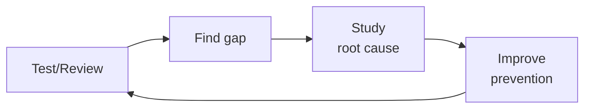

# API Test Suite Builder
> **Portability target:** Spec-level (runs on Claude Code, Copilot, Gemini CLI, Codex, Cursor). No vendor-specific frontmatter fields.

Automatically scan API route definitions and generate comprehensive test suites covering auth, input validation, error codes, pagination, file uploads, and rate limiting. Outputs ready-to-run test files for Vitest+Supertest (Node.js) or Pytest+httpx (Python).

## Route the Request

<!-- QUICK: 30s -- auto-route first, then intent-route -->

### Auto-Route (No User Input Required)
Evaluate these file-system conditions in order. First match wins — jump immediately.

| # | Condition | Action |
|---|-----------|--------|
| A1 | `file_contains("*", "jest\|vitest\|mocha\|playwright\|supertest\|cypress")` AND `file_contains("*", "test\(")|"\.spec\.\|\.test\.\|__tests__"` | This is your skill. Jump to **Core Workflow** — Phase 1 (Route Detection). |
| A2 | `file_contains("*", "OpenAPI\|swagger\.json\|openapi\.json\|openapi\.yaml")` OR `file_exists("openapi.yaml\|openapi.json\|swagger.json")` | Jump to **Core Workflow** — Phase 3 (Batch Generation from Spec). |
| A3 | `file_contains("*", "mutation.*test\|Stryker\|PIT\|mutmut")` OR `file_contains("*", "surviving.*mutant\|mutation.*score")` | Jump to **Error Decoder** — Mutation Testing section. |
| A4 | `file_contains("*", "auth.*middleware\|auth.*guard\|require_auth\|authenticate\|JWT\|OAuth")` AND `file_contains("*", "role\|permission\|RBAC\|authorize")` | Jump to **Decision Trees** — Auth Test Matrix. |
| A5 | `file_contains("*", "pagination\|limit=\|offset=\|cursor\|page=\|per_page")` OR `file_contains("*", "sort=\|order=\|orderBy")` | Jump to **Production Checklist** — AT6 (Boundary Tests). |
| A6 | `file_contains("*", "Stryker\|mutation\|mutant.*surviv\|kill.*rate")` OR `file_contains("*", "mutation.*testing\|mutation.*coverage")` | Jump to **Core Workflow** — Phase 4 (Mutation Testing). |
| A7 | `file_contains("*", "rate.*limit\|rateLimit\|throttle\|429\|Too Many Requests")` | Jump to **Production Checklist** — AT8 (Rate Limit Tests). |
| A8 | `file_contains("*", "validation\|zod\|joi\|yup\|class-validator\|express-validator")` AND `file_contains("*", "required\|minLength\|maxLength\|pattern\|enum")` | Jump to **Core Workflow** — Phase 2 (Input Validation Matrix). |

### Intent Route (Ask the User)
If no auto-route matched, use this intent tree:

```
Request: "Generate API tests for..."
├── ...a specific endpoint? → Jump to Core Workflow Phase 1 (Route Detection)
├── ...the entire project? → Jump to Core Workflow Phase 3 (Batch Generation)
├── ...auth endpoints only? → Use auth test matrix in Decision Trees
├── ...a legacy API with no tests? → Jump to Error Decoder (Legacy API)
└── Don't know where to start?
    → Run: find your route files first. I'll help you scan.
```

## Ground Rules — Read Before Anything Else

<!-- STANDARD: 3min -->

1. **Error paths first, happy paths second.** 80% of bugs live in error handling, not the golden path. Every endpoint gets auth matrix + input validation matrix before the success case.
2. **Test behavior, not implementation.** Assert what the API returns (status codes, response shape, headers), not how the handler achieves it. Tests survive refactors when they assert outcomes.
3. **No hardcoded test data.** Use factories or fixtures for IDs, tokens, and test entities. Tests that pass against one database instance fail against another.
4. **One describe block per endpoint.** Isolation makes failures instantly diagnosable. No scrolling through a 500-line test file guessing which endpoint broke.
5. **Rate limit tests go last.** They interfere with parallel test execution. Run them in a separate suite or mark them with a `@pytest.mark.slow` equivalent.

## The Expert's Mindset

Master API test suite builders know that tests are not about coverage percentages — they're about **making contract violations impossible to ship.** The best test suite is the one that fails exactly when the API behavior changes in a way that would break consumers.

| Cognitive Bias | Mitigation |
|----------------|------------|
| **Happy-path coverage trap** — 95% test coverage that only tests success responses and misses edge cases | Audit your test suite: what percentage test error responses, auth failures, rate limiting, and malformed inputs? If it's under 30%, you have a coverage illusion. |
| **Mock-everything syndrome** — mocking databases, caches, queues, and external services until the tests test nothing real | Every test suite needs at least one integration test that hits real dependencies. Mocks lie; contracts don't. |
| **Snapshot-creep** — auto-approving snapshot changes without understanding what changed and why | Every snapshot diff must be reviewed by a human who can explain why the output changed. If nobody knows, the test is testing luck. |
| **Flaky-test normalization** — accepting that "those 3 tests always fail on CI, just re-run" | Flaky tests are production bugs in your test infrastructure. Every flake gets 1 hour of investigation before it's quarantined. Zero-tolerance after 3 occurrences. |

### What Masters Know That Others Don't
- **The 5 API contracts that, if broken, cause the most consumer incidents** — these get contract tests with the strictest validation, not just schema checks but semantic assertions (response time, idempotency, ordering)
- **That test data is as important as test logic** — realistic, diverse test data finds more bugs than clever test scenarios with trivial data. Invest in data factories that generate edge cases automatically.
- **When to delete a test** — tests have a half-life. A test written 2 years ago for a feature that's been refactored 4 times is testing historical behavior, not current expectations. Delete tests that don't map to current contracts.

### When to Break Your Own Rules
- **Skip tests for a throwaway prototype that will be rebuilt.** But write the contract test first — it documents the API shape even if the implementation changes.
- **Relax coverage gates for generated code or thin proxies.** 100% coverage on a generated gRPC stub is noise. 100% coverage on hand-written business logic is table stakes.

## Operating at Different Levels

| Level | Scope | You... |
|-------|-------|--------|
| **L1** | Single test/review | Execute defined quality procedures; follow checklists |
| **L2** | Feature quality | Own quality for a feature area; write custom test strategies |
| **L3** | System quality | Design quality strategy for a system; define gates and thresholds; mentor |
| **L4** | Org quality | Define org-wide quality standards; make investment cases for quality tooling |
| **L5** | Industry quality | Create quality methodologies adopted across the industry |

**Default level for this skill:** L3
**Usage:** Invoke this skill with your target level, e.g., "as an L3 api test suite builder, review..."

For full level definitions, see `skills/00-framework/skill-levels/SKILL.md`.

## When to Use

<!-- QUICK: 30s — scan the bullet list to decide if this skill fits -->

- New API added — generate test scaffold before writing implementation (TDD)
- Legacy API with zero test coverage — scan and generate baseline
- API contract review — verify existing tests match current route definitions
- Pre-release regression check — ensure every route has at least smoke tests
- Security audit prep — generate adversarial input tests
- Onboarding new team members — auto-generated tests document expected API behavior

## Decision Trees

<!-- STANDARD: 3min -->

### Test Framework Selection

```
What language is the API written in?
├── TypeScript/JavaScript (Node.js)
│   ├── Next.js App Router? → Vitest + Supertest
│   ├── Express? → Vitest + Supertest
│   └── Other (Hono, Fastify)? → Vitest + built-in test client
├── Python
│   ├── FastAPI? → Pytest + httpx (async)
│   ├── Django REST? → Pytest + Django test client
│   └── Flask? → Pytest + Flask test client
└── Go / Rust / Java?
    → Use the framework's native test runner. Same matrices apply.
```

### Test Depth by Endpoint Criticality

```
How critical is this endpoint?
├── Auth / Payments / PHI access (P0)
│   → Full matrix: auth × 6, validation × 11, error codes, pagination, rate limiting
├── Core CRUD / Business logic (P1)
│   → Standard: auth × 4, validation × 8, error codes
└── Utility / Health check / Metadata (P2)
    → Smoke: auth × 2, happy path, 404 check
```

### Coverage Mode Selection

```
What's the goal?
├── Baseline coverage (legacy API, no tests) → Scan all routes, generate smoke tests for every endpoint
├── TDD (new feature) → Generate test scaffold from spec/OpenAPI, write tests before implementation
├── Audit (existing tests) → Compare route definitions against test files, flag uncovered endpoints
└── Pre-release (regression gate) → Verify every route has at minimum: auth test + happy path + 400/401/404
```

## Core Workflow

<!-- STANDARD: 5min -->

### Phase 1: Route Detection (5 min)

Scan the codebase to extract all API endpoints with their HTTP methods, paths, and auth requirements.

**Next.js App Router:**
```bash
find ./app/api -name "route.ts" | while read f; do
  route=$(echo $f | sed 's|./app||' | sed 's|/route.ts||')
  methods=$(grep -oE "export (async )?function (GET|POST|PUT|PATCH|DELETE)" "$f" | grep -oE "(GET|POST|PUT|PATCH|DELETE)")
  echo "$methods $route"
done
```

**Express:**
```bash
grep -rn "router\.\(get\|post\|put\|delete\|patch\)\|app\.\(get\|post\|put\|delete\|patch\)" src/ --include="*.ts" | grep -oE "(get|post|put|delete|patch)\(['\"][^'\"]*['\"]"
```

**FastAPI:**
```bash
grep -rn "@\(app\|router\)\.\(get\|post\|put\|delete\|patch\)" . --include="*.py" | grep -oE "@(app|router)\.(get|post|put|delete|patch)\(['\"][^'\"]*['\"]"
```

**Django REST:**
```bash
grep -rn "router\.register\|DefaultRouter\|SimpleRouter" . --include="*.py"
```

### Phase 2: Read Route Handlers (10 min)

For each detected route, read the handler to understand:
- Expected request body schema (fields, types, required vs optional)
- Auth requirements (middleware, decorators, token validation)
- Return types and status codes (200, 201, 204, etc.)
- Business rules (ownership checks, role requirements, rate limits)
- File upload expectations (max size, allowed MIME types)

### Phase 3: Generate Test Files (15 min)

Generate one test file per route group with this structure:

```typescript
// tests/api/users.test.ts — Vitest + Supertest
import { describe, it, expect, beforeAll, afterAll } from 'vitest';
import request from 'supertest';
import { createTestApp } from '../helpers/app';
import { createTestUser, getAuthToken } from '../helpers/auth';

describe('POST /api/v1/users', () => {
  let app: Express;
  let adminToken: string;
  let userToken: string;

  beforeAll(async () => {
    app = await createTestApp();
    adminToken = await getAuthToken({ role: 'admin' });
    userToken = await getAuthToken({ role: 'user' });
  });

  // ── Auth Matrix ──────────────────────────────
  it('returns 401 when no Authorization header', async () => {
    const res = await request(app).post('/api/v1/users').send({ name: 'Test' });
    expect(res.status).toBe(401);
  });

  it('returns 401 when token is expired', async () => {
    const res = await request(app)
      .post('/api/v1/users')
      .set('Authorization', `Bearer ${EXPIRED_TOKEN}`)
      .send({ name: 'Test' });
    expect(res.status).toBe(401);
  });

  it('returns 403 when user lacks admin role', async () => {
    const res = await request(app)
      .post('/api/v1/users')
      .set('Authorization', `Bearer ${userToken}`)
      .send({ name: 'Test', email: 'test@example.com' });
    expect(res.status).toBe(403);
  });

  it('returns 401 when token is from deleted user', async () => {
    const res = await request(app)
      .post('/api/v1/users')
      .set('Authorization', `Bearer ${DELETED_USER_TOKEN}`)
      .send({ name: 'Test' });
    expect(res.status).toBe(401);
  });

  // ── Input Validation Matrix ──────────────────
  it('returns 422 when body is empty', async () => {
    const res = await request(app)
      .post('/api/v1/users')
      .set('Authorization', `Bearer ${adminToken}`)
      .send({});
    expect(res.status).toBe(422);
  });

  it('returns 422 when required field "email" is missing', async () => {
    const res = await request(app)
      .post('/api/v1/users')
      .set('Authorization', `Bearer ${adminToken}`)
      .send({ name: 'Test' });
    expect(res.status).toBe(422);
    expect(res.body.errors).toContainEqual(
      expect.objectContaining({ field: 'email' })
    );
  });

  it('returns 422 when email format is invalid', async () => {
    const res = await request(app)
      .post('/api/v1/users')
      .set('Authorization', `Bearer ${adminToken}`)
      .send({ name: 'Test', email: 'not-an-email' });
    expect(res.status).toBe(422);
  });

  it('returns 422 when name exceeds max length', async () => {
    const res = await request(app)
      .post('/api/v1/users')
      .set('Authorization', `Bearer ${adminToken}`)
      .send({ name: 'x'.repeat(256), email: 'test@example.com' });
    expect(res.status).toBe(422);
  });

  it('sanitizes SQL injection in name field', async () => {
    const res = await request(app)
      .post('/api/v1/users')
      .set('Authorization', `Bearer ${adminToken}`)
      .send({ name: "'; DROP TABLE users; --", email: 'test@example.com' });
    expect(res.status).toBe(422); // or 201 if sanitized
  });

  it('sanitizes XSS payload in name field', async () => {
    const res = await request(app)
      .post('/api/v1/users')
      .set('Authorization', `Bearer ${adminToken}`)
      .send({ name: '<script>alert(1)</script>', email: 'test@example.com' });
    expect(res.status).toBe(422);
  });

  // ── Happy Path ───────────────────────────────
  it('returns 201 with user object on valid request', async () => {
    const res = await request(app)
      .post('/api/v1/users')
      .set('Authorization', `Bearer ${adminToken}`)
      .send({ name: 'Jane Doe', email: 'jane@example.com' });
    expect(res.status).toBe(201);
    expect(res.body).toMatchObject({
      id: expect.any(String),
      name: 'Jane Doe',
      email: 'jane@example.com',
    });
    expect(res.body).not.toHaveProperty('password_hash');
  });

  // ── Duplicate Detection ──────────────────────
  it('returns 409 when email already exists', async () => {
    await request(app)
      .post('/api/v1/users')
      .set('Authorization', `Bearer ${adminToken}`)
      .send({ name: 'Existing', email: 'dup@example.com' });

    const res = await request(app)
      .post('/api/v1/users')
      .set('Authorization', `Bearer ${adminToken}`)
      .send({ name: 'Duplicate', email: 'dup@example.com' });
    expect(res.status).toBe(409);
  });
});
```

### Phase 4: Validate and Integrate (5 min)

- Run tests: `npm test -- --coverage` or `pytest --cov`
- Verify all tests pass (or fail for the right reasons in TDD mode)
- Add to CI pipeline: `npm test` gate in GitHub Actions
- Generate coverage baseline for future comparison

## Cross-Skill Coordination

<!-- STANDARD: 3min -->

| Upstream Skill | What to Expect | Communication Trigger |
|---------------|----------------|---------------------|
| `api-designer` | OpenAPI spec, endpoint contracts, request/response schemas | When spec changes — regenerate test matrices |
| `backend-developer` | Route handler implementations, middleware, auth patterns | When new endpoint is added — auto-detect and generate tests |
| `fullstack-developer` | API consumption patterns, real-world usage edge cases | When frontend discovers API edge case — add test case |
| `qa-engineer` | Test strategy, coverage thresholds, test pyramid decisions | When QA defines new quality gates — update test depth matrices |
| `security-reviewer` | Adversarial input patterns, security test scenarios | When new vulnerability class is identified — add to validation matrix |

| Downstream Skill | What to Deliver | Communication Trigger |
|-----------------|-----------------|---------------------|
| `ci-cd-builder` | Test scripts for CI pipeline, coverage thresholds | When new test suite is generated — provide CI integration YAML |
| `code-reviewer` | Test coverage report, uncovered endpoints list | When PR is opened — report test coverage delta |
| `qa-engineer` | Generated test suites, coverage reports, route-to-test mapping | When coverage drops below threshold — escalate |

## Proactive Triggers

<!-- STANDARD: 2min — surface these WITHOUT being asked -->

- **Route without tests** → An endpoint exists in the codebase but has zero test coverage. Flag the file and method. 🔴
- **Test only covers happy path** → An endpoint has auth and validation tests missing. Generate the missing matrices. 🟡
- **Hardcoded test data** → Test uses a literal ID, token, or entity that will break in a different environment. Flag for fixture replacement. 🟡
- **Missing error code coverage** → Endpoint has 200 tests but no 400/401/403/404/409/422 tests. 80% of bugs live here. 🟡
- **Shared mutable state** → Tests modify global state without cleanup. Flag `afterEach`/`afterAll` gaps. 🟡
- **Rate limit tests in main suite** → Rate limit tests that sleep/wait will slow down the entire suite. Move to separate suite. 🟠
- **Outdated test vs route** → Route handler changed (new params, different auth) but tests weren't updated. Flag drift. 🔴
- **Sensitive field leaked in response** → Test asserts success but doesn't verify password_hash, secret, or internal fields are absent. Flag. 🔴

## What Good Looks Like

<!-- STANDARD: 3min -->

Every endpoint has tests covering auth, validation, error codes, and a happy path — generated, not hand-crafted. When a developer adds a new route, CI fails until tests exist. When a spec changes, tests flag the drift before code reaches review. Coverage sits at 85%+ but the real win is that zero critical bugs reach production — because the error paths (the 80% where bugs hide) are tested as thoroughly as the golden path. The test suite runs in under 5 minutes in CI. Rate limit tests are isolated. A new team member can understand every endpoint's expected behavior by reading the test descriptions alone.

## Deliberate Practice



| Level | Practice | Frequency |
|-------|----------|-----------|
| **Novice** | Review your own work from 3 months ago; catalog everything you'd now flag | Monthly |
| **Competent** | Shadow a more senior reviewer; compare their findings to yours; study the delta | Weekly |
| **Expert** | Design a new quality gate; measure false positive/negative rates; tune for 6 months | Quarterly |
| **Master** | Create a training module that teaches others your quality intuition; measure their improvement | Quarterly |

**The One Highest-Leverage Activity:** Keep a "mistakes journal." Every time you miss something, write down: what you missed, why you missed it, and what rule would have caught it.

## Gotchas

- **Test data that's a copy of production** — you test with real user emails, real credit card tokens, real addresses. A test failure logs the request body to CI logs, and now PII is in plaintext in your build pipeline. Test data must be SYNTHETIC: fake names (Faker library), test card numbers ( stripe test cards, not production tokens), fake emails.
- **Snapshot testing API responses** without ignoring dynamic fields — you snapshot a response with `"timestamp": "2024-01-15T10:30:00Z"` and every subsequent test run fails because the timestamp changed. Ignore or stub all fields that change per-request: timestamps, IDs, request IDs, `server` headers.
- **"Test passes locally, fails in CI"** — the test calls `https://api.internal/service-b`, which resolves on your machine (tailscale/vpn) but not in CI (different network). All test dependencies must run in Docker Compose with deterministic ports, or be mocked with wiremock/mslmock.
- **Flaky test: API sometimes returns 200, sometimes 429** — you're sharing rate limit budget with other CI pipelines. Test suites need their own API keys with dedicated rate limits, or rate-limited endpoints must be mocked. A test that passes 80% of the time is noise — it will be ignored.


## Verification

- [ ] Test data: zero PII in test fixtures — verified with `detect-secrets` or grep for common PII patterns
- [ ] Dynamic fields: snapshots ignore timestamps, IDs, request IDs, and other volatile fields
- [ ] CI reproducibility: tests pass 10/10 runs in CI — no network-dependent or timing-dependent tests
- [ ] Coverage: every API endpoint has tests for 200, 400, 401, 403, 404, and 500 (if applicable) responses
- [ ] Performance: test suite runs in < 5 minutes — long-running tests are flagged for optimization or split


## References

Detailed reference material loaded on demand:

- **Anti-Patterns**: See [anti-patterns.md](references/anti-patterns.md)
- **Best Practices**: See [best-practices.md](references/best-practices.md)
- **Calibration — How to Know Your Level**: See [calibration.md](references/calibration.md)
- **Production Checklist**: See [checklist.md](references/checklist.md)
- **Error Decoder**: See [error-decoder.md](references/error-decoder.md)
- **Negative Constraints**: See [negative-constraints.md](references/negative-constraints.md)
- **Scale Depth: Solo → Small → Medium → Enterprise**: See [scale-depth.md](references/scale-depth.md)

