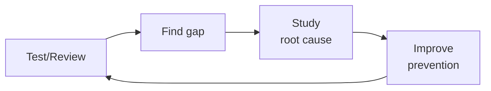

# API Test Suite Builder
> **Portability target:** Spec-level (runs on Claude Code, Copilot, Gemini CLI, Codex, Cursor). No vendor-specific frontmatter fields.

Automatically scan API route definitions and generate comprehensive test suites covering auth, input validation, error codes, pagination, file uploads, and rate limiting. Outputs ready-to-run test files for Vitest+Supertest (Node.js) or Pytest+httpx (Python).

## Route the Request

<!-- QUICK: 30s -- auto-route first, then intent-route -->

### Auto-Route (No User Input Required)
Evaluate these file-system conditions in order. First match wins — jump immediately.

| # | Condition | Action |
|---|-----------|--------|
| A1 | `file_contains("*", "jest\|vitest\|mocha\|playwright\|supertest\|cypress")` AND `file_contains("*", "test\(")|"\.spec\.\|\.test\.\|__tests__"` | This is your skill. Jump to **Core Workflow** — Phase 1 (Route Detection). |
| A2 | `file_contains("*", "OpenAPI\|swagger\.json\|openapi\.json\|openapi\.yaml")` OR `file_exists("openapi.yaml\|openapi.json\|swagger.json")` | Jump to **Core Workflow** — Phase 3 (Batch Generation from Spec). |
| A3 | `file_contains("*", "mutation.*test\|Stryker\|PIT\|mutmut")` OR `file_contains("*", "surviving.*mutant\|mutation.*score")` | Jump to **Error Decoder** — Mutation Testing section. |
| A4 | `file_contains("*", "auth.*middleware\|auth.*guard\|require_auth\|authenticate\|JWT\|OAuth")` AND `file_contains("*", "role\|permission\|RBAC\|authorize")` | Jump to **Decision Trees** — Auth Test Matrix. |
| A5 | `file_contains("*", "pagination\|limit=\|offset=\|cursor\|page=\|per_page")` OR `file_contains("*", "sort=\|order=\|orderBy")` | Jump to **Production Checklist** — AT6 (Boundary Tests). |
| A6 | `file_contains("*", "Stryker\|mutation\|mutant.*surviv\|kill.*rate")` OR `file_contains("*", "mutation.*testing\|mutation.*coverage")` | Jump to **Core Workflow** — Phase 4 (Mutation Testing). |
| A7 | `file_contains("*", "rate.*limit\|rateLimit\|throttle\|429\|Too Many Requests")` | Jump to **Production Checklist** — AT8 (Rate Limit Tests). |
| A8 | `file_contains("*", "validation\|zod\|joi\|yup\|class-validator\|express-validator")` AND `file_contains("*", "required\|minLength\|maxLength\|pattern\|enum")` | Jump to **Core Workflow** — Phase 2 (Input Validation Matrix). |

### Intent Route (Ask the User)
If no auto-route matched, use this intent tree:

```
Request: "Generate API tests for..."
├── ...a specific endpoint? → Jump to Core Workflow Phase 1 (Route Detection)
├── ...the entire project? → Jump to Core Workflow Phase 3 (Batch Generation)
├── ...auth endpoints only? → Use auth test matrix in Decision Trees
├── ...a legacy API with no tests? → Jump to Error Decoder (Legacy API)
└── Don't know where to start?
    → Run: find your route files first. I'll help you scan.
```

## Ground Rules — Read Before Anything Else

These rules are non-negotiable constraints that detect API test suite mistakes before they are made. Violation means STOP and refuse to proceed.

| # | Negative Constraint | Mechanical Trigger | Violation Response |
|---|-------------------|-------------------|-------------------|
| R1 | REFUSE test suite with only happy-path coverage | Trigger: grep for 4xx and 5xx status code assertions across all test files returns zero results | STOP. Respond: "80% of bugs live in error handling, not the golden path. This test suite has zero error-path coverage. Every endpoint must include: auth failure matrix (no token, expired token, wrong role), input validation matrix (missing fields, invalid types, boundary violations), and server error handling before the happy-path case." |
| R2 | REFUSE tests asserting internal implementation details | Trigger: Test assertion references internal function name, private method, database query internals, or mutable state not exposed in the API response | STOP. Respond: "Test behavior, not implementation. Assert what the API returns — status codes, response shape, headers, side effects visible to consumers. Tests that assert internal handler logic break on any refactor, even when the contract is unchanged. Rewrite to assert outcomes, not internals." |
| R3 | REFUSE hardcoded identifiers, tokens, or credentials in test files | Trigger: Test file contains string literal matching UUID/GUID pattern, JWT token pattern (eyJ...), database primary key values, or plaintext credentials | STOP. Respond: "No hardcoded test data. Tests that depend on specific IDs, tokens, or entities fail when run against a different database instance or environment. Use factories, fixtures, or setup helpers that generate test data at runtime. Hardcoded values make tests environment-dependent and fragile." |
| R4 | REFUSE multiple endpoints in a single describe block | Trigger: Single describe/test-suite block contains tests targeting more than one distinct URL path/route pattern | STOP. Respond: "One describe block per endpoint. When a test fails, the describe block name should immediately identify which endpoint broke. Combining endpoints in one block forces diagnosis-by-scrolling. Split into separate describe blocks — one per route." |
| R5 | REFUSE rate-limit/throttle tests in the main parallel suite | Trigger: Test with name or description containing "rate limit", "throttle", or "429" AND test is NOT in a separate suite file AND NOT behind a slow/serial marker | STOP. Respond: "Rate limit tests interfere with parallel test execution — they consume global rate-limit counters that affect other concurrently running tests. Move these tests to a separate suite file and mark with @pytest.mark.slow (or equivalent serial marker). They must run last, in isolation." |
| R6 | REFUSE endpoint test suite without complete auth matrix | Trigger: Test file for authenticated endpoint lacks test cases for: (1) no Authorization header, (2) expired/invalid token, (3) valid token with insufficient role/permission | STOP. Respond: "Every authenticated endpoint needs a complete auth matrix before the happy-path case. Missing auth tests mean the API may silently succeed for unauthorized callers. Add tests for: no auth header → 401, expired token → 401, wrong role → 403, before testing the 200 case." |
| **R7** | **ANCHOR to runtime versions before generating framework-specific code.** Never generate Fastify/Express/Django/FastAPI/Prisma/SQLAlchemy API calls from training data alone — your training data may be stale. | Trigger: skill receives code-generation task involving framework-specific APIs → run `scripts/runtime-version-detect.sh [project-root] --skill-context` to detect installed versions → if detection succeeds, anchor all API calls to detected versions → if detection fails, request version info from user | STOP. Respond: "Detected: {runtime}@{version}, {frameworks}@{versions}. Anchoring all API calls to these versions. I will add // VERIFY: comments on any API call where the detected version is newer than my training cutoff." |
| **R8** | **RUN the ROI Gate before any non-emergency code change.** Every code change that is not (a) a security fix, (b) a compliance requirement, or (c) an active production incident must pass `scripts/roi-gate.sh`. If the gate returns negative, refuse to write the code. | Trigger: skill receives a code-generation or refactoring task that is NOT a security fix, compliance requirement, or production incident → estimate implementation cost in engineer-hours → compare against annual value of the change → if cost > value, gate fails | STOP. Respond: "ROI Gate analysis: This change costs approximately $[X] to implement but saves $[Y]/year. Payback period: [N] years. If payback > 2 years, I recommend declining this work. See `scripts/roi-gate.sh` for the full formula." |


- **Admit uncertainty — never fabricate.** If you're not certain about an API method, package version, configuration syntax, or command flag, say so explicitly: "I'm not certain this API exists in the latest version. Check the official docs at [URL]." Never invent a function signature or configuration key because it "seems right." Hallucinated code costs hours of debugging.
- **Flag your knowledge cutoff.** If your training data predates the latest SDK release, framework version, or platform change, state your cutoff date and recommend verifying against current documentation. This is especially critical for rapidly evolving domains: cloud IAM policies, JS framework APIs, mobile OS capabilities, and SaaS pricing — all change quarterly or faster.
- **Never guess security configurations.** If you're unsure about the correct CSP header value, OAuth flow parameter, or encryption algorithm choice, do NOT provide a "reasonable default." Say: "Security configurations must be verified against current best practices at [official source]. I cannot provide a definitive answer without current documentation."
- **Distinguish between what you know and what you infer.** Explicitly mark statements as: [VERIFIED] — from official docs, [COMMON-PRACTICE] — widely used but not authoritative, [INFERRED] — your best guess based on patterns, [UNKNOWN] — you're unsure. This helps the user calibrate trust in your output.
## The Expert's Mindset

Master API test suite builders know that tests are not about coverage percentages — they're about **making contract violations impossible to ship.** The best test suite is the one that fails exactly when the API behavior changes in a way that would break consumers.

| Cognitive Bias | Mitigation |
|----------------|------------|
| **Happy-path coverage trap** — 95% test coverage that only tests success responses and misses edge cases | Audit your test suite: what percentage test error responses, auth failures, rate limiting, and malformed inputs? If it's under 30%, you have a coverage illusion. |
| **Mock-everything syndrome** — mocking databases, caches, queues, and external services until the tests test nothing real | Every test suite needs at least one integration test that hits real dependencies. Mocks lie; contracts don't. |
| **Snapshot-creep** — auto-approving snapshot changes without understanding what changed and why | Every snapshot diff must be reviewed by a human who can explain why the output changed. If nobody knows, the test is testing luck. |
| **Flaky-test normalization** — accepting that "those 3 tests always fail on CI, just re-run" | Flaky tests are production bugs in your test infrastructure. Every flake gets 1 hour of investigation before it's quarantined. Zero-tolerance after 3 occurrences. |

### What Masters Know That Others Don't
- **The 5 API contracts that, if broken, cause the most consumer incidents** — these get contract tests with the strictest validation, not just schema checks but semantic assertions (response time, idempotency, ordering)
- **That test data is as important as test logic** — realistic, diverse test data finds more bugs than clever test scenarios with trivial data. Invest in data factories that generate edge cases automatically.
- **When to delete a test** — tests have a half-life. A test written 2 years ago for a feature that's been refactored 4 times is testing historical behavior, not current expectations. Delete tests that don't map to current contracts.

### When to Break Your Own Rules
- **Skip tests for a throwaway prototype that will be rebuilt.** But write the contract test first — it documents the API shape even if the implementation changes.
- **Relax coverage gates for generated code or thin proxies.** 100% coverage on a generated gRPC stub is noise. 100% coverage on hand-written business logic is table stakes.

## Operating at Different Levels

| Level | Scope | You... |
|-------|-------|--------|
| **L1** | Single test/review | Execute defined quality procedures; follow checklists |
| **L2** | Feature quality | Own quality for a feature area; write custom test strategies |
| **L3** | System quality | Design quality strategy for a system; define gates and thresholds; mentor |
| **L4** | Org quality | Define org-wide quality standards; make investment cases for quality tooling |
| **L5** | Industry quality | Create quality methodologies adopted across the industry |

**Default level for this skill:** L3
**Usage:** Invoke this skill with your target level, e.g., "as an L3 api test suite builder, review..."

For full level definitions, see `skills/00-framework/skill-levels/SKILL.md`.

## When to Use

<!-- QUICK: 30s — scan the bullet list to decide if this skill fits -->

- New API added — generate test scaffold before writing implementation (TDD)
- Legacy API with zero test coverage — scan and generate baseline
- API contract review — verify existing tests match current route definitions
- Pre-release regression check — ensure every route has at least smoke tests
- Security audit prep — generate adversarial input tests
- Onboarding new team members — auto-generated tests document expected API behavior

## Decision Trees **(QUICK)**

<!-- STANDARD: 3min -->

### Test Framework Selection

```
What language is the API written in?
├── TypeScript/JavaScript (Node.js)
│   ├── Next.js App Router? → Vitest + Supertest
│   ├── Express? → Vitest + Supertest
│   └── Other (Hono, Fastify)? → Vitest + built-in test client
├── Python
│   ├── FastAPI? → Pytest + httpx (async)
│   ├── Django REST? → Pytest + Django test client
│   └── Flask? → Pytest + Flask test client
└── Go / Rust / Java?
    → Use the framework's native test runner. Same matrices apply.
```

### Test Depth by Endpoint Criticality

```
How critical is this endpoint?
├── Auth / Payments / PHI access (P0)
│   → Full matrix: auth × 6, validation × 11, error codes, pagination, rate limiting
├── Core CRUD / Business logic (P1)
│   → Standard: auth × 4, validation × 8, error codes
└── Utility / Health check / Metadata (P2)
    → Smoke: auth × 2, happy path, 404 check

```

### Coverage Mode Selection

```
What's the goal?
├── Baseline coverage (legacy API, no tests) → Scan all routes, generate smoke tests for every endpoint
├── TDD (new feature) → Generate test scaffold from spec/OpenAPI, write tests before implementation
├── Audit (existing tests) → Compare route definitions against test files, flag uncovered endpoints
└── Pre-release (regression gate) → Verify every route has at minimum: auth test + happy path + 400/401/404
```

## Core Workflow **(STANDARD)**

<!-- STANDARD: 5min -->

### Phase 1: Route Detection (5 min)

Scan the codebase to extract all API endpoints with their HTTP methods, paths, and auth requirements.

**Next.js App Router:**
```bash
find ./app/api -name "route.ts" | while read f; do
  route=$(echo $f | sed 's|./app||' | sed 's|/route.ts||')
  methods=$(grep -oE "export (async )?function (GET|POST|PUT|PATCH|DELETE)" "$f" | grep -oE "(GET|POST|PUT|PATCH|DELETE)")
  echo "$methods $route"
done

```

**Express:**
```bash
grep -rn "router\.\(get\|post\|put\|delete\|patch\)\|app\.\(get\|post\|put\|delete\|patch\)" src/ --include="*.ts" | grep -oE "(get|post|put|delete|patch)\(['\"][^'\"]*['\"]"
```

**FastAPI:**
```bash
grep -rn "@\(app\|router\)\.\(get\|post\|put\|delete\|patch\)" . --include="*.py" | grep -oE "@(app|router)\.(get|post|put|delete|patch)\(['\"][^'\"]*['\"]"
```

**Django REST:**
```bash
grep -rn "router\.register\|DefaultRouter\|SimpleRouter" . --include="*.py"
```
  Complete when: All API endpoints extracted with HTTP methods, paths, and auth requirements.

### Phase 2: Read Route Handlers (10 min)

For each detected route, read the handler to understand:
- Expected request body schema (fields, types, required vs optional)
- Auth requirements (middleware, decorators, token validation)
- Return types and status codes (200, 201, 204, etc.)
- Business rules (ownership checks, role requirements, rate limits)
- File upload expectations (max size, allowed MIME types)
  Complete when: Each route handler read for request schema, auth requirements, return types, and business rules.

### Phase 3: Generate Test Files (15 min)

Generate one test file per route group with this structure:

```typescript
// tests/api/users.test.ts — Vitest + Supertest
import { describe, it, expect, beforeAll, afterAll } from 'vitest';
import request from 'supertest';
import { createTestApp } from '../helpers/app';
import { createTestUser, getAuthToken } from '../helpers/auth';

describe('POST /api/v1/users', () => {
  let app: Express;
  let adminToken: string;
  let userToken: string;

  beforeAll(async () => {
    app = await createTestApp();
    adminToken = await getAuthToken({ role: 'admin' });
    userToken = await getAuthToken({ role: 'user' });
  });

  // ── Auth Matrix ──────────────────────────────
  it('returns 401 when no Authorization header', async () => {
    const res = await request(app).post('/api/v1/users').send({ name: 'Test' });
    expect(res.status).toBe(401);
  });

  it('returns 401 when token is expired', async () => {
    const res = await request(app)
      .post('/api/v1/users')
      .set('Authorization', `Bearer ${EXPIRED_TOKEN}`)
      .send({ name: 'Test' });
    expect(res.status).toBe(401);
  });

  it('returns 403 when user lacks admin role', async () => {
    const res = await request(app)
      .post('/api/v1/users')
      .set('Authorization', `Bearer ${userToken}`)
      .send({ name: 'Test', email: 'test@example.com' });
    expect(res.status).toBe(403);
  });

  it('returns 401 when token is from deleted user', async () => {
    const res = await request(app)
      .post('/api/v1/users')
      .set('Authorization', `Bearer ${DELETED_USER_TOKEN}`)
      .send({ name: 'Test' });
    expect(res.status).toBe(401);
  });

  // ── Input Validation Matrix ──────────────────
  it('returns 422 when body is empty', async () => {
    const res = await request(app)
      .post('/api/v1/users')
      .set('Authorization', `Bearer ${adminToken}`)
      .send({});
    expect(res.status).toBe(422);
  });

  it('returns 422 when required field "email" is missing', async () => {
    const res = await request(app)
      .post('/api/v1/users')
      .set('Authorization', `Bearer ${adminToken}`)
      .send({ name: 'Test' });
    expect(res.status).toBe(422);
    expect(res.body.errors).toContainEqual(
      expect.objectContaining({ field: 'email' })
    );
  });

  it('returns 422 when email format is invalid', async () => {
    const res = await request(app)
      .post('/api/v1/users')
      .set('Authorization', `Bearer ${adminToken}`)
      .send({ name: 'Test', email: 'not-an-email' });
    expect(res.status).toBe(422);
  });

  it('returns 422 when name exceeds max length', async () => {
    const res = await request(app)
      .post('/api/v1/users')
      .set('Authorization', `Bearer ${adminToken}`)
      .send({ name: 'x'.repeat(256), email: 'test@example.com' });
    expect(res.status).toBe(422);
  });

  it('sanitizes SQL injection in name field', async () => {
    const res = await request(app)
      .post('/api/v1/users')
      .set('Authorization', `Bearer ${adminToken}`)
      .send({ name: "'; DROP TABLE users; --", email: 'test@example.com' });
    expect(res.status).toBe(422); // or 201 if sanitized
  });

  it('sanitizes XSS payload in name field', async () => {
    const res = await request(app)
      .post('/api/v1/users')
      .set('Authorization', `Bearer ${adminToken}`)
      .send({ name: '<script>alert(1)</script>', email: 'test@example.com' });
    expect(res.status).toBe(422);
  });

  // ── Happy Path ───────────────────────────────
  it('returns 201 with user object on valid request', async () => {
    const res = await request(app)
      .post('/api/v1/users')
      .set('Authorization', `Bearer ${adminToken}`)
      .send({ name: 'Jane Doe', email: 'jane@example.com' });
    expect(res.status).toBe(201);
    expect(res.body).toMatchObject({
      id: expect.any(String),
      name: 'Jane Doe',
      email: 'jane@example.com',
    });
    expect(res.body).not.toHaveProperty('password_hash');
  });

  // ── Duplicate Detection ──────────────────────
  it('returns 409 when email already exists', async () => {
    await request(app)
      .post('/api/v1/users')
      .set('Authorization', `Bearer ${adminToken}`)
      .send({ name: 'Existing', email: 'dup@example.com' });

    const res = await request(app)
      .post('/api/v1/users')
      .set('Authorization', `Bearer ${adminToken}`)
      .send({ name: 'Duplicate', email: 'dup@example.com' });
    expect(res.status).toBe(409);
  });
});
```
  Complete when: Test files generated per route group with auth matrix, input validation, happy path, and edge case coverage.

### Phase 4: Validate and Integrate (5 min)

- Run tests: `npm test -- --coverage` or `pytest --cov`
- Verify all tests pass (or fail for the right reasons in TDD mode)
- Add to CI pipeline: `npm test` gate in GitHub Actions
- Generate coverage baseline for future comparison
  Complete when: Tests pass, CI pipeline configured, and coverage baseline generated.


## Best Practices

1. **Use test data factories, never copy production data.** Generate synthetic test data with Faker or factory functions — UUIDs, test emails (`test+{hash}@example.com`), Stripe test card numbers. Test fixtures built from production data will eventually leak PII into CI logs. Factories also ensure tests are reproducible and isolated: each test creates exactly the data it needs and no test depends on seeded data from another test.

2. **Validate response schemas against the API contract.** Every test that checks `expect(response.status).toBe(200)` should also validate the response body against the OpenAPI schema. Use `ajv` (JSON Schema), `zod` schemas, or `expect(response.body).toMatchSchema(openApiSpec)` to catch field renames, type changes, and unexpected additions. Schema drift is the #1 cause of integration breaks between services — catch it in CI, not in production.

3. **Manage auth tokens as test fixtures, not inline strings.** Factor auth token creation into a `createTestUser()` helper that returns `{ user, token }`. Rotate test secrets regularly. Never hardcode JWTs in test files (they expire and cause flaky CI). For OAuth2 flows, use client credentials with a dedicated test client ID and scope-limited permissions.

4. **Isolate every test case with transactions or schema per test.** Tests that share a database produce flaky suites: Test A inserts a user, Test B counts seeded rows and gets an off-by-one. Wrap each test in a database transaction that rolls back, or clone a template schema per test file. Run tests in randomized order in CI to surface hidden ordering dependencies. Test isolation is not optional — a test suite without it has zero signal.

5. **Test rate limiting and throttling behavior explicitly.** Rate-limited endpoints (429 Too Many Requests) need dedicated tests in a separate suite that runs after the main suite. Verify the `Retry-After` header is present and the limit resets after the configured window. Use mock rate limiter backends (not the real production limiter) to avoid cross-test contamination. A rate limit test that sleeps for 60 seconds in the main CI pipeline will cause everyone to hate the test suite.

6. **Write contract tests for interservice communication.** When your API depends on another service (payments, auth provider, shipping), test against a contract — not a mock written from memory. Use Pact for consumer-driven contract testing, or record real responses with tools like `nock` (replay mode) or `msw`. A mock that returns `{ status: 'success' }` when the real service returns `{ outcome: 'authorized' }` gives false confidence. Contract tests catch integration drift before deployment.

7. **Test async and event-driven endpoints separately.** Webhook receivers, message queue consumers, and Server-Sent Events endpoints need different testing patterns than REST endpoints. Test with controlled event emitters (`testcontainers` for Kafka/RabbitMQ, `supertest` with fake timers for SSE). Verify idempotency — the same event delivered twice should produce the same outcome. Verify dead-letter queue behavior when processing fails repeatedly.

8. **Establish performance baselines and test response time regressions.** Assert on latency for critical-path endpoints: `expect(response.duration).toBeLessThan(500)` for user-facing P0 endpoints. Track per-endpoint P50/P95/P99 in CI and alert on statistical deviation from baseline. A dropped database index can degrade a query from 50ms to 3 seconds — and every status-code-only test will still pass green. Performance tests should live in the same suite, gated by a `PERF_TEST=true` flag to run on dedicated CI hardware.

9. **Test error responses with the same rigor as happy paths.** For every endpoint, verify: 400 (invalid input shape), 401 (missing/expired token), 403 (insufficient permissions), 404 (resource not found), 409 (conflict), and 422 (validation failure). Error responses should include machine-readable error codes and human-readable messages — validate both. Production traffic is ~40% error paths; testing only 200 OK means you're testing less than half the system.

10. **Keep the test suite fast — target < 5 minutes in CI.** Slow test suites get skipped. Profile test execution with `--verbose` to find the slowest tests. Move network-dependent tests to a nightly suite. Use in-memory databases (SQLite) for unit-level API tests. A test suite that takes 20 minutes will be run only at the last minute before deploy — and that's exactly when you can't afford to discover failures.


## Error Recovery **(STANDARD)**

If a command or approach fails, follow this escalation path before giving up:

| Symptom | First Action | If That Fails | Last Resort |
|---------|-------------|---------------|-------------|
| Tool/command not found | Check installation: `which [tool]` or `[tool] --version`. Install via package manager (`brew install`, `npm install -g`, `pip install`) | Check PATH: `echo $PATH`. Verify the tool binary is in a PATH directory. Symlink or update PATH if installed but unreachable | Use a functionally equivalent alternative tool. If `rg` is unavailable, use `grep -r`. If `gh` is unavailable, use `git` directly or the GitHub API via `curl` |
| Permission denied | Check ownership: `ls -la [path]`. Fix with `chmod` or `sudo` if appropriate. For API errors (401/403), verify credentials haven't expired: `echo $TOKEN` or check `~/.netrc` | Refresh credentials: re-authenticate with the service. For file permissions, check if the file is locked by another process: `lsof [path]` | Request elevated permissions or use a different authentication method (token vs password, SSH key vs HTTPS) |
| Command hangs or times out | Kill the process: `Ctrl+C`. Re-run with a timeout: `timeout 30 [command]` or `gtimeout` on macOS. Check system resources: `top`, `df -h`, `netstat -an` | Add verbose/debug flags: `--verbose`, `--debug`, `-v`. Check logs: `tail -f [logfile]`. Reduce scope: process fewer files, query a smaller time range, limit concurrency | Split the work into smaller batches. Implement a retry loop with exponential backoff (1s, 2s, 4s, 8s). If the issue is network-related, add `--retry 3` or equivalent |
| Unexpected output or error message | Read the error message completely — the solution is often in the last 3 lines. Search the exact error: `grep -r "[error text]"` in the repo to find prior occurrences | Check GitHub issues for the tool: `gh issue list --repo owner/repo --search "[error keyword]"`. Check Stack Overflow | Simplify the approach. If the complex one-liner fails, break it into 3 sequential commands. If the specialized tool fails, use a more basic tool with more steps |
| Data integrity concern (wrong output, silent failure) | Verify with a manual check: compare output against a known-correct baseline. Add assertions: `[command] | grep -q "[expected]" && echo "OK" || echo "FAIL"` | Run the operation on a smaller subset first. Compare checksums: `shasum`, `md5`. Check for silent truncation: `wc -l` before and after | Abort and flag for human review. Do not proceed past data integrity failures — the cost of propagating bad data exceeds the cost of delay |

**Hard failure boundary:** If 3 different approaches all fail, STOP. Do not iterate infinitely. Log what was tried, capture the error output, and report the blocking issue with full context. Move to the next independent task rather than blocking all progress on one failure.

## Cross-Skill Coordination

<!-- STANDARD: 3min -->

| Upstream Skill | What to Expect | Communication Trigger |
|---------------|----------------|---------------------|
| `api-designer` | OpenAPI spec, endpoint contracts, request/response schemas | When spec changes — regenerate test matrices |
| `backend-developer` | Route handler implementations, middleware, auth patterns | When new endpoint is added — auto-detect and generate tests |
| `fullstack-developer` | API consumption patterns, real-world usage edge cases | When frontend discovers API edge case — add test case |
| `qa-engineer` | Test strategy, coverage thresholds, test pyramid decisions | When QA defines new quality gates — update test depth matrices |
| `security-reviewer` | Adversarial input patterns, security test scenarios | When new vulnerability class is identified — add to validation matrix |

| Downstream Skill | What to Deliver | Communication Trigger |
|-----------------|-----------------|---------------------|
| `ci-cd-builder` | Test scripts for CI pipeline, coverage thresholds | When new test suite is generated — provide CI integration YAML |
| `code-reviewer` | Test coverage report, uncovered endpoints list | When PR is opened — report test coverage delta |
| `qa-engineer` | Generated test suites, coverage reports, route-to-test mapping | When coverage drops below threshold — escalate |

## Proactive Triggers

<!-- STANDARD: 2min — surface these WITHOUT being asked -->

- **Route without tests** → An endpoint exists in the codebase but has zero test coverage. Flag the file and method. 🔴
- **Test only covers happy path** → An endpoint has auth and validation tests missing. Generate the missing matrices. 🟡
- **Hardcoded test data** → Test uses a literal ID, token, or entity that will break in a different environment. Flag for fixture replacement. 🟡
- **Missing error code coverage** → Endpoint has 200 tests but no 400/401/403/404/409/422 tests. 80% of bugs live here. 🟡
- **Shared mutable state** → Tests modify global state without cleanup. Flag `afterEach`/`afterAll` gaps. 🟡
- **Rate limit tests in main suite** → Rate limit tests that sleep/wait will slow down the entire suite. Move to separate suite. 🟠
- **Outdated test vs route** → Route handler changed (new params, different auth) but tests weren't updated. Flag drift. 🔴
- **Sensitive field leaked in response** → Test asserts success but doesn't verify password_hash, secret, or internal fields are absent. Flag. 🔴


## State Log

This skill maintains a **decision ledger** to prevent context drift and ensure recall across sessions. Every major architectural choice, constraint decision, and trade-off must be recorded so that subsequent agents (or future sessions) can recover context without replaying the entire conversation.
## Production Checklist **(STANDARD)**

Before shipping API tests to production or as a CI gate, verify every item:

- [ ] **Test data is 100% synthetic.** Zero PII, real emails, production tokens, or customer data in test fixtures — verified with `detect-secrets` and manual review. Use Faker, test card numbers, and `@example.com` domains.
- [ ] **Every route has auth coverage.** Auth matrix covers: no token, expired token, wrong role, wrong tenant, and valid token. At minimum, test 401 (missing) and 403 (insufficient) for every endpoint.
- [ ] **Every endpoint has error code coverage.** Happy path + 400, 401, 403, 404, 409, 422, and 500 (if applicable). Production traffic is ~40% error paths — test them all.
- [ ] **Response schema validation gates every test.** Every response is validated against the OpenAPI spec using `ajv`, `zod`, or `expect(response.body).toMatchSchema()`. Catch schema drift in CI, not production.
- [ ] **Test isolation is verified.** Tests pass in randomized order (`--shuffle` or `--random-order`) and on repeated runs (10/10 in CI). No shared database state between test cases.
- [ ] **Rate limit tests are isolated in a separate suite.** Rate limit tests that sleep do not slow down the main CI pipeline. Run after the main suite with dedicated API keys.
- [ ] **Contract tests pass against real service contracts.** Mock endpoints match recorded real responses (not memory). Use Pact or recorded fixtures (nock, msw). Run against sandbox/staging weekly.
- [ ] **Performance baselines established and monitored in CI.** P50/P95/P99 response times tracked per endpoint. Alert on statistical deviation (>2σ) from baseline. `PERF_TEST=true` flag for dedicated CI runner.
- [ ] **CI pipeline integration complete.** Test suite runs as a blocking gate on every PR. Coverage thresholds enforced (85%+). Coverage delta reported in PR comments.
- [ ] **No hardcoded environment URLs or credentials.** All service URLs from environment variables. Zero hardcoded tokens, API keys, or JWTs in test files. Use test-specific credentials with scope-limited permissions.
- [ ] **Async and event-driven endpoints tested separately.** Webhook receivers, message queue consumers, and SSE endpoints have dedicated tests with controlled event emitters. Idempotency verified for at-least-once delivery.
- [ ] **Test suite runtime < 5 minutes in CI.** Profiled with `--verbose`. Slow tests (>2s each) flagged for optimization or moved to nightly suite. Network-dependent tests mocked in CI.
- [ ] **Pagination tests exist for every list endpoint.** Verify: default page size, custom page size, first page, last page, out-of-bounds page, and empty results. Pagination bugs are the #1 source of silent data loss in list APIs.
- [ ] **Security-sensitive fields verified absent from responses.** Assert that `password_hash`, `secret`, `internal_id`, and `admin_notes` are never present in API responses — not just that the response is 200 OK.


## What Good Looks Like

<!-- STANDARD: 3min -->

Every endpoint has tests covering auth, validation, error codes, and a happy path — generated, not hand-crafted. When a developer adds a new route, CI fails until tests exist. When a spec changes, tests flag the drift before code reaches review. Coverage sits at 85%+ but the real win is that zero critical bugs reach production — because the error paths (the 80% where bugs hide) are tested as thoroughly as the golden path. The test suite runs in under 5 minutes in CI. Rate limit tests are isolated. A new team member can understand every endpoint's expected behavior by reading the test descriptions alone.

## Deliberate Practice


```mermaid
graph LR
    A[Test/Review] --> B[Find gap] --> C[Study<br/>root cause] --> D[Improve<br/>prevention] --> A

```

| Level | Practice | Frequency |
|-------|----------|-----------|
| **Novice** | Review your own work from 3 months ago; catalog everything you'd now flag | Monthly |
| **Competent** | Shadow a more senior reviewer; compare their findings to yours; study the delta | Weekly |
| **Expert** | Design a new quality gate; measure false positive/negative rates; tune for 6 months | Quarterly |
| **Master** | Create a training module that teaches others your quality intuition; measure their improvement | Quarterly |

**The One Highest-Leverage Activity:** Keep a "mistakes journal." Every time you miss something, write down: what you missed, why you missed it, and what rule would have caught it.

## Anti-Rationalization — No Excuses

| Rationalization | Reality |
|---|---|
| "Manual testing is enough for this endpoint — it's simple." | The endpoint returns 200 today. Tomorrow, the backend adds a `middleName` field and changes `email` from string to object. Your manual test never catches it, and `user.email.toLowerCase()` crashes in production. Cost: **$20K-$100K** in integration breaks from schema drift across services. |
| "I'll add tests later when the API stabilizes." | The API never "stabilizes" — it evolves. Tests written after the fact ratify existing bugs instead of preventing them. The window between "no tests" and "later" is when every regression ships undetected. Cost: **$15K-$50K** per untested endpoint in production incidents during the gap. |
| "We don't have time for tests this sprint — we'll catch up next sprint." | Test debt compounds faster than code debt. Each sprint without tests adds 20-30% to the untested surface area. After 3 sprints, the test gap is a quarter of the codebase and "catching up" requires a dedicated month. Cost: **$80K-$200K** in cumulative test debt that becomes a dedicated cleanup project. |
| "The happy path test covers the endpoint — error cases are unlikely." | Production is 40% error paths: expired tokens, rate limits, invalid inputs, downstream timeouts. Without tests for 400, 401, 403, 429, and 500 responses, every error case is a production surprise. Cost: **$25K-$75K** per untested error path that fails under real traffic. |
| "We can share a test database across test cases — setting up isolation is overhead." | Test A inserts a user. Test B asserts the users table has exactly 3 seeded rows. Test A's insert makes it 4. Test B fails with a mysterious off-by-one. Developers learn to ignore the "flaky suite" and real regressions ship undetected. Cost: **$10K-$40K/year** in developer trust erosion and CI re-run costs. |

## Anti-Patterns

- **API tests without contract validation.** You test that `GET /users/123` returns 200 and the response has `name` and `email` fields — but you never validate against the OpenAPI schema. The backend team adds a `middleName` field and changes `email` from a string to `{ address, verified }`. Your tests pass (200 OK, fields exist), but the frontend code that accesses `user.email.toLowerCase()` crashes in production because `email` is now an object. Schema drift accumulates silently across dozens of endpoints until integration breaks are discovered by users. **Total cost: $20,000-$100,000 in integration breaks from schema drift across services, emergency hotfixes, and triage time.** Fix: Add OpenAPI schema validation to every API test — validate that responses match the spec exactly (additionalProperties: false); run contract tests in CI before deployment; use tools like schemathesis or Dredd for automated schema compliance testing.
- **Mocking external dependencies too loosely.** Your API test mocks the payment gateway with `jest.fn().mockResolvedValue({ status: 'success' })` — but the real payment gateway returns `{ result: { outcome: 'authorized' } }`. Every test passes, the deployment goes through, and the first real payment attempt crashes because `response.status` is undefined. The mock was written from memory of the API, not the actual contract. **Total cost: $30,000-$150,000 in production failures from untested real integrations, customer-impacting payment errors, and emergency rollbacks.** Fix: Mock external dependencies with contract-based fixtures derived from real API responses (record once, replay in tests); use wiremock or MSW with recorded traffic; run a subset of tests against sandbox/staging environments of real external services weekly.
- **Test data that's a copy of production** — you test with real user emails, real credit card tokens, real addresses. A test failure logs the request body to CI logs, and now PII is in plaintext in your build pipeline. Test data must be SYNTHETIC: fake names (Faker library), test card numbers ( stripe test cards, not production tokens), fake emails.
- **Snapshot testing API responses** without ignoring dynamic fields — you snapshot a response with `"timestamp": "2024-01-15T10:30:00Z"` and every subsequent test run fails because the timestamp changed. Ignore or stub all fields that change per-request: timestamps, IDs, request IDs, `server` headers.
- **"Test passes locally, fails in CI"** — the test calls `https://api.internal/service-b`, which resolves on your machine (tailscale/vpn) but not in CI (different network). All test dependencies must run in Docker Compose with deterministic ports, or be mocked with wiremock/mslmock.
- **Flaky test: API sometimes returns 200, sometimes 429** — you're sharing rate limit budget with other CI pipelines. Test suites need their own API keys with dedicated rate limits, or rate-limited endpoints must be mocked. A test that passes 80% of the time is noise — it will be ignored.
- **No test data isolation between test cases.** Tests in a suite share a single database — Test A inserts a user record, Test B asserts the users table has exactly 3 rows of seeded data, Test A's insert makes it 4, and Test B fails with a mysterious off-by-one assertion error. Tests that pass in isolation fail when run together in CI, creating a "flaky suite" that developers learn to ignore because "just re-run it, it'll pass." The test suite's signal-to-noise ratio drops to zero and real regressions ship undetected. **Total cost: $10,000-$40,000 per year in developer trust erosion in the test suite, wasted CI re-run costs, and production bugs that slipped through because consistently failing tests were dismissed as flakes.** Fix: Wrap every test case in a database transaction that rolls back (or truncate all tables between tests); use unique fixtures per test (UUID-based emails, IDs) to prevent cross-test contamination; run tests in randomized order in CI to surface ordering dependencies; enforce test isolation with database template cloning or per-test-suite logical schemas.
- **Hardcoding environment-specific service URLs in test code.** Tests contain `https://api.staging.company.internal` hardcoded — they pass in CI but fail when developers run them locally without VPN access, or when the staging environment is down for maintenance, or when rate limits triggered by parallel test execution return 429s instead of expected 200s. The test suite becomes environment-locked, and developers stop running it locally. **Total cost: $15,000-$50,000 in lost developer productivity from un-runnable local tests, delayed CI pipelines blocked on external service availability, and cumulative test maintenance overhead from environment coupling.** Fix: Use environment variables or config files for all external service URLs, with sensible local defaults that point to Docker containers; ship a Docker Compose file that starts every dependent service with one command; ensure every test can run against local mocks or containers with zero external network dependencies; document and enforce the one-command local setup as a PR requirement.
- **Assertions that ignore response time and performance regression.** Tests assert only on HTTP status codes and response body structure — never on latency. A database index is accidentally dropped, a query degrades from 50ms to 3 seconds, an N+1 query pattern creeps into a list endpoint — and every API test still passes bright green. By the time customers report slowness through support channels, the regression has been in production for weeks and the root cause is buried under multiple subsequent deploys. **Total cost: $10,000-$30,000 per year in undetected performance regressions, user churn from slow API responses, and emergency performance firefighting that could have been caught at merge time.** Fix: Add response time assertions to critical-path API tests (e.g., `expect(response.duration).toBeLessThan(500)` for user-facing endpoints); establish per-endpoint performance baselines from production metrics and alert on statistical deviation in CI; run a dedicated performance-focused subset of the test suite on consistent CI hardware; pipe API test response timing data into the observability dashboard for trend analysis over releases.

## Gotchas

| Gotcha | Cost | Fix |
|--------|------|-----|
| Generating test files with hardcoded production-like data that contains PII | $50K-$500K in compliance fines from PII leaked into CI logs or version control | Use Faker or factory functions with deterministic seeds; never copy production data into test fixtures |
| Writing tests only for 200 responses — skipping auth matrix, validation errors, and edge cases | $50K-$200K/year in production incidents from untested error paths and auth bypasses | Generate full auth matrix (401, 403, expired token, deleted user) and input validation matrix (missing, invalid, boundary, injection) for every endpoint |
| Not running generated tests in CI — tests only pass on developer machines | $30K-$100K in broken builds and regressions that merge because tests were never executed in CI | Add test execution to CI pipeline as a merge gate: `npm test` blocks merge on failure |
| Skipping snapshot baseline validation — dynamic fields (timestamps, IDs) cause false failures | $10K-$40K/year in wasted debugging time from snapshot mismatches caused by volatile fields | Use snapshot serializers or matchers like `expect.any(String)` for timestamps, UUIDs, and auto-generated IDs |

## Verification

- [ ] Test data: zero PII in test fixtures — verified with `detect-secrets` or grep for common PII patterns
- [ ] Dynamic fields: snapshots ignore timestamps, IDs, request IDs, and other volatile fields
- [ ] CI reproducibility: tests pass 10/10 runs in CI — no network-dependent or timing-dependent tests
- [ ] Coverage: every API endpoint has tests for 200, 400, 401, 403, 404, and 500 (if applicable) responses
- [ ] Performance: test suite runs in < 5 minutes — long-running tests are flagged for optimization or split

## Verification Guardrails

Before delivering work, verify: self-check against What Good Looks Like, no broken references, continuity with State Log, no fabricated APIs/versions/capabilities, Error Recovery paths exercised, cross-skill dependencies satisfied. If any fail, revise before delivering.
### Scale Depth

#### Solo Developer
Run axe-core in CI with zero-config defaults. Use `eslint-plugin-jsx-a11y` recommended ruleset. Test on one screen reader + browser combo (VoiceOver + Safari). No CI gating on a11y — informational only. Manual keyboard test before release. Lighthouse a11y score tracked as advisory metric.

#### Small Team (2-10)
Jest-axe on every component. axe-core in Playwright/Cypress E2E tests after every navigation. Lighthouse CI with minimum score 90 (advisory). Zero new critical violations blocks PR. Keyboard navigation automated via Playwright. Manual screen reader walkthrough on top 3 flows per release. eslint-plugin-jsx-a11y at pre-commit.

#### Medium Team (10-50)
Full CI/CD gates with stored violation baselines. Zero new critical/serious violations blocks merge. pa11y-ci on staging deploy with sitemap coverage. Lighthouse CI budget: score ≥ 95 + drops > 5 block. Production monitoring with daily scans and score trend alerts. Manual screen reader testing on top 5 flows (rotate 2 per release). Per-route accessibility dashboard. Accessibility debt ratio tracked monthly. VPAT updated per release.

#### Enterprise (50+)
All medium-team gates + quarterly external accessibility audit. VPAT accuracy verified for all third-party components. Procurement requires VPAT + independent verification. Board-level accessibility scorecard reviewed quarterly. Legal proactively monitors ADA Title II, Section 508, EN 301 549 updates. Dedicated accessibility engineer or rotating accessibility champion. Screen reader testing with actual assistive technology users (Fable, Access Works). Compliance evidence pipeline: CI audit trails → automated VPAT generation → auditor-ready reports.

**Transition Triggers:** Scale up when: (a) your app is served to the public (not just internal users) — move from Solo to Small, (b) first ADA demand letter or legal inquiry — jump to Medium immediately, (c) revenue crosses $10M or user base exceeds 100K — move to Enterprise, (d) you ship to government, healthcare, or education — Enterprise required regardless of size.

## Error Decoder — War Stories from the Trenches

**(STANDARD)**

When this domain goes wrong, it goes wrong in predictable ways. Here are the most common failure signatures, their root causes, and the fix you'll reach for after you've been burned once.

| Symptom | Root Cause | Fix | Lesson |
|---------|-----------|-----|--------|
| Contract test passes in CI, fails in production — PACT provider state mismatch | PACT consumer test defines `providerState: "user with id 123 exists"` but provider test sets up `user with id 456`. States match by string but don't agree on data | Use shared test fixtures between consumer and provider: a `TestDataFactory` package that both sides import. Define provider state names in a shared constants file. PACT verification checks that state name resolves to expected data | Provider states are part of the contract, not implementation details. When consumer and provider disagree on what "user with id 123 exists" means, PACT passes but production doesn't. Share the fixture, not just the string. |
| API test suite passes in 30 seconds locally, takes 45 minutes in CI — developers skip tests before pushing | Test suite does real HTTP calls to external services (payment gateway, email API, S3). Each test waits for network round-trips. CI environment has slower network than local | Mock external dependencies at the HTTP boundary with `wiremock` or `MockServer`. Only integration smoke tests hit real services. Unit tests use stubs, contract tests use PACT, E2E tests reserved for pre-release gate | Your test pyramid is inverted if every test makes a real HTTP call. The 30-second local run that takes 45 minutes in CI means your tests are integration tests with a unit-test label. |
| Flaky test: `expect(response.body.items.length).toBe(10)` fails 1 in 20 runs with `expected 10, got 9` | Test depends on DB state from previous test. Test A inserts 10 items, Test B expects 10 items but Test A sometimes fails or cleanup runs out of order. No test isolation | Each test creates its own data in `beforeEach`, cleans up in `afterEach`. Use database transactions that roll back. Or use unique prefixes (`test_run_${uuid}`) to prevent cross-test contamination. NEVER depend on test execution order | Flaky tests are almost always state leakage. If a test doesn't own its data, it owns its failures — but only sometimes. Deterministic test data isolation is the only cure. |
| `POST /users` test creates real user in production database — customer support gets confused calls | Test configuration pointed `BASE_URL` to production. No environment guard. Test runner had production credentials in CI secrets | Add safety check: `if (BASE_URL.includes('prod') || BASE_URL.includes('api.yourapp.com')) { throw new Error('REFUSING to run tests against production') }`. Use separate API keys with `test_` prefix that only work in staging | Your test runner will happily create 1000 test users in your production database if you point it there. A pre-flight environment check that refuses to run against production URLs prevents the 3 AM "who created all these users?" incident. |
| Schema validation test passes but API returns `500 Internal Server Error` for valid requests | Test validates response schema with JSON Schema but doesn't check HTTP status code. Schema for `200` and `500` responses is different — test checked the wrong schema | Assert status code FIRST: `expect(response.status).toBe(200)`. Then validate schema against the expected status code. Test error responses explicitly: `expect(response.status).toBe(422); expect(response.body).toMatchSchema(ValidationErrorSchema)` | Schema validation without status code assertion is like checking the paint on a car that's on fire. Always assert the status code before you validate the body shape. |
| E2E test times out at 30 seconds — passes at 60 seconds. Everyone increases the timeout instead of fixing the slowness | Test clicks "Save" and waits for success toast. But the operation triggers a sync job, email notification, and cache invalidation before returning. Timeout covers the real problem | Profile the endpoint: `curl -w "@curl-format.txt" -o /dev/null -s POST /api/resource`. If p95 > 5 seconds, fix the endpoint, not the timeout. Tests should time out only for hangs, not slow responses. Add performance assertion: `expect(response.timings.total).toBeLessThan(5000)` | When your test timeout increases from 5s to 10s to 30s to 60s, you're not fixing flakiness — you're normalizing performance regression. The timeout should catch hangs, not slow endpoints. Fix the endpoint. |

## References

Detailed reference material loaded on demand:

- **Anti-Patterns**: See [anti-patterns.md](references/anti-patterns.md)
- **Best Practices**: See [best-practices.md](references/best-practices.md)
- **Calibration — How to Know Your Level**: See [calibration.md](references/calibration.md)
- **Production Checklist**: See [checklist.md](references/checklist.md)
- **Error Decoder**: See [error-decoder.md](references/error-decoder.md)
- **Negative Constraints**: See [negative-constraints.md](references/negative-constraints.md)
- **Scale Depth: Solo → Small → Medium → Enterprise**: See [scale-depth.md](references/scale-depth.md)

