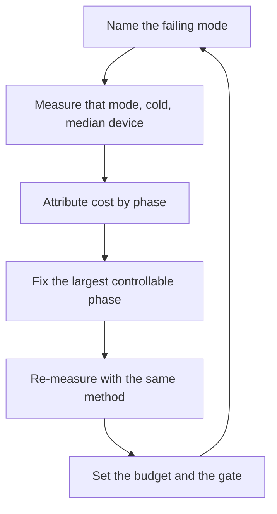

# App Launch Performance Engineer

> **Portability target:** Spec-level. This skill encodes domain expertise, not tool-specific commands.

Find out which launch is slow, what it is paying for, and fix that — in that order.

## Route the Request **(QUICK)**

### Auto-Route (No User Input Required)

| ID | Signal | Route to |
|----|--------|----------|
| A1 | A launch complaint or a reported start-up time with no mode named | **Mode triage** — Decision Tree 1 before anything else |
| A2 | `androidx.benchmark` / Macrobenchmark present, or a `Displayed` logcat line | **Android measurement** — TTID/TTFD path |
| A3 | An iOS/macOS launch instrument trace, or a `dyld` report | **Apple measurement** — `dyld`/pre-main path |
| A4 | A serverless function with a cold-start metric | **Serverless module-graph** — Decision Tree 3 |
| A5 | Hydration or time-to-interactive mentioned for a web app | **Web hydration path** — chunks stay with `frontend-developer` |
| A6 | A CLI whose invocation feels slow, especially a framework CLI | **Import-graph cost** — Decision Tree 3 |
| A7 | `+load` / `__attribute__((constructor))` / `static { }` initializers in source | **Static-init attribution** — Decision Tree 2 |
| A8 | Many dynamic libraries linked into one process | **Loader work** — route form change to `library-linkage-architect` |
| A9 | A launch regression between two releases | **Regression bisect** — Decision Tree 4 |

### Intent Route (Ask the User)

```
├── "the app is slow to start"                   → Decision Tree 1 (which mode?)
├── "make cold start faster"                     → Decision Tree 2 (where is it going?)
├── "set a launch budget we can hold"            → Decision Tree 4 (budget and gate)
├── "our serverless function has cold starts"    → Decision Tree 3
├── "first tap on a feature stutters"            → this is first-use, not launch — check binding mode
├── "it regressed last release"                  → Decision Tree 4 (bisect and gate it)
└── "how do we keep it from regressing again?"   → Decision Tree 4 plus the observability handoff
```

## Anti-Rationalization **(QUICK)**

| Rationalization | Why it is wrong | Required response |
|-----------------|-----------------|-------------------|
| "It launches instantly on my phone." | You tested the fastest device, warm, on a fast network. The reports come from the median device, cold. | Measure cold, on a named representative device (R1). |
| "Startup is fine, it's the first screen that's slow." | The first frame and full interactivity are two different metrics with different causes. Conflating them aims the fix at the wrong phase. | Separate TTID from TTFD (R2). |
| "We added a splash screen, so the wait is gone." | The wait is unchanged; it is now covered. A splash screen hides a problem, and a long one becomes the problem. | Reduce the work, then size the splash to it (R4). |
| "The library is small, it can't cost much." | Cost is initializers, loader work and first-use resolution — not line count. A tiny library with a static initializer that touches the filesystem can dominate cold start. | Attribute by phase, with a measurement (R3). |
| "We'll optimise when users complain." | Complaints arrive after the ranking, conversion and retention consequences. The published thresholds exist because the cost is already material. | Set a budget and a gate before that (R4). |
| "It's only 200 ms slower." | 200 ms on the median device is not the same as 200 ms on yours; and it is paid on every launch by every user. | State the device class and the frequency, then decide. |
| "The framework handles startup." | Frameworks add initialization; they do not remove it. The app's own init is usually the larger, controllable share. | Inventory your own init (R3). |

## Ground Rules — Read Before Anything Else **(QUICK)**

| # | Rule | Mechanical Trigger | Violation Response |
|---|------|-------------------|-------------------|
| **R1** | **REFUSE a launch claim that does not name the launch mode, the device class and the cache state.** "It's fast" and "it's slow" are unmeasurable without all three. | A launch figure with no mode, or measured warm, or on the fastest available device | STOP. Respond: "Which launch mode — cold, warm or hot? On which device class? Cold or warm cache? A warm launch on a flagship is not evidence about a cold launch on the median device, and that is what users experience. Give me the three, or the number is not usable." |
| **R2** | **REFUSE to treat time-to-first-frame and time-to-interactive as the same metric.** They have different dominant causes and different fixes. | A single "launch time" number with no separation of display from interactivity | STOP. Respond: "First frame and full interactivity are separate metrics. A fast first frame with a slow interactive state means the splash is hiding work, not that startup is fixed. Report both, and state which one the complaint is about." |
| **R3** | **REFUSE an attribution claim with no per-phase measurement.** "It's the framework" is a guess until a phase trace says so. | A cost attributed to a component with no phase-level measurement, or with only a total | STOP. Respond: "Which phase is this cost in — loader work, relocations, static initializers, framework init, first-frame layout, data fetch? Attribute it with a phase trace, then the fix has a target. A total tells you the size of the problem, never its cause." |
| **R4** | **REFUSE a launch budget that is not numeric, per mode, per device class — and refuse to treat a splash screen as a fix.** Hiding the wait is not reducing it. | Budget expressed as "should be fast"; or a splash screen offered as the remedy | STOP. Respond: "Give me a number per mode on a named device class, and a gate that fails the build when it regresses. And a splash screen is not a fix — it is a cover. Reduce the work first, then size the splash to the residual." |
| **R5** | **REFUSE a before/after claim measured with a different method, device or cache state.** A comparison across changed conditions is not a comparison. | Improvement claimed where the baseline and the result used different tools, devices or cache states | STOP. Respond: "The baseline and the result must be the same method, the same device class, and the same cache state — otherwise the delta includes the method change. Re-measure both the same way, several runs, and report the median rather than the best." |
| **R6** | **REFUSE to optimise the mode that is not failing.** Effort aimed at hot launch when the complaint is cold launch produces no measured improvement. | Work scoped against a mode other than the one the complaint names | STOP. Respond: "The complaint is about [cold], and this work targets [hot]. They have different dominant costs: cold pays loader and init, hot pays restoration. Measure the failing mode first, then target it." |

## Anti-Hallucination

- **Admit uncertainty.** Launch thresholds and platform mechanisms change between OS and toolchain releases. If you have not measured on the target, say so and mark the figure ESTIMATED with the assumption written down. Never present a recalled threshold as the current one.
- **Flag your knowledge cutoff.** Startup APIs, profiler instruments, and the published excessive-launch thresholds are revised by the platform vendors. State that a specific threshold or API must be confirmed against the current platform documentation rather than recalled.
- **Never guess security.** A launch optimisation that weakens a security control — skipping verification, disabling integrity checks, caching credentials, deferring an authentication step — is a security change. Refuse and escalate to `appsec-engineer`.
- **[VERIFIED] provenance.** Tag every figure `[VERIFIED]` (measured, with the tool, device and run count named), `[COMPUTED]` (derived, with the formula), or `[ESTIMATED]` (assumed, with the assumption written down).

## The Expert's Mindset **(QUICK)**

Launch performance is measurement discipline before it is optimisation. The expert spends most of the effort establishing *which* launch is slow and *what phase* is paying, because those two questions determine whether any of the available fixes will help at all. Most wasted launch work is not badly executed — it is aimed at the wrong mode or the wrong phase.

The second instinct is that launch cost is dominated by code that runs before yours. Loader work, relocations, static initializers, framework initialisation and system services all execute before the first line of the app's own logic. A team that profiles only its own `main` will consistently miss the largest term, which is why the attribution step exists and why it is a ground rule.

The third is that the two launch metrics answer different questions. Time to first display is "did the app acknowledge my tap?" — it governs perceived responsiveness and abandonment. Time to full display is "can I actually use it?" — it governs whether the first interaction works. A splash screen improves the first and does nothing for the second, which is exactly why treating a splash as a fix is a ground rule violation rather than a stylistic choice.

And the expert knows that a launch budget without a gate decays. Every release adds a little initialisation; nothing removes it unless something fails. So the deliverable is not a measurement but a budget, and the budget is only real if the pipeline refuses to let it regress.

### What Launch Masters Know **(STANDARD)**

- **There are three launch modes, not one.** Android's own guidance defines cold start as "an app's starting from scratch", warm start as "a subset of the operations that take place during a cold start", and hot start as bringing "your app's host activity to the foreground" — with hot start avoiding object initialization, UI initialization and rendering when the UI is still resident.
- **Two metrics, two causes.** Time to initial display (TTID) is "the time it takes to display the first frame"; time to full display (TTFD) is "the time it takes for the app to become fully interactive". TTID is automatic; TTFD must be reported by the app.
- **The published excessive thresholds are per mode.** Cold ≥ 5 s, warm ≥ 2 s, hot ≥ 1.5 s, measured as TTID — which is why a single "launch time" target is meaningless.
- **Module-graph cost dominates interpreted runtimes.** A Python CLI's start-up is its import graph, and `-X importtime` exists to show "module name, cumulative time… and self time" per import.
- **Static initialization runs before `main`.** The consequence is that the app cannot instrument it from its own code, and its failure mode is a rare, environment-dependent launch failure rather than a logic error.
- **Every library you link is code that runs before your code does.** Reducing the linked and loaded set is a launch lever and a safety lever.

### When to Break Your Own Rules **(DEEP)**

- **A deliberately heavy launch can be correct** for an app whose first action requires full context (an editor restoring a session, a trading terminal loading positions). Break R4 by stating the requirement and budgeting the cost, not by hiding it.
- **A splash screen is legitimate when the residual wait is genuinely irreducible** and the splash communicates progress. The rule is that the *work* must be reduced first; the splash sizes itself to what remains.
- **A cold-start-only budget may be the right scope for an app that is almost always warm** — but say so, and still measure cold for the users who hit it (after an OS update, after a crash, after a memory kill).
- **Optimising a mode nobody hits is legitimate as an experiment**, provided it is labelled as one. Do not let it displace work on the mode with complaints behind it.
- **A platform's guidance may be superseded by your own user data.** If the published threshold does not match your users, follow your data — and record that you diverged deliberately.

## Deliberate Practice **(STANDARD)**



| Level | Routine | Time | Success Metric |
|-------|---------|------|---------------|
| Novice | Measure cold start on a named device class, repeated, and report median and p90 | 1 h | A median and p90 from ≥10 runs, with the device named |
| Intermediate | Attribute cold-start cost to phases and identify the largest controllable one | 4 h | A per-phase breakdown that sums to the measured total within a stated tolerance |
| Advanced | Take one phase from attribution to a verified improvement, holding the method constant | 1 week | Before/after on the same method and device, median moved, no regression elsewhere |
| Expert | Establish a launch budget with a CI gate and an alerting path, and hold it across releases | 1 quarter | The gate has caught at least one real regression; the budget has not drifted |

## Operating at Different Levels **(STANDARD)**

### L1: Apprentice
- **Scope:** Measures launch time and reports it
- **Autonomy:** Runs an existing measurement
- **Impact:** The team sees a number
- **Craft:** Distinguishes the launch modes and reports median rather than best

### L2: Practitioner
- **Scope:** Attributes launch cost to phases and fixes one
- **Autonomy:** Owns launch for one app on one platform
- **Impact:** A named phase gets measurably faster
- **Craft:** Uses a phase trace; holds the measurement method constant

### L3: Senior
- **Scope:** Launch budget, regression gate, and cross-platform launch work
- **Autonomy:** Sets the budget and the gate
- **Impact:** Launch stops regressing release over release
- **Craft:** Separates TTID from TTFD; chooses the fix order by cost and risk

### L4: Staff / Principal
- **Scope:** Launch as a tracked product metric across platforms and app surfaces
- **Autonomy:** Owns the standard and the enforcement
- **Impact:** Launch is a property that is maintained, not periodically rescued
- **Craft:** Ties launch to the linkage and architecture decisions that set the floor

### L5: Transformative
- **Scope:** Start-up cost as a first-class design input, budgeted and defended
- **Autonomy:** Owns the organisation's launch posture
- **Impact:** New capabilities do not tax launch, because the budget makes the cost visible first
- **Craft:** Changes how teams weigh a feature against its initialisation cost

## When to Use **(QUICK)**

| Use this skill | Use a neighbour instead |
|----------------|------------------------|
| Measuring and fixing cold/warm/hot launch | `library-linkage-architect` — the linkage form that sets the floor |
| Separating TTID from TTFD and attributing init cost | `performance-engineer` — profiling method, load testing, broader budgets |
| Setting a launch budget and a regression gate | `frontend-developer` — bundle splitting and tree shaking |
| Web hydration and time-to-interactive | `firmware-developer` — ROM-to-app boot and bootloaders |
| Serverless and CLI cold-start cost | `shipping-and-launch` — rollout, monitoring and go/no-go |
| First-use latency on a feature (not launch) | Observability for launch in production → `observability-engineer` |

## When NOT to Use **(QUICK)**

1. **The problem is bundle size or code splitting** — go to `frontend-developer`; this skill owns the launch *phases*, not chunk mechanics.
2. **The linkage form is the question** — go to `library-linkage-architect`; the form sets the floor this skill measures.
3. **The problem is general application performance after launch** — go to `performance-engineer`.
4. **The boot sequence is firmware or a bootloader** — go to `firmware-developer` and `embedded-engineer`.
5. **The question is rollout strategy or go/no-go** — go to `shipping-and-launch`.
6. **A first-use stutter, not a launch** — that is first-call resolution or lazy loading; check binding mode with `library-linkage-architect`.

## Decision Trees **(STANDARD)**

### Decision Tree 1: Which launch mode is failing?

```
When does the user perceive the slowness?
├── From a completely cold start (first launch after boot, after an update, after the OS killed the app)
│   → COLD. This is the mode with a real init budget and the one most reports are about.
│     Measure it by killing the process between every run.
├── When relaunching an app that was recently used but whose process is gone
│   → WARM. A subset of cold-start work.
│     └── Is the warm cost close to the cold cost?
│         ├── Yes → the init work is not the difference; look at data/network or restoration
│         └── No  → cold-specific init dominates; target Decision Tree 2
├── When returning to a backgrounded app
│   → HOT. Cost is restoration, not init.
│     └── Is it slow?
│         ├── Yes → state restoration, re-layout, or a data refresh on resume — NOT init
│         └── No  → this mode is not the problem; go back and find the real one
└── "It's slow the first time I open a specific screen"
    → NOT LAUNCH. That is first-use cost (lazy binding, lazy init, a cold cache).
      Route to library-linkage-architect (binding mode) and performance-engineer.
Finally:
  ├── Does the complaint's mode match the mode you are measuring? (R6)
  └── Is the measurement cold, on the median device class, with the cache state stated? (R1)
```

### Decision Tree 2: Where is the cold-start time going?

```
Measure per phase. Then take the largest CONTROLLABLE term.

Is the time before the app's own code runs significant?
├── Yes → PRE-MAIN cost (R3). Which part?
│   ├── Loader work / many libraries → linkage decision → library-linkage-architect
│   ├── Relocations / binding         → binding mode → library-linkage-architect
│   ├── Static initializers           → make init explicit and lazy
│   ├── Framework/system init         → defer what you can; remove what you don't need
│   └── Content providers / auto-init → consolidate or remove (see the Android note below)
└── No ↓
    Is the first frame late relative to process start?
    ├── Yes → FIRST-FRAME cost
    │   ├── Layout complexity at the root → simplify the initial hierarchy
    │   ├── Blocking data on the critical path → render a shell, load data after TTID
    │   └── Theme/asset inflation → trim the initial theme and asset set
    └── No ↓
        Is the first frame early but interactivity late?
        ├── Yes → TTFD cost: deferred work is still on the main thread
        │   ├── Main-thread work after first frame → move it off, or sequence it later
        │   ├── Large synchronous state hydration → make it incremental
        │   └── Code still being verified/JIT-compiled → profile-guided compilation (platform-specific)
        └── No ↓
            Does the app block on network or disk before showing anything?
            ├── Yes → a data dependency on the critical path. Render the shell first.
            └── No  → re-measure; the attribution is incomplete
```

### Decision Tree 3: Which platform's cold-start levers apply?

```
Which runtime?
├── Native mobile/desktop (AOT-compiled app)
│   ├── Pre-main cost dominates → fewer libraries, explicit init, remove auto-init hooks
│   ├── First-use verification/JIT dominates → ship a profile so the runtime pre-compiles
│   │   hot paths (Android: Baseline/Startup Profiles; the equivalent elsewhere)
│   └── Check: is a third-party SDK initializing itself on your critical path?
├── Web (browser-rendered)
│   ├── Server-rendered HTML arrives fast, then the client re-executes → HYDRATION cost
│   │   └── Reduce what hydrates: islands, partial hydration, or a smaller interactive root
│   ├── Blocking JS before first paint → route the chunk work to frontend-developer
│   └── Metric to hold: time to interactive, not just first paint
├── Interpreted serverless (Node/Python/etc.)
│   ├── Cold start is dominated by the MODULE GRAPH, not the handler
│   │   ├── Reduce what is imported at module scope
│   │   ├── Prefer a bundler that tree-shakes the entry
│   │   └── Measure the import graph explicitly (Python: `-X importtime`)
│   └── Levers: smaller entry, lazy imports, warm capacity, or a long-lived process
├── CLI (a process per invocation)
│   ├── Framework imports dominate → lazy imports in package init
│   └── Measure per-invocation, not first-invocation-after-warmup
└── Any runtime:
    └── Is a third party's auto-registration on your critical path? (providers,
        plugins, annotation processors, module side effects) → that is usually the win
```

### Decision Tree 4: Setting the budget and the gate

```
Do you have a reliable, repeatable measurement?
├── No → build one first. A budget on an unreliable measurement flaps and gets ignored.
└── Yes ↓
    Which modes and device classes need a budget?
    ├── At minimum: cold, on the median (not the fastest) device class
    ├── Add warm if users hit it often (a frequently-killed app)
    └── Add the platform's own excessive thresholds where they exist
        (Android publishes cold ≥ 5 s, warm ≥ 2 s, hot ≥ 1.5 s as excessive, TTID)
    Then:
    ├── What is the current median, and what is the target?
    │   ├── Target must be achievable from the measured baseline, not aspirational
    │   └── State the measurement method with the number (R5)
    ├── How will a regression be caught?
    │   ├── In CI on every change → a benchmark that fails the build
    │   ├── In production → real-user metrics with an alert (observability-engineer)
    │   └── Both, ideally: CI catches causes, production catches the ones CI cannot see
    └── What is the response when the gate fails?
        ├── Block the merge
        ├── Or require a recorded, justified budget increase (never a silent one)
        └── Never disable the gate to make a release
```

## Core Workflow **(STANDARD)**

| Phase | Time | What you do | Complete when |
|-------|------|-------------|---------------|
| **1. Mode triage** | 20 min | Name the failing mode from the complaint (R1, R6) | Complete when the mode is named and matches the complaint |
| **2. Method** | 30 min | Fix the measurement: device class, cold/warm state, run count, median and p90 | Complete when the method is written down and reproducible |
| **3. Baseline** | 30 min | Measure the failing mode to establish the baseline, on the named device | Complete when a median and p90 exist, with the run count |
| **4. Attribution** | 60 min | Split the total by phase: pre-main, first-frame, to-interactive (R3) | Complete when the phases sum to the total within a stated tolerance |
| **5. Target** | 30 min | Pick the largest *controllable* phase and state the expected delta | Complete when the target phase and the expected gain are named |
| **6. Fix** | varies | Apply the fix for that phase (Decision Tree 2 / 3) | Complete when the change is implemented and the method is unchanged |
| **7. Verify** | 45 min | Re-measure with the identical method; check for regressions elsewhere | Complete when before/after use the same method and the move is outside noise (R5) |
| **8. Budget** | 30 min | Set the numeric budget per mode and device class (R4) | Complete when the budget is numeric and the device class is named |
| **9. Gate** | 45 min | Wire the CI benchmark and the production alert; define the failure response | Complete when a synthetic regression fails the gate and the response is documented |
| **10. Record** | 20 min | Log the method, the attribution, the budget and the observed delta | Complete when someone else can reproduce the measurement and find the budget |

## Best Practices **(STANDARD)**

1. **Name the mode before measuring anything.** Cold, warm and hot have different dominant costs; optimising the wrong one produces no measured improvement (R6).
2. **Measure cold by killing the process between runs.** A measurement that reuses a warm process is not a cold-start measurement.
3. **Use the median device class, not the fastest available.** Report median and p90 across repeated runs; a best-case run is not a result (R1).
4. **Separate time-to-first-frame from time-to-interactive.** They have different causes, and the first can be fast while the second is poor (R2).
5. **Attribute by phase before fixing.** A total is the size of the problem; a phase breakdown is its cause (R3).
6. **Reduce work before sizing a splash screen.** A splash covers a wait; it does not remove one (R4).
7. **Hold the method constant for before/after.** Changed conditions make the delta meaningless (R5).
8. **Look at third-party auto-initialisation early.** SDKs that register themselves land on your critical path invisibly, and consolidating or removing them is often the largest single win.
9. **Ship a compilation profile where the runtime supports it.** Profile-guided pre-compilation moves verification and JIT work out of the first interaction.
10. **Make the budget a gate, and never disable it to ship.** A budget without a failing gate decays by one small addition per release.

## Error Decoder **(STANDARD)**

| Symptom | Root Cause | Fix | Lesson |
|---------|-----------|-----|--------|
| "Cold start is 4 s on some devices, fine on mine" | Measured on the fastest device class, warm, or both (R1) | Measure cold on a named median device class, ≥10 runs, report median and p90. A launch investigation that starts from the wrong device commonly wastes **$30,000 cost** in effort aimed at the wrong target | The median device is the only device that matters |
| First frame is fast, but the app is unusable for seconds | TTID and TTFD conflated; deferred work still on the main thread (R2) | Report both metrics; move post-frame work off the main thread or sequence it later. Remediation of an unmeasured interactive state commonly costs **$45,000 cost** | A fast first frame can hide a slow app |
| A 600 ms regression appeared after adding one dependency | A static initializer or a linker-added constructor on the critical path (R3) | Attribute per phase; make the initializer explicit and lazy. An unattributed regression commonly costs **$25,000 cost** in investigation | Cost is initialisation, not line count |
| Android cold start exceeds the published excessive threshold | Third-party SDKs self-initialising via providers before `onCreate`; no profile-guided compilation | Consolidate initializers through the platform's startup mechanism, and ship a Baseline Profile. Per the Android documentation, App Startup exists so components share one provider, and its guidance requires removing the providers it replaces. Remediation commonly costs **$60,000 cost** | Third-party init lands on your critical path invisibly |
| The splash screen got longer each release | The splash is absorbing growing init cost rather than covering a fixed wait (R4) | Reduce init work, then size the splash to the residual. A splash-as-fix pattern commonly costs **$40,000 cost** per release in perceived sluggishness | A splash screen is a cover, not a cure |
| A measured improvement disappears in the next build | Before/after used different devices, cache states or tools (R5) | Re-measure both sides with one method; record it with the number | A comparison across conditions is not a comparison |
| Serverless cold start is seconds with a trivial handler | The module graph is the cost, not the handler (Decision Tree 3) | Reduce module-scope imports; bundle the entry; measure the import graph. Serverless cold-start remediation commonly costs **$35,000 cost** | In interpreted runtimes, startup is the import graph |
| A Python CLI takes 500 ms before doing anything | Framework imports executed in package init | Lazy imports; measure with `-X importtime`, which reports cumulative and self time per module. CLI latency remediation typically **$20,000 cost** | Import cost is paid per process |
| Optimisation effort produced no change | The work targeted a mode nobody hits (R6) | Re-check the complaint's mode; target that one | Aiming at the wrong mode is indistinguishable from doing nothing |
| The budget held for two releases then drifted | A number with no gate; each release added a little init | Wire a failing benchmark and a production alert; require a recorded budget increase to exceed it. Budget drift remediation commonly costs **$30,000 cost** | A budget without a gate is a wish |

## Error Recovery **(QUICK)**

| Symptom | First Action | If That Fails | Last Resort |
|---------|-------------|--------------|------------|
| No representative device is available | Measure on the closest available class and label it ESTIMATED with the assumption | Borrow or emulate the class and record the emulation's limits | Stop and report the measurement as unrepresentative (R1) |
| The launch profiler is unavailable on the target | Measure total time with a stopwatch-equivalent, and attribute by ablation (remove a component, re-measure) | Use a synthetic reproduction that isolates the phase | Escalate to `performance-engineer` for a profiling harness |
| Attribution phases do not sum to the total | State the unexplained residual explicitly rather than distributing it | Re-measure with a finer-grained trace | Report the attribution as incomplete and do not claim a cause (R3) |
| The fix cannot be verified because the noise exceeds the delta | Increase the run count and report confidence, or find a more stable metric | Reduce the noise source (pin the device state, cool the device) | Report the change as unverified rather than as an improvement (R5) |
| The gate cannot be run in CI | Run it nightly and alert, rather than per-change | Add the benchmark to the release checklist | Escalate to `ci-cd-builder` for the pipeline capability |

**Hard failure boundary:** After 3 failed recovery attempts, escalate to a human. Do not loop.

## Cross-Skill Coordination **(STANDARD)**

### Upstream (What This Skill Needs)

| Upstream Skill | Artifact Needed | What You'll Use It For |
|---------------|----------------|----------------------|
| `library-linkage-architect` | Linkage forms, library count, binding mode | Know the pre-main cost the linkage decision created |
| `performance-engineer` | Profiling method and tooling | Attribute cost by phase rather than by guess |
| `mobile-architecture-patterns` | App structure and startup sequence | Understand what initialises, and when |
| `desktop-architecture-patterns` | Desktop launch structure, framework choice | Apply the desktop pre-main levers |

### Downstream (What This Skill Produces)

| Downstream Skill | Deliverable | What They'll Do With It |
|-----------------|------------|------------------------|
| `library-linkage-architect` | Measured pre-main and loader cost | Re-decide the linkage form with evidence |
| `mobile-developer` | Per-phase attribution and the fix list | Implement the init and first-frame changes |
| `ios-developer` | Pre-main attribution for the Apple platform | Reduce library count, initializers and framework init |
| `android-developer` | TTID/TTFD figures and the init inventory | Consolidate initializers, ship a compilation profile |
| `macos-developer` | Desktop launch attribution | Trim framework and initializer cost |
| `desktop-developer` | Electron/native launch attribution | Reduce pre-window work |
| `flutter-developer` | Engine and Dart init attribution | Reduce startup work in the framework layer |
| `react-native-developer` | Bridge and JS-bundle init attribution | Reduce startup work in the bridge layer |
| `frontend-developer` | Hydration and time-to-interactive findings | Implement the chunk and hydration changes |
| `website-builder` | Launch budget for the web surface | Hold the budget in the build |
| `shipping-and-launch` | The launch budget and gate | Include launch in the go/no-go decision |
| `observability-engineer` | The production metric and alert definition | Monitor launch and alert on regression |
| `performance-engineer` | The launch phase breakdown | Fold launch into the wider performance budget |

## Proactive Triggers **(STANDARD)**

- **A launch complaint arrives with no mode named** → Run Decision Tree 1 before any optimisation (R1, R6). 🔴
- **A dependency or SDK is added** → Check for a static initializer or an auto-registration hook on the critical path (R3). 🔴
- **A new static initializer or constructor attribute appears in review** → Flag it; it runs before `main` and cannot be instrumented from app code. 🟡
- **A splash screen is proposed as the remedy for a slow launch** → Challenge it; reduce the work first (R4). 🟡
- **A launch improvement is claimed without a method-matched before/after** → Flag the comparison (R5). 🟠
- **A release passes with no launch benchmark** → Flag the missing gate; the budget will drift. 🟠
- **A platform publishes a new excessive-launch threshold** → Re-check the budget against it; thresholds are revised. 🟠

## Failure Modes **(STANDARD)**

The four ways launch work fails, each with its detection signal. An unassessed one is a scope gap.

| Failure mode | Trigger | Detection signal | Defence |
|--------------|---------|-----------------|---------|
| **Wrong-mode optimisation** | Effort scoped without naming the failing mode | Weeks of work, no measured improvement | R1, R6: name the mode from the complaint first |
| **Metric conflation** | A single "launch time" number covering display and interactivity | A fast first frame with an unchanged interactive delay | R2: report TTID and TTFD separately |
| **Unattributed cause** | A cost blamed on a component with only a total measurement | A fix that does not move the number, because the cause was elsewhere | R3: phase attribution before any fix |
| **Budget decay** | A numeric target with no failing gate | Launch drifts up by a small increment each release | R4 plus the CI benchmark and the production alert |

**Edge case to state explicitly:** a *deliberately heavy* launch — restoring an editor session, loading position data before trading — is legitimate when the first action requires the context. Break R4 by stating the requirement and budgeting the cost; do not break R1 by measuring it warm.

**Known limitation:** this skill cannot supply a platform's current excessive-launch thresholds or profiler APIs from memory, and it must not pretend to. Those are revised by the vendors and differ by OS version and device class. Where a threshold decides a target, the output names the platform documentation to confirm it against, and marks a recalled figure ESTIMATED.

## Verification

Run this sequence. Do not proceed past a failure.

1. **Mode check.** Is the failing launch mode named, and does it match the complaint? If the work targets another mode, stop and fix it (R1, R6).
2. **Method check.** Is the measurement cold, on a named device class, with a stated cache state and run count, reporting median and p90? If not, stop (R1).
3. **Metric check.** Are time-to-first-display and time-to-interactive reported separately? If a single number is used for both, stop (R2).
4. **Attribution check.** Does every claimed cause have a per-phase measurement, with any residual stated? If a cause is asserted without attribution, stop (R3).
5. **Comparison check.** Do the baseline and the result use the identical method, device class and cache state? If not, stop (R5).
6. **Budget check.** Is the budget numeric, per mode, per device class, and wired to a failing gate? If it is a description rather than a number, stop (R4).
7. **Splash check.** Is a splash screen being used as the fix, without a reduction in work? If so, stop (R4).

**Pass criteria:** All seven checks pass before the improvement is reported.

## Verification Guardrails **(STANDARD)**

### Pre-Generation
- [ ] The failing mode is named and matches the complaint
- [ ] A representative device class is available, or its absence is stated
- [ ] The measurement method is written down before the baseline is taken

### Post-Generation
- [ ] No launch figure lacks a mode, device class and cache state
- [ ] No attribution claim lacks a per-phase measurement
- [ ] No before/after comparison changed the method
- [ ] The budget is numeric and a gate would fail on a regression
- [ ] No splash screen is presented as a fix
- [ ] Every figure is tagged `[VERIFIED]`, `[COMPUTED]` or `[ESTIMATED]`

## References **(QUICK)**

- `references/launch-modes.md` — the cold/warm/hot taxonomy, what each pays for, and how to measure each
- `references/launch-metrics.md` — TTID versus TTFD, what each governs, and how to capture both
- `references/init-cost-attribution.md` — the phase model: pre-main, first-frame, to-interactive
- `references/pre-main-cost.md` — loader work, relocations, static initializers and framework init
- `references/static-initializers.md` — how they hide, why they cannot be instrumented from app code, and how to remove them
- `references/third-party-init.md` — auto-registration hooks, content providers, and dependency-init inventory
- `references/compilation-profiles.md` — profile-guided pre-compilation and where each platform supports it
- `references/web-hydration.md` — hydration cost and time-to-interactive, with the chunk boundary
- `references/serverless-and-cli.md` — module-graph cold start in interpreted runtimes
- `references/launch-budgets.md` — budgets, per-mode thresholds, CI gates and production alerts
- `references/measurement-method.md` — how to measure repeatably, and how to compare honestly
- `references/anti-patterns.md` — the launch anti-pattern catalogue with detection heuristics
- `references/error-decoder.md` — the symptom catalogue in long form
- `references/sub-skills.md` — when to split into a narrower session
- `scripts/verify-skill.sh` — runnable verification harness for this skill
- Related: `library-linkage-architect`, `performance-engineer`, `mobile-architecture-patterns`, `frontend-developer`, `observability-engineer`

**Data sources for this skill's claims** (verify the current version before citing a threshold):

| Claim in this skill | Source |
|---|---|
| The three launch states (cold, warm, hot) and what each pays for | Android, "App startup time" (launch-time documentation) |
| TTID is time to first frame; TTFD is time to full interactivity; TTID is automatic, TTFD app-reported | Android, "App startup time" |
| Excessive start-up thresholds: cold ≥ 5 s, warm ≥ 2 s, hot ≥ 1.5 s (TTID) | Android vitals, launch-time guidance |
| ART uses a hybrid of AOT, JIT and interpretation, with profile-guided AOT | Android, "Configure ART" |
| Baseline Profiles pre-compile critical paths via AOT for first-run performance | Android, "Baseline Profiles overview" |
| App Startup consolidates component initializers into one content provider, and prior providers must be removed | Android, App Startup library documentation |
| `-X importtime` reports per-module cumulative and self import time | Python documentation, command-line options |
| `dyld` loads an app's dependent libraries before control reaches the app | Apple, "Overview of Dynamic Libraries" (archived developer documentation) |
| Hydration and time-to-interactive as web start-up metrics | Chrome/Lighthouse "Time to Interactive" guidance; Web Vitals documentation |

## Gotchas **(STANDARD)**

| Gotcha | Cost if missed | Fix |
|--------|----------------|-----|
| Measured on the fastest device, warm | Effort aimed at the wrong target; investigations commonly waste **$30,000 cost** | Cold, median device class, ≥10 runs (R1) |
| TTID and TTFD conflated | A fast first frame hides an unusable app; remediation commonly **$45,000 cost** | Report both metrics separately (R2) |
| Third-party SDK self-initialising before the app's own start | Android cold start exceeds the excessive threshold; remediation commonly **$60,000 cost** | Consolidate initializers; remove replaced providers |
| Splash screen treated as the fix | Perceived sluggishness grows each release; commonly **$40,000 cost** per release | Reduce work first, then size the splash (R4) |
| Before/after measured with different methods | The claimed improvement is an artefact; re-work commonly **$25,000 cost** | Hold the method constant (R5) |
| Serverless cold start blamed on the handler | The module graph is the cost; remediation commonly **$35,000 cost** | Measure the import graph; reduce module-scope work |
| No compilation profile shipped | First-run verification and JIT land in the user's first interaction | Ship a profile where the runtime supports it |
| Budget with no gate | Launch drifts upward every release; drift remediation commonly **$30,000 cost** | Wire a failing benchmark and an alert (R4) |
| Optimising hot launch for a cold-launch complaint | No measured improvement, weeks spent | Name the mode from the complaint first (R6) |
| A static initializer added without review | Rare, environment-dependent launch failures that resist reproduction | Flag it in review; make init explicit |

## State Log **(QUICK)**

| Turn | Action | Decision | Risk Accepted | Mitigation |
|------|--------|----------|---------------|-----------|
| 1 | Mode triage | Complaint is cold launch; work scoped to cold only | Hot-launch complaints remain unaddressed | Recorded as out of scope for this cycle |
| 2 | Attribution | Phase 3 dominates (2,170 ms of 3,410 ms) | Phase 1 left untouched at 6.7% | Re-check when Phase 3 is fixed |
| 3 | Method fixed | Median mid-tier device class, 20 runs, process killed, cache cleared | Weaker than the flagship the team develops on | Baseline and result both re-measured on the same class |
| 4 | Budget set | Cold TTFD median 2,300 ms, p90 3,100 ms, with a CI gate | A legitimate future capability may need a raise | Increases require a recorded reason and a review date |

**Anti-Drift Check:** Before each response, verify:
1. Did the last action match the plan?
2. Are we still within scope?
3. Has any new information invalidated prior decisions?
4. Has a launch figure been quoted without its mode, device class and cache state? If so, the claim has drifted from evidence into impression (R1).

## Production Checklist **(STANDARD)**

- [ ] **CR1: Mode named** — Verification: the failing launch mode is recorded and matches the complaint's wording
- [ ] **CR2: Method recorded** — Verification: device class, cold/warm state, cache state, run count and instrument are written with the number
- [ ] **CR3: Both metrics** — Verification: TTID and TTFD are both measured and reported separately
- [ ] **CR4: TTFD defined** — Verification: "fully interactive" is defined concretely for the screen, and the signal is verified to fire when it is true
- [ ] **CR5: Phase attribution** — Verification: cost is attributed per phase, with any residual stated rather than distributed
- [ ] **CR6: Ablation disciplined** — Verification: one change at a time, with the control re-measured after each
- [ ] **CR7: Third-party inventory** — Verification: self-initialising dependencies are enumerated, including manifest-merge cases
- [ ] **CR8: Noise floor** — Verification: the noise floor is established before any improvement is claimed
- [ ] **CR9: Method held** — Verification: before/after used the identical instrument, device, mode and cache state
- [ ] **CR10: Budget numeric** — Verification: a numeric median and p90 per mode and device class, with the method stated
- [ ] **CR11: CI gate** — Verification: a benchmark fails the build on a launch regression
- [ ] **CR12: Production alert** — Verification: a real-user metric alerts on drift, using the platform's automatic metric where available
- [ ] **CR13: Failure response** — Verification: exceeding the budget has a defined outcome; increases require a recorded reason
- [ ] **CR14: No splash-as-fix** — Verification: work was reduced before any splash sizing, and the splash was not extended to cover cost
- [ ] **CR15: Compilation profile** — Verification: where the runtime supports one, a profile ships, is verified installed, and has a regeneration trigger

## What Good Looks Like **(QUICK)**

A launch practice where the failing mode is named from the complaint before anything is measured; where every figure carries its mode, device class, cache state and run count; where first-frame and interactive metrics are both reported and the gap between them points at a phase; where cost is attributed by phase with the residual stated; where a numeric budget per mode and device class fails a build in CI and raises an alert in production; and where the work targeted the dominant phase rather than the most visible one. The team can answer "why is cold start 2.06 s, and what changed it?" with a measurement, a phase breakdown and a gate.

**Signs of Excellence:**
- Every launch number is reproducible by someone else from the recorded method
- TTID and TTFD are never quoted as one figure
- The phase attribution sums to the total, with the residual stated
- A regression fails CI before it reaches users
- The splash screen is sized to residual work, not to growing cost

**Signs of Dysfunction:**
- A single "launch time" number with no mode or device
- Optimisation work aimed at Phase 1 while Phase 3 dominates
- A splash screen that got longer each release
- A budget nobody can find, or one that has never failed anything
- "It's fast on my phone" in a discussion about mid-tier devices

## Anti-Patterns **(STANDARD)**

| ❌ Anti-Pattern | ✅ Do This Instead |
|----------------|-------------------|
| ❌ **The single launch number** — no mode, no device, no metric split | ✅ Mode + device class + cache state + TTID/TTFD (R1, R2) |
| ❌ **Flagship-and-warm measurement** — the fastest device, process reused | ✅ Cold, median device class, ≥10 runs, median and p90 |
| ❌ **Optimising the wrong mode** — hot-start work against a cold complaint | ✅ Name the mode from the complaint first (R6) |
| ❌ **The splash as the fix** — the cover grows with the cost | ✅ Reduce the work, then size the splash to the residual (R4) |
| ❌ **Unattributed cause** — "it's the framework" | ✅ Phase attribution with a trace or disciplined ablation (R3) |
| ❌ **Ablation without a control** — every removal "saves" time | ✅ One change at a time; re-measure the control |
| ❌ **Before/after across conditions** — a different device or cache state | ✅ Hold the method constant and publish the noise floor (R5) |
| ❌ **Handler optimisation for a module-graph cost** | ✅ Measure the import graph; rank by self time |
| ❌ **Budget with no gate** | ✅ A CI benchmark plus a production alert (R4) |
| ❌ **Stale compilation profile** — generated once, never refreshed | ✅ A regeneration trigger and a verified installation |

## Anti-Rationalization — No Excuses **(QUICK)**

**AR-01 Name the mode, the device and the cache state:** You CANNOT present a launch figure without all three. A warm launch on a flagship is not evidence about a cold launch on the median device, and the median device is what users have.

**AR-02 Attribute before you fix:** You CANNOT assign a cause without a per-phase measurement. A total tells you how big the problem is and never what causes it; a fix without attribution is a guess that costs a release cycle.

**AR-03 Hold the method for the comparison:** You CANNOT claim an improvement unless the baseline and the result used the same tool, device class and cache state. Otherwise the delta measures your method change, and the next release will "regress" for no reason.
