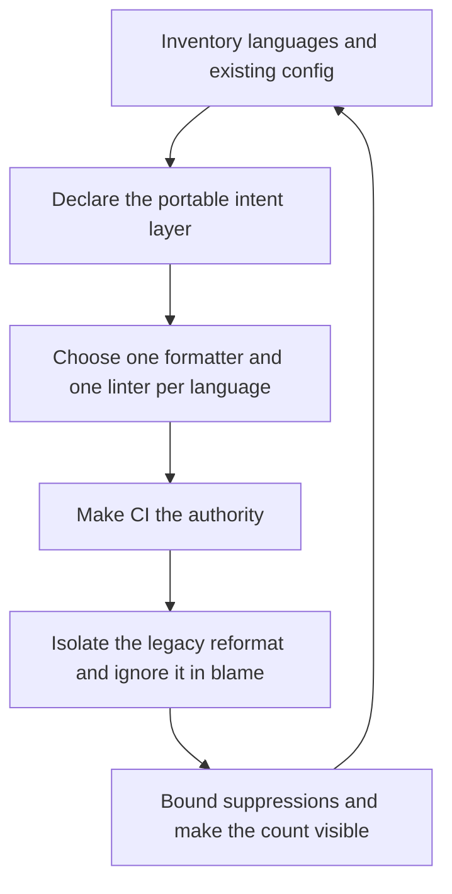

# Code Formatting and Linting

> **Portability target:** Spec-level. This skill encodes domain expertise, not tool-specific commands.

Formatting is not a decision anyone should make twice. Make it automatic, then spend the reviews on substance.

## Route the Request **(QUICK)**

### Auto-Route (No User Input Required)

| ID | Signal | Route to |
|----|--------|----------|
| A1 | `.editorconfig` absent at the repo root | **Intent layer missing** — Phase 1 |
| A2 | A formatter config present but no CI step running it | **Enforcement gap** — Decision Tree 2 |
| A3 | `// eslint-disable` / `swiftlint:disable` / `# noqa` / `# type: ignore` in source | **Suppression audit** — Decision Tree 4 |
| A4 | Two or more languages in one repo, each with its own config, no shared policy | **Polyglot policy** — Decision Tree 3 |
| A5 | A formatter present but a commit containing unformatted code | **Enforcement gap** — the hook is a convenience, not the authority |
| A6 | A formatting-only PR with thousands of changed lines | **Legacy migration** — Decision Tree 1 |
| A7 | Generated or vendored directories flagged by the linter | **Exclusion policy** — Phase 4 |
| A8 | Reviewers arguing about style in comments | **Policy gap** — Decision Tree 1 |
| A9 | `pre-commit` config present but CI does not run the same checks | **Authority gap** — Decision Tree 2 |

### Intent Route (Ask the User)

```
├── "how do we stop formatting arguments?"        → Decision Tree 1 (policy + automation)
├── "where should lint run — hook or CI or both?" → Decision Tree 2
├── "we have 8 languages, one standard?"          → Decision Tree 3 (polyglot policy)
├── "our codebase is unformatted, how do we fix it?" → Decision Tree 1 (legacy migration)
├── "we have 2,000 suppressions"                  → Decision Tree 4 (suppression policy)
├── "the linter flags generated files"            → Phase 4 (exclusions)
└── "which linter should we use for X?"           → the per-language table
```

## Anti-Rationalization **(QUICK)**

| Rationalization | Why it is wrong | Required response |
|-----------------|-----------------|-------------------|
| "We agreed on a style guide." | An agreement in a document is enforced by review, which means it is enforced inconsistently and argued about repeatedly. | Automate it (R1). |
| "The formatter is in the repo, so we're covered." | A config that nothing runs is documentation. The check that matters is the one that fails a build. | Wire it into CI as the authority (R2). |
| "Pre-commit hooks handle it." | Hooks are per-developer, skippable, and absent in web UIs and new clones. A hook cannot be the authority. | CI must be; the hook is a convenience (R2). |
| "We'll format the legacy codebase in one PR." | A diff touching every line destroys `git blame`, breaks every open branch, and makes review impossible. | Format in a dedicated, isolated commit (R3). |
| "The linter is too noisy, so we disabled it." | Disabling a rule globally removes it for the code that needed it. Suppressions are per-site and reasoned. | A suppression policy with reasons and a visible count (R4). |
| "One tool can lint and format everything." | The all-in-one tools cover a subset of languages well. One tool per language, one policy over them. | Per-language tools, portable policy (R5). |
| "Style does not affect outcomes." | Style noise hides substance in review. Every formatting comment is a review comment that did not catch a bug. | Automate style; review substance (R1). |

## Ground Rules — Read Before Anything Else **(QUICK)**

| # | Rule | Mechanical Trigger | Violation Response |
|---|------|-------------------|-------------------|
| **R1** | **REFUSE a style decision left to review.** If a human is asked to notice indentation, quote style or trailing whitespace, it is not automated. | A style convention documented but not enforced by a tool, or a review comment about formatting | STOP. Respond: "This is a formatting decision being made by a reviewer, which means it will be made inconsistently and discussed repeatedly. Name the tool that decides it instead. Formatting is mechanical: a machine should decide, once, and no human should ever comment on it again." |
| **R2** | **REFUSE an enforcement model whose authority is a local hook.** Hooks are per-developer, skippable with `--no-verify`, and absent in web editors and fresh clones. | Enforcement present only in a pre-commit hook, with no CI check | STOP. Respond: "A local hook is a convenience, not the authority: it can be skipped, it is absent in a fresh clone or a web UI, and it does not apply to automated changes. The authority must be CI, where it cannot be bypassed. Keep the hook for speed, and add the CI gate." |
| **R3** | **REFUSE a whole-codebase reformat inside a feature change.** A diff touching every line destroys blame, invalidates open branches, and makes the real change unreviewable. | A formatting change mixed with functional changes, or a reformat with no isolation plan | STOP. Respond: "Reformatting inside a feature change makes the feature unreviewable and rebases every open branch. Isolate it: a dedicated commit that changes only formatting, with a recorded hash, added to `.git-blame-ignore-revs` so blame skips it. Then functional work proceeds normally." |
| **R4** | **REFUSE an unbounded suppression.** Every suppression names the rule, the reason, and the scope, and the total is visible. | Suppressions with no reason, or a repo-wide rule disable used to silence individual sites | STOP. Respond: "A global rule disable removes the check for the code that needed it, and a bare suppression is indistinguishable from an accident. Suppress the specific rule at the specific site with a reason, and make the count visible so it cannot grow unnoticed." |
| **R5** | **REFUSE one tool stretched across languages it does not own.** The all-in-one tools cover a subset well; per-language tools are more accurate for the rest. | A single formatter or linter config applied to languages it does not support properly | STOP. Respond: "Which languages does this tool actually own? For the rest, use the language's own tool — the policy stays portable while the tool is per-language. A stretched tool produces false positives that get suppressed, which is worse than no check." |
| **R6** | **REFUSE to format or lint generated, vendored or build output.** Flagging machine-written files trains people to ignore the check. | Generated/vendored paths included in the formatter or linter scope | STOP. Respond: "Flagging generated files creates noise that teaches people to ignore the gate. Exclude generated, vendored and build output explicitly — by path, and with a marker in the file header — then verify the exclusion actually applies." |

## Anti-Hallucination

- **Admit uncertainty.** Formatter and linter options, rule names and defaults change between versions — and a rule that was a warning may become an error. If you have not confirmed the behaviour for the installed version, say so and mark it ESTIMATED. Never present a recalled rule default as the current one.
- **Flag your knowledge cutoff.** Linter rule sets, formatter defaults and plugin availability change frequently, and some tools are in active migration (ESLint flat config, Biome adoption). State that a specific option or rule name must be confirmed against the installed version's documentation rather than recalled.
- **Never guess security.** A lint rule that exists to catch a security defect (an injection sink, an unsafe deserialisation, a hardcoded credential) must not be suppressed to make a build pass. Refuse and escalate to `appsec-engineer`.
- **[VERIFIED] provenance.** Tag every claim `[VERIFIED]` (run on the named version, with the command), `[COMPUTED]` (derived, with the formula), or `[ESTIMATED]` (assumed, with the assumption written down).

## The Expert's Mindset **(QUICK)**

The expert treats code style as a solved problem, not an ongoing conversation. Indentation, quote style, line width and trailing whitespace have no correct answer that a machine cannot encode, so leaving them to humans guarantees that the argument recurs and that the review budget goes to trivia instead of substance.

The second instinct is the separation of **formatting from linting**. They look similar — both are tools that read source and complain — and they behave completely differently. Formatting is mechanical, total, and should be automatic and non-negotiable: there is exactly one correct output. Linting is semantic, contextual, and sometimes legitimately wrong: a finding may be a real defect, a false positive, or a deliberate exception. Treating them as one category produces the two classic failures — a formatter that blocks merges on preference, and a linter finding that gets silenced to unblock a release.

The third is that **the policy is portable and the tool is not.** An organisation with Go, TypeScript, Swift and Python cannot have one formatter, but it can have one *policy* — one indentation intent, one line-width intent, one enforcement model, one suppression rule — expressed in `.editorconfig` plus a per-language tool choice. Teams that try to unify the tool either pick something mediocre for most languages or run four tools with four philosophies and no shared standard.

And the expert knows that enforcement location determines whether the standard exists at all. A hook that can be skipped is not enforcement; a CI check that cannot be bypassed is. The hook's job is speed — catch it before the developer loses context — and CI's job is truth. Confusing the two produces a repo where the standard holds for careful developers and not for automated commits, which is the worst of both.

### What Formatting Masters Know **(STANDARD)**

- **Formatting has one correct output per input.** That property is what makes it safe to automate fully; there is nothing to negotiate.
- **Linting has judgement in it.** A finding can be a defect, a false positive, or a deliberate exception — which is why it is a gate with a suppression policy, not an autofix.
- **`.editorconfig` is the only near-universal cross-language style mechanism.** Its job is intent (line endings, final newline, trailing whitespace, indentation), not full formatting.
- **The format-on-write → pre-commit → CI ladder is layered on purpose.** Each layer catches what the previous one allowed through, and only the last is authoritative.
- **`git blame` is the reason reformats need isolation.** One commit that touches every line makes history unusable until it is ignored.
- **Generated code must be excluded, or the gate becomes noise.** Noise is how a check gets disabled.
- **A suppression count that is visible cannot grow quietly.** Invisible growth is how a rule becomes effectively disabled.

### When to Break Your Own Rules **(DEEP)**

- **A pre-commit hook may be the only enforcement for a solo project or a local-only repo** with no CI. Break R2 by stating that CI is absent and the hook is therefore load-bearing — and note what changes when CI arrives.
- **A deliberately formatted file may be excluded** — a large generated fixture, a vendored snapshot, a golden file where the exact bytes are the test. Break R6 by naming the reason in the config.
- **A research or prototype branch may relax linting entirely**, because the code is not intended to survive. State that it is a prototype, and keep the policy for anything merged.
- **A single-language repo may skip `.editorconfig`**, because the language's formatter already decides everything. Break R5's "portable policy" by observing that there is nothing to make portable yet.
- **A team mid-migration may run two formatters with a documented cutover date.** That is a migration, not a policy; record the date and the rule that the end state has one formatter per language.

## Deliberate Practice **(STANDARD)**



| Level | Routine | Time | Success Metric |
|-------|---------|------|---------------|
| Novice | Add `.editorconfig` plus one formatter and run it on save | 1 h | A new file is formatted without anyone deciding how |
| Intermediate | Wire the formatter and linter into CI as blocking checks | 4 h | A deliberately unformatted commit fails the build |
| Advanced | Migrate a legacy codebase to the formatter in one isolated, blame-ignored commit | 1 week | Blame on a pre-migration line still shows the original author |
| Expert | Hold one policy across a polyglot org with per-language tools, bounded suppressions and a visible count | 1 quarter | Zero formatting comments in review; the suppression count is flat or falling |

## Operating at Different Levels **(STANDARD)**

### L1: Apprentice
- **Scope:** Runs the formatter and fixes what the linter reports
- **Autonomy:** Follows the existing config
- **Impact:** Their own changes match the standard
- **Craft:** Knows formatting from linting

### L2: Practitioner
- **Scope:** Owns the config for one repo or language
- **Autonomy:** Chooses rules within the policy
- **Impact:** The repo is consistent without review effort
- **Craft:** Writes bounded suppressions; excludes generated code

### L3: Senior
- **Scope:** Enforcement architecture across a repo: hook, CI, authority
- **Autonomy:** Sets the enforcement model
- **Impact:** The standard holds for every change, including automated ones
- **Craft:** Migrates a legacy codebase safely; isolates the reformat

### L4: Staff / Principal
- **Scope:** One policy across many languages and repos
- **Autonomy:** Owns the portable policy and the per-language tool map
- **Impact:** Engineers move between repos without learning a new standard
- **Craft:** Balances tool accuracy against a single shared model

### L5: Transformative
- **Scope:** Style is settled infrastructure; the review budget is entirely substantive
- **Autonomy:** Owns the org's enforcement posture
- **Impact:** No style conversation exists, and the tools are maintained without drama
- **Craft:** Changes what the organisation spends review attention on

## When to Use **(QUICK)**

| Use this skill | Use a neighbour instead |
|----------------|------------------------|
| Choosing and configuring formatters and linters | `code-reviewer` — reviewing the substance of a change |
| Deciding where enforcement lives (hook vs CI) | `code-simplification` — reducing complexity |
| One policy across several languages | `build-system-design` — build speed, caching, task graphs |
| Bounding suppressions and excluding generated code | `dependency-governance` — dependency versions and CVEs |
| Migrating a legacy codebase onto a formatter | `repo-scaffolding` — authoring a specific repo's scaffold |
| Ending a formatting argument | `git-workflow` — branching and commit mechanics |

## When NOT to Use **(QUICK)**

1. **The question is whether the change is correct** — that is `code-reviewer`; this skill owns style and static checks, not substance.
2. **The question is build time** — go to `build-system-design`; a linter running in the build is a build concern.
3. **The question is dependency versions or a CVE** — go to `dependency-governance`.
4. **The task is scaffolding a new repo** — go to `repo-scaffolding`, which consumes this skill's policy.
5. **The finding is a security defect** — route to `appsec-engineer`; suppressing it is not an option (Anti-Hallucination).

## Decision Trees **(STANDARD)**

### Decision Tree 1: How do you settle style, and how do you apply it to existing code?

```
Is the question "which style?" or "how do we apply style?"
├── "Which style?" →
│   ├── Does a strong ecosystem convention exist for this language?
│   │   ├── Yes → adopt it wholesale, unmodified (gofmt, rustfmt, Black, Prettier defaults)
│   │   │         └── Justify any deviation in writing, or do not deviate
│   │   └── No  → choose one, record the reasoning, and stop debating it
│   ├── Does the decision change behaviour or correctness?
│   │   ├── Yes → it is a LINT rule, not style; it needs a rationale and an owner
│   │   └── No  → it is STYLE; automate it and never discuss it again
│   └── Is the choice reversible cheaply?
│       ├── Yes → decide now, move on
│       └── No  → prefer the nearest ecosystem default (migrations are expensive)
└── "How do we apply it?" (existing codebase) ↓
    Has the codebase ever been formatted?
    ├── Yes → apply the same formatter; only new code differs
    └── No ↓
        How large is the codebase and how many branches are open?
        ├── Small, few branches → format in one commit, done
        └── Large, many branches ↓
            1. Format in a DEDICATED commit that changes only formatting
            2. Record its SHA in .git-blame-ignore-revs
            3. Land it while branches are quiet, and announce it
            4. Require every open branch to rebase once, immediately
            5. Turn on CI enforcement only AFTER the reformat is merged
            → Never mix the reformat with functional changes (R3)
```

### Decision Tree 2: Where should enforcement live?

```
Which failure are you preventing?
├── "It should not reach the repo at all" → a format-on-write hook and/or pre-commit
│   └── Convenience layer: fast feedback, catches the common case
├── "It must not be mergeable" → CI, as a blocking check
│   └── Authority layer: cannot be skipped, applies to every commit including bots
└── Both ↓
    The correct design is layered:
      1. Editor / format-on-save      → the developer never sees the issue
      2. Pre-commit hook (optional)   → catches it before the commit exists
      3. CI (REQUIRED)                → the authority; no bypass
      4. Branch protection            → makes the CI result actually binding
    Then, verify the layering works:
    ├── Does CI fail on a deliberately unformatted commit? (test it, do not assume)
    ├── Is the hook skippable, and does CI still catch it? (it must)
    ├── Do automated commits (dependabot, generators) pass? (they must be formatted too)
    └── Is the check fast enough that people do not route around it?
```

### Decision Tree 3: One language policy or many tools?

```
How many languages are in scope?
├── One → use the language's own formatter and linter; a shared policy file is optional
│        (though `.editorconfig` still helps mixed editors)
└── Several ↓
    Is there a goal of ONE tool for all of them?
    ├── Yes → does that tool actually own every language involved?
    │   ├── Yes (rare) → one tool, done
    │   └── No → keep per-language tools, and unify only the POLICY (R5)
    │            └── A stretched tool produces false positives that get suppressed
    └── No (accept per-language tools) ↓
        The portable layer is the POLICY, not the tool:
        ├── .editorconfig            → line endings, final newline, whitespace, indentation
        ├── One enforcement model    → the same hook+CI shape in every repo
        ├── One suppression rule     → reason + scope, visible count (R4)
        ├── One exclusion rule       → generated/vendored excluded the same way (R6)
        └── One line-width intent    → the same width everywhere it is meaningful
        Then per language, one formatter and one linter:
        ├── TypeScript/JS → Prettier or Biome + ESLint (or Biome alone if it covers the rules)
        ├── Swift         → swiftformat + swiftlint
        ├── Kotlin        → ktlint + detekt
        ├── Rust          → rustfmt + clippy
        ├── Go            → gofmt + golangci-lint
        ├── Python        → ruff format + ruff check (or Black + ruff)
        ├── C/C++         → clang-format + clang-tidy
        ├── C#            → dotnet format + analyzers
        ├── Dart/Flutter  → dart format + dart analyze
        ├── Shell         → shfmt + shellcheck
        └── Config/data   → prettier (yaml/json/md) + yamllint/markdownlint
```

### Decision Tree 4: Is this suppression legitimate?

```
Is a rule being silenced at a site, or globally?
├── Globally (config-level disable) →
│   ├── Is the rule wrong for this repo's domain, and is that recorded?
│   │   ├── Yes → allowed, with a written reason and an owner
│   │   └── No  → REFUSE; a global disable removes the check for the code that needed it (R4)
│   └── Was the disable added to make a build pass?
│       ├── Yes → REFUSE; fix the finding or scope the suppression
│       └── No  → the above applies
└── At a site ↓
    Does the suppression name the rule (not the whole file)?
    ├── No  → REFUSE; an unnamed suppression is indistinguishable from an accident
    └── Yes ↓
        Does it carry a reason?
        ├── No  → REFUSE; require a reason (a linked issue, or a short justification)
        └── Yes ↓
            Is the finding a security-relevant rule?
            ├── Yes → REFUSE; escalate to appsec-engineer (Anti-Hallucination)
            └── No ↓
                Is the scope the smallest that works (one line, not the block)?
                ├── No  → narrow it
                └── Yes → allowed
    Finally, always:
    ├── Is the total suppression count visible in a report?
    ├── Is there a review cadence for stale suppressions?
    └── Is there a budget per language, so growth is noticed?
```

## Core Workflow **(STANDARD)**

| Phase | Time | What you do | Complete when |
|-------|------|-------------|---------------|
| **1. Inventory** | 20 min | List every language, its current config, and where enforcement lives today | Complete when every language has a named formatter, linter and enforcement point — including "none" |
| **2. Intent layer** | 20 min | Write `.editorconfig`: line endings, final newline, whitespace, indentation per language | Complete when the portable intent is declared once and covers every file type present |
| **3. Tool selection** | 30 min | One formatter and one linter per language (Decision Tree 3); prefer ecosystem defaults | Complete when each language maps to exactly one formatter and one linter (R5) |
| **4. Exclusions** | 20 min | Exclude generated, vendored and build output by path and by header marker (R6) | Complete when the exclusion is verified to apply, not merely configured |
| **5. Enforcement** | 40 min | Layered: format-on-write, optional hook, **required CI**, branch protection (R2) | Complete when a deliberately unformatted commit fails CI, and the check cannot be bypassed |
| **6. Suppression policy** | 30 min | Rule named, reason required, smallest scope, visible count, budget per language (R4) | Complete when the policy is written and the count is reported |
| **7. Legacy migration** | varies | Decision Tree 1: dedicated formatting-only commit, `.git-blame-ignore-revs`, branch coordination (R3) | Complete when blame on pre-migration lines still shows the original author |
| **8. Autofix split** | 30 min | Separate safe autofixes from judgment-requiring findings | Complete when the autofix set is reviewed once and CI may apply it, while the rest is a gate |
| **9. Verify** | 30 min | Prove each layer: unformatted commit fails CI; generated files are ignored; suppressions are reported | Complete when each claim has been demonstrated by a deliberate failure |
| **10. Record** | 20 min | Write the policy: the tools, the enforcement model, the suppression rule, the exclusions | Complete when a new engineer can add a language without asking how style works here |

## Best Practices **(STANDARD)**

1. **Adopt the ecosystem default unmodified.** `gofmt`, `rustfmt`, `Black` and Prettier's defaults are the lowest-friction choice; a deviation needs a written reason.
2. **Separate formatting from linting in your config, your CI and your vocabulary.** They have opposite properties (mechanical vs judgmental) and must be treated differently (R1).
3. **Make CI the authority and the hook a convenience.** A skippable check is not enforcement (R2).
4. **Declare intent once in `.editorconfig`.** It is the only near-universal cross-language mechanism, and it prevents editor-level churn.
5. **Isolate a whole-codebase reformat and ignore it in blame.** One line in `.git-blame-ignore-revs` preserves years of history usefulness (R3).
6. **Exclude generated and vendored paths explicitly, and verify the exclusion applies.** A configured exclusion that does not take effect is worse than none (R6).
7. **Bound every suppression: the rule, the reason, the smallest scope.** Then make the total visible (R4).
8. **Split autofixable rules from judgment rules.** Autofix in CI where the fix is deterministic; gate the rest.
9. **Keep the check fast.** A slow gate is a gate people route around — scope it to changed files where the tool supports it.
10. **Format automated commits too.** Dependabot and generated-file commits must pass the same check, or the standard is not universal.

## Error Decoder **(STANDARD)**

| Symptom | Root Cause | Fix | Lesson |
|---------|-----------|-----|--------|
| The same formatting issue is raised in review repeatedly | The convention is enforced by humans, not a tool (R1) | Automate it; remove it from the review checklist entirely. Recurring style review commonly wastes **$30,000 cost** per team per year in review attention | A style decision made twice is a style decision not enforced |
| A formatting commit destroys `git blame` for a year of history | The reformat was not isolated, or not blame-ignored (R3) | A dedicated formatting-only commit, added to `.git-blame-ignore-revs`. A blame-archaeology delay of hours per investigation commonly costs **$20,000 cost** per year | History is a tool; a reformat can break it |
| The linter is disabled "temporarily" and never re-enabled | The gate produced noise, so it was routed around (R6) | Exclude generated code, bound suppressions, and re-enable with a visible count. A disabled gate commonly costs **$60,000 cost** in defects it would have caught | Noise teaches people to ignore the check |
| Unformatted code reaches the main branch despite a hook | The hook is skippable, or absent in a web UI or a bot commit (R2) | Add the CI gate as the authority. Bypassed enforcement commonly costs **$25,000 cost** in cleanup and inconsistency | A convenience is not an authority |
| Reviewers argue about line width or quote style | No declared policy, or a policy with two authorities | Declare it once, automate it, and stop. A recurring argument commonly costs **$40,000 cost** per year in meeting time and rework | Unsettled style is a recurring tax |
| The linter reports thousands of issues on a legacy codebase | No migration plan; the gate was enabled before the baseline | Establish a baseline: fix the autofixable set, then gate on no-new-findings. A blocked release from a sudden gate commonly costs **$90,000 cost** | A gate without a baseline blocks everything at once |
| Generated files are flagged on every change | Generated/vendored paths are in scope (R6) | Exclude by path and header marker, and verify. Remediation of a noisy gate commonly costs **$15,000 cost** | Exclusions must be verified, not just configured |
| Two formatters disagree, producing churn on every save | A stretched tool or overlapping scopes (R5) | One formatter per language; remove the overlap. Churn remediation commonly costs **$35,000 cost** | Overlapping tools produce perpetual diffs |
| A security lint rule was suppressed to unblock a release | The suppression policy did not distinguish security rules (Anti-Hallucination) | Revert the suppression; fix the finding or escalate to `appsec-engineer`. A shipped injection defect commonly costs **$250,000 cost** plus legal exposure | Some rules are not suppressible to ship a release |
| New engineers ask how style works here | The policy is implicit, spread across configs | Write the policy in one place; onboarding cost commonly **$10,000 cost** per hire | Implicit policy is re-derived by every new person |

## Error Recovery **(QUICK)**

| Symptom | First Action | If That Fails | Last Resort |
|---------|-------------|--------------|------------|
| The formatter changes more than expected on the first run | Check for overlapping tools and exclusions | Pin the formatter version and re-run | Escalate: a formatter that reformats its own output is misconfigured |
| CI and the local formatter disagree | Compare versions and config resolution paths | Pin the version in CI and locally, and resolve the config from the repo root | Escalate to `build-system-design`: the tool may be resolving a different config |
| The reformat breaks an open branch's rebase repeatedly | Announce a rebase window and land the reformat then | Provide a documented one-command rebase for branches | Escalate to `git-workflow` for the branch strategy |
| A legitimate suppression count keeps growing | Review the reasons; some may indicate a rule that is wrong for the repo | Relax the rule globally with a recorded reason, or fix the underlying pattern | Escalate: growth means the policy or the tool choice is wrong |
| A tool has no autofix for a high-volume finding | Establish a baseline and gate on no-new-findings | Fix incrementally by area | Escalate to `code-simplification` if the finding indicates a design problem |

**Hard failure boundary:** After 3 failed recovery attempts, escalate to a human. Do not loop.

## Cross-Skill Coordination **(STANDARD)**

### Upstream (What This Skill Needs)

| Upstream Skill | Artifact Needed | What You'll Use It For |
|---------------|----------------|----------------------|
| `code-reviewer` | The review policy and what the review is for | Keep substance and style separate |
| `repo-scaffolding` | The repo template structure | Place the config where a new repo inherits it |
| `build-system-design` | The build graph and task runner | Wire the checks without inflating build time |
| `git-workflow` | Branching model and commit conventions | Isolate the reformat and coordinate the rebase |
| `ci-cd-builder` | The CI pipeline | Make CI the authority |

### Downstream (What This Skill Produces)

| Downstream Skill | Deliverable | What They'll Do With It |
|-----------------|------------|------------------------|
| `code-reviewer` | The style policy and the automated checks | Review substance only; stop commenting on style |
| `repo-scaffolding` | The config set a new repo inherits | Scaffold with the standard already in place |
| `ci-cd-builder` | The exact commands and failure conditions | Build the gate |
| `git-workflow` | The reformat isolation and blame-ignore entry | Coordinate the migration |
| `merge-conflict-resolver` | The known reformat commits | Avoid resolving formatting-only conflicts |
| `dependency-governance` | The exclusion list and version pinning | Apply the same discipline to dependencies |
| `frontend-developer`, `backend-developer` | The TypeScript/Python/Go configs | Write code that passes without thought |
| `ios-developer`, `android-developer` | The Swift/Kotlin configs | Write code that passes without thought |

## Proactive Triggers **(STANDARD)**

- **A style comment appears in a review** → Flag it; the convention is not automated (R1). 🔴
- **A formatter config exists with no CI step running it** → Flag the enforcement gap (R2). 🔴
- **A formatting change appears inside a feature diff** → Flag the isolation problem before merge (R3). 🔴
- **A suppression appears without a reason** → Flag it, and require the reason and the scope (R4). 🟡
- **A generated or vendored path is flagged by the gate** → Add the exclusion and verify it applies (R6). 🟡
- **A security lint rule is suppressed** → Flag it immediately (Anti-Hallucination); escalate to `appsec-engineer`. 🔴
- **A new language is added to the repo** → Extend the policy with its formatter and linter, in the same enforcement model. 🟠

## Failure Modes **(STANDARD)**

The four ways a style practice fails, each with its detection signal. An unassessed one is a scope gap.

| Failure mode | Trigger | Detection signal | Defence |
|--------------|---------|-----------------|---------|
| **Review-enforced style** | The convention lives in a document, not a tool | The same formatting comment recurring across reviews | R1: automate it and remove it from review |
| **Skippable enforcement** | Authority placed in a local hook | Unformatted code on the main branch despite the hook | R2: CI is the authority; the hook is a convenience |
| **Reformat damage** | A whole-codebase format landed unisolated | `git blame` pointing at the reformat commit | R3: dedicated commit plus `.git-blame-ignore-revs` |
| **Suppression creep** | Unbounded or unreasoned suppressions | A rising suppression count with no review | R4: reason, scope, visible count, budget |

**Edge case to state explicitly:** a *golden test fixture* may legitimately be excluded from formatting, because the exact bytes are the assertion. Break R6 by naming the reason in the config, and never exclude a file that is merely inconvenient.

**Known limitation:** this skill cannot confirm a formatter's or linter's current rule names, option names or defaults from memory, and it must not pretend to. Rule sets change between versions, and some tools are mid-migration (ESLint flat config, Biome adoption). Where a specific option or rule decides the configuration, the output names the version to confirm it against and marks a recalled value ESTIMATED.

## Verification

Run this sequence. Do not proceed past a failure.

1. **Intent check.** Does `.editorconfig` exist at the root and cover every file type present in the repo? If it is missing or partial, stop.
2. **One-tool check.** Does every language map to exactly one formatter and one linter, with no overlapping scope? If two tools disagree on the same files, stop (R5).
3. **Authority check.** Does a deliberately unformatted commit **fail CI**? If the only enforcement is a hook, stop (R2).
4. **Escape check.** Is the hook skippable, and does CI still catch what it missed? If skipping the hook also skips enforcement, stop (R2).
5. **Bot check.** Do automated commits (dependency bots, generators) pass the same check? If they bypass it, stop (R2).
6. **Isolation check.** If a legacy reformat landed, is it a formatting-only commit recorded in `.git-blame-ignore-revs`, with blame verified? If not, stop (R3).
7. **Exclusion check.** Are generated, vendored and build-output paths excluded, and is the exclusion **verified** to apply? If it is only configured, stop (R6).
8. **Suppression check.** Does every suppression name the rule and carry a reason, with the total visible and budgeted? If suppressions are unnamed or unbounded, stop (R4).

**Pass criteria:** All eight checks pass before the policy is declared in force.

## Verification Guardrails **(STANDARD)**

### Pre-Generation
- [ ] Every language in the repo is inventoried, with its current formatter, linter and enforcement point
- [ ] The existing config is read, so the policy does not silently contradict it
- [ ] The generated, vendored and build-output paths are identified

### Post-Generation
- [ ] No style convention is left to review
- [ ] No enforcement rests on a hook alone
- [ ] No reformat landed without isolation and a blame-ignore entry
- [ ] No suppression lacks a rule name, a reason and a minimal scope
- [ ] No generated path is in scope
- [ ] A deliberately unformatted commit has been shown to fail CI

## References **(QUICK)**

- `references/formatting-vs-linting.md` — why the two are different categories, and why conflating them causes both classic failures
- `references/portable-policy.md` — `.editorconfig` as the intent layer, and what belongs there versus in a tool
- `references/tool-selection.md` — the per-language formatter and linter map, and how to choose within a language
- `references/enforcement-model.md` — the format-on-write → hook → CI → branch-protection ladder, and why CI is the authority
- `references/legacy-migration.md` — the isolated reformat, `.git-blame-ignore-revs`, and branch coordination
- `references/suppression-policy.md` — bounded suppressions, reasons, budgets and the visible count
- `references/generated-and-vendored.md` — excluding machine-written code, and verifying the exclusion applies
- `references/autofix-boundaries.md` — which findings may be fixed automatically and which need judgement
- `references/ci-integration.md` — scoping to changed files, caching the check, and keeping it fast
- `references/monorepo-and-polyglot.md` — one policy across many languages and packages
- `references/anti-patterns.md` — the style anti-pattern catalogue with detection heuristics
- `references/error-decoder.md` — the symptom catalogue in long form
- `references/sub-skills.md` — when to split into a narrower session
- `scripts/verify-skill.sh` — runnable verification harness for this skill
- Related: `code-reviewer`, `repo-scaffolding`, `ci-cd-builder`, `git-workflow`, `build-system-design`

**Data sources for this skill's claims** (verify the current version before citing an option or rule):

| Claim in this skill | Source |
|---|---|
| `.editorconfig` property semantics and cross-editor support | EditorConfig specification and project documentation |
| Formatter behaviour and defaults (Prettier, Biome, Black, gofmt, rustfmt, swiftformat, ktlint, dart format, clang-format, shfmt) | Each project's documentation, per installed version |
| Linter rule sets and severity (ESLint, swiftlint, detekt, clippy, golangci-lint, ruff, clang-tidy, shellcheck, dotnet analyzers) | Each project's rule documentation, per installed version |
| `git blame` ignore-revs behaviour | `git-blame(1)` and `git-config(1)` documentation |
| Pre-commit framework behaviour and hook installation | pre-commit documentation, per version |
| CI gating and branch protection semantics | The CI provider's documentation, per version |

## Gotchas **(STANDARD)**

| Gotcha | Cost if missed | Fix |
|--------|----------------|-----|
| Style enforced by review | The same comment recurs; commonly **$30,000 cost** per team per year | Automate it and remove it from review (R1) |
| Enforcement only in a hook | Unformatted code on main; commonly **$25,000 cost** | CI as the authority (R2) |
| Unisolated reformat | Blame archaeology; commonly **$20,000 cost** per year | Dedicated commit + `.git-blame-ignore-revs` (R3) |
| Unbounded suppressions | A rule effectively disabled; commonly **$60,000 cost** in missed defects | Reason, scope, visible count, budget (R4) |
| Gate enabled before a baseline | A blocked release; commonly **$90,000 cost** | Establish the baseline, gate on no-new-findings |
| Generated files in scope | Noise that teaches people to ignore the gate; commonly **$15,000 cost** | Exclude and verify (R6) |
| Overlapping formatters | Perpetual churn diffs; commonly **$35,000 cost** | One formatter per language (R5) |
| A security rule suppressed to ship | A shipped defect; commonly **$250,000 cost** plus legal exposure | Never suppress; fix or escalate |
| Two authorities for one style question | Recurring argument; commonly **$40,000 cost** per year | Declare once, automate, stop |
| Implicit policy | Every new hire re-derives it; commonly **$10,000 cost** per hire | Write the policy in one place |

## State Log **(QUICK)**

| Turn | Action | Decision | Risk Accepted | Mitigation |
|------|--------|----------|---------------|-----------|
| 1 | Policy layer chosen | `.editorconfig` for intent; per-language tools for execution | No single tool spans every language | The policy is portable even though the tools are not (R5) |
| 2 | Enforcement chosen | CI is the authority; pre-commit hook kept for speed only | Developers may get feedback later than they would like | The hook is skippable by design and CI still catches everything (R2) |
| 3 | Legacy reformat | Isolated formatting-only commit, recorded in `.git-blame-ignore-revs` | Branches must rebase once | A documented rebase window; blame verified after landing (R3) |
| 4 | Autofix scope | Deterministic fixes applied in CI; judgment findings gated | Some findings remain for humans | The autofix set is reviewed once and version-pinned |
| 5 | Suppression budget | Rule named, reason required, smallest scope, count reported per language | A budget can be exceeded under deadline pressure | The count is visible, so an exceedance is noticed rather than absorbed (R4) |

**Anti-Drift Check:** Before each response, verify:
1. Did the last action match the plan?
2. Are we still within scope?
3. Has any new information invalidated prior decisions?
4. Has a style convention, a rule severity or an exclusion changed without a State Log row? If so, the policy has drifted from what the config actually enforces — and the two will disagree silently.

## Production Checklist **(STANDARD)**

- [ ] **CR1: Intent layer present** — Verification: `.editorconfig` at the repo root covers every file type in the repo
- [ ] **CR2: One formatter per language** — Verification: each language maps to exactly one formatter, with no overlapping scope (R5)
- [ ] **CR3: One linter per language** — Verification: each language has a named linter, or a recorded decision that none is needed
- [ ] **CR4: Formatting automated** — Verification: no style convention depends on a reviewer noticing it (R1)
- [ ] **CR5: CI is the authority** — Verification: a deliberately unformatted commit fails CI (demonstrated, not assumed) (R2)
- [ ] **CR6: Hook is a convenience only** — Verification: skipping the hook still results in CI failure
- [ ] **CR7: Automated commits included** — Verification: dependency-bot and generated-file commits pass the same check
- [ ] **CR8: Branch protection binds the check** — Verification: the required check cannot be merged around
- [ ] **CR9: Reformat isolated** — Verification: any legacy reformat is a formatting-only commit, with `.git-blame-ignore-revs` verified against `git blame` (R3)
- [ ] **CR10: Generated excluded** — Verification: generated, vendored and build-output paths are excluded and the exclusion is verified to apply (R6)
- [ ] **CR11: Exclusions documented** — Verification: each exclusion in the config carries its reason
- [ ] **CR12: Suppressions bounded** — Verification: every suppression names the rule, carries a reason, and uses the smallest scope that works (R4)
- [ ] **CR13: Suppression count visible** — Verification: the total per language is reported, with a budget, on a review cadence
- [ ] **CR14: No security rule suppressed** — Verification: security-relevant rules are not suppressed anywhere; any exception is escalated and recorded
- [ ] **CR15: Autofix boundary defined** — Verification: deterministic fixes are separated from judgment findings, and the autofix set is version-pinned
- [ ] **CR16: Check is fast** — Verification: the gate runs within a stated time budget, scoped to changed files where the tool supports it
- [ ] **CR17: Baseline on legacy code** — Verification: a legacy codebase was gated on no-new-findings, not on zero findings
- [ ] **CR18: Policy recorded** — Verification: one document names the tools, the enforcement model, the suppression rule and the exclusions

## What Good Looks Like **(QUICK)**

A repository where nobody discusses indentation, quoting or whitespace, because a machine decides it and the check cannot be bypassed. One `.editorconfig` declares the portable intent; each language has exactly one formatter and one linter; CI is the authority and the local hook exists only to give faster feedback. A legacy reformat landed as a single formatting-only commit that `git blame` skips, so history still says who wrote the line rather than who reformatted it. Generated code is excluded and the exclusion is verified. Suppressions are rare, each names its rule and its reason, and the total is visible enough that growth is noticed. Review comments are about behaviour, and the number of them is falling.

**Signs of Excellence:**
- A deliberately unformatted commit fails the build, and nobody remembers the last time it happened
- `git blame` on a pre-reformat line still names the original author
- The suppression count is flat or falling, and each entry has a reason
- No generated file has ever appeared in a lint report
- A new language is onboarded by extending one policy, not by inventing a standard

**Signs of Dysfunction:**
- A style guide document and a review checklist that both mention indentation
- "Run the formatter before you commit" as an instruction to humans
- A linter that has been commented out in CI since a noisy week
- A reformat commit that touches 40,000 lines and appears in every blame
- Suppressions with no comment, in a count nobody tracks

## Anti-Patterns **(STANDARD)**

| ❌ Anti-Pattern | ✅ Do This Instead |
|----------------|-------------------|
| ❌ **Review-enforced style** — a document plus a checklist | ✅ A tool that decides, and no style comments at all (R1) |
| ❌ **Hook-only enforcement** — "run it before you commit" | ✅ CI as the authority; the hook is a convenience (R2) |
| ❌ **Reformat inside a feature diff** | ✅ A formatting-only commit, ignored in blame (R3) |
| ❌ **Unbounded suppression** — a bare disable with no reason | ✅ Rule named, reason recorded, smallest scope (R4) |
| ❌ **Global rule disable to silence one site** | ✅ A scoped suppression, or relax the rule with a recorded reason |
| ❌ **One tool stretched across every language** | ✅ One policy, per-language tools (R5) |
| ❌ **Generated files in scope** | ✅ Path and header-marker exclusion, verified (R6) |
| ❌ **Two formatting authorities** — a formatter plus a style doc | ✅ One authority; the document describes the tool's output |
| ❌ **Gate enabled on a legacy codebase with no baseline** | ✅ Baseline first, gate on no-new-findings |
| ❌ **Suppressing a security rule to ship** | ✅ Fix it, or escalate — never suppress (Anti-Hallucination) |
| ❌ **Implicit policy** — spread across configs and habits | ✅ One recorded policy a new engineer can read |

## Anti-Rationalization — No Excuses **(QUICK)**

**AR-01 Formatting is decided by a machine:** You CANNOT leave indentation, quoting, line endings or whitespace to a reviewer. A style decision made by a human is made inconsistently, discussed repeatedly, and consumes the review budget that should be catching defects.

**AR-02 The authority is the check that cannot be skipped:** You CANNOT rest enforcement on a local hook. Hooks are per-developer, skippable with a flag, absent from web editors and fresh clones, and bypassed by automated commits. CI is where the standard actually exists.

**AR-03 Suppressions are bounded and reasoned:** You CANNOT silence a rule without naming it, without a reason, or at a wider scope than necessary — and you CANNOT suppress a security rule to make a build pass. An invisible suppression count is a rule that has quietly been disabled.
