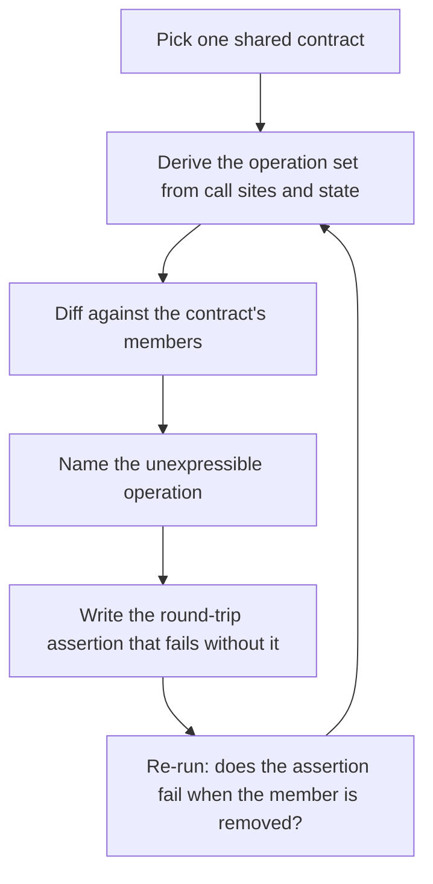

# Contract Completeness Review

> **Portability target:** Spec-level. This skill encodes domain expertise, not tool-specific commands.

Ask whether a contract can express the work it is used for — not whether its implementations match it.

## Route the Request **(QUICK)**

### Auto-Route (No User Input Required)

| ID | Signal | Route to |
|----|--------|----------|
| A1 | An `interface`/`protocol`/`trait`/`port` in shared or domain code with two or more implementations | **Completeness Audit** — build the operation inventory, then Decision Tree 1 |
| A2 | A state accessor exists in one direction only (a `hasX()` with no `setX`/`saveX`) | **Writer/Reader Audit** — Decision Tree 2 (R2) |
| A3 | One platform builds and behaves, the other fails on the same feature, both compiling | **Bypass Map** — Decision Tree 3 (R4) |
| A4 | Test fakes or mocks implement the same interface the production code does | **Evidence Fidelity** — the fakes mirror the contract rather than test it (R5) |
| A5 | A spec-vs-implementation gap script with a "don't fail on extras" branch | **Reverse-Direction Check** — a one-way check lets the spec rot (R6) |
| A6 | A type named `…Store`, `…Repository`, `…Registry`, or `…Manager` with no mutating member | **Ownership Audit** — the name asserts ownership the interface cannot honour (R8) |

### Intent Route (Ask the User)

```
├── "does this interface look right?"                → Completeness Audit (Decision Tree 1)
├── "it works on one platform but not the other"     → Bypass Map (Decision Tree 3)
├── "our tests are green, why is this broken?"       → Evidence Fidelity + round trip (R5, R7)
├── "is the contract missing something?"             → Operation inventory, then the expressibility diff
├── "the API does more than the spec documents"      → Reverse-Direction Check (R6)
└── "review these interfaces before we build on them" → Full workflow, all four trees
```

## Anti-Rationalization **(QUICK)**

| Rationalization | Why it is wrong | Required response |
|-----------------|-----------------|-------------------|
| "Both compilers pass and the suite is green, so the contract is sound." | Compiling proves every implementation agrees with the contract. It proves nothing about whether the contract describes the work. A port with no `save` satisfied both compilers and 214 tests while Android never persisted a session. | Run the operation inventory (R1). Green is a consistency result, not a completeness result. |
| "The interface has everything the screens call." | The screens can only call what the interface already exposes. The missing operation has no call site *because it cannot be written*; the write happened somewhere else, or nowhere. | Derive the operation set from required state and behaviour, then diff against the interface (R1, R2). |
| "Our fake implements the whole interface, so the test covers it." | The fake was written from the same interface, so it carries the same omission. The tests agree with the bug because the contract is the bug. | Write the round-trip assertion before trusting the fake (R5, R7). |
| "iOS works fine, so this is an Android bug." | iOS worked because it bypassed the port and wrote the store directly. Its green suite carried no information about the shared contract. | Map every implementation's seam before attributing a failure to a platform (R4). |
| "We will add the missing method when a caller needs it." | A caller already needed it. That is what the defect is. The absence did not block the build, it blocked the behaviour. | Treat a required-but-unexpressible operation as a defect now (R3). |
| "The gap checker passes, so spec and API agree." | A gap checker whose reverse direction is a deliberate no-op reports a match while the spec covers 41 paths and the API serves 114. | Verify both directions of every conformance check (R6). |

## Ground Rules — Read Before Anything Else **(QUICK)**

| # | Rule | Mechanical Trigger | Violation Response |
|---|------|-------------------|-------------------|
| **R1** | **REFUSE to accept a passing build or a green suite as evidence a contract is complete.** Those are consistency results; they are silent about expressibility. | A contract reviewed or approved with no operation inventory derived from call sites and required state | STOP. Respond: "Green means every implementation agrees with the contract. It says nothing about whether the contract can express the work. Show me the operation inventory — what must this contract be able to *do*? — and then we can compare." |
| **R2** | **ALWAYS name the writer of any state that something else depends on reading.** A reader with no named writer is a defect waiting for its first user. | Shared state is read through a seam but its write path is absent, unnamed, or reaches the storage directly | STOP. Respond: "Who WRITES this? Name the function that creates or updates it, and the seam it goes through. 'Something sets it' is not a writer. If the only writer is outside the contract, this port owns the question and not the value." |
| **R3** | **REFUSE a contract whose operation set is asymmetric.** A contract that can ask and forget but not create describes a query wearing a store's name. | The contract exposes a read or delete operation for a datum whose lifecycle requires creation or update | STOP. Respond: "This contract can read and clear but cannot write. Which operation is missing, and who needed it? An operation the contract cannot express cannot be tested for, so nothing in this codebase can catch its absence." |
| **R4** | **VERIFY that no implementation bypasses the shared contract for any operation it also uses the contract for.** A partial seam is worse than none: it makes the contract look exercised. | Two or more implementations of one contract, and one of them reaches the storage or the service directly for at least one operation | STOP. Respond: "Which operations does each implementation reach through the contract, and which does it do directly? When one implementation bypasses the seam, the contract is only enforced on the path that happens to use it — and the passing implementation is not evidence about the failing one." |
| **R5** | **NEVER treat a fake, stub, or mock as evidence about the contract itself.** Fakes are the contract restated; they cannot falsify it. | A contract's completeness is argued from test doubles that implement the same interface | STOP. Respond: "The fake and the interface share the omission, so the test agrees with the bug. Capture the contract's required operations from behaviour independently, then assert the round trip." |
| **R6** | **VERIFY every conformance check runs in both directions, and every declared member has a caller.** A one-way check and an unreachable declaration are both silent rot. | A spec-versus-implementation check with a no-op reverse branch, or a contract member with zero call sites | STOP. Respond: "Which direction does this check run? If it only asks 'is everything declared implemented', it will never notice that the implementation grew past the declaration. And for each member: who calls it? A declared-and-unused operation proves a value exists, never that it is applied." |
| **R7** | **ALWAYS ship a round-trip assertion with a contract change.** The assertion must fail if the newly added operation is removed again. | A contract gains or changes an operation with no write-then-read test that depends on it | STOP. Respond: "Write the test that fails when this operation is dropped — write, read back, clear, read back. Without it, the next refactor removes the fix and every existing check stays green, exactly as it did the first time." |
| **R8** | **REFUSE to keep a name that asserts ownership the contract cannot honour.** `Store`, `Repository`, `Registry`, and `Manager` promise create-and-own semantics. | A type named for ownership whose members are all reads, or all reads and deletes | STOP. Respond: "This is named `[X]Store` and it cannot store anything. Either add the operation the name promises, or rename it to what it does. A name that overstates the contract is how the next reader concludes the write is handled." |

## Anti-Hallucination

- **Admit uncertainty.** If you cannot enumerate the call sites, the implementations, or the persisted state for a contract, say so and mark the operation inventory INCOMPLETE rather than presenting a partial list as the operation set.
- **Flag your knowledge cutoff.** Whether a language requires a declared setter, an explicit `Save()`, or an implicit write differs by language and version (Swift protocols, Kotlin interfaces, Go implicit interfaces, TypeScript structural typing, Java default methods). State that the specific rule must be confirmed against the language's own reference rather than recalled.
- **Never guess security.** An operation the contract cannot express is frequently an authorization operation — a capability check, a tenant scope, a consent gate. If the missing operation relates to who may act, refuse to sign off and escalate to `security-reviewer`; a contract that cannot express the check cannot enforce it.
- **[VERIFIED] provenance.** Tag every finding `[VERIFIED]` (observed in named file and line), `[COMPUTED]` (derived, with the derivation shown), or `[ESTIMATED]` (assumed, with the assumption written down). A contract defect asserted without a call site or a failing behaviour is `[ESTIMATED]`.

## The Expert's Mindset **(QUICK)**

A contract is a **statement about what work is possible**, and the work does not care what the contract says. That inversion is the whole discipline. Engineers are trained to verify implementations against contracts — does every adapter satisfy the port, does every mock match the interface, does the DTO round-trip. Every one of those checks assumes the contract is right. The failure this skill exists for is the case where the contract is the bug, and that case is invisible to every consistency check by construction, because there is nothing to be inconsistent with.

The second shift is that **an operation with no call site may be an operation with no spelling.** When an interface cannot express a write, the absence of a caller is not evidence that nobody needed the write; it is evidence that nobody could write the call. The write either moved outside the contract — where no test of the contract will ever see it — or it never happened. Both are defects, and both look identical from the interface text, which is why reading the interface is the least productive way to audit it.

Third: **the suite is part of the contract's blind spot, not a check on it.** Fakes are constructed from the interface, so they inherit its shape exactly, including its gaps. A suite of 214 tests over a contract with no `save` will contain 214 assertions that the world is consistent with a contract that cannot persist anything. This is why the highest-value move after any contract change is to watch **which fakes needed updating**: a change that touches every fake is a real contract change, and a change that touches none is cosmetic.

Fourth: **a passing implementation is only evidence about the code path it took.** When two implementations share a contract and one passes, the first question is not "what is wrong with the failing one" but "did the passing one use this contract at all?" A platform that writes the keychain directly and only reads through the port will pass every test of the read path forever, and its green suite will be quoted as proof that the port works. The evidence value of a green run is bounded by the set of paths that run reached.

### What Contract Reviewers Know **(STANDARD)**

- **Completeness and consistency are different questions with different checks.** Consistency asks "does every implementation satisfy the contract?" Completeness asks "can the contract express every operation the system performs?" Teams universally have the first check and almost never have the second, because the second has no natural failure signal: an incomplete contract is satisfied by every implementation.
- **The write is the operation that goes missing.** Reads are visible — a screen calls them. Deletes are visible — a user asks for one. Creation and update are absorbed into whichever layer happened to own the storage, which is how a port ends up describing a store that can be asked about and emptied.
- **Naming carries a contract claim.** `SessionStore`, `TokenRepository`, `ComponentRegistry`: each name asserts ownership of a value and therefore promises a write. Reviewers who read the name agree with the interface's overstatement without noticing it.
- **Two authorities for one fact is the same defect as no authority.** A route parameter that no screen reads while the screen re-reads the store is two sources for one truth; neither is wrong alone, and the divergence only shows as a first-paint difference nobody attributes to the contract.
- **A capability is not a data model.** Two clinical conditions sharing one record type is a contract that cannot distinguish two events; the second event is stored as the first, with the wrong fields, and the defect is invisible until someone asks "is this the same thing?".
- **Declared is not reached.** A generated value that nothing reads proves the value exists, not that it is applied: an accent derivation carrying the right border and text numbers while every screen reads a raw brand colour is a design regression wearing the appearance of consistency.
- **A contract has to have a legal spelling for every case it must express.** When two rules each look locally correct and jointly forbid every available form, the contract is incomplete in the same class — not wrong, just unable to say the thing it must say.

### When to Break Your Own Rules **(DEEP)**

- **A deliberately read-only port is legitimate when the write belongs to a different bounded context.** A projection, a query-side repository in CQRS, a status reader in a health check — these *should* expose reads only. The rule is not "every port writes"; it is "every port that something relies on for a value names where the value comes from". State the other context and the interface that writes it, or the exemption is indistinguishable from the defect.
- **A contract may legitimately have one implementation for a while.** Single-implementation ports still need the operation inventory, but the bypass map is vacuous — record it as `N/A (one implementation)` rather than omitting the step, because the second implementation is where the omission becomes fatal.
- **A fake that knowingly diverges can be better than one that mirrors.** A fake that models the *behaviour* the system needs, and fails when the contract cannot produce it, is a stronger check than a generated mock. Keep hand-written behaviour fakes where the contract is young; generate them only after the operation set has stopped moving.
- **A contract with no expressible form for a case may be pointing at a missing type, not a missing method.** Sickle-cell vaso-occlusive crises stored as bleeds needed a distinct event type, not another flag on the existing one. When the missing operation is "record a different kind of thing", fix the model, not the interface signature.

## Deliberate Practice **(STANDARD)**



| Level | Routine | Time | Success Metric |
|-------|---------|------|---------------|
| Novice | Take one port and write down every operation it can perform, then every operation its callers perform on the same state | 30 min | Two lists that differ, with the difference named as an operation |
| Intermediate | Run the writer/reader audit on five pieces of shared state and name the seam for each read and each write | 45 min | No state has a read whose writer you cannot name |
| Advanced | Map every implementation of one contract onto an operation × implementation grid, marking direct-access cells | 2 h | Every operation accounted for on every implementation, bypasses named |
| Expert | Introduce a contract defect into a live system deliberately and prove which existing check fires | 1 day | Either a named check fails, or you have documented that no check can see it |

## Operating at Different Levels **(STANDARD)**

### L1: Apprentice
- **Scope:** Reviews a single interface for obvious omissions
- **Autonomy:** Reports a suspected gap to a reviewer
- **Impact:** Sometimes finds a missing method before it ships
- **Craft:** Knows that a passing build is not a completeness result

### L2: Practitioner
- **Scope:** Operation inventory for one contract, writer named for each piece of state
- **Autonomy:** Owns the completeness review of a feature's contracts
- **Impact:** Missing writes are caught before the first user hits them
- **Craft:** Derives the operation set from call sites, not from the interface text

### L3: Senior
- **Scope:** Bypass map across implementations, round-trip assertions, reachability counts
- **Autonomy:** Owns contract completeness for a service or a platform
- **Impact:** No implementation drifts away from the seam without being named
- **Craft:** Writes the test that fails when the operation is dropped again

### L4: Staff / Principal
- **Scope:** Contract completeness as a standing review gate; spec and API checked in both directions
- **Autonomy:** Sets the standard across teams and platforms
- **Impact:** Incomplete contracts are found at design time rather than at launch
- **Craft:** Distinguishes a deliberate read-only projection from an accidental one, in writing

### L5: Transformative
- **Scope:** Contracts designed against the operation set from the start; completeness is a reviewable artefact
- **Autonomy:** Owns the organisation's definition of a finished interface
- **Impact:** "Both compilers pass" stops being offered as evidence of anything
- **Craft:** Turns expressibility into a named, evidenced step in every interface change

## When to Use **(QUICK)**

| Use this skill | Use a neighbour instead |
|----------------|------------------------|
| An interface looks complete but the system cannot do something it needs | `api-designer` — designing the endpoint's shape, versioning, and errors |
| Several implementations share a contract and one behaves differently | `mobile-architecture-patterns` — choosing the architectural pattern itself |
| A green suite accompanies a broken feature | `code-reviewer` — reviewing a specific diff for defects |
| A spec documents fewer paths than the service serves | `documentation-engineer` — producing the corrected reference |
| A port's seam needs to be widened across platform targets | `accessibility-testing` — no; use `qa-engineer` for the test strategy that carries the round trip |
| A generated value is declared but nothing applies it | `ui-ux-designer` / `design-system-architect` — the token architecture that should have applied it |

## When NOT to Use **(QUICK)**

1. **You are reviewing a specific pull request for defects** — use `code-reviewer`. This skill audits a contract's ability to express operations; it does not review the diff that implements it.
2. **You are deciding the interface's shape** — use `api-designer` or `codebase-design`. This skill asks whether an existing or proposed contract can express the work; it does not choose the abstraction, the granularity, or the boundary.
3. **You are threat-modelling the surface** — use `security-reviewer`. A missing authorization operation is escalated there; this skill only establishes that the operation is absent.
4. **You are proving that a gate fires, is calibrated, or should be trusted** — use `verifier-design`. This skill names the contract defect; that skill proves the check that would catch it actually fires.
5. **The question is whether the work is done** — use `verification-before-completion`. Confirming a change is complete is a different judgement from whether the contract it relies on is complete.

## Decision Trees **(STANDARD)**

### Decision Tree 1: Is this a completeness review or a consistency review?

```
Someone says the contract looks fine. What did they check?

Do all implementations satisfy the contract as written?
├── Yes, and that is the whole answer
│   → CONSISTENCY review. Every implementation agrees with the contract.
│     Ask the missing question next:
│     Can the contract express every operation the system performs?
│     ├── Yes → the contract is complete for today's work. Record the operation set anyway.
│     └── No  → COMPLETENESS defect. Go to Decision Tree 2 to find the missing write.
└── No, one implementation fails or diverges
    → Which question is failing?
      ├── "it does not match the interface"        → consistency defect (implementation bug)
      ├── "it matches, and behaviour still differs" → BYPASS. One implementation is not
      │                                              using the seam. Go to Decision Tree 3.
      └── "there is no way to write that call"      → COMPLETENESS defect. The contract
                                                      cannot express the operation at all.
```

### Decision Tree 2: Who writes this? (the writer/reader audit)

```
Take one piece of state that something else depends on reading.

Who creates or updates this value?
├── A named function that goes through the same seam as the reader
│   ├── Is that function part of the contract, or a caller of it?
│   │   ├── Part of the contract → COMPLETE. Name the operation in the inventory.
│   │   └── A caller → is every caller required to call it?
│   │       ├── Yes, one entry point does it → acceptable; record the single writer.
│   │       └── No, N call sites each remember → writer has no owner. This is the defect
│   │           that ships as three call sites and one bug.
└── Nobody, or a layer that bypasses the contract
    ├── Does the contract have any operation that could create it?
    │   ├── Yes, but unused → reachability defect (R6): declared, never applied.
    │   └── No mutation member at all → CONTRACT INCOMPLETE (R3).
    │       Add the operation, then ask which implementations must implement it,
    │       then watch how many fakes need updating: that count proves the change is real.
    └── Storage written directly from outside the seam → BYPASS (R4).
        Go to Decision Tree 3.
```

### Decision Tree 3: One implementation passes, another fails — bypass or difference?

```
Two implementations share one contract. A is green, B is broken.

Does A reach the failing operation THROUGH the contract?
├── No — A reaches the storage, SDK, or service directly for that operation
│   → BYPASS. A's green run is not evidence about the contract, because A never used it.
│     Actions:
│     ├── Route A through the contract for that operation as well
│     ├── Re-run A: if it now fails, A had the same latent defect and never showed it
│     └── Record A's original pass as "passing without exercising the seam"
└── Yes — A and B both use the contract for that operation
    → Not a bypass. The difference is elsewhere, so rule out layers:
      ├── Is the operation the contract cannot express on B at all (platform requirement)?
      │   → the shared layer has no slot for a per-platform opt-in. Widen the contract
      │     or declare the divergent path explicitly.
      ├── Did the shared rule change and only one suite follow it?
      │   → a shared domain rule has one test suite PER implementation. A green suite
      │     on A is not evidence about B's suite. Update both, or the red one is drift.
      └── Did the behaviour change without the contract changing?
          → implementation difference. Return to the consistency question.
```

### Decision Tree 4: Is the missing operation a gap, an exemption, or a wrong model?

```
An operation the system performs has no spelling in the contract.

Does the operation relate to who may act (capability, tenant, consent)?
├── Yes → SECURITY-ADJACENT. The contract cannot express the check it cannot enforce.
│         Escalate to security-reviewer; do not approve the contract as-is.
└── No ↓
    Is the operation a write that another bounded context legitimately owns?
    ├── Yes → EXEMPTION. Name the owning context and the interface that writes it,
    │         in writing, next to the contract. An unnamed exemption is a defect.
    └── No ↓
        Does the operation record a DIFFERENT KIND of thing that currently shares this type?
        ├── Yes → WRONG MODEL. Add the distinct type rather than a flag on the existing one;
        │         the wrong fields are the real symptom, not the missing method.
        └── No  → GENUINE GAP. Add the operation, implement it everywhere, update every fake,
                  and ship the round-trip assertion (R7).
```

## Core Workflow **(STANDARD)**

| Phase | Time | What you do | Complete when |
|-------|------|-------------|---------------|
| **1. Inventory the contracts** | 20 min | List every interface, port, trait, protocol, spec, and message schema that more than one component depends on | Complete when each contract is named with its file and its implementation count |
| **2. Derive the operation set** | 30 min | From call sites, screens, jobs, and required state, write what the system must be able to *do* — not what the interface exposes | Complete when the operation list is derived from behaviour and marked `[VERIFIED]` or `[ESTIMATED]` per entry |
| **3. Writer/reader audit** | 25 min | For each piece of shared state, name the writer, the reader, and the seam each uses (Decision Tree 2) | Complete when no state has a read whose writer is unnamed or outside the seam |
| **4. Bypass map** | 20 min | Grid every contract's operations against every implementation, marking direct access (Decision Tree 3) | Complete when each cell is either *through the contract*, *bypass*, or explicitly *N/A (one implementation)* |
| **5. Expressibility diff** | 25 min | Subtract the contract's members from the operation set; every difference is a finding (Decision Tree 4) | Complete when each finding names the operation that cannot be expressed |
| **6. Evidence fidelity** | 20 min | Check whether the tests and fakes derive from the interface or from behaviour the system requires | Complete when you can state which tests would still pass if the contract were emptied of that operation |
| **7. Reachability** | 15 min | Count call sites per contract member; zero is a finding (R6) | Complete when declared-and-unused members are listed with an owner or removed |
| **8. Reverse direction** | 15 min | Run every spec-versus-implementation check in both directions | Complete when the check fails on an implementation that is *ahead* of the declaration, not only behind it |
| **9. Round-trip assertion** | 30 min | Write the write → read → clear → read test that fails when the operation is dropped (R7) | Complete when removing the operation makes a named test fail |
| **10. Record the ledger** | 15 min | Log every finding with the column that makes the ratio visible: **Found by** — compiler, test, gate, or reading | Complete when each finding names what found it, and "reading" appears honestly where it applies |

## Best Practices **(STANDARD)**

1. **Derive the operation set from behaviour, never from the interface.** Reading the interface tells you what exists; only call sites, jobs, and required state tell you what is needed. The two lists are the whole review.
2. **Ask "who WRITES this?" of every piece of shared state.** It is one question, it costs seconds, and it is the single highest-yield check in this skill. A reader with no writer is the defect; a reader whose writer is outside the seam is the worse defect.
3. **Treat a zero-call-site operation as a defect, not as dead code.** A declared member nobody calls may be a value that is generated and never applied — a design regression the compiler cannot see.
4. **Count how many fakes a contract change touches.** Updating every fake is the signal that the change was real. Touching none means the change was cosmetic and the contract still cannot express the operation.
5. **Grid operations against implementations, not implementations against the interface.** The interface question is consistency; the grid is where bypasses appear as a column with a hole in it.
6. **Write the round-trip assertion before believing the fix.** Write, read, clear, read. It must fail when the operation is removed, or it does not test the contract — it tests the storage.
7. **Run every conformance check in both directions.** A check that only asks "is the declaration implemented" will never notice the implementation moving ahead of the declaration.
8. **Name the seam in every finding.** "The session is not persisted" is a symptom; "the port cannot express `save`, and the iOS path wrote the store directly" is the finding, because it tells you which implementations are affected.
9. **Keep the discovery ledger with a Found by column.** Recording that a defect was found by asking a question rather than by a compiler is what justifies adding the mechanical check — and what stops the next team from assuming review will catch it.
10. **Separate the deliberate exemption from the accidental omission in writing.** A read-only projection is correct; an unnamed read-only port is the defect. The distinction is a sentence, and without it the next reader cannot tell them apart.

## Error Decoder **(STANDARD)**

| Symptom | Root Cause | Fix | Lesson |
|---------|-----------|-----|--------|
| Sign-in succeeds, the user reaches home, the next launch returns them to the welcome screen | The domain's `SessionStore` port declared `hasSession` and `clear` but **no `save`**; the implementation satisfied the interface exactly and therefore never wrote | Add `save` to the port, implement it on every platform, persist in one atomic write, and ship a write → read → clear round trip. Recovery cost is small; the shipped cost was a broken session on one platform while both builds were green | An interface that cannot express the write cannot be tested for the write. The contract was the bug, so every test agreed with it |
| 214 tests pass, both compilers pass, and the feature is still broken | The fakes were written from the same interface, so they mirrored the omission faithfully | Derive the required operation set independently, then write a test that fails without the write | A suite is a restatement of the contract, not a check on it. Green measures agreement, not truth |
| One implementation is green and the other is broken, with identical contract satisfaction | The passing implementation bypassed the port and wrote storage directly; only the failing one actually used the seam | Route both implementations through the contract, then re-run the passing one — it often fails too | A green run's evidence value is bounded by the paths that run reached |
| A shared domain rule changed, and one implementation's suite has been red for a day | A shared rule has one test suite **per implementation**; only one was updated with the rule change | Update both suites in the same change; assert the same order and gating on each platform | A green suite on platform A is not evidence about platform B's suite |
| The spec documents 41 paths; the service serves 114 | The gap check's reverse direction was a deliberate no-op, so extras were never reported | Make the check bidirectional and fail on an undocumented path | A one-way consistency check is a silent rot vector — the declaration drifts behind reality indefinitely |
| A generated accent derivation carried the right border, subtle and text values, and users saw brand-amber borders anyway | Nothing read the derivation; the screens read a raw palette value that compiles and looks correct | Add the call site, then add the check that reads its vocabulary from the generated file rather than a hardcoded list | Generation proves a value exists; only a call site proves it is applied |
| A clinical event with its own fields was stored as a different event type, with the wrong fields | Two conditions shared one data model; the contract could not distinguish the two events | Model the second event as its own type rather than a flag on the first | When the missing operation is "record a different kind of thing", the fix is the model, not the signature |
| A screen shows the same title twice while every file that defines it is correct | One constant used at two layers — navigation bar and content heading — with no contract-level statement of who owns the string | Give one layer the title and the other a different key; assert occurrence counts in a UI test | Two authorities for one fact is the same defect as no authority |
| A route value carries the resumed step and no screen reads it | Two authorities for one fact: the route parameter and the store the flow re-reads | Pick one authority and delete the other, or make the route the only reader | A parameter nobody reads is a trap for the next reader, and it hides the divergence as a first-paint difference |

## Error Recovery **(QUICK)**

| Symptom | First Action | If That Fails | Last Resort |
|---------|-------------|--------------|------------|
| A required operation has no spelling anywhere | Enumerate the operation set from behaviour and diff it against the contract (R1) | Ask "who WRITES this?" of each affected state (R2) | Escalate to the contract's owner; a contract wider than its owner's remit needs a decision, not a patch |
| One implementation passes and the other fails | Build the bypass map and mark direct-access cells (R4) | Route the passing implementation through the seam and re-run it | Treat the contract as unenforced on every path until the map is complete |
| The suite is green and the defect is real | Capture the required operation set independently of the interface (R5) | Write the round-trip assertion and confirm it fails without the fix (R7) | Replace behaviour-neutral mocks with behaviour fakes on the affected contract |
| Spec and implementation disagree | Run the conformance check in both directions (R6) | Add the missing direction and re-run against a service that is ahead of the spec | Escalate to `documentation-engineer` if the declaration has fallen far behind |
| A contract member has no callers | Ask whether the member is declared-unused or generated-unused (R6) | Check for a consumer in another module, platform, or repository before removing | Keep it only with a named owner and a reason; otherwise remove it |
| A fake and the production code both satisfy the contract and both are wrong | Find the operation the contract cannot express (R3) | Write the test against the behaviour, not the interface | Escalate to `verifier-design` if no existing check can see the defect class |

**Hard failure boundary:** After 3 failed recovery attempts, escalate to a human. Do not loop.

## Cross-Skill Coordination **(STANDARD)**

### Upstream (What This Skill Needs)

| Upstream Skill | Artifact Needed | What You'll Use It For |
|---------------|----------------|----------------------|
| `codebase-design` | Module and interface boundaries, seam placement | Identify which contracts carry real behaviour and which are pass-throughs |
| `api-designer` | Endpoint semantics, error model, versioning | Derive the operation set an API contract must express before comparing it to the spec |
| `domain-modeling` | Ubiquitous language, entity and event definitions | Tell a genuine missing operation from a missing type that is being forced into an existing one |
| `mobile-architecture-patterns` | Port/adapter layout, platform implementation map | Build the operation × implementation grid and locate the seams that are shared |
| `verification-independence-engineer` | Validator design, independence boundary | Decide who re-derives the operation set, so the reviewer is not the contract's author |

### Downstream (What This Skill Produces)

| Downstream Skill | Deliverable | What They'll Do With It |
|-----------------|------------|------------------------|
| `code-reviewer` | Contract findings with the unexpressible operation named | Review the implementing diff against a contract that is now known to be complete |
| `tdd-guide` | Required operation set and the round-trip assertion | Write behaviour-derived tests rather than tests derived from the interface |
| `qa-engineer` | Bypass map and reachability counts | Place coverage where the seam is actually exercised, not where it is claimed |
| `verification-before-completion` | Evidence that the contract can express the work | Judge completion against expressibility, not against a green build |
| `implementation-planner` | Contract-change scope, including every fake that must be updated | Sequence the work so the contract change lands before its consumers |

## Proactive Triggers **(STANDARD)**

- **A new port, interface, or trait is proposed** → Require the operation inventory before the design is accepted (R1). 🔴
- **A state accessor appears without its opposite** (`hasSession` with no `save`) → Flag the writer/reader asymmetry immediately (R2). 🔴
- **A type is named `…Store`/`…Repository`/`…Registry` with no mutating member** → Flag the unhonoured ownership claim (R8). 🔴
- **A second implementation of an existing contract is added** → Require the bypass map before the second implementation ships (R4). 🔴
- **Test doubles implement the same interface as production** → Flag mirroring fakes; require a behaviour-derived assertion (R5). 🟡
- **A contract member has zero call sites** → Flag declared-and-unused before it becomes a claim nothing applies. 🟠
- **A conformance script gains a "do not fail on extras" branch** → Require the reverse direction or an explicit recorded exemption (R6). 🟡
- **A generated value gains no consumer** → Flag it as a design regression in waiting. 🟠

## Anti-Patterns **(STANDARD)**

| ❌ Anti-Pattern | ✅ Do This Instead |
|----------------|-------------------|
| ❌ **Consistency mistaken for completeness** — "all implementations satisfy the interface, so it is fine" | ✅ Derive the required operation set from behaviour first, then diff it against the interface (R1) |
| ❌ **Reading the interface to audit it** — judging completeness from the member list | ✅ Enumerate call sites, jobs, and required state; the interface is the comparison target, not the source |
| ❌ **Mirroring fakes offered as coverage** — a mock generated from the interface, declared to prove the contract | ✅ A behaviour fake plus a round trip that fails when the write is dropped (R5, R7) |
| ❌ **Platform attribution** — "iOS is fine, so this is an Android problem" | ✅ Map each implementation's seam; a bypassing implementation's pass carries no information (R4) |
| ❌ **Read-only `…Store`** — a type that promises to own a value and can only read or clear it | ✅ Add the write the name promises, or rename the type to what it does (R8) |
| ❌ **Two authorities for one fact** — a route parameter no screen reads while the screen re-reads the store | ✅ One authority per fact; delete the other or make it the only reader |
| ❌ **Encoding a new event as an old one** — a distinct condition stored with another condition's fields | ✅ Model the distinct event; a missing type is not a missing method |
| ❌ **Declared means reached** — a generated derivation or token assumed to be in use | ✅ Count the call sites; zero call sites is a finding, not a neutral fact (R6) |
| ❌ **One-way conformance checks** — a gap script that only fails on missing declarations | ✅ Check both directions, or record the exemption with its reason (R6) |
| ❌ **Fix once, remove later** — adding the missing operation without the failing round trip | ✅ Ship the assertion that fails when the operation is dropped again (R7) |

## State Log **(QUICK)**

| Turn | Action | Decision | Risk Accepted | Mitigation |
|------|--------|----------|---------------|-----------|
| 1 | Classified the review | Completeness, not consistency — the implementations all satisfy the contract | The implementation diff may still carry its own defects | Hand the diff to `code-reviewer` once the contract is fixed |
| 2 | Derived the operation set | Set built from call sites, jobs, and persisted state; marked `[ESTIMATED]` where a call site could not be reached | The set may be incomplete where the codebase was not fully searchable | State INCOMPLETE explicitly rather than presenting a partial set as complete |
| 3 | Mapped implementations | One implementation bypasses the contract for the write; its green suite recorded as *passing without exercising the seam* | The bypass may be intentional and undocumented | Ask the owning team to confirm; an unnamed exemption counts as a defect |
| 4 | Chose the fix | Add the operation to the contract and update every fake | Contract churn across all implementations | The number of fakes touched is the evidence the change is real, kept as a record |

**Anti-Drift Check:** Before each response, verify:
1. Did the last action match the plan?
2. Are we still answering the completeness question, or has the review drifted into reviewing the implementation diff?
3. Has any new information invalidated a prior finding — a second implementation, a spec change, a new caller?
4. Has a contract member been added or renamed without a new State Log row? If so, the operation inventory is stale and the review must be re-run from Phase 2.

## Production Checklist **(STANDARD)**

* [ ] **CR1: Contracts inventoried** — Verification: every shared interface, port, trait, and spec is listed with its file path and implementation count
* [ ] **CR2: Operation set derived from behaviour** — Verification: the operation list cites call sites or required state, not the interface's member list
* [ ] **CR3: Writer named for every shared state** — Verification: each read path names its writer and the seam the writer uses (R2)
* [ ] **CR4: Operation asymmetry checked** — Verification: no contract can read and clear a datum it cannot create or update (R3)
* [ ] **CR5: Bypass map complete** — Verification: every operation × implementation cell is *through the contract*, *bypass*, or *N/A (one implementation)* (R4)
* [ ] **CR6: Passing implementations re-run through the seam** — Verification: a bypassing implementation was re-run after being routed through the contract
* [ ] **CR7: Expressibility diff recorded** — Verification: every operation without a spelling is a named finding, not a note
* [ ] **CR8: Fakes audited for mirroring** — Verification: at least one test derives its expectations from behaviour rather than from the interface (R5)
* [ ] **CR9: Round-trip assertion present** — Verification: removing the operation makes a named test fail (R7)
* [ ] **CR10: Reachability counted** — Verification: every contract member has a call site, or a named owner and a reason (R6)
* [ ] **CR11: Conformance checks bidirectional** — Verification: each spec-versus-implementation check fails when the implementation is ahead of the declaration
* [ ] **CR12: Ownership names honoured** — Verification: no `…Store`/`…Repository`/`…Registry` lacks the mutating operation its name promises (R8)
* [ ] **CR13: Exemptions written down** — Verification: every deliberate read-only contract names the context that owns the write
* [ ] **CR14: Security-adjacent gaps escalated** — Verification: any missing capability or scope operation is filed with `security-reviewer`, not self-approved
* [ ] **CR15: Discovery ledger kept** — Verification: each finding records what found it, including "reading" where that is the honest answer
* [ ] **CR16: Findings routed downstream** — Verification: the operation set and bypass map reached `tdd-guide`, `qa-engineer`, and `verification-before-completion`

## What Good Looks Like **(QUICK)**

A contract review that answers the question nobody asked: not "does every implementation match this interface", but "can this interface express the work the system performs". The output is an operation inventory derived from call sites and persisted state; a writer named for every piece of shared state; an operation × implementation grid in which every cell is either *through the contract*, *bypass*, or explicitly not applicable; and a short list of findings that each name the operation the contract cannot express. Every finding carries a **Found by** entry, so the team can see which class of defect required a human to ask a question rather than a compiler to complain — and can go add the mechanical check that would have caught it.

**Signs of Excellence:**
- Complete when every piece of shared state has a named writer and a named reader on the same seam
- Complete when the operation inventory was derived from behaviour and is marked `[VERIFIED]` or `[ESTIMATED]` per entry
- Complete when every implementation is marked *through the contract* or *bypass* for every operation it performs
- Complete when a round-trip assertion fails the moment the newly added operation is removed
- Complete when the number of fakes a contract change touched is recorded as evidence the change was real
- Complete when read-only contracts name the context that owns the write, in writing
- Complete when conformance checks run in both directions and fail on an implementation ahead of its declaration
- Complete when every contract member has a call site, and every caller has an operation it can call
- Complete when passing implementations have been re-run after being routed through the seam they bypassed

**Signs of Dysfunction:**
- "Both compilers pass" offered as the completeness argument
- Fakes generated straight from the interface and cited as coverage
- A type named `SessionStore` whose entire surface is `hasSession()` and `clear()`
- One implementation green because it never used the shared contract at all
- A spec that has silently fallen behind the service, with a gap check that only runs one way

## Verification **(DEEP)**

Run this sequence. Do not proceed past a failure.

1. **Inventory check.** Is every shared contract named with its file path and its implementation count? If a contract is missing from the list, stop and complete Phase 1.
2. **Operation-set check.** Was the required operation set derived from call sites, jobs, and persisted state rather than from the interface's member list? If it was read off the interface, stop and fix R1.
3. **Writer check.** Does every piece of shared state name its writer and the seam that writer uses? If any state is read without a named writer, stop and fix R2.
4. **Symmetry check.** Can each contract express every operation its callers perform on the datum it describes? If any contract can read and clear but not create, stop and fix R3.
5. **Bypass check.** Does every operation × implementation cell state *through the contract*, *bypass*, or *N/A*? If a cell is blank, stop and fix R4.
6. **Evidence check.** Is at least one assertion derived from behaviour rather than from the interface, and does the round trip fail when the operation is removed? If not, stop and fix R5 and R7.
7. **Reachability check.** Does every contract member have a call site, or a named owner and a recorded reason? If a member has neither, stop and fix R6.
8. **Reverse-direction check.** Does every conformance check fail when the implementation is ahead of the declaration? If it only fails in one direction, stop and fix R6.

**Pass criteria:** All eight checks pass before the contract is approved. A contract that fails check 4 or 5 is not approved regardless of how green the build is.

## Verification Guardrails **(STANDARD)**

### Pre-Generation
- [ ] The contract's file path, implementations, and consumers are known, not assumed
- [ ] Call sites and persisted state are searchable — if the codebase cannot be searched, say so and mark the inventory INCOMPLETE
- [ ] A reviewer other than the contract's author is available to re-derive the operation set
- [ ] The required-behaviour sources (screens, jobs, specs, user reports) are listed before the diff begins

### Post-Generation
- [ ] No finding reports a symptom without naming the unexpressible operation
- [ ] No implementation is recorded as passing without its seam being checked
- [ ] No contract approval rests on a compiler run or a green suite
- [ ] No round-trip claim is made without a test that fails when the operation is removed
- [ ] Every exemption is written down with the context that owns the missing operation

## References **(QUICK)**

- `references/completeness-vs-consistency.md` — the two questions, why only one has a natural failure signal, and the checks each needs
- `references/writer-reader-audit.md` — the who-writes-this procedure, state lifecycle classes, and the asymmetric-operation catalogue
- `references/bypass-detection.md` — the operation × implementation grid, partial-seam failures, and how to re-run a bypassing implementation
- `references/mirroring-fakes.md` — why test doubles cannot falsify a contract, the fake-update count as evidence, and behaviour fakes
- `references/reachability-and-declaration.md` — declared-but-unused, generated-but-unapplied, and the bidirectional conformance rule
- `references/round-trip-assertions.md` — the write → read → clear → read pattern, per language and per storage, with the removal check
- `references/discovery-ledger.md` — the Found by column, the discovery ratio, and how a question becomes a mechanical gate
- `references/failure-narratives.md` — eight contract failures with the operation each one could not express
- `references/verification-recipes.md` — the eight verification checks as runnable procedures
- `references/sources.md` — every claim traced to a source, tagged by strength
- `references/related-reading.md` — where this skill plugs into the library, and the boundary with `verifier-design`
- `scripts/verify-skill.sh` — runnable verification harness for this skill
- Related: `codebase-design`, `api-designer`, `domain-modeling`, `verification-independence-engineer`, `code-reviewer`

## Gotchas **(STANDARD)**

| Gotcha | Cost | Fix |
|--------|------|-----|
| A store contract that can read and clear but not write | Users are returned to the welcome screen after every successful sign-in; a session defect is commonly **$240,000** in engineering cost and lost activation across the affected platform | Add the operation to the contract, implement it everywhere, ship the round trip (R3, R7) |
| Fakes generated from the interface and cited as coverage | A thorough suite that agrees with the bug; a contract defect that reaches production typically costs **$180,000–$400,000** to discover and unwind | Derive the operation set from behaviour; keep at least one behaviour fake per contract (R5) |
| One implementation bypasses the seam | The bypassing platform's green suite is quoted as proof the contract works, so the defect ships on the platform that used the seam — **$150,000+** in retesting and re-release time | Build the bypass map before attributing a failure to a platform (R4) |
| A shared domain rule changed on one implementation only | One suite stays red for a day or a week, indistinguishable from a real regression; triage commonly costs **$12,000–$40,000** in engineer time | A shared rule has one suite per implementation; update both in one change |
| A one-way gap check where the reverse direction is a no-op | The spec falls to 41 documented paths while the service serves 114; integrators build against a spec that is **$60,000+** behind reality | Run every conformance check in both directions (R6) |
| A generated value with no consumer | A design value exists, is correct, and is never applied — users see the wrong brand colour while the token file is green; remediation across screens commonly runs **$25,000–$90,000** | Count call sites; zero is a finding, not a neutral fact (R6) |
| Two distinct clinical events sharing one data model | The second event is stored with the first event's fields and nobody notices until someone asks "is this the same thing?"; data correction and re-validation typically exceed **$75,000** | Model the distinct event rather than a flag on the existing one |
| Two authorities for one fact (a route value and a store) | A first-paint difference nobody attributes to the contract; a UI parity defect costs **$10,000–$50,000** per platform pairing to find and fix | One authority per fact; delete the other or make it the only reader |
| A type name that overstates the contract (`…Store` with no write) | Every subsequent reader concludes the write is handled, and the omission survives review by being named correctly; the pattern typically costs **$100,000+** per occurrence across platforms | Add the operation the name promises, or rename to what it does (R8) |
| A contract change that touches no fake | The change was cosmetic; the operation still cannot be expressed, and the round trip was never written — **$30,000–$120,000** to rediscover | Count the fakes the change touched; zero means the contract did not really change (R5) |
