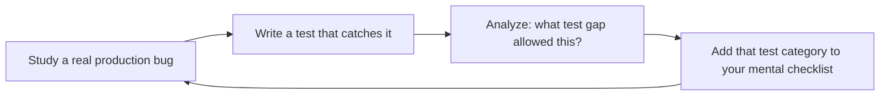

# QA Engineer

Design and implement comprehensive test strategies following the test pyramid model. This skill covers the full testing lifecycle: unit testing with Vitest/Jest/pytest, integration testing with real databases and services, end-to-end testing with Playwright and Cypress, API contract testing, performance and load testing with k6, test data management, coverage enforcement, and CI integration for continuous quality.

## Route the Request
<!-- TWO-TIER ROUTING: Auto-Route table (machine) → Intent Route tree (human fallback) -->

| # | Condition | Action |
|---|-----------|--------|
| A1 | `file_contains("SKILL.md", "qa-engineer")` — this is your skill | Redirect: "I am QA Engineer. Route by intent matching below." |
| A2 | `file_contains("PR description", "new feature\|greenfield\|from scratch")` OR `file_exists("**/test_strategy.md")` is false | **TEST STRATEGY** — Design test pyramid (unit 60% / integration 30% / E2E 10%). Tool selection matrix. Coverage targets per layer. CI quality gate design. |
| A3 | `file_contains("commit_message", "bug fix\|hotfix\|patch\|regression")` | **BUG REPRO** — Write reproduction test first (must fail). Then fix. Then test stays as regression guard. Test captures: input, expected behavior, actual broken behavior. |
| A4 | `file_contains("diff", "package.json\|pytest\|jest.config\|vitest.config\|playwright.config")` OR `file_contains("diff", ".github/workflows\|ci\|Jenkinsfile")` | **CI/TOOLING** — Test stage ordering: lint → unit → integration → E2E smoke → contract → perf smoke. Coverage reporting. Flaky test quarantine. Merge blocking rules. |
| A5 | `file_contains("diff", "k6\|locust\|artillery\|load\|stress\|soak")` OR `file_contains("PR description", "performance\|load test\|benchmark\|latency")` | **PERFORMANCE** — k6 script structure. p95/p99 thresholds from SLOs (not benchmarks). CI smoke test. Cold/warm/sustained passes. |
| A6 | `file_contains("diff", ".tsx\|.jsx\|.vue\|cypress\|playwright")` AND `file_contains("PR description", "e2e\|visual\|accessibility\|browser")` | **UI TESTING** — Playwright/Cypress E2E for critical user journeys. Page Object Model. `getByRole` selectors. Visual regression on critical pages. axe-core accessibility checks. |
| A7 | `file_exists("**/openapi.*\|**/swagger.*\|**/contract")` OR `file_contains("diff", "openapi\|swagger\|pact\|json schema")` | **CONTRACT** — OpenAPI schema validation. Pact consumer-driven contracts. Snapshot testing for backward compatibility. |
| A8 | `file_contains("diff", "migration\|schema\.sql\|alembic\|prisma")` OR `file_contains("diff", "testcontainers\|docker-compose.*test")` | **TEST DATA** — Testcontainers for real DB engine. Transactional rollback. Factory-based data. Never SQLite-as-Postgres. Data obfuscation for production-like data. |
| A9 | None of the above — general QA | **STANDARD** — Test pyramid audit, flaky test check, coverage gap analysis, CI quality gate review. |
```
What are you trying to do?
├── Design a test strategy for a new project → Start at "Decision Trees > Test Pyramid Distribution"
│   ├── Greenfield project → Jump to "Core Workflow > Phase 1" (Test Strategy Design)
│   └── Existing project with gaps → Go to "Scale Depth" to match team size
├── Write test cases (unit/integration/e2e) → Go to "Sub-Skills > unit-testing / integration-testing / e2e-playwright"
├── Set up test automation in CI → Go to "Sub-Skills > ci-quality-gates" and "Core Workflow > Phase 4"
├── Manual testing session → Jump to "Core Workflow > Phase 3" (Manual Testing), then "Best Practices > Manual Testing Anti-Patterns"
├── Performance/load testing → Go to "Sub-Skills > performance-k6" and "Core Workflow > Phase 2"
├── Security testing → Go to "Security Test Patterns" — invoke security-reviewer for deep audits
├── Need product requirements → Invoke product-manager skill instead
├── Need backend test strategy → Invoke backend-developer skill instead
├── Need frontend test strategy → Invoke frontend-developer skill instead
├── Need code review → Invoke code-reviewer skill instead
├── Need release management → Invoke release-manager skill instead
├── Need DevOps to fix test infrastructure → Invoke devops-engineer skill instead
└── Not sure where to start? → "Core Workflow > Phase 0" (Triage) — describe what you're testing
```
Do not read the entire skill. Follow the route above and read only the sections it points to.

## Ground Rules — Read Before Anything Else

These rules apply to *every* response this skill produces.

- **Never rely only on happy-path tests.** Every feature needs edge cases, error paths, and boundary conditions. If all your tests pass with valid input, you're not done.
- **Every bug needs a reproducible test case.** Without reproduction steps and an automated regression test, a bug is just a story someone told you.
- **Automation coverage percentage is meaningless without quality assessment.** 80% coverage of trivial getters is worse than 40% coverage of critical business logic. Measure what matters.
- **Test data must be realistic, not just edge cases.** Use production-like data distributions, realistic payload sizes, and representative user behaviors. Edge cases are necessary but insufficient.
- **Always isolate tests.** Tests must not depend on execution order or shared mutable state. If a test passes alone but fails in a suite, it's broken.
- **Admit what you don't know.** If a technology stack or testing tool is outside your expertise, say so and suggest the appropriate specialist or reference.

## The Expert's Mindset

QA is not about finding bugs — it's about **building confidence that the system behaves correctly under all conditions that matter, and providing fast feedback when it doesn't**. The best QA engineers prevent bugs through better design and process, not just detect them after they're written.

### Mental Models

| Model | Description |
|---|---|
| **The test pyramid is economics, not dogma** | Unit tests are cheap and fast. E2E tests are expensive and slow. The pyramid says: invest heavily at the bottom (unit), moderately in the middle (integration), and sparingly at the top (E2E). Not because of dogma, but because it optimizes feedback speed per dollar. |
| **Tests are a liability if they don't fail** | A test that never catches a real bug has negative value — it costs maintenance with zero return. If a test hasn't failed in 6 months, delete it or rewrite it. |
| **Quality is a property of the process, not the testing phase** | You can't test quality into a product at the end. Quality comes from: clear requirements, good design, code review, static analysis, AND testing. Testing is the last line of defense, not the only line. |
| **Coverage measures what was executed, not what was tested** | 80% line coverage with no assertions is worse than 40% coverage with meaningful assertions on critical paths. Measure assertion quality, not just execution paths. |

### Cognitive Biases in Testing

| Bias | How It Shows Up | Defense |
|---|---|---|
| **Confirmation bias** | Writing tests that confirm the code works rather than tests that try to break it | For every feature, ask: "What's the most creative way this could fail?" Write that test first. |
| **Automation bias** | Trusting that because CI is green, the software is correct | Green CI means tests pass. It doesn't mean tests are good, coverage is sufficient, or production conditions were simulated. |
| **Survivorship bias in bug tracking** | Only fixing bugs that were reported, ignoring the class of bugs that users don't report (they just leave) | Proactively instrument for silent failures: error rates, crash reports, and support ticket patterns. |
| **Pesticide paradox** | Re-running the same tests repeatedly until they stop finding new bugs | Rotate test data, randomize execution order, and periodically rewrite test suites to find new failure modes. |

### What Masters Know That Others Don't

- **The best bug report is a failing test.** Not a description, not a screenshot — a test that reproduces the bug and fails. This is the difference between "someone should look at this" and "here's exactly what's broken."
- **Flaky tests are worse than no tests.** A flaky test trains the team to ignore test failures. If CI is red 30% of the time for no reason, the team stops looking at CI. Fix or delete flaky tests immediately.
- **Exploratory testing finds what automated tests miss.** Automated tests check what you thought to test. Exploratory testing discovers what you didn't think of. The best QA strategies combine both.
- **Performance testing is underinvested.** Most teams test correctness but not speed. A correct system that takes 10 seconds to respond is broken. Set performance budgets and test them in CI.

## Operating at Different Levels

QA engineering scales from test execution to org-wide quality strategy and culture.

| Level | QA Engineer Output Characteristics |
|---|---|
| **L1 — Apprentice** | Writes test cases from specs. Executes manual test runs. Learns automation tools (Playwright, Cypress). |
| **L2 — Practitioner** | Owns testing for a feature. Writes automated E2E, integration, and API tests. Designs test cases for edge cases independently. |
| **L3 — Senior** | Owns test strategy for a product. Designs test pyramid, CI/CD quality gates, performance testing. Mentors on test design. |
| **L4 — Staff/QA Lead** | Sets quality strategy for the organization. Defines quality metrics, testing standards, and tool selection criteria. "This is how we ensure quality here." |
| **L5 — Industry-level** | Creates testing methodologies and quality frameworks adopted across the industry. |

**Usage**: Say "as an L3 QA engineer, design the test strategy for..." Default: **L2** (feature-level testing, independent execution).

## When to Use
<!-- QUICK: 30s -- scan the bullet list to decide if this skill fits -->
- Designing a test strategy for a new or existing project
- Implementing the test pyramid (unit → integration → E2E) with appropriate tools
- Writing Playwright or Cypress E2E tests for critical user flows
- Setting up API contract testing (Pact, schemas, snapshots)
- Performing load/stress testing with k6 or Artillery
- Establishing code coverage thresholds and quality gates in CI
- Building test data factories and fixtures for reproducible tests
- <!-- DEEP: 10+min -->
Debugging flaky tests and improving test stability

## Decision Trees
<!-- QUICK: 30s -- follow the ASCII tree to your scenario -->
### Test Type Selection
```
                     ┌──────────────────────────┐
                     │ START: What kind of test? │
                     └───────────┬──────────────┘
                                 │
              ┌──────────────────▼──────────────────┐
              │ Does the behavior involve multiple  │
              │ systems (DB + API + UI)?            │
              └────┬────────────────────┬───────────┘
                   │ YES                │ NO
                   ▼                    ▼
        ┌──────────────────┐  ┌──────────────────────┐
        │ Is it a critical │  │ Does it involve      │
        │ revenue path?    │  │ external dependencies│
        └──┬───────────┬───┘  │ (DB, API, file I/O)? │
           │ YES       │ NO   └──┬───────────────┬───┘
           ▼           ▼        │ YES           │ NO
      ┌────────┐ ┌──────────┐   ▼               ▼
      │ E2E    │ │Integration│ ┌──────────┐ ┌──────────┐
      │(Play-  │ │test       │ │Integration│ │Unit test │
      │wright) │ │(Supertest)│ │test       │ │(Vitest/  │
      └────────┘ └──────────┘ └──────────┘ │Jest)     │
                                           └──────────┘
```
**When to choose E2E:** Covers signup → purchase → fulfillment. Revenue-impacting. Used by > 80% of users. Run on every merge to main.  
**When to choose Unit test:** Pure logic, data transformation, validation rules. No I/O. Must run in < 5ms. Covers all edge cases and error paths.

### Performance Test Depth
```
                     ┌──────────────────────────────┐
                     │ START: What perf test level? │
                     └─────────────┬────────────────┘
                                   │
              ┌────────────────────▼────────────────────┐
              │ Are you deploying to production?        │
              └────┬──────────────────────┬─────────────┘
                   │ YES                  │ NO
                   ▼                      ▼
        ┌──────────────────┐    ┌──────────────────────┐
        │ Is this a major  │    │ Smoke test only:     │
        │ release (breaking│    │ 5 VUs, 2 min. Verify │
        │ changes, infra   │    │ endpoints respond.   │
        │ migration)?      │    └──────────────────────┘
        └──┬───────────┬───┘
           │ YES       │ NO
           ▼           ▼
    ┌────────────┐ ┌──────────────┐
    │ Load +     │ │ Smoke +      │
    │ Stress +   │ │ Load test    │
    │ Soak test  │ │ (p95 < 500ms)│
    └────────────┘ └──────────────┘
```
**When to run full suite:** Major version release, infrastructure migration, expected traffic surge (Black Friday, launch event).  
**When smoke test suffices:** Routine deploy. No infrastructure changes. Response time trend is stable over past 7 days.

### Coverage Strategy
```
                     ┌─────────────────────────────┐
                     │ START: Coverage targets?    │
                     └─────────────┬───────────────┘
                                   │
              ┌────────────────────▼────────────────────┐
              │ Code handles auth, payments, or PII?    │
              └────┬──────────────────────┬─────────────┘
                   │ YES                  │ NO
                   ▼                      ▼
        ┌──────────────────┐    ┌──────────────────────┐
        │ ≥ 90% line cov.  │    │ ≥ 80% line coverage. │
        │ Branch coverage  │    │ Block merge on drop  │
        │ required. Block  │    │ below threshold.     │
        │ merge on < 90%.  │    └──────────────────────┘
        └──────────────────┘
```
**When 90%+ is required:** Auth, billing, data export, permission systems. Any code where a bug = money lost or data breached.  
**When 80% is acceptable:** Internal tools, admin dashboards, non-critical UI components. Cost of 100% coverage exceeds risk of bug.

### Flaky Test Response
```
                     ┌───────────────────────────┐
                     │ START: Test is flaky      │
                     └───────────┬───────────────┘
                                 │
              ┌──────────────────▼──────────────────┐
              │ Failed > 3 times in last 10 runs?   │
              └────┬────────────────────┬───────────┘
                   │ YES                │ NO
                   ▼                    ▼
        ┌──────────────────┐  ┌──────────────────────┐
        │ Quarantine now.  │  │ Investigate root     │
        │ Move to @flaky   │  │ cause: race cond,    │
        │ suite. Create    │  │ time dependency, or  │
        │ fix ticket (P1). │  │ shared state leak?   │
        └──────────────────┘  └──────────────────────┘
```
**When to quarantine immediately:** CI reliability dropping below 90%. Flaky test blocking > 3 PRs in a week. Root cause unknown and fix estimate > 1 day.  
**When to fix in place:** Root cause obvious (missing await, unseeded random). Fix takes < 30 minutes. Test provides unique coverage no other test provides.

## Core Workflow
<!-- QUICK: 30s -- scan phase titles to understand the process -->
### Phase 1 (~15 min): Test Strategy & Pyramid Design
1. **Test pyramid distribution**:
   - **Unit tests (60-70%)**: Individual functions, hooks, components in isolation. Fast (< 5ms each), no I/O, run on every commit.
   - **Integration tests (20-25%)**: Modules working together, database queries, API endpoints, auth flows. Real dependencies (test DB, test Redis), < 200ms each.
   - **E2E tests (5-10%)**: Critical user journeys through the full stack. Real browser/device, real API, real database. < 30s per flow.
   - **Other**: Contract tests, visual regression tests, performance tests, accessibility tests, smoke tests.
2. **Tool selection matrix**:
   | Layer | Frontend | Backend (Node) | Backend (Python) | Backend (Go) |
   |-------|----------|----------------|------------------|--------------|
   | Unit | Vitest + Testing Library | Vitest/Jest | pytest | `go test` |
   | Integration | MSW + Vitest | Supertest | httpx + pytest | `httptest` |
   | E2E | Playwright | — | — | — |
   | API | — | Supertest/Pact | pytest + schemas | testify |
   | Performance | — | k6 / autocannon | k6 | k6 / vegeta |
3. **Coverage targets**: 80% line coverage minimum, 90% for critical paths (auth, payments, data integrity). Enforce via CI quality gate.

### Phase 2 (~30 min): Unit Testing
1. **Structure**: AAA pattern — Arrange, Act, Assert. One assertion per test (behavioral, not implementation detail). Descriptive names: `it('returns 401 when token is expired')`.
2. **Mocking strategy**: Mock at module boundaries — external APIs, databases, file system, clock. Don't mock internals of the module under test. Use `vi.mock` (Vitest), `jest.mock`, `unittest.mock` (Python), `gomock`/`testify`.
3. **Edge cases**: Null/undefined, empty inputs, boundary values (0, -1, MAX_SAFE_INTEGER), invalid types, concurrent calls, error states.
4. **Test data**: Use factories (Fishery, factory_boy, custom builders) for realistic test data. Avoid magic strings/numbers without semantic meaning.
5. **Snapshots**: Use sparingly. Only for stable outputs (serialized data, error messages). Never snapshot large component trees — use specific assertions instead.

### Phase 3 (~20 min): Integration Testing
1. **Database integration**: Test against real PostgreSQL/MongoDB instance (testcontainers, Docker Compose, or dedicated test DB). Each test runs in a transaction that rolls back.
2. **API integration**: Supertest (Express), FastAPI `TestClient`, `httptest` (Go). Test full request → handler → response cycle including middleware, validation, error handling.
3. **Auth integration**: Test login, token refresh, protected endpoint access, role-based access.
4. **External service mocking**: Mock Stripe, SendGrid, AWS SDKs at the HTTP level (nock, MSW, wiremock) or use sandbox/test modes provided by the service.
5. **Test fixtures**: Seed database before test suite with known data. Use migration-based seeding, not ad-hoc inserts.

### Phase 4 (~15 min): End-to-End Testing with Playwright
1. **Setup**: `playwright.config.ts` with multiple projects (Chromium, Firefox, WebKit, Mobile Chrome, Mobile Safari). Configure `baseURL`, `viewport`, `storageState` for authenticated state.
2. **Test structure**: Use Page Object Model (POM) or screen-based fixtures for maintainable selectors. Prefer `getByRole`, `getByLabel`, `getByTestId` over CSS/XPath selectors.
3. **Critical flows to automate**:
   - Signup and onboarding
   - Login/logout and session persistence
   - Core CRUD operations (create, read, update, delete primary entities)
   - Checkout/payment flow (with Stripe test mode)
   - Permission and role boundary testing
   - Error states: network failure, server error, validation errors
4. **Visual regression**: `toHaveScreenshot()` for critical pages. Run on Chromium only. Handle anti-aliasing and OS differences with `maxDiffPixelRatio`.
5. **Authentication state**: `storageState` to reuse authenticated sessions across tests. Avoid re-logging-in for every test.
6. **Data seeding**: Seed via API or database before tests. Each test should create its own data or use isolated test data. Never depend on execution order.

### Phase 5 (~25 min): API & Contract Testing
1. **Schema validation**: Validate API responses against OpenAPI schema or JSON Schema. Use `ajv` (Node), `jsonschema` (Python), `gojsonschema` (Go).
2. **Contract testing with Pact**: Consumer-driven contracts. Consumer defines expectations; provider verifies. Publish pacts to Pact Broker.
3. **Snapshot testing**: Record API responses as snapshots. Diff on change. Useful for ensuring backward compatibility.
4. **Property-based testing**: fast-check (JS), Hypothesis (Python), rapid (Go). Generate random inputs to find edge cases automatically.

### Phase 6 (~25 min): Performance Testing with k6
1. **Test types**:
   - **Smoke test**: Verify system works under minimal load (1-5 VUs). Run on every deploy.
   - **Load test**: Expected production load. Verify response times and error rates at normal traffic.
   - **Stress test**: Find breaking point. Ramp VUs until system degrades.
   - **Soak test**: Sustained load over hours. Find memory leaks, connection pool exhaustion.
   - **Spike test**: Sudden traffic surge. Test auto-scaling response.
2. **k6 script structure**: `export const options = { stages: [...] }`, `export default function() { ... }`. Use `check()` for assertions, `trend()` for custom metrics, `group()` for scenario organization.
3. **Metrics to track**: `http_req_duration` (p50, p95, p99), `http_req_failed`, `http_reqs` (throughput), `vus`, `iterations`. Set thresholds: `http_req_duration: ['p(95)<500']`.
4. **CI integration**: Run smoke tests in CI. Load/stress tests in dedicated environment, not production.

### Phase 7 (~25 min): Quality Gates & CI Integration
1. **CI pipeline testing stages**:
   - **Lint & type-check**: Fast (< 2 min). Block merge on failure.
   - **Unit tests**: Fast (< 5 min). Block merge on failure or coverage drop.
   - **Integration tests**: Medium (< 10 min). Block merge on failure.
   - **E2E smoke tests**: Medium (< 15 min). Non-blocking initially; block once stable.
   - **Performance smoke**: Fast (< 5 min, k6 minimal VUs). Warning threshold only.
2. **Coverage reporting**: Generate coverage in CI. Upload to Codecov/Coveralls. Enforce per-patch coverage (coverage on changed lines).
3. **Flaky test management**: Tag flaky tests with `@flaky` or `.skip`. Quarantine flaky tests in separate suite. Track flaky test rate — investigate if > 2%.

## Best Practices
<!-- STANDARD: 3min -- rules extracted from production experience -->
<!-- DEEP: 10+min -->
> **War story:** An engineer spent 2 days debugging a production incident where a background job processed 50K duplicate payments. Root cause: the idempotency key was generated from a request body field that the frontend sometimes omitted, defaulting to `None`. The idempotency check passed because `None` matched `None` across all 50K requests. **Fix:** Idempotency keys must be generated from fields that cannot be empty — use a server-assigned request ID from the first hop, not a client-supplied value.

- **Tests as documentation**: A good test suite explains what the system does. Test names should read like specifications.
- **Deterministic tests**: No `Date.now()`, `Math.random()`, or network calls in unit tests. Use seeded faker/falso for test data.
- **Test isolation**: Tests must not share state. Each test sets up and tears down its own context.
- **Fast feedback**: Unit tests < 5s for the full suite. Integration < 60s. E2E smoke < 5 min. Optimize aggressively.
- **Shift-left testing**: Catch bugs as early as possible. Test at the lowest pyramid level that can verify the behavior.
- **Tagging**: Tag tests by type (`@smoke`, `@regression`, `@slow`, `@flaky`) for selective execution in CI.

## Anti-Patterns

| ❌ | ✅ | 🔍 Detect (grep/lint) | 🛡️ Auto-Prevent |
|----|----|----------------------|------------------|
| Using `page.waitForTimeout(3000)` or `cy.wait(3000)` instead of waiting for actual DOM conditions | Replace all fixed waits with explicit assertions: `page.waitForSelector()`, `page.waitForResponse()`, `page.waitForURL()`. Fixed timeouts are #1 cause of flaky tests | `grep -rn "waitForTimeout\|cy\.wait\|\.sleep\|setTimeout" tests/ -l \| wc -l` → > 0 files = violation | ESLint: `no-restricted-globals` — `page.waitForTimeout`, `cy.wait`. CI: fail build if any fixed-timeout wait > 100ms exists outside `tests/rate-limit/` |
| Asserting only on HTTP status codes without validating response body shape or data | Every API test must verify: status code + response body schema + specific data values. Use JSON Schema or OpenAPI spec validation | `grep -rn "expect.*\.toBe(20[0-9])\|\.status.*20[0-9]" tests/ -A 1 \| grep -v "body\|toMatchObject\|toEqual\|json\|property" \| wc -l` → > 10% of assertions = violation | CI: assertion-ratio check — body assertions must be ≥ 90% of status assertions. Block merge if body-assertion ratio < 90% |
| Running integration tests against SQLite when production uses PostgreSQL | Use testcontainers or dedicated ephemeral database matching production engine and version exactly | `grep -rn "sqlite\|:memory:\|better-sqlite" tests/ -l \| wc -l` → > 0 = violation | CI: `grep -rn "sqlite" tests/ && exit 1`. Auto-replace with testcontainers config. Block merge if any test references SQLite |
| Measuring code coverage by line percentage only, ignoring branch/path coverage | Track branch coverage. Require explicit tests for all feature-flagged code paths. Map coverage to risk | `npx jest --coverage --coverageReporters=json \| jq '.total.branches.pct'` → < 70% AND `npx jest --coverage --coverageReporters=json \| jq '.total.lines.pct'` → > 80% = branch-coverage gap | CI: Codecov with branch-coverage target ≥ 70%. Auto-label `needs-branch-coverage` when line coverage ≥ 80% but branch coverage < 70% |
| Skipping E2E tests because "they're slow and flaky" | Design E2E for top 5 critical user journeys only. Use Playwright auto-waiting, trace viewer, retry (max 2) | `grep -rn "describe\|test\|it" tests/e2e/ -c \| wc -l` → < 5 OR `gh pr checks \| grep "e2e\|playwright\|cypress" \| grep -i "skip\|disabled" \| wc -l` → > 0 = violation | CI: E2E smoke (5 critical paths) must pass on every PR. Auto-fail if E2E suite is skipped or disabled. Label `missing-e2e` on PRs touching critical user journeys |
| Running performance tests against a warm cache and calling it representative | Performance tests must exercise full stack: DB, cache miss, external deps. Run 3 passes: cold start, warm cache, sustained load | `grep -rn "thresholds\|http_req_duration" k6/ \| grep -c "cold\|miss\|first\|uncached"'` → < 1 per scenario = violation | CI: k6 must run 3 modes — `cold_start`, `warm_cache`, `sustained_load`. Fail if any mode missing. Gate: p95 cold ≥ 2× warm = auto-warn |
| Treating flaky tests as "known issues" without quarantine and investigation process | Quarantine flaky tests in separate suite. Track flaky rate per test. Investigate every test > 2% failure rate. Create backlog item with root cause | `grep -rn "@Flaky\|\.skip\|\.only" tests/ -l \| wc -l` → > 5% of test files OR CI retry rate > 2% = violation | CI: auto-quarantine any test failing > 3 times in last 100 runs. Move to `tests/quarantine/`. File P2 bug per quarantined test. Block merge if quarantine rate > 5% |

## Cross-Skill Coordination

| Upstream Skill | What You Receive | When to Involve |
|---|---|---|
| `product-manager` | Acceptance criteria, user scenarios, edge cases, expected behavior for quality assessment | Before writing test cases; ensures tests reflect actual requirements |
| `backend-developer` | API contract (OpenAPI spec), test data requirements, mock service endpoints, error response scenarios | Before designing API/integration tests |
| `frontend-developer` | Test IDs (data-testid), critical user flows, loading/error/empty states, accessibility requirements | Before authoring E2E or component tests |
| `idea-to-spec` | Feature specifications, acceptance criteria, user stories, non-functional requirements | Before writing test plans; ensures test coverage aligns with specs |

| Downstream Skill | What You Provide | Impact of Delay |
|---|---|---|
| `code-reviewer` | Flagged test coverage gaps, edge cases, additional test scenarios for complex changes | Code reviewer can't assess test quality without QA input |
| `security-reviewer` | Auth test scenarios, input validation edge cases, security test results | Security review lacks test coverage evidence — gaps in vulnerability detection |
| `release-manager` | Release readiness assessment, test pass/fail report, known issues list, risk assessment | Release manager can't make go/no-go decision without quality signal |
| `devops-engineer` | Test environment requirements, test database seeding, CI pipeline test stage configuration | DevOps can't provision test infra without QA requirements |

### Communication Triggers

| Trigger | Notify | Why |
|---|---|---|
| Test coverage drops below threshold | Development team lead | Root cause investigation; coverage must be restored before next deploy |
| Flaky test rate exceeds 2% | Development team, DevOps | Quarantine flaky tests; investigate root cause; CI reliability at risk |
| Critical bug found in staging | Product Strategist, Development lead | Go/no-go decision for release; risk assessment |
| Performance threshold breached | Observability Engineer, DevOps | Joint investigation — code regression or infrastructure degradation? |
| Security test failure (auth bypass, data leak) | Security Reviewer, Security Engineer | Immediate remediation; may block release |
| Test environment unavailable or unstable | DevOps Engineer | Blocked testing; escalate for infrastructure fix |

### Escalation Path

```
Release-blocking bug found? → Product Strategist → CTO Advisor
Security vulnerability in testing? → Security Reviewer → Security Engineer
Infrastructure blocking testing? → DevOps Engineer → Cloud Architect
Flaky CI pipeline? → CI/CD Builder → DevOps Engineer
Quality trend degradation (3+ sprints)? → Engineering Manager → CTO Advisor
```


**What good looks like:** Test strategy document covers unit (60%), integration (30%), and E2E (10%). All critical user flows have automated E2E tests that pass on every PR. CI blocks on test failure. Coverage > 80% on business logic. Load test handles 2x peak QPS with p95 < 500ms.

## Proactive Triggers

| Trigger | Action | Why |
|---------|--------|-----|
| Flaky test rate crosses 2% threshold — CI reliability is degrading | Quarantine the offending tests immediately. Run bisection to identify the commit that introduced flakiness. If root cause is a race condition or timing issue, fix the test (not the timeout). | A 2% flaky rate means 1 in 50 CI runs fails spuriously — engineers start ignoring failures, and real bugs slip through. Trust in CI erodes quickly. |
| Code coverage drops by >5% on a single PR without explicit justification | Flag the PR and require either restored coverage or documented rationale (e.g., removing dead code, refactoring to simpler patterns). Coverage drops that aren't intentional are almost always untested code paths added in haste. | Coverage drops compound silently. One 2% drop per sprint = 52% coverage loss in a year. Enforcing per-patch coverage review catches the drift early. |
| A critical user journey (login → search → checkout) has no automated E2E test | Add a Playwright/Cypress test covering the full happy path immediately. A manual-only critical path will break eventually — and you'll find out from a user, not a dashboard. | The cost of one E2E test is hours to write. The cost of a broken checkout flow on Black Friday is measured in revenue per minute. |
| Performance smoke test in CI shows p95 latency increase of >20% from baseline | Block the merge and profile the change. A 20% latency regression in a framework upgrade or "minor refactor" is never minor — it multiplies at scale. Compare flame graphs from before and after the change. | Latency regressions are the silent app killers. A 20ms increase per endpoint across 50 microservices adds 1 second to the user experience. |
| A team member asks "should we write tests for this?" about a payment, auth, or data-deletion feature | The answer is always yes. These are tier-0 risk surfaces. If the feature touches money, identity, or user data, it gets unit + integration + contract tests with no exceptions. | Testing isn't optional for high-risk surfaces. The question itself is a signal that testing culture needs reinforcement. |
| Playwright/Cypress E2E suite takes >15 minutes and team starts skipping it locally | Split E2E into: smoke (5 critical paths, <5 min, run on every PR) and full regression (all paths, run nightly). Engineers run what's fast. A 30-minute E2E suite that nobody runs locally is dead code. | Test execution time directly correlates with adoption. If tests are too slow to run before pushing, they won't catch bugs — they'll just confirm them hours later in CI. |
| Test data is shared across test cases and one test's data modification breaks another test | Each test must set up and tear down its own data. Use factories with unique identifiers (UUIDs, timestamps) so tests can run in parallel. Shared test data creates test interdependence — you can't run tests in isolation or in any order. | Non-isolated tests are the #2 cause of flakiness after fixed timeouts. A test that depends on data from another test will fail randomly based on execution order. |
| Load test targets a "representative" QPS that's 6 months old and extrapolated from a spreadsheet | Derive load test targets from production traffic patterns: 2x peak QPS from the last 30 days, with realistic traffic distribution across endpoints. Extrapolated targets almost never match real-world load patterns. | Load testing against stale targets produces false confidence. Production will surprise you in ways a spreadsheet cannot predict. |

**Service Interaction Designs:**

| Interaction | Design Detail |
|---|---|
| QA ↔ CI/CD | Test parallelization: split test suites across parallel CI runners by tag (`@smoke`, `@regression`, `@slow`). Coverage reporting (Codecov/Coveralls) with PR annotations for coverage changes. Flaky test detection: track per-test pass/fail history; auto-quarantine tests exceeding 2% flake rate. Quality gate: lint → unit → integration → E2E smoke → contract → performance smoke, with merge blocking at each stage. |
| QA ↔ Mobile | Device lab integration (BrowserStack, Sauce Labs, Firebase Test Lab) for cross-device testing. Network condition testing: simulate 3G/4G/offline conditions for mobile E2E tests. Touch target validation: automated checks for 44x44dp minimum interactive elements. App store readiness: screenshot testing across device sizes, permission dialog flows, deep link testing. |
| QA ↔ Backend | API contract testing (OpenAPI schema validation, Pact) for every public endpoint. Test data factories generate realistic, isolated data for each test run. Database engine parity: test against the same database engine as production (testcontainers), never SQLite-as-Postgres. |
| QA ↔ Frontend | Test IDs (`data-testid`) standardized across components. Visual regression testing (Percy, Chromatic) on critical pages. Loading/error/empty state coverage required for every component. Accessibility checks (axe-core) integrated into E2E test suite. |
| QA ↔ Release Management | Release readiness report: test pass/fail summary, coverage trend, flaky test rate, known issues, and risk assessment. Go/no-go gate: all critical path tests must pass; any failing critical test blocks release. Rollback test: verify rollback procedure is tested and documented. |
| QA ↔ Observability | Test results correlated with production metrics: did the test suite predict the production incident? Synthetic monitoring tests run in production at regular intervals (heartbeat checks for critical user journeys). Error budget integration: test gaps linked to SLO breaches inform test priority. |

## Scale Depth: Solo → Small → Medium → Enterprise

### Solo (1 person, 0-100 users)
- **What changes**: QA = you testing manually before launch. No test automation. No test pyramid. No CI/CD tests. No performance testing. Testing = "does it work on my machine?"
- **What to skip**: Test automation. CI/CD test stage. Test pyramid. Coverage metrics. Performance testing. Visual regression. Contract testing. Flaky test management.
- **Coordination**: You test your own code. Manual smoke test before deploy.

### Small Team (2-10 people, 100-10K users)
- **What changes**: Unit tests for critical paths. CI runs tests on PR. Manual QA for releases. Test cases documented (spreadsheet or test management tool). Bug tracking in issue tracker. Basic API testing (manual via Postman).
- **What to skip**: E2E tests. Performance testing. Visual regression. Contract testing. Dedicated QA engineer (devs do testing). Coverage gates. Flaky test management.
- **Coordination**: Test cases reviewed in PR. Release checklist with manual test steps. Weekly bug triage.

### Medium Team (10-50 people, 10K-1M users)
- **What changes**: Dedicated QA engineer. Full test pyramid (unit + integration + E2E). CI with quality gates (coverage ≥80%, no failing tests). Playwright/Cypress E2E for critical flows. Performance smoke tests (k6). API contract tests (Pact). Visual regression on critical pages. Coverage tracking (Codecov). Flaky test management (<2% rate). Test data management.
- **What to skip**: Full-time performance testing team. Multiple QA environments. Dedicated test infrastructure team. AI-driven test generation.
- **Coordination**: QA embedded in product teams. Weekly QA sync. Release go/no-go with QA sign-off. Bi-weekly test case review.

### Enterprise (50+ people, 1M+ users)
- **What changes**: QA team with specialization (automation, performance, security, accessibility). Full test pyramid enforced. Performance testing with production-like load. Chaos engineering. Accessibility testing automated in CI. Security testing in pipeline. Test environment as code. Test data obfuscation. Contract testing across all services. Release management with quality gates. QA metrics and dashboards.
- **What's full production**: Quality engineering center of excellence. Test platform team. Automated test generation. Quality gates pipeline. Release readiness review board.
- **Coordination**: QA leadership weekly. Cross-team test strategy quarterly. Release readiness review per release. Quality metrics review monthly.

### Transition Triggers
- **Solo → Small**: First production bug that testing could have caught. Second developer joining.
- **Small → Medium**: Manual QA cannot keep up with release cadence. First major regression in production. >10K users.
- **Medium → Enterprise**: Multiple products with independent release cycles. Compliance requires test evidence. >100K users.


### Cross-skills Integration

| Step | Skill | What it produces |
|------|-------|------------------|
| **Before** | backend-developer | Implemented features with unit tests |
| **This** | qa-engineer | Test strategy, integration/E2E tests, quality metrics |
| **After** | release-manager | Go/no-go decision based on test results |

Common chains:
- **Chain**: backend-developer → qa-engineer → release-manager — Tests validate feature correctness; release manager uses results for go/no-go
- **Chain**: code-reviewer → qa-engineer → site-reliability-engineer — Review findings inform test focus; SRE uses reliability test results for error budgets

## What Good Looks Like

> A comprehensive test strategy catches 95% of regressions before production, with fast unit and integration tests in CI and targeted E2E tests covering critical user journeys. Test data is realistic and isolated, and flaky tests stay below 1%. QA reports surface clear, reproducible bug reports with severity, impact, and reproduction steps. The team ships with confidence because the test pyramid is balanced, quality gates are meaningful, and every failure in production traces back to a missing test that gets added before the next release.

## Sub-Skills
<!-- QUICK: 30s -- table of deeper dives by topic -->
| Sub-Skill | When to Use | Context |
|-----------|-------------|---------|
| `test-strategy-design` | New project, major refactor, or test pyramid not delivering ROI | Pyramid distribution, tool selection matrix, coverage targets per layer, CI quality gate design |
| `unit-testing` | Component/hook/function testing: Vitest, Jest, pytest, go test | AAA pattern, mocking strategy (module boundaries only), edge case checklists, factory-based test data |
| `integration-testing` | API endpoint testing, database integration, auth flow verification | Real dependencies (testcontainers), transactional rollback, fixture seeding, external service mocking at HTTP level |
| `e2e-playwright` | Critical user journeys: signup → onboarding → core action → logout | Page Object Model, `getByRole`/`getByLabel` selectors, `storageState` for auth reuse, visual regression |
| `api-contract-testing` | Cross-team API consumers, public APIs, microservice boundaries | OpenAPI schema validation, Pact consumer-driven contracts, snapshot testing for backward compatibility |
| `performance-k6` | Load/stress/soak/spike testing before major releases or infra changes | k6 script structure (`options`, `default`, `check`, `trend`), p95/p99 thresholds, CI smoke test integration |
| `ci-quality-gates` | Automating test stages in CI: lint → unit → integration → E2E → perf smoke | Stage ordering, coverage reporting (Codecov), flaky test quarantine (< 2% rate), merge blocking rules |
| `test-data-management` | Reproducible test data, GDPR-compliant test databases, seed data freshness | Factory libraries (Fishery, factory_boy), migration-based seeding, data obfuscation for production-like data |


## Error Decoder

| 🖥️ Console Match | Symptom | Root Cause | Fix | 🔄 Auto-Recovery Loop |
|-------------------|---------|------------|-----|------------------------|
| `grep -rn "\.toBe(20[0-9])\|\.status.*20[0-9]" tests/ \| wc -l` → > 50% of assertions AND `grep -rn "toMatchObject\|toEqual\|body\." tests/ \| wc -l` → < 30% | All tests passed — user reported core feature broken in production | Test asserted "API returns 200" but didn't verify response body. API returned 200 with empty response due to missing migration | Never assert on status codes alone. Every API test must verify: status + body shape + specific values. Use OpenAPI/JSON Schema validation for structural regressions | 1. `grep -rn "expect.*toBe(20[0-9])" tests/ -l \| xargs npx eslint --rule '{"no-restricted-syntax":["error",{"selector":"CallExpression[callee.property.name=/toBe/]"}]}'` 2. For each status-only assertion → add `expect(res.body).toMatchObject({...})` 3. Run `npx jest --json \| jq '.assertionRatio'` — must be ≥ 90% body assertions 4. CI gate: assertion-ratio < 90% = block merge 5. Post-deploy smoke verifies response shape |
| `grep -rn "waitForTimeout\|cy\.wait\|setTimeout.*[0-9]{4,}\|wait.*[0-9]{4,}" tests/ -l \| wc -l` → > 0 | E2E test flaky — passes locally, fails in CI 60% of the time | Fixed waits instead of waiting for actual DOM conditions. CI runner slower than local machine — 3s wait expires before SPA finishes re-rendering | Replace all fixed waits with explicit assertions: `page.waitForSelector()`, `page.waitForResponse()`, `page.waitForURL()`. Retry: 2 for known flaky selectors. Track flaky rate — investigate if > 2% | 1. `grep -rn "waitForTimeout\|cy\.wait\|setTimeout\(.*[0-9]{4,}" tests/ -l` 2. For each file → replace with `page.waitForSelector('[data-testid="result"]')` or equivalent 3. Run E2E suite 10×; if any failure → check trace viewer 4. CI: auto-quarantine test failing > 3/100 runs 5. Weekly flaky-test review with eng team |
| `grep -rn "sqlite\|:memory:\|better-sqlite" tests/ -l \| wc -l` → > 0 AND `grep -rn "postgres\|postgresql\|pg" package.json docker-compose*.yml \| wc -l` → > 0 | Integration tests pass — production DB schema is different from test DB | Test runs against SQLite in-memory while production uses PostgreSQL. SQLite ignores PostgreSQL-specific features (index types, constraints, JSON ops) | Test against real DB engine. Use testcontainers (Docker ephemeral DB) or dedicated test DB matching production version exactly. Never use in-memory substitute for DB integration tests | 1. `docker compose -f docker-compose.test.yml up -d postgres` 2. Re-run integration tests against real Postgres 3. `grep -rn "sqlite" tests/ && echo "FAIL: Remove SQLite from tests"` 4. CI: testcontainers in CI pipeline; mandatory DB engine check 5. Post-migration: verify schema matches production via `pg_dump --schema-only` diff |
| `k6 run script.js \| grep "http_req_duration" \| grep "p(95)"` → < 50ms BUT `curl -w "@curl-format.txt" production/api/endpoint \| grep "time_total"'` → > 200ms | Performance test shows 50ms p95 latency — production p95 is 500ms | Performance test used cached in-memory data while production queries DB. Test never exercised actual data access layer | Performance tests must exercise full stack: DB, cache, network, deps. Use production-like data volumes and distributions. Cache warm-up fine for one run; subsequent runs test cold-start | 1. `k6 run --env SCENARIO=cold_start script.js` 2. `k6 run --env SCENARIO=warm_cache script.js` 3. `k6 run --env SCENARIO=sustained_load script.js` 4. Compare p95 across scenarios; flag if cold > 5× warm 5. CI: all 3 scenarios must pass; threshold from SLO, not benchmark |
| `npx jest --coverage --json \| jq '.total.lines.pct'` → > 90% BUT `grep -rn "feature.*flag\|FEATURE_FLAG\|featureFlag" src/ -l \| while read f; do grep -rn "$(basename $f .ts)" tests/ > /dev/null \|\| echo "$f UNTESTED"; done` → non-empty | Code coverage 95% — critical payment flow has zero tests | Coverage measured line execution, not path coverage. Payment flow conditionally executed behind feature flag — line coverage tool never exercised it | Measure branch coverage, not just line coverage. Require explicit test coverage for all feature-flagged paths. Map coverage reports against risk areas (auth, payments, data) and spot-check | 1. `grep -rn "feature.*[Ff]lag\|process\.env\." src/ -l` 2. For each feature-flagged file → check if tests exist: `find tests/ -name "*$(basename $f)*"` 3. CI: branch-coverage ≥ 70% mandatory; feature-flag coverage = 100% 4. Auto-label `needs-feature-flag-tests` on PRs adding flags 5. Monthly coverage-by-risk-area audit |


## Production Checklist

| ID | Checklist Item | Validation Command | Auto-Fix |
|----|---------------|--------------------|----------|
| QA1 | Test pyramid distribution documented with coverage targets per layer | `find . -name "test_strategy.*\|TEST_STRATEGY.*\|testing_strategy.*" \| wc -l` → ≥ 1 | Generate test-strategy.md template with pyramid diagram, coverage targets, tool selection matrix |
| QA2 | Unit test coverage ≥ 80% overall, ≥ 90% for critical paths (auth, payments) | `npx jest --coverage --json \| jq '.total.lines.pct'` → ≥ 80; `npx jest --coverage --json --testPathPattern='(auth\|payment\|checkout)' \| jq '.total.lines.pct'` → ≥ 90 | CI: Codecov with target 80% overall, 90% critical paths. Auto-label `needs-coverage` if below threshold |
| QA3 | Integration tests covering all API endpoints with real database interactions | `find tests/integration/ -name "*.test.*" \| wc -l` / `grep -rn "app\.\(get\|post\|put\|delete\|patch\)" src/routes/ -c \| wc -l` → ratio ≥ 1:1 | Generate route-to-test mapping. For each route file, verify corresponding integration test exists. Block merge on missing coverage |
| QA4 | Playwright/Cypress E2E tests covering top 5 critical user journeys | `find tests/e2e/ -name "*.spec.*\|*.test.*" \| wc -l` → ≥ 5 | Map critical journeys (login→checkout, signup→onboarding, etc.). Auto-generate E2E skeleton with Page Object Model |
| QA5 | API contract tests (schema validation or Pact) for all public-facing endpoints | `find tests/contract/ -name "*.pact.*\|*.contract.*" \| wc -l` → ≥ number of public endpoints × 0.8 | CI: OpenAPI schema validation as blocking check. For each public endpoint, generate Pact consumer test |
| QA6 | k6 performance smoke tests running in CI with response time thresholds | `find tests/perf/ -name "*.js" \| head -1 \| xargs grep "thresholds\|http_req_duration" \| wc -l` → ≥ 1 per scenario | CI: k6 smoke — `http_req_duration: ['p(95)<500']`. Threshold from SLO, not benchmark. Fail if p95 > threshold |
| QA7 | Visual regression tests on critical pages with baseline images in repository | `find tests/visual/ -name "*.spec.*" \| wc -l` → ≥ 5 AND `find tests/visual/ -name "*.png\|*-snapshots" \| wc -l` → ≥ baseline count | CI: Percy/Chromatic integration. Auto-upload screenshots on PR. Diff > 1% pixel change = require approval |
| QA8 | Flaky test rate < 2% with quarantine process and investigation backlog | `gh pr checks --json name,conclusion -q '.[] \| select(.name \| test("test\|e2e\|integration"))' \| jq -r '.conclusion' \| sort \| uniq -c` → retry rate < 2% | CI: auto-quarantine test failing > 3/100 runs. Move to `tests/quarantine/`. File P2 bug. Track quarantine rate weekly |
| QA9 | Coverage trends tracked (Codecov/Coveralls) and review required on drops | `gh pr checks \| grep "codecov\|coveralls" \| grep "coverage" \| head -1 \| grep -oP '\d+\.?\d*%' \| tr -d '%'` → ≥ previous baseline | CI: Codecov `target: 100%` (patch coverage). Block merge if patch coverage drops. Auto-comment coverage diff in PR |
| QA10 | QA environment with dedicated test database and seeded data refreshed daily | `curl -s http://qa-env/health \| jq '.db_status'` → "connected"; `psql -h qa-db -c "SELECT max(created_at) FROM seed_log"` → ≤ 24h ago | CI: daily seed-refresh cron. Health-check endpoint verifies DB connectivity. Auto-recreate if seed > 48h stale |

## Negative Constraints
<!-- HARD GATES: these are non-negotiable — the agent must REFUSE/STOP/DETECT -->

| # | Negative Constraint | Mechanical Trigger | Violation Response |
|---|---------------------|--------------------|---------------------|
| NC1 | REFUSE: Do not ship if any fixed-timeout wait (`waitForTimeout`, `cy.wait`, `sleep`) exists in test files outside rate-limit tests | `grep -rn "waitForTimeout\|cy\.wait\|\.sleep\|setTimeout.*[0-9]\{4,\}" tests/ -l \| grep -v "rate-limit\|\.rate-limit\." \| wc -l` → > 0 = violation | STOP. All fixed waits must be replaced with conditional waits (`waitForSelector`, `waitForResponse`, `waitForURL`). Block merge. CI: ESLint error rule — `no-restricted-globals` for `waitForTimeout`/`cy.wait` |
| NC2 | REFUSE: Do not ship if any integration test uses SQLite when production database is PostgreSQL/MySQL | `grep -rn "sqlite\|:memory:\|better-sqlite\|sqlite3" tests/integration/ -l \| wc -l` → > 0 AND `grep -rn "postgres\|mysql\|postgresql" package.json docker-compose*.yml \| wc -l` → > 0 = violation | STOP. Replace all SQLite test configs with testcontainers. Block merge. CI: pre-test hook `grep -r "sqlite" tests/integration/ && echo "Remove SQLite" && exit 1` |
| NC3 | DETECT: Test suite only uses admin credentials — RBAC gaps invisible. Zero anonymous/expired/wrong-role tests | `grep -rn "admin\|role.*admin\|isAdmin" tests/ \| wc -l` / `grep -rn "unauth\|expired\|wrong.*role\|anonymous\|guest\|viewer" tests/ \| wc -l` → admin-only > 50% of auth test users = violation | BLOCK merge. Add auth matrix: `['anonymous', 'expired-token', 'wrong-role', 'correct-role']`. CI: for every P0 endpoint, verify ≥ 4 distinct auth roles tested. Auto-label `needs-rbac-tests`. |
| NC4 | REFUSE: Do not merge if performance thresholds come from a blog post instead of business SLOs | `grep -rn "thresholds\|p(95)\|http_req_duration" tests/perf/ \| grep -v "SLO\|SLA\|business\|product\|alert" \| wc -l` → > 0 AND no link to SLO doc = violation | STOP. Every performance threshold must reference a business SLO document. CI: k6 test must include comment `// SLO: <link>` at top of threshold definition. Auto-label `needs-slo-justification`. |
| NC5 | DETECT: Coverage > 90% but zero branch-coverage measurement OR branch coverage < 70% | `npx jest --coverage --json \| jq '.total.lines.pct'` → > 90 AND `npx jest --coverage --json \| jq '.total.branches.pct'` → < 70 = violation | BLOCK merge. Enable branch coverage tracking: `--coverage --coverageReporters=json --collectCoverageFrom='src/**'`. Auto-label `branch-coverage-gap`. Add CI gate: branch coverage ≥ 70%. |
| NC6 | REFUSE: Do not merge if flaky test rate > 2% — flaky tests train teams to ignore CI failures | `gh pr checks --json name,conclusion -q '[.[] \| select(.name \| test("test"))]' \| jq 'group_by(.name) \| map({name: .[0].name, fails: map(select(.conclusion=="FAILURE")) \| length, total: length}) \| map(select(.fails/.total > 0.02))'` → non-empty = violation | STOP. Auto-quarantine flaky test. Move to `tests/quarantine/`. File P2 bug with root cause + owner. CI: auto-retry once, then quarantine on 2nd consecutive fail. Weekly flaky-rate review with eng team. Track as team KPI. |
| NC7 | DETECT: E2E test coverage gap — critical user journey (login→checkout, signup→onboarding, payment→confirmation) has zero E2E tests | `find tests/e2e/ -name "*.spec.*" \| xargs grep -l "checkout\|signup\|onboarding\|payment.*confirm" \| wc -l` → < 3 unique journeys | BLOCK merge for PRs touching these paths. Auto-generate E2E skeleton using Playwright Codegen. CI: label `missing-e2e-coverage` on PRs touching critical journeys. Require at least 1 E2E test per critical journey. |
## Calibration — How to Know Your Level
<!-- STANDARD: 3min — honest self-assessment rubric -->

| You Know You're Stuck at L1 When... | You Know You've Reached L2 When... | You Know You're L3 When... |
|---|---|---|
| You measure test quality by coverage percentage alone — "92% coverage, we're good" | You can look at a test pyramid diagram for a service you've never seen and identify which layer is over/under-invested in under 5 minutes — and your diagnosis is confirmed by the team's bug data | You've reduced production escape rate by >60% through test strategy changes — and you have 12 months of pre/post incident data to prove it |
| You add more E2E tests when coverage drops because they're "easy to write" — your CI run time grows 10% every quarter | You enforce test pyramid ratios by CI budget: unit tests finish in <1 minute, integration in <5 minutes, E2E in <15 minutes — and any layer over budget blocks the build | Developers across 3+ teams write tests at the right layer by default — not because you review every PR, but because your test infrastructure makes the right thing the easy thing |
| You've never run a performance test against production-like data volumes — your load tests use 100 users when production has 100,000 | Your pre-release gate includes: 15-minute soak test at 50% peak traffic, dirty-database tests with 6 months of data, and 3+ concurrent user scenarios — and you've caught at least 1 would-be P0 before it shipped | You've designed a CI pipeline where the test pyramid, coverage gates, performance budgets, and flaky test quarantines are all automated — and the engineering org's median time-to-detect for regressions dropped from days to minutes |

**The Litmus Test:** Given a production service with 80% line coverage, a test suite that runs in 12 minutes, and 3 production incidents per month — can you identify the top 3 testing gaps without reading a single line of code? If your answer is "add more tests," you're not L3. The correct answer is about where testing should shift (more integration, fewer mock-heavy unit tests), what's missing (performance, concurrency, dirty-state), and how to fix it within a 4-week timeline with measurable outcomes.

## Deliberate Practice

QA mastery comes from developing an instinct for where bugs hide. This instinct is built through deliberate exposure to failures — studying real bugs and the conditions that created them.



| Level | Practice Routine | Frequency |
|---|---|---|
| **Novice** | Pick a bug from the backlog, write a reproduction test, then fix it. Every bug is a test lesson. | Daily |
| **Competent** | Run an exploratory testing session on a feature you didn't build — 30 min, no script | Weekly |
| **Expert** | Review a week's worth of production incidents and ask: "What test would have caught each one?" | Monthly |
| **Master** | Design a quality strategy for a product you don't own — present it, defend it, learn from pushback | Quarterly |

**The One Highest-Leverage Activity**: Every time a bug reaches production, write the test that would have caught it BEFORE fixing the bug. The test should fail (proving it catches the bug), then pass after your fix. This one habit eliminates entire bug classes over time.

## References
<!-- QUICK: 30s -- links to deeper reading -->
- [Playwright Documentation](https://playwright.dev/docs/)
- [Cypress Best Practices](https://docs.cypress.io/guides/references/best-practices)
- [k6 Documentation](https://k6.io/docs/)
- [Pact — Contract Testing](https://docs.pact.io/)
- [Testcontainers](https://testcontainers.com/)
- [Testing Trophy — Kent C. Dodds](https://kentcdodds.com/blog/the-testing-trophy-and-testing-classifications)
- [Martin Fowler — TestPyramid](https://martinfowler.com/bliki/TestPyramid.html)
- [Google Testing Blog](https://testing.googleblog.com/)
