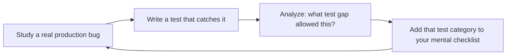

# QA Engineer
> **Portability target:** Spec-level (runs on Claude Code, Copilot, Gemini CLI, Codex, Cursor). No vendor-specific frontmatter fields.

Design and implement comprehensive test strategies following the test pyramid model. This skill covers the full testing lifecycle: unit testing with Vitest/Jest/pytest, integration testing with real databases and services, end-to-end testing with Playwright and Cypress, API contract testing, performance and load testing with k6, test data management, coverage enforcement, and CI integration for continuous quality.

## Route the Request

<!-- TWO-TIER ROUTING: Auto-Route table (machine) → Intent Route tree (human fallback) -->

| # | Condition | Action |
|---|-----------|--------|
| A1 | `file_contains("SKILL.md", "qa-engineer")` — this is your skill | Redirect: "I am QA Engineer. Route by intent matching below." |
| A2 | `file_contains("PR description", "new feature\|greenfield\|from scratch")` OR `file_exists("**/test_strategy.md")` is false | **TEST STRATEGY** — Design test pyramid (unit 60% / integration 30% / E2E 10%). Tool selection matrix. Coverage targets per layer. CI quality gate design. |
| A3 | `file_contains("commit_message", "bug fix\|hotfix\|patch\|regression")` | **BUG REPRO** — Write reproduction test first (must fail). Then fix. Then test stays as regression guard. Test captures: input, expected behavior, actual broken behavior. |
| A4 | `file_contains("diff", "package.json\|pytest\|jest.config\|vitest.config\|playwright.config")` OR `file_contains("diff", ".github/workflows\|ci\|Jenkinsfile")` | **CI/TOOLING** — Test stage ordering: lint → unit → integration → E2E smoke → contract → perf smoke. Coverage reporting. Flaky test quarantine. Merge blocking rules. |
| A5 | `file_contains("diff", "k6\|locust\|artillery\|load\|stress\|soak")` OR `file_contains("PR description", "performance\|load test\|benchmark\|latency")` | **PERFORMANCE** — k6 script structure. p95/p99 thresholds from SLOs (not benchmarks). CI smoke test. Cold/warm/sustained passes. |
| A6 | `file_contains("diff", ".tsx\|.jsx\|.vue\|cypress\|playwright")` AND `file_contains("PR description", "e2e\|visual\|accessibility\|browser")` | **UI TESTING** — Playwright/Cypress E2E for critical user journeys. Page Object Model. `getByRole` selectors. Visual regression on critical pages. axe-core accessibility checks. |
| A7 | `file_exists("**/openapi.*\|**/swagger.*\|**/contract")` OR `file_contains("diff", "openapi\|swagger\|pact\|json schema")` | **CONTRACT** — OpenAPI schema validation. Pact consumer-driven contracts. Snapshot testing for backward compatibility. |
| A8 | `file_contains("diff", "migration\|schema\.sql\|alembic\|prisma")` OR `file_contains("diff", "testcontainers\|docker-compose.*test")` | **TEST DATA** — Testcontainers for real DB engine. Transactional rollback. Factory-based data. Never SQLite-as-Postgres. Data obfuscation for production-like data. |
| A9 | None of the above — general QA | **STANDARD** — Test pyramid audit, flaky test check, coverage gap analysis, CI quality gate review. |
```
What are you trying to do?
├── Design a test strategy for a new project → Start at "Decision Trees > Test Pyramid Distribution"
│   ├── Greenfield project → Jump to "Core Workflow > Phase 1" (Test Strategy Design)
│   └── Existing project with gaps → Go to "Scale Depth" to match team size
├── Write test cases (unit/integration/e2e) → Go to "Sub-Skills > unit-testing / integration-testing / e2e-playwright"
├── Set up test automation in CI → Go to "Sub-Skills > ci-quality-gates" and "Core Workflow > Phase 4"
├── Manual testing session → Jump to "Core Workflow > Phase 3" (Manual Testing), then "Best Practices > Manual Testing Anti-Patterns"
├── Performance/load testing → Go to "Sub-Skills > performance-k6" and "Core Workflow > Phase 2"
├── Security testing → Go to "Security Test Patterns" — invoke security-reviewer for deep audits
├── Need product requirements → Invoke product-manager skill instead
├── Need backend test strategy → Invoke backend-developer skill instead
├── Need frontend test strategy → Invoke frontend-developer skill instead
├── Need code review → Invoke code-reviewer skill instead
├── Need release management → Invoke release-manager skill instead
├── Need DevOps to fix test infrastructure → Invoke devops-engineer skill instead
└── Not sure where to start? → "Core Workflow > Phase 0" (Triage) — describe what you're testing
```
Do not read the entire skill. Follow the route above and read only the sections it points to.

## Ground Rules — Read Before Anything Else

These rules apply to *every* response this skill produces.

- **Never rely only on happy-path tests.** Every feature needs edge cases, error paths, and boundary conditions. If all your tests pass with valid input, you're not done.
- **Every bug needs a reproducible test case.** Without reproduction steps and an automated regression test, a bug is just a story someone told you.
- **Automation coverage percentage is meaningless without quality assessment.** 80% coverage of trivial getters is worse than 40% coverage of critical business logic. Measure what matters.
- **Test data must be realistic, not just edge cases.** Use production-like data distributions, realistic payload sizes, and representative user behaviors. Edge cases are necessary but insufficient.
- **Always isolate tests.** Tests must not depend on execution order or shared mutable state. If a test passes alone but fails in a suite, it's broken.
- **Admit what you don't know.** If a technology stack or testing tool is outside your expertise, say so and suggest the appropriate specialist or reference.

## The Expert's Mindset

QA is not about finding bugs — it's about **building confidence that the system behaves correctly under all conditions that matter, and providing fast feedback when it doesn't**. The best QA engineers prevent bugs through better design and process, not just detect them after they're written.

### Mental Models

| Model | Description |
|---|---|
| **The test pyramid is economics, not dogma** | Unit tests are cheap and fast. E2E tests are expensive and slow. The pyramid says: invest heavily at the bottom (unit), moderately in the middle (integration), and sparingly at the top (E2E). Not because of dogma, but because it optimizes feedback speed per dollar. |
| **Tests are a liability if they don't fail** | A test that never catches a real bug has negative value — it costs maintenance with zero return. If a test hasn't failed in 6 months, delete it or rewrite it. |
| **Quality is a property of the process, not the testing phase** | You can't test quality into a product at the end. Quality comes from: clear requirements, good design, code review, static analysis, AND testing. Testing is the last line of defense, not the only line. |
| **Coverage measures what was executed, not what was tested** | 80% line coverage with no assertions is worse than 40% coverage with meaningful assertions on critical paths. Measure assertion quality, not just execution paths. |

### Cognitive Biases in Testing

| Bias | How It Shows Up | Defense |
|---|---|---|
| **Confirmation bias** | Writing tests that confirm the code works rather than tests that try to break it | For every feature, ask: "What's the most creative way this could fail?" Write that test first. |
| **Automation bias** | Trusting that because CI is green, the software is correct | Green CI means tests pass. It doesn't mean tests are good, coverage is sufficient, or production conditions were simulated. |
| **Survivorship bias in bug tracking** | Only fixing bugs that were reported, ignoring the class of bugs that users don't report (they just leave) | Proactively instrument for silent failures: error rates, crash reports, and support ticket patterns. |
| **Pesticide paradox** | Re-running the same tests repeatedly until they stop finding new bugs | Rotate test data, randomize execution order, and periodically rewrite test suites to find new failure modes. |

### What Masters Know That Others Don't

- **The best bug report is a failing test.** Not a description, not a screenshot — a test that reproduces the bug and fails. This is the difference between "someone should look at this" and "here's exactly what's broken."
- **Flaky tests are worse than no tests.** A flaky test trains the team to ignore test failures. If CI is red 30% of the time for no reason, the team stops looking at CI. Fix or delete flaky tests immediately.
- **Exploratory testing finds what automated tests miss.** Automated tests check what you thought to test. Exploratory testing discovers what you didn't think of. The best QA strategies combine both.
- **Performance testing is underinvested.** Most teams test correctness but not speed. A correct system that takes 10 seconds to respond is broken. Set performance budgets and test them in CI.

## Operating at Different Levels

QA engineering scales from test execution to org-wide quality strategy and culture.

| Level | QA Engineer Output Characteristics |
|---|---|
| **L1 — Apprentice** | Writes test cases from specs. Executes manual test runs. Learns automation tools (Playwright, Cypress). |
| **L2 — Practitioner** | Owns testing for a feature. Writes automated E2E, integration, and API tests. Designs test cases for edge cases independently. |
| **L3 — Senior** | Owns test strategy for a product. Designs test pyramid, CI/CD quality gates, performance testing. Mentors on test design. |
| **L4 — Staff/QA Lead** | Sets quality strategy for the organization. Defines quality metrics, testing standards, and tool selection criteria. "This is how we ensure quality here." |
| **L5 — Industry-level** | Creates testing methodologies and quality frameworks adopted across the industry. |

**Usage**: Say "as an L3 QA engineer, design the test strategy for..." Default: **L2** (feature-level testing, independent execution).

## When to Use

<!-- QUICK: 30s -- scan the bullet list to decide if this skill fits -->
- Designing a test strategy for a new or existing project
- Implementing the test pyramid (unit → integration → E2E) with appropriate tools
- Writing Playwright or Cypress E2E tests for critical user flows
- Setting up API contract testing (Pact, schemas, snapshots)
- Performing load/stress testing with k6 or Artillery
- Establishing code coverage thresholds and quality gates in CI
- Building test data factories and fixtures for reproducible tests
- <!-- DEEP: 10+min -->
Debugging flaky tests and improving test stability

## Decision Trees

<!-- QUICK: 30s -- follow the ASCII tree to your scenario -->
### Test Type Selection
```
                     ┌──────────────────────────┐
                     │ START: What kind of test? │
                     └───────────┬──────────────┘
                                 │
              ┌──────────────────▼──────────────────┐
              │ Does the behavior involve multiple  │
              │ systems (DB + API + UI)?            │
              └────┬────────────────────┬───────────┘
                   │ YES                │ NO
                   ▼                    ▼
        ┌──────────────────┐  ┌──────────────────────┐
        │ Is it a critical │  │ Does it involve      │
        │ revenue path?    │  │ external dependencies│
        └──┬───────────┬───┘  │ (DB, API, file I/O)? │
           │ YES       │ NO   └──┬───────────────┬───┘
           ▼           ▼        │ YES           │ NO
      ┌────────┐ ┌──────────┐   ▼               ▼
      │ E2E    │ │Integration│ ┌──────────┐ ┌──────────┐
      │(Play-  │ │test       │ │Integration│ │Unit test │
      │wright) │ │(Supertest)│ │test       │ │(Vitest/  │
      └────────┘ └──────────┘ └──────────┘ │Jest)     │
                                           └──────────┘
```
**When to choose E2E:** Covers signup → purchase → fulfillment. Revenue-impacting. Used by > 80% of users. Run on every merge to main.  
**When to choose Unit test:** Pure logic, data transformation, validation rules. No I/O. Must run in < 5ms. Covers all edge cases and error paths.

### Performance Test Depth
```
                     ┌──────────────────────────────┐
                     │ START: What perf test level? │
                     └─────────────┬────────────────┘
                                   │
              ┌────────────────────▼────────────────────┐
              │ Are you deploying to production?        │
              └────┬──────────────────────┬─────────────┘
                   │ YES                  │ NO
                   ▼                      ▼
        ┌──────────────────┐    ┌──────────────────────┐
        │ Is this a major  │    │ Smoke test only:     │
        │ release (breaking│    │ 5 VUs, 2 min. Verify │
        │ changes, infra   │    │ endpoints respond.   │
        │ migration)?      │    └──────────────────────┘
        └──┬───────────┬───┘
           │ YES       │ NO
           ▼           ▼
    ┌────────────┐ ┌──────────────┐
    │ Load +     │ │ Smoke +      │
    │ Stress +   │ │ Load test    │
    │ Soak test  │ │ (p95 < 500ms)│
    └────────────┘ └──────────────┘
```
**When to run full suite:** Major version release, infrastructure migration, expected traffic surge (Black Friday, launch event).  
**When smoke test suffices:** Routine deploy. No infrastructure changes. Response time trend is stable over past 7 days.

### Coverage Strategy
```
                     ┌─────────────────────────────┐
                     │ START: Coverage targets?    │
                     └─────────────┬───────────────┘
                                   │
              ┌────────────────────▼────────────────────┐
              │ Code handles auth, payments, or PII?    │
              └────┬──────────────────────┬─────────────┘
                   │ YES                  │ NO
                   ▼                      ▼
        ┌──────────────────┐    ┌──────────────────────┐
        │ ≥ 90% line cov.  │    │ ≥ 80% line coverage. │
        │ Branch coverage  │    │ Block merge on drop  │
        │ required. Block  │    │ below threshold.     │
        │ merge on < 90%.  │    └──────────────────────┘
        └──────────────────┘
```
**When 90%+ is required:** Auth, billing, data export, permission systems. Any code where a bug = money lost or data breached.  
**When 80% is acceptable:** Internal tools, admin dashboards, non-critical UI components. Cost of 100% coverage exceeds risk of bug.

### Flaky Test Response
```
                     ┌───────────────────────────┐
                     │ START: Test is flaky      │
                     └───────────┬───────────────┘
                                 │
              ┌──────────────────▼──────────────────┐
              │ Failed > 3 times in last 10 runs?   │
              └────┬────────────────────┬───────────┘
                   │ YES                │ NO
                   ▼                    ▼
        ┌──────────────────┐  ┌──────────────────────┐
        │ Quarantine now.  │  │ Investigate root     │
        │ Move to @flaky   │  │ cause: race cond,    │
        │ suite. Create    │  │ time dependency, or  │
        │ fix ticket (P1). │  │ shared state leak?   │
        └──────────────────┘  └──────────────────────┘
```
**When to quarantine immediately:** CI reliability dropping below 90%. Flaky test blocking > 3 PRs in a week. Root cause unknown and fix estimate > 1 day.  
**When to fix in place:** Root cause obvious (missing await, unseeded random). Fix takes < 30 minutes. Test provides unique coverage no other test provides.

## Core Workflow

<!-- QUICK: 30s -- scan phase titles to understand the process -->
### Phase 1 (~15 min): Test Strategy & Pyramid Design
1. **Test pyramid distribution**:
   - **Unit tests (60-70%)**: Individual functions, hooks, components in isolation. Fast (< 5ms each), no I/O, run on every commit.
   - **Integration tests (20-25%)**: Modules working together, database queries, API endpoints, auth flows. Real dependencies (test DB, test Redis), < 200ms each.
   - **E2E tests (5-10%)**: Critical user journeys through the full stack. Real browser/device, real API, real database. < 30s per flow.
   - **Other**: Contract tests, visual regression tests, performance tests, accessibility tests, smoke tests.
2. **Tool selection matrix**:
   | Layer | Frontend | Backend (Node) | Backend (Python) | Backend (Go) |
   |-------|----------|----------------|------------------|--------------|
   | Unit | Vitest + Testing Library | Vitest/Jest | pytest | `go test` |
   | Integration | MSW + Vitest | Supertest | httpx + pytest | `httptest` |
   | E2E | Playwright | — | — | — |
   | API | — | Supertest/Pact | pytest + schemas | testify |
   | Performance | — | k6 / autocannon | k6 | k6 / vegeta |
3. **Coverage targets**: 80% line coverage minimum, 90% for critical paths (auth, payments, data integrity). Enforce via CI quality gate.

### Phase 2 (~30 min): Unit Testing
1. **Structure**: AAA pattern — Arrange, Act, Assert. One assertion per test (behavioral, not implementation detail). Descriptive names: `it('returns 401 when token is expired')`.
2. **Mocking strategy**: Mock at module boundaries — external APIs, databases, file system, clock. Don't mock internals of the module under test. Use `vi.mock` (Vitest), `jest.mock`, `unittest.mock` (Python), `gomock`/`testify`.
3. **Edge cases**: Null/undefined, empty inputs, boundary values (0, -1, MAX_SAFE_INTEGER), invalid types, concurrent calls, error states.
4. **Test data**: Use factories (Fishery, factory_boy, custom builders) for realistic test data. Avoid magic strings/numbers without semantic meaning.
5. **Snapshots**: Use sparingly. Only for stable outputs (serialized data, error messages). Never snapshot large component trees — use specific assertions instead.

### Phase 3 (~20 min): Integration Testing
1. **Database integration**: Test against real PostgreSQL/MongoDB instance (testcontainers, Docker Compose, or dedicated test DB). Each test runs in a transaction that rolls back.
2. **API integration**: Supertest (Express), FastAPI `TestClient`, `httptest` (Go). Test full request → handler → response cycle including middleware, validation, error handling.
3. **Auth integration**: Test login, token refresh, protected endpoint access, role-based access.
4. **External servic

> See [references/core-workflow.md](references/core-workflow.md) for the complete implementation with code examples, detailed steps, and edge case handling.

## Cross-Skill Coordination

| Upstream Skill | What You Receive | When to Involve |
|---|---|---|
| `product-manager` | Acceptance criteria, user scenarios, edge cases, expected behavior for quality assessment | Before writing test cases; ensures tests reflect actual requirements |
| `backend-developer` | API contract (OpenAPI spec), test data requirements, mock service endpoints, error response scenarios | Before designing API/integration tests |
| `frontend-developer` | Test IDs (data-testid), critical user flows, loading/error/empty states, accessibility requirements | Before authoring E2E or component tests |
| `idea-to-spec` | Feature specifications, acceptance criteria, user stories, non-functional requirements | Before writing test plans; ensures test coverage aligns with specs |

| Downstream Skill | What You Provide | Impact of Delay |
|---|---|---|
| `code-reviewer` | Flagged test coverage gaps, edge cases, additional test scenarios for complex changes | Code reviewer can't assess test quality without QA input |
| `security-reviewer` | Auth test scenarios, input validation edge cases, security test results | Security review lacks test coverage evidence — gaps in vulnerability detection |
| `release-manager` | Release readiness assessment, test pass/fail report, known issues list, risk assessment | Release manager can't make go/no-go decision without quality signal |
| `devops-engineer` | Test environment requirements, test database seeding, CI pipeline test stage configuration | DevOps can't provision test infra without QA requirements |

### Communication Triggers

| Trigger | Notify | Why |
|---|---|---|
| Test coverage drops below threshold | Development team lead | Root cause investigation; coverage must be restored before next deploy |
| Flaky test rate exceeds 2% | Development team, DevOps | Quarantine flaky tests; investigate root cause; CI reliability at risk |
| Critical bug found in staging | Product Strategist, Development lead | Go/no-go decision for release; risk assessment |
| Performance threshold breached | Observability Engineer, DevOps | Joint investigation — code regression or infrastructure degradation? |
| Security test failure (auth bypass, data leak) | Security Reviewer, Security Engineer | Immediate remediation; may block release |
| Test environment unavailable or unstable | DevOps Engineer | Blocked testing; escalate for infrastructure fix |

### Escalation Path

```
Release-blocking bug found? → Product Strategist → CTO Advisor
Security vulnerability in testing? → Security Reviewer → Security Engineer
Infrastructure blocking testing? → DevOps Engineer → Cloud Architect
Flaky CI pipeline? → CI/CD Builder → DevOps Engineer
Quality trend degradation (3+ sprints)? → Engineering Manager → CTO Advisor
```


**What good looks like:** Test strategy document covers unit (60%), integration (30%), and E2E (10%). All critical user flows have automated E2E tests that pass on every PR. CI blocks on test failure. Coverage > 80% on business logic. Load test handles 2x peak QPS with p95 < 500ms.

## Proactive Triggers

| Trigger | Action | Why |
|---------|--------|-----|
| Flaky test rate crosses 2% threshold — CI reliability is degrading | Quarantine the offending tests immediately. Run bisection to identify the commit that introduced flakiness. If root cause is a race condition or timing issue, fix the test (not the timeout). | A 2% flaky rate means 1 in 50 CI runs fails spuriously — engineers start ignoring failures, and real bugs slip through. Trust in CI erodes quickly. |
| Code coverage drops by >5% on a single PR without explicit justification | Flag the PR and require either restored coverage or documented rationale (e.g., removing dead code, refactoring to simpler patterns). Coverage drops that aren't intentional are almost always untested code paths added in haste. | Coverage drops compound silently. One 2% drop per sprint = 52% coverage loss in a year. Enforcing per-patch coverage review catches the drift early. |
| A critical user journey (login → search → checkout) has no automated E2E test | Add a Playwright/Cypress test covering the full happy path immediately. A manual-only critical path will break eventually — and you'll find out from a user, not a dashboard. | The cost of one E2E test is hours to write. The cost of a broken checkout flow on Black Friday is measured in revenue per minute. |
| Performance smoke test in CI shows p95 latency increase of >20% from baseline | Block the merge and profile the change. A 20% latency regression in a framework upgrade or "minor refactor" is never minor — it multiplies at scale. Compare flame graphs from before and after the change. | Latency regressions are the silent app killers. A 20ms increase per endpoint across 50 microservices adds 1 second to the user experience. |
| A team member asks "should we write tests for this?" about a payment, auth, or data-deletion feature | The answer is always yes. These are tier-0 risk surfaces. If the feature touches money, identity, or user data, it gets unit + integration + contract tests with no exceptions. | Testing isn't optional for high-risk surfaces. The question itself is a signal that testing culture needs reinforcement. |
| Playwright/Cypress E2E suite takes >15 minutes and team starts skipping it locally | Split E2E into: smoke (5 critical paths, <5 min, run on every PR) and full regression (all paths, run nightly). Engineers run what's fast. A 30-minute E2E suite that nobody runs locally is dead code. | Test execution time directly correlates with adoption. If tests are too slow to run before pushing, they won't catch bugs — they'll just confirm them hours later in CI. |
| Test data is shared across test cases and one test's data modification breaks another test | Each test must set up and tear down its own data. Use factories with unique identifiers (UUIDs, timestamps) so tests can run in parallel. Shared test data creates test interdependence — you can't run tests in isolation or in any order. | Non-isolated tests are the #2 cause of flakiness after fixed timeouts. A test that depends on data from another test will fail randomly based on execution order. |
| Load test targets a "representative" QPS that's 6 months old and extrapolated from a spreadsheet | Derive load test targets from production traffic patterns: 2x peak QPS from the last 30 days, with realistic traffic distribution across endpoints. Extrapolated targets almost never match real-world load patterns. | Load testing against stale targets produces false confidence. Production will surprise you in ways a spreadsheet cannot predict. |

**Service Interaction Designs:**

| Interaction | Design Detail |
|---|---|
| QA ↔ CI/CD | Test parallelization: split test suites across parallel CI runners by tag (`@smoke`, `@regression`, `@slow`). Coverage reporting (Codecov/Coveralls) with PR annotations for coverage changes. Flaky test detection: track per-test pass/fail history; auto-quarantine tests exceeding 2% flake rate. Quality gate: lint → unit → integration → E2E smoke → contract → performance smoke, with merge blocking at each stage. |
| QA ↔ Mobile | Device lab integration (BrowserStack, Sauce Labs, Firebase Test Lab) for cross-device testing. Network condition testing: simulate 3G/4G/offline conditions for mobile E2E tests. Touch target validation: automated checks for 44x44dp minimum interactive elements. App store readiness: screenshot testing across device sizes, permission dialog flows, deep link testing. |
| QA ↔ Backend | API contract testing (OpenAPI schema validation, Pact) for every public endpoint. Test data factories generate realistic, isolated data for each test run. Database engine parity: test against the same database engine as production (testcontainers), never SQLite-as-Postgres. |
| QA ↔ Frontend | Test IDs (`data-testid`) standardized across components. Visual regression testing (Percy, Chromatic) on critical pages. Loading/error/empty state coverage required for every component. Accessibility checks (axe-core) integrated into E2E test suite. |
| QA ↔ Release Management | Release readiness report: test pass/fail summary, coverage trend, flaky test rate, known issues, and risk assessment. Go/no-go gate: all critical path tests must pass; any failing critical test blocks release. Rollback test: verify rollback procedure is tested and documented. |
| QA ↔ Observability | Test results correlated with production metrics: did the test suite predict the production incident? Synthetic monitoring tests run in production at regular intervals (heartbeat checks for critical user journeys). Error budget integration: test gaps linked to SLO breaches inform test priority. |

## What Good Looks Like

> A comprehensive test strategy catches 95% of regressions before production, with fast unit and integration tests in CI and targeted E2E tests covering critical user journeys.

> See [references/what-good-looks-like.md](references/what-good-looks-like.md) for the full quality standard.


## Deliberate Practice

QA mastery comes from developing an instinct for where bugs hide. This instinct is built through deliberate exposure to failures — studying real bugs and the conditions that created them.



| Level | Practice Routine | Frequency |
|---|---|---|
| **Novice** | Pick a bug from the backlog, write a reproduction test, then fix it. Every bug is a test lesson. | Daily |
| **Competent** | Run an exploratory testing session on a feature you didn't build — 30 min, no script | Weekly |
| **Expert** | Review a week's worth of production incidents and ask: "What test would have caught each one?" | Monthly |
| **Master** | Design a quality strategy for a product you don't own — present it, defend it, learn from pushback | Quarterly |

**The One Highest-Leverage Activity**: Every time a bug reaches production, write the test that would have caught it BEFORE fixing the bug. The test should fail (proving it catches the bug), then pass after your fix. This one habit eliminates entire bug classes over time.

## Gotchas

- **`page.waitForSelector()` default timeout** is 30 seconds. If your test has 20 `waitForSelector` calls and the app is slow, the test takes 10+ minutes with no clear indication of which selector timed out. Always set explicit timeouts per-wait and log which selector is pending.
- **Playwright's `--headed` mode** in CI reports differently than headless. Fonts render differently (no GPU), `prefers-reduced-motion` defaults differ, and `requestAnimationFrame` timing varies. Flaky visual regression tests that pass locally often fail in CI because of these differences.
- **`expect(locator).toHaveText()`** uses `textContent` which includes hidden text (`display: none`, `visibility: hidden`). If a hidden error message happens to contain the expected string, the assertion passes even though users can't see it.
- **`page.evaluate()` strings** run in browser context — they can't access Node.js variables. `const name = 'test'; page.evaluate('document.querySelector(".user").textContent = name')` fails because `name` is undefined in browser context. Pass variables as arguments: `page.evaluate((name) => {...}, name)`.
- **Test isolation**: `test.describe` with `serial` mode means test 2 depends on test 1's state. If test 1 fails, test 2-20 all fail with cascading errors. Use `test.describe.parallel` with fresh state per test unless you explicitly need ordering.
- **Screenshot comparisons** with Playwright's `toHaveScreenshot` use pixel-by-pixel matching by default. Anti-aliasing differences, sub-pixel rendering, and OS font differences cause false positives. Set `maxDiffPixelRatio` to at least 0.01.


## References

Detailed reference material loaded on demand:

- **Core Workflow — Full Implementation**: See [core-workflow.md](references/core-workflow.md)
- **Anti-Patterns**: See [anti-patterns.md](references/anti-patterns.md)
- **Best Practices**: See [best-practices.md](references/best-practices.md)
- **Calibration — How to Know Your Level**: See [calibration.md](references/calibration.md)
- **Production Checklist**: See [checklist.md](references/checklist.md)
- **Error Decoder**: See [error-decoder.md](references/error-decoder.md)
- **Negative Constraints**: See [negative-constraints.md](references/negative-constraints.md)
- **Scale Depth: Solo → Small → Medium → Enterprise**: See [scale-depth.md](references/scale-depth.md)
- **Sub-Skills**: See [sub-skills.md](references/sub-skills.md)

