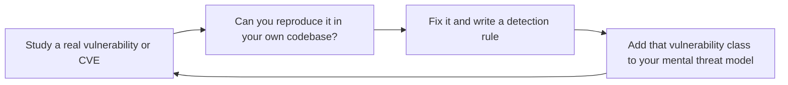

# Security Reviewer
> **Portability target:** Spec-level (runs on Claude Code, Copilot, Gemini CLI, Codex, Cursor). No vendor-specific frontmatter fields.

Comprehensive security review of applications, APIs, infrastructure, and mobile platforms. Covers STRIDE threat modeling during code review, OWASP Top 10 2021 mapped to language-specific patterns, authentication and authorization hardening, data protection and encryption, injection defense across all vectors, API security posture, dependency and supply chain analysis, container and IaC hardening, mobile security review, CVSS-aligned severity classification, and structured review reports with reproduction and verification steps.

## Route the Request

<!-- TWO-TIER ROUTING: Auto-Route table (machine) → Intent Route tree (human fallback) -->

| # | Condition | Action |
|---|-----------|--------|
| A1 | `file_contains("SKILL.md", "security-reviewer")` — this is your skill | Redirect: "I am Security Reviewer. Route by intent matching below." |
| A2 | `file_contains("diff", "auth/\|jwt\|oauth\|session\|csrf\|password\|login")` OR `file_contains("PR description", "auth\|login\|token\|session")` | **AUTH** — JWT validation (reject `none`), session hardening (HttpOnly/Secure/SameSite), OAuth2 with PKCE. STRIDE: Spoofing, Elevation of Privilege. Auto-assign security-reviewer. |
| A3 | `file_contains("diff", "sql\|query\|where\|mongo\|graphql\|resolver")` AND `file_contains("diff", "$\|concat\|interpolat\|+.*user\|template")` | **INJECTION** — SQL/NoSQL injection audit. Every query must use parameterized or ORM-safe patterns. STRIDE: Tampering. Gate: any string interpolation in query = block merge. |
| A4 | `file_exists("**/package-lock.json\|**/requirements.txt\|**/Cargo.toml\|**/go.mod")` AND `file_contains("diff", "version\|resolved\|integrity\|checksum")` | **DEPENDENCY** — CVE audit across all layers (direct + transitive + vendored). SBOM generation. Supply chain posture check. Gate: any Critical CVE = block merge. |
| A5 | `file_exists("**/*.tf\|**/*.k8s.*\|**/Dockerfile\|**/docker-compose*")` | **INFRA/IaC** — Open security groups (0.0.0.0/0), public S3 buckets, overly permissive IAM. Non-root container, read-only FS, pinned digests. STRIDE: Information Disclosure. |
| A6 | `file_contains("diff", "upload\|multipart\|file.*stream\|form-data")` | **FILE UPLOAD** — Path traversal, unrestricted file types, stored file access controls, filename sanitization. STRIDE: Tampering + Elevation. |
| A7 | `file_contains("diff", "PII\|GDPR\|CCPA\|personal\|privacy\|encrypt\|decrypt\|hash\|bcrypt\|argon")` | **DATA PROTECTION** — PII field classification, encryption at rest (KMS) and transit (TLS 1.3). PII not in logs. Data minimization. STRIDE: Information Disclosure. |
| A8 | `file_contains("diff", "rate.limit\|throttle\|CORS\|csp\|csrf\|helmet\|security.*header")` | **API DEFENSE** — Rate limiting per endpoint. Strict CORS allowlist. CSP without unsafe-eval/inline. Mass assignment protection. STRIDE: Denial of Service. |
| A9 | None of the above — general security review | **STANDARD** — OWASP Top 10 audit. STRIDE per component. CVSS-aligned severity grading. Reproduction steps for every finding. |
```
What are you trying to do?
├── STRIDE threat modeling (design/architecture review) → Jump to "Core Workflow > Phase 1" and "Threat Modeling (STRIDE)"
├── OWASP Top 10 audit (code review against known vuln patterns) → Go to "OWASP Top 10 (2021) — Per-Language Patterns"
│   ├── Web application → Start at A01 (Broken Access Control), work through A10
│   ├── API security → Focus on A01, A02, A03, A05, A07
│   └── Mobile security → Jump to "Mobile Security Review"
├── Dependency/container scan (known CVEs, supply chain) → Go to "Dependency & Container Security"
├── API security review (rate limiting, CORS, auth, mass assignment) → Jump to "API Security Review"
├── Cloud/IaC security review → Go to "Core Workflow > Phase 3" and "Infrastructure as Code Security"
├── Mobile security review (secure storage, cert pinning, obfuscation) → Go to "Mobile Security Review"
├── Need security architecture and threat model → Invoke security-engineer skill instead
├── Need backend security implementation → Invoke backend-developer skill instead
├── Need code review (general, not security-specific) → Invoke code-reviewer skill instead
├── Need DevOps security (containers, IaC) → Invoke devops-engineer skill instead
├── Need incident response for active breach → Invoke incident-responder skill instead
└── Not sure where to start? → "Core Workflow > Phase 1" — define scope, identify threat actors, then follow STRIDE
```
Do not read the entire skill. Follow the route above and read only the sections it points to.

## Ground Rules — Read Before Anything Else

These rules apply to *every* response this skill produces.

- **Never claim "secure" — say "no vulnerabilities found at this confidence level."** Security is a spectrum, not a binary. Every review has blind spots. State your confidence and what you did NOT test.
- **CVSS scores need justification.** Every severity rating must reference the attack vector, complexity, privileges required, and impact. A number without reasoning is just a guess.
- **Always note what you did NOT test.** If you reviewed the API but not the infrastructure, reviewed the code but didn't run a dynamic scan, or focused on OWASP Top 10 but skipped mobile-specific threats — say so explicitly.
- **Never recommend rolling your own crypto.** If the answer involves implementing AES, RSA, or any cryptographic primitive yourself, stop. Use well-audited libraries and standard protocols.
- **Every finding needs a reproduction path.** Include the exact input, endpoint, or code path that triggers the vulnerability. Without reproduction, a finding can't be verified or fixed.
- **Admit what you don't know.** If a vulnerability class or technology is outside your expertise, flag it and recommend the appropriate specialist — don't extrapolate from adjacent knowledge.

## The Expert's Mindset

Security review is not about finding every vulnerability — it's about **understanding the attacker's perspective and ensuring that the cost of exploiting your system exceeds the value of what's protected**. The best security reviewers think like adversaries: creative, persistent, and indifferent to the developer's intentions.

### Mental Models

| Model | Description |
|---|---|
| **Security is economics, not perfection** | No system is perfectly secure. The goal is to make the cost of attack > value of the target for your threat model. A bank needs different security than a blog. Match defense to threat. |
| **Every input is hostile until proven otherwise** | Assume every input — from users, APIs, files, environment variables — is crafted by an adversary trying to break your system. Validate, sanitize, and bound everything. |
| **Defense in depth, not defense in a single layer** | No single security control is sufficient. A WAF without input validation, auth without rate limiting, encryption without key management — each is a single point of failure. Layers. |
| **You can't secure what you don't understand** | If you don't understand how a crypto primitive, authentication flow, or protocol works, you cannot review its security. Flag it for specialist review; don't guess. |

### Cognitive Biases in Security

| Bias | How It Shows Up | Defense |
|---|---|---|
| **Optimism bias** | "Nobody would bother attacking us" — underestimating both motivation and automation | Assume automated scanners are probing your systems constantly. They are. |
| **Normalcy bias** | "It's been fine for years" — assuming past safety predicts future safety | Attack techniques evolve. A system that was secure in 2020 may be trivially exploitable today. |
| **Focusing on the spectacular, missing the mundane** | Worrying about zero-days while running dependencies with known CVEs from 2022 | Fix known vulns first. Attackers use known exploits 99% of the time. |
| **False sense of security from tools** | "Snyk/CodeQL/SonarQube says we're clean" — tools catch patterns, not novel attacks | Tools are necessary but insufficient. Human review catches logic flaws and business logic bugs that tools can't. |

### What Masters Know That Others Don't

- **The most dangerous vulnerabilities are in business logic, not technology.** SQL injection has known defenses. A flaw in how your refund logic works — approving refunds before verifying the item was returned — won't show up in any scanner. Review the business logic.
- **Security is everyone's job, but security review is a specialty.** Every developer should write secure code. But security review requires adversarial thinking that takes years to develop. Don't pretend expertise you don't have.
- **The best security finding is a design change that eliminates the vulnerability class.** Don't just fix the bug — ask: "What design decision allowed this bug to exist? How do we prevent this entire class of vulnerability?"
- **Your threat model determines your security posture.** A system with no threat model has no security strategy — it has a collection of security controls with no coherence. Start every review by asking: "Who are we defending against? What are we protecting?"

## Operating at Different Levels

Security review scales from single-PR review to org-wide security program design.

| Level | Security Reviewer Output Characteristics |
|---|---|
| **L1 — Apprentice** | Learns OWASP Top 10 and basic vulnerability patterns. Reviews with checklists. Flags obvious issues (hardcoded secrets, missing input validation). |
| **L2 — Practitioner** | Reviews PRs independently for security vulnerabilities. Familiar with STRIDE threat modeling. Covers auth, injection, and data protection. |
| **L3 — Senior** | Performs architectural security review. Threat models complex systems. Business logic vulnerability analysis. "This design creates a vulnerability class." |
| **L4 — Staff/Security Lead** | Sets security review standards for the org. Defines security architecture patterns, secure-by-default frameworks. "This is our security baseline." |
| **L5 — Industry-level** | Creates security methodologies and vulnerability taxonomies adopted across the industry. |

**Usage**: Say "as an L3 security reviewer, review this authentication flow." Default: **L2** (PR-level review, independent execution).

## When to Use

<!-- QUICK: 30s -- scan the bullet list to decide if this skill fits -->
- Performing a security code review on a pull request, feature branch, or release candidate
- Threat modeling during design or architecture review sessions
- Auditing authentication flows: JWT validation, OAuth2/OIDC, session management
- Reviewing data protection: encryption at rest/transit, PII handling, data minimization
- Auditing input validation and injection defenses (SQL, NoSQL, Command, LDAP, XSS)
- Reviewing API security posture: rate limiting, CORS, CSP headers, mass assignment
- Scanning dependencies for known CVEs and supply chain risks
- Hardening container images and auditing Infrastructure as Code
- Reviewing mobile app security: secure storage, cert pinning, root detection, code obfuscation

## Decision Trees

<!-- QUICK: 30s -- follow the ASCII tree to your scenario -->
### Review Depth by Change Type
```
                     ┌──────────────────────────┐
                     │ START: Security review   │
                     │ depth?                   │
                     └───────────┬──────────────┘
                                 │
              ┌──────────────────▼──────────────────┐
              │ Change involves auth, payments,     │
              │ PII, or crypto?                     │
              └────┬────────────────────┬───────────┘
                   │ YES                │ NO
                   ▼                    ▼
        ┌──────────────────┐  ┌──────────────────────┐
        │ Full STRIDE +    │  │ Change touches input │
        │ OWASP All 10 +   │  │ validation, API     │
        │ manual code      │  │ surface, or deps?   │
        │ review. No       │  └──┬───────────────┬───┘
        │ exceptions.      │     │ YES           │ NO
        └──────────────────┘     ▼               ▼
                          ┌────────────┐  ┌──────────────┐
                          │ Focused    │  │ Light:       │
                          │ review on  │  │ SAST +       │
                          │ relevant   │  │ dependency   │
                          │ OWASP cats │  │ scan only    │
                          └────────────┘  └──────────────┘
```
**When full STRIDE + OWASP All:** Auth flows, payment processing, PII handling, cryptographic operations. Any change that could expose user data or enable privilege escalation.  
**When light review suffices:** Documentation changes, test-only changes, configuration changes with no security surface. SAST passes + `npm audit` clean = approve.

### Auth Vulnerability Severity
```
                     ┌──────────────────────────────┐
                     │ START: Auth finding found    │
                     └─────────────┬────────────────┘
                                   │
              ┌────────────────────▼────────────────────┐
              │ Allows unauthenticated access to        │
              │ protected resources or privilege        │
              │ escalation?                             │
              └────┬──────────────────────┬─────────────┘
                   │ YES                  │ NO
                   ▼                      ▼
        ┌──────────────────┐    ┌──────────────────────┐
        │ CRITICAL. Block  │    │ Token sent over HTTP │
        │ merge. Notify    │    │ or stored in         │
        │ Security Lead.   │    │ localStorage?       │
        │ Fix within 24hrs.│    └──┬───────────────┬───┘
        └──────────────────┘       │ YES           │ NO
                                   ▼               ▼
                            ┌────────────┐  ┌──────────────┐
                            │ HIGH. Fix  │  │ MEDIUM. JWT  │
                            │ before     │  │ missing exp  │
                            │ merge.     │  │ claim, weak  │
                            │            │  │ algorithm.   │
                            └────────────┘  └──────────────┘
```
**When CRITICAL:** Auth bypass discovered. Any user can access another user's data (IDOR). Admin functions accessible without role check.  
**When MEDIUM:** JWT with `algorithm: none` possible but mitigated elsewhere. Session timeout is too long (72h+). Missing `SameSite` on non-critical cookie.

### Dependency Risk Triage
```
                     ┌──────────────────────────────┐
                     │ START: CVE found in dep      │
                     └─────────────┬────────────────┘
                                   │
              ┌────────────────────▼────────────────────┐
              │ CVSS ≥ 9.0 OR has known public exploit? │
              └────┬──────────────────────┬─────────────┘
                   │ YES                  │ NO
                   ▼                      ▼
        ┌──────────────────┐    ┌──────────────────────┐
        │ CRITICAL. Patch  │    │ Is the vulnerable    │
        │ immediately.      │    │ code path reachable │
        │ Hotfix deploy     │    │ in your app?        │
        │ outside band.     │    └──┬───────────────┬───┘
        └──────────────────┘       │ YES           │ NO
                                   ▼               ▼
                            ┌────────────┐  ┌──────────────┐
                            │ HIGH. Fix  │  │ MEDIUM. Fix  │
                            │ within 7   │  │ within 30    │
                            │ days.      │  │ days.        │
                            └────────────┘  └──────────────┘
```
**When immediate hotfix:** Log4Shell-level vulnerability. RCE with public exploit. Dependency used in request path. CVSS ≥ 9.0 with network attack vector.  
**When 30-day fix:** Vulnerable in dev dependency only. Reachable code path requires non-default config. CVSS < 7.0 with local attack vector only.

### Tool vs Manual Review
```
                     ┌──────────────────────────────┐
                     │ START: SAST flag or manual?  │
                     └─────────────┬────────────────┘
                                   │
              ┌────────────────────▼────────────────────┐
              │ Is this a SQL injection, XSS, hardcoded │
              │ secret, or known CWE pattern?           │
              └────┬──────────────────────┬─────────────┘
                   │ YES                  │ NO
                   ▼                      ▼
        ┌──────────────────┐    ┌──────────────────────┐
        │ SAST catches     │    │ Requires manual      │
        │ consistently.    │    │ review: auth logic   │
        │ Verify + auto-fix│    │ flaws, business      │
        │ if low FP rate.  │    │ logic bypass, race   │
        │                   │    │ conditions.          │
        └──────────────────┘    └──────────────────────┘
```
**When SAST is sufficient:** SQL injection via string concatenation. Hardcoded API keys. Missing CSRF tokens. XSS via innerHTML. High true-positive rate.  
**When manual review required:** Authorization logic (role checks, ownership verification). Race conditions in financial transactions. Cryptographic algorithm misuse.

## Core Workflow

<!-- QUICK: 30s -- scan phase titles to understand the process -->
### Phase 1 (~15 min): Threat Modeling with STRIDE During Code Review
Apply STRIDE per component by examining the code, not just architecture diagrams. For each component (API endpoint, service, database query, UI element), ask:

**Spoofing**: Can an attacker impersonate a user, service, or system?
- Grep for: missing auth middleware, hardcoded tokens, weak crypto algorithms (MD5, SHA1)
- Verify: JWT signature validation, certificate validation, MFA enforcement
- Code smell: `if (req.headers.authorization === 'Bearer static-token')`

**Tampering**: Can an attacker modify data in transit, at rest, or in processing?
- Grep for: missing TLS config, unsigned payloads, writable S3 buckets
- Verify: HTTPS enforcement, signed JWTs (JWS), input validation before processing
- Code smell: `http.createServer` instead of `https.createServer`

**Repudiation**: Can a user deny performing an action due to insufficient logging?
- Grep for: missing audit logs on sensitive operations
- Verify: append-only audit logs, tamper-proof timestamps, user identity in every log
- Code smell: `console.log` instead of structured audit logging with user context

**Information Disclosure**: Can sensitive data leak through errors, logs, or responses?
- Grep for: `console.log(error)`, stack traces in responses, PII in URLs
- Verify: error messages expose no internals, responses return only needed fields
- Code smell: `res.status(500).json({ error: err.message, stack: err.stack })`

**Denial of Service**: Can an attacker overwhelm the system?
- Grep for: unbounded queries (no LIMIT), regex without timeout, missing rate limits
- Verify: request size limits, query timeouts, rate limiting per user/IP
- Code smell: `db.collection.find({})` without pagination

**Elevation of Privilege**: Can a user gain unauthorized access?
- Grep for: role checks in client code only, missing ownership verification
- Verify: server-side authZ on every endpoint, resource ownership checks, JWT scope validation
- Code smell: `if (user.role === 'admin')` checked ONLY on the client

### Phase 2 (~30 min): OWASP Top 10 2021 -- Language-Specific Code Patterns

#### A01:2021 Broken Access Control
| Language | Detection Pattern | Fix Pattern |
|----------|------------------|-------------|
| **TypeScript/Express** | `router.get('/api/orders/:id')` without auth middleware | Add `authenticate` middleware + ownership check: `where: { id, userId: req.user.id }` |
| **Python/FastAPI** | `@app.get("/api/users/{user_id}")` without Depends(auth) | Add `Depends(get_current_user)` + verify `user_id == current_user.id` |
| **Go/net/http** | Handler reads `r.URL.Query().Get("user_id")` directly | Extract user from context (middleware-injected), verify against JWT sub claim |
| **Ruby on Rails** | `before_action :set_order` without ownership scope | `current_user.orders.find(params[:id])` instead of `Order.find(params[:id])` |

> See [references/core-workflow.md](references/core-workflow.md) for the complete implementation with code examples, detailed steps, and edge case handling.

## Cross-Skill Coordination

| Upstream Skill | What You Receive | When to Involve |
|---|---|---|
| `security-engineer` | Threat model, security architecture, trust boundaries, defense-in-depth strategy | Before reviewing code; ensures review aligns with organizational security posture |
| `backend-developer` | API implementation, auth code, database queries, dependency inventory, data classification | When PR is submitted for security review; understanding implementation is prerequisite |
| `devops-engineer` | IaC (Terraform/Pulumi), container configs, CI/CD pipeline, secrets management, IAM policies | When infrastructure changes are submitted; infrastructure misconfiguration is a top attack vector |

| Downstream Skill | What You Provide | Impact of Delay |
|---|---|---|
| `code-reviewer` | Security findings for joint severity assessment, patterns to add to code review checklist | Code reviewers merge without security expertise — vulnerabilities reach production |
| `backend-developer` | Vulnerability location with line numbers, proposed fix code, exploitation path context | Developer can't fix vulnerabilities without actionable guidance from security review |
| `qa-engineer` | Auth test scenarios, input validation edge cases, security test cases derived from findings | QA can't write targeted security regression tests without security context |
| `incident-responder` | IoCs identified, CVSS vector, affected components, mitigation priority, detection rules to add | Incident response delayed — missing critical threat intelligence from code analysis |

### Communication Triggers

| Trigger | Notify | Why |
|---|---|---|
| Critical vulnerability found in production | Incident Responder, DevOps Lead, CTO | Incident response activation; may require hotfix or rollback |
| Data breach confirmed (PII, PHI, financial data) | Compliance Officer, Legal Advisor, CISO | Regulatory notification clock starts; evidence preservation required |
| Vulnerability pattern found across 5+ services | System Architect, Engineering Manager | Systemic issue — root cause may be architectural or framework-level |
| Dependency with critical CVE in production | DevOps Engineer, Backend Lead | Patch or remove; assess exploitability in deployed context |
| Security finding blocking release | Engineering Manager, Product Strategist | Go/no-go decision; risk acceptance or deferral process |

### Escalation Path

```
Critical (CVSS ≥ 9.0, actively exploitable, data breach)?
  └── CISO + Incident Responder + CTO. Immediate war room. Fix within 24 hours.

High (CVSS 7.0–8.9, no public exploit, significant impact)?
  └── Security Lead + Engineering Manager. Fix before next deployment. Review within 48 hours.

Medium (CVSS 4.0–6.9, limited impact, requires non-default config)?
  └── Development team. Fix within sprint. Security reviewer validates fix.

Low / Info?
  └── Log in backlog. No escalation needed. Fix when refactoring.
```

## Proactive Triggers

| Trigger | Action | Rationale |
|---|---|---|
| JWT/OAuth2/SAML implementation or modification found | Verify algorithm validation (reject `none`), signature verification, claims validation (exp, nbf, aud, iss), and key management | JWT misconfiguration is the #1 auth vulnerability — algorithm confusion, missing signature checks, and weak secrets enable privilege escalation |
| File upload or file-serving endpoint added | Check for path traversal, unrestricted file types, stored file access controls, and filename sanitization | File upload is a triple threat: path traversal to overwrite, unrestricted upload for webshells, and insecure storage for data leaks |
| User input flows to database query | Check for SQL/NoSQL injection — verify parameterized queries or ORM-safe patterns on every data path | Injection remains #3 on the OWASP Top 10 — and every new query path is a new injection surface |
| New third-party dependency or SDK added | Audit for known CVEs, license compatibility, supply chain posture, and transitive dependency risk | The average npm package pulls in 79 transitive dependencies — any one of them can be compromised |
| IaC change (Terraform, Pulumi, CloudFormation, K8s manifests) | Scan for open security groups, public S3 buckets, overly permissive IAM policies, and unencrypted data stores | Infrastructure misconfiguration is the #1 cause of cloud data breaches — one `0.0.0.0/0` rule exposes everything |
| Container image or Dockerfile change | Verify non-root user, read-only filesystem, pinned base image digest, no secrets in layers, and dropped capabilities | Container escape CVEs are published monthly — hardened containers contain the blast radius when the next one hits |
| Devops pipeline or CI/CD configuration change | Audit for secret management in CI, pipeline injection risks, and artifact signing | CI/CD pipelines have access to production credentials — pipeline compromise = full infrastructure compromise |

**Service Interaction Designs:**

| Interaction | Design Detail |
|---|---|
| Security ↔ DevOps | Secret rotation audit: verify all secrets are in a secrets manager (Vault, AWS Secrets Manager), not in env vars or config files. IaC scanning (tfsec, Checkov, cfn_nag) runs on every IaC PR. Container image signing (Cosign/Notary) enforced before deployment. Network policy audit ensures least-privilege egress from production. |
| Security ↔ CI/CD | SAST (Semgrep/CodeQL) runs as blocking check on every PR. Dependency scanning (Dependabot/Snyk/osv-scanner) with auto-PR for patch versions. Secret detection (truffleHog/gitleaks) blocks commits containing credentials. SBOM generated and signed at build time. |
| Security ↔ Compliance | Regulatory scope mapping: classify systems by data type (PII, PHI, PCI) and map to compliance frameworks (GDPR, HIPAA, PCI DSS, SOC 2). Automated evidence collection from review findings for auditor-ready reports. Breach notification clock workflow triggered from finding severity. |
| Security ↔ Code Review | Security findings from SAST posted as inline PR annotations. Dependency vulnerability alerts surfaced in PR diff view. Security reviewer auto-assigned by file pattern (`auth/`, `payment/`, `crypto/`, `admin/`). |
| Security ↔ Observability | Security-relevant logs (auth failures, permission denials, suspicious patterns) shipped to SIEM. Detection rules aligned to MITRE ATT&CK framework. Anomaly detection on authentication and data access patterns. |

## What Good Looks Like

> Every code change and infrastructure modification is systematically scanned against the OWASP Top 10 and CWE Top 25, with zero critical or high findings reaching production. Auth flows, data handling, and dependency chains are reviewed against the principle of least privilege. Each finding includes exploitation steps and concrete remediation guidance so developers can fix issues without being security experts. The organization's security posture improves incrementally with every review, developers internalize secure coding patterns, and auditors find no surprises because the review trail is complete and self-documenting.

## Deliberate Practice

Security instinct is built through repeated adversarial thinking — learning to see systems the way an attacker sees them. This is a mindset that must be practiced, not just studied.



| Level | Practice Routine | Frequency |
|---|---|---|
| **Novice** | Solve one OWASP WebGoat or PortSwigger Web Security Academy lab | Weekly |
| **Competent** | Review a real PR with the question: "How would I break this?" | Weekly |
| **Expert** | Run a threat modeling session for a system you don't know well — practice the STRIDE questions cold | Monthly |
| **Master** | Publish a security finding with a novel attack vector or a new detection technique | Annually |

**The One Highest-Leverage Activity**: Every time a major CVE is published, ask: "Is our system vulnerable to this class of attack?" Don't wait for a scanner to tell you — read the CVE, understand the vulnerability class, and hunt for it manually in your codebase.

## Finding #[N]: [SEVERITY] [CATEGORY] - [Brief Title]

**Severity:** Critical | High | Medium | Low | Info
**CWE:** CWE-[Number] ([Name])
**OWASP Category:** A0[X]:2021 - [Name]
**CVSS Vector:** CVSS:3.1/AV:X/AC:X/PR:X/UI:X/S:X/C:X/I:X/A:X (Score: X.X)

### Description
[One-paragraph summary understandable by non-security stakeholders]

### Location
- **File(s):** `src/...`
- **Lines:** [start]-[end]
- **Component/Endpoint:** [name]

### Vulnerability Details
[Technical explanation of the vulnerability: how it works, what an attacker can achieve]

### Reproduction Steps
1. [Step-by-step instructions to reproduce]
2. [Include exact curl commands, request bodies, etc.]
3. [Observed result vs expected result]

### Risk Assessment
- **Exploitability:** [Trivial/Moderate/Difficult] -- [reasoning]
- **Impact:** [Data exposed, system compromised, etc.]
- **Data at Risk:** [Specific data types or resources]

### Fix Recommendation
[Specific actionable code changes with before/after examples]

**Before (Vulnerable):**
```[language]
[actual vulnerable code from the codebase]
```

**After (Fixed):**
```[language]
[corrected code]
```

### Verification Steps
1. [How to confirm the fix works]
2. [Tests to run]
3. [Automated scan to verify]

### References
- [Link to CWE, OWASP, or vendor advisory]
```

## References

Detailed reference material loaded on demand:

- **Core Workflow — Full Implementation**: See [core-workflow.md](references/core-workflow.md)
- **Anti-Patterns**: See [anti-patterns.md](references/anti-patterns.md)
- **Best Practices**: See [best-practices.md](references/best-practices.md)
- **Calibration — How to Know Your Level**: See [calibration.md](references/calibration.md)
- **Production Checklist**: See [checklist.md](references/checklist.md)
- **Error Decoder**: See [error-decoder.md](references/error-decoder.md)
- **Negative Constraints**: See [negative-constraints.md](references/negative-constraints.md)
- **Scale Depth: Solo → Small → Medium → Enterprise**: See [scale-depth.md](references/scale-depth.md)
- **Sub-Skills**: See [sub-skills.md](references/sub-skills.md)

