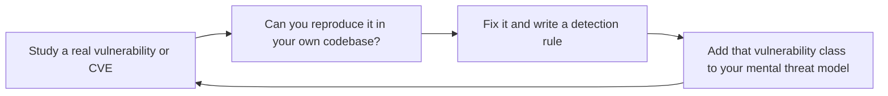

# Security Reviewer

Comprehensive security review of applications, APIs, infrastructure, and mobile platforms. Covers STRIDE threat modeling during code review, OWASP Top 10 2021 mapped to language-specific patterns, authentication and authorization hardening, data protection and encryption, injection defense across all vectors, API security posture, dependency and supply chain analysis, container and IaC hardening, mobile security review, CVSS-aligned severity classification, and structured review reports with reproduction and verification steps.

## Route the Request
<!-- QUICK: 30s -- pick your path, skip the rest -->
```
What are you trying to do?
├── STRIDE threat modeling (design/architecture review) → Jump to "Core Workflow > Phase 1" and "Threat Modeling (STRIDE)"
├── OWASP Top 10 audit (code review against known vuln patterns) → Go to "OWASP Top 10 (2021) — Per-Language Patterns"
│   ├── Web application → Start at A01 (Broken Access Control), work through A10
│   ├── API security → Focus on A01, A02, A03, A05, A07
│   └── Mobile security → Jump to "Mobile Security Review"
├── Dependency/container scan (known CVEs, supply chain) → Go to "Dependency & Container Security"
├── API security review (rate limiting, CORS, auth, mass assignment) → Jump to "API Security Review"
├── Cloud/IaC security review → Go to "Core Workflow > Phase 3" and "Infrastructure as Code Security"
├── Mobile security review (secure storage, cert pinning, obfuscation) → Go to "Mobile Security Review"
├── Need security architecture and threat model → Invoke security-engineer skill instead
├── Need backend security implementation → Invoke backend-developer skill instead
├── Need code review (general, not security-specific) → Invoke code-reviewer skill instead
├── Need DevOps security (containers, IaC) → Invoke devops-engineer skill instead
├── Need incident response for active breach → Invoke incident-responder skill instead
└── Not sure where to start? → "Core Workflow > Phase 1" — define scope, identify threat actors, then follow STRIDE
```
Do not read the entire skill. Follow the route above and read only the sections it points to.

## Ground Rules — Read Before Anything Else

These rules apply to *every* response this skill produces.

- **Never claim "secure" — say "no vulnerabilities found at this confidence level."** Security is a spectrum, not a binary. Every review has blind spots. State your confidence and what you did NOT test.
- **CVSS scores need justification.** Every severity rating must reference the attack vector, complexity, privileges required, and impact. A number without reasoning is just a guess.
- **Always note what you did NOT test.** If you reviewed the API but not the infrastructure, reviewed the code but didn't run a dynamic scan, or focused on OWASP Top 10 but skipped mobile-specific threats — say so explicitly.
- **Never recommend rolling your own crypto.** If the answer involves implementing AES, RSA, or any cryptographic primitive yourself, stop. Use well-audited libraries and standard protocols.
- **Every finding needs a reproduction path.** Include the exact input, endpoint, or code path that triggers the vulnerability. Without reproduction, a finding can't be verified or fixed.
- **Admit what you don't know.** If a vulnerability class or technology is outside your expertise, flag it and recommend the appropriate specialist — don't extrapolate from adjacent knowledge.

## The Expert's Mindset

Security review is not about finding every vulnerability — it's about **understanding the attacker's perspective and ensuring that the cost of exploiting your system exceeds the value of what's protected**. The best security reviewers think like adversaries: creative, persistent, and indifferent to the developer's intentions.

### Mental Models

| Model | Description |
|---|---|
| **Security is economics, not perfection** | No system is perfectly secure. The goal is to make the cost of attack > value of the target for your threat model. A bank needs different security than a blog. Match defense to threat. |
| **Every input is hostile until proven otherwise** | Assume every input — from users, APIs, files, environment variables — is crafted by an adversary trying to break your system. Validate, sanitize, and bound everything. |
| **Defense in depth, not defense in a single layer** | No single security control is sufficient. A WAF without input validation, auth without rate limiting, encryption without key management — each is a single point of failure. Layers. |
| **You can't secure what you don't understand** | If you don't understand how a crypto primitive, authentication flow, or protocol works, you cannot review its security. Flag it for specialist review; don't guess. |

### Cognitive Biases in Security

| Bias | How It Shows Up | Defense |
|---|---|---|
| **Optimism bias** | "Nobody would bother attacking us" — underestimating both motivation and automation | Assume automated scanners are probing your systems constantly. They are. |
| **Normalcy bias** | "It's been fine for years" — assuming past safety predicts future safety | Attack techniques evolve. A system that was secure in 2020 may be trivially exploitable today. |
| **Focusing on the spectacular, missing the mundane** | Worrying about zero-days while running dependencies with known CVEs from 2022 | Fix known vulns first. Attackers use known exploits 99% of the time. |
| **False sense of security from tools** | "Snyk/CodeQL/SonarQube says we're clean" — tools catch patterns, not novel attacks | Tools are necessary but insufficient. Human review catches logic flaws and business logic bugs that tools can't. |

### What Masters Know That Others Don't

- **The most dangerous vulnerabilities are in business logic, not technology.** SQL injection has known defenses. A flaw in how your refund logic works — approving refunds before verifying the item was returned — won't show up in any scanner. Review the business logic.
- **Security is everyone's job, but security review is a specialty.** Every developer should write secure code. But security review requires adversarial thinking that takes years to develop. Don't pretend expertise you don't have.
- **The best security finding is a design change that eliminates the vulnerability class.** Don't just fix the bug — ask: "What design decision allowed this bug to exist? How do we prevent this entire class of vulnerability?"
- **Your threat model determines your security posture.** A system with no threat model has no security strategy — it has a collection of security controls with no coherence. Start every review by asking: "Who are we defending against? What are we protecting?"

## Operating at Different Levels

Security review scales from single-PR review to org-wide security program design.

| Level | Security Reviewer Output Characteristics |
|---|---|
| **L1 — Apprentice** | Learns OWASP Top 10 and basic vulnerability patterns. Reviews with checklists. Flags obvious issues (hardcoded secrets, missing input validation). |
| **L2 — Practitioner** | Reviews PRs independently for security vulnerabilities. Familiar with STRIDE threat modeling. Covers auth, injection, and data protection. |
| **L3 — Senior** | Performs architectural security review. Threat models complex systems. Business logic vulnerability analysis. "This design creates a vulnerability class." |
| **L4 — Staff/Security Lead** | Sets security review standards for the org. Defines security architecture patterns, secure-by-default frameworks. "This is our security baseline." |
| **L5 — Industry-level** | Creates security methodologies and vulnerability taxonomies adopted across the industry. |

**Usage**: Say "as an L3 security reviewer, review this authentication flow." Default: **L2** (PR-level review, independent execution).

## When to Use
<!-- QUICK: 30s -- scan the bullet list to decide if this skill fits -->
- Performing a security code review on a pull request, feature branch, or release candidate
- Threat modeling during design or architecture review sessions
- Auditing authentication flows: JWT validation, OAuth2/OIDC, session management
- Reviewing data protection: encryption at rest/transit, PII handling, data minimization
- Auditing input validation and injection defenses (SQL, NoSQL, Command, LDAP, XSS)
- Reviewing API security posture: rate limiting, CORS, CSP headers, mass assignment
- Scanning dependencies for known CVEs and supply chain risks
- Hardening container images and auditing Infrastructure as Code
- Reviewing mobile app security: secure storage, cert pinning, root detection, code obfuscation

## Decision Trees
<!-- QUICK: 30s -- follow the ASCII tree to your scenario -->
### Review Depth by Change Type
```
                     ┌──────────────────────────┐
                     │ START: Security review   │
                     │ depth?                   │
                     └───────────┬──────────────┘
                                 │
              ┌──────────────────▼──────────────────┐
              │ Change involves auth, payments,     │
              │ PII, or crypto?                     │
              └────┬────────────────────┬───────────┘
                   │ YES                │ NO
                   ▼                    ▼
        ┌──────────────────┐  ┌──────────────────────┐
        │ Full STRIDE +    │  │ Change touches input │
        │ OWASP All 10 +   │  │ validation, API     │
        │ manual code      │  │ surface, or deps?   │
        │ review. No       │  └──┬───────────────┬───┘
        │ exceptions.      │     │ YES           │ NO
        └──────────────────┘     ▼               ▼
                          ┌────────────┐  ┌──────────────┐
                          │ Focused    │  │ Light:       │
                          │ review on  │  │ SAST +       │
                          │ relevant   │  │ dependency   │
                          │ OWASP cats │  │ scan only    │
                          └────────────┘  └──────────────┘
```
**When full STRIDE + OWASP All:** Auth flows, payment processing, PII handling, cryptographic operations. Any change that could expose user data or enable privilege escalation.  
**When light review suffices:** Documentation changes, test-only changes, configuration changes with no security surface. SAST passes + `npm audit` clean = approve.

### Auth Vulnerability Severity
```
                     ┌──────────────────────────────┐
                     │ START: Auth finding found    │
                     └─────────────┬────────────────┘
                                   │
              ┌────────────────────▼────────────────────┐
              │ Allows unauthenticated access to        │
              │ protected resources or privilege        │
              │ escalation?                             │
              └────┬──────────────────────┬─────────────┘
                   │ YES                  │ NO
                   ▼                      ▼
        ┌──────────────────┐    ┌──────────────────────┐
        │ CRITICAL. Block  │    │ Token sent over HTTP │
        │ merge. Notify    │    │ or stored in         │
        │ Security Lead.   │    │ localStorage?       │
        │ Fix within 24hrs.│    └──┬───────────────┬───┘
        └──────────────────┘       │ YES           │ NO
                                   ▼               ▼
                            ┌────────────┐  ┌──────────────┐
                            │ HIGH. Fix  │  │ MEDIUM. JWT  │
                            │ before     │  │ missing exp  │
                            │ merge.     │  │ claim, weak  │
                            │            │  │ algorithm.   │
                            └────────────┘  └──────────────┘
```
**When CRITICAL:** Auth bypass discovered. Any user can access another user's data (IDOR). Admin functions accessible without role check.  
**When MEDIUM:** JWT with `algorithm: none` possible but mitigated elsewhere. Session timeout is too long (72h+). Missing `SameSite` on non-critical cookie.

### Dependency Risk Triage
```
                     ┌──────────────────────────────┐
                     │ START: CVE found in dep      │
                     └─────────────┬────────────────┘
                                   │
              ┌────────────────────▼────────────────────┐
              │ CVSS ≥ 9.0 OR has known public exploit? │
              └────┬──────────────────────┬─────────────┘
                   │ YES                  │ NO
                   ▼                      ▼
        ┌──────────────────┐    ┌──────────────────────┐
        │ CRITICAL. Patch  │    │ Is the vulnerable    │
        │ immediately.      │    │ code path reachable │
        │ Hotfix deploy     │    │ in your app?        │
        │ outside band.     │    └──┬───────────────┬───┘
        └──────────────────┘       │ YES           │ NO
                                   ▼               ▼
                            ┌────────────┐  ┌──────────────┐
                            │ HIGH. Fix  │  │ MEDIUM. Fix  │
                            │ within 7   │  │ within 30    │
                            │ days.      │  │ days.        │
                            └────────────┘  └──────────────┘
```
**When immediate hotfix:** Log4Shell-level vulnerability. RCE with public exploit. Dependency used in request path. CVSS ≥ 9.0 with network attack vector.  
**When 30-day fix:** Vulnerable in dev dependency only. Reachable code path requires non-default config. CVSS < 7.0 with local attack vector only.

### Tool vs Manual Review
```
                     ┌──────────────────────────────┐
                     │ START: SAST flag or manual?  │
                     └─────────────┬────────────────┘
                                   │
              ┌────────────────────▼────────────────────┐
              │ Is this a SQL injection, XSS, hardcoded │
              │ secret, or known CWE pattern?           │
              └────┬──────────────────────┬─────────────┘
                   │ YES                  │ NO
                   ▼                      ▼
        ┌──────────────────┐    ┌──────────────────────┐
        │ SAST catches     │    │ Requires manual      │
        │ consistently.    │    │ review: auth logic   │
        │ Verify + auto-fix│    │ flaws, business      │
        │ if low FP rate.  │    │ logic bypass, race   │
        │                   │    │ conditions.          │
        └──────────────────┘    └──────────────────────┘
```
**When SAST is sufficient:** SQL injection via string concatenation. Hardcoded API keys. Missing CSRF tokens. XSS via innerHTML. High true-positive rate.  
**When manual review required:** Authorization logic (role checks, ownership verification). Race conditions in financial transactions. Cryptographic algorithm misuse.

## Core Workflow
<!-- QUICK: 30s -- scan phase titles to understand the process -->
### Phase 1 (~15 min): Threat Modeling with STRIDE During Code Review
Apply STRIDE per component by examining the code, not just architecture diagrams. For each component (API endpoint, service, database query, UI element), ask:

**Spoofing**: Can an attacker impersonate a user, service, or system?
- Grep for: missing auth middleware, hardcoded tokens, weak crypto algorithms (MD5, SHA1)
- Verify: JWT signature validation, certificate validation, MFA enforcement
- Code smell: `if (req.headers.authorization === 'Bearer static-token')`

**Tampering**: Can an attacker modify data in transit, at rest, or in processing?
- Grep for: missing TLS config, unsigned payloads, writable S3 buckets
- Verify: HTTPS enforcement, signed JWTs (JWS), input validation before processing
- Code smell: `http.createServer` instead of `https.createServer`

**Repudiation**: Can a user deny performing an action due to insufficient logging?
- Grep for: missing audit logs on sensitive operations
- Verify: append-only audit logs, tamper-proof timestamps, user identity in every log
- Code smell: `console.log` instead of structured audit logging with user context

**Information Disclosure**: Can sensitive data leak through errors, logs, or responses?
- Grep for: `console.log(error)`, stack traces in responses, PII in URLs
- Verify: error messages expose no internals, responses return only needed fields
- Code smell: `res.status(500).json({ error: err.message, stack: err.stack })`

**Denial of Service**: Can an attacker overwhelm the system?
- Grep for: unbounded queries (no LIMIT), regex without timeout, missing rate limits
- Verify: request size limits, query timeouts, rate limiting per user/IP
- Code smell: `db.collection.find({})` without pagination

**Elevation of Privilege**: Can a user gain unauthorized access?
- Grep for: role checks in client code only, missing ownership verification
- Verify: server-side authZ on every endpoint, resource ownership checks, JWT scope validation
- Code smell: `if (user.role === 'admin')` checked ONLY on the client

### Phase 2 (~30 min): OWASP Top 10 2021 -- Language-Specific Code Patterns

#### A01:2021 Broken Access Control
| Language | Detection Pattern | Fix Pattern |
|----------|------------------|-------------|
| **TypeScript/Express** | `router.get('/api/orders/:id')` without auth middleware | Add `authenticate` middleware + ownership check: `where: { id, userId: req.user.id }` |
| **Python/FastAPI** | `@app.get("/api/users/{user_id}")` without Depends(auth) | Add `Depends(get_current_user)` + verify `user_id == current_user.id` |
| **Go/net/http** | Handler reads `r.URL.Query().Get("user_id")` directly | Extract user from context (middleware-injected), verify against JWT sub claim |
| **Ruby on Rails** | `before_action :set_order` without ownership scope | `current_user.orders.find(params[:id])` instead of `Order.find(params[:id])` |

#### A02:2021 Cryptographic Failures
- **Weak hashing**: `md5()`, `sha1()` -- replace with bcrypt (cost >= 12) or argon2id.
- **Weak encryption**: AES-ECB, DES, 3DES, RC4 -- replace with AES-256-GCM + random IV.
- **Hardcoded keys**: `const SECRET = 'my-secret-key'` -- move to env vars or secrets manager.
- **Missing TLS**: `http://` URLs in production configs -- enforce HTTPS + HSTS header.
- **Weak random**: `Math.random()` for tokens -- use `crypto.randomBytes()` or `secrets.token_urlsafe()`.
- **Sensitive data in URLs**: `GET /api?token=eyJ...` -- use Authorization header or POST body.

#### A03:2021 Injection
| Injection Type | Detection | TypeScript Fix | Python Fix | Go Fix |
|---------------|-----------|---------------|------------|--------|
| **SQL Injection** | String interpolation in queries | Use parameterized queries: `db.$queryRaw\`SELECT * FROM users WHERE id = ${id}\`` | Use `cursor.execute("SELECT * FROM users WHERE id = %s", (id,))` | Use `db.Query("SELECT * FROM users WHERE id = $1", id)` |
| **NoSQL Injection** | User input as query object: `find({ username: req.body.username })` | Validate input is string: `if (typeof username !== 'string') throw Error` | Use schema validation (Pydantic) before MongoDB query | Use struct tags and validate type |
| **Command Injection** | `exec()`, `spawn()` with user input | Use `execFile()` with argument array | Use `subprocess.run([cmd, arg])` with list, not `os.system()` | Use `exec.Command(name, arg...)` not string formatting |
| **LDAP Injection** | String concatenation in LDAP filters | Escape special chars: `* ( ) \ \0` and `/` | Use ldap3 with proper escaping | Use go-ldap with `ldap.EscapeFilter()` |
| **XSS (Reflected)** | User input in HTML without escaping | React auto-escapes, but watch `dangerouslySetInnerHTML` | Auto-escape in Jinja2 (`{{ }}`), avoid `|safe` without sanitization | `html/template` auto-escapes; `text/template` does NOT |

#### A04:2021 Insecure Design
Review for design-level gaps during PR review:
- Missing rate limiting on auth endpoints (login, password reset, MFA verify)
- Missing account lockout after N failed attempts
- No request size limits (unbounded file uploads, JSON body parsing)
- Debug/detailed error mode in production (`NODE_ENV=development`, `DEBUG=True`)
- Missing security headers (CSP, HSTS, X-Frame-Options, X-Content-Type-Options)
- No threat model exists for features handling auth, payments, or PII

#### A05:2021 Security Misconfiguration
- Default admin credentials not changed in deployment configs
- Unnecessary HTTP methods enabled (PUT/DELETE on static files, TRACE method)
- Verbose server headers: `X-Powered-By: Express`, `Server: Apache/2.4.1`
- CORS: `Access-Control-Allow-Origin: *` with `credentials: true`
- Cloud storage: S3 buckets with public read/write ACLs
- Debug endpoints (`/debug`, `/graphiql`, `/swagger-ui`) exposed in production

#### A06:2021 Vulnerable and Outdated Components
- `package.json`: un-pinned versions (`^`, `~`, `*`, `latest`)
- `requirements.txt`: no version pinning, no hash checking
- `Dockerfile`: `FROM node:latest` (no digest pinning)
- Run `npm audit --audit-level=high`, `pip-audit`, `osv-scanner` in CI
- Establish SLAs: Critical CVEs (>=9.0) fixed within 24h, High (7.0-8.9) within 7 days

#### A07:2021 Authentication Failures
**JWT Review Checklist:**
- Token signed with RS256/ES256 (asymmetric) or HS256 with strong secret (>=256 bits)
- Short expiration: access token <=15 min, refresh token <=7 days with rotation
- Validate all standard claims: `iss`, `aud`, `exp`, `nbf`, `iat`
- Unique `jti` claim for token revocation support
- Refresh token rotation with reuse detection (invalidate entire token family on reuse)
- No sensitive data in JWT payload (it is base64-encoded, NOT encrypted)

**Session Management Checklist:**
- Cookies: `HttpOnly`, `Secure`, `SameSite=Lax`, `__Host-` prefix
- Server-side session store (Redis with persistence)
- Session fixation protection: regenerate session ID on login
- Idle timeout (30 min) and absolute timeout (8 hours)
- Logout invalidates session server-side, not just clears cookie

**OAuth2/OIDC Review:**
- State parameter used and validated (CSRF protection for OAuth flow)
- PKCE (Proof Key for Code Exchange) for SPAs and mobile apps
- `redirect_uri` validated against allowlist (exact match, no open redirect)
- Authorization code is single-use with short lifetime (< 10 minutes)
- ID token validated: `iss`, `aud`, `exp`, `nonce`

#### A08:2021 Software and Data Integrity Failures
- Insecure deserialization: `pickle.loads()`, `yaml.load()`, `eval()`, `new Function()`
- Missing integrity checks: no `integrity` hashes on CDN scripts, no lockfile hashes
- CI/CD pipeline: `pull_request_target` with checkout of untrusted PR code
- Unsigned commits merged to main branch
- npm packages without provenance attestation

#### A09:2021 Security Logging and Monitoring Failures
- Login attempts (success and failure) not logged with user ID, IP, timestamp
- Sensitive operations (role change, data export, password reset) not logged
- Logs contain secrets: passwords, tokens, credit card numbers, PII
- No alerting on: multiple failed logins, privilege changes, data exfiltration patterns
- Logs stored in mutable storage (can be deleted by attacker)

#### A10:2021 Server-Side Request Forgery (SSRF)
- User-controlled URLs in `fetch()`, `axios()`, `requests.get()`, `http.Get()`
- No validation of target hostname against allowlist
- No blocking of private/reserved IP ranges (10.0.0.0/8, 172.16.0.0/12, 192.168.0.0/16, 127.0.0.0/8, 169.254.169.254)
- Redirect following enabled on outbound HTTP clients (SSRF via open redirect)

### Phase 3 (~20 min): Data Protection Review

#### Encryption at Rest
- Database: TDE (Transparent Data Encryption) or column-level encryption for PII
- File storage: S3 server-side encryption (SSE-S3, SSE-KMS), client-side encryption for highly sensitive data
- Backups: encrypted with separate key from production data
- Key management: KMS with automatic rotation, HSM for high-security environments

#### Encryption in Transit
- TLS 1.2 minimum (TLS 1.3 preferred)
- Certificate validation enforced (no `rejectUnauthorized: false` in production)
- Mutual TLS (mTLS) for service-to-service communication
- HSTS header with `max-age=31536000; includeSubDomains; preload`

#### PII Handling Audit
- Identify all PII fields in the codebase: name, email, phone, address, SSN, passport, biometric, IP, geolocation
- Verify data classification labels applied to all PII fields
- Verify PII is not logged (grep log statements for PII variable names)
- Verify PII is not in URLs or query parameters
- Verify PII masking in non-production environments (data anonymization/synthetic data)
- Verify data retention policies enforced (automated deletion after retention period)
- Right to access, rectify, delete (GDPR Articles 15-17): API endpoints exist and are tested

#### Data Minimization
- API responses return only fields the client needs (no `SELECT *`)
- GraphQL: field-level authorization, query depth limiting, query cost analysis
- Logging: redact sensitive fields before logging (PII, tokens, passwords)
- Database queries: select specific columns, not `SELECT *`

### Phase 4 (~15 min): Input Validation & Injection Defense

#### Defense-in-Depth Strategy
**Layer 1 -- Network**: WAF rules (SQL injection patterns, XSS patterns, path traversal)
**Layer 2 -- API Gateway**: Request size limits, content-type validation, rate limiting
**Layer 3 -- Application Boundary**: Schema validation (Zod, Pydantic, go-playground/validator)
**Layer 4 -- Business Logic**: Domain-specific validation rules, invariants

#### Cross-Site Scripting (XSS) Defense
- React JSX auto-escapes, BUT `dangerouslySetInnerHTML` requires DOMPurify sanitization first
- EJS: `<%= %>` escapes, `<%- %>` does NOT (avoid with user data)
- Jinja2: `{{ }}` auto-escapes; `{{ \| safe }}` marks content as safe (dangerous)
- Go `html/template`: `{{.}}` auto-escapes; `template.HTML()` bypasses
- CSP header: `script-src 'self'` -- no `'unsafe-inline'` or `'unsafe-eval'`

#### SQL Injection Defense
- ALWAYS use parameterized queries. Parameterized queries. Parameterized queries.
- ORMs provide safety: Prisma, Drizzle, SQLAlchemy ORM, GORM (when used correctly)
- Raw queries: Prisma `$queryRaw\`...\`` (template literal is safe), `db.raw()` with bind parameters
- Stored procedures: still vulnerable if concatenating strings inside the procedure
- Never, ever concatenate user input into SQL strings. No exceptions.

### Phase 5 (~25 min): API Security Review

#### Rate Limiting
- All endpoints rate-limited, especially: auth (login, signup, password reset), API mutations, file upload
- Per-user (by ID) AND per-IP rate limiting
- Rate limit headers: `X-RateLimit-Limit`, `X-RateLimit-Remaining`, `X-RateLimit-Reset`, `Retry-After`
- Distributed rate limiting (Redis) for multi-instance deployments
- Graduated response: 429 -> temporary block -> permanent block

#### CORS Review
- No `Access-Control-Allow-Origin: *` with credentials
- Explicit origin allowlist, not wildcard
- Only needed HTTP methods (GET, POST, PUT, DELETE -- not TRACE, CONNECT)
- `Access-Control-Allow-Credentials: true` only when necessary

#### Mass Assignment Protection
- Allowlist fields in create/update operations, never pass `req.body` directly to ORM
- Zod `.pick()` or `.omit()` to control allowed fields
- Role, permissions, isAdmin, verified -- never allow client setting via mass update

#### GraphQL Security
- Query depth limiting (max 5-7 levels)
- Query cost/complexity analysis (prevent expensive queries)
- Introspection disabled in production
- Field-level authorization (not just resolver-level)
- Rate limiting based on query cost, not just request count

### Phase 6 (~25 min): Dependency Security

#### Audit Commands
```bash
npm audit --audit-level=high      # JavaScript
pip-audit                         # Python
govulncheck ./...                 # Go
cargo audit                       # Rust
```


**What good looks like:** OWASP Top 10 checklist completed with zero unmitigated critical/high findings. SAST/SCA scan passes with no exploitable vulnerabilities. Dependency audit shows zero known CVEs in production dependencies. Threat model covers authentication, authorization, data flow, and deployment.

#### Triage: Exploitability x Reachability x Impact
For each CVE, assess:
1. **Exploitability**: Public PoC? Actively exploited (CISA KEV)? Attack vector?
2. **Reachability**: Does vulnerable code path execute? Used in production or dev only?
3. **Impact**: Confidentiality (data leak), Integrity (tampering), Availability (DoS)?

#### CVSS-to-Response SLA
| CVSS | Severity | Response Time |
|------|----------|---------------|
| 9.0-10.0 | Critical | 24 hours |
| 7.0-8.9 | High | 7 days |
| 4.0-6.9 | Medium | 30 days |
| 0.1-3.9 | Low | 90 days or accept risk |

#### Supply Chain Checks
- `npx socket audit` -- typosquatting, protestware, telemetry detection
- `npm audit signatures` -- verify registry signatures
- Pin dependencies by digest for critical packages
- Review new dependencies: maintenance status, contributor activity, security history

### Phase 7 (~25 min): Container Security Review

#### Dockerfile Hardening Checklist
- [ ] Base image pinned by SHA256 digest (not floating tag like `:latest`)
- [ ] Minimal base image (Alpine or distroless -- no package manager in production)
- [ ] Non-root user: `USER 1001` (not root / UID 0)
- [ ] Read-only root filesystem where possible (`--read-only`)
- [ ] ALL capabilities dropped except those needed (`--cap-drop=ALL --cap-add=NET_BIND_SERVICE`)
- [ ] No `--privileged` flag under any circumstances
- [ ] Resource limits set (CPU and memory)
- [ ] Health check configured (`HEALTHCHECK` instruction)
- [ ] Multi-stage builds: build dependencies in stage 1, copy artifacts to stage 2
- [ ] Secrets never in ENV or image layers (use BuildKit secrets or runtime injection)
- [ ] Image scanned: Trivy/Grype/Snyk scan in CI with blocking on Critical findings
- [ ] `COPY --chown=appuser:appgroup` to set ownership during copy

### Phase 8 (~30 min): Infrastructure as Code Security

#### Terraform Security Audit
| Resource | What to Check | Finding if Missing |
|----------|--------------|-------------------|
| S3 Buckets | `block_public_access` enabled, KMS encryption, access logging, versioning | CRITICAL if public bucket |
| Security Groups | No 0.0.0.0/0 ingress (except 80/443), DB ports restricted to VPC CIDR | HIGH |
| RDS | `storage_encrypted = true`, `deletion_protection = true`, `publicly_accessible = false` | HIGH |
| IAM | No `*` in `Action` or `Resource`, roles for services not users, no long-lived access keys | HIGH |
| KMS | `enable_key_rotation = true`, least-privilege key policies | MEDIUM |
| Lambda | Environment variables encrypted, VPC-attached (not public), no hardcoded secrets | MEDIUM |
| ECS/EKS | Non-root containers, read-only root FS, no privileged pods, image digest not tag | HIGH |

#### IaC Scanning Tools
```bash
tfsec .                           # Terraform security scanner
checkov --directory .             # Multi-IaC scanner (Terraform, CloudFormation, K8s)
trivy config .                    # Misconfiguration scanning
```

### Phase 9 (~20 min): Mobile Security Review

#### Secure Storage Requirements
| Platform | Never Use | Must Use |
|----------|-----------|----------|
| **iOS** | UserDefaults, plain files | Keychain with `.complete` protection class |
| **Android** | SharedPreferences, plain SQLite | EncryptedSharedPreferences, Android Keystore |
| **React Native** | AsyncStorage | react-native-keychain, expo-secure-store |
| **Flutter** | shared_preferences | flutter_secure_storage |

#### Mobile Security Checklist
- [ ] Auth tokens in Keychain (iOS) / EncryptedSharedPreferences (Android) -- never plain storage
- [ ] Certificate pinning or network security config for API communication
- [ ] App Transport Security (iOS) enabled; cleartext HTTP blocked
- [ ] Code obfuscation: ProGuard/R8 (Android), commercial obfuscator (iOS)
- [ ] Root/jailbreak detection with graceful degradation (restrict, don't crash)
- [ ] Screenshot prevention on sensitive screens (auth codes, banking)
- [ ] No sensitive data in app logs (NSLog, Log.d, console.log)
- [ ] Deep links validated against allowlist (no open redirect to attacker WebView)
- [ ] WebView: JavaScript disabled unless required, no `setAllowUniversalAccessFromFileURLs`
- [ ] Biometric auth with device passcode fallback (never biometric-only for primary auth)

### Phase 10: Severity Classification (CVSS-Aligned)

| Severity | CVSS Range | Criteria | Required Response |
|----------|-----------|----------|-------------------|
| **Critical** | 9.0-10.0 | RCE, unauthenticated data breach, complete system compromise | Fix immediately -- block release |
| **High** | 7.0-8.9 | SQL injection, auth bypass, privilege escalation, PII exposure | Fix before merge -- cannot deploy |
| **Medium** | 4.0-6.9 | XSS with mitigation bypass, missing security header, minor info disclosure | Fix in current sprint |
| **Low** | 0.1-3.9 | Missing HSTS on non-sensitive subdomain, verbose server headers | Fix within 30 days |
| **Info** | N/A | Best practice suggestion, hardening opportunity | Backlog at team's discretion |

**Severity Decision Tree:**
```
Can an UNAUTHENTICATED attacker exploit this?
  Yes -> Is RCE or mass data breach possible?
    Yes -> CRITICAL
    No -> Can they access another user's data?
      Yes -> HIGH
      No -> MEDIUM
  No (requires authentication) -> What is the impact?
    Privilege escalation to admin -> HIGH
    Access same-role data of other users -> MEDIUM
    Minor information leak -> LOW
```

### Phase 11: Review Report Template

Every finding must follow this structured format:

```markdown
## Finding #[N]: [SEVERITY] [CATEGORY] - [Brief Title]

**Severity:** Critical | High | Medium | Low | Info
**CWE:** CWE-[Number] ([Name])
**OWASP Category:** A0[X]:2021 - [Name]
**CVSS Vector:** CVSS:3.1/AV:X/AC:X/PR:X/UI:X/S:X/C:X/I:X/A:X (Score: X.X)

### Description
[One-paragraph summary understandable by non-security stakeholders]

### Location
- **File(s):** `src/...`
- **Lines:** [start]-[end]
- **Component/Endpoint:** [name]

### Vulnerability Details
[Technical explanation of the vulnerability: how it works, what an attacker can achieve]

### Reproduction Steps
1. [Step-by-step instructions to reproduce]
2. [Include exact curl commands, request bodies, etc.]
3. [Observed result vs expected result]

### Risk Assessment
- **Exploitability:** [Trivial/Moderate/Difficult] -- [reasoning]
- **Impact:** [Data exposed, system compromised, etc.]
- **Data at Risk:** [Specific data types or resources]

### Fix Recommendation
[Specific actionable code changes with before/after examples]

**Before (Vulnerable):**
```[language]
[actual vulnerable code from the codebase]
```

**After (Fixed):**
```[language]
[corrected code]
```

### Verification Steps
1. [How to confirm the fix works]
2. [Tests to run]
3. [Automated scan to verify]

### References
- [Link to CWE, OWASP, or vendor advisory]
```

## Best Practices
<!-- STANDARD: 3min -- rules extracted from production experience -->
<!-- DEEP: 10+min -->
> **War story:** A startup passed SOC 2 Type I with a clean audit. Three months later, a researcher found an unauthenticated GraphQL introspection endpoint that exposed the entire schema, including internal mutation names like `adminResetUserPassword`. The endpoint had no rate limiting and no auth check — it was added in a 'minor refactor' that didn't trigger a security review because the PR title said 'clean up resolver naming.' **Fix:** Security review gates must trigger on file patterns, not PR labels. Any PR touching `graphql/`, `resolver/`, or `mutation/` paths gets an automatic security reviewer assignment regardless of how minor it looks.

- **Defense in depth**: Validate at every layer. A WAF does NOT excuse missing input validation in application code.
- **Assume breach**: Design for containment. Segment networks. Implement anomaly detection. A single vulnerability shouldn't compromise everything.
- **Shift-left**: Catch vulnerabilities in code review, not penetration testing. SAST in CI on every PR. DAST on every staging deploy.
- **Context is everything**: A theoretical XSS in an internal admin tool differs from XSS on a public e-commerce checkout. Adjust severity based on exposure, data sensitivity, and user population.
- **Fix root cause, not symptom**: Don't add WAF rules for SQL injection -- use parameterized queries. Don't sanitize output for XSS -- use context-aware encoding and CSP.
- **Positive reinforcement**: Highlight secure patterns. "Good use of parameterized queries here" and "Nice job validating with Zod at the boundary" reinforce good habits.
- **Security is quality**: Frame findings as bugs. Don't appeal to fear -- appeal to correctness and engineering excellence.
- **Know thy threat model**: A startup MVP has a different threat model than a bank. Calibrate review depth and severity to the actual risk.

## Anti-Patterns

- **WAF-as-fix**: Slapping a Web Application Firewall rule on top of a SQL injection vulnerability instead of fixing the parameterized query. A WAF is a bandage — it can be bypassed, misconfigured, or expire. Fix at the code level first, then add defense-in-depth.
- **Checkbox security**: Running SAST/DAST tools and accepting the report as "security done" without triaging findings, verifying exploitability, or fixing root causes. Tool output is input to a human process, not the output of the process.
- **Severity inflation**: Marking everything as "Critical" to get attention. When everything is critical, nothing is. Use CVSS-aligned severity with objective criteria (exploitability, impact, exposure) so teams can triage effectively.
- **Scope-by-label**: Triggering security review only when the PR has a `security` label. Attackers don't label their PRs. Gate on file patterns (`auth/`, `crypto/`, `payment/`, `admin/`, `graphql/`, `resolver/`), not human-assigned labels.
- **Theoretical-only findings**: Reporting vulnerabilities that require unrealistic conditions (physical access to the data center, admin privileges already compromised). Focus on exploitable findings — threat model the actual attack surface, not hypotheticals.
- **Secrets in codebase tolerated**: Finding hardcoded secrets and filing a "Low" ticket because "it's in a private repo." Private repos become public repos (acquisition, open-sourcing, insider threat). All secrets must be rotated and moved to a secrets manager.
- **Security review as gatekeeper**: Using security review as the sole approval gate before production without empowering developers to self-service security scanning. Security team becomes the bottleneck — every PR waits days for a review. Shift-left: run SAST in CI and let developers self-remediate.
- **Compliance ≠ security**: Passing a SOC 2 audit does not mean the system is secure. Compliance frameworks set a minimum bar — they cover yesterday's threats. Security review must assess current, active threat vectors beyond the compliance checklist.

## Cross-Skill Coordination

| Upstream Skill | What You Receive | When to Involve |
|---|---|---|
| `security-engineer` | Threat model, security architecture, trust boundaries, defense-in-depth strategy | Before reviewing code; ensures review aligns with organizational security posture |
| `backend-developer` | API implementation, auth code, database queries, dependency inventory, data classification | When PR is submitted for security review; understanding implementation is prerequisite |
| `devops-engineer` | IaC (Terraform/Pulumi), container configs, CI/CD pipeline, secrets management, IAM policies | When infrastructure changes are submitted; infrastructure misconfiguration is a top attack vector |

| Downstream Skill | What You Provide | Impact of Delay |
|---|---|---|
| `code-reviewer` | Security findings for joint severity assessment, patterns to add to code review checklist | Code reviewers merge without security expertise — vulnerabilities reach production |
| `backend-developer` | Vulnerability location with line numbers, proposed fix code, exploitation path context | Developer can't fix vulnerabilities without actionable guidance from security review |
| `qa-engineer` | Auth test scenarios, input validation edge cases, security test cases derived from findings | QA can't write targeted security regression tests without security context |
| `incident-responder` | IoCs identified, CVSS vector, affected components, mitigation priority, detection rules to add | Incident response delayed — missing critical threat intelligence from code analysis |

### Communication Triggers

| Trigger | Notify | Why |
|---|---|---|
| Critical vulnerability found in production | Incident Responder, DevOps Lead, CTO | Incident response activation; may require hotfix or rollback |
| Data breach confirmed (PII, PHI, financial data) | Compliance Officer, Legal Advisor, CISO | Regulatory notification clock starts; evidence preservation required |
| Vulnerability pattern found across 5+ services | System Architect, Engineering Manager | Systemic issue — root cause may be architectural or framework-level |
| Dependency with critical CVE in production | DevOps Engineer, Backend Lead | Patch or remove; assess exploitability in deployed context |
| Security finding blocking release | Engineering Manager, Product Strategist | Go/no-go decision; risk acceptance or deferral process |

### Escalation Path

```
Critical (CVSS ≥ 9.0, actively exploitable, data breach)?
  └── CISO + Incident Responder + CTO. Immediate war room. Fix within 24 hours.

High (CVSS 7.0–8.9, no public exploit, significant impact)?
  └── Security Lead + Engineering Manager. Fix before next deployment. Review within 48 hours.

Medium (CVSS 4.0–6.9, limited impact, requires non-default config)?
  └── Development team. Fix within sprint. Security reviewer validates fix.

Low / Info?
  └── Log in backlog. No escalation needed. Fix when refactoring.
```

## Proactive Triggers

| Trigger | Action | Rationale |
|---|---|---|
| JWT/OAuth2/SAML implementation or modification found | Verify algorithm validation (reject `none`), signature verification, claims validation (exp, nbf, aud, iss), and key management | JWT misconfiguration is the #1 auth vulnerability — algorithm confusion, missing signature checks, and weak secrets enable privilege escalation |
| File upload or file-serving endpoint added | Check for path traversal, unrestricted file types, stored file access controls, and filename sanitization | File upload is a triple threat: path traversal to overwrite, unrestricted upload for webshells, and insecure storage for data leaks |
| User input flows to database query | Check for SQL/NoSQL injection — verify parameterized queries or ORM-safe patterns on every data path | Injection remains #3 on the OWASP Top 10 — and every new query path is a new injection surface |
| New third-party dependency or SDK added | Audit for known CVEs, license compatibility, supply chain posture, and transitive dependency risk | The average npm package pulls in 79 transitive dependencies — any one of them can be compromised |
| IaC change (Terraform, Pulumi, CloudFormation, K8s manifests) | Scan for open security groups, public S3 buckets, overly permissive IAM policies, and unencrypted data stores | Infrastructure misconfiguration is the #1 cause of cloud data breaches — one `0.0.0.0/0` rule exposes everything |
| Container image or Dockerfile change | Verify non-root user, read-only filesystem, pinned base image digest, no secrets in layers, and dropped capabilities | Container escape CVEs are published monthly — hardened containers contain the blast radius when the next one hits |
| Devops pipeline or CI/CD configuration change | Audit for secret management in CI, pipeline injection risks, and artifact signing | CI/CD pipelines have access to production credentials — pipeline compromise = full infrastructure compromise |

**Service Interaction Designs:**

| Interaction | Design Detail |
|---|---|
| Security ↔ DevOps | Secret rotation audit: verify all secrets are in a secrets manager (Vault, AWS Secrets Manager), not in env vars or config files. IaC scanning (tfsec, Checkov, cfn_nag) runs on every IaC PR. Container image signing (Cosign/Notary) enforced before deployment. Network policy audit ensures least-privilege egress from production. |
| Security ↔ CI/CD | SAST (Semgrep/CodeQL) runs as blocking check on every PR. Dependency scanning (Dependabot/Snyk/osv-scanner) with auto-PR for patch versions. Secret detection (truffleHog/gitleaks) blocks commits containing credentials. SBOM generated and signed at build time. |
| Security ↔ Compliance | Regulatory scope mapping: classify systems by data type (PII, PHI, PCI) and map to compliance frameworks (GDPR, HIPAA, PCI DSS, SOC 2). Automated evidence collection from review findings for auditor-ready reports. Breach notification clock workflow triggered from finding severity. |
| Security ↔ Code Review | Security findings from SAST posted as inline PR annotations. Dependency vulnerability alerts surfaced in PR diff view. Security reviewer auto-assigned by file pattern (`auth/`, `payment/`, `crypto/`, `admin/`). |
| Security ↔ Observability | Security-relevant logs (auth failures, permission denials, suspicious patterns) shipped to SIEM. Detection rules aligned to MITRE ATT&CK framework. Anomaly detection on authentication and data access patterns. |

## Scale Depth: Solo → Small → Medium → Enterprise

### Solo (1 person, 0-100 users)
- **What changes**: Security review = run `npm audit` / `pip audit`. Check for hardcoded secrets. Don't use `eval()`. Use parameterized queries. Use HTTPS. That's it.
- **What to skip**: STRIDE threat modeling. OWASP Top 10 full assessment. Penetration testing. SAST/DAST tools. Security review process. Compliance frameworks. Dependency audit beyond `audit`.
- **Coordination**: You review your own code. No coordination needed.

### Small Team (2-10 people, 100-10K users)
- **What changes**: Lightweight security review for auth, payment, and PII code. OWASP Top 10 checklist (critical items). Automated dependency scanning (Dependabot/Snyk). Secrets detection in CI (truffleHog/gitleaks). Basic CSP headers. Input validation review.
- **What to skip**: Full STRIDE threat model. Penetration testing. SAST/DAST pipeline. Compliance mapping. SBOM generation. Container scanning.
- **Coordination**: Security reviewer assigned for sensitive PRs. Weekly security check-in. Security findings in shared backlog.

### Medium Team (10-50 people, 10K-1M users)
- **What changes**: Dedicated security reviewer. STRIDE threat model for critical components. SAST in CI (Semgrep/CodeQL). DAST for deployed environments. Dependency scanning with SLA for fixes. Container image scanning. OWASP Top 10 full assessment per release. Compliance mapping (SOC 2, GDPR). SBOM generation. Security review process with gates.
- **What to skip**: Full-time security team (1-2 specialists is enough). Penetration testing every release. Bug bounty program. Red team exercises.
- **Coordination**: Security review required for auth/payment/PII changes. Monthly security posture review. Vulnerability management process.

### Enterprise (50+ people, 1M+ users)
- **What changes**: Security team (3+ engineers). Full SSDLC (secure software development lifecycle). STRIDE threat model for all components. SAST + DAST + IAST + SCA in CI/CD. Penetration testing per release + annual external audit. Bug bounty program. Red team exercises. Compliance automation (SOC 2, PCI DSS, HIPAA, FedRAMP). Security champions program. Incident response team.
- **What's full production**: Security operations center (SOC). Continuous security monitoring. Automated compliance evidence collection. Threat intelligence integration. Secure code training program.
- **Coordination**: Weekly security review. Monthly threat modeling session. Quarterly penetration test. Annual compliance audit. Incident response drills quarterly.

### Transition Triggers
- **Solo → Small**: First security incident or enterprise customer asking about security practices.
- **Small → Medium**: SOC 2 or compliance audit required. First penetration test finding critical issues. >10K users.
- **Medium → Enterprise**: Regulatory compliance (PCI DSS, HIPAA, FedRAMP). Public breach in similar company. >100K users.


### Cross-skills Integration

| Step | Skill | What it produces |
|------|-------|------------------|
| **Before** | backend-developer | Feature implementation with auth/data handling |
| **This** | security-reviewer | Vulnerability report with CVSS scores and reproduction steps |
| **After** | security-engineer | Remediation plan and security control hardening |

Common chains:
- **Chain**: backend-developer → security-reviewer → security-engineer — Security review finds vulnerabilities; security engineer designs fixes
- **Chain**: devops-engineer → security-reviewer → compliance-officer — Infrastructure reviewed for security gaps; compliance validates against frameworks (SOC 2, PCI DSS)

## What Good Looks Like

> Every code change and infrastructure modification is systematically scanned against the OWASP Top 10 and CWE Top 25, with zero critical or high findings reaching production. Auth flows, data handling, and dependency chains are reviewed against the principle of least privilege. Each finding includes exploitation steps and concrete remediation guidance so developers can fix issues without being security experts. The organization's security posture improves incrementally with every review, developers internalize secure coding patterns, and auditors find no surprises because the review trail is complete and self-documenting.

## Sub-Skills
<!-- QUICK: 30s -- table of deeper dives by topic -->
| Sub-Skill | When to Use | Context |
|-----------|-------------|---------|
| `auth-security-review` | JWT/OAuth2/SAML/OIDC implementation, session management, MFA bypass attempts | Token validation gaps, algorithm confusion, missing claims verification, session fixation, CSRF |
| `injection-defense-review` | SQL, NoSQL, command injection, LDAP, XSS, SSTI, path traversal | Parameterization audit, ORM escape analysis, context-aware encoding, CSP bypass testing |
| `data-protection-review` | PII/PHI handling, encryption at rest/transit, data minimization, logging | Field classification, KMS key management, TLS configuration, PII-in-logs grep, GDPR/CCPA retention |
| `api-security-review` | REST/GraphQL/gRPC endpoint hardening, rate limiting, CORS, mass assignment | Auth middleware coverage (every endpoint), input allowlists, CORS origin validation, resource ownership checks |
| `dependency-audit` | SBOM generation, CVE triage, supply chain risk, transitive dependency analysis | `npm audit`/`pip audit`/`govulncheck`, reachability analysis, pinned versions, lockfile integrity |
| `container-iac-review` | Dockerfile hardening, Kubernetes manifests, Terraform/Pulumi security | Non-root containers, read-only fs, capability dropping, least-privilege IAM, network policy audit |
| `mobile-security-review` | React Native/Flutter/native app security: storage, transport, code integrity | Keychain/Keystore usage, cert pinning, ProGuard/R8 rules, root/jailbreak detection, screenshot blocking |
| `threat-modeling` | STRIDE per component during code review (not just architecture diagrams) | Spoofing, Tampering, Repudiation, Information Disclosure, Denial of Service, Elevation of Privilege |


## Error Decoder

| Symptom | Root Cause | Fix | Lesson |
|---------|-----------|-----|--------|
| Dependency audit passed — production server compromised via Log4Shell | Audit ran `npm audit` for JavaScript dependencies but the vulnerable log4j library was a transitive Java dependency pulled in by a third-party container image. | Audit ALL dependencies, including transitive, OS-level, and container-image dependencies. Use a software composition analysis (SCA) tool that scans across languages and layers (OS packages, language libraries, container base images). | A dependency scan is only as good as its coverage. If you only scan `package-lock.json`, you're blind to vulnerabilities in every other layer of your stack. |
| SAST flagged 200+ "critical" findings — team ignores all SAST results | 85% of SAST findings were false positives. The security policy required "fix all critical findings before merge," which created 200+ tickets for non-issues. Team stopped taking SAST seriously. | Tune SAST rules to the codebase's actual risk profile. Suppress known false positives with inline comments documenting why. Set a false positive rate target (< 20%) and escalate if the tool exceeds it. Consider replacing tools that cannot meet this threshold. | Alert fatigue kills security programs. A security tool that generates more noise than signal makes the system less secure, not more. |
| Penetration test reported "no findings" — attacker exfiltrated data via SSRF 2 weeks later | Pen test scope was limited to the public-facing API endpoints. The SSRF vulnerability was in an internal admin dashboard that was in scope for the architecture review but out of scope for the pen test. | Pen test scope must include: all public endpoints, authenticated endpoints (with valid credentials), internal services reachable from public-facing components, and any service handling PII. Document scope boundaries explicitly and review them for gaps. | Scope limitations that exclude attack paths create blind spots. Attackers don't respect scope boundaries — penetration test scope should mirror the actual threat model, not the project budget. |
| Auth review passed — attacker registered as admin | Code review checked that the admin role exists but didn't verify that registration endpoints cannot assign admin role. The mass-assignment protection was missing in the user creation handler. | Review registration and user creation endpoints for mass-assignment vulnerabilities. Verify that role/permission fields are not exposed in create or update operations. Use allowlists (Zod `.pick()`, Pydantic field allowlists) to explicitly define which fields the client can set. | Authorization is not just about checking roles — it's about ensuring roles can't be self-assigned. Mass assignment is one of the most common and most overlooked authorization bugs. |
| "No SQL injection found" — ORM query vulnerable to NoSQL injection | Review checked parameterized SQL queries but missed that the API used MongoDB with user input passed directly to `find()`. NoSQL injection doesn't use SQL syntax — it uses query operator injection. | Audit all database query patterns, not just SQL. For NoSQL databases: validate user input is a string (not an object) before passing to queries. Use schema validation libraries that reject unexpected input structures. | SQL injection awareness does not equal injection defense awareness. Each database type has its own injection vector — audit by the database engine, not by the abstract "injection" category. |


## Production Checklist
<!-- QUICK: 30s -- binary pass/fail items. All must pass. -->
- [ ] **[S1]**  STRIDE threat model conducted for components handling auth, payments, PII, or admin functions
- [ ] **[S2]**  OWASP Top 10 2021 assessed: no Critical or High findings outstanding
- [ ] **[S3]**  Authentication: JWT claims validated, sessions hardened (HttpOnly/Secure/SameSite), OAuth2 with PKCE
- [ ] **[S4]**  Authorization: auth middleware on every endpoint, resource ownership verified, RBAC enforced server-side
- [ ] **[S5]**  Data protection: PII fields classified, encryption at rest (KMS) and in transit (TLS 1.3), PII not logged
- [ ] **[S6]**  Input validation: parameterized SQL queries everywhere, schema validation at boundaries, output encoding for XSS
- [ ] **[S7]**  API security: rate limiting, strict CORS allowlist, CSP without unsafe-eval/inline, mass assignment protection
- [ ] **[S8]**  Dependencies: audit clean (no Critical/High CVEs), SBOM generated, supply chain checks passing
- [ ] **[S9]**  Containers: non-root user, read-only fs where possible, pinned base image digest, image scan clean
- [ ] **[S10]**  IaC: no public S3 buckets, no 0.0.0.0/0 security groups, least-privilege IAM, scanned in CI
- [ ] **[S11]**  Mobile: Keychain/Keystore for auth tokens, cert pinning, root/jailbreak detection, no plaintext logs
- [ ] **[S12]**  Every finding documented: description, reproduction, severity, fix, verification, and references

## Footguns
<!-- DEEP: 10+min — war stories from production security review -->

| Footgun | What Happened | Root Cause | How to Prevent |
|---------|---------------|------------|----------------|
| STRIDE threat model completed as a post-merge checkbox exercise — 47 threats identified, zero prioritized, zero fixed, and the document was never opened again until the SOC 2 auditor asked for it 11 months later | The security team mandated STRIDE threat modeling for all P0 features. A developer ran the STRIDE template on a new payment processing feature AFTER the code was already merged and deployed. The model found 47 threats including "tampering with payment amount in transit." The developer filed 47 Jira tickets, all marked "backlog." Eleven months later, the SOC 2 auditor asked to see threat models. The team opened the document — 46 tickets were still in backlog. The one ticket that was fixed was a typo in the threat description. | Threat modeling was treated as documentation generation, not risk management. The "threat model complete" checkbox was satisfied by creating the document, not by mitigating the threats. No prioritization framework (DREAD, CVSS) was applied to the 47 findings. | **Threat modeling must happen BEFORE code is written, and every threat must have an owner and a deadline.** Use the "4-question framework": (1) What are we building? (2) What can go wrong? (3) What are we going to do about it? (4) Did we do a good job? Question 3 requires a decision on EVERY threat: mitigate, accept, transfer, or avoid. Threats accepted without mitigation require VP of Engineering sign-off. Schedule a 30-day follow-up: "Did we actually fix what we said we'd fix?" |
| JWT auth was reviewed and passed — authentication was solid — but the JWT signing secret was in a `.env.example` file committed to a public GitHub repo because the code review only looked at `auth.ts`, not the config files | A security reviewer was assigned to audit the authentication system. They reviewed `src/auth/jwt.ts` thoroughly: algorithm pinned to RS256, expiry set to 15 minutes, claims validated, refresh token rotation implemented. They approved. The JWT signing secret was loaded from `process.env.JWT_SECRET` — and in `config/.env.example`, the value was `JWT_SECRET=my-secret-key-change-in-production`. The `.env.example` was committed to the repository. The repo was public. Anyone who cloned it had the default secret. Worse: the production secret was the same string because the DevOps engineer copy-pasted `.env.example` to `.env.production` and never changed it. | The security review scope was "review auth.ts" — not "review the authentication system end-to-end." The reviewer didn't trace the secret's origin, storage, or rotation. The `.env.example` file was excluded from the review because it wasn't in the `src/` directory. | **Security reviews must trace every secret from creation to consumption.** For every secret in the system, answer: Where is it generated? Where is it stored? Who has access? When does it rotate? What happens if it leaks? Add a CI check: `gitleaks detect --no-git` on every PR. Add a pre-commit hook that blocks commits containing strings matching known default secret patterns (`my-secret`, `change-me`, `changeme`, `TODO-change`, `test-secret`). |
| Dependency scan passed clean because it only checked `package.json` — a manually copy-pasted library in `src/vendor/old-auth-lib.js` contained a known CVE with CVSS 9.8 | The CI pipeline ran `npm audit` and `snyk test` — both passed clean. The team was diligent about keeping npm dependencies updated. But 18 months earlier, a contractor had copy-pasted `jsonwebtoken@8.5.1` into `src/vendor/old-auth-lib.js` to "avoid dependency conflicts." The file was 1,247 lines of vendored code, never scanned. That version of jsonwebtoken had CVE-2022-23529 (CVSS 9.8 — remote code execution via malicious JWT). The app was exploitable for 14 months. The bug bounty report that found it earned the researcher $12,500. | Security scanners only analyze declared dependencies in package manifests, not vendored/copy-pasted code. The vendor directory was gitignored from linting but NOT gitignored from the repo — a worst-of-both-worlds configuration. | **Ban vendored dependencies unless they go through the same scanning pipeline.** If you must vendor, register the vendored code in a `vendor-manifest.json` with name, version, and origin. Add a CI step that scans all `.js`/`.py`/`.java` files (not just `package.json`/`requirements.txt`) for known CVEs. Run `grep -r "require\|import" src/vendor/` and verify every imported vendored file has a corresponding entry in the security scan results. |
| Rate limiting was implemented and tested — the reviewer verified the rate limiter code — but the limit was per-IP and bypassed trivially with `X-Forwarded-For: 127.0.0.1` | The rate limiter used `req.ip` which Express.js populates from `X-Forwarded-For` when behind a proxy. The reviewer verified that the rate limiter config (`max: 100 requests per 15 minutes`) was correct. But the app was behind an AWS ALB, and the ALB set `X-Forwarded-For` to the real client IP. An attacker discovered they could send `X-Forwarded-For: 127.0.0.1` in their request — the ALB appended the real IP, but Express trusted the leftmost (attacker-controlled) value. The attacker brute-forced 10,000 login attempts using a pool of 100 internal IPs (`127.0.0.1`, `10.0.0.1`, `192.168.1.1`...) — each IP hit the rate limit individually, but collectively they bypassed it. | The reviewer verified the rate limiter library config, not its runtime behavior with the actual proxy configuration. Express's `trust proxy` setting was not configured, so it treated the first hop (the ALB) as untrusted and the attacker's `X-Forwarded-For` as trusted. | **Test security controls end-to-end, not just their configuration.** Set `app.set('trust proxy', 1)` to trust only the first proxy (the ALB). Add an integration test: send a request with `X-Forwarded-For: 127.0.0.1` and verify the rate limiter uses the RIGHTMOST IP in the chain, not the leftmost. Add a CI test: send 101 requests with different spoofed `X-Forwarded-For` headers and verify the rate limiter still blocks by real IP. |
| CSP header was configured as `Content-Security-Policy-Report-Only` for 14 months — the team believed they had CSP enforcement, but every violation was silently logged to a dashboard nobody monitored | The security team added a strict CSP header during a hardening sprint. The header was `Content-Security-Policy-Report-Only: default-src 'self'; script-src 'self'; report-uri /csp-report`. The team checked the box: "CSP deployed." But `Report-Only` means browsers report violations but don't block them. The actual header should have been `Content-Security-Policy` (without `-Report-Only`). The `/csp-report` endpoint collected 847,000 violation reports over 14 months — including 12,000 inline script violations that indicated potential XSS. Nobody looked at the dashboard. When a real XSS attack occurred, the CSP didn't block it because it was in report-only mode. | The team confused "CSP deployed" with "CSP enforced." The `Report-Only` header was added during testing and never promoted to enforcement. The violation reports were treated as operational noise, not security signals. No alert was configured on the violation endpoint. | **CSP must graduate from Report-Only to enforced within 30 days.** Set an SLA: deploy as Report-Only, monitor violations for 2 weeks, fix all legitimate violations, then switch to enforced `Content-Security-Policy`. Configure alerts: if CSP violation rate spikes >3× baseline in 1 hour, page the on-call. CSP in report-only mode is a surveillance camera with the monitor turned off — it records the crime but doesn't prevent it. |

## Calibration — How to Know Your Level
<!-- STANDARD: 3min — honest self-assessment rubric -->

| You Know You're Stuck at L1 When... | You Know You've Reached L2 When... | You Know You're L3 When... |
|---|---|---|
| Your security reviews find SQL injection and XSS but you've never found an authorization bypass, a business logic flaw, or a race condition | You find vulnerabilities at the seams between components — the interaction between the auth system and the rate limiter, between the ORM and the raw SQL escape, between the CSP and the third-party script loader | You've found a vulnerability that would have caused a data breach affecting >10,000 users — and the fix was deployed to production before anyone exploited it |
| You run `npm audit` and believe "zero CVEs = secure" — you don't know what a transitive dependency is | You trace every dependency to its origin: direct vs. transitive vs. vendored — and your scan pipeline covers all three categories | You've designed a vulnerability management program where mean time to patch Critical CVEs dropped from 30 days to 48 hours — with automated canary deployments and rollback verification |
| You check for secrets in code but not in Terraform state, CI logs, or Docker image layers | You've built a multi-layer secret detection pipeline: pre-commit hooks, CI scanning (gitleaks, truffleHog), and regular scans of all state files and build artifacts | An external penetration test finds zero Critical or High findings in a system you reviewed — and the pentest report says "the security posture exceeds industry standards" |

**The Litmus Test:** Given a codebase you've never seen, can you find a vulnerability that a SAST tool (Semgrep, CodeQL, Snyk Code) would miss — in under 30 minutes? If you've never compared your manual findings against what a SAST tool caught on the same codebase, you don't actually know how much value you add beyond automation.

## Deliberate Practice

Security instinct is built through repeated adversarial thinking — learning to see systems the way an attacker sees them. This is a mindset that must be practiced, not just studied.



| Level | Practice Routine | Frequency |
|---|---|---|
| **Novice** | Solve one OWASP WebGoat or PortSwigger Web Security Academy lab | Weekly |
| **Competent** | Review a real PR with the question: "How would I break this?" | Weekly |
| **Expert** | Run a threat modeling session for a system you don't know well — practice the STRIDE questions cold | Monthly |
| **Master** | Publish a security finding with a novel attack vector or a new detection technique | Annually |

**The One Highest-Leverage Activity**: Every time a major CVE is published, ask: "Is our system vulnerable to this class of attack?" Don't wait for a scanner to tell you — read the CVE, understand the vulnerability class, and hunt for it manually in your codebase.

## References
<!-- QUICK: 30s -- links to deeper reading -->
- [OWASP Top 10 (2021)](https://owasp.org/www-project-top-ten/)
- [OWASP ASVS](https://owasp.org/www-project-application-security-verification-standard/)
- [OWASP Code Review Guide](https://owasp.org/www-project-code-review-guide/)
- [CWE Top 25 Most Dangerous Weaknesses](https://cwe.mitre.org/top25/)
- [NIST CVSS v3.1 Calculator](https://nvd.nist.gov/vuln-metrics/cvss/v3-calculator)
- [CISA Known Exploited Vulnerabilities Catalog](https://www.cisa.gov/known-exploited-vulnerabilities-catalog)
- [Docker Security Best Practices](https://docs.docker.com/develop/security-best-practices/)
- [OWASP Mobile Top 10](https://owasp.org/www-project-mobile-top-10/)
- [OWASP API Security Top 10](https://owasp.org/www-project-api-security/)
- [HashiCorp Terraform Security](https://developer.hashicorp.com/terraform/tutorials/aws/aws-security)
