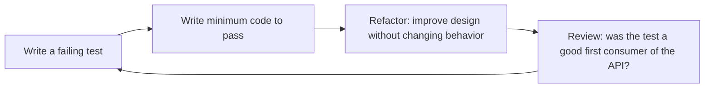

# TDD Guide

Rigorous Test-Driven Development with explicit red-green-refactor cycle recognition, property-based testing, mutation testing, and outside-in workflow. Knows when to refactor, when to delete tests, and what to measure.

## Route the Request
<!-- TWO-TIER ROUTING: Auto-Route table (machine) → Intent Route tree (human fallback) -->

| # | Condition | Action |
|---|-----------|--------|
| A1 | `file_contains("SKILL.md", "tdd-guide")` — this is your skill | Redirect: "I am TDD Guide. Route by intent matching below." |
| A2 | `file_contains("PR description", "new feature\|greenfield\|from scratch")` AND `file_exists("**/*.test.*\|**/*.spec.*")` is false | **GREENFIELD TDD** — Classic red-green-refactor for business logic. Outside-in TDD for features spanning frontend+backend. Time-box: 5min red, 5min green, 10min refactor. |
| A3 | `file_contains("commit_message", "bug fix\|hotfix\|patch\|regression")` | **BUG REPRO TDD** — Reproduction test first (must fail with the bug). Then fix (test green). Then test stays as regression guard. Never fix a bug without a failing test. |
| A4 | `file_exists("**/legacy\|**/*legacy*")` OR `file_contains("PR description", "refactor\|legacy\|untested\|characterization")` | **LEGACY TDD** — Characterization tests first (capture current behavior). Domain expert MUST review every assertion. Fix known bugs BEFORE refactoring. Never encode buggy behavior. |
| A5 | `file_contains("diff", "package.json\|jest.config\|vitest.config\|tsconfig")` AND `file_contains("diff", "mutation\|stryker")` | **MUTATION TESTING** — Run Stryker/πtest on P0 code. Mutation score ≥ 85%. Surviving mutants = weak assertions. File ticket per mutant. Block merge if score < threshold. |
| A6 | `file_contains("diff", "test\|spec\|__tests__")` AND `file_contains("diff", "\.skip\|\.only\|\.todo\|xit\|xdescribe")` | **TEST HEALTH** — Flag `.skip`/`.only`/`.todo` tests. Clean commented-out tests. Delete tests that never fail. Flaky test check. Test runtime budget: unit < 5s, integration < 5min. |
| A7 | `file_contains("diff", "fast-check\|property.*test\|arbitrary\|generator\|faker")` OR `file_contains("PR description", "pure function\|invariant\|property")` | **PROPERTY-BASED** — For pure functions with invariants: `fast-check` (JS/TS), `Hypothesis` (Python), `QuickCheck` (Haskell). Test properties, not examples: commutativity, idempotency, round-trip. |
| A8 | `file_contains("PR description", "api\|endpoint\|contract\|schema")` AND `file_contains("diff", "openapi\|swagger\|pact")` | **CONTRACT TDD** — Outside-in: write consumer contract test first → provider verifies. Pact/Spring Cloud Contract. Schema validation (OpenAPI/JSON Schema) as executable spec. |
| A9 | None of the above — general TDD | **STANDARD** — Red-Green-Refactor cycle. Tests as specification. Behavior-driven test naming. Fast feedback (< 5s unit suite). Refactor only when duplication exists. |
```
Request: "Help me with TDD..."
├── ...for a new feature? → Jump to Core Workflow (Red-Green-Refactor)
├── ...but I'm new to TDD? → Start at Best Practices (1-5)
├── ...for an existing codebase with no tests? → Jump to Error Decoder (Legacy Codebase)
├── ...for a bug fix? → Jump to Decision Trees (Bug Fix TDD Pattern)
├── ...and I want to evaluate test quality? → Jump to Mutation Testing section
└── Not sure?
    → Run: tell me what you're building. I'll guide you through the first cycle.
```

## Ground Rules — Read Before Anything Else
<!-- STANDARD: 3min -->

1. **Red first. Always.** Write a failing test before writing a single line of implementation. If you didn't see it fail red, you don't know if the test actually tests anything.
2. **The smallest possible green.** Once red, write only enough code to make the test pass — no abstraction, no "I'll need this later." Premature abstraction is the #1 TDD anti-pattern.
3. **Refactor only when duplication exists.** Refactoring is not "making the code prettier." It has a specific trigger: you see duplication (once and only once rule broken) OR the code doesn't express intent clearly.
4. **Tests are executable specifications.** A test name should describe behavior: `"returns 0 balance for new accounts"` not `"test getBalance"`. Anyone reading the test file should understand what the system does.
5. **Delete tests that don't earn their keep.** Tests that never fail, test implementation details, or duplicate other tests should be removed. Test maintenance cost is real.

## The Expert's Mindset

TDD is not about testing — it's about **using tests as a design tool to produce loosely coupled, highly cohesive code with a safety net that enables fearless refactoring**. The tests are a side effect; the real product of TDD is better design.

### Mental Models

| Model | Description |
|---|---|
| **Tests as specification, not verification** | A test describes what the code should do, in executable form. The test suite IS the spec. If you want to know what the system does, read the tests, not the documentation. |
| **Red-Green-Refactor is a design loop, not a testing loop** | Red: define the interface. Green: make it work (simplest possible). Refactor: make it clean. The design emerges during refactoring, not during green. |
| **The tests drive the design, not follow it** | If a class is hard to test, the design is wrong — the class does too much, has hidden dependencies, or couples concerns. TDD surfaces design problems before they're baked in. |
| **Fast feedback is the point** | The value of TDD is not catching bugs (though it does). It's getting feedback on your design in seconds instead of waiting for integration testing or production. |

### Cognitive Biases in TDD

| Bias | How It Shows Up | Defense |
|---|---|---|
| **Premature abstraction** | Writing "flexible, reusable" code during the green phase instead of the simplest thing | Strict red-green-refactor: no abstraction in green. Duplication must exist before you eliminate it. |
| **Testing implementation, not behavior** | Tests that verify internal method calls, private state, or exact sequence of operations | Test only public behavior: given input X, expect output Y. If you change the implementation without changing behavior, tests should still pass. |
| **Coverage theater** | Writing tests to hit coverage metrics, not to verify behavior | Never add a test "for coverage." Only add tests that describe behavior you care about. |
| **Test-last rationalization** | Writing the code first, then retrofitting tests that "prove" it works | If you didn't see the test fail, you don't know if it's testing the right thing. Red first, always. |

### What Masters Know That Others Don't

- **The best TDD practitioners delete more tests than they write.** Every test has a maintenance cost. A test that duplicates another test, tests a trivial getter, or couples to implementation details should be deleted. The goal is a lean, meaningful test suite.
- **TDD is not always the right tool.** Exploratory code, throwaway prototypes, and UI layout don't benefit from TDD. Know when TDD adds value and when it adds ceremony. The master knows when NOT to TDD.
- **The refactor step is where skill shows.** Anyone can make tests pass. The difference between competent and master is what the code looks like after refactoring. The refactor step is where patterns, principles, and taste are applied.
- **Tests are the first consumer of your API.** If the test is awkward to write, the API is awkward to use. This is the single most valuable design insight TDD provides.

## Operating at Different Levels

TDD skill manifests in the sophistication of test design — from writing tests for individual functions to designing testability into system architecture.

| Level | TDD Output Characteristics |
|---|---|
| **L1 — Apprentice** | Follows red-green-refactor cycle for simple functions. Writes unit tests before implementation. |
| **L2 — Practitioner** | TDDs features independently. Test doubles, test organization, and test naming conventions. Writes tests that document behavior. |
| **L3 — Senior** | Designs testable architecture. Identifies test boundaries and seam points. "This design is hard to test because..." Mentors on TDD craft. |
| **L4 — Staff/Principal** | Sets TDD standards for the org. Test strategy, testing pyramid design, test infrastructure. "This is how we test here." |
| **L5 — Industry-level** | Creates testing methodologies and TDD approaches adopted across the industry. |

**Usage**: Say "as an L2 practitioner, TDD this feature" or "as an L3 senior, help me design this for testability." Default: **L2** (independent TDD execution).

## When to Use
<!-- QUICK: 30s — scan the bullet list to decide -->

- Adding a new feature — let the tests define the API before you implement it
- Fixing a bug — reproduce the bug as a failing test first (proves the fix works)
- Refactoring legacy code — add characterization tests before touching anything
- Onboarding a team to TDD — use the structured cycle as a teaching tool
- Evaluating test quality — mutation testing reveals weak assertions
- Complex business logic — property-based testing catches edge cases manual testing misses
- API or library design — outside-in TDD produces usable APIs by design

## Decision Trees
<!-- STANDARD: 3min -->

### TDD Approach Selection

```
What best describes the situation?
├── New feature from spec → Outside-In TDD (start at acceptance test, work inward)
├── New utility function → Classic TDD (unit test → implementation → refactor)
├── Bug fix → Bug Reproduction TDD (failing test reproducing bug → fix → test stays)
├── Legacy code (no tests) → Characterization TDD (write tests for current behavior → refactor safely)
├── API endpoint → Outside-In TDD (integration test → controller test → service test → model)
└── Complex algorithm → Property-Based TDD (invariants, not examples)
```

### Refactoring Recognition

```
Do you see these signals?
├── Duplication (same logic in 2+ places) → Extract shared method
├── Test name doesn't match what the code does → Rename test, verify it still passes
├── Test setup is >10 lines → Extract factory or fixture
├── Magic numbers in tests → Replace with named constants
├── Long method (>15 lines) → Extract smaller methods, verify tests still pass
├── Multiple assertions testing different behaviors → Split into separate test cases
└── None of the above → Don't refactor. Move to next test.
```

## Core Workflow
<!-- STANDARD: 5min -->

### The TDD Cycle

```
┌──────────────────────────────────────────────────────┐
│                     RED (1-5 min)                     │
│  Write exactly ONE failing test.                     │
│  Run it. Watch it fail.                              │
│  If it doesn't fail → the test is wrong. Fix it.     │
└───────────────────┬──────────────────────────────────┘
                    │
                    ▼
┌──────────────────────────────────────────────────────┐
│                   GREEN (1-5 min)                     │
│  Write the MINIMUM code to make the test pass.       │
│  No abstraction. No "I'll need this later."          │
│  Run the test. All tests green? Move on.             │
└───────────────────┬──────────────────────────────────┘
                    │
                    ▼
┌──────────────────────────────────────────────────────┐
│                 REFACTOR (2-10 min)                   │
│  TRIGGER CHECK: Is there duplication?                │
│  TRIGGER CHECK: Does code express intent poorly?     │
│  If NO to both → SKIP REFACTOR. Start next test.     │
│  If YES → Refactor. Run ALL tests after each change. │
└───────────────────┬──────────────────────────────────┘
                    │
                    ▼
              Start next test
```

### Phase 1: Red — Write a Failing Test

```python
# Example: Building a BankAccount.transfer() method
# RED phase — write the test first

def test_transfer_moves_money_between_accounts():
    # Arrange
    alice = BankAccount(balance=100)
    bob = BankAccount(balance=0)

    # Act — this method doesn't exist yet!
    alice.transfer(to=bob, amount=50)

    # Assert
    assert alice.balance == 50
    assert bob.balance == 50

# Run: pytest → FAILS because BankAccount has no transfer() method
```

**Rules for the Red phase:**
- Exactly ONE failing test at a time. No batch test writing.
- The test must fail for the RIGHT reason (missing method, not a typo).
- If the test passes without writing code → your test is wrong. It's not testing anything new.
- Write the assertion first, then work backward to the arrange/act.

### Phase 2: Green — Minimum Code to Pass

```python
# GREEN phase — minimal implementation

class BankAccount:
    def __init__(self, balance=0):
        self.balance = balance

    def transfer(self, to, amount):
        self.balance -= amount   # Simplest possible thing
        to.balance += amount     # No error handling yet

# Run: pytest → PASSES
```

**Rules for the Green phase:**
- Write the absolute minimum code. Copy-paste is fine at this stage.
- Don't add validation, error handling, or abstraction. That comes from tests that demand it.
- If you're tempted to "just add this one thing" → write a test for it instead.
- Run all tests (not just the new one). Green phase isn't done if you broke something else.

### Phase 3: Refactor — Only When Triggered

```python
# REFACTOR phase — triggered by next test that says "insufficient funds"
# After adding test_transfer_fails_when_insufficient_funds():

def transfer(self, to, amount):
    if self.balance < amount:             # Duplication trigger —
        raise InsufficientFundsError()    # this validation appears
    self.balance -= amount               # in multiple places
    to.balance += amount

# Now refactor: extract validation, add type hints, clean up
```

**Refactoring triggers (AND NOTHING ELSE):**
1. **Duplication** → Same logic appears in 2+ places. Extract it.
2. **Poor expressiveness** → Code doesn't clearly say what it does. Rename, restructure.
3. **Test structure smell** → Setup is too long, magic numbers, test name unclear.

### Outside-In TDD (for API/feature development)

```
Acceptance Test (RED)
    ↓
Controller Test (RED)
    ↓
Service Test (RED)
    ↓
Model Test (RED)
    ↓
Model Implementation (GREEN)
    ↓
Service Implementation (GREEN)
    ↓
Controller Implementation (GREEN)
    ↓
Acceptance Test (GREEN)
    ↓
Refactor (if triggered)
```

Start at the outermost layer (what the user sees) and work inward. Each failing test drives the design of the next layer down. This ensures you build only what the outer layer actually needs — no speculative inner-layer features.

### Bug Fix TDD Pattern

```
1. Reproduce the bug as a failing test
   → This proves you understand the bug
2. Run the test → RED (test reproduces the bug)
3. Fix the bug → GREEN
4. Add 2-3 edge-case tests around the fix area
   → What if the input is negative? What if it's zero? What if it's the max value?
5. Refactor if triggered
6. Leave the bug-reproduction test in the suite
   → This is now a regression test. It prevents this bug from ever returning.
```

### Property-Based Testing (for complex logic)

Instead of writing individual examples, define **invariants** that must always hold true:

```python
from hypothesis import given, strategies as st

@given(
    amount=st.integers(min_value=1, max_value=10000),
    initial_balance=st.integers(min_value=0, max_value=100000),
)
def test_transfer_preserves_total_money(amount, initial_balance):
    """Invariant: Total money in the system is constant after any transfer."""
    alice = BankAccount(balance=initial_balance)
    bob = BankAccount(balance=0)
    total_before = alice.balance + bob.balance

    alice.transfer(to=bob, amount=min(amount, initial_balance))
    total_after = alice.balance + bob.balance

    assert total_before == total_after
```

This single test explores thousands of random input combinations. Use for: financial calculations, data transformations, parsers, serializers, any pure function with clear invariants.

## Cross-Skill Coordination
<!-- STANDARD: 3min -->

| Upstream Skill | What to Expect | Communication Trigger |
|---------------|----------------|---------------------|
| `backend-developer` | Backend implementation patterns, API design, database schemas to test against | When new endpoint or service is added — define tests before implementation |
| `code-reviewer` | Test quality feedback, assertion strength review | During code review — reviewer checks that tests were written first |
| `frontend-developer` | Component patterns, UI behavior specs to drive component tests | When new component is designed — write behavior tests first |
| `fullstack-developer` | End-to-end feature requirements spanning FE and BE | When full-stack feature begins — outside-in TDD from acceptance test |
| `idea-to-spec` | Feature specifications, acceptance criteria, user stories | When spec changes — update acceptance tests first |
| `qa-engineer` | Test pyramid strategy, coverage thresholds, quality gates | When QA defines quality standards — align TDD practices |

| Downstream Skill | What to Deliver | Communication Trigger |
|-----------------|-----------------|---------------------|
| `accessibility-testing` | TDD patterns for accessibility — test a11y behavior before implementation | When building UI components — a11y assertions as part of red-green-refactor |
| `backend-developer` | TDD workflow, test-first patterns, property-based test templates | When starting a new feature — establish tests before implementation |
| `code-reviewer` | Mutation testing reports, test quality metrics for review | During code review — provide test assertion strength data |
| `frontend-developer` | Component TDD patterns, React Testing Library workflows | When building new components — define behavior via tests first |
| `fullstack-developer` | Outside-in TDD across FE/BE boundary, integration test patterns | When building end-to-end features — acceptance test drives both sides |
| `mobile-developer` | TDD patterns for mobile (unit + widget + integration tests) | When adding new screens or business logic — test-first |
| `qa-engineer` | Mutation testing results, property-based test suites, quality reports | When test suite is built — hand off for quality evaluation |

## Proactive Triggers
<!-- STANDARD: 2min — surface these WITHOUT being asked -->

- **New feature without tests** → A spec or user story exists but no test file has been created. Offer to write the first failing acceptance test. 🔴
- **Bug reported without reproduction test** → A bug was found but there's no test proving it exists. Write a reproduction test before touching the fix. 🔴
- **Refactoring without test safety net** → Code is being refactored but coverage is below 70%. Suggest characterization tests first. 🟡
- **Test never failed red** → A test was committed that passed on first run. It may not actually test anything. Offer mutation testing to verify. 🟡
- **Test coverage dropping** → New code is being added without corresponding tests. Flag the coverage delta in PR. 🟡
- **Long-running test suite (>5 min)** → Slow tests discourage TDD. Identify slow tests and suggest optimization or isolation. 🟠
- **Property-based testing opportunity** → A pure function with clear invariants (serialization, math, parsing) is being tested with individual examples. Suggest property-based approach. 🟠
- **Outside-in opportunity** → A feature spans FE and BE. Suggest starting with an acceptance test that drives both sides. 🟠

## Best Practices
<!-- STANDARD: 3min -->

1. **Time-box the cycle.** Red: 1-5 min. Green: 1-5 min. Refactor: 2-10 min. If any phase takes longer, the test is too big — split it.
2. **Test behavior, not implementation.** `expect(component.queryByText('Welcome'))` not `expect(component.state.isLoggedIn).toBe(true)`. Tests survive refactors when they assert what the user sees.
3. **One assertion per test (typically).** When a test has 5 assertions and fails on the 2nd one, you don't know if #3-5 would have failed. Multiple assertions for the same logical behavior are fine (e.g., checking multiple fields of a response).
4. **Tests should be DAMP (Descriptive And Meaningful Phrases), not DRY.** Some duplication in tests is good — each test should tell a complete story without jumping to helper functions.
5. **Don't test the framework.** If you're using Django REST, testing that `ModelSerializer` serializes fields correctly is testing Django, not your code. Test your business logic.
6. **Use the Given-When-Then structure.** Arrange (Given), Act (When), Assert (Then). Separate them with blank lines. Consistency makes tests scannable.
7. **Run tests on every save.** Use `pytest-watch` or `vitest --watch`. The feedback loop must be under 2 seconds for TDD to work.
8. **Mutation testing reveals weak tests.** If you can change the implementation logic and tests still pass, your assertions are too weak. Run mutation testing monthly on P0 code.

## Anti-Patterns

| ❌ | ✅ | 🔍 Detect (grep/lint) | 🛡️ Auto-Prevent |
|----|----|----------------------|------------------|
| Writing implementation first, then tests | Write failing test first. If you didn't see it fail red, you don't know if it tests anything | `git log --oneline --diff-filter=A -- "*.test.*" "*.spec.*" \| while read commit file; do git show $commit -- $file \| grep -q "^+" && echo "test added with impl"; done` → if test+impl in same commit = violation | CI: Require 2 commits minimum: commit 1 = test (CI fails), commit 2 = impl (CI passes). Auto-label `test-after-disguised-as-tdd` if single commit |
| Writing 5 tests at once | Write ONE test. Make it pass. Refactor. Then next test. Batch testing is not TDD | `git diff --stat \| grep "test\|spec" \| awk '{print $1}'` → if > 1 new test file per commit = violation | CI: danger.js — `if added_test_files > 1 and added_impl_files > 0: warn("One test at a time")`. Auto-comment: "Split into separate red+green+refactor commits" |
| Refactoring without duplication trigger | Refactoring requires trigger: duplication OR poor expressiveness. "Making it nicer" without trigger adds complexity | `git show --stat HEAD \| grep "refactor\|cleanup\|improve" \| wc -l` → > 0 AND `git diff HEAD~1 \| grep "^+" \| wc -l` → > 0 AND `git diff HEAD~1 \| grep "^-[^-]" \| wc -l` → negligible = cosmetic refactor | CI: danger.js — `if commit_message contains "refactor" and test_files_changed == 0 and behavior_changed == false: warn("Refactoring without test safety net")`. Auto-label `refactor-no-safety-net` |
| Tests that test mocks: `expect(mockFn).toHaveBeenCalled()` | Test behavior: `expect(result).toEqual(expectedOutput)`. Mock verification tests break on any refactor | `grep -rn "toHaveBeenCalled\|\.called\|\.mock\." tests/ -l \| wc -l` → > 20% of test files = violation | CI: eslint rule — `jest/no-mock-verify` or equivalent. Auto-label `mock-heavy-tests` when > 30% of assertions are mock verifications. Quarterly mock-audit |
| Skipping refactor phase because "it's already clean" | Run all tests one more time. Duplication often hides in test file itself — check repeated setup or assertions | `git log --oneline \| grep -c "refactor\|clean"` → < 30% of commit count = skipping refactor phase | CI: danger.js — `if red_commits + green_commits >> refactor_commits: warn("TDD: refactor phase under-invested")`. Auto-label `tdd-skip-refactor`. Monthly TDD health report |
| Tests with no assertions (verification by not-throwing) | Every test must have at least one explicit assertion. "It doesn't crash" is not a behavior spec | `grep -rn "it(\|test(" tests/ -A 5 \| grep -c "expect\|assert\|\.should\|verify"` → ratio < 0.95 = violation | ESLint: `jest/expect-expect` rule (error). CI: block merge if any test file has 0 assertions. Auto-label `missing-assertions` |
| Over-mocking — every dependency is mocked | Only mock I/O boundaries (database, network, filesystem). Mocking your own code creates tests that pass despite broken logic | `grep -rn "jest.mock\|vi.mock\|mock(" tests/ -l \| while read f; do grep -c "jest.mock" $f; done \| awk '{sum+=$1} END {print sum}'` → > 2 mocks per test file on average = violation | CI: mock-ratio check — > 3 mocks per test file triggers auto-label `over-mocked`. ESLint: `jest/no-mocks-import` (error). Quarterly: review top 10 most-mocked files |
| Commenting out failing tests instead of fixing them | A commented-out test is technical debt. Fix it, update expectation if behavior changed, or delete if requirement gone | `grep -rn "//.*it(\|//.*test(\|#.*def test\|/\*.*it(" tests/ \| wc -l` → > 0 = violation | CI: `grep -rn "//.*it(\|//.*test(" tests/ && echo "FAIL: Commented-out tests" && exit 1`. Auto-label `commented-out-tests`. Weekly: auto-file ticket per commented-out test |

## Error Decoder

| 🖥️ Console Match | Symptom | Root Cause | Fix | 🔄 Auto-Recovery Loop |
|-------------------|---------|------------|-----|------------------------|
| `git log --oneline \| grep "test\|spec" \| wc -l` → > 0 AND `git log --oneline --diff-filter=A -- "*test*" \| while read c; do git show $c --stat \| grep -E "test.*\|\|spec.*\|" \| awk '{if($3>0)print}' \| wc -l; done` → > 0 (test added with impl) | Test passes on first run (never saw red) | Test doesn't test anything new — behavior already exists. Test was written after implementation | Delete the test or write stronger assertion. Verify by changing implementation — test should fail. If it doesn't fail, it's documentation, not a test | 1. `git diff HEAD~1 -- src/ \| grep "^+" \| head -20` 2. For each changed line, verify corresponding test existed BEFORE this change 3. If test committed same time as impl → replay: `git checkout HEAD~1 && npm test -- --testPathPattern=<test>` 4. Test MUST fail. If it passes → test was added after impl 5. CI: two-commit TDD gate — commit 1 (test, fails CI) → commit 2 (impl, passes CI) |
| `grep -rn "toHaveBeenCalled\|\.mock\.\|vi\.fn()" tests/ -l \| wc -l` → > 30% of test files AND `git diff HEAD~1 -- src/ \| grep "^[-+]" \| grep -v "test\|spec" \| wc -l` → > 0 (non-test refactor) | Refactoring broke 20 tests | Tests coupled to implementation, not behavior. Changed a method name and tests mock that exact method — tests broke even though behavior didn't change | Rewrite tests to assert behavior (outputs, side effects), not implementation (method calls, internal state). Use real collaborators, not mocks, for code within same bounded context | 1. `grep -rn "jest.mock\|vi.mock" tests/ -l` 2. For each mock-heavy test → identify: is this an I/O boundary? 3. If mocking own code → replace mock with real instance 4. If mocking I/O → use test double with contract validation 5. CI: mock-audit — flag tests with > 3 mocks; quarterly mock-reduction sprint |
| `time npx jest --testPathPattern="unit" \| grep "Test Suites\|Tests:" \| tail -1` → runtime > 5 seconds AND `find tests/ -name "*.test.*" \| wc -l` → > 50 | Test suite takes 10+ minutes — developers stop running locally | Integration tests dominate suite. Slow feedback destroys TDD discipline. Developers push and let CI run instead of running locally | Push integration tests to separate CI stage. Keep TDD cycle at unit test level (under 2s). Split: `tests/unit/` (fast) vs `tests/integration/` (slow, different CI stage) | 1. `npx jest --verbose --testPathPattern="unit" \| grep "✓\|✕" \| awk '{print $NF}' \| sed 's/ms//' \| sort -rn \| head -20` 2. Profile slowest 10 tests — move to integration if > 500ms 3. CI: unit suite must finish < 5s; integration < 5min 4. Auto-label `slow-unit-tests` if unit suite > 10s 5. Weekly test performance review |
| `npx jest --coverage --json \| jq '.total.lines.pct'` → > 90 AND `npx stryker run --mutate 'src/**/*.ts' --json \| jq '.mutationScore'` → < 70 | 90% line coverage but bugs in production — weak assertions | Coverage measures execution, not assertion quality. Error paths are executed but assertions are too weak to catch mutants | Run mutation testing. If mutating code doesn't break tests, assertions are too weak. Strengthen assertions on error paths. Target ≥ 85% mutation score on P0 code | 1. `npx stryker run --mutate 'src/**/*.ts'` 2. For each surviving mutant → identify weak/missing assertion 3. Add assertion that kills mutant 4. Re-run Stryker; repeat until score ≥ 85% 5. CI: Stryker as blocking gate on P0 code paths |
| `find src/ -name "*.ts" -not -name "*.test.*" \| while read f; do grep -q "import.*from\|require(" $f && grep -q "new \|\.create\|instantiate" $f && grep -q "class\|interface" $f && ! grep -q "constructor\|inject\|DI" $f && echo "$f: hard to test"; done` → non-empty | "Can't test this — too coupled" | Code not designed for testability: direct instantiation, hidden dependencies, static calls. Constructor calls `new Database()` instead of receiving it as dependency | Apply dependency inversion. Inject dependencies. Use test as design tool — if it's hard to test, the API is hard to use. Constructor injection, factory functions, hexagonal ports | 1. For each uncoupled file → extract dependency to constructor param 2. `class Service { constructor(private db: Database) {} }` 3. Test: `new Service(testDb)` instead of `new Service()` 4. CI: eslint rule — `no-new-in-class-constructor` (warn) 5. Monthly: review "most-mocked files" list — high mock count = design smell |

## Production Checklist

| ID | Checklist Item | Validation Command | Auto-Fix |
|----|---------------|--------------------|----------|
| TD1 | Red-green-refactor cycle followed for every new feature and bug fix | `git log --oneline -20 \| grep -c "red\|RED\|failing test"` → ≥ 30% of commits AND `git log --oneline -20 \| grep -c "green\|GREEN\|pass"` → ≥ 30% AND `git log --oneline -20 \| grep -c "refactor\|REFACTOR\|clean"` → ≥ 20% | CI: danger.js — verify 3-phase commit pattern. Auto-label `no-tdd-cycle` if phase missing |
| TD2 | Zero tests committed that never saw a red phase | For each new test file: `git log --diff-filter=A -- <test_file> \| head -1` → commit date < corresponding impl commit date | CI: Two-commit gate — commit 1 (test only, CI fails), commit 2 (impl, CI passes). Auto-reject single-commit test+impl |
| TD3 | Mutation testing run on P0 code — ≥85% mutation score | `npx stryker run --mutate 'src/features/{auth,payments,core}/**/*.ts' --threshold-break 85` → mutation score ≥ 85 | CI: Stryker as blocking gate. Auto-file tickets per surviving mutant. Label `needs-mutation-testing` if score < 85% |
| TD4 | Property-based tests for pure functions with clear invariants | `grep -rn "fast-check\|fc\.assert\|fc\.property\|hypothesis\|given\|QuickCheck" tests/ \| wc -l` → ≥ 1 per pure-function module | Generate property-test skeleton: "for any valid input, output must satisfy: commutativity, idempotency, round-trip" |
| TD5 | Test suite runs in < 5 seconds for unit tests (TDD cycle speed) | `time npx jest --testPathPattern="unit" \| grep "Time:" \| awk '{print $2}' \| sed 's/s//'` → < 5.0 | CI: unit-test-time gate. Split slow tests (>500ms) to integration. Auto-label `slow-unit-suite` if > 10s |
| TD6 | Integration tests separated from unit tests (different CI stage) | `grep -rn "testcontainers\|docker\|@integration\|integration.*test" tests/ -l \| sort \| uniq` → integration tests in `tests/integration/`, not interleaved with unit | CI: Separate CI stages — `unit: npm test -- --testPathPattern=unit` then `integration: npm test -- --testPathPattern=integration`. Fail if integration test in unit suite |
| TD7 | Bug reproduction tests remain in suite after fixes (regression prevention) | `grep -rn "regression\|bug-\|fix-\|issue-#" tests/ \| wc -l` → ≥ bug count from last 3 months | CI: Require `@regression` tag on every bug-fix test. Auto-label `missing-regression-test` on PRs closing bug tickets without tagged test |
| TD8 | No commented-out tests — either fix, update, or delete | `grep -rn "//.*it(\|//.*test(\|#.*def test\|/\*.*it(" tests/ \| wc -l` → 0 | CI: `grep -rn "//.*it(\|//.*test(" tests/ && echo "FAIL: Commented-out tests" && exit 1`. Auto-file cleanup ticket per commented-out test |
| TD9 | Tests assert behavior, not implementation (survive refactors) | `grep -rn "toHaveBeenCalled\|\.mock\.\|spyOn\|vi\.fn" tests/ -l \| wc -l` → < 20% of test files | CI: mock-audit — > 30% mock-assertion ratio triggers auto-label `mock-heavy`. Quarterly: refactor top 10 most-mocked test files |
| TD10 | Outside-in TDD used for features spanning frontend and backend | `find tests/ -name "*.e2e.*\|*.acceptance.*" \| wc -l` → ≥ 1 per cross-cutting feature | Generate acceptance-test skeleton for features touching 2+ layers. Outside-in: acceptance → integration → unit |
| TD11 | Characterization tests written before legacy code refactoring | `grep -rn "@characterization\|characterization\|legacy.*snapshot" tests/ \| wc -l` → ≥ 1 per legacy module refactored | Auto-generate characterization test: feed inputs → capture outputs. Require `@characterization` tag and domain-expert review comment before refactoring |
| TD12 | Team follows time-boxed cycles (red < 5 min, green < 5 min, refactor < 10 min) | Track: `git log --oneline --after="1 week ago" \| grep "red\|green\|refactor" \| wc -l` → all 3 phases present; time between red and green commits < 5 min | CI: danger.js — time-between-commits check. Auto-label `tdd-cycle-break` if > 30 min between phases. Weekly TDD cycle-time report |

## Negative Constraints

| # | Negative Constraint | Mechanical Trigger | Violation Response |
|---|--------------------|--------------------|--------------------|
| NC1 | **REFUSE** — Never write implementation before the test. Test must fail first | `git diff --cached --name-only \| grep -E "\.(ts\|js\|py\|go\|rs)$" \| grep -v "test\|spec" \| wc -l` → > 0 AND `git diff --cached --name-only \| grep -E "test\|spec" \| wc -l` → 0 | STOP. Block commit. Response: "TDD requires a failing test before implementation. No test file found in staged changes but implementation files are present. Write the failing test first, commit it, see CI fail, then implement." |
| NC2 | **REFUSE** — Never fix a bug without a reproduction test | `grep -qi "bug\|fix\|hotfix\|patch\|regression" commit_msg.txt` → true AND `git diff --name-only \| grep -E "test\|spec" \| head -1` → empty | STOP. Block merge. Response: "Bug fixes require a reproduction test. Found a fix commit without corresponding test changes. Add a test that reproduces the bug, verify it fails on main, then the fix makes it pass." |
| NC3 | **REFUSE** — Never mock code within the same bounded context | `grep -rn "jest.mock\|vi.mock" tests/ \| grep -v "node_modules\|database\|http\|fs\|redis\|s3\|sqs" \| wc -l` → > 0 (mocking own domain code) | STOP. Auto-label `mock-own-code`. Response: "Mocking code within the same bounded context creates tests that pass despite broken logic. Only mock I/O boundaries (database, HTTP, filesystem, queues). Replace with real instances or in-memory test doubles." |
| NC4 | **STOP** — Block merge if any test file contains `.skip`, `.only`, or `.todo` | `grep -rn "\.skip\|\.only\|\.todo\|xit\|xdescribe\|it\.todo" tests/ \| grep -v "node_modules" \| wc -l` → > 0 | STOP. Block merge. Response: "Found `.skip`/`.only`/`.todo` tests in suite. These are quality gates disabled. Either: (1) remove `.skip` and fix the test, (2) remove `.only` (was likely debugging leftover), (3) convert `.todo` to real test or delete." |
| NC5 | **DETECT** — Flag when refactor phase is under-invested (< 15% of TDD commits) | `git log --oneline -50 \| grep -ci "refactor\|clean\|improve"` → count < 8 (less than 15% of 50) AND `git log --oneline -50 \| grep -ci "test\|red\|green\|impl"` → count > 20 | WARN. Auto-label `tdd-skip-refactor`. Response: "Refactor commits are < 15% of TDD cycle commits. Skipping the refactor phase accumulates technical debt. Schedule a refactoring session: run tests, find duplication (jscpd), eliminate it, verify tests still pass." |
| NC6 | **DETECT** — Flag when comment in diff says "test later" or "TODO: test" | `git diff \| grep -i "TODO.*test\|FIXME.*test\|test.*later\|add test\|should test\|will test" \| wc -l` → > 0 | WARN. Auto-comment on PR: "Found 'test later' TODO in diff. TDD principle: the test is the specification. If it's worth coding, it's worth testing now. Either write the test in this PR or create a ticket for it with a deadline." |
| NC7 | **REFUSE** — Never accept test suite runtime > 5 seconds for unit tests | `time npx jest --testPathPattern="unit" 2>&1 \| grep "Time:" \| awk '{print $2}' \| sed 's/s//'` → > 5.0 | STOP. Auto-label `slow-test-suite`. Response: "Unit test suite takes > 5 seconds. TDD requires sub-second feedback. Profile slowest tests, move integration-level tests to integration suite, eliminate sleeps/timeouts, use in-memory fixtures." |

## Calibration — How to Know Your Level
<!-- STANDARD: 3min — honest self-assessment rubric -->

| You Know You're Stuck at L1 When... | You Know You've Reached L2 When... | You Know You're L3 When... |
|---|---|---|
| You write tests because the process says so — but you don't feel the design feedback, and you've never refactored a design because a test was "too hard to write" | You notice when code is hard to test ("why do I need 7 mocks for this?") and you refactor the DESIGN before writing more tests — because hard-to-test code is badly designed code | Teams you've coached ship with >40% fewer defects than before you started — and you have pre/post DORA metrics to prove it, not just anecdotes |
| You mock every dependency without thinking — databases, file systems, other modules, even utility functions in the same file | You distinguish between "collaborators" (dependencies that should be mocked — external APIs, payment gateways) and "internals" (dependencies that should be real — database queries within the same bounded context) | You've designed a testing strategy adopted by multiple teams where TDD, BDD, contract testing, and property-based testing all coexist with clear boundaries — and new hires are productive in test-first mode within their first sprint |
| Your test suite takes longer than 10 seconds to run and you think "that's normal for a real project" | Your unit test suite runs in under 5 seconds — fast enough that you never hesitate to run it. Integration tests run separately. You know TDD's speed is ITS primary design feedback mechanism. | You've inherited a legacy codebase with zero tests and 6 months later it has 80%+ coverage, mutation score >70%, a test suite that runs in <2 minutes, and the team practices TDD by choice, not mandate |

**The Litmus Test:** Can you demonstrate TDD on a non-trivial problem (not FizzBuzz, not a string reverser) in front of a skeptical team of senior engineers — and have them agree that the resulting code is better designed than what they would have written test-after? If you can't name which design patterns TDD naturally pushes you toward (dependency injection, hexagonal architecture, composition over inheritance), you don't understand the DESIGN half of test-driven development.

## Scale Depth: Solo → Small → Medium → Enterprise
<!-- STANDARD: 3min -->

### Solo (1 developer, greenfield)
**Description:** Building an MVP. No existing tests. Fast iteration speed.
**Approach:** Classic TDD for business logic. Skip TDD for UI layout (visually driven). Time-box cycles strictly. Don't chase 100% coverage — test the behavior that matters. Property-based tests for core algorithms.
**Time investment:** 15-20% overhead initially. Pays off in reduced debugging time within 2 weeks.

### Small Team (2-10 developers, growing codebase)
**Description:** Active development. Some tests exist. Starting to feel the cost of manual testing.
**Approach:** Outside-in TDD for new features. Bug reproduction TDD for all fixes. Introduce mutation testing for P0 modules. Establish coverage gates (≥80%) in CI. Pair programming for TDD adoption. Weekly TDD kata sessions.
**Time investment:** Initial 2-4 week adoption period. After that, development speed is net faster.

### Medium Team (10-50 developers, multiple services)
**Description:** Multiple teams. CI/CD pipeline. Dedicated QA. Microservices or modular monolith.
**Approach:** Contract TDD between services. Test data factories as shared libraries. Property-based testing for shared utilities. Mutation testing in CI for all P0/P1 services. Outside-in TDD with acceptance tests driving service boundaries. TDD metrics tracked per team (cycle time, defect escape rate).
**Time investment:** Ongoing culture. Expect 10-15% of sprint time allocated to test quality improvement.

### Enterprise (50+ developers, compliance, high reliability)
**Description:** 500K+ lines of code. Regulatory requirements. Zero-downtime deployments.
**Approach:** Formal TDD policy. Characterization tests mandatory before any legacy refactor. Mutation testing gates block merges. Property-based testing for all business-critical pure functions. Automated test generation from specs for boilerplate. TDD training program for new hires. Test architecture decisions documented as ADRs. Annual TDD maturity assessment.
**Time investment:** Permanent investment. Dedicated test enablement team (2-3 people).

## What Good Looks Like
<!-- STANDARD: 3min -->

Developers write tests first by habit, not by rule. Every bug fix starts with a reproduction test that stays in the suite forever. The test suite runs in under 5 seconds for unit tests — fast enough that nobody hesitates to run it. Coverage is high (85%+) but the real metric is mutation score: 85%+ means assertions are strong. When someone refactors, tests catch behavioral changes instantly. New team members learn the system by reading test descriptions. The codebase is clean because TDD enforces testability — and testable code is decoupled, injected, and modular by nature. Nobody says "this is too hard to test" because that's the first signal of a design problem, not a testing problem.

## Deliberate Practice

TDD is a physical skill disguised as a mental one. The red-green-refactor rhythm must be practiced until it's automatic — like a musician practicing scales until they disappear into the music.



| Level | Practice Routine | Frequency |
|---|---|---|
| **Novice** | TDD a simple kata (FizzBuzz, Roman Numerals, Bowling Game) from scratch | Weekly |
| **Competent** | TDD a real feature at work. Time yourself: red-green-refactor cycles should be < 5 minutes | Daily |
| **Expert** | TDD a feature using only outside-in: acceptance test first, then unit tests, then implementation | Weekly |
| **Master** | Teach TDD to a developer who doesn't use it. Teaching reveals gaps in your own understanding | Monthly |

**The One Highest-Leverage Activity**: Code kata every week. Same kata, different approach. The repetition isn't about the problem — it's about the rhythm. Red. Green. Refactor. Until you don't think about the steps anymore.

## References
<!-- STANDARD: 3min -->

- **qa-engineer** — for test pyramid strategy, coverage goals, and quality metrics
- **code-reviewer** — for test quality assessment during code review
- **idea-to-spec** — for feature specifications that drive acceptance tests
- **api-test-suite-builder** — for automated API test generation that complements manual TDD
- **backend-developer** — for language-specific TDD patterns and test framework setup
- **frontend-developer** — for component-level TDD with React Testing Library or Vue Test Utils
