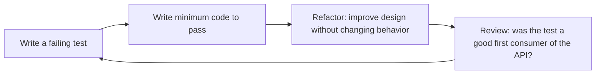

# TDD Guide
> **Portability target:** Spec-level (runs on Claude Code, Copilot, Gemini CLI, Codex, Cursor). No vendor-specific frontmatter fields.

Rigorous Test-Driven Development with explicit red-green-refactor cycle recognition, property-based testing, mutation testing, and outside-in workflow. Knows when to refactor, when to delete tests, and what to measure.

## Route the Request

<!-- TWO-TIER ROUTING: Auto-Route table (machine) → Intent Route tree (human fallback) -->

| # | Condition | Action |
|---|-----------|--------|
| A1 | `file_contains("SKILL.md", "tdd-guide")` — this is your skill | Redirect: "I am TDD Guide. Route by intent matching below." |
| A2 | `file_contains("PR description", "new feature\|greenfield\|from scratch")` AND `file_exists("**/*.test.*\|**/*.spec.*")` is false | **GREENFIELD TDD** — Classic red-green-refactor for business logic. Outside-in TDD for features spanning frontend+backend. Time-box: 5min red, 5min green, 10min refactor. |
| A3 | `file_contains("commit_message", "bug fix\|hotfix\|patch\|regression")` | **BUG REPRO TDD** — Reproduction test first (must fail with the bug). Then fix (test green). Then test stays as regression guard. Never fix a bug without a failing test. |
| A4 | `file_exists("**/legacy\|**/*legacy*")` OR `file_contains("PR description", "refactor\|legacy\|untested\|characterization")` | **LEGACY TDD** — Characterization tests first (capture current behavior). Domain expert MUST review every assertion. Fix known bugs BEFORE refactoring. Never encode buggy behavior. |
| A5 | `file_contains("diff", "package.json\|jest.config\|vitest.config\|tsconfig")` AND `file_contains("diff", "mutation\|stryker")` | **MUTATION TESTING** — Run Stryker/πtest on P0 code. Mutation score ≥ 85%. Surviving mutants = weak assertions. File ticket per mutant. Block merge if score < threshold. |
| A6 | `file_contains("diff", "test\|spec\|__tests__")` AND `file_contains("diff", "\.skip\|\.only\|\.todo\|xit\|xdescribe")` | **TEST HEALTH** — Flag `.skip`/`.only`/`.todo` tests. Clean commented-out tests. Delete tests that never fail. Flaky test check. Test runtime budget: unit < 5s, integration < 5min. |
| A7 | `file_contains("diff", "fast-check\|property.*test\|arbitrary\|generator\|faker")` OR `file_contains("PR description", "pure function\|invariant\|property")` | **PROPERTY-BASED** — For pure functions with invariants: `fast-check` (JS/TS), `Hypothesis` (Python), `QuickCheck` (Haskell). Test properties, not examples: commutativity, idempotency, round-trip. |
| A8 | `file_contains("PR description", "api\|endpoint\|contract\|schema")` AND `file_contains("diff", "openapi\|swagger\|pact")` | **CONTRACT TDD** — Outside-in: write consumer contract test first → provider verifies. Pact/Spring Cloud Contract. Schema validation (OpenAPI/JSON Schema) as executable spec. |
| A9 | None of the above — general TDD | **STANDARD** — Red-Green-Refactor cycle. Tests as specification. Behavior-driven test naming. Fast feedback (< 5s unit suite). Refactor only when duplication exists. |
```
Request: "Help me with TDD..."
├── ...for a new feature? → Jump to Core Workflow (Red-Green-Refactor)
├── ...but I'm new to TDD? → Start at Best Practices (1-5)
├── ...for an existing codebase with no tests? → Jump to Error Decoder (Legacy Codebase)
├── ...for a bug fix? → Jump to Decision Trees (Bug Fix TDD Pattern)
├── ...and I want to evaluate test quality? → Jump to Mutation Testing section
└── Not sure?
    → Run: tell me what you're building. I'll guide you through the first cycle.
```

## Ground Rules — Read Before Anything Else

These rules are non-negotiable constraints that detect TDD mistakes before they are made. Violation means STOP and refuse to proceed.

| # | Negative Constraint | Mechanical Trigger | Violation Response |
|---|-------------------|-------------------|-------------------|
| R1 | REFUSE writing implementation code before a failing test | Trigger: New function/method/class created in a source file AND corresponding test asserting against it does not exist in the same commit/diff | STOP. Respond: "Red first. Always. Write a failing test before writing any implementation. If you didn't see the test fail, you don't know if it actually tests anything. Create the test, run it, confirm it fails for the expected reason, then write the implementation." |
| R2 | REFUSE writing code beyond what the current failing test demands | Trigger: Implementation diff contains code paths, branches, or abstractions not covered by any assertion in the tests added in the same change | STOP. Respond: "The smallest possible green. Write only enough code to make the current failing test pass — no abstraction, no edge-case handling, no 'I'll need this later.' Premature abstraction is the #1 TDD anti-pattern. Remove code not required by a currently-failing test." |
| R3 | REFUSE refactoring without a specific duplication or clarity trigger | Trigger: Diff shows structural changes (renames, extractions, reorganizations) AND no duplicated code blocks were removed AND no test name clarity issue was cited | STOP. Respond: "Refactor only when duplication exists. Refactoring has a specific trigger: you see code duplication (same logic in two places) OR the code doesn't express intent clearly. 'Making it prettier' or 'I think we'll need this pattern' is not refactoring — it's premature optimization. Revert structural changes without a duplication or clarity trigger." |
| R4 | REFUSE tests with non-behavioral names | Trigger: Test name matches pattern "test [functionName]", "should work", "test case [N]", or uses implementation vocabulary instead of domain language | STOP. Respond: "Tests are executable specifications. A test name must describe observable behavior: 'returns 0 balance for new accounts', not 'test getBalance'. Anyone reading the test file should understand what the system does without reading the implementation. Rename tests to use domain language describing the expected behavior." |
| R5 | REFUSE tests that never fail or duplicate existing coverage | Trigger: Test has never failed in git history (no commits where it changed or was added alongside a bug fix) AND its assertions overlap with another test's assertions on the same code path | STOP. Respond: "Delete tests that don't earn their keep. Tests that have never caught a regression, test implementation details rather than behavior, or duplicate coverage from other tests add maintenance cost without safety value. Remove the redundant test." |
| R6 | REFUSE skipping the refactor step after green | Trigger: Code has visible duplication (same logic in two or more places) AND test is green AND PR is submitted without removing the duplication | STOP. Respond: "Red → Green → Refactor. TDD's third step is not optional. After green, scan for duplication and clarity issues. The safety net of passing tests is what makes refactoring fearless — skipping refactor accumulates technical debt. Refactor now while the tests are green." |
| **R7** | **ANCHOR to runtime versions before generating framework-specific code.** Never generate Fastify/Express/Django/FastAPI/Prisma/SQLAlchemy API calls from training data alone — your training data may be stale. | Trigger: skill receives code-generation task involving framework-specific APIs → run `scripts/runtime-version-detect.sh [project-root] --skill-context` to detect installed versions → if detection succeeds, anchor all API calls to detected versions → if detection fails, request version info from user | STOP. Respond: "Detected: {runtime}@{version}, {frameworks}@{versions}. Anchoring all API calls to these versions. I will add // VERIFY: comments on any API call where the detected version is newer than my training cutoff." |
| **R8** | **RUN the ROI Gate before any non-emergency code change.** Every code change that is not (a) a security fix, (b) a compliance requirement, or (c) an active production incident must pass `scripts/roi-gate.sh`. If the gate returns negative, refuse to write the code. | Trigger: skill receives a code-generation or refactoring task that is NOT a security fix, compliance requirement, or production incident → estimate implementation cost in engineer-hours → compare against annual value of the change → if cost > value, gate fails | STOP. Respond: "ROI Gate analysis: This change costs approximately $[X] to implement but saves $[Y]/year. Payback period: [N] years. If payback > 2 years, I recommend declining this work. See `scripts/roi-gate.sh` for the full formula." |


- **Admit uncertainty — never fabricate.** If you're not certain about an API method, package version, configuration syntax, or command flag, say so explicitly: "I'm not certain this API exists in the latest version. Check the official docs at [URL]." Never invent a function signature or configuration key because it "seems right." Hallucinated code costs hours of debugging.
- **Flag your knowledge cutoff.** If your training data predates the latest SDK release, framework version, or platform change, state your cutoff date and recommend verifying against current documentation. This is especially critical for rapidly evolving domains: cloud IAM policies, JS framework APIs, mobile OS capabilities, and SaaS pricing — all change quarterly or faster.
- **Never guess security configurations.** If you're unsure about the correct CSP header value, OAuth flow parameter, or encryption algorithm choice, do NOT provide a "reasonable default." Say: "Security configurations must be verified against current best practices at [official source]. I cannot provide a definitive answer without current documentation."
- **Distinguish between what you know and what you infer.** Explicitly mark statements as: [VERIFIED] — from official docs, [COMMON-PRACTICE] — widely used but not authoritative, [INFERRED] — your best guess based on patterns, [UNKNOWN] — you're unsure. This helps the user calibrate trust in your output.
## The Expert's Mindset

TDD is not about testing — it's about **using tests as a design tool to produce loosely coupled, highly cohesive code with a safety net that enables fearless refactoring**. The tests are a side effect; the real product of TDD is better design.

### Mental Models

| Model | Description |
|---|---|
| **Tests as specification, not verification** | A test describes what the code should do, in executable form. The test suite IS the spec. If you want to know what the system does, read the tests, not the documentation. |
| **Red-Green-Refactor is a design loop, not a testing loop** | Red: define the interface. Green: make it work (simplest possible). Refactor: make it clean. The design emerges during refactoring, not during green. |
| **The tests drive the design, not follow it** | If a class is hard to test, the design is wrong — the class does too much, has hidden dependencies, or couples concerns. TDD surfaces design problems before they're baked in. |
| **Fast feedback is the point** | The value of TDD is not catching bugs (though it does). It's getting feedback on your design in seconds instead of waiting for integration testing or production. |

### Cognitive Biases in TDD

| Bias | How It Shows Up | Defense |
|---|---|---|
| **Premature abstraction** | Writing "flexible, reusable" code during the green phase instead of the simplest thing | Strict red-green-refactor: no abstraction in green. Duplication must exist before you eliminate it. |
| **Testing implementation, not behavior** | Tests that verify internal method calls, private state, or exact sequence of operations | Test only public behavior: given input X, expect output Y. If you change the implementation without changing behavior, tests should still pass. |
| **Coverage theater** | Writing tests to hit coverage metrics, not to verify behavior | Never add a test "for coverage." Only add tests that describe behavior you care about. |
| **Test-last rationalization** | Writing the code first, then retrofitting tests that "prove" it works | If you didn't see the test fail, you don't know if it's testing the right thing. Red first, always. |

### What Masters Know That Others Don't

- **The best TDD practitioners delete more tests than they write.** Every test has a maintenance cost. A test that duplicates another test, tests a trivial getter, or couples to implementation details should be deleted. The goal is a lean, meaningful test suite.
- **TDD is not always the right tool.** Exploratory code, throwaway prototypes, and UI layout don't benefit from TDD. Know when TDD adds value and when it adds ceremony. The master knows when NOT to TDD.
- **The refactor step is where skill shows.** Anyone can make tests pass. The difference between competent and master is what the code looks like after refactoring. The refactor step is where patterns, principles, and taste are applied.
- **Tests are the first consumer of your API.** If the test is awkward to write, the API is awkward to use. This is the single most valuable design insight TDD provides.

## Operating at Different Levels

TDD skill manifests in the sophistication of test design — from writing tests for individual functions to designing testability into system architecture.

| Level | TDD Output Characteristics |
|---|---|
| **L1 — Apprentice** | Follows red-green-refactor cycle for simple functions. Writes unit tests before implementation. |
| **L2 — Practitioner** | TDDs features independently. Test doubles, test organization, and test naming conventions. Writes tests that document behavior. |
| **L3 — Senior** | Designs testable architecture. Identifies test boundaries and seam points. "This design is hard to test because..." Mentors on TDD craft. |
| **L4 — Staff/Principal** | Sets TDD standards for the org. Test strategy, testing pyramid design, test infrastructure. "This is how we test here." |
| **L5 — Industry-level** | Creates testing methodologies and TDD approaches adopted across the industry. |

**Usage**: Say "as an L2 practitioner, TDD this feature" or "as an L3 senior, help me design this for testability." Default: **L2** (independent TDD execution).

### Solo Developer
- Classic TDD: RED → GREEN → REFACTOR cycle for every function and module
- Vitest or Jest for JavaScript/TypeScript; pytest for Python; `go test` for Go
- Test files co-located with source (`foo.test.ts` next to `foo.ts`)
- Coverage tracked locally; 80% target on new code
- Git hooks: pre-commit runs unit tests (<5s suite); pre-push runs integration tests
- Bug fixes always start with a reproduction test

### Small Team (2-5)
- Outside-in TDD for API endpoints: acceptance test → controller → service → model
- Shared test factories (Fishery, factory_boy) and fixtures across the team
- CI quality gate: lint → unit → integration → E2E — block merge on failure
- Contract tests between frontend and backend; schema validation in CI
- Test review as part of code review: assertion quality, mock boundaries, test isolation

### Medium Team (5-20)
- TDD standards documented: naming conventions, mock policies, coverage targets per layer
- Property-based testing (fast-check, hypothesis) for complex business logic
- Mutation testing (Stryker, pitest) run weekly; score trend tracked as quality metric
- Test infrastructure platform: shared CI runners, test DB provisioning, fixture management
- TDD coaching: pair programming sessions, test design reviews, anti-pattern detection in code review

### Enterprise (20+)
- TDD certification program: L1 (classic TDD) → L2 (outside-in) → L3 (testable architecture design)
- Test pyramid enforced organization-wide: layer time budgets, coverage thresholds, test count ratios
- Centralized test data management with production-like anonymized datasets
- Cross-team test strategy reviews for shared libraries and platform components
- TDD metrics dashboard: cycle time, refactor ratio, test-to-code ratio, defect escape rate by team
- "Testability by design" reviews as part of architecture RFC process

## When to Use

<!-- QUICK: 30s — scan the bullet list to decide -->

- Adding a new feature — let the tests define the API before you implement it
- Fixing a bug — reproduce the bug as a failing test first (proves the fix works)
- Refactoring legacy code — add characterization tests before touching anything
- Onboarding a team to TDD — use the structured cycle as a teaching tool
- Evaluating test quality — mutation testing reveals weak assertions
- Complex business logic — property-based testing catches edge cases manual testing misses
- API or library design — outside-in TDD produces usable APIs by design

## Decision Trees **(QUICK)**

<!-- STANDARD: 3min -->

### TDD Approach Selection

```
What best describes the situation?
├── New feature from spec → Outside-In TDD (start at acceptance test, work inward)
├── New utility function → Classic TDD (unit test → implementation → refactor)
├── Bug fix → Bug Reproduction TDD (failing test reproducing bug → fix → test stays)
├── Legacy code (no tests) → Characterization TDD (write tests for current behavior → refactor safely)
├── API endpoint → Outside-In TDD (integration test → controller test → service test → model)
└── Complex algorithm → Property-Based TDD (invariants, not examples)
```

### Refactoring Recognition

```
Do you see these signals?
├── Duplication (same logic in 2+ places) → Extract shared method
├── Test name doesn't match what the code does → Rename test, verify it still passes
├── Test setup is >10 lines → Extract factory or fixture
├── Magic numbers in tests → Replace with named constants
├── Long method (>15 lines) → Extract smaller methods, verify tests still pass
├── Multiple assertions testing different behaviors → Split into separate test cases
└── None of the above → Don't refactor. Move to next test.
```

## Core Workflow **(STANDARD)**

<!-- STANDARD: 5min -->

### The TDD Cycle

```
┌──────────────────────────────────────────────────────┐
│                     RED (1-5 min)                     │
│  Write exactly ONE failing test.                     │
│  Run it. Watch it fail.                              │
│  If it doesn't fail → the test is wrong. Fix it.     │
└───────────────────┬──────────────────────────────────┘
                    │
                    ▼
┌──────────────────────────────────────────────────────┐
│                   GREEN (1-5 min)                     │
│  Write the MINIMUM code to make the test pass.       │
│  No abstraction. No "I'll need this later."          │
│  Run the test. All tests green? Move on.             │
└───────────────────┬──────────────────────────────────┘
                    │
                    ▼
┌──────────────────────────────────────────────────────┐
│                 REFACTOR (2-10 min)                   │
│  TRIGGER CHECK: Is there duplication?                │
│  TRIGGER CHECK: Does code express intent poorly?     │
│  If NO to both → SKIP REFACTOR. Start next test.     │
│  If YES → Refactor. Run ALL tests after each change. │
└───────────────────┬──────────────────────────────────┘
                    │
                    ▼
              Start next test

```

### Phase 1: Red — Write a Failing Test

```python
# Example: Building a BankAccount.transfer() method
# RED phase — write the test first

def test_transfer_moves_money_between_accounts():
    # Arrange
    alice = BankAccount(balance=100)
    bob = BankAccount(balance=0)

    # Act — this method doesn't exist yet!
    alice.transfer(to=bob, amount=50)

    # Assert
    assert alice.balance == 50
    assert bob.balance == 50

# Run: pytest → FAILS because BankAccount has no transfer() method

```

**Rules for the Red phase:**
- Exactly ONE failing test at a time. No batch test writing.
- The test must fail for the RIGHT reason (missing method, not a typo).
- If the test passes without writing code → your test is wrong. It's not testing anything new.
- Write the assertion first, then work backward to the arrange/act.

### Phase 2: Green — Minimum Code to Pass

```python
# GREEN phase — minimal implementation

class BankAccount:
    def __init__(self, balance=0):
        self.balance = balance

    def transfer(self, to, amount):
        self.balance -= amount   # Simplest possible thing
        to.balance += amount     # No error handling yet

# Run: pytest → PASSES

```

**Rules for the Green phase:**
- Write the absolute minimum code. Copy-paste is fine at this stage.
- Don't add validation, error handling, or abstraction. That comes from tests that demand it.
- If you're tempted to "just add this one thing" → write a test for it instead.
- Run all tests (not just the new one). Green phase isn't done if you broke something else.

### Phase 3: Refactor — Only When Triggered

```python
# REFACTOR phase — triggered by next test that says "insufficient funds"
# After adding test_transfer_fails_when_insufficient_funds():

def transfer(self, to, amount):
    if self.balance < amount:             # Duplication trigger —
        raise InsufficientFundsError()    # this validation appears
    self.balance -= amount               # in multiple places
    to.balance += amount

# Now refactor: extract validation, add type hints, clean up

```

**Refactoring triggers (AND NOTHING ELSE):**
1. **Duplication** → Same logic appears in 2+ places. Extract it.
2. **Poor expressiveness** → Code doesn't clearly say what it does. Rename, restructure.
3. **Test structure smell** → Setup is too long, magic numbers, test name unclear.

### Outside-In TDD (for API/feature development)

```
Acceptance Test (RED)
    ↓
Controller Test (RED)
    ↓
Service Test (RED)
    ↓
Model Test (RED)
    ↓
Model Implementation (GREEN)
    ↓
Service Implementation (GREEN)
    ↓
Controller Implementation (GREEN)
    ↓
Acceptance Test (GREEN)
    ↓
Refactor (if triggered)
```

Start at the outermost layer (what the user sees) and work inward. Each failing test drives the design of the next layer down. This ensures you build only what the outer layer actually needs — no speculative inner-layer features.

### Bug Fix TDD Pattern

```
1. Reproduce the bug as a failing test
   → This proves you understand the bug
2. Run the test → RED (test reproduces the bug)
3. Fix the bug → GREEN
4. Add 2-3 edge-case tests around the fix area
   → What if the input is negative? What if it's zero? What if it's the max value?
5. Refactor if triggered
6. Leave the bug-reproduction test in the suite
   → This is now a regression test. It prevents this bug from ever returning.
```

### Property-Based Testing (for complex logic)

Instead of writing individual examples, define **invariants** that must always hold true:

```python
from hypothesis import given, strategies as st

@given(
    amount=st.integers(min_value=1, max_value=10000),
    initial_balance=st.integers(min_value=0, max_value=100000),
)
def test_transfer_preserves_total_money(amount, initial_balance):
    """Invariant: Total money in the system is constant after any transfer."""
    alice = BankAccount(balance=initial_balance)
    bob = BankAccount(balance=0)
    total_before = alice.balance + bob.balance

    alice.transfer(to=bob, amount=min(amount, initial_balance))
    total_after = alice.balance + bob.balance

    assert total_before == total_after

```

This single test explores thousands of random input combinations. Use for: financial calculations, data transformations, parsers, serializers, any pure function with clear invariants.


## Best Practices

1. **Red-Green-Refactor is a 2-10 minute cycle, not a phase.** Each cycle produces exactly ONE passing test. If you've been in RED for more than 5 minutes, your test is too large — split it. If you've been in GREEN for more than 5 minutes, you're over-engineering — stop, commit, and write the next test. The rhythm matters more than the code: fast cycles build momentum; slow cycles breed doubt.
2. **Test names document behavior, not implementation.** `test_transfer_moves_money_between_accounts()` not `test_transfer_calls_validateBalance_and_updatesRows()`. A test name should survive a refactor that changes implementation but preserves behavior. If you rename the test when you refactor, the test was testing implementation details.
3. **Mock external boundaries, not internal collaborators.** Mock HTTP clients, databases, file systems, and clocks — the edges of your system. Never mock the module you're testing, and prefer real objects for value types and pure functions. A test that mocks `OrderService` to test `CheckoutService` validates choreography, not outcome — it breaks on any refactor, even behavior-preserving ones.
4. **Unit tests verify behavior in isolation; integration tests verify contracts between modules.** A unit test for `calculateTax(order)` uses real tax logic with controlled inputs and no I/O — runs in <5ms. An integration test for `POST /checkout` hits a real database with a test transaction — runs in <200ms. Label them clearly, run them separately, and never call a database-backed test a "unit test."
5. **Outside-in TDD starts at the acceptance test and works inward.** Write the outermost test first (what the user sees), let it fail, then write the next layer's test, let that fail, and so on until you reach a unit-sized problem. This ensures you build only what the outer layer actually needs — no speculative inner-layer features that "might be useful later."
6. **Bug fix TDD: reproduce the bug as a failing test before touching any code.** The test must fail for the exact reason the bug report describes — not a compilation error, not a different assertion failure. This proves you understand the bug. Fix the code, watch the test pass, then add 2-3 edge-case variants around the fix area. Leave the bug-reproduction test permanently: it's now a regression test.
7. **Refactoring has exactly 3 triggers — nothing else.** (1) Duplication: same logic in 2+ places → extract. (2) Poor expressiveness: code doesn't clearly say what it does → rename, restructure. (3) Test structure smell: setup >10 lines, magic numbers, unclear test name → extract factory or clarify. If none of these triggers fire, skip refactor and write the next test. Unnecessary refactoring is premature optimization by another name.
8. **Coverage measures which lines executed, not which behavior verified.** `expect(service.getUser(1)).toBeDefined()` "covers" `getUser` but passes for null, wrong IDs, and missing fields. Track mutation testing score (Stryker, pitest) periodically: if deleting a line of production code doesn't fail a test, coverage is cosmetic. Use coverage to find untested code, not to validate test quality.
9. **The Rule of Three governs extraction timing.** First use: write inline. Second use: copy with slight modification — tolerate the duplication. Third use: now you understand the pattern — extract and parameterize. Extracting at first use creates the wrong abstraction; waiting for fourth use accumulates technical debt. Three is the Goldilocks number.
10. **Tests are the executable specification.** A new team member should understand what the system does by reading the test names, not the implementation. Arrange test files to mirror the module structure. Group related tests with `describe` blocks that form a narrative. When tests are the spec, deleting a test is a product decision, not a cleanup task.

## Error Recovery **(STANDARD)**

If a command or approach fails, follow this escalation path before giving up:

| Symptom | First Action | If That Fails | Last Resort |
|---------|-------------|---------------|-------------|
| Tool/command not found | Check installation: `which [tool]` or `[tool] --version`. Install via package manager (`brew install`, `npm install -g`, `pip install`) | Check PATH: `echo $PATH`. Verify the tool binary is in a PATH directory. Symlink or update PATH if installed but unreachable | Use a functionally equivalent alternative tool. If `rg` is unavailable, use `grep -r`. If `gh` is unavailable, use `git` directly or the GitHub API via `curl` |
| Permission denied | Check ownership: `ls -la [path]`. Fix with `chmod` or `sudo` if appropriate. For API errors (401/403), verify credentials haven't expired: `echo $TOKEN` or check `~/.netrc` | Refresh credentials: re-authenticate with the service. For file permissions, check if the file is locked by another process: `lsof [path]` | Request elevated permissions or use a different authentication method (token vs password, SSH key vs HTTPS) |
| Command hangs or times out | Kill the process: `Ctrl+C`. Re-run with a timeout: `timeout 30 [command]` or `gtimeout` on macOS. Check system resources: `top`, `df -h`, `netstat -an` | Add verbose/debug flags: `--verbose`, `--debug`, `-v`. Check logs: `tail -f [logfile]`. Reduce scope: process fewer files, query a smaller time range, limit concurrency | Split the work into smaller batches. Implement a retry loop with exponential backoff (1s, 2s, 4s, 8s). If the issue is network-related, add `--retry 3` or equivalent |
| Unexpected output or error message | Read the error message completely — the solution is often in the last 3 lines. Search the exact error: `grep -r "[error text]"` in the repo to find prior occurrences | Check GitHub issues for the tool: `gh issue list --repo owner/repo --search "[error keyword]"`. Check Stack Overflow | Simplify the approach. If the complex one-liner fails, break it into 3 sequential commands. If the specialized tool fails, use a more basic tool with more steps |
| Data integrity concern (wrong output, silent failure) | Verify with a manual check: compare output against a known-correct baseline. Add assertions: `[command] | grep -q "[expected]" && echo "OK" || echo "FAIL"` | Run the operation on a smaller subset first. Compare checksums: `shasum`, `md5`. Check for silent truncation: `wc -l` before and after | Abort and flag for human review. Do not proceed past data integrity failures — the cost of propagating bad data exceeds the cost of delay |

**Hard failure boundary:** If 3 different approaches all fail, STOP. Do not iterate infinitely. Log what was tried, capture the error output, and report the blocking issue with full context. Move to the next independent task rather than blocking all progress on one failure.

## Cross-Skill Coordination

<!-- STANDARD: 3min -->

| Upstream Skill | What to Expect | Communication Trigger |
|---------------|----------------|---------------------|
| `backend-developer` | Backend implementation patterns, API design, database schemas to test against | When new endpoint or service is added — define tests before implementation |
| `code-reviewer` | Test quality feedback, assertion strength review | During code review — reviewer checks that tests were written first |
| `frontend-developer` | Component patterns, UI behavior specs to drive component tests | When new component is designed — write behavior tests first |
| `fullstack-developer` | End-to-end feature requirements spanning FE and BE | When full-stack feature begins — outside-in TDD from acceptance test |
| `idea-to-spec` | Feature specifications, acceptance criteria, user stories | When spec changes — update acceptance tests first |
| `qa-engineer` | Test pyramid strategy, coverage thresholds, quality gates | When QA defines quality standards — align TDD practices |

| Downstream Skill | What to Deliver | Communication Trigger |
|-----------------|-----------------|---------------------|
| `accessibility-testing` | TDD patterns for accessibility — test a11y behavior before implementation | When building UI components — a11y assertions as part of red-green-refactor |
| `backend-developer` | TDD workflow, test-first patterns, property-based test templates | When starting a new feature — establish tests before implementation |
| `code-reviewer` | Mutation testing reports, test quality metrics for review | During code review — provide test assertion strength data |
| `frontend-developer` | Component TDD patterns, React Testing Library workflows | When building new components — define behavior via tests first |
| `fullstack-developer` | Outside-in TDD across FE/BE boundary, integration test patterns | When building end-to-end features — acceptance test drives both sides |
| `mobile-developer` | TDD patterns for mobile (unit + widget + integration tests) | When adding new screens or business logic — test-first |
| `qa-engineer` | Mutation testing results, property-based test suites, quality reports | When test suite is built — hand off for quality evaluation |

## Proactive Triggers

<!-- STANDARD: 2min — surface these WITHOUT being asked -->

- **New feature without tests** → A spec or user story exists but no test file has been created. Offer to write the first failing acceptance test. 🔴
- **Bug reported without reproduction test** → A bug was found but there's no test proving it exists. Write a reproduction test before touching the fix. 🔴
- **Refactoring without test safety net** → Code is being refactored but coverage is below 70%. Suggest characterization tests first. 🟡
- **Test never failed red** → A test was committed that passed on first run. It may not actually test anything. Offer mutation testing to verify. 🟡
- **Test coverage dropping** → New code is being added without corresponding tests. Flag the coverage delta in PR. 🟡
- **Long-running test suite (>5 min)** → Slow tests discourage TDD. Identify slow tests and suggest optimization or isolation. 🟠
- **Property-based testing opportunity** → A pure function with clear invariants (serialization, math, parsing) is being tested with individual examples. Suggest property-based approach. 🟠
- **Outside-in opportunity** → A feature spans FE and BE. Suggest starting with an acceptance test that drives both sides. 🟠


## State Log

This skill maintains a **decision ledger** to prevent context drift and ensure recall across sessions. Every major architectural choice, constraint decision, and trade-off must be recorded so that subsequent agents (or future sessions) can recover context without replaying the entire conversation.
## What Good Looks Like

<!-- STANDARD: 3min -->

Developers write tests first by habit, not by rule. Every bug fix starts with a reproduction test that stays in the suite forever. The test suite runs in under 5 seconds for unit tests — fast enough that nobody hesitates to run it. Coverage is high (85%+) but the real metric is mutation score: 85%+ means assertions are strong. When someone refactors, tests catch behavioral changes instantly. New team members learn the system by reading test descriptions. The codebase is clean because TDD enforces testability — and testable code is decoupled, injected, and modular by nature. Nobody says "this is too hard to test" because that's the first signal of a design problem, not a testing problem.

## Deliberate Practice

TDD is a physical skill disguised as a mental one. The red-green-refactor rhythm must be practiced until it's automatic — like a musician practicing scales until they disappear into the music.


```mermaid
graph LR
    A[Write a failing test] --> B[Write minimum code to pass]
    B --> C[Refactor: improve design without changing behavior]
    C --> D[Review: was the test a good first consumer of the API?]
    D --> A

```

| Level | Practice Routine | Frequency |
|---|---|---|
| **Novice** | TDD a simple kata (FizzBuzz, Roman Numerals, Bowling Game) from scratch | Weekly |
| **Competent** | TDD a real feature at work. Time yourself: red-green-refactor cycles should be < 5 minutes | Daily |
| **Expert** | TDD a feature using only outside-in: acceptance test first, then unit tests, then implementation | Weekly |
| **Master** | Teach TDD to a developer who doesn't use it. Teaching reveals gaps in your own understanding | Monthly |

**The One Highest-Leverage Activity**: Code kata every week. Same kata, different approach. The repetition isn't about the problem — it's about the rhythm. Red. Green. Refactor. Until you don't think about the steps anymore.

## Anti-Rationalization — No Excuses

| Rationalization | Reality |
|---|---|
| "Tests slow us down — we'll ship faster without them." | Skipping tests shifts debugging time from development (minutes) to production (hours/days). Teams that skip TDD spend 40-60% of sprint capacity on bug fixes vs. 15-25% for TDD teams. Cost: **$100K-$300K/year** in reactive bug-fixing that could have been prevented at write time. |
| "I'll write the tests after the feature is done." | Post-implementation tests ratify existing behavior — bugs in the implementation become bugs in the tests. When a future refactor breaks the bug, the test "fails" and gets rewritten to match the wrong behavior, entrenching it a second time. Cost: **$20K-$100K/year** in tests that validate bugs instead of preventing them. |
| "We have 95% code coverage — we're fine." | Line coverage measures which code was executed, not which behavior was verified. `expect(service.getUser(1)).toBeDefined()` "covers" getUser but passes for null, wrong IDs, and missing fields. Cost: **$40K-$150K/year** in false confidence from high-coverage, low-assertion tests that ship regressions. |
| "It's just a small change — no need to write a test for it." | Small changes cause the majority of production regressions because they skip review rigor. A one-line null-guard addition changes return type semantics across the entire call chain. Cost: **$15K-$50K** per "small change" incident in debugging, hotfix, and postmortem overhead. |
| "Mock everything so tests run fast." | Mock-heavy suites don't catch integration failures. The database returns null for a nullable column your mock assumed was always-present, and production throws NullPointerException. Cost: **$30K-$150K** in false confidence before production failures and eroded trust in the test suite. |

## Gotchas

- **Writing tests after implementation.** The feature is built, it "works on my machine," and then tests are written to validate the existing behavior. These tests don't drive design — they ratify it. Bugs in the implementation become bugs in the tests because the test expected the buggy behavior. When a future refactor breaks the bug, the test fails — and the developer "fixes" the test to match the new wrong behavior, entrenching the bug a second time. **Total cost: $20,000-$100,000 per year in tests that validate bugs instead of preventing them, and bugs discovered in production that tests should have caught.** Fix: Write the test first, watch it fail for the expected reason, then implement; if you must test after implementation, deliberately break the implementation to verify the test catches the right thing; review test assertions with the same scrutiny as production code.
- **Mock-heavy tests that don't catch integration failures.** Every dependency is mocked: the database returns perfect data, the payment API always succeeds, the auth service always returns a valid user. The test suite has 95% coverage and passes in 10 seconds. In production, the database returns null for a nullable column that was mocked as always-present, and the entire request pipeline throws a NullPointerException. The mock didn't simulate real-world data shapes. **Total cost: $30,000-$150,000 in false confidence before production failures, emergency hotfixes, and eroded trust in the test suite itself.** Fix: Reserve mocks for truly external boundaries (payment gateways, third-party APIs); use real or in-memory databases for data layer tests; write contract tests that validate your mocks match real dependency behavior; maintain a "smoke test" suite that runs against real integrated dependencies before deploy.
- **100% code coverage as a goal — the false confidence of high-coverage, low-assertion tests.** Management sets a CI gate at 90% line coverage, and the team writes tests that call every function without meaningful assertions — `expect(service.getUser(1)).toBeDefined()` "covers" the getUser method. When a developer removes a critical null check, no test fails because no test ever passed null. The bug ships to production and causes a NullPointerException in the payment pipeline. **Total cost: $40,000-$150,000 per year in fake confidence from high-coverage-low-assertion tests, undetected regressions, and production incidents that "tested" code should have prevented.** Fix: Measure mutation testing score instead of line coverage — if tests don't fail when code is deliberately changed, coverage is meaningless; set a minimum assertion count per test; use coverage to find untested code, not to validate test quality; ban coverage-only tests in code review.
- **Over-mocking the code under test — testing mocks, not behavior.** A unit test for `OrderService` mocks every collaborator and verifies that `inventoryServiceMock.reserveInventory()` was called, then `paymentGatewayMock.charge()` was called. The test validates internal choreography, not outcome. When a developer refactors to batch calls into a single transaction, the test fails even though behavior is identical and correct. **Total cost: $30,000-$120,000 per year in brittle tests that block safe refactors, discourage code improvement, and waste developer time updating tests for implementation changes.** Fix: Test behavior, not implementation — mock only external boundaries (network, disk, clock), not internal collaborators; use real objects for value objects and pure functions; if a refactor that preserves behavior breaks the test, the test was wrong and should be rewritten.
- **Skipping the refactor step entirely on tight deadlines.** The sprint is ending, tests pass, and the developer skips refactoring — leaving a 200-line method with 8 levels of nesting and duplicated validation logic copied from three other services. Two sprints later, fixing a bug requires 4 hours to decipher the method, 3 hours finding the other copies (but the 4th is missed), and introduces a new bug while untangling nesting. **Total cost: $50,000-$200,000 per year in compounding technical debt from skipped refactors, multiplied debugging time, and bugs from inconsistent duplicated logic.** Fix: Enforce a "no merge without refactor" policy for non-trivial changes; use the rule of three — extract at the second duplicate anticipating the third; allocate 20% of every sprint to refactoring as part of every task, not a separate activity; use static analysis to detect duplicated code blocks and complexity violations.
- **RED phase: test that passes without implementation** — you write `expect(add(1, 2)).toBe(3)` and `add()` returns `3`. Test passes, you move to GREEN, then REFACTOR — but `add()` is hardcoded. The test didn't drive the implementation. RED phase test must fail for the RIGHT reason: when you call `add(2, 3)`, it must FAIL because it's hardcoded (not pass by accident).
- **GREEN phase: implementation that handles the test case but nothing else** — `add(a, b) { return a + b }` passes for `add(1, 2)`. But `add(-1, 5)`? Not tested = not known if it works. The test suite says "100% coverage" but only tested 1 input combination. Coverage ≠ correctness.
- **REFACTOR phase skipped because "it's just a small function"** — 50 small functions with duplicated patterns, inconsistent naming, and no shared utilities. The codebase becomes a museum of individual decisions. Refactoring happens at the SUITE level: after 3 similar functions emerge, extract the pattern.
- **Unit test that hits the database** — it's not a unit test. It's called a "unit test" but takes 200ms (network call), fails when the DB is down (external dependency), and CI reports "unit test failure" when the DB container didn't start. Unit tests touch NO external resources. If it needs a database, call it an integration test.

## Anti-Patterns

| ❌ Anti-Pattern | ✅ Do This Instead |
|----------------|-------------------|
| Writing tests after implementation — tests ratify existing behavior, bugs become test-validated | Write the test first, watch it FAIL for the expected reason, then implement. If you must test after, deliberately break the implementation to verify the test catches it. |
| Mock-heavy suites with 95% coverage that don't catch integration failures — every dependency returns perfect canned data | Reserve mocks for external boundaries only (payment gateways, third-party APIs). Use real/in-memory databases for data layer. Write contract tests validating mocks match real dependency behavior. |
| 100% line coverage as a goal — `expect(result).toBeDefined()` "covers" the line but verifies nothing | Track mutation testing score, not line coverage. Set minimum assertion count per test. Ban coverage-only tests in code review. Coverage finds untested code, not test quality. |
| Over-mocking the code under test — testing choreography (`paymentGateway.charge() was called`) not outcome (`order.status === 'paid'`) | Test behavior, not implementation. Mock only external boundaries. If a refactor that preserves behavior breaks the test, the test was wrong — rewrite it. |
| Skipping refactor on tight deadlines — 200-line method with 8 levels of nesting ships because "tests pass" | No merge without refactor for non-trivial changes. Rule of three: extract at second duplicate anticipating third. Allocate 20% of every sprint to refactoring as part of the task. |
| RED phase: test passes without implementation — `add(1, 2)` returns `3` but `add()` is hardcoded | RED phase test must fail for the RIGHT reason. After writing the test, verify it fails because the feature is missing or the logic is wrong — not because of a typo. Then write a second input to confirm the hardcoded answer breaks. |
| GREEN phase: over-engineering — adding validation, error handling, and abstraction "I'll need later" | Write the absolute minimum to pass the test. Copy-paste is fine. The next test will demand the abstraction. YAGNI is enforced by the next failing test. |

## Verification

- [ ] RED phase: test fails for the expected reason (not compilation error, not different test) before implementation
- [ ] GREEN phase: minimal implementation that passes ONLY the test case — no over-engineering
- [ ] REFACTOR phase: duplicate patterns extracted after 3+ occurrences — rule of three
- [ ] Test isolation: every test is independent — no shared state, no test-order dependency, shardable
- [ ] Test categorization: unit (no I/O) vs integration (with I/O) vs e2e (full system) — labeled and run separately

## Verification Guardrails

Before delivering work, verify: self-check against What Good Looks Like, no broken references, continuity with State Log, no fabricated APIs/versions/capabilities, Error Recovery paths exercised, cross-skill dependencies satisfied. If any fail, revise before delivering.

## Production Checklist **(STANDARD)**

- [ ] **[TDD1]** RED phase verified: test fails for the expected reason (missing feature/logic error) — not compilation error, not a typo, not a different test
- [ ] **[TDD2]** GREEN phase verified: minimal implementation passes ONLY the test case — no over-engineering, no "I'll need this later" code, no validation the test didn't demand
- [ ] **[TDD3]** REFACTOR phase verified: only triggered by duplication, poor expressiveness, or test structure smell — not "it could be cleaner" without a specific trigger
- [ ] **[TDD4]** Test isolation: every test independently runnable, shardable, no shared mutable state, no test-order dependency — `parallel` mode passes consistently
- [ ] **[TDD5]** Test categorization: unit (no I/O, <5ms) vs integration (with I/O, <200ms) vs E2E (full system) — labeled, run separately in CI
- [ ] **[TDD6]** Mock boundaries correct: only external systems mocked (HTTP, DB, filesystem, clock) — internal collaborators use real objects; no mocking the module under test
- [ ] **[TDD7]** Test naming documents behavior: `test_transfer_moves_money_between_accounts()`, not `test_transfer_calls_validateBalance()` — survives behavior-preserving refactors
- [ ] **[TDD8]** Bug fix pattern: reproduction test FAILS before fix, PASSES after fix, 2-3 edge-case variants added — test stays in suite permanently as regression guard
- [ ] **[TDD9]** Coverage as information, not target: mutation testing score tracked quarterly; no coverage-only tests (weak assertions for line count) in suite
- [ ] **[TDD10]** Rule of three observed: first use inline, second use copy with modification, third use extract — no premature abstraction, no accumulated duplication
- [ ] **[TDD11]** Test data deterministic: factories with fixed seeds, no `Date.now()`, no random without logged seed — any failed run is reproducible
- [ ] **[TDD12]** Test suite runs on every commit: fast feedback (<5s unit, <30s integration) — developer never waits >1 minute for test results
- [ ] **[TDD13]** Outside-in TDD layers verified: acceptance test → controller test → service test → model test — each layer fails before its implementation exists
- [ ] **[TDD14]** Property-based tests for complex logic: invariants tested across thousands of random inputs — financial calculations, parsers, serializers, pure functions

## Error Decoder — War Stories from the Trenches

**(STANDARD)**

When this domain goes wrong, it goes wrong in predictable ways. Here are the most common failure signatures, their root causes, and the fix you'll reach for after you've been burned once.

| Symptom | Root Cause | Fix | Lesson |
|---------|-----------|-----|--------|
| "I'll write tests after the feature works" — feature ships, tests never written. 6 months later, regression in that feature takes 3 days to fix | Test-later is test-never. After the feature works, pressure to ship overwhelms discipline to test. The code wasn't designed for testability — retrofitting tests requires refactoring the implementation | Write the test first. RED → GREEN → REFACTOR is a design process, not a testing process. The test defines the interface before the implementation exists. Code written test-first is naturally testable; code written test-later needs surgery | The moment the feature demo works is the moment testing becomes "nice to have." Test-first isn't about testing — it's about writing code that CAN be tested. Test-later code is coupled to implementation and nearly impossible to test without rewriting. |
| Unit test passes: `expect(add(2, 3)).toBe(5)`. Production: `add(0.1, 0.2)` returns `0.30000000000000004` — financial calculation is wrong by pennies that compound to millions | Test only covered integer inputs. Floating-point arithmetic was never tested because "numbers are numbers." The one test with integers gave false confidence | Test boundary cases explicitly: zero, negative, very large, very small, and floating-point values. For financial calculations: use `decimal.js` or integer cents, not IEEE 754 floats. Property-based test: `for any a,b: add(a,b) === add(b,a)` — catches the float issue across thousands of inputs | The test that passes with integers is the most dangerous kind of test — it creates confidence without coverage. If your function accepts numbers, test it with every kind of number your users will pass. |
| Mocked `database.query()` returns `[{id: 1, name: "Test"}]` — all tests pass. Production: query returns `[{id: 1, name: "Test", created_at: "2024-01-..."}]` — code crashes on the extra field | Mock returns exactly what the test expects. Production returns what the database actually has. The mock didn't simulate real database behavior — it simulated the developer's assumption about database behavior | Prefer integration tests with a real test database over mocked unit tests for data access. If you must mock, use a contract test to verify the mock matches reality. Or use a builder: `createMockUser({ overrides })` — the mock includes all columns by default, only override what the test needs | Mocks rot. The day you write a mock, it represents the database at that moment. Six months later, the real database has 3 new columns and your mock is a fantasy. Either test against a real database or validate your mocks against the schema. |
| RED test: `expect(fetchUser(123)).rejects.toThrow("Not found")`. Implementation: `if (!user) throw new Error("User not found")`. GREEN. Production: `fetchUser(123)` returns `null` — no error thrown | Test expected an Error, implementation returned null. But the assertion used `.rejects` which expects a Promise rejection — the function is synchronous and returns null. The test passed because `.rejects` timed out waiting for a rejection that never came (or was caught differently) | Write the RED test and WATCH IT FAIL before writing implementation. Don't just see "1 failing" in the test runner — read the failure message. Verify it fails for the reason you expect. Then make it GREEN. The RED phase is not optional — it validates that your test can actually detect the bug | A test you haven't seen fail is a test you don't trust. If you skip the RED phase, you can't be sure the test would catch the bug. The 30 seconds you save by going straight to GREEN costs hours when the bug ships. |
| Test suite: 200 tests, 100% coverage. Code: `function divide(a, b) { return a / b; }` — no test for `divide(1, 0)`. Coverage tools don't measure "tested with zero" | 100% line coverage means every line executed, not every input tested. `divide(1, 0)` executes the same line as `divide(4, 2)` — Infinity, not an error, but the business logic doesn't handle Infinity | Coverage is a floor, not a target. After achieving ~80% line coverage, switch to mutation testing (Stryker/PIT): the tool changes `>` to `>=` in your code and checks if any test fails. If no test fails, you have coverage gaps that line counting misses. Run quarterly | Line coverage measures what code ran. Mutation coverage measures what code is tested. A line that runs without assertions is "covered" by line coverage but untested in practice. 100% line coverage with no assertions is a green dashboard hiding red reality. |
| Test file imports `../src/database` — couples tests to implementation. Refactoring database module breaks 40 tests that don't test the database | Tests import concrete implementations, not interfaces. The test suite is a second dependency graph that mirrors the source — every source change requires test changes even when behavior is preserved | Test through public APIs, not internal modules. Use dependency injection: pass database instance to the function, don't import it. Test verifies behavior: "given this input, I get this output" — never "given this module path, it calls this internal method" | Tests coupled to implementation are a tax on refactoring. When changing an internal helper requires updating 40 tests, developers stop refactoring. Test behavior, not structure — your future self (the one who wants to extract a helper) will thank you. |

## References

Detailed reference material loaded on demand:

- **Anti-Patterns**: See [anti-patterns.md](references/anti-patterns.md)
- **Best Practices**: See [best-practices.md](references/best-practices.md)
- **Calibration — How to Know Your Level**: See [calibration.md](references/calibration.md)
- **Production Checklist**: See [checklist.md](references/checklist.md)
- **Error Decoder**: See [error-decoder.md](references/error-decoder.md)
- **Negative Constraints**: See [negative-constraints.md](references/negative-constraints.md)
- **Scale Depth: Solo → Small → Medium → Enterprise**: See [scale-depth.md](references/scale-depth.md)

