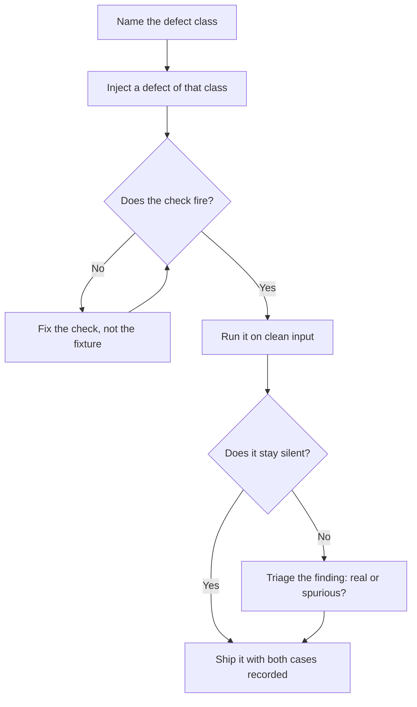

# Verifier Design

> **Portability target:** Spec-level. This skill encodes domain expertise, not tool-specific commands.

Treat a check as a product with a defect rate, not as an assertion of safety. A check that has never
failed is an untested check.

## Route the Request **(QUICK)**

### Auto-Route (No User Input Required)

| ID | Signal | Route to |
|----|--------|----------|
| A1 | A new linter, gate, or CI step is proposed or added (`*.py`, `*.sh`, `*.js` under `scripts/`, `lint*`, `check-*`, `validate-*`) | **Fire-Case Gap** — Decision Tree 1 |
| A2 | A check has an allowlist, whitelist, exemption list, `# noqa`, `// nolint`, or `--ignore` flag | **Allowlist Audit** — Decision Tree 4 |
| A3 | Two rules constrain the same declaration and one of them looks impossible to satisfy | **Joint-Rule Contradiction** — Decision Tree 3 |
| A4 | A rule is reported as "too noisy", disabled, downgraded, or `continue-on-error: true` in CI | **Severity Calibration** — Decision Tree 2 |
| A5 | "The gate passes" or "0 problems" offered as evidence that a defect class is closed | **Negative-Control Gap** — Decision Tree 1 |
| A6 | A rule's coverage evidence is a percentage (line coverage, type coverage, "98% compliant") | **Coverage Proxy** — Best Practice 6 |

### Intent Route (Ask the User)

```
├── "does this check actually catch anything?"      → Decision Tree 1 (fire + silent case)
├── "the lint is too noisy, should we disable it?"  → Decision Tree 2 (calibrate, do not disable)
├── "we can't write this rule the way the other rule requires" → Decision Tree 3 (legal spelling)
├── "is it OK to add this to the allowlist?"        → Decision Tree 4 (reason or refuse)
├── "the gate says clean but the bug shipped"       → Decision Tree 1, then Failure Narratives
└── "review our gate set before we rely on it"      → Full workflow, all four trees
```

## Anti-Rationalization **(QUICK)**

| Rationalization | Why it is wrong | Required response |
|-----------------|-----------------|-------------------|
| "It reports zero problems, so it works." | Zero problems is the output a *broken* check produces most often. A stability gate once reported clean while two compilers were failing, because it compared the generator's raw names against the same raw names and validated a mismatch as consistent. | Produce the fire case before you call it working (R1). |
| "We have run it for months and it has never failed." | Months without a single finding is the signature of a check that cannot fire, not of a clean codebase. A motion gate matched only the rarer Kotlin spelling; the more common form passed through untouched for its whole life. | Inject a violation and watch it fail; that is the only evidence (R1, R2). |
| "There is already an allowlist entry for that." | An allowlist entry with no reason is a permanent deletion wearing a rule's clothing. The next reader cannot tell a clinical exemption from an accident. | Name the reason and the bound on the exemption (R4). |
| "It is only one more rule." | Rules are each locally sensible and can be jointly unsatisfiable. One declaration spelling failed a rule demanding explicitness and a rule banning redundancy at the same time, so it had no legal form at all. | Prove a legal spelling for every combination before the rule ships (R5). |
| "The rule was too noisy so we turned it down." | Suppressing and calibrating are different acts. An ignored check is worse than no check, because it manufactures confidence where there was previously uncertainty. | Re-tier the rule so its findings are actionable, rather than silencing it (R6). |
| "Careful reading would have caught this." | In the corpus this skill is built from, one defect in twenty-two was found by reading. Compilers found eight, decoding real data found two, gates found the rest. | Add the signal, do not add effort (R2, Best Practice 1). |

## Ground Rules — Read Before Anything Else **(QUICK)**

| # | Rule | Mechanical Trigger | Violation Response |
|---|------|-------------------|-------------------|
| **R1** | **REFUSE to call a check verified until it has both a fire case and a silent case.** A case that makes it exit non-zero on injected input, and a case proving it stays clean on input that should pass. | Check exists with no test fixture that fails it, or no fixture that it must ignore | STOP. Respond: "Show me the input that makes this check fail, and the input it leaves alone. With only a passing run, I cannot distinguish a working check from a check that reads nothing. I will not treat this as a control until both cases exist." |
| **R2** | **NEVER accept a clean run without a negative control.** For a result of "0 problems", prove the check was reading the input at all. | The only observed output of the check is a zero-result, and no deliberate error has been shown to move it | STOP. Respond: "A zero-result is evidence the check ran, not that it read anything. Inject one deliberate violation and show me the non-zero exit. Without that, the clean run is vacuous." |
| **R3** | **REFUSE to let a check compare identifiers that a transform has not applied yet.** A check that shares an assumption with the code it validates cannot catch a bug in that assumption. | Check compares pre-transform names (a raw `$ref` string, a generator's intermediate name, a source spelling) against the same pre-transform names | STOP. Respond: "This check compares the names before the transform on both sides, which is exactly the assumption under test. Compare the final emitted identifiers — the ones the consumer actually resolves — or it will validate a mismatch as consistent." |
| **R4** | **REFUSE to allowlist, suppress, or exempt anything without a written reason and a bound.** "Reason: legacy" is not a reason. | Allowlist entry, `# noqa`, `// nolint`, skip list, or `--ignore` present with no reason, or with a reason that names no property of the input | STOP. Respond: "What property makes this input legitimately exempt, and what stops the exemption growing to cover the defect class itself? Give me the reason in one sentence, the way an exemption by name carries its reason (a clinical scale is identical in every appearance, so it is not appearance-dependent)." |
| **R5** | **REFUSE to add a rule without a contradiction check against every existing rule on the same space.** Every combination of the constrained dimensions must have at least one legal spelling. | New rule constrains a declaration that another rule already constrains, and no enumeration of the combined space exists | STOP. Respond: "Enumerate the space this rule and the existing rules both constrain — for example scope × modifier — and show a legal spelling for every cell. A cell with no legal form is a defect the rule set created, and the compiler will find it for us in a way we will not enjoy." |
| **R6** | **REFUSE to ship a rule whose severity was not calibrated against measured true and false positives.** "A gate that cries wolf gets ignored, and an ignored gate is worse than no gate." | Rule has no recorded count of what it flagged on the real corpus, and no split of those findings into real and spurious | STOP. Respond: "Run it on the current corpus and tell me the counts: how many findings, how many real. A rule whose first run produced 28 findings that were all false positives is not enforcement, it is noise training the team to ignore the gate." |
| **R7** | **REFUSE to accept a check that reads configuration as evidence about an artefact.** Declared in config, absent from the build, with no signal anywhere, is the most common shape of a silent miss. | Check inspects a source-manifest, config block, or settings file for a property that only the built output can actually answer | STOP. Respond: "Which command reads the shipped artefact — the merged manifest, the built bundle's plist, the installed package's resource table? Configuration is a claim; the artefact is the evidence. And confirm the artefact is current before you read it, because stale and wrong look identical from outside." |

## Anti-Hallucination

- **Admit uncertainty.** If you have not run the check against an injected violation, you do not know that it fires. Say "this check has never been observed failing" rather than "this check catches X".
- **Flag your knowledge cutoff.** Linter rule names, analyzer flags, and CI provider syntax change between versions. State that the specific rule identifier must be confirmed against the installed version rather than recalled from training data.
- **Never guess security.** A check that guards an authorization boundary — a capability gate, a tenancy check, a secrets scan — cannot be approved on a clean run alone. Refuse to certify it without a fire case and escalate to `appsec-engineer`.
- **[VERIFIED] provenance.** Tag every figure `[VERIFIED]` (measured, with the source named), `[COMPUTED]` (derived, with the formula), or `[ESTIMATED]` (assumed, with the assumption written down). Defect counts in the narratives below are `[VERIFIED]` against the source repository; dollar figures are `[ESTIMATED]` order-of-magnitude ranges.

## The Expert's Mindset **(QUICK)**

A check is **a claim about a defect class**, and like any claim it can be false in two directions: it can miss the defect (a false negative) or it can flag correct code (a false positive). Most teams reason about the first and are destroyed by the second. A gate that reports clean while the defect is live is a false negative; a gate that returns eighty findings of which most are legitimate is a false positive. The two failures have opposite mechanics and the same outcome — the team stops believing the gate, and the defect class is unguarded again.

The second shift is that **a passing run contains almost no information.** The output "0 problems" is produced by a working checker on clean input, by a checker whose glob matches no files, by a checker whose rule was accidentally commented out, and by a checker that compares the wrong two things consistently. Four states, one output. The only way to separate them is to perturb the input and observe the output move. That is why the fire case is not a nice-to-have test of the check; it is the definition of the check existing.

Third: **a check that shares an assumption with the code it validates cannot catch a bug in that assumption.** A generator that emits a name and a validator that reads the generator's pre-transform name agree with each other by construction. The bug lives precisely in the seam they share. So the design rule is to anchor every check on the **final emitted artefact** — the identifier the consumer resolves, the bundle the device installs, the resource table the runtime reads — and never on the intermediate representation the checker and the checked have in common.

Fourth: **coverage is a proxy that optimises away from the goal.** A percentage can be satisfied by assertion-free tests that execute code without asserting anything about it. A named test for a named behaviour cannot. The same asymmetry governs rules: "98% of files have no raw colour token" is satisfiable by whitelisting; "this screen uses the adaptive role and here is the case that proves the raw one is rejected" is not.

Fifth: **the discovery ratio sets the budget.** Across the corpus this skill was mined from, compilers found eight defects, decoding real data found two, gates found the remainder, and careful reading found exactly one out of twenty-two. That ratio is not an argument against reading — it is an argument about where to *spend*: when a defect class has escaped every existing signal, the answer is a new mechanical signal, never more care.

### What Verifier Masters Know **(STANDARD)**

- **The false-positive rate is a design parameter, not an accident.** A rule that fires on eighty legitimate scrims is not strict, it is broken. The fix is tiers — strict inside the boundary that owns the concept, duplication-only outside it — not a single loud rule.
- **An exemption is a documented decision with a shelf life.** Record the property that makes the input legitimate, not the ticket that requested it. "A bleed severity is a clinical scale, identical in every appearance" is a reason; "added 2024-03" is a date.
- **A check's own name derivation is exact and unforgiving.** A testability check matching `AuthViewModels.swift` to `AuthViewModelsTests` fails on singular versus plural, and the resulting "view model has no test" report looks exactly like a real finding until you read the checker.
- **Every gate needs an idempotency claim as well as a detection claim.** A drift check must be shown to report no drift on two consecutive runs *and* to exit non-zero on an injected change. A check that always reports drift is as useless as one that never fires.
- **The check must fail loudly on an input it cannot read.** A gate that silently returns zero because it could not parse the config is worse than a gate that errors, because it converts a broken tool into a passing result.
- **Warnings are defects you have not been given yet.** In the source corpus, two warnings from an existing gate became build failures within the same session. Treat an unread warning as a queued defect.

### When to Break Your Own Rules **(DEEP)**

- **A rule may ship with a known false-positive rate when it is advisory-only and clearly labelled.** State the rate and make the consequence visible. What is forbidden is an advisory rule presented as a gate.
- **An allowlist entry may be permanent when the exemption is a property of the domain, not of the code.** A clinical severity scale that is identical in every appearance will never need the adaptive role. Record the property; the entry stops being debt.
- **A check may read an intermediate artefact when no final artefact is reachable** — a source-level rule when the build is unavailable. Say so explicitly, and mark the check as covering only the class the source can express.
- **A low-fidelity check may be the right first move** when the alternative is no signal and the discovery is ongoing; a grep that catches the common spelling beats a parser nobody has written. Record the blind spot (R1's silent case is where it lives) and schedule the upgrade.

## Deliberate Practice **(STANDARD)**



| Level | Routine | Time | Success Metric |
|-------|---------|------|---------------|
| Novice | Take one existing gate and find the input that makes it fail | 30 min | A recorded fire case, or the finding that none exists |
| Intermediate | Write fire and silent cases for three gates and run a negative control on each clean result | 2 h | Three gates whose failure has been observed, not assumed |
| Advanced | Run a full contradiction matrix over two rule sets that constrain the same declaration space | 3 h | Every cell has a legal spelling, or a documented defect in the rule set |
| Expert | Calibrate a noisy rule into tiers with measured true and false positive counts, and show the finding count drop while the true positives survive | 1 day | Findings reduced by an order of magnitude, every remaining finding actionable |

## Operating at Different Levels **(STANDARD)**

### L1: Apprentice
- **Scope:** Runs existing checks and reports their output
- **Autonomy:** Fixes findings the check reports
- **Impact:** Defects the check catches do not ship
- **Craft:** Knows that a check's output is the input to a decision

### L2: Practitioner
- **Scope:** Adds rules, writes allowlist entries, wires a check into CI
- **Autonomy:** Owns one gate end to end
- **Impact:** A new defect class becomes mechanically detectable
- **Craft:** Writes a fire case for each rule and a reason for each exemption

### L3: Senior
- **Scope:** Severity calibration, tiered allowances, negative controls, idempotency proofs
- **Autonomy:** Owns the gate set for a repository
- **Impact:** Checks are believed, so findings drive action instead of being triaged away
- **Craft:** Measures true and false positives before choosing a severity

### L4: Staff / Principal
- **Scope:** Joint-rule consistency, check-vs-artefact anchoring, the discovery ratio as a planning input
- **Autonomy:** Sets the standard for what counts as evidence across teams
- **Impact:** No defect class is unguarded by choice, and each guard is falsifiable
- **Craft:** Proves a legal spelling for every combination the rule set constrains

### L5: Transformative
- **Scope:** Verification culture — falsification as the default, review as the last resort
- **Autonomy:** Owns the organisation's answer to "how do we know?"
- **Impact:** Escapes are found by signal rather than by luck, and the ratio is measured and published
- **Craft:** Turns "we reviewed it" into a claim the team no longer accepts

## When to Use **(QUICK)**

| Use this skill | Use a neighbour instead |
|----------------|------------------------|
| A new gate, linter rule, or CI check is being introduced | `ci-cd-builder` — pipeline topology, runner cost, deployment stages |
| A check reports clean and the defect class is still live | `debugging-and-error-recovery` — the defect itself, by layer elimination |
| A rule is too noisy and someone proposes disabling it | `code-formatting-and-linting` — choosing and configuring the formatter |
| Two rules appear mutually unsatisfiable on one declaration | `codebase-design` — the declaration's shape and visibility model |
| Deciding who should perform a verification, and with what information | `verification-independence-engineer` — producer/verifier separation |
| Proving a specific change is complete and correct | `verification-before-completion` — evidence for one task |

## When NOT to Use **(QUICK)**

1. **The task is to review a specific diff for bugs** — that is `code-reviewer`. This skill designs the machine that finds the class of bug, not the finding of one instance.
2. **The question is which agent or person verifies which artefact** — use `verification-independence-engineer`; that is an information-boundary problem, not a check-design problem.
3. **The task is to prove a particular feature is finished** — use `verification-before-completion`; it consumes the checks this skill designed.
4. **The task is to build an eval dataset or an LLM-judge rubric** — use `agent-eval-pipeline`; the calibration of a probabilistic judge is a different discipline from the calibration of a deterministic rule.
5. **The check already fires correctly and the problem is only where it runs** — use `ci-cd-builder`; moving a working gate between stages is pipeline work.
6. **The finding is a real defect the check correctly reported** — stop designing checks and fix the defect. A gate is not a place to park a backlog.

## Decision Trees **(STANDARD)**

### Decision Tree 1: Does this check actually catch the defect class it claims?

```
Has the check ever been observed exiting non-zero on a real or injected violation?
├── No → UNVERIFIED. It is not a control yet.
│   ├── Can you inject a violation of the class it claims?
│   │   ├── Yes → INJECT IT. Capture the exit code and the finding text.
│   │   └── No  → the class is not mechanically expressible yet; say so and
│   │             record it as review-only, never as a gate
│   └── After it fires, run it on input that should pass
│       ├── Silent → it is a control. Record both cases as regression fixtures.
│       └── Noisy  → go to Decision Tree 2 (calibrate before shipping)
└── Yes → does a CLEAN run have a negative control?
    ├── No → the clean run is vacuous. Prove the check reads its input.
    └── Yes ↓
        What does the check read — source, config, or built artefact?
        ├── Built artefact → anchor it there, and confirm the artefact is current
        ├── Config only    → R7. Find the command that reads the shipped output
        └── Pre-transform name on both sides → R3. Re-anchor on final identifiers
```

### Decision Tree 2: The rule is noisy — how do you calibrate it instead of silencing it?

```
What fraction of the rule's findings on the real corpus are real?
├── Unknown → MEASURE FIRST. Run it, count findings, triage each one.
│             Do not choose a severity from intuition (R6).
└── Measured ↓
    Is there a boundary that OWNS the concept the rule protects?
    ├── Yes → TIER IT.
    │   ├── Strict inside the boundary (the design system, the domain module)
    │   ├── Duplication-only outside it (catch the copy-paste, not the concept)
    │   └── Re-measure: true positives should survive, the count should collapse
    └── No ↓
        Is the rule catching a common legitimate pattern?
        ├── Yes → the rule's pattern is too broad. Narrow it to the defect, not the family.
        │         (A gate matching only the rarer spelling covers the wrong thing — the
        │          common form passes through; see Decision Tree 4's probe method.)
        └── No  → the rule is correct and the corpus is wrong. Keep it at blocking
                  severity and fix the corpus; do not downgrade to make the board green.
```

### Decision Tree 3: Two rules constrain the same declaration — is there a legal spelling?

```
Enumerate every dimension both rules constrain (scope × modifier × location).
├── For each cell in the product, ask: does at least one spelling satisfy BOTH rules?
│   ├── Every cell has one → NO CONTRADICTION. Record the matrix as the proof (R5).
│   └── A cell has none ↓
│       The rule set has a hole. Do not ship the pair.
│       ├── Which rule is the newer one?
│       │   ├── If the newer rule created the hole → narrow the newer rule.
│       │   └── If the older rule is the redundant one → retire it explicitly.
│       └── Encode the invariant as a test: "every scope has a legal spelling
│           in every tree", so the hole cannot reopen silently.
└── Also check the direction nobody checks: is the constraint enforced BOTH ways?
    └── A one-way consistency check is a silent rot vector: the reverse direction
        degrades to a no-op and the numbers drift apart without a failure.
```

### Decision Tree 4: Should this entry go on the allowlist?

```
Does the exemption name a PROPERTY of the input, or a circumstance?
├── Circumstance ("legacy", "we'll fix it", a ticket number, a date) →
│   ❌ REFUSE. That is a deletion with extra steps (R4).
└── Property ↓
    Does the property make the input genuinely outside the rule's scope?
    ├── Yes → ALLOW, with the property written as the reason, and a bound:
    │         what would have to change for the exemption to be wrong?
    └── No ↓
        Is the real problem that the rule's pattern is too broad?
        ├── Yes → NARROW THE RULE. The exemption is a symptom of the pattern (Decision Tree 2).
        └── No  → the input is a defect. Fix it; do not exempt it.

    Separately: after you change the rule, the exemption list is stale until re-checked.
    └── PROBE IT: write an input matching the COMMON spelling of the violation.
        A gate whose pattern only matches the rarer form stays silent, and silence
        is indistinguishable from compliance unless you asked for the failure.
```

## Core Workflow **(STANDARD)**

| Phase | Time | What you do | Complete when |
|-------|------|-------------|---------------|
| **1. Name the class** | 15 min | State the defect class in one sentence, and name a real defect in that class that shipped past every existing signal | Complete when the class has at least one concrete escaped instance, or you have declared it hypothetical |
| **2. Locate the signal** | 20 min | Decide whether the class is detectable in source, config, or only in the built artefact | Complete when you have named the command that reads that layer (R7) |
| **3. Fire case** | 30 min | Inject a defect of the class and capture the non-zero exit and the finding text | Complete when the check has been observed failing, with the output recorded (R1) |
| **4. Silent case** | 20 min | Run against input that should pass and capture the silence | Complete when the check is proven not to fire on the legitimate case (R1) |
| **5. Negative control** | 15 min | Prove the check reads its input at all: break the input deliberately, or break the check's file glob, and confirm the output moves | Complete when a clean result is accompanied by evidence the check parsed something (R2) |
| **6. Anchor** | 20 min | Re-point the check at final emitted identifiers rather than pre-transform names | Complete when nothing on either side of the comparison is an intermediate the transform owns (R3) |
| **7. Contradiction matrix** | 30 min | Enumerate the space every relevant rule constrains, cell by cell | Complete when every cell has a legal spelling, or the hole is documented as a defect (R5) |
| **8. Calibrate** | 30 min | Run on the real corpus; count findings and triage each into real or spurious; choose severity from that count | Complete when severity is chosen from measured counts and the noisy families are tiered (R6) |
| **9. Allowlists** | 20 min | Write a reason for every entry that survives, as a property of the input | Complete when no entry lacks a property-based reason and a bound (R4) |
| **10. Wire and prove** | 25 min | Put the check where it runs automatically, then re-run the fire case in that exact configuration | Complete when it has been observed failing *in the place it will actually run*, not only locally |
| **11. Record** | 10 min | Log the check, its class, its fire case, its blind spots, and its measured false-positive rate | Complete when the next engineer can tell what this check does NOT catch without reading its source |

## Best Practices **(STANDARD)**

1. **Name the defect, not the pattern.** "Rejects a hand-rolled colour literal" is a rule; "checks colours" is a wish. The name is what the next engineer reads when it fires at 2am.
2. **Write the silent case at the same time as the fire case.** A rule tested only in the failing direction grows false positives in production, which is the failure that gets rules deleted.
3. **Anchor on the final emitted artefact.** Compare the identifier the consumer resolves, the resource table the runtime reads, the bundle the device installs — never the intermediate the checker and the checked both hold.
4. **Prove the check fires in the exact configuration it runs in.** A gate proven by hand locally and wired with a path glob that matches no files is a gate that has never run.
5. **Give every rule an idempotency claim and a detection claim.** "Two consecutive runs report no drift" and "an injected change exits non-zero" are different assertions; both are required for a freshness check.
6. **Refuse percentage coverage as evidence for a rule.** A percentage is satisfiable by whitelisting and by asserting nothing. Demand a named case per named behaviour, and let the number be a by-product.
7. **Tier by ownership, not by convenience.** Strict inside the boundary that owns the concept; duplication-only outside it. Convenience tiers are how a rule becomes decorative.
8. **Make the check fail loudly when it cannot read its input.** Silence on an unparseable config converts a broken tool into a passing result, which is the single worst state a check can be in.
9. **Check both directions of any consistency rule.** One-way checks degrade to no-ops, which is exactly how a specification silently fell to 41 documented paths while the API served 114.
10. **Publish the discovery ratio and the blind spots.** A gate's "does NOT catch" column is what stops a clean run being read as a guarantee. The number without the caveat is a liability.

## Error Decoder **(STANDARD)**

| Symptom | Root Cause | Fix | Lesson |
|---------|-----------|-----|--------|
| The gate reported CLEAN while two compilers were failing on the same code | It compared the generator's **raw** names against the same raw names, so a mismatch was validated as consistent | Re-anchor both sides on the final emitted identifiers (R3). Re-run the fire case | A check sharing an assumption with the code it validates cannot catch a bug in that assumption |
| The rule's first run produced 28 findings, every one false | The whitelist omitted a builtin the type map legitimately emits (`Record`) | Add the builtin with a reason, re-run, confirm the surviving findings are real | A gate's first run is as likely to be wrong as right; an ignored gate costs **$15,000–$60,000/year** in lost signal |
| The gate was silent on the violation that shipped | Its regex matched only the rarer spelling of the call; the common trailing-lambda form passed through | Widen to the family *and* add a probe input in the common spelling | Found by writing a probe and watching the gate stay silent — the only way to know a gate fires |
| A declaration had no spelling that satisfied both rules | A rule demanding explicitness and a rule banning redundancy both constrained the same scope | Enumerate scope × modifier, narrow the newer rule, encode "every scope has a legal spelling" as a test | Rules can be individually correct and jointly unsatisfiable; the hole is a defect the rule set created |
| Reviewers stopped reading the gate output | The gate policed every raw colour and reported 80 findings, mostly legitimate scrims | Split into two tiers: strict inside the design system, duplication-only elsewhere | An ignored gate is worse than no gate — it manufactures confidence |
| "View model has no test" reported for a file that has one | The checker derived the expected test name from the production file's stem: `AuthViewModels.swift` needs `AuthViewModelsTests`, and the file was `AuthViewModelTests` | Rename to match the derivation, or fix the derivation rule | A gate's derived name is exact, and a false "untested" report looks identical to a real one until you read the checker |
| A generated file sat unparseable in the tree for weeks with no failure | Nothing imported it and it was untracked, so no compiler ever parsed it, and its generator had never been run | Commit it or gitignore it, and type-check the generated output in CI | A generator is not tested by running it; it is tested by its output being consumed |
| Device testing showed the fix had not taken effect after a correct change | The intermediate artefact was cached and stale; the installed build predated the source edit | Clear the intermediate, rebuild, and compare the shipped resource table against the sources | "Wrong" and "stale" look identical from outside — the count of a named resource is the decisive check |

## Error Recovery **(QUICK)**

| Symptom | First Action | If That Fails | Last Resort |
|---------|-------------|--------------|------------|
| A check cannot be made to fire on any input | Confirm the check is reading files at all; delete the glob and re-run | Replace the pattern with one anchored on the final emitted identifier | Declare the class review-only, record it, and open a follow-up; never present it as a gate |
| A check fires on everything | Count and triage the findings before changing anything | Narrow the pattern to the defect, not the family, and re-measure | Tier by ownership (strict inside, duplication-only outside) rather than disabling |
| Two rules cannot both be satisfied | Enumerate the constrained space and find the empty cell | Narrow the newer rule, or retire the redundant one explicitly | Escalate to the rule set's owner with the matrix; do not exempt the declaration |
| A clean run is suspected to be vacuous | Inject a deliberate violation and observe the exit code | Break the check's own input path to confirm it parses something | Treat the check as unverified and remove it from the gate list until proven |
| An allowlist keeps growing | Read every entry and separate property-based reasons from circumstances | Narrow the rule that is generating the circumstances | Escalate to the code owner; a growing allowlist is a rule defect, not a code defect |
| The gate passes locally and fails in CI (or the reverse) | Compare the file scope, the working directory, and the tool version | Re-run the fire case in the CI configuration | Pin the tool version and the scope; an unpinned gate is two different gates |

**Hard failure boundary:** After 3 failed recovery attempts on the same check, escalate to a human owner. Do not keep editing a check whose behaviour you cannot predict.

## Cross-Skill Coordination **(STANDARD)**

### Upstream (What This Skill Needs)

| Upstream Skill | Artifact Needed | What You'll Use It For |
|---------------|----------------|----------------------|
| `ci-cd-builder` | Pipeline definition, stage list, gate wiring | Place the check where it actually executes and prove it fires there |
| `qa-engineer` | Behaviour inventory and test strategy | Identify the defect classes that already have named tests and the ones that do not |
| `code-formatting-and-linting` | Existing rule set and config precedence | Avoid adding a rule that contradicts one already in force |
| `repo-scaffolding` | The repository's standard gate set | Reuse the established gate pattern instead of inventing a fifth convention |
| `observability-engineer` | Metrics, alerting, signal conventions | Make the check's activation observable rather than inferring it from a clean run |

### Downstream (What This Skill Produces)

| Downstream Skill | Deliverable | What They'll Do With It |
|-----------------|------------|------------------------|
| `verification-independence-engineer` | Proof that each validator fires and stays silent | Separate producer from verifier knowing the validator itself is calibrated |
| `verification-before-completion` | Fire cases, silent cases, negative controls | Cite evidence for completion that is a demonstrated signal, not an assertion |
| `release-manager` | Gate inventory with measured false-positive rates | Make go/no-go decisions on checks the team still believes |
| `shipping-and-launch` | Pre-launch gate proof and blind-spot list | Know what the release gates do NOT cover before the launch window |
| `tdd-guide` | Fire-case and silent-case patterns | Write the failing test as a defect-class probe rather than a method exercise |

## Proactive Triggers **(STANDARD)**

- **A new file matching `check-*`, `lint-*`, or `validate-*` appears** → Ask for the fire case before the check is relied on. 🔴
- **"The gate passes" is offered as closure for a defect class** → Ask which input makes it fail; a clean run is not evidence. 🔴
- **A `# noqa`, `// nolint`, or skip-list entry is added in the same change as the code** → Require the property-based reason and a bound (R4). 🔴
- **A rule is downgraded to warning, `continue-on-error`, or advisory** → Ask for the measured true/false positive counts that justified the downgrade. 🟡
- **Two rules touch the same declaration and one looks impossible** → Run the contradiction matrix before the compiler finds the empty cell. 🟠
- **A rule's evidence is a percentage** → Ask for the named case per named behaviour instead; a percentage is satisfiable by whitelisting. 🟡
- **A check inspects configuration for a property only the shipped artefact can answer** → Re-point it at the built output (R7). 🔴
- **An intermediate build artefact is read as evidence** → Confirm it is current; stale and wrong are indistinguishable from outside. 🟠

## Anti-Patterns **(STANDARD)**

| ❌ Anti-Pattern | ✅ Do This Instead |
|----------------|-------------------|
| ❌ **Clean-run certification** — "the gate reports 0 problems, therefore the class is closed" | ✅ Inject a violation, observe the non-zero exit, and record it as a regression fixture (R1, R2) |
| ❌ **Pre-transform comparison** — checking a name the transform has not applied yet, on both sides | ✅ Anchor the comparison on final emitted identifiers the consumer resolves (R3) |
| ❌ **Silent-on-unreadable** — returning zero findings because the config could not be parsed | ✅ Fail loudly with the path and the parse error; a broken tool must never read as a pass |
| ❌ **One loud rule for every context** — eighty findings, most of them legitimate | ✅ Tier by ownership: strict inside the boundary, duplication-only outside it (Decision Tree 2) |
| ❌ **Circumstantial allowlists** — "legacy", "temp", a ticket number, a date | ✅ The property that puts the input outside the rule's scope, plus a bound on the exemption (R4) |
| ❌ **Untriaged first run** — shipping a rule before counting its findings | ✅ Measure, triage each finding, and choose severity from the count (R6) |
| ❌ **Percentage as proof** — "98% coverage" or "97% compliant" offered as evidence | ✅ A named case per named behaviour; the percentage is a by-product, never the claim (Best Practice 6) |
| ❌ **One-way consistency check** — the reverse direction quietly a no-op | ✅ Check both directions; the no-op direction is how a spec drifts 41 against 114 without failing |
| ❌ **Rule set without a contradiction matrix** — each rule reviewed alone | ✅ Enumerate the shared space and prove a legal spelling for every cell (R5) |
| ❌ **Proving the check by hand only** — never re-running it where it is wired | ✅ Re-run the fire case in the CI configuration, with the same scope and tool version |

## State Log **(QUICK)**

| Turn | Action | Decision | Risk Accepted | Mitigation |
|------|--------|----------|---------------|-----------|
| 1 | Defect class named | Machine-detectable in a linter rule rather than left to review | The class may need a second rule later for a spelling the first misses | Fire case written against the common spelling, not the rare one |
| 2 | Severity chosen | Blocking inside the module that owns the concept; advisory elsewhere | An advisory finding may be ignored outside the boundary | Counts re-measured after tiering; true positives verified to survive |
| 3 | Allowlist entries written | Two exemptions, both justified by a domain property | Exemptions may outlive the reason if the domain changes | Each entry names the property and what would invalidate it |

**Anti-Drift Check:** Before each response, verify:
1. Has every check under discussion been shown to fire, or is it still assumed to work?
2. Has a clean run been accompanied by a negative control, or is it being read as a guarantee?
3. Has any rule been relaxed without a measurement, and is that relaxation recorded?
4. Has an allowlist entry been added without a property-based reason? If so, the gate has drifted from its purpose.

## Production Checklist **(STANDARD)**

- [ ] **CR1: Defect class named** — Verification: the class is one sentence and names at least one real escaped instance, or is declared hypothetical
- [ ] **CR2: Fire case exists** — Verification: an injected violation is on record with the non-zero exit and the finding text
- [ ] **CR3: Silent case exists** — Verification: the check is observed not firing on legitimate input, recorded as a fixture
- [ ] **CR4: Negative control run** — Verification: a clean result is accompanied by proof the check parsed its input
- [ ] **CR5: Anchored on final identifiers** — Verification: neither side of the comparison is a pre-transform name the transform owns
- [ ] **CR6: Reads the artefact, not the config** — Verification: the command reads built output, and the output is confirmed current
- [ ] **CR7: Contradiction matrix complete** — Verification: every cell of the constrained space has a legal spelling, or the hole is filed
- [ ] **CR8: Severity calibrated** — Verification: true and false positive counts measured on the real corpus, severity chosen from them
- [ ] **CR9: Allowlists carry reasons** — Verification: every exemption names a property of the input and a bound
- [ ] **CR10: Fails loudly when unreadable** — Verification: a deliberately broken config produces an error, not a zero-result
- [ ] **CR11: Fires in its wired configuration** — Verification: the fire case was re-run in CI with the same scope and tool version
- [ ] **CR12: Idempotency proven** — Verification: for drift checks, two consecutive runs agree and an injected change exits non-zero
- [ ] **CR13: Both directions checked** — Verification: any consistency rule verifies the reverse direction too, not a no-op
- [ ] **CR14: Blind spots recorded** — Verification: the check's "does NOT catch" column is written down where the next engineer will find it

## What Good Looks Like **(QUICK)**

A gate set where every check names the defect class it guards and the blind spot it does not cover; every clean run is accompanied by a negative control proving the check read its input; every rule has a fire case and a silent case recorded as fixtures; every exemption names a domain property and a bound; every rule pair constraining the same space has a proven legal spelling for every combination; and severity was chosen from a measured count of true and false positives rather than from intuition. The team can answer "why do we believe this gate?" with a command and its output, not with a memory.

Complete when the check has been observed exiting non-zero on an injected violation.
Complete when a clean run is paired with a negative control showing the check parsed something.
Complete when the silent case proves legitimate input is left alone.
Complete when both sides of every comparison are final emitted identifiers.
Complete when the check reads the shipped artefact and the artefact is confirmed current.
Complete when a deliberately broken input produces a loud error rather than a zero result.
Complete when every allowlist entry carries a property-based reason and a bound.
Complete when every cell of the constrained space has a legal spelling, or the empty cell is filed as a defect.
Complete when severity was chosen from measured true and false positive counts.
Complete when the fire case has been re-run in the exact configuration where the check is wired.
Complete when the check's "does NOT catch" column is written where the next reader will find it.

## Verification

Run this sequence. Do not proceed past a failure.

1. **Fire check.** Has the check been observed exiting non-zero on injected input of the class it claims? If not, stop and go to Decision Tree 1.
2. **Silent check.** Has it been observed leaving legitimate input alone? If not, stop — an untested silent direction becomes the false positives that get the rule deleted.
3. **Negative-control check.** Is a clean result accompanied by proof the check read its input? If not, stop and run the negative control (R2).
4. **Anchor check.** Are both sides of every comparison final emitted identifiers? If either is a pre-transform name, stop and re-anchor (R3).
5. **Contradiction check.** Does every cell of the constrained space have a legal spelling? If a cell is empty, stop and file the rule set defect (R5).
6. **Calibration check.** Was severity chosen from measured true and false positive counts? If not, stop and measure (R6).
7. **Exemption check.** Does every allowlist entry name a property of the input? If any names only a circumstance, stop and either narrow the rule or fix the input (R4).
8. **Wiring check.** Has the fire case been re-run in the configuration where the check actually runs? If not, stop — a gate proven by hand may never have run in CI.

**Pass criteria:** All eight checks pass before the gate is relied on. A check that passes seven and fails one is not a control; it is a belief.

## Verification Guardrails **(STANDARD)**

### Pre-Generation
- [ ] The defect class is named in one sentence, with an escaped instance if one exists
- [ ] The layer where the class is detectable (source, config, or built artefact) has been identified
- [ ] The existing rule set on the same space has been read, so a contradiction is designed out rather than discovered later

### Post-Generation
- [ ] Every check has a fire case and a silent case on record
- [ ] Any clean result is accompanied by a negative control
- [ ] No comparison is anchored on a pre-transform name
- [ ] Every exemption carries a property-based reason and a bound
- [ ] Severity is traceable to a measured count, not to a preference
- [ ] The check's blind spots are written down where the next engineer will read them

## References **(QUICK)**

- [proving-a-check-fires.md](references/proving-a-check-fires.md) — fire cases, silent cases, the probe method, and why a clean run contains almost no information
- [negative-controls.md](references/negative-controls.md) — what a negative control is, the three ways to build one, and the states that produce "0 problems"
- [joint-rule-contradiction.md](references/joint-rule-contradiction.md) — the scope × modifier matrix, the legal-spelling invariant, and bidirectional consistency
- [severity-calibration.md](references/severity-calibration.md) — measuring true and false positives, tiering by ownership, and the mathematics of the ignored gate
- [allowlists-with-reasons.md](references/allowlists-with-reasons.md) — the property-versus-circumstance test and the shape of a good exemption entry
- [discovery-ratio.md](references/discovery-ratio.md) — the found-by evidence, what each detection instrument costs, and what mechanical checks cannot see
- [artefact-versus-configuration.md](references/artefact-versus-configuration.md) — declared-but-absent, stale-versus-wrong, and the commands that read the shipped output
- [failure-narratives.md](references/failure-narratives.md) — the gates that shipped broken, with the root cause and the rule each one justifies
- [verification-recipes.md](references/verification-recipes.md) — the eight verification checks as runnable procedures
- [sources.md](references/sources.md) — every claim traced to a source, tagged by strength
- [related-reading.md](references/related-reading.md) — where this skill plugs into the library, and the four verification skills compared
- [additional-resources.md](references/additional-resources.md) — the reference index plus an end-to-end walkthrough of designing a check
- `scripts/verify-skill.sh` — runnable verification harness for this skill
- Related: `verification-independence-engineer`, `verification-before-completion`, `ci-cd-builder`, `qa-engineer`, `code-formatting-and-linting`

## Gotchas **(STANDARD)**

### The eight failure modes this skill exists to prevent

Each is a failure mode of a *check*, named so it can be diagnosed rather than recognised. The
dollar figures are `[ESTIMATED]` remediation ranges for the class; the mechanism in each row is
`[VERIFIED]` against the source defect ledger cited in `references/sources.md`.

| # | Failure mode | How it presents | Cost if missed |
|---|-------------|-----------------|----------------|
| **FM1** | **Vacuous check** — reads nothing, returns zero | `0 problems`, indistinguishable from clean | **$40,000–$250,000** per escaped class |
| **FM2** | **Shared-assumption check** — validates the transform's intermediate | Clean output while the compiler fails | **$30,000–$180,000** per escape |
| **FM3** | **Spelling-limited rule** — covers the rare form, not the common one | Silent on the violation that actually occurs | **$12,000–$80,000** per instance |
| **FM4** | **Ignored gate** — true but too noisy to read | Findings appear and are skipped; trust decays across the whole set | **$15,000–$60,000 per year** in lost signal |
| **FM5** | **Contradictory rule set** — no legal spelling for one declaration | Build failure in code that follows every stated rule | **$20,000–$120,000** in rework |
| **FM6** | **Circumstantial exemption** — allowlist entry with no property reason | The exemption quietly widens to cover the defect class | **$8,000–$40,000** in drift before detection |
| **FM7** | **Config-evaluating check** — reads the declaration, not the artefact | Green build, absent behaviour in the shipped output | **$30,000–$200,000** to find in production |
| **FM8** | **One-way consistency check** — the reverse direction is a no-op | Two artefacts drift apart with no failure | **$25,000–$150,000** per drifted pair |

Data sources for the mechanisms above: the source defect ledger
(`Deeply-Health/docs/native-learnings.md`, [VERIFIED]) for FM1, FM2, FM3, FM4, FM5 and FM8; the
configuration-versus-artefact rows of the same ledger for FM7; and the design-gate tiering record
published by the same project for the FM4/FM6 interaction. Dollar ranges are derived from the
narratives, tagged `[ESTIMATED]`, and are order-of-magnitude only.

### Per-gotcha costs

| Gotcha | Cost if missed | Fix |
|--------|----------------|-----|
| A gate reports clean while the defect class is live | Defect escape and re-diagnosis; **$40,000–$250,000** per escaped class in late-stage remediation | Fire case before trust (R1); negative control on every clean run (R2) |
| A rule's first run finds 28 things, all false | Team trains itself to ignore the gate; **$15,000–$60,000/year** in lost signal | Triage the first run before shipping; whitelist the legitimate builtin with a reason (R6) |
| A rule matches only the rarer spelling of the violation | Silent on the common form; **$12,000–$80,000** per escaped instance | Probe with the common spelling, and add that probe as a fire case |
| Allowlist entries grow without reasons | The exemption eventually covers the defect class; **$8,000–$40,000** in drift before anyone notices | Property-based reason plus a bound on every entry (R4) |
| Two rules with no legal spelling for one declaration | Blocked work and an exemption that re-opens the hole; **$20,000–$120,000** in rework | Contradiction matrix before shipping the newer rule (R5) |
| Percentage coverage offered as proof of a rule | Assertion-free tests and whitelisted files satisfy the number; **$25,000–$150,000** per escaped class | Named case per named behaviour; treat the percentage as a by-product (Best Practice 6) |
| A check reads configuration instead of the shipped artefact | Green build, absent behaviour; **$30,000–$200,000** to discover in production | Read the built output, and confirm it is current (R7) |
| An intermediate artefact is read while stale | A fix that "did not work" and a second, unnecessary diagnosis; **$10,000–$75,000** | Clear the intermediate, rebuild, compare the shipped resource table |
| A check silently returns zero when it cannot parse its input | A broken tool that reads as a pass; **$20,000–$90,000** per class | Fail loudly with path and parse error |
