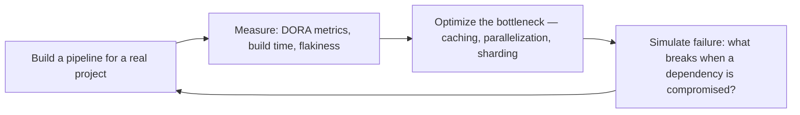

# CI/CD Pipeline Builder
> **Portability target:** Spec-level (runs on Claude Code, Copilot, Gemini CLI, Codex, Cursor). No vendor-specific frontmatter fields.

Design, build, optimize, and secure continuous integration and continuous delivery pipelines. This
skill covers pipeline architecture patterns (fan-in/fan-out, matrix, conditional), GitHub Actions
deep-dive (composite actions, reusable workflows, OIDC, self-hosted runners), build optimization
(caching, incremental builds, artifact management), quality gates (SonarQube, coverage, CVE, budget),
deployment strategies (rolling, blue-green, canary, feature-flagged), SLSA supply chain security,
release management (semantic release, changelog, approval workflows), and DORA metrics tracking.

## Route the Request

<!-- QUICK: 30s -- auto-route first, then intent-route -->

### Auto-Route (No User Input Required)
Evaluate these file-system conditions in order. First match wins — jump immediately.

| # | Condition | Action |
|---|-----------|--------|
| A1 | `file_exists(".github/workflows/")` OR `file_exists(".gitlab-ci.yml")` | Go to "Core Workflow" — Phase 1 (Pipeline Architecture) for platform-specific setup |
| A2 | `file_contains(".github/workflows/", "continue-on-error")` OR `grep -rl "needs:" .github/workflows/` shows sequential-only jobs | Jump to "Core Workflow" — Phase 2 (Build Optimization) for caching/parallelism |
| A3 | `file_contains("Dockerfile", "FROM")` AND `file_contains(".github/workflows/", "docker/build-push-action")` | Jump to "Core Workflow" — Phase 3 (Deployment) for container deployment strategy |
| A4 | `grep -rn "SAST\|trivy\|snyk\|dependency-review" .github/workflows/` returns matches | Jump to "Core Workflow" — Phase 4 (Security Gates) to review/strengthen |
| A5 | `gh run list --limit 5 --json conclusion` shows any `failure` status | Go to "Decision Trees" — then "Production Checklist" for pipeline debugging |
| A6 | `file_exists("terraform/")` OR `file_exists("main.tf")` | Invoke `devops-engineer` skill instead |
| A7 | `file_exists("Chart.yaml")` OR `file_exists("kustomization.yaml")` | Invoke `docker-kubernetes` skill instead |
| A8 | No pipeline files found anywhere in repo | Jump to "Core Workflow" — Phase 1 (Pipeline Architecture) for greenfield setup |

### Intent Route (Ask the User)
If no auto-route matched, use this intent tree:

```
What are you trying to do?
├── Create a new CI/CD pipeline from scratch
├── Optimize slow builds (caching, parallelism, sharding)
├── Set up deployments (rolling, blue-green, canary)
├── Add security scanning (SAST, SCA, secrets) to pipeline
├── Debug a failing pipeline
├── Need a specific pipeline platform (GitHub Actions, GitLab CI, CircleCI, Jenkins)
└── Not sure? → Describe the problem in plain language and I'll route you

```
Do not read the entire skill. Follow the route above and read only the sections it points to.

## Ground Rules — Read Before Anything Else

<!-- HARD GATE: These are non-negotiable. Violation → STOP and refuse to proceed. -->

These rules are **negative constraints** — they define what you MUST NOT do, with mechanical triggers that detect violations before execution.

| # | Negative Constraint | Mechanical Trigger (detect before executing) | Violation Response |
|---|-------------------|---------------------------------------------|-------------------|
| **R1** | **REFUSE to generate a pipeline without knowing the deployment target** — a Kubernetes pipeline for a Lambda app is a guaranteed failure. | Trigger: `file_exists("serverless.yml")` OR `file_contains("package.json", "\"aws-lambda\"")` but pipeline YAML references `docker/build-push-action` OR `kubectl` | STOP. Respond: "This project appears to target [detected platform] but the pipeline uses [different platform] patterns. Where does this deploy — Kubernetes, Lambda, VMs, or PaaS?" |
| **R2** | **REFUSE to include `continue-on-error: true` on test or scan steps** — it silently swallows failures and trains developers to trust a broken signal. | Trigger: `grep -rn "continue-on-error:\s*true" .github/workflows/` returns matches | STOP. Remove the directive. Respond: "`continue-on-error: true` on [step] was removed — silent failures are worse than loud ones. If this step must be non-blocking, split it into a separate workflow with explicit pass/fail reporting." |
| **R3** | **REFUSE to use `:latest` or mutable tags for deployment images** — every deploy using `:latest` ships a mystery artifact with no rollback target. | Trigger: `grep -rn "image:.*:latest\b" .github/workflows/ . --include="*.yaml" --include="*.yml"` returns matches | STOP. Respond: "Found `:latest` tag in [file:line]. Replace with commit SHA digest (`${{ github.sha }}`) or immutable version tag. `:latest` is a moving target — you cannot roll back to 'latest from 3 hours ago.'" |
| **R4** | **REFUSE to embed secrets as plaintext in pipeline YAML or workflow files** — exposed secrets in CI config are a security incident waiting to happen. | Trigger: `grep -rnE "(password|secret|token|key|api_key)\s*:\s*['\"]?\w{8,}" .github/workflows/` returns matches | STOP. Respond: "Detected potential plaintext secret in [file:line]. Use CI secrets manager (`${{ secrets.XXX }}`) and OIDC federation. Never hardcode credentials in pipeline YAML." |
| **R5** | **STOP and ASK when deploying directly from a feature branch to production with no staging gate** — bypassing staging eliminates the last safety net before production. | Trigger: `file_contains(".github/workflows/", "branches: \[.*feature")` AND `file_contains(".github/workflows/", "environment: production")` in the same workflow | STOP. Ask: "This workflow deploys from feature branches directly to production. Should we: (a) add a staging environment gate, (b) restrict production deploys to `main`/`release/*` branches only, or (c) document an explicit exception?" |
| **R6** | **DETECT and WARN about missing DORA metrics instrumentation** — pipelines without observability make it impossible to measure improvement. | Trigger: `grep -rn "deployment_frequency\|lead_time\|MTTR\|change_failure_rate\|dora" .github/workflows/` returns zero matches AND `file_exists(".github/workflows/")` | WARN: "No DORA metrics instrumentation detected. Add deployment tracking (deploy frequency, lead time, change failure rate, MTTR) — pipeline observability is essential for continuous improvement." |
| **R7** | **DETECT and WARN about unpinned third-party actions** — unpinned actions are a supply-chain risk; a compromised tag can inject malicious code. | Trigger: `grep -rnE "uses:\s+[^@]+@v[0-9]" .github/workflows/` returns matches (actions referenced by tag, not SHA) | WARN: "Found actions pinned by version tag instead of commit SHA in: [list files]. Pin all third-party actions to full-length commit SHA for supply-chain security. Tags are mutable — SHAs are immutable." |

## The Expert's Mindset

CI/CD is not about pipelines — it's about **reducing the time and risk between code written and code delivering value**. The best CI/CD systems make deployment so boring and routine that nobody thinks about it — until it saves them from a bad deploy at 4:59 PM on a Friday.

### Mental Models

| Model | Description |
|---|---|
| **The pipeline is the product** | Your CI/CD pipeline is the primary interface between developers and production. If the pipeline is slow, flaky, or confusing, developer productivity suffers proportionally. Invest in pipeline UX. |
| **Every manual step is a future outage** | A deployment checklist with 10 human-executed steps will be executed wrong on step 7 at 3 AM. Automate everything. If you can't automate it, eliminate it. |
| **Fast feedback > comprehensive feedback** | A 2-minute pipeline that catches 80% of issues is more valuable than a 30-minute pipeline that catches 95%. Speed determines whether developers run it before pushing or after. |
| **Supply chain security is not optional** | Your pipeline builds the artifacts that run in production. If the pipeline is compromised, everything is compromised. SLSA, SBOMs, signed commits, and pinned dependencies are table stakes. |

### Cognitive Biases in CI/CD

| Bias | How It Shows Up | Defense |
|---|---|---|
| **Pipeline sprawl** | Adding steps incrementally until the pipeline is 45 minutes and nobody remembers why half the steps exist | Audit pipeline steps quarterly. Every step must justify its existence with a specific risk it mitigates. |
| **False confidence from green builds** | "CI passed, ship it" — ignoring that CI doesn't test production configuration, data volumes, or real user behavior | CI proves the code works in isolation. Canary deployments and monitoring prove it works in production. |
| **Over-automation of the wrong thing** | Automating a deployment process that shouldn't exist in its current form | Before automating, simplify. Automation of a complex process is complex automation. Simplify first, automate second. |
| **Normalization of flaky tests** | Accepting that "tests fail sometimes, just re-run" | Every flaky test erodes trust in CI. When developers stop looking at failures, CI loses all value. Fix or delete flaky tests. |

### What Masters Know That Others Don't

- **DORA metrics reveal pipeline health.** Deployment frequency, lead time for changes, change failure rate, and mean time to recovery. If you're not tracking these, you don't know if your CI/CD investment is paying off.
- **The best deployment is the one nobody notices.** If users don't see a degradation, if alerts don't fire, if on-call doesn't get paged — that's a perfect deploy. Optimize for boring, uneventful deployments.
- **Progressive delivery beats big-bang deployments.** Canary, blue-green, and feature flags reduce the blast radius of a bad change from "all users" to "5% of users." The investment in progressive delivery pays for itself in avoided incidents.
- **Pipeline speed is a productivity multiplier.** Going from 30 minutes to 5 minutes doesn't just save 25 minutes — it changes developer behavior. Developers run CI before pushing, experiment more, and iterate faster.

## Operating at Different Levels

CI/CD skill scales from single-pipeline design to org-wide delivery platform architecture.

| Level | CI/CD Builder Output Characteristics |
|---|---|
| **L1 — Apprentice** | Writes pipeline YAML from templates. Learns CI/CD fundamentals and common patterns. |
| **L2 — Practitioner** | Owns CI/CD for a service. Designs build, test, and deploy workflows independently. Caching, artifact management, environment promotion. |
| **L3 — Senior** | Designs CI/CD strategy for a product. Multi-service pipeline orchestration, progressive delivery, SLSA supply chain security. |
| **L4 — Staff/Principal** | Sets CI/CD standards for the organization. Pipeline as product, shared workflow libraries, DORA metric optimization. "This is how we ship software here." |
| **L5 — Industry-level** | Creates CI/CD patterns and delivery methodologies adopted across the industry. |

**Usage**: Say "as an L3 CI/CD engineer, design the delivery pipeline for..." Default: **L2** (service-level CI/CD, independent execution).

## When to Use

<!-- QUICK: 30s -- scan the bullet list to decide if this skill fits -->
- Architecting a CI/CD pipeline from scratch for monorepos, microservices, or polyglot codebases
- Migrating pipelines between CI systems: Jenkins → GitHub Actions, CircleCI → GitLab CI
- Optimizing slow builds: dependency caching, parallel job execution, test sharding, incremental builds
- Implementing deployment strategies: rolling, blue-green, canary, feature-flagged rollouts
- Setting up quality gates: SonarQube quality gate, coverage thresholds, CVE severity, bundle size budgets
- Hardening pipeline security: signed commits, SLSA provenance (Level 1-3), SBOM generation
- Building ephemeral per-PR environments with automated provisioning and teardown
- Implementing semantic release with conventional commits enforcement and changelog automation
- Measuring and improving DORA metrics: deployment frequency, lead time, MTTR, change failure rate

## Decision Trees

<!-- QUICK: 30s -- follow the ASCII tree to your scenario -->
### CI Platform Selection

```
                     ┌──────────────────────────┐
                     │ START: Choose CI platform  │
                     └────────────┬─────────────┘
                                  │
                    ┌─────────────▼─────────────┐
                    │ Code hosted on GitHub AND  │
                    │ team <50 engineers?        │
                    └────┬──────────────────┬────┘
                         │ YES              │ NO
                    ┌────▼────────┐   ┌─────▼──────────┐
                    │ GitHub      │   │ Self-hosted or  │
                    │ Actions     │   │ GitLab already? │
                    │ (default)   │   └────┬────────┬───┘
                    └─────────────┘        │ YES    │ NO
                                      ┌────▼────┐ ┌▼──────────┐
                                      │ GitLab  │ │ Jenkins    │
                                      │ CI      │ │ only if     │
                                      │         │ │ migrating   │
                                      └─────────┘ │ legacy      │
                                                  └────────────┘
```
**When to choose GitHub Actions:** Code on GitHub, <50 engineers, <100 concurrent jobs, need OIDC to cloud, DORA-focused. **When to choose GitLab CI:** Self-hosted requirement, GitLab ecosystem, >100 concurrent jobs, need integrated container registry. **When to choose Jenkins:** Legacy migration path only — avoid for greenfield.

### Deployment Strategy Selection

```
                     ┌──────────────────────────┐
                     │ START: Production deploy   │
                     └────────────┬─────────────┘
                                  │
                    ┌─────────────▼─────────────┐
                    │ Zero-downtime required AND │
                    │ >1000 concurrent users?    │
                    └────┬──────────────────┬────┘
                         │ YES              │ NO
                    ┌────▼────────┐   ┌─────▼──────────┐
                    │ Need gradual │   │ Rolling deploy  │
                    │ traffic shift│   │ (standard)      │
                    │ with metrics?│   └────────────────┘
                    └────┬────────┘
                         │ YES
                    ┌────▼────────┐
                    │ Canary (10%  │
                    │ → 50% → 100%│
                    │ with auto-   │
                    │ rollback on  │
                    │ error spike) │
                    └──────────────┘
```
**When to choose Canary:** >1000 concurrent users, need metrics-based rollback, error budget >0.1%, can afford 10 min observation windows. **When to choose Blue-Green:** Instant rollback needed, DB schema compatible with both versions, can afford 2× infrastructure during deploy. **When to choose Rolling:** Standard case — sequential pod replacement, simplest, works for 90% of services.

### Build Optimization Tactic

```
                     ┌──────────────────────────┐
                     │ START: CI build >10 min    │
                     └────────────┬─────────────┘
                                  │
                    ┌─────────────▼─────────────┐
                    │ Dependencies unchanged     │
                    │ across >80% of commits?    │
                    └────┬──────────────────┬────┘
                         │ YES              │ NO
                    ┌────▼────────┐   ┌─────▼──────────┐
                    │ Cache deps  │   │ Tests take >60% │
                    │ layer first │   │ of build time?  │
                    │ (50-80%      │   └────┬────────┬──┘
                    │ speedup)     │        │ YES    │ NO
                    └──────────────┘   ┌────▼────┐ ┌▼──────────┐
                                       │ Parallel │ │ Split into │
                                       │ test     │ │ smaller    │
                                       │ sharding │ │ jobs       │
                                       │ (2-4×)   │ │            │
                                       └──────────┘ └────────────┘
```
**When to cache deps:** Dependencies stable, build time >5 min, cache hit rate >80% expected. **When to shard tests:** >200 test cases, tests CPU-bound, CI runner has 4+ cores. **When to split jobs:** Monorepo with independent modules, build >15 min, multiple teams.

### Supply Chain Security Depth

```
                     ┌──────────────────────────┐
                     │ START: Secure the pipeline │
                     └────────────┬─────────────┘
                                  │
                    ┌─────────────▼─────────────┐
                    │ Deploying to production    │
                    │ with paying customers?     │
                    └────┬──────────────────┬────┘
                         │ YES              │ NO
                    ┌────▼────────┐   ┌─────▼──────────┐
                    │ SLSA Level 2│   │ SLSA Level 1    │
                    │ + SBOM +    │   │ (provenance     │
                    │ signed      │   │ only)           │
                    │ artifacts   │   └────────────────┘
                    └────┬────────┘
                         │
                    ┌────▼────────┐
                    │ Regulated    │
                    │ industry?    │
                    └────┬────────┘
                    │ YES → SLSA Level 3
                    │ (hermetic builds,
                    │  isolated, policy-
                    │  controlled)
                    └──────────────┘
```
**When to target SLSA L1:** Internal tools, pre-production, non-critical services. **When to target SLSA L2:** All production services — signed provenance + hosted build platform + SBOM generation. **When to target SLSA L3:** Fintech, healthcare, gov — hermetic builds, isolated environments, policy-controlled deployments.

### Release Workflow Design

```
                     ┌──────────────────────────┐
                     │ START: Release strategy    │
                     └────────────┬─────────────┘
                                  │
                    ┌─────────────▼─────────────┐
                    │ Multiple teams deploying    │
                    │ independently to production?│
                    └────┬──────────────────┬────┘
                         │ YES              │ NO
                    ┌────▼────────┐   ┌─────▼──────────┐
                    │ Trunk-based │   │ GitFlow with    │
                    │ + feature   │   │ release branches│
                    │ flags       │   │ (simpler for     │
                    │ (DORA elite)│   │ single team)    │
                    └─────────────┘   └────────────────┘
```
**When to choose Trunk-based:** >5 engineers, deploy >daily, DORA elite target, feature flag infrastructure in place. **When to choose GitFlow:** <5 engineers, deploy <weekly, no feature flag system, need explicit release stabilization window.

## Core Workflow

<!-- QUICK: 30s -- scan phase titles to understand the process -->
### Phase 1 (~15 min): Pipeline Architecture Design

1. **Standard Pipeline Stages**:
   ```
   Trigger → Lint → Unit Test → Build → Security Scan → Integration Test → Deploy (Dev) → Deploy (Staging) → Deploy (Prod) → Post-Deploy Verify
                └───────────┬───────────┘
                       Quality Gates
   ```

**What good looks like:** Pipeline completes in under 15 minutes for a full build-test-deploy cycle. All stages pass on every PR merge. Failed deploys auto-rollback within 2 minutes. Secrets are injected at runtime — zero plaintext in pipeline config.

2. **Pipeline Topology Decision Tree**:
   ```
   Monorepo?
   ├─ YES → Path-filtered workflows + fan-out per service
   │   └─ pattern: on.push.paths: ['services/auth/**'] triggers only auth pipeline
   ├─ Polyglot?
   │   ├─ YES → Matrix builds across language × version
   │   └─ NO → Single build job, optimized caching
   └─ Multi-cloud deploy?
       └─ Sequential or fan-in: build once → parallel deploy to aws/gcp/azure
   ```

3. **Fan-In/Fan-Out Pattern** (GitHub Actions):
   ```yaml
   # Fan-out: parallel test across platforms
   test:
     strategy:
       matrix:
         os: [ubuntu-latest, windows-latest]
         node: [18, 20, 22]
     runs-on: ${{ matrix.os }}
     steps: [checkout, setup-node, npm test]

   # Fan-in: collect results, gate deploy
   deploy:
     needs: [test, lint, security-scan]
     if: success()
     environment: production
   ```

4. **Conditional Execution** — Don't run expensive steps unnecessarily:
   ```yaml
   - name: Build Docker image
     if: steps.cache-image.outputs.cache-hit != 'true'

   - name: Run integration tests
     if: github.event_name == 'pull_request' && contains(github.event.pull_request.labels.*.name, 'run-integration')

   - name: Deploy to production
     if: github.ref == 'refs/heads/main' && github.event_name == 'push'
   ```

### Phase 2 (~30 min): GitHub Actions Deep-Dive

1. **Composite Actions** — Bundle reusable steps:
   ```yaml
   # .github/actions/setup-node-build/action.yml
   name: Setup Node & Build
   description: Checkout, install Node, restore cache, install deps, build
   inputs:
     node-version:
       required: true
       default: '20'
   runs:
     using: composite
     steps:
       - uses: actions/setup-node@<sha>
         with:
           node-version: ${{ inputs.node-version }}
       - uses: actions/cache@<sha>
         with:
           path: ~/.npm
           key: ${{ runner.os }}-node-${{ hashFiles('**/package-lock.json') }}
       - run: npm ci
         shell: bash
       - run: npm run build
         shell: bash
   ```

2. **Reusable Workflows** — Share entire pipeline patterns:
   ```yaml
   # .github/workflows/_build-and-push.yml
   name: Build & Push
   on:
     workflow_call:
       inputs:
         image-name:
           required: true
           type: string
         dockerfile-path:
           required: true

> See [references/core-workflow.md](references/core-workflow.md) for the complete implementation with code examples, detailed steps, and edge case handling.

## Cross-Skill Coordination

| Upstream Skill | What You Receive | When to Involve |
|---|---|---|
| `backend-developer` | Build commands, test runners, artifact paths, environment variables | Before designing build stages or configuring test integration |
| `devops-engineer` | Terraform modules, infrastructure deployment specs, environment promotion workflows | Before designing deploy stages or environment management |
| `qa-engineer` | Test parallelization strategy, coverage thresholds, quality gate criteria | Before configuring test stages or quality gates |
| `security-engineer` | OIDC setup for cloud auth, secret injection patterns, signed commit verification | Before integrating secrets or cloud authentication into pipelines |

| Downstream Skill | What You Provide | Impact of Delay |
|---|---|---|
| `devops-engineer` | CI/CD pipeline for automated deploy, container registry, environment configs | Infrastructure changes can't ship — velocity zero |
| `release-manager` | Build artifacts, deployment pipeline, quality gate results | Release train stalls — no artifacts to promote |
| `qa-engineer` | Test integration stages, coverage reports, flaky test quarantine | QA can't validate builds — quality gates block everything |
| `docker-kubernetes` | Image build pipeline, registry integration, image signing | Containers can't be built or scanned — deploy blocked |

## Proactive Triggers

| Trigger | Action | Why |
|---------|--------|-----|
| Build times exceed 15-minute threshold for > 3 consecutive builds | Propose parallelization strategy, test sharding, and dependency caching improvements with cache-warm schedules | Slow CI trains developers to bypass it; every minute above 10 costs developer focus and increases context-switch waste |
| Deployment fails with non-deterministic error (flaky test, timeout, race condition) | Propose flaky test quarantine workflow and deployment health-check pre-warm stage | Non-deterministic failures erode pipeline trust; a single flaky test can block the entire team's velocity |
| No security scanning in pipeline (SAST/DAST/SCA) | Propose CodeQL/SonarQube/Trivy integration as blocking quality gates before deploy stage; enforce CRITICAL/HIGH severity thresholds | Unscanned code in production is a compliance and security incident waiting to happen; scanning must be a blocking gate, not an advisory dashboard |
| Container images pushed to registry without vulnerability scan or signature | Propose image signing (Cosign) + vulnerability scanning (Trivy/Grype) in registry push workflow; block deploy on CRITICAL CVEs | Container registries are the last defense line before production; every image must be attested and scanned — unsigned images are untrusted images |
| All deployments are "big bang" with no progressive delivery mechanism | Propose canary or blue-green deployment strategy with automated metric comparison and rollback trigger | Progressive delivery limits blast radius; a 5% canary catches regressions before they affect all users — no canary means every deploy is all-or-nothing |
| Feature flags managed ad-hoc without lifecycle tracking in pipeline | Propose feature flag integration in pipeline — deploy flags OFF, gradual rollout phases, automated flag-removal ticket after 30 days | Feature flags without lifecycle discipline become permanent technical debt; pipeline should enforce flag hygiene and removal cadence |
| Secrets hardcoded in pipeline YAML or environment variables as plaintext | Propose OIDC-based cloud auth + secret referencing (not value copying); enable GitHub secret scanning on pipeline output logs | Hardcoded secrets in CI configuration are the #1 source of credential leaks; OIDC eliminates static credentials entirely and provides short-lived tokens |
| Deploy stage has no rollback automation — manual SSH + `kubectl rollout undo` | Propose automated rollback pipeline: one-click trigger, smoke test verification, notify stakeholders; target < 5 minutes from trigger to stable | Manual rollback during an incident doubles MTTR; automated rollback is a reliability feature, not an admission of failure |

## What Good Looks Like

> Pipelines run reliably on every commit, complete in under fifteen minutes, and provide clear, actionable feedback.

> See [references/what-good-looks-like.md](references/what-good-looks-like.md) for the full quality standard.


## Deliberate Practice

CI/CD mastery comes from building and optimizing pipelines, then observing where they break. The best pipeline engineers have broken pipelines in every possible way.



| Level | Practice Routine | Frequency |
|---|---|---|
| **Novice** | Build a CI/CD pipeline from scratch for a side project — not from a template | Weekly |
| **Competent** | Optimize your slowest pipeline step: profile it, cache it, parallelize it | Monthly |
| **Expert** | Break your own pipeline: inject a malicious dependency, simulate a secret leak, corrupt a cache | Quarterly |
| **Master** | Design a pipeline architecture that becomes the org-wide standard — publish it, defend it, evolve it | Annually |

**The One Highest-Leverage Activity**: Measure your DORA metrics every week. If you don't know your deployment frequency, lead time, change failure rate, and MTTR, you don't know if your CI/CD investment is working. What gets measured gets improved.

## Gotchas

- **CI pipeline without caching.** Every CI run downloads dependencies from scratch: `npm ci` pulls 500MB of node_modules, Docker builds start from a cold cache, and test databases are seeded from a 200MB dump every time. A pipeline that should take 3 minutes takes 15. Multiply by 50 PRs per week across 10 developers and you're burning 100+ hours of developer waiting time per month. The CI bill from extra build minutes compounds the waste. **Total cost: $20,000-$100,000 per year in wasted build minutes, idle developer time, and inflated CI infrastructure costs.** Fix: Cache dependencies (node_modules/.cache, pip cache, Go module cache) with a key based on lockfile hash; use Docker layer caching with BuildKit and mode=max; cache test database snapshots; use incremental builds where possible.
- **Deploying on Friday.** A release goes out at 4:45 PM on Friday. At 6 PM, an error-rate spike triggers PagerDuty — the on-call engineer is at dinner, the author is on a flight, and the team lead is camping with no cell service. The incident drags through the weekend with partial context and limited availability. What would have been a 30-minute rollback on Tuesday becomes a 48-hour degraded service event that customers tweet about. **Total cost: $50,000-$500,000 in weekend outage that could have been a Tuesday morning fix, plus reputational damage from extended downtime.** Fix: Establish a "no Friday deploys" policy; deploy Monday through Thursday before 2 PM local time; if a Friday deploy is unavoidable, ensure the full team is available for the next 48 hours; automate rollback to a single command so any on-call can execute it.
- **GitHub Actions `if: success()`** is the default for step execution — skipped jobs aren't failures, they're "skipped." If a previous job is skipped (not failed), `needs` downstream jobs RUN, but steps with `if: success()` inside them SKIP. This mismatch causes deployments to silently not run.
- **`secrets.GITHUB_TOKEN`** expires at the end of the workflow, but its permissions are scoped to the CURRENT job only — it can't trigger other workflows. If you push a tag from a workflow hoping to trigger a release workflow, the push won't trigger a new workflow run (prevents infinite loops).
- **Docker layer caching in CI**: `cache-from` pulls the previous image but doesn't cache layers unless BuildKit's `--cache-to` and `--cache-from` mode=max are both set. Without mode=max, only the final image layer is cached, not intermediate layers.
- **Matrix strategy** with `fail-fast: true` (default) cancels ALL in-progress jobs when ANY one fails. A flaky test in Node 16 cancels the passing Node 18/20 jobs. Set `fail-fast: false` for independent matrix dimensions.
- **`actions/checkout` by default** does a shallow clone (depth=1). `git diff origin/main...HEAD` fails because there's no shared history. Use `fetch-depth: 0` when you need git history.
- **Artifact retention** defaults to 90 days. After that, deployment workflows that reference old artifacts silently fail with "artifact not found." Document artifact lifecycle in deployment runbooks.

## Verification

- [ ] Push to branch — CI pipeline triggers automatically, all jobs pass
- [ ] Check pipeline duration: end-to-end CI < 10 minutes (or within team SLA)
- [ ] Verify artifact: download the built artifact from CI, inspect contents — all expected files present
- [ ] Test deployment: deploy to staging from CI — application is healthy, version matches commit SHA
- [ ] Test rollback: trigger rollback workflow — previous version is restored, health check passes
- [ ] Verify `fail-fast: false` in matrix builds — one failing job doesn't cancel others

## References

Detailed reference material loaded on demand:

- **Core Workflow — Full Implementation**: See [core-workflow.md](references/core-workflow.md)
- **Anti-Patterns**: See [anti-patterns.md](references/anti-patterns.md)
- **Best Practices**: See [best-practices.md](references/best-practices.md)
- **Calibration — How to Know Your Level**: See [calibration.md](references/calibration.md)
- **Production Checklist**: See [checklist.md](references/checklist.md)
- **Error Decoder**: See [error-decoder.md](references/error-decoder.md)
- **Footguns**: See [footguns.md](references/footguns.md)
- **Scale Depth: Solo → Small → Medium → Enterprise**: See [scale-depth.md](references/scale-depth.md)
- **Sub-Skills**: See [sub-skills.md](references/sub-skills.md)

