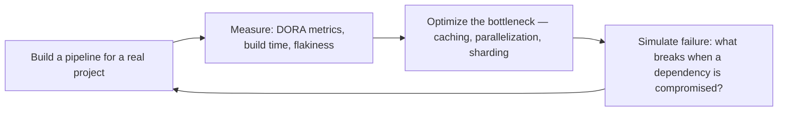

# CI/CD Pipeline Builder
> **Portability target:** Spec-level (runs on Claude Code, Copilot, Gemini CLI, Codex, Cursor). No vendor-specific frontmatter fields.

Design, build, optimize, and secure continuous integration and continuous delivery pipelines. This
skill covers pipeline architecture patterns (fan-in/fan-out, matrix, conditional), GitHub Actions
deep-dive (composite actions, reusable workflows, OIDC, self-hosted runners), build optimization
(caching, incremental builds, artifact management), quality gates (SonarQube, coverage, CVE, budget),
deployment strategies (rolling, blue-green, canary, feature-flagged), SLSA supply chain security,
release management (semantic release, changelog, approval workflows), and DORA metrics tracking.

## Route the Request

<!-- QUICK: 30s -- auto-route first, then intent-route -->

### Auto-Route (No User Input Required)
Evaluate these file-system conditions in order. First match wins — jump immediately.

| # | Condition | Action |
|---|-----------|--------|
| A1 | `file_exists(".github/workflows/")` OR `file_exists(".gitlab-ci.yml")` | Go to "Core Workflow" — Phase 1 (Pipeline Architecture) for platform-specific setup |
| A2 | `file_contains(".github/workflows/", "continue-on-error")` OR `grep -rl "needs:" .github/workflows/` shows sequential-only jobs | Jump to "Core Workflow" — Phase 2 (Build Optimization) for caching/parallelism |
| A3 | `file_contains("Dockerfile", "FROM")` AND `file_contains(".github/workflows/", "docker/build-push-action")` | Jump to "Core Workflow" — Phase 3 (Deployment) for container deployment strategy |
| A4 | `grep -rn "SAST\|trivy\|snyk\|dependency-review" .github/workflows/` returns matches | Jump to "Core Workflow" — Phase 4 (Security Gates) to review/strengthen |
| A5 | `gh run list --limit 5 --json conclusion` shows any `failure` status | Go to "Decision Trees" — then "Production Checklist" for pipeline debugging |
| A6 | `file_exists("terraform/")` OR `file_exists("main.tf")` | Invoke `devops-engineer` skill instead |
| A7 | `file_exists("Chart.yaml")` OR `file_exists("kustomization.yaml")` | Invoke `docker-kubernetes` skill instead |
| A8 | No pipeline files found anywhere in repo | Jump to "Core Workflow" — Phase 1 (Pipeline Architecture) for greenfield setup |

### Intent Route (Ask the User)
If no auto-route matched, use this intent tree:

```
What are you trying to do?
├── Create a new CI/CD pipeline from scratch
├── Optimize slow builds (caching, parallelism, sharding)
├── Set up deployments (rolling, blue-green, canary)
├── Add security scanning (SAST, SCA, secrets) to pipeline
├── Debug a failing pipeline
├── Need a specific pipeline platform (GitHub Actions, GitLab CI, CircleCI, Jenkins)
└── Not sure? → Describe the problem in plain language and I'll route you

```
Do not read the entire skill. Follow the route above and read only the sections it points to.

## Anti-Rationalization — No Excuses

| Rationalization | Reality |
|---|---:|
| "We'll add caching later — right now we just need the pipeline working." | Without caching, every CI run downloads 500MB of deps from scratch. 50 PRs/week × 10 devs × 15 min extra = 125 hours/month burned waiting for builds. That's $18,750/month in wasted developer time — every month you defer caching. |
| "It's a small Friday deploy — what could go wrong?" | A 4:45 PM Friday deploy that breaks at 6 PM becomes a 48-hour degraded service event. The on-call is at dinner, the author is on a flight, the lead is camping. Cost: $50K-$500K in weekend outage. A Tuesday morning fix would have been 30 minutes. |
| "`:latest` is convenient — we control our own registry." | `:latest` is a moving target. Two replicas started 10 seconds apart can run different image versions. When it breaks — and it will — you have no rollback target. You are deploying a mystery artifact with no audit trail. |
| "Secrets in the pipeline YAML are fine — the repo is private." | Repos become public. Interns share screenshots. CI logs echo vars into plaintext. The average credential leak costs $80K-$250K in fraud, forensic audit, SOC 2 failure, and mandatory customer notification. Secrets managers exist for exactly this reason. |
| "One big pipeline is simpler — we'll optimize when it gets slow." | A 45-minute monolith pipeline trains developers to bypass CI entirely. Within 2 months, CI discipline collapses, and a broken main branch goes undetected for 6 hours. Cost: $40K-$150K/year in lost productivity before you finally stage and parallelize. |

## Ground Rules — Read Before Anything Else

<!-- HARD GATE: These are non-negotiable. Violation → STOP and refuse to proceed. -->

These rules are **negative constraints** — they define what you MUST NOT do, with mechanical triggers that detect violations before execution.

| # | Negative Constraint | Mechanical Trigger (detect before executing) | Violation Response |
|---|-------------------|---------------------------------------------|-------------------|
| **R1** | **REFUSE to generate a pipeline without knowing the deployment target** — a Kubernetes pipeline for a Lambda app is a guaranteed failure. | Trigger: `file_exists("serverless.yml")` OR `file_contains("package.json", "\"aws-lambda\"")` but pipeline YAML references `docker/build-push-action` OR `kubectl` | STOP. Respond: "This project appears to target [detected platform] but the pipeline uses [different platform] patterns. Where does this deploy — Kubernetes, Lambda, VMs, or PaaS?" |
| **R2** | **REFUSE to include `continue-on-error: true` on test or scan steps** — it silently swallows failures and trains developers to trust a broken signal. | Trigger: `grep -rn "continue-on-error:\s*true" .github/workflows/` returns matches | STOP. Remove the directive. Respond: "`continue-on-error: true` on [step] was removed — silent failures are worse than loud ones. If this step must be non-blocking, split it into a separate workflow with explicit pass/fail reporting." |
| **R3** | **REFUSE to use `:latest` or mutable tags for deployment images** — every deploy using `:latest` ships a mystery artifact with no rollback target. | Trigger: `grep -rn "image:.*:latest\b" .github/workflows/ . --include="*.yaml" --include="*.yml"` returns matches | STOP. Respond: "Found `:latest` tag in [file:line]. Replace with commit SHA digest (`${{ github.sha }}`) or immutable version tag. `:latest` is a moving target — you cannot roll back to 'latest from 3 hours ago.'" |
| **R4** | **REFUSE to embed secrets as plaintext in pipeline YAML or workflow files** — exposed secrets in CI config are a security incident waiting to happen. | Trigger: `grep -rnE "(password|secret|token|key|api_key)\s*:\s*['\"]?\w{8,}" .github/workflows/` returns matches | STOP. Respond: "Detected potential plaintext secret in [file:line]. Use CI secrets manager (`${{ secrets.XXX }}`) and OIDC federation. Never hardcode credentials in pipeline YAML." |
| **R5** | **STOP and ASK when deploying directly from a feature branch to production with no staging gate** — bypassing staging eliminates the last safety net before production. | Trigger: `file_contains(".github/workflows/", "branches: \[.*feature")` AND `file_contains(".github/workflows/", "environment: production")` in the same workflow | STOP. Ask: "This workflow deploys from feature branches directly to production. Should we: (a) add a staging environment gate, (b) restrict production deploys to `main`/`release/*` branches only, or (c) document an explicit exception?" |
| **R6** | **DETECT and WARN about missing DORA metrics instrumentation** — pipelines without observability make it impossible to measure improvement. | Trigger: `grep -rn "deployment_frequency\|lead_time\|MTTR\|change_failure_rate\|dora" .github/workflows/` returns zero matches AND `file_exists(".github/workflows/")` | WARN: "No DORA metrics instrumentation detected. Add deployment tracking (deploy frequency, lead time, change failure rate, MTTR) — pipeline observability is essential for continuous improvement." |
| **R7** | **DETECT and WARN about unpinned third-party actions** — unpinned actions are a supply-chain risk; a compromised tag can inject malicious code. | Trigger: `grep -rnE "uses:\s+[^@]+@v[0-9]" .github/workflows/` returns matches (actions referenced by tag, not SHA) | WARN: "Found actions pinned by version tag instead of commit SHA in: [list files]. Pin all third-party actions to full-length commit SHA for supply-chain security. Tags are mutable — SHAs are immutable." |
| **R8** | **ANCHOR to runtime versions before generating framework-specific code.** Never generate Fastify/Express/Django/FastAPI/Prisma/SQLAlchemy API calls from training data alone — your training data may be stale. | Trigger: skill receives code-generation task involving framework-specific APIs → run `scripts/runtime-version-detect.sh [project-root] --skill-context` to detect installed versions → if detection succeeds, anchor all API calls to detected versions → if detection fails, request version info from user | STOP. Respond: "Detected: {runtime}@{version}, {frameworks}@{versions}. Anchoring all API calls to these versions. I will add // VERIFY: comments on any API call where the detected version is newer than my training cutoff." |
| **R9** | **RUN the ROI Gate before any non-emergency code change.** Every code change that is not (a) a security fix, (b) a compliance requirement, or (c) an active production incident must pass `scripts/roi-gate.sh`. If the gate returns negative, refuse to write the code. | Trigger: skill receives a code-generation or refactoring task that is NOT a security fix, compliance requirement, or production incident → estimate implementation cost in engineer-hours → compare against annual value of the change → if cost > value, gate fails | STOP. Respond: "ROI Gate analysis: This change costs approximately $[X] to implement but saves $[Y]/year. Payback period: [N] years. If payback > 2 years, I recommend declining this work. See `scripts/roi-gate.sh` for the full formula." |


- **Admit uncertainty — never fabricate.** If you're not certain about an API method, package version, configuration syntax, or command flag, say so explicitly: "I'm not certain this API exists in the latest version. Check the official docs at [URL]." Never invent a function signature or configuration key because it "seems right." Hallucinated code costs hours of debugging.
- **Flag your knowledge cutoff.** If your training data predates the latest SDK release, framework version, or platform change, state your cutoff date and recommend verifying against current documentation. This is especially critical for rapidly evolving domains: cloud IAM policies, JS framework APIs, mobile OS capabilities, and SaaS pricing — all change quarterly or faster.
- **Never guess security configurations.** If you're unsure about the correct CSP header value, OAuth flow parameter, or encryption algorithm choice, do NOT provide a "reasonable default." Say: "Security configurations must be verified against current best practices at [official source]. I cannot provide a definitive answer without current documentation."
- **Distinguish between what you know and what you infer.** Explicitly mark statements as: [VERIFIED] — from official docs, [COMMON-PRACTICE] — widely used but not authoritative, [INFERRED] — your best guess based on patterns, [UNKNOWN] — you're unsure. This helps the user calibrate trust in your output.
## The Expert's Mindset

CI/CD is not about pipelines — it's about **reducing the time and risk between code written and code delivering value**. The best CI/CD systems make deployment so boring and routine that nobody thinks about it — until it saves them from a bad deploy at 4:59 PM on a Friday.

### Mental Models

| Model | Description |
|---|---|
| **The pipeline is the product** | Your CI/CD pipeline is the primary interface between developers and production. If the pipeline is slow, flaky, or confusing, developer productivity suffers proportionally. Invest in pipeline UX. |
| **Every manual step is a future outage** | A deployment checklist with 10 human-executed steps will be executed wrong on step 7 at 3 AM. Automate everything. If you can't automate it, eliminate it. |
| **Fast feedback > comprehensive feedback** | A 2-minute pipeline that catches 80% of issues is more valuable than a 30-minute pipeline that catches 95%. Speed determines whether developers run it before pushing or after. |
| **Supply chain security is not optional** | Your pipeline builds the artifacts that run in production. If the pipeline is compromised, everything is compromised. SLSA, SBOMs, signed commits, and pinned dependencies are table stakes. |

### Cognitive Biases in CI/CD

| Bias | How It Shows Up | Defense |
|---|---|---|
| **Pipeline sprawl** | Adding steps incrementally until the pipeline is 45 minutes and nobody remembers why half the steps exist | Audit pipeline steps quarterly. Every step must justify its existence with a specific risk it mitigates. |
| **False confidence from green builds** | "CI passed, ship it" — ignoring that CI doesn't test production configuration, data volumes, or real user behavior | CI proves the code works in isolation. Canary deployments and monitoring prove it works in production. |
| **Over-automation of the wrong thing** | Automating a deployment process that shouldn't exist in its current form | Before automating, simplify. Automation of a complex process is complex automation. Simplify first, automate second. |
| **Normalization of flaky tests** | Accepting that "tests fail sometimes, just re-run" | Every flaky test erodes trust in CI. When developers stop looking at failures, CI loses all value. Fix or delete flaky tests. |

### What Masters Know That Others Don't

- **DORA metrics reveal pipeline health.** Deployment frequency, lead time for changes, change failure rate, and mean time to recovery. If you're not tracking these, you don't know if your CI/CD investment is paying off.
- **The best deployment is the one nobody notices.** If users don't see a degradation, if alerts don't fire, if on-call doesn't get paged — that's a perfect deploy. Optimize for boring, uneventful deployments.
- **Progressive delivery beats big-bang deployments.** Canary, blue-green, and feature flags reduce the blast radius of a bad change from "all users" to "5% of users." The investment in progressive delivery pays for itself in avoided incidents.
- **Pipeline speed is a productivity multiplier.** Going from 30 minutes to 5 minutes doesn't just save 25 minutes — it changes developer behavior. Developers run CI before pushing, experiment more, and iterate faster.

## Operating at Different Levels

CI/CD skill scales from single-pipeline design to org-wide delivery platform architecture.

| Level | CI/CD Builder Output Characteristics |
|---|---|
| **L1 — Apprentice** | Writes pipeline YAML from templates. Learns CI/CD fundamentals and common patterns. |
| **L2 — Practitioner** | Owns CI/CD for a service. Designs build, test, and deploy workflows independently. Caching, artifact management, environment promotion. |
| **L3 — Senior** | Designs CI/CD strategy for a product. Multi-service pipeline orchestration, progressive delivery, SLSA supply chain security. |
| **L4 — Staff/Principal** | Sets CI/CD standards for the organization. Pipeline as product, shared workflow libraries, DORA metric optimization. "This is how we ship software here." |
| **L5 — Industry-level** | Creates CI/CD patterns and delivery methodologies adopted across the industry. |

**Usage**: Say "as an L3 CI/CD engineer, design the delivery pipeline for..." Default: **L2** (service-level CI/CD, independent execution).

### Scale Depth

### Solo (1 person, 0-100 users)
- **What changes**: CI/CD = `git push` to Vercel/Netlify/Railway. No pipeline definition needed. Deploy on push to main. Rollback = `git revert` + push.
- **What to skip**: Custom CI pipeline, test stages, build caching, environment promotion, secrets management, preview deployments, artifact management.
- **Coordination**: You push, platform deploys. Done. **Cost**: $0-50/month.

### Small Team (2-10 people, 100-10K users)
- **What changes**: GitHub Actions or GitLab CI. Stages: lint → test → build → deploy. Caching for dependencies. Environment separation (staging + production). Secrets via CI secrets manager. Preview deployments per PR. Notifications on failure.
- **What to skip**: Matrix builds, blue-green/canary deployments, progressive delivery, SLSA provenance, SBOM generation, multi-cloud pipelines.
- **Coordination**: Pipeline changes reviewed in PR. Deploy announcements in Slack. Weekly pipeline health check. **Cost**: $100-500/month.

### Medium Team (10-50 people, 10K-1M users)
- **What changes**: Full pipeline: lint → test → build → scan → deploy → verify. Matrix builds for multi-platform. Blue-green or canary deployments. Security scanning (SAST + dependency + container). Path filters in monorepo. Environment promotion (dev → staging → prod). Artifact promotion (build once, deploy many). Concurrency groups.
- **What to skip**: Multi-cloud pipelines, progressive delivery (automated canary analysis), full SLSA Level 3, SBOM for every build.
- **Coordination**: Pipeline team or DevOps owner. Bi-weekly pipeline review. Deploy calendar for coordinated releases. **Cost**: $1,000-5,000/month.

### Enterprise (50+ people, 1M+ users)
- **What changes**: Pipeline platform team. Self-service pipeline templates. Multi-cloud deployment pipelines. Progressive delivery with automated rollback. Full security gates (SAST + DAST + SCA + IAC scan + image scan). SLSA Level 3 provenance. SBOM generation. Compliance gates (SOC 2, PCI DSS). Pipeline metrics (DORA). Pipeline cost optimization.
- **What's full production**: Internal developer platform. Pipeline catalog. Automated canary analysis. Deployment analytics. Pipeline as product.
- **Coordination**: Pipeline platform team weekly. Monthly pipeline review board. Quarterly DORA metrics review. **Cost**: $10,000-50,000+/month.

### Transition Triggers
- **Solo → Small**: Second developer joins. Need automated tests before deploy.
- **Small → Medium**: 3+ teams. Deploy coordination overhead. First security incident from deployed code.
- **Medium → Enterprise**: 10+ teams. Compliance requirements. >50 deploys/day.

## When to Use

<!-- QUICK: 30s -- scan the bullet list to decide if this skill fits -->
- Architecting a CI/CD pipeline from scratch for monorepos, microservices, or polyglot codebases
- Migrating pipelines between CI systems: Jenkins → GitHub Actions, CircleCI → GitLab CI
- Optimizing slow builds: dependency caching, parallel job execution, test sharding, incremental builds
- Implementing deployment strategies: rolling, blue-green, canary, feature-flagged rollouts
- Setting up quality gates: SonarQube quality gate, coverage thresholds, CVE severity, bundle size budgets
- Hardening pipeline security: signed commits, SLSA provenance (Level 1-3), SBOM generation
- Building ephemeral per-PR environments with automated provisioning and teardown
- Implementing semantic release with conventional commits enforcement and changelog automation
- Measuring and improving DORA metrics: deployment frequency, lead time, MTTR, change failure rate

## Decision Trees **(QUICK)**

<!-- QUICK: 30s -- follow the ASCII tree to your scenario -->
### CI Platform Selection

```
                     ┌──────────────────────────┐
                     │ START: Choose CI platform  │
                     └────────────┬─────────────┘
                                  │
                    ┌─────────────▼─────────────┐
                    │ Code hosted on GitHub AND  │
                    │ team <50 engineers?        │
                    └────┬──────────────────┬────┘
                         │ YES              │ NO
                    ┌────▼────────┐   ┌─────▼──────────┐
                    │ GitHub      │   │ Self-hosted or  │
                    │ Actions     │   │ GitLab already? │
                    │ (default)   │   └────┬────────┬───┘
                    └─────────────┘        │ YES    │ NO
                                      ┌────▼────┐ ┌▼──────────┐
                                      │ GitLab  │ │ Jenkins    │
                                      │ CI      │ │ only if     │
                                      │         │ │ migrating   │
                                      └─────────┘ │ legacy      │
                                                  └────────────┘
```
**When to choose GitHub Actions:** Code on GitHub, <50 engineers, <100 concurrent jobs, need OIDC to cloud, DORA-focused. **When to choose GitLab CI:** Self-hosted requirement, GitLab ecosystem, >100 concurrent jobs, need integrated container registry. **When to choose Jenkins:** Legacy migration path only — avoid for greenfield.

### Deployment Strategy Selection

```
                     ┌──────────────────────────┐
                     │ START: Production deploy   │
                     └────────────┬─────────────┘
                                  │
                    ┌─────────────▼─────────────┐
                    │ Zero-downtime required AND │
                    │ >1000 concurrent users?    │
                    └────┬──────────────────┬────┘
                         │ YES              │ NO
                    ┌────▼────────┐   ┌─────▼──────────┐
                    │ Need gradual │   │ Rolling deploy  │
                    │ traffic shift│   │ (standard)      │
                    │ with metrics?│   └────────────────┘
                    └────┬────────┘
                         │ YES
                    ┌────▼────────┐
                    │ Canary (10%  │
                    │ → 50% → 100%│
                    │ with auto-   │
                    │ rollback on  │
                    │ error spike) │
                    └──────────────┘
```
**When to choose Canary:** >1000 concurrent users, need metrics-based rollback, error budget >0.1%, can afford 10 min observation windows. **When to choose Blue-Green:** Instant rollback needed, DB schema compatible with both versions, can afford 2× infrastructure during deploy. **When to choose Rolling:** Standard case — sequential pod replacement, simplest, works for 90% of services.

### Build Optimization Tactic

```
                     ┌──────────────────────────┐
                     │ START: CI build >10 min    │
                     └────────────┬─────────────┘
                                  │
                    ┌─────────────▼─────────────┐
                    │ Dependencies unchanged     │
                    │ across >80% of commits?    │
                    └────┬──────────────────┬────┘
                         │ YES              │ NO
                    ┌────▼────────┐   ┌─────▼──────────┐
                    │ Cache deps  │   │ Tests take >60% │
                    │ layer first │   │ of build time?  │
                    │ (50-80%      │   └────┬────────┬──┘
                    │ speedup)     │        │ YES    │ NO
                    └──────────────┘   ┌────▼────┐ ┌▼──────────┐
                                       │ Parallel │ │ Split into │
                                       │ test     │ │ smaller    │
                                       │ sharding │ │ jobs       │
                                       │ (2-4×)   │ │            │
                                       └──────────┘ └────────────┘
```
**When to cache deps:** Dependencies stable, build time >5 min, cache hit rate >80% expected. **When to shard tests:** >200 test cases, tests CPU-bound, CI runner has 4+ cores. **When to split jobs:** Monorepo with independent modules, build >15 min, multiple teams.

### Supply Chain Security Depth

```
                     ┌──────────────────────────┐
                     │ START: Secure the pipeline │
                     └────────────┬─────────────┘
                                  │
                    ┌─────────────▼─────────────┐
                    │ Deploying to production    │
                    │ with paying customers?     │
                    └────┬──────────────────┬────┘
                         │ YES              │ NO
                    ┌────▼────────┐   ┌─────▼──────────┐
                    │ SLSA Level 2│   │ SLSA Level 1    │
                    │ + SBOM +    │   │ (provenance     │
                    │ signed      │   │ only)           │
                    │ artifacts   │   └────────────────┘
                    └────┬────────┘
                         │
                    ┌────▼────────┐
                    │ Regulated    │
                    │ industry?    │
                    └────┬────────┘
                    │ YES → SLSA Level 3
                    │ (hermetic builds,
                    │  isolated, policy-
                    │  controlled)
                    └──────────────┘
```
**When to target SLSA L1:** Internal tools, pre-production, non-critical services. **When to target SLSA L2:** All production services — signed provenance + hosted build platform + SBOM generation. **When to target SLSA L3:** Fintech, healthcare, gov — hermetic builds, isolated environments, policy-controlled deployments.

### Release Workflow Design

```
                     ┌──────────────────────────┐
                     │ START: Release strategy    │
                     └────────────┬─────────────┘
                                  │
                    ┌─────────────▼─────────────┐
                    │ Multiple teams deploying    │
                    │ independently to production?│
                    └────┬──────────────────┬────┘
                         │ YES              │ NO
                    ┌────▼────────┐   ┌─────▼──────────┐
                    │ Trunk-based │   │ GitFlow with    │
                    │ + feature   │   │ release branches│
                    │ flags       │   │ (simpler for     │
                    │ (DORA elite)│   │ single team)    │
                    └─────────────┘   └────────────────┘
```
**When to choose Trunk-based:** >5 engineers, deploy >daily, DORA elite target, feature flag infrastructure in place. **When to choose GitFlow:** <5 engineers, deploy <weekly, no feature flag system, need explicit release stabilization window.

## Core Workflow **(STANDARD)**

<!-- QUICK: 30s -- scan phase titles to understand the process -->
### Phase 1 (~15 min): Pipeline Architecture Design

1. **Standard Pipeline Stages**:
   ```
   Trigger → Lint → Unit Test → Build → Security Scan → Integration Test → Deploy (Dev) → Deploy (Staging) → Deploy (Prod) → Post-Deploy Verify
                └───────────┬───────────┘
                       Quality Gates
   ```

**What good looks like:** Pipeline completes in under 15 minutes for a full build-test-deploy cycle. All stages pass on every PR merge. Failed deploys auto-rollback within 2 minutes. Secrets are injected at runtime — zero plaintext in pipeline config.

2. **Pipeline Topology Decision Tree**:
   ```
   Monorepo?
   ├─ YES → Path-filtered workflows + fan-out per service
   │   └─ pattern: on.push.paths: ['services/auth/**'] triggers only auth pipeline
   ├─ Polyglot?
   │   ├─ YES → Matrix builds across language × version
   │   └─ NO → Single build job, optimized caching
   └─ Multi-cloud deploy?
       └─ Sequential or fan-in: build once → parallel deploy to aws/gcp/azure
   ```

3. **Fan-In/Fan-Out Pattern** (GitHub Actions):
   ```yaml
   # Fan-out: parallel test across platforms
   test:
     strategy:
       matrix:
         os: [ubuntu-latest, windows-latest]
         node: [18, 20, 22]
     runs-on: ${{ matrix.os }}
     steps: [checkout, setup-node, npm test]

   # Fan-in: collect results, gate deploy
   deploy:
     needs: [test, lint, security-scan]
     if: success()
     environment: production
   ```

4. **Conditional Execution** — Don't run expensive steps unnecessarily:
   ```yaml
   - name: Build Docker image
     if: steps.cache-image.outputs.cache-hit != 'true'

   - name: Run integration tests
     if: github.event_name == 'pull_request' && contains(github.event.pull_request.labels.*.name, 'run-integration')

   - name: Deploy to production
     if: github.ref == 'refs/heads/main' && github.event_name == 'push'
   ```

### Phase 2 (~30 min): GitHub Actions Deep-Dive

1. **Composite Actions** — Bundle reusable steps:
   ```yaml
   # .github/actions/setup-node-build/action.yml
   name: Setup Node & Build
   description: Checkout, install Node, restore cache, install deps, build
   inputs:
     node-version:
       required: true
       default: '20'
   runs:
     using: composite
     steps:
       - uses: actions/setup-node@<sha>
         with:
           node-version: ${{ inputs.node-version }}
       - uses: actions/cache@<sha>
         with:
           path: ~/.npm
           key: ${{ runner.os }}-node-${{ hashFiles('**/package-lock.json') }}
       - run: npm ci
         shell: bash
       - run: npm run build
         shell: bash
   ```

2. **Reusable Workflows** — Share entire pipeline patterns:
   ```yaml
   # .github/workflows/_build-and-push.yml
   name: Build & Push
   on:
     workflow_call:
       inputs:
         image-name:
           required: true
           type: string
         dockerfile-path:
           required: true

> See [references/core-workflow.md](references/core-workflow.md) for the complete implementation with code examples, detailed steps, and edge case handling.


## Error Decoder — War Stories from the Trenches

**(STANDARD)**

When this domain goes wrong, it goes wrong in predictable ways. Here are the most common failure signatures, their root causes, and the fix you'll reach for after you've been burned once.

| Symptom | Root Cause | Fix | Lesson |
|---------|-----------|-----|--------|
| CI passes locally but fails in pipeline with `ENOENT: no such file or directory` | `.gitignore` excludes a config file the build needs, but the file exists locally from a previous manual step | Add a CI-only assertion step that checks required files exist before build. Test with `git clean -fdx && npm ci && npm test` to simulate a clean CI environment | Local state is invisible to CI. Every file the build touches must be either committed or generated deterministically. |
| GitHub Actions workflow hangs for 45 minutes then times out with no error | SSH key was rotated on the target server but the CI secret wasn't updated — the deploy script retries indefinitely with no timeout set | Add `ConnectTimeout=10` and `ServerAliveInterval=15` to SSH config. Wrap all external connections in a `timeout 15m` block with 3 retries max. Add a pre-deploy connectivity check that fails fast | Every external connection in CI needs a deadline. Never rely on default SSH timeouts — they can be infinite. |
| `concurrency` group prevents all deploys — pipeline stuck "waiting" forever | A previous pipeline run crashed mid-deploy and left the concurrency lock held. The stuck run can't be cancelled because it's already marked "completed" on the runner side | Run `gh run cancel <run-id> && gh run rerun <run-id>` to release the lock. Add `cancel-in-progress: true` with a 15-minute timeout as a safety net. Implement a deadlock detector that auto-releases locks after 2× the expected deploy duration | Concurrency groups without deadlock detection are distributed mutexes with no release guarantee. Always pair them with timeouts. |
| Docker layer cache hits 0% after a one-line Dockerfile change | The changed line shifts all subsequent layers. A `COPY . .` before `RUN npm ci` means adding one file invalidates every cached layer | Reorder Dockerfile: `COPY package*.json ./` → `RUN npm ci` → `COPY . .` . Use `--cache-from` with a registry-pushed cache image. In CI, use `mode=max` with BuildKit and a cache mount for package managers | Layer ordering IS the cache strategy. Copy dependency manifests first, install, then copy source. One misplaced COPY invalidates the entire build cache. |
| SLSA provenance generation fails silently — artifacts deploy but can't be verified | The SLSA generator action requires `id-token: write` permission at the job level but it was only set at the workflow level. The attestation step skips with exit code 0 | Add `permissions: id-token: write, contents: read` at the specific job that generates provenance. Run `slsa-verifier verify-artifact` in the deploy pipeline to catch missing attestations before they reach production | Permissions in GitHub Actions are hierarchical. Job-level permissions override workflow-level settings. Test the failure path — verify attestations exist before deploying. |
| Matrix build explodes from 16 to 4,096 jobs overnight | Someone added `os: [ubuntu, macos, windows]` to a matrix that already had `node: [14, 16, 18, 20]` and `db: [postgres, mysql]` — the Cartesian product silently multiplies | Use `exclude` to prune impossible combinations. Cap matrix size with a CI check: `if matrix.size > 64, fail`. Split into focused matrices: one for OS × Node version, another for DB integration tests | GitHub Actions matrix is a Cartesian product with no guardrails. Every dimension you add multiplies total jobs. Always calculate: dimensions × variants = total. |


## Best Practices

1. **Staged pipelines — fast checks first.** Lint → type-check → unit tests (≤5 min) run on every push. Integration → E2E → security scans run after fast checks pass. Path-based filtering skips irrelevant jobs. Developers get feedback in under 5 minutes.
2. **Cache aggressively, invalidate precisely.** Dependency caches keyed on lockfile hash. Docker BuildKit with `mode=max` for layer caching. Test result caches with selective re-run on changed packages. Cache-warm schedules prevent cold-start slowness.
3. **Build once, deploy many.** A single CI build produces an immutable artifact promoted through environments. Same SHA-tagged container image, same tarball, same binary. Never rebuild between staging and production.
4. **OIDC for cloud auth, never static credentials.** GitHub Actions OIDC → AWS IAM / GCP WIF. No long-lived access keys in pipeline config. Tokens are short-lived, scoped, and auditable per-run.
5. **Security gates are blocking, not advisory.** SAST (CodeQL/Semgrep), SCA (dependency scanning), container scanning (Trivy/Grype) must pass CRITICAL/HIGH thresholds. Non-blocking security scanners produce findings nobody reads.
6. **Concurrency groups prevent race conditions.** `concurrency: deploy-production` with `cancel-in-progress: false` serializes deployments. Without it, 3 parallel deploys race to overwrite each other and the last one wins unpredictably.
7. **Artifact lifecycle and registry cleanup.** ECR lifecycle rules keep last N builds per branch, delete images >90 days old. Orphaned artifacts cost money and accrue unpatched CVEs. `docker system prune` doesn't fix registry sprawl.
8. **Ephemeral preview environments per PR.** Full-stack isolated environment provisioned on PR open, torn down on merge/close. Eliminates "works on my machine" and staging merge conflicts simultaneously.
9. **Immutable tags with digests.** Pin production deployments by SHA256 digest. `:latest` is a mutable pointer — what runs today isn't what ran yesterday. CI should auto-replace tags with digests in deployment manifests.
10. **Pipeline metrics drive improvement.** Measure DORA metrics weekly: deployment frequency, lead time for changes, MTTR, change failure rate. If you don't measure it, you won't improve it. Pipeline duration SLA enforced by team agreement.


## Error Recovery **(STANDARD)**

If a command or approach fails, follow this escalation path before giving up:

| Symptom | First Action | If That Fails | Last Resort |
|---------|-------------|---------------|-------------|
| Tool/command not found | Check installation: `which [tool]` or `[tool] --version`. Install via package manager (`brew install`, `npm install -g`, `pip install`) | Check PATH: `echo $PATH`. Verify the tool binary is in a PATH directory. Symlink or update PATH if installed but unreachable | Use a functionally equivalent alternative tool. If `rg` is unavailable, use `grep -r`. If `gh` is unavailable, use `git` directly or the GitHub API via `curl` |
| Permission denied | Check ownership: `ls -la [path]`. Fix with `chmod` or `sudo` if appropriate. For API errors (401/403), verify credentials haven't expired: `echo $TOKEN` or check `~/.netrc` | Refresh credentials: re-authenticate with the service. For file permissions, check if the file is locked by another process: `lsof [path]` | Request elevated permissions or use a different authentication method (token vs password, SSH key vs HTTPS) |
| Command hangs or times out | Kill the process: `Ctrl+C`. Re-run with a timeout: `timeout 30 [command]` or `gtimeout` on macOS. Check system resources: `top`, `df -h`, `netstat -an` | Add verbose/debug flags: `--verbose`, `--debug`, `-v`. Check logs: `tail -f [logfile]`. Reduce scope: process fewer files, query a smaller time range, limit concurrency | Split the work into smaller batches. Implement a retry loop with exponential backoff (1s, 2s, 4s, 8s). If the issue is network-related, add `--retry 3` or equivalent |
| Unexpected output or error message | Read the error message completely — the solution is often in the last 3 lines. Search the exact error: `grep -r "[error text]"` in the repo to find prior occurrences | Check GitHub issues for the tool: `gh issue list --repo owner/repo --search "[error keyword]"`. Check Stack Overflow | Simplify the approach. If the complex one-liner fails, break it into 3 sequential commands. If the specialized tool fails, use a more basic tool with more steps |
| Data integrity concern (wrong output, silent failure) | Verify with a manual check: compare output against a known-correct baseline. Add assertions: `[command] | grep -q "[expected]" && echo "OK" || echo "FAIL"` | Run the operation on a smaller subset first. Compare checksums: `shasum`, `md5`. Check for silent truncation: `wc -l` before and after | Abort and flag for human review. Do not proceed past data integrity failures — the cost of propagating bad data exceeds the cost of delay |

**Hard failure boundary:** If 3 different approaches all fail, STOP. Do not iterate infinitely. Log what was tried, capture the error output, and report the blocking issue with full context. Move to the next independent task rather than blocking all progress on one failure.

## Cross-Skill Coordination

| Upstream Skill | What You Receive | When to Involve |
|---|---|---|
| `backend-developer` | Build commands, test runners, artifact paths, environment variables | Before designing build stages or configuring test integration |
| `devops-engineer` | Terraform modules, infrastructure deployment specs, environment promotion workflows | Before designing deploy stages or environment management |
| `qa-engineer` | Test parallelization strategy, coverage thresholds, quality gate criteria | Before configuring test stages or quality gates |
| `security-engineer` | OIDC setup for cloud auth, secret injection patterns, signed commit verification | Before integrating secrets or cloud authentication into pipelines |

| Downstream Skill | What You Provide | Impact of Delay |
|---|---|---|
| `devops-engineer` | CI/CD pipeline for automated deploy, container registry, environment configs | Infrastructure changes can't ship — velocity zero |
| `release-manager` | Build artifacts, deployment pipeline, quality gate results | Release train stalls — no artifacts to promote |
| `qa-engineer` | Test integration stages, coverage reports, flaky test quarantine | QA can't validate builds — quality gates block everything |
| `docker-kubernetes` | Image build pipeline, registry integration, image signing | Containers can't be built or scanned — deploy blocked |

## Proactive Triggers

| Trigger | Action | Why |
|---------|--------|-----|
| Build times exceed 15-minute threshold for > 3 consecutive builds | Propose parallelization strategy, test sharding, and dependency caching improvements with cache-warm schedules | Slow CI trains developers to bypass it; every minute above 10 costs developer focus and increases context-switch waste |
| Deployment fails with non-deterministic error (flaky test, timeout, race condition) | Propose flaky test quarantine workflow and deployment health-check pre-warm stage | Non-deterministic failures erode pipeline trust; a single flaky test can block the entire team's velocity |
| No security scanning in pipeline (SAST/DAST/SCA) | Propose CodeQL/SonarQube/Trivy integration as blocking quality gates before deploy stage; enforce CRITICAL/HIGH severity thresholds | Unscanned code in production is a compliance and security incident waiting to happen; scanning must be a blocking gate, not an advisory dashboard |
| Container images pushed to registry without vulnerability scan or signature | Propose image signing (Cosign) + vulnerability scanning (Trivy/Grype) in registry push workflow; block deploy on CRITICAL CVEs | Container registries are the last defense line before production; every image must be attested and scanned — unsigned images are untrusted images |
| All deployments are "big bang" with no progressive delivery mechanism | Propose canary or blue-green deployment strategy with automated metric comparison and rollback trigger | Progressive delivery limits blast radius; a 5% canary catches regressions before they affect all users — no canary means every deploy is all-or-nothing |
| Feature flags managed ad-hoc without lifecycle tracking in pipeline | Propose feature flag integration in pipeline — deploy flags OFF, gradual rollout phases, automated flag-removal ticket after 30 days | Feature flags without lifecycle discipline become permanent technical debt; pipeline should enforce flag hygiene and removal cadence |
| Secrets hardcoded in pipeline YAML or environment variables as plaintext | Propose OIDC-based cloud auth + secret referencing (not value copying); enable GitHub secret scanning on pipeline output logs | Hardcoded secrets in CI configuration are the #1 source of credential leaks; OIDC eliminates static credentials entirely and provides short-lived tokens |
| Deploy stage has no rollback automation — manual SSH + `kubectl rollout undo` | Propose automated rollback pipeline: one-click trigger, smoke test verification, notify stakeholders; target < 5 minutes from trigger to stable | Manual rollback during an incident doubles MTTR; automated rollback is a reliability feature, not an admission of failure |


## State Log

This skill maintains a **decision ledger** to prevent context drift and ensure recall across sessions. Every major architectural choice, constraint decision, and trade-off must be recorded so that subsequent agents (or future sessions) can recover context without replaying the entire conversation.
## Production Checklist **(STANDARD)**

1. [ ] **Pipeline triggers correctly on all expected events** — push to main, pull request open/sync, release tag creation. Scheduled jobs (cron) run on time.
2. [ ] **Fast checks complete in ≤5 minutes** — lint, type-check, unit tests. Developers get feedback in their PR before context-switching. Path-based filtering skips irrelevant jobs.
3. [ ] **Secrets never appear in pipeline logs** — GitHub masked output, OIDC-only cloud auth, no `echo $SECRET`. Secret scanning (trufflehog/git-secrets) runs on every push and blocks on detection.
4. [ ] **Artifacts are immutable and promoted** — build once, promote the same SHA-tagged artifact through environments. No rebuilding between staging and production.
5. [ ] **Container images scanned before push to registry** — Trivy/Grype/Snyk block on CRITICAL/HIGH CVEs. Image signed with Cosign and attested with SLSA provenance.
6. [ ] **Security gates are blocking, not advisory** — SAST (CodeQL/Semgrep), SCA (Dependabot/Renovate), IaC scan (tfsec/checkov) must pass CRITICAL/HIGH. Non-blocking scanners produce findings nobody reads.
7. [ ] **Deployment concurrency is serialized** — `concurrency: deploy-production` prevents parallel deploys from racing. Cancel-in-progress disabled so pending deploys don't get abandoned mid-flight.
8. [ ] **Rollback is one-click and automated** — rollback pipeline: trigger → deploy previous artifact → smoke test → notify. Completes in < 5 minutes from trigger. No manual SSH or `kubectl rollout undo`.
9. [ ] **Pipeline has a fail-safe timeout** — every job has `timeout-minutes` set. Default 360-minute GitHub Actions timeout masks hung pipelines. Kill hung builds at 2× their p95 duration.
10. [ ] **Flaky tests are quarantined** — tests failing > 2% of runs move to quarantine suite (non-blocking). Jira ticket created per flake. CI pass rate SLO ≥ 95%. "First-time failure" flag distinguishes new regressions from known flakes.
11. [ ] **Artifact lifecycle policy active** — keep last N builds per branch, delete images >90 days old. ECR/Artifact Registry cleanup policies applied. Orphaned artifacts cost money and accumulate unpatched CVEs.
12. [ ] **Pipeline metrics tracked weekly** — DORA metrics: deployment frequency, lead time for changes, MTTR, change failure rate. Pipeline duration SLA enforced. Weekly pipeline health review with the team.
13. [ ] **Self-hosted runners are ephemeral and repo-scoped** — never register at org/enterprise level. Runner IAM role scoped to minimum permissions. Ephemeral runners destroyed after each job. No production VPC access from CI runners unless explicitly required and audited.
14. [ ] **Deploy freeze enforced on error budget exhaustion** — CI/CD queries error budget before promotion to production. Deploy blocked if budget < 10% or critical burn rate detected. Only reliability fixes allowed during freeze.

## What Good Looks Like

> Pipelines run reliably on every commit, complete in under fifteen minutes, and provide clear, actionable feedback.

> See [references/what-good-looks-like.md](references/what-good-looks-like.md) for the full quality standard.


## Deliberate Practice

CI/CD mastery comes from building and optimizing pipelines, then observing where they break. The best pipeline engineers have broken pipelines in every possible way.


```mermaid
graph LR
    A[Build a pipeline for a real project] --> B[Measure: DORA metrics, build time, flakiness]
    B --> C[Optimize the bottleneck — caching, parallelization, sharding]
    C --> D[Simulate failure: what breaks when a dependency is compromised?]
    D --> A

```

| Level | Practice Routine | Frequency |
|---|---|---|
| **Novice** | Build a CI/CD pipeline from scratch for a side project — not from a template | Weekly |
| **Competent** | Optimize your slowest pipeline step: profile it, cache it, parallelize it | Monthly |
| **Expert** | Break your own pipeline: inject a malicious dependency, simulate a secret leak, corrupt a cache | Quarterly |
| **Master** | Design a pipeline architecture that becomes the org-wide standard — publish it, defend it, evolve it | Annually |

**The One Highest-Leverage Activity**: Measure your DORA metrics every week. If you don't know your deployment frequency, lead time, change failure rate, and MTTR, you don't know if your CI/CD investment is working. What gets measured gets improved.

## Anti-Patterns

- **CI pipeline without caching.** Every CI run downloads dependencies from scratch: `npm ci` pulls 500MB of node_modules, Docker builds start from a cold cache, and test databases are seeded from a 200MB dump every time. A pipeline that should take 3 minutes takes 15. Multiply by 50 PRs per week across 10 developers and you're burning 100+ hours of developer waiting time per month. The CI bill from extra build minutes compounds the waste. **Total cost: $20,000-$100,000 per year in wasted build minutes, idle developer time, and inflated CI infrastructure costs.** Fix: Cache dependencies (node_modules/.cache, pip cache, Go module cache) with a key based on lockfile hash; use Docker layer caching with BuildKit and mode=max; cache test database snapshots; use incremental builds where possible.
- **Deploying on Friday.** A release goes out at 4:45 PM on Friday. At 6 PM, an error-rate spike triggers PagerDuty — the on-call engineer is at dinner, the author is on a flight, and the team lead is camping with no cell service. The incident drags through the weekend with partial context and limited availability. What would have been a 30-minute rollback on Tuesday becomes a 48-hour degraded service event that customers tweet about. **Total cost: $50,000-$500,000 in weekend outage that could have been a Tuesday morning fix, plus reputational damage from extended downtime.** Fix: Establish a "no Friday deploys" policy; deploy Monday through Thursday before 2 PM local time; if a Friday deploy is unavoidable, ensure the full team is available for the next 48 hours; automate rollback to a single command so any on-call can execute it.
- **Hardcoded secrets in pipeline configuration.** A developer hardcodes a database password in `.github/workflows/deploy.yml` because "it's just staging" and "nobody outside the team can see the repo." Six months later, the repo is made public, the workflow file history retains the secret, and within hours a bot scrapes GitHub's API for exposed credentials. **Total cost: $50,000-$500,000 in infrastructure compromise, data exfiltration, and incident response from secrets leaked through pipeline configuration.** Fix: Use a secrets manager (GitHub Secrets, HashiCorp Vault, AWS Secrets Manager) for ALL credentials including staging; scan all commits including workflow files with secret detection tools (trufflehog, git-secrets); if a secret is ever committed, rotate it immediately — revocation, not deletion, is the fix.
- **Orphaned deployment artifacts with no cleanup.** Every CI run produces a Docker image tagged with the commit SHA, pushed to ECR. After 18 months, the repository has 14,000 images consuming 2.8TB at $280/month. Worse, 3,200 old images contain a base image with a critical CVE patched 14 months ago — a developer accidentally deploys an old vulnerable image to a test environment. **Total cost: $20,000-$80,000 per year in artifact storage costs, audit liability from unpatched stored images, and accidental redeployment of vulnerable artifacts.** Fix: Implement artifact lifecycle policies — keep last N builds per branch, delete images older than 90 days; tag images with immutable metadata (build timestamp, base image SHA, vulnerability scan result); use registry built-in cleanup policies (ECR lifecycle rules, Artifact Registry cleanup).
- **Monolithic pipeline where everything runs on every push.** A single workflow runs linting, unit tests, integration tests, e2e tests, security scan, Docker build, and deployment — sequentially, on every push. The pipeline takes 45 minutes. Developers pushing CSS-only fixes wait 45 minutes for feedback and start bypassing CI, which becomes the norm. Two months later, a broken main branch goes undetected for 6 hours. **Total cost: $40,000-$150,000 per year in lost developer productivity, CI infrastructure overrun, and team erosion of CI discipline.** Fix: Design a staged pipeline — fast checks first (lint, type-check, unit tests, ≤5 min), slower checks later; use path-based filtering to skip irrelevant jobs; parallelize independent jobs; set a pipeline duration SLA and invest in optimization until it's met.
- **GitHub Actions `if: success()`** is the default for step execution — skipped jobs aren't failures, they're "skipped." If a previous job is skipped (not failed), `needs` downstream jobs RUN, but steps with `if: success()` inside them SKIP. This mismatch causes deployments to silently not run.
- **`secrets.GITHUB_TOKEN`** expires at the end of the workflow, but its permissions are scoped to the CURRENT job only — it can't trigger other workflows. If you push a tag from a workflow hoping to trigger a release workflow, the push won't trigger a new workflow run (prevents infinite loops).
- **Docker layer caching in CI**: `cache-from` pulls the previous image but doesn't cache layers unless BuildKit's `--cache-to` and `--cache-from` mode=max are both set. Without mode=max, only the final image layer is cached, not intermediate layers.
- **Matrix strategy** with `fail-fast: true` (default) cancels ALL in-progress jobs when ANY one fails. A flaky test in Node 16 cancels the passing Node 18/20 jobs. Set `fail-fast: false` for independent matrix dimensions.
- **`actions/checkout` by default** does a shallow clone (depth=1). `git diff origin/main...HEAD` fails because there's no shared history. Use `fetch-depth: 0` when you need git history.
- **Artifact retention** defaults to 90 days. After that, deployment workflows that reference old artifacts silently fail with "artifact not found." Document artifact lifecycle in deployment runbooks.
- **Self-hosted CI runners with unrestricted repository access** — you deploy self-hosted GitHub Actions runners in your production AWS account to avoid GitHub-hosted runner costs. These runners are registered at the enterprise level and can execute workflows from ANY repository in the organization. A malicious actor opens a PR in a public repo that includes a workflow running `aws sts get-caller-identity` on the self-hosted runner. The runner, sitting in your production VPC, returns the production account's IAM role credentials. The attacker uses these to enumerate S3 buckets and exfiltrates the customer database. Detection takes 72 hours because CloudTrail logs from the runner's role were routed to a different account. **Total cost: $100K-$5M in data exfiltration, forensic investigation, customer notification, and regulatory penalties from compromised self-hosted runners.** Fix: Never register self-hosted runners at the enterprise or organization level; register runners at the repository level only; use ephemeral runners that are destroyed after each job; restrict the runner's IAM role to the minimum permissions needed for that specific repository; require approval for workflow runs from first-time contributors on public repos.
- **No concurrency limits on deployment pipelines** — your CI/CD pipeline deploys to production on every push to `main` with `concurrency` not configured. During a post-incident rush, three developers push hotfixes within 60 seconds of each other. The CI system spins up three parallel deployment jobs. Job 1 (hotfix A) starts deploying, Job 2 (hotfix B) starts 30 seconds later, and Job 3 (hotfix C) starts 15 seconds after that. They race to update the same Kubernetes deployment — Job 3 finishes first, then Job 2 overwrites it, then Job 1 overwrites both. Hotfixes B and C are both lost. The production deployment now runs Hotfix A, which lacks the critical security fix from Hotfix C. The vulnerability remains live for 48 hours until a canary deployment triggers an alert on a different issue and the team discovers the race condition. **Total cost: $50K-$250K per race-condition deployment incident from lost hotfixes and extended vulnerability windows.** Fix: Always set `concurrency: production-deploy` in GitHub Actions (or equivalent in other CI systems) with `cancel-in-progress: false` to serialize deployments; use a deployment queue or merge queue that ensures only one deployment runs at a time; implement deployment locking in the CD pipeline that acquires a lock before modifying production infrastructure.
- **Flaky test accumulation without a quarantine policy** — your test suite has 1,200 E2E tests. Two tests fail intermittently (~5% of runs) due to race conditions in test data setup. The team adopts the habit of re-running failed jobs — "it's just flaky." Over 6 months, 18 more tests become flaky (timing issues, shared state leaks, order dependencies). The CI pass rate drops from 97% to 82%. Developers now expect 2-3 re-runs per PR, and CI queue time balloons from 8 minutes to 35 minutes (average 1.7 re-runs × 20 minutes per run). Real failures are increasingly dismissed as "probably flaky" — a critical null-pointer regression from a refactor is ignored for 3 PR cycles because "that test always fails." **Total cost: $40K-$150K/year in wasted CI compute and developer waiting time, plus $30K-$100K per escaped bug from real failures dismissed as flaky.** Fix: Implement a flaky test quarantine policy — any test that fails > 2% of runs is automatically moved to a quarantine suite (not blocking PRs) and a Jira ticket is created for the owning team; set a CI pass rate SLO (≥ 95%) and page the platform team when it drops; display a "first-time failure" flag on test results so developers distinguish brand-new failures from known flakes; require flaky test fixes to be prioritized in the next sprint — don't let quarantine become a graveyard.

## Verification

- [ ] Push to branch — CI pipeline triggers automatically, all jobs pass
- [ ] Check pipeline duration: end-to-end CI < 10 minutes (or within team SLA)
- [ ] Verify artifact: download the built artifact from CI, inspect contents — all expected files present
- [ ] Test deployment: deploy to staging from CI — application is healthy, version matches commit SHA
- [ ] Test rollback: trigger rollback workflow — previous version is restored, health check passes
- [ ] Verify `fail-fast: false` in matrix builds — one failing job doesn't cancel others

## Verification Guardrails

Before delivering work, verify: self-check against What Good Looks Like, no broken references, continuity with State Log, no fabricated APIs/versions/capabilities, Error Recovery paths exercised, cross-skill dependencies satisfied. If any fail, revise before delivering.

## References

Detailed reference material loaded on demand:

- **Core Workflow — Full Implementation**: See [core-workflow.md](references/core-workflow.md)
- **Anti-Patterns**: See [anti-patterns.md](references/anti-patterns.md)
- **Best Practices**: See [best-practices.md](references/best-practices.md)
- **Calibration — How to Know Your Level**: See [calibration.md](references/calibration.md)
- **Production Checklist**: See [checklist.md](references/checklist.md)
- **Error Decoder**: See [error-decoder.md](references/error-decoder.md)
- **Footguns**: See [footguns.md](references/footguns.md)
- **Scale Depth: Solo → Small → Medium → Enterprise**: See [scale-depth.md](references/scale-depth.md)
- **Sub-Skills**: See [sub-skills.md](references/sub-skills.md)

