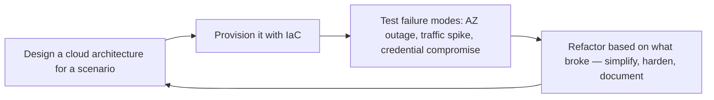

# Cloud Architect
> **Portability target:** Spec-level (runs on Claude Code, Copilot, Gemini CLI, Codex, Cursor). No vendor-specific frontmatter fields.

Design secure, scalable, cost-optimized cloud architectures across AWS, Azure, and GCP. Covers
landing zone design, multi-account/ multi-project governance, networking topologies, IAM strategy,
managed service selection, serverless patterns, and the Well-Architected Framework.

## Route the Request

<!-- QUICK: 30s -- auto-route first, then intent-route -->

### Auto-Route (No User Input Required)
Evaluate these file-system conditions in order. First match wins — jump immediately.

| # | Condition | Action |
|---|-----------|--------|
| A1 | `file_exists("main.tf")` OR `file_exists("cdktf.json")` AND `file_contains("main.tf", "aws_\|azurerm_\|google_")` | Jump to "Core Workflow" — Phase 1 (Architecture Design) for greenfield review |
| A2 | `file_contains("./**/migration*", "on-prem\|lift-and-shift\|rehost")` OR `file_exists("migration-plan.md")` | Jump to "Core Workflow" — Phase 2 (Migration Planning) |
| A3 | `grep -rn "cost\|pricing\|savings_plan\|reserved_instance" . --include="*.tf" --include="*.md"` returns matches | Go to "Multi-Cloud vs Single-Cloud Cost" and "Serverless Cost Traps" |
| A4 | `grep -rn "multi.region\|disaster_recovery\|failover\|cross.region" . --include="*.tf"` returns matches | Jump to "Core Workflow" — Phase 3 (Resilience & DR) |
| A5 | `file_exists("well-architected-review.md")` OR `file_exists("wafr/")` | Jump to "Is This Overkill? Checklist" then "Production Checklist" |
| A6 | `file_exists(".github/workflows/")` AND `file_contains(".github/workflows/", "terraform\|pulumi")` | Invoke `devops-engineer` skill instead |
| A7 | `file_exists("Chart.yaml")` OR `file_exists("k8s/")` OR `file_contains("Dockerfile", "FROM")` AND `file_exists("terraform/")` | Invoke `docker-kubernetes` skill instead |
| A8 | No infrastructure-as-code files found anywhere | Jump to "Core Workflow" — Phase 1 (Architecture Design) — start with requirements gathering |

### Intent Route (Ask the User)
If no auto-route matched, use this intent tree:

```
What are you trying to do?
├── Design a new cloud architecture (greenfield)
├── Migrate on-premises workloads to cloud
├── Optimize cloud costs (FinOps, right-sizing)
├── Set up multi-region or HA architecture
├── Review existing architecture (Well-Architected)
├── Compare cloud providers for a specific workload
└── Not sure? → Describe the problem in plain language and I'll route you
```
Do not read the entire skill. Follow the route above and read only the sections it points to.

## Ground Rules — Read Before Anything Else

<!-- HARD GATE: These are non-negotiable. Violation → STOP and refuse to proceed. -->

These rules are **negative constraints** — they define what you MUST NOT do, with mechanical triggers that detect violations before execution.

| # | Negative Constraint | Mechanical Trigger (detect before executing) | Violation Response |
|---|-------------------|---------------------------------------------|-------------------|
| **R1** | **REFUSE to recommend architecture without understanding workload patterns** — a steady-state monolith architecture fails for a spiky event-driven system. | Trigger: no `file_contains` match for "traffic\|rps\|DAU\|concurrent\|spike\|batch\|event" in any project docs AND user hasn't described load profile | STOP. Ask: "Before designing: what are the traffic patterns (steady vs spiky), expected DAU/requests-per-second, data volumes, and growth projections?" |
| **R2** | **REFUSE to produce cost estimates without explicit caveats** — cloud pricing changes and data transfer costs are notoriously hard to predict. | Trigger: outgoing response contains `$[0-9]` dollar figures but no "±" or "caveat" / "assumes" qualifier within the same paragraph | STOP. Append: "±20% variance expected. This estimate assumes [region], [instance family], on-demand pricing, and no data-transfer spikes. Actual costs depend on usage patterns." |
| **R3** | **REFUSE to design a single-region architecture without documenting multi-region trade-offs** — a single region is a documented single point of failure. | Trigger: architecture output mentions only one region (`us-east-1`, `europe-west1`, etc.) with no multi-region analysis section | STOP. Add: "Multi-region trade-off analysis: [RPO/RTO targets], [cost delta: +X%], [latency impact: +Y ms], [complexity: cross-region replication vs. warm standby vs. active-active]. Recommendation: [single-region is acceptable because...] OR [multi-region warranted because...]" |
| **R4** | **REFUSE to design IAM with wildcard permissions** — `s3:*`, `ec2:*`, or `AdministratorAccess` are ticking time bombs. | Trigger: `grep -rnE "(s3|ec2|dynamodb|rds|lambda):\*" . --include="*.tf" --include="*.json"` returns matches | STOP. Respond: "Found wildcard IAM permission in [file:line]. Replace `[service]:*` with least-privilege actions. Start with no permissions, add only what's needed, and use resource-based conditions. Wildcard IAM is a resume-generating event." |
| **R5** | **STOP and ASK when the project has no IaC but user requests architecture review** — cloud architecture without codified infrastructure drifts immediately. | Trigger: `glob("**/*.tf")` returns empty AND `glob("**/Pulumi.yaml")` returns empty AND user requests architecture design/review | STOP. Ask: "This project has no infrastructure-as-code (no `.tf` or `Pulumi.yaml`). Should we: (a) generate Terraform/CDK templates for the design, (b) produce ADRs and diagrams first then IaC later, or (c) review an existing click-ops deployment?" |
| **R6** | **DETECT and WARN about default VPC usage with public subnets** — resources in public subnets without strict security groups are exposed to the internet. | Trigger: `file_contains("main.tf", "default_vpc\|aws_default_vpc")` OR `grep -rn "subnet.*public\|public.*subnet" . --include="*.tf"` with no corresponding `aws_network_acl` or restrictive `aws_security_group` | WARN: "Default VPC or public subnets detected without restrictive NACLs/security groups. Resources may be internet-exposed. Design custom VPC with private subnets, NAT gateway for egress, and VPC endpoints for cloud services." |
| **R7** | **DETECT and WARN when Reserved Instances or Savings Plans exist without utilization tracking** — unused commitments are dead money. | Trigger: `file_contains("main.tf", "reserved_instance\|savings_plan\|capacity_reservation")` AND `grep -rn "utilization\|coverage\|RI.*track" . --include="*.tf" --include="*.md"` returns zero matches | WARN: "Reserved Instances/Savings Plans detected but no utilization tracking found. Track RI/SP coverage monthly — unused commitments silently drain budget. Prefer Savings Plans over standard RIs for workload flexibility." |

## The Expert's Mindset

Cloud architecture is not about picking services from a catalog — it's about **designing systems that deliver business value while gracefully handling the reality that everything fails eventually**. The best cloud architectures are boring, cost-optimized, and so well-instrumented that you detect problems before users do.

### Mental Models

| Model | Description |
|---|---|
| **Everything fails, eventually** | Hardware fails. Regions go down. APIs get throttled. Certificates expire. Design every system assuming every component will fail at the worst possible time. The question is not "will it fail?" but "what happens when it does?" |
| **Cost is an architectural concern, not a finance concern** | You can't optimize cost into an architecture after it's built. Cost optimization starts at the architecture diagram, not the billing dashboard. |
| **Simplicity is the ultimate sophistication** | A system with 5 services that solves the problem is superior to a system with 15 microservices that "might be needed later." Every additional service is an additional operational burden. |
| **Managed services are underused** | Engineers overestimate their ability to operate infrastructure and underestimate cloud providers' economies of scale. Unless operating it yourself is your competitive advantage, use the managed version. |

### Cognitive Biases in Cloud Architecture

| Bias | How It Shows Up | Defense |
|---|---|---|
| **Resume-driven architecture** | Choosing technology because it looks good on a resume, not because it solves the problem | Ask: "Would I choose this if nobody would ever know I used it?" |
| **Over-engineering for scale you don't have** | Building a Kubernetes cluster for 100 requests/day because "we'll need it at 1M" | Design for 10x current scale, not 1000x. When you hit 10x, you'll know things you don't know now. |
| **Recency bias in service selection** | Using the service that solved the last problem for every new problem ("Lambda for everything" or "Kubernetes for everything") | Start each design from requirements, not from the last successful pattern. |
| **Sunk cost in architecture** | Sticking with a poorly-chosen service because migrating would mean admitting the initial choice was wrong | Set explicit "migrate if" criteria at adoption. When triggered, migrate without ego. |

### What Masters Know That Others Don't

- **The best architectures are boring.** The most reliable systems use the fewest novel components. RDS + ECS + ALB may not be exciting, but it has fewer unknown failure modes than a custom service mesh with 12 microservices.
- **Data transfer costs are the silent budget killer.** Cross-AZ traffic, NAT Gateway data processing, inter-region replication — these show up as line items you didn't expect. Model data transfer costs before deploying.
- **Multi-region is not a checkbox — it's a spectrum.** Pilot-light (minimal, can scale up) costs far less than active-active (full capacity in two regions). Match your multi-region strategy to your RTO/RPO requirements, not to "best practice."
- **The Well-Architected Framework is a diagnostic, not a design tool.** It tells you what's wrong with an existing architecture. It doesn't tell you what to build. Use it to review, not to design.

## Operating at Different Levels

Cloud architecture scales from single-service cloud design to enterprise-wide multi-cloud strategy.

| Level | Cloud Architect Output Characteristics |
|---|---|
| **L1 — Apprentice** | Deploys from established cloud templates. Learns core services (compute, storage, networking, IAM). |
| **L2 — Practitioner** | Designs cloud architecture for a service. Selects appropriate services with rationale. Cost estimation and basic security. |
| **L3 — Senior** | Designs multi-account landing zone architecture. Cloud provider selection with trade-off analysis. DR strategy, compliance mapping. |
| **L4 — Staff/Principal** | Sets cloud strategy for the organization. Multi-cloud governance, FinOps strategy, cloud center of excellence. "This is our cloud operating model." |
| **L5 — Industry-level** | Creates cloud architecture patterns and frameworks adopted across the industry. |

**Usage**: Say "as an L3 cloud architect, design the landing zone for..." Default: **L3** (multi-account architecture, independent design).

## When to Use

<!-- QUICK: 30s -- scan the bullet list to decide if this skill fits -->
- Designing greenfield cloud architecture or migrating on-premises workloads to the cloud
- Setting up a cloud landing zone with multi-account (AWS Organizations) or multi-project (GCP resource hierarchy) isolation
- Architecting networking: VPC design, transit gateway, hub-and-spoke, private link, Cloud Interconnect
- Designing IAM: least-privilege roles, workload identity, resource-based policies, permission boundaries
- Selecting managed services (RDS vs. self-managed DB, ECS vs. EKS, Cloud Run vs. GKE) with trade-off analysis
- Performing Well-Architected Framework reviews and implementing recommendations
- Implementing FinOps: cost allocation tags, budgets, reserved instances, savings plans, anomaly detection
- Architecting for multi-region DR with RPO/RTO targets and automated failover

## Decision Trees

<!-- QUICK: 30s -- follow the ASCII tree to your scenario -->
### Compute Selection: EC2 vs ECS vs EKS vs Lambda
```
                     ┌──────────────────────────┐
                     │ START: New workload deploy │
                     └────────────┬─────────────┘
                                  │
                    ┌─────────────▼─────────────┐
                    │ Event-driven, sporadic      │
                    │ invocations, <15 min run?   │
                    └────┬──────────────────┬────┘
                         │ YES              │ NO
                    ┌────▼────────┐   ┌─────▼──────────┐
                    │ Lambda /    │   │ >5 microservices│
                    │ Cloud Run   │   │ needing         │
                    │ (serverless)│   │ orchestration?  │
                    └─────────────┘   └────┬────────┬───┘
                                           │ YES    │ NO
                                      ┌────▼────┐ ┌▼──────────┐
                                      │ EKS/GKE  │ │ ECS Fargate│
                                      │ (full    │ │ or App      │
                                      │ K8s)     │ │ Runner      │
                                      └──────────┘ └────────────┘
```
**When to choose Lambda:** Event-driven, <15 min runtime, <10GB memory, cold start acceptable (<1s for non-latency-critical). **When to choose EKS:** >5 microservices, team has K8s expertise, need service mesh, budget >$600/month. **When to choose ECS Fargate:** Containerized but <5 services, no K8s expertise, simpler than EKS, budget $200-500/month.

### Managed vs Self-Managed Database
```
                     ┌──────────────────────────┐
                     │ START: Database deployment │
                     └────────────┬─────────────┘
                                  │
                    ┌─────────────▼─────────────┐
                    │ Team <5 engineers OR no    │
                    │ dedicated DBA available?   │
                    └────┬──────────────────┬────┘
                         │ YES              │ NO
                    ┌────▼────────┐   ┌─────▼──────────┐
                    │ RDS / Cloud │   │ Self-managed on │
                    │ SQL (managed│   │ EC2 only if:    │
                    │ — automatic │   │ • Custom        │
                    │ backups,    │   │   extensions    │
                    │ patching)   │   │ • >$50K/mo at   │
                    └─────────────┘   │   scale savings │
                                      └────────────────┘
```
**When to choose Managed (RDS/Aurora):** Team <5, no DBA, automatic failover needed, compliance (automated patching). Saves 10-20 hrs/week in maintenance. **When to choose Self-Managed:** Custom PostgreSQL extensions, >$50K/month where 30-40% savings offset DBA cost, specific version pinning needed.

### VPC Networking Topology
```
                     ┌──────────────────────────┐
                     │ START: Networking design   │
                     └────────────┬─────────────┘
                                  │
                    ┌─────────────▼─────────────┐
                    │ >3 VPCs/VNets across        │
                    │ multiple accounts/projects? │
                    └────┬──────────────────┬────┘
                         │ YES              │ NO
                    ┌────▼────────┐   ┌─────▼──────────┐
                    │ Hub-Spoke   │   │ Simple VPC      │
                    │ + Transit   │   │ peering (or     │
                    │ Gateway     │   │ single VPC)     │
                    └─────────────┘   └────────────────┘
```
**When to choose Hub-Spoke:** >3 VPCs, multi-account, centralized egress/inspection needed, on-prem hybrid connectivity. **When to choose Simple Peering:** <3 VPCs, single account, no on-prem connectivity, no centralized inspection requirement.

### Disaster Recovery Strategy
```
                     ┌──────────────────────────┐
                     │ START: DR topology choice  │
                     └────────────┬─────────────┘
                                  │
                    ┌─────────────▼─────────────┐
                    │ RTO <1 min AND RPO <1 sec   │
                    │ contractually required?     │
                    └────┬──────────────────┬────┘
                         │ YES              │ NO
                    ┌────▼────────┐   ┌─────▼──────────┐
                    │ Active-     │   │ RTO <15 min?    │
                    │ Active      │   └────┬────────┬───┘
                    │ ($3-5× cost)│        │ YES    │ NO
                    └─────────────┘   ┌────▼────┐ ┌▼──────────┐
                                      │ Warm    │ │ Pilot      │
                                      │ Standby │ │ Light      │
                                      │ (2× cost│ │ (1.2× cost)│
                                      │  +15min │ │  +1hr      │
                                      │  failover│ │  restore) │
                                      └─────────┘ └────────────┘
```
**When to choose Active-Active:** 99.99% SLA, RTO <1 min, revenue loss >$10K/min during outage, budget for 3-5× infra cost. **When to choose Warm Standby:** 99.9% SLA, RTO <15 min, 2× cost acceptable. **When to choose Pilot Light:** 99.5% SLA, RTO <1 hr, cost-sensitive — replicate data continuously, scale compute on failover.

### Multi-Account Strategy
```
                     ┌──────────────────────────┐
                     │ START: AWS Organizations  │
                     └────────────┬─────────────┘
                                  │
                    ┌─────────────▼─────────────┐
                    │ >3 independent teams with   │
                    │ separate blast radius needs?│
                    └────┬──────────────────┬────┘
                         │ YES              │ NO
                    ┌────▼────────┐   ┌─────▼──────────┐
                    │ Account per │   │ Single account  │
                    │ environment │   │ + resource      │
                    │ + workload  │   │ groups / tags   │
                    │ (OU-based)  │   │ (2-3 accounts   │
                    │             │   │ max)            │
                    └─────────────┘   └────────────────┘
```
**When to choose Account-per-workload:** >3 teams, compliance isolation (PCI vs non-PCI), >$10K/month spend, need SCP-based guardrails per team. **When to choose few accounts:** <3 teams, <$5K/month, simple compliance, tagging sufficient for cost allocation.

## Core Workflow

<!-- QUICK: 30s -- scan phase titles to understand the process -->
### Phase 1 (~15 min): Discovery and Requirements
1. Gather business requirements: user base, expected throughput, data residency constraints, compliance regime.
2. Define RPO (Recovery Point Objective) and RTO (Recovery Time Objective) for each workload tier.
3. Inventory existing workloads: compute, databases, storage, DNS, identity providers, third-party integrations.
4. Identify constraints: latency budgets between services, egress costs, data sovereignty, vendor lock-in tolerance.
5. Select cloud provider(s) based on feature parity, team expertise, existing commitments, and geographic presence.

### Phase 2 (~30 min): Landing Zone and Governance
1. Design the organization structure: AWS OUs/accounts per environment and workload; GCP folders/projects; Azure management groups/subscriptions.
2. Implement a security account/project for centralized logging, audit trails (CloudTrail, Audit Logs), and security tooling.
3. Establish networking foundation: hub VPC/VNet with inspection (firewall, IDS/IPS), spoke VPCs for workloads, transit gateway for inter-VPC routing.
4. Configure IP address management (IPAM): non-overlapping CIDR blocks across all VPCs, regions, and on-premises networks.
5. Define IAM strategy: SSO via identity provider (Okta, Azure AD), permission sets based on job function, break-glass roles for emergencies.
6. Implement Service Control Policies (AWS) or Organization Policies (GCP) to deny high-risk actions organization-wide.
7. Automate account/project provisioning with Terraform or custom Control Tower/Azure Landing Zone accelerator.

### Phase 3 (~20 min): Workload Architecture
1. Choose compute: containers (EKS, GKE, AKS) for microservices; serverless (Lambda, Cloud Run, Azure Functions) for event-driven; VMs for lift-and-shift.
2. Design data tier: relational (RDS, Cloud SQL), NoSQL (DynamoDB, Firestore), caching (ElastiCache, Memorystore), object storage (S3, GCS).
3. Architect for high availability: multi-AZ deployments within a region; multi-region with DNS failover (Route 53, Cloud DNS) or global load balancers.
4. Implement service discovery: CloudMap, Consul, or Kubernetes native DNS; use private API endpoints (PrivateLink, Private Service Connect) for intra-VPC traffic.
5. Design CI/CD integration: OIDC-based authentication from pipelines to cloud APIs; immutable infrastructure deployments.
6. Select appropriate managed services and justify trade-offs: RDS vs. self-managed PostgreSQL on EC2 — consider backup, patching, scaling overhead.

### Phase 4 (~15 min): Cost Optimization (FinOps)
1. Tag all resources with `Environment`, `Service`, `Team`, `CostCenter`; enforce tagging with SCPs or policy.
2. Set budgets with alerts at 50%, 80%, and 100% thresholds; configure anomaly detection in AWS Cost Explorer or GCP Billing.
3. Purchase reserved instances or savings plans for stable baseline workloads; use spot/preemptible instances for fault-tolerant batch jobs.
4. Right-size underutilized resources using Compute Optimizer or Recommender services.
5. Implement data lifecycle policies: transition infrequently accessed objects to colder storage tiers; auto-delete after retention period.
6. Review egress costs: prefer PrivateLink/Private Service Connect over NAT Gateway for service-to-service traffic; use CloudFront/CDN to reduce origin egress.

### Phase 5 (~25 min): Security and Compliance
1. Encrypt data at rest with KMS/Cloud KMS customer-managed keys; encrypt data in transit with TLS 1.2+.
2. Implement VPC Flow Logs, DNS query logging, and S3 access logging for network forensics.
3. Use AWS Config, Azure Policy, or GCP Security Command Center for continuous compliance monitoring.
4. Establish incident response runbooks specific to cloud attack vectors: compromised credentials, exposed buckets, cryptomining.
5. Conduct regular Well-Architected Framework reviews and penetration tests.


### Cross-skills Integration

| Step | Skill | What it produces |
|------|-------|------------------|
| **Before** | cto-advisor | Business requirements and technical strategy alignment |
| **This** | cloud-architect | Cloud architecture design with cost, security, and resilience analysis |
| **After** | devops-engineer | Infrastructure as Code implementing the architecture |

Common chains:
- **Chain**: cto-advisor → cloud-architect → devops-engineer — Strategy informs architecture; architecture is codified into infrastructure
- **Chain**: system-architect → cloud-architect → finops-engineer — System design maps to cloud services; FinOps validates cost estimates and optimizes spend

## Cross-Skill Coordination

| Upstream Skill | What You Receive | When to Involve |
|---|---|---|
| `system-architect` | System topology, service boundaries, integration patterns, non-functional requirements | Before designing cloud landing zones or selecting managed services |
| `networking-engineer` | Network topology, CIDR allocation, connectivity requirements, latency budgets | Before designing VPCs, subnets, or hybrid connectivity |
| `security-engineer` | IAM least-privilege models, encryption standards, compliance control mappings | Before designing IAM policies, KMS key hierarchies, or security groups |
| `finops-engineer` | Cost allocation tags, budget thresholds, commitment discount analysis, unit economics | Before provisioning resources or committing to reserved instances |

| Downstream Skill | What You Provide | Impact of Delay |
|---|---|---|
| `devops-engineer` | Landing zone architecture, Terraform module design, IAM role specifications | Infrastructure provisioning blocked — nothing can be deployed |
| `docker-kubernetes` | Node group design, cluster networking, service mesh architecture, autoscaling config | Cluster architecture decisions stall — containers can't launch |
| `site-reliability-engineer` | Multi-region HA design, failover architecture, RPO/RTO targets, capacity forecasts | Reliability targets can't be met without resilient infrastructure |
| `platform-engineer` | Landing zone integration, network topology, IAM guardrails for self-service | Platform can't enforce cloud governance — shadow IT risk |

## Proactive Triggers

| Trigger | Action | Why |
|---------|--------|-----|
| Single-region deployment with no DR plan — one region outage = total outage | Propose multi-region architecture (active-standby minimum) with documented failover runbook and cross-region data replication | A single region is a known single point of failure; multi-region turns a region-wide outage from catastrophe to minor disruption |
| Cloud costs spike 30%+ month-over-month with no attributable change in traffic | Propose right-sizing review: identify over-provisioned instances, unattached storage, idle load balancers, and orphaned IPs | Untracked cost spikes are the #1 symptom of resource sprawl; right-sizing before committing to RIs saves 20-40% |
| No IAM least-privilege model — developers have `AdministratorAccess` or equivalent | Propose workload identity (IRSA, Workload Identity Federation) + permission boundaries; replace long-lived credentials with OIDC | Overly permissive IAM is the root cause of 80% of cloud security incidents; service accounts should have exactly the permissions their workload needs |
| VPC design uses default VPC with public subnets for all workloads | Propose custom VPC with private subnets, NAT gateway, VPC endpoints for S3/DynamoDB, and security groups with least-privilege rules | Default VPCs are designed for quick starts, not production security; private subnets eliminate direct internet exposure for backend services |
| Observability is an afterthought — no cloud-native metrics (CloudWatch/Cloud Monitoring), no structured logging | Propose integrating cloud-native observability from day one: structured logging with correlation IDs, CloudWatch dashboards per service, X-Ray/Cloud Trace for distributed tracing | Without observability, cloud architecture decisions are guesswork; you can't optimize what you can't measure |
| VPC peering mesh growing quadratically — 10 VPCs = 45 peering connections | Propose transit gateway or hub-and-spoke topology with centralized egress; plan PrivateLink for cross-account service access | Mesh peering doesn't scale beyond ~5 VPCs; transit gateway reduces N connections to N attachments |
| Reserved Instances/Savings Plans purchased without utilization tracking | Propose RI/SP coverage dashboard with monthly utilization review; prefer Savings Plans over standard RIs for workload flexibility | Unused commitments are dead money; 40% of RIs are underutilized because the workload changed after purchase |
| Teams provisioning resources directly in cloud console (click-ops) with no IaC trace | Propose IaC-only policy enforced via SCP/IAM; all production changes must go through Terraform/CDK pipelines with PR review | Click-ops creates unreproducible infrastructure; the console is for exploration, IaC is for production |

**What good looks like:** Architecture diagram with all services, data flows, and network boundaries. Multi-region failover tested and documented. Cost projection within 10% of actual for 3 consecutive months. Every service has SLO with error budget.

## What Good Looks Like

> Architecture decisions are documented as ADRs with clear trade-off analysis, and every decision traces back to a business requirement.

> See [references/what-good-looks-like.md](references/what-good-looks-like.md) for the full quality standard.


## Deliberate Practice

Cloud architecture mastery comes from building, breaking, and rebuilding — in sandbox environments where the blast radius is contained.



| Level | Practice Routine | Frequency |
|---|---|---|
| **Novice** | Deploy the same application on 3 different compute services (EC2, ECS, Lambda) and compare | Weekly |
| **Competent** | Run a Well-Architected review on a real workload and produce a remediation plan | Monthly |
| **Expert** | Design and simulate a regional failover from scratch, measuring RTO/RPO against target | Quarterly |
| **Master** | Publish an architecture decision framework or reference architecture that becomes org-wide standard | Annually |

**The One Highest-Leverage Activity**: Every quarter, run a Well-Architected Framework review on your most critical workload. The gap between what you designed and what actually exists is where the risk lives.

## References

Detailed reference material loaded on demand:

- **Anti-Patterns**: See [anti-patterns.md](references/anti-patterns.md)
- **Best Practices**: See [best-practices.md](references/best-practices.md)
- **Calibration — How to Know Your Level**: See [calibration.md](references/calibration.md)
- **Production Checklist**: See [checklist.md](references/checklist.md)
- **Error Decoder**: See [error-decoder.md](references/error-decoder.md)
- **Footguns**: See [footguns.md](references/footguns.md)
- **Multi-Cloud vs Single-Cloud Cost**: See [multi-cloud-cost.md](references/multi-cloud-cost.md)
- **Is This Overkill? Checklist**: See [overkill-checklist.md](references/overkill-checklist.md)
- **Scale Depth: Solo → Small → Medium → Enterprise**: See [scale-depth.md](references/scale-depth.md)
- **Serverless Cost Traps**: See [serverless-traps.md](references/serverless-traps.md)
- **Sub-Skills**: See [sub-skills.md](references/sub-skills.md)

