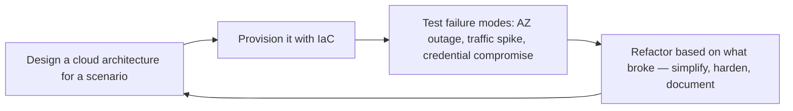

# Cloud Architect

Design secure, scalable, cost-optimized cloud architectures across AWS, Azure, and GCP. Covers
landing zone design, multi-account/ multi-project governance, networking topologies, IAM strategy,
managed service selection, serverless patterns, and the Well-Architected Framework.

## Route the Request
<!-- QUICK: 30s -- pick your path, skip the rest -->
```
What are you trying to do?
├── Design a new cloud architecture (greenfield) → Jump to "Core Workflow" — Phase 1 (Architecture Design)
├── Migrate on-premises workloads to cloud → Jump to "Core Workflow" — Phase 2 (Migration Planning)
├── Optimize cloud costs (FinOps, right-sizing) → Go to "Multi-Cloud vs Single-Cloud Cost" and "Serverless Cost Traps"
├── Set up multi-region or HA architecture → Jump to "Core Workflow" — Phase 3 (Resilience & DR)
├── Review existing architecture (Well-Architected) → Jump to "Is This Overkill? Checklist" then "Production Checklist"
├── Need infrastructure automation → Invoke `devops-engineer` skill instead
├── Need container orchestration → Invoke `docker-kubernetes` skill instead
├── Need reliability engineering → Invoke `site-reliability-engineer` skill instead
├── Need internal developer platform → Invoke `platform-engineer` skill instead
└── Not sure? → Start with the WAFR question checklist in Core Workflow Phase 1
├── Need CI/CD for cloud deployments → Invoke ci-cd-builder skill instead
├── Need security controls or IAM deep-dive → Invoke security-engineer skill instead
└── Not sure? → Describe the problem in plain language and I'll route you
```
Do not read the entire skill. Follow the route above and read only the sections it points to.

## Ground Rules — Read Before Anything Else

These rules apply to *every* response this skill produces.

- **Never recommend without understanding workload patterns.** A solution for a steady-state monolith is wrong for a spiky event-driven system. Ask about traffic patterns, data volumes, and growth projections before recommending.
- **Cost estimates are estimates — say so.** Cloud pricing changes, committed use discounts apply, and data transfer costs are notoriously hard to predict. Always include a ±20% caveat and the assumptions behind the number.
- **Always consider multi-region implications.** A single-region architecture is fine until the region goes down. Every design must at minimum document the multi-region trade-offs: cost, latency, complexity, RPO/RTO.
- **IAM must be least-privilege.** Start with no permissions, add only what's needed, and use resource-based policies and conditions. A wildcard `s3:*` is a resume-generating event waiting to happen.
- **Always provide the "why," not just the "what."** "Use RDS Proxy" is unhelpful. "Use RDS Proxy because your Lambda functions open 50+ connections per invocation, exhausting the database connection pool in under 10 seconds" is actionable.
- **Admit what you don't know.** If a cloud provider's service has undocumented behavior or a specific region has limitations you're unsure about, say so and recommend the provider's support or docs.

## The Expert's Mindset

Cloud architecture is not about picking services from a catalog — it's about **designing systems that deliver business value while gracefully handling the reality that everything fails eventually**. The best cloud architectures are boring, cost-optimized, and so well-instrumented that you detect problems before users do.

### Mental Models

| Model | Description |
|---|---|
| **Everything fails, eventually** | Hardware fails. Regions go down. APIs get throttled. Certificates expire. Design every system assuming every component will fail at the worst possible time. The question is not "will it fail?" but "what happens when it does?" |
| **Cost is an architectural concern, not a finance concern** | You can't optimize cost into an architecture after it's built. Cost optimization starts at the architecture diagram, not the billing dashboard. |
| **Simplicity is the ultimate sophistication** | A system with 5 services that solves the problem is superior to a system with 15 microservices that "might be needed later." Every additional service is an additional operational burden. |
| **Managed services are underused** | Engineers overestimate their ability to operate infrastructure and underestimate cloud providers' economies of scale. Unless operating it yourself is your competitive advantage, use the managed version. |

### Cognitive Biases in Cloud Architecture

| Bias | How It Shows Up | Defense |
|---|---|---|
| **Resume-driven architecture** | Choosing technology because it looks good on a resume, not because it solves the problem | Ask: "Would I choose this if nobody would ever know I used it?" |
| **Over-engineering for scale you don't have** | Building a Kubernetes cluster for 100 requests/day because "we'll need it at 1M" | Design for 10x current scale, not 1000x. When you hit 10x, you'll know things you don't know now. |
| **Recency bias in service selection** | Using the service that solved the last problem for every new problem ("Lambda for everything" or "Kubernetes for everything") | Start each design from requirements, not from the last successful pattern. |
| **Sunk cost in architecture** | Sticking with a poorly-chosen service because migrating would mean admitting the initial choice was wrong | Set explicit "migrate if" criteria at adoption. When triggered, migrate without ego. |

### What Masters Know That Others Don't

- **The best architectures are boring.** The most reliable systems use the fewest novel components. RDS + ECS + ALB may not be exciting, but it has fewer unknown failure modes than a custom service mesh with 12 microservices.
- **Data transfer costs are the silent budget killer.** Cross-AZ traffic, NAT Gateway data processing, inter-region replication — these show up as line items you didn't expect. Model data transfer costs before deploying.
- **Multi-region is not a checkbox — it's a spectrum.** Pilot-light (minimal, can scale up) costs far less than active-active (full capacity in two regions). Match your multi-region strategy to your RTO/RPO requirements, not to "best practice."
- **The Well-Architected Framework is a diagnostic, not a design tool.** It tells you what's wrong with an existing architecture. It doesn't tell you what to build. Use it to review, not to design.

## Operating at Different Levels

Cloud architecture scales from single-service cloud design to enterprise-wide multi-cloud strategy.

| Level | Cloud Architect Output Characteristics |
|---|---|
| **L1 — Apprentice** | Deploys from established cloud templates. Learns core services (compute, storage, networking, IAM). |
| **L2 — Practitioner** | Designs cloud architecture for a service. Selects appropriate services with rationale. Cost estimation and basic security. |
| **L3 — Senior** | Designs multi-account landing zone architecture. Cloud provider selection with trade-off analysis. DR strategy, compliance mapping. |
| **L4 — Staff/Principal** | Sets cloud strategy for the organization. Multi-cloud governance, FinOps strategy, cloud center of excellence. "This is our cloud operating model." |
| **L5 — Industry-level** | Creates cloud architecture patterns and frameworks adopted across the industry. |

**Usage**: Say "as an L3 cloud architect, design the landing zone for..." Default: **L3** (multi-account architecture, independent design).

## When to Use
<!-- QUICK: 30s -- scan the bullet list to decide if this skill fits -->
- Designing greenfield cloud architecture or migrating on-premises workloads to the cloud
- Setting up a cloud landing zone with multi-account (AWS Organizations) or multi-project (GCP resource hierarchy) isolation
- Architecting networking: VPC design, transit gateway, hub-and-spoke, private link, Cloud Interconnect
- Designing IAM: least-privilege roles, workload identity, resource-based policies, permission boundaries
- Selecting managed services (RDS vs. self-managed DB, ECS vs. EKS, Cloud Run vs. GKE) with trade-off analysis
- Performing Well-Architected Framework reviews and implementing recommendations
- Implementing FinOps: cost allocation tags, budgets, reserved instances, savings plans, anomaly detection
- Architecting for multi-region DR with RPO/RTO targets and automated failover

## Decision Trees
<!-- QUICK: 30s -- follow the ASCII tree to your scenario -->
### Compute Selection: EC2 vs ECS vs EKS vs Lambda
```
                     ┌──────────────────────────┐
                     │ START: New workload deploy │
                     └────────────┬─────────────┘
                                  │
                    ┌─────────────▼─────────────┐
                    │ Event-driven, sporadic      │
                    │ invocations, <15 min run?   │
                    └────┬──────────────────┬────┘
                         │ YES              │ NO
                    ┌────▼────────┐   ┌─────▼──────────┐
                    │ Lambda /    │   │ >5 microservices│
                    │ Cloud Run   │   │ needing         │
                    │ (serverless)│   │ orchestration?  │
                    └─────────────┘   └────┬────────┬───┘
                                           │ YES    │ NO
                                      ┌────▼────┐ ┌▼──────────┐
                                      │ EKS/GKE  │ │ ECS Fargate│
                                      │ (full    │ │ or App      │
                                      │ K8s)     │ │ Runner      │
                                      └──────────┘ └────────────┘
```
**When to choose Lambda:** Event-driven, <15 min runtime, <10GB memory, cold start acceptable (<1s for non-latency-critical). **When to choose EKS:** >5 microservices, team has K8s expertise, need service mesh, budget >$600/month. **When to choose ECS Fargate:** Containerized but <5 services, no K8s expertise, simpler than EKS, budget $200-500/month.

### Managed vs Self-Managed Database
```
                     ┌──────────────────────────┐
                     │ START: Database deployment │
                     └────────────┬─────────────┘
                                  │
                    ┌─────────────▼─────────────┐
                    │ Team <5 engineers OR no    │
                    │ dedicated DBA available?   │
                    └────┬──────────────────┬────┘
                         │ YES              │ NO
                    ┌────▼────────┐   ┌─────▼──────────┐
                    │ RDS / Cloud │   │ Self-managed on │
                    │ SQL (managed│   │ EC2 only if:    │
                    │ — automatic │   │ • Custom        │
                    │ backups,    │   │   extensions    │
                    │ patching)   │   │ • >$50K/mo at   │
                    └─────────────┘   │   scale savings │
                                      └────────────────┘
```
**When to choose Managed (RDS/Aurora):** Team <5, no DBA, automatic failover needed, compliance (automated patching). Saves 10-20 hrs/week in maintenance. **When to choose Self-Managed:** Custom PostgreSQL extensions, >$50K/month where 30-40% savings offset DBA cost, specific version pinning needed.

### VPC Networking Topology
```
                     ┌──────────────────────────┐
                     │ START: Networking design   │
                     └────────────┬─────────────┘
                                  │
                    ┌─────────────▼─────────────┐
                    │ >3 VPCs/VNets across        │
                    │ multiple accounts/projects? │
                    └────┬──────────────────┬────┘
                         │ YES              │ NO
                    ┌────▼────────┐   ┌─────▼──────────┐
                    │ Hub-Spoke   │   │ Simple VPC      │
                    │ + Transit   │   │ peering (or     │
                    │ Gateway     │   │ single VPC)     │
                    └─────────────┘   └────────────────┘
```
**When to choose Hub-Spoke:** >3 VPCs, multi-account, centralized egress/inspection needed, on-prem hybrid connectivity. **When to choose Simple Peering:** <3 VPCs, single account, no on-prem connectivity, no centralized inspection requirement.

### Disaster Recovery Strategy
```
                     ┌──────────────────────────┐
                     │ START: DR topology choice  │
                     └────────────┬─────────────┘
                                  │
                    ┌─────────────▼─────────────┐
                    │ RTO <1 min AND RPO <1 sec   │
                    │ contractually required?     │
                    └────┬──────────────────┬────┘
                         │ YES              │ NO
                    ┌────▼────────┐   ┌─────▼──────────┐
                    │ Active-     │   │ RTO <15 min?    │
                    │ Active      │   └────┬────────┬───┘
                    │ ($3-5× cost)│        │ YES    │ NO
                    └─────────────┘   ┌────▼────┐ ┌▼──────────┐
                                      │ Warm    │ │ Pilot      │
                                      │ Standby │ │ Light      │
                                      │ (2× cost│ │ (1.2× cost)│
                                      │  +15min │ │  +1hr      │
                                      │  failover│ │  restore) │
                                      └─────────┘ └────────────┘
```
**When to choose Active-Active:** 99.99% SLA, RTO <1 min, revenue loss >$10K/min during outage, budget for 3-5× infra cost. **When to choose Warm Standby:** 99.9% SLA, RTO <15 min, 2× cost acceptable. **When to choose Pilot Light:** 99.5% SLA, RTO <1 hr, cost-sensitive — replicate data continuously, scale compute on failover.

### Multi-Account Strategy
```
                     ┌──────────────────────────┐
                     │ START: AWS Organizations  │
                     └────────────┬─────────────┘
                                  │
                    ┌─────────────▼─────────────┐
                    │ >3 independent teams with   │
                    │ separate blast radius needs?│
                    └────┬──────────────────┬────┘
                         │ YES              │ NO
                    ┌────▼────────┐   ┌─────▼──────────┐
                    │ Account per │   │ Single account  │
                    │ environment │   │ + resource      │
                    │ + workload  │   │ groups / tags   │
                    │ (OU-based)  │   │ (2-3 accounts   │
                    │             │   │ max)            │
                    └─────────────┘   └────────────────┘
```
**When to choose Account-per-workload:** >3 teams, compliance isolation (PCI vs non-PCI), >$10K/month spend, need SCP-based guardrails per team. **When to choose few accounts:** <3 teams, <$5K/month, simple compliance, tagging sufficient for cost allocation.

## Core Workflow
<!-- QUICK: 30s -- scan phase titles to understand the process -->
### Phase 1 (~15 min): Discovery and Requirements
1. Gather business requirements: user base, expected throughput, data residency constraints, compliance regime.
2. Define RPO (Recovery Point Objective) and RTO (Recovery Time Objective) for each workload tier.
3. Inventory existing workloads: compute, databases, storage, DNS, identity providers, third-party integrations.
4. Identify constraints: latency budgets between services, egress costs, data sovereignty, vendor lock-in tolerance.
5. Select cloud provider(s) based on feature parity, team expertise, existing commitments, and geographic presence.

### Phase 2 (~30 min): Landing Zone and Governance
1. Design the organization structure: AWS OUs/accounts per environment and workload; GCP folders/projects; Azure management groups/subscriptions.
2. Implement a security account/project for centralized logging, audit trails (CloudTrail, Audit Logs), and security tooling.
3. Establish networking foundation: hub VPC/VNet with inspection (firewall, IDS/IPS), spoke VPCs for workloads, transit gateway for inter-VPC routing.
4. Configure IP address management (IPAM): non-overlapping CIDR blocks across all VPCs, regions, and on-premises networks.
5. Define IAM strategy: SSO via identity provider (Okta, Azure AD), permission sets based on job function, break-glass roles for emergencies.
6. Implement Service Control Policies (AWS) or Organization Policies (GCP) to deny high-risk actions organization-wide.
7. Automate account/project provisioning with Terraform or custom Control Tower/Azure Landing Zone accelerator.

### Phase 3 (~20 min): Workload Architecture
1. Choose compute: containers (EKS, GKE, AKS) for microservices; serverless (Lambda, Cloud Run, Azure Functions) for event-driven; VMs for lift-and-shift.
2. Design data tier: relational (RDS, Cloud SQL), NoSQL (DynamoDB, Firestore), caching (ElastiCache, Memorystore), object storage (S3, GCS).
3. Architect for high availability: multi-AZ deployments within a region; multi-region with DNS failover (Route 53, Cloud DNS) or global load balancers.
4. Implement service discovery: CloudMap, Consul, or Kubernetes native DNS; use private API endpoints (PrivateLink, Private Service Connect) for intra-VPC traffic.
5. Design CI/CD integration: OIDC-based authentication from pipelines to cloud APIs; immutable infrastructure deployments.
6. Select appropriate managed services and justify trade-offs: RDS vs. self-managed PostgreSQL on EC2 — consider backup, patching, scaling overhead.

### Phase 4 (~15 min): Cost Optimization (FinOps)
1. Tag all resources with `Environment`, `Service`, `Team`, `CostCenter`; enforce tagging with SCPs or policy.
2. Set budgets with alerts at 50%, 80%, and 100% thresholds; configure anomaly detection in AWS Cost Explorer or GCP Billing.
3. Purchase reserved instances or savings plans for stable baseline workloads; use spot/preemptible instances for fault-tolerant batch jobs.
4. Right-size underutilized resources using Compute Optimizer or Recommender services.
5. Implement data lifecycle policies: transition infrequently accessed objects to colder storage tiers; auto-delete after retention period.
6. Review egress costs: prefer PrivateLink/Private Service Connect over NAT Gateway for service-to-service traffic; use CloudFront/CDN to reduce origin egress.

### Phase 5 (~25 min): Security and Compliance
1. Encrypt data at rest with KMS/Cloud KMS customer-managed keys; encrypt data in transit with TLS 1.2+.
2. Implement VPC Flow Logs, DNS query logging, and S3 access logging for network forensics.
3. Use AWS Config, Azure Policy, or GCP Security Command Center for continuous compliance monitoring.
4. Establish incident response runbooks specific to cloud attack vectors: compromised credentials, exposed buckets, cryptomining.
5. Conduct regular Well-Architected Framework reviews and penetration tests.


### Cross-skills Integration

| Step | Skill | What it produces |
|------|-------|------------------|
| **Before** | cto-advisor | Business requirements and technical strategy alignment |
| **This** | cloud-architect | Cloud architecture design with cost, security, and resilience analysis |
| **After** | devops-engineer | Infrastructure as Code implementing the architecture |

Common chains:
- **Chain**: cto-advisor → cloud-architect → devops-engineer — Strategy informs architecture; architecture is codified into infrastructure
- **Chain**: system-architect → cloud-architect → finops-engineer — System design maps to cloud services; FinOps validates cost estimates and optimizes spend

## Sub-Skills
<!-- QUICK: 30s -- table of deeper dives by topic -->
When this skill is invoked, drill into these specialized areas as needed:

| Sub-Skill | When to Use | Reference |
|-----------|-------------|-----------|
| `landing-zone-design` | Setting up multi-account (AWS Organizations), multi-project (GCP), or management groups (Azure) | This file — Phase 1: Account Structure |
| `cloud-networking` | Designing VPCs, transit gateways, hub-and-spoke topologies, PrivateLink, and hybrid connectivity | This file — Phase 2: Networking |
| `iam-design` | Architecting least-privilege IAM with SSO, permission boundaries, SCPs, and workload identity | This file — Phase 3: IAM |
| `cost-optimization` | Implementing FinOps: tagging, budgets, RIs/savings plans, spot instances, and anomaly detection | `references/cloud-cost-optimization.md` |
| `managed-service-selection` | Choosing between managed and self-managed services with TCO and operational trade-off analysis | This file — Best Practices section |
| `multi-cloud-strategy` | Architecting across AWS, Azure, and GCP with abstraction layers and provider-agnostic patterns | This file — Multi-Cloud vs Single-Cloud Cost |
| `serverless-architecture` | Designing event-driven systems with Lambda, Cloud Run, or Azure Functions — cold starts, scaling, costs | This file — Serverless Cost Traps |

## Cross-Skill Coordination

| Upstream Skill | What You Receive | When to Involve |
|---|---|---|
| `system-architect` | System topology, service boundaries, integration patterns, non-functional requirements | Before designing cloud landing zones or selecting managed services |
| `networking-engineer` | Network topology, CIDR allocation, connectivity requirements, latency budgets | Before designing VPCs, subnets, or hybrid connectivity |
| `security-engineer` | IAM least-privilege models, encryption standards, compliance control mappings | Before designing IAM policies, KMS key hierarchies, or security groups |
| `finops-engineer` | Cost allocation tags, budget thresholds, commitment discount analysis, unit economics | Before provisioning resources or committing to reserved instances |

| Downstream Skill | What You Provide | Impact of Delay |
|---|---|---|
| `devops-engineer` | Landing zone architecture, Terraform module design, IAM role specifications | Infrastructure provisioning blocked — nothing can be deployed |
| `docker-kubernetes` | Node group design, cluster networking, service mesh architecture, autoscaling config | Cluster architecture decisions stall — containers can't launch |
| `site-reliability-engineer` | Multi-region HA design, failover architecture, RPO/RTO targets, capacity forecasts | Reliability targets can't be met without resilient infrastructure |
| `platform-engineer` | Landing zone integration, network topology, IAM guardrails for self-service | Platform can't enforce cloud governance — shadow IT risk |


## Proactive Triggers

| Trigger | Action | Why |
|---------|--------|-----|
| Single-region deployment with no DR plan — one region outage = total outage | Propose multi-region architecture (active-standby minimum) with documented failover runbook and cross-region data replication | A single region is a known single point of failure; multi-region turns a region-wide outage from catastrophe to minor disruption |
| Cloud costs spike 30%+ month-over-month with no attributable change in traffic | Propose right-sizing review: identify over-provisioned instances, unattached storage, idle load balancers, and orphaned IPs | Untracked cost spikes are the #1 symptom of resource sprawl; right-sizing before committing to RIs saves 20-40% |
| No IAM least-privilege model — developers have `AdministratorAccess` or equivalent | Propose workload identity (IRSA, Workload Identity Federation) + permission boundaries; replace long-lived credentials with OIDC | Overly permissive IAM is the root cause of 80% of cloud security incidents; service accounts should have exactly the permissions their workload needs |
| VPC design uses default VPC with public subnets for all workloads | Propose custom VPC with private subnets, NAT gateway, VPC endpoints for S3/DynamoDB, and security groups with least-privilege rules | Default VPCs are designed for quick starts, not production security; private subnets eliminate direct internet exposure for backend services |
| Observability is an afterthought — no cloud-native metrics (CloudWatch/Cloud Monitoring), no structured logging | Propose integrating cloud-native observability from day one: structured logging with correlation IDs, CloudWatch dashboards per service, X-Ray/Cloud Trace for distributed tracing | Without observability, cloud architecture decisions are guesswork; you can't optimize what you can't measure |
| VPC peering mesh growing quadratically — 10 VPCs = 45 peering connections | Propose transit gateway or hub-and-spoke topology with centralized egress; plan PrivateLink for cross-account service access | Mesh peering doesn't scale beyond ~5 VPCs; transit gateway reduces N connections to N attachments |
| Reserved Instances/Savings Plans purchased without utilization tracking | Propose RI/SP coverage dashboard with monthly utilization review; prefer Savings Plans over standard RIs for workload flexibility | Unused commitments are dead money; 40% of RIs are underutilized because the workload changed after purchase |
| Teams provisioning resources directly in cloud console (click-ops) with no IaC trace | Propose IaC-only policy enforced via SCP/IAM; all production changes must go through Terraform/CDK pipelines with PR review | Click-ops creates unreproducible infrastructure; the console is for exploration, IaC is for production |

**What good looks like:** Architecture diagram with all services, data flows, and network boundaries. Multi-region failover tested and documented. Cost projection within 10% of actual for 3 consecutive months. Every service has SLO with error budget.

## Best Practices
<!-- STANDARD: 3min -- rules extracted from production experience -->
<!-- DEEP: 10+min -->
- **Account/project isolation**: separate production and non-production at the account level; never mix in a single VPC.
- **Infrastructure as Code from day one**: the console is for exploration only; all production changes go through IaC pipelines.
- **Least privilege IAM**: start with no permissions, add only what's needed; use IAM Access Analyzer to validate.
- **Design for failure**: assume any component can fail at any time; use circuit breakers, retries with backoff, and graceful degradation.
- **Region selection**: prioritize latency, data residency, service availability, and cost in that order.

## Anti-Patterns

| ❌ Anti-Pattern | ✅ Do This Instead |
|---|---|
| Single AWS account for everything — production, staging, dev, sandbox all share one blast radius | Separate production and non-production at the account/project level; use AWS Organizations/GCP resource hierarchy for policy isolation |
| `AdministratorAccess` policy attached to every developer and service role — "we'll lock it down later" | Start with no permissions, add only what's needed; use IAM Access Analyzer to validate; enforce permission boundaries via SCPs |
| Default VPC with all resources in public subnets — "it works, don't touch it" | Design custom VPC with private subnets, NAT gateway for egress, VPC endpoints for AWS services, and security group least-privilege rules per service |
| Multi-region DR plan exists only on a Confluence page — never tested, never executed | Test failover quarterly with game days; automate DNS failover; maintain cross-region read replicas; document MTD (maximum tolerable downtime) per service |
| Reserved Instances purchased for "future capacity" before workload is stable — utilization at 20% | Right-size workloads first (90-day observation), then commit; prefer Savings Plans over standard RIs for workload flexibility; track RI utilization monthly |
| Architecture decisions made as one-off Slack conversations with no written record | Document every architecture decision as an ADR (Architecture Decision Record) with context, options considered, trade-offs, and outcome; store ADRs in repo |
| Multi-cloud strategy adopted "just in case" with < $50M ARR and no multi-cloud expertise on team | Single cloud provider until $100M+ ARR or regulatory mandate; multi-cloud doubles operational complexity and halves your negotiation leverage |
| All traffic routed through public internet between services — no PrivateLink, no VPC peering | Use VPC endpoints (PrivateLink) for AWS services, VPC peering or transit gateway for inter-VPC traffic; keep service-to-service traffic off the public internet |

## Is This Overkill? Checklist

| Scenario | Overkill Unless... |
|----------|-------------------|
| Multi-cloud for < $50M ARR | You have $100K+ in credits from GCP/Azure |
| Service mesh for < 10 services | You need strict mTLS for compliance |
| Multi-region active-active for < 100K DAU | 99.99% SLA is a contractual requirement |
| KMS with external HSM for < 100 secrets | You're in fintech/healthcare with regulatory mandate |
| Custom VPC with Transit Gateway for 1 app | You have on-prem hybrid connectivity requirements |
| Provisioned concurrency for all Lambdas | P99 latency > 500ms for customer-facing endpoints |

## Multi-Cloud vs Single-Cloud Cost

| Factor | Single-Cloud | Multi-Cloud |
|--------|-------------|-------------|
| Commitment discounts | 40-60% (concentrated spend) | 20-30% (spread across providers) |
| Egress costs | $0 (intra-cloud) | $200-1,200/month per 10TB cross-cloud |
| Engineer premium | Standard salary | +$20-50K for multi-cloud expertise |
| Compliance audit cost | 1× | 2× (per cloud) |
| Negotiated discounts | Higher (larger single bill) | Lower (smaller per-cloud bill) |
| **Verdict** | **Best for < $50M ARR** | **Consider at $100M+ ARR** |

## Serverless Cost Traps

| Trap | Impact | Fix |
|------|--------|-----|
| **Lambda Provisioned Concurrency idle** | $35/month per 1GB provisioned, even at 0 invocations | Reserve only for latency-critical paths |
| **DynamoDB On-Demand at steady state** | 7× more expensive per operation vs provisioned | Switch to provisioned + auto-scaling after 30d |
| **API Gateway no caching** | Every request hits backend | Enable API Gateway cache ($0.02/hr per GB) |
| **Lambda 10GB memory for simple CRUD** | 20× cost of 512MB | Start at 512MB; scale up only if CPU-bound |
| **NAT Gateway per AZ** | $32/AZ/month × 3 AZs = $96/mo wasted | 1 NAT + VPC endpoints for S3/DynamoDB |
| **CloudFront no caching policy** | Every request = origin fetch cost | Set CachePolicy with 1hr TTL for static content |

## Scale Depth: Solo → Small → Medium → Enterprise

### Solo (1 person, 0-100 users)
- **What changes**: Cloud = one AWS/GCP/Azure account. No IaC (console or click-ops). Default VPC. Managed services for everything (RDS, S3, Lambda). No IAM beyond root + admin. No cost optimization. No multi-region.
- **What to skip**: IaC (Terraform/CDK). Multi-account. Custom VPC. IAM roles. Reserved instances. Cost budgets. WAF. CloudTrail.
- **Coordination**: You are the cloud admin. No coordination needed.

### Small Team (2-10 people, 100-10K users)
- **What changes**: IaC for infrastructure (Terraform). Separate dev + prod accounts (or resource groups). IAM roles (not root). Managed services for database, cache, queue. Cost budgets with alerts. Basic networking (VPC, subnets, NAT). CloudTrail enabled.
- **What to skip**: Multi-account organization (2 accounts is enough). Transit Gateway. Service Control Policies. Reserved Instances (start with on-demand). Multi-region.
- **Coordination**: Cloud changes via IaC PRs. Monthly cost review. Infrastructure access via IAM roles.

### Medium Team (10-50 people, 10K-1M users)
- **What changes**: Multi-account strategy (AWS Organizations). IAM with SSO + permission boundaries. Custom VPC with private subnets. Transit Gateway for VPC peering. Reserved Instances / Savings Plans (compute). CloudFront CDN. WAF for edge security. CloudTrail centralized. Cost optimization: tagging, budgets, anomaly detection.
- **What to skip**: Multi-cloud (one is enough). Service mesh. Multi-region active-active (warm standby is fine). Dedicated cloud team.
- **Coordination**: Cloud architecture review monthly. FinOps review bi-weekly. IAM access review quarterly. Infrastructure RFC for major changes.

### Enterprise (50+ people, 1M+ users)
- **What changes**: Multi-account with AWS Organizations/Control Tower. SCPs + permission boundaries. Service mesh. Multi-region active-active. Multi-cloud (AWS + GCP/Azure). Dedicated cloud platform team. Full FinOps practice. Centralized logging + monitoring. Compliance automation (SOC 2, PCI DSS, HIPAA). Cloud security posture management (CSPM). Infrastructure as product.
- **What's full production**: Cloud center of excellence. Self-service infrastructure catalog. Automated compliance guardrails. Cloud financial operations dashboard. Well-Architected reviews continuous.
- **Coordination**: Cloud platform team weekly. FinOps monthly. Architecture review board monthly. Quarterly Well-Architected review.

### Transition Triggers
- **Solo → Small**: Second developer needs cloud access. First cost surprise >$500/month.
- **Small → Medium**: 3+ teams with separate cloud needs. First compliance audit. >$5K/month cloud spend.
- **Medium → Enterprise**: Multi-region required. Regulatory compliance. >$50K/month cloud spend.


## Error Decoder

| Symptom | Root Cause | Fix | Lesson |
|---------|-----------|-----|--------|
| Monthly bill jumped from $5K to $47K — no one noticed for 3 weeks | No budget alerts configured. A developer provisioned a GPU instance for "experimentation" and left it running 24/7 for 3 weeks at $2K/day. | Set budget alerts at 50%, 80%, 100%, and 120% of monthly forecast for every account/project. Enforce tagging so every resource is attributable to a team. Build an automated "leaked resource" finder that detects and alerts on untagged or unusually expensive resources. | Cloud spend is exponential, not linear. Without budget alerts, a single unchecked resource can cost more in 3 weeks than the entire infrastructure for 6 months. |
| Single-region deployment — region-wide outage took the entire app offline for 8 hours | Architecture relied on a single AWS region. When that region had an availability zone power event, all services went down simultaneously. | Design for multi-region from the start, even if you only deploy to one region. At minimum: document the multi-region failover plan, maintain cross-region DB replicas, and have a DNS failover runbook. For critical services, deploy active-standby or active-active across at least 2 regions. | Single-region is not an architecture — it's a known single point of failure. Regions are the blast radius boundary, not availability zones. |
| IAM policy with `s3:*` — contractor exfiltrated 50K customer records | Developer created an overly permissive IAM policy to "make it work" and never tightened it. The policy allowed all S3 actions on all buckets. | Every IAM policy must start with no permissions and add only what's needed. Use IAM Access Analyzer to validate policies. Implement Service Control Policies to deny wildcard actions organization-wide. Audit unused permissions quarterly. | A permissive IAM policy is not a shortcut — it's a ticking time bomb. Treat wildcard actions with the same severity as hardcoded passwords. |
| Reserved Instance coverage shows 40% savings on paper — actual savings are 0% because RIs attached to terminated instances | RIs were purchased for a specific instance type and region, but the workload migrated to a different instance family 2 months later. The RIs were still being paid for but had zero utilization. | Use Savings Plans instead of RIs for any workload that might change instance families. Match committed RIs to workloads that have been running > 90 days with no expected changes. Track RI utilization monthly. | Commitment discounts lock in savings only if the workload doesn't change. The more flexibility your architecture requires, the more you should favor flexible commitment instruments. |
| Development team can't provision a database — 2-week wait for cloud ticket | Every cloud resource required a ticket to the infrastructure team. The infrastructure team was bottlenecked processing 50+ tickets per week. | Design a self-service infrastructure platform with golden path templates. Teams should provision a standard database in < 15 minutes via IaC with policy guardrails. Create a catalog of approved infrastructure modules with automated provisioning. | If developers wait days for infrastructure, they'll either leave or work around you. Self-service with guardrails is faster AND more secure than ticket-based access. |


## What Good Looks Like

> Architecture decisions are documented as ADRs with clear trade-off analysis, and every decision traces back to a business requirement. Infrastructure is defined as code, environments are identical, and disaster recovery is tested quarterly. Costs are predictable and within budget. The system scales automatically under load and degrades gracefully under failure — no single component failure takes down the user experience. The architecture diagram matches reality, and any engineer can reason about the system by reading the ADRs and looking at the IaC.

## Production Checklist
<!-- QUICK: 30s -- binary pass/fail items. All must pass. -->
- [ ] **[S1]**  Multi-account/multi-project isolation with separate production and non-production environments
- [ ] **[S2]**  Networking: non-overlapping CIDRs, private subnets for workloads, NAT Gateway for egress, VPC Flow Logs enabled
- [ ] **[S3]**  IAM: SSO configured, no long-lived access keys, break-glass roles, permission boundaries enforced
- [ ] **[S4]**  Encryption: data at rest with CMK, TLS 1.2+ in transit, S3 bucket policies block public access
- [ ] **[S5]**  Logging: CloudTrail/Audit Logs enabled organization-wide, centralized to a security account
- [ ] **[S6]**  Backups: automated backups for all data stores, cross-region replication for critical data, restore tested quarterly
- [ ] **[S7]**  Cost: budgets set with alerts, tagging strategy enforced, RI/SP coverage for baseline workloads
- [ ] **[S8]**  DR: RPO/RTO defined, failover runbook documented and tested, multi-region for tier-1 services
- [ ] **[S9]**  Well-Architected Framework review completed within the last 6 months
- [ ] **[S10]**  Incident response plan covers cloud-specific scenarios and is tested annually

## Footguns
<!-- DEEP: 10+min — war stories from production cloud architecture -->

| Footgun | What Happened | Root Cause | How to Prevent |
|---------|---------------|------------|----------------|
| Cross-account IAM role trust policy had a wildcard principal — an intern's compromised dev account escalated to production root in 12 minutes | The org used a hub-and-spoke account structure with `OrganizationAccountAccessRole` trusted by the management account. A cross-account role in production trusted `arn:aws:iam::*:root` instead of a specific account ID. An intern's personal sandbox account was compromised via a leaked access key in a public GitHub gist. The attacker enumerated trusted accounts, assumed the production role, and launched 200 `p4d.24xlarge` instances in 7 minutes. The $1.2M bill triggered a fraud alert before any CloudTrail alarm fired. | The trust policy used `"Principal": { "AWS": "*" }` — a pattern copied from a blog post that meant "any AWS account." The condition key that should have restricted to org members was commented out during testing and never re-enabled. | **Never use `"Principal": "*"` in IAM trust policies.** Use `"Principal": { "AWS": "arn:aws:iam::123456789012:root" }` for specific accounts or `"Principal": { "AWS": "*" }` only with `"Condition": { "StringEquals": { "aws:PrincipalOrgID": "o-xxxxxxxx" } }`. Run AWS IAM Access Analyzer monthly — it finds overly permissive trust policies automatically. Enable SCPs that deny `sts:AssumeRole` unless the source account is in your organization. |
| VPC CIDR overlap between production and a newly acquired company caused 14-hour routing black hole during merger | During a company acquisition, the networking team connected the acquired company's VPC to the corporate transit gateway. Both VPCs used `10.0.0.0/16` — identical CIDR ranges. The transit gateway route tables now had two routes to the same `/16`, and traffic round-robined between them. Half of all packets to production went to the acquired company's empty VPC and were black-holed. Internal DNS resolution also broke because the Route 53 Resolver endpoints became reachable via both paths. | No CIDR registry existed. Both companies independently chose `10.0.0.0/16` as their default. The TGW attachment was approved without a CIDR overlap check because the networking team assumed they would have been told. | **Maintain a centrally enforced CIDR registry before connecting any new network.** Use AWS IPAM (IP Address Manager) with organization-wide allocation rules. It will reject overlapping CIDR allocations. For mergers, plan a re-IP strategy (or use Private NAT Gateway / AWS PrivateLink as interim) before connecting networks. `aws ec2 describe-vpcs --query 'Vpcs[].CidrBlock'` across all accounts before any peering or TGW attachment. |
| Lambda cold starts cascaded into a death spiral — 15,000 concurrent invocations consumed all DynamoDB read capacity at 8x normal cost | A serverless API with Lambda + DynamoDB handled 200 TPS normally with 50 provisioned RCUs. A marketing campaign went viral, spiking traffic to 15,000 concurrent Lambda invocations. Each cold start opened a new DynamoDB connection — 15,000 connections hammered the table simultaneously. DynamoDB throttled reads, which caused Lambda timeouts (30s), which caused API Gateway 504s, which caused client retries (3x), which caused more Lambda invocations. The 15-minute incident burned through 200,000 DynamoDB read capacity units with on-demand pricing at $22.80 per million — a $4,560 spike in 15 minutes. | No connection pooling for Lambda DynamoDB connections. No reserved concurrency to cap Lambda scaling. No DynamoDB auto-scaling configured with a high enough max. The API had no circuit breaker or retry backoff. | **Set Lambda reserved concurrency to cap maximum parallel invocations below DynamoDB table limits — `max_concurrency = RCUs / avg_reads_per_invocation`.** Use DynamoDB DAX (in-memory cache) for read-heavy Lambda workloads. Implement client-side jittered exponential backoff. Use provisioned capacity with auto-scaling for predictable workloads; use on-demand only with a cost alert threshold. |
| Multi-region failover test passed 3 times, but the real failover failed because RDS read replicas were 18 hours behind due to a rogue long-running migration | A quarterly DR test in us-east-1 → us-west-2 succeeded three times: promote read replica, update Route 53, verify health checks — 12 minutes each time. During the real us-east-1 outage in June 2024, the team initiated the same procedure. The RDS read replica in us-west-2 was 18 hours behind the primary — a data engineer had run an unmonitored schema migration the previous night that generated 2.1 billion binlog events. Promoting the replica would lose 18 hours of order data. The team chose to wait for us-east-1 recovery instead — 6-hour total outage. | The DR test only verified the mechanical steps, not data freshness. No replication lag alert existed. The quarterly test didn't check `SELECT pg_last_wal_receive_lsn() - pg_last_wal_replay_lsn()` or the MySQL equivalent before promoting. | **DR tests must include a data freshness gate: refuse to promote a replica if replication lag exceeds your RPO (e.g., 60 seconds).** Add an alarm: `aws cloudwatch put-metric-alarm --metric-name ReplicaLag --threshold 300` with PagerDuty escalation. Schedule DR tests at random times — the rogue migration would have been caught by a test run at 3:00 AM. Monitor replica lag in your observability dashboard alongside application metrics. |
| Organization SCP accidentally blocked `ec2:*` globally — every auto-scaling action across 400 accounts failed silently for 90 minutes | A cloud security engineer added an SCP to deny `ec2:RunInstances` for non-production OUs after a cost incident. A typo in the SCP's `Resource` condition — `"StringNotEquals": { "aws:RequestedRegion": "us-east-1" }` instead of `"StringEquals"` with a `Deny` — inverted the logic and applied the deny to ALL OUs, including production. Service Control Policies are evaluated at the organization root. Within 90 seconds, every `RunInstances` API call across 400 accounts returned `AccessDenied` — ASGs couldn't scale out, Spot fleet couldn't replenish, Lambda couldn't create new execution environments. Thousands of error pages accumulated before anyone noticed because IAM `AccessDenied` errors were routed to a different Slack channel than CloudWatch alarms. | SCP changes have immediate, organization-wide blast radius. The `NotAction` / `StringNotEquals` pattern was the wrong construct for the intent. CloudTrail showed the denial — it was logged to the management account's CloudTrail, which the platform team didn't actively monitor. | **Test every SCP in a single test OU for 24 hours before deploying organization-wide.** Use `aws organizations create-policy` with `--type SERVICE_CONTROL_POLICY` and attach to a non-production OU first. Set up a CloudWatch alarm on `AccessDenied` error rate for core services (EC2, Lambda, ECS) — route it to the same PagerDuty as production alerts. Write SCPs with `"Effect": "Deny"` + `"StringEquals"` — never invert logic with `NotAction` or `StringNotEquals` in the condition unless you can formally verify the inverted policy. |

## Calibration — How to Know Your Level
<!-- STANDARD: 3min — honest self-assessment rubric -->

| You Know You're Stuck at L1 When... | You Know You've Reached L2 When... | You Know You're L3 When... |
|---|---|---|
| You design architecture by opening the AWS console and clicking "Launch Wizard" — you don't know what a CIDR block is or why subnets matter | You've designed a multi-account landing zone with AWS Organizations, centralized logging, and network hub-and-spoke. You can draw the entire architecture from memory in 20 minutes | You've led a cloud migration of 200+ services across 3 providers with zero customer-impacting outages — and the migration was completed under budget because you modeled costs at the SKU level before moving a single workload |
| You hear "well-architected" and think it means "it works and has an auto-scaling group" | You've run the AWS Well-Architected Tool against production workloads in the last 6 months, have a prioritized remediation backlog, and can name all 6 pillars without Googling | You've designed a multi-cloud architecture where a single-region provider failure triggers automatic failover to a different cloud provider in under 5 minutes — and you've proven it works in an unannounced gameday |
| Your disaster recovery plan is "we have multi-AZ" — you've never tested failover, and you don't know the difference between RPO and RTO for your tier-1 services | All tier-1 services have documented RPO ≤ 5 minutes and RTO ≤ 15 minutes. You've executed unannounced DR tests quarterly for 2 years and the team recovers within the window every time | You've reduced the organization's cloud spend by 40% year-over-year while simultaneously improving availability from 99.9% to 99.99% — the CFO and CTO both cite your work in board decks |

**The Litmus Test:** Can you receive a merger-acquired company's AWS organization on Friday at 4:00 PM and have their production workloads running in your landing zone — with networking, IAM, logging, and security controls fully integrated — by Monday 9:00 AM, without breaking either company's existing production traffic?

## Deliberate Practice

Cloud architecture mastery comes from building, breaking, and rebuilding — in sandbox environments where the blast radius is contained.



| Level | Practice Routine | Frequency |
|---|---|---|
| **Novice** | Deploy the same application on 3 different compute services (EC2, ECS, Lambda) and compare | Weekly |
| **Competent** | Run a Well-Architected review on a real workload and produce a remediation plan | Monthly |
| **Expert** | Design and simulate a regional failover from scratch, measuring RTO/RPO against target | Quarterly |
| **Master** | Publish an architecture decision framework or reference architecture that becomes org-wide standard | Annually |

**The One Highest-Leverage Activity**: Every quarter, run a Well-Architected Framework review on your most critical workload. The gap between what you designed and what actually exists is where the risk lives.

## References
<!-- QUICK: 30s -- links to deeper reading -->
- [Cloud Cost Optimization Playbook](references/cloud-cost-optimization.md) — Commitment discounts, spot strategy, right-sizing, serverless cost traps, free tier maximization
- AWS Well-Architected Framework: https://aws.amazon.com/architecture/well-architected/
- Azure Well-Architected Framework: https://learn.microsoft.com/en-us/azure/well-architected/
- Google Cloud Architecture Framework: https://cloud.google.com/architecture/framework
- AWS Organizations Best Practices: https://docs.aws.amazon.com/organizations/latest/userguide/orgs_best-practices.html
- FinOps Framework: https://www.finops.org/framework/
