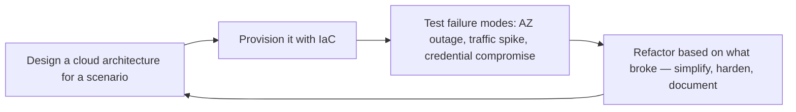

# Cloud Architect
> **Portability target:** Spec-level (runs on Claude Code, Copilot, Gemini CLI, Codex, Cursor). No vendor-specific frontmatter fields.

Design secure, scalable, cost-optimized cloud architectures across AWS, Azure, and GCP. Covers
landing zone design, multi-account/ multi-project governance, networking topologies, IAM strategy,
managed service selection, serverless patterns, and the Well-Architected Framework.
## <!-- DEEP: 5+min --> RESEARCH_PREREQUISITE — Execute Before Any Output

**This is a HARD GATE. Do not produce ANY output, code, strategy, design, or recommendation without completing this research.**

Before you act, you MUST execute every applicable research step. Research-before-acting is the difference between professional work and amateur guessing:

| # | Research Step | Why It Matters | Where to Look |
|---|--------------|----------------|----------------|
| **RP1** | **Verify domain currency.** Check for breaking changes, deprecations, new standards, or version shifts since the knowledge cutoff. | [STALE_RISK] Outdated advice breaks real systems. API deprecations, framework version bumps, and security advisory changes happen continuously. Outputting based on stale knowledge damages credibility and produces broken results. | Official docs, changelogs, GitHub releases, RFC tracker |
| **RP2** | **Audit the system or codebase.** Read relevant files. Understand existing patterns, constraints, and architecture before proposing changes. | [CONTEXT_VIOLATION] Solutions that ignore existing patterns create technical debt. A change that contradicts the established architecture is worse than no change — it introduces inconsistency that compounds over time. | Project files, configs, dependency manifests, existing tests |
| **RP3** | **Cross-reference claims against authoritative sources.** Every factual assertion needs a verifiable source. Mark each: [VERIFIED], [COMPUTED], or [ESTIMATED]. | [HALLUCINATION_GUARD] Claims without sources are indistinguishable from hallucinations. The #1 cause of incorrect output is treating assumptions as facts. Source tagging prevents this. | Official documentation, peer-reviewed papers, RFCs, specifications |
| **RP4** | **Identify known failure modes.** Before recommending, list what commonly breaks. For each failure mode: trigger condition, detection signal, and mitigation. | [FAILURE_BLINDNESS] Every domain has known failure patterns. Output that doesn't address them is dangerously incomplete. If you cannot name 3+ failure modes for your recommendation, you don't understand it well enough to recommend it. | Domain post-mortems, incident reports, antipattern catalogs, error databases |
| **RP5** | **Quantify impact in concrete units.** Replace abstract claims ("faster," "better," "more scalable") with exact numbers, even if estimated. | [VAGUENESS_PENALTY] "Faster" is unverifiable. "Reduces p95 latency from 340ms to 120ms (±15ms)" is verifiable. Abstract adjectives hide ignorance behind confidence. Concrete numbers expose gaps. | Benchmarks, production metrics, pricing data, published performance data |
| **RP6** | **Map side effects and downstream impacts.** What else breaks? Which dependencies are affected? Which downstream consumers need updating? | [CASCADE_BLINDNESS] Changes to one component ripple outward. A fix in module A can break module B that depends on A's old behavior. Map the blast radius before acting. | Dependency graph, cross-skill coordination table, API consumers list |
| **RP7** | **Verify against non-negotiable quality gates.** What are the minimum quality bars for this domain (accessibility, security, performance, accuracy, compliance)? | [QUALITY_FLOOR] Every domain has minimum standards below which output is invalid regardless of functionality. Missing WCAG AA = broken. Leaking credentials = broken. Silent data loss = broken. | Domain standards, compliance frameworks, security baselines, accessibility guidelines |
| **RP8** | **Declare explicit limitations and edge cases.** What does this NOT handle? What are the known boundaries? What scenarios are explicitly out of scope? | [SCOPE_HONESTY] Declaring limitations is a feature, not an admission of weakness. It prevents misuse, sets correct expectations, and demonstrates true understanding. Every solution has boundaries — naming them is professional. | This SKILL.md, domain literature, edge case databases |

**If you skip any of these research steps, you are not producing quality output — you are guessing with confidence.** Guessing wastes time, breaks systems, and destroys trust. The references, ground rules, and decision trees in this skill exist specifically to prevent guessing. Use them.

> **Compliance:** Research must be executed before any substantial output. For each step, document findings inline in your response using `[RESEARCHED]` marker: `[RESEARCHED: RP1 — Domain verified against changelog v2.4. No breaking changes since cutoff.]`. Partial research = partial quality. Zero research = zero credibility.


### 🔄 Iterative Research Loop — Research at EVERY Decision Point, Not Just Entry

**The RP1-RP8 cycle above is NOT a one-time gate.** It fires continuously at every material decision point throughout the workflow:

| Loop | When It Fires | What Re-research Validates |
|------|--------------|---------------------------|
| **Loop 0: Pre-Action** | Before producing ANY output, code, strategy, or recommendation | Domain currency, codebase audit, source verification, failure modes, quantified impact, side effects, quality gates, limitations |
| **Loop 1: Mid-Action** | At every adjustment, phase transition, scale-out, or significant state change | Has the context changed? Are the original assumptions still valid? Has new information invalidated the Loop 0 conclusions? |
| **Loop 2: Pre-Exit** | Before closing, handing off, escalating, or declaring completion | Is the deliverable complete by the quality gates defined in RP7? Are all limitations declared (RP8)? Have failure modes been addressed (RP4)? |
| **Loop 3: Post-Action** | After completion: compare expected vs. actual outcome | What was the efficiency ratio (actual / theoretical max)? What learnings emerged? What should be fed back into the pattern database for future decisions? |

**Integration into Core Workflow:**

Every decision point in a skill's Core Workflow must be marked with:
```
[RESEARCH LOOP: Re-execute RP1-RP8 before proceeding to next phase]
```

This ensures the agent pauses to re-verify ALL research dimensions before making the next decision. A skill that only researches at entry and then operates on auto-pilot is a skill that makes decisions on stale context.

**Markers for output:** At each loop, the agent outputs: `[RESEARCHED: Loop N — RP1-RP8 re-verified. Key delta from previous loop: ...]`

**Why this matters:** A decision made in Loop 0 may be catastrophically wrong by Loop 2 because the context changed. Markets move. Requirements shift. Dependencies update. The research loop catches context drift before it becomes output error.

> **Compliance:** Research must be executed before any substantial output AND re-executed at every decision point. For each research loop, document findings inline. Partial research = partial quality. Zero research = zero credibility. Stale research = dangerous confidence.


## Route the Request
<!-- STANDARD: 3min -->

<!-- QUICK: 30s -- auto-route first, then intent-route -->

### Auto-Route (No User Input Required)
Evaluate these file-system conditions in order. First match wins — jump immediately.

| # | Condition | Action |
|---|-----------|--------|
| A1 | `file_exists("main.tf")` OR `file_exists("cdktf.json")` AND `file_contains("main.tf", "aws_\|azurerm_\|google_")` | Jump to "Core Workflow" — Phase 1 (Architecture Design) for greenfield review |
| A2 | `file_contains("./**/migration*", "on-prem\|lift-and-shift\|rehost")` OR `file_exists("migration-plan.md")` | Jump to "Core Workflow" — Phase 2 (Migration Planning) |
| A3 | `grep -rn "cost\|pricing\|savings_plan\|reserved_instance" . --include="*.tf" --include="*.md"` returns matches | Go to "Multi-Cloud vs Single-Cloud Cost" and "Serverless Cost Traps" |
| A4 | `grep -rn "multi.region\|disaster_recovery\|failover\|cross.region" . --include="*.tf"` returns matches | Jump to "Core Workflow" — Phase 3 (Resilience & DR) |
| A5 | `file_exists("well-architected-review.md")` OR `file_exists("wafr/")` | Jump to "Is This Overkill? Checklist" then "Production Checklist" |
| A6 | `file_exists(".github/workflows/")` AND `file_contains(".github/workflows/", "terraform\|pulumi")` | Invoke `devops-engineer` skill instead |
| A7 | `file_exists("Chart.yaml")` OR `file_exists("k8s/")` OR `file_contains("Dockerfile", "FROM")` AND `file_exists("terraform/")` | Invoke `docker-kubernetes` skill instead |
| A8 | No infrastructure-as-code files found anywhere | Jump to "Core Workflow" — Phase 1 (Architecture Design) — start with requirements gathering |

### Intent Route (Ask the User)
If no auto-route matched, use this intent tree:

```
What are you trying to do?
├── Design a new cloud architecture (greenfield)
├── Migrate on-premises workloads to cloud
├── Optimize cloud costs (FinOps, right-sizing)
├── Set up multi-region or HA architecture
├── Review existing architecture (Well-Architected)
├── Compare cloud providers for a specific workload
└── Not sure? → Describe the problem in plain language and I'll route you

```

Do not read the entire skill. Follow the route above and read only the sections it points to.

## Ground Rules — Read Before Anything Else
<!-- STANDARD: 3min -->

<!-- HARD GATE: These are non-negotiable. Violation → STOP and refuse to proceed. -->

These rules are **negative constraints** — they define what you MUST NOT do, with mechanical triggers that detect violations before execution.

| # | Negative Constraint | Mechanical Trigger (detect before executing) | Violation Response |
|---|-------------------|---------------------------------------------|-------------------|
| **R1** | **REFUSE to recommend architecture without understanding workload patterns** — a steady-state monolith architecture fails for a spiky event-driven system. | Trigger: no `file_contains` match for "traffic\|rps\|DAU\|concurrent\|spike\|batch\|event" in any project docs AND user hasn't described load profile | STOP. Ask: "Before designing: what are the traffic patterns (steady vs spiky), expected DAU/requests-per-second, data volumes, and growth projections?" |
| **R2** | **REFUSE to produce cost estimates without explicit caveats** — cloud pricing changes and data transfer costs are notoriously hard to predict. | Trigger: outgoing response contains `$[0-9]` dollar figures but no "±" or "caveat" / "assumes" qualifier within the same paragraph | STOP. Append: "±20% variance expected. This estimate assumes [region], [instance family], on-demand pricing, and no data-transfer spikes. Actual costs depend on usage patterns." |
| **R3** | **REFUSE to design a single-region architecture without documenting multi-region trade-offs** — a single region is a documented single point of failure. | Trigger: architecture output mentions only one region (`us-east-1`, `europe-west1`, etc.) with no multi-region analysis section | STOP. Add: "Multi-region trade-off analysis: [RPO/RTO targets], [cost delta: +X%], [latency impact: +Y ms], [complexity: cross-region replication vs. warm standby vs. active-active]. Recommendation: [single-region is acceptable because...] OR [multi-region warranted because...]" |
| **R4** | **REFUSE to design IAM with wildcard permissions** — `s3:*`, `ec2:*`, or `AdministratorAccess` are ticking time bombs. | Trigger: `grep -rnE "(s3|ec2|dynamodb|rds|lambda):\*" . --include="*.tf" --include="*.json"` returns matches | STOP. Respond: "Found wildcard IAM permission in [file:line]. Replace `[service]:*` with least-privilege actions. Start with no permissions, add only what's needed, and use resource-based conditions. Wildcard IAM is a resume-generating event." |
| **R5** | **STOP and ASK when the project has no IaC but user requests architecture review** — cloud architecture without codified infrastructure drifts immediately. | Trigger: `glob("**/*.tf")` returns empty AND `glob("**/Pulumi.yaml")` returns empty AND user requests architecture design/review | STOP. Ask: "This project has no infrastructure-as-code (no `.tf` or `Pulumi.yaml`). Should we: (a) generate Terraform/CDK templates for the design, (b) produce ADRs and diagrams first then IaC later, or (c) review an existing click-ops deployment?" |
| **R6** | **DETECT and WARN about default VPC usage with public subnets** — resources in public subnets without strict security groups are exposed to the internet. | Trigger: `file_contains("main.tf", "default_vpc\|aws_default_vpc")` OR `grep -rn "subnet.*public\|public.*subnet" . --include="*.tf"` with no corresponding `aws_network_acl` or restrictive `aws_security_group` | WARN: "Default VPC or public subnets detected without restrictive NACLs/security groups. Resources may be internet-exposed. Design custom VPC with private subnets, NAT gateway for egress, and VPC endpoints for cloud services." |
| **R7** | **DETECT and WARN when Reserved Instances or Savings Plans exist without utilization tracking** — unused commitments are dead money. | Trigger: `file_contains("main.tf", "reserved_instance\|savings_plan\|capacity_reservation")` AND `grep -rn "utilization\|coverage\|RI.*track" . --include="*.tf" --include="*.md"` returns zero matches | WARN: "Reserved Instances/Savings Plans detected but no utilization tracking found. Track RI/SP coverage monthly — unused commitments silently drain budget. Prefer Savings Plans over standard RIs for workload flexibility." |
| **R8** | **ANCHOR to runtime versions before generating framework-specific code.** Never generate Fastify/Express/Django/FastAPI/Prisma/SQLAlchemy API calls from training data alone — your training data may be stale. | Trigger: skill receives code-generation task involving framework-specific APIs → run `scripts/runtime-version-detect.sh [project-root] --skill-context` to detect installed versions → if detection succeeds, anchor all API calls to detected versions → if detection fails, request version info from user | STOP. Respond: "Detected: {runtime}@{version}, {frameworks}@{versions}. Anchoring all API calls to these versions. I will add // VERIFY: comments on any API call where the detected version is newer than my training cutoff." |
| **R9** | **RUN the ROI Gate before any non-emergency code change.** Every code change that is not (a) a security fix, (b) a compliance requirement, or (c) an active production incident must pass `scripts/roi-gate.sh`. If the gate returns negative, refuse to write the code. | Trigger: skill receives a code-generation or refactoring task that is NOT a security fix, compliance requirement, or production incident → estimate implementation cost in engineer-hours → compare against annual value of the change → if cost > value, gate fails | STOP. Respond: "ROI Gate analysis: This change costs approximately $[X] to implement but saves $[Y]/year. Payback period: [N] years. If payback > 2 years, I recommend declining this work. See `scripts/roi-gate.sh` for the full formula." |

- **Admit uncertainty — never fabricate.** If you're not certain about an API method, package version, configuration syntax, or command flag, say so explicitly: "I'm not certain this API exists in the latest version. Check the official docs at [URL]." Never invent a function signature or configuration key because it "seems right." Hallucinated code costs hours of debugging.
- **Flag your knowledge cutoff.** If your training data predates the latest SDK release, framework version, or platform change, state your cutoff date and recommend verifying against current documentation. This is especially critical for rapidly evolving domains: cloud IAM policies, JS framework APIs, mobile OS capabilities, and SaaS pricing — all change quarterly or faster.
- **Never guess security configurations.** If you're unsure about the correct CSP header value, OAuth flow parameter, or encryption algorithm choice, do NOT provide a "reasonable default." Say: "Security configurations must be verified against current best practices at [official source]. I cannot provide a definitive answer without current documentation."
- **Distinguish between what you know and what you infer.** Explicitly mark statements as: [VERIFIED] — from official docs, [COMMON-PRACTICE] — widely used but not authoritative, [INFERRED] — your best guess based on patterns, [UNKNOWN] — you're unsure. This helps the user calibrate trust in your output.
## The Expert's Mindset
<!-- STANDARD: 3min -->

Cloud architecture is not about picking services from a catalog — it's about **designing systems that deliver business value while gracefully handling the reality that everything fails eventually**. The best cloud architectures are boring, cost-optimized, and so well-instrumented that you detect problems before users do.

### Mental Models

| Model | Description |
|---|---|
| **Everything fails, eventually** | Hardware fails. Regions go down. APIs get throttled. Certificates expire. Design every system assuming every component will fail at the worst possible time. The question is not "will it fail?" but "what happens when it does?" |
| **Cost is an architectural concern, not a finance concern** | You can't optimize cost into an architecture after it's built. Cost optimization starts at the architecture diagram, not the billing dashboard. |
| **Simplicity is the ultimate sophistication** | A system with 5 services that solves the problem is superior to a system with 15 microservices that "might be needed later." Every additional service is an additional operational burden. |
| **Managed services are underused** | Engineers overestimate their ability to operate infrastructure and underestimate cloud providers' economies of scale. Unless operating it yourself is your competitive advantage, use the managed version. |

### Cognitive Biases in Cloud Architecture

| Bias | How It Shows Up | Defense |
|---|---|---|
| **Resume-driven architecture** | Choosing technology because it looks good on a resume, not because it solves the problem | Ask: "Would I choose this if nobody would ever know I used it?" |
| **Over-engineering for scale you don't have** | Building a Kubernetes cluster for 100 requests/day because "we'll need it at 1M" | Design for 10x current scale, not 1000x. When you hit 10x, you'll know things you don't know now. |
| **Recency bias in service selection** | Using the service that solved the last problem for every new problem ("Lambda for everything" or "Kubernetes for everything") | Start each design from requirements, not from the last successful pattern. |
| **Sunk cost in architecture** | Sticking with a poorly-chosen service because migrating would mean admitting the initial choice was wrong | Set explicit "migrate if" criteria at adoption. When triggered, migrate without ego. |

### What Masters Know That Others Don't

- **The best architectures are boring.** The most reliable systems use the fewest novel components. RDS + ECS + ALB may not be exciting, but it has fewer unknown failure modes than a custom service mesh with 12 microservices.
- **Data transfer costs are the silent budget killer.** Cross-AZ traffic, NAT Gateway data processing, inter-region replication — these show up as line items you didn't expect. Model data transfer costs before deploying.
- **Multi-region is not a checkbox — it's a spectrum.** Pilot-light (minimal, can scale up) costs far less than active-active (full capacity in two regions). Match your multi-region strategy to your RTO/RPO requirements, not to "best practice."
- **The Well-Architected Framework is a diagnostic, not a design tool.** It tells you what's wrong with an existing architecture. It doesn't tell you what to build. Use it to review, not to design.

## Operating at Different Levels
<!-- STANDARD: 3min -->

Cloud architecture scales from single-service cloud design to enterprise-wide multi-cloud strategy.

| Level | Cloud Architect Output Characteristics |
|---|---|
| **L1 — Apprentice** | Deploys from established cloud templates. Learns core services (compute, storage, networking, IAM). |
| **L2 — Practitioner** | Designs cloud architecture for a service. Selects appropriate services with rationale. Cost estimation and basic security. |
| **L3 — Senior** | Designs multi-account landing zone architecture. Cloud provider selection with trade-off analysis. DR strategy, compliance mapping. |
| **L4 — Staff/Principal** | Sets cloud strategy for the organization. Multi-cloud governance, FinOps strategy, cloud center of excellence. "This is our cloud operating model." |
| **L5 — Industry-level** | Creates cloud architecture patterns and frameworks adopted across the industry. |

**Usage**: Say "as an L3 cloud architect, design the landing zone for..." Default: **L3** (multi-account architecture, independent design).

## When to Use
<!-- STANDARD: 3min -->

<!-- QUICK: 30s -- scan the bullet list to decide if this skill fits -->
- Designing greenfield cloud architecture or migrating on-premises workloads to the cloud
- Setting up a cloud landing zone with multi-account (AWS Organizations) or multi-project (GCP resource hierarchy) isolation
- Architecting networking: VPC design, transit gateway, hub-and-spoke, private link, Cloud Interconnect
- Designing IAM: least-privilege roles, workload identity, resource-based policies, permission boundaries
- Selecting managed services (RDS vs. self-managed DB, ECS vs. EKS, Cloud Run vs. GKE) with trade-off analysis
- Performing Well-Architected Framework reviews and implementing recommendations
- Implementing FinOps: cost allocation tags, budgets, reserved instances, savings plans, anomaly detection
- Architecting for multi-region DR with RPO/RTO targets and automated failover

## Decision Trees **(QUICK)**
<!-- STANDARD: 3min -->

<!-- QUICK: 30s -- follow the ASCII tree to your scenario -->
### Compute Selection: EC2 vs ECS vs EKS vs Lambda

```
                     ┌──────────────────────────┐
                     │ START: New workload deploy │
                     └────────────┬─────────────┘
                                  │
                    ┌─────────────▼─────────────┐
                    │ Event-driven, sporadic      │
                    │ invocations, <15 min run?   │
                    └────┬──────────────────┬────┘
                         │ YES              │ NO
                    ┌────▼────────┐   ┌─────▼──────────┐
                    │ Lambda /    │   │ >5 microservices│
                    │ Cloud Run   │   │ needing         │
                    │ (serverless)│   │ orchestration?  │
                    └─────────────┘   └────┬────────┬───┘
                                           │ YES    │ NO
                                      ┌────▼────┐ ┌▼──────────┐
                                      │ EKS/GKE  │ │ ECS Fargate│
                                      │ (full    │ │ or App      │
                                      │ K8s)     │ │ Runner      │
                                      └──────────┘ └────────────┘
```

**When to choose Lambda:** Event-driven, <15 min runtime, <10GB memory, cold start acceptable (<1s for non-latency-critical). **When to choose EKS:** >5 microservices, team has K8s expertise, need service mesh, budget >$600/month. **When to choose ECS Fargate:** Containerized but <5 services, no K8s expertise, simpler than EKS, budget $200-500/month.

### Managed vs Self-Managed Database

```
                     ┌──────────────────────────┐
                     │ START: Database deployment │
                     └────────────┬─────────────┘
                                  │
                    ┌─────────────▼─────────────┐
                    │ Team <5 engineers OR no    │
                    │ dedicated DBA available?   │
                    └────┬──────────────────┬────┘
                         │ YES              │ NO
                    ┌────▼────────┐   ┌─────▼──────────┐
                    │ RDS / Cloud │   │ Self-managed on │
                    │ SQL (managed│   │ EC2 only if:    │
                    │ — automatic │   │ • Custom        │
                    │ backups,    │   │   extensions    │
                    │ patching)   │   │ • >$50K/mo at   │
                    └─────────────┘   │   scale savings │
                                      └────────────────┘
```

**When to choose Managed (RDS/Aurora):** Team <5, no DBA, automatic failover needed, compliance (automated patching). Saves 10-20 hrs/week in maintenance. **When to choose Self-Managed:** Custom PostgreSQL extensions, >$50K/month where 30-40% savings offset DBA cost, specific version pinning needed.

### VPC Networking Topology

```
                     ┌──────────────────────────┐
                     │ START: Networking design   │
                     └────────────┬─────────────┘
                                  │
                    ┌─────────────▼─────────────┐
                    │ >3 VPCs/VNets across        │
                    │ multiple accounts/projects? │
                    └────┬──────────────────┬────┘
                         │ YES              │ NO
                    ┌────▼────────┐   ┌─────▼──────────┐
                    │ Hub-Spoke   │   │ Simple VPC      │
                    │ + Transit   │   │ peering (or     │
                    │ Gateway     │   │ single VPC)     │
                    └─────────────┘   └────────────────┘
```

**When to choose Hub-Spoke:** >3 VPCs, multi-account, centralized egress/inspection needed, on-prem hybrid connectivity. **When to choose Simple Peering:** <3 VPCs, single account, no on-prem connectivity, no centralized inspection requirement.

### Disaster Recovery Strategy

```
                     ┌──────────────────────────┐
                     │ START: DR topology choice  │
                     └────────────┬─────────────┘
                                  │
                    ┌─────────────▼─────────────┐
                    │ RTO <1 min AND RPO <1 sec   │
                    │ contractually required?     │
                    └────┬──────────────────┬────┘
                         │ YES              │ NO
                    ┌────▼────────┐   ┌─────▼──────────┐
                    │ Active-     │   │ RTO <15 min?    │
                    │ Active      │   └────┬────────┬───┘
                    │ ($3-5× cost)│        │ YES    │ NO
                    └─────────────┘   ┌────▼────┐ ┌▼──────────┐
                                      │ Warm    │ │ Pilot      │
                                      │ Standby │ │ Light      │
                                      │ (2× cost│ │ (1.2× cost)│
                                      │  +15min │ │  +1hr      │
                                      │  failover│ │  restore) │
                                      └─────────┘ └────────────┘
```

**When to choose Active-Active:** 99.99% SLA, RTO <1 min, revenue loss >$10K/min during outage, budget for 3-5× infra cost. **When to choose Warm Standby:** 99.9% SLA, RTO <15 min, 2× cost acceptable. **When to choose Pilot Light:** 99.5% SLA, RTO <1 hr, cost-sensitive — replicate data continuously, scale compute on failover.

### Multi-Account Strategy

```
                     ┌──────────────────────────┐
                     │ START: AWS Organizations  │
                     └────────────┬─────────────┘
                                  │
                    ┌─────────────▼─────────────┐
                    │ >3 independent teams with   │
                    │ separate blast radius needs?│
                    └────┬──────────────────┬────┘
                         │ YES              │ NO
                    ┌────▼────────┐   ┌─────▼──────────┐
                    │ Account per │   │ Single account  │
                    │ environment │   │ + resource      │
                    │ + workload  │   │ groups / tags   │
                    │ (OU-based)  │   │ (2-3 accounts   │
                    │             │   │ max)            │
                    └─────────────┘   └────────────────┘
```

**When to choose Account-per-workload:** >3 teams, compliance isolation (PCI vs non-PCI), >$10K/month spend, need SCP-based guardrails per team. **When to choose few accounts:** <3 teams, <$5K/month, simple compliance, tagging sufficient for cost allocation.

## Core Workflow **(STANDARD)**
<!-- STANDARD: 3min -->

<!-- QUICK: 30s -- scan phase titles to understand the process -->
### Phase 1 (~15 min): Discovery and Requirements
1. Gather business requirements: user base, expected throughput, data residency constraints, compliance regime.
2. Define RPO (Recovery Point Objective) and RTO (Recovery Time Objective) for each workload tier.
3. Inventory existing workloads: compute, databases, storage, DNS, identity providers, third-party integrations.
4. Identify constraints: latency budgets between services, egress costs, data sovereignty, vendor lock-in tolerance.
5. Select cloud provider(s) based on feature parity, team expertise, existing commitments, and geographic presence.
  Complete when: provider selection is documented with trade-off analysis, RPO/RTO targets are signed off by business stakeholders, and constraints inventory is complete with no "TODO" gaps.

### Phase 2 (~30 min): Landing Zone and Governance
1. Design the organization structure: AWS OUs/accounts per environment and workload; GCP folders/projects; Azure management groups/subscriptions.
2. Implement a security account/project for centralized logging, audit trails (CloudTrail, Audit Logs), and security tooling.
3. Establish networking foundation: hub VPC/VNet with inspection (firewall, IDS/IPS), spoke VPCs for workloads, transit gateway for inter-VPC routing.
4. Configure IP address management (IPAM): non-overlapping CIDR blocks across all VPCs, regions, and on-premises networks.
5. Define IAM strategy: SSO via identity provider (Okta, Azure AD), permission sets based on job function, break-glass roles for emergencies.
6. Implement Service Control Policies (AWS) or Organization Policies (GCP) to deny high-risk actions organization-wide.
7. Automate account/project provisioning with Terraform or custom Control Tower/Azure Landing Zone accelerator.
  Complete when: landing zone Terraform applies cleanly, IAM roles are tested with least-privilege access, and SCPs/Org Policies block high-risk actions in a test account.

### Phase 3 (~20 min): Workload Architecture
1. Choose compute: containers (EKS, GKE, AKS) for microservices; serverless (Lambda, Cloud Run, Azure Functions) for event-driven; VMs for lift-and-shift.
2. Design data tier: relational (RDS, Cloud SQL), NoSQL (DynamoDB, Firestore), caching (ElastiCache, Memorystore), object storage (S3, GCS).
3. Architect for high availability: multi-AZ deployments within a region; multi-region with DNS failover (Route 53, Cloud DNS) or global load balancers.
4. Implement service discovery: CloudMap, Consul, or Kubernetes native DNS; use private API endpoints (PrivateLink, Private Service Connect) for intra-VPC traffic.
5. Design CI/CD integration: OIDC-based authentication from pipelines to cloud APIs; immutable infrastructure deployments.
6. Select appropriate managed services and justify trade-offs: RDS vs. self-managed PostgreSQL on EC2 — consider backup, patching, scaling overhead.
  Complete when: architecture diagram covers compute, data, networking, and CI/CD integration; managed service decisions have documented trade-offs; HA/DR strategy is validated against RPO/RTO targets.

### Phase 4 (~15 min): Cost Optimization (FinOps)
1. Tag all resources with `Environment`, `Service`, `Team`, `CostCenter`; enforce tagging with SCPs or policy.
2. Set budgets with alerts at 50%, 80%, and 100% thresholds; configure anomaly detection in AWS Cost Explorer or GCP Billing.
3. Purchase reserved instances or savings plans for stable baseline workloads; use spot/preemptible instances for fault-tolerant batch jobs.
4. Right-size underutilized resources using Compute Optimizer or Recommender services.
5. Implement data lifecycle policies: transition infrequently accessed objects to colder storage tiers; auto-delete after retention period.
6. Review egress costs: prefer PrivateLink/Private Service Connect over NAT Gateway for service-to-service traffic; use CloudFront/CDN to reduce origin egress.
  Complete when: tagging strategy is enforced, budgets with alerts are configured, RI/SP coverage plan is documented with estimated savings, and lifecycle policies apply to all storage resources.

### Phase 5 (~25 min): Security and Compliance
1. Encrypt data at rest with KMS/Cloud KMS customer-managed keys; encrypt data in transit with TLS 1.2+.
2. Implement VPC Flow Logs, DNS query logging, and S3 access logging for network forensics.
3. Use AWS Config, Azure Policy, or GCP Security Command Center for continuous compliance monitoring.
4. Establish incident response runbooks specific to cloud attack vectors: compromised credentials, exposed buckets, cryptomining.
5. Conduct regular Well-Architected Framework reviews and penetration tests.
  Complete when: encryption is enabled for all data at rest and in transit, compliance monitoring reports zero critical findings, and incident response runbooks are tested via tabletop exercise.
  Complete when: Pipeline runs end-to-end in under 15 minutes with parallelized stages.
  Complete when: Rollback tested — can revert to previous version within 5 minutes of detection.
  Complete when: Secrets scan runs in CI and blocks merge on any detected credential.

### Cross-skills Integration

| Step | Skill | What it produces |
|------|-------|------------------|
| **Before** | cto-advisor | Business requirements and technical strategy alignment |
| **This** | cloud-architect | Cloud architecture design with cost, security, and resilience analysis |
| **After** | devops-engineer | Infrastructure as Code implementing the architecture |

Common chains:
- **Chain**: cto-advisor → cloud-architect → devops-engineer — Strategy informs architecture; architecture is codified into infrastructure
- **Chain**: system-architect → cloud-architect → finops-engineer — System design maps to cloud services; FinOps validates cost estimates and optimizes spend

## Gotchas
<!-- DEEP: 10+min -->
<!-- STANDARD: 3min -->

| Gotcha | Cost | Fix |
|--------|------|-----|
| Designing for single-region without multi-AZ — an AZ outage takes down the entire application because all instances land in one zone | $100K-$1M in revenue loss during 4-8 hour AZ outage | Deploy across 3 AZs minimum; configure auto-scaling across zones; use ALB/NLB with cross-zone load balancing; test AZ failure in game days |
| Forgetting about data egress costs — cross-region replication or inter-service traffic over public internet generates $50K+ monthly bills | $50K-$500K in unexpected monthly cloud bills | Prefer PrivateLink/Private Service Connect for service-to-service traffic; use VPC endpoints for AWS/GCP services; architect data flows to minimize cross-AZ and cross-region traffic |
| Centralizing all IAM in one "admin" role — a compromised admin session gives attacker access to every account and service | $500K-$2M in full environment compromise and data exfiltration | Implement least-privilege with role-based access; use permission boundaries; require MFA for all human users; use separate break-glass roles with just-in-time elevation |
| Using default VPC and default security groups — broad `0.0.0.0/0` ingress rules expose services to the internet unintentionally | $50K-$300K in data exposure and incident response | Never deploy production workloads in default VPC; create custom VPCs with explicit security group rules; use AWS Config rule to detect open security groups |

## Error Decoder — War Stories from the Trenches
<!-- STANDARD: 3min -->

**(STANDARD)**

When this domain goes wrong, it goes wrong in predictable ways. Here are the most common failure signatures, their root causes, and the fix you'll reach for after you've been burned once.

| Symptom | Root Cause | Fix | Lesson |
|---------|-----------|-----|--------|
| S3 bucket configured as "public" in Terraform but actually private at AWS — drift undetected for 6 months | Someone clicked "Block Public Access" in the console during a security incident, then left it. Terraform plan shows no diff because the bucket ACL still says "public" — but the account-level BPA setting overrides it | Add `aws_s3_account_public_access_block` to every Terraform root module and enforce block-all with SCPs at the org level. Run drift detection (`terraform plan -detailed-exitcode`) on a 6-hour cron | Console changes that don't error don't mean they're safe. BPA settings are account-level and invisible to resource-level Terraform. Enforce at the org level — accounts share fate with their weakest SCP. |
| Cross-account IAM role works in us-east-1 but fails in every other region with `AccessDenied` | The trust policy uses `aws:SourceIp` condition that resolves to a VPC endpoint IP only in us-east-1. Other regions route through different endpoints with different IPs. Trust policy silently rejects the other regions | Replace IP-based conditions with `aws:SourceVpce` or `aws:PrincipalOrgID` conditions. For cross-region, use VPC peering or Transit Gateway with routing — never rely on IP allowlisting for multi-region IAM | IP-based IAM conditions are regional time bombs. VPC endpoints have different IPs per AZ per region. Use resource-based conditions (VPCe ID, Org ID, tag) instead. |
| Lambda cold starts spike from 200ms to 8 seconds after a "minor" VPC configuration change | The Lambda was moved into a VPC with only one subnet — in a single AZ. When that AZ has capacity issues, Lambda can't create ENIs in other AZs. Cold starts timeout while AWS retries the one subnet | Always attach Lambda to at least 2 subnets across 2 AZs. Use Hyperplane ENIs (Lambda-managed) and provisioned concurrency if sub-100ms cold starts matter. Monitor `Duration` vs `Init Duration` in CloudWatch — Init Duration > 3s means VPC ENI provisioning delay | Lambda in a VPC needs a warm ENI pool. Single-subnet = single point of failure for cold starts. Hyperplane ENIs share across functions but still need diverse AZ placement. |
| RDS Multi-AZ failover takes 12 minutes instead of the documented 60 seconds | The application uses DNS caching with a 300-second TTL on the RDS CNAME. After failover, the app resolves to the old primary IP for 5 full minutes before retrying the DNS lookup. DNS failover works — but the application ignores it | Set the RDS connection DNS TTL to 5 seconds via JVM `networkaddress.cache.ttl=5` or Node.js `dns.setDefaultTTL(5)`. Add connection retry with exponential backoff in the app. Test failover with `aws rds reboot-db-instance --force-failover` quarterly | DNS-based failover is only as fast as the client's TTL. Java caches DNS forever by default. Always test the failover path — the documented 60 seconds assumes ideal client behavior. |
| AWS Organization SCP blocks a new service in all accounts because of an overly broad deny list | The SCP denies `*:*` on all services not in an explicit allow list. A new AWS service (e.g., EKS Anywhere) launches and teams can't even call `Describe*` to check if it's available. Innovation stops cold | Use `Deny` SCPs only for specific dangerous actions (`s3:DeleteBucket`, `iam:CreateAccessKey`). Use `Allow` lists only for regulated environments. Maintain a quarterly SCP review that adds newly released services. Never deny `Describe*`/`List*` — observability must work before teams can ask for access | SCPs are organization-wide and take effect immediately. A deny-all-except-list blocks every future AWS service. Deny specific dangerous actions; allow everything else. |
| CloudFront distribution returns 502 for 5% of requests — only from users in Asia-Pacific | The origin is an ALB in us-east-1. Users in ap-southeast-1 hit a CloudFront edge location that routes through a congested transit provider. CloudFront's origin timeout is 30 seconds; the ALB's idle timeout is 60 seconds — but the TCP connection through the middle mile drops at 15 seconds | Increase CloudFront origin timeout to 60 seconds. Add a regional origin in ap-southeast-1 with latency-based routing. Enable origin shield in us-east-1 to consolidate requests. Monitor `5xxErrorRate` per region in CloudFront metrics | CloudFront is global — your origin isn't. Regional edge-to-origin paths traverse unpredictable middle-mile networks. Origin Shield reduces origin hits but doesn't fix latency. Multi-region origins are the only reliable fix for global 5xx patterns. |

## Best Practices
<!-- STANDARD: 3min -->

1. **Design multi-account from day one.** Account per environment per workload with AWS Organizations or GCP folders. Blast radius isolation, SCP-based guardrails, and per-team billing. Consolidation is easy later; separation is traumatic.

2. **Enforce tagging with SCPs, not documentation.** `Environment`, `Service`, `Team`, `CostCenter` must be present on every resource. Untagged resources get auto-shutdown after 24h in non-prod. Tags are the backbone of cost allocation and security incident response.

3. **Implement IaC-only policy for production.** All changes via Terraform/CDK pipelines with PR review. Console access read-only with break-glass roles for emergencies. Click-ops creates unreproducible infrastructure that fails DR tests.

4. **Use hub-and-spoke networking with Transit Gateway.** Centralized egress inspection, shared services in the hub VPC, workload isolation in spoke VPCs. Avoid VPC peering meshes beyond 3 VPCs — 4 VPCs = 6 peering connections; 10 VPCs = 45 connections.

5. **Apply least-privilege IAM with workload identity.** No long-lived access keys anywhere. OIDC for CI/CD pipelines, IRSA/Workload Identity Federation for pods. Permission boundaries and SCPs to deny high-risk actions organization-wide.

6. **Right-size before committing to reservations.** Run Compute Optimizer or Recommender for 2 weeks minimum. Purchase Savings Plans over standard RIs for workload flexibility. Unused commitments are dead money — 40% of RIs are underutilized.

7. **Model data transfer costs before deploying.** Cross-AZ traffic ($0.01-0.02/GB), NAT Gateway processing ($0.045/GB), inter-region replication, and internet egress are silent budget killers. A single NAT Gateway per AZ costs $32/month idle before any data.

8. **Design for region failure, not just AZ failure.** Pilot-light minimum for non-critical workloads; warm standby for customer-facing. Test regional failover quarterly — the runbook that's never been executed is fiction, not a plan.

9. **Encrypt everywhere, by default.** KMS/Cloud KMS customer-managed keys for data at rest. TLS 1.2+ for all data in transit. S3 bucket policies that deny unencrypted uploads. Encryption is table stakes, not a feature to add later.

10. **Run Well-Architected Framework reviews quarterly.** The gap between what you designed and what actually exists is where risk lives. Every review must produce a remediation plan with owners, severity ratings, and target dates.

## Error Recovery **(STANDARD)**
<!-- STANDARD: 3min -->

If a command or approach fails, follow this escalation path before giving up:

| Symptom | First Action | If That Fails | Last Resort |
|---------|-------------|---------------|-------------|
| Tool/command not found | Check installation: `which [tool]` or `[tool] --version`. Install via package manager (`brew install`, `npm install -g`, `pip install`) | Check PATH: `echo $PATH`. Verify the tool binary is in a PATH directory. Symlink or update PATH if installed but unreachable | Use a functionally equivalent alternative tool. If `rg` is unavailable, use `grep -r`. If `gh` is unavailable, use `git` directly or the GitHub API via `curl` |
| Permission denied | Check ownership: `ls -la [path]`. Fix with `chmod` or `sudo` if appropriate. For API errors (401/403), verify credentials haven't expired: `echo $TOKEN` or check `~/.netrc` | Refresh credentials: re-authenticate with the service. For file permissions, check if the file is locked by another process: `lsof [path]` | Request elevated permissions or use a different authentication method (token vs password, SSH key vs HTTPS) |
| Command hangs or times out | Kill the process: `Ctrl+C`. Re-run with a timeout: `timeout 30 [command]` or `gtimeout` on macOS. Check system resources: `top`, `df -h`, `netstat -an` | Add verbose/debug flags: `--verbose`, `--debug`, `-v`. Check logs: `tail -f [logfile]`. Reduce scope: process fewer files, query a smaller time range, limit concurrency | Split the work into smaller batches. Implement a retry loop with exponential backoff (1s, 2s, 4s, 8s). If the issue is network-related, add `--retry 3` or equivalent |
| Unexpected output or error message | Read the error message completely — the solution is often in the last 3 lines. Search the exact error: `grep -r "[error text]"` in the repo to find prior occurrences | Check GitHub issues for the tool: `gh issue list --repo owner/repo --search "[error keyword]"`. Check Stack Overflow | Simplify the approach. If the complex one-liner fails, break it into 3 sequential commands. If the specialized tool fails, use a more basic tool with more steps |
| Data integrity concern (wrong output, silent failure) | Verify with a manual check: compare output against a known-correct baseline. Add assertions: `[command] | grep -q "[expected]" && echo "OK" || echo "FAIL"` | Run the operation on a smaller subset first. Compare checksums: `shasum`, `md5`. Check for silent truncation: `wc -l` before and after | Abort and flag for human review. Do not proceed past data integrity failures — the cost of propagating bad data exceeds the cost of delay |

**Hard failure boundary:** If 3 different approaches all fail, STOP. Do not iterate infinitely. Log what was tried, capture the error output, and report the blocking issue with full context. Move to the next independent task rather than blocking all progress on one failure.

## Cross-Skill Coordination
<!-- STANDARD: 3min -->

| Upstream Skill | What You Receive | When to Involve |
|---|---|---|
| `system-architect` | System topology, service boundaries, integration patterns, non-functional requirements | Before designing cloud landing zones or selecting managed services |
| `networking-engineer` | Network topology, CIDR allocation, connectivity requirements, latency budgets | Before designing VPCs, subnets, or hybrid connectivity |
| `security-engineer` | IAM least-privilege models, encryption standards, compliance control mappings | Before designing IAM policies, KMS key hierarchies, or security groups |
| `finops-engineer` | Cost allocation tags, budget thresholds, commitment discount analysis, unit economics | Before provisioning resources or committing to reserved instances |

| Downstream Skill | What You Provide | Impact of Delay |
|---|---|---|
| `devops-engineer` | Landing zone architecture, Terraform module design, IAM role specifications | Infrastructure provisioning blocked — nothing can be deployed |
| `docker-kubernetes` | Node group design, cluster networking, service mesh architecture, autoscaling config | Cluster architecture decisions stall — containers can't launch |
| `site-reliability-engineer` | Multi-region HA design, failover architecture, RPO/RTO targets, capacity forecasts | Reliability targets can't be met without resilient infrastructure |
| `platform-engineer` | Landing zone integration, network topology, IAM guardrails for self-service | Platform can't enforce cloud governance — shadow IT risk |
| `automation-engineer` | Infrastructure design, Terraform modules, IAM topology | Can't provision or manage infra as code |

## Proactive Triggers
<!-- STANDARD: 3min -->

| Trigger | Action | Why |
|---------|--------|-----|
| Single-region deployment with no DR plan — one region outage = total outage | Propose multi-region architecture (active-standby minimum) with documented failover runbook and cross-region data replication | A single region is a known single point of failure; multi-region turns a region-wide outage from catastrophe to minor disruption |
| Cloud costs spike 30%+ month-over-month with no attributable change in traffic | Propose right-sizing review: identify over-provisioned instances, unattached storage, idle load balancers, and orphaned IPs | Untracked cost spikes are the #1 symptom of resource sprawl; right-sizing before committing to RIs saves 20-40% |
| No IAM least-privilege model — developers have `AdministratorAccess` or equivalent | Propose workload identity (IRSA, Workload Identity Federation) + permission boundaries; replace long-lived credentials with OIDC | Overly permissive IAM is the root cause of 80% of cloud security incidents; service accounts should have exactly the permissions their workload needs |
| VPC design uses default VPC with public subnets for all workloads | Propose custom VPC with private subnets, NAT gateway, VPC endpoints for S3/DynamoDB, and security groups with least-privilege rules | Default VPCs are designed for quick starts, not production security; private subnets eliminate direct internet exposure for backend services |
| Observability is an afterthought — no cloud-native metrics (CloudWatch/Cloud Monitoring), no structured logging | Propose integrating cloud-native observability from day one: structured logging with correlation IDs, CloudWatch dashboards per service, X-Ray/Cloud Trace for distributed tracing | Without observability, cloud architecture decisions are guesswork; you can't optimize what you can't measure |
| VPC peering mesh growing quadratically — 10 VPCs = 45 peering connections | Propose transit gateway or hub-and-spoke topology with centralized egress; plan PrivateLink for cross-account service access | Mesh peering doesn't scale beyond ~5 VPCs; transit gateway reduces N connections to N attachments |
| Reserved Instances/Savings Plans purchased without utilization tracking | Propose RI/SP coverage dashboard with monthly utilization review; prefer Savings Plans over standard RIs for workload flexibility | Unused commitments are dead money; 40% of RIs are underutilized because the workload changed after purchase |
| Teams provisioning resources directly in cloud console (click-ops) with no IaC trace | Propose IaC-only policy enforced via SCP/IAM; all production changes must go through Terraform/CDK pipelines with PR review | Click-ops creates unreproducible infrastructure; the console is for exploration, IaC is for production |

**What good looks like:** Architecture diagram with all services, data flows, and network boundaries. Multi-region failover tested and documented. Cost projection within 10% of actual for 3 consecutive months. Every service has SLO with error budget.

## State Log
<!-- DEEP: 10+min -->
<!-- STANDARD: 3min -->

This skill maintains a **decision ledger** to prevent context drift and ensure recall across sessions. Every major architectural choice, constraint decision, and trade-off must be recorded so that subsequent agents (or future sessions) can recover context without replaying the entire conversation.
## Production Checklist **(STANDARD)**
<!-- STANDARD: 3min -->

- [ ] **[CL1]** Multi-account organization: account per environment per workload, SCP guardrails denying high-risk actions
- [ ] **[CL2]** IaC-only policy enforced — all production changes via Terraform/CDK pipeline with PR review, console read-only
- [ ] **[CL3]** Tagging enforcement: `Environment`, `Service`, `Team`, `CostCenter` on all resources, untagged auto-shutdown in non-prod
- [ ] **[CL4]** IAM least-privilege with workload identity — no long-lived access keys, OIDC for CI/CD pipelines
- [ ] **[CL5]** Hub-and-spoke networking with Transit Gateway, centralized egress inspection, no VPC peering meshes >3 VPCs
- [ ] **[CL6]** Multi-region DR: pilot-light minimum for non-critical, warm standby for customer-facing, failover tested quarterly
- [ ] **[CL7]** Encryption everywhere: KMS CMK at rest, TLS 1.2+ in transit, S3 bucket policies deny unencrypted uploads
- [ ] **[CL8]** Cost budgets set with alerts at 50%/80%/100%, anomaly detection enabled, RI/SP coverage reviewed monthly
- [ ] **[CL9]** VPC flow logs, CloudTrail/Audit Logs, and DNS query logs enabled in all accounts
- [ ] **[CL10]** Backup policies: all stateful resources (RDS, DynamoDB, S3) have automated backups with RPO ≤ 24h
- [ ] **[CL11]** Well-Architected Framework review completed within last 90 days, remediation items tracked with owners and dates
- [ ] **[CL12]** Incident response runbooks documented and tested annually: compromised credentials, exposed buckets, DDoS
- [ ] **[CL13]** SCPs/Organization Policies deny public S3 buckets, unencrypted EBS volumes, and open security groups

## What Good Looks Like
<!-- STANDARD: 3min -->

> Architecture decisions are documented as ADRs with clear trade-off analysis, and every decision traces back to a business requirement.

> See [references/what-good-looks-like.md](references/what-good-looks-like.md) for the full quality standard.

## Deliberate Practice
<!-- STANDARD: 3min -->

Cloud architecture mastery comes from building, breaking, and rebuilding — in sandbox environments where the blast radius is contained.


```mermaid
graph LR
    A[Design a cloud architecture for a scenario] --> B[Provision it with IaC]
    B --> C[Test failure modes: AZ outage, traffic spike, credential compromise]
    C --> D[Refactor based on what broke — simplify, harden, document]
    D --> A

```

| Level | Practice Routine | Frequency |
|---|---|---|
| **Novice** | Deploy the same application on 3 different compute services (EC2, ECS, Lambda) and compare | Weekly |
| **Competent** | Run a Well-Architected review on a real workload and produce a remediation plan | Monthly |
| **Expert** | Design and simulate a regional failover from scratch, measuring RTO/RPO against target | Quarterly |
| **Master** | Publish an architecture decision framework or reference architecture that becomes org-wide standard | Annually |

**The One Highest-Leverage Activity**: Every quarter, run a Well-Architected Framework review on your most critical workload. The gap between what you designed and what actually exists is where the risk lives.

## Anti-Hallucination
<!-- STANDARD: 3min -->

| Rationalization | Reality |
|---|---|
| "We'll follow AWS best practices later — shipping features comes first." | Misconfigured IAM policies, public S3 buckets, and orphaned resources from failed CloudFormation rollbacks accumulate silently. Each one is a security incident or cost leak waiting to surface. $50K-$200K in preventable incidents from deferred architecture hygiene. |
| "Multi-AZ deployment doubles the cost — single AZ is fine for a non-critical service." | The AZ outage happens. Your "non-critical" service powers the internal admin panel, the CI pipeline, and the deployment system. Full engineering productivity halt until the AZ recovers. $100K-$500K per multi-hour AZ outage in lost productivity. |
| "VPC peering is simpler than Transit Gateway — let's just peer as needed." | 15 VPCs with full-mesh peering = 105 peering connections, each with route table entries to manage. Exceeds soft limits, becomes un-debuggable at scale. $30K-$80K in re-architecture cost when the peering mesh becomes unmanageable. |
| "Infrastructure as Code is overhead — console changes are faster for small fixes." | Every untracked console change makes the environment unreproducible. When disaster recovery is needed, the IaC template deploys a version that doesn't match reality. $50K-$150K per DR event where console drift causes recovery failure. |
| "Lambda cold starts are an edge case — not worth the optimization effort." | Cold starts add 500ms-2s to P99 latency. At scale with spiky traffic, 30% of requests hit cold starts. Users experience 3x latency variance. $20K-$60K/year in poor UX, increased churn, and engineering time investigating "intermittent slowness." |

## Anti-Patterns
<!-- STANDARD: 3min -->

- **IAM policy evaluation logic**: an explicit `Deny` ALWAYS overrides any `Allow`, even an `Allow` in a different policy attached to the same principal. A single `Deny` statement anywhere across all attached policies blocks the action — no warning, no log, just "Access Denied."
- **AWS Lambda cold starts** are not just about initialization time. The Lambda execution environment is reused for ~5-45 minutes. During that window, global variables persist between invocations. A failed invocation that sets `global.isHealthy = false` poisons subsequent invocations.
- **S3 eventual consistency (pre-2021)** is gone, but `LIST` after `PUT` is still eventually consistent under high-throughput workloads because object listing uses an eventually-consistent index. Newly created objects may not appear in LIST results for a few seconds under load.
- **VPC PrivateLink endpoints** charge per ENI (~$7/mo per AZ) AND per GB processed (~$0.01/GB). A single endpoint across 3 AZs for low-traffic services still costs $21/month minimum. Consolidate services behind fewer endpoints or use VPC peering for low-traffic paths.
- **CloudFormation rollback** can't delete resources it didn't create. If a resource creation succeeds but the next step fails, the successfully created resource lingers. Your account accumulates orphaned resources that appear in no stack and cost money indefinitely.
- **Multi-region active-active** requires conflict-free replicated data types (CRDTs) or last-write-wins with a global clock. Two users updating the same record in different regions within the propagation window (50-200ms) will silently lose one update.
- **NAT Gateway deployed per-AZ without traffic analysis** — you deploy one NAT Gateway per AZ (3 AZs × $32/month each = $96/month) for high availability because the well-architected framework recommends it. But your staging environment processes 2GB/month of outbound traffic — the NAT Gateway data processing charge ($0.045/GB) is $0.09/month. You're paying $96/month in hourly charges for $0.09 of actual traffic. Across 5 non-prod accounts, that's $5,760/year in idle NAT Gateway costs. **Total cost: $10K-$50K/year in idle NAT Gateway charges across multi-account environments.** Fix: Use a single NAT Gateway in a hub VPC with Transit Gateway routing for non-production environments; deploy NAT instances ($5/month on t4g.nano) instead of NAT Gateways for low-traffic environments; implement automated NAT Gateway usage reports that flag gateways processing < 1GB/month.
- **Unused Elastic IP addresses accumulating across accounts** — AWS charges $0.005/hour ($3.60/month) for Elastic IPs not associated with a running instance. A team decommissions an EC2 instance but forgets to release the EIP. Across 50 accounts with 3 orphaned EIPs each, that's $540/month ($6,480/year) for nothing. Worse, AWS service quotas limit you to 5 EIPs per region — hitting that limit blocks legitimate EIP allocations during an incident. **Total cost: $5K-$20K/year in idle EIP charges plus incident-response delays from exhausted quotas.** Fix: Enable AWS Config rule `eip-attached` to detect unattached EIPs; run a weekly cleanup lambda that releases EIPs unattached for > 24 hours in non-prod and alerts on unattached EIPs in prod; set a budget alarm for EIP-related charges.
- **RDS automated backups retained indefinitely** — RDS backups are retained for 35 days by default, but manual snapshots are kept until explicitly deleted. A team takes a pre-migration manual snapshot of a 500GB RDS instance in 2022 and never deletes it. At $0.095/GB-month for snapshot storage, that's $47.50/month — $2,850 over 5 years for a single forgotten snapshot. Across 200 RDS instances with 2 forgotten snapshots each, the annual waste exceeds $100K. **Total cost: $50K-$200K/year in zombie RDS snapshot storage across large fleets.** Fix: Implement an automated snapshot lifecycle policy — delete snapshots older than 90 days unless tagged with `retain: true`; require a retention justification in the snapshot tag; run monthly cost reports showing snapshot storage by age bucket and distribute to team leads.

## Verification
<!-- STANDARD: 3min -->

- [ ] Run `terraform plan` or `cdk diff` — no unexpected resource changes
- [ ] Verify IAM: `iam-live` or access analyzer — no overly permissive policies (no `*` resources with `*` actions)
- [ ] Verify encryption: all S3 buckets, RDS instances, EBS volumes have encryption enabled
- [ ] Verify backups: all stateful resources have backup policy with RPO ≤ 24 hours
- [ ] Cost estimate: `infracost breakdown` — monthly cost within budget, no unbounded resources (e.g., NAT gateway per AZ)
- [ ] Disaster recovery test: simulate region failure — failover procedure documented and tested

## Verification Guardrails
<!-- STANDARD: 3min -->

Before delivering work, verify: self-check against What Good Looks Like, no broken references, continuity with State Log, no fabricated APIs/versions/capabilities, Error Recovery paths exercised, cross-skill dependencies satisfied. If any fail, revise before delivering.

## References
<!-- STANDARD: 3min -->

Detailed reference material loaded on demand:

- **Anti-Patterns**: See [anti-patterns.md](references/anti-patterns.md)
- **Best Practices**: See [best-practices.md](references/best-practices.md)
- **Calibration — How to Know Your Level**: See [calibration.md](references/calibration.md)
- **Production Checklist**: See [checklist.md](references/checklist.md)
- **Error Decoder**: See [error-decoder.md](references/error-decoder.md)
- **Footguns**: See [footguns.md](references/footguns.md)
- **Multi-Cloud vs Single-Cloud Cost**: See [multi-cloud-cost.md](references/multi-cloud-cost.md)
- **Is This Overkill? Checklist**: See [overkill-checklist.md](references/overkill-checklist.md)
- **Serverless Cost Traps**: See [serverless-traps.md](references/serverless-traps.md)
- **Sub-Skills**: See [sub-skills.md](references/sub-skills.md)
