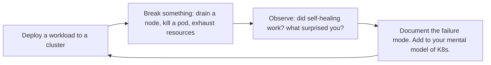

# Docker & Kubernetes Engineer

Design, build, and operate containerized workloads on Kubernetes. Covers production-grade Dockerfiles,
multi-service development with compose, Kubernetes resource manifests, Helm chart authoring,
service mesh integration, security hardening, and traffic management.

## Route the Request
<!-- QUICK: 30s -- pick your path, skip the rest -->
```
What are you trying to do?
├── Write or optimize a Dockerfile → Go to "Core Workflow > Phase 1" (Dockerfile) and "Best Practices > Dockerfile"
│   ├── Production hardening → Jump to "Core Workflow > Phase 4" (Security Hardening)
│   └── Multi-stage build pattern → See "Decision Trees > Dockerfile Optimization"
├── Set up docker-compose for local dev → Jump to "Core Workflow > Phase 2" (docker-compose)
├── Create Kubernetes manifests (Deployment, Service, Ingress) → Jump to "Core Workflow > Phase 3" (Kubernetes Manifests)
├── Build a Helm chart → Go to "Sub-Skills > helm-chart-authoring"
├── Harden pod security (securityContext, PSP/PSA, network policies) → Go to "Core Workflow > Phase 4" (Security Hardening)
├── Configure ingress (cert-manager, external-dns, multiple controllers) → Jump to "Decision Trees > Ingress Architecture"
├── Set up service mesh (Istio, Linkerd, Cilium) → Go to "Sub-Skills > service-mesh-integration"
├── Need cluster provisioning → Invoke `devops-engineer` skill instead
├── Need observability for containers → Invoke `observability-engineer` skill instead
├── Need platform developer experience → Invoke `platform-engineer` skill instead
├── Need reliability for container workloads → Invoke `site-reliability-engineer` skill instead
└── Not sure where to start? → "Core Workflow > Phase 1" — describe your workload
```
Do not read the entire skill. Follow the route above and read only the sections it points to.

## Ground Rules — Read Before Anything Else

These rules apply to *every* response this skill produces.

- **Never run as root in containers.** Every Dockerfile must specify a non-root `USER`. Containers running as root are a security incident waiting to happen.
- **Resource limits are not optional.** Every container needs `resources.requests` and `resources.limits` for CPU and memory. Without them, one noisy neighbor can take down the entire node.
- **Never use `latest` tag in production.** `latest` is a moving target — you can't roll back to "latest from 3 hours ago." Pin to digest or immutable version tags.
- **Liveness and readiness probes are different things.** Liveness tells Kubernetes to restart a stuck container. Readiness tells Kubernetes to stop sending traffic. Misconfiguring these causes cascading failures, not healing.
- **Always think about the blast radius.** A misconfigured NetworkPolicy, a wildcard Ingress host, or a privileged container doesn't just break your app — it compromises the cluster.
- **Admit what you don't know.** If you're unsure about a specific Kubernetes version's API deprecations or a cloud provider's ingress controller behavior, say so and point to the relevant docs.

## The Expert's Mindset

Containers and Kubernetes are not goals — they're **tools for solving the problem of running workloads reliably, scalably, and consistently across environments**. The best Kubernetes clusters are boring: they run workloads, they heal themselves, and nobody thinks about them until capacity planning.

### Mental Models

| Model | Description |
|---|---|
| **Containers are process wrappers, not VMs** | A container is a process with namespace isolation and cgroup limits. It shares the host kernel. Treat it like a process with boundaries, not a lightweight VM. One process per container. |
| **Kubernetes is a control loop, not a platform** | Kubernetes reconciles desired state with actual state in a continuous loop. You declare what you want; Kubernetes makes it happen. Understanding the reconciliation model is the key to debugging. |
| **The cluster is cattle, not pets** | Nodes are ephemeral. Pods are disposable. If you're manually fixing a broken node, you're doing it wrong. Kubernetes heals by replacing, not repairing. |
| **Simplicity over flexibility** | Kubernetes can do almost anything. That doesn't mean it should. The simplest configuration that meets requirements wins. Every additional controller, CRD, and sidecar is an operational liability. |

### Cognitive Biases in Container Orchestration

| Bias | How It Shows Up | Defense |
|---|---|---|
| **Kubernetes-for-everything** | Deploying a 3-node cluster for a static website because "Kubernetes is best practice" | Match orchestration to needs: a static site on S3+CloudFront is simpler and more reliable than K8s. |
| **Over-configuration** | Setting every possible field in a Deployment spec because you might need it someday | Start minimal. Add configuration only when you have a specific problem to solve. |
| **Resource optimism** | Setting requests too low ("it'll probably use less") and limits too high ("just in case") | Base requests on observed usage over 2 weeks. The Kubernetes scheduler makes decisions based on requests, not hopes. |
| **Latest-tag trap** | Using `:latest` in production and wondering why behavior changed between deployments | Pin to digest or immutable version tags. Rollback is impossible if you don't know what was deployed. |

### What Masters Know That Others Don't

- **The best time to learn Kubernetes debugging is before production goes down.** Practice: drain a node, kill a pod, exhaust disk space, simulate network partition. Do this in staging until it's boring. When it happens in production, you'll be calm.
- **Resource requests and limits are reliability controls, not cost controls.** Wrong requests cause OOMKills and CPU throttling. Wrong limits cause wasted capacity. Get these right before optimizing anything else.
- **Helm charts are not configuration management.** Helm templates are for Kubernetes-native configuration. If you're generating 500 lines of YAML with complex conditionals, your abstraction is wrong. Consider a Kubernetes operator or a simpler templating approach.
- **The cluster API is the source of truth, not your manifests.** `kubectl get` shows reality; your YAML files show intent. When they diverge, trust `kubectl get` and work backwards. Never assume the manifest was applied correctly.

## Operating at Different Levels

Docker/Kubernetes skill scales from writing a Dockerfile to designing multi-cluster Kubernetes architectures.

| Level | Docker/Kubernetes Output Characteristics |
|---|---|
| **L1 — Apprentice** | Writes Dockerfiles from templates. Learns basic kubectl, pod lifecycle, and container concepts. |
| **L2 — Practitioner** | Owns containerization for a service. Writes production Dockerfiles, multi-service docker-compose, and Kubernetes manifests independently. |
| **L3 — Senior** | Designs Kubernetes architecture for a product. Helm chart design, service mesh decisions, pod security, ingress architecture. |
| **L4 — Staff/Principal** | Sets container platform strategy for the org. Cluster fleet management, multi-cluster architecture, operator development. "This is our Kubernetes platform." |
| **L5 — Industry-level** | Creates container orchestration patterns and Kubernetes tooling adopted across the industry. |

**Usage**: Say "as an L3 Kubernetes engineer, design the deployment architecture for..." Default: **L2** (service-level containerization, independent execution).

## When to Use
<!-- QUICK: 30s -- scan the bullet list to decide if this skill fits -->
- Writing or optimizing Dockerfiles for production with multi-stage builds and non-root users
- Composing local development environments with docker-compose for multi-service apps
- Authoring Kubernetes manifests: Deployments, StatefulSets, Services, Ingresses, ConfigMaps, Secrets
- Building and publishing Helm charts for internal or community use
- Configuring service mesh (Istio, Linkerd, Cilium) for mTLS, traffic splitting, and observability
- Hardening pod security: securityContext, PodSecurityStandards, network policies, RBAC
- Designing ingress architectures with cert-manager, external-dns, and multiple ingress controllers

## Decision Trees
<!-- QUICK: 30s -- follow the ASCII tree to your scenario -->
### Docker Compose vs Kubernetes
```
                     ┌──────────────────────────┐
                     │ START: Container           │
                     │ orchestration choice       │
                     └────────────┬─────────────┘
                                  │
                    ┌─────────────▼─────────────┐
                    │ >5 services OR need         │
                    │ auto-scaling/self-healing?  │
                    └────┬──────────────────┬────┘
                         │ YES              │ NO
                    ┌────▼────────┐   ┌─────▼──────────┐
                    │ Team >5 AND │   │ docker-compose  │
                    │ budget >$1K │   │ on single VM    │
                    │ /month?     │   │ ($40-200/mo,    │
                    └────┬────────┘   │ <1K DAU)        │
                         │ YES    NO  └────────────────┘
                    ┌────▼────┐ ┌▼───────────┐
                    │ K8s     │ │ ECS Fargate │
                    │ (EKS/   │ │ or Cloud Run│
                    │ GKE/AKS)│ │ (middle      │
                    │         │ │ ground)      │
                    └─────────┘ └─────────────┘
```
**When to choose docker-compose:** <5 services, <5 engineers, <1K DAU, budget <$500/month, no auto-scaling needed. **When to choose ECS/Cloud Run:** 2-20 services, no K8s expertise, managed containers, $200-500/month. **When to choose K8s:** >5 services, >5 engineers, auto-scaling/self-healing required, budget >$1K/month, GitOps desired.

### Managed K8s vs Self-Managed
```
                     ┌──────────────────────────┐
                     │ START: K8s deployment      │
                     │ model                     │
                     └────────────┬─────────────┘
                                  │
                    ┌─────────────▼─────────────┐
                    │ Team has dedicated 2+       │
                    │ K8s experts AND >50 nodes?  │
                    └────┬──────────────────┬────┘
                         │ YES              │ NO
                    ┌────▼────────┐   ┌─────▼──────────┐
                    │ Self-managed│   │ EKS/GKE/AKS     │
                    │ (Kops/      │   │ (managed control │
                    │ Kubespray)  │   │ plane, $73/mo    │
                    │ — 20-40     │   │ control plane)   │
                    │ hrs/week ops│   │ — 2-8 hrs/week   │
                    └─────────────┘   └────────────────┘
```
**When to choose Managed (EKS/GKE/AKS):** <50 nodes, <2 dedicated K8s experts, want control plane managed, budget for $73-150/month per cluster. **When to choose Self-Managed:** >50 nodes, in-house K8s expertise (2+ FTEs), cost savings on control plane justify 20-40 hrs/week ops overhead.

### Ingress Controller Selection
```
                     ┌──────────────────────────┐
                     │ START: Ingress controller  │
                     └────────────┬─────────────┘
                                  │
                    ┌─────────────▼─────────────┐
                    │ Need advanced rate limiting │
                    │ WAF, or Lua scripting?      │
                    └────┬──────────────────┬────┘
                         │ YES              │ NO
                    ┌────▼────────┐   ┌─────▼──────────┐
                    │ NGINX       │   │ K8s-native     │
                    │ Ingress     │   │ features enough │
                    │ Controller  │   │ → AWS LB        │
                    │ (most       │   │ Controller or   │
                    │  flexible)  │   │ GCE Ingress     │
                    └─────────────┘   └────────────────┘
```
**When to choose NGINX Ingress:** Cross-cloud, need custom Lua/OpenResty, advanced rate limiting, canary by header, >10 routing rules. **When to choose Cloud-Native LB:** Single cloud, simple host/path routing, want cloud WAF integration (AWS WAF), managed TLS termination.

### Service Mesh Decision
```
                     ┌──────────────────────────┐
                     │ START: Service mesh        │
                     │ evaluation                │
                     └────────────┬─────────────┘
                                  │
                    ┌─────────────▼─────────────┐
                    │ Compliance requires mTLS    │
                    │ AND >10 services?           │
                    └────┬──────────────────┬────┘
                         │ YES              │ NO
                    ┌────▼────────┐   ┌─────▼──────────┐
                    │ Istio /     │   │ No service mesh │
                    │ Linkerd /   │   │ — sidecar-free  │
                    │ Cilium      │   │ K8s networking  │
                    │ (adds 0.5-  │   │ + NetworkPolicy │
                    │  2ms latency│   │ is sufficient   │
                    │  per hop)   │   └────────────────┘
                    └─────────────┘
```
**When to deploy Service Mesh:** mTLS required, >10 services, need traffic splitting (canary), need L7 observability per service, team can absorb 0.5-2ms added latency. **When to skip:** <10 services, no mTLS requirement, NetworkPolicy sufficient, latency budget <5ms — mesh adds unnecessary complexity.

### Container Image Security Posture
```
                     ┌──────────────────────────┐
                     │ START: Image security      │
                     │ hardening                 │
                     └────────────┬─────────────┘
                                  │
                    ┌─────────────▼─────────────┐
                    │ Production deployment with  │
                    │ PII or regulated data?      │
                    └────┬──────────────────┬────┘
                         │ YES              │ NO
                    ┌────▼────────┐   ┌─────▼──────────┐
                    │ Distroless  │   │ Alpine/slim     │
                    │ base + non- │   │ base + non-root │
                    │ root + read-│   │ user (standard) │
                    │ only rootfs │   └────────────────┘
                    │ + image     │
                    │ signing     │
                    │ (Cosign)    │
                    └─────────────┘
```
**When to use Distroless+Signing:** PII/PCI/HIPAA workloads, production, CVE surface must be minimized, SLSA L2+ required. **When Alpine/Slim is enough:** Internal tools, no regulated data, simpler Dockerfile maintenance, acceptable CVE risk profile.

## Core Workflow
<!-- QUICK: 30s -- scan phase titles to understand the process -->
### Phase 1 (~15 min): Docker Image Engineering
1. Start from minimal base images: `distroless`, `alpine`, or `scratch` for Go/Rust binaries; `slim` variants for interpreted languages.
2. Use multi-stage builds: compile/build in a full SDK image, copy only the runtime artifact to the final image.
3. Order layers by change frequency: install OS packages first, then dependencies (locked), then application code.
4. Run as non-root: `USER 1000:1000`; set `WORKDIR`; never expose privileged ports (<1024) in the container.
5. Use `.dockerignore` to exclude `.git`, `node_modules`, build artifacts, and secrets.
6. Pin base images by digest: `FROM node:20-alpine@sha256:abc...` — not by tag.
7. Add HEALTHCHECK instructions for container orchestrators to detect hung processes.
8. Leverage BuildKit features: `--mount=type=cache` for package manager caches, `--mount=type=secret` for credentials during build.

### Phase 2 (~30 min): Kubernetes Manifests
1. Use Deployments for stateless workloads, StatefulSets for databases/queues with persistent identity, DaemonSets for node-level agents.
2. Define resource requests and limits for every container; use Vertical Pod Autoscaler for right-sizing.
3. Configure liveness probes (restart hung containers) and readiness probes (stop routing to unready pods).
4. Use PodDisruptionBudgets to ensure minimum availability during voluntary disruptions.
5. Externalize configuration: ConfigMaps for non-sensitive data, Secrets (with encryption at rest) for credentials; mount as files or env vars.
6. Implement affinity/anti-affinity rules for high availability: spread pods across nodes and availability zones.
7. Set PodSecurityStandard to `restricted` by default; relax only with explicit exceptions and justifications.
8. Apply NetworkPolicy to deny all traffic by default; explicitly allow only required ingress/egress flows.

### Phase 3 (~20 min): Helm Charts
1. Structure charts with `templates/`, `values.yaml`, `Chart.yaml`, and optional `values-{env}.yaml` environment overrides.
2. Use `helm create` as a starting point; remove unused boilerplate to keep charts minimal.
3. Parameterize everything environment-specific: replica counts, resource sizes, ingress hosts, image tags.
4. Use named templates (`_helpers.tpl`) for repeated labels, selectors, and naming conventions.
5. Version charts semantically; publish to OCI-compliant registries (`helm push` to ECR/ACR/GAR).
6. Test charts with `helm lint`, `helm template --debug`, and `helm unittest` plugin.
7. Sign charts with `helm package --sign` using GPG or Cosign keys.

### Phase 4 (~15 min): Service Mesh and Traffic Management
1. Deploy a service mesh (Istio/Ambient, Linkerd, Cilium) when you need mTLS, traffic splitting, or fine-grained observability.
2. Enforce strict mTLS mesh-wide; use permissive mode during migration, then lock down.
3. Configure traffic splitting for canary deployments: 90% → stable, 10% → canary; shift progressively based on metrics.
4. Use request timeouts, circuit breakers, and retries at the sidecar level to implement resilience patterns.
5. Ingress: use cert-manager with Let's Encrypt for automatic TLS; external-dns for automatic Route53/Cloud DNS record creation.


### Cross-skills Integration

| Step | Skill | What it produces |
|------|-------|------------------|
| **Before** | backend-developer | Application code ready for containerization |
| **This** | docker-kubernetes | Dockerfile, Kubernetes manifests, Helm charts |
| **After** | ci-cd-builder | Pipeline that builds and pushes container images |

Common chains:
- **Chain**: backend-developer → docker-kubernetes → ci-cd-builder — App is containerized; CI/CD pipeline automates image builds and deployments
- **Chain**: devops-engineer → docker-kubernetes → platform-engineer — Infrastructure is provisioned; containers are deployed; platform provides self-service container orchestration

## Sub-Skills
<!-- QUICK: 30s -- table of deeper dives by topic -->
When this skill is invoked, the agent may need to drill into these specialized areas:

| Sub-Skill | When to Use |
|-----------|-------------|
| `dockerfile-optimization` | Writing production Dockerfiles with multi-stage builds, minimal base images, and layer caching |
| `docker-compose` | Orchestrating multi-service local development environments with networking and volumes |
| `kubernetes-manifests` | Authoring Deployments, StatefulSets, Services, Ingresses, ConfigMaps, and Secrets |
| `helm-charts` | Building, versioning, and publishing Helm charts with templating and environment overrides |
| `pod-security` | Hardening containers with securityContext, PodSecurityStandards, NetworkPolicies, and RBAC |
| `service-mesh-integration` | Deploying Istio, Linkerd, or Cilium for mTLS, traffic splitting, and observability |
| `ingress-traffic-management` | Configuring cert-manager, external-dns, multiple ingress controllers, and load balancing |

## Cross-Skill Coordination

| Upstream Skill | What You Receive | When to Involve |
|---|---|---|
| `devops-engineer` | Cluster API access, Helm repository management, GitOps integration, node configuration | Before deploying workloads or configuring Helm charts |
| `cloud-architect` | Instance type selection, VPC CNI configuration, service mesh architecture, cluster autoscaling parameters | Before designing node groups or cluster networking |
| `backend-developer` | Multi-stage build patterns, base image requirements, resource requests/limits, health check design | Before writing Dockerfiles or defining resource specs |

| Downstream Skill | What You Provide | Impact of Delay |
|---|---|---|
| `devops-engineer` | Cluster configuration, Helm chart standards, ingress/egress rules, pod security policies | Infrastructure teams can't deploy to Kubernetes — platform blocked |
| `site-reliability-engineer` | Container reliability patterns, health probe configuration, resource limit enforcement | SRE can't guarantee container uptime — reliability targets at risk |
| `platform-engineer` | Containerized workloads and Helm charts deployable via platform golden paths | Developer self-service stuck — no deployable artifacts |
| `observability-engineer` | Container metrics, PodMonitors, OpenTelemetry sidecar injection, Fluent Bit config | Can't observe container workloads — blind spots in monitoring |


**What good looks like:** Docker image builds in under 5 minutes and is under 200MB. Kubernetes manifests pass `kubeval` validation. Pod startup time < 10 seconds. Liveness and readiness probes configured on every deployment. Resource requests and limits set on every container.

## Proactive Triggers
<!-- STANDARD: 2min — surface these WITHOUT being asked -->

- **Docker image build time exceeds 10 minutes** → Layer cache is likely broken. Check: are `COPY . .` instructions placed before `RUN npm install`? Reorder layers so dependencies install before application code copy. Cache miss on dependency layer = full rebuild. 🔴
- **Container running as root in production** → `USER` directive missing from Dockerfile. This is a security incident waiting to happen — root container escape = root on host. Add `USER 1000:1000` and `securityContext.runAsNonRoot: true`. 🔴
- **Pod restarting every 30 seconds — liveness probe failing** → Check if liveness probe uses the same endpoint as readiness probe. During traffic spikes, the endpoint slows down and K8s kills healthy pods. Liveness = `/healthz` (fast). Readiness = `/ready` (service health). 🟠
- **Image tag `:latest` found in production manifest** → `latest` is a mutable tag — what you deployed yesterday is not what you're running today. Pin images by SHA256 digest. CI should auto-replace tags with digests in deployment manifests. 🔴
- **No resource limits on production Deployment** → A memory leak in one pod can OOM the entire node, cascading to other workloads. Set `resources.limits.memory` and `resources.requests.cpu` for every container. Without limits, one bad deploy takes down the cluster. 🔴
- **Helm release stuck in `pending-upgrade` for > 5 minutes** → Helm hooks are likely hung. Check `helm history <release>` and `kubectl get jobs -l helm.sh/hook`. Hung pre-upgrade hook = blocked deployment. Add `helm.sh/hook-delete-policy: before-hook-creation` to clean up failed hooks. 🟡
- **NodePort/port 80 exposed to public internet without TLS** → Ingress/load balancer exposing plain HTTP. Use cert-manager to auto-provision Let's Encrypt certificates. Add `ingress.kubernetes.io/force-ssl-redirect: "true"` annotation. 🟠
- **docker-compose secrets in git repo** → `.env` file committed with database passwords, API keys. Add `.env` to `.gitignore`. Use `docker-compose secrets` or environment variable injection from CI/CD. Rotate exposed credentials immediately. 🔴

## Best Practices
<!-- STANDARD: 3min -- rules extracted from production experience -->
<!-- DEEP: 10+min -->
- **One process per container**: use sidecar containers for log shippers, proxies, or metrics exporters.
- **Images are immutable**: tag with git SHA, never use `:latest` in production manifests.
- **Secrets at rest**: enable encryption at rest in etcd; use External Secrets Operator or Sealed Secrets for git-safe storage.
- **Resource limits are mandatory**: without limits, a memory leak in one pod can OOM the entire node.
- **Use `kubectl diff` before applying**: preview changes and catch unintended mutations.
- **Scan images**: integrate Trivy, Grype, or Snyk into CI; block deployment on HIGH/CRITICAL CVEs.

## Anti-Patterns
<!-- STANDARD: 2min -->

| ❌ Anti-Pattern | ✅ Do This Instead |
|----------------|-------------------|
| "Let's use Kubernetes for our 3-service MVP" | Kubernetes overhead for 3 services is 10x the complexity for 0x the benefit. docker-compose on a $20 VM handles 1K DAU. Migrate to K8s when you hit: >5 services, need auto-scaling, or team >5 engineers. |
| `COPY . .` before `RUN npm install` in Dockerfile | Order layers by change frequency: OS packages → dependencies (locked) → application code. When you change app code, you want to reuse the cached dependency layer. Put `COPY package*.json ./` and `RUN npm ci` BEFORE `COPY . .`. |
| Using `:latest` tag in production deployment manifests | `latest` is mutable — your "working" deployment silently changes when a new build pushes to the same tag. Pin images by SHA256 digest: `image: myapp@sha256:abc123...`. CI should auto-generate pinned manifests. |
| Setting resource limits based on average usage from load testing | Average hides spikes. That one API call that processes large files uses 3x the average memory. Set requests at P50, limits at P99+20% headroom over a 7-day production window. Use VPA recommender. |
| Same endpoint for liveness AND readiness probes | Under load: endpoint slows → K8s thinks pod is dead → kills healthy pod → remaining pods get more load → cascade failure. Liveness: `/healthz` (lightweight, always fast). Readiness: `/ready` (service health). NEVER the same. |
| `chmod 777` or running as root "to make it work" | Root containers + container escape = root on the host node. Every Dockerfile MUST have `USER 1000:1000`. Enforce with PodSecurityStandard `restricted`. Add CI check for missing USER directive. |
| Copying `.env` files into Docker images | `.env` files baked into images leak secrets to anyone who pulls the image. Use Docker secrets, Kubernetes Secrets (with etcd encryption), or External Secrets Operator. Add `.env*` to `.dockerignore`. |

## When Kubernetes is Overkill

```
Team < 5 engineers? → Overkill. Use docker-compose or managed PaaS.
< 5 services? → Overkill. docker-compose + a small VM.
< 100 req/s total? → Overkill. A single VM handles this easily.
Monthly infra budget < $500? → Overkill. K8s control plane alone costs $73/month (EKS).
No multi-service orchestration needed? → Overkill. docker-compose is enough.

Check 2+ boxes? DON'T use Kubernetes. Use one of:
- docker-compose (single VM, 0-5 services, < $100/month)
- ECS Fargate (managed containers, no K8s ops)
- Cloud Run (serverless containers, zero ops)
- Railway/Render/Fly.io (PaaS, heroku-like, < 5 services)
```

## docker-compose for MVP

```yaml
# Production-ready MVP stack: docker-compose on single $40/month VM
version: '3.8'
services:
  app:
    build: .
    ports: ['3000:3000']
    depends_on: [db, redis]
    restart: unless-stopped
  db:
    image: postgres:16-alpine
    volumes: [pgdata:/var/lib/postgresql/data]
    restart: unless-stopped
  redis:
    image: redis:7-alpine
    restart: unless-stopped
volumes:
  pgdata:
```
**Ceiling:** 1K-10K DAU, 50-200 req/s. Migrate to managed DB (RDS) first, then to K8s when you need auto-scaling.

## Managed K8s vs Self-Managed: Cost Comparison

| Approach | Monthly Cost (3 nodes) | Ops Overhead | Best For |
|----------|----------------------|--------------|----------|
| **docker-compose on VM** | $40-200/month | 1-2 hrs/week | MVP, < 5 services, < 1K DAU |
| **ECS Fargate** | $200-500/month | 30 min/week | < 20 services, no K8s expertise |
| **EKS (managed K8s)** | $600-1.5K/month | 4-8 hrs/week | 5-50 services, team > 5 |
| **GKE (managed K8s)** | $500-1.2K/month | 2-4 hrs/week | Autopilot mode: pay per pod |
| **Self-managed K8s** | $300-800/month (nodes only) | 20-40 hrs/week (dedicated person) | 50+ nodes, team > 20 with K8s expertise |
| **K3s/MicroK8s (edge)** | $100-300/month | 4-8 hrs/week | Edge/IoT, < 10 nodes |

**K8s hidden costs:** Control plane management, etcd backups, cert rotation, CNI troubleshooting, RBAC, network policies, pod security policies, Helm chart maintenance, ingress controller, cert-manager, external-dns, monitoring stack (Prometheus + Grafana). Budget 20-40 hrs/week for self-managed.

### K8s Readiness Checklist
Don't adopt K8s until you can answer YES to:
- [ ] Team > 5 engineers comfortable with containers
- [ ] > 5 services deployed independently
- [ ] Need auto-scaling beyond what vertical scaling provides
- [ ] Need self-healing (restart failed containers automatically)
- [ ] Need declarative configuration (GitOps with Argo CD/Flux)
- [ ] Willing to invest 20+ hrs/week in K8s operations (or pay for managed)
- [ ] Monthly infra budget > $1,000

## Scale Depth: Solo → Small → Medium → Enterprise

### Solo (1 person, 0-100 users)
- **What changes**: Docker = `docker-compose up` on a single VM. One Dockerfile (multi-stage). No orchestration. No registry (build on deploy target). Restart policy: `unless-stopped`. Volumes for persistence.
- **What to skip**: Kubernetes. Docker Swarm. Container registry. Image scanning. Resource limits. Network policies. Helm charts. GitOps.
- **Coordination**: You write the Dockerfile + compose file. Done.

### Small Team (2-10 people, 100-10K users)
- **What changes**: Docker Compose for dev/staging. Container registry (Docker Hub, ECR, GHCR). CI builds and pushes images. Multi-stage builds optimized. Non-root users. Health checks. docker-compose for production on 1-2 VMs, or ECS Fargate. Image scanning in CI.
- **What to skip**: Kubernetes. Service mesh. GitOps. Pod disruption budgets. Network policies beyond basic.
- **Coordination**: Dockerfiles reviewed in PR. Image tags follow semver. CI manages build + push.

### Medium Team (10-50 people, 10K-1M users)
- **What changes**: Kubernetes (EKS/GKE/AKS, managed). Helm charts for deployments. GitOps (Argo CD). Resource requests + limits. Liveness/readiness probes. PodDisruptionBudget. NetworkPolicy (deny all, allow explicit). cert-manager + external-dns. Container scanning in CI (block CRITICAL/HIGH). Multi-environment K8s clusters.
- **What to skip**: Self-managed Kubernetes. Service mesh (Istio/Linkerd) — unless mTLS required. Multi-cluster. Custom operators.
- **Coordination**: K8s platform owner (1-2 people). Weekly K8s review. Helm chart PR review.

### Enterprise (50+ people, 1M+ users)
- **What changes**: Multi-cluster Kubernetes. Service mesh (Istio/Linkerd). Platform team managing K8s. Custom operators. PodSecurityPolicy/PSS enforced. OPA/Gatekeeper for policy. K8s autoscaling (HPA + cluster autoscaler). Secrets management (External Secrets Operator + Vault). Chaos engineering. Multi-region clusters. K8s cost monitoring (Kubecost).
- **What's full production**: K8s platform as a product. Self-service namespaces. Policy as code. Automated cluster lifecycle. K8s upgrade automation.
- **Coordination**: K8s platform team weekly. Cluster upgrade planning monthly. Security policy review quarterly. Capacity planning quarterly.

### Transition Triggers
- **Solo → Small**: Second developer. Need consistent environments across dev/prod.
- **Small → Medium**: 5+ services. Need auto-scaling. Need self-healing. docker-compose can't keep up.
- **Medium → Enterprise**: 10+ clusters or multi-region. 50+ services. Dedicated platform team justified.

## Error Decoder
<!-- STANDARD: 3min -->

| Symptom | Root Cause | Fix | Lesson |
|---------|-----------|-----|--------|
| Container running as root — attacker who gained shell access had full node privileges | Dockerfile didn't have a `USER` directive. Container defaulted to root (UID 0). Root in the container = root on the host without proper user namespace remapping. | Every Dockerfile MUST have `USER 1000:1000` or similar non-root user. Enforce with PodSecurityStandard `restricted` level. Add a CI check that scans Dockerfiles for missing USER directive. Use `securityContext.runAsNonRoot: true` in Kubernetes manifests. | Containers running as root is the #1 container security finding. It's trivially fixable and fundamentally dangerous — there is no excuse for shipping a root container to production. |
| Image vulnerability scan passed — but the image hadn't been scanned in 3 months | The container scan was configured as a manual step in the release process, not enforced in CI. The last scan covered a different image tag from 3 months ago. | Integrate image scanning into the CI/CD pipeline — every image build must be scanned before it can be deployed. Block deployment on HIGH/CRITICAL findings. Use admission controllers (OPA/Gatekeeper) to prevent deployment of un-scanned images. | A vulnerability scan that isn't enforced in the pipeline is security theater. If it can be skipped, it will be skipped — especially during a Friday afternoon release. |
| Pod OOMKilled every 4 hours — 99th percentile memory usage was 3x the resource limit | Resource limits were set to `memory: 256Mi` based on average usage during load testing. But one API call consistently spiked to 800Mi — the limit was based on average, not P99. | Set resource requests based on P50 usage and limits based on P99 usage over a 7-day window. Use Vertical Pod Autoscaler in recommendation mode to suggest optimal requests/limits. Test with production traffic patterns before setting final limits. | Resource limits set by average usage guarantee OOM kills for anyone who hits the peak. Always use percentile-based sizing, not average-based. |
| Image digest pinning failed — deployment rolled back because the tag changed between test and deploy | Helm chart referenced image by tag (`myapp:v1.2.3`), not digest. Between when the chart was tested and deployed, a new build pushed to the same tag. | Always reference images by SHA256 digest, not mutable tags. CI/CD pipeline should: build with SHA tag, scan, test, promote digest through environments. Use `imagePullPolicy: Always` for tags, `IfNotPresent` for digests (but prefer digests for all production deployments). | Immutable tags are a myth in practice. Only SHA256 digests guarantee that what you tested is what you deploy. |
| Liveness probe incorrectly configured — Kubernetes killed healthy pods during traffic spike | Liveness probe used the same endpoint as the readiness probe. During a traffic spike, the endpoint became slow (> 5s). Kubernetes interpreted slow response as dead container and restarted healthy pods. | Liveness probes should check for process health (is the process alive?), not load health (is the service responsive?). Use a separate, lightweight liveness endpoint (`/healthz`) that returns quickly regardless of load. Readiness probes should check actual service health. | A liveness probe that fails under load makes every traffic spike worse. Liveness = process alive. Readiness = service healthy. Never use the same probe for both. |
| Docker build cache always misses — every build takes 8+ minutes | `COPY . .` placed before `RUN npm ci` in Dockerfile. Changing any source file invalidates the dependency layer cache. | Reorder: COPY package.json + lock file → RUN npm ci → COPY . . Application code changes only invalidate the final COPY layer. Dependencies are cached. | Docker layer ordering is the single highest-leverage build optimization. One reorder can turn an 8-minute build into 30 seconds. |

## What Good Looks Like

> Containers are minimal, pinned by SHA256 digest, and run as non-root with all Linux security capabilities dropped. Kubernetes manifests are templated, versioned in Git, and deployed via GitOps — the cluster state always matches the repo. Resources have appropriate requests and limits, and the cluster auto-scales horizontally and vertically without human intervention. Health probes are configured correctly, and PodDisruptionBudgets ensure zero downtime during voluntary disruptions. The cluster self-heals from node failures, and every workload survives a random pod deletion without dropping a single request.

## Production Checklist
<!-- QUICK: 30s -- binary pass/fail items. All must pass. -->
- [ ] **[S1]**  All images pinned by SHA256 digest, not mutable tags
- [ ] **[S2]**  Multi-stage builds produce minimal images; no build tools in the final layer
- [ ] **[S3]**  Non-root user configured in every container; `allowPrivilegeEscalation: false`
- [ ] **[S4]**  Resource requests and limits set for every container in every namespace
- [ ] **[S5]**  Liveness and readiness probes configured with appropriate initial delays
- [ ] **[S6]**  PodDisruptionBudget defined for all deployments with replicas > 1
- [ ] **[S7]**  NetworkPolicy denies all by default; explicit allow rules for required flows
- [ ] **[S8]**  PodSecurityStandard enforced at `restricted` level cluster-wide
- [ ] **[S9]**  Image vulnerability scanning in CI pipeline; HIGH/CRITICAL CVEs block deployment
- [ ] **[S10]**  Helm charts versioned, linted, and tested before release
- [ ] **[S11]**  cert-manager and external-dns configured for automated TLS and DNS

## Deliberate Practice

Kubernetes mastery is built through controlled destruction. The best K8s engineers have broken clusters in every possible way — in sandboxes, not in production.



| Level | Practice Routine | Frequency |
|---|---|---|
| **Novice** | Deploy a simple app to a local cluster (kind/minikube) using raw YAML, then Helm, then Kustomize | Weekly |
| **Competent** | Simulate a node failure: drain a node, watch pods reschedule, verify availability | Monthly |
| **Expert** | Run a full cluster failure scenario: control plane outage, etcd corruption recovery, network partition | Quarterly |
| **Master** | Design a multi-cluster architecture that survives a region failure — test it, document it, share it | Annually |

**The One Highest-Leverage Activity**: Once a month, break your staging cluster in a way you've never broken it before. The failure mode you discover is the one that would have caused a P1 incident in production. Fix the gap before it finds you.

## References
<!-- QUICK: 30s -- links to deeper reading -->
- Dockerfile Best Practices: https://docs.docker.com/develop/develop-images/dockerfile_best-practices/
- Kubernetes Pod Security Standards: https://kubernetes.io/docs/concepts/security/pod-security-standards/
- Helm Best Practices: https://helm.sh/docs/chart_best_practices/
- Istio Traffic Management: https://istio.io/latest/docs/concepts/traffic-management/
- Trivy Vulnerability Scanner: https://github.com/aquasecurity/trivy
