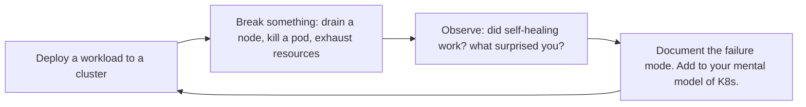

# Docker & Kubernetes Engineer
> **Portability target:** Spec-level (runs on Claude Code, Copilot, Gemini CLI, Codex, Cursor). No vendor-specific frontmatter fields.

Design, build, and operate containerized workloads on Kubernetes. Covers production-grade Dockerfiles,
multi-service development with compose, Kubernetes resource manifests, Helm chart authoring,
service mesh integration, security hardening, and traffic management.

## Route the Request

<!-- QUICK: 30s -- auto-route first, then intent-route -->

### Auto-Route (No User Input Required)
Evaluate these file-system conditions in order. First match wins — jump immediately.

| # | Condition | Action |
|---|-----------|--------|
| A1 | `file_exists("Dockerfile")` AND NOT `file_exists("docker-compose.yml")` AND NOT `file_exists("Chart.yaml")` | Go to "Core Workflow > Phase 1" (Dockerfile) — write or optimize a Dockerfile |
| A2 | `file_exists("docker-compose.yml")` OR `file_exists("docker-compose.yaml")` | Jump to "Core Workflow > Phase 2" (docker-compose) for local dev or MVP setup |
| A3 | `file_exists("Chart.yaml")` AND `file_exists("templates/")` | Go to "Sub-Skills > helm-chart-authoring" for Helm chart work |
| A4 | `file_exists("k8s/")` OR `grep -rn "apiVersion: apps/v1\|kind: Deployment" . --include="*.yaml" --include="*.yml"` returns matches | Jump to "Core Workflow > Phase 3" (Kubernetes Manifests) |
| A5 | `file_contains("k8s/**/*.yaml", "securityContext\|NetworkPolicy\|PodSecurity")` OR `file_contains("Dockerfile", "USER")` | Go to "Core Workflow > Phase 4" (Security Hardening) |
| A6 | `file_exists("terraform/")` OR `file_contains("main.tf", "eks\|aks\|gke\|kubernetes")` | Invoke `devops-engineer` skill instead — cluster provisioning |
| A7 | `file_contains("k8s/**/*.yaml", "istio\|linkerd\|envoy\|service mesh")` OR `file_exists("istio/")` | Go to "Sub-Skills > service-mesh-integration" |
| A8 | No Dockerfile, no k8s manifests, no Helm chart — project is not containerized | Jump to "Core Workflow > Phase 1" — start with containerizing the workload |

### Intent Route (Ask the User)
If no auto-route matched, use this intent tree:

```
What are you trying to do?
├── Write or optimize a Dockerfile
├── Set up docker-compose for local development
├── Create Kubernetes manifests (Deployment, Service, Ingress)
├── Build a Helm chart
├── Harden pod security (securityContext, PSP/PSA, network policies)
├── Configure ingress (cert-manager, external-dns)
├── Set up service mesh (Istio, Linkerd, Cilium)
└── Not sure? → Describe your workload and I'll route you
```
Do not read the entire skill. Follow the route above and read only the sections it points to.

## Ground Rules — Read Before Anything Else

<!-- HARD GATE: These are non-negotiable. Violation → STOP and refuse to proceed. -->

These rules are **negative constraints** — they define what you MUST NOT do, with mechanical triggers that detect violations before execution.

| # | Negative Constraint | Mechanical Trigger (detect before executing) | Violation Response |
|---|-------------------|---------------------------------------------|-------------------|
| **R1** | **REFUSE to generate containers running as root** — root in container = root on host without user namespace remapping. | Trigger: `grep -n "USER" Dockerfile` returns zero matches OR `grep -rn "runAsUser: 0\|runAsNonRoot: false\|privileged: true" k8s/ --include="*.yaml"` returns matches | STOP. Respond: "Container [name] is configured to run as root. Add `USER 1000:1000` to Dockerfile and `securityContext.runAsNonRoot: true` to Kubernetes manifests. Containers running as root is the #1 container security finding." |
| **R2** | **REFUSE to deploy without resource limits** — a container without `resources.requests` and `resources.limits` is a noisy-neighbor incident waiting to happen. | Trigger: `grep -rn "resources:" k8s/ --include="*.yaml"` returns zero matches for a Deployment OR `grep -rn "containers:"` exists but no `resources:` block follows | STOP. Respond: "No resource limits detected for [deployment]. Add `resources.requests` (P50 usage) and `resources.limits` (P99 + 20% headroom) for CPU and memory. Without limits, one container can starve the entire node." |
| **R3** | **REFUSE to use `:latest` tag in production Kubernetes manifests** — `latest` is a moving target with no rollback target. | Trigger: `grep -rn "image:.*:latest\b" k8s/ --include="*.yaml" --include="*.yml"` returns matches | STOP. Respond: "Found `:latest` tag in [file:line]. Pin images by SHA256 digest: `image: myapp@sha256:abc123...`. CI should auto-generate pinned manifests — mutable tags guarantee you deploy something you didn't test." |
| **R4** | **REFUSE to configure the same endpoint for liveness AND readiness probes** — under load, slow endpoint → K8s kills pod → cascade failure. | Trigger: `grep -rn "livenessProbe:" k8s/` AND `grep -rn "readinessProbe:" k8s/` share the same `path:` value in the same Deployment | STOP. Respond: "Liveness and readiness probes share the same endpoint in [deployment]. Liveness: `/healthz` (lightweight, always fast — process alive?). Readiness: `/ready` (service health — ready for traffic?). NEVER the same endpoint." |
| **R5** | **STOP and ASK when the project has < 5 services but user requests Kubernetes** — K8s overhead for 3 services is 10x complexity for 0x benefit. | Trigger: `grep -rn "kind: Deployment" k8s/ --include="*.yaml"` returns ≤ 3 matches AND team size < 5 engineers AND no auto-scaling requirement expressed | STOP. Ask: "This project has [N] services and [M] engineers. Kubernetes control plane alone costs $73+/month (EKS). Consider: docker-compose on a $20-40 VM (handles 1K DAU) or ECS Fargate (managed containers, no K8s ops). Do you have requirements that justify K8s (auto-scaling, self-healing, GitOps, > 5 services)?" |
| **R6** | **DETECT and WARN about Docker layer ordering that breaks caching** — `COPY . .` before `RUN npm ci` invalidates the dependency cache on every code change. | Trigger: `file_contains("Dockerfile", "COPY . .")` appears BEFORE `file_contains("Dockerfile", "RUN npm (ci|install)")` in the same Dockerfile | WARN: "`COPY . .` precedes dependency installation in [Dockerfile]. Reorder: COPY package.json + lock file → RUN npm ci → COPY . . This one reorder can turn an 8-minute build into 30 seconds." |
| **R7** | **DETECT and WARN about `.env` files copied into Docker images** — baked-in `.env` files leak secrets to anyone who pulls the image. | Trigger: `file_contains("Dockerfile", "COPY.*\.env")` OR `file_contains("Dockerfile", "ENV.*=")` with DB credentials / API keys | WARN: "`.env` or credential-bearing ENV directives detected in [Dockerfile]. Use Docker secrets, Kubernetes Secrets (with etcd encryption), or External Secrets Operator. Add `.env*` to `.dockerignore`. Build-time env vars persist in image layers forever." |

## The Expert's Mindset

Containers and Kubernetes are not goals — they're **tools for solving the problem of running workloads reliably, scalably, and consistently across environments**. The best Kubernetes clusters are boring: they run workloads, they heal themselves, and nobody thinks about them until capacity planning.

### Mental Models

| Model | Description |
|---|---|
| **Containers are process wrappers, not VMs** | A container is a process with namespace isolation and cgroup limits. It shares the host kernel. Treat it like a process with boundaries, not a lightweight VM. One process per container. |
| **Kubernetes is a control loop, not a platform** | Kubernetes reconciles desired state with actual state in a continuous loop. You declare what you want; Kubernetes makes it happen. Understanding the reconciliation model is the key to debugging. |
| **The cluster is cattle, not pets** | Nodes are ephemeral. Pods are disposable. If you're manually fixing a broken node, you're doing it wrong. Kubernetes heals by replacing, not repairing. |
| **Simplicity over flexibility** | Kubernetes can do almost anything. That doesn't mean it should. The simplest configuration that meets requirements wins. Every additional controller, CRD, and sidecar is an operational liability. |

### Cognitive Biases in Container Orchestration

| Bias | How It Shows Up | Defense |
|---|---|---|
| **Kubernetes-for-everything** | Deploying a 3-node cluster for a static website because "Kubernetes is best practice" | Match orchestration to needs: a static site on S3+CloudFront is simpler and more reliable than K8s. |
| **Over-configuration** | Setting every possible field in a Deployment spec because you might need it someday | Start minimal. Add configuration only when you have a specific problem to solve. |
| **Resource optimism** | Setting requests too low ("it'll probably use less") and limits too high ("just in case") | Base requests on observed usage over 2 weeks. The Kubernetes scheduler makes decisions based on requests, not hopes. |
| **Latest-tag trap** | Using `:latest` in production and wondering why behavior changed between deployments | Pin to digest or immutable version tags. Rollback is impossible if you don't know what was deployed. |

### What Masters Know That Others Don't

- **The best time to learn Kubernetes debugging is before production goes down.** Practice: drain a node, kill a pod, exhaust disk space, simulate network partition. Do this in staging until it's boring. When it happens in production, you'll be calm.
- **Resource requests and limits are reliability controls, not cost controls.** Wrong requests cause OOMKills and CPU throttling. Wrong limits cause wasted capacity. Get these right before optimizing anything else.
- **Helm charts are not configuration management.** Helm templates are for Kubernetes-native configuration. If you're generating 500 lines of YAML with complex conditionals, your abstraction is wrong. Consider a Kubernetes operator or a simpler templating approach.
- **The cluster API is the source of truth, not your manifests.** `kubectl get` shows reality; your YAML files show intent. When they diverge, trust `kubectl get` and work backwards. Never assume the manifest was applied correctly.

## Operating at Different Levels

Docker/Kubernetes skill scales from writing a Dockerfile to designing multi-cluster Kubernetes architectures.

| Level | Docker/Kubernetes Output Characteristics |
|---|---|
| **L1 — Apprentice** | Writes Dockerfiles from templates. Learns basic kubectl, pod lifecycle, and container concepts. |
| **L2 — Practitioner** | Owns containerization for a service. Writes production Dockerfiles, multi-service docker-compose, and Kubernetes manifests independently. |
| **L3 — Senior** | Designs Kubernetes architecture for a product. Helm chart design, service mesh decisions, pod security, ingress architecture. |
| **L4 — Staff/Principal** | Sets container platform strategy for the org. Cluster fleet management, multi-cluster architecture, operator development. "This is our Kubernetes platform." |
| **L5 — Industry-level** | Creates container orchestration patterns and Kubernetes tooling adopted across the industry. |

**Usage**: Say "as an L3 Kubernetes engineer, design the deployment architecture for..." Default: **L2** (service-level containerization, independent execution).

## When to Use

<!-- QUICK: 30s -- scan the bullet list to decide if this skill fits -->
- Writing or optimizing Dockerfiles for production with multi-stage builds and non-root users
- Composing local development environments with docker-compose for multi-service apps
- Authoring Kubernetes manifests: Deployments, StatefulSets, Services, Ingresses, ConfigMaps, Secrets
- Building and publishing Helm charts for internal or community use
- Configuring service mesh (Istio, Linkerd, Cilium) for mTLS, traffic splitting, and observability
- Hardening pod security: securityContext, PodSecurityStandards, network policies, RBAC
- Designing ingress architectures with cert-manager, external-dns, and multiple ingress controllers

## Decision Trees

<!-- QUICK: 30s -- follow the ASCII tree to your scenario -->
### Docker Compose vs Kubernetes
```
                     ┌──────────────────────────┐
                     │ START: Container           │
                     │ orchestration choice       │
                     └────────────┬─────────────┘
                                  │
                    ┌─────────────▼─────────────┐
                    │ >5 services OR need         │
                    │ auto-scaling/self-healing?  │
                    └────┬──────────────────┬────┘
                         │ YES              │ NO
                    ┌────▼────────┐   ┌─────▼──────────┐
                    │ Team >5 AND │   │ docker-compose  │
                    │ budget >$1K │   │ on single VM    │
                    │ /month?     │   │ ($40-200/mo,    │
                    └────┬────────┘   │ <1K DAU)        │
                         │ YES    NO  └────────────────┘
                    ┌────▼────┐ ┌▼───────────┐
                    │ K8s     │ │ ECS Fargate │
                    │ (EKS/   │ │ or Cloud Run│
                    │ GKE/AKS)│ │ (middle      │
                    │         │ │ ground)      │
                    └─────────┘ └─────────────┘
```
**When to choose docker-compose:** <5 services, <5 engineers, <1K DAU, budget <$500/month, no auto-scaling needed. **When to choose ECS/Cloud Run:** 2-20 services, no K8s expertise, managed containers, $200-500/month. **When to choose K8s:** >5 services, >5 engineers, auto-scaling/self-healing required, budget >$1K/month, GitOps desired.

### Managed K8s vs Self-Managed
```
                     ┌──────────────────────────┐
                     │ START: K8s deployment      │
                     │ model                     │
                     └────────────┬─────────────┘
                                  │
                    ┌─────────────▼─────────────┐
                    │ Team has dedicated 2+       │
                    │ K8s experts AND >50 nodes?  │
                    └────┬──────────────────┬────┘
                         │ YES              │ NO
                    ┌────▼────────┐   ┌─────▼──────────┐
                    │ Self-managed│   │ EKS/GKE/AKS     │
                    │ (Kops/      │   │ (managed control │
                    │ Kubespray)  │   │ plane, $73/mo    │
                    │ — 20-40     │   │ control plane)   │
                    │ hrs/week ops│   │ — 2-8 hrs/week   │
                    └─────────────┘   └────────────────┘
```
**When to choose Managed (EKS/GKE/AKS):** <50 nodes, <2 dedicated K8s experts, want control plane managed, budget for $73-150/month per cluster. **When to choose Self-Managed:** >50 nodes, in-house K8s expertise (2+ FTEs), cost savings on control plane justify 20-40 hrs/week ops overhead.

### Ingress Controller Selection
```
                     ┌──────────────────────────┐
                     │ START: Ingress controller  │
                     └────────────┬─────────────┘
                                  │
                    ┌─────────────▼─────────────┐
                    │ Need advanced rate limiting │
                    │ WAF, or Lua scripting?      │
                    └────┬──────────────────┬────┘
                         │ YES              │ NO
                    ┌────▼────────┐   ┌─────▼──────────┐
                    │ NGINX       │   │ K8s-native     │
                    │ Ingress     │   │ features enough │
                    │ Controller  │   │ → AWS LB        │
                    │ (most       │   │ Controller or   │
                    │  flexible)  │   │ GCE Ingress     │
                    └─────────────┘   └────────────────┘
```
**When to choose NGINX Ingress:** Cross-cloud, need custom Lua/OpenResty, advanced rate limiting, canary by header, >10 routing rules. **When to choose Cloud-Native LB:** Single cloud, simple host/path routing, want cloud WAF integration (AWS WAF), managed TLS termination.

### Service Mesh Decision
```
                     ┌──────────────────────────┐
                     │ START: Service mesh        │
                     │ evaluation                │
                     └────────────┬─────────────┘
                                  │
                    ┌─────────────▼─────────────┐
                    │ Compliance requires mTLS    │
                    │ AND >10 services?           │
                    └────┬──────────────────┬────┘
                         │ YES              │ NO
                    ┌────▼────────┐   ┌─────▼──────────┐
                    │ Istio /     │   │ No service mesh │
                    │ Linkerd /   │   │ — sidecar-free  │
                    │ Cilium      │   │ K8s networking  │
                    │ (adds 0.5-  │   │ + NetworkPolicy │
                    │  2ms latency│   │ is sufficient   │
                    │  per hop)   │   └────────────────┘
                    └─────────────┘
```
**When to deploy Service Mesh:** mTLS required, >10 services, need traffic splitting (canary), need L7 observability per service, team can absorb 0.5-2ms added latency. **When to skip:** <10 services, no mTLS requirement, NetworkPolicy sufficient, latency budget <5ms — mesh adds unnecessary complexity.

### Container Image Security Posture
```
                     ┌──────────────────────────┐
                     │ START: Image security      │
                     │ hardening                 │
                     └────────────┬─────────────┘
                                  │
                    ┌─────────────▼─────────────┐
                    │ Production deployment with  │
                    │ PII or regulated data?      │
                    └────┬──────────────────┬────┘
                         │ YES              │ NO
                    ┌────▼────────┐   ┌─────▼──────────┐
                    │ Distroless  │   │ Alpine/slim     │
                    │ base + non- │   │ base + non-root │
                    │ root + read-│   │ user (standard) │
                    │ only rootfs │   └────────────────┘
                    │ + image     │
                    │ signing     │
                    │ (Cosign)    │
                    └─────────────┘
```
**When to use Distroless+Signing:** PII/PCI/HIPAA workloads, production, CVE surface must be minimized, SLSA L2+ required. **When Alpine/Slim is enough:** Internal tools, no regulated data, simpler Dockerfile maintenance, acceptable CVE risk profile.

## Core Workflow

<!-- QUICK: 30s -- scan phase titles to understand the process -->
### Phase 1 (~15 min): Docker Image Engineering
1. Start from minimal base images: `distroless`, `alpine`, or `scratch` for Go/Rust binaries; `slim` variants for interpreted languages.
2. Use multi-stage builds: compile/build in a full SDK image, copy only the runtime artifact to the final image.
3. Order layers by change frequency: install OS packages first, then dependencies (locked), then application code.
4. Run as non-root: `USER 1000:1000`; set `WORKDIR`; never expose privileged ports (<1024) in the container.
5. Use `.dockerignore` to exclude `.git`, `node_modules`, build artifacts, and secrets.
6. Pin base images by digest: `FROM node:20-alpine@sha256:abc...` — not by tag.
7. Add HEALTHCHECK instructions for container orchestrators to detect hung processes.
8. Leverage BuildKit features: `--mount=type=cache` for package manager caches, `--mount=type=secret` for credentials during build.

### Phase 2 (~30 min): Kubernetes Manifests
1. Use Deployments for stateless workloads, StatefulSets for databases/queues with persistent identity, DaemonSets for node-level agents.
2. Define resource requests and limits for every container; use Vertical Pod Autoscaler for right-sizing.
3. Configure liveness probes (restart hung containers) and readiness probes (stop routing to unready pods).
4. Use PodDisruptionBudgets to ensure minimum availability during voluntary disruptions.
5. Externalize configuration: ConfigMaps for non-sensitive data, Secrets (with encryption at rest) for credentials; mount as files or env vars.
6. Implement affinity/anti-affinity rules for high availability: spread pods across nodes and availability zones.
7. Set PodSecurityStandard to `restricted` by default; relax only with explicit exceptions and justifications.
8. Apply NetworkPolicy to deny all traffic by default; explicitly allow only required ingress/egress flows.

### Phase 3 (~20 min): Helm Charts
1. Structure charts with `templates/`, `values.yaml`, `Chart.yaml`, and optional `values-{env}.yaml` environment overrides.
2. Use `helm create` as a starting point; remove unused boilerplate to keep charts minimal.
3. Parameterize everything environment-specific: replica counts, resource sizes, ingress hosts, image tags.
4. Use named templates (`_helpers.tpl`) for repeated labels, selectors, and naming conventions.
5. Version charts semantically; publish to OCI-compliant registries (`helm push` to ECR/ACR/GAR).
6. Test charts with `helm lint`, `helm template --debug`, and `helm unittest` plugin.
7. Sign charts with `helm package --sign` using GPG or Cosign keys.

### Phase 4 (~15 min): Service Mesh and Traffic Management
1. Deploy a service mesh (Istio/Ambient, Linkerd, Cilium) when you need mTLS, traffic splitting, or fine-grained observability.
2. Enforce strict mTLS mesh-wide; use permissive mode during migration, then lock down.
3. Configure traffic splitting for canary deployments: 90% → stable, 10% → canary; shift progressively based on metrics.
4. Use request timeouts, circuit breakers, and retries at the sidecar level to implement resilience patterns.
5. Ingress: use cert-manager with Let's Encrypt for automatic TLS; external-dns for automatic Route53/Cloud DNS record creation.


### Cross-skills Integration

| Step | Skill | What it produces |
|------|-------|------------------|
| **Before** | backend-developer | Application code ready for containerization |
| **This** | docker-kubernetes | Dockerfile, Kubernetes manifests, Helm charts |
| **After** | ci-cd-builder | Pipeline that builds and pushes container images |

Common chains:
- **Chain**: backend-developer → docker-kubernetes → ci-cd-builder — App is containerized; CI/CD pipeline automates image builds and deployments
- **Chain**: devops-engineer → docker-kubernetes → platform-engineer — Infrastructure is provisioned; containers are deployed; platform provides self-service container orchestration

## Cross-Skill Coordination

| Upstream Skill | What You Receive | When to Involve |
|---|---|---|
| `devops-engineer` | Cluster API access, Helm repository management, GitOps integration, node configuration | Before deploying workloads or configuring Helm charts |
| `cloud-architect` | Instance type selection, VPC CNI configuration, service mesh architecture, cluster autoscaling parameters | Before designing node groups or cluster networking |
| `backend-developer` | Multi-stage build patterns, base image requirements, resource requests/limits, health check design | Before writing Dockerfiles or defining resource specs |

| Downstream Skill | What You Provide | Impact of Delay |
|---|---|---|
| `devops-engineer` | Cluster configuration, Helm chart standards, ingress/egress rules, pod security policies | Infrastructure teams can't deploy to Kubernetes — platform blocked |
| `site-reliability-engineer` | Container reliability patterns, health probe configuration, resource limit enforcement | SRE can't guarantee container uptime — reliability targets at risk |
| `platform-engineer` | Containerized workloads and Helm charts deployable via platform golden paths | Developer self-service stuck — no deployable artifacts |
| `observability-engineer` | Container metrics, PodMonitors, OpenTelemetry sidecar injection, Fluent Bit config | Can't observe container workloads — blind spots in monitoring |


**What good looks like:** Docker image builds in under 5 minutes and is under 200MB. Kubernetes manifests pass `kubeval` validation. Pod startup time < 10 seconds. Liveness and readiness probes configured on every deployment. Resource requests and limits set on every container.

## Proactive Triggers

<!-- STANDARD: 2min — surface these WITHOUT being asked -->

- **Docker image build time exceeds 10 minutes** → Layer cache is likely broken. Check: are `COPY . .` instructions placed before `RUN npm install`? Reorder layers so dependencies install before application code copy. Cache miss on dependency layer = full rebuild. 🔴
- **Container running as root in production** → `USER` directive missing from Dockerfile. This is a security incident waiting to happen — root container escape = root on host. Add `USER 1000:1000` and `securityContext.runAsNonRoot: true`. 🔴
- **Pod restarting every 30 seconds — liveness probe failing** → Check if liveness probe uses the same endpoint as readiness probe. During traffic spikes, the endpoint slows down and K8s kills healthy pods. Liveness = `/healthz` (fast). Readiness = `/ready` (service health). 🟠
- **Image tag `:latest` found in production manifest** → `latest` is a mutable tag — what you deployed yesterday is not what you're running today. Pin images by SHA256 digest. CI should auto-replace tags with digests in deployment manifests. 🔴
- **No resource limits on production Deployment** → A memory leak in one pod can OOM the entire node, cascading to other workloads. Set `resources.limits.memory` and `resources.requests.cpu` for every container. Without limits, one bad deploy takes down the cluster. 🔴
- **Helm release stuck in `pending-upgrade` for > 5 minutes** → Helm hooks are likely hung. Check `helm history <release>` and `kubectl get jobs -l helm.sh/hook`. Hung pre-upgrade hook = blocked deployment. Add `helm.sh/hook-delete-policy: before-hook-creation` to clean up failed hooks. 🟡
- **NodePort/port 80 exposed to public internet without TLS** → Ingress/load balancer exposing plain HTTP. Use cert-manager to auto-provision Let's Encrypt certificates. Add `ingress.kubernetes.io/force-ssl-redirect: "true"` annotation. 🟠
- **docker-compose secrets in git repo** → `.env` file committed with database passwords, API keys. Add `.env` to `.gitignore`. Use `docker-compose secrets` or environment variable injection from CI/CD. Rotate exposed credentials immediately. 🔴

## What Good Looks Like

> Containers are minimal, pinned by SHA256 digest, and run as non-root with all Linux security capabilities dropped.

> See [references/what-good-looks-like.md](references/what-good-looks-like.md) for the full quality standard.


## Deliberate Practice

Kubernetes mastery is built through controlled destruction. The best K8s engineers have broken clusters in every possible way — in sandboxes, not in production.



| Level | Practice Routine | Frequency |
|---|---|---|
| **Novice** | Deploy a simple app to a local cluster (kind/minikube) using raw YAML, then Helm, then Kustomize | Weekly |
| **Competent** | Simulate a node failure: drain a node, watch pods reschedule, verify availability | Monthly |
| **Expert** | Run a full cluster failure scenario: control plane outage, etcd corruption recovery, network partition | Quarterly |
| **Master** | Design a multi-cluster architecture that survives a region failure — test it, document it, share it | Annually |

**The One Highest-Leverage Activity**: Once a month, break your staging cluster in a way you've never broken it before. The failure mode you discover is the one that would have caused a P1 incident in production. Fix the gap before it finds you.

## References

Detailed reference material loaded on demand:

- **Anti-Patterns**: See [anti-patterns.md](references/anti-patterns.md)
- **Best Practices**: See [best-practices.md](references/best-practices.md)
- **Calibration — How to Know Your Level**: See [calibration.md](references/calibration.md)
- **Production Checklist**: See [checklist.md](references/checklist.md)
- **docker-compose for MVP**: See [docker-compose-mvp.md](references/docker-compose-mvp.md)
- **Error Decoder**: See [error-decoder.md](references/error-decoder.md)
- **Footguns**: See [footguns.md](references/footguns.md)
- **Managed K8s vs Self-Managed: Cost Comparison**: See [k8s-cost-comparison.md](references/k8s-cost-comparison.md)
- **When Kubernetes is Overkill**: See [k8s-overkill.md](references/k8s-overkill.md)
- **Scale Depth: Solo → Small → Medium → Enterprise**: See [scale-depth.md](references/scale-depth.md)
- **Sub-Skills**: See [sub-skills.md](references/sub-skills.md)

