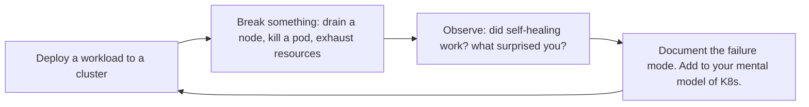

# Docker & Kubernetes Engineer

> **Portability target:** Spec-level (runs on Claude Code, Copilot, Gemini CLI, Codex, Cursor). No vendor-specific frontmatter fields.

Design, build, and operate containerized workloads on Kubernetes. Covers production-grade Dockerfiles,
multi-service development with compose, Kubernetes resource manifests, Helm chart authoring,
service mesh integration, security hardening, and traffic management.

## Route the Request
<!-- QUICK: 30s -- auto-route first, then intent-route -->

### Auto-Route (No User Input Required)
Evaluate these file-system conditions in order. First match wins — jump immediately.

| # | Condition | Action |
|---|-----------|--------|
| A1 | `file_exists("Dockerfile")` AND NOT `file_exists("docker-compose.yml")` AND NOT `file_exists("Chart.yaml")` | Go to "Core Workflow > Phase 1" (Dockerfile) — write or optimize a Dockerfile |
| A2 | `file_exists("docker-compose.yml")` OR `file_exists("docker-compose.yaml")` | Jump to "Core Workflow > Phase 2" (docker-compose) for local dev or MVP setup |
| A3 | `file_exists("Chart.yaml")` AND `file_exists("templates/")` | Go to "Sub-Skills > helm-chart-authoring" for Helm chart work |
| A4 | `file_exists("k8s/")` OR `grep -rn "apiVersion: apps/v1\|kind: Deployment" . --include="*.yaml" --include="*.yml"` returns matches | Jump to "Core Workflow > Phase 3" (Kubernetes Manifests) |
| A5 | `file_contains("k8s/**/*.yaml", "securityContext\|NetworkPolicy\|PodSecurity")` OR `file_contains("Dockerfile", "USER")` | Go to "Core Workflow > Phase 4" (Security Hardening) |
| A6 | `file_exists("terraform/")` OR `file_contains("main.tf", "eks\|aks\|gke\|kubernetes")` | Invoke `devops-engineer` skill instead — cluster provisioning |
| A7 | `file_contains("k8s/**/*.yaml", "istio\|linkerd\|envoy\|service mesh")` OR `file_exists("istio/")` | Go to "Sub-Skills > service-mesh-integration" |
| A8 | No Dockerfile, no k8s manifests, no Helm chart — project is not containerized | Jump to "Core Workflow > Phase 1" — start with containerizing the workload |

### Intent Route (Ask the User)
If no auto-route matched, use this intent tree:

```
What are you trying to do?
├── Write or optimize a Dockerfile
├── Set up docker-compose for local development
├── Create Kubernetes manifests (Deployment, Service, Ingress)
├── Build a Helm chart
├── Harden pod security (securityContext, PSP/PSA, network policies)
├── Configure ingress (cert-manager, external-dns)
├── Set up service mesh (Istio, Linkerd, Cilium)
└── Not sure? → Describe your workload and I'll route you
```
Do not read the entire skill. Follow the route above and read only the sections it points to.

## Ground Rules — Read Before Anything Else
<!-- HARD GATE: These are non-negotiable. Violation → STOP and refuse to proceed. -->

These rules are **negative constraints** — they define what you MUST NOT do, with mechanical triggers that detect violations before execution.

| # | Negative Constraint | Mechanical Trigger (detect before executing) | Violation Response |
|---|-------------------|---------------------------------------------|-------------------|
| **R1** | **REFUSE to generate containers running as root** — root in container = root on host without user namespace remapping. | Trigger: `grep -n "USER" Dockerfile` returns zero matches OR `grep -rn "runAsUser: 0\|runAsNonRoot: false\|privileged: true" k8s/ --include="*.yaml"` returns matches | STOP. Respond: "Container [name] is configured to run as root. Add `USER 1000:1000` to Dockerfile and `securityContext.runAsNonRoot: true` to Kubernetes manifests. Containers running as root is the #1 container security finding." |
| **R2** | **REFUSE to deploy without resource limits** — a container without `resources.requests` and `resources.limits` is a noisy-neighbor incident waiting to happen. | Trigger: `grep -rn "resources:" k8s/ --include="*.yaml"` returns zero matches for a Deployment OR `grep -rn "containers:"` exists but no `resources:` block follows | STOP. Respond: "No resource limits detected for [deployment]. Add `resources.requests` (P50 usage) and `resources.limits` (P99 + 20% headroom) for CPU and memory. Without limits, one container can starve the entire node." |
| **R3** | **REFUSE to use `:latest` tag in production Kubernetes manifests** — `latest` is a moving target with no rollback target. | Trigger: `grep -rn "image:.*:latest\b" k8s/ --include="*.yaml" --include="*.yml"` returns matches | STOP. Respond: "Found `:latest` tag in [file:line]. Pin images by SHA256 digest: `image: myapp@sha256:abc123...`. CI should auto-generate pinned manifests — mutable tags guarantee you deploy something you didn't test." |
| **R4** | **REFUSE to configure the same endpoint for liveness AND readiness probes** — under load, slow endpoint → K8s kills pod → cascade failure. | Trigger: `grep -rn "livenessProbe:" k8s/` AND `grep -rn "readinessProbe:" k8s/` share the same `path:` value in the same Deployment | STOP. Respond: "Liveness and readiness probes share the same endpoint in [deployment]. Liveness: `/healthz` (lightweight, always fast — process alive?). Readiness: `/ready` (service health — ready for traffic?). NEVER the same endpoint." |
| **R5** | **STOP and ASK when the project has < 5 services but user requests Kubernetes** — K8s overhead for 3 services is 10x complexity for 0x benefit. | Trigger: `grep -rn "kind: Deployment" k8s/ --include="*.yaml"` returns ≤ 3 matches AND team size < 5 engineers AND no auto-scaling requirement expressed | STOP. Ask: "This project has [N] services and [M] engineers. Kubernetes control plane alone costs $73+/month (EKS). Consider: docker-compose on a $20-40 VM (handles 1K DAU) or ECS Fargate (managed containers, no K8s ops). Do you have requirements that justify K8s (auto-scaling, self-healing, GitOps, > 5 services)?" |
| **R6** | **DETECT and WARN about Docker layer ordering that breaks caching** — `COPY . .` before `RUN npm ci` invalidates the dependency cache on every code change. | Trigger: `file_contains("Dockerfile", "COPY . .")` appears BEFORE `file_contains("Dockerfile", "RUN npm (ci|install)")` in the same Dockerfile | WARN: "`COPY . .` precedes dependency installation in [Dockerfile]. Reorder: COPY package.json + lock file → RUN npm ci → COPY . . This one reorder can turn an 8-minute build into 30 seconds." |
| **R7** | **DETECT and WARN about `.env` files copied into Docker images** — baked-in `.env` files leak secrets to anyone who pulls the image. | Trigger: `file_contains("Dockerfile", "COPY.*\.env")` OR `file_contains("Dockerfile", "ENV.*=")` with DB credentials / API keys | WARN: "`.env` or credential-bearing ENV directives detected in [Dockerfile]. Use Docker secrets, Kubernetes Secrets (with etcd encryption), or External Secrets Operator. Add `.env*` to `.dockerignore`. Build-time env vars persist in image layers forever." |

## The Expert's Mindset

Containers and Kubernetes are not goals — they're **tools for solving the problem of running workloads reliably, scalably, and consistently across environments**. The best Kubernetes clusters are boring: they run workloads, they heal themselves, and nobody thinks about them until capacity planning.

### Mental Models

| Model | Description |
|---|---|
| **Containers are process wrappers, not VMs** | A container is a process with namespace isolation and cgroup limits. It shares the host kernel. Treat it like a process with boundaries, not a lightweight VM. One process per container. |
| **Kubernetes is a control loop, not a platform** | Kubernetes reconciles desired state with actual state in a continuous loop. You declare what you want; Kubernetes makes it happen. Understanding the reconciliation model is the key to debugging. |
| **The cluster is cattle, not pets** | Nodes are ephemeral. Pods are disposable. If you're manually fixing a broken node, you're doing it wrong. Kubernetes heals by replacing, not repairing. |
| **Simplicity over flexibility** | Kubernetes can do almost anything. That doesn't mean it should. The simplest configuration that meets requirements wins. Every additional controller, CRD, and sidecar is an operational liability. |

### Cognitive Biases in Container Orchestration

| Bias | How It Shows Up | Defense |
|---|---|---|
| **Kubernetes-for-everything** | Deploying a 3-node cluster for a static website because "Kubernetes is best practice" | Match orchestration to needs: a static site on S3+CloudFront is simpler and more reliable than K8s. |
| **Over-configuration** | Setting every possible field in a Deployment spec because you might need it someday | Start minimal. Add configuration only when you have a specific problem to solve. |
| **Resource optimism** | Setting requests too low ("it'll probably use less") and limits too high ("just in case") | Base requests on observed usage over 2 weeks. The Kubernetes scheduler makes decisions based on requests, not hopes. |
| **Latest-tag trap** | Using `:latest` in production and wondering why behavior changed between deployments | Pin to digest or immutable version tags. Rollback is impossible if you don't know what was deployed. |

### What Masters Know That Others Don't

- **The best time to learn Kubernetes debugging is before production goes down.** Practice: drain a node, kill a pod, exhaust disk space, simulate network partition. Do this in staging until it's boring. When it happens in production, you'll be calm.
- **Resource requests and limits are reliability controls, not cost controls.** Wrong requests cause OOMKills and CPU throttling. Wrong limits cause wasted capacity. Get these right before optimizing anything else.
- **Helm charts are not configuration management.** Helm templates are for Kubernetes-native configuration. If you're generating 500 lines of YAML with complex conditionals, your abstraction is wrong. Consider a Kubernetes operator or a simpler templating approach.
- **The cluster API is the source of truth, not your manifests.** `kubectl get` shows reality; your YAML files show intent. When they diverge, trust `kubectl get` and work backwards. Never assume the manifest was applied correctly.

## Operating at Different Levels

Docker/Kubernetes skill scales from writing a Dockerfile to designing multi-cluster Kubernetes architectures.

| Level | Docker/Kubernetes Output Characteristics |
|---|---|
| **L1 — Apprentice** | Writes Dockerfiles from templates. Learns basic kubectl, pod lifecycle, and container concepts. |
| **L2 — Practitioner** | Owns containerization for a service. Writes production Dockerfiles, multi-service docker-compose, and Kubernetes manifests independently. |
| **L3 — Senior** | Designs Kubernetes architecture for a product. Helm chart design, service mesh decisions, pod security, ingress architecture. |
| **L4 — Staff/Principal** | Sets container platform strategy for the org. Cluster fleet management, multi-cluster architecture, operator development. "This is our Kubernetes platform." |
| **L5 — Industry-level** | Creates container orchestration patterns and Kubernetes tooling adopted across the industry. |

**Usage**: Say "as an L3 Kubernetes engineer, design the deployment architecture for..." Default: **L2** (service-level containerization, independent execution).

## When to Use
<!-- QUICK: 30s -- scan the bullet list to decide if this skill fits -->
- Writing or optimizing Dockerfiles for production with multi-stage builds and non-root users
- Composing local development environments with docker-compose for multi-service apps
- Authoring Kubernetes manifests: Deployments, StatefulSets, Services, Ingresses, ConfigMaps, Secrets
- Building and publishing Helm charts for internal or community use
- Configuring service mesh (Istio, Linkerd, Cilium) for mTLS, traffic splitting, and observability
- Hardening pod security: securityContext, PodSecurityStandards, network policies, RBAC
- Designing ingress architectures with cert-manager, external-dns, and multiple ingress controllers

## Decision Trees
<!-- QUICK: 30s -- follow the ASCII tree to your scenario -->
### Docker Compose vs Kubernetes
```
                     ┌──────────────────────────┐
                     │ START: Container           │
                     │ orchestration choice       │
                     └────────────┬─────────────┘
                                  │
                    ┌─────────────▼─────────────┐
                    │ >5 services OR need         │
                    │ auto-scaling/self-healing?  │
                    └────┬──────────────────┬────┘
                         │ YES              │ NO
                    ┌────▼────────┐   ┌─────▼──────────┐
                    │ Team >5 AND │   │ docker-compose  │
                    │ budget >$1K │   │ on single VM    │
                    │ /month?     │   │ ($40-200/mo,    │
                    └────┬────────┘   │ <1K DAU)        │
                         │ YES    NO  └────────────────┘
                    ┌────▼────┐ ┌▼───────────┐
                    │ K8s     │ │ ECS Fargate │
                    │ (EKS/   │ │ or Cloud Run│
                    │ GKE/AKS)│ │ (middle      │
                    │         │ │ ground)      │
                    └─────────┘ └─────────────┘
```
**When to choose docker-compose:** <5 services, <5 engineers, <1K DAU, budget <$500/month, no auto-scaling needed. **When to choose ECS/Cloud Run:** 2-20 services, no K8s expertise, managed containers, $200-500/month. **When to choose K8s:** >5 services, >5 engineers, auto-scaling/self-healing required, budget >$1K/month, GitOps desired.

### Managed K8s vs Self-Managed
```
                     ┌──────────────────────────┐
                     │ START: K8s deployment      │
                     │ model                     │
                     └────────────┬─────────────┘
                                  │
                    ┌─────────────▼─────────────┐
                    │ Team has dedicated 2+       │
                    │ K8s experts AND >50 nodes?  │
                    └────┬──────────────────┬────┘
                         │ YES              │ NO
                    ┌────▼────────┐   ┌─────▼──────────┐
                    │ Self-managed│   │ EKS/GKE/AKS     │
                    │ (Kops/      │   │ (managed control │
                    │ Kubespray)  │   │ plane, $73/mo    │
                    │ — 20-40     │   │ control plane)   │
                    │ hrs/week ops│   │ — 2-8 hrs/week   │
                    └─────────────┘   └────────────────┘
```
**When to choose Managed (EKS/GKE/AKS):** <50 nodes, <2 dedicated K8s experts, want control plane managed, budget for $73-150/month per cluster. **When to choose Self-Managed:** >50 nodes, in-house K8s expertise (2+ FTEs), cost savings on control plane justify 20-40 hrs/week ops overhead.

### Ingress Controller Selection
```
                     ┌──────────────────────────┐
                     │ START: Ingress controller  │
                     └────────────┬─────────────┘
                                  │
                    ┌─────────────▼─────────────┐
                    │ Need advanced rate limiting │
                    │ WAF, or Lua scripting?      │
                    └────┬──────────────────┬────┘
                         │ YES              │ NO
                    ┌────▼────────┐   ┌─────▼──────────┐
                    │ NGINX       │   │ K8s-native     │
                    │ Ingress     │   │ features enough │
                    │ Controller  │   │ → AWS LB        │
                    │ (most       │   │ Controller or   │
                    │  flexible)  │   │ GCE Ingress     │
                    └─────────────┘   └────────────────┘
```
**When to choose NGINX Ingress:** Cross-cloud, need custom Lua/OpenResty, advanced rate limiting, canary by header, >10 routing rules. **When to choose Cloud-Native LB:** Single cloud, simple host/path routing, want cloud WAF integration (AWS WAF), managed TLS termination.

### Service Mesh Decision
```
                     ┌──────────────────────────┐
                     │ START: Service mesh        │
                     │ evaluation                │
                     └────────────┬─────────────┘
                                  │
                    ┌─────────────▼─────────────┐
                    │ Compliance requires mTLS    │
                    │ AND >10 services?           │
                    └────┬──────────────────┬────┘
                         │ YES              │ NO
                    ┌────▼────────┐   ┌─────▼──────────┐
                    │ Istio /     │   │ No service mesh │
                    │ Linkerd /   │   │ — sidecar-free  │
                    │ Cilium      │   │ K8s networking  │
                    │ (adds 0.5-  │   │ + NetworkPolicy │
                    │  2ms latency│   │ is sufficient   │
                    │  per hop)   │   └────────────────┘
                    └─────────────┘
```
**When to deploy Service Mesh:** mTLS required, >10 services, need traffic splitting (canary), need L7 observability per service, team can absorb 0.5-2ms added latency. **When to skip:** <10 services, no mTLS requirement, NetworkPolicy sufficient, latency budget <5ms — mesh adds unnecessary complexity.

### Container Image Security Posture
```
                     ┌──────────────────────────┐
                     │ START: Image security      │
                     │ hardening                 │
                     └────────────┬─────────────┘
                                  │
                    ┌─────────────▼─────────────┐
                    │ Production deployment with  │
                    │ PII or regulated data?      │
                    └────┬──────────────────┬────┘
                         │ YES              │ NO
                    ┌────▼────────┐   ┌─────▼──────────┐
                    │ Distroless  │   │ Alpine/slim     │
                    │ base + non- │   │ base + non-root │
                    │ root + read-│   │ user (standard) │
                    │ only rootfs │   └────────────────┘
                    │ + image     │
                    │ signing     │
                    │ (Cosign)    │
                    └─────────────┘
```
**When to use Distroless+Signing:** PII/PCI/HIPAA workloads, production, CVE surface must be minimized, SLSA L2+ required. **When Alpine/Slim is enough:** Internal tools, no regulated data, simpler Dockerfile maintenance, acceptable CVE risk profile.

## Core Workflow
<!-- QUICK: 30s -- scan phase titles to understand the process -->
### Phase 1 (~15 min): Docker Image Engineering
1. Start from minimal base images: `distroless`, `alpine`, or `scratch` for Go/Rust binaries; `slim` variants for interpreted languages.
2. Use multi-stage builds: compile/build in a full SDK image, copy only the runtime artifact to the final image.
3. Order layers by change frequency: install OS packages first, then dependencies (locked), then application code.
4. Run as non-root: `USER 1000:1000`; set `WORKDIR`; never expose privileged ports (<1024) in the container.
5. Use `.dockerignore` to exclude `.git`, `node_modules`, build artifacts, and secrets.
6. Pin base images by digest: `FROM node:20-alpine@sha256:abc...` — not by tag.
7. Add HEALTHCHECK instructions for container orchestrators to detect hung processes.
8. Leverage BuildKit features: `--mount=type=cache` for package manager caches, `--mount=type=secret` for credentials during build.

### Phase 2 (~30 min): Kubernetes Manifests
1. Use Deployments for stateless workloads, StatefulSets for databases/queues with persistent identity, DaemonSets for node-level agents.
2. Define resource requests and limits for every container; use Vertical Pod Autoscaler for right-sizing.
3. Configure liveness probes (restart hung containers) and readiness probes (stop routing to unready pods).
4. Use PodDisruptionBudgets to ensure minimum availability during voluntary disruptions.
5. Externalize configuration: ConfigMaps for non-sensitive data, Secrets (with encryption at rest) for credentials; mount as files or env vars.
6. Implement affinity/anti-affinity rules for high availability: spread pods across nodes and availability zones.
7. Set PodSecurityStandard to `restricted` by default; relax only with explicit exceptions and justifications.
8. Apply NetworkPolicy to deny all traffic by default; explicitly allow only required ingress/egress flows.

### Phase 3 (~20 min): Helm Charts
1. Structure charts with `templates/`, `values.yaml`, `Chart.yaml`, and optional `values-{env}.yaml` environment overrides.
2. Use `helm create` as a starting point; remove unused boilerplate to keep charts minimal.
3. Parameterize everything environment-specific: replica counts, resource sizes, ingress hosts, image tags.
4. Use named templates (`_helpers.tpl`) for repeated labels, selectors, and naming conventions.
5. Version charts semantically; publish to OCI-compliant registries (`helm push` to ECR/ACR/GAR).
6. Test charts with `helm lint`, `helm template --debug`, and `helm unittest` plugin.
7. Sign charts with `helm package --sign` using GPG or Cosign keys.

### Phase 4 (~15 min): Service Mesh and Traffic Management
1. Deploy a service mesh (Istio/Ambient, Linkerd, Cilium) when you need mTLS, traffic splitting, or fine-grained observability.
2. Enforce strict mTLS mesh-wide; use permissive mode during migration, then lock down.
3. Configure traffic splitting for canary deployments: 90% → stable, 10% → canary; shift progressively based on metrics.
4. Use request timeouts, circuit breakers, and retries at the sidecar level to implement resilience patterns.
5. Ingress: use cert-manager with Let's Encrypt for automatic TLS; external-dns for automatic Route53/Cloud DNS record creation.


### Cross-skills Integration

| Step | Skill | What it produces |
|------|-------|------------------|
| **Before** | backend-developer | Application code ready for containerization |
| **This** | docker-kubernetes | Dockerfile, Kubernetes manifests, Helm charts |
| **After** | ci-cd-builder | Pipeline that builds and pushes container images |

Common chains:
- **Chain**: backend-developer → docker-kubernetes → ci-cd-builder — App is containerized; CI/CD pipeline automates image builds and deployments
- **Chain**: devops-engineer → docker-kubernetes → platform-engineer — Infrastructure is provisioned; containers are deployed; platform provides self-service container orchestration

## Sub-Skills
<!-- QUICK: 30s -- table of deeper dives by topic -->
When this skill is invoked, the agent may need to drill into these specialized areas:

| Sub-Skill | When to Use |
|-----------|-------------|
| `dockerfile-optimization` | Writing production Dockerfiles with multi-stage builds, minimal base images, and layer caching |
| `docker-compose` | Orchestrating multi-service local development environments with networking and volumes |
| `kubernetes-manifests` | Authoring Deployments, StatefulSets, Services, Ingresses, ConfigMaps, and Secrets |
| `helm-charts` | Building, versioning, and publishing Helm charts with templating and environment overrides |
| `pod-security` | Hardening containers with securityContext, PodSecurityStandards, NetworkPolicies, and RBAC |
| `service-mesh-integration` | Deploying Istio, Linkerd, or Cilium for mTLS, traffic splitting, and observability |
| `ingress-traffic-management` | Configuring cert-manager, external-dns, multiple ingress controllers, and load balancing |

## Cross-Skill Coordination

| Upstream Skill | What You Receive | When to Involve |
|---|---|---|
| `devops-engineer` | Cluster API access, Helm repository management, GitOps integration, node configuration | Before deploying workloads or configuring Helm charts |
| `cloud-architect` | Instance type selection, VPC CNI configuration, service mesh architecture, cluster autoscaling parameters | Before designing node groups or cluster networking |
| `backend-developer` | Multi-stage build patterns, base image requirements, resource requests/limits, health check design | Before writing Dockerfiles or defining resource specs |

| Downstream Skill | What You Provide | Impact of Delay |
|---|---|---|
| `devops-engineer` | Cluster configuration, Helm chart standards, ingress/egress rules, pod security policies | Infrastructure teams can't deploy to Kubernetes — platform blocked |
| `site-reliability-engineer` | Container reliability patterns, health probe configuration, resource limit enforcement | SRE can't guarantee container uptime — reliability targets at risk |
| `platform-engineer` | Containerized workloads and Helm charts deployable via platform golden paths | Developer self-service stuck — no deployable artifacts |
| `observability-engineer` | Container metrics, PodMonitors, OpenTelemetry sidecar injection, Fluent Bit config | Can't observe container workloads — blind spots in monitoring |


**What good looks like:** Docker image builds in under 5 minutes and is under 200MB. Kubernetes manifests pass `kubeval` validation. Pod startup time < 10 seconds. Liveness and readiness probes configured on every deployment. Resource requests and limits set on every container.

## Proactive Triggers
<!-- STANDARD: 2min — surface these WITHOUT being asked -->

- **Docker image build time exceeds 10 minutes** → Layer cache is likely broken. Check: are `COPY . .` instructions placed before `RUN npm install`? Reorder layers so dependencies install before application code copy. Cache miss on dependency layer = full rebuild. 🔴
- **Container running as root in production** → `USER` directive missing from Dockerfile. This is a security incident waiting to happen — root container escape = root on host. Add `USER 1000:1000` and `securityContext.runAsNonRoot: true`. 🔴
- **Pod restarting every 30 seconds — liveness probe failing** → Check if liveness probe uses the same endpoint as readiness probe. During traffic spikes, the endpoint slows down and K8s kills healthy pods. Liveness = `/healthz` (fast). Readiness = `/ready` (service health). 🟠
- **Image tag `:latest` found in production manifest** → `latest` is a mutable tag — what you deployed yesterday is not what you're running today. Pin images by SHA256 digest. CI should auto-replace tags with digests in deployment manifests. 🔴
- **No resource limits on production Deployment** → A memory leak in one pod can OOM the entire node, cascading to other workloads. Set `resources.limits.memory` and `resources.requests.cpu` for every container. Without limits, one bad deploy takes down the cluster. 🔴
- **Helm release stuck in `pending-upgrade` for > 5 minutes** → Helm hooks are likely hung. Check `helm history <release>` and `kubectl get jobs -l helm.sh/hook`. Hung pre-upgrade hook = blocked deployment. Add `helm.sh/hook-delete-policy: before-hook-creation` to clean up failed hooks. 🟡
- **NodePort/port 80 exposed to public internet without TLS** → Ingress/load balancer exposing plain HTTP. Use cert-manager to auto-provision Let's Encrypt certificates. Add `ingress.kubernetes.io/force-ssl-redirect: "true"` annotation. 🟠
- **docker-compose secrets in git repo** → `.env` file committed with database passwords, API keys. Add `.env` to `.gitignore`. Use `docker-compose secrets` or environment variable injection from CI/CD. Rotate exposed credentials immediately. 🔴

## Best Practices
<!-- STANDARD: 3min -- rules extracted from production experience -->
<!-- DEEP: 10+min -->
- **One process per container**: use sidecar containers for log shippers, proxies, or metrics exporters.
- **Images are immutable**: tag with git SHA, never use `:latest` in production manifests.
- **Secrets at rest**: enable encryption at rest in etcd; use External Secrets Operator or Sealed Secrets for git-safe storage.
- **Resource limits are mandatory**: without limits, a memory leak in one pod can OOM the entire node.
- **Use `kubectl diff` before applying**: preview changes and catch unintended mutations.
- **Scan images**: integrate Trivy, Grype, or Snyk into CI; block deployment on HIGH/CRITICAL CVEs.

## Anti-Patterns
<!-- DEEP: 5min -- each anti-pattern includes machine-detectable patterns -->

| ❌ Anti-Pattern | ✅ Do This Instead | 🔍 Detect (grep / lint) | 🛡️ Auto-Prevent |
|-----------------|---------------------|--------------------------|-------------------|
| "Let's use Kubernetes for our 3-service MVP" | docker-compose on a $20 VM handles 1K DAU; migrate to K8s when: > 5 services, need auto-scaling, or team > 5 engineers | `grep -rn "kind: Deployment" k8s/ --include="*.yaml" \| wc -l` → ≤ 3 Deployments AND no HPA configured → K8s overkill | Pre-commit hook: if Deployments ≤ 3 AND team size < 5 (from CODEOWNERS), warn "Consider docker-compose or ECS Fargate" |
| `COPY . .` before `RUN npm install` in Dockerfile | Order layers by change frequency: OS packages → dependencies (locked) → application code. `COPY package*.json ./` THEN `RUN npm ci` THEN `COPY . .` | `grep -n "COPY \. \." Dockerfile` shows line N AND `grep -n "RUN npm (ci\|install)" Dockerfile` shows line M where M < N → wrong order | `hadolint` rule DL3059; pre-commit hook checking `COPY . .` line number < `RUN npm ci` line number |
| Using `:latest` tag in production deployment manifests | Pin images by SHA256 digest: `image: myapp@sha256:abc123...`; CI should auto-generate pinned manifests | `grep -rn "image:.*:latest\b" k8s/ --include="*.yaml"` → finds mutable tags in production manifests | OPA/Gatekeeper admission policy: deny Deployments with `:latest` tag in production namespaces |
| Setting resource limits based on average usage from load testing | Set requests at P50, limits at P99+20% headroom over a 7-day production window; use VPA recommender | `grep -rn "resources:" k8s/ --include="*.yaml" -A 5` shows `memory:` values with no percentile basis documented → average-based limits | VPA in recommendation mode auto-suggesting optimal limits; CI check requiring VPA annotation on all Deployments |
| Same endpoint for liveness AND readiness probes | Liveness: `/healthz` (lightweight, always fast). Readiness: `/ready` (service health). NEVER the same endpoint | `grep -rn "livenessProbe:" k8s/ -A 3` AND `grep -rn "readinessProbe:" k8s/ -A 3` in same Deployment with identical `path:` → same endpoint | OPA policy: deny Deployment where `livenessProbe.httpGet.path == readinessProbe.httpGet.path` |
| `chmod 777` or running as root "to make it work" | Every Dockerfile MUST have `USER 1000:1000`; enforce with PodSecurityStandard `restricted` | `grep -rn "chmod 777\|USER root\|USER 0" Dockerfile` OR `grep -rn "runAsUser: 0\|privileged: true" k8s/` → root/permissive config | `hadolint` rule DL3002; PodSecurityStandard `restricted` enforced cluster-wide; CI blocks images without USER directive |
| Copying `.env` files into Docker images | Use Docker secrets, Kubernetes Secrets (with etcd encryption), or External Secrets Operator | `grep -rn "COPY.*\.env\|ENV.*=" Dockerfile` with credential-like values → baked-in env files | `.dockerignore` template with `.env*` rule; `hadolint` + Trivy scan blocking images with `.env` files |
| Image vulnerability scan passed — but the image hasn't been scanned in 3 months | Integrate scanning into CI/CD: every image build must be scanned before deploy; block deployment on HIGH/CRITICAL findings | `grep -rn "trivy\|snyk\|grype\|clair" .github/workflows/` returns zero matches → no image scanning in pipeline | Trivy scan step auto-injected into CI template; OPA admission controller blocking unscanned images in production |

## When Kubernetes is Overkill

```
Team < 5 engineers? → Overkill. Use docker-compose or managed PaaS.
< 5 services? → Overkill. docker-compose + a small VM.
< 100 req/s total? → Overkill. A single VM handles this easily.
Monthly infra budget < $500? → Overkill. K8s control plane alone costs $73/month (EKS).
No multi-service orchestration needed? → Overkill. docker-compose is enough.

Check 2+ boxes? DON'T use Kubernetes. Use one of:
- docker-compose (single VM, 0-5 services, < $100/month)
- ECS Fargate (managed containers, no K8s ops)
- Cloud Run (serverless containers, zero ops)
- Railway/Render/Fly.io (PaaS, heroku-like, < 5 services)
```

## docker-compose for MVP

```yaml
# Production-ready MVP stack: docker-compose on single $40/month VM
version: '3.8'
services:
  app:
    build: .
    ports: ['3000:3000']
    depends_on: [db, redis]
    restart: unless-stopped
  db:
    image: postgres:16-alpine
    volumes: [pgdata:/var/lib/postgresql/data]
    restart: unless-stopped
  redis:
    image: redis:7-alpine
    restart: unless-stopped
volumes:
  pgdata:
```
**Ceiling:** 1K-10K DAU, 50-200 req/s. Migrate to managed DB (RDS) first, then to K8s when you need auto-scaling.

## Managed K8s vs Self-Managed: Cost Comparison

| Approach | Monthly Cost (3 nodes) | Ops Overhead | Best For |
|----------|----------------------|--------------|----------|
| **docker-compose on VM** | $40-200/month | 1-2 hrs/week | MVP, < 5 services, < 1K DAU |
| **ECS Fargate** | $200-500/month | 30 min/week | < 20 services, no K8s expertise |
| **EKS (managed K8s)** | $600-1.5K/month | 4-8 hrs/week | 5-50 services, team > 5 |
| **GKE (managed K8s)** | $500-1.2K/month | 2-4 hrs/week | Autopilot mode: pay per pod |
| **Self-managed K8s** | $300-800/month (nodes only) | 20-40 hrs/week (dedicated person) | 50+ nodes, team > 20 with K8s expertise |
| **K3s/MicroK8s (edge)** | $100-300/month | 4-8 hrs/week | Edge/IoT, < 10 nodes |

**K8s hidden costs:** Control plane management, etcd backups, cert rotation, CNI troubleshooting, RBAC, network policies, pod security policies, Helm chart maintenance, ingress controller, cert-manager, external-dns, monitoring stack (Prometheus + Grafana). Budget 20-40 hrs/week for self-managed.

### K8s Readiness Checklist
Don't adopt K8s until you can answer YES to:
- [ ] Team > 5 engineers comfortable with containers
- [ ] > 5 services deployed independently
- [ ] Need auto-scaling beyond what vertical scaling provides
- [ ] Need self-healing (restart failed containers automatically)
- [ ] Need declarative configuration (GitOps with Argo CD/Flux)
- [ ] Willing to invest 20+ hrs/week in K8s operations (or pay for managed)
- [ ] Monthly infra budget > $1,000

## Scale Depth: Solo → Small → Medium → Enterprise

### Solo (1 person, 0-100 users)
- **What changes**: Docker = `docker-compose up` on a single VM. One Dockerfile (multi-stage). No orchestration. No registry (build on deploy target). Restart policy: `unless-stopped`. Volumes for persistence.
- **What to skip**: Kubernetes. Docker Swarm. Container registry. Image scanning. Resource limits. Network policies. Helm charts. GitOps.
- **Coordination**: You write the Dockerfile + compose file. Done.

### Small Team (2-10 people, 100-10K users)
- **What changes**: Docker Compose for dev/staging. Container registry (Docker Hub, ECR, GHCR). CI builds and pushes images. Multi-stage builds optimized. Non-root users. Health checks. docker-compose for production on 1-2 VMs, or ECS Fargate. Image scanning in CI.
- **What to skip**: Kubernetes. Service mesh. GitOps. Pod disruption budgets. Network policies beyond basic.
- **Coordination**: Dockerfiles reviewed in PR. Image tags follow semver. CI manages build + push.

### Medium Team (10-50 people, 10K-1M users)
- **What changes**: Kubernetes (EKS/GKE/AKS, managed). Helm charts for deployments. GitOps (Argo CD). Resource requests + limits. Liveness/readiness probes. PodDisruptionBudget. NetworkPolicy (deny all, allow explicit). cert-manager + external-dns. Container scanning in CI (block CRITICAL/HIGH). Multi-environment K8s clusters.
- **What to skip**: Self-managed Kubernetes. Service mesh (Istio/Linkerd) — unless mTLS required. Multi-cluster. Custom operators.
- **Coordination**: K8s platform owner (1-2 people). Weekly K8s review. Helm chart PR review.

### Enterprise (50+ people, 1M+ users)
- **What changes**: Multi-cluster Kubernetes. Service mesh (Istio/Linkerd). Platform team managing K8s. Custom operators. PodSecurityPolicy/PSS enforced. OPA/Gatekeeper for policy. K8s autoscaling (HPA + cluster autoscaler). Secrets management (External Secrets Operator + Vault). Chaos engineering. Multi-region clusters. K8s cost monitoring (Kubecost).
- **What's full production**: K8s platform as a product. Self-service namespaces. Policy as code. Automated cluster lifecycle. K8s upgrade automation.
- **Coordination**: K8s platform team weekly. Cluster upgrade planning monthly. Security policy review quarterly. Capacity planning quarterly.

### Transition Triggers
- **Solo → Small**: Second developer. Need consistent environments across dev/prod.
- **Small → Medium**: 5+ services. Need auto-scaling. Need self-healing. docker-compose can't keep up.
- **Medium → Enterprise**: 10+ clusters or multi-region. 50+ services. Dedicated platform team justified.

## Error Decoder
<!-- DEEP: 5min -- each entry includes a console-string matcher for automatic recovery loops -->

| 🖥️ Console Match (grep pattern) | Symptom | Root Cause | Fix | 🔄 Auto-Recovery Loop |
|---|---|---|---|---|
| `grep -rn "USER" Dockerfile` returns zero matches AND `kubectl get pods -o yaml | grep -A2 securityContext | grep "runAsUser: 0"` shows root | Container running as root — attacker who gained shell access had full node privileges | Dockerfile didn't have `USER` directive; container defaulted to root (UID 0); root in container = root on host without user namespace remapping | Add `USER 1000:1000` to Dockerfile; enforce PodSecurityStandard `restricted` level; add CI check scanning Dockerfiles for missing USER directive; set `runAsNonRoot: true` in Kubernetes manifests | 1. `grep -rn "USER\|runAsUser" Dockerfile k8s/` 2. Add `USER 1000:1000` to Dockerfile 3. Add `securityContext.runAsNonRoot: true` to k8s manifests 4. Enable PodSecurityStandard `restricted` |
| `grep -rn "trivy\|snyk\|grype" .github/workflows/` returns zero matches AND `docker images --digests` shows images older than 30 days | Image vulnerability scan passed — but the image hadn't been scanned in 3 months | Container scan was configured as manual step in release process, not enforced in CI; last scan covered a different image tag from 3 months ago | Integrate image scanning into CI/CD pipeline — every image build must be scanned before deploy; block deployment on HIGH/CRITICAL findings; use admission controllers to prevent deployment of unscanned images | 1. Add Trivy to CI: `trivy image --severity HIGH,CRITICAL <image>` 2. Block deployment on critical CVEs 3. Add OPA policy: deny unscanned images 4. Schedule daily re-scan of all deployed images |
| `kubectl describe pod <pod> | grep "OOMKilled"` AND `kubectl get pods -o yaml | grep "memory: 256Mi"` | Pod OOMKilled every 4 hours — 99th percentile memory usage was 3× the resource limit | Resource limits set to `memory: 256Mi` based on average usage during load testing; one API call spikes to 800Mi — limit based on average, not P99 | Set resource requests at P50 usage and limits at P99 usage over a 7-day window; use VPA in recommendation mode; test with production traffic patterns before setting final limits | 1. Enable VPA recommender: `kubectl apply -f vpa-recommender.yaml` 2. Collect 7-day memory metrics at P50/P95/P99 3. Set `requests` at P50, `limits` at P99 + 20% 4. Monitor OOMKilled count drop to zero |
| `kubectl get pods -o yaml | grep "image:" | grep -v "@sha256" | wc -l` returns > 0 | Image digest pinning failed — deployment rolled back because tag changed between test and deploy | Helm chart referenced image by tag (`myapp:v1.2.3`), not digest; between test and deploy, a new build pushed to the same tag | Always reference images by SHA256 digest; pipeline should: build with SHA tag, scan, test, promote digest through environments; prefer digests for all production deployments | 1. `grep -rn "image:.*:v" k8s/` to find tag-based references 2. Replace with `image: myapp@sha256:$(docker inspect --format='{{.RepoDigests}}' myapp:v1.2.3 | grep -oP 'sha256:\S+')` 3. Update CI to output pinned manifest 4. Verify with `kubectl get pods -o yaml | grep @sha256` |
| `kubectl describe pod <pod> | grep -A10 "Liveness\|Readiness" | grep "path:" | sort | uniq -c | grep "2"` shows same path used for both | Liveness probe incorrectly configured — Kubernetes killed healthy pods during traffic spike | Liveness probe used same endpoint as readiness probe; during traffic spike, endpoint became slow (> 5s); K8s interpreted slow response as dead container and restarted healthy pods | Liveness: `/healthz` (lightweight, returns quickly regardless of load). Readiness: `/ready` (actual service health). Never use the same probe for both | 1. `grep -rn "livenessProbe\|readinessProbe" k8s/ -A 5` to find shared endpoints 2. Split into `/healthz` (liveness) and `/ready` (readiness) 3. Set `initialDelaySeconds: 10` and `periodSeconds: 5` for liveness 4. Verify no cascade restarts under load |
| `docker build --no-cache . 2>&1 | grep "CACHED\|---> Using cache" | wc -l` returns < 3 AND build takes > 5 min | Docker build cache always misses — every build takes 8+ minutes | `COPY . .` placed before `RUN npm ci` in Dockerfile; changing any source file invalidates the dependency layer cache | Reorder: `COPY package*.json ./` → `RUN npm ci` → `COPY . .` Application code changes only invalidate the final COPY layer; dependencies stay cached | 1. Move `COPY package*.json ./` and `RUN npm ci` before `COPY . .` 2. Rebuild: `docker build --progress=plain .` 3. Verify cache hits: `docker build . 2>&1 | grep CACHED | wc -l` should be ≥ 3 4. Add `hadolint` CI check for layer ordering |

## What Good Looks Like

> Containers are minimal, pinned by SHA256 digest, and run as non-root with all Linux security capabilities dropped. Kubernetes manifests are templated, versioned in Git, and deployed via GitOps — the cluster state always matches the repo. Resources have appropriate requests and limits, and the cluster auto-scales horizontally and vertically without human intervention. Health probes are configured correctly, and PodDisruptionBudgets ensure zero downtime during voluntary disruptions. The cluster self-heals from node failures, and every workload survives a random pod deletion without dropping a single request.

## Production Checklist
<!-- QUICK: 30s -- binary pass/fail items. Each has a mechanical validation command. -->

| ID | Checklist Item | Validation Command | Auto-Fix |
|----|---------------|-------------------|----------|
| **[S1]** | All images pinned by SHA256 digest, not mutable tags | `grep -rn "image:.*:latest\b\|image:.*:v[0-9]" k8s/ --include="*.yaml" \| wc -l` → 0 | Replace tags with `@sha256:...` digests |
| **[S2]** | Multi-stage builds produce minimal images; no build tools in final layer | `grep -rn "FROM.*as\|FROM.*AS" Dockerfile \| wc -l` → ≥ 2 | Convert single-stage Dockerfile to multi-stage |
| **[S3]** | Non-root user configured in every container; `allowPrivilegeEscalation: false` | `grep -rn "USER" Dockerfile \| wc -l` → ≥ 1 AND `grep -rn "allowPrivilegeEscalation:\s*false" k8s/ \| wc -l` → ≥ 1 | Add `USER 1000:1000` + `allowPrivilegeEscalation: false` |
| **[S4]** | Resource requests and limits set for every container in every namespace | `kubectl get pods -A -o json \| jq '[.items[].spec.containers[] | select(.resources.requests == null or .resources.limits == null)] | length'` → 0 | Add `resources.requests` and `resources.limits` via VPA recommender |
| **[S5]** | Liveness and readiness probes configured with appropriate initial delays | `kubectl get deployments -A -o json \| jq '[.items[] | select(.spec.template.spec.containers[].livenessProbe == null or .spec.template.spec.containers[].readinessProbe == null)] | length'` → 0 | Add `/healthz` liveness and `/ready` readiness probes |
| **[S6]** | PodDisruptionBudget defined for all deployments with replicas > 1 | `kubectl get pdb -A \| wc -l` → ≥ number of deployments with replicas > 1 | Add PDB: `minAvailable: 1` or `maxUnavailable: 25%` |
| **[S7]** | NetworkPolicy denies all by default; explicit allow rules for required flows | `kubectl get networkpolicies -A \| wc -l` → ≥ 1 per namespace | Add deny-all NetworkPolicy + explicit allow rules per service |
| **[S8]** | PodSecurityStandard enforced at `restricted` level cluster-wide | `kubectl get pods -A -o json \| jq '[.items[].spec.containers[] | select(.securityContext.allowPrivilegeEscalation != false)] | length'` → 0 | Apply `PodSecurity` admission label: `pod-security.kubernetes.io/enforce: restricted` |
| **[S9]** | Image vulnerability scanning in CI pipeline; HIGH/CRITICAL CVEs block deployment | `grep -rn "trivy\|snyk\|grype" .github/workflows/ \| wc -l` → ≥ 1 | Add `aquasecurity/trivy-action` with `--severity HIGH,CRITICAL` |
| **[S10]** | Helm charts versioned, linted, and tested before release | `grep -rn "helm lint\|helm unittest\|helm test" .github/workflows/ \| wc -l` → ≥ 2 | Add `helm lint` + `helm unittest` to CI pipeline |
| **[S11]** | cert-manager and external-dns configured for automated TLS and DNS | `kubectl get pods -n cert-manager \| wc -l` → ≥ 1 AND `kubectl get pods -n external-dns \| wc -l` → ≥ 1 | `helm install cert-manager jetstack/cert-manager` + `helm install external-dns` |

## Footguns
<!-- DEEP: 10+min — war stories from production containers and Kubernetes -->

| Footgun | What Happened | Root Cause | How to Prevent |
|---------|---------------|------------|----------------|
| Kubernetes node ran out of PID space at 4:00 PM — 47 pods on the node became zombies, and the kubelet couldn't restart anything because it needed a PID to fork | A Java application with a thread leak (200 threads/hour growth rate) ran on a node with default `--pod-max-pids` of -1 (unlimited). After 18 days of uptime, the node hit the kernel's `kernel.pid_max` of 32,768. The kubelet itself couldn't fork to restart pods or report node status. The node was marked NotReady after the 40-second `node-monitor-grace-period`, but the pods kept serving traffic in a degraded state for 5 minutes before the load balancer health checks detected the failure. 47 pods serving 12,000 RPM went dark. | No per-pod PID limit was set. The thread leak was a known low-priority bug. The node's PID exhaustion was non-recoverable without a hard reboot because the kubelet itself was affected. | **Set `podPidsLimit` in kubelet config: 4096 for most workloads, 16384 for heavy services.** Monitor `container_processes` metric via cAdvisor — alert at 80% of the limit per pod AND per node. Set `--node-monitor-grace-period` to 20s for faster node cordoning. Implement `spec.terminationGracePeriodSeconds` and preStop hooks so pods can drain connections before SIGKILL. |
| Docker `latest` tag in production coupled with `imagePullPolicy: Always` — a broken midnight push took down 600 pods on 3 continents simultaneously | A platform team published container images to ECR with a CI job that tagged every build as `:latest`. A developer's midnight hotfix pushed a broken image that crashed on startup with a nil pointer panic. All deployments using `imagePullPolicy: Always` with the `latest` tag pulled and restarted simultaneously when Kubernetes' liveness probe failed after `initialDelaySeconds: 30`. The rolling update detected crash loops and got stuck — 600 pods across 3 regions were down for 23 minutes while someone found and force-pushed the previous image digest. | `:latest` is mutable — it's a moving pointer, not a version. Nobody knew which specific digest was running before the incident because only the tag was logged. | **Never use `:latest` tag in any environment beyond local development.** Pin to immutable tags: semantic versions (`v1.2.3`), git commit SHA (`abc1234`), or build numbers. Better: pin by digest (`image@sha256:...`) in production. Use a mutating admission webhook (Kyverno, OPA Gatekeeper) to reject pods with `:latest` tag or `imagePullPolicy: Always` in production namespaces. |
| Helm chart `recreate` strategy on a StatefulSet with 900GB PersistentVolume — took 4 hours to reschedule because the PV was stuck in `Terminating` with a finalizer from a deleted CSI driver | A Helm upgrade changed a StatefulSet's `updateStrategy` from `RollingUpdate` to `Recreate`. Kubernetes deleted the pod first — but the CSI driver had been uninstalled during a cluster upgrade the previous week. The `kubernetes.io/pv-protection` finalizer prevented PV deletion because the CSI driver couldn't unmount the volume. The PV was stuck in `Terminating` for 3.5 hours. The replacement pod couldn't schedule because it needed the same PV. The database was offline for 4 hours until someone manually force-deleted the PV finalizer via `kubectl patch pv`. | The CSI driver was removed without checking for attached volumes. The Helm chart change triggered pod deletion without testing on a staging cluster first. The `Recreate` strategy for stateful workloads was not reviewed — a junior engineer added it to fix a different issue. | **Never use `Recreate` strategy on StatefulSets without a documented rollback plan that includes volume recovery steps.** Before removing CSI drivers: `kubectl get volumeattachments` and `kubectl get pv --field-selector=status.phase=Bound`. Use `RollingUpdate` with `partition` for StatefulSets to control rollout order. Add a pre-upgrade Helm hook that verifies CSI driver health. |
| CPU limits set too low on a Go service with GOMAXPROCS=32 — the container was throttled to 200ms CPU per 100ms window, but the Go runtime thought it had 32 cores, causing 98th-percentile latency spikes from 12ms to 45 seconds | A Go microservice was assigned `resources.limits.cpu: 2` but was compiled without setting `GOMAXPROCS`. The Go runtime read `/proc/cpuinfo`, saw 32 cores, and spawned 32 OS threads in the scheduler. CFS throttling in the kernel allocated 200ms of CPU per 100ms period — but with 32 threads competing, each thread got ~6ms of CPU per period. Goroutines were scheduled across all threads but executed in tiny slices. Under load, the GC STW pause compounded the problem: the GC paused all 32 threads simultaneously, each waiting for its slice, extending pauses from milliseconds to seconds. | Container CPU limits don't modify `/proc/cpuinfo`. The Go runtime reads the host CPU count, not the cgroup limit. This affects all languages that use `/proc/cpuinfo` for thread pool sizing: Python (with multiprocessing), Node.js (worker threads), JVM (GC threads). | **Set GOMAXPROCS to match CPU limits: use `automaxprocs` (uber-go/automaxprocs) which reads cgroup CPU quota.** For JVM: `-XX:ActiveProcessorCount=<limit>`. For Node.js: `UV_THREADPOOL_SIZE=<limit>`. For Python: set `OMP_NUM_THREADS`. Add a mutating webhook that injects these env vars based on pod CPU limits. Monitor `container_cpu_cfs_throttled_seconds_total` — any throttling > 1% is a problem. |
| Kubernetes CronJob with `concurrencyPolicy: Forbid` silently skipped 14 hourly jobs because a single stuck job consumed the slot for a week | A data pipeline CronJob was configured with `concurrencyPolicy: Forbid` to prevent duplicate runs. A transient network partition caused one job invocation to hang waiting for an external API. The cron controller saw the running job, respected `Forbid`, and skipped the next scheduled invocation. The `startingDeadlineSeconds` was set to 3600 (1 hour), so if a job was skipped and the next job also couldn't start within 1 hour, it too was skipped. The hung job held the slot for 7 days — 167 hourly invocations were silently skipped. No alert fired because the CronJob status reported `lastScheduleTime` updating normally — "scheduled" ≠ "executed." | `concurrencyPolicy: Forbid` with no timeout and no alerting on skipped jobs. The CronJob controller silently skips jobs; it doesn't increment `failedJobsHistoryLimit`. The monitoring dashboard showed "job scheduled" not "job completed successfully." | **Always set `startingDeadlineSeconds` on CronJobs — missing this field means missed jobs are never retried.** Set `activeDeadlineSeconds` to cap how long any single invocation can run. Configure `concurrencyPolicy: Replace` only when you're confident new runs can clean up after old ones. Monitor `kube_cronjob_spec_starting_deadline_seconds` and alert on `kube_cronjob_status_last_schedule_time` drifting more than 2x the schedule interval. Create an external reconciliation job that verifies expected vs. actual CronJob invocations daily. |

## Calibration — How to Know Your Level
<!-- STANDARD: 3min — honest self-assessment rubric -->

| You Know You're Stuck at L1 When... | You Know You've Reached L2 When... | You Know You're L3 When... |
|---|---|---|
| You `docker run` from a blog post without reading the Dockerfile. You've never looked at a container's `docker history` or know what layers are | Every container in production has an SBOM, pinned base image digests, and passes Trivy/Grype scan in CI. You can read a Dockerfile and predict the layer count and total image size within 10% | You've migrated an organization of 50+ services from EC2 to Kubernetes with zero downtime, and the platform automatically right-sizes CPU/memory requests based on 30-day actual usage trends |
| You set requests = limits because you read it's "best practice" — you don't know what CFS throttling is or why your 99th percentile latency is 40x worse under load | You know the difference between compressible (CPU) and incompressible (memory) resources. Your services have `requests = 80th percentile actual usage` and `limits = 2x requests` for CPU, and you monitor throttling per-container | You've tuned a 200-node production cluster where no pod has been OOMKilled in 6 months, no node has exceeded 70% CPU, and the cluster's bin-packing efficiency is above 85% — and you can prove all three with Grafana dashboards |
| You install Helm charts with `helm install stable/mysql` and don't know what RBAC permissions the chart requested — you trust the internet | You read every Helm chart's values.yaml before deploying; you've caught and fixed insecure defaults (privileged containers, hostNetwork, writable rootfs) in 3 community charts this year | You've built a Helm chart library used by 40+ teams, with automated testing (helm-unittest + terratest), a schema validation that rejects invalid values files at PR time, and a chart museum with versioned, signed artifacts |

**The Litmus Test:** Can you receive a "cluster down" page at 2:00 AM, SSH into the control plane node with a broken API server, diagnose the problem from etcd logs and kubelet journals without `kubectl` working, and restore the cluster to serving production traffic in under 30 minutes?

## Deliberate Practice

Kubernetes mastery is built through controlled destruction. The best K8s engineers have broken clusters in every possible way — in sandboxes, not in production.



| Level | Practice Routine | Frequency |
|---|---|---|
| **Novice** | Deploy a simple app to a local cluster (kind/minikube) using raw YAML, then Helm, then Kustomize | Weekly |
| **Competent** | Simulate a node failure: drain a node, watch pods reschedule, verify availability | Monthly |
| **Expert** | Run a full cluster failure scenario: control plane outage, etcd corruption recovery, network partition | Quarterly |
| **Master** | Design a multi-cluster architecture that survives a region failure — test it, document it, share it | Annually |

**The One Highest-Leverage Activity**: Once a month, break your staging cluster in a way you've never broken it before. The failure mode you discover is the one that would have caused a P1 incident in production. Fix the gap before it finds you.

## References
<!-- QUICK: 30s -- links to deeper reading -->
- Dockerfile Best Practices: https://docs.docker.com/develop/develop-images/dockerfile_best-practices/
- Kubernetes Pod Security Standards: https://kubernetes.io/docs/concepts/security/pod-security-standards/
- Helm Best Practices: https://helm.sh/docs/chart_best_practices/
- Istio Traffic Management: https://istio.io/latest/docs/concepts/traffic-management/
- Trivy Vulnerability Scanner: https://github.com/aquasecurity/trivy
