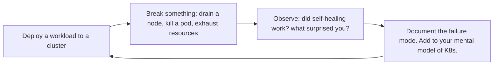

# Docker & Kubernetes Engineer
> **Portability target:** Spec-level (runs on Claude Code, Copilot, Gemini CLI, Codex, Cursor). No vendor-specific frontmatter fields.

Design, build, and operate containerized workloads on Kubernetes. Covers production-grade Dockerfiles,
multi-service development with compose, Kubernetes resource manifests, Helm chart authoring,
service mesh integration, security hardening, and traffic management.
## <!-- DEEP: 5+min --> RESEARCH_PREREQUISITE — Execute Before Any Output

**This is a HARD GATE. Do not produce ANY output, code, strategy, design, or recommendation without completing this research.**

Before you act, you MUST execute every applicable research step. Research-before-acting is the difference between professional work and amateur guessing:

| # | Research Step | Why It Matters | Where to Look |
|---|--------------|----------------|----------------|
| **RP1** | **Verify domain currency.** Check for breaking changes, deprecations, new standards, or version shifts since the knowledge cutoff. | [STALE_RISK] Outdated advice breaks real systems. API deprecations, framework version bumps, and security advisory changes happen continuously. Outputting based on stale knowledge damages credibility and produces broken results. | Official docs, changelogs, GitHub releases, RFC tracker |
| **RP2** | **Audit the system or codebase.** Read relevant files. Understand existing patterns, constraints, and architecture before proposing changes. | [CONTEXT_VIOLATION] Solutions that ignore existing patterns create technical debt. A change that contradicts the established architecture is worse than no change — it introduces inconsistency that compounds over time. | Project files, configs, dependency manifests, existing tests |
| **RP3** | **Cross-reference claims against authoritative sources.** Every factual assertion needs a verifiable source. Mark each: [VERIFIED], [COMPUTED], or [ESTIMATED]. | [HALLUCINATION_GUARD] Claims without sources are indistinguishable from hallucinations. The #1 cause of incorrect output is treating assumptions as facts. Source tagging prevents this. | Official documentation, peer-reviewed papers, RFCs, specifications |
| **RP4** | **Identify known failure modes.** Before recommending, list what commonly breaks. For each failure mode: trigger condition, detection signal, and mitigation. | [FAILURE_BLINDNESS] Every domain has known failure patterns. Output that doesn't address them is dangerously incomplete. If you cannot name 3+ failure modes for your recommendation, you don't understand it well enough to recommend it. | Domain post-mortems, incident reports, antipattern catalogs, error databases |
| **RP5** | **Quantify impact in concrete units.** Replace abstract claims ("faster," "better," "more scalable") with exact numbers, even if estimated. | [VAGUENESS_PENALTY] "Faster" is unverifiable. "Reduces p95 latency from 340ms to 120ms (±15ms)" is verifiable. Abstract adjectives hide ignorance behind confidence. Concrete numbers expose gaps. | Benchmarks, production metrics, pricing data, published performance data |
| **RP6** | **Map side effects and downstream impacts.** What else breaks? Which dependencies are affected? Which downstream consumers need updating? | [CASCADE_BLINDNESS] Changes to one component ripple outward. A fix in module A can break module B that depends on A's old behavior. Map the blast radius before acting. | Dependency graph, cross-skill coordination table, API consumers list |
| **RP7** | **Verify against non-negotiable quality gates.** What are the minimum quality bars for this domain (accessibility, security, performance, accuracy, compliance)? | [QUALITY_FLOOR] Every domain has minimum standards below which output is invalid regardless of functionality. Missing WCAG AA = broken. Leaking credentials = broken. Silent data loss = broken. | Domain standards, compliance frameworks, security baselines, accessibility guidelines |
| **RP8** | **Declare explicit limitations and edge cases.** What does this NOT handle? What are the known boundaries? What scenarios are explicitly out of scope? | [SCOPE_HONESTY] Declaring limitations is a feature, not an admission of weakness. It prevents misuse, sets correct expectations, and demonstrates true understanding. Every solution has boundaries — naming them is professional. | This SKILL.md, domain literature, edge case databases |

**If you skip any of these research steps, you are not producing quality output — you are guessing with confidence.** Guessing wastes time, breaks systems, and destroys trust. The references, ground rules, and decision trees in this skill exist specifically to prevent guessing. Use them.

> **Compliance:** Research must be executed before any substantial output. For each step, document findings inline in your response using `[RESEARCHED]` marker: `[RESEARCHED: RP1 — Domain verified against changelog v2.4. No breaking changes since cutoff.]`. Partial research = partial quality. Zero research = zero credibility.


### 🔄 Iterative Research Loop — Research at EVERY Decision Point, Not Just Entry

**The RP1-RP8 cycle above is NOT a one-time gate.** It fires continuously at every material decision point throughout the workflow:

| Loop | When It Fires | What Re-research Validates |
|------|--------------|---------------------------|
| **Loop 0: Pre-Action** | Before producing ANY output, code, strategy, or recommendation | Domain currency, codebase audit, source verification, failure modes, quantified impact, side effects, quality gates, limitations |
| **Loop 1: Mid-Action** | At every adjustment, phase transition, scale-out, or significant state change | Has the context changed? Are the original assumptions still valid? Has new information invalidated the Loop 0 conclusions? |
| **Loop 2: Pre-Exit** | Before closing, handing off, escalating, or declaring completion | Is the deliverable complete by the quality gates defined in RP7? Are all limitations declared (RP8)? Have failure modes been addressed (RP4)? |
| **Loop 3: Post-Action** | After completion: compare expected vs. actual outcome | What was the efficiency ratio (actual / theoretical max)? What learnings emerged? What should be fed back into the pattern database for future decisions? |

**Integration into Core Workflow:**

Every decision point in a skill's Core Workflow must be marked with:
```
[RESEARCH LOOP: Re-execute RP1-RP8 before proceeding to next phase]
```

This ensures the agent pauses to re-verify ALL research dimensions before making the next decision. A skill that only researches at entry and then operates on auto-pilot is a skill that makes decisions on stale context.

**Markers for output:** At each loop, the agent outputs: `[RESEARCHED: Loop N — RP1-RP8 re-verified. Key delta from previous loop: ...]`

**Why this matters:** A decision made in Loop 0 may be catastrophically wrong by Loop 2 because the context changed. Markets move. Requirements shift. Dependencies update. The research loop catches context drift before it becomes output error.

> **Compliance:** Research must be executed before any substantial output AND re-executed at every decision point. For each research loop, document findings inline. Partial research = partial quality. Zero research = zero credibility. Stale research = dangerous confidence.


## Route the Request

<!-- QUICK: 30s -- auto-route first, then intent-route -->

### Auto-Route (No User Input Required)
Evaluate these file-system conditions in order. First match wins — jump immediately.

| # | Condition | Action |
|---|-----------|--------|
| A1 | `file_exists("Dockerfile")` AND NOT `file_exists("docker-compose.yml")` AND NOT `file_exists("Chart.yaml")` | Go to "Core Workflow > Phase 1" (Dockerfile) — write or optimize a Dockerfile |
| A2 | `file_exists("docker-compose.yml")` OR `file_exists("docker-compose.yaml")` | Jump to "Core Workflow > Phase 2" (docker-compose) for local dev or MVP setup |
| A3 | `file_exists("Chart.yaml")` AND `file_exists("templates/")` | Go to "Sub-Skills > helm-chart-authoring" for Helm chart work |
| A4 | `file_exists("k8s/")` OR `grep -rn "apiVersion: apps/v1\|kind: Deployment" . --include="*.yaml" --include="*.yml"` returns matches | Jump to "Core Workflow > Phase 3" (Kubernetes Manifests) |
| A5 | `file_contains("k8s/**/*.yaml", "securityContext\|NetworkPolicy\|PodSecurity")` OR `file_contains("Dockerfile", "USER")` | Go to "Core Workflow > Phase 4" (Security Hardening) |
| A6 | `file_exists("terraform/")` OR `file_contains("main.tf", "eks\|aks\|gke\|kubernetes")` | Invoke `devops-engineer` skill instead — cluster provisioning |
| A7 | `file_contains("k8s/**/*.yaml", "istio\|linkerd\|envoy\|service mesh")` OR `file_exists("istio/")` | Go to "Sub-Skills > service-mesh-integration" |
| A8 | No Dockerfile, no k8s manifests, no Helm chart — project is not containerized | Jump to "Core Workflow > Phase 1" — start with containerizing the workload |

### Intent Route (Ask the User)
If no auto-route matched, use this intent tree:

```
What are you trying to do?
├── Write or optimize a Dockerfile
├── Set up docker-compose for local development
├── Create Kubernetes manifests (Deployment, Service, Ingress)
├── Build a Helm chart
├── Harden pod security (securityContext, PSP/PSA, network policies)
├── Configure ingress (cert-manager, external-dns)
├── Set up service mesh (Istio, Linkerd, Cilium)
└── Not sure? → Describe your workload and I'll route you

```

Do not read the entire skill. Follow the route above and read only the sections it points to.

## Anti-Hallucination

| Rationalization | Reality |
|---|---:|
| "Kubernetes is best practice — we should use it for everything." | EKS control plane costs $73/month minimum before you run a single pod. For 3 services and 5 engineers, docker-compose on a $20 VM handles 1K DAU comfortably. K8s for a static site is 10x operational complexity for 0x benefit. |
| "Root container is fine in dev — we'll lock it down before production." | You will never lock it down before production. The dev config becomes the prod config 100% of the time. Root in container = root on host without user namespace remapping. This is the #1 container security finding in every audit. |
| "Resource limits slow things down — we'll tune them when we have data." | Containers without limits are noisy-neighbor incidents waiting to happen. One memory-leaking pod OOM-kills every pod on the node. The Kubernetes scheduler makes decisions based on requests — not hopes. Set them before you deploy to production. |
| "`:latest` is fine — we push to our own registry and know what's there." | `imagePullPolicy: Always` with `:latest` means a new build pushed during a rolling update gives you half a fleet running code you never tested. Two replicas, two different images, zero traceability. Pin to SHA256 digest. |
| "We don't need securityContext — the cluster enforces PodSecurityAdmission." | PSA enforces minimum standards. If your Deployment doesn't explicitly declare `securityContext.runAsNonRoot: true`, the pod runs with whatever defaults exist — which may be root, writable filesystem, and host network access. Explicit is safe. Implicit is an audit finding waiting for SOC 2. |

## Ground Rules — Read Before Anything Else

<!-- HARD GATE: These are non-negotiable. Violation → STOP and refuse to proceed. -->

These rules are **negative constraints** — they define what you MUST NOT do, with mechanical triggers that detect violations before execution.

| # | Negative Constraint | Mechanical Trigger (detect before executing) | Violation Response |
|---|-------------------|---------------------------------------------|-------------------|
| **R1** | **REFUSE to generate containers running as root** — root in container = root on host without user namespace remapping. | Trigger: `grep -n "USER" Dockerfile` returns zero matches OR `grep -rn "runAsUser: 0\|runAsNonRoot: false\|privileged: true" k8s/ --include="*.yaml"` returns matches | STOP. Respond: "Container [name] is configured to run as root. Add `USER 1000:1000` to Dockerfile and `securityContext.runAsNonRoot: true` to Kubernetes manifests. Containers running as root is the #1 container security finding." |
| **R2** | **REFUSE to deploy without resource limits** — a container without `resources.requests` and `resources.limits` is a noisy-neighbor incident waiting to happen. | Trigger: `grep -rn "resources:" k8s/ --include="*.yaml"` returns zero matches for a Deployment OR `grep -rn "containers:"` exists but no `resources:` block follows | STOP. Respond: "No resource limits detected for [deployment]. Add `resources.requests` (P50 usage) and `resources.limits` (P99 + 20% headroom) for CPU and memory. Without limits, one container can starve the entire node." |
| **R3** | **REFUSE to use `:latest` tag in production Kubernetes manifests** — `latest` is a moving target with no rollback target. | Trigger: `grep -rn "image:.*:latest\b" k8s/ --include="*.yaml" --include="*.yml"` returns matches | STOP. Respond: "Found `:latest` tag in [file:line]. Pin images by SHA256 digest: `image: myapp@sha256:abc123...`. CI should auto-generate pinned manifests — mutable tags guarantee you deploy something you didn't test." |
| **R4** | **REFUSE to configure the same endpoint for liveness AND readiness probes** — under load, slow endpoint → K8s kills pod → cascade failure. | Trigger: `grep -rn "livenessProbe:" k8s/` AND `grep -rn "readinessProbe:" k8s/` share the same `path:` value in the same Deployment | STOP. Respond: "Liveness and readiness probes share the same endpoint in [deployment]. Liveness: `/healthz` (lightweight, always fast — process alive?). Readiness: `/ready` (service health — ready for traffic?). NEVER the same endpoint." |
| **R5** | **STOP and ASK when the project has < 5 services but user requests Kubernetes** — K8s overhead for 3 services is 10x complexity for 0x benefit. | Trigger: `grep -rn "kind: Deployment" k8s/ --include="*.yaml"` returns ≤ 3 matches AND team size < 5 engineers AND no auto-scaling requirement expressed | STOP. Ask: "This project has [N] services and [M] engineers. Kubernetes control plane alone costs $73+/month (EKS). Consider: docker-compose on a $20-40 VM (handles 1K DAU) or ECS Fargate (managed containers, no K8s ops). Do you have requirements that justify K8s (auto-scaling, self-healing, GitOps, > 5 services)?" |
| **R6** | **DETECT and WARN about Docker layer ordering that breaks caching** — `COPY . .` before `RUN npm ci` invalidates the dependency cache on every code change. | Trigger: `file_contains("Dockerfile", "COPY . .")` appears BEFORE `file_contains("Dockerfile", "RUN npm (ci|install)")` in the same Dockerfile | WARN: "`COPY . .` precedes dependency installation in [Dockerfile]. Reorder: COPY package.json + lock file → RUN npm ci → COPY . . This one reorder can turn an 8-minute build into 30 seconds." |
| **R7** | **DETECT and WARN about `.env` files copied into Docker images** — baked-in `.env` files leak secrets to anyone who pulls the image. | Trigger: `file_contains("Dockerfile", "COPY.*\.env")` OR `file_contains("Dockerfile", "ENV.*=")` with DB credentials / API keys | WARN: "`.env` or credential-bearing ENV directives detected in [Dockerfile]. Use Docker secrets, Kubernetes Secrets (with etcd encryption), or External Secrets Operator. Add `.env*` to `.dockerignore`. Build-time env vars persist in image layers forever." |
| **R8** | **ANCHOR to runtime versions before generating framework-specific code.** Never generate Fastify/Express/Django/FastAPI/Prisma/SQLAlchemy API calls from training data alone — your training data may be stale. | Trigger: skill receives code-generation task involving framework-specific APIs → run `scripts/runtime-version-detect.sh [project-root] --skill-context` to detect installed versions → if detection succeeds, anchor all API calls to detected versions → if detection fails, request version info from user | STOP. Respond: "Detected: {runtime}@{version}, {frameworks}@{versions}. Anchoring all API calls to these versions. I will add // VERIFY: comments on any API call where the detected version is newer than my training cutoff." |
| **R9** | **RUN the ROI Gate before any non-emergency code change.** Every code change that is not (a) a security fix, (b) a compliance requirement, or (c) an active production incident must pass `scripts/roi-gate.sh`. If the gate returns negative, refuse to write the code. | Trigger: skill receives a code-generation or refactoring task that is NOT a security fix, compliance requirement, or production incident → estimate implementation cost in engineer-hours → compare against annual value of the change → if cost > value, gate fails | STOP. Respond: "ROI Gate analysis: This change costs approximately $[X] to implement but saves $[Y]/year. Payback period: [N] years. If payback > 2 years, I recommend declining this work. See `scripts/roi-gate.sh` for the full formula." |

- **Admit uncertainty — never fabricate.** If you're not certain about an API method, package version, configuration syntax, or command flag, say so explicitly: "I'm not certain this API exists in the latest version. Check the official docs at [URL]." Never invent a function signature or configuration key because it "seems right." Hallucinated code costs hours of debugging.
- **Flag your knowledge cutoff.** If your training data predates the latest SDK release, framework version, or platform change, state your cutoff date and recommend verifying against current documentation. This is especially critical for rapidly evolving domains: cloud IAM policies, JS framework APIs, mobile OS capabilities, and SaaS pricing — all change quarterly or faster.
- **Never guess security configurations.** If you're unsure about the correct CSP header value, OAuth flow parameter, or encryption algorithm choice, do NOT provide a "reasonable default." Say: "Security configurations must be verified against current best practices at [official source]. I cannot provide a definitive answer without current documentation."
- **Distinguish between what you know and what you infer.** Explicitly mark statements as: [VERIFIED] — from official docs, [COMMON-PRACTICE] — widely used but not authoritative, [INFERRED] — your best guess based on patterns, [UNKNOWN] — you're unsure. This helps the user calibrate trust in your output.
## The Expert's Mindset

Containers and Kubernetes are not goals — they're **tools for solving the problem of running workloads reliably, scalably, and consistently across environments**. The best Kubernetes clusters are boring: they run workloads, they heal themselves, and nobody thinks about them until capacity planning.

### Mental Models

| Model | Description |
|---|---|
| **Containers are process wrappers, not VMs** | A container is a process with namespace isolation and cgroup limits. It shares the host kernel. Treat it like a process with boundaries, not a lightweight VM. One process per container. |
| **Kubernetes is a control loop, not a platform** | Kubernetes reconciles desired state with actual state in a continuous loop. You declare what you want; Kubernetes makes it happen. Understanding the reconciliation model is the key to debugging. |
| **The cluster is cattle, not pets** | Nodes are ephemeral. Pods are disposable. If you're manually fixing a broken node, you're doing it wrong. Kubernetes heals by replacing, not repairing. |
| **Simplicity over flexibility** | Kubernetes can do almost anything. That doesn't mean it should. The simplest configuration that meets requirements wins. Every additional controller, CRD, and sidecar is an operational liability. |

### Cognitive Biases in Container Orchestration

| Bias | How It Shows Up | Defense |
|---|---|---|
| **Kubernetes-for-everything** | Deploying a 3-node cluster for a static website because "Kubernetes is best practice" | Match orchestration to needs: a static site on S3+CloudFront is simpler and more reliable than K8s. |
| **Over-configuration** | Setting every possible field in a Deployment spec because you might need it someday | Start minimal. Add configuration only when you have a specific problem to solve. |
| **Resource optimism** | Setting requests too low ("it'll probably use less") and limits too high ("just in case") | Base requests on observed usage over 2 weeks. The Kubernetes scheduler makes decisions based on requests, not hopes. |
| **Latest-tag trap** | Using `:latest` in production and wondering why behavior changed between deployments | Pin to digest or immutable version tags. Rollback is impossible if you don't know what was deployed. |

### What Masters Know That Others Don't

- **The best time to learn Kubernetes debugging is before production goes down.** Practice: drain a node, kill a pod, exhaust disk space, simulate network partition. Do this in staging until it's boring. When it happens in production, you'll be calm.
- **Resource requests and limits are reliability controls, not cost controls.** Wrong requests cause OOMKills and CPU throttling. Wrong limits cause wasted capacity. Get these right before optimizing anything else.
- **Helm charts are not configuration management.** Helm templates are for Kubernetes-native configuration. If you're generating 500 lines of YAML with complex conditionals, your abstraction is wrong. Consider a Kubernetes operator or a simpler templating approach.
- **The cluster API is the source of truth, not your manifests.** `kubectl get` shows reality; your YAML files show intent. When they diverge, trust `kubectl get` and work backwards. Never assume the manifest was applied correctly.

## Operating at Different Levels

Docker/Kubernetes skill scales from writing a Dockerfile to designing multi-cluster Kubernetes architectures.

| Level | Docker/Kubernetes Output Characteristics |
|---|---|
| **L1 — Apprentice** | Writes Dockerfiles from templates. Learns basic kubectl, pod lifecycle, and container concepts. |
| **L2 — Practitioner** | Owns containerization for a service. Writes production Dockerfiles, multi-service docker-compose, and Kubernetes manifests independently. |
| **L3 — Senior** | Designs Kubernetes architecture for a product. Helm chart design, service mesh decisions, pod security, ingress architecture. |
| **L4 — Staff/Principal** | Sets container platform strategy for the org. Cluster fleet management, multi-cluster architecture, operator development. "This is our Kubernetes platform." |
| **L5 — Industry-level** | Creates container orchestration patterns and Kubernetes tooling adopted across the industry. |

**Usage**: Say "as an L3 Kubernetes engineer, design the deployment architecture for..." Default: **L2** (service-level containerization, independent execution).

## When to Use

<!-- QUICK: 30s -- scan the bullet list to decide if this skill fits -->
- Writing or optimizing Dockerfiles for production with multi-stage builds and non-root users
- Composing local development environments with docker-compose for multi-service apps
- Authoring Kubernetes manifests: Deployments, StatefulSets, Services, Ingresses, ConfigMaps, Secrets
- Building and publishing Helm charts for internal or community use
- Configuring service mesh (Istio, Linkerd, Cilium) for mTLS, traffic splitting, and observability
- Hardening pod security: securityContext, PodSecurityStandards, network policies, RBAC
- Designing ingress architectures with cert-manager, external-dns, and multiple ingress controllers

## Decision Trees **(QUICK)**

<!-- QUICK: 30s -- follow the ASCII tree to your scenario -->
### Docker Compose vs Kubernetes

```
                     ┌──────────────────────────┐
                     │ START: Container           │
                     │ orchestration choice       │
                     └────────────┬─────────────┘
                                  │
                    ┌─────────────▼─────────────┐
                    │ >5 services OR need         │
                    │ auto-scaling/self-healing?  │
                    └────┬──────────────────┬────┘
                         │ YES              │ NO
                    ┌────▼────────┐   ┌─────▼──────────┐
                    │ Team >5 AND │   │ docker-compose  │
                    │ budget >$1K │   │ on single VM    │
                    │ /month?     │   │ ($40-200/mo,    │
                    └────┬────────┘   │ <1K DAU)        │
                         │ YES    NO  └────────────────┘
                    ┌────▼────┐ ┌▼───────────┐
                    │ K8s     │ │ ECS Fargate │
                    │ (EKS/   │ │ or Cloud Run│
                    │ GKE/AKS)│ │ (middle      │
                    │         │ │ ground)      │
                    └─────────┘ └─────────────┘
```

**When to choose docker-compose:** <5 services, <5 engineers, <1K DAU, budget <$500/month, no auto-scaling needed. **When to choose ECS/Cloud Run:** 2-20 services, no K8s expertise, managed containers, $200-500/month. **When to choose K8s:** >5 services, >5 engineers, auto-scaling/self-healing required, budget >$1K/month, GitOps desired.

### Managed K8s vs Self-Managed

```
                     ┌──────────────────────────┐
                     │ START: K8s deployment      │
                     │ model                     │
                     └────────────┬─────────────┘
                                  │
                    ┌─────────────▼─────────────┐
                    │ Team has dedicated 2+       │
                    │ K8s experts AND >50 nodes?  │
                    └────┬──────────────────┬────┘
                         │ YES              │ NO
                    ┌────▼────────┐   ┌─────▼──────────┐
                    │ Self-managed│   │ EKS/GKE/AKS     │
                    │ (Kops/      │   │ (managed control │
                    │ Kubespray)  │   │ plane, $73/mo    │
                    │ — 20-40     │   │ control plane)   │
                    │ hrs/week ops│   │ — 2-8 hrs/week   │
                    └─────────────┘   └────────────────┘
```

**When to choose Managed (EKS/GKE/AKS):** <50 nodes, <2 dedicated K8s experts, want control plane managed, budget for $73-150/month per cluster. **When to choose Self-Managed:** >50 nodes, in-house K8s expertise (2+ FTEs), cost savings on control plane justify 20-40 hrs/week ops overhead.

### Ingress Controller Selection

```
                     ┌──────────────────────────┐
                     │ START: Ingress controller  │
                     └────────────┬─────────────┘
                                  │
                    ┌─────────────▼─────────────┐
                    │ Need advanced rate limiting │
                    │ WAF, or Lua scripting?      │
                    └────┬──────────────────┬────┘
                         │ YES              │ NO
                    ┌────▼────────┐   ┌─────▼──────────┐
                    │ NGINX       │   │ K8s-native     │
                    │ Ingress     │   │ features enough │
                    │ Controller  │   │ → AWS LB        │
                    │ (most       │   │ Controller or   │
                    │  flexible)  │   │ GCE Ingress     │
                    └─────────────┘   └────────────────┘
```

**When to choose NGINX Ingress:** Cross-cloud, need custom Lua/OpenResty, advanced rate limiting, canary by header, >10 routing rules. **When to choose Cloud-Native LB:** Single cloud, simple host/path routing, want cloud WAF integration (AWS WAF), managed TLS termination.

### Service Mesh Decision

```
                     ┌──────────────────────────┐
                     │ START: Service mesh        │
                     │ evaluation                │
                     └────────────┬─────────────┘
                                  │
                    ┌─────────────▼─────────────┐
                    │ Compliance requires mTLS    │
                    │ AND >10 services?           │
                    └────┬──────────────────┬────┘
                         │ YES              │ NO
                    ┌────▼────────┐   ┌─────▼──────────┐
                    │ Istio /     │   │ No service mesh │
                    │ Linkerd /   │   │ — sidecar-free  │
                    │ Cilium      │   │ K8s networking  │
                    │ (adds 0.5-  │   │ + NetworkPolicy │
                    │  2ms latency│   │ is sufficient   │
                    │  per hop)   │   └────────────────┘
                    └─────────────┘
```

**When to deploy Service Mesh:** mTLS required, >10 services, need traffic splitting (canary), need L7 observability per service, team can absorb 0.5-2ms added latency. **When to skip:** <10 services, no mTLS requirement, NetworkPolicy sufficient, latency budget <5ms — mesh adds unnecessary complexity.

### Container Image Security Posture

```
                     ┌──────────────────────────┐
                     │ START: Image security      │
                     │ hardening                 │
                     └────────────┬─────────────┘
                                  │
                    ┌─────────────▼─────────────┐
                    │ Production deployment with  │
                    │ PII or regulated data?      │
                    └────┬──────────────────┬────┘
                         │ YES              │ NO
                    ┌────▼────────┐   ┌─────▼──────────┐
                    │ Distroless  │   │ Alpine/slim     │
                    │ base + non- │   │ base + non-root │
                    │ root + read-│   │ user (standard) │
                    │ only rootfs │   └────────────────┘
                    │ + image     │
                    │ signing     │
                    │ (Cosign)    │
                    └─────────────┘
```

**When to use Distroless+Signing:** PII/PCI/HIPAA workloads, production, CVE surface must be minimized, SLSA L2+ required. **When Alpine/Slim is enough:** Internal tools, no regulated data, simpler Dockerfile maintenance, acceptable CVE risk profile.

## Core Workflow **(STANDARD)**

<!-- QUICK: 30s -- scan phase titles to understand the process -->
### Phase 1 (~15 min): Docker Image Engineering
1. Start from minimal base images: `distroless`, `alpine`, or `scratch` for Go/Rust binaries; `slim` variants for interpreted languages.
2. Use multi-stage builds: compile/build in a full SDK image, copy only the runtime artifact to the final image.
3. Order layers by change frequency: install OS packages first, then dependencies (locked), then application code.
4. Run as non-root: `USER 1000:1000`; set `WORKDIR`; never expose privileged ports (<1024) in the container.
5. Use `.dockerignore` to exclude `.git`, `node_modules`, build artifacts, and secrets.
6. Pin base images by digest: `FROM node:20-alpine@sha256:abc...` — not by tag.
7. Add HEALTHCHECK instructions for container orchestrators to detect hung processes.
8. Leverage BuildKit features: `--mount=type=cache` for package manager caches, `--mount=type=secret` for credentials during build.
  Complete when: Dockerfile builds successfully with `docker build`, image passes vulnerability scan with zero CRITICAL CVEs, and image size is within 20% of minimal baseline.

### Phase 2 (~30 min): Kubernetes Manifests
1. Use Deployments for stateless workloads, StatefulSets for databases/queues with persistent identity, DaemonSets for node-level agents.
2. Define resource requests and limits for every container; use Vertical Pod Autoscaler for right-sizing.
3. Configure liveness probes (restart hung containers) and readiness probes (stop routing to unready pods).
4. Use PodDisruptionBudgets to ensure minimum availability during voluntary disruptions.
5. Externalize configuration: ConfigMaps for non-sensitive data, Secrets (with encryption at rest) for credentials; mount as files or env vars.
6. Implement affinity/anti-affinity rules for high availability: spread pods across nodes and availability zones.
7. Set PodSecurityStandard to `restricted` by default; relax only with explicit exceptions and justifications.
8. Apply NetworkPolicy to deny all traffic by default; explicitly allow only required ingress/egress flows.
  Complete when: `kubectl apply --dry-run=server` validates all manifests without errors, all pods pass readiness probes in a test namespace, and security context passes PodSecurityStandard `restricted`.

### Phase 3 (~20 min): Helm Charts
1. Structure charts with `templates/`, `values.yaml`, `Chart.yaml`, and optional `values-{env}.yaml` environment overrides.
2. Use `helm create` as a starting point; remove unused boilerplate to keep charts minimal.
3. Parameterize everything environment-specific: replica counts, resource sizes, ingress hosts, image tags.
4. Use named templates (`_helpers.tpl`) for repeated labels, selectors, and naming conventions.
5. Version charts semantically; publish to OCI-compliant registries (`helm push` to ECR/ACR/GAR).
6. Test charts with `helm lint`, `helm template --debug`, and `helm unittest` plugin.
7. Sign charts with `helm package --sign` using GPG or Cosign keys.
  Complete when: `helm lint` passes, `helm template --debug` renders valid YAML, and chart is pushed to OCI registry with signature verified.

### Phase 4 (~15 min): Service Mesh and Traffic Management
1. Deploy a service mesh (Istio/Ambient, Linkerd, Cilium) when you need mTLS, traffic splitting, or fine-grained observability.
2. Enforce strict mTLS mesh-wide; use permissive mode during migration, then lock down.
3. Configure traffic splitting for canary deployments: 90% → stable, 10% → canary; shift progressively based on metrics.
4. Use request timeouts, circuit breakers, and retries at the sidecar level to implement resilience patterns.
5. Ingress: use cert-manager with Let's Encrypt for automatic TLS; external-dns for automatic Route53/Cloud DNS record creation.
  Complete when: mTLS is enforced mesh-wide, canary traffic split is configured with progressive shift, and ingress resolves with valid TLS certificate.
  Complete when: Pipeline runs end-to-end in under 15 minutes with parallelized stages.
  Complete when: Rollback tested — can revert to previous version within 5 minutes of detection.
  Complete when: Secrets scan runs in CI and blocks merge on any detected credential.
  Complete when: Infrastructure drift detection enabled — Terraform plan shows zero unmanaged changes.

### Cross-skills Integration

| Step | Skill | What it produces |
|------|-------|------------------|
| **Before** | backend-developer | Application code ready for containerization |
| **This** | docker-kubernetes | Dockerfile, Kubernetes manifests, Helm charts |
| **After** | ci-cd-builder | Pipeline that builds and pushes container images |

Common chains:
- **Chain**: backend-developer → docker-kubernetes → ci-cd-builder — App is containerized; CI/CD pipeline automates image builds and deployments
- **Chain**: devops-engineer → docker-kubernetes → platform-engineer — Infrastructure is provisioned; containers are deployed; platform provides self-service container orchestration

## Gotchas
<!-- DEEP: 10+min -->

| Gotcha | Cost | Fix |
|--------|------|-----|
| Running containers as root in production — a compromised container gains host-level privileges, leading to cluster takeover | $50K-$500K in incident response, downtime, and potential data breach | Always set `USER 1000:1000` in Dockerfiles; enforce `runAsNonRoot: true` in PodSecurityPolicy or PodSecurityStandard `restricted` |
| Using `:latest` tags for production deployments — a new push to `:latest` silently replaces running images with untested code | $10K-$100K per incident in rollback time and degraded customer experience | Pin images by SHA256 digest in deployment manifests; CI should auto-replace tags with digests; block `:latest` via admission webhook |
| Hardcoding secrets in ConfigMaps or env vars — exposed in `kubectl describe`, logs, and crash dumps; leads to credential leaks | $20K-$200K in security incident response, credential rotation, and potential compliance fines | Use External Secrets Operator or CSI Secret Store driver; mount secrets as files at runtime; enable etcd encryption at rest |
| Skipping resource limits — a pod with a memory leak consumes all node memory, OOM-kills neighboring pods, and cascades across the cluster | $5K-$50K in cascading outage costs from unrelated services going down | Set `resources.requests` and `resources.limits` on every container; use LimitRange defaults in namespaces; monitor OOMKill events with alerting |

## Error Decoder — War Stories from the Trenches

**(STANDARD)**

When this domain goes wrong, it goes wrong in predictable ways. Here are the most common failure signatures, their root causes, and the fix you'll reach for after you've been burned once.

| Symptom | Root Cause | Fix | Lesson |
|---------|-----------|-----|--------|
| Pods stuck in CrashLoopBackOff with no useful logs in `kubectl logs` | Container exits before the logging framework initializes — the process crashes in <1 second. The liveness probe is set to `initialDelaySeconds: 0` and kills the container before it has a chance to write anything | Add `startupProbe` separate from liveness probe with `initialDelaySeconds: 5` and `failureThreshold: 30`. Use `terminationMessagePolicy: FallbackToLogsOnError`. Add `sleep 2 &&` before the main process in entrypoint | Containers that crash in <1 second never write logs. Always separate startup, liveness, and readiness probes. A startup probe buys time for initialization; a liveness probe only kicks in after startup succeeds. |
| OOMKilled on a pod that handled traffic fine yesterday — memory steadily climbed over 48 hours | A Java/Node.js process leaks memory under a specific traffic pattern (gzip decompression of large payloads at high concurrency). Heap grows to the limit with no GC pressure because objects are still referenced from a thread-local cache | Set `resources.limits.memory` to 1.5× steady-state usage. Enable `-XX:+HeapDumpOnOutOfMemoryError -XX:HeapDumpPath=/dumps`. Add HPA with memory metric at 70% of limit. Profile with async-profiler or clinic.js in staging under production traffic replay | Memory limits without autoscaling = time bomb. A 5MB/hour leak hits the 2GB limit in 17 days. HPA on memory gives you time to fix the leak without waking up at 3 AM. |
| ImagePullBackOff on all nodes simultaneously — can't pull any new images | Docker Hub rate limit hit — 100 pulls per 6 hours for anonymous users. The cluster has 50 nodes and a rolling update triggers every node to pull 3 images simultaneously (150 pulls). Nodes 51-150 get rate-limited | Configure `imagePullSecrets` with Docker Hub credentials on every namespace. Mirror images to ECR/GCR/ACR and pull from there. Set `imagePullPolicy: IfNotPresent` for cached images. Add a DaemonSet image pre-puller that warms node caches on a schedule | Never rely on anonymous Docker Hub pulls in production. 100 pulls/6h is shared across all anonymous users on the NAT gateway IP. Mirror or authenticate — there is no third option. |
| Helm upgrade fails with `Error: UPGRADE FAILED: another operation (install/upgrade/rollback) is in progress` | A previous `helm upgrade` was interrupted (network blip, CI timeout). Helm left a pending release secret in the namespace. The Helm release lock is stored as a Kubernetes Secret with no TTL — it stays locked until manually deleted | Run `kubectl get secret -n <namespace> -l owner=helm,status=pending-upgrade -o name | xargs kubectl delete`. Add `--atomic --timeout 5m` to every Helm command. Implement a pre-upgrade hook that checks for stale secrets older than 10 minutes and cleans them | Helm's release lock is a Secret with no automatic expiry. An interrupted upgrade leaves a permanent deadlock. `--atomic` auto-rolls back on failure but doesn't clean the lock. Always check for stale pending secrets before deploying. |
| Ingress returns 502 for requests with payloads >64KB — works fine for small requests | The NGINX Ingress Controller has `proxy-body-size: 64k` as a ConfigMap default. The upstream service accepts 10MB. Large requests are terminated at the ingress before reaching the backend. The application logs show no errors because the request never arrives | Set `nginx.ingress.kubernetes.io/proxy-body-size: "10m"` as an annotation on the specific Ingress resource. Add a global ConfigMap value of `client-max-body-size: "10m"`. Add a Prometheus alert on `nginx_ingress_controller_requests{status="413"}` | Ingress acts as an invisible request filter. 413 errors at the ingress are invisible to application monitoring. Every Ingress needs explicit body-size configuration — the NGINX default is deliberately tiny. |
| Service mesh (Istio) sidecar injection causes every pod startup to fail with `connection refused` from the app to `localhost:15001` | The application starts before the Envoy sidecar is ready. The app tries to connect to its database at `localhost:5432`, but iptables rules redirect all traffic through Envoy — which isn't listening yet. The app's init logic times out and exits | Add `holdApplicationUntilProxyStarts: true` in the Istio mesh config. Set `traffic.sidecar.istio.io/excludeOutboundPorts: "5432"` if the database is outside the mesh. Add a startup probe that checks application health AFTER the proxy health endpoint responds | Sidecar lifecycle ordering is a race condition. The app starts in parallel with the proxy. If the app reaches for the network first, it loses. Always configure hold-until-proxy-ready or exclude critical startup connections from the mesh. |

## Best Practices

1. **Minimal base images reduce attack surface.** Use distroless for Go/Rust, `slim` for interpreted languages, `scratch` for static binaries. Smaller images = fewer CVEs, faster pulls, less disk IO. A `node:22` image has 600+ packages; `node:22-slim` has 60.
2. **Multi-stage builds separate build from runtime.** Compile/test in a full SDK image; copy only the runtime artifact to the final image. No compilers, dev headers, or build tools in production containers.
3. **Layer ordering by change frequency.** OS packages first (rarely change), then dependencies (change on lockfile update), then application code (changes every commit). This maximizes cache hits — 90% of builds reuse cached dependency layers.
4. **Run as non-root with read-only root filesystem.** `USER 1000:1000`, `securityContext.runAsNonRoot: true`, `readOnlyRootFilesystem: true`, drop all Linux capabilities (`drop: [ALL]`). One container escape vulnerability = root on the host node.
5. **Set resource requests and limits on every container.** `requests` = guaranteed minimum, `limits` = hard ceiling. CPU limits at 2-3× requests for burstable workloads. Without limits, one memory-leaking pod OOM-kills every pod on the node.
6. **Pin images by SHA256 digest, never `:latest`.** `:latest` is a mutable pointer — two replicas started 10 seconds apart can run different versions. CI should auto-replace tags with digests. Production deployments reference immutable digests only.
7. **Liveness ≠ Readiness.** Liveness = `is the process alive?` (fast `/healthz`). Readiness = `can the process serve traffic?` (checks dependencies). A liveness probe checking external dependencies kills healthy pods during transient network blips.
8. **NetworkPolicy deny-all with explicit allows.** Default-deny ingress/egress. Only allow specific namespaces/labels. Without network policies, a compromised frontend pod can reach the database directly — your service mesh isn't a firewall.
9. **Use operators for stateful workloads, never raw StatefulSets alone.** PostgreSQL, Kafka, Redis in K8s need operators (Zalando, Strimzi, Redis Operator) for backup, failover, upgrades. A StatefulSet without an operator is just a pod with a sticky identity — no managed lifecycle.
10. **Image scanning in CI, not as a dashboard.** Trivy/Grype blocks builds on CRITICAL/HIGH CVEs with a fix available. Scan deployed images weekly and auto-create Jira tickets for newly discovered CVEs. A scan dashboard nobody reads is security theater.

## Error Recovery **(STANDARD)**

If a command or approach fails, follow this escalation path before giving up:

| Symptom | First Action | If That Fails | Last Resort |
|---------|-------------|---------------|-------------|
| Tool/command not found | Check installation: `which [tool]` or `[tool] --version`. Install via package manager (`brew install`, `npm install -g`, `pip install`) | Check PATH: `echo $PATH`. Verify the tool binary is in a PATH directory. Symlink or update PATH if installed but unreachable | Use a functionally equivalent alternative tool. If `rg` is unavailable, use `grep -r`. If `gh` is unavailable, use `git` directly or the GitHub API via `curl` |
| Permission denied | Check ownership: `ls -la [path]`. Fix with `chmod` or `sudo` if appropriate. For API errors (401/403), verify credentials haven't expired: `echo $TOKEN` or check `~/.netrc` | Refresh credentials: re-authenticate with the service. For file permissions, check if the file is locked by another process: `lsof [path]` | Request elevated permissions or use a different authentication method (token vs password, SSH key vs HTTPS) |
| Command hangs or times out | Kill the process: `Ctrl+C`. Re-run with a timeout: `timeout 30 [command]` or `gtimeout` on macOS. Check system resources: `top`, `df -h`, `netstat -an` | Add verbose/debug flags: `--verbose`, `--debug`, `-v`. Check logs: `tail -f [logfile]`. Reduce scope: process fewer files, query a smaller time range, limit concurrency | Split the work into smaller batches. Implement a retry loop with exponential backoff (1s, 2s, 4s, 8s). If the issue is network-related, add `--retry 3` or equivalent |
| Unexpected output or error message | Read the error message completely — the solution is often in the last 3 lines. Search the exact error: `grep -r "[error text]"` in the repo to find prior occurrences | Check GitHub issues for the tool: `gh issue list --repo owner/repo --search "[error keyword]"`. Check Stack Overflow | Simplify the approach. If the complex one-liner fails, break it into 3 sequential commands. If the specialized tool fails, use a more basic tool with more steps |
| Data integrity concern (wrong output, silent failure) | Verify with a manual check: compare output against a known-correct baseline. Add assertions: `[command] | grep -q "[expected]" && echo "OK" || echo "FAIL"` | Run the operation on a smaller subset first. Compare checksums: `shasum`, `md5`. Check for silent truncation: `wc -l` before and after | Abort and flag for human review. Do not proceed past data integrity failures — the cost of propagating bad data exceeds the cost of delay |

**Hard failure boundary:** If 3 different approaches all fail, STOP. Do not iterate infinitely. Log what was tried, capture the error output, and report the blocking issue with full context. Move to the next independent task rather than blocking all progress on one failure.

## Cross-Skill Coordination

| Upstream Skill | What You Receive | When to Involve |
|---|---|---|
| `devops-engineer` | Cluster API access, Helm repository management, GitOps integration, node configuration | Before deploying workloads or configuring Helm charts |
| `cloud-architect` | Instance type selection, VPC CNI configuration, service mesh architecture, cluster autoscaling parameters | Before designing node groups or cluster networking |
| `backend-developer` | Multi-stage build patterns, base image requirements, resource requests/limits, health check design | Before writing Dockerfiles or defining resource specs |

| Downstream Skill | What You Provide | Impact of Delay |
|---|---|---|
| `devops-engineer` | Cluster configuration, Helm chart standards, ingress/egress rules, pod security policies | Infrastructure teams can't deploy to Kubernetes — platform blocked |
| `site-reliability-engineer` | Container reliability patterns, health probe configuration, resource limit enforcement | SRE can't guarantee container uptime — reliability targets at risk |
| `platform-engineer` | Containerized workloads and Helm charts deployable via platform golden paths | Developer self-service stuck — no deployable artifacts |
| `observability-engineer` | Container metrics, PodMonitors, OpenTelemetry sidecar injection, Fluent Bit config | Can't observe container workloads — blind spots in monitoring |
| `automation-engineer` | Dockerfile, Helm charts, container scanning config | Containers can't be built or deployed |

**What good looks like:** Docker image builds in under 5 minutes and is under 200MB. Kubernetes manifests pass `kubeval` validation. Pod startup time < 10 seconds. Liveness and readiness probes configured on every deployment. Resource requests and limits set on every container.

## Proactive Triggers

<!-- STANDARD: 2min — surface these WITHOUT being asked -->

- **Docker image build time exceeds 10 minutes** → Layer cache is likely broken. Check: are `COPY . .` instructions placed before `RUN npm install`? Reorder layers so dependencies install before application code copy. Cache miss on dependency layer = full rebuild. 🔴
- **Container running as root in production** → `USER` directive missing from Dockerfile. This is a security incident waiting to happen — root container escape = root on host. Add `USER 1000:1000` and `securityContext.runAsNonRoot: true`. 🔴
- **Pod restarting every 30 seconds — liveness probe failing** → Check if liveness probe uses the same endpoint as readiness probe. During traffic spikes, the endpoint slows down and K8s kills healthy pods. Liveness = `/healthz` (fast). Readiness = `/ready` (service health). 🟠
- **Image tag `:latest` found in production manifest** → `latest` is a mutable tag — what you deployed yesterday is not what you're running today. Pin images by SHA256 digest. CI should auto-replace tags with digests in deployment manifests. 🔴
- **No resource limits on production Deployment** → A memory leak in one pod can OOM the entire node, cascading to other workloads. Set `resources.limits.memory` and `resources.requests.cpu` for every container. Without limits, one bad deploy takes down the cluster. 🔴
- **Helm release stuck in `pending-upgrade` for > 5 minutes** → Helm hooks are likely hung. Check `helm history <release>` and `kubectl get jobs -l helm.sh/hook`. Hung pre-upgrade hook = blocked deployment. Add `helm.sh/hook-delete-policy: before-hook-creation` to clean up failed hooks. 🟡
- **NodePort/port 80 exposed to public internet without TLS** → Ingress/load balancer exposing plain HTTP. Use cert-manager to auto-provision Let's Encrypt certificates. Add `ingress.kubernetes.io/force-ssl-redirect: "true"` annotation. 🟠
- **docker-compose secrets in git repo** → `.env` file committed with database passwords, API keys. Add `.env` to `.gitignore`. Use `docker-compose secrets` or environment variable injection from CI/CD. Rotate exposed credentials immediately. 🔴

## State Log
<!-- DEEP: 10+min -->

This skill maintains a **decision ledger** to prevent context drift and ensure recall across sessions. Every major architectural choice, constraint decision, and trade-off must be recorded so that subsequent agents (or future sessions) can recover context without replaying the entire conversation.
## Production Checklist **(STANDARD)**

1. [ ] **Dockerfiles use multi-stage builds** — build stage: full SDK, compile/test. Runtime stage: minimal base (distroless/slim/scratch), COPY --from=build, no compilers or dev headers.
2. [ ] **Containers run as non-root** — `USER 1000:1000`, `securityContext.runAsNonRoot: true`, `readOnlyRootFilesystem: true`, `allowPrivilegeEscalation: false`, capabilities dropped (`drop: [ALL]`).
3. [ ] **Resource requests AND limits set on every container** — `resources.requests` for scheduler, `resources.limits` for hard ceiling. CPU limits at 2-3× requests. Memory limits with OOM-kill buffer. `ephemeral-storage` limits prevent log-disk exhaustion.
4. [ ] **Images pinned by SHA256 digest** — no `:latest` in production manifests. CI auto-replaces tags with digests. Image pull policy `IfNotPresent` with digest tags prevents registry outage from blocking restarts.
5. [ ] **Liveness and readiness probes configured** — liveness = fast `/healthz` (process alive), readiness = `/ready` (dependencies checked). Differentiated endpoints, different timing. Liveness never checks external dependencies.
6. [ ] **NetworkPolicy default-deny with explicit allows** — deny-all ingress/egress baseline. Only allow required namespace/label pairs. No open `0.0.0.0/0` rules without justification.
7. [ ] **PodDisruptionBudget set** — `minAvailable` or `maxUnavailable` ensures voluntary disruptions (node drain, cluster upgrade) don't cause downtime. PDB must not block cluster autoscaler scale-down.
8. [ ] **Image scanning blocks CRITICAL/HIGH CVEs** — Trivy/Grype in CI fails build on fixable CRITICAL. Registry push policy rejects unscanned images. Deployed images re-scanned weekly with auto-Jira for new CVEs.
9. [ ] **Helm hooks have delete policies** — `helm.sh/hook-delete-policy: before-hook-creation` prevents hung hooks from blocking upgrades. Hook timeouts set. Hook jobs not left orphaned.
10. [ ] **Ingress terminates TLS** — cert-manager auto-provisions Let's Encrypt certificates. `force-ssl-redirect: true` annotation. Minimum TLS 1.2. HSTS headers configured.
11. [ ] **etcd backups automated and tested** — Velero or cloud-provider backup for cluster state + PV snapshots. Backup restore tested monthly in staging cluster. Backup retention policy documented.
12. [ ] **Cluster autoscaling configured and tested** — HPA for pods, cluster autoscaler for nodes. Scale-down tested (non-disruptive). Overprovisioning buffer for burst capacity. Node cordon/drain verified clean.
13. [ ] **Monitoring covers Kubernetes + containers** — Prometheus node-exporter, kube-state-metrics, cadvisor/container metrics. `container_cpu_cfs_throttled_seconds_total` monitored — any non-zero indicates CPU throttling.
14. [ ] **Secrets managed externally, never in K8s Secret objects** — External Secrets Operator, Sealed Secrets, or Vault agent injector. Kubernetes Secrets are base64-encoded, not encrypted. Etcd encryption at rest enabled as defense-in-depth.

## What Good Looks Like

> Containers are minimal, pinned by SHA256 digest, and run as non-root with all Linux security capabilities dropped.

> See [references/what-good-looks-like.md](references/what-good-looks-like.md) for the full quality standard.

## Deliberate Practice

Kubernetes mastery is built through controlled destruction. The best K8s engineers have broken clusters in every possible way — in sandboxes, not in production.


```mermaid
graph LR
    A[Deploy a workload to a cluster] --> B[Break something: drain a node, kill a pod, exhaust resources]
    B --> C[Observe: did self-healing work? what surprised you?]
    C --> D[Document the failure mode. Add to your mental model of K8s.]
    D --> A

```

| Level | Practice Routine | Frequency |
|---|---|---|
| **Novice** | Deploy a simple app to a local cluster (kind/minikube) using raw YAML, then Helm, then Kustomize | Weekly |
| **Competent** | Simulate a node failure: drain a node, watch pods reschedule, verify availability | Monthly |
| **Expert** | Run a full cluster failure scenario: control plane outage, etcd corruption recovery, network partition | Quarterly |
| **Master** | Design a multi-cluster architecture that survives a region failure — test it, document it, share it | Annually |

**The One Highest-Leverage Activity**: Once a month, break your staging cluster in a way you've never broken it before. The failure mode you discover is the one that would have caused a P1 incident in production. Fix the gap before it finds you.

## Anti-Patterns

- **Docker `COPY . .`** includes `.git`, `node_modules`, `.env`, and everything in `.dockerignore` that you forgot to exclude. Image size balloons and secrets leak into the image layer history (visible via `docker history`).
- **`docker build --no-cache`** rebuilds every layer, but doesn't pull updated base images. If your `FROM node:18` was cached 3 months ago, `--no-cache` rebuilds on the 3-month-old base. Use `--pull` to get the latest base image.
- **Kubernetes `resources.requests` without `limits`** means the pod can burst to the node's entire capacity. One memory-leaking pod can OOM-kill every other pod on the node because there's no upper bound. Always set both.
- **`kubectl apply -f`** merges the manifest with the live object using strategic merge patch. Deleting a field from the YAML does NOT delete it from the live object — you need `kubectl replace` or a specific patch to remove fields.
- **Readiness vs Liveness probes**: if the readiness probe fails, the pod is removed from Service endpoints but stays running. If the liveness probe fails, the pod is KILLED and restarted. A liveness probe that's too aggressive (checking external dependencies) restarts healthy pods during transient network blips.
- **Image tag `:latest`** in Kubernetes with `imagePullPolicy: Always` pulls whatever `latest` currently resolves to. Two replicas started 10 seconds apart can run different image versions if a new build pushed during that window.
- **CrashLoopBackOff pods filling node disk with logs** — a misconfigured deployment crashes every 2 seconds, writing a 50KB stack trace to stdout each time. Kubernetes retains the pod's logs for the pod's lifetime. After 8 hours, a single CrashLoopBackOff pod generates 720MB of logs. With 10 such pods on a node with 20GB of ephemeral storage, the disk fills, kubelet can't write to its own logs, and the node becomes NotReady — evicting all healthy pods on that node. **Total cost: $15K-$75K per incident in cascading node failures, evicted production workloads, and engineering time spent diagnosing "mystery node pressure."** Fix: Set `spec.containers[].resources.limits.ephemeral-storage` on every container; configure container log rotation with `containerLogMaxSize` and `containerLogMaxFiles` in kubelet config; deploy a CrashLoopBackOff alert (Prometheus: `rate(kube_pod_container_status_restarts_total[5m]) > 0.05`) that pages on-call after 30 restarts.
- **CPU throttling from limits set too close to requests** — you set `resources.requests.cpu: 500m` and `resources.limits.cpu: 500m` (or worse, no limits at all with a low request). The kernel's CFS quota throttles the container whenever it bursts above 500m. Your P99 latency goes from 8ms to 400ms because every request triggers a throttle period. The application appears "slow" but CPU metrics show 50% utilization — the throttling is invisible at the pod level. Your 20-person engineering team spends 3 weeks debugging "the mysterious latency" across microservices. **Total cost: $30K-$100K in wasted engineering time and degraded customer experience from invisible CPU throttling.** Fix: Set CPU limits at least 2-3x CPU requests for burstable workloads; monitor `container_cpu_cfs_throttled_seconds_total` in Prometheus — any non-zero value indicates throttling; use the Vertical Pod Autoscaler in recommendation mode to find appropriate values before enforcing them.
- **Kubernetes LoadBalancer service left running in a dev cluster over the weekend** — a developer creates a `type: LoadBalancer` service on Friday to test an API endpoint externally. The cloud provider provisions an application load balancer at $0.0225/hour ($16.20/month). They forget to delete it. Six months later, finance discovers 150 orphaned load balancers across 8 dev clusters totaling $2,430/month — $17,500/year in forgotten infrastructure. **Total cost: $15K-$60K/year in orphaned load balancer costs across development and staging clusters.** Fix: Use `type: ClusterIP` with `kubectl port-forward` for local dev testing; deploy a Kubernetes Janitor or Cloud Janitor that auto-deletes LoadBalancer services older than 24 hours in non-production namespaces; implement cost anomaly detection that alerts on new cloud load balancers in dev accounts.

## Verification

- [ ] Run `docker build -t app:test .` — builds without errors
- [ ] Run `docker scout quickview app:test` or `trivy image app:test` — zero critical/high CVEs
- [ ] Run `docker run --rm app:test` — container starts, health check passes, `docker logs` shows no errors
- [ ] Verify `.dockerignore`: `docker build` output shows "context: X MB" — X is reasonable (< 100MB for most apps)
- [ ] Run `kubectl apply --dry-run=client -f deployment.yaml` — manifests parse correctly
- [ ] Run `kube-linter lint deployment.yaml` — zero checks with severity "critical" or "high"
- [ ] Verify resource limits: every container has `resources.requests` AND `resources.limits` set

## Verification Guardrails

Before delivering work, verify: self-check against What Good Looks Like, no broken references, continuity with State Log, no fabricated APIs/versions/capabilities, Error Recovery paths exercised, cross-skill dependencies satisfied. If any fail, revise before delivering.

## References

Detailed reference material loaded on demand:

- **Anti-Patterns**: See [anti-patterns.md](references/anti-patterns.md)
- **Best Practices**: See [best-practices.md](references/best-practices.md)
- **Calibration — How to Know Your Level**: See [calibration.md](references/calibration.md)
- **Production Checklist**: See [checklist.md](references/checklist.md)
- **docker-compose for MVP**: See [docker-compose-mvp.md](references/docker-compose-mvp.md)
- **Error Decoder**: See [error-decoder.md](references/error-decoder.md)
- **Footguns**: See [footguns.md](references/footguns.md)
- **Managed K8s vs Self-Managed: Cost Comparison**: See [k8s-cost-comparison.md](references/k8s-cost-comparison.md)
- **When Kubernetes is Overkill**: See [k8s-overkill.md](references/k8s-overkill.md)
- **Sub-Skills**: See [sub-skills.md](references/sub-skills.md)
