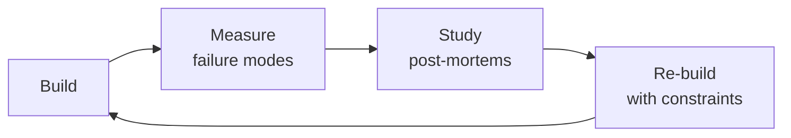

# FinOps Engineer / Cloud Cost Optimization

Drive cloud financial accountability through the FinOps lifecycle: Inform (visibility, allocation),
Optimize (right-sizing, commitment discounts, waste elimination), and Operate (governance, unit
economics, continuous improvement). Covers multi-cloud cost management, tagging strategy,
Reserved Instances/Savings Plans, Kubernetes cost optimization, spot instance strategy, storage
tiering, data transfer optimization, anomaly detection, and carbon-aware cost reduction.

## Route the Request
<!-- QUICK: 30s -- pick your path, skip the rest -->
```
What are you trying to do?
├── Analyze cloud costs (understand what's driving spend) → Jump to "Core Workflow > Phase 1" (Cost Analysis & Visibility)
│   ├── Tagging strategy → Go to "Best Practices > Tagging Strategy"
│   └── Anomaly detection → Go to "Best Practices > Anomaly Detection"
├── Optimize resource usage (right-sizing, waste reduction) → Jump to "Core Workflow > Phase 2" (Resource Optimization)
│   ├── Idle/underutilized resources → Go to "Decision Trees > Resource Right-Sizing"
│   └── Kubernetes cost optimization → Go to "Sub-Skills > kubernetes-cost-optimization"
├── Plan reserved instances / savings plans → Go to "Decision Trees > RI vs Savings Plans vs Spot"
├── Reduce cloud waste (orphaned resources, idle LBs, old snapshots) → Jump to "Core Workflow > Phase 2" (Waste Reduction)
├── Set up budgeting and governance → Jump to "Core Workflow > Phase 3" (Budgeting & Governance)
├── Implement showback/chargeback → Go to "Best Practices > Cost Allocation & Showback/Chargeback"
├── Need cloud architecture guidance → Invoke `cloud-architect` skill instead
├── Need infrastructure automation → Invoke `devops-engineer` skill instead
├── Need financial planning → Invoke `fp-and-a-analyst` skill instead
└── Not sure where to start? → "Core Workflow > Phase 1" — start with visibility: you can't optimize what you can't measure
```
Do not read the entire skill. Follow the route above and read only the sections it points to.

## Ground Rules — Read Before Anything Else

These rules apply to *every* response this skill produces.

- **Never report savings without showing the calculation.** "Save $50K/month" is meaningless without showing: current spend, target spend, unit price, usage delta, and time period. Show your work.
- **Reserved instance recommendations need utilization data.** Don't recommend a 1-year RI for a workload with 40% CPU utilization that might be decommissioned next quarter. Match commitment to predictable baseload.
- **Cost attribution must be transparent.** Every dollar must trace to a team, project, or environment through tags, labels, or account structure. If you can't answer "who owns this spend?", you can't fix it.
- **Don't optimize before measuring.** Right-sizing an instance that costs $50/month is noise. Find the top 5 cost drivers first, then focus optimization effort where it matters.
- **Always consider the operational cost of optimization.** Turning off dev environments on weekends saves money but may cost engineering velocity. Every cost decision has a trade-off.
- **Admit what you don't know.** If you don't have access to actual billing data, say so. Estimates without data are speculation. Point users to their cloud provider's cost explorer.


## The Expert's Mindset

Masters of finops engineer don't just build — they build **the right thing, at the right time, with the right trade-offs**. They think in systems, not tasks.

| Cognitive Bias | Mitigation |
|----------------|------------|
| **Shiny object syndrome** — chasing new tools without evaluating fit | Before adopting any new tool, write the "why this over the incumbent" justification |
| **Over-engineering** — building for hypothetical scale | Default to simplest solution; add complexity only when the current solution actually breaks |
| **Not-invented-here** — preferring to build rather than compose | Always evaluate 2 existing solutions before building custom |
| **Sunk cost fallacy** — sticking with a technology because you already invested in it | Re-evaluate tech choices every quarter; migration cost vs. staying cost |

### What Masters Know That Others Don't
- The **failure modes** of every component in their stack — not just the happy path
- When **not** to use their favorite tool (every tool has a misuse zone)
- That **data/model quality decays over time** — monitoring is not optional, it's foundational

### When to Break Your Own Rules
- **Move fast on reversible decisions.** Data format? Hard to change. Dashboard layout? Easy. Know the difference.
- **Skip the abstraction until the third use case.** Two is coincidence, three is a pattern.
## Operating at Different Levels

| Level | Scope | You... |
|-------|-------|--------|
| **L1** | Single component/module | Implement a well-defined piece following established patterns |
| **L2** | Feature or service | Design and build a complete feature; make tech choices within team conventions |
| **L3** | System or product area | Define architecture for a product area; set team tech standards; mentor L1-L2 |
| **L4** | Multiple systems / platform | Define org-wide architecture patterns; make build-vs-buy decisions; influence industry practice |
| **L5** | Industry / ecosystem | Create new architectural patterns adopted across the industry; redefine what's possible |

**Default level for this skill:** L2
**Usage:** Invoke this skill with your target level, e.g., "as an L3 finops engineer, design..."

For full level definitions, see `skills/00-framework/skill-levels/SKILL.md`.

## When to Use

- Your monthly cloud bill (AWS/Azure/GCP) has spiked and you need to identify the root cause
- You need to implement a tagging strategy to allocate cloud costs to teams, projects, and environments
- You are evaluating Reserved Instances vs. Savings Plans vs. on-demand to reduce compute spend
- You need to right-size underutilized resources — instances with <10% CPU or idle load balancers
- You are setting up cost anomaly detection and budget alerts to catch spending surprises early
- You need to optimize Kubernetes cluster costs through node autoscaling, bin packing, and spot instances
- You are building unit economics dashboards to tie cloud spend to business metrics (cost per customer, per API call)
- You need to reduce data transfer costs between regions, availability zones, or out to the public internet

## Decision Trees
<!-- QUICK: 30s -- follow the ASCII tree to your scenario -->
### 1. Reserved Instance vs. Savings Plan vs. On-Demand
```
What's the workload profile?
├─ Steady-state, predictable (24/7 production, no seasonal spikes)?
│   └─ All Upfront Reserved Instance (3-year): max discount (up to 72% off on-demand)
│       └─ Rule: commit only when workload has been stable for > 90 days
├─ Steady-state but may change instance family over time?
│   └─ Compute Savings Plan (1-year or 3-year): 66% off, flexible across families/regions
│       └─ Rule: best default choice — balances discount with flexibility
├─ Variable but has a minimum baseline (e.g., 40% of peak at all times)?
│   └─ Savings Plan for baseline (40-60%) + On-Demand/Spot for variable
│       └─ Rule: RI/SP coverage target = 60-80% of compute spend; not 100%
├─ Stateless, fault-tolerant, batch, or CI/CD workloads?
│   └─ Spot instances (up to 90% off): with fallback to on-demand
│       └─ Rule: MUST have graceful interruption handling; Spot cannot be > 70% of a critical service
├─ Short-lived, unpredictable (hackathon, POC, burst)?
│   └─ On-Demand: no commitment penalty
└─ WARNING: Buying RIs/SPs for workloads < 6 months old = overcommitment risk
```

### 2. Right-Sizing Decision
```
Resource utilization analysis:
├─ CPU < 10% avg over 30 days?
│   ├─ AND Memory < 20% → DOWNGRADE 2 sizes (or consolidate workloads)
│   ├─ AND Memory 20-50% → DOWNGRADE 1 size
│   └─ AND Memory > 50% → Memory-bound; CPU is irrelevant → consider memory-optimized instance
├─ CPU 10-40% AND Memory 10-40%?
│   └─ Adequate: no change unless cost-per-transaction exceeds target
├─ CPU 40-70%?
│   └─ Optimal range: no action unless bursting patterns suggest auto-scaling would save more
├─ CPU > 70% sustained?
│   └─ UPGRADE or enable auto-scaling
│       └─ Rule: if utilization is > 70% for > 4 hours/day, you need more capacity
├─ Storage attached (EBS, managed disk, persistent disk)?
│   └─ Check provisioned IOPS vs consumed: paying for unused IOPS → switch to GP3/auto-tier
└─ Implementation: change instance type in IaC, deploy during maintenance window, verify performance
```

### 3. Storage Tier Optimization
```
Object storage lifecycle decision:
├─ Accessed hourly?
│   └─ Hot tier (S3 Standard, GCS Standard, Azure Hot): $0.021-0.023/GB
├─ Accessed weekly/monthly?
│   └─ Infrequent access (S3 Standard-IA, GCS Nearline): $0.0125/GB + retrieval fee
│       └─ Rule: minimum 30-day storage; retrieval cost must be < savings from storage
├─ Accessed quarterly/annually (backups, logs, compliance)?
│   └─ Cold tier (S3 Glacier Instant Retrieval, GCS Coldline, Azure Cool): $0.004-0.005/GB
│       └─ Rule: retrieval time < 5 minutes; cost is 75% cheaper than Standard
├─ Accessed rarely (< 1x/year, regulatory archive)?
│   └─ Deep archive (S3 Glacier Deep Archive, Azure Archive): $0.00099-0.002/GB
│       └─ Rule: retrieval time 12-48 hours; minimum 180-day storage
├─ Can we just delete it?
│   └─ YES → Set lifecycle policy: delete after X days
│       └─ Savings: 100% — always the best optimization
└─ Implementation: S3 lifecycle policies, GCS object lifecycle management, Azure Blob lifecycle
```

### 4. Data Transfer Cost Optimization
```
Service-to-service communication:
├─ Same availability zone?
│   └─ Free within AZ (AWS/GCP/Azure)
│       └─ Optimization: use AZ-aware service discovery; avoid cross-AZ load balancing for chatty services
├─ Cross-AZ within same region?
│   └─ $0.01/GB each direction (AWS/Azure), $0.01/GB (GCP)
│       └─ Optimization: consolidate services that talk frequently into same AZ when possible
├─ Cross-region?
│   └─ $0.02/GB (inter-region) — MOST EXPENSIVE PER GB
│       └─ Optimization: replicate data once, serve locally; use CloudFront/CDN to cache at edge
├─ Internet egress?
│   └─ $0.05-0.12/GB after free tier (AWS), $0.087-0.12/GB (Azure), $0.12/GB (GCP)
│       └─ Optimization: CDN (reduces origin egress), PrivateLink/Private Service Connect (keeps traffic on backbone)
├─ NAT Gateway?
│   └─ $0.045/GB + $0.045/hour per AZ
│       └─ Optimization: VPC endpoints for S3/DynamoDB (free, no NAT); consolidate to 1 NAT in hub VPC
└─ WARNING: Cross-region data transfer is the #1 hidden cost in multi-region architectures
```

### 5. Kubernetes Cost Optimization
```
Cluster cost attack surface:
├─ Node right-sizing?
│   ├─ Average node utilization < 40%? → Use smaller nodes or enable cluster autoscaler
│   │   └─ Rule: target 60-80% allocatable capacity utilization
│   └─ Too many node pools? → Consolidate; each pool adds management overhead
├─ Pod resource requests vs usage gap?
│   └─ requests > 2x actual usage? → Reduce requests (frees up bin-packing capacity)
│       └─ Tool: kubecost, Goldilocks, VPA recommender mode
├─ Idle workloads?
│   └─ Namespaces with 0 pods running? → Clean up; idle namespaces waste cluster overhead
│   └─ CronJobs running too frequently? → Reduce frequency or batch
├─ Spot nodes?
│   └─ 60-80% of worker nodes SHOULD be spot for stateless workloads
│       └─ Rule: production stateless services (web, API) on spot with PodDisruptionBudget; stateful on on-demand
├─ Over-provisioned cluster?
│   └─ Cluster autoscaler not scaling down? → Check PDBs preventing eviction; tune scale-down thresholds
└─ Implementation: kubecost for visibility → right-size requests → spot adoption → autoscaler tuning

**What good looks like:** The output opens correctly in the target tool. All validations pass. No placeholder content remains.

```

## Core Workflow
<!-- QUICK: 30s -- scan phase titles to understand the process -->
### Phase 1 (~15 min): Inform — Visibility and Allocation
1. **Implement comprehensive tagging strategy**: mandatory tags (`Environment`, `Service`, `Team`, `CostCenter`, `Owner`) enforced via SCP/Azure Policy/Org Policy.
   - Output: Tagging policy document with enforcement mechanism; > 95% resource tag compliance within 60 days.
2. **Enable cost allocation**: map untagged costs to teams using proportional allocation rules.
   - Input: Resource inventory with tags, total cloud bill at account/project level.
   - Output: Cost-per-team, cost-per-service, cost-per-environment dashboards.
3. **Configure cost dashboards**: AWS Cost Explorer, Azure Cost Management, GCP Billing reports — shared with all engineering teams.
   - Output: Self-service dashboard with weekly cost trend, top-10 spenders, and budget vs. actual.
4. **Set budgets and alerts**: budgets per team/environment with alerts at 50%, 80%, 100%, 120%.
   - Output: Budget alerting pipeline; alerts routed to team channels (Slack, email, PagerDuty).
5. **Enable anomaly detection**: AWS Cost Anomaly Detection, Azure Anomaly Alerts, GCP Billing anomaly detection.
   - Output: Anomaly alerting with < 24-hour detection; > 90% of anomalies investigated within 48 hours.

### Phase 2 (~30 min): Optimize — Cost Reduction
1. **Right-size underutilized resources**: run Compute Optimizer / Recommender across all compute; implement changes.
   - Input: 30-day utilization data from cloud provider.
   - Output: Right-sizing recommendations list with estimated savings; implementation plan.
2. **Purchase commitment discounts**: RIs, Savings Plans, CUDs for baseline workloads (see Decision Tree #1).
   - Input: Steady-state workload inventory with historical utilization, growth forecast.
   - Output: Commitment purchase plan with ROI analysis (< 12-month payback); implemented purchases.
3. **Implement spot instance strategy**: identify stateless/fault-tolerant workloads; migrate to spot with fallback.
   - Input: Workload classification (stateless vs stateful, critical vs batch).
   - Output: Spot adoption plan; > 40% of non-production compute on spot; > 20% of production.
4. **Optimize storage tiers**: implement lifecycle policies (see Decision Tree #3).
   - Input: Storage inventory with access patterns (S3 Inventory, Azure Blob Inventory).
   - Output: Lifecycle policy configuration; estimated savings from tier transitions and deletions.
5. **Reduce data transfer costs**: optimize cross-AZ, cross-region, and egress traffic (see Decision Tree #4).
   - Input: VPC Flow Logs, data transfer billing reports.
   - Output: Data transfer optimization plan; CDN/PrivateLink/VPC endpoint implementation.
6. **Optimize Kubernetes costs**: right-size nodes, pods, and adopt spot (see Decision Tree #5).
   - Input: kubecost or equivalent cost allocation data.
   - Output: K8s optimization backlog ranked by savings; implemented changes.

### Phase 3 (~20 min): Operate — Governance and Continuous Improvement
1. **Establish cost governance**: define approval workflow for resources above cost threshold; auto-approve below.
   - Output: Cost governance policy; automated guardrails for high-cost resource provisioning.
2. **Define unit economics**: cost per customer, cost per transaction, cost per API call — tie cloud cost to business value.
   - Output: Unit cost dashboard; trends tracked monthly; anomalies trigger investigation.
3. **Run monthly FinOps review**: review spend vs. budget, optimization opportunities, commitment coverage gaps.
   - Attendees: FinOps lead, engineering leads, finance, CTO (quarterly).
   - Output: FinOps review report with action items and owner assignments.
4. **Automate waste elimination**: schedule idle resource shutdown (non-production nights/weekends); auto-delete unattached resources.
   - Output: Waste elimination automation with weekly savings report; < 5% idle resource waste.
5. **Manage cloud provider relationships**: negotiate EDP/private pricing, track credit consumption, renew commitments.
   - Output: Provider relationship dashboard; quarterly business review with providers.

### Phase 4 (~15 min): Carbon-Aware Optimization (GreenOps)
1. **Measure carbon footprint**: cloud provider carbon dashboards (AWS Customer Carbon Footprint Tool, Azure Emissions Impact, GCP Carbon Footprint).
   - Output: Carbon baseline; monthly carbon report alongside cost report.
2. **Shift workloads to low-carbon regions**: prioritize regions with low carbon intensity for new and relocatable workloads.
   - Output: Carbon-aware region selection policy; migration plan for eligible workloads.
3. **Optimize for carbon**: schedule batch workloads during low-carbon-intensity hours; right-size reduces carbon proportionally.
   - Output: Carbon optimization playbook integrated into standard FinOps practices.

## Cross-Skill Coordination

| Upstream Skill | What You Receive | When to Involve |
|---|---|---|
| `cloud-architect` | Architecture decisions with cost implications, multi-cloud strategy, landing zone design, tagging requirements | Before analyzing costs or recommending commitment discounts |
| `devops-engineer` | Infrastructure provisioning details, autoscaling configuration, resource lifecycle automation | Before identifying idle resources or recommending right-sizing |
| `fp-and-a-analyst` | Budget forecasts, financial models, unit economics targets, commitment purchase approvals | Before making RI/SP purchase recommendations or setting budget thresholds |

| Downstream Skill | What You Provide | Impact of Delay |
|---|---|---|
| `cloud-architect` | Cost implications of architecture choices, commitment discount strategy, resource optimization recommendations | Architecture decisions made blind to cost — overspend risk |
| `vp-engineering` | Cost anomaly alerts, optimization opportunity backlog, team-level cost KPIs | Engineering budget overrun with no visibility — financial risk |
| `fp-and-a-analyst` | Cost forecasts, commitment purchase ROI, provider discount analysis, unit economics data | Financial planning can't model cloud spend accurately — budget surprises |

## Proactive Triggers

| Trigger | Action | Why |
|---------|--------|-----|
| Cloud costs increase > 20% month-over-month with no corresponding traffic growth | Propose immediate cost attribution drill: identify top 5 cost drivers by service/tag, flag anomalies > 2σ from trailing 14-day average, report findings within 24 hours | Unexplained cost spikes are the #1 FinOps emergency; every hour of delay costs real money — 20% MoM growth without traffic means waste or leakage |
| > 20% of resources are untagged — cost allocation impossible, showback reports are fiction | Propose tagging strategy with enforcement: mandatory tags (`Team`, `Service`, `Environment`, `CostCenter`), SCP/Azure Policy to block untagged resource creation, auto-shutdown after 24 hours untagged | Untagged resources are invisible costs; you can't optimize what you can't attribute — tagging is the foundation of every FinOps practice |
| Reserved Instance/Savings Plan utilization < 60% — thousands in commitments producing zero savings | Propose RI/SP audit: identify unutilized commitments, exchange/modify where possible, right-size before next purchase, prefer Savings Plans for flexible workloads | Unused commitments are dead money; every dollar of unused RI is a dollar that could have been on-demand at the same cost |
| No cost visibility for engineering teams — developers provision resources with no idea what they cost | Propose per-team cost dashboards with showback (not chargeback); embed cost estimates in CI/CD (Infracost on PR); weekly cost digest per team | Engineers optimize what they can see; cost visibility is the prerequisite for cost responsibility — showback before chargeback |
| Storage costs growing linearly but no lifecycle policies — 2-year-old log files at hot-tier pricing | Propose storage lifecycle audit: S3 Intelligent Tiering for unpredictable access, lifecycle policies (30d → Infrequent Access, 90d → Archive/Glacier, 365d → delete), unattached volume reaper | Storage has infinite gravity — data accumulates, access patterns decay, but costs compound; lifecycle policies are the highest-ROI optimization |
| Data transfer costs are 30%+ of cloud bill — cross-AZ traffic, NAT gateway egress, no CDN | Propose network cost audit: implement VPC endpoints for S3/DynamoDB, consolidate NAT gateways, enable CDN for static assets, use AZ-aware service discovery | Data transfer costs hide in plain sight; they're invisible in most dashboards but can exceed compute costs in data-heavy applications |
| Kubernetes clusters running at 15% average CPU utilization — nodes over-provisioned 6:1 | Propose right-sizing: Vertical Pod Autoscaler in recommend mode, resource requests = P50 usage, limits = P95; bin-packing with cluster autoscaler; spot instances for non-production | Kubernetes waste is invisible without kubecost or similar; over-provisioned clusters are the norm, not the exception — right-sizing typically saves 40-60% |
| Carbon footprint not tracked — sustainability goals exist but no measurement | Propose GreenOps integration: carbon-aware region selection (lower-carbon regions are often cheaper), spot instance preference, nightly non-production shutdown, carbon dashboard alongside cost dashboard | Carbon optimization and cost optimization are 80% aligned; tracking carbon alongside cost future-proofs for regulation and ESG reporting |

## Scale Depth
<!-- QUICK: 30s -- find your team size column -->
### Solo (1 person, 0-100 users)
- **What changes**: No FinOps practice. Check cloud bill monthly. Set billing alerts for $X/month threshold. Use free tier aggressively. No tagging, no RIs, no optimization beyond "did my bill spike?"
- **Overkill**: Tagging strategy, RIs/Savings Plans, cost allocation to teams, unit economics, FinOps lifecycle, carbon tracking, budget governance.
- **Coordination**: You pay the bill. No coordination needed.
- **Cost**: $0 beyond cloud services. Focus on staying in free tier.
- **Transition trigger**: Monthly bill exceeds $500 consistently; first surprise bill > 2x expected.

### Small (2-10 people, 100-10K users)
- **What changes**: Basic tagging (`Environment`, `Service`). Budget alerts at 80% and 100%. Monthly bill review. RI/SP for steady production (1-year, no upfront). Delete unattached EBS/disks monthly. S3 lifecycle policies for logs (30-day → IA, 90-day → delete). No spot instances yet.
- **Overkill**: Unit economics, formal FinOps governance, anomaly detection automation, carbon footprint tracking, Kubernetes cost optimization (unless running K8s at scale), provider negotiation.
- **Coordination**: One person reviews bill monthly. Shared dashboard visible to team. Cost discussed in monthly engineering sync (5 min).
- **Cost**: $0-200/month (cloud cost tools free tier). 30 min/month bill review time.
- **Transition trigger**: Monthly bill > $2K; > 50 resources running; first RI/SP purchase opportunity > $5K/year.

### Medium (10-50 people, 10K-1M users)
- **What changes**: Dedicated FinOps function (part-time, 20-50% of one engineer). Full tagging strategy with SCP enforcement. Budgets per team with alerts. RI/SP coverage 60-80% of compute. Spot for non-production (40%+). Right-sizing program (quarterly reviews). S3 lifecycle policies across all buckets. Anomaly detection enabled. Cost dashboards per team. Kubernetes cost allocation via kubecost. Monthly FinOps review.
- **Overkill**: Dedicated FinOps team, unit economics (unless SaaS with per-customer cost sensitivity), carbon tracking, provider EDP negotiation, formal chargeback.
- **Coordination**: Monthly FinOps review with engineering leads. Cost dashboards self-service for teams. Quarterly optimization sprint. Budget overruns escalate to engineering manager.
- **Cost**: $30-70K/year (part-time FinOps engineer). kubecost or equivalent $2-5K/year. Commitment management overhead ~5 hours/month.
- **Transition trigger**: Monthly bill > $20K; > 5 teams with independent cloud usage; first compliance audit requiring cost allocation evidence.

### Enterprise (50+ people, 1M+ users)
- **What changes**: Dedicated FinOps team (1-3 people). FinOps lifecycle fully implemented. Multi-cloud cost management platform (CloudHealth, Cloudability, Vantage). Unit economics per product/customer. Chargeback or showback with detailed allocation. Formal cost governance with approval workflows. EDP/private pricing negotiation. Carbon-aware optimization. Automated waste elimination (nightly non-prod shutdown). Continuous right-sizing automation. Cost optimization integrated into CI/CD (cost estimate on PR). FinOps certified practitioners.
- **What's full production**: Real-time cost anomaly detection with automated response. Cost-per-feature measurement. Cloud provider business reviews quarterly. FinOps council with cross-functional membership. Published cost optimization scorecards. Carbon reduction targets integrated with cost optimization.
- **Coordination**: Weekly FinOps team sync. Monthly FinOps council (FinOps, finance, engineering leads, CTO). Quarterly business review with cloud providers. Budget governance integrated with procurement.
- **Cost**: $400K-1.2M/year (1-3 FinOps engineers + tools). Multi-cloud cost platform $30-100K/year. Expected savings 20-40% of cloud spend (ROI positive at > $1M/year cloud spend).
- **Transition trigger**: Monthly bill > $100K; multi-cloud environment; > 100 engineers; public company financial controls; customer-facing SaaS with per-tenant cost sensitivity.


### Cross-skills Integration

| Step | Skill | What it produces |
|------|-------|------------------|
| **Before** | cloud-architect | Cloud architecture with cost estimates |
| **This** | finops-engineer | Cost analysis, optimization recommendations, savings projections |
| **After** | devops-engineer | Infrastructure changes implementing cost optimizations |

Common chains:
- **Chain**: cloud-architect → finops-engineer → devops-engineer — Architecture cost estimates are validated; optimization recommendations are implemented via IaC
- **Chain**: platform-engineer → finops-engineer → cto-advisor — Platform usage costs are analyzed; CTO receives cost-to-value analysis for strategic decisions

## What Good Looks Like

> Every cloud resource is tagged for cost allocation, and spending is visible per team, service, and environment within 24 hours. Commitment discounts cover at least 80% of predictable workloads, and idle or over-provisioned resources are automatically identified and right-sized weekly. Cloud spend grows linearly with business metrics — not exponentially with headcount. Anomalies trigger alerts within hours, not days, with a root cause and remediation recommendation attached. Finance and engineering speak the same language because cost data is embedded in the tools engineers already use.

## Sub-Skills
<!-- QUICK: 30s -- table of deeper dives by topic -->
| Sub-Skill | When to Use | Context |
|---|---|---|
| `tagging-strategy` | Designing and enforcing a cost allocation tagging taxonomy | Tag taxonomy design, enforcement mechanisms (SCP, Policy), tag propagation, compliance tracking |
| `commitment-discount-management` | Purchasing and managing RIs, Savings Plans, CUDs across clouds | RI/SP strategy, purchase timing, exchange/modification, coverage tracking, ROI analysis |
| `right-sizing-automation` | Systematically reducing over-provisioned resources | Utilization analysis, recommendation engines, implementation workflows, performance validation |
| `spot-instance-strategy` | Adopting spot/preemptible instances for fault-tolerant workloads | Workload assessment, fallback patterns, interruption handling, spot diversification |
| `storage-lifecycle-optimization` | Implementing tiering and deletion policies for object and block storage | Access pattern analysis, lifecycle policy design, retrieval cost modeling, compliance retention |
| `kubernetes-cost-optimization` | Optimizing Kubernetes clusters for cost efficiency | Node right-sizing, pod resource tuning, spot adoption, bin packing, idle workload cleanup |
| `data-transfer-optimization` | Reducing cross-AZ, cross-region, and internet egress costs | Traffic analysis, CDN integration, PrivateLink/VPC endpoint, AZ-aware architecture |
| `unit-economics` | Tying cloud cost to business value (cost per customer, per transaction) | Metric definition, data pipeline, dashboard design, anomaly detection, pricing model feedback |

## Best Practices
<!-- STANDARD: 3min -- rules extracted from production experience -->
<!-- DEEP: 10+min -->
- **Tag or die**: untagged resources are invisible costs. Enforce tags via policy; auto-shutdown resources that remain untagged after 24 hours. > 95% compliance is non-negotiable.
- **RI/SP coverage targets 60-80%, not 100%**: 100% coverage means you're committed for every workload — no flexibility. Keep 20-40% on-demand for variable workloads and new services.
- **Right-size before you commit**: never buy a 3-year RI for an instance that's 80% idle. Right-size first, then commit to the optimized size.
- **Spot is free money (with engineering investment)**: spot instances save 60-90% but require interruption handling. Invest in spot-compatible architecture once; save forever.
- **Storage has infinite gravity**: data grows, access patterns decay, but storage costs compound. Lifecycle policies are the highest-ROI, lowest-effort optimization.
- **Data transfer costs hide in plain sight**: cross-AZ traffic is hard to see but easy to accumulate. Use AZ-aware service discovery and VPC endpoints to keep traffic local.
- **Cost is a feature**: every PR that adds a resource should estimate its monthly cost. CI/CD integration (Infracost, Terraform cost estimation) makes cost visible at design time.
- **Showback before chargeback**: start by showing teams their costs without charging them. Build cost awareness before adding financial accountability. Chargeback too early breeds resentment.
- **FinOps is cultural, not a tool**: tools provide visibility; the culture of cost awareness drives savings. Engineers who see their costs optimize them; engineers who don't, don't.
- **GreenOps is the next frontier**: carbon-aware scheduling and region selection often align with cost optimization (low-carbon regions tend to be cheaper). Track carbon alongside cost.


## Anti-Patterns

| ❌ Anti-Pattern | ✅ Do This Instead |
|---|---|
| "We'll optimize costs after launch" — no tagging, no budgets, no RI planning at design time | Tag from day one; set budget alerts before first production deploy; right-size resources at design time, not as a post-launch fire drill |
| 100% Reserved Instance coverage — every workload committed, zero flexibility for change | Target 60-80% RI/SP coverage; keep 20-40% on-demand for variable workloads and new services; flexibility has value — unused RIs are dead money |
| Cost optimization treated as a quarterly cleanup project — one person manually hunts for waste 4×/year | Continuous cost optimization: automated right-sizing recommendations weekly, anomaly detection real-time, idle resource cleanup nightly; cost is a daily practice, not a quarterly event |
| Chargeback implemented before showback — teams get surprise bills and resent the FinOps program | Showback first: 6-12 months of cost visibility without financial accountability; build cost awareness and trust before adding chargeback |
| Spot instances used for production databases — interruption causes outage, team declares "spot is unreliable" | Spot for stateless, fault-tolerant, interruptible workloads only (batch jobs, CI/CD, non-production); never for databases, message queues, or stateful production services |
| Every resource gets its own RI — 200 individual RI purchases to manage, nobody tracks utilization | Use Savings Plans for broad coverage across instance families; consolidate RI purchases by family/region; automate utilization tracking with monthly report |
| Cost data lives in a finance spreadsheet that engineers never see — "cost is finance's problem" | Embed cost data in engineering tools: Infracost in CI/CD, cost-per-PR estimates, Slack cost bot, per-team dashboards in observability platform |
| Cloud provider bill is the only source of truth — no internal cost allocation or showback, no reconciliation | Multi-cloud cost platform (CloudHealth, Vantage, Kubecost) as single pane; allocate costs by team/service/environment; reconcile with provider bill monthly |

## Error Decoder

| Symptom | Root Cause | Fix | Lesson |
|---------|-----------|-----|--------|
| Cloud bill doubled overnight | Data transfer costs spiked from a new feature that streams large assets without CDN | Route all static/large assets through CDN. Set budget alerts at 80%/100%/120%. Tag every resource and query by tag to find the culprit in under 5 minutes. | Unmonitored data transfer is the most common source of bill spikes. CDN and cost alerts are the cheapest insurance you can buy. |
| Reserved instance shows no savings | RI purchased for a workload that stopped running or changed instance family | Reserve only for workloads with predictable, stable usage (24/7 services). Spot for batch jobs. Savings Plans cover instance family changes — prefer them over RIs for heterogeneous fleets. | Commitment discounts lock in savings only for stable workloads. The more dynamic your infrastructure, the more flexible the commitment instrument must be. |
| Cost anomaly alert fires weekly, team ignores it | Threshold set too tight (10%) for a variable workload | Set anomaly thresholds at 2 standard deviations from trailing 14-day average, not a flat percentage. Filter out known growth patterns. Escalate if alert is acknowledged but not investigated within 72 hours. | Alert fatigue kills FinOps programs. An alert that fires every week and is ignored is worse than no alert — it trains the team that cost alerts are noise. |
| Engineering team has no idea what their infrastructure costs | No per-team cost allocation or showback | Implement tag-based cost allocation. Every resource must have `Team`, `Environment`, `Service`, and `CostCenter` tags. Generate a weekly per-team cost report. Showback > chargeback — visibility first, accountability second. | Cost visibility is a prerequisite for cost optimization. Engineers can't optimize costs they can't see. |
| Hundreds of 'orphan' storage volumes costing $5K/mo | EBS volumes/block storage never deleted when EC2 terminates | Enable 'Delete on termination' by default. Implement a 'leaked resource' Lambda that snapshots and deletes unattached volumes older than 7 days. Tag volumes with `CreatedBy` and `TTL` for automated cleanup. | Orphaned resources are a silent budget drain. Automation is the only reliable way to clean them up — manual quarterly cleanup always misses some. |


## Production Checklist
<!-- QUICK: 30s -- binary pass/fail items. All must pass. -->
- [ ] **[S1]**  Tagging strategy documented with mandatory tags (`Environment`, `Service`, `Team`, `CostCenter`, `Owner`)
- [ ] **[S2]**  Tag enforcement in place via SCP, Azure Policy, or Org Policy; > 95% resource tag compliance
- [ ] **[S3]**  Budget alerts configured per team/environment at 50%, 80%, 100%, 120% thresholds
- [ ] **[S4]**  Cost anomaly detection enabled and alerting to team communication channels
- [ ] **[S5]**  Cost dashboards available to all engineering teams (self-service, updated daily)
- [ ] **[S6]**  RI/SP coverage at 60-80% for steady-state compute; review coverage monthly
- [ ] **[S7]**  Right-sizing review completed within last 90 days; recommendations implemented
- [ ] **[S8]**  Spot instances adopted for > 40% non-production and > 20% production stateless workloads
- [ ] **[S9]**  S3/Azure Blob/GCS lifecycle policies applied to all buckets; deletion policies for logs/temp data
- [ ] **[S10]**  Data transfer optimization: VPC endpoints for S3/DynamoDB, CDN for egress-heavy endpoints
- [ ] **[S11]**  Kubernetes cost allocation implemented (kubecost or equivalent); resource requests right-sized
- [ ] **[S12]**  Idle resource cleanup automated: non-production shutdown nights/weekends; unattached resources deleted
- [ ] **[S13]**  Monthly FinOps review established with action items and ownership
- [ ] **[S14]**  Unit economics dashboard for at least top-3 products/customer segments
- [ ] **[S15]**  Carbon footprint baseline measured; reduction targets set

## Footguns
<!-- DEEP: 10+min — war stories from production cloud cost management -->

| Footgun | What Happened | Root Cause | How to Prevent |
|---------|---------------|------------|----------------|
| Reserved Instance purchase covered the wrong instance family — 380 m5.xlarge RIs sat unused for 11 months while the team ran m6i.xlarge on-demand at 2.3x the price | A FinOps analyst bought 380 3-year All Upfront RIs for `m5.xlarge` in us-east-1 based on a 30-day usage snapshot. Three weeks later, the platform team completed their migration to `m6i.xlarge` — better price/performance, announced 2 months earlier but the FinOps team wasn't on the platform engineering Slack channel. The RIs sat at 0% utilization for 11 months. Total waste: $478,400 in prepaid, unused reservations. AWS refused to refund because the RIs were Standard (not Convertible) and the 30-day return window had passed. | The FinOps team used a point-in-time snapshot instead of a 90-day rolling average. The purchase was approved by procurement without a platform team review. Standard RIs are non-exchangeable after purchase. | **Never buy Standard RIs without a signed-off instance family roadmap from the platform team for the next 12 months.** Use Convertible RIs for any purchase > 100 instances — they cost 10-15% more but can be exchanged. Compute savings over a 90-day rolling window, not a snapshot. Automate RI coverage tracking: alert when coverage drops below 85% or when > 20% of reservations are unused for 7+ days. Share the RI purchase plan with platform engineering 2 weeks before execution. |
| S3 Intelligent-Tiering was supposed to save 40% — but a 16TB bucket with 2.7 billion tiny objects incurred $8,400/month in monitoring fees, exceeding the storage savings | A data lake team enabled S3 Intelligent-Tiering on a bucket containing 2.7 billion small objects (average size: 6KB) from IoT sensors. Intelligent-Tiering charges $0.0025 per 1,000 objects per month for monitoring. The monitoring cost: 2.7B ÷ 1,000 × $0.0025 = $6,750/month. Storage savings from auto-tiering: $1,200/month. Net loss: $5,550/month. The team didn't discover this for 8 months — cumulative loss: $44,400. The bucket had a lifecycle policy set at creation, and nobody revisited it. | Per-object monitoring fee is flat regardless of object size. For objects < 128KB, the monitoring cost exceeds any storage savings. S3 Intelligent-Tiering was applied bucket-wide without analyzing the object size distribution first. | **Check object size distribution before enabling Intelligent-Tiering.** If median object size < 128KB, Intelligent-Tiering will lose money. Use S3 Storage Lens to analyze per-bucket object metrics before applying lifecycle policies. For small objects: S3 One Zone-IA (if data is reproducible) or S3 Standard (object count charges dominate). Set a calendar reminder to revisit lifecycle policies quarterly — usage patterns change. |
| NAT Gateway data processing charges went unnoticed — a cross-AZ microservice mesh generated $23,000/month in NAT Gateway fees because every pod talked to every other pod across AZs | A microservice architecture deployed 60 services across 3 AZs with no topology-aware routing. Internal service-to-service traffic in Kubernetes flowed through the CNI's default routing, which sent 40% of traffic cross-AZ. Each cross-AZ byte passed through a NAT Gateway because the VPC had private subnets with a centralized NAT Gateway in AZ-a. NAT Gateway charges $0.045/GB for data processing. Cross-AZ traffic: 40% of 15 TB/day internal traffic = 6 TB/day × 30 = 180 TB/month × $0.045/GB = $8,100/month. Add cross-AZ data transfer at $0.01/GB in each direction = another $3,600/month. The total AWS bill line item was buried under "Data Transfer" — nobody correlated it to the microservice mesh topology. | NAT Gateway in single AZ + pods communicating cross-AZ + no awareness of network topology costs. Kubernetes scheduler doesn't consider data transfer costs. The networking team didn't speak to the application team about traffic patterns. | **Deploy NAT Gateways per AZ — one in each AZ.** Configure VPC CNI with `AWS_VPC_K8S_CNI_EXTERNALSNAT = true` so pod traffic exits via the local NAT Gateway. Enable topology-aware routing with `service.kubernetes.io/topology-mode: Auto` (K8s 1.27+) or Istio locality-aware load balancing. Use AWS Cost Explorer "Data Transfer" granular view (group by Usage Type) monthly. Build a dashboard showing cross-AZ traffic percentage per namespace. |
| Savings Plans purchased at the management account level couldn't be shared with 12 member accounts because they were in a different consolidated billing family — $134,000 in duplicate compute costs | A large enterprise had two AWS Organizations (acquired companies) that hadn't been merged. The central FinOps team purchased a $2.4M 3-year Compute Savings Plan at the management account of Org A, assuming it would cover all workloads. Org B's 12 accounts ran the same instance families at on-demand pricing. After the purchase, nobody compared the Savings Plan coverage report (which only showed Org A) against the total compute bill (both orgs). The gap was discovered 9 months later during a merger finance reconciliation. | AWS Savings Plans only share within a single consolidated billing family (one Organization). The FinOps team didn't verify which payer account the workloads billed to before purchasing. | **Run `aws organizations list-accounts` on every management account before any Savings Plan purchase.** Verify the coverage report scope matches the cost report scope — if they don't overlap 100%, you have unattributed spend. Accelerate AWS Organizations consolidation before purchasing long-term commitments. Use a third-party FinOps tool (CloudHealth, Vantage, CloudZero) that aggregates across billing families automatically. |
| RDS storage auto-scaling hid a 10TB bloat from an unlogged table — storage costs grew from $1,200 to $8,700/month with zero application changes | A PostgreSQL RDS instance had auto-scaling enabled with a max of 16TB. A developer added an `UNLOGGED` table for a temporary analytics cache in March. By July, the table had grown to 9.3TB because the cache cleanup cron job had a typo in the WHERE clause (`create_date > '2024-03-01'` instead of `create_date > NOW() - INTERVAL '7 days'`). RDS auto-scaling silently increased storage 5GB at a time — nobody noticed because the application performed fine and there were no storage alarms. The $8,700/month bill was $7,500 above baseline. Storage auto-scaling scaled up automatically but NEVER scales down. The 9.3TB of wasted space was permanent until a manual cleanup. | Auto-scaling masks storage problems. RDS gp3 storage costs $0.115/GB-month — 10TB = $1,150/month. The typo was invisible because the query "succeeded" — it just kept all records. No storage growth anomaly alert existed. | **Set a CloudWatch alarm on `FreeStorageSpace` that fires when storage growth rate exceeds 20%/week.** Query `pg_stat_user_tables` or `information_schema.tables` monthly to report table sizes — look for the largest table that you don't recognize. For all auto-scaling resources: add a budget alert at 150% of baseline. RDS storage auto-scaling never shrinks — you must manually run `VACUUM FULL` or `pg_repack`, then manually reduce allocated storage (which requires a downtime window). |

## Calibration — How to Know Your Level
<!-- STANDARD: 3min — honest self-assessment rubric -->

| You Know You're Stuck at L1 When... | You Know You've Reached L2 When... | You Know You're L3 When... |
|---|---|---|
| You think FinOps means "look at the AWS bill once a month and tell engineers to delete unused EBS volumes" | You've implemented automated tagging enforcement, a cost anomaly detection system that catches spikes within 24 hours, and a showback/chargeback dashboard that every team lead reviews weekly | You've negotiated a 3-year Enterprise Discount Program with AWS that reduced the organization's blended rate by 37%, and you can prove it with a before/after analysis that the CFO presented to the board |
| You discover cloud waste by accident — a developer asks "why is this EC2 instance still running?" 8 months after the project ended | Every resource has an owner tag, every non-production resource auto-shuts-down outside business hours, and your stale resource report runs weekly with < 5 orphaned resources | You've built a unit economics model that calculates cloud cost per customer, per API call, and per feature — and product managers use it to prioritize features based on margin, not just revenue |
| You bought Reserved Instances for "everything that runs 24/7" and discovered 40% were the wrong instance family, region, or platform 6 months later | Savings Plan coverage is at 92%+ for compute, RI coverage is at 85%+ for RDS/ElastiCache, and your commitment portfolio is rebalanced quarterly based on the last 90 days of usage | You've reduced cost per transaction by 58% year-over-year while traffic doubled — the unit economics improved because you negotiated better rates, optimized architectures, and eliminated the bottom 20% of underutilized resources |

**The Litmus Test:** Can you look at a $500,000 monthly AWS bill with 40 linked accounts, identify the top 3 cost drivers in under 10 minutes, and propose changes that will reduce next month's bill by at least $75,000 — without degrading performance or availability — and actually deliver those savings?

## Deliberate Practice



| Level | Practice | Frequency |
|-------|----------|-----------|
| **Novice** | Rebuild an existing system from scratch, then compare your design with the original | Monthly |
| **Competent** | Add a new constraint (10x data, zero downtime, etc.) to a familiar design and re-architect | Quarterly |
| **Expert** | Design the same system under 3 conflicting constraint sets; write a decision record for each | Quarterly |
| **Master** | Teach a junior to design a system; your role is to ask questions, not give answers | Monthly |

**The One Highest-Leverage Activity:** Every quarter, take a system you built 6+ months ago and redesign it from scratch with what you know now. Write down what changed and why.

## References
<!-- QUICK: 30s -- links to deeper reading -->
- [FinOps Foundation](https://www.finops.org/) — FinOps Framework, lifecycle, maturity model, certification
- [Well-Architected Cost Optimization Pillar (AWS)](https://docs.aws.amazon.com/wellarchitected/latest/cost-optimization-pillar/) — AWS cost optimization best practices
- [Google Cloud FinOps](https://cloud.google.com/finops/) — GCP cost optimization guides and best practices
- [Microsoft Azure Well-Architected — Cost Optimization](https://learn.microsoft.com/en-us/azure/well-architected/cost-optimization/) — Azure cost optimization framework
- [kubecost](https://www.kubecost.com/) — Kubernetes cost monitoring and optimization
- [Infracost](https://www.infracost.io/) — Infrastructure cost estimates in CI/CD
- [Vantage](https://www.vantage.sh/) — Multi-cloud cost management platform
- [Cloud Carbon Footprint](https://www.cloudcarbonfootprint.org/) — Open-source carbon measurement for cloud
- Internal: [../../domain/references/finops-playbook.md](../../domain/references/) — Detailed cost optimization playbooks per cloud provider
