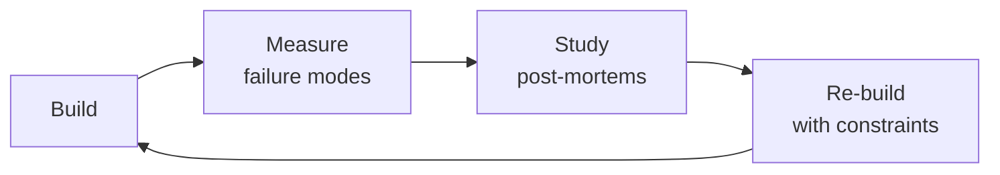

# FinOps Engineer / Cloud Cost Optimization
> **Portability target:** Spec-level (runs on Claude Code, Copilot, Gemini CLI, Codex, Cursor). No vendor-specific frontmatter fields.

Drive cloud financial accountability through the FinOps lifecycle: Inform (visibility, allocation),
Optimize (right-sizing, commitment discounts, waste elimination), and Operate (governance, unit
economics, continuous improvement). Covers multi-cloud cost management, tagging strategy,
Reserved Instances/Savings Plans, Kubernetes cost optimization, spot instance strategy, storage
tiering, data transfer optimization, anomaly detection, and carbon-aware cost reduction.

## Route the Request

<!-- QUICK: 30s -- auto-route first, then intent-route -->

### Auto-Route (No User Input Required)
Evaluate these file-system conditions in order. First match wins — jump immediately.

| # | Condition | Action |
|---|-----------|--------|
| A1 | `file_exists("cost-dashboard.json")` OR `file_contains("./**/*.md", "cost.*anomaly\|bill.*spike\|spend.*increase")` | Jump to "Core Workflow > Phase 1" (Cost Analysis & Visibility) |
| A2 | `file_exists("main.tf")` AND `file_contains("main.tf", "instance_type\|vm_size\|machine_type")` AND NOT `file_contains("main.tf", "reserved\|savings_plan")` | Jump to "Core Workflow > Phase 2" (Resource Optimization) — right-sizing opportunity |
| A3 | `file_contains("main.tf", "reserved_instance\|savings_plan\|capacity_reservation")` OR `file_exists("commitments/")` | Go to "Decision Trees > RI vs Savings Plans vs Spot" |
| A4 | `grep -rn "tag\|label\|cost_center\|CostCenter" . --include="*.tf" --include="*.json"` returns fewer than 3 matches | Jump to "Core Workflow > Phase 3" (Budgeting & Governance) — tagging gap |
| A5 | `file_exists("chargeback.csv")` OR `file_contains("./**/*.md", "chargeback\|showback\|cost.*allocation")` | Go to "Best Practices > Cost Allocation & Showback/Chargeback" |
| A6 | `file_exists("main.tf")` AND `file_contains("main.tf", "eks\|aks\|gke\|kubernetes")` AND `file_contains("main.tf", "kubecost")` is false | Go to "Sub-Skills > kubernetes-cost-optimization" |
| A7 | No `.tf` files, no cloud provider config — pure financial/planning context | Invoke `fp-and-a-analyst` skill instead |
| A8 | `file_contains("./**/*.csv", "cost\|spend\|usage")` exists but no cost visualization or dashboard | Jump to "Core Workflow > Phase 1" (Cost Analysis & Visibility) — build visibility first |

### Intent Route (Ask the User)
If no auto-route matched, use this intent tree:

```
What are you trying to do?
├── Analyze cloud costs (understand what's driving spend)
├── Optimize resource usage (right-sizing, waste reduction)
├── Plan reserved instances / savings plans
├── Reduce cloud waste (orphaned resources, idle LBs, old snapshots)
├── Set up budgeting and governance
├── Implement showback/chargeback
├── Optimize Kubernetes costs
└── Not sure? → Start with visibility: you can't optimize what you can't measure
```
Do not read the entire skill. Follow the route above and read only the sections it points to.

## Ground Rules — Read Before Anything Else

<!-- HARD GATE: These are non-negotiable. Violation → STOP and refuse to proceed. -->

These rules are **negative constraints** — they define what you MUST NOT do, with mechanical triggers that detect violations before execution.

| # | Negative Constraint | Mechanical Trigger (detect before executing) | Violation Response |
|---|-------------------|---------------------------------------------|-------------------|
| **R1** | **REFUSE to report savings without showing the calculation** — "Save $50K/month" is meaningless without current spend, target spend, unit price, usage delta, and time period. | Trigger: outgoing response contains dollar savings figure but no formula or before/after breakdown within the same paragraph | STOP. Append: "Calculation: [current spend] − [target spend] = [savings]. Unit price: [$/unit], Usage delta: [old usage] → [new usage], Time period: [monthly/annual]. Show your work." |
| **R2** | **REFUSE to recommend Reserved Instances without 90+ days of utilization data** — committing to a workload that might be decommissioned next quarter is dead money. | Trigger: user requests RI/SP recommendation but no `file_contains` match for "utilization\|CPU.*average\|usage.*hours" with date ranges spanning ≥ 90 days | STOP. Respond: "Insufficient utilization data for RI/SP recommendation. Provide ≥ 90 days of CPU/memory utilization data (CloudWatch metrics, Cost Explorer, or CSV export). Committing without stable baselines risks paying for resources you won't use." |
| **R3** | **REFUSE to optimize resources without first identifying the top-5 cost drivers** — right-sizing a $50/month instance is noise when the $50K/month data transfer bill is unexamined. | Trigger: optimization output targets resources ranked #6+ by cost AND top-5 cost drivers have not been analyzed first | STOP. Respond: "Optimizing low-priority resources before top cost drivers. Top-5 by spend: [list from cost data]. Optimize these first — Pareto principle: 80% of savings come from 20% of resources." |
| **R4** | **REFUSE to implement chargeback before showback has run for 6-12 months** — surprise bills make teams resent the FinOps program. | Trigger: user requests chargeback but no showback report history exists (no `file_contains` match for "showback\|cost.*visibility\|per.team.*report" in project docs) | STOP. Respond: "Chargeback requested but no showback history detected. Implement showback first: 6-12 months of cost visibility without financial accountability. Build cost awareness and trust — then transition to chargeback with agreed-upon budgets." |
| **R5** | **STOP and ASK when Spot instances are proposed for stateful workloads** — Spot for databases or message queues causes outages when instances are reclaimed. | Trigger: `file_contains("main.tf", "spot\|spot_instance\|spot_fleet")` AND the same file references `aws_db_instance\|aws_elasticache\|aws_msk` or similar stateful resources | STOP. Ask: "Spot instances detected near stateful resources ([list]). Spot is for stateless, fault-tolerant, interruptible workloads only (batch jobs, CI/CD, non-production). Move databases/queues to on-demand or Reserved. Confirm you want Spot only for stateless workloads?" |
| **R6** | **DETECT and WARN about untagged resources** — every dollar without a team/owner tag is untraceable spend. | Trigger: `grep -rn "tags\s*=" main.tf` returns zero matches OR `grep -rnE "(Team|Environment|CostCenter|Service)\s*=" main.tf` returns fewer than 3 matches | WARN: "Missing mandatory cost allocation tags. Every resource must have `Team`, `Environment`, `Service`, and `CostCenter` tags. Without tags, you can't answer 'who owns this spend?' — and you can't optimize what you can't attribute." |
| **R7** | **DETECT and WARN about cost anomalies being ignored due to alert fatigue** — an alert fired weekly and ignored is worse than no alert. | Trigger: `grep -rn "anomaly\|budget.*alert\|cost.*alert" . --include="*.tf" --include="*.md"` shows threshold at flat 10% without standard deviation baselines | WARN: "Flat percentage anomaly threshold detected. Set thresholds at 2 standard deviations from trailing 14-day average, not a flat percentage. Filter known growth patterns. Escalate if acknowledged but not investigated within 72 hours. Alert fatigue kills FinOps programs." |

## The Expert's Mindset

Masters of finops engineer don't just build — they build **the right thing, at the right time, with the right trade-offs**. They think in systems, not tasks.

| Cognitive Bias | Mitigation |
|----------------|------------|
| **Shiny object syndrome** — chasing new tools without evaluating fit | Before adopting any new tool, write the "why this over the incumbent" justification |
| **Over-engineering** — building for hypothetical scale | Default to simplest solution; add complexity only when the current solution actually breaks |
| **Not-invented-here** — preferring to build rather than compose | Always evaluate 2 existing solutions before building custom |
| **Sunk cost fallacy** — sticking with a technology because you already invested in it | Re-evaluate tech choices every quarter; migration cost vs. staying cost |

### What Masters Know That Others Don't
- The **failure modes** of every component in their stack — not just the happy path
- When **not** to use their favorite tool (every tool has a misuse zone)
- That **data/model quality decays over time** — monitoring is not optional, it's foundational

### When to Break Your Own Rules
- **Move fast on reversible decisions.** Data format? Hard to change. Dashboard layout? Easy. Know the difference.
- **Skip the abstraction until the third use case.** Two is coincidence, three is a pattern.

## Operating at Different Levels

| Level | Scope | You... |
|-------|-------|--------|
| **L1** | Single component/module | Implement a well-defined piece following established patterns |
| **L2** | Feature or service | Design and build a complete feature; make tech choices within team conventions |
| **L3** | System or product area | Define architecture for a product area; set team tech standards; mentor L1-L2 |
| **L4** | Multiple systems / platform | Define org-wide architecture patterns; make build-vs-buy decisions; influence industry practice |
| **L5** | Industry / ecosystem | Create new architectural patterns adopted across the industry; redefine what's possible |

**Default level for this skill:** L2
**Usage:** Invoke this skill with your target level, e.g., "as an L3 finops engineer, design..."

For full level definitions, see `skills/00-framework/skill-levels/SKILL.md`.

## When to Use

- Your monthly cloud bill (AWS/Azure/GCP) has spiked and you need to identify the root cause
- You need to implement a tagging strategy to allocate cloud costs to teams, projects, and environments
- You are evaluating Reserved Instances vs. Savings Plans vs. on-demand to reduce compute spend
- You need to right-size underutilized resources — instances with <10% CPU or idle load balancers
- You are setting up cost anomaly detection and budget alerts to catch spending surprises early
- You need to optimize Kubernetes cluster costs through node autoscaling, bin packing, and spot instances
- You are building unit economics dashboards to tie cloud spend to business metrics (cost per customer, per API call)
- You need to reduce data transfer costs between regions, availability zones, or out to the public internet

## Decision Trees

<!-- QUICK: 30s -- follow the ASCII tree to your scenario -->
### 1. Reserved Instance vs. Savings Plan vs. On-Demand
```
What's the workload profile?
├─ Steady-state, predictable (24/7 production, no seasonal spikes)?
│   └─ All Upfront Reserved Instance (3-year): max discount (up to 72% off on-demand)
│       └─ Rule: commit only when workload has been stable for > 90 days
├─ Steady-state but may change instance family over time?
│   └─ Compute Savings Plan (1-year or 3-year): 66% off, flexible across families/regions
│       └─ Rule: best default choice — balances discount with flexibility
├─ Variable but has a minimum baseline (e.g., 40% of peak at all times)?
│   └─ Savings Plan for baseline (40-60%) + On-Demand/Spot for variable
│       └─ Rule: RI/SP coverage target = 60-80% of compute spend; not 100%
├─ Stateless, fault-tolerant, batch, or CI/CD workloads?
│   └─ Spot instances (up to 90% off): with fallback to on-demand
│       └─ Rule: MUST have graceful interruption handling; Spot cannot be > 70% of a critical service
├─ Short-lived, unpredictable (hackathon, POC, burst)?
│   └─ On-Demand: no commitment penalty
└─ WARNING: Buying RIs/SPs for workloads < 6 months old = overcommitment risk
```

### 2. Right-Sizing Decision
```
Resource utilization analysis:
├─ CPU < 10% avg over 30 days?
│   ├─ AND Memory < 20% → DOWNGRADE 2 sizes (or consolidate workloads)
│   ├─ AND Memory 20-50% → DOWNGRADE 1 size
│   └─ AND Memory > 50% → Memory-bound; CPU is irrelevant → consider memory-optimized instance
├─ CPU 10-40% AND Memory 10-40%?
│   └─ Adequate: no change unless cost-per-transaction exceeds target
├─ CPU 40-70%?
│   └─ Optimal range: no action unless bursting patterns suggest auto-scaling would save more
├─ CPU > 70% sustained?
│   └─ UPGRADE or enable auto-scaling
│       └─ Rule: if utilization is > 70% for > 4 hours/day, you need more capacity
├─ Storage attached (EBS, managed disk, persistent disk)?
│   └─ Check provisioned IOPS vs consumed: paying for unused IOPS → switch to GP3/auto-tier
└─ Implementation: change instance type in IaC, deploy during maintenance window, verify performance
```

### 3. Storage Tier Optimization
```
Object storage lifecycle decision:
├─ Accessed hourly?
│   └─ Hot tier (S3 Standard, GCS Standard, Azure Hot): $0.021-0.023/GB
├─ Accessed weekly/monthly?
│   └─ Infrequent access (S3 Standard-IA, GCS Nearline): $0.0125/GB + retrieval fee
│       └─ Rule: minimum 30-day storage; retrieval cost must be < savings from storage
├─ Accessed quarterly/annually (backups, logs, compliance)?
│   └─ Cold tier (S3 Glacier Instant Retrieval, GCS Coldline, Azure Cool): $0.004-0.005/GB
│       └─ Rule: retrieval time < 5 minutes; cost is 75% cheaper than Standard
├─ Accessed rarely (< 1x/year, regulatory archive)?
│   └─ Deep archive (S3 Glacier Deep Archive, Azure Archive): $0.00099-0.002/GB
│       └─ Rule: retrieval time 12-48 hours; minimum 180-day storage
├─ Can we just delete it?
│   └─ YES → Set lifecycle policy: delete after X days
│       └─ Savings: 100% — always the best optimization
└─ Implementation: S3 lifecycle policies, GCS object lifecycle management, Azure Blob lifecycle
```

### 4. Data Transfer Cost Optimization
```
Service-to-service communication:
├─ Same availability zone?
│   └─ Free within AZ (AWS/GCP/Azure)
│       └─ Optimization: use AZ-aware service discovery; avoid cross-AZ load balancing for chatty services
├─ Cross-AZ within same region?
│   └─ $0.01/GB each direction (AWS/Azure), $0.01/GB (GCP)
│       └─ Optimization: consolidate services that talk frequently into same AZ when possible
├─ Cross-region?
│   └─ $0.02/GB (inter-region) — MOST EXPENSIVE PER GB
│       └─ Optimization: replicate data once, serve locally; use CloudFront/CDN to cache at edge
├─ Internet egress?
│   └─ $0.05-0.12/GB after free tier (AWS), $0.087-0.12/GB (Azure), $0.12/GB (GCP)
│       └─ Optimization: CDN (reduces origin egress), PrivateLink/Private Service Connect (keeps traffic on backbone)
├─ NAT Gateway?
│   └─ $0.045/GB + $0.045/hour per AZ
│       └─ Optimization: VPC endpoints for S3/DynamoDB (free, no NAT); consolidate to 1 NAT in hub VPC
└─ WARNING: Cross-region data transfer is the #1 hidden cost in multi-region architectures
```

### 5. Kubernetes Cost Optimization
```
Cluster cost attack surface:
├─ Node right-sizing?
│   ├─ Average node utilization < 40%? → Use smaller nodes or enable cluster autoscaler
│   │   └─ Rule: target 60-80% allocatable capacity utilization
│   └─ Too many node pools? → Consolidate; each pool adds management overhead
├─ Pod resource requests vs usage gap?
│   └─ requests > 2x actual usage? → Reduce requests (frees up bin-packing capacity)
│       └─ Tool: kubecost, Goldilocks, VPA recommender mode
├─ Idle workloads?
│   └─ Namespaces with 0 pods running? → Clean up; idle namespaces waste cluster overhead
│   └─ CronJobs running too frequently? → Reduce frequency or batch
├─ Spot nodes?
│   └─ 60-80% of worker nodes SHOULD be spot for stateless workloads
│       └─ Rule: production stateless services (web, API) on spot with PodDisruptionBudget; stateful on on-demand
├─ Over-provisioned cluster?
│   └─ Cluster autoscaler not scaling down? → Check PDBs preventing eviction; tune scale-down thresholds
└─ Implementation: kubecost for visibility → right-size requests → spot adoption → autoscaler tuning

**What good looks like:** The output opens correctly in the target tool. All validations pass. No placeholder content remains.

```

## Core Workflow

<!-- QUICK: 30s -- scan phase titles to understand the process -->
### Phase 1 (~15 min): Inform — Visibility and Allocation
1. **Implement comprehensive tagging strategy**: mandatory tags (`Environment`, `Service`, `Team`, `CostCenter`, `Owner`) enforced via SCP/Azure Policy/Org Policy.
   - Output: Tagging policy document with enforcement mechanism; > 95% resource tag compliance within 60 days.
2. **Enable cost allocation**: map untagged costs to teams using proportional allocation rules.
   - Input: Resource inventory with tags, total cloud bill at account/project level.
   - Output: Cost-per-team, cost-per-service, cost-per-environment dashboards.
3. **Configure cost dashboards**: AWS Cost Explorer, Azure Cost Management, GCP Billing reports — shared with all engineering teams.
   - Output: Self-service dashboard with weekly cost trend, top-10 spenders, and budget vs. actual.
4. **Set budgets and alerts**: budgets per team/environment with alerts at 50%, 80%, 100%, 120%.
   - Output: Budget alerting pipeline; alerts routed to team channels (Slack, email, PagerDuty).
5. **Enable anomaly detection**: AWS Cost Anomaly Detection, Azure Anomaly Alerts, GCP Billing anomaly detection.
   - Output: Anomaly alerting with < 24-hour detection; > 90% of anomalies investigated within 48 hours.

### Phase 2 (~30 min): Optimize — Cost Reduction
1. **Right-size underutilized resources**: run Compute Optimizer / Recommender across all compute; implement changes.
   - Input: 30-day utilization data from cloud provider.
   - Output: Right-sizing recommendations list with estimated savings; implementation plan.
2. **Purchase commitment discounts**: RIs, Savings Plans, CUDs for baseline workloads (see Decision Tree #1).
   - Input: Steady-state workload inventory with historical utilization, growth forecast.
   - Output: Commitment purchase plan with ROI analysis (< 12-month payback); implemented purchases.
3. **Implement spot instance strategy**: identify stateless/fault-tolerant workloads; migrate to spot with fallback.
   - Input: Workload classification (stateless vs stateful, critical vs batch).
   - Output: Spot adoption plan; > 40% of non-production compute on spot; > 20% of production.
4. **Optimize storage tiers**: implement lifecycle policies (see Decision Tree #3).
   - Input: Storage inventory with access patterns (S3 Inventory, Azure Blob Inventory).
   - Output: Lifecycle policy configuration; estimated savings from tier transitions and deletions.
5. **Reduce data transfer costs**: optimize cross-AZ, cross-region, and egress traffic (see Decision Tree #4).
   - Input: VPC Flow Logs, data transfer billing reports.
   - Output: Data transfer optimization plan; CDN/PrivateLink/VPC endpoint implementation.
6. **Optimize Kubernetes costs**: right-size nodes, pods, and adopt spot (see Decision Tree #5).
   - Input: kubecost or equivalent cost allocation data.
   - Output: K8s optimization backlog ranked by savings; implemented changes.

### Phase 3 (~20 min): Operate — Governance and Continuous Improvement
1. **Establish cost governance**: define approval workflow for resources above cost threshold; auto-approve below.
   - Output: Cost governance policy; automated guardrails for high-cost resource provisioning.
2. **Define unit economics**: cost per customer, cost per transaction, cost per API call — tie cloud cost to business value.
   - Output: Unit cost dashboard; trends tracked monthly; anomalies trigger investigation.
3. **Run monthly FinOps review**: review spend vs. budget, optimization opportunities, commitment coverage gaps.
   - Attendees: FinOps lead, engineering leads, finance, CTO (quarterly).
   - Output: FinOps review report with action items and owner assignments.
4. **Automate waste elimination**: schedule idle resource shutdown (non-production nights/weekends); auto-delete unattached resources.
   - Output: Waste elimination automation with weekly savings report; < 5% idle resource waste.
5. **Manage cloud provider relationships**: negotiate EDP/private pricing, track credit consumption, renew commitments.
   - Output: Provider relationship dashboard; quarterly business review with providers.

### Phase 4 (~15 min): Carbon-Aware Optimization (GreenOps)
1. **Measure carbon footprint**: cloud provider carbon dashboards (AWS Customer Carbon Footprint Tool, Azure Emissions Impact, GCP Carbon Footprint).
   - Output: Carbon baseline; monthly carbon report alongside cost report.
2. **Shift workloads to low-carbon regions**: prioritize regions with low carbon intensity for new and relocatable workloads.
   - Output: Carbon-aware region selection policy; migration plan for eligible workloads.
3. **Optimize for carbon**: schedule batch workloads during low-carbon-intensity hours; right-size reduces carbon proportionally.
   - Output: Carbon optimization playbook integrated into standard FinOps practices.

## Cross-Skill Coordination

| Upstream Skill | What You Receive | When to Involve |
|---|---|---|
| `cloud-architect` | Architecture decisions with cost implications, multi-cloud strategy, landing zone design, tagging requirements | Before analyzing costs or recommending commitment discounts |
| `devops-engineer` | Infrastructure provisioning details, autoscaling configuration, resource lifecycle automation | Before identifying idle resources or recommending right-sizing |
| `fp-and-a-analyst` | Budget forecasts, financial models, unit economics targets, commitment purchase approvals | Before making RI/SP purchase recommendations or setting budget thresholds |

| Downstream Skill | What You Provide | Impact of Delay |
|---|---|---|
| `cloud-architect` | Cost implications of architecture choices, commitment discount strategy, resource optimization recommendations | Architecture decisions made blind to cost — overspend risk |
| `vp-engineering` | Cost anomaly alerts, optimization opportunity backlog, team-level cost KPIs | Engineering budget overrun with no visibility — financial risk |
| `fp-and-a-analyst` | Cost forecasts, commitment purchase ROI, provider discount analysis, unit economics data | Financial planning can't model cloud spend accurately — budget surprises |

## Proactive Triggers

| Trigger | Action | Why |
|---------|--------|-----|
| Cloud costs increase > 20% month-over-month with no corresponding traffic growth | Propose immediate cost attribution drill: identify top 5 cost drivers by service/tag, flag anomalies > 2σ from trailing 14-day average, report findings within 24 hours | Unexplained cost spikes are the #1 FinOps emergency; every hour of delay costs real money — 20% MoM growth without traffic means waste or leakage |
| > 20% of resources are untagged — cost allocation impossible, showback reports are fiction | Propose tagging strategy with enforcement: mandatory tags (`Team`, `Service`, `Environment`, `CostCenter`), SCP/Azure Policy to block untagged resource creation, auto-shutdown after 24 hours untagged | Untagged resources are invisible costs; you can't optimize what you can't attribute — tagging is the foundation of every FinOps practice |
| Reserved Instance/Savings Plan utilization < 60% — thousands in commitments producing zero savings | Propose RI/SP audit: identify unutilized commitments, exchange/modify where possible, right-size before next purchase, prefer Savings Plans for flexible workloads | Unused commitments are dead money; every dollar of unused RI is a dollar that could have been on-demand at the same cost |
| No cost visibility for engineering teams — developers provision resources with no idea what they cost | Propose per-team cost dashboards with showback (not chargeback); embed cost estimates in CI/CD (Infracost on PR); weekly cost digest per team | Engineers optimize what they can see; cost visibility is the prerequisite for cost responsibility — showback before chargeback |
| Storage costs growing linearly but no lifecycle policies — 2-year-old log files at hot-tier pricing | Propose storage lifecycle audit: S3 Intelligent Tiering for unpredictable access, lifecycle policies (30d → Infrequent Access, 90d → Archive/Glacier, 365d → delete), unattached volume reaper | Storage has infinite gravity — data accumulates, access patterns decay, but costs compound; lifecycle policies are the highest-ROI optimization |
| Data transfer costs are 30%+ of cloud bill — cross-AZ traffic, NAT gateway egress, no CDN | Propose network cost audit: implement VPC endpoints for S3/DynamoDB, consolidate NAT gateways, enable CDN for static assets, use AZ-aware service discovery | Data transfer costs hide in plain sight; they're invisible in most dashboards but can exceed compute costs in data-heavy applications |
| Kubernetes clusters running at 15% average CPU utilization — nodes over-provisioned 6:1 | Propose right-sizing: Vertical Pod Autoscaler in recommend mode, resource requests = P50 usage, limits = P95; bin-packing with cluster autoscaler; spot instances for non-production | Kubernetes waste is invisible without kubecost or similar; over-provisioned clusters are the norm, not the exception — right-sizing typically saves 40-60% |
| Carbon footprint not tracked — sustainability goals exist but no measurement | Propose GreenOps integration: carbon-aware region selection (lower-carbon regions are often cheaper), spot instance preference, nightly non-production shutdown, carbon dashboard alongside cost dashboard | Carbon optimization and cost optimization are 80% aligned; tracking carbon alongside cost future-proofs for regulation and ESG reporting |

## What Good Looks Like

> Every cloud resource is tagged for cost allocation, and spending is visible per team, service, and environment within 24 hours. Commitment discounts cover at least 80% of predictable workloads, and idle or over-provisioned resources are automatically identified and right-sized weekly. Cloud spend grows linearly with business metrics — not exponentially with headcount. Anomalies trigger alerts within hours, not days, with a root cause and remediation recommendation attached. Finance and engineering speak the same language because cost data is embedded in the tools engineers already use.

## Deliberate Practice



| Level | Practice | Frequency |
|-------|----------|-----------|
| **Novice** | Rebuild an existing system from scratch, then compare your design with the original | Monthly |
| **Competent** | Add a new constraint (10x data, zero downtime, etc.) to a familiar design and re-architect | Quarterly |
| **Expert** | Design the same system under 3 conflicting constraint sets; write a decision record for each | Quarterly |
| **Master** | Teach a junior to design a system; your role is to ask questions, not give answers | Monthly |

**The One Highest-Leverage Activity:** Every quarter, take a system you built 6+ months ago and redesign it from scratch with what you know now. Write down what changed and why.

## References

Detailed reference material loaded on demand:

- **Anti-Patterns**: See [anti-patterns.md](references/anti-patterns.md)
- **Best Practices**: See [best-practices.md](references/best-practices.md)
- **Calibration — How to Know Your Level**: See [calibration.md](references/calibration.md)
- **Production Checklist**: See [checklist.md](references/checklist.md)
- **Error Decoder**: See [error-decoder.md](references/error-decoder.md)
- **Footguns**: See [footguns.md](references/footguns.md)
- **Scale Depth**: See [scale-depth.md](references/scale-depth.md)
- **Sub-Skills**: See [sub-skills.md](references/sub-skills.md)

