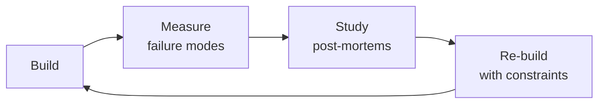

# FinOps Engineer / Cloud Cost Optimization
> **Portability target:** Spec-level (runs on Claude Code, Copilot, Gemini CLI, Codex, Cursor). No vendor-specific frontmatter fields.

Drive cloud financial accountability through the FinOps lifecycle: Inform (visibility, allocation),
Optimize (right-sizing, commitment discounts, waste elimination), and Operate (governance, unit
economics, continuous improvement). Covers multi-cloud cost management, tagging strategy,
Reserved Instances/Savings Plans, Kubernetes cost optimization, spot instance strategy, storage
tiering, data transfer optimization, anomaly detection, and carbon-aware cost reduction.

## Route the Request
<!-- STANDARD: 3min -->

<!-- QUICK: 30s -- auto-route first, then intent-route -->

### Auto-Route (No User Input Required)
Evaluate these file-system conditions in order. First match wins — jump immediately.

| # | Condition | Action |
|---|-----------|--------|
| A1 | `file_exists("cost-dashboard.json")` OR `file_contains("./**/*.md", "cost.*anomaly\|bill.*spike\|spend.*increase")` | Jump to "Core Workflow > Phase 1" (Cost Analysis & Visibility) |
| A2 | `file_exists("main.tf")` AND `file_contains("main.tf", "instance_type\|vm_size\|machine_type")` AND NOT `file_contains("main.tf", "reserved\|savings_plan")` | Jump to "Core Workflow > Phase 2" (Resource Optimization) — right-sizing opportunity |
| A3 | `file_contains("main.tf", "reserved_instance\|savings_plan\|capacity_reservation")` OR `file_exists("commitments/")` | Go to "Decision Trees > RI vs Savings Plans vs Spot" |
| A4 | `grep -rn "tag\|label\|cost_center\|CostCenter" . --include="*.tf" --include="*.json"` returns fewer than 3 matches | Jump to "Core Workflow > Phase 3" (Budgeting & Governance) — tagging gap |
| A5 | `file_exists("chargeback.csv")` OR `file_contains("./**/*.md", "chargeback\|showback\|cost.*allocation")` | Go to "Best Practices > Cost Allocation & Showback/Chargeback" |
| A6 | `file_exists("main.tf")` AND `file_contains("main.tf", "eks\|aks\|gke\|kubernetes")` AND `file_contains("main.tf", "kubecost")` is false | Go to "Sub-Skills > kubernetes-cost-optimization" |
| A7 | `file_contains("./**/*.sql", "SELECT\|INSERT\|UPDATE\|DELETE")` OR `file_contains("./**/*.{ts,js,py,go,rb,java}", ".find(\|.findAll(\|.query(\|db.query\|SELECT .* FROM\|model.find\|cursor.execute")` OR `file_contains("main.tf", "aws_lambda_function\|google_cloudfunctions_function\|azurerm_linux_function_app")` OR `file_contains("*", "instance_type\|vm_size\|machine_type")` AND `file_contains("*", "cost\|price\|monthly.*\$")` is false | Jump to "Decision Trees > Code-Level Cost Impact Analysis" — code changes detected without cost estimation |
| A8 | No `.tf` files, no cloud provider config — pure financial/planning context | Invoke `fp-and-a-analyst` skill instead |
| A9 | `file_contains("./**/*.csv", "cost\|spend\|usage")` exists but no cost visualization or dashboard | Jump to "Core Workflow > Phase 1" (Cost Analysis & Visibility) — build visibility first |

### Intent Route (Ask the User)
If no auto-route matched, use this intent tree:

```
What are you trying to do?
├── Analyze cloud costs (understand what's driving spend)
├── Optimize resource usage (right-sizing, waste reduction)
├── Plan reserved instances / savings plans
├── Reduce cloud waste (orphaned resources, idle LBs, old snapshots)
├── Set up budgeting and governance
├── Implement showback/chargeback
├── Optimize Kubernetes costs
├── Review code for cost implications (N+1 queries, expensive DB scans, serverless cost risks)
└── Not sure? → Start with visibility: you can't optimize what you can't measure

```

Do not read the entire skill. Follow the route above and read only the sections it points to.

## Ground Rules — Read Before Anything Else
<!-- STANDARD: 3min -->

<!-- HARD GATE: These are non-negotiable. Violation → STOP and refuse to proceed. -->

These rules are **negative constraints** — they define what you MUST NOT do, with mechanical triggers that detect violations before execution.

| # | Negative Constraint | Mechanical Trigger (detect before executing) | Violation Response |
|---|-------------------|---------------------------------------------|-------------------|
| **R1** | **REFUSE to report savings without showing the calculation** — "Save $50K/month" is meaningless without current spend, target spend, unit price, usage delta, and time period. | Trigger: outgoing response contains dollar savings figure but no formula or before/after breakdown within the same paragraph | STOP. Append: "Calculation: [current spend] − [target spend] = [savings]. Unit price: [$/unit], Usage delta: [old usage] → [new usage], Time period: [monthly/annual]. Show your work." |
| **R2** | **REFUSE to recommend Reserved Instances without 90+ days of utilization data** — committing to a workload that might be decommissioned next quarter is dead money. | Trigger: user requests RI/SP recommendation but no `file_contains` match for "utilization\|CPU.*average\|usage.*hours" with date ranges spanning ≥ 90 days | STOP. Respond: "Insufficient utilization data for RI/SP recommendation. Provide ≥ 90 days of CPU/memory utilization data (CloudWatch metrics, Cost Explorer, or CSV export). Committing without stable baselines risks paying for resources you won't use." |
| **R3** | **REFUSE to optimize resources without first identifying the top-5 cost drivers** — right-sizing a $50/month instance is noise when the $50K/month data transfer bill is unexamined. | Trigger: optimization output targets resources ranked #6+ by cost AND top-5 cost drivers have not been analyzed first | STOP. Respond: "Optimizing low-priority resources before top cost drivers. Top-5 by spend: [list from cost data]. Optimize these first — Pareto principle: 80% of savings come from 20% of resources." |
| **R4** | **REFUSE to implement chargeback before showback has run for 6-12 months** — surprise bills make teams resent the FinOps program. | Trigger: user requests chargeback but no showback report history exists (no `file_contains` match for "showback\|cost.*visibility\|per.team.*report" in project docs) | STOP. Respond: "Chargeback requested but no showback history detected. Implement showback first: 6-12 months of cost visibility without financial accountability. Build cost awareness and trust — then transition to chargeback with agreed-upon budgets." |
| **R5** | **STOP and ASK when Spot instances are proposed for stateful workloads** — Spot for databases or message queues causes outages when instances are reclaimed. | Trigger: `file_contains("main.tf", "spot\|spot_instance\|spot_fleet")` AND the same file references `aws_db_instance\|aws_elasticache\|aws_msk` or similar stateful resources | STOP. Ask: "Spot instances detected near stateful resources ([list]). Spot is for stateless, fault-tolerant, interruptible workloads only (batch jobs, CI/CD, non-production). Move databases/queues to on-demand or Reserved. Confirm you want Spot only for stateless workloads?" |
| **R6** | **DETECT and WARN about untagged resources** — every dollar without a team/owner tag is untraceable spend. | Trigger: `grep -rn "tags\s*=" main.tf` returns zero matches OR `grep -rnE "(Team|Environment|CostCenter|Service)\s*=" main.tf` returns fewer than 3 matches | WARN: "Missing mandatory cost allocation tags. Every resource must have `Team`, `Environment`, `Service`, and `CostCenter` tags. Without tags, you can't answer 'who owns this spend?' — and you can't optimize what you can't attribute." |
| **R7** | **DETECT and WARN about cost anomalies being ignored due to alert fatigue** — an alert fired weekly and ignored is worse than no alert. | Trigger: `grep -rn "anomaly\|budget.*alert\|cost.*alert" . --include="*.tf" --include="*.md"` shows threshold at flat 10% without standard deviation baselines | WARN: "Flat percentage anomaly threshold detected. Set thresholds at 2 standard deviations from trailing 14-day average, not a flat percentage. Filter known growth patterns. Escalate if acknowledged but not investigated within 72 hours. Alert fatigue kills FinOps programs." |
| **R8** | **DETECT and BLOCK code changes that introduce unbounded cost risk** — an N+1 query or serverless infinite loop merged Friday costs real money by Monday. | Trigger: any of: (1) loop body contains a database call (ORM `.find()`/`.query()` inside `for`/`forEach`/`map`), (2) serverless handler with loop lacking `maxIterations` or timeout guard, (3) IaC diff adding resource without `CostImpact` tag, (4) new SQL query without `EXPLAIN ANALYZE` in PR description | STOP. Respond: "Unbounded cost risk detected: [specific pattern]. Estimated worst-case cost: [$X/month]. Fix before merge: [eager loading | batch queries | timeout guard | EXPLAIN ANALYZE]. Cost risk is a correctness concern — not an optimization. $1000/month bugs are as serious as security bugs." |
| **R9** | **ANCHOR to runtime versions before generating framework-specific code.** Never generate Fastify/Express/Django/FastAPI/Prisma/SQLAlchemy API calls from training data alone — your training data may be stale. | Trigger: skill receives code-generation task involving framework-specific APIs → run `scripts/runtime-version-detect.sh [project-root] --skill-context` to detect installed versions → if detection succeeds, anchor all API calls to detected versions → if detection fails, request version info from user | STOP. Respond: "Detected: {runtime}@{version}, {frameworks}@{versions}. Anchoring all API calls to these versions. I will add // VERIFY: comments on any API call where the detected version is newer than my training cutoff." |
| **R10** | **RUN the ROI Gate before any non-emergency code change.** Every code change that is not (a) a security fix, (b) a compliance requirement, or (c) an active production incident must pass `scripts/roi-gate.sh`. If the gate returns negative, refuse to write the code. | Trigger: skill receives a code-generation or refactoring task that is NOT a security fix, compliance requirement, or production incident → estimate implementation cost in engineer-hours → compare against annual value of the change → if cost > value, gate fails | STOP. Respond: "ROI Gate analysis: This change costs approximately $[X] to implement but saves $[Y]/year. Payback period: [N] years. If payback > 2 years, I recommend declining this work. See `scripts/roi-gate.sh` for the full formula." |

- **Admit uncertainty — never fabricate.** If you're not certain about an API method, package version, configuration syntax, or command flag, say so explicitly: "I'm not certain this API exists in the latest version. Check the official docs at [URL]." Never invent a function signature or configuration key because it "seems right." Hallucinated code costs hours of debugging.
- **Flag your knowledge cutoff.** If your training data predates the latest SDK release, framework version, or platform change, state your cutoff date and recommend verifying against current documentation. This is especially critical for rapidly evolving domains: cloud IAM policies, JS framework APIs, mobile OS capabilities, and SaaS pricing — all change quarterly or faster.
- **Never guess security configurations.** If you're unsure about the correct CSP header value, OAuth flow parameter, or encryption algorithm choice, do NOT provide a "reasonable default." Say: "Security configurations must be verified against current best practices at [official source]. I cannot provide a definitive answer without current documentation."
- **Distinguish between what you know and what you infer.** Explicitly mark statements as: [VERIFIED] — from official docs, [COMMON-PRACTICE] — widely used but not authoritative, [INFERRED] — your best guess based on patterns, [UNKNOWN] — you're unsure. This helps the user calibrate trust in your output.
## The Expert's Mindset
<!-- STANDARD: 3min -->

Masters of finops engineer don't just build — they build **the right thing, at the right time, with the right trade-offs**. They think in systems, not tasks.

| Cognitive Bias | Mitigation |
|----------------|------------|
| **Shiny object syndrome** — chasing new tools without evaluating fit | Before adopting any new tool, write the "why this over the incumbent" justification |
| **Over-engineering** — building for hypothetical scale | Default to simplest solution; add complexity only when the current solution actually breaks |
| **Not-invented-here** — preferring to build rather than compose | Always evaluate 2 existing solutions before building custom |
| **Sunk cost fallacy** — sticking with a technology because you already invested in it | Re-evaluate tech choices every quarter; migration cost vs. staying cost |

### What Masters Know That Others Don't
- The **failure modes** of every component in their stack — not just the happy path
- When **not** to use their favorite tool (every tool has a misuse zone)
- That **data/model quality decays over time** — monitoring is not optional, it's foundational

### When to Break Your Own Rules
- **Move fast on reversible decisions.** Data format? Hard to change. Dashboard layout? Easy. Know the difference.
- **Skip the abstraction until the third use case.** Two is coincidence, three is a pattern.

## Operating at Different Levels
<!-- STANDARD: 3min -->

| Level | Scope | You... |
|-------|-------|--------|
| **L1** | Single component/module | Implement a well-defined piece following established patterns |
| **L2** | Feature or service | Design and build a complete feature; make tech choices within team conventions |
| **L3** | System or product area | Define architecture for a product area; set team tech standards; mentor L1-L2 |
| **L4** | Multiple systems / platform | Define org-wide architecture patterns; make build-vs-buy decisions; influence industry practice |
| **L5** | Industry / ecosystem | Create new architectural patterns adopted across the industry; redefine what's possible |

**Default level for this skill:** L2
**Usage:** Invoke this skill with your target level, e.g., "as an L3 finops engineer, design..."

For full level definitions, see `skills/00-framework/skill-levels/SKILL.md`.

## When to Use
<!-- STANDARD: 3min -->

- Your monthly cloud bill (AWS/Azure/GCP) has spiked and you need to identify the root cause
- You need to implement a tagging strategy to allocate cloud costs to teams, projects, and environments
- You are evaluating Reserved Instances vs. Savings Plans vs. on-demand to reduce compute spend
- You need to right-size underutilized resources — instances with <10% CPU or idle load balancers
- You are setting up cost anomaly detection and budget alerts to catch spending surprises early
- You need to optimize Kubernetes cluster costs through node autoscaling, bin packing, and spot instances
- You are building unit economics dashboards to tie cloud spend to business metrics (cost per customer, per API call)
- You need to reduce data transfer costs between regions, availability zones, or out to the public internet

## Decision Trees **(QUICK)**
<!-- STANDARD: 3min -->

<!-- QUICK: 30s -- follow the ASCII tree to your scenario -->
### 1. Reserved Instance vs. Savings Plan vs. On-Demand

```
What's the workload profile?
├─ Steady-state, predictable (24/7 production, no seasonal spikes)?
│   └─ All Upfront Reserved Instance (3-year): max discount (up to 72% off on-demand)
│       └─ Rule: commit only when workload has been stable for > 90 days
├─ Steady-state but may change instance family over time?
│   └─ Compute Savings Plan (1-year or 3-year): 66% off, flexible across families/regions
│       └─ Rule: best default choice — balances discount with flexibility
├─ Variable but has a minimum baseline (e.g., 40% of peak at all times)?
│   └─ Savings Plan for baseline (40-60%) + On-Demand/Spot for variable
│       └─ Rule: RI/SP coverage target = 60-80% of compute spend; not 100%
├─ Stateless, fault-tolerant, batch, or CI/CD workloads?
│   └─ Spot instances (up to 90% off): with fallback to on-demand
│       └─ Rule: MUST have graceful interruption handling; Spot cannot be > 70% of a critical service
├─ Short-lived, unpredictable (hackathon, POC, burst)?
│   └─ On-Demand: no commitment penalty
└─ WARNING: Buying RIs/SPs for workloads < 6 months old = overcommitment risk

```

### 2. Right-Sizing Decision

```
Resource utilization analysis:
├─ CPU < 10% avg over 30 days?
│   ├─ AND Memory < 20% → DOWNGRADE 2 sizes (or consolidate workloads)
│   ├─ AND Memory 20-50% → DOWNGRADE 1 size
│   └─ AND Memory > 50% → Memory-bound; CPU is irrelevant → consider memory-optimized instance
├─ CPU 10-40% AND Memory 10-40%?
│   └─ Adequate: no change unless cost-per-transaction exceeds target
├─ CPU 40-70%?
│   └─ Optimal range: no action unless bursting patterns suggest auto-scaling would save more
├─ CPU > 70% sustained?
│   └─ UPGRADE or enable auto-scaling
│       └─ Rule: if utilization is > 70% for > 4 hours/day, you need more capacity
├─ Storage attached (EBS, managed disk, persistent disk)?
│   └─ Check provisioned IOPS vs consumed: paying for unused IOPS → switch to GP3/auto-tier
└─ Implementation: change instance type in IaC, deploy during maintenance window, verify performance

```

### 3. Storage Tier Optimization

```
Object storage lifecycle decision:
├─ Accessed hourly?
│   └─ Hot tier (S3 Standard, GCS Standard, Azure Hot): $0.021-0.023/GB
├─ Accessed weekly/monthly?
│   └─ Infrequent access (S3 Standard-IA, GCS Nearline): $0.0125/GB + retrieval fee
│       └─ Rule: minimum 30-day storage; retrieval cost must be < savings from storage
├─ Accessed quarterly/annually (backups, logs, compliance)?
│   └─ Cold tier (S3 Glacier Instant Retrieval, GCS Coldline, Azure Cool): $0.004-0.005/GB
│       └─ Rule: retrieval time < 5 minutes; cost is 75% cheaper than Standard
├─ Accessed rarely (< 1x/year, regulatory archive)?
│   └─ Deep archive (S3 Glacier Deep Archive, Azure Archive): $0.00099-0.002/GB
│       └─ Rule: retrieval time 12-48 hours; minimum 180-day storage
├─ Can we just delete it?
│   └─ YES → Set lifecycle policy: delete after X days
│       └─ Savings: 100% — always the best optimization
└─ Implementation: S3 lifecycle policies, GCS object lifecycle management, Azure Blob lifecycle

```

### 4. Data Transfer Cost Optimization

```
Service-to-service communication:
├─ Same availability zone?
│   └─ Free within AZ (AWS/GCP/Azure)
│       └─ Optimization: use AZ-aware service discovery; avoid cross-AZ load balancing for chatty services
├─ Cross-AZ within same region?
│   └─ $0.01/GB each direction (AWS/Azure), $0.01/GB (GCP)
│       └─ Optimization: consolidate services that talk frequently into same AZ when possible
├─ Cross-region?
│   └─ $0.02/GB (inter-region) — MOST EXPENSIVE PER GB
│       └─ Optimization: replicate data once, serve locally; use CloudFront/CDN to cache at edge
├─ Internet egress?
│   └─ $0.05-0.12/GB after free tier (AWS), $0.087-0.12/GB (Azure), $0.12/GB (GCP)
│       └─ Optimization: CDN (reduces origin egress), PrivateLink/Private Service Connect (keeps traffic on backbone)
├─ NAT Gateway?
│   └─ $0.045/GB + $0.045/hour per AZ
│       └─ Optimization: VPC endpoints for S3/DynamoDB (free, no NAT); consolidate to 1 NAT in hub VPC
└─ WARNING: Cross-region data transfer is the #1 hidden cost in multi-region architectures

```

### 5. Kubernetes Cost Optimization

```
Cluster cost attack surface:
├─ Node right-sizing?
│   ├─ Average node utilization < 40%? → Use smaller nodes or enable cluster autoscaler
│   │   └─ Rule: target 60-80% allocatable capacity utilization
│   └─ Too many node pools? → Consolidate; each pool adds management overhead
├─ Pod resource requests vs usage gap?
│   └─ requests > 2x actual usage? → Reduce requests (frees up bin-packing capacity)
│       └─ Tool: kubecost, Goldilocks, VPA recommender mode
├─ Idle workloads?
│   └─ Namespaces with 0 pods running? → Clean up; idle namespaces waste cluster overhead
│   └─ CronJobs running too frequently? → Reduce frequency or batch
├─ Spot nodes?
│   └─ 60-80% of worker nodes SHOULD be spot for stateless workloads
│       └─ Rule: production stateless services (web, API) on spot with PodDisruptionBudget; stateful on on-demand
├─ Over-provisioned cluster?
│   └─ Cluster autoscaler not scaling down? → Check PDBs preventing eviction; tune scale-down thresholds
└─ Implementation: kubecost for visibility → right-size requests → spot adoption → autoscaler tuning

**What good looks like:** The output opens correctly in the target tool. All validations pass. No placeholder content remains.

```

### 6. Code-Level Cost Impact Analysis
> **Pre-deployment gate: catch cost bombs before they reach production.**

```
Code change detected — what kind?
├─ ORM/database query code (.find(), db.query(), SELECT, cursor.execute)?
│   ├─ Loop body contains a database call? → 🔴 N+1 QUERY: cost = (N × query_cost) not (1 × query_cost)
│   │   └─ Fix: eager loading (`.include()`, `.prefetch_related()`), batch queries (`WHERE id IN (...)`), DataLoader
│   │   └─ Estimate: 1000 users × $0.001/read = $1.00 instead of $1000.00 for 1M individual reads
│   ├─ SELECT without WHERE on an indexed column? → 🟡 FULL TABLE SCAN: cost scales with table size, not result size
│   │   └─ Fix: add covering index, add LIMIT, use cursor-based pagination
│   │   └─ Estimate: 10M rows × $0.0001/scan = $1000/month vs indexed query at $1/month
│   ├─ Missing EXPLAIN ANALYZE in PR description? → 🟡 REQUEST IT: "Add EXPLAIN ANALYZE output for new queries"
│   └─ Bulk INSERT/UPDATE without batching? → 🟡 Estimate DB I/O cost; 10K individual INSERTs = 100× cost of batched
│
├─ Serverless function code (Lambda, Cloud Functions, Azure Functions)?
│   ├─ Loop with unpredictable exit condition? → 🔴 INFINITE LOOP RISK: Lambda billed per 1ms; infinite = unbounded cost
│   │   └─ Fix: add timeout guard, max iteration counter, circuit breaker
│   │   └─ Estimate: 15-min timeout × 1024MB = $0.00001667/ms × 900K ms = $15.00 PER INVOCATION
│   ├─ Cold start > 1s expected? → 🟡 Consider provisioned concurrency or keep-warm pings
│   │   └─ Estimate: 100K cold starts/day × 2s × 256MB = $2.78/day → $83/month overhead
│   ├─ Memory allocated 2× needed? → 🟡 Right-size: 256MB instead of 1024MB saves 75% on duration costs
│   │   └─ Estimate: 1M invocations × (1024MB − 256MB) × 200ms avg = $2.56/day → $77/month savings
│   └─ Recursive SQS/SNS trigger without dead-letter queue? → 🔴 INFINITE RETRY LOOP: exponential cost growth
│
├─ IaC changes (Terraform, CloudFormation, Pulumi, Bicep)?
│   ├─ instance_type/vm_size/machine_type changed? → Calculate cost delta:
│   │   ├─ Scale UP: new_cost - old_cost = $X/month increase → flag in PR as cost impact
│   │   ├─ Scale DOWN: old_cost - new_cost = $X/month savings → ✅ auto-approve cost change
│   │   └─ New resource with no cost tag? → 🟡 Add `CostImpact: $X/month` label to Terraform resource
│   ├─ Provisioned IOPS > actual consumed? → 🟡 WASTE: paying for unused IOPS; switch to GP3 auto-tier
│   │   └─ Estimate: 3000 provisioned IOPS × $0.10/IOPS-month = $300/month; actual usage: 200 IOPS → 93% waste
│   ├─ RDS/Aurora instance with `multi_az = true` where not needed? → 🟡 2× cost; confirm HA requirement
│   └─ NAT Gateway added without VPC Endpoints for S3/DynamoDB? → 🟡 $0.045/GB + $32.85/month per AZ
│
├─ API endpoint changes?
│   ├─ New endpoint without rate limiting? → 🟡 Unbounded cost risk; add rate limit + cost ceiling
│   ├─ Response payload size increased? → 🟡 Data transfer costs scale linearly; estimate egress impact
│   └─ New cross-region API call? → 🔴 $0.02/GB inter-region; prefer same-region deployment
│
└─ PR cost gate: Before merging any code change that touches data access or IaC:
    ├─ Calculate Δcost/month = (new_resource_cost − old_resource_cost + query_cost_delta)
    ├─ If Δcost > $100/month → ADD `cost-impact:review` label, request senior approval
    ├─ If Δcost > $1000/month → BLOCK merge until cost justification is documented
    └─ Run `EXPLAIN ANALYZE` on new queries and include output in PR description

```

## Core Workflow **(STANDARD)**
<!-- STANDARD: 3min -->

<!-- QUICK: 30s -- scan phase titles to understand the process -->

### Phase 0 (~10 min): Pre-Deployment — Code-Level Cost Gate
> **Catch cost bombs in code review, not in the monthly bill.**

1. **Scan changed files for cost-sensitive patterns:**
   - **ORM/DB calls inside loops** → N+1 query risk. Flag: `.find()`, `.query()`, `SELECT` inside `for`, `forEach`, `map`, `while`.
   - **Serverless functions without timeout guards** → infinite loop risk. Flag: Lambda/Cloud Functions handler with `while(true)` or unbounded recursion.
   - **New SQL queries without EXPLAIN ANALYZE** → unknown scan cost. Require EXPLAIN output before merge.
   - **IaC resource changes** → compute cost delta. Flag: `instance_type` changes, new RDS/Aurora instances, NAT Gateway additions.

2. **Calculate cost impact:**
   - For each flagged pattern, estimate worst-case monthly cost: `unit_cost × expected_volume × safety_factor(2×)`.
   - Categorize: 🟢 <$10/month (noise), 🟡 $10–$100/month (review), 🔴 >$100/month (block merge).
   - Output: Cost impact table in PR comment with per-file breakdown.

3. **Enforce cost gates:**
   - Δcost > $100/month → PR label `cost-impact:review`, requires senior approval.
   - Δcost > $1000/month → Block merge until cost justification doc is committed.
   - No EXPLAIN ANALYZE on new queries → Request changes, do not approve.

4. **Output:** PR comment with cost delta summary, flagged patterns with line references, and fix recommendations (eager loading, batch queries, timeout guards, right-sizing).
  Complete when: cost impact table is posted on PR with per-file breakdown, all 🔴 >$100/month items have senior approval, and any >$1000/month change has a committed cost justification doc.

### Phase 1 (~15 min): Inform — Visibility and Allocation
1. **Implement comprehensive tagging strategy**: mandatory tags (`Environment`, `Service`, `Team`, `CostCenter`, `Owner`) enforced via SCP/Azure Policy/Org Policy.
   - Output: Tagging policy document with enforcement mechanism; > 95% resource tag compliance within 60 days.
2. **Enable cost allocation**: map untagged costs to teams using proportional allocation rules.
   - Input: Resource inventory with tags, total cloud bill at account/project level.
   - Output: Cost-per-team, cost-per-service, cost-per-environment dashboards.
3. **Configure cost dashboards**: AWS Cost Explorer, Azure Cost Management, GCP Billing reports — shared with all engineering teams.
   - Output: Self-service dashboard with weekly cost trend, top-10 spenders, and budget vs. actual.
4. **Set budgets and alerts**: budgets per team/environment with alerts at 50%, 80%, 100%, 120%.
   - Output: Budget alerting pipeline; alerts routed to team channels (Slack, email, PagerDuty).
5. **Enable anomaly detection**: AWS Cost Anomaly Detection, Azure Anomaly Alerts, GCP Billing anomaly detection.
   - Output: Anomaly alerting with < 24-hour detection; > 90% of anomalies investigated within 48 hours.
  Complete when: > 95% resource tag compliance is verified, cost-per-team dashboards are live and accessible, budget alerts fire correctly at all thresholds, and anomaly detection is configured with alert routing.

### Phase 2 (~30 min): Optimize — Cost Reduction
1. **Right-size underutilized resources**: run Compute Optimizer / Recommender across all compute; implement changes.
   - Input: 30-day utilization data from cloud provider.
   - Output: Right-sizing recommendations list with estimated savings; implementation plan.
2. **Purchase commitment discounts**: RIs, Savings Plans, CUDs for baseline workloads (see Decision Tree #1).
   - Input: Steady-state workload inventory with historical utilization, growth forecast.
   - Output: Commitment purchase plan with ROI analysis (< 12-month payback); implemented purchases.
3. **Implement spot instance strategy**: identify stateless/fault-tolerant workloads; migrate to spot with fallback.
   - Input: Workload classification (stateless vs stateful, critical vs batch).
   - Output: Spot adoption plan; > 40% of non-production compute on spot; > 20% of production.
4. **Optimize storage tiers**: implement lifecycle policies (see Decision Tree #3).
   - Input: Storage inventory with access patterns (S3 Inventory, Azure Blob Inventory).
   - Output: Lifecycle policy configuration; estimated savings from tier transitions and deletions.
5. **Reduce data transfer costs**: optimize cross-AZ, cross-region, and egress traffic (see Decision Tree #4).
   - Input: VPC Flow Logs, data transfer billing reports.
   - Output: Data transfer optimization plan; CDN/PrivateLink/VPC endpoint implementation.
6. **Optimize Kubernetes costs**: right-size nodes, pods, and adopt spot (see Decision Tree #5).
   - Input: kubecost or equivalent cost allocation data.
   - Output: K8s optimization backlog ranked by savings; implemented changes.
  Complete when: right-sizing plan has estimated savings with implementation timeline, RI/SP purchase covers baseline with < 12-month payback, > 40% non-prod compute is on spot, and lifecycle policies apply to all storage.

### Phase 3 (~20 min): Operate — Governance and Continuous Improvement
1. **Establish cost governance**: define approval workflow for resources above cost threshold; auto-approve below.
   - Output: Cost governance policy; automated guardrails for high-cost resource provisioning.
2. **Define unit economics**: cost per customer, cost per transaction, cost per API call — tie cloud cost to business value.
   - Output: Unit cost dashboard; trends tracked monthly; anomalies trigger investigation.
3. **Run monthly FinOps review**: review spend vs. budget, optimization opportunities, commitment coverage gaps.
   - Attendees: FinOps lead, engineering leads, finance, CTO (quarterly).
   - Output: FinOps review report with action items and owner assignments.
4. **Automate waste elimination**: schedule idle resource shutdown (non-production nights/weekends); auto-delete unattached resources.
   - Output: Waste elimination automation with weekly savings report; < 5% idle resource waste.
5. **Manage cloud provider relationships**: negotiate EDP/private pricing, track credit consumption, renew commitments.
   - Output: Provider relationship dashboard; quarterly business review with providers.
  Complete when: cost governance policy is documented with approval workflows, unit cost dashboard shows cost-per-customer and cost-per-transaction, monthly FinOps review is on the calendar, and idle resource waste is below 5%.

### Phase 4 (~15 min): Carbon-Aware Optimization (GreenOps)
1. **Measure carbon footprint**: cloud provider carbon dashboards (AWS Customer Carbon Footprint Tool, Azure Emissions Impact, GCP Carbon Footprint).
   - Output: Carbon baseline; monthly carbon report alongside cost report.
2. **Shift workloads to low-carbon regions**: prioritize regions with low carbon intensity for new and relocatable workloads.
   - Output: Carbon-aware region selection policy; migration plan for eligible workloads.
3. **Optimize for carbon**: schedule batch workloads during low-carbon-intensity hours; right-size reduces carbon proportionally.
   - Output: Carbon optimization playbook integrated into standard FinOps practices.
  Complete when: carbon baseline is measured, carbon-aware region selection policy is adopted for new workloads, and carbon optimization playbook is integrated into the standard FinOps review.
  Complete when: Pipeline runs end-to-end in under 15 minutes with parallelized stages.
  Complete when: Rollback tested — can revert to previous version within 5 minutes of detection.
  Complete when: Secrets scan runs in CI and blocks merge on any detected credential.

## Gotchas
<!-- DEEP: 10+min -->
<!-- STANDARD: 3min -->

| Gotcha | Cost | Fix |
|--------|------|-----|
| Enabling S3 versioning without noncurrent-version expiration — every object update creates a new chargeable version; a 10GB file updated daily accumulates 300GB in 30 days with no lifecycle rule to clean old versions | $10K-$50K in unexpected storage costs within the first month | Always pair versioning with `NoncurrentVersionExpiration` lifecycle rules; set `NoncurrentDays: 3` for non-critical data; monitor `NumberOfObjects` and `BucketSizeBytes` per storage class |
| Buying 3-year RIs for a workload that gets deprecated in 6 months — the RI commitment outlives the workload; you pay for compute you can't use for 2.5 years | $20K-$100K in stranded commitment costs | Purchase 1-year commitments for any workload whose lifetime is uncertain; use Savings Plans (more flexible than RIs) for variable instance families; never commit beyond the known workload roadmap horizon |
| Leaving NAT Gateways in dev/staging environments running 24/7 — a $32/month NAT Gateway × 3 environments × 12 months = $1,152/year for traffic that never leaves the VPC | $1K-$5K per year per environment in idle NAT Gateway costs | Schedule non-production NAT Gateways to shut down during off-hours (nights/weekends); use VPC endpoints for S3/DynamoDB to avoid NAT Gateway charges entirely; monitor NAT Gateway data transfer costs weekly |
| Not setting billing alerts on new accounts — a misconfigured autoscaling group spins up 500 instances overnight; the bill arrives at $15,000 before anyone notices | $10K-$50K in a single-month billing spike | Set budget alerts at 50%, 80%, 100%, and 120% on every account; configure hard spending limits where the cloud provider supports them; use AWS Budget Actions to auto-apply SCP deny policies at the hard limit |

## Error Decoder — War Stories from the Trenches
<!-- STANDARD: 3min -->

**(STANDARD)**

When this domain goes wrong, it goes wrong in predictable ways. Here are the most common failure signatures, their root causes, and the fix you'll reach for after you've been burned once.

| Symptom | Root Cause | Fix | Lesson |
|---------|-----------|-----|--------|
| AWS bill jumps from $45K to $87K in one month — the only change was "enabling S3 versioning for compliance" on a data lake bucket | A lifecycle policy deletes expired objects but doesn't expire old versions. Every object update creates a new version while keeping the old one. A 10GB file updated daily accumulates 30 versions × 10GB = 300GB in 30 days — and the lifecycle rule skips noncurrent versions | Add `NoncurrentVersionExpiration` with `NoncurrentDays: 3` to every versioned bucket's lifecycle policy. Monitor `NumberOfObjects` per storage class in CloudWatch. Set bucket-level alerts when versioned storage exceeds 2× the non-versioned baseline | S3 versioning without noncurrent-version expiration is compound interest in reverse. The lifecycle rule for current objects ignores versions. Every PUT creates a new chargeable object until you explicitly expire the old ones. |
| Reserved Instance utilization shows 100% in AWS Cost Explorer — but actual RI coverage is 40% | The RI was purchased for `m5.xlarge` in us-east-1a. Auto-scaling launched instances in us-east-1c (different AZ). The RI applies to us-east-1a only. Cost Explorer's "RI utilization" reports what fraction of purchased RIs are matched — 100% of the 1 RI is used. It doesn't report that 60% of instances are on-demand in other AZs | Purchase RIs without AZ designation (regional scope), or use Savings Plans that auto-apply across instance families, regions, and OS. Monitor "RI Coverage" (not utilization) in Cost Explorer or via `aws ce get-reservation-coverage` | RI utilization is a misleading metric. 100% utilization of 10 RIs means the 10 you bought are applied somewhere — it says nothing about the 50 on-demand instances running in parallel. Always monitor coverage, not utilization. |
| Kubernetes cost allocation shows "unallocated: $12K" — 40% of cluster spend has no owner | Pods missing `app` and `team` labels. Kubecost/OpenCost uses label-based allocation. Pods without matching labels roll up to "unallocated" and can't be charged back to teams. The cluster has 300+ namespaces but only 60 have required labels | Enforce namespace labels with OPA/Kyverno admission policies (`require app, team, cost-center`). Backfill pod labels via Kyverno `mutate` rules that inherit from namespace labels. Configure Kubecost's `defaultRequest` to assign a default cost to unlabeled pods as a forcing function | Cost allocation is a labeling problem, not a billing problem. If pods don't carry ownership labels, the money is real but the attribution is imaginary. Unallocated spend is a governance failure — fix it with admission control, not spreadsheets. |
| NAT Gateway costs $8K/month for a cluster that only has 3 nodes and 12 pods | Every pod's egress to S3/DynamoDB routes through the NAT Gateway. The cluster generates 2TB of egress per month — all billed at $0.045/GB. The pods could be using VPC Endpoints (free for the first 100GB, then $0.01/GB per endpoint-hour) instead | Add S3 Gateway Endpoint (free), DynamoDB Gateway Endpoint (free), and ECR Interface Endpoints ($0.01/hr × 3 AZs = $22/month). Egress through VPC Endpoints costs $0.01/GB vs $0.045/GB through NAT. Total cost drops from $8K to ~$50/month | NAT Gateway is the default egress path for private subnets — and the most expensive one. Every AWS service that offers a VPC Endpoint should have one provisioned. A 3-node cluster routing all egress through NAT is paying 160× more than necessary. |
| Anomaly detection alert fires at 3 AM for a $1.2K spike — the team wakes up but it's a scheduled 6-hour spot instance price surge | EC2 spot prices surged from $0.07/hr to $2.10/hr (30×) during a capacity crunch in us-east-1a. The cluster gracefully shifted to on-demand, but the cost anomaly detector doesn't differentiate between spot price volatility and genuine spending anomalies | Configure anomaly alerts with a 24-hour rolling window (not hourly). Set separate thresholds: spot cost > 3× baseline = informational; on-demand + RI cost > 1.5× baseline = P1 alert. Use diversified spot instance pools (multiple instance families + multiple AZs) so a single-family surge doesn't spike costs | Spot price surges are normal, not anomalous. Anomaly detection on per-hour granularity generates false alarms for any workload that uses spot. Use daily aggregation with separate thresholds for interruptible vs committed spend. |
| Teams provision `db.r5.24xlarge` in dev "just for testing" — the $15K/month instance runs for 6 weeks before FinOps catches it | Self-service IaC modules have no size constraints. A developer copies a production Terraform module, changes the name, and provisions a 96-vCPU database for a 100-row test dataset. No approval gate catches it because dev environments bypass the production change management process | Add JSON Schema `maximum` constraints on instance sizes in Terraform module variables. Implement OPA policies: `deny[msg] { input.instance_class == "db.r5.24xlarge"; not input.environment == "prod" }`. Set budget alerts on dev accounts at $500/month with hard stops at $1,000 | Self-service without guardrails is self-inflicted cost. Developers pick the instance size they know (production's), not the one they need (dev's). Enforce size ceilings per environment in IaC modules — a budget alert arrives 24 hours too late. |

## Best Practices
<!-- STANDARD: 3min -->

1. **Enforce mandatory tagging at provisioning time.** Use SCPs (AWS), Azure Policy, or GCP Org Policy to block resource creation without `Environment`, `Service`, `Team`, `CostCenter` tags. Retroactive tagging is 10x more expensive than prevention.

2. **Implement the FinOps lifecycle: Inform → Optimize → Operate.** Start with visibility (Inform): every team sees their spend. Then reduce waste (Optimize): right-size, commit, spot. Finally govern (Operate): budgets, anomaly detection, unit economics. Skipping Inform means teams optimize what they cannot see.

3. **Prefer Savings Plans over Regional Reserved Instances** for compute commitments. SPs auto-apply across instance families, regions, and OS types. RIs tie you to a specific instance type in a specific region — a modernization tax paid every time you upgrade.

4. **Tag untagged spend with proportional allocation rules.** Not every team will achieve 100% tag coverage. Use allocation rules (by account, by resource type, by proportional distribution) to map untagged costs. A cost without an owner is a cost nobody optimizes.

5. **Set budget alerts at multiple thresholds, not just 100%.** Configure alerts at 50% (awareness), 80% (action), 100% (urgent), and 120% (crisis). Budget alerts at 100% alone are too late — you already spent the money.

6. **Pair anomaly detection with spend velocity monitoring.** Budget alerts fire after spend exceeds threshold. Anomaly detection catches run-rate changes: a cryptomining compromise burning $2K/day is visible in velocity before it breaks the monthly budget. Both signals together beat either alone.

7. **Right-size in this order: idle resources → over-provisioned → committed discounts.** Idle resources (unattached EBS, idle load balancers, unused IPs) are pure waste with zero value. Over-provisioned instances deliver value but at unnecessary cost. Commitments lock in discounts on what remains. This order maximizes ROI per engineering hour.

8. **Automate non-production shutdowns.** Schedule dev/staging environments to stop at 8 PM and restart at 7 AM weekdays, stay off weekends. A `db.r5.2xlarge` ($0.48/hr) running 24/7 instead of 40hrs/week wastes $3,360/year. Across 15 teams: $50K+/year.

9. **Calculate unit economics: cost per customer, per transaction, per API call.** Cloud cost alone is meaningless — $100K/month could be catastrophic (100 customers) or excellent (100K customers). Unit cost ties infrastructure spend to business value and reveals the true cost of growth.

10. **Run monthly FinOps reviews with cross-functional attendance.** Engineering, finance, and product must be in the room. Review spend vs. budget, optimization wins, commitment coverage gaps, and unit cost trends. Without regular reviews, FinOps decays into a once-per-quarter panic.

## Error Recovery **(STANDARD)**
<!-- STANDARD: 3min -->

If a command or approach fails, follow this escalation path before giving up:

| Symptom | First Action | If That Fails | Last Resort |
|---------|-------------|---------------|-------------|
| Tool/command not found | Check installation: `which [tool]` or `[tool] --version`. Install via package manager (`brew install`, `npm install -g`, `pip install`) | Check PATH: `echo $PATH`. Verify the tool binary is in a PATH directory. Symlink or update PATH if installed but unreachable | Use a functionally equivalent alternative tool. If `rg` is unavailable, use `grep -r`. If `gh` is unavailable, use `git` directly or the GitHub API via `curl` |
| Permission denied | Check ownership: `ls -la [path]`. Fix with `chmod` or `sudo` if appropriate. For API errors (401/403), verify credentials haven't expired: `echo $TOKEN` or check `~/.netrc` | Refresh credentials: re-authenticate with the service. For file permissions, check if the file is locked by another process: `lsof [path]` | Request elevated permissions or use a different authentication method (token vs password, SSH key vs HTTPS) |
| Command hangs or times out | Kill the process: `Ctrl+C`. Re-run with a timeout: `timeout 30 [command]` or `gtimeout` on macOS. Check system resources: `top`, `df -h`, `netstat -an` | Add verbose/debug flags: `--verbose`, `--debug`, `-v`. Check logs: `tail -f [logfile]`. Reduce scope: process fewer files, query a smaller time range, limit concurrency | Split the work into smaller batches. Implement a retry loop with exponential backoff (1s, 2s, 4s, 8s). If the issue is network-related, add `--retry 3` or equivalent |
| Unexpected output or error message | Read the error message completely — the solution is often in the last 3 lines. Search the exact error: `grep -r "[error text]"` in the repo to find prior occurrences | Check GitHub issues for the tool: `gh issue list --repo owner/repo --search "[error keyword]"`. Check Stack Overflow | Simplify the approach. If the complex one-liner fails, break it into 3 sequential commands. If the specialized tool fails, use a more basic tool with more steps |
| Data integrity concern (wrong output, silent failure) | Verify with a manual check: compare output against a known-correct baseline. Add assertions: `[command] | grep -q "[expected]" && echo "OK" || echo "FAIL"` | Run the operation on a smaller subset first. Compare checksums: `shasum`, `md5`. Check for silent truncation: `wc -l` before and after | Abort and flag for human review. Do not proceed past data integrity failures — the cost of propagating bad data exceeds the cost of delay |

**Hard failure boundary:** If 3 different approaches all fail, STOP. Do not iterate infinitely. Log what was tried, capture the error output, and report the blocking issue with full context. Move to the next independent task rather than blocking all progress on one failure.

## Cross-Skill Coordination
<!-- STANDARD: 3min -->

| Upstream Skill | What You Receive | When to Involve |
|---|---|---|
| `cloud-architect` | Architecture decisions with cost implications, multi-cloud strategy, landing zone design, tagging requirements | Before analyzing costs or recommending commitment discounts |
| `devops-engineer` | Infrastructure provisioning details, autoscaling configuration, resource lifecycle automation | Before identifying idle resources or recommending right-sizing |
| `fp-and-a-analyst` | Budget forecasts, financial models, unit economics targets, commitment purchase approvals | Before making RI/SP purchase recommendations or setting budget thresholds |

| Downstream Skill | What You Provide | Impact of Delay |
|---|---|---|
| `cloud-architect` | Cost implications of architecture choices, commitment discount strategy, resource optimization recommendations | Architecture decisions made blind to cost — overspend risk |
| `vp-engineering` | Cost anomaly alerts, optimization opportunity backlog, team-level cost KPIs | Engineering budget overrun with no visibility — financial risk |
| `fp-and-a-analyst` | Cost forecasts, commitment purchase ROI, provider discount analysis, unit economics data | Financial planning can't model cloud spend accurately — budget surprises |

## Proactive Triggers
<!-- STANDARD: 3min -->

| Trigger | Action | Why |
|---------|--------|-----|
| Cloud costs increase > 20% month-over-month with no corresponding traffic growth | Propose immediate cost attribution drill: identify top 5 cost drivers by service/tag, flag anomalies > 2σ from trailing 14-day average, report findings within 24 hours | Unexplained cost spikes are the #1 FinOps emergency; every hour of delay costs real money — 20% MoM growth without traffic means waste or leakage |
| > 20% of resources are untagged — cost allocation impossible, showback reports are fiction | Propose tagging strategy with enforcement: mandatory tags (`Team`, `Service`, `Environment`, `CostCenter`), SCP/Azure Policy to block untagged resource creation, auto-shutdown after 24 hours untagged | Untagged resources are invisible costs; you can't optimize what you can't attribute — tagging is the foundation of every FinOps practice |
| Reserved Instance/Savings Plan utilization < 60% — thousands in commitments producing zero savings | Propose RI/SP audit: identify unutilized commitments, exchange/modify where possible, right-size before next purchase, prefer Savings Plans for flexible workloads | Unused commitments are dead money; every dollar of unused RI is a dollar that could have been on-demand at the same cost |
| No cost visibility for engineering teams — developers provision resources with no idea what they cost | Propose per-team cost dashboards with showback (not chargeback); embed cost estimates in CI/CD (Infracost on PR); weekly cost digest per team | Engineers optimize what they can see; cost visibility is the prerequisite for cost responsibility — showback before chargeback |
| Storage costs growing linearly but no lifecycle policies — 2-year-old log files at hot-tier pricing | Propose storage lifecycle audit: S3 Intelligent Tiering for unpredictable access, lifecycle policies (30d → Infrequent Access, 90d → Archive/Glacier, 365d → delete), unattached volume reaper | Storage has infinite gravity — data accumulates, access patterns decay, but costs compound; lifecycle policies are the highest-ROI optimization |
| Data transfer costs are 30%+ of cloud bill — cross-AZ traffic, NAT gateway egress, no CDN | Propose network cost audit: implement VPC endpoints for S3/DynamoDB, consolidate NAT gateways, enable CDN for static assets, use AZ-aware service discovery | Data transfer costs hide in plain sight; they're invisible in most dashboards but can exceed compute costs in data-heavy applications |
| Kubernetes clusters running at 15% average CPU utilization — nodes over-provisioned 6:1 | Propose right-sizing: Vertical Pod Autoscaler in recommend mode, resource requests = P50 usage, limits = P95; bin-packing with cluster autoscaler; spot instances for non-production | Kubernetes waste is invisible without kubecost or similar; over-provisioned clusters are the norm, not the exception — right-sizing typically saves 40-60% |
| Carbon footprint not tracked — sustainability goals exist but no measurement | Propose GreenOps integration: carbon-aware region selection (lower-carbon regions are often cheaper), spot instance preference, nightly non-production shutdown, carbon dashboard alongside cost dashboard | Carbon optimization and cost optimization are 80% aligned; tracking carbon alongside cost future-proofs for regulation and ESG reporting |

## State Log
<!-- DEEP: 10+min -->
<!-- STANDARD: 3min -->

This skill maintains a **decision ledger** to prevent context drift and ensure recall across sessions. Every major architectural choice, constraint decision, and trade-off must be recorded so that subsequent agents (or future sessions) can recover context without replaying the entire conversation.
## Production Checklist **(STANDARD)**
<!-- STANDARD: 3min -->

- [ ] **[FC1]** Tagging policy enforced via SCP/Azure Policy/Org Policy — `Environment`, `Service`, `Team`, `CostCenter` mandatory on every resource, >95% compliance within 60 days
- [ ] **[FC2]** Cost allocation rules defined for untagged spend — every dollar mapped to a team via proportional allocation or account-level defaults
- [ ] **[FC3]** Budget alerts configured per team/environment at 50%, 80%, 100%, 120% thresholds — alerts routed to team Slack/email/PagerDuty channels
- [ ] **[FC4]** Anomaly detection enabled (AWS Cost Anomaly Detection, Azure Anomaly Alerts, GCP Billing) — < 24-hour detection latency, >90% anomalies investigated within 48 hours
- [ ] **[FC5]** Compute commitments (Savings Plans/RI/CUDs) cover >80% of steady-state workloads — RI marketplace utilization for unused standard RIs, break-even calculated before fleet migrations
- [ ] **[FC6]** Non-production auto-shutdown scheduled (8 PM–7 AM weekdays, weekends off) — instance scheduler deployed, `schedule: office-hours` tag applied to dev/staging workloads
- [ ] **[FC7]** Right-sizing pipeline running — Compute Optimizer/Recommender reviewed weekly, recommendations implemented within 14 days, idle resources at zero
- [ ] **[FC8]** Storage lifecycle policies configured — S3 Intelligent-Tiering only for objects >128KB, auto-delete on temp buckets, glacier transitions for archival data
- [ ] **[FC9]** Data transfer costs mapped — VPC Flow Logs analyzed for cross-AZ/cross-region traffic, VPC endpoints for S3/DynamoDB, CloudFront with origin shield where egress is material
- [ ] **[FC10]** Kubernetes costs tracked — kubecost or equivalent per-namespace cost allocation, node/pod right-sizing implemented, spot instances for non-critical workloads
- [ ] **[FC11]** Unit economics dashboard live — cost per customer, per transaction, per API call tracked monthly, anomalies investigated within 1 business day
- [ ] **[FC12]** Monthly FinOps review scheduled — standing meeting with engineering, finance, and product; spend vs. budget reviewed; optimization actions tracked to completion
- [ ] **[FC13]** Cost gate in CI/CD — PRs with >$100/month cost delta flagged for review, >$1000/month delta blocked, EXPLAIN ANALYZE required on new queries
- [ ] **[FC14]** Carbon footprint tracked — cloud provider carbon dashboard enabled, monthly carbon report alongside cost report, low-carbon region preference for new workloads

## What Good Looks Like
<!-- STANDARD: 3min -->

> Commitment discounts cover at least 80% of predictable workloads, and idle or over-provisioned resources are automatically identified and right-sized weekly.

> See [references/what-good-looks-like.md](references/what-good-looks-like.md) for the full quality standard.

## Deliberate Practice
<!-- STANDARD: 3min -->


```mermaid
graph LR
    A[Build] --> B[Measure<br/>failure modes] --> C[Study<br/>post-mortems] --> D[Re-build<br/>with constraints] --> A

```

| Level | Practice | Frequency |
|-------|----------|-----------|
| **Novice** | Rebuild an existing system from scratch, then compare your design with the original | Monthly |
| **Competent** | Add a new constraint (10x data, zero downtime, etc.) to a familiar design and re-architect | Quarterly |
| **Expert** | Design the same system under 3 conflicting constraint sets; write a decision record for each | Quarterly |
| **Master** | Teach a junior to design a system; your role is to ask questions, not give answers | Monthly |

**The One Highest-Leverage Activity:** Every quarter, take a system you built 6+ months ago and redesign it from scratch with what you know now. Write down what changed and why.

## Anti-Hallucination
<!-- STANDARD: 3min -->

| Rationalization | Reality |
|---|---|
| "We'll optimize cloud costs after the product launches — growth first." | 6 months of unoptimized spend at $50K/month leaves $80K-$200K on the table. Architectural decisions made without cost constraints (cross-AZ chatty microservices, oversized instances) are 10x harder to unwind later. |
| "Finance tracks the AWS bill — we don't need dedicated FinOps." | Finance sees one monthly aggregate number. They can't see the $6K/mo unattached EBS volumes, the idle RDS instances, or the 100M-object S3 bucket paying Intelligent-Tiering monitoring on objects too small to benefit. $50K-$100K/year in invisible waste. |
| "We're too small for FinOps — it's an enterprise problem." | A $10K/month bill without governance can 2-3x in one quarter from untracked dev sandboxes, overprovisioned PoCs, and orphaned resources from deleted stacks. $120K-$240K/year in avoidable spend even at startup scale. |
| "We'll use On-Demand — Reserved Instances and Savings Plans are too complex." | On-Demand premium on steady-state workloads = 40-60% overpay. A $200K/year compute baseline costs $320K-$360K without commitments. $120K-$160K/year in pure waste for avoiding a one-time RI/SP analysis. |
| "AWS Budget alerts will catch cost spikes — we're covered." | Budget alerts fire AFTER spend exceeds the threshold, not before. A cryptomining compromise can rack up $50K in 24 hours before the first email arrives. Anomaly detection and spend velocity alerts must complement budgets. |

## Anti-Patterns
<!-- STANDARD: 3min -->

### Anti-Pattern: Savings Plan + Reserved Instance Double-Purchase
**What it looks like:** Team buys a 1-year EC2 Savings Plan ($0.10/hr) AND a Reserved Instance for the same instance type, expecting additive discounts.
**Why it fails:** AWS applies Savings Plan discounts first; the RI sits unused. You pay for both but only receive one discount. One or the other, not both.
**Do this instead:** Choose one commitment type. Use Savings Plans (Compute) for maximum flexibility across instance families and regions. Use Standard RIs only for specific instance types in a single region where you have multi-year certainty.

### Anti-Pattern: Trusting $0 EBS Console Pricing
**What it looks like:** The AWS console shows "unattached" EBS volumes at $0/month. Teams ignore them as cost-free.
**Why it fails:** An `available` volume created from a snapshot incurs snapshot storage costs AND the EBS volume itself is billed. The console shows $0 for the volume alone but excludes snapshot costs.
**Do this instead:** Run `cloud-custodian` or `aws-nuke --dry-run` weekly to identify all EBS volumes. Delete unattached volumes after snapshotting if needed. Zero unattached EBS volumes is the target.

### Anti-Pattern: S3 Intelligent-Tiering on Small Objects
**What it looks like:** Enabling Intelligent-Tiering on every S3 bucket as a "best practice" for cost optimization.
**Why it fails:** Monitoring cost is $0.0025 per 1,000 objects. On 100 million small objects (<128KB), that's $250/month in monitoring alone — more than the storage cost. Intelligent-Tiering only saves money for objects >128KB.
**Do this instead:** Apply Intelligent-Tiering only to buckets with objects >128KB. Use lifecycle policies to transition or expire small objects directly. Check object size distribution via S3 Inventory before enabling.

### Anti-Pattern: Cross-AZ Microservice Chat Without Cost Awareness
**What it looks like:** Microservices calling each other across AZs with no placement strategy, assuming network is "free inside the VPC."
**Why it fails:** Cross-AZ data transfer costs $0.01/GB inbound AND outbound within the same region. A chatty microservice pair pays twice per request — costs balloon silently.
**Do this instead:** Co-locate chatty services in the same AZ via topology spread constraints. Use VPC endpoints for S3/DynamoDB. Audit cross-AZ traffic quarterly via VPC Flow Logs and Cost Explorer "Data Transfer" dimension.

### Anti-Pattern: RI Mismatch After Fleet Modernization
**What it looks like:** Team buys 50 RIs for `m5.xlarge`, then migrates to `m6i.xlarge` six months later. The RIs keep billing while new instances run on-demand — paying double.
**Why it fails:** Standard RIs are locked to a specific instance family and region. Fleet migrations without RI transition planning result in $50K-$200K/year in double-billing.
**Do this instead:** Use Savings Plans (Compute) instead of Standard RIs — they auto-apply across instance families. Before any fleet migration, calculate RI break-even and sell unused RIs on the Reserved Instance Marketplace.

### Anti-Pattern: Idle Dev/Staging Resources Running 24/7
**What it looks like:** Dev RDS instances, staging EC2 clusters, and test environments running continuously because "someone might need them."
**Why it fails:** A `db.r5.2xlarge` ($0.48/hr) used 40 hrs/week wastes $3,360/year running idle. Across 15 teams: $50K+/year in idle dev/staging costs.
**Do this instead:** Deploy AWS Instance Scheduler or cloud-custodian with auto-stop during off-hours (8 PM–7 AM, weekends). Tag non-production resources with `schedule: office-hours`. Publish a monthly "avoidable spend" dashboard by team.

### Anti-Pattern: Cross-Region Replication Without Traffic Analysis
**What it looks like:** Enabling S3 CRR to a DR region plus CloudFront plus monitoring tools — creating circular data transfer patterns.
**Why it fails:** Replicating 50TB/month costs $1,000/month. But overzealous monitoring tools re-fetch replicated objects back to the primary region, amplifying data transfer 3x. Real cost: $15K-$80K/year in unexpected cross-region data transfer.
**Do this instead:** Map ALL data flows (not just S3 replication) before enabling cross-region features. Use VPC Flow Logs to identify unexpected data movement. Only use cross-region replication for true DR requirements with explicit cost justification.

## Verification
<!-- STANDARD: 3min -->

- [ ] Cost allocation: every cloud resource has `cost_center` / `team` / `environment` tag — 100% tagging coverage
- [ ] Budget alerts: every account/project has budget alert with threshold < 80% of actual budget — test alert fires when threshold exceeded
- [ ] Unused resources: `aws-nuke` dry-run or `cloud-custodian` report — zero unattached EBS volumes, idle load balancers, unused IPs
- [ ] Savings coverage: compute savings plan / reserved instance coverage > 80% for steady-state workloads
- [ ] Anomaly detection: cost anomaly alert configured — test by deploying an expensive resource, alert fires within 24 hours
- [ ] Monthly report: cost per team, cost per feature, cost per customer — trend line shows cost/unit decreasing or stable

## Verification Guardrails
<!-- STANDARD: 3min -->

Before delivering work, verify: self-check against What Good Looks Like, no broken references, continuity with State Log, no fabricated APIs/versions/capabilities, Error Recovery paths exercised, cross-skill dependencies satisfied. If any fail, revise before delivering.

## References
<!-- STANDARD: 3min -->

Detailed reference material loaded on demand:

- **Anti-Patterns**: See [anti-patterns.md](references/anti-patterns.md)
- **Best Practices**: See [best-practices.md](references/best-practices.md)
- **Calibration — How to Know Your Level**: See [calibration.md](references/calibration.md)
- **Production Checklist**: See [checklist.md](references/checklist.md)
- **Error Decoder**: See [error-decoder.md](references/error-decoder.md)
- **Footguns**: See [footguns.md](references/footguns.md)
- **Sub-Skills**: See [sub-skills.md](references/sub-skills.md)
