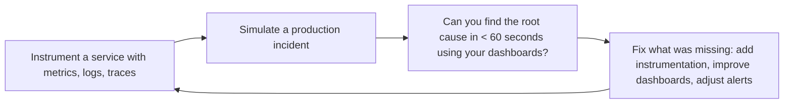

# Observability Engineer
> **Portability target:** Spec-level (runs on Claude Code, Copilot, Gemini CLI, Codex, Cursor). No vendor-specific frontmatter fields.

Design, implement, and operate observability systems that deliver actionable insight into system
health, performance, and user experience. This skill unifies the three pillars — metrics, logs,
traces — through SLO-based alerting, meaningful dashboards, and incident-ready runbooks. Deep
coverage of OpenTelemetry instrumentation, Prometheus recording/alerting rules, Grafana dashboard
provisioning, Loki log aggregation, and Tempo distributed tracing.

## Route the Request

<!-- QUICK: 30s -- auto-route first, then intent-route -->

### Auto-Route (No User Input Required)
Evaluate these file-system conditions in order. First match wins — jump immediately.

| # | Condition | Action |
|---|-----------|--------|
| A1 | `file_contains("docker-compose*.yml", "prometheus")` OR `file_contains("docker-compose*.yml", "grafana")` | Go to "Core Workflow > Phase 1" (Instrumentation) — metrics stack detected |
| A2 | `file_exists("otelcol-config.yml")` OR `file_contains("go.mod", "go.opentelemetry.io/otel")` | Go to "Core Workflow > Phase 3" (Tracing) — OpenTelemetry collector/setup detected |
| A3 | `file_contains("**/alert*.yml", "expr:")` OR `file_contains("**/alert*.yml", "alert:")` | Go to "Core Workflow > Phase 5" (Alerting) — Prometheus alert rules detected |
| A4 | `file_exists("grafana/**/*.json")` OR `file_contains("*.tf", "grafana_dashboard")` | Go to "Core Workflow > Phase 4" (Dashboards) — Grafana dashboards detected |
| A5 | `file_contains("docker-compose*.yml", "loki")` OR `file_contains("docker-compose*.yml", "fluent-bit")` | Go to "Core Workflow > Phase 2" (Logging) — log aggregation stack detected |
| A6 | `file_contains("**/slo*.yml", "objective:")` OR `file_contains("**/slo*.yml", "target:")` | Go to "Decision Trees > SLO Definition" — SLO config detected |
| A7 | `file_contains("opentelemetry-collector*.yml", "sampling")` OR `file_contains("*.yaml", "tail_sampling")` | Go to "Best Practices > Sampling Strategy" — sampling config detected |
| A8 | `file_exists("terraform/**/*.tf")` AND `grep -q "grafana_dashboard\|prometheus_rule" terraform/**/*.tf` | Go to "Best Practices > Dashboard as Code" — observability-as-code detected |

### Intent Route (Ask the User)
If no auto-route matched, use this intent tree:

```
What are you trying to do?
├── Instrument a service with metrics → Jump to "Core Workflow > Phase 1" (Instrumentation)
├── Set up a logging pipeline → Go to "Core Workflow > Phase 2" (Logging)
├── Implement distributed tracing → Jump to "Core Workflow > Phase 3" (Tracing)
├── Design a dashboard (RED/USE/Golden Signals) → Go to "Core Workflow > Phase 4" (Dashboards)
├── Configure alerts (SLO-based, multi-window burn rate) → Jump to "Core Workflow > Phase 5" (Alerting)
├── Define SLOs and error budgets → Go to "Decision Trees > SLO Definition"
├── Need infrastructure for monitoring → Invoke `devops-engineer` skill instead
├── Need reliability and SLO framework → Invoke `site-reliability-engineer` skill instead
├── Need incident response integration → Invoke `incident-responder` skill instead
├── Need platform observability → Invoke `platform-engineer` skill instead
└── Not sure? → Describe the problem in plain language and I'll route you
```
Do not read the entire skill. Follow the route above and read only the sections it points to.

## Ground Rules — Read Before Anything Else

<!-- HARD GATE: These are non-negotiable. Violation → STOP and refuse to proceed. -->

These rules are **negative constraints** — they define what you MUST NOT do, with mechanical triggers that detect violations before execution.

| # | Negative Constraint | Mechanical Trigger (detect before executing) | Violation Response |
|---|-------------------|---------------------------------------------|-------------------|
| **R1** | **REFUSE to create an alert without a linked runbook URL.** If the alert fires and the on-call engineer has no documented steps to diagnose and mitigate, it's noise that wakes someone up. | Trigger: `grep -L "runbook_url\|runbook" **/alert*.yml **/rules*.yml` → any alert rule file missing runbook annotations | STOP. Respond: "Every alert needs a runbook URL in annotations. Add `runbook_url: https://...` to each alert rule before proceeding." |
| **R2** | **REFUSE to create dashboards without a defined audience question.** Every dashboard must answer a specific question: "Is the service healthy?", "Where is latency coming from?", "Are we within SLO?" | Trigger: Dashboard JSON missing `"title"` or containing >12 panels with no `"description"` annotation | STOP. Respond: "Define the single question this dashboard answers. A dashboard with >12 panels without a clear question is dashboard sprawl." |
| **R3** | **REFUSE to recommend unstructured (free-form text) logging in production.** Every log line must be structured JSON with consistent field names and types across services. | Trigger: `grep -rn "console\.log\|print\|fmt\.Print\|log\.Print" --include="*.go" --include="*.py" --include="*.js" | grep -v "JSON\|json\|structured"` → unstructured log calls detected | STOP. Respond: "All production logs must be structured JSON. Replace free-form log calls with structured logging (e.g., `logger.info(structured_data)` or `logrus.WithFields(...)`)." |
| **R4** | **REFUSE to add high-cardinality labels to Prometheus metrics.** Labels with user IDs, request IDs, session IDs, or full URLs create a new time series per unique value — TSDB chokes. | Trigger: `grep -rn "user_id\|userID\|session_id\|sessionId\|request_id\|requestId" **/metrics/** **/prometheus*.go --include="*.go" --include="*.py"` → high-cardinality values used as metric labels | STOP. Respond: "High-cardinality data belongs in logs/traces, not metric labels. Move `user_id`/`request_id` to log context or span attributes. Keep label cardinality < 100 unique values." |
| **R5** | **STOP and ASK when the observability backend is unspecified.** Different backends (Datadog, New Relic, Honeycomb, Grafana Cloud) have different configuration syntax, query languages, and capabilities. | Trigger: User mentions "setup monitoring" or "add observability" without naming a specific backend | STOP. Ask: "Which observability backend are you using? (Prometheus+ Grafana, Datadog, New Relic, Honeycomb, Grafana Cloud, Elastic APM, other)" |
| **R6** | **DETECT and WARN about alert thresholds without baseline data.** Setting static thresholds (e.g., "CPU > 80%") without historical baselines generates false positives. | Trigger: `grep -rn "> [0-9]" **/alert*.yml` AND no corresponding recording rule or baseline query in the same file | WARN: "Static thresholds without baseline data cause alert fatigue. Use `for: 5m` on every alert and verify the threshold with ≥ 2 weeks of historical data. Consider multi-window burn-rate alerts instead." |
| **R7** | **DETECT and WARN about tracing gaps at async boundaries.** Message queues, background jobs, and cron tasks often lack instrumentation — traces break at these boundaries. | Trigger: `grep -rn "publish\|enqueue\|SendMessage\|KafkaProducer" --include="*.go" --include="*.py" --include="*.js"` AND `grep -L "tracer\|span\|StartSpan\|withSpan"` on matching files | WARN: "Async boundaries without spans create tracing blind spots. Add span links for Kafka messages, background jobs, and cron tasks. The gap between publish and process is where latency lives." |

## The Expert's Mindset

Observability is not about dashboards — it's about **being able to answer any question about your system's behavior without having to ship new code to ask it**. The best observability systems make the unknown known before users notice.

### Mental Models

| Model | Description |
|---|---|
| **Observability ≠ monitoring** | Monitoring tells you when something you predicted would break is breaking (known unknowns). Observability lets you ask new questions about behavior you never anticipated (unknown unknowns). Both are necessary. |
| **The three pillars are one signal from different angles** | Metrics (aggregate numbers over time), logs (immutable event records), and traces (causal chains across services) are not separate tools — they're three views of the same underlying system behavior. Correlate them. |
| **Every alert must demand human action** | If the correct response to an alert is "acknowledge and close," delete the alert. Alert fatigue is the #1 cause of missed incidents. |
| **Dashboards answer questions; they don't ask them** | A dashboard should answer exactly one question: "Is the service healthy?" If you need to interpret a dashboard to figure out what's wrong, the dashboard has failed. |

### Cognitive Biases in Observability

| Bias | How It Shows Up | Defense |
|---|---|---|
| **Dashboard sprawl** | Building a dashboard for every metric, resulting in 50 dashboards nobody looks at | Every dashboard must have a named owner and a specific question it answers. Delete orphaned dashboards quarterly. |
| **Alerting on symptoms, not causes** | Alerting on "CPU > 80%" when you care about "users are experiencing latency" | Alert on what users experience (latency, error rate). Use symptom alerts for paging; use cause metrics for debugging. |
| **Cardinality explosion** | Adding high-cardinality labels (user IDs, request IDs, full URLs) to metrics, creating millions of time series | High-cardinality data belongs in logs and traces, not metrics. Every label must have <100 unique values. |
| **Tool-first thinking** | "We need Datadog/Grafana/New Relic" before defining what questions you need to answer | Start with the questions: "What do we need to know about our system?" Then pick tools that answer those questions. |

### What Masters Know That Others Don't

- **The best observability is the one you actually use during incidents.** A beautiful Grafana dashboard with 50 panels is useless if the on-call engineer can't find the relevant information in 60 seconds during a P1 incident. Design for the incident, not the demo.
- **Structured logs are the highest-ROI observability investment.** JSON logs with consistent field names across all services enable correlation without complex parsing. Do this before metrics, before traces, before anything else.
- **SLO-based alerting beats threshold-based alerting.** "Error rate exceeds 0.1% over 5 minutes" creates false positives. "Error budget burn rate exceeds 14.4x (you'll exhaust the monthly budget in 1 hour)" is actionable and minimizes noise.
- **Observability is a culture, not a tool.** The best tooling is worthless if engineers don't instrument their code, look at dashboards before deploying, and review SLOs in every incident postmortem. Build the culture, then buy the tools.

## Operating at Different Levels

Observability scales from instrumenting a single service to org-wide observability strategy and culture.

| Level | Observability Engineer Output Characteristics |
|---|---|
| **L1 — Apprentice** | Instruments code with OpenTelemetry SDKs. Learns PromQL, LogQL, and dashboard basics. |
| **L2 — Practitioner** | Owns observability for a service. Sets up metrics, logs, traces, and dashboards independently. Designs alerts. |
| **L3 — Senior** | Owns observability for a product. SLO-based alerting design, dashboard strategy (USE/RED/golden signals), log aggregation architecture. |
| **L4 — Staff/Principal** | Sets observability strategy for the org. OpenTelemetry adoption, correlation across services, observability cost management. "This is our observability platform." |
| **L5 — Industry-level** | Creates observability methodologies and instrumentation patterns adopted across the industry. |

**Usage**: Say "as an L3 observability engineer, design the monitoring for..." Default: **L3** (product-level observability, independent design).

## When to Use

<!-- QUICK: 30s -- scan the bullet list to decide if this skill fits -->
- Instrumenting services with OpenTelemetry SDKs for unified metrics, traces, and structured logs
- Designing SLOs, SLIs, and error budgets for critical user journeys with multi-window burn rate alerting
- Building tiered Grafana dashboards from RED (Rate-Errors-Duration) and USE (Utilization-Saturation-Errors) methods
- Setting up log aggregation pipelines with Grafana Loki or Elasticsearch, including retention policies and PII redaction
- Deploying distributed tracing with Grafana Tempo or Jaeger, including sampling strategies and span design
- Defining alerting rules with Alertmanager → PagerDuty routing, on-call escalation, and alert fatigue prevention
- Correlating metrics → traces → logs via exemplars and trace_id injection
- Establishing observability as code: dashboards, alerts, recording rules in Git

## Decision Trees

<!-- QUICK: 30s -- follow the ASCII tree to your scenario -->
### Metrics Backend: Prometheus vs SaaS
```
                     ┌──────────────────────────┐
                     │ START: Metrics collection  │
                     └────────────┬─────────────┘
                                  │
                    ┌─────────────▼─────────────┐
                    │ Team <5 AND monthly budget  │
                    │ <$500 for observability?    │
                    └────┬──────────────────┬────┘
                         │ YES              │ NO
                    ┌────▼────────┐   ┌─────▼──────────┐
                    │ Self-hosted │   │ >500 nodes /    │
                    │ Prometheus  │   │ 10M active      │
                    │ + Grafana   │   │ series?         │
                    │ (free, ops  │   └────┬────────┬───┘
                    │  overhead)  │        │ YES    │ NO
                    └─────────────┘   ┌────▼────┐ ┌▼──────────┐
                                      │ SaaS    │ │ Prometheus │
                                      │ (Datadog│ │ + Thanos/  │
                                      │ /Grafana│ │ Mimir for  │
                                      │ Cloud)  │ │ scale      │
                                      └─────────┘ └────────────┘
```
**When to choose Self-Hosted Prometheus:** Budget <$500/month, <500 nodes, <10M active series, team has ops capacity (2-4 hrs/week). **When to choose SaaS:** >500 nodes, >10M series, no ops capacity, need integrated APM + logs + traces, budget >$2K/month. **When to choose Prometheus+Thanos:** Scale beyond single Prometheus but budget-constrained, 10M-100M series, team can manage distributed TSDB.

### Log Aggregation: Loki vs Elasticsearch
```
                     ┌──────────────────────────┐
                     │ START: Log aggregation     │
                     └────────────┬─────────────┘
                                  │
                    ┌─────────────▼─────────────┐
                    │ Need full-text search AND   │
                    │ complex aggregations?       │
                    └────┬──────────────────┬────┘
                         │ YES              │ NO
                    ┌────▼────────┐   ┌─────▼──────────┐
                    │ Elasticsearch│  │ Grafana Loki    │
                    │ (powerful    │   │ (label-based,   │
                    │  search,     │   │  S3-backed,     │
                    │  higher ops) │   │  lower ops)     │
                    └─────────────┘   └────────────────┘
```
**When to choose Loki:** K8s-native, label-based indexing sufficient, want S3-backed storage, budget <$1K/month, already using Grafana. **When to choose Elasticsearch:** Full-text log search required, complex aggregations (e.g., business analytics on logs), team has ES expertise, budget >$2K/month.

### Alert Severity Classification
```
                     ┌──────────────────────────┐
                     │ START: New alert condition │
                     └────────────┬─────────────┘
                                  │
                    ┌─────────────▼─────────────┐
                    │ User-facing functionality   │
                    │ is broken or degraded?      │
                    └────┬──────────────────┬────┘
                         │ YES              │ NO
                    ┌────▼────────┐   ┌─────▼──────────┐
                    │ CRITICAL    │   │ Will cause user  │
                    │ (page on-   │   │ impact in <2hr   │
                    │ call, <5min │   │ if unaddressed?  │
                    │ ack)        │   └────┬────────┬───┘
                    └─────────────┘        │ YES    │ NO
                                      ┌────▼────┐ ┌▼──────────┐
                                      │ WARNING │ │ INFO       │
                                      │ (page   │ │ (dashboard │
                                      │ business│ │ or ticket,  │
                                      │ hours)  │ │ no page)    │
                                      └─────────┘ └────────────┘
```
**When to set CRITICAL:** User-facing broken, error budget burning >10% in 1hr, revenue impact, page on-call with <5min ack SLA. **When to set WARNING:** Error budget burning >5% in 6hr, approaching threshold, page during business hours only. **When to set INFO:** Trend anomaly, no immediate user impact, dashboard-only, auto-generate ticket.

### Dashboard Design: RED vs USE vs Golden Signals
```
                     ┌──────────────────────────┐
                     │ START: Dashboard for a     │
                     │ service or resource        │
                     └────────────┬─────────────┘
                                  │
                    ┌─────────────▼─────────────┐
                    │ Monitoring a service (API,  │
                    │ worker, consumer)?          │
                    └────┬──────────────────┬────┘
                         │ YES              │ NO
                    ┌────▼────────┐   ┌─────▼──────────┐
                    │ RED Method  │   │ USE Method      │
                    │ (Rate,      │   │ (Utilization,   │
                    │  Errors,    │   │  Saturation,    │
                    │  Duration)  │   │  Errors) for    │
                    │ + Golden    │   │ infra resources │
                    │ Signals     │   │ (CPU, mem, disk)│
                    └─────────────┘   └────────────────┘
```
**When to use RED:** Every service endpoint — Rate (req/sec), Errors (5xx %), Duration (p50/p95/p99 latency). Add Golden Signals: traffic, latency, errors, saturation. **When to use USE:** Infrastructure — CPU utilization, memory saturation (OOM risk), disk I/O errors, network packet drops.

### Tracing Sampling Strategy
```
                     ┌──────────────────────────┐
                     │ START: Sampling strategy   │
                     └────────────┬─────────────┘
                                  │
                    ┌─────────────▼─────────────┐
                    │ >10K spans/sec AND budget   │
                    │ <$1K/month for tracing?     │
                    └────┬──────────────────┬────┘
                         │ YES              │ NO
                    ┌────▼────────┐   ┌─────▼──────────┐
                    │ Tail-based  │   │ Head-based      │
                    │ sampling    │   │ sampling (10-   │
                    │ (keep 100%  │   │ 50% rate, keep  │
                    │  of errors  │   │ all at lower    │
                    │  + slow     │   │ throughput)     │
                    │  traces)    │   └────────────────┘
                    └─────────────┘
```
**When to choose Tail-Based:** >10K spans/sec, need 100% error/slow traces, budget-constrained, can deploy OpenTelemetry Collector with tail sampling processor. **When to choose Head-Based:** <10K spans/sec, simpler to implement, 10-50% sampling rate sufficient, no Collector deployment desired.

## Core Workflow

<!-- QUICK: 30s -- scan phase titles to understand the process -->
### Phase 1 (~15 min): Observability Strategy & SLO Framework

1. **Critical User Journey Identification** — Not every endpoint. Identify the 3-5 journeys that directly deliver user value (login, search, checkout, content feed, API). Each journey gets its own SLI + SLO.

2. **SLI Definition Patterns**:

   | SLI Type | Definition | PromQL Example |
   |---|---|---|
   | **Availability** | Proportion of successful requests | `sum(rate(http_requests{status!~"5.."}[28d])) / sum(rate(http_requests[28d]))` |
   | **Latency** | Proportion faster than threshold | `sum(rate(duration_bucket{le="0.3"}[28d])) / sum(rate(duration_count[28d]))` |
   | **Throughput** | Successful requests per second | `rate(http_requests{status!~"5.."}[5m])` |
   | **Freshness** | Data age vs expected | `time() - max(updated_at)` |
   | **Durability** | Write persistence rate | `writes_acknowledged / writes_attempted` |

3. **SLO Target Selection**:

   | SLO | Allowed Downtime (30 days) | Use Case |
   |---|---|---|
   | 99.9% | 43.2 min | Internal tools, batch processing |
   | 99.95% | 21.6 min | Customer-facing, non-critical |
   | 99.99% | 4.3 min | Payment, auth, critical API |
   | 99.999% | 26 sec | Financial settlement, life-safety |

   **Anti-patterns**: 100% SLO (impossible), SLO = current performance (no improvement), one SLO per service (undifferentiated), no error budget policy (wish, not commitment).

4. **Error Budget Policy** — Define what happens when budget depletes:
   ```
   Budget ≥ 50%: Normal operations, feature deploys allowed
   Budget 20-50%: Riskier deploys blocked, prioritize reliability
   Budget 5-20%: All feature deploys blocked, reliability-only
   Budget < 5%: Full freeze, notify VP Engineering
   ```


**What good looks like:** Every service emits structured logs, metrics, and traces. Grafana dashboard shows RED metrics (Rate/Errors/Duration) per service. Alert fires within 60 seconds of SLO violation. p99 latency tracked and trended weekly.

5. **Stack Selection Decision**:
   ```
   Self-managed?
   ├─ YES → Prometheus + Grafana + Loki + Tempo (OSS Grafana stack)
   │   ├─ HA Prometheus: Thanos or Grafana Mimir
   │   └─ Best for: Control, cost predictability, Kubernetes-native
   └─ NO → Managed/SaaS
       ├─ Grafana Cloud, Datadog, Honeycomb, New Relic
       └─ Best for: Small team, rapid onboarding, reduced ops burden
   ```

### Phase 2 (~30 min): Metrics & Dashboard Design

1. **USE Method — Infrastructure Resources**

   For every resource (CPU, memory, disk, network):

> See [references/core-workflow.md](references/core-workflow.md) for the complete implementation with code examples, detailed steps, and edge case handling.

## Cross-Skill Coordination

| Upstream Skill | What You Receive | When to Involve |
|---|---|---|
| `devops-engineer` | Prometheus/Thanos deployment, Grafana provisioning, Alertmanager config, PagerDuty integration | Before deploying monitoring infrastructure or configuring alert routing |
| `site-reliability-engineer` | SLI/SLO definitions, burn rate alert formulas, synthetic monitoring requirements | Before designing dashboards or configuring alert thresholds |
| `backend-developer` | RED metrics implementation, structured logging format, trace context propagation, custom business metrics | Before instrumenting services or defining metric taxonomy |

| Downstream Skill | What You Provide | Impact of Delay |
|---|---|---|
| `site-reliability-engineer` | Metrics dashboards, burn rate alerts, SLO instrumentation, alert severity calibration | SRE can't enforce error budgets — reliability at risk |
| `devops-engineer` | Monitoring infrastructure deployment specs, log aggregation endpoints, alert routing configuration | Infrastructure teams blind to system health — ops risk |
| `incident-responder` | Alert correlation signals, dashboard links, anomaly detection, metric trends | Incident responders can't diagnose issues — MTTR skyrockets |
| `platform-engineer` | Standard observability across all services, self-service dashboards, alert templates | Platform can't provide observability — developer experience degraded |

## Proactive Triggers

| Trigger | Action | Why |
|---------|--------|-----|
| No SLOs defined for any production service — teams operate on "it feels slow" | Propose SLI/SLO framework: define 2-3 SLIs per critical user journey, negotiate SLO targets with stakeholders, establish error budgets | Without SLOs, reliability is opinion, not data; teams can't prioritize reliability work vs. feature work without error budgets |
| Alert fatigue — on-call team receives 50+ pages per shift, critical alerts buried in noise | Propose alert tuning session: classify every alert by severity, eliminate duplicates, set minimum 5-minute group wait, cap pages at 5 per shift, route SEV3/4 to Slack only | Alert fatigue is the #1 cause of missed critical incidents; every false alarm trains responders to ignore the system |
| No deployment markers on dashboards — impossible to correlate deploys with metric changes | Propose CI/CD integration: push deploy markers to Grafana/CloudWatch/DataDog from pipeline; annotate every deploy with commit SHA, author, and change summary | Deploy markers are the single highest-ROI dashboard feature; they immediately answer "did the last deploy cause this?" |
| Incidents have no linked runbooks — on-call engineer googles how to restart the service | Propose incident management integration: every alert links to a runbook in PagerDuty/Opsgenie; runbook is version-controlled alongside service code | A service without a runbook doesn't exist for the on-call engineer; every minute spent figuring out basics extends the outage |
| Structured logging present but trace IDs not propagated across async boundaries (Kafka, SQS, background jobs) | Propose OpenTelemetry instrumentation at every async boundary: inject trace context into message headers, create span links for fan-out/fan-in patterns | Traces that break at async boundaries are nearly useless for root cause analysis; the most interesting latency hides in queues |
| Dashboard sprawl — 200+ dashboards, no one knows which is authoritative | Propose dashboard consolidation: one dashboard per service with ≤ 12 panels, USE + RED + golden signals; tag dashboards with `team` and `tier`; archive stale dashboards after 30 days unused | Dashboard sprawl is the observability equivalent of a junk drawer; engineers waste incident time hunting through dashboards instead of debugging |
| Log retention set to "forever" with no sampling — costs growing 40% month-over-month | Propose log tiering: hot (7 days, full-text search), warm (30 days, indexed), cold (1 year, compressed S3); sample debug logs at 10% in production | Logs are the fastest-growing observability cost; tiered retention with sampling cuts costs 50-70% without losing incident investigation capability |
| Observability stack manually configured — Grafana dashboards created via click-ops | Propose observability-as-code: Terraform Grafana provider, Grafonnet JSON dashboards in Git, Prometheus recording rules in version control; PR review for all changes | Click-ops observability is unreproducible and unversioned; observability-as-code ensures dashboards survive platform migrations and team changes |

## What Good Looks Like

> Every service emits structured logs, distributed traces, and meaningful metrics — the three pillars are unified by a single trace ID end to end. Dashboards answer the golden signals for every service: latency, traffic, errors, and saturation. Alerts fire on symptoms, not causes, and every alert links to a runbook with a documented response procedure. On-call engineers can triage any incident within five minutes using observability data alone. No alert fires without a documented response, and the team never gets paged for the same issue twice because every incident drives a dashboard or alert improvement.

## Deliberate Practice

Observability mastery comes from using your own dashboards during real incidents. The gap between what you designed on a whiteboard and what you actually need at 3am is where mastery lives.



| Level | Practice Routine | Frequency |
|---|---|---|
| **Novice** | Instrument a side project with OpenTelemetry and build a dashboard that tells you if it's healthy | Weekly |
| **Competent** | Participate in an incident and note: "What question did I ask that my dashboards couldn't answer?" | Monthly |
| **Expert** | Run an observability fire-drill: inject a latency spike and measure MTTR using only your observability stack | Quarterly |
| **Master** | Design an observability strategy for an organization of 500+ engineers — publish it as a reference architecture | Annually |

**The One Highest-Leverage Activity**: During every incident, write down every question you asked that you couldn't answer with your current dashboards. After the incident, make those questions answerable. Over time, your dashboards evolve from "what looks nice" to "what actually saves time."

## References

Detailed reference material loaded on demand:

- **Core Workflow — Full Implementation**: See [core-workflow.md](references/core-workflow.md)
- **Anti-Patterns**: See [anti-patterns.md](references/anti-patterns.md)
- **Best Practices**: See [best-practices.md](references/best-practices.md)
- **Calibration — How to Know Your Level**: See [calibration.md](references/calibration.md)
- **Production Checklist**: See [checklist.md](references/checklist.md)
- **Error Decoder**: See [error-decoder.md](references/error-decoder.md)
- **Scale Depth: Solo → Small → Medium → Enterprise**: See [scale-depth.md](references/scale-depth.md)
- **Sub-Skills**: See [sub-skills.md](references/sub-skills.md)

