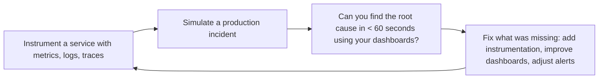

# Observability Engineer

> **Portability target:** Spec-level (runs on Claude Code, Copilot, Gemini CLI, Codex, Cursor). No vendor-specific frontmatter fields.

Design, implement, and operate observability systems that deliver actionable insight into system
health, performance, and user experience. This skill unifies the three pillars — metrics, logs,
traces — through SLO-based alerting, meaningful dashboards, and incident-ready runbooks. Deep
coverage of OpenTelemetry instrumentation, Prometheus recording/alerting rules, Grafana dashboard
provisioning, Loki log aggregation, and Tempo distributed tracing.

## Route the Request
<!-- QUICK: 30s -- auto-route first, then intent-route -->

### Auto-Route (No User Input Required)
Evaluate these file-system conditions in order. First match wins — jump immediately.

| # | Condition | Action |
|---|-----------|--------|
| A1 | `file_contains("docker-compose*.yml", "prometheus")` OR `file_contains("docker-compose*.yml", "grafana")` | Go to "Core Workflow > Phase 1" (Instrumentation) — metrics stack detected |
| A2 | `file_exists("otelcol-config.yml")` OR `file_contains("go.mod", "go.opentelemetry.io/otel")` | Go to "Core Workflow > Phase 3" (Tracing) — OpenTelemetry collector/setup detected |
| A3 | `file_contains("**/alert*.yml", "expr:")` OR `file_contains("**/alert*.yml", "alert:")` | Go to "Core Workflow > Phase 5" (Alerting) — Prometheus alert rules detected |
| A4 | `file_exists("grafana/**/*.json")` OR `file_contains("*.tf", "grafana_dashboard")` | Go to "Core Workflow > Phase 4" (Dashboards) — Grafana dashboards detected |
| A5 | `file_contains("docker-compose*.yml", "loki")` OR `file_contains("docker-compose*.yml", "fluent-bit")` | Go to "Core Workflow > Phase 2" (Logging) — log aggregation stack detected |
| A6 | `file_contains("**/slo*.yml", "objective:")` OR `file_contains("**/slo*.yml", "target:")` | Go to "Decision Trees > SLO Definition" — SLO config detected |
| A7 | `file_contains("opentelemetry-collector*.yml", "sampling")` OR `file_contains("*.yaml", "tail_sampling")` | Go to "Best Practices > Sampling Strategy" — sampling config detected |
| A8 | `file_exists("terraform/**/*.tf")` AND `grep -q "grafana_dashboard\|prometheus_rule" terraform/**/*.tf` | Go to "Best Practices > Dashboard as Code" — observability-as-code detected |

### Intent Route (Ask the User)
If no auto-route matched, use this intent tree:

```
What are you trying to do?
├── Instrument a service with metrics → Jump to "Core Workflow > Phase 1" (Instrumentation)
├── Set up a logging pipeline → Go to "Core Workflow > Phase 2" (Logging)
├── Implement distributed tracing → Jump to "Core Workflow > Phase 3" (Tracing)
├── Design a dashboard (RED/USE/Golden Signals) → Go to "Core Workflow > Phase 4" (Dashboards)
├── Configure alerts (SLO-based, multi-window burn rate) → Jump to "Core Workflow > Phase 5" (Alerting)
├── Define SLOs and error budgets → Go to "Decision Trees > SLO Definition"
├── Need infrastructure for monitoring → Invoke `devops-engineer` skill instead
├── Need reliability and SLO framework → Invoke `site-reliability-engineer` skill instead
├── Need incident response integration → Invoke `incident-responder` skill instead
├── Need platform observability → Invoke `platform-engineer` skill instead
└── Not sure? → Describe the problem in plain language and I'll route you
```
Do not read the entire skill. Follow the route above and read only the sections it points to.

## Ground Rules — Read Before Anything Else
<!-- HARD GATE: These are non-negotiable. Violation → STOP and refuse to proceed. -->

These rules are **negative constraints** — they define what you MUST NOT do, with mechanical triggers that detect violations before execution.

| # | Negative Constraint | Mechanical Trigger (detect before executing) | Violation Response |
|---|-------------------|---------------------------------------------|-------------------|
| **R1** | **REFUSE to create an alert without a linked runbook URL.** If the alert fires and the on-call engineer has no documented steps to diagnose and mitigate, it's noise that wakes someone up. | Trigger: `grep -L "runbook_url\|runbook" **/alert*.yml **/rules*.yml` → any alert rule file missing runbook annotations | STOP. Respond: "Every alert needs a runbook URL in annotations. Add `runbook_url: https://...` to each alert rule before proceeding." |
| **R2** | **REFUSE to create dashboards without a defined audience question.** Every dashboard must answer a specific question: "Is the service healthy?", "Where is latency coming from?", "Are we within SLO?" | Trigger: Dashboard JSON missing `"title"` or containing >12 panels with no `"description"` annotation | STOP. Respond: "Define the single question this dashboard answers. A dashboard with >12 panels without a clear question is dashboard sprawl." |
| **R3** | **REFUSE to recommend unstructured (free-form text) logging in production.** Every log line must be structured JSON with consistent field names and types across services. | Trigger: `grep -rn "console\.log\|print\|fmt\.Print\|log\.Print" --include="*.go" --include="*.py" --include="*.js" | grep -v "JSON\|json\|structured"` → unstructured log calls detected | STOP. Respond: "All production logs must be structured JSON. Replace free-form log calls with structured logging (e.g., `logger.info(structured_data)` or `logrus.WithFields(...)`)." |
| **R4** | **REFUSE to add high-cardinality labels to Prometheus metrics.** Labels with user IDs, request IDs, session IDs, or full URLs create a new time series per unique value — TSDB chokes. | Trigger: `grep -rn "user_id\|userID\|session_id\|sessionId\|request_id\|requestId" **/metrics/** **/prometheus*.go --include="*.go" --include="*.py"` → high-cardinality values used as metric labels | STOP. Respond: "High-cardinality data belongs in logs/traces, not metric labels. Move `user_id`/`request_id` to log context or span attributes. Keep label cardinality < 100 unique values." |
| **R5** | **STOP and ASK when the observability backend is unspecified.** Different backends (Datadog, New Relic, Honeycomb, Grafana Cloud) have different configuration syntax, query languages, and capabilities. | Trigger: User mentions "setup monitoring" or "add observability" without naming a specific backend | STOP. Ask: "Which observability backend are you using? (Prometheus+ Grafana, Datadog, New Relic, Honeycomb, Grafana Cloud, Elastic APM, other)" |
| **R6** | **DETECT and WARN about alert thresholds without baseline data.** Setting static thresholds (e.g., "CPU > 80%") without historical baselines generates false positives. | Trigger: `grep -rn "> [0-9]" **/alert*.yml` AND no corresponding recording rule or baseline query in the same file | WARN: "Static thresholds without baseline data cause alert fatigue. Use `for: 5m` on every alert and verify the threshold with ≥ 2 weeks of historical data. Consider multi-window burn-rate alerts instead." |
| **R7** | **DETECT and WARN about tracing gaps at async boundaries.** Message queues, background jobs, and cron tasks often lack instrumentation — traces break at these boundaries. | Trigger: `grep -rn "publish\|enqueue\|SendMessage\|KafkaProducer" --include="*.go" --include="*.py" --include="*.js"` AND `grep -L "tracer\|span\|StartSpan\|withSpan"` on matching files | WARN: "Async boundaries without spans create tracing blind spots. Add span links for Kafka messages, background jobs, and cron tasks. The gap between publish and process is where latency lives." |

## The Expert's Mindset

Observability is not about dashboards — it's about **being able to answer any question about your system's behavior without having to ship new code to ask it**. The best observability systems make the unknown known before users notice.

### Mental Models

| Model | Description |
|---|---|
| **Observability ≠ monitoring** | Monitoring tells you when something you predicted would break is breaking (known unknowns). Observability lets you ask new questions about behavior you never anticipated (unknown unknowns). Both are necessary. |
| **The three pillars are one signal from different angles** | Metrics (aggregate numbers over time), logs (immutable event records), and traces (causal chains across services) are not separate tools — they're three views of the same underlying system behavior. Correlate them. |
| **Every alert must demand human action** | If the correct response to an alert is "acknowledge and close," delete the alert. Alert fatigue is the #1 cause of missed incidents. |
| **Dashboards answer questions; they don't ask them** | A dashboard should answer exactly one question: "Is the service healthy?" If you need to interpret a dashboard to figure out what's wrong, the dashboard has failed. |

### Cognitive Biases in Observability

| Bias | How It Shows Up | Defense |
|---|---|---|
| **Dashboard sprawl** | Building a dashboard for every metric, resulting in 50 dashboards nobody looks at | Every dashboard must have a named owner and a specific question it answers. Delete orphaned dashboards quarterly. |
| **Alerting on symptoms, not causes** | Alerting on "CPU > 80%" when you care about "users are experiencing latency" | Alert on what users experience (latency, error rate). Use symptom alerts for paging; use cause metrics for debugging. |
| **Cardinality explosion** | Adding high-cardinality labels (user IDs, request IDs, full URLs) to metrics, creating millions of time series | High-cardinality data belongs in logs and traces, not metrics. Every label must have <100 unique values. |
| **Tool-first thinking** | "We need Datadog/Grafana/New Relic" before defining what questions you need to answer | Start with the questions: "What do we need to know about our system?" Then pick tools that answer those questions. |

### What Masters Know That Others Don't

- **The best observability is the one you actually use during incidents.** A beautiful Grafana dashboard with 50 panels is useless if the on-call engineer can't find the relevant information in 60 seconds during a P1 incident. Design for the incident, not the demo.
- **Structured logs are the highest-ROI observability investment.** JSON logs with consistent field names across all services enable correlation without complex parsing. Do this before metrics, before traces, before anything else.
- **SLO-based alerting beats threshold-based alerting.** "Error rate exceeds 0.1% over 5 minutes" creates false positives. "Error budget burn rate exceeds 14.4x (you'll exhaust the monthly budget in 1 hour)" is actionable and minimizes noise.
- **Observability is a culture, not a tool.** The best tooling is worthless if engineers don't instrument their code, look at dashboards before deploying, and review SLOs in every incident postmortem. Build the culture, then buy the tools.

## Operating at Different Levels

Observability scales from instrumenting a single service to org-wide observability strategy and culture.

| Level | Observability Engineer Output Characteristics |
|---|---|
| **L1 — Apprentice** | Instruments code with OpenTelemetry SDKs. Learns PromQL, LogQL, and dashboard basics. |
| **L2 — Practitioner** | Owns observability for a service. Sets up metrics, logs, traces, and dashboards independently. Designs alerts. |
| **L3 — Senior** | Owns observability for a product. SLO-based alerting design, dashboard strategy (USE/RED/golden signals), log aggregation architecture. |
| **L4 — Staff/Principal** | Sets observability strategy for the org. OpenTelemetry adoption, correlation across services, observability cost management. "This is our observability platform." |
| **L5 — Industry-level** | Creates observability methodologies and instrumentation patterns adopted across the industry. |

**Usage**: Say "as an L3 observability engineer, design the monitoring for..." Default: **L3** (product-level observability, independent design).

## When to Use
<!-- QUICK: 30s -- scan the bullet list to decide if this skill fits -->
- Instrumenting services with OpenTelemetry SDKs for unified metrics, traces, and structured logs
- Designing SLOs, SLIs, and error budgets for critical user journeys with multi-window burn rate alerting
- Building tiered Grafana dashboards from RED (Rate-Errors-Duration) and USE (Utilization-Saturation-Errors) methods
- Setting up log aggregation pipelines with Grafana Loki or Elasticsearch, including retention policies and PII redaction
- Deploying distributed tracing with Grafana Tempo or Jaeger, including sampling strategies and span design
- Defining alerting rules with Alertmanager → PagerDuty routing, on-call escalation, and alert fatigue prevention
- Correlating metrics → traces → logs via exemplars and trace_id injection
- Establishing observability as code: dashboards, alerts, recording rules in Git

## Decision Trees
<!-- QUICK: 30s -- follow the ASCII tree to your scenario -->
### Metrics Backend: Prometheus vs SaaS
```
                     ┌──────────────────────────┐
                     │ START: Metrics collection  │
                     └────────────┬─────────────┘
                                  │
                    ┌─────────────▼─────────────┐
                    │ Team <5 AND monthly budget  │
                    │ <$500 for observability?    │
                    └────┬──────────────────┬────┘
                         │ YES              │ NO
                    ┌────▼────────┐   ┌─────▼──────────┐
                    │ Self-hosted │   │ >500 nodes /    │
                    │ Prometheus  │   │ 10M active      │
                    │ + Grafana   │   │ series?         │
                    │ (free, ops  │   └────┬────────┬───┘
                    │  overhead)  │        │ YES    │ NO
                    └─────────────┘   ┌────▼────┐ ┌▼──────────┐
                                      │ SaaS    │ │ Prometheus │
                                      │ (Datadog│ │ + Thanos/  │
                                      │ /Grafana│ │ Mimir for  │
                                      │ Cloud)  │ │ scale      │
                                      └─────────┘ └────────────┘
```
**When to choose Self-Hosted Prometheus:** Budget <$500/month, <500 nodes, <10M active series, team has ops capacity (2-4 hrs/week). **When to choose SaaS:** >500 nodes, >10M series, no ops capacity, need integrated APM + logs + traces, budget >$2K/month. **When to choose Prometheus+Thanos:** Scale beyond single Prometheus but budget-constrained, 10M-100M series, team can manage distributed TSDB.

### Log Aggregation: Loki vs Elasticsearch
```
                     ┌──────────────────────────┐
                     │ START: Log aggregation     │
                     └────────────┬─────────────┘
                                  │
                    ┌─────────────▼─────────────┐
                    │ Need full-text search AND   │
                    │ complex aggregations?       │
                    └────┬──────────────────┬────┘
                         │ YES              │ NO
                    ┌────▼────────┐   ┌─────▼──────────┐
                    │ Elasticsearch│  │ Grafana Loki    │
                    │ (powerful    │   │ (label-based,   │
                    │  search,     │   │  S3-backed,     │
                    │  higher ops) │   │  lower ops)     │
                    └─────────────┘   └────────────────┘
```
**When to choose Loki:** K8s-native, label-based indexing sufficient, want S3-backed storage, budget <$1K/month, already using Grafana. **When to choose Elasticsearch:** Full-text log search required, complex aggregations (e.g., business analytics on logs), team has ES expertise, budget >$2K/month.

### Alert Severity Classification
```
                     ┌──────────────────────────┐
                     │ START: New alert condition │
                     └────────────┬─────────────┘
                                  │
                    ┌─────────────▼─────────────┐
                    │ User-facing functionality   │
                    │ is broken or degraded?      │
                    └────┬──────────────────┬────┘
                         │ YES              │ NO
                    ┌────▼────────┐   ┌─────▼──────────┐
                    │ CRITICAL    │   │ Will cause user  │
                    │ (page on-   │   │ impact in <2hr   │
                    │ call, <5min │   │ if unaddressed?  │
                    │ ack)        │   └────┬────────┬───┘
                    └─────────────┘        │ YES    │ NO
                                      ┌────▼────┐ ┌▼──────────┐
                                      │ WARNING │ │ INFO       │
                                      │ (page   │ │ (dashboard │
                                      │ business│ │ or ticket,  │
                                      │ hours)  │ │ no page)    │
                                      └─────────┘ └────────────┘
```
**When to set CRITICAL:** User-facing broken, error budget burning >10% in 1hr, revenue impact, page on-call with <5min ack SLA. **When to set WARNING:** Error budget burning >5% in 6hr, approaching threshold, page during business hours only. **When to set INFO:** Trend anomaly, no immediate user impact, dashboard-only, auto-generate ticket.

### Dashboard Design: RED vs USE vs Golden Signals
```
                     ┌──────────────────────────┐
                     │ START: Dashboard for a     │
                     │ service or resource        │
                     └────────────┬─────────────┘
                                  │
                    ┌─────────────▼─────────────┐
                    │ Monitoring a service (API,  │
                    │ worker, consumer)?          │
                    └────┬──────────────────┬────┘
                         │ YES              │ NO
                    ┌────▼────────┐   ┌─────▼──────────┐
                    │ RED Method  │   │ USE Method      │
                    │ (Rate,      │   │ (Utilization,   │
                    │  Errors,    │   │  Saturation,    │
                    │  Duration)  │   │  Errors) for    │
                    │ + Golden    │   │ infra resources │
                    │ Signals     │   │ (CPU, mem, disk)│
                    └─────────────┘   └────────────────┘
```
**When to use RED:** Every service endpoint — Rate (req/sec), Errors (5xx %), Duration (p50/p95/p99 latency). Add Golden Signals: traffic, latency, errors, saturation. **When to use USE:** Infrastructure — CPU utilization, memory saturation (OOM risk), disk I/O errors, network packet drops.

### Tracing Sampling Strategy
```
                     ┌──────────────────────────┐
                     │ START: Sampling strategy   │
                     └────────────┬─────────────┘
                                  │
                    ┌─────────────▼─────────────┐
                    │ >10K spans/sec AND budget   │
                    │ <$1K/month for tracing?     │
                    └────┬──────────────────┬────┘
                         │ YES              │ NO
                    ┌────▼────────┐   ┌─────▼──────────┐
                    │ Tail-based  │   │ Head-based      │
                    │ sampling    │   │ sampling (10-   │
                    │ (keep 100%  │   │ 50% rate, keep  │
                    │  of errors  │   │ all at lower    │
                    │  + slow     │   │ throughput)     │
                    │  traces)    │   └────────────────┘
                    └─────────────┘
```
**When to choose Tail-Based:** >10K spans/sec, need 100% error/slow traces, budget-constrained, can deploy OpenTelemetry Collector with tail sampling processor. **When to choose Head-Based:** <10K spans/sec, simpler to implement, 10-50% sampling rate sufficient, no Collector deployment desired.

## Core Workflow
<!-- QUICK: 30s -- scan phase titles to understand the process -->
### Phase 1 (~15 min): Observability Strategy & SLO Framework

1. **Critical User Journey Identification** — Not every endpoint. Identify the 3-5 journeys that directly deliver user value (login, search, checkout, content feed, API). Each journey gets its own SLI + SLO.

2. **SLI Definition Patterns**:

   | SLI Type | Definition | PromQL Example |
   |---|---|---|
   | **Availability** | Proportion of successful requests | `sum(rate(http_requests{status!~"5.."}[28d])) / sum(rate(http_requests[28d]))` |
   | **Latency** | Proportion faster than threshold | `sum(rate(duration_bucket{le="0.3"}[28d])) / sum(rate(duration_count[28d]))` |
   | **Throughput** | Successful requests per second | `rate(http_requests{status!~"5.."}[5m])` |
   | **Freshness** | Data age vs expected | `time() - max(updated_at)` |
   | **Durability** | Write persistence rate | `writes_acknowledged / writes_attempted` |

3. **SLO Target Selection**:

   | SLO | Allowed Downtime (30 days) | Use Case |
   |---|---|---|
   | 99.9% | 43.2 min | Internal tools, batch processing |
   | 99.95% | 21.6 min | Customer-facing, non-critical |
   | 99.99% | 4.3 min | Payment, auth, critical API |
   | 99.999% | 26 sec | Financial settlement, life-safety |

   **Anti-patterns**: 100% SLO (impossible), SLO = current performance (no improvement), one SLO per service (undifferentiated), no error budget policy (wish, not commitment).

4. **Error Budget Policy** — Define what happens when budget depletes:
   ```
   Budget ≥ 50%: Normal operations, feature deploys allowed
   Budget 20-50%: Riskier deploys blocked, prioritize reliability
   Budget 5-20%: All feature deploys blocked, reliability-only
   Budget < 5%: Full freeze, notify VP Engineering
   ```


**What good looks like:** Every service emits structured logs, metrics, and traces. Grafana dashboard shows RED metrics (Rate/Errors/Duration) per service. Alert fires within 60 seconds of SLO violation. p99 latency tracked and trended weekly.

5. **Stack Selection Decision**:
   ```
   Self-managed?
   ├─ YES → Prometheus + Grafana + Loki + Tempo (OSS Grafana stack)
   │   ├─ HA Prometheus: Thanos or Grafana Mimir
   │   └─ Best for: Control, cost predictability, Kubernetes-native
   └─ NO → Managed/SaaS
       ├─ Grafana Cloud, Datadog, Honeycomb, New Relic
       └─ Best for: Small team, rapid onboarding, reduced ops burden
   ```

### Phase 2 (~30 min): Metrics & Dashboard Design

1. **USE Method — Infrastructure Resources**

   For every resource (CPU, memory, disk, network):

   | Resource | Utilization | Saturation | Errors |
   |---|---|---|---|
   | CPU | `100 - (avg(rate(cpu_idle[5m])) * 100)` | `node_load1 / count(cpu_cores)` at load > cores×2 | CPU throttling count > 0 |
   | Memory | `(1 - mem_available/mem_total) * 100` | Swap usage > 0 | OOM kills `increase(oom_kill[5m]) > 0` |
   | Disk | `(1 - disk_free/disk_total) * 100` | I/O wait > 30% | Read/write errors > 0 |
   | Network | `rate(bytes_transmitted[5m]) * 8 / link_speed` | Dropped packets > 0 | Interface errors > 0 |

2. **RED Method — Service Endpoints**

   For every service endpoint:

   ```promql
   # Rate — anomaly detection: request rate drops >50% from 1h ago
   rate(http_requests_total[5m]) / rate(http_requests_total[5m] offset 1h) < 0.5

   # Errors — error rate > 1% for 5 min
   sum(rate(http_requests{status=~"5.."}[5m])) / sum(rate(http_requests[5m])) > 0.01

   # Duration — P99 latency > 500ms for 5 min
   histogram_quantile(0.99, sum(rate(duration_bucket[5m])) by (le)) > 0.5
   ```

3. **Four Golden Signals** — Monitor at edge AND per service:
   - **Latency**: Time to service a request. Distinguish successful vs error latency.
   - **Traffic**: Demand on the system (requests/sec, concurrent sessions).
   - **Errors**: Failed requests — explicit (500), implicit (200 with wrong content), policy (over-quota).
   - **Saturation**: How "full" the service is. CPU, memory, I/O, queue depth, connection pool utilization.

4. **Tiered Dashboard Design**:
   ```
   Level 1: SLO Compliance Dashboard (executive) — Are we meeting commitments?
   Level 2: Service Dashboard (per-team) — RED metrics per endpoint, error budget burn-down
   Level 3: Infrastructure Dashboard (platform) — USE metrics per node/cluster
   Level 4: Drill-Down Dashboard (on-call) — Detailed request traces, log correlation
   ```

5. **Recording Rules** — Pre-compute expensive PromQL for dashboards:
   ```yaml
   groups:
     - name: service-recording-rules
       rules:
         - record: job:http_requests:rate5m
           expr: rate(http_requests_total[5m])
         - record: job:http_errors:rate5m
           expr: rate(http_requests_total{status=~"5.."}[5m])
         - record: job:http_error_rate:ratio5m
           expr: |
             sum(job:http_errors:rate5m) / sum(job:http_requests:rate5m)
         - record: job:http_latency:p99_5m
           expr: |
             histogram_quantile(0.99,
               sum(rate(http_request_duration_seconds_bucket[5m])) by (le, job))
   ```

6. **Dashboard as Code** — Grafana provisioning via Terraform or Grafonnet:
   ```hcl
   resource "grafana_dashboard" "service_overview" {
     config_json = jsonencode({
       title = "Service Overview — ${var.service_name}"
       panels = [ ... ]
     })
   }
   ```

### Phase 3 (~20 min): Log Aggregation & Analysis

1. **Structured Logging Standard** — Every log line MUST include:
   ```json
   {
     "timestamp": "2026-07-21T14:32:00.123Z",
     "level": "INFO",
     "service": "checkout-service",
     "trace_id": "0af7651916cd43dd8448eb211c80319c",
     "span_id": "b7ad6b7169203331",
     "message": "Order processed",
     "context": {
       "order_id": "ord_abc123",
       "amount": 99.99,
       "duration_ms": 245
     }
   }
   ```

2. **Log Agent Selection**:
   | Agent | Strengths | Best For |
   |---|---|---|
   | **Promtail** | Native Loki integration, Kubernetes discovery, pipeline stages | Loki deployments |
   | **Fluent Bit** | Lightweight (~450KB), high throughput, 30+ plugins | High-volume, resource-constrained |
   | **Vector** | Ultra-fast (Rust), unified logs+metrics, programmable transforms | Performance-critical, unified pipeline |

3. **Loki Architecture** — Index-free design: labels for metadata, log content is full-text searchable:
   ```
   Write path: Promtail → Distributor → Ingester → Object Storage (S3/GCS)
   Read path:  Querier ← Ingester + Object Storage → Grafana
   ```
   Key config: `chunk_block_size`, `chunk_target_size`, `max_chunk_age`, retention via `table_manager.retention_period`.

4. **Retention Tiers & Cost Control**:
   | Tier | Retention | Storage | Query Speed |
   |---|---|---|---|
   | Hot | 7 days | SSD/Provisioned IOPS | < 1 second |
   | Warm | 30-90 days | Object storage | < 5 seconds |
   | Cold/Archive | 1-7 years | Glacier/Archive tier | Minutes to hours |
   | Compliance | 7+ years | WORM (Write Once Read Many) | Hours |

5. **PII Redaction in Logs** — Process at collection time:
   ```yaml
   # Promtail pipeline stage — redact email patterns
   - stages:
       - replace:
           expression: '([a-zA-Z0-9._%+-]+@[a-zA-Z0-9.-]+\.[a-zA-Z]{2,})'
           replace: '[REDACTED_EMAIL]'
       - replace:
           expression: '(\b\d{4}[- ]?\d{4}[- ]?\d{4}[- ]?\d{4}\b)'
           replace: '[REDACTED_CC]'
   ```

6. **Log-Based Metrics** — Derive metrics from log streams:
   ```logql
   # Error rate by endpoint from logs
   sum by (endpoint) (rate({service="api"} | json | level = "ERROR" [5m]))

   # P95 response duration from access logs
   histogram_quantile(0.95,
     sum by (le) (rate({service="nginx"} | json | unwrap duration_ms [5m])))
   ```

### Phase 4 (~15 min): Distributed Tracing

1. **OpenTelemetry Architecture**:
   ```
   Application (OTel SDK) → OTLP → Collector Agent (DaemonSet) → Collector Gateway → Tempo
   ```

2. **Sampling Strategy** — The most critical tracing decision:
   | Strategy | When | Config |
   |---|---|---|
   | **Head, Probabilistic 10%** | Always enabled, SDK-level | `TraceIdRatioBased(0.1)` |
   | **Tail, 100% errors** | Gateway-level | `tail_sampling: status_code: [ERROR]` |
   | **Tail, latency > 500ms** | Gateway-level | `tail_sampling: latency: {threshold_ms: 500}` |
   | **Combined** | Production standard | Head 10% + Tail 100% errors/slow → ~12-15% capture |

3. **Span Design Principles**:
   - One span per logical operation (DB query, HTTP call, cache lookup)
   - Set `status` to ERROR on exceptions; record exception details
   - Use semantic conventions: `http.method`, `db.system`, `messaging.destination`
   - Custom attributes sparingly: domain-specific, no PII, no unbounded cardinality

4. **Trace-Log Correlation**:
   ```
   User: "Why did my order fail?"
   → Search logs for order_id → find trace_id → Tempo: full waterfall
   → Identify: CheckoutService → PaymentService timeout (3000ms exceeded)
   → Drill into PaymentService logs by trace_id → DB connection pool exhausted
   → <!-- DEEP: 10+min -->
Root cause: connection pool leak in PaymentService v2.3.0
   ```

5. **Baggage Propagation** — Pass business context across service boundaries:
   ```python
   from opentelemetry import baggage

   baggage.set_baggage("customer.id", "cust_789")
   baggage.set_baggage("experiment.variant", "treatment_b")
   # Available in every downstream span
   ```

### Phase 5 (~25 min): Alerting & Incident Response

1. **Alert Philosophy**:
   > Page on symptoms (user impact), not causes (infrastructure anomaly). Every page must require immediate human action.

2. **Multi-Window Burn Rate Alerting** — The standard for SLO-based alerting:

   | Burn Rate | Budget Exhausted In | Short Window | Long Window | Action |
   |---|---|---|---|---|
   | 5x | 6 days | 1h | 6h | Create ticket (P3) |
   | 10x | 3 days | 30m | 6h | Page on-call (P2) |
   | 14.4x | 2 days | 5m | 1h | Page on-call (P1) |
   | 36x | 20 hours | 5m | 30m | Emergency page (P0) |

   Short window detects fast burns; long window confirms sustained issue (filters blips). Both must fire.

3. **Prometheus Alerting Rule**:
   ```yaml
   - alert: SLOBurnRate14x
     expr: |
       (  # Short: 5m at 14.4x
         sum(rate(http_errors[5m])) / sum(rate(http_requests[5m])) > 0.00072 * 14.4
       )
       and
       (  # Long: 1h at 14.4x
         sum(rate(http_errors[1h])) / sum(rate(http_requests[1h])) > 0.00072 * 14.4 * (1/12)
       )
     for: 5m
     labels:
       severity: P1
     annotations:
       summary: "SLO burn rate 14.4x — error budget critical"
       runbook_url: "https://wiki/runbooks/slo-burn-14x"
   ```

4. **Alert Severity Levels**:

   | Level | Response Time | Notification | Example |
   |---|---|---|---|
   | **P0 — Emergency** | 5 min (24/7) | Phone call + PagerDuty | Prod down, security breach, data loss |
   | **P1 — Critical** | 15 min (24/7) | PagerDuty push | SLO burn rate 14.4x, major feature broken |
   | **P2 — High** | 30 min (24/7) | PagerDuty push | SLO burn rate 10x, performance degraded |
   | **P3 — Medium** | 1 hour (business) | Slack/email | Elevated errors, capacity warning |
   | **P4 — Low** | 4 hours (business) | Ticket | Disk > 70%, cert expiring in 14 days |

5. **Alertmanager Routing & Deduplication**:
   ```yaml
   route:
     group_by: ['alertname', 'severity', 'service']
     group_wait: 30s        # Collect alerts in group before sending
     group_interval: 5m     # Interval for follow-ups within same group
     repeat_interval: 4h    # Resend if still firing after 4h

     routes:
       - match: {severity: P0}
         receiver: pagerduty-critical
         group_wait: 10s
       - match: {severity: P1}
         receiver: pagerduty-high
       - match: {severity: P2}
         receiver: pagerduty-high

   inhibit_rules:
     - source_match: {severity: 'P0'}
       target_match: {severity: 'P1'}
       equal: ['service']  # P0 suppresses P1 for same service
   ```

6. **Alert Fatigue Prevention Checklist**:
   - [ ] Every alert has a documented runbook with specific, actionable steps
   - [ ] Alerts are symptoms, not causes (page on SLO burn, not high CPU)
   - [ ] False positive rate < 10% (validate with 30-day historical data)
   - [ ] Silenced during maintenance windows
   - [ ] Low-severity alerts inhibited when higher-severity fires for same service
   - [ ] Monthly fire-drill: inject synthetic failure, verify full notification chain
   - [ ] Alert count per on-call shift < 5 (if > 5, reduce sensitivity or fix root causes)

### Phase 6 (~25 min): Observability as Code

1. **Git-Based Observability** — All dashboards, alerts, recording rules in version control:
   ```
   observability/
   ├── dashboards/
   │   ├── service-overview.json
   │   └── slo-compliance.json
   ├── alerts/
   │   ├── slo-alerts.yaml
   │   └── service-alerts.yaml
   ├── rules/
   │   └── recording-rules.yaml
   └── terraform/
       ├── grafana.tf
       ├── prometheus.tf
       └── alertmanager.tf
   ```

2. **Change Review for Alerts** — Every alert change requires PR review. Changes include:
   - Threshold adjustments → review historical data to verify sensitivity
   - New alerts → confirm runbook exists before merge
   - Removed alerts → verify no gap in coverage

3. **Dashboard Review Process** — Quarterly: which dashboards have zero views in 90 days? Archive or consolidate. Which dashboards have high view counts but low utility? Redesign.


### Cross-skills Integration

| Step | Skill | What it produces |
|------|-------|------------------|
| **Before** | devops-engineer | Deployed infrastructure and services |
| **This** | observability-engineer | Instrumentation, dashboards, alerts, SLO definitions |
| **After** | site-reliability-engineer | Error budgets and reliability decisions based on observability data |

Common chains:
- **Chain**: devops-engineer → observability-engineer → site-reliability-engineer — Services are deployed and instrumented; SRE uses observability data for reliability management
- **Chain**: platform-engineer → observability-engineer → incident-responder — Platform provides standard instrumentation; incident response uses dashboards and alerts during outages

## Sub-Skills
<!-- QUICK: 30s -- table of deeper dives by topic -->
When this skill is invoked, the agent may need to drill into these specialized areas:

| Sub-Skill | When to Use |
|-----------|-------------|
| `slo-design` | Defining SLIs, SLO targets, error budgets, and burn-rate alerting for service reliability |
| `dashboard-design` | Building USE (infrastructure), RED (services), and golden-signal dashboards in Grafana |
| `alerting-strategy` | Designing alert philosophy, severity levels, fatigue prevention, and on-call routing |
| `distributed-tracing` | Instrumenting microservices with OpenTelemetry, span design, and sampling strategies |
| `logging-strategy` | Implementing structured logging with PII redaction, retention policies, and trace correlation |
| `metrics-collection` | Prometheus metrics design, cardinality management, recording rules, and long-term storage |

## Cross-Skill Coordination

| Upstream Skill | What You Receive | When to Involve |
|---|---|---|
| `devops-engineer` | Prometheus/Thanos deployment, Grafana provisioning, Alertmanager config, PagerDuty integration | Before deploying monitoring infrastructure or configuring alert routing |
| `site-reliability-engineer` | SLI/SLO definitions, burn rate alert formulas, synthetic monitoring requirements | Before designing dashboards or configuring alert thresholds |
| `backend-developer` | RED metrics implementation, structured logging format, trace context propagation, custom business metrics | Before instrumenting services or defining metric taxonomy |

| Downstream Skill | What You Provide | Impact of Delay |
|---|---|---|
| `site-reliability-engineer` | Metrics dashboards, burn rate alerts, SLO instrumentation, alert severity calibration | SRE can't enforce error budgets — reliability at risk |
| `devops-engineer` | Monitoring infrastructure deployment specs, log aggregation endpoints, alert routing configuration | Infrastructure teams blind to system health — ops risk |
| `incident-responder` | Alert correlation signals, dashboard links, anomaly detection, metric trends | Incident responders can't diagnose issues — MTTR skyrockets |
| `platform-engineer` | Standard observability across all services, self-service dashboards, alert templates | Platform can't provide observability — developer experience degraded |

## Proactive Triggers

| Trigger | Action | Why |
|---------|--------|-----|
| No SLOs defined for any production service — teams operate on "it feels slow" | Propose SLI/SLO framework: define 2-3 SLIs per critical user journey, negotiate SLO targets with stakeholders, establish error budgets | Without SLOs, reliability is opinion, not data; teams can't prioritize reliability work vs. feature work without error budgets |
| Alert fatigue — on-call team receives 50+ pages per shift, critical alerts buried in noise | Propose alert tuning session: classify every alert by severity, eliminate duplicates, set minimum 5-minute group wait, cap pages at 5 per shift, route SEV3/4 to Slack only | Alert fatigue is the #1 cause of missed critical incidents; every false alarm trains responders to ignore the system |
| No deployment markers on dashboards — impossible to correlate deploys with metric changes | Propose CI/CD integration: push deploy markers to Grafana/CloudWatch/DataDog from pipeline; annotate every deploy with commit SHA, author, and change summary | Deploy markers are the single highest-ROI dashboard feature; they immediately answer "did the last deploy cause this?" |
| Incidents have no linked runbooks — on-call engineer googles how to restart the service | Propose incident management integration: every alert links to a runbook in PagerDuty/Opsgenie; runbook is version-controlled alongside service code | A service without a runbook doesn't exist for the on-call engineer; every minute spent figuring out basics extends the outage |
| Structured logging present but trace IDs not propagated across async boundaries (Kafka, SQS, background jobs) | Propose OpenTelemetry instrumentation at every async boundary: inject trace context into message headers, create span links for fan-out/fan-in patterns | Traces that break at async boundaries are nearly useless for root cause analysis; the most interesting latency hides in queues |
| Dashboard sprawl — 200+ dashboards, no one knows which is authoritative | Propose dashboard consolidation: one dashboard per service with ≤ 12 panels, USE + RED + golden signals; tag dashboards with `team` and `tier`; archive stale dashboards after 30 days unused | Dashboard sprawl is the observability equivalent of a junk drawer; engineers waste incident time hunting through dashboards instead of debugging |
| Log retention set to "forever" with no sampling — costs growing 40% month-over-month | Propose log tiering: hot (7 days, full-text search), warm (30 days, indexed), cold (1 year, compressed S3); sample debug logs at 10% in production | Logs are the fastest-growing observability cost; tiered retention with sampling cuts costs 50-70% without losing incident investigation capability |
| Observability stack manually configured — Grafana dashboards created via click-ops | Propose observability-as-code: Terraform Grafana provider, Grafonnet JSON dashboards in Git, Prometheus recording rules in version control; PR review for all changes | Click-ops observability is unreproducible and unversioned; observability-as-code ensures dashboards survive platform migrations and team changes |

## Best Practices
<!-- STANDARD: 3min -- rules extracted from production experience -->
- **Tag everything**: `team`, `service`, `environment`, `region` on all metrics for consistent drill-down and cost attribution.
- **RED over USE for alerts** — User-facing symptoms (error rate, latency) trump infrastructure causes (high CPU, low disk).
- **One dashboard per service, ≤ 12 panels** — Focused, scannable. Use drill-down links for detail, not infinite scrolling.
- **Recording rules for expensive PromQL** — Pre-compute percentiles, aggregations, and joins. Reduce dashboard load time from 30s to < 1s.
- **Trace all async boundaries** — Span links for Kafka messages, background jobs, cron tasks. Without this, traces break at async boundaries.
- **Dashboard as code** — Terraform Grafana provider, Grafonnet, or JSON in Git. No click-ops dashboard creation.
- **Log with context, not just messages** — Every log line should enable <!-- DEEP: 10+min -->
debugging without additional queries. Include `trace_id`, `user_id` (hashed), `order_id`, `error.stack`.
- **Alert on burn rate, not SLO compliance** — SLO is a 28-day window; by the time it drops, budget is exhausted. Burn rate gives early warning.
- **Monthly fire-drills** — Test the full alerting chain: synthetic failure → Prometheus alert → Alertmanager → PagerDuty → on-call acknowledges → runbook followed.

## Anti-Patterns
<!-- DEEP: 5min -- each anti-pattern includes machine-detectable patterns -->

| ❌ Anti-Pattern | ✅ Do This Instead | 🔍 Detect (grep / lint) | 🛡️ Auto-Prevent |
|-----------------|---------------------|--------------------------|-------------------|
| Alerting on infrastructure metrics (CPU > 80%, disk > 90%) instead of user-facing symptoms | Alert on RED metrics (error rate > 1%, latency p99 > 500ms) and SLO burn rate; infrastructure metrics are debugging signals, not user-impact signals | `grep -rn "cpu_usage\|disk_usage\|memory_usage" **/alert*.yml` → infra-only alerts without corresponding RED/SLO alerts | CI check: alert rule files must include at least 1 RED-based alert (error_rate, latency_p99) alongside any infra alert |
| Every alert goes to the same PagerDuty channel — SEV1 and SEV4 pages are indistinguishable | Route by severity: SEV1 → page on-call, SEV2 → Slack + page if unacked in 15 min, SEV3 → Slack only, SEV4 → weekly digest; no single channel receives all severities | `grep -rn "severity\|routes" alertmanager.yml` → single receiver for all routes | CI check: `alertmanager.yml` must define ≥ 3 distinct receivers with `match_re.severity` routing |
| Dashboards created via click-ops in Grafana UI — no version control, no review, no reproducibility | Dashboard as code: Terraform Grafana provider, Grafonnet, or JSON committed to Git; all dashboard changes go through PR review | `grep -rn "grafana_dashboard" **/*.tf` → returns empty; no Terraform-managed dashboards | CI check: require `terraform plan` to show grafana resources; reject manual Grafana JSON imports without Terraform wrapping |
| Structured logging implemented but log messages are useless — "Error occurred", "Failed" with no context | Every log line must include `trace_id`, `user_id` (hashed), `service`, `environment`, and actionable context; log in JSON with a schema | `grep -rn 'log\.Error\|log\.Info\|logger\.error\|logger\.info' --include="*.go" | grep -v "trace_id\|error\.stack"` → log calls missing context fields | Pre-commit hook: `structlog` or `zap` required; log calls without `trace_id` in the fields block CI |
| 100% tracing sampling in production — tracing cost 3× the infrastructure cost | Use head-based sampling: 100% of errors, 10% of normal traffic; tail-based sampling at the collector for anomaly detection; store sampled traces for 7 days | `grep -rn "sampler.*=.*always_on\|sampler.*=.*1\.0\|sampling.*=.*100"` otelcol-config.yml → sampling disabled or set to 100% | CI check: `otelcol-config.yml` must have `probabilistic_sampler` with `sampling_percentage < 50` or tail_sampling processor configured |
| Metric cardinality explosion — `user_id` or `session_id` as a Prometheus label; TSDB chokes | Never use high-cardinality values as metric labels; use logs or traces for per-user/per-session data; keep label cardinality < 100 unique values per label | `grep -rn '\.WithLabelValues\|\.With(.*user_id\|\.With(.*session_id\|\.Labels{.*user' --include="*.go"` → high-cardinality label usage | Linter: `promtool check rules` on alert/recording rules; cardinality analysis in CI via `prometheus-tsdb analyze` |
| Alerts fire but no one knows what to do — runbook is "check logs and escalate" | Every alert must link to a specific runbook with step-by-step diagnosis and remediation; runbook is tested in fire drills; update after every incident | `grep -L "runbook_url" **/alert*.yml` → alert files missing runbook annotations | CI check: every alert rule must have `annotations.runbook_url` set to a valid URL (HTTP 200); block merge if missing |
| Observability is an afterthought bolted on after launch — "we'll add monitoring later" | Instrument during development: OpenTelemetry auto-instrumentation, structured logging from day one, RED metrics exported before first production deploy | `grep -L "opentelemetry\|prometheus_client\|promhttp" **/main.go **/app.py` → services missing instrumentation imports | Template check: scaffold/golden-path templates must include OTel SDK dependency and `/metrics` endpoint by default |

## Scale Depth: Solo → Small → Medium → Enterprise

### Solo (1 person, 0-100 users)
- **What changes**: Observability = PaaS built-in logs + metrics. No custom dashboards. No alerts (check manually). No tracing. No structured logging. Debug via `console.log` + PaaS log viewer.
- **What to skip**: Prometheus. Grafana. OpenTelemetry. Structured logging. SLOs. Alerting. Dashboards. Log aggregation. Distributed tracing.
- **Coordination**: You check logs when something breaks. No coordination needed.

### Small Team (2-10 people, 100-10K users)
- **What changes**: Structured logging (JSON). Log aggregation (Papertrail/Logtail or cloud-native). Uptime monitoring (Pingdom/Checkly). Basic alerting (uptime + error rate via email/Slack). RED metrics hand-rolled or framework built-in. One dashboard with key metrics.
- **What to skip**: Prometheus + Grafana (use managed). Distributed tracing. SLOs. Error budgets. On-call rotation tooling beyond PagerDuty basics.
- **Coordination**: Alerts go to shared Slack channel. Weekly check on error trends. On-call rotation via calendar.

### Medium Team (10-50 people, 10K-1M users)
- **What changes**: Full observability stack (Prometheus + Grafana + Loki + Tempo). OpenTelemetry for distributed tracing. Structured logging with trace correlation IDs. SLOs defined for critical journeys. Alertmanager with severity routing. Dashboards as code (Grafana in Terraform/Grafonnet). RED + USE metrics. On-call with PagerDuty + runbooks. RUM for frontend (if applicable).
- **What to skip**: AIOps/Anomaly detection. Full data warehouse for observability. Dedicated observability team (embed in platform team).
- **Coordination**: Observability weekly review with platform team. Monthly SLO review. Quarterly alert tuning. Incident post-mortems.

### Enterprise (50+ people, 1M+ users)
- **What changes**: Observability platform team. Centralized observability with multi-tenancy. Error budget policies enforced. Chaos engineering with observability validation. AIOps for anomaly detection. Cost attribution for observability data. Log sampling and retention policies. Compliance audit trails. Observability as a product (self-service dashboards, alert configuration). Synthetic monitoring. Business KPI dashboards.
- **What's full production**: Observability center of excellence. Self-service observability platform. Automated runbook linking. Incident analysis automation. Observability data lifecycle management.
- **Coordination**: Observability platform team weekly. Monthly SLO + error budget review with service owners. Quarterly observability strategy review.

### Transition Triggers
- **Solo → Small**: First time you can't debug a production issue because logs are missing.
- **Small → Medium**: >3 services with inter-service calls. First incident where you couldn't trace root cause without distributed tracing.
- **Medium → Enterprise**: 10+ services with SLO commitments. Multi-team on-call. Compliance requires audit trails.


## Error Decoder
<!-- DEEP: 5min -- each entry includes a console-string matcher for automatic recovery loops -->

| 🖥️ Console Match (grep pattern) | Symptom | Root Cause | Fix | 🔄 Auto-Recovery Loop |
|---|---|---|---|---|
| `grep -rn "Prometheus Data Source Error\|prometheus: 503\|query_error" grafana*.log` + `grep -rn "storage.tsdb.retention.size\|TSDB.*compaction\|out of disk" prometheus*.log` | Dashboard shows no data during incident | Prometheus TSDB hit retention size limit and entered emergency compaction; rejecting queries during the incident | Set time-based retention (`--storage.tsdb.retention.time=30d`), configure remote write to Thanos/Cortex, reserve 20% disk for compaction | 1. `df -h /prometheus` check disk 2. If >85%: `curl -X POST localhost:9090/api/v1/admin/tsdb/clean_tombstones` 3. Expand volume or enable remote_write 4. Set disk alert at 70%, 80%, 90% |
| `grep -rn "firing" alertmanager*.log \| grep "03:00\|03:0[0-9]"` + `grep -rn "for: 5m\|for: 1m" **/alert*.yml` | Alert fires every night at same time, no one investigates | Threshold doesn't account for known maintenance windows or batch jobs; no alert inhibition rules | Add alert annotations for maintenance windows, use mute timings or `alertmanager` inhibition rules; escalate after 3 ignored acks | 1. `grep "for:" **/alert*.yml` check `for` duration 2. Identify window: `journalctl --since "02:00" --until "04:00" \| grep alert` 3. Add `time_intervals` to alertmanager.yml for known windows 4. Verify: `amtool silence query` |
| `grep -rn "gap\|missing span\|5 second" tempo*.log` + `grep -rn "publish\|enqueue\|SendMessage" --include="*.go" \| grep -L "StartSpan\|tracer"` | Distributed trace shows 5-second gap between services | No instrumentation on the message queue consumer — time is 'black holed' between publish and process | Instrument queue consumer with start/end spans around dequeue → process → acknowledge; add messaging system span (broker latency, queue depth) | 1. `grep -L "otel.Tracer\|opentelemetry" **/consumer*.go` find uninstrumented consumers 2. Wrap dequeue/process/ack with `tracer.Start(ctx, "queue.process")` 3. Add `messaging.system` and `messaging.destination` span attributes 4. Verify: search trace ID in Tempo → no gaps |
| `grep -rn "OOMKilled\|oom_kill\|memory.*leak" kubelet*.log` + `grep -rn "restart_count\|container_restarts" metrics.txt` AND `grep "rate(.*memory" **/rules*.yml` returns empty | Memory leak undetected for 3 weeks | Container restarts reset the metric counter — heap graphs show 'sawtooth' pattern that looks normal; no derivative alert on memory | Track `rate(container_memory_usage_bytes[5m])` per deploy; alert on `rate(container_restarts[15m]) > 0`; use GAUGE (not COUNTER) for heap; p99 latency creep is first sign | 1. `kubectl top pods -n prod \| sort -k3 -h` check memory leaders 2. `kubectl describe pod <name> \| grep "Restart Count"` 3. Add Prometheus rule: `rate(kube_pod_container_status_restarts_total[15m]) > 0` 4. Correlate with `histogram_quantile(0.99, rate(http_request_duration_seconds_bucket[5m]))` |
| `grep -rn "silence\|mute\|snooze" pagerduty*.log` AND `grep -rn "severity.*page\|severity.*critical" alertmanager.yml \| wc -l` > 10 | Pager fatigue — team silenced the critical alert channel | Too many low-severity alerts on the same channel as SEV1 alerts; no page budget enforcement | Route by severity: SEV1 (page), SEV2 (Slack+page if unacked 15min), SEV3 (Slack only), SEV4 (weekly digest); max 5 pages/shift | 1. `amtool alert ls --active \| wc -l` count active alerts 2. `amtool config routes show` verify severity routing 3. Define `max_pages_per_shift=5` in runbook 4. Monthly: `signal_noise_ratio = actionable_alerts / total_alerts`; if <20%, alert bankruptcy sprint |


## What Good Looks Like

> Every service emits structured logs, distributed traces, and meaningful metrics — the three pillars are unified by a single trace ID end to end. Dashboards answer the golden signals for every service: latency, traffic, errors, and saturation. Alerts fire on symptoms, not causes, and every alert links to a runbook with a documented response procedure. On-call engineers can triage any incident within five minutes using observability data alone. No alert fires without a documented response, and the team never gets paged for the same issue twice because every incident drives a dashboard or alert improvement.

## Production Checklist
<!-- QUICK: 30s -- binary pass/fail items. Each has a mechanical validation command. -->

| ID | Checklist Item | Validation Command | Auto-Fix |
|----|---------------|-------------------|----------|
| **[S1]** | All services instrumented with OpenTelemetry SDKs (auto-instrumentation minimum) | `grep -rn "go.opentelemetry.io/otel\|@opentelemetry/api\|opentelemetry-instrumentation" **/go.mod **/package.json **/requirements.txt` → found in every service | Add `go.opentelemetry.io/otel` to `go.mod`; run `otelauto -service=<name>` to bootstrap |
| **[S2]** | Manual instrumentation for critical business logic spans with domain attributes | `grep -rn "tracer.Start\|startActiveSpan\|start_span" --include="*.go" --include="*.py" --include="*.js"` → spans exist in business logic paths | Add `tracer.startSpan('checkout.process')` with `{ 'order.total': order.amount }` attributes at each critical function entry |
| **[S3]** | `trace_id` and `span_id` in all structured log lines | `grep -rn "trace_id\|traceId\|span_id\|spanId" --include="*.go" --include="*.py" --include="*.js" \| grep "log\."` → trace IDs in log context | `--set=otel.logs.inject-trace-context=true` in OTel SDK config |
| **[S4]** | Resource attributes set: `service.name`, `service.version`, `deployment.environment` | `grep -rn "service\.name\|OTEL_RESOURCE_ATTRIBUTES" Dockerfile docker-compose*.yml` → resource attributes configured | `export OTEL_RESOURCE_ATTRIBUTES="service.name=checkout,service.version=$(git rev-parse --short HEAD),deployment.environment=production"` |
| **[S5]** | Sampling strategy documented and tuned: head 10% + tail 100% errors/slow | `grep -rn "sampler\|sampling_percentage\|tail_sampling" otelcol-config.yml` → sampling config exists | Add `probabilistic_sampler(sampling_percentage: 10)` + `tail_sampling` processor with `latency > 500ms OR status_code = ERROR` |
| **[S6]** | SLIs defined for all critical user journeys (3-5 journeys) | `grep -rn "objective:\|target:" **/slo*.yml` → SLO config files exist for ≥ 3 SLIs | Create `slo-checkout-latency.yml` with `objective: 99.9`, `target: 500ms p99` |
| **[S7]** | SLO targets set with error budget policy per journey | `grep -rn "error_budget\|burn_rate" **/slo*.yml` → error budget config per SLO | Add `burn_rate_thresholds: [1, 5, 14.4, 36]` and `error_budget_policy: freeze_features` |
| **[S8]** | Multi-window burn-rate alerts configured for each SLO (5x, 14.4x, 36x) | `grep -rn "burn_rate\|multi.*window\|short.*window\|long.*window" **/alert*.yml` → multi-window alerts exist | Generate with `sloth generate -f slo-checkout.yml` (Sloth SLO generator) |
| **[S9]** | Alertmanager routing: severity-based → PagerDuty/Slack with inhibition rules | `grep -rn "severity\|routes\|inhibit" alertmanager.yml` → severity routing and inhibition configured | `amtool config routes test --alert.label=severity=critical` → verify routes to PagerDuty; `critical > warning` inhibition rule |
| **[S10]** | Runbook URLs on every alert annotation | `grep -L "runbook_url" **/alert*.yml` → returns empty (all alerts have runbook URLs) | Add `annotations: { runbook_url: "https://wiki/runs/checkout-latency" }` to every alert rule |
| **[S11]** | Dead man's switch (Watchdog alert) monitoring pipeline health | `grep -rn "Watchdog\|DeadMansSwitch\|heartbeat\|always_firing" **/alert*.yml` → watchdog alert exists | Add `expr: vector(1)` alert named `Watchdog` that fires to a separate "pipeline-health" receiver |
| **[S12]** | Monthly alerting fire-drill verifies end-to-end notification chain | `grep -rn "fire.*drill\|chaos.*alert\|synthetic.*alert" docs/runbooks/` → drill procedure documented | Schedule: last Friday of month, `curl -X POST alertmanager:9093/api/v2/alerts -d '[{"labels":{"alertname":"FireDrill"}}]'` |
| **[S13]** | SLO compliance dashboard with burn-down charts per critical journey | `grep -rn "slo\|burn.*down\|error.*budget" grafana/**/*.json` → SLO dashboard JSON exists | Import `grafana-slo-dashboard` from grafana.com/dashboards; configure per-SLO panels |
| **[S14]** | RED dashboards for every production service (Rate, Errors, Duration) | `grep -rn "rate\|error\|duration\|latency" grafana/**/*.json \| grep -c "service"` → ≥ 3 RED panels per service dashboard | Template: `grafana-red-dashboard.jsonnet` with `rate()`, `errors/rate`, `histogram_quantile(0.99, duration)` per `service` label |
| **[S15]** | Dashboards provisioned as code (Terraform/Grafonnet/Git) | `grep -rn "grafana_dashboard\|grafana_folder" **/*.tf` → Terraform-managed dashboards exist | `terraform import grafana_dashboard.checkout /dashboards/checkout-red.json` then manage in `.tf` |
| **[S16]** | Recording rules for expensive PromQL queries | `grep -rn "record:" **/rules*.yml` → recording rules exist for percentile/aggregation queries | Add `record: job:http_request_duration_seconds:p99` with `expr: histogram_quantile(0.99, rate(...))` |
| **[S17]** | Structured JSON logging with consistent schema across all services | `grep -rn "logrus\|zap\|structlog\|winston" **/main.go **/app.py **/index.js` AND `grep -rn "timestamp\|level\|message\|service"` → structured logger + standard fields | Adopt standard schema: `{"timestamp":"ISO8601","level":"info","message":"...","service":"checkout","trace_id":"...","span_id":"..."}` |
| **[S18]** | Log aggregation pipeline: Promtail/Fluent Bit → Loki or Elasticsearch | `grep -rn "loki\|elasticsearch\|opensearch" docker-compose*.yml **/*.tf` → log sink configured | `helm install loki grafana/loki-stack --set promtail.enabled=true` |
| **[S19]** | Retention tiers configured (hot 7d, warm 30d, cold 1yr+) | `grep -rn "retention\|retention_period\|retention_time\|table_manager" loki*.yml prometheus*.yml` → retention config exists | Set `--storage.tsdb.retention.time=30d` (Prometheus), `retention_period: 90d` (Loki), remote_write to S3 for cold tier |
| **[S20]** | PII redaction pipeline at collection time (emails, credit cards, SSNs) | `grep -rn "redact\|mask\|drop.*pii\|replace.*email" fluent-bit*.conf promtail*.yml otelcol*.yml` → PII redaction config | Add `processors.redact` with regex: `\b[A-Za-z0-9._%+-]+@[A-Za-z0-9.-]+\.[A-Z|a-z]{2,}\b` → `[REDACTED_EMAIL]` |
| **[S21]** | Distributed tracing with head + tail sampling strategy | `grep -rn "probabilistic_sampler\|tail_sampling" otelcol-config.yml` → both sampling types configured | Add `processors: [probabilistic_sampler(10%), tail_sampling(policies: [latency>500ms, error])]` |
| **[S22]** | OpenTelemetry Collector Agent (DaemonSet) on every node | `kubectl get daemonset -n observability otelcol-agent` → DaemonSet exists and `DESIRED == READY` | `helm install otelcollector open-telemetry/opentelemetry-collector --set mode=daemonset` |
| **[S23]** | Gateway (≥ 3 replicas) for tail sampling and multi-backend routing | `kubectl get deployment -n observability otelcol-gateway -o jsonpath='{.spec.replicas}'` → ≥ 3 | `kubectl scale deployment otelcol-gateway --replicas=3 -n observability` |
| **[S24]** | Trace-log correlation working end-to-end: log → trace_id → full waterfall | `grep trace_id app*.log \| head -1 \| xargs -I {} curl "tempo:3200/api/traces/{}"` → returns full trace waterfall | Verify: inject `trace_id` into logs via OTel SDK; Tempo/Loki datasource linked in Grafana |
| **[S25]** | On-call rotations, escalation policies, silence/maintenance windows configured | `curl -s -H "Authorization: Token token=$PD_TOKEN" https://api.pagerduty.com/schedules \| jq '.schedules \| length'` → ≥ 1 schedule exists | `pd schedule:create --name="Primary On-Call" --rotation="weekly" --users=alice@,bob@` |
<!-- DEEP: 10+min — war stories from production observability -->

| Footgun | What Happened | Root Cause | How to Prevent |
|---------|---------------|------------|----------------|
| Prometheus ran out of disk at 3:00 AM during a P0 incident — the dashboards went blank exactly when engineers needed them most, extending the outage by 45 minutes | A production incident caused a thundering herd: 800 pods restarted simultaneously, each generating 200+ metrics on registration. The metric cardinality spike from pod restarts wrote 140GB of new time series in 15 minutes. The Prometheus TSDB hit its `--storage.tsdb.retention.size` limit of 500GB and entered an emergency compaction loop. During compaction, Prometheus rejected all new samples and refused queries with HTTP 503. Engineers staring at Grafana saw "Prometheus Data Source Error" for 45 minutes — the entire incident was invisible to monitoring while the system was actively failing. | No disk usage alert was set on the Prometheus data volume. The retention limit was set in bytes, not time — when cardinality exploded, retention shrank. No Thanos/Cortex remote write existed to buffer samples outside the TSDB. | **Set disk usage alerts at 70%, 80%, and 90% on Prometheus volumes.** Use time-based retention (`--storage.tsdb.retention.time=30d`) AND configure remote write to long-term storage (Thanos, Cortex, Mimir) so samples aren't lost when the local TSDB is under pressure. Reserve 20% disk headroom for compaction. Set `--storage.tsdb.max-block-duration=2h` so blocks are compacted more frequently, preventing a single massive compaction cycle. |
| Alert fatigue killed response time — the on-call engineer ignored the "database connection pool exhaustion" alert because it had fired 1,247 times that month and was "always a false alarm" | The connection pool alert threshold was set at 80% utilization — the pool hit 80% 40+ times per day during normal traffic spikes but self-recovered in 3 seconds. The alert fired every time. After 1,247 false positives in 30 days, the on-call team had developed learned helplessness. When the pool actually ran out of connections during a real incident, the alert fired — and nobody looked. The database was unavailable for 18 minutes before a customer complaint triggered a manual investigation. | The alert threshold was a static number tuned to worst-case, not typical operating range. No hysteresis (alert on > 80% for 5 minutes, not instant). No alert deduplication or grouping in Alertmanager. The team had no process for tuning noisy alerts — "it's annoying" wasn't tracked as an action item. | **Every alert must have a corresponding runbook action.** If there's no action to take, it's not an alert — it's a dashboard metric. Set alert thresholds at 2 standard deviations above the 30-day mean, not at arbitrary percentages. Use `for: 5m` on every alert rule to filter transient spikes. Track alert signal-to-noise ratio: monthly metric = (actionable alerts) / (total alerts). If ratio < 20%, declare an alert bankruptcy sprint and delete or re-threshold every alert below that ratio. |
| Log-level change from INFO to DEBUG deployed to production — logging volume jumped 400x, saturated the log aggregation pipeline, and every other team's logs were dropped for 6 hours | A developer debugging a production issue changed `LOG_LEVEL=DEBUG` in 3 services and committed the change. The PR reviewer approved it — "it's just a logging change." The debug logs included full SQL query bodies and HTTP response payloads. Log volume went from 200 GB/day to 80 TB/day. The log shipper (Fluent Bit) couldn't keep up — backpressure caused logs to buffer in memory, pods OOMKilled, rescheduled, and repeated the cycle. The centralized logging pipeline (OpenSearch ingestion) rate-limited all tenants, dropping logs from ALL services — not just the 3 with DEBUG enabled. The production incident was invisible because the logs were being dropped. | No guardrails on log level changes. `LOG_LEVEL` was an env var anyone could change. The log pipeline had no per-tenant rate limiting — one noisy tenant could drown all others. | **Implement a mutating admission webhook that blocks pods with `LOG_LEVEL=DEBUG` or `LOG_LEVEL=TRACE` in production namespaces.** Add per-service log rate limits at the agent level: Fluent Bit `Rate_Limit` filter at 10,000 lines/second per pod. Configure per-tenant ingest quotas in OpenSearch/Elasticsearch. If you must enable debug logging in production, use a dynamic log level library (e.g., Rust `tracing-subscriber` with a reload handle) and set a throttle duration (e.g., 30 seconds of DEBUG, then revert to INFO). |
| Grafana dashboard became the de facto alerting system — a browser tab left open on the "Production Overview" dashboard was how the team "monitored" the platform for 8 months | After a PagerDuty billing review, the team discovered they'd been operating without any production alerts for 8 months. PagerDuty was configured but the routing key had been rotated during a security review and the Alertmanager config wasn't updated. Alerts were "firing" in Alertmanager but silently dropped by PagerDuty's API with a 401 error. Nobody noticed because the team relied on a Grafana dashboard on a wall-mounted TV as their primary "monitoring." The TV's HDMI cable was loose for 3 weeks — nobody noticed. A critical PostgreSQL replica lag of 4 hours was discovered by a customer who reported stale data. | No dead man's switch validated the alert delivery pipeline end-to-end. The team confused observability (dashboards) with alerting (notifications). Alertmanager's `receivers` were configured but the notification delivery failure wasn't monitored. | **Implement a dead man's switch: a cron job that triggers a heartbeat alert every 5 minutes.** If the heartbeat doesn't reach PagerDuty, escalate. This validates the entire pipeline: Prometheus → Alertmanager → PagerDuty → phone notification. Monitor `alertmanager_notifications_failed_total` and alert when failure rate > 0. Run a quarterly "wake-up drill" — trigger a test alert and verify the on-call phone rings within 60 seconds. |
| Distributed tracing was deployed, instrumented, and beautiful — but sampling at 1% missed every rare error, and the team spent 14 months debugging intermittent timeouts they couldn't reproduce | The observability team deployed OpenTelemetry tracing across 40 microservices with head-based sampling at 1% (1 in 100 traces retained). The sampling decision was made at the first service in the call chain, before any error occurred. A race condition in the payment service caused a timeout on 0.03% of requests (30 per 100,000) — well below the sampling rate. Every retained trace was a successful request. Engineers spent 14 months chasing this bug: "we can't reproduce it, and it never shows up in traces." They eventually found it by adding structured logging to the exact code path. The bug affected 600 customers who experienced double-charges during the 14-month window. | Head-based sampling is blind — the decision happens before you know if the trace will be interesting. The sampling rate was set based on cost (1% of traces) not based on the error rate (0.03%). No tail-based sampling was configured. | **Use tail-based sampling: retain 100% of traces in a buffer, decide which to keep after the trace completes.** OpenTelemetry Collector's `tail_sampling` processor can retain 100% of traces with errors and status codes > 400, and sample successful traces at 10%. This costs ~2x head-based sampling but catches 100% of errors. If cost is a concern, sample errors at 100% and successes at 1%. The rule: "you can't debug what you can't see." |

## Calibration — How to Know Your Level
<!-- STANDARD: 3min — honest self-assessment rubric -->

| You Know You're Stuck at L1 When... | You Know You've Reached L2 When... | You Know You're L3 When... |
|---|---|---|
| You "monitor" production by SSHing into servers and running `tail -f /var/log/syslog` — you've never configured a metrics pipeline | Every service auto-instruments with OpenTelemetry, metrics go to Prometheus, logs to Loki, traces to Tempo — and you can navigate between all three in Grafana using Exemplars | You've reduced mean time to detection (MTTD) from 45 minutes to 90 seconds for 95% of production incidents, proven by comparing incident timelines before and after your observability overhaul |
| Your alerts fire for conditions that don't require action — "CPU > 70%" with no recovery playbook. Your on-call rotation has a 40% burnout rate | Every alert has a runbook with a specific action. Your alert signal-to-noise ratio is > 80%. The on-call rotation has a < 15% burnout rate because alerts are rare and actionable | You've designed a service level objective framework where every team has SLOs with error budgets, and those error budgets drive real decisions: freeze features when budget burns too fast, accelerate when budget is healthy |
| You add `console.log('here')` to debug production issues and deploy it — you've never used a log aggregation system | All production logs are structured (JSON), ingested into a centralized system, and searchable within 5 seconds of emission. You've never `kubectl exec`-ed into a pod to read logs | You've built a self-service observability platform: any team can add a new service and get dashboards, alerts, and SLOs provisioned automatically from a GitOps template — no ticket required, SLI definitions generated from OpenAPI specs |

**The Litmus Test:** Can you receive a P0 page, open a single Grafana dashboard, and within 90 seconds identify: (a) which service is failing, (b) whether it's a code bug or infrastructure issue, (c) the exact deployment or config change that triggered it, and (d) a link to the offending PR — all without opening a terminal?

## Deliberate Practice

Observability mastery comes from using your own dashboards during real incidents. The gap between what you designed on a whiteboard and what you actually need at 3am is where mastery lives.



| Level | Practice Routine | Frequency |
|---|---|---|
| **Novice** | Instrument a side project with OpenTelemetry and build a dashboard that tells you if it's healthy | Weekly |
| **Competent** | Participate in an incident and note: "What question did I ask that my dashboards couldn't answer?" | Monthly |
| **Expert** | Run an observability fire-drill: inject a latency spike and measure MTTR using only your observability stack | Quarterly |
| **Master** | Design an observability strategy for an organization of 500+ engineers — publish it as a reference architecture | Annually |

**The One Highest-Leverage Activity**: During every incident, write down every question you asked that you couldn't answer with your current dashboards. After the incident, make those questions answerable. Over time, your dashboards evolve from "what looks nice" to "what actually saves time."

## References
<!-- QUICK: 30s -- links to deeper reading -->
- [SLO Cookbook — Production Field Manual](references/slo-cookbook.md) — SLI patterns, SLO formulation, error budget mechanics, burn rate alerting, dashboard design
- [Alert Design Patterns](references/alert-design-patterns.md) — USE/RED methods, multi-window burn rate alerts, severity definitions, runbook integration, deduplication
- [OpenTelemetry Guide — Production Field Manual](references/opentelemetry-guide.md) — SDK configuration, collector deployment, sampling strategies, attribute conventions, trace-log correlation
- Google SRE Workbook — Alerting on SLOs: https://sre.google/workbook/alerting-on-slos/
- Prometheus Alerting Rules: https://prometheus.io/docs/prometheus/latest/configuration/alerting_rules/
- Grafana Dashboard Best Practices: https://grafana.com/docs/grafana/latest/best-practices/
- OpenTelemetry Documentation: https://opentelemetry.io/docs/
- Thanos — Highly Available Prometheus: https://thanos.io/
