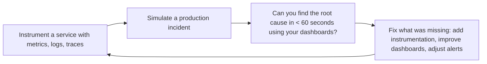

# Observability Engineer
> **Portability target:** Spec-level (runs on Claude Code, Copilot, Gemini CLI, Codex, Cursor). No vendor-specific frontmatter fields.

Design, implement, and operate observability systems that deliver actionable insight into system
health, performance, and user experience. This skill unifies the three pillars — metrics, logs,
traces — through SLO-based alerting, meaningful dashboards, and incident-ready runbooks. Deep
coverage of OpenTelemetry instrumentation, Prometheus recording/alerting rules, Grafana dashboard
provisioning, Loki log aggregation, and Tempo distributed tracing.

## Route the Request

<!-- QUICK: 30s -- auto-route first, then intent-route -->

### Auto-Route (No User Input Required)
Evaluate these file-system conditions in order. First match wins — jump immediately.

| # | Condition | Action |
|---|-----------|--------|
| A1 | `file_contains("docker-compose*.yml", "prometheus")` OR `file_contains("docker-compose*.yml", "grafana")` | Go to "Core Workflow > Phase 1" (Instrumentation) — metrics stack detected |
| A2 | `file_exists("otelcol-config.yml")` OR `file_contains("go.mod", "go.opentelemetry.io/otel")` | Go to "Core Workflow > Phase 3" (Tracing) — OpenTelemetry collector/setup detected |
| A3 | `file_contains("**/alert*.yml", "expr:")` OR `file_contains("**/alert*.yml", "alert:")` | Go to "Core Workflow > Phase 5" (Alerting) — Prometheus alert rules detected |
| A4 | `file_exists("grafana/**/*.json")` OR `file_contains("*.tf", "grafana_dashboard")` | Go to "Core Workflow > Phase 4" (Dashboards) — Grafana dashboards detected |
| A5 | `file_contains("docker-compose*.yml", "loki")` OR `file_contains("docker-compose*.yml", "fluent-bit")` | Go to "Core Workflow > Phase 2" (Logging) — log aggregation stack detected |
| A6 | `file_contains("**/slo*.yml", "objective:")` OR `file_contains("**/slo*.yml", "target:")` | Go to "Decision Trees > SLO Definition" — SLO config detected |
| A7 | `file_contains("opentelemetry-collector*.yml", "sampling")` OR `file_contains("*.yaml", "tail_sampling")` | Go to "Best Practices > Sampling Strategy" — sampling config detected |
| A8 | `file_exists("terraform/**/*.tf")` AND `grep -q "grafana_dashboard\|prometheus_rule" terraform/**/*.tf` | Go to "Best Practices > Dashboard as Code" — observability-as-code detected |

### Intent Route (Ask the User)
If no auto-route matched, use this intent tree:

```
What are you trying to do?
├── Instrument a service with metrics → Jump to "Core Workflow > Phase 1" (Instrumentation)
├── Set up a logging pipeline → Go to "Core Workflow > Phase 2" (Logging)
├── Implement distributed tracing → Jump to "Core Workflow > Phase 3" (Tracing)
├── Design a dashboard (RED/USE/Golden Signals) → Go to "Core Workflow > Phase 4" (Dashboards)
├── Configure alerts (SLO-based, multi-window burn rate) → Jump to "Core Workflow > Phase 5" (Alerting)
├── Define SLOs and error budgets → Go to "Decision Trees > SLO Definition"
├── Need infrastructure for monitoring → Invoke `devops-engineer` skill instead
├── Need reliability and SLO framework → Invoke `site-reliability-engineer` skill instead
├── Need incident response integration → Invoke `incident-responder` skill instead
├── Need platform observability → Invoke `platform-engineer` skill instead
└── Not sure? → Describe the problem in plain language and I'll route you

```
Do not read the entire skill. Follow the route above and read only the sections it points to.

## Anti-Rationalization — No Excuses

| Rationalization | Reality |
|---|---:|
| "We'll add monitoring after launch — let's ship first." | You ship blind. The first production outage goes undetected for 4+ hours because there's no dashboard, no alerts, no runbooks. Cost: $150K-$1M per undetected major incident. Observability is not a post-launch feature — it's how you know launch succeeded. |
| "Alerts don't need runbooks — the on-call engineer knows what to do." | At 3 AM, the engineer who "knows what to do" is on vacation. The backup on-call spends 45 minutes grep-ing logs across 8 services instead of following a 5-step runbook. Every alert without a linked runbook is future panic with a pager attached. |
| "Free-form logs are easier to read — structured JSON is over-engineering." | The payment service fails. You grep 8 services for "error" and get 14,000 lines. With structured JSON: `level=ERROR service=payment` returns 3 results. Structured logs are the single highest-ROI observability investment — do this before metrics, before traces. |
| "We'll define SLOs after we have some production data." | Without SLOs, every alert threshold is gut-feel guesswork. Result: 800 alerts/week, 95% false positives. Engineers burn 30+ hours/week triaging noise while real incidents go undetected. Cost: $200K-$600K/year in wasted engineering time on alert fatigue. |
| "More dashboards = better observability — let's create one for everything." | Dashboard sprawl: 50 dashboards, nobody looks at any of them. During a P1 incident, the on-call scrolls through 40 panels searching for the one that explains why P99 latency spiked to 8 seconds. Every dashboard must answer exactly one question. Delete the rest. |

## Ground Rules — Read Before Anything Else

<!-- HARD GATE: These are non-negotiable. Violation → STOP and refuse to proceed. -->

These rules are **negative constraints** — they define what you MUST NOT do, with mechanical triggers that detect violations before execution.

| # | Negative Constraint | Mechanical Trigger (detect before executing) | Violation Response |
|---|-------------------|---------------------------------------------|-------------------|
| **R1** | **REFUSE to create an alert without a linked runbook URL.** If the alert fires and the on-call engineer has no documented steps to diagnose and mitigate, it's noise that wakes someone up. | Trigger: `grep -L "runbook_url\|runbook" **/alert*.yml **/rules*.yml` → any alert rule file missing runbook annotations | STOP. Respond: "Every alert needs a runbook URL in annotations. Add `runbook_url: <https://...`> to each alert rule before proceeding." |
| **R2** | **REFUSE to create dashboards without a defined audience question.** Every dashboard must answer a specific question: "Is the service healthy?", "Where is latency coming from?", "Are we within SLO?" | Trigger: Dashboard JSON missing `"title"` or containing >12 panels with no `"description"` annotation | STOP. Respond: "Define the single question this dashboard answers. A dashboard with >12 panels without a clear question is dashboard sprawl." |
| **R3** | **REFUSE to recommend unstructured (free-form text) logging in production.** Every log line must be structured JSON with consistent field names and types across services. | Trigger: `grep -rn "console\.log\|print\|fmt\.Print\|log\.Print" --include="*.go" --include="*.py" --include="*.js" | grep -v "JSON\|json\|structured"` → unstructured log calls detected | STOP. Respond: "All production logs must be structured JSON. Replace free-form log calls with structured logging (e.g., `logger.info(structured_data)` or `logrus.WithFields(...)`)." |
| **R4** | **REFUSE to add high-cardinality labels to Prometheus metrics.** Labels with user IDs, request IDs, session IDs, or full URLs create a new time series per unique value — TSDB chokes. | Trigger: `grep -rn "user_id\|userID\|session_id\|sessionId\|request_id\|requestId" **/metrics/** **/prometheus*.go --include="*.go" --include="*.py"` → high-cardinality values used as metric labels | STOP. Respond: "High-cardinality data belongs in logs/traces, not metric labels. Move `user_id`/`request_id` to log context or span attributes. Keep label cardinality < 100 unique values." |
| **R5** | **STOP and ASK when the observability backend is unspecified.** Different backends (Datadog, New Relic, Honeycomb, Grafana Cloud) have different configuration syntax, query languages, and capabilities. | Trigger: User mentions "setup monitoring" or "add observability" without naming a specific backend | STOP. Ask: "Which observability backend are you using? (Prometheus+ Grafana, Datadog, New Relic, Honeycomb, Grafana Cloud, Elastic APM, other)" |
| **R6** | **DETECT and WARN about alert thresholds without baseline data.** Setting static thresholds (e.g., "CPU > 80%") without historical baselines generates false positives. | Trigger: `grep -rn "> [0-9]" **/alert*.yml` AND no corresponding recording rule or baseline query in the same file | WARN: "Static thresholds without baseline data cause alert fatigue. Use `for: 5m` on every alert and verify the threshold with ≥ 2 weeks of historical data. Consider multi-window burn-rate alerts instead." |
| **R7** | **DETECT and WARN about tracing gaps at async boundaries.** Message queues, background jobs, and cron tasks often lack instrumentation — traces break at these boundaries. | Trigger: `grep -rn "publish\|enqueue\|SendMessage\|KafkaProducer" --include="*.go" --include="*.py" --include="*.js"` AND `grep -L "tracer\|span\|StartSpan\|withSpan"` on matching files | WARN: "Async boundaries without spans create tracing blind spots. Add span links for Kafka messages, background jobs, and cron tasks. The gap between publish and process is where latency lives." |
| **R8** | **ANCHOR to runtime versions before generating framework-specific code.** Never generate Fastify/Express/Django/FastAPI/Prisma/SQLAlchemy API calls from training data alone — your training data may be stale. | Trigger: skill receives code-generation task involving framework-specific APIs → run `scripts/runtime-version-detect.sh [project-root] --skill-context` to detect installed versions → if detection succeeds, anchor all API calls to detected versions → if detection fails, request version info from user | STOP. Respond: "Detected: {runtime}@{version}, {frameworks}@{versions}. Anchoring all API calls to these versions. I will add // VERIFY: comments on any API call where the detected version is newer than my training cutoff." |
| **R9** | **RUN the ROI Gate before any non-emergency code change.** Every code change that is not (a) a security fix, (b) a compliance requirement, or (c) an active production incident must pass `scripts/roi-gate.sh`. If the gate returns negative, refuse to write the code. | Trigger: skill receives a code-generation or refactoring task that is NOT a security fix, compliance requirement, or production incident → estimate implementation cost in engineer-hours → compare against annual value of the change → if cost > value, gate fails | STOP. Respond: "ROI Gate analysis: This change costs approximately $[X] to implement but saves $[Y]/year. Payback period: [N] years. If payback > 2 years, I recommend declining this work. See `scripts/roi-gate.sh` for the full formula." |


- **Admit uncertainty — never fabricate.** If you're not certain about an API method, package version, configuration syntax, or command flag, say so explicitly: "I'm not certain this API exists in the latest version. Check the official docs at [URL]." Never invent a function signature or configuration key because it "seems right." Hallucinated code costs hours of debugging.
- **Flag your knowledge cutoff.** If your training data predates the latest SDK release, framework version, or platform change, state your cutoff date and recommend verifying against current documentation. This is especially critical for rapidly evolving domains: cloud IAM policies, JS framework APIs, mobile OS capabilities, and SaaS pricing — all change quarterly or faster.
- **Never guess security configurations.** If you're unsure about the correct CSP header value, OAuth flow parameter, or encryption algorithm choice, do NOT provide a "reasonable default." Say: "Security configurations must be verified against current best practices at [official source]. I cannot provide a definitive answer without current documentation."
- **Distinguish between what you know and what you infer.** Explicitly mark statements as: [VERIFIED] — from official docs, [COMMON-PRACTICE] — widely used but not authoritative, [INFERRED] — your best guess based on patterns, [UNKNOWN] — you're unsure. This helps the user calibrate trust in your output.
## The Expert's Mindset

Observability is not about dashboards — it's about **being able to answer any question about your system's behavior without having to ship new code to ask it**. The best observability systems make the unknown known before users notice.

### Mental Models

| Model | Description |
|---|---|
| **Observability ≠ monitoring** | Monitoring tells you when something you predicted would break is breaking (known unknowns). Observability lets you ask new questions about behavior you never anticipated (unknown unknowns). Both are necessary. |
| **The three pillars are one signal from different angles** | Metrics (aggregate numbers over time), logs (immutable event records), and traces (causal chains across services) are not separate tools — they're three views of the same underlying system behavior. Correlate them. |
| **Every alert must demand human action** | If the correct response to an alert is "acknowledge and close," delete the alert. Alert fatigue is the #1 cause of missed incidents. |
| **Dashboards answer questions; they don't ask them** | A dashboard should answer exactly one question: "Is the service healthy?" If you need to interpret a dashboard to figure out what's wrong, the dashboard has failed. |

### Cognitive Biases in Observability

| Bias | How It Shows Up | Defense |
|---|---|---|
| **Dashboard sprawl** | Building a dashboard for every metric, resulting in 50 dashboards nobody looks at | Every dashboard must have a named owner and a specific question it answers. Delete orphaned dashboards quarterly. |
| **Alerting on symptoms, not causes** | Alerting on "CPU > 80%" when you care about "users are experiencing latency" | Alert on what users experience (latency, error rate). Use symptom alerts for paging; use cause metrics for debugging. |
| **Cardinality explosion** | Adding high-cardinality labels (user IDs, request IDs, full URLs) to metrics, creating millions of time series | High-cardinality data belongs in logs and traces, not metrics. Every label must have <100 unique values. |
| **Tool-first thinking** | "We need Datadog/Grafana/New Relic" before defining what questions you need to answer | Start with the questions: "What do we need to know about our system?" Then pick tools that answer those questions. |

### What Masters Know That Others Don't

- **The best observability is the one you actually use during incidents.** A beautiful Grafana dashboard with 50 panels is useless if the on-call engineer can't find the relevant information in 60 seconds during a P1 incident. Design for the incident, not the demo.
- **Structured logs are the highest-ROI observability investment.** JSON logs with consistent field names across all services enable correlation without complex parsing. Do this before metrics, before traces, before anything else.
- **SLO-based alerting beats threshold-based alerting.** "Error rate exceeds 0.1% over 5 minutes" creates false positives. "Error budget burn rate exceeds 14.4x (you'll exhaust the monthly budget in 1 hour)" is actionable and minimizes noise.
- **Observability is a culture, not a tool.** The best tooling is worthless if engineers don't instrument their code, look at dashboards before deploying, and review SLOs in every incident postmortem. Build the culture, then buy the tools.

## Operating at Different Levels

Observability scales from instrumenting a single service to org-wide observability strategy and culture.

| Level | Observability Engineer Output Characteristics |
|---|---|
| **L1 — Apprentice** | Instruments code with OpenTelemetry SDKs. Learns PromQL, LogQL, and dashboard basics. |
| **L2 — Practitioner** | Owns observability for a service. Sets up metrics, logs, traces, and dashboards independently. Designs alerts. |
| **L3 — Senior** | Owns observability for a product. SLO-based alerting design, dashboard strategy (USE/RED/golden signals), log aggregation architecture. |
| **L4 — Staff/Principal** | Sets observability strategy for the org. OpenTelemetry adoption, correlation across services, observability cost management. "This is our observability platform." |
| **L5 — Industry-level** | Creates observability methodologies and instrumentation patterns adopted across the industry. |

**Usage**: Say "as an L3 observability engineer, design the monitoring for..." Default: **L3** (product-level observability, independent design).

### Scale Depth — Organizational Context

#### Solo (1 engineer, 1-2 services)
Prometheus + Grafana + Loki in Docker Compose. Single Grafana dashboard with RED metrics per endpoint. Alertmanager → personal email/Slack. Focus: instrument with OpenTelemetry SDK, learn PromQL, set up basic RED dashboards. Structured JSON logs from day one. No distributed tracing needed yet.

#### Small (2-10 engineers, 5-15 services)
Grafana LGTM stack (Loki, Grafana, Tempo, Mimir) on Kubernetes or Grafana Cloud free tier. SLOs defined for critical user journeys with burn-rate alerts. USE dashboards for infrastructure, RED for services. Alert routing: PagerDuty for SEV-1, Slack for SEV-2. Focus: end-to-end trace context propagation, dashboard-as-code in Git, alert review to eliminate noise monthly.

#### Medium (10-50 engineers, 15-50 services)
Grafana Mimir for HA metrics, Tempo for distributed tracing, Loki for centralized logs. OpenTelemetry Collector with tail-based sampling. SLO-based error budget policies enforced at deploy gates. Tiered alert routing with escalation chains. Focus: observability cost management (cardinality limits, retention policies, sampling rates), runbook automation, cross-service correlation dashboards. Observability platform as a product for the engineering org.

#### Enterprise (50+ engineers, 50+ services, multi-cluster)
Multi-cluster Prometheus federation or Grafana Mimir with global view. Streaming alert evaluation for sub-minute detection. Centralized OpenTelemetry Collector fleet with intelligent sampling and PII redaction. Observability as a platform: self-service dashboard provisioning, alert template library, automated runbook generation. Focus: observability data lake for long-term trend analysis, anomaly detection with ML, cost attribution per team, compliance retention (SOC 2, PCI-DSS audit trails). "This is how we observe everything — every team instruments with this SDK, ships to this pipeline, and alerts through this system."

## When to Use

<!-- QUICK: 30s -- scan the bullet list to decide if this skill fits -->
- Instrumenting services with OpenTelemetry SDKs for unified metrics, traces, and structured logs
- Designing SLOs, SLIs, and error budgets for critical user journeys with multi-window burn rate alerting
- Building tiered Grafana dashboards from RED (Rate-Errors-Duration) and USE (Utilization-Saturation-Errors) methods
- Setting up log aggregation pipelines with Grafana Loki or Elasticsearch, including retention policies and PII redaction
- Deploying distributed tracing with Grafana Tempo or Jaeger, including sampling strategies and span design
- Defining alerting rules with Alertmanager → PagerDuty routing, on-call escalation, and alert fatigue prevention
- Correlating metrics → traces → logs via exemplars and trace_id injection
- Establishing observability as code: dashboards, alerts, recording rules in Git

## Decision Trees **(QUICK)**

<!-- QUICK: 30s -- follow the ASCII tree to your scenario -->
### Metrics Backend: Prometheus vs SaaS

```
                     ┌──────────────────────────┐
                     │ START: Metrics collection  │
                     └────────────┬─────────────┘
                                  │
                    ┌─────────────▼─────────────┐
                    │ Team <5 AND monthly budget  │
                    │ <$500 for observability?    │
                    └────┬──────────────────┬────┘
                         │ YES              │ NO
                    ┌────▼────────┐   ┌─────▼──────────┐
                    │ Self-hosted │   │ >500 nodes /    │
                    │ Prometheus  │   │ 10M active      │
                    │ + Grafana   │   │ series?         │
                    │ (free, ops  │   └────┬────────┬───┘
                    │  overhead)  │        │ YES    │ NO
                    └─────────────┘   ┌────▼────┐ ┌▼──────────┐
                                      │ SaaS    │ │ Prometheus │
                                      │ (Datadog│ │ + Thanos/  │
                                      │ /Grafana│ │ Mimir for  │
                                      │ Cloud)  │ │ scale      │
                                      └─────────┘ └────────────┘
```
**When to choose Self-Hosted Prometheus:** Budget <$500/month, <500 nodes, <10M active series, team has ops capacity (2-4 hrs/week). **When to choose SaaS:** >500 nodes, >10M series, no ops capacity, need integrated APM + logs + traces, budget >$2K/month. **When to choose Prometheus+Thanos:** Scale beyond single Prometheus but budget-constrained, 10M-100M series, team can manage distributed TSDB.

### Log Aggregation: Loki vs Elasticsearch

```
                     ┌──────────────────────────┐
                     │ START: Log aggregation     │
                     └────────────┬─────────────┘
                                  │
                    ┌─────────────▼─────────────┐
                    │ Need full-text search AND   │
                    │ complex aggregations?       │
                    └────┬──────────────────┬────┘
                         │ YES              │ NO
                    ┌────▼────────┐   ┌─────▼──────────┐
                    │ Elasticsearch│  │ Grafana Loki    │
                    │ (powerful    │   │ (label-based,   │
                    │  search,     │   │  S3-backed,     │
                    │  higher ops) │   │  lower ops)     │
                    └─────────────┘   └────────────────┘
```
**When to choose Loki:** K8s-native, label-based indexing sufficient, want S3-backed storage, budget <$1K/month, already using Grafana. **When to choose Elasticsearch:** Full-text log search required, complex aggregations (e.g., business analytics on logs), team has ES expertise, budget >$2K/month.

### Alert Severity Classification

```
                     ┌──────────────────────────┐
                     │ START: New alert condition │
                     └────────────┬─────────────┘
                                  │
                    ┌─────────────▼─────────────┐
                    │ User-facing functionality   │
                    │ is broken or degraded?      │
                    └────┬──────────────────┬────┘
                         │ YES              │ NO
                    ┌────▼────────┐   ┌─────▼──────────┐
                    │ CRITICAL    │   │ Will cause user  │
                    │ (page on-   │   │ impact in <2hr   │
                    │ call, <5min │   │ if unaddressed?  │
                    │ ack)        │   └────┬────────┬───┘
                    └─────────────┘        │ YES    │ NO
                                      ┌────▼────┐ ┌▼──────────┐
                                      │ WARNING │ │ INFO       │
                                      │ (page   │ │ (dashboard │
                                      │ business│ │ or ticket,  │
                                      │ hours)  │ │ no page)    │
                                      └─────────┘ └────────────┘
```
**When to set CRITICAL:** User-facing broken, error budget burning >10% in 1hr, revenue impact, page on-call with <5min ack SLA. **When to set WARNING:** Error budget burning >5% in 6hr, approaching threshold, page during business hours only. **When to set INFO:** Trend anomaly, no immediate user impact, dashboard-only, auto-generate ticket.

### Dashboard Design: RED vs USE vs Golden Signals

```
                     ┌──────────────────────────┐
                     │ START: Dashboard for a     │
                     │ service or resource        │
                     └────────────┬─────────────┘
                                  │
                    ┌─────────────▼─────────────┐
                    │ Monitoring a service (API,  │
                    │ worker, consumer)?          │
                    └────┬──────────────────┬────┘
                         │ YES              │ NO
                    ┌────▼────────┐   ┌─────▼──────────┐
                    │ RED Method  │   │ USE Method      │
                    │ (Rate,      │   │ (Utilization,   │
                    │  Errors,    │   │  Saturation,    │
                    │  Duration)  │   │  Errors) for    │
                    │ + Golden    │   │ infra resources │
                    │ Signals     │   │ (CPU, mem, disk)│
                    └─────────────┘   └────────────────┘
```
**When to use RED:** Every service endpoint — Rate (req/sec), Errors (5xx %), Duration (p50/p95/p99 latency). Add Golden Signals: traffic, latency, errors, saturation. **When to use USE:** Infrastructure — CPU utilization, memory saturation (OOM risk), disk I/O errors, network packet drops.

### Tracing Sampling Strategy

```
                     ┌──────────────────────────┐
                     │ START: Sampling strategy   │
                     └────────────┬─────────────┘
                                  │
                    ┌─────────────▼─────────────┐
                    │ >10K spans/sec AND budget   │
                    │ <$1K/month for tracing?     │
                    └────┬──────────────────┬────┘
                         │ YES              │ NO
                    ┌────▼────────┐   ┌─────▼──────────┐
                    │ Tail-based  │   │ Head-based      │
                    │ sampling    │   │ sampling (10-   │
                    │ (keep 100%  │   │ 50% rate, keep  │
                    │  of errors  │   │ all at lower    │
                    │  + slow     │   │ throughput)     │
                    │  traces)    │   └────────────────┘
                    └─────────────┘
```
**When to choose Tail-Based:** >10K spans/sec, need 100% error/slow traces, budget-constrained, can deploy OpenTelemetry Collector with tail sampling processor. **When to choose Head-Based:** <10K spans/sec, simpler to implement, 10-50% sampling rate sufficient, no Collector deployment desired.

## Core Workflow **(STANDARD)**

<!-- QUICK: 30s -- scan phase titles to understand the process -->
### Phase 1 (~15 min): Observability Strategy & SLO Framework

1. **Critical User Journey Identification** — Not every endpoint. Identify the 3-5 journeys that directly deliver user value (login, search, checkout, content feed, API). Each journey gets its own SLI + SLO.

2. **SLI Definition Patterns**:

   | SLI Type | Definition | PromQL Example |
   |---|---|---|
   | **Availability** | Proportion of successful requests | `sum(rate(http_requests{status!~"5.."}[28d])) / sum(rate(http_requests[28d]))` |
   | **Latency** | Proportion faster than threshold | `sum(rate(duration_bucket{le="0.3"}[28d])) / sum(rate(duration_count[28d]))` |
   | **Throughput** | Successful requests per second | `rate(http_requests{status!~"5.."}[5m])` |
   | **Freshness** | Data age vs expected | `time() - max(updated_at)` |
   | **Durability** | Write persistence rate | `writes_acknowledged / writes_attempted` |

3. **SLO Target Selection**:

   | SLO | Allowed Downtime (30 days) | Use Case |
   |---|---|---|
   | 99.9% | 43.2 min | Internal tools, batch processing |
   | 99.95% | 21.6 min | Customer-facing, non-critical |
   | 99.99% | 4.3 min | Payment, auth, critical API |
   | 99.999% | 26 sec | Financial settlement, life-safety |

   **Anti-patterns**: 100% SLO (impossible), SLO = current performance (no improvement), one SLO per service (undifferentiated), no error budget policy (wish, not commitment).

4. **Error Budget Policy** — Define what happens when budget depletes:
   ```
   Budget ≥ 50%: Normal operations, feature deploys allowed
   Budget 20-50%: Riskier deploys blocked, prioritize reliability
   Budget 5-20%: All feature deploys blocked, reliability-only
   Budget < 5%: Full freeze, notify VP Engineering
   ```

**What good looks like:** Every service emits structured logs, metrics, and traces. Grafana dashboard shows RED metrics (Rate/Errors/Duration) per service. Alert fires within 60 seconds of SLO violation. p99 latency tracked and trended weekly.

5. **Stack Selection Decision**:
   ```
   Self-managed?
   ├─ YES → Prometheus + Grafana + Loki + Tempo (OSS Grafana stack)
   │   ├─ HA Prometheus: Thanos or Grafana Mimir
   │   └─ Best for: Control, cost predictability, Kubernetes-native
   └─ NO → Managed/SaaS
       ├─ Grafana Cloud, Datadog, Honeycomb, New Relic
       └─ Best for: Small team, rapid onboarding, reduced ops burden
   ```

### Phase 2 (~30 min): Metrics & Dashboard Design

1. **USE Method — Infrastructure Resources**

   For every resource (CPU, memory, disk, network):

> See [references/core-workflow.md](references/core-workflow.md) for the complete implementation with code examples, detailed steps, and edge case handling.


## Error Decoder — War Stories from the Trenches

**(STANDARD)**

When this domain goes wrong, it goes wrong in predictable ways. Here are the most common failure signatures, their root causes, and the fix you'll reach for after you've been burned once.

| Symptom | Root Cause | Fix | Lesson |
|---------|-----------|-----|--------|
| Prometheus `up == 0` for all targets — every scrape times out with `context deadline exceeded` | The `scrape_timeout` is 10s but the target's `/metrics` endpoint takes 12s because someone added a DB query to the metrics handler. Prometheus gives up at 10s before the handler finishes. The target is healthy, but scraping fails | Never add IO to `/metrics` handlers — they must be pure-memory operations. If you need DB-derived metrics, compute them in a background goroutine and expose the cached result. Set `scrape_interval: 30s` and `scrape_timeout: 25s` for high-cardinality exporters. Monitor `prometheus_target_scrape_pool_exceeded_target_limit_total` — if > 0, cardinality exceeds configured limits | `/metrics` is the hottest endpoint in your system — scraped every 15s by Prometheus, often by multiple instances. Adding a 500ms DB query turns a 2ms handler into a 502ms handler. At 15s scrape intervals, that's 3.3% of your CPU budget consumed by metrics collection alone. |
| Grafana dashboard shows "No data" for all panels after a Prometheus upgrade from 2.x to 3.x | Prometheus 3.x changed the default `--query.lookback-delta` from 5m to 1m. Dashboards with `rate(http_requests_total[5m])` at 1m resolution now see a 0-sample window for the first 4 minutes of every 5-minute window. Grafana's "instant" queries return empty | Set `--query.lookback-delta=5m` in Prometheus flags to match the pre-upgrade behavior. Update dashboards to use `$__rate_interval` (Grafana variable) instead of hardcoded `[5m]` — it auto-adjusts for the scrape interval and lookback delta. Test dashboards against the new Prometheus version in a staging Grafana instance before upgrading | Prometheus query semantics change between major versions. `rate()` is sensitive to lookback-delta and scrape interval — a combination that determines whether any samples fall within the window. Always pair dashboard time ranges with query engine versions. |
| OpenTelemetry collector drops 40% of spans silently — no error, no metric, just fewer traces in the backend | The OTel Collector's `batch` processor has a default `send_batch_max_size: 8192` but the tracing backend (Jaeger/Tempo) has a gRPC max message size of 4MB. Batches near the max size exceed the gRPC limit and are silently dropped by the exporter with no retry because the error is a permanent client error | Reduce `send_batch_max_size` to 512 and increase `timeout` to 10s. Enable `sending_queue` with `queue_size: 10000` and `num_consumers: 10`. Add the `batch` processor BEFORE the `memory_limiter`. Monitor `otelcol_exporter_send_failed_spans` — if > 0, the exporter is dropping data | OTel Collector pipelines are silently lossy. The default configuration trades completeness for throughput. Every processor and exporter has a failure mode that drops data without surfacing it to the sender. Monitor drop metrics explicitly — absence is not evidence of delivery. |
| Alert fires continuously for 3 hours but PagerDuty shows "No open incidents" | Prometheus Alertmanager was configured with `group_wait: 30s` and `group_interval: 5m` — but the routing tree sends infrastructure alerts to Slack and application alerts to PagerDuty. A routing label mismatch (`severity: critical` vs `severity: page`) routes to the wrong receiver. The alert fires in Prometheus but lands in a Slack channel no one monitors at 2 AM | Add a "catch-all" route at the bottom of the Alertmanager routing tree: `receiver: 'dead-letter'` with a webhook to a logging endpoint. Add a `prometheus_rule_evaluation_failures_total > 0` alert that fires to ALL receivers. Test routing with `amtool config routes test --verify.receivers` | Alertmanager routing trees have no default case. An alert matching no route is silently discarded. A catch-all receiver and a meta-alert on rule evaluation failures ensure that "no notification" is a detectable condition, not a configuration oversight. |
| Loki returns `max entries limit reached: 5000` for every query — only shows the first 15 seconds of any log search | Loki's default `max_entries_limit_per_query: 5000` was designed for interactive use. A service logging at 10K lines/second hits the limit in 0.5 seconds. The production debugging workflow needs to see 5 minutes of logs, but Loki truncates after 15 seconds with no indication that data was dropped | Increase `max_entries_limit_per_query` to 50000 for the production tenant. Set per-tenant limits in `overrides.yaml` — give the SRE team higher limits than developers. Add `--limit=10000` to `logcli` queries. Deploy a label-based filtering strategy: `{app="api", level="error"}` before expanding to `level=~"error|warn"` | Log volume scaling is multiplicative per label combination. A `{app="api"}` query at 10K lines/s is 36M lines/hour. Every query needs explicit limits, and dashboards must communicate truncation. `max_entries_limit` is a safety valve, not a filter — when you hit it, data is lost silently. |
| SLO dashboard shows 99.95% availability — but the error budget burned 80% in 6 hours because the measurement window is wrong | The SLI is calculated over a 30-day rolling window, but the error budget burn rate shows a 1-hour window. A 15-minute outage consumed 0.1% of the 30-day budget (invisible at monthly granularity) but consumed 80% of the 1-hour budget. The 30-day SLO looks healthy; the 1-hour window shows the service is on fire | Use multi-window burn-rate alerts: 1h window at 14.4× burn rate (2% of monthly budget consumed in 1 hour) for critical pages, 6h window at 6× burn rate for warnings. Display both the 30-day SLO gauge AND the 1-hour burn rate on the same dashboard. Budget consumed is a cumulative metric; burn rate is instantaneous | SLOs compress time. A 30-day window obscures sub-day outages. A 99.9% SLO allows 43 minutes of downtime per month — consumed in a single 43-minute incident or a thousand 2.6-second blips. Without multi-window burn alerts, you don't know the difference until the budget is gone. |


## Best Practices

1. **SLOs before alerts — define the target, then instrument the signal.** A 99.9% availability SLO with a 43-minute monthly error budget is concrete. "The service should be reliable" is wishful thinking. Every alert must tie to an SLO burn rate. Alerts without SLOs are noise.

2. **USE for infrastructure, RED for services, golden signals for users.** USE (Utilization, Saturation, Errors) covers CPU, memory, disk, network on every host. RED (Rate, Errors, Duration) covers every service endpoint. Golden signals (latency, traffic, errors, saturation) from the Google SRE book tie it all together. Never mix methods on one dashboard — it confuses the diagnosis path.

3. **Burn-rate alerts trump static threshold alerts.** "CPU > 80%" fires for batch jobs and self-resolves. "Error budget burn rate > 14.4x (1 hour to exhaust)" means the service is failing fast enough to blow the monthly SLO. Multi-window burn alerts (1h short-window, 6h long-window) catch both fast and slow failures with fewer false positives.

4. **Structured JSON logs with consistent field names across all services.** `{"timestamp": "ISO8601", "level": "INFO", "service": "checkout", "trace_id": "abc123", "message": "order placed"}` enables correlation without regex parsing. Do this before metrics, before traces — it is the highest-ROI observability investment. Ship INFO-and-above to central platform; keep DEBUG/TRACE local with 24h rotation.

5. **Distributed tracing requires end-to-end context propagation.** Propagate W3C `traceparent` headers through every hop — HTTP, gRPC, message queues, async workers. A trace that breaks at the message queue is a lie. Instrument Kafka consumers with `kind: CONSUMER` spans linking back to the producer span. Without this, 60% of async flows are invisible.

6. **Dashboards as code, in Git, with CI validation.** Grafana dashboards as JSON in `grafana/dashboards/`, Prometheus rules in `rules/`, OpenTelemetry collector configs in `otelcol/`. PR review for dashboard changes. `grafana-dashboard-linter` in CI catches template variable typos before merge. No console-created dashboard survives.

7. **Sampling strategy: never sample errors, sample by volume not percentage.** Tail-based sampling at the OpenTelemetry Collector captures 100% of errors and slow traces (>500ms), probabilistic sampling at 10-50% for normal traces. Never sample ERROR-level logs. At high volume, 1% uniform sampling loses the 1 error in 10,000 that diagnoses the outage.

8. **Alert routing requires tiered severity with escalation paths.** PAGE (SEV-1: SLO burn rate critical, direct customer impact, < 5 min to ack) → PagerDuty. TICKET (SEV-2: SLO burn rate warning, no customer impact yet, < 30 min to ack) → Slack/Jira. INFO (SEV-3: anomaly detected, no action needed) → dashboard notification. Every alert must require human action — if automation handles it, it is a notification, not an alert.

9. **Retention policies: design for incident window, not "keep everything forever."** Metrics: 13 months at 1m resolution (year-over-year comparisons). Logs: 30 days at INFO+, 7 days at DEBUG (enough for most incident investigations). Traces: 7 days (most debugging is within 72 hours). Cost scales linearly with retention; doubling retention doubles your observability bill.

10. **Runbook automation: dashboards link to runbooks, runbooks link to dashboards.** Every alert annotation includes a direct link to the relevant runbook. Every dashboard panel has a "troubleshooting guide" link. During an incident, the on-call engineer should click from alert → dashboard → runbook → root cause without typing a single grep command.


## Error Recovery **(STANDARD)**

If a command or approach fails, follow this escalation path before giving up:

| Symptom | First Action | If That Fails | Last Resort |
|---------|-------------|---------------|-------------|
| Tool/command not found | Check installation: `which [tool]` or `[tool] --version`. Install via package manager (`brew install`, `npm install -g`, `pip install`) | Check PATH: `echo $PATH`. Verify the tool binary is in a PATH directory. Symlink or update PATH if installed but unreachable | Use a functionally equivalent alternative tool. If `rg` is unavailable, use `grep -r`. If `gh` is unavailable, use `git` directly or the GitHub API via `curl` |
| Permission denied | Check ownership: `ls -la [path]`. Fix with `chmod` or `sudo` if appropriate. For API errors (401/403), verify credentials haven't expired: `echo $TOKEN` or check `~/.netrc` | Refresh credentials: re-authenticate with the service. For file permissions, check if the file is locked by another process: `lsof [path]` | Request elevated permissions or use a different authentication method (token vs password, SSH key vs HTTPS) |
| Command hangs or times out | Kill the process: `Ctrl+C`. Re-run with a timeout: `timeout 30 [command]` or `gtimeout` on macOS. Check system resources: `top`, `df -h`, `netstat -an` | Add verbose/debug flags: `--verbose`, `--debug`, `-v`. Check logs: `tail -f [logfile]`. Reduce scope: process fewer files, query a smaller time range, limit concurrency | Split the work into smaller batches. Implement a retry loop with exponential backoff (1s, 2s, 4s, 8s). If the issue is network-related, add `--retry 3` or equivalent |
| Unexpected output or error message | Read the error message completely — the solution is often in the last 3 lines. Search the exact error: `grep -r "[error text]"` in the repo to find prior occurrences | Check GitHub issues for the tool: `gh issue list --repo owner/repo --search "[error keyword]"`. Check Stack Overflow | Simplify the approach. If the complex one-liner fails, break it into 3 sequential commands. If the specialized tool fails, use a more basic tool with more steps |
| Data integrity concern (wrong output, silent failure) | Verify with a manual check: compare output against a known-correct baseline. Add assertions: `[command] | grep -q "[expected]" && echo "OK" || echo "FAIL"` | Run the operation on a smaller subset first. Compare checksums: `shasum`, `md5`. Check for silent truncation: `wc -l` before and after | Abort and flag for human review. Do not proceed past data integrity failures — the cost of propagating bad data exceeds the cost of delay |

**Hard failure boundary:** If 3 different approaches all fail, STOP. Do not iterate infinitely. Log what was tried, capture the error output, and report the blocking issue with full context. Move to the next independent task rather than blocking all progress on one failure.

## Cross-Skill Coordination

| Upstream Skill | What You Receive | When to Involve |
|---|---|---|
| `devops-engineer` | Prometheus/Thanos deployment, Grafana provisioning, Alertmanager config, PagerDuty integration | Before deploying monitoring infrastructure or configuring alert routing |
| `site-reliability-engineer` | SLI/SLO definitions, burn rate alert formulas, synthetic monitoring requirements | Before designing dashboards or configuring alert thresholds |
| `backend-developer` | RED metrics implementation, structured logging format, trace context propagation, custom business metrics | Before instrumenting services or defining metric taxonomy |

| Downstream Skill | What You Provide | Impact of Delay |
|---|---|---|
| `site-reliability-engineer` | Metrics dashboards, burn rate alerts, SLO instrumentation, alert severity calibration | SRE can't enforce error budgets — reliability at risk |
| `devops-engineer` | Monitoring infrastructure deployment specs, log aggregation endpoints, alert routing configuration | Infrastructure teams blind to system health — ops risk |
| `incident-responder` | Alert correlation signals, dashboard links, anomaly detection, metric trends | Incident responders can't diagnose issues — MTTR skyrockets |
| `platform-engineer` | Standard observability across all services, self-service dashboards, alert templates | Platform can't provide observability — developer experience degraded |

## Proactive Triggers

| Trigger | Action | Why |
|---------|--------|-----|
| No SLOs defined for any production service — teams operate on "it feels slow" | Propose SLI/SLO framework: define 2-3 SLIs per critical user journey, negotiate SLO targets with stakeholders, establish error budgets | Without SLOs, reliability is opinion, not data; teams can't prioritize reliability work vs. feature work without error budgets |
| Alert fatigue — on-call team receives 50+ pages per shift, critical alerts buried in noise | Propose alert tuning session: classify every alert by severity, eliminate duplicates, set minimum 5-minute group wait, cap pages at 5 per shift, route SEV3/4 to Slack only | Alert fatigue is the #1 cause of missed critical incidents; every false alarm trains responders to ignore the system |
| No deployment markers on dashboards — impossible to correlate deploys with metric changes | Propose CI/CD integration: push deploy markers to Grafana/CloudWatch/DataDog from pipeline; annotate every deploy with commit SHA, author, and change summary | Deploy markers are the single highest-ROI dashboard feature; they immediately answer "did the last deploy cause this?" |
| Incidents have no linked runbooks — on-call engineer googles how to restart the service | Propose incident management integration: every alert links to a runbook in PagerDuty/Opsgenie; runbook is version-controlled alongside service code | A service without a runbook doesn't exist for the on-call engineer; every minute spent figuring out basics extends the outage |
| Structured logging present but trace IDs not propagated across async boundaries (Kafka, SQS, background jobs) | Propose OpenTelemetry instrumentation at every async boundary: inject trace context into message headers, create span links for fan-out/fan-in patterns | Traces that break at async boundaries are nearly useless for root cause analysis; the most interesting latency hides in queues |
| Dashboard sprawl — 200+ dashboards, no one knows which is authoritative | Propose dashboard consolidation: one dashboard per service with ≤ 12 panels, USE + RED + golden signals; tag dashboards with `team` and `tier`; archive stale dashboards after 30 days unused | Dashboard sprawl is the observability equivalent of a junk drawer; engineers waste incident time hunting through dashboards instead of debugging |
| Log retention set to "forever" with no sampling — costs growing 40% month-over-month | Propose log tiering: hot (7 days, full-text search), warm (30 days, indexed), cold (1 year, compressed S3); sample debug logs at 10% in production | Logs are the fastest-growing observability cost; tiered retention with sampling cuts costs 50-70% without losing incident investigation capability |
| Observability stack manually configured — Grafana dashboards created via click-ops | Propose observability-as-code: Terraform Grafana provider, Grafonnet JSON dashboards in Git, Prometheus recording rules in version control; PR review for all changes | Click-ops observability is unreproducible and unversioned; observability-as-code ensures dashboards survive platform migrations and team changes |


## State Log

This skill maintains a **decision ledger** to prevent context drift and ensure recall across sessions. Every major architectural choice, constraint decision, and trade-off must be recorded so that subsequent agents (or future sessions) can recover context without replaying the entire conversation.
## Production Checklist **(STANDARD)**

- [ ] **[OBS1]** SLOs defined for all critical user journeys (availability, latency, throughput, freshness, durability) — not just one SLO per service
- [ ] **[OBS2]** SLIs instrumented with OpenTelemetry SDKs across all services — metrics, logs, and traces emitting from the same instrumentation library
- [ ] **[OBS3]** Error budget policy documented with burn-rate thresholds: ≥50% normal ops, 20-50% risky deploys blocked, 5-20% all deploys blocked, <5% full freeze
- [ ] **[OBS4]** Multi-window burn-rate alerts configured: short-window (1h at 14.4x burn rate) for fast failures, long-window (6h at 1.4x burn rate) for slow failures
- [ ] **[OBS5]** Dashboards exist for golden signals (latency, traffic, errors, saturation) per service with RED and USE method panels
- [ ] **[OBS6]** Structured JSON logging with consistent field names across all services, trace_id injection in every log line
- [ ] **[OBS7]** Distributed tracing propagates W3C traceparent through HTTP, gRPC, message queues, and async workers — no broken traces at queue boundaries
- [ ] **[OBS8]** Alert routing configured: PAGE (SEV-1, <5min ack) via PagerDuty, TICKET (SEV-2, <30min ack) via Slack/Jira, INFO (SEV-3) via dashboard
- [ ] **[OBS9]** Runbooks exist for every SEV-1 and SEV-2 alert, linked from the alert annotation, tested within last 90 days
- [ ] **[OBS10]** Log retention: 30 days at INFO+, 7 days at DEBUG, ERROR never sampled — PII redaction enabled at ingestion
- [ ] **[OBS11]** Metrics retention: 13 months at 1m resolution for year-over-year comparisons, downsampled to 5m after 30 days
- [ ] **[OBS12]** Observability as code: dashboards, alert rules, recording rules, and collector configs in Git with CI validation
- [ ] **[OBS13]** Sampling strategy: tail-based for traces (100% errors, 100% slow >500ms, 10-50% normal), never sample ERROR logs
- [ ] **[OBS14]** Capacity planning dashboards: disk usage forecasts, metric cardinality trends, log ingestion rate, query performance — reviewed weekly

## What Good Looks Like

> Dashboards answer the golden signals for every service: latency, traffic, errors, and saturation.

> See [references/what-good-looks-like.md](references/what-good-looks-like.md) for the full quality standard.

## Deliberate Practice

Observability mastery comes from using your own dashboards during real incidents. The gap between what you designed on a whiteboard and what you actually need at 3am is where mastery lives.


```mermaid
graph LR
    A[Instrument a service with metrics, logs, traces] --> B[Simulate a production incident]
    B --> C[Can you find the root cause in < 60 seconds using your dashboards?]
    C --> D[Fix what was missing: add instrumentation, improve dashboards, adjust alerts]
    D --> A

```

| Level | Practice Routine | Frequency |
|---|---|---|
| **Novice** | Instrument a side project with OpenTelemetry and build a dashboard that tells you if it's healthy | Weekly |
| **Competent** | Participate in an incident and note: "What question did I ask that my dashboards couldn't answer?" | Monthly |
| **Expert** | Run an observability fire-drill: inject a latency spike and measure MTTR using only your observability stack | Quarterly |
| **Master** | Design an observability strategy for an organization of 500+ engineers — publish it as a reference architecture | Annually |

**The One Highest-Leverage Activity**: During every incident, write down every question you asked that you couldn't answer with your current dashboards. After the incident, make those questions answerable. Over time, your dashboards evolve from "what looks nice" to "what actually saves time."

## Anti-Patterns

- **Alert fatigue causing missed critical incidents** — when on-call engineers receive 40+ alerts per day where 90% are false positives or non-actionable (e.g., CPU spikes from batch jobs, disk usage at 75% of a non-critical threshold), they train themselves to ignore or snooze everything. A genuine database corruption alert gets buried in the noise, the incident festers for 4 hours, and by the time someone notices, the customer-facing outage has impacted 50,000 users. Average cost of a major incident is $150K-$300K in revenue loss, SLA penalties, and engineering heroics; a prolonged undetected incident can exceed $1M in churn and brand damage. **Total cost: $150K-$1M per missed critical incident due to alert fatigue.** Mandate that every alert must require immediate human action — if automation handles it or it's informational, route it to a dashboard notification channel, not the pager.
- **Prometheus `rate()` vs `irate()`**: `rate()` calculates the per-second average over the full range window. `irate()` uses only the last TWO samples. On a 5-minute window, `rate()` smooths spikes; `irate()` amplifies them. Dashboard spikes that appear in `irate()` but not `rate()` are often just two consecutive data points, not real spikes.
- **Grafana dashboard variables** with `multi-select` and `All` option — the `All` value is literally the string `$__all` or `.*`, depending on the data source. Your PromQL query `up{job=~"$job"}` with `All` selected becomes `up{job=~".*"}` which works, but with MySQL it becomes `job=~'$__all'` which matches nothing.
- **OpenTelemetry span context** propagates via W3C TraceContext headers (`traceparent`). If ANY service in the chain doesn't forward these headers (common in message queues, cron jobs, or legacy services), the trace breaks into disconnected fragments.
- **Log sampling** at high volume: if you sample 1% of logs, you lose the 1 error in 10,000 requests that would have diagnosed the outage. Never sample ERROR-level logs; sample DEBUG/TRACE at 1%, INFO at 10%, WARN at 50%, ERROR at 100%.
- **Alert fatigue**: If your `CPU > 80%` alert fires for 5 minutes every hour due to batch jobs, on-call engineers train themselves to ignore it. Then when a genuine CPU saturation occurs, no one responds. Alerts must require human action — if automation handles it, it's a notification, not an alert.
- **Alerting on symptoms without defining SLOs and error budgets first.** Teams instrument every metric they can find — CPU, memory, request rate, error count — and set thresholds by gut feel. The result: 800 alerts per week where 95% are false positives or self-resolving. Engineers burn 30+ hours per week triaging noise while a real database corruption incident goes undetected for 6 hours because no one defined what "availability" actually means for the checkout service. An SLO of 99.9% availability with a 43-minute monthly error budget would have triggered within 15 minutes and cut MTTR from 6 hours to 45 minutes. **Total cost: $200K-$600K per year in wasted engineering time on alert noise, plus $150K-$500K per undetected major incident.** Define SLOs for every user-facing service (start with 99.9% as a baseline, tighten based on user tolerance), instrument SLIs that measure the user experience (not infrastructure metrics), and configure burn-rate alerts that fire based on error budget consumption rate — a 2% budget burn in 1 hour is a page, a 5% burn in 6 hours is a ticket.
- **Instrumenting every microservice with its own tracing but never propagating trace context through message queues and async workers.** Your HTTP services all forward the `traceparent` header, giving you beautiful end-to-end traces for synchronous flows. But 60% of your critical business logic runs asynchronously through Kafka, SQS, or Celery — order processing, payment settlement, email delivery. When an order fails, you can see the API received it, but the trace ends there. The async worker that crashed processing the payment has no trace context, so you spend 4 hours grep-ing log files across 8 services to reconstruct what happened instead of clicking one trace link. **Total cost: $100K-$300K per year in inflated MTTR for async-dependent services, translating to 3-5 additional incidents that breach SLOs annually.** Propagate trace context as a message header in every queue message (e.g., `traceparent` in Kafka headers, `trace_id` in Celery task context), instrument worker consumers to create spans with `kind: CONSUMER` and links to the producer span, and use OpenTelemetry instrumentation libraries that handle this automatically for common frameworks.
- **Storing all logs at DEBUG level without a retention and cost management strategy.** In the name of "never losing data," you ship every debug log from 200 microservices to your centralized logging platform at full verbosity. The log volume grows from 50 GB/day to 800 GB/day as the engineering team doubles. Your logging vendor bill hits $45,000/month — more than your entire compute spend. When you try to investigate an incident, queries take 90 seconds because you're scanning petabytes of DEBUG logs for one ERROR line, and the retention window drops from 30 days to 4 days to keep costs manageable, meaning you can't even investigate incidents reported last week. **Total cost: $200K-$600K per year in unnecessary logging storage and query costs, equivalent to hiring 2-3 senior engineers.** Ship INFO-and-above to your centralized observability platform, keep DEBUG and TRACE logs in local ephemeral storage (rotated after 24 hours) with an on-demand toggle, and implement sampling at ingestion — 100% for ERROR, 50% for WARN, 10% for INFO, 1% for DEBUG — rather than sampling uniformly across all levels.
- **Building dashboards that answer "what happened" but not "why it happened."** Your Grafana dashboard has 40 panels — CPU by pod, memory by namespace, request rate by endpoint, error count by status code, latency percentiles — all displayed as line charts over the last 6 hours. An incident fires at 2 AM: P99 latency spiked from 200ms to 8 seconds. The on-call engineer stares at the dashboard for 25 minutes correlating CPU (flat), memory (flat), request rate (flat), and error count (spiking — confirming what they already know). None of these panels explain WHY latency spiked. The actual cause — a downstream payment provider timing out — isn't surfaced because there's no panel showing dependency health. **Total cost: $50K-$150K per incident in prolonged MTTR from dashboards that don't accelerate diagnosis, adding 20-40 minutes to every major incident.** Design dashboards using the USE method (Utilization, Saturation, Errors) for infrastructure and the RED method (Rate, Errors, Duration) for services. Every service dashboard must include a dependency health row showing latency and error rate to every downstream service, database, and external API. Link every dashboard panel to related logs and traces with one click.

## Verification

- [ ] Prometheus config: `promtool check config prometheus.yml` — syntax valid, no rule conflicts
- [ ] Grafana dashboard: JSON model validates — all panels render, no "Template variables not found" errors
- [ ] Alert rules: `promtool test rules alerts.yml` — test cases pass (alert fires when expected, doesn't fire when not)
- [ ] SLO dashboard: error budget visible, burn rate alerts configured for 1h, 6h, and 24h windows
- [ ] Verify log correlation: trace ID appears in logs AND in traces for the same request
- [ ] Test alert routing: trigger a test alert — arrives at correct channel (Slack/PagerDuty) within 60 seconds

## Verification Guardrails

Before delivering work, verify: self-check against What Good Looks Like, no broken references, continuity with State Log, no fabricated APIs/versions/capabilities, Error Recovery paths exercised, cross-skill dependencies satisfied. If any fail, revise before delivering.

## References

Detailed reference material loaded on demand:

- **Core Workflow — Full Implementation**: See [core-workflow.md](references/core-workflow.md)
- **Anti-Patterns**: See [anti-patterns.md](references/anti-patterns.md)
- **Best Practices**: See [best-practices.md](references/best-practices.md)
- **Calibration — How to Know Your Level**: See [calibration.md](references/calibration.md)
- **Production Checklist**: See [checklist.md](references/checklist.md)
- **Error Decoder**: See [error-decoder.md](references/error-decoder.md)
- **Scale Depth: Solo → Small → Medium → Enterprise**: See [scale-depth.md](references/scale-depth.md)
- **Sub-Skills**: See [sub-skills.md](references/sub-skills.md)

