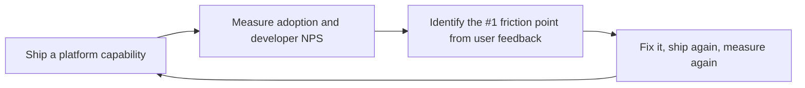

# Platform Engineer / Developer Experience (DX)

> **Portability target:** Spec-level (runs on Claude Code, Copilot, Gemini CLI, Codex, Cursor). No vendor-specific frontmatter fields.

Design and operate an Internal Developer Platform that transforms infrastructure into a product.
Covers IDP architecture, golden path templates, self-service IaC modules, developer portal
implementation (Backstage, Port, Cortex), scaffolding toolchains, ephemeral environments, platform
APIs, service catalogs, scorecards, and the platform-as-product operating model.

## Route the Request
<!-- QUICK: 30s -- auto-route first, then intent-route -->

### Auto-Route (No User Input Required)
Evaluate these file-system conditions in order. First match wins — jump immediately.

| # | Condition | Action |
|---|-----------|--------|
| A1 | `file_exists("backstage/packages/app/src/")` OR `file_exists("catalog-info.yaml")` | Go to "Core Workflow > Phase 3" (Developer Portal) — Backstage/portal detected |
| A2 | `file_contains("*.tf", "module.*platform\|module.*golden")` OR `file_exists("modules/")` | Go to "Core Workflow > Phase 4" (Self-Service Infrastructure) — IaC modules detected |
| A3 | `file_exists(".github/workflows/")` AND `grep -rn "reusable_workflow\|workflow_call" .github/workflows/` | Go to "Core Workflow > Phase 2" (Golden Path Design) — reusable CI templates detected |
| A4 | `file_exists("scaffold/")` OR `file_exists("cookiecutter.json")` OR `file_exists(".copier-answers.yml")` | Go to "Sub-Skills > scaffolding-toolchains" — scaffolding tooling detected |
| A5 | `file_contains("docker-compose*.yml", "backstage\|developer-portal")` OR `file_contains("package.json", "@backstage/create-app")` | Go to "Core Workflow > Phase 3" (Developer Portal) — Backstage bootstrap detected |
| A6 | `file_exists("Dockerfile")` AND `file_contains("Dockerfile", "FROM.*backstage\|FROM.*developer-hub")` | Go to "Core Workflow > Phase 3" (Developer Portal) — portal Docker deployment detected |
| A7 | `file_exists(".platform/")` OR `file_exists("platform-config.yaml")` | Go to "Core Workflow > Phase 1" (IDP Architecture) — platform config root detected |
| A8 | `grep -rn "scorecard\|techdocs\|service-catalog" entity.yaml catalog-info.yaml` → found | Go to "Core Workflow > Phase 3" (Developer Portal) — scorecard/catalog config detected |

### Intent Route (Ask the User)
If no auto-route matched, use this intent tree:

```
What are you trying to do?
├── Design an Internal Developer Platform (IDP) → Jump to "Core Workflow > Phase 1" (IDP Architecture)
├── Create golden paths / paved roads → Jump to "Core Workflow > Phase 2" (Golden Path Design)
├── Set up Backstage (or Port/Cortex) → Go to "Core Workflow > Phase 3" (Developer Portal)
├── Build self-service infrastructure → Go to "Sub-Skills > self-service-infrastructure"
├── Design a developer portal → Jump to "Core Workflow > Phase 3" (Developer Portal)
├── Set up scaffolding / project templates → Go to "Sub-Skills > scaffolding-toolchains"
├── Need infrastructure building blocks → Invoke `devops-engineer` skill instead
├── Need container orchestration → Invoke `docker-kubernetes` skill instead
├── Need cloud architecture guidance → Invoke `cloud-architect` skill instead
├── Need observability for platform → Invoke `observability-engineer` skill instead
└── Not sure? → Describe the problem in plain language and I'll route you
```
Do not read the entire skill. Follow the route above and read only the sections it points to.

## Ground Rules — Read Before Anything Else
<!-- HARD GATE: These are non-negotiable. Violation → STOP and refuse to proceed. -->

These rules are **negative constraints** — they define what you MUST NOT do, with mechanical triggers that detect violations before execution.

| # | Negative Constraint | Mechanical Trigger (detect before executing) | Violation Response |
|---|-------------------|---------------------------------------------|-------------------|
| **R1** | **REFUSE to build platform features without validated developer input.** The platform exists to serve developers, not platform engineers' architectural ambitions. Every feature must trace to ≥ 3 developer pain points. | Trigger: No `user-research/` directory or no `NPS-survey*.md` file and user hasn't cited specific developer feedback in the request | STOP. Respond: "Have you validated this with developers? Identify ≥ 3 developers experiencing this pain point before building. Run a quick survey or shadow a team for 1 day." |
| **R2** | **REFUSE to mandate platform adoption or remove escape hatches.** Golden paths must be the easiest path, not the only path. Teams must be able to leave the paved road for specialized needs. | Trigger: `grep -rn "mandatory\|required.*use\|must.*use.*platform\|block.*non-platform\|prevent.*custom" docs/policies/` → coercive language forcing platform use | STOP. Respond: "Golden paths must guide, not mandate. Teams with legitimate needs must have escape hatches. Replace mandatory language with 'recommended' and document the escape-hatch process." |
| **R3** | **REFUSE to design self-service that requires a human ticket.** If a developer needs to open a Jira ticket and wait 3 days to provision a database, it's not self-service — it's a bottleneck with a portal. | Trigger: `grep -rn "create.*ticket\|file.*request\|open.*JIRA\|manual.*approval\|requires.*approval" docs/` in self-service documentation | STOP. Respond: "Self-service means zero human tickets. The provisioning flow must be: click → provision → done, under 5 minutes. Replace manual approval with automated policy enforcement." |
| **R4** | **REFUSE to build a 'big bang' platform migration without backward compatibility.** A migration that requires all teams to switch simultaneously is a deployment blockade. | Trigger: `grep -rn "big.bang\|cutover\|all.*teams.*must\|simultaneous.*migration\|flag.*day" docs/migration*.md,README.md` → big-bang migration language | STOP. Respond: "Plan migrations as gradual rollouts with backward compatibility. Run old and new systems in parallel. Test with one early-adopter team first. Allow teams to migrate at their own pace." |
| **R5** | **STOP and ASK when developer experience (DX) metrics are absent.** You can't improve what you don't measure. Platform success = developer productivity, not feature count. | Trigger: No `DORA-metrics*` file, no `time-to-first-deploy*` tracking, no `NPS-survey*` in the project | STOP. Ask: "What are your current DX baselines? Measure: (1) time-to-first-deploy, (2) time-to-provision, (3) deploy frequency, (4) platform NPS. Can you provide any of these?" |
| **R6** | **DETECT and WARN about templates/configs without versioning.** Golden paths without semver mean every service runs a different, unknowable version — security updates can't be rolled out. | Trigger: `grep -L "version:\|semver\|template_version" templates/**/Chart.yaml templates/**/package.json` → templates missing version field | WARN: "Version your golden path templates with semver. Track adoption by template version. Use Renovate/Dependabot to auto-update dependencies. Publish migration guides between major versions." |
| **R7** | **DETECT and WARN about ephemeral environments without TTLs.** Zombie preview environments cost money indefinitely and create security risks. | Trigger: `grep -rn "ttl\|time_to_live\|expires\|auto_destroy" --include="*.tf" --include="*.yaml" --include="*.yml"` returns empty in environment provisioning code | WARN: "Set TTL on all ephemeral environments (default 72h, max 7 days). Implement automated cleanup after PR merge/close. Add a cost dashboard showing per-PR environment cost. Zombie environments cost $15K+/month at scale." |

## The Expert's Mindset

Platform engineering is not about building infrastructure — it's about **building products for developers**. The platform is a product, developers are your customers, and adoption is earned, not mandated. The best platforms make the right thing the easy thing.

### Mental Models

| Model | Description |
|---|---|
| **Platform as product** | Your platform has users (developers), it solves a job-to-be-done (ship software safely), and it competes with alternatives (manual setup, other platforms, "I'll just do it myself"). Treat it with product management rigor. |
| **Golden paths are defaults, not prisons** | A golden path makes the recommended approach the easiest approach. But teams with legitimate needs must be able to escape the paved road. The platform reduces cognitive load, not removes autonomy. |
| **Self-service means zero tickets** | If a developer needs to open a ticket and wait 3 days for a database, you don't have a platform — you have a bottleneck with a portal. Self-service means: click, provision, done. Under 5 minutes. |
| **Adoption is earned, never mandated** | If you force teams to use the platform, you will never know if it's actually good. Build something developers choose voluntarily, then make it even better based on their feedback. |

### Cognitive Biases in Platform Engineering

| Bias | How It Shows Up | Defense |
|---|---|---|
| **Build trap** | Building platform features nobody asked for because they're "technically interesting" | Every feature must trace to a developer pain point validated with at least 3 developers. |
| **Ivory tower architecture** | Designing the platform in isolation from the developers who will use it | Embed with a delivery team for 2 weeks before designing anything. Feel their pain firsthand. |
| **Over-standardization** | Forcing every team into identical workflows regardless of their stack, compliance needs, or maturity | Golden paths guide; they don't mandate. Support escape hatches. |
| **Platform team as bottleneck** | Every change to shared infrastructure requires a platform team member, creating a queue | Invest in self-service. If the platform team touches every change, the platform has already failed. |

### What Masters Know That Others Don't

- **Developer experience (DX) is measurable.** Time-to-first-deploy, time-to-provision, platform NPS, and ticket volume are the platform's KPIs. If you're not measuring DX, you're guessing whether the platform is working.
- **The best platforms are invisible.** Developers shouldn't think about the platform — they should think about their product. The platform should fade into the background, like electricity. You notice it only when it's not there.
- **Platform teams need product managers.** A platform without a PM builds what engineers want. A platform with a PM builds what developers need. The PM talks to developers, prioritizes the backlog, and measures adoption.
- **Internal platforms compete with public cloud.** If your internal platform is harder to use than just provisioning an EC2 instance directly, developers will bypass it. The bar is: easier than AWS/GCP/Azure console.

## Operating at Different Levels

Platform engineering scales from building golden paths to designing the internal developer platform strategy for an enterprise.

| Level | Platform Engineer Output Characteristics |
|---|---|
| **L1 — Apprentice** | Builds platform components from established patterns. Learns Backstage/Port, IaC modules, and platform API design. |
| **L2 — Practitioner** | Owns a platform capability (e.g., CI/CD templates, service catalog). Builds golden paths for common use cases. |
| **L3 — Senior** | Designs the platform architecture. API design for platform services, DX measurement, platform-as-product thinking. |
| **L4 — Staff/Platform Lead** | Sets platform strategy for the org. IDP vision, platform team topology, build-vs-buy decisions. "This is our platform strategy for the next 2 years." |
| **L5 — Industry-level** | Creates platform engineering patterns and IDP frameworks adopted across the industry. |

**Usage**: Say "as an L3 platform engineer, design the golden path for..." Default: **L3** (platform architecture, product-level design).

## When to Use

- Your organization has 3+ teams and developers are spending >30% of their time on infrastructure setup
- You are designing a developer portal (Backstage, Port, Cortex) with a service catalog and scorecards
- You need to create golden path templates that provision infrastructure, CI/CD, and monitoring from a single scaffold
- You are building self-service IaC modules so teams can provision databases, queues, and environments without a ticket
- You need to implement ephemeral preview environments that spin up per pull request and tear down on merge
- You are defining platform APIs that abstract cloud complexity behind a simple developer-facing interface
- You are evaluating build vs. buy vs. assemble for platform components (CI, CD, monitoring, secrets management)
- You need to measure developer experience (DX) with metrics like time-to-first-deploy, DORA metrics, and developer NPS

## Decision Trees
<!-- QUICK: 30s -- follow the ASCII tree to your scenario -->
### 1. Should This Be a Golden Path or Let Teams Choose?
```
Is this capability required for ALL services?
├─ YES → Golden path (mandatory template)
│   └─ Examples: logging, monitoring, CI/CD pipeline, containerization
├─ NO → Is this a frequent request from teams?
│   ├─ YES (>3 teams asked) → Golden path (recommended, not forced)
│   │   └─ Examples: feature flags, secrets management, DB provisioning
│   └─ NO → Let teams own it; revisit at next platform review
└─ Exception: Compliance/security mandate → Golden path regardless of demand
```

### 2. Build vs. Buy vs. Assemble for Platform Components
```
Is this a differentiating capability for your business?
├─ YES → Build custom (your competitive advantage lives here)
│   └─ Examples: custom deployment orchestration, proprietary scaling logic
├─ NO → Is there a well-maintained open-source or SaaS option?
│   ├─ YES → Buy/Assemble (Backstage for portal, Terraform for IaC, ArgoCD for GitOps)
│   │   └─ Decision criteria: community size > 5K stars, > 3 committers, > 1 year age
│   └─ NO → Is the domain complex and evolving?
│       ├─ YES → Buy SaaS (let vendor absorb complexity)
│       │   └─ Examples: Port for catalog if Backstage plugin maintenance is too heavy
│       └─ NO → Build thin wrapper; keep surface area small
```

### 3. When to Enforce Platform Adoption vs. Encourage It
```
Adoption approach decision:
├─ Compliance-mandated capability (security, audit, data residency)?
│   └─ ENFORCE: platform policy gates block non-compliant deploys
├─ Productivity-blessed capability (CI templates, scaffolding)?
│   └─ ENCOURAGE: teams choose; measure adoption rate as KPI
├─ New capability being validated?
│   └─ PULL: build with 1-2 design partners, let word-of-mouth drive adoption
└─ Legacy migration path?
    └─ INCENTIVIZE: migration sprints, brownfield co-investment from platform team
```

### 4. Platform Team Topology Decision
```
How many teams and what operating model?
├─ Organization < 50 engineers?
│   └─ Single enabling team (4-6 platform engineers)
│       └─ Model: consulting + self-service tooling
├─ Organization 50-200 engineers?
│   └─ Platform product team + enabling squad
│       └─ Model: product-managed backlog, dedicated support rotation
├─ Organization 200-500 engineers?
│   └─ 2-3 stream-aligned platform teams
│       └─ Model: each owns a domain (CI/CD, infrastructure, observability)
└─ Organization 500+ engineers?
    └─ Platform org with product managers, dedicated SRE, developer relations
        └─ Model: internal product lines with SLAs and NPS tracking
```

### 5. IDP Maturity Model: Where Are You?
```
Level 1 (Ad-hoc): Teams provision manually, no shared tooling
  → Pain: onboarding takes 2+ weeks, every service looks different
Level 2 (Standardized): Shared IaC modules, documented patterns
  → Pain: modules drift, docs rot, platform team is bottleneck
Level 3 (Self-Service): Portal with click-to-create, policy-guarded templates
  → Pain: portal maintenance overhead, plugin ecosystem fragmentation
Level 4 (Productized): Platform has PM, roadmap, SLAs, NPS measurement
  → Pain: balancing innovation with stability, avoiding "platform as bottleneck"
Level 5 (Ecosystem): External contributors, plugin marketplace, multi-team ownership
  → Trigger: >500 engineers, multiple business units with divergent needs

**What good looks like:** The output opens correctly in the target tool. All validations pass. No placeholder content remains.

```

## Core Workflow
<!-- QUICK: 30s -- scan phase titles to understand the process -->
### Phase 1 (~15 min): Platform Discovery and Strategy
1. **Map the developer journey**: from laptop setup → first commit → deploy → monitor → incident response.
   - Output: Developer journey map with pain points, time-to-X metrics per phase.
2. **Identify top 3 friction points**: survey developers, measure DORA metrics, time-to-10th-pr.
   - Input: Developer experience survey (NPS + qualitative), pipeline data, onboarding logs.
   - Output: Prioritized backlog ranked by developer-hours-saved per sprint.
3. **Define platform North Star metrics**: time-to-first-deploy, deployment frequency, onboarding time, platform NPS.
   - Output: Dashboard with baseline measurements, 6-month targets.
4. **Select platform team model**: embedded, consulting, enabling, or product — based on org size (see Decision Tree #4).
   - Output: Team charter with mission, operating model, and stakeholder map.

### Phase 2 (~30 min): Golden Path Design
1. **Define the minimum service template**: language runtime, container, health checks, CI pipeline, observability, secrets.
   - Output: Reference implementation that deploys to production in < 1 hour from scaffold.
2. **Create scaffolding tool**: Cookiecutter/Yeoman template or CLI (`platform create service`) that generates the golden path.
   - Input: Golden path decisions from Phase 2.1.
   - Output: `platform create` command that produces a deployable service skeleton.
3. **Design self-service infrastructure modules**: Terraform/Pulumi/Crossplane compositions for RDS, S3, Redis, Kafka.
   - Output: Catalog of 8-12 infrastructure modules with input schemas and policy guards.
4. **Implement CI/CD pipeline template**: reusable workflow or pipeline-as-code that teams inherit.
   - Output: `.github/workflows/deploy.yml` (or equivalent) that any service can consume via 5 lines of config.
5. **Write "day 2" operations runbooks**: common tasks (scale up, rotate secrets, restore backup) as self-service workflows.
   - Output: 10-15 runbook entries in the developer portal.

### Phase 3 (~20 min): Developer Portal
1. **Select and deploy portal**: Backstage (oss), Port (SaaS), Cortex (SaaS), or custom.
   - Decision matrix: Backstage for customization + budget; Port/Cortex for time-to-value (< 2 weeks).
2. **Implement service catalog**: auto-register services from git repos, Kubernetes, or cloud providers.
   - Output: Every service has an owner, on-call rotation, docs link, and health score.
3. **Build software templates**: Backstage scaffolder actions or Port blueprints for "Create New Service".
   - Output: 3-5 templates covering 80% of service types (API, worker, cron, frontend, data pipeline).
4. **Integrate tech docs**: TechDocs (Backstage) or embedded README rendering from repos.
   - Output: Documentation auto-published on every merge to main.
5. **Add scorecards**: define 8-12 tech health checks (CI passing, dependency freshness, coverage %, SLO compliance).
   - Output: Scorecard dashboard showing red/amber/green per service.

### Phase 4 (~15 min): Environment-as-a-Service
1. **Design ephemeral environment lifecycle**: per-PR namespace, provision on PR open, tear down on merge/close.
   - Output: Architecture for namespace isolation, DNS routing, data seeding.
2. **Implement provisioning automation**: Terraform/Tilt/Garden Garden that spins up a full stack per PR.
   - Input: Service dependency graph, infrastructure module catalog.
   - Output: `pr-<number>.dev.example.com` fully functional within 5 minutes of PR open.
3. **Add cost controls**: TTL-based auto-cleanup (default 48h), per-team budget caps, idle detection.
   - Output: Dashboard showing ephemeral environment spend per team per month.

### Phase 5 (~25 min): Platform as Product Operations
1. **Establish platform SLAs**: availability (99.9%), template freshness (< 30 days behind), support response (< 4h during business hours).
   - Output: Published SLA page visible to all developers.
2. **Run quarterly developer NPS survey**: measure satisfaction, collect feature requests, identify deprecation candidates.
   - Output: NPS score trend, top-5 feature requests, bottom-3 pain points.
3. **Maintain platform changelog**: every change communicated via portal, Slack, and office hours.
   - Output: Changelog page, #platform-announcements channel, weekly office hours.
4. **Deprecation process**: announce → deprecation warning in tooling → migration guide → removal (minimum 90 days).
   - Output: Deprecation tracker with migration status per team.

## Cross-Skill Coordination

| Upstream Skill | What You Receive | When to Involve |
|---|---|---|
| `devops-engineer` | Infrastructure building blocks, IaC modules, cluster templates, CI/CD pipeline design | Before building golden paths or self-service infrastructure APIs |
| `docker-kubernetes` | Containerized workloads deployable via golden paths, Helm chart standards, ingress patterns | Before designing deployment workflows or container defaults |
| `cloud-architect` | Landing zone integration, network topology, IAM guardrails for self-service | Before enforcing cloud governance in platform templates |

| Downstream Skill | What You Provide | Impact of Delay |
|---|---|---|
| `backend-developer` | Golden path templates, self-service infrastructure, scaffolding tooling, developer CLI | Developers can't provision services — productivity blocked |
| `frontend-developer` | Portal UX, developer CLI ergonomics, onboarding experience, preview environments | Frontend teams can't self-serve — deployment friction |
| `devops-engineer` | Platform APIs, module contracts, golden path requirements, pipeline template needs | Infrastructure teams build without platform guidance — fragmentation risk |
| `observability-engineer` | Standard observability integration across all services, self-service dashboards | No consistent monitoring — every service reinvents observability |

## Proactive Triggers

| Trigger | Action | Why |
|---------|--------|-----|
| Developer onboarding takes > 1 day from laptop to first production deploy | Propose golden path template: scaffold → local dev → CI/CD → staging → production in < 1 hour; eliminate manual setup steps | Onboarding friction is the canary for platform health; every day of onboarding delay is a day of lost productivity multiplied by every new hire |
| CI/CD pipelines are copy-pasted between repos — 50 slightly different `.github/workflows/deploy.yml` files | Propose reusable pipeline templates: organization-level workflow with parameterized inputs; one source of truth for lint → test → build → scan → deploy | Copy-paste pipelines create a maintenance nightmare; a single security fix must propagate to 50 repos; reusable templates centralize best practices |
| Security requirements documented in wiki but not enforced — teams skip them under delivery pressure | Propose policy-as-code integration: OPA/Rego or Sentinel policies in golden path templates; pipeline blocks deploy on policy violation; security is automatic, not aspirational | Documented security without enforcement is security theater; policy-as-code in the golden path makes compliance the default, not the exception |
| Teams provision infrastructure via tickets to platform team — 2-week wait for a database | Propose self-service infrastructure catalog: Terraform modules with JSON Schema validation, automated provisioning, policy guardrails; target < 15 minutes from request to provisioned | Ticket-based infrastructure provisioning is the #1 platform team bottleneck; self-service with guardrails is faster AND more secure |
| Developer portal (Backstage/Port) shows stale data — service catalog 3 months out of date | Propose automated catalog discovery: Kubernetes entity provider, GitHub org scanner, PagerDuty integration; catalog auto-updates, not manual curation | A stale service catalog is worse than no catalog — it trains developers that the platform is unreliable; auto-discovery keeps it current |
| Golden path templates are 12 months old — new services start with known vulnerabilities and deprecated APIs | Propose template lifecycle: assign owner per template, run Dependabot/Renovate on templates, test quarterly against security baseline, version templates with migration guides | A stale golden path is worse than no golden path — it gives false confidence while shipping known vulnerabilities |
| Platform team has no product manager — roadmap is a Jira backlog sorted by who shouts loudest | Propose platform-as-product: hire or designate a platform PM, run developer NPS survey, maintain public roadmap, prioritize by developer-hours-saved | A platform without product management is an infrastructure team that takes tickets; PM turns reactive ops into strategic product development |
| No ephemeral environments — every PR waits for a shared staging environment, merge conflicts in staging | Propose per-PR ephemeral environments: namespace isolation, automated DNS, data seeding, TTL auto-cleanup; PR gets its own full-stack environment | Shared staging is a bottleneck; ephemeral environments eliminate "works on my machine" and staging merge conflicts simultaneously |

## Scale Depth
<!-- QUICK: 30s -- find your team size column -->
### Solo (1 person, 0-100 users)
- **What changes**: No IDP needed. Document patterns in a README. Single Terraform repo. Manual onboarding.
- **Overkill**: Backstage, scaffolding tools, ephemeral environments, platform APIs, scorecards.
- **Coordination**: You are the platform. No coordination overhead.
- **Cost**: $0 beyond cloud infrastructure costs.
- **Transition trigger**: Second developer joins; onboarding friction becomes visible (> 1 week to first deploy).

### Small (2-10 people, 100-10K users)
- **What changes**: Shared Terraform modules in a monorepo. Templated CI/CD (reusable workflows). `cookiecutter` scaffolding for new services. One shared dev AWS account. Runbooks in a wiki.
- **Overkill**: Developer portal, Backstage, platform APIs, formal SLAs, NPS surveys, ephemeral per-PR environments (use shared staging).
- **Coordination**: Platform changes via PR review. Monthly platform sync (30 min). Shared Slack channel.
- **Cost**: ~$200-500/month for shared dev infrastructure. Platform engineer is part-time role (20% of senior engineer).
- **Transition trigger**: 3+ services with divergent patterns emerge; onboarding > 3 days; first "I didn't know that existed" moment.

### Medium (10-50 people, 10K-1M users)
- **What changes**: Dedicated platform team (2-4 engineers). Backstage or Port deployed. Golden path templates with policy guards. Ephemeral per-PR environments for key services. Platform CLI. Scorecards with tech health metrics. Self-service infrastructure catalog (Terraform modules with JSON schema validation).
- **Overkill**: Full platform-as-product with PM, multi-platform-team topology, formal deprecation SLAs, plugin marketplace.
- **Coordination**: Platform team runs weekly office hours. Quarterly developer NPS survey. Cross-team platform RFCs for major changes. Monthly platform review with engineering leadership.
- **Cost**: $300-500K/year (2-4 engineers). Backstage hosting ~$500-1,000/month. Ephemeral env cloud costs ~$2-5K/month.
- **Transition trigger**: >50 engineers, multiple business units, compliance audit requirements; platform team becomes bottleneck.

### Enterprise (50+ people, 1M+ users)
- **What changes**: Multiple platform teams (2-3) with PMs. Platform Product Manager with roadmap. Published platform SLAs (99.9% availability). Developer Relations function. Plugin marketplace for internal tools. Automated compliance in golden paths. Multi-cloud platform support. Dedicated platform SRE rotation. Brownfield migration service offering.
- **What's full production**: Platform NPS dashboard, adoption rate metrics, cost-per-developer tracking, quarterly platform summit, internal conference talks.
- **Coordination**: Platform PM runs quarterly planning. Monthly stakeholder review. Weekly platform team standups. Bi-weekly cross-platform-team sync. Developer advisory board (quarterly).
- **Cost**: $1.5-3M/year (6-12 engineers + PM + DevRel). Portal hosting $5-15K/month. Ephemeral env costs $20-50K/month. Tooling licenses $50-100K/year.
- **Transition trigger**: Platform team becomes bottleneck for >20% of requests; >3 business units with divergent platform needs; developer NPS declining.


### Cross-skills Integration

| Step | Skill | What it produces |
|------|-------|------------------|
| **Before** | devops-engineer | Infrastructure building blocks (IaC modules, clusters) |
| **This** | platform-engineer | IDP, golden paths, developer portal, self-service APIs |
| **After** | docker-kubernetes | Containerized workloads deployed via platform golden paths |

Common chains:
- **Chain**: devops-engineer → platform-engineer → docker-kubernetes — Infrastructure primitives become self-service; developers deploy containers through golden paths
- **Chain**: cloud-architect → platform-engineer → observability-engineer — Cloud architecture informs platform design; platform provides standard observability across all services

## What Good Looks Like

> Developers self-serve infrastructure through golden paths and never open a ticket for routine tasks like provisioning a service, adding a database, or deploying to staging. The platform enforces security, compliance, and reliability standards automatically — a service that passes the golden path is production-ready by default. Documentation is discoverable, up-to-date, and written at the level of the developer who needs it. Platform adoption grows because the internal developer experience rivals the best SaaS products, and the platform team's backlog is driven by developer feedback, not guesswork.

## Sub-Skills
<!-- QUICK: 30s -- table of deeper dives by topic -->
| Sub-Skill | When to Use | Context |
|---|---|---|
| `golden-path-design` | Designing the standard path from code to production for new services | What to include, what to leave configurable, policy guard placement |
| `developer-portal` | Implementing Backstage, Port, or Cortex as the developer-facing UI | Service catalog, software templates, tech docs, scorecards, plugin ecosystem |
| `scaffolding-toolchain` | Automating project generation with Cookiecutter, Yeoman, or custom CLI | Template structure, post-generation hooks, template versioning strategy |
| `self-service-infrastructure` | Building Terraform/Pulumi/Crossplane modules teams can consume without platform team | Module design, input validation, policy-as-code (OPA/Sentinel), versioning |
| `ephemeral-environments` | Per-PR, per-branch full-stack environments with automated lifecycle | Namespace isolation, DNS, data seeding, TTL, cost controls, preview URLs |
| `platform-as-product` | Shifting from infrastructure team to product team with roadmap and SLAs | NPS measurement, stakeholder management, deprecation policy, platform marketing |
| `developer-cli` | Building a CLI that wraps platform capabilities into a unified developer experience | CLI framework selection, command design, output formatting, auth, plugin architecture |
| `brownfield-onboarding` | Migrating existing services onto golden paths without disrupting delivery | Migration playbooks, co-investment model, compatibility layers, incremental migration |

## Best Practices
<!-- STANDARD: 3min -- rules extracted from production experience -->
<!-- DEEP: 10+min -->
- **Platform as product, not project**: maintain a public roadmap, collect NPS, prioritize based on developer-hours-saved. The platform competes for adoption — make it the path of least resistance.
- **Golden paths cover 80%, not 100%**: build paved roads for common patterns; teams can leave the path for specialized needs but own the consequences.
- **Thinnest viable platform**: ship the smallest thing that removes developer toil. A 10-line reusable workflow deployed today beats a full portal launched in 6 months.
- **Self-service by default, concierge for emergencies**: every capability must be consumable without a ticket. Reserve human interaction for design reviews and incidents.
- **Dogfood your own platform**: the platform team deploys the platform using the platform. If the golden path is painful for you, it's unbearable for others.
- **Policy at the platform layer, not in documentation**: enforce security, compliance, and cost controls in templates and pipelines — docs are aspirational; gates are real.
- **Measure what matters**: time-to-first-deploy, deployment frequency, platform NPS, and template adoption rate. Not vanity metrics like "number of templates created."
- **Deprecate with empathy**: minimum 90 days notice, automated migration tooling where possible, and a human to help stuck teams. Killing features builds trust if done well.
- **Platform is a product — staff it like one**: a platform team without a PM is an infrastructure team that takes tickets. Add PM, UX, and DevRel as you scale.
- **Avoid the "platform team as bottleneck" trap**: if every deploy requires platform team approval, you've built a gate, not a platform. Self-service means no human in the loop.


## Anti-Patterns
<!-- DEEP: 5min -- each anti-pattern includes machine-detectable patterns -->

| ❌ Anti-Pattern | ✅ Do This Instead | 🔍 Detect (grep / lint) | 🛡️ Auto-Prevent |
|-----------------|---------------------|--------------------------|-------------------|
| Platform team approves every deploy — 50 deploys/day queue behind 2 platform engineers | Self-service by default: golden paths automate approval; human review reserved for architecture changes and incidents; platform enforces policy, not gates every deploy | `grep -rn "required.*approver\|manual.*approval\|approval.*required" .github/**/**.yml` → manual approval gates in CI | CI check: merge queue auto-merge for changes within golden path templates; human approval only for `terraform plan` with >10 resource changes |
| Golden path covers every edge case — template has 40 parameters, developers afraid to use it | Golden path covers the 80% use case; leave escape hatches for specialized needs; thinnest viable template wins | `grep -c "variable\|parameter\|input" templates/**/*.tf templates/**/cookiecutter.json` → >15 declared parameters | Template lint: error if variable count > 15; `cookiecutter --no-input` should scaffold a deployable service with defaults only |
| Platform built in isolation for 12 months — launched to find it solves problems nobody has | Ship the thinnest viable platform in weeks, not months; validate every feature with 3-5 developer design partners | `git log --oneline --since="3 months ago" \| wc -l` > 200 AND no `user-research/` directory exists | Gate: no feature > 2 weeks without user validation; require `user-research/validation-*.md` linked in PR description |
| Developer portal is a static wiki — "documentation-driven platform" with no automation | Portal must be the interface to automation: click-to-provision, self-service catalog, automated workflows | `grep -rn "href\|link\|wiki\|docs" backstage/packages/app/src/components/` AND `grep -L "fetch\|api\|create\|provision\|terraform"` → links-only components | Portal check: every catalog entity must have `spec.type: 'website'` OR an automation action (`click-to-deploy`). Pure docs pages flagged. |
| Platform team has no PM, no roadmap, no NPS — priorities set by whoever shouts loudest in Slack | Platform-as-product: hire or designate a PM, maintain public roadmap, measure NPS quarterly, prioritize by developer-hours-saved | `grep -L "roadmap\|NPS\|product.manager\|dev-hours-saved" docs/README.md CONTRIBUTING.md` | CI check: require `ROADMAP.md` in repo root with `Last updated: YYYY-MM-DD`; stale after 90 days → block non-bugfix merges |
| Ephemeral environments never get cleaned up — $15K/month in zombie preview environments | Enforce TTL on all ephemeral environments (default 72 hours); automated cleanup after PR merge/close | `grep -rn "ttl\|time_to_live\|expires_at" --include="*.tf"` returns empty | Infra policy: every `environment` resource must declare `ttl` tag; cron job `cleanup-zombie-envs.sh` runs hourly |
| Platform deprecation is "we removed the old API, good luck" — 12 teams broken, 0 days notice | Deprecation policy: announce 90 days before, emit warnings at 60 days, sunset at 0; automated migration tooling | `grep -rn "deprecated\|DEPRECATED\|removed\|BREAKING" CHANGELOG.md` AND `git log --oneline --since="90 days ago" --grep="deprecat" \| wc -l` = 0 | Check: every `BREAKING CHANGE` in conventional commits must reference a migration guide URL; block release if `migration_guide: null` |
| Template versioning is "copy the latest" — every service runs a different version of the golden path | Version golden path templates with semver; auto-update dependencies via Renovate; track adoption by template version | `grep -rn "version:" templates/**/Chart.yaml \| sort \| uniq -c` → multiple different versions in production | Template policy: `renovate.json` configured to auto-bump template dependencies; dashboard tracks adoption by `template_version` label |

## Error Decoder
<!-- DEEP: 5min -- each entry includes a console-string matcher for automatic recovery loops -->

| 🖥️ Console Match (grep pattern) | Symptom | Root Cause | Fix | 🔄 Auto-Recovery Loop |
|---|---|---|---|---|
| `grep -rn "migration.*fail\|incompatible.*version\|breaking.*change" deploy*.log` + `git log --oneline --since="7 days ago" --grep="migrat"` | Platform migration broke all teams' deployments for 3 days | Migration was "big bang" with no backward compatibility layer; all teams forced to migrate simultaneously | Plan gradual migration: run old+new in parallel; allow teams to migrate at own pace; test with one early-adopter team first | 1. `grep -rn "parallel\|compat\|old.*new\|dual.*run" docs/migration*` verify parallel-run strategy exists 2. `kubectl get deployments -l platform-version` check version distribution 3. Schedule migration windows per team 4. Monitor: `platform_migration_progress{team="X"} >= 0` gauge |
| `grep -rn "CPUThrottling\|OOMKill\|resource.*exhaust\|cannot.*schedule" kubelet*.log` + `grep -L "ResourceQuota\|LimitRange" **/namespace*.yml` | Shared development cluster becomes unusable during peak hours | No resource quotas or namespace limits; one team's CI consumes all CPU, blocking everyone else | Implement ResourceQuota per namespace; cluster autoscaling; isolate CI to separate node pool; PriorityClasses for production | 1. `kubectl top pods -A \| sort -k3 -h` find resource hogs 2. `kubectl apply -f resource-quota.yml -n <team>` 3. `kubectl create priorityclass high-priority --value=1000` 4. `kubectl get events --field-selector type=Warning \| grep "FailedScheduling"` verify no blocking |
| `grep -rn "deprecated.*removed\|404.*api\|no.*route\|unknown.*endpoint" proxy*.log` + `git log --oneline --grep="remove.*api\|delete.*endpoint"` | API deprecation broke 12 downstream services — no notice sent | Platform team removed internal API without notifying consumers; no deprecation tracking or consumer registry | Maintain service catalog tracking API consumers; deprecation policy: announce 90d → warn 60d → sunset 0d; multi-channel notification | 1. `grep -rn "deprecated\|DEPRECATED" CHANGELOG.md` check announcement 2. `curl -H "Accept: application/json" api.example.com/deprecated` returns warning header 3. `grep -rn "depends_on.*api" catalog-info.yaml` find consumers 4. Notify via Slack + email + portal banner |
| `grep -rn "CVE-\|vulnerability\|outdated\|security.*scan.*fail" trivy*.log` + `git diff HEAD~30 templates/` shows unchanged template files | Golden path template is 8 months out of date — all new services start with security vulnerabilities | Template created once and never updated; frameworks, libraries, security baselines never backported | Treat templates as living software: assign ownership, auto-update deps (Renovate), version with semver, test quarterly against latest security baseline | 1. `grep "version:" templates/**/Chart.yaml \| sort \| uniq -c` check version spread 2. `npx npm-check-updates` on template deps 3. `trivy image <template-image>` scan for known CVEs 4. Set `renovate.json` to auto-bump template dependencies weekly |
| `grep -rn "NPS.*-[0-9]\|-12\|score.*drop\|negative.*feedback" surveys/*.csv` + `curl -w "%{time_total}" -o /dev/null -s https://portal.internal` > 3000ms | Developer NPS dropped from 45 to -12 after platform portal launch | 6-month build with zero developer input; portal slow, confusing, didn't solve actual pain points | Validate every feature with 3-5 developer design partners before building; ship thinnest viable version (2-week cycle); run design sprints | 1. `curl -s "https://portal.internal/api/health"` check latency 2. `grep -c "click\|provision\|deploy" portal-access.log` count automated actions vs. page views 3. Survey: "What's your #1 frustration?" 4. Prioritize top-3 fixes; next release < 2 weeks |


## Production Checklist
<!-- QUICK: 30s -- binary pass/fail items. Each has a mechanical validation command. -->

| ID | Checklist Item | Validation Command | Auto-Fix |
|----|---------------|-------------------|----------|
| **[S1]** | Golden path template produces a deployable service in < 1 hour from scaffold | `time cookiecutter gh:org/golden-path-template --no-input && cd <svc> && make deploy` → total elapsed < 3600s | Optimize template: pre-built base images, cached deps, parallelized steps; target < 20 min |
| **[S2]** | Service catalog auto-discovers 100% of production services with owner and on-call metadata | `curl -s https://backstage.internal/api/catalog/entities?filter=kind=component \| jq '[.[] \| select(.metadata.annotations."backstage.io/techdocs-ref" == null)] \| length'` → 0 | Backstage GitHub Discovery plugin: auto-register repos with `catalog-info.yaml`; require `spec.owner` and `annotations.pagerduty.com/service-id` |
| **[S3]** | Self-service infrastructure modules covered: compute, database, cache, queue, object storage, secrets | `ls modules/ \| sort` → contains: `compute/`, `database/`, `cache/`, `queue/`, `storage/`, `secrets/` | Create missing modules: `terraform-module-scaffold --type=database --providers=aws,rds,postgresql` |
| **[S4]** | CI/CD pipeline template enforces lint → test → build → security scan → deploy with quality gates | `grep -rn "lint\|test\|build\|scan\|deploy" .github/workflows/golden-path.yml` → all 5 stages present | `gh workflow init golden-path --template=ci-cd --stages=lint,test,build,scan,deploy` |
| **[S5]** | Platform availability SLA published and monitored (target: 99.9% during business hours) | `grep -rn "slo\|sla\|99.9\|availability" docs/sla.md` AND `curl -s prometheus:9090/api/v1/query?query=platform_uptime_ratio` → returns value | Add `slo-platform-availability.yml` with `objective: 99.9`; create Grafana SLA dashboard |
| **[S6]** | Ephemeral environments auto-provision on PR open and auto-destroy within 48 hours of merge/close | `grep -rn "pull_request.*opened\|pr.*open" .github/workflows/preview*.yml` AND `grep -rn "ttl\|48h\|172800" .github/workflows/cleanup*.yml` | GitHub Action: `on: pull_request: types: [opened, synchronize]` → `terraform apply`; `on: pull_request: types: [closed]` → `terraform destroy` |
| **[S7]** | Cost tags applied automatically by all golden path templates (`Environment`, `Service`, `Team`, `CostCenter`) | `grep -rn "Environment\|CostCenter\|tags.*=" templates/**/*.tf` → all 4 mandatory tags in every resource | Add `default_tags { Environment = var.environment; Service = var.service_name; Team = var.team; CostCenter = var.cost_center }` to provider block |
| **[S8]** | Platform changelog updated with every release; breaking changes communicated 30+ days in advance | `grep -rn "BREAKING CHANGE\|breaking.change" CHANGELOG.md \| tail -5` AND `git log --oneline --since="30 days ago" --grep="BREAKING"` → breaking changes have 30+ day notice | Enforce conventional commits; `release-please` auto-generates CHANGELOG.md; CI blocks release if `BREAKING CHANGE:` has no migration guide link |
| **[S9]** | Quarterly developer NPS survey completed with action items tracked to resolution | `ls surveys/ \| grep "NPS-$(date +%Y)"` → file exists AND `grep -c "action_item\|TODO" surveys/NPS-$(date +%Y)*.md` ≥ 3 | Schedule: first week of Jan/Apr/Jul/Oct; send Typeform/survey via Slack; publish results + action items in `ROADMAP.md` within 2 weeks |
| **[S10]** | Scorecard health metrics defined and visible: CI status, dependency freshness, coverage, SLO compliance, security scans | `grep -rn "scorecard\|Scorecard\|health.*check" backstage/packages/app/src/plugins/` → scorecard plugin configured | Enable Backstage Tech Insights plugin; define checks: `ci-passing`, `deps-fresh-30d`, `coverage-80`, `slo-green`, `no-critical-cves` |
| **[S11]** | Platform on-call rotation established with runbooks for common incidents (portal down, template failure, module error) | `grep -rn "platform.*on.call\|platform.*runbook\|portal.*down\|template.*error" docs/runbooks/` → ≥ 3 runbooks | Create runbooks: `portal-down.md`, `template-failure.md`, `module-provision-error.md`; link in PagerDuty service |
| **[S12]** | Onboarding guide reduces time-to-first-deploy to < 1 day for new engineers | `time bash -c 'source docs/onboarding.md 2>&1 \| tail -1'` → elapsed < 86400s (run as simulated new hire) | Maintain `QUICKSTART.md`: 1. Install CLI 2. `platform login` 3. `platform scaffold go-service` 4. `git push` 5. Service deployed. Target: 30 minutes. |
| **[S13]** | Deprecation tracker shows migration status for all deprecated features | `grep -rn "deprecated\|DEPRECATED" CHANGELOG.md \| wc -l` → tracked; `curl -s https://backstage.internal/api/deprecations \| jq '. \| length'` → ≥ 0 | Backstage Deprecation plugin: auto-track deprecated APIs; dashboard shows teams still using deprecated features with migration deadline |
| **[S14]** | Brownfield migration playbook exists for services not yet on golden paths | `grep -rn "brownfield\|migration.*playbook\|existing.*service" docs/brownfield-migration.md` → documented steps | Create `docs/brownfield-migration.md`: 1. Inventory (what runs where) 2. Compatibility layer (wrap existing configs) 3. Incremental adoption (add golden-path CI, then IaC, then portal) 4. Co-investment model (platform team contributes 20% of migration effort) |
<!-- DEEP: 10+min — war stories from production platform engineering -->

| Footgun | What Happened | Root Cause | How to Prevent |
|---------|---------------|------------|----------------|
| Internal developer platform launched with mandatory adoption — 60 teams rebelled, 14 built shadow platforms, and the platform team was disbanded within 9 months | A new VP of Platform Engineering mandated that all 60 product teams migrate to the central IDP within 6 months. The platform provided a Terraform module, a Helm chart, and a CI pipeline template. Teams found it slower than their existing workflows: the platform pipeline took 22 minutes vs their 7-minute builds, the Helm chart didn't support StatefulSets (which 18 teams needed), and the approval process for adding a new environment variable required a ticket to the platform team with a 3-day SLA. Fourteen teams built their own deployment pipelines in parallel. The platform team was restructured 9 months later after adoption plateaued at 23%. | Mandatory adoption without proving value first. The platform was designed without observing how teams actually worked. The platform team didn't treat their product as a product — no user research, no adoption metrics, no NPS surveys. | **Never mandate platform adoption. Attract users by being 10x better than the alternative.** Start with 2-3 friendly teams, observe their workflow, build golden paths that eliminate their top 3 pain points. Measure time-to-first-deploy for the platform vs. without — if the platform isn't faster, fix it before scaling. Track daily active users and monthly returning users. Run quarterly developer NPS surveys. The platform must earn its users — nobody owes you adoption. |
| Backstage catalog imported 8,000 entities from 400 GitHub repos — 60% were abandoned services with broken links, and search became unusable because "every result looked the same" | The platform team automated Backstage catalog registration: every repo with a `catalog-info.yaml` was auto-registered via GitHub discovery. Teams had been copy-pasting `catalog-info.yaml` from a template that included every available annotation. The catalog grew to 8,000 entities where 4,800 pointed to dead services, archived repos, or duplicate entries. Search for "payment-service" returned 17 results across 7 owners — nobody knew which was canonical. Engineers stopped using Backstage for discovery because it was less reliable than asking in Slack. | Auto-registration without quality gates. No lifecycle annotations (`deprecated`, `experimental`, `production`). No ownership validation — dead services still listed their original creators who had left the company. | **Require lifecycle annotations on every entity: `backstage.io/techdocs-ref`, `system`, `lifecycle`.** For auto-discovered entities, only register those that pass a validator: the owner must be an active GitHub team, the repo must have a commit in the last 90 days, and the entity must have a `spec.type`. Display a "Catalog Health" dashboard: % of entities with valid owners, stale entities (> 90 days no commit), duplicate detection. Run a monthly catalog cleanup: auto-unregister entities that fail the validator for 60+ days. |
| Golden path template was too opinionated — forced every service to use PostgreSQL + Redis + 3 sidecars, so a simple Go static file server deployed with 5 containers and cost $320/month | A platform team designed a "one size fits all" golden path: every service got a PostgreSQL instance ($120/month), a Redis cache ($45/month), an Envoy sidecar, an OPA sidecar, and a logging sidecar. Even a static file server that served 12 requests per day and could run on a $5/month VM got the full stack. The template was created by a platform engineer who had only ever built data-heavy Java services. 31 lightweight services (static sites, redirect proxies, health check responders) were over-provisioned by 60x. The total waste: $9,200/month across 31 services. | The golden path was monolithic — it solved for the 80th percentile use case but penalized the 20th. There was no "minimal" tier. The template didn't include cost estimation. | **Design a tiered golden path: "minimal" (no database, no cache, $10-50/month), "standard" (+database, $100-300/month), "premium" (+everything, $500+/month).** Each tier shows an estimated monthly cost BEFORE deployment, calculated from the Terraform plan. Add a cost review step: if estimated cost > $500/month, require a second approval. Run a monthly "right-sizing audit" — identify services that never use their provisioned resources and suggest a tier downgrade. |
| Platform's self-service Terraform module had an `apply` that took 19 minutes per service — teams reverted to ClickOps because waiting for the platform was slower than doing it themselves in the AWS console | The platform's Terraform module provisioned 35+ resources per service (VPC endpoints, security groups, IAM roles, DNS records, load balancers, database, cache) with sequential dependencies. The `terraform apply` took 19 minutes on average — 14 of those minutes waiting for RDS instance creation. When an engineer needed a new microservice for a hackathon, the platform's "fast path" was anything but. They created resources in the AWS console in 4 minutes. Three months later, 12 services were running outside the platform with no Terraform state, no cost tracking, and no security baseline. | The platform optimized for completeness, not speed. Every service got everything, even when the engineer only needed a Lambda + API Gateway. The provisioning pipeline had no "fast path" for simple use cases. | **Design for the 5-minute deployment: the golden path for a stateless service (Lambda or Cloud Run) should complete in under 5 minutes end-to-end.** Use asynchronous provisioning: return a "provisioning" response immediately and complete resource creation in the background. For synchronous needs, identify the critical path resources (just enough to deploy) and provision the rest async. Measure p50 and p95 provisioning time and set SLOs: p95 < 10 minutes. |
| Developer portal became a documentation graveyard — 400 "Getting Started" guides, 0 of them current, and the most-clicked document was a 2022 blog post about a deprecated build system | The platform team launched a Backstage TechDocs site and encouraged every team to contribute. Teams wrote 400 documents in the first 3 months during a documentation hackathon with prizes. Nobody was assigned to maintain them. By month 12, 340 of the 400 docs hadn't been updated since creation. The search results prioritized documents by keyword match, not freshness — so the top result for "deploy" was a 2022 guide to a Jenkins pipeline that had been decommissioned for 18 months. New engineers followed outdated instructions and opened support tickets. The platform team's help desk volume increased 40%. | Documentation was treated as a one-time deliverable, not a living asset. No freshness metadata. Search didn't weight recency. No automated validation that documented procedures still worked. | **Add `last_updated` and `expires_at` frontmatter to every TechDocs page.** Search must weight results by recency — documents older than 6 months drop to page 2. Run a weekly CI job that validates documented CLI commands against current APIs: `gh api /repos/:owner/:repo/actions/workflows` should return 200, not 404. Slash unused docs mercilessly — an outdated doc is worse than no doc. Assign document ownership to teams, not individuals — the team's on-call rotation is responsible for keeping docs current. |

## Calibration — How to Know Your Level
<!-- STANDARD: 3min — honest self-assessment rubric -->

| You Know You're Stuck at L1 When... | You Know You've Reached L2 When... | You Know You're L3 When... |
|---|---|---|
| You build a platform by installing Backstage, adding 3 plugins, and declaring victory. You've never asked a developer what slows them down | Developers choose your platform over the alternative because it's faster, not because they're required to. Your NPS is positive (≥ 30) and adoption is growing organically | You've built a platform that serves 500+ engineers across 80+ teams, reduced time-to-first-deploy from 5 days to 15 minutes, and the platform team's budget is justified by a quarterly ROI report that the CFO signs off on |
| Your platform's onboarding guide is a Notion page with 47 steps that takes 3 days to complete. "Just read the wiki" is your answer to every question | A new engineer can deploy a production-ready "Hello World" service in under 30 minutes with zero human interaction — and the onboarding path is the same golden path used by senior engineers | You measure platform adoption in daily active users, weekly retention, and task completion rate. You run quarterly user research sessions and your product roadmap is driven by user pain points, not platform team assumptions |
| A team asks for a feature your platform doesn't support, and your answer is "we'll add it to the backlog." 6 months later it's still in the backlog | Your platform has an extension API that teams use to build their own integrations. In the last quarter, 3 teams shipped custom plugins without involving the platform team | You've built a platform where the "paved road" is so compelling that shadow IT dropped by 80% — not because you blocked alternatives, but because your platform is genuinely the best way to ship software at the company |

**The Litmus Test:** Can a developer who joined the company this morning deploy a production service — with database, monitoring, CI/CD, and TLS — by lunch, without reading any documentation and without talking to anyone on your team?

## Deliberate Practice

Platform engineering mastery comes from treating the platform as a product — measuring adoption, gathering feedback, and iterating. The best platform engineers obsess over developer experience metrics.



| Level | Practice Routine | Frequency |
|---|---|---|
| **Novice** | Build a Backstage plugin or golden path template for a single use case | Weekly |
| **Competent** | Shadow a developer through onboarding. Time every step. Eliminate the slowest one. | Monthly |
| **Expert** | Run a platform review: adoption metrics, NPS, support ticket trends, cost-per-developer | Quarterly |
| **Master** | Design a platform strategy that would work for 10× your current engineering org | Annually |

**The One Highest-Leverage Activity**: Once a month, onboard a new hire yourself using only your platform. Time every step. The friction you feel is what every developer feels every day.

## References
<!-- QUICK: 30s -- links to deeper reading -->
- [Team Topologies](https://teamtopologies.com/) — Conway's Law, stream-aligned teams, enabling teams, platform as product
- [Backstage](https://backstage.io/) — Spotify's open-source developer portal
- [Port](https://www.getport.io/) — Developer portal SaaS with self-service actions
- [Humanitec Platform Engineering](https://platformengineering.org/) — Reference architectures and maturity model
- [DORA Metrics](https://dora.dev/) — Deployment frequency, lead time, MTTR, change failure rate
- [Cookiecutter](https://github.com/cookiecutter/cookiecutter) — Project templating for any language
- Internal: [../../domain/references/platform-engineering-patterns.md](../../domain/references/) — Detailed patterns for IDP components
