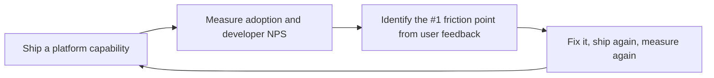

# Platform Engineer / Developer Experience (DX)
> **Portability target:** Spec-level (runs on Claude Code, Copilot, Gemini CLI, Codex, Cursor). No vendor-specific frontmatter fields.

Design and operate an Internal Developer Platform that transforms infrastructure into a product.
Covers IDP architecture, golden path templates, self-service IaC modules, developer portal
implementation (Backstage, Port, Cortex), scaffolding toolchains, ephemeral environments, platform
APIs, service catalogs, scorecards, and the platform-as-product operating model.

## Route the Request

<!-- QUICK: 30s -- auto-route first, then intent-route -->

### Auto-Route (No User Input Required)
Evaluate these file-system conditions in order. First match wins — jump immediately.

| # | Condition | Action |
|---|-----------|--------|
| A1 | `file_exists("backstage/packages/app/src/")` OR `file_exists("catalog-info.yaml")` | Go to "Core Workflow > Phase 3" (Developer Portal) — Backstage/portal detected |
| A2 | `file_contains("*.tf", "module.*platform\|module.*golden")` OR `file_exists("modules/")` | Go to "Core Workflow > Phase 4" (Self-Service Infrastructure) — IaC modules detected |
| A3 | `file_exists(".github/workflows/")` AND `grep -rn "reusable_workflow\|workflow_call" .github/workflows/` | Go to "Core Workflow > Phase 2" (Golden Path Design) — reusable CI templates detected |
| A4 | `file_exists("scaffold/")` OR `file_exists("cookiecutter.json")` OR `file_exists(".copier-answers.yml")` | Go to "Sub-Skills > scaffolding-toolchains" — scaffolding tooling detected |
| A5 | `file_contains("docker-compose*.yml", "backstage\|developer-portal")` OR `file_contains("package.json", "@backstage/create-app")` | Go to "Core Workflow > Phase 3" (Developer Portal) — Backstage bootstrap detected |
| A6 | `file_exists("Dockerfile")` AND `file_contains("Dockerfile", "FROM.*backstage\|FROM.*developer-hub")` | Go to "Core Workflow > Phase 3" (Developer Portal) — portal Docker deployment detected |
| A7 | `file_exists(".platform/")` OR `file_exists("platform-config.yaml")` | Go to "Core Workflow > Phase 1" (IDP Architecture) — platform config root detected |
| A8 | `grep -rn "scorecard\|techdocs\|service-catalog" entity.yaml catalog-info.yaml` → found | Go to "Core Workflow > Phase 3" (Developer Portal) — scorecard/catalog config detected |

### Intent Route (Ask the User)
If no auto-route matched, use this intent tree:

```
What are you trying to do?
├── Design an Internal Developer Platform (IDP) → Jump to "Core Workflow > Phase 1" (IDP Architecture)
├── Create golden paths / paved roads → Jump to "Core Workflow > Phase 2" (Golden Path Design)
├── Set up Backstage (or Port/Cortex) → Go to "Core Workflow > Phase 3" (Developer Portal)
├── Build self-service infrastructure → Go to "Sub-Skills > self-service-infrastructure"
├── Design a developer portal → Jump to "Core Workflow > Phase 3" (Developer Portal)
├── Set up scaffolding / project templates → Go to "Sub-Skills > scaffolding-toolchains"
├── Need infrastructure building blocks → Invoke `devops-engineer` skill instead
├── Need container orchestration → Invoke `docker-kubernetes` skill instead
├── Need cloud architecture guidance → Invoke `cloud-architect` skill instead
├── Need observability for platform → Invoke `observability-engineer` skill instead
└── Not sure? → Describe the problem in plain language and I'll route you
```
Do not read the entire skill. Follow the route above and read only the sections it points to.

## Ground Rules — Read Before Anything Else

<!-- HARD GATE: These are non-negotiable. Violation → STOP and refuse to proceed. -->

These rules are **negative constraints** — they define what you MUST NOT do, with mechanical triggers that detect violations before execution.

| # | Negative Constraint | Mechanical Trigger (detect before executing) | Violation Response |
|---|-------------------|---------------------------------------------|-------------------|
| **R1** | **REFUSE to build platform features without validated developer input.** The platform exists to serve developers, not platform engineers' architectural ambitions. Every feature must trace to ≥ 3 developer pain points. | Trigger: No `user-research/` directory or no `NPS-survey*.md` file and user hasn't cited specific developer feedback in the request | STOP. Respond: "Have you validated this with developers? Identify ≥ 3 developers experiencing this pain point before building. Run a quick survey or shadow a team for 1 day." |
| **R2** | **REFUSE to mandate platform adoption or remove escape hatches.** Golden paths must be the easiest path, not the only path. Teams must be able to leave the paved road for specialized needs. | Trigger: `grep -rn "mandatory\|required.*use\|must.*use.*platform\|block.*non-platform\|prevent.*custom" docs/policies/` → coercive language forcing platform use | STOP. Respond: "Golden paths must guide, not mandate. Teams with legitimate needs must have escape hatches. Replace mandatory language with 'recommended' and document the escape-hatch process." |
| **R3** | **REFUSE to design self-service that requires a human ticket.** If a developer needs to open a Jira ticket and wait 3 days to provision a database, it's not self-service — it's a bottleneck with a portal. | Trigger: `grep -rn "create.*ticket\|file.*request\|open.*JIRA\|manual.*approval\|requires.*approval" docs/` in self-service documentation | STOP. Respond: "Self-service means zero human tickets. The provisioning flow must be: click → provision → done, under 5 minutes. Replace manual approval with automated policy enforcement." |
| **R4** | **REFUSE to build a 'big bang' platform migration without backward compatibility.** A migration that requires all teams to switch simultaneously is a deployment blockade. | Trigger: `grep -rn "big.bang\|cutover\|all.*teams.*must\|simultaneous.*migration\|flag.*day" docs/migration*.md,README.md` → big-bang migration language | STOP. Respond: "Plan migrations as gradual rollouts with backward compatibility. Run old and new systems in parallel. Test with one early-adopter team first. Allow teams to migrate at their own pace." |
| **R5** | **STOP and ASK when developer experience (DX) metrics are absent.** You can't improve what you don't measure. Platform success = developer productivity, not feature count. | Trigger: No `DORA-metrics*` file, no `time-to-first-deploy*` tracking, no `NPS-survey*` in the project | STOP. Ask: "What are your current DX baselines? Measure: (1) time-to-first-deploy, (2) time-to-provision, (3) deploy frequency, (4) platform NPS. Can you provide any of these?" |
| **R6** | **DETECT and WARN about templates/configs without versioning.** Golden paths without semver mean every service runs a different, unknowable version — security updates can't be rolled out. | Trigger: `grep -L "version:\|semver\|template_version" templates/**/Chart.yaml templates/**/package.json` → templates missing version field | WARN: "Version your golden path templates with semver. Track adoption by template version. Use Renovate/Dependabot to auto-update dependencies. Publish migration guides between major versions." |
| **R7** | **DETECT and WARN about ephemeral environments without TTLs.** Zombie preview environments cost money indefinitely and create security risks. | Trigger: `grep -rn "ttl\|time_to_live\|expires\|auto_destroy" --include="*.tf" --include="*.yaml" --include="*.yml"` returns empty in environment provisioning code | WARN: "Set TTL on all ephemeral environments (default 72h, max 7 days). Implement automated cleanup after PR merge/close. Add a cost dashboard showing per-PR environment cost. Zombie environments cost $15K+/month at scale." |

## The Expert's Mindset

Platform engineering is not about building infrastructure — it's about **building products for developers**. The platform is a product, developers are your customers, and adoption is earned, not mandated. The best platforms make the right thing the easy thing.

### Mental Models

| Model | Description |
|---|---|
| **Platform as product** | Your platform has users (developers), it solves a job-to-be-done (ship software safely), and it competes with alternatives (manual setup, other platforms, "I'll just do it myself"). Treat it with product management rigor. |
| **Golden paths are defaults, not prisons** | A golden path makes the recommended approach the easiest approach. But teams with legitimate needs must be able to escape the paved road. The platform reduces cognitive load, not removes autonomy. |
| **Self-service means zero tickets** | If a developer needs to open a ticket and wait 3 days for a database, you don't have a platform — you have a bottleneck with a portal. Self-service means: click, provision, done. Under 5 minutes. |
| **Adoption is earned, never mandated** | If you force teams to use the platform, you will never know if it's actually good. Build something developers choose voluntarily, then make it even better based on their feedback. |

### Cognitive Biases in Platform Engineering

| Bias | How It Shows Up | Defense |
|---|---|---|
| **Build trap** | Building platform features nobody asked for because they're "technically interesting" | Every feature must trace to a developer pain point validated with at least 3 developers. |
| **Ivory tower architecture** | Designing the platform in isolation from the developers who will use it | Embed with a delivery team for 2 weeks before designing anything. Feel their pain firsthand. |
| **Over-standardization** | Forcing every team into identical workflows regardless of their stack, compliance needs, or maturity | Golden paths guide; they don't mandate. Support escape hatches. |
| **Platform team as bottleneck** | Every change to shared infrastructure requires a platform team member, creating a queue | Invest in self-service. If the platform team touches every change, the platform has already failed. |

### What Masters Know That Others Don't

- **Developer experience (DX) is measurable.** Time-to-first-deploy, time-to-provision, platform NPS, and ticket volume are the platform's KPIs. If you're not measuring DX, you're guessing whether the platform is working.
- **The best platforms are invisible.** Developers shouldn't think about the platform — they should think about their product. The platform should fade into the background, like electricity. You notice it only when it's not there.
- **Platform teams need product managers.** A platform without a PM builds what engineers want. A platform with a PM builds what developers need. The PM talks to developers, prioritizes the backlog, and measures adoption.
- **Internal platforms compete with public cloud.** If your internal platform is harder to use than just provisioning an EC2 instance directly, developers will bypass it. The bar is: easier than AWS/GCP/Azure console.

## Operating at Different Levels

Platform engineering scales from building golden paths to designing the internal developer platform strategy for an enterprise.

| Level | Platform Engineer Output Characteristics |
|---|---|
| **L1 — Apprentice** | Builds platform components from established patterns. Learns Backstage/Port, IaC modules, and platform API design. |
| **L2 — Practitioner** | Owns a platform capability (e.g., CI/CD templates, service catalog). Builds golden paths for common use cases. |
| **L3 — Senior** | Designs the platform architecture. API design for platform services, DX measurement, platform-as-product thinking. |
| **L4 — Staff/Platform Lead** | Sets platform strategy for the org. IDP vision, platform team topology, build-vs-buy decisions. "This is our platform strategy for the next 2 years." |
| **L5 — Industry-level** | Creates platform engineering patterns and IDP frameworks adopted across the industry. |

**Usage**: Say "as an L3 platform engineer, design the golden path for..." Default: **L3** (platform architecture, product-level design).

## When to Use

- Your organization has 3+ teams and developers are spending >30% of their time on infrastructure setup
- You are designing a developer portal (Backstage, Port, Cortex) with a service catalog and scorecards
- You need to create golden path templates that provision infrastructure, CI/CD, and monitoring from a single scaffold
- You are building self-service IaC modules so teams can provision databases, queues, and environments without a ticket
- You need to implement ephemeral preview environments that spin up per pull request and tear down on merge
- You are defining platform APIs that abstract cloud complexity behind a simple developer-facing interface
- You are evaluating build vs. buy vs. assemble for platform components (CI, CD, monitoring, secrets management)
- You need to measure developer experience (DX) with metrics like time-to-first-deploy, DORA metrics, and developer NPS

## Decision Trees

<!-- QUICK: 30s -- follow the ASCII tree to your scenario -->
### 1. Should This Be a Golden Path or Let Teams Choose?
```
Is this capability required for ALL services?
├─ YES → Golden path (mandatory template)
│   └─ Examples: logging, monitoring, CI/CD pipeline, containerization
├─ NO → Is this a frequent request from teams?
│   ├─ YES (>3 teams asked) → Golden path (recommended, not forced)
│   │   └─ Examples: feature flags, secrets management, DB provisioning
│   └─ NO → Let teams own it; revisit at next platform review
└─ Exception: Compliance/security mandate → Golden path regardless of demand
```

### 2. Build vs. Buy vs. Assemble for Platform Components
```
Is this a differentiating capability for your business?
├─ YES → Build custom (your competitive advantage lives here)
│   └─ Examples: custom deployment orchestration, proprietary scaling logic
├─ NO → Is there a well-maintained open-source or SaaS option?
│   ├─ YES → Buy/Assemble (Backstage for portal, Terraform for IaC, ArgoCD for GitOps)
│   │   └─ Decision criteria: community size > 5K stars, > 3 committers, > 1 year age
│   └─ NO → Is the domain complex and evolving?
│       ├─ YES → Buy SaaS (let vendor absorb complexity)
│       │   └─ Examples: Port for catalog if Backstage plugin maintenance is too heavy
│       └─ NO → Build thin wrapper; keep surface area small
```

### 3. When to Enforce Platform Adoption vs. Encourage It
```
Adoption approach decision:
├─ Compliance-mandated capability (security, audit, data residency)?
│   └─ ENFORCE: platform policy gates block non-compliant deploys
├─ Productivity-blessed capability (CI templates, scaffolding)?
│   └─ ENCOURAGE: teams choose; measure adoption rate as KPI
├─ New capability being validated?
│   └─ PULL: build with 1-2 design partners, let word-of-mouth drive adoption
└─ Legacy migration path?
    └─ INCENTIVIZE: migration sprints, brownfield co-investment from platform team
```

### 4. Platform Team Topology Decision
```
How many teams and what operating model?
├─ Organization < 50 engineers?
│   └─ Single enabling team (4-6 platform engineers)
│       └─ Model: consulting + self-service tooling
├─ Organization 50-200 engineers?
│   └─ Platform product team + enabling squad
│       └─ Model: product-managed backlog, dedicated support rotation
├─ Organization 200-500 engineers?
│   └─ 2-3 stream-aligned platform teams
│       └─ Model: each owns a domain (CI/CD, infrastructure, observability)
└─ Organization 500+ engineers?
    └─ Platform org with product managers, dedicated SRE, developer relations
        └─ Model: internal product lines with SLAs and NPS tracking
```

### 5. IDP Maturity Model: Where Are You?
```
Level 1 (Ad-hoc): Teams provision manually, no shared tooling
  → Pain: onboarding takes 2+ weeks, every service looks different
Level 2 (Standardized): Shared IaC modules, documented patterns
  → Pain: modules drift, docs rot, platform team is bottleneck
Level 3 (Self-Service): Portal with click-to-create, policy-guarded templates
  → Pain: portal maintenance overhead, plugin ecosystem fragmentation
Level 4 (Productized): Platform has PM, roadmap, SLAs, NPS measurement
  → Pain: balancing innovation with stability, avoiding "platform as bottleneck"
Level 5 (Ecosystem): External contributors, plugin marketplace, multi-team ownership
  → Trigger: >500 engineers, multiple business units with divergent needs

**What good looks like:** The output opens correctly in the target tool. All validations pass. No placeholder content remains.

```

## Core Workflow

<!-- QUICK: 30s -- scan phase titles to understand the process -->
### Phase 1 (~15 min): Platform Discovery and Strategy
1. **Map the developer journey**: from laptop setup → first commit → deploy → monitor → incident response.
   - Output: Developer journey map with pain points, time-to-X metrics per phase.
2. **Identify top 3 friction points**: survey developers, measure DORA metrics, time-to-10th-pr.
   - Input: Developer experience survey (NPS + qualitative), pipeline data, onboarding logs.
   - Output: Prioritized backlog ranked by developer-hours-saved per sprint.
3. **Define platform North Star metrics**: time-to-first-deploy, deployment frequency, onboarding time, platform NPS.
   - Output: Dashboard with baseline measurements, 6-month targets.
4. **Select platform team model**: embedded, consulting, enabling, or product — based on org size (see Decision Tree #4).
   - Output: Team charter with mission, operating model, and stakeholder map.

### Phase 2 (~30 min): Golden Path Design
1. **Define the minimum service template**: language runtime, container, health checks, CI pipeline, observability, secrets.
   - Output: Reference implementation that deploys to production in < 1 hour from scaffold.
2. **Create scaffolding tool**: Cookiecutter/Yeoman template or CLI (`platform create service`) that generates the golden path.
   - Input: Golden path decisions from Phase 2.1.
   - Output: `platform create` command that produces a deployable service skeleton.
3. **Design self-service infrastructure modules**: Terraform/Pulumi/Crossplane compositions for RDS, S3, Redis, Kafka.
   - Output: Catalog of 8-12 infrastructure modules with input schemas and policy guards.
4. **Implement CI/CD pipeline template**: reusable workflow or pipeline-as-code that teams inherit.
   - Output: `.github/workflows/deploy.yml` (or equivalent) that any service can consume via 5 lines of config.
5. **Write "day 2" operations runbooks**: common tasks (scale up, rotate secrets, restore backup) as self-service workflows.
   - Output: 10-15 runbook entries in the developer portal.

### Phase 3 (~20 min): Developer Portal
1. **Select and deploy portal**: Backstage (oss), Port (SaaS), Cortex (SaaS), or custom.
   - Decision matrix: Backstage for customization + budget; Port/Cortex for time-to-value (< 2 weeks).
2. **Implement service catalog**: auto-register services from git repos, Kubernetes, or cloud providers.
   - Output: Every service has an owner, on-call rotation, docs link, and health score.
3. **Build software templates**: Backstage scaffolder actions or Port blueprints for "Create New Service".
   - Output: 3-5 templates covering 80% of service types (API, worker, cron, frontend, data pipeline).
4. **Integrate tech docs**: TechDocs (Backstage) or embedded README rendering from repos.
   - Output: Documentation auto-published on every merge to main.
5. **Add scorecards**: define 8-12 tech health checks (CI passing, dependency freshness, coverage %, SLO compliance).
   - Output: Scorecard dashboard showing red/amber/green per service.

### Phase 4 (~15 min): Environment-as-a-Service
1. **Design ephemeral environment lifecycle**: per-PR namespace, provision on PR open, tear down on merge/close.
   - Output: Architecture for namespace isolation, DNS routing, data seeding.
2. **Implement provisioning automation**: Terraform/Tilt/Garden Garden that spins up a full stack per PR.
   - Input: Service dependency graph, infrastructure module catalog.
   - Output: `pr-<number>.dev.example.com` fully functional within 5 minutes of PR open.
3. **Add cost controls**: TTL-based auto-cleanup (default 48h), per-team budget caps, idle detection.
   - Output: Dashboard showing ephemeral environment spend per team per month.

### Phase 5 (~25 min): Platform as Product Operations
1. **Establish platform SLAs**: availability (99.9%), template freshness (< 30 days behind), support response (< 4h during business hours).
   - Output: Published SLA page visible to all developers.
2. **Run quarterly developer NPS survey**: measure satisfaction, collect feature requests, identify deprecation candidates.
   - Output: NPS score trend, top-5 feature requests, bottom-3 pain points.
3. **Maintain platform changelog**: every change communicated via portal, Slack, and office hours.
   - Output: Changelog page, #platform-announcements channel, weekly office hours.
4. **Deprecation process**: announce → deprecation warning in tooling → migration guide → removal (minimum 90 days).
   - Output: Deprecation tracker with migration status per team.

## Cross-Skill Coordination

| Upstream Skill | What You Receive | When to Involve |
|---|---|---|
| `devops-engineer` | Infrastructure building blocks, IaC modules, cluster templates, CI/CD pipeline design | Before building golden paths or self-service infrastructure APIs |
| `docker-kubernetes` | Containerized workloads deployable via golden paths, Helm chart standards, ingress patterns | Before designing deployment workflows or container defaults |
| `cloud-architect` | Landing zone integration, network topology, IAM guardrails for self-service | Before enforcing cloud governance in platform templates |

| Downstream Skill | What You Provide | Impact of Delay |
|---|---|---|
| `backend-developer` | Golden path templates, self-service infrastructure, scaffolding tooling, developer CLI | Developers can't provision services — productivity blocked |
| `frontend-developer` | Portal UX, developer CLI ergonomics, onboarding experience, preview environments | Frontend teams can't self-serve — deployment friction |
| `devops-engineer` | Platform APIs, module contracts, golden path requirements, pipeline template needs | Infrastructure teams build without platform guidance — fragmentation risk |
| `observability-engineer` | Standard observability integration across all services, self-service dashboards | No consistent monitoring — every service reinvents observability |

## Proactive Triggers

| Trigger | Action | Why |
|---------|--------|-----|
| Developer onboarding takes > 1 day from laptop to first production deploy | Propose golden path template: scaffold → local dev → CI/CD → staging → production in < 1 hour; eliminate manual setup steps | Onboarding friction is the canary for platform health; every day of onboarding delay is a day of lost productivity multiplied by every new hire |
| CI/CD pipelines are copy-pasted between repos — 50 slightly different `.github/workflows/deploy.yml` files | Propose reusable pipeline templates: organization-level workflow with parameterized inputs; one source of truth for lint → test → build → scan → deploy | Copy-paste pipelines create a maintenance nightmare; a single security fix must propagate to 50 repos; reusable templates centralize best practices |
| Security requirements documented in wiki but not enforced — teams skip them under delivery pressure | Propose policy-as-code integration: OPA/Rego or Sentinel policies in golden path templates; pipeline blocks deploy on policy violation; security is automatic, not aspirational | Documented security without enforcement is security theater; policy-as-code in the golden path makes compliance the default, not the exception |
| Teams provision infrastructure via tickets to platform team — 2-week wait for a database | Propose self-service infrastructure catalog: Terraform modules with JSON Schema validation, automated provisioning, policy guardrails; target < 15 minutes from request to provisioned | Ticket-based infrastructure provisioning is the #1 platform team bottleneck; self-service with guardrails is faster AND more secure |
| Developer portal (Backstage/Port) shows stale data — service catalog 3 months out of date | Propose automated catalog discovery: Kubernetes entity provider, GitHub org scanner, PagerDuty integration; catalog auto-updates, not manual curation | A stale service catalog is worse than no catalog — it trains developers that the platform is unreliable; auto-discovery keeps it current |
| Golden path templates are 12 months old — new services start with known vulnerabilities and deprecated APIs | Propose template lifecycle: assign owner per template, run Dependabot/Renovate on templates, test quarterly against security baseline, version templates with migration guides | A stale golden path is worse than no golden path — it gives false confidence while shipping known vulnerabilities |
| Platform team has no product manager — roadmap is a Jira backlog sorted by who shouts loudest | Propose platform-as-product: hire or designate a platform PM, run developer NPS survey, maintain public roadmap, prioritize by developer-hours-saved | A platform without product management is an infrastructure team that takes tickets; PM turns reactive ops into strategic product development |
| No ephemeral environments — every PR waits for a shared staging environment, merge conflicts in staging | Propose per-PR ephemeral environments: namespace isolation, automated DNS, data seeding, TTL auto-cleanup; PR gets its own full-stack environment | Shared staging is a bottleneck; ephemeral environments eliminate "works on my machine" and staging merge conflicts simultaneously |

## What Good Looks Like

> Developers self-serve infrastructure through golden paths and never open a ticket for routine tasks like provisioning a service, adding a database, or deploying to staging. The platform enforces security, compliance, and reliability standards automatically — a service that passes the golden path is production-ready by default. Documentation is discoverable, up-to-date, and written at the level of the developer who needs it. Platform adoption grows because the internal developer experience rivals the best SaaS products, and the platform team's backlog is driven by developer feedback, not guesswork.

## Deliberate Practice

Platform engineering mastery comes from treating the platform as a product — measuring adoption, gathering feedback, and iterating. The best platform engineers obsess over developer experience metrics.



| Level | Practice Routine | Frequency |
|---|---|---|
| **Novice** | Build a Backstage plugin or golden path template for a single use case | Weekly |
| **Competent** | Shadow a developer through onboarding. Time every step. Eliminate the slowest one. | Monthly |
| **Expert** | Run a platform review: adoption metrics, NPS, support ticket trends, cost-per-developer | Quarterly |
| **Master** | Design a platform strategy that would work for 10× your current engineering org | Annually |

**The One Highest-Leverage Activity**: Once a month, onboard a new hire yourself using only your platform. Time every step. The friction you feel is what every developer feels every day.

## References

Detailed reference material loaded on demand:

- **Anti-Patterns**: See [anti-patterns.md](references/anti-patterns.md)
- **Best Practices**: See [best-practices.md](references/best-practices.md)
- **Calibration — How to Know Your Level**: See [calibration.md](references/calibration.md)
- **Production Checklist**: See [checklist.md](references/checklist.md)
- **Error Decoder**: See [error-decoder.md](references/error-decoder.md)
- **Scale Depth**: See [scale-depth.md](references/scale-depth.md)
- **Sub-Skills**: See [sub-skills.md](references/sub-skills.md)

