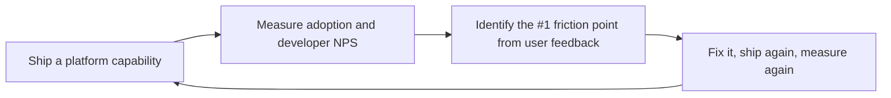

# Platform Engineer / Developer Experience (DX)
> **Portability target:** Spec-level (runs on Claude Code, Copilot, Gemini CLI, Codex, Cursor). No vendor-specific frontmatter fields.

Design and operate an Internal Developer Platform that transforms infrastructure into a product.
Covers IDP architecture, golden path templates, self-service IaC modules, developer portal
implementation (Backstage, Port, Cortex), scaffolding toolchains, ephemeral environments, platform
APIs, service catalogs, scorecards, and the platform-as-product operating model.
## <!-- DEEP: 5+min --> RESEARCH_PREREQUISITE — Execute Before Any Output

**This is a HARD GATE. Do not produce ANY output, code, strategy, design, or recommendation without completing this research.**

Before you act, you MUST execute every applicable research step. Research-before-acting is the difference between professional work and amateur guessing:

| # | Research Step | Why It Matters | Where to Look |
|---|--------------|----------------|----------------|
| **RP1** | **Verify domain currency.** Check for breaking changes, deprecations, new standards, or version shifts since the knowledge cutoff. | [STALE_RISK] Outdated advice breaks real systems. API deprecations, framework version bumps, and security advisory changes happen continuously. Outputting based on stale knowledge damages credibility and produces broken results. | Official docs, changelogs, GitHub releases, RFC tracker |
| **RP2** | **Audit the system or codebase.** Read relevant files. Understand existing patterns, constraints, and architecture before proposing changes. | [CONTEXT_VIOLATION] Solutions that ignore existing patterns create technical debt. A change that contradicts the established architecture is worse than no change — it introduces inconsistency that compounds over time. | Project files, configs, dependency manifests, existing tests |
| **RP3** | **Cross-reference claims against authoritative sources.** Every factual assertion needs a verifiable source. Mark each: [VERIFIED], [COMPUTED], or [ESTIMATED]. | [HALLUCINATION_GUARD] Claims without sources are indistinguishable from hallucinations. The #1 cause of incorrect output is treating assumptions as facts. Source tagging prevents this. | Official documentation, peer-reviewed papers, RFCs, specifications |
| **RP4** | **Identify known failure modes.** Before recommending, list what commonly breaks. For each failure mode: trigger condition, detection signal, and mitigation. | [FAILURE_BLINDNESS] Every domain has known failure patterns. Output that doesn't address them is dangerously incomplete. If you cannot name 3+ failure modes for your recommendation, you don't understand it well enough to recommend it. | Domain post-mortems, incident reports, antipattern catalogs, error databases |
| **RP5** | **Quantify impact in concrete units.** Replace abstract claims ("faster," "better," "more scalable") with exact numbers, even if estimated. | [VAGUENESS_PENALTY] "Faster" is unverifiable. "Reduces p95 latency from 340ms to 120ms (±15ms)" is verifiable. Abstract adjectives hide ignorance behind confidence. Concrete numbers expose gaps. | Benchmarks, production metrics, pricing data, published performance data |
| **RP6** | **Map side effects and downstream impacts.** What else breaks? Which dependencies are affected? Which downstream consumers need updating? | [CASCADE_BLINDNESS] Changes to one component ripple outward. A fix in module A can break module B that depends on A's old behavior. Map the blast radius before acting. | Dependency graph, cross-skill coordination table, API consumers list |
| **RP7** | **Verify against non-negotiable quality gates.** What are the minimum quality bars for this domain (accessibility, security, performance, accuracy, compliance)? | [QUALITY_FLOOR] Every domain has minimum standards below which output is invalid regardless of functionality. Missing WCAG AA = broken. Leaking credentials = broken. Silent data loss = broken. | Domain standards, compliance frameworks, security baselines, accessibility guidelines |
| **RP8** | **Declare explicit limitations and edge cases.** What does this NOT handle? What are the known boundaries? What scenarios are explicitly out of scope? | [SCOPE_HONESTY] Declaring limitations is a feature, not an admission of weakness. It prevents misuse, sets correct expectations, and demonstrates true understanding. Every solution has boundaries — naming them is professional. | This SKILL.md, domain literature, edge case databases |

**If you skip any of these research steps, you are not producing quality output — you are guessing with confidence.** Guessing wastes time, breaks systems, and destroys trust. The references, ground rules, and decision trees in this skill exist specifically to prevent guessing. Use them.

> **Compliance:** Research must be executed before any substantial output. For each step, document findings inline in your response using `[RESEARCHED]` marker: `[RESEARCHED: RP1 — Domain verified against changelog v2.4. No breaking changes since cutoff.]`. Partial research = partial quality. Zero research = zero credibility.


### 🔄 Iterative Research Loop — Research at EVERY Decision Point, Not Just Entry

**The RP1-RP8 cycle above is NOT a one-time gate.** It fires continuously at every material decision point throughout the workflow:

| Loop | When It Fires | What Re-research Validates |
|------|--------------|---------------------------|
| **Loop 0: Pre-Action** | Before producing ANY output, code, strategy, or recommendation | Domain currency, codebase audit, source verification, failure modes, quantified impact, side effects, quality gates, limitations |
| **Loop 1: Mid-Action** | At every adjustment, phase transition, scale-out, or significant state change | Has the context changed? Are the original assumptions still valid? Has new information invalidated the Loop 0 conclusions? |
| **Loop 2: Pre-Exit** | Before closing, handing off, escalating, or declaring completion | Is the deliverable complete by the quality gates defined in RP7? Are all limitations declared (RP8)? Have failure modes been addressed (RP4)? |
| **Loop 3: Post-Action** | After completion: compare expected vs. actual outcome | What was the efficiency ratio (actual / theoretical max)? What learnings emerged? What should be fed back into the pattern database for future decisions? |

**Integration into Core Workflow:**

Every decision point in a skill's Core Workflow must be marked with:
```
[RESEARCH LOOP: Re-execute RP1-RP8 before proceeding to next phase]
```

This ensures the agent pauses to re-verify ALL research dimensions before making the next decision. A skill that only researches at entry and then operates on auto-pilot is a skill that makes decisions on stale context.

**Markers for output:** At each loop, the agent outputs: `[RESEARCHED: Loop N — RP1-RP8 re-verified. Key delta from previous loop: ...]`

**Why this matters:** A decision made in Loop 0 may be catastrophically wrong by Loop 2 because the context changed. Markets move. Requirements shift. Dependencies update. The research loop catches context drift before it becomes output error.

> **Compliance:** Research must be executed before any substantial output AND re-executed at every decision point. For each research loop, document findings inline. Partial research = partial quality. Zero research = zero credibility. Stale research = dangerous confidence.


## Route the Request
<!-- STANDARD: 3min -->

<!-- QUICK: 30s -- auto-route first, then intent-route -->

### Auto-Route (No User Input Required)
Evaluate these file-system conditions in order. First match wins — jump immediately.

| # | Condition | Action |
|---|-----------|--------|
| A1 | `file_exists("backstage/packages/app/src/")` OR `file_exists("catalog-info.yaml")` | Go to "Core Workflow > Phase 3" (Developer Portal) — Backstage/portal detected |
| A2 | `file_contains("*.tf", "module.*platform\|module.*golden")` OR `file_exists("modules/")` | Go to "Core Workflow > Phase 4" (Self-Service Infrastructure) — IaC modules detected |
| A3 | `file_exists(".github/workflows/")` AND `grep -rn "reusable_workflow\|workflow_call" .github/workflows/` | Go to "Core Workflow > Phase 2" (Golden Path Design) — reusable CI templates detected |
| A4 | `file_exists("scaffold/")` OR `file_exists("cookiecutter.json")` OR `file_exists(".copier-answers.yml")` | Go to "Sub-Skills > scaffolding-toolchains" — scaffolding tooling detected |
| A5 | `file_contains("docker-compose*.yml", "backstage\|developer-portal")` OR `file_contains("package.json", "@backstage/create-app")` | Go to "Core Workflow > Phase 3" (Developer Portal) — Backstage bootstrap detected |
| A6 | `file_exists("Dockerfile")` AND `file_contains("Dockerfile", "FROM.*backstage\|FROM.*developer-hub")` | Go to "Core Workflow > Phase 3" (Developer Portal) — portal Docker deployment detected |
| A7 | `file_exists(".platform/")` OR `file_exists("platform-config.yaml")` | Go to "Core Workflow > Phase 1" (IDP Architecture) — platform config root detected |
| A8 | `grep -rn "scorecard\|techdocs\|service-catalog" entity.yaml catalog-info.yaml` → found | Go to "Core Workflow > Phase 3" (Developer Portal) — scorecard/catalog config detected |

### Intent Route (Ask the User)
If no auto-route matched, use this intent tree:

```
What are you trying to do?
├── Design an Internal Developer Platform (IDP) → Jump to "Core Workflow > Phase 1" (IDP Architecture)
├── Create golden paths / paved roads → Jump to "Core Workflow > Phase 2" (Golden Path Design)
├── Set up Backstage (or Port/Cortex) → Go to "Core Workflow > Phase 3" (Developer Portal)
├── Build self-service infrastructure → Go to "Sub-Skills > self-service-infrastructure"
├── Design a developer portal → Jump to "Core Workflow > Phase 3" (Developer Portal)
├── Set up scaffolding / project templates → Go to "Sub-Skills > scaffolding-toolchains"
├── Need infrastructure building blocks → Invoke `devops-engineer` skill instead
├── Need container orchestration → Invoke `docker-kubernetes` skill instead
├── Need cloud architecture guidance → Invoke `cloud-architect` skill instead
├── Need observability for platform → Invoke `observability-engineer` skill instead
└── Not sure? → Describe the problem in plain language and I'll route you

```

Do not read the entire skill. Follow the route above and read only the sections it points to.

## Ground Rules — Read Before Anything Else
<!-- STANDARD: 3min -->

<!-- HARD GATE: These are non-negotiable. Violation → STOP and refuse to proceed. -->

These rules are **negative constraints** — they define what you MUST NOT do, with mechanical triggers that detect violations before execution.

| # | Negative Constraint | Mechanical Trigger (detect before executing) | Violation Response |
|---|-------------------|---------------------------------------------|-------------------|
| **R1** | **REFUSE to build platform features without validated developer input.** The platform exists to serve developers, not platform engineers' architectural ambitions. Every feature must trace to ≥ 3 developer pain points. | Trigger: No `user-research/` directory or no `NPS-survey*.md` file and user hasn't cited specific developer feedback in the request | STOP. Respond: "Have you validated this with developers? Identify ≥ 3 developers experiencing this pain point before building. Run a quick survey or shadow a team for 1 day." |
| **R2** | **REFUSE to mandate platform adoption or remove escape hatches.** Golden paths must be the easiest path, not the only path. Teams must be able to leave the paved road for specialized needs. | Trigger: `grep -rn "mandatory\|required.*use\|must.*use.*platform\|block.*non-platform\|prevent.*custom" docs/policies/` → coercive language forcing platform use | STOP. Respond: "Golden paths must guide, not mandate. Teams with legitimate needs must have escape hatches. Replace mandatory language with 'recommended' and document the escape-hatch process." |
| **R3** | **REFUSE to design self-service that requires a human ticket.** If a developer needs to open a Jira ticket and wait 3 days to provision a database, it's not self-service — it's a bottleneck with a portal. | Trigger: `grep -rn "create.*ticket\|file.*request\|open.*JIRA\|manual.*approval\|requires.*approval" docs/` in self-service documentation | STOP. Respond: "Self-service means zero human tickets. The provisioning flow must be: click → provision → done, under 5 minutes. Replace manual approval with automated policy enforcement." |
| **R4** | **REFUSE to build a 'big bang' platform migration without backward compatibility.** A migration that requires all teams to switch simultaneously is a deployment blockade. | Trigger: `grep -rn "big.bang\|cutover\|all.*teams.*must\|simultaneous.*migration\|flag.*day" docs/migration*.md,README.md` → big-bang migration language | STOP. Respond: "Plan migrations as gradual rollouts with backward compatibility. Run old and new systems in parallel. Test with one early-adopter team first. Allow teams to migrate at their own pace." |
| **R5** | **STOP and ASK when developer experience (DX) metrics are absent.** You can't improve what you don't measure. Platform success = developer productivity, not feature count. | Trigger: No `DORA-metrics*` file, no `time-to-first-deploy*` tracking, no `NPS-survey*` in the project | STOP. Ask: "What are your current DX baselines? Measure: (1) time-to-first-deploy, (2) time-to-provision, (3) deploy frequency, (4) platform NPS. Can you provide any of these?" |
| **R6** | **DETECT and WARN about templates/configs without versioning.** Golden paths without semver mean every service runs a different, unknowable version — security updates can't be rolled out. | Trigger: `grep -L "version:\|semver\|template_version" templates/**/Chart.yaml templates/**/package.json` → templates missing version field | WARN: "Version your golden path templates with semver. Track adoption by template version. Use Renovate/Dependabot to auto-update dependencies. Publish migration guides between major versions." |
| **R7** | **DETECT and WARN about ephemeral environments without TTLs.** Zombie preview environments cost money indefinitely and create security risks. | Trigger: `grep -rn "ttl\|time_to_live\|expires\|auto_destroy" --include="*.tf" --include="*.yaml" --include="*.yml"` returns empty in environment provisioning code | WARN: "Set TTL on all ephemeral environments (default 72h, max 7 days). Implement automated cleanup after PR merge/close. Add a cost dashboard showing per-PR environment cost. Zombie environments cost $15K+/month at scale." |
| **R8** | **NEVER guess platform tool versions — anchor to the runtime.** Backstage, Crossplane, Kubernetes CRD versions, and Docker image tags change between releases. Generating manifests against the wrong API version produces broken or unsupported configurations. | Trigger: writing Backstage catalog entities, Crossplane compositions, Kubernetes CRDs, or Docker Compose files without first running `scripts/runtime-version-detect.sh` on the target project | STOP. Run: `scripts/runtime-version-detect.sh`. Then VERIFY: Backstage version (`cat packages/app/package.json \| jq .version`), Crossplane version (`kubectl get deployment crossplane -n crossplane-system -o jsonpath='{.spec.template.spec.containers[0].image}'`), Kubernetes API (`kubectl version --short`). Prepend to output: "## 🔗 Anchored Versions (source: runtime-version-detect.sh)\n- Backstage: vX.Y.Z\n- Crossplane: vX.Y.Z\n- Kubernetes API: v1.XX" |
| **R9** | **RUN the ROI Gate before any non-emergency code change.** Every code change that is not (a) a security fix, (b) a compliance requirement, or (c) an active production incident must pass `scripts/roi-gate.sh`. If the gate returns negative, refuse to write the code. | Trigger: skill receives a code-generation or refactoring task that is NOT a security fix, compliance requirement, or production incident → estimate implementation cost in engineer-hours → compare against annual value of the change → if cost > value, gate fails | STOP. Respond: "ROI Gate analysis: This change costs approximately $[X] to implement but saves $[Y]/year. Payback period: [N] years. If payback > 2 years, I recommend declining this work. See `scripts/roi-gate.sh` for the full formula." |

- **Admit uncertainty — never fabricate.** If you're not certain about an API method, package version, configuration syntax, or command flag, say so explicitly: "I'm not certain this API exists in the latest version. Check the official docs at [URL]." Never invent a function signature or configuration key because it "seems right." Hallucinated code costs hours of debugging.
- **Flag your knowledge cutoff.** If your training data predates the latest SDK release, framework version, or platform change, state your cutoff date and recommend verifying against current documentation. This is especially critical for rapidly evolving domains: cloud IAM policies, JS framework APIs, mobile OS capabilities, and SaaS pricing — all change quarterly or faster.
- **Never guess security configurations.** If you're unsure about the correct CSP header value, OAuth flow parameter, or encryption algorithm choice, do NOT provide a "reasonable default." Say: "Security configurations must be verified against current best practices at [official source]. I cannot provide a definitive answer without current documentation."
- **Distinguish between what you know and what you infer.** Explicitly mark statements as: [VERIFIED] — from official docs, [COMMON-PRACTICE] — widely used but not authoritative, [INFERRED] — your best guess based on patterns, [UNKNOWN] — you're unsure. This helps the user calibrate trust in your output.
## The Expert's Mindset
<!-- STANDARD: 3min -->

Platform engineering is not about building infrastructure — it's about **building products for developers**. The platform is a product, developers are your customers, and adoption is earned, not mandated. The best platforms make the right thing the easy thing.

### Mental Models

| Model | Description |
|---|---|
| **Platform as product** | Your platform has users (developers), it solves a job-to-be-done (ship software safely), and it competes with alternatives (manual setup, other platforms, "I'll just do it myself"). Treat it with product management rigor. |
| **Golden paths are defaults, not prisons** | A golden path makes the recommended approach the easiest approach. But teams with legitimate needs must be able to escape the paved road. The platform reduces cognitive load, not removes autonomy. |
| **Self-service means zero tickets** | If a developer needs to open a ticket and wait 3 days for a database, you don't have a platform — you have a bottleneck with a portal. Self-service means: click, provision, done. Under 5 minutes. |
| **Adoption is earned, never mandated** | If you force teams to use the platform, you will never know if it's actually good. Build something developers choose voluntarily, then make it even better based on their feedback. |

### Cognitive Biases in Platform Engineering

| Bias | How It Shows Up | Defense |
|---|---|---|
| **Build trap** | Building platform features nobody asked for because they're "technically interesting" | Every feature must trace to a developer pain point validated with at least 3 developers. |
| **Ivory tower architecture** | Designing the platform in isolation from the developers who will use it | Embed with a delivery team for 2 weeks before designing anything. Feel their pain firsthand. |
| **Over-standardization** | Forcing every team into identical workflows regardless of their stack, compliance needs, or maturity | Golden paths guide; they don't mandate. Support escape hatches. |
| **Platform team as bottleneck** | Every change to shared infrastructure requires a platform team member, creating a queue | Invest in self-service. If the platform team touches every change, the platform has already failed. |

### What Masters Know That Others Don't

- **Developer experience (DX) is measurable.** Time-to-first-deploy, time-to-provision, platform NPS, and ticket volume are the platform's KPIs. If you're not measuring DX, you're guessing whether the platform is working.
- **The best platforms are invisible.** Developers shouldn't think about the platform — they should think about their product. The platform should fade into the background, like electricity. You notice it only when it's not there.
- **Platform teams need product managers.** A platform without a PM builds what engineers want. A platform with a PM builds what developers need. The PM talks to developers, prioritizes the backlog, and measures adoption.
- **Internal platforms compete with public cloud.** If your internal platform is harder to use than just provisioning an EC2 instance directly, developers will bypass it. The bar is: easier than AWS/GCP/Azure console.

## Operating at Different Levels
<!-- STANDARD: 3min -->

Platform engineering scales from building golden paths to designing the internal developer platform strategy for an enterprise.

| Level | Platform Engineer Output Characteristics |
|---|---|
| **L1 — Apprentice** | Builds platform components from established patterns. Learns Backstage/Port, IaC modules, and platform API design. |
| **L2 — Practitioner** | Owns a platform capability (e.g., CI/CD templates, service catalog). Builds golden paths for common use cases. |
| **L3 — Senior** | Designs the platform architecture. API design for platform services, DX measurement, platform-as-product thinking. |
| **L4 — Staff/Platform Lead** | Sets platform strategy for the org. IDP vision, platform team topology, build-vs-buy decisions. "This is our platform strategy for the next 2 years." |
| **L5 — Industry-level** | Creates platform engineering patterns and IDP frameworks adopted across the industry. |

**Usage**: Say "as an L3 platform engineer, design the golden path for..." Default: **L3** (platform architecture, product-level design).

## When to Use
<!-- STANDARD: 3min -->

- Your organization has 3+ teams and developers are spending >30% of their time on infrastructure setup
- You are designing a developer portal (Backstage, Port, Cortex) with a service catalog and scorecards
- You need to create golden path templates that provision infrastructure, CI/CD, and monitoring from a single scaffold
- You are building self-service IaC modules so teams can provision databases, queues, and environments without a ticket
- You need to implement ephemeral preview environments that spin up per pull request and tear down on merge
- You are defining platform APIs that abstract cloud complexity behind a simple developer-facing interface
- You are evaluating build vs. buy vs. assemble for platform components (CI, CD, monitoring, secrets management)
- You need to measure developer experience (DX) with metrics like time-to-first-deploy, DORA metrics, and developer NPS

## Decision Trees **(QUICK)**
<!-- STANDARD: 3min -->

<!-- QUICK: 30s -- follow the ASCII tree to your scenario -->
### 1. Should This Be a Golden Path or Let Teams Choose?

```
Is this capability required for ALL services?
├─ YES → Golden path (mandatory template)
│   └─ Examples: logging, monitoring, CI/CD pipeline, containerization
├─ NO → Is this a frequent request from teams?
│   ├─ YES (>3 teams asked) → Golden path (recommended, not forced)
│   │   └─ Examples: feature flags, secrets management, DB provisioning
│   └─ NO → Let teams own it; revisit at next platform review
└─ Exception: Compliance/security mandate → Golden path regardless of demand

```

### 2. Build vs. Buy vs. Assemble for Platform Components

```
Is this a differentiating capability for your business?
├─ YES → Build custom (your competitive advantage lives here)
│   └─ Examples: custom deployment orchestration, proprietary scaling logic
├─ NO → Is there a well-maintained open-source or SaaS option?
│   ├─ YES → Buy/Assemble (Backstage for portal, Terraform for IaC, ArgoCD for GitOps)
│   │   └─ Decision criteria: community size > 5K stars, > 3 committers, > 1 year age
│   └─ NO → Is the domain complex and evolving?
│       ├─ YES → Buy SaaS (let vendor absorb complexity)
│       │   └─ Examples: Port for catalog if Backstage plugin maintenance is too heavy
│       └─ NO → Build thin wrapper; keep surface area small

```

### 3. When to Enforce Platform Adoption vs. Encourage It

```
Adoption approach decision:
├─ Compliance-mandated capability (security, audit, data residency)?
│   └─ ENFORCE: platform policy gates block non-compliant deploys
├─ Productivity-blessed capability (CI templates, scaffolding)?
│   └─ ENCOURAGE: teams choose; measure adoption rate as KPI
├─ New capability being validated?
│   └─ PULL: build with 1-2 design partners, let word-of-mouth drive adoption
└─ Legacy migration path?
    └─ INCENTIVIZE: migration sprints, brownfield co-investment from platform team

```

### 4. Platform Team Topology Decision

```
How many teams and what operating model?
├─ Organization < 50 engineers?
│   └─ Single enabling team (4-6 platform engineers)
│       └─ Model: consulting + self-service tooling
├─ Organization 50-200 engineers?
│   └─ Platform product team + enabling squad
│       └─ Model: product-managed backlog, dedicated support rotation
├─ Organization 200-500 engineers?
│   └─ 2-3 stream-aligned platform teams
│       └─ Model: each owns a domain (CI/CD, infrastructure, observability)
└─ Organization 500+ engineers?
    └─ Platform org with product managers, dedicated SRE, developer relations
        └─ Model: internal product lines with SLAs and NPS tracking

```

### 5. IDP Maturity Model: Where Are You?

```
Level 1 (Ad-hoc): Teams provision manually, no shared tooling
  → Pain: onboarding takes 2+ weeks, every service looks different
Level 2 (Standardized): Shared IaC modules, documented patterns
  → Pain: modules drift, docs rot, platform team is bottleneck
Level 3 (Self-Service): Portal with click-to-create, policy-guarded templates
  → Pain: portal maintenance overhead, plugin ecosystem fragmentation
Level 4 (Productized): Platform has PM, roadmap, SLAs, NPS measurement
  → Pain: balancing innovation with stability, avoiding "platform as bottleneck"
Level 5 (Ecosystem): External contributors, plugin marketplace, multi-team ownership
  → Trigger: >500 engineers, multiple business units with divergent needs

**What good looks like:** The output opens correctly in the target tool. All validations pass. No placeholder content remains.

```

## Core Workflow **(STANDARD)**
<!-- STANDARD: 3min -->

<!-- QUICK: 30s -- scan phase titles to understand the process -->
### Phase 1 (~15 min): Platform Discovery and Strategy
1. **Map the developer journey**: from laptop setup → first commit → deploy → monitor → incident response.
   - Output: Developer journey map with pain points, time-to-X metrics per phase.
2. **Identify top 3 friction points**: survey developers, measure DORA metrics, time-to-10th-pr.
   - Input: Developer experience survey (NPS + qualitative), pipeline data, onboarding logs.
   - Output: Prioritized backlog ranked by developer-hours-saved per sprint.
3. **Define platform North Star metrics**: time-to-first-deploy, deployment frequency, onboarding time, platform NPS.
   - Output: Dashboard with baseline measurements, 6-month targets.
4. **Select platform team model**: embedded, consulting, enabling, or product — based on org size (see Decision Tree #4).
   - Output: Team charter with mission, operating model, and stakeholder map.
  Complete when: developer journey map is documented with pain points, top-3 friction points are ranked by developer-hours-saved, North Star metrics have baseline measurements and 6-month targets.

### Phase 2 (~30 min): Golden Path Design
1. **Define the minimum service template**: language runtime, container, health checks, CI pipeline, observability, secrets.
   - Output: Reference implementation that deploys to production in < 1 hour from scaffold.
2. **Create scaffolding tool**: Cookiecutter/Yeoman template or CLI (`platform create service`) that generates the golden path.
   - Input: Golden path decisions from Phase 2.1.
   - Output: `platform create` command that produces a deployable service skeleton.
3. **Design self-service infrastructure modules**: Terraform/Pulumi/Crossplane compositions for RDS, S3, Redis, Kafka.
   - Output: Catalog of 8-12 infrastructure modules with input schemas and policy guards.
4. **Implement CI/CD pipeline template**: reusable workflow or pipeline-as-code that teams inherit.
   - Output: `.github/workflows/deploy.yml` (or equivalent) that any service can consume via 5 lines of config.
5. **Write "day 2" operations runbooks**: common tasks (scale up, rotate secrets, restore backup) as self-service workflows.
   - Output: 10-15 runbook entries in the developer portal.
  Complete when: reference implementation deploys to production in under 1 hour from scaffold, `platform create service` produces a deployable skeleton, and 8-12 infrastructure modules are cataloged with input schemas.

### Phase 3 (~20 min): Developer Portal
1. **Select and deploy portal**: Backstage (oss), Port (SaaS), Cortex (SaaS), or custom.
   - Decision matrix: Backstage for customization + budget; Port/Cortex for time-to-value (< 2 weeks).
2. **Implement service catalog**: auto-register services from git repos, Kubernetes, or cloud providers.
   - Output: Every service has an owner, on-call rotation, docs link, and health score.
3. **Build software templates**: Backstage scaffolder actions or Port blueprints for "Create New Service".
   - Output: 3-5 templates covering 80% of service types (API, worker, cron, frontend, data pipeline).
4. **Integrate tech docs**: TechDocs (Backstage) or embedded README rendering from repos.
   - Output: Documentation auto-published on every merge to main.
5. **Add scorecards**: define 8-12 tech health checks (CI passing, dependency freshness, coverage %, SLO compliance).
   - Output: Scorecard dashboard showing red/amber/green per service.
  Complete when: developer portal is deployed with service catalog auto-registering services, 3-5 software templates cover 80% of service types, and scorecards show health scores for all registered services.

### Phase 4 (~15 min): Environment-as-a-Service
1. **Design ephemeral environment lifecycle**: per-PR namespace, provision on PR open, tear down on merge/close.
   - Output: Architecture for namespace isolation, DNS routing, data seeding.
2. **Implement provisioning automation**: Terraform/Tilt/Garden Garden that spins up a full stack per PR.
   - Input: Service dependency graph, infrastructure module catalog.
   - Output: `pr-<number>.dev.example.com` fully functional within 5 minutes of PR open.
3. **Add cost controls**: TTL-based auto-cleanup (default 48h), per-team budget caps, idle detection.
   - Output: Dashboard showing ephemeral environment spend per team per month.
  Complete when: PR opens trigger namespace provisioning within 5 minutes, `pr-<number>.dev.example.com` is fully functional per PR, and cost controls prevent runaway spend with TTL auto-cleanup verified.

### Phase 5 (~25 min): Platform as Product Operations
1. **Establish platform SLAs**: availability (99.9%), template freshness (< 30 days behind), support response (< 4h during business hours).
   - Output: Published SLA page visible to all developers.
2. **Run quarterly developer NPS survey**: measure satisfaction, collect feature requests, identify deprecation candidates.
   - Output: NPS score trend, top-5 feature requests, bottom-3 pain points.
3. **Maintain platform changelog**: every change communicated via portal, Slack, and office hours.
   - Output: Changelog page, #platform-announcements channel, weekly office hours.
4. **Deprecation process**: announce → deprecation warning in tooling → migration guide → removal (minimum 90 days).
   - Output: Deprecation tracker with migration status per team.
  Complete when: platform SLA page is published, NPS survey cadence is on the calendar, changelog is active with last update within 30 days, and deprecation tracker has zero overdue migrations.
  Complete when: Pipeline runs end-to-end in under 15 minutes with parallelized stages.
  Complete when: Rollback tested — can revert to previous version within 5 minutes of detection.
  Complete when: Secrets scan runs in CI and blocks merge on any detected credential.

## Gotchas
<!-- DEEP: 10+min -->
<!-- STANDARD: 3min -->

| Gotcha | Cost | Fix |
|--------|------|-----|
| Building the platform without measuring developer productivity first — you optimize the wrong things and platform adoption stays at 20% because it doesn't solve real pain points | $200K-$1M in wasted platform engineering effort | Measure DORA metrics and run developer NPS surveys before building anything; prioritize the top 3 friction points by developer-hours-saved; validate each golden path with a pilot team before broad rollout |
| Treating the platform as a project, not a product — after initial launch, the platform team moves to the next project and the platform stagnates with broken templates, stale docs, and zero adoption growth | $100K-$500K in abandoned platform investment and shadow-IT proliferation | Staff a permanent platform product team (not a temporary tiger team); maintain a public roadmap; run quarterly NPS surveys; treat deprecation as a first-class feature with 90-day migration windows |
| Designing golden paths that work for the platform team but not for service teams — template requires 8 manual steps after scaffolding because the platform team "just knows" them | $50K-$200K in onboarding friction and developer frustration | Dogfood every golden path by having a platform engineer join a service team for a sprint and use the path end-to-end; time-to-10th-PR is the metric; if it's over 1 hour, the path is broken |

## Error Decoder — War Stories from the Trenches
<!-- STANDARD: 3min -->

**(STANDARD)**

When this domain goes wrong, it goes wrong in predictable ways. Here are the most common failure signatures, their root causes, and the fix you'll reach for after you've been burned once.

| Symptom | Root Cause | Fix | Lesson |
|---------|-----------|-----|--------|
| Backstage catalog shows 400 services but 120 of them are "ghost" services — removed from GitHub 6 months ago, still showing as active | The `GithubEntityProvider` was configured with `schedule: manual` and no one ran a full re-sync. New repos are discovered by webhook, but deletion events aren't processed. The catalog grows monotonically — it adds but never removes | Configure `GithubEntityProvider` with `schedule: { frequency: { minutes: 60 }, timeout: { minutes: 30 } }` and enable `deleteStaleEntities: true`. Run a monthly catalog audit: query API count vs GitHub org repo count. Ghost services with no deployments in 90 days are auto-flagged | Backstage is eventually consistent by default, but deletion requires explicit configuration. A catalog that only grows trains developers to ignore it. `deleteStaleEntities` is off by default — turn it on before launching. |
| Golden path template provisions a Kubernetes namespace but every pod stays in `Pending` with "insufficient CPU" | The template's `resourceDefaults` were set to `requests.cpu: "500m", limits.cpu: "1"` but the template's namespace `ResourceQuota` was set to `cpu: 2`. The third pod hits the quota and stays pending. The quota was copied from a smaller namespace by the template author | Set `requests.cpu` and `limits.cpu` intentionally per template — calculate: `ResourceQuota / maxPods`. Add a pre-provisioning validation step that checks `resourceQuota.spec.hard.cpu >= maxReplicas × requests.cpu`. Template versions must include capacity sizing guidance | Golden paths encode assumptions. If the template's resource defaults don't fit within the template's own quotas, every service created from it will fail at the third replica. Sizing validation must happen at template-design time, not at pod-admission time. |
| Developer portal "time to create a new service" metric goes from 4 hours to 7 days — the self-service pipeline broke and no one noticed for 3 sprints | The golden path template generates a cookiecutter repo, triggers a CI pipeline, waits for ArgoCD sync, and provisions monitoring — all orchestrated by a GitHub Actions workflow with 7 sequential steps. Step 3 (Terraform workspace creation) started failing because the Terraform Cloud token expired. Steps 4-7 never ran, but step 1 (repo creation) succeeded, so the developer sees "repo created" and assumes it's working | Add synchronous health checks at each pipeline stage with synthetic tests: every 30 minutes, provision and deprovision a test service. Break the pipeline into independent async stages with webhook callbacks. Monitor each stage's success rate separately — don't rely on end-to-end timing as a proxy for pipeline health | Self-service pipelines are chains of external dependencies. When one link breaks silently, the user experience degrades to "it just takes a while." Synthetic end-to-end tests catch chain breaks before the DORA metrics do. |
| Scaffolded services all fail CI with the same `ModuleNotFoundError: No module named 'shared_utils'` — the template references an internal library that was renamed | The golden path template had a hardcoded `requirements.txt` with `shared-utils==1.2.0`. The platform team renamed `shared-utils` to `platform-common` in v2.0. The template wasn't updated because template versioning is manual. 40 new services were scaffolded with the broken dependency before anyone noticed | Use template variables for dependency versions, resolved at scaffolding time: `PLATFORM_COMMON_VERSION: latest`. Add a CI smoke test to the template itself: scaffold → build → test. Run the smoke test nightly against the current template version and alert on failure | Templates that encode mutable references (package names, API versions, image tags) rot silently. Every template must have a CI test that exercises the scaffolded output. Variables that resolve at scaffolding time are safer than hardcoded references that drift. |
| Ephemeral environment provisioning fails because the naming convention produces names that exceed the 63-character Kubernetes limit | The naming convention: `pr-{repo-name}-{branch-name}-{env-type}`. A repo named `customer-experience-platform-backend` with a branch `feature/add-authentication-provider-integration` produces `pr-customer-experience-platform-backend-feature-add-authentication-provider-integration-dev` = 107 characters. Kubernetes resources are limited to 63 characters | Truncate with a hash suffix: `${repo}-${pr-number}-${hash}` → `ce-platform-142-a3f2b`. Enforce this in the scaffolding tool with a validation step. Add a Helm `fullnameOverride` that truncates to 63 characters: `{{ .Release.Name | trunc 63 }}`. Document naming constraints on the developer portal | Naming conventions that combine unbounded inputs (repo names, branch names) produce unbounded outputs. Kubernetes 63-char limit is strict — names over the limit are rejected at admission. Always hash or truncate with collision-safety. |
| Developers bypass the platform entirely and deploy directly to AWS — the platform team finds 14 manually-provisioned EC2 instances during a cost audit | The platform's golden path requires a Jira ticket → architecture review → Terraform module approval → deployment (7 days). The developer needs a test instance TODAY. They `aws ec2 run-instances` manually and it works — now they have a working pattern that bypasses the platform | Make the paved road faster than the bypass: self-service instant provisioning with TTL. Reduce platform friction to < 30 minutes: no tickets, no reviews for standard cases with guardrailed defaults. Test the "time to first deploy" metric monthly and target < 30 minutes for standard scaffolding | Developers optimize for speed. If the platform takes 7 days and a manual `aws ec2 run-instances` takes 60 seconds, the platform loses every time. Friction drives shadow IT. The paved road must be the fastest road — guardrails, not gates. |

## Best Practices
<!-- STANDARD: 3min -->

1. **Treat the platform as a product, not a project.** Assign a platform product manager with a public roadmap, measure developer NPS, and prioritize by developer-hours-saved. A platform without product management is an infrastructure team that takes tickets.
2. **Golden paths with escape hatches.** Mandate golden paths for compliance-critical capabilities (security, audit, data residency). For everything else, provide paved roads with full support and gravel roads (documented escape hatches) for teams with legitimate exceptions.
3. **Version golden path templates like APIs.** Template v2.1 adding HPA must include a migration guide from v1.0. Track template version in each scaffolded service's metadata. Run automated drift detection — non-compliant services blocked from deployment after a migration window.
4. **Self-service with guardrails, not gates.** Terraform modules with JSON Schema validation, cost guardrails (max instance size), and policy-as-code enforcement (OPA/Rego) let developers provision without tickets — but block them from creating a `db.r5.24xlarge` at $6K/month.
5. **Mandatory TTL on all self-service resources.** Every sandbox resource gets a TTL (max 30 days with renewal option). Cluster janitor deletes expired resources with 7-day warnings. Without deprovisioning automation, prototypes become permanent infrastructure at 3× the expected cost.
6. **Automate catalog discovery, don't curate manually.** Backstage `GithubEntityProvider`, Kubernetes entity provider, PagerDuty integration keep the catalog current. A stale catalog is worse than no catalog — it trains developers that the platform is unreliable.
7. **Measure developer experience, not just infrastructure uptime.** Time-to-first-deploy, time-to-10th-PR, DORA metrics, developer NPS. If onboarding takes >1 day from laptop to production, the platform is failing regardless of cluster uptime.
8. **Enforce cost allocation tags at provisioning.** Terraform validation blocks with non-empty string checks. AWS SCP/Azure Policy denies untagged resource creation. Nightly compliance scan surfaces untagged resources. Finance can't close the books when 14% of spend is "Unknown."
9. **Scorecards validate content, not just file existence.** A scorecard checking for `CODEOWNERS` file existence will be gamed with empty files. Validate that the owner is a valid team with an active Slack channel and PagerDuty escalation. Automated checks must be cheat-proof.
10. **Run the platform team with SLOs and support rotations.** Publish SLOs for critical platform services (CI pipeline availability ≥ 99.5%, scaffolding ≤ 15 min, provisioning ≤ 30 min). Dedicated on-call rotation with at least 2 engineers. If you can't support it 24/7, don't promise it.

## Error Recovery **(STANDARD)**
<!-- STANDARD: 3min -->

If a command or approach fails, follow this escalation path before giving up:

| Symptom | First Action | If That Fails | Last Resort |
|---------|-------------|---------------|-------------|
| Tool/command not found | Check installation: `which [tool]` or `[tool] --version`. Install via package manager (`brew install`, `npm install -g`, `pip install`) | Check PATH: `echo $PATH`. Verify the tool binary is in a PATH directory. Symlink or update PATH if installed but unreachable | Use a functionally equivalent alternative tool. If `rg` is unavailable, use `grep -r`. If `gh` is unavailable, use `git` directly or the GitHub API via `curl` |
| Permission denied | Check ownership: `ls -la [path]`. Fix with `chmod` or `sudo` if appropriate. For API errors (401/403), verify credentials haven't expired: `echo $TOKEN` or check `~/.netrc` | Refresh credentials: re-authenticate with the service. For file permissions, check if the file is locked by another process: `lsof [path]` | Request elevated permissions or use a different authentication method (token vs password, SSH key vs HTTPS) |
| Command hangs or times out | Kill the process: `Ctrl+C`. Re-run with a timeout: `timeout 30 [command]` or `gtimeout` on macOS. Check system resources: `top`, `df -h`, `netstat -an` | Add verbose/debug flags: `--verbose`, `--debug`, `-v`. Check logs: `tail -f [logfile]`. Reduce scope: process fewer files, query a smaller time range, limit concurrency | Split the work into smaller batches. Implement a retry loop with exponential backoff (1s, 2s, 4s, 8s). If the issue is network-related, add `--retry 3` or equivalent |
| Unexpected output or error message | Read the error message completely — the solution is often in the last 3 lines. Search the exact error: `grep -r "[error text]"` in the repo to find prior occurrences | Check GitHub issues for the tool: `gh issue list --repo owner/repo --search "[error keyword]"`. Check Stack Overflow | Simplify the approach. If the complex one-liner fails, break it into 3 sequential commands. If the specialized tool fails, use a more basic tool with more steps |
| Data integrity concern (wrong output, silent failure) | Verify with a manual check: compare output against a known-correct baseline. Add assertions: `[command] | grep -q "[expected]" && echo "OK" || echo "FAIL"` | Run the operation on a smaller subset first. Compare checksums: `shasum`, `md5`. Check for silent truncation: `wc -l` before and after | Abort and flag for human review. Do not proceed past data integrity failures — the cost of propagating bad data exceeds the cost of delay |

**Hard failure boundary:** If 3 different approaches all fail, STOP. Do not iterate infinitely. Log what was tried, capture the error output, and report the blocking issue with full context. Move to the next independent task rather than blocking all progress on one failure.

## Cross-Skill Coordination
<!-- STANDARD: 3min -->

| Upstream Skill | What You Receive | When to Involve |
|---|---|---|
| `devops-engineer` | Infrastructure building blocks, IaC modules, cluster templates, CI/CD pipeline design | Before building golden paths or self-service infrastructure APIs |
| `docker-kubernetes` | Containerized workloads deployable via golden paths, Helm chart standards, ingress patterns | Before designing deployment workflows or container defaults |
| `cloud-architect` | Landing zone integration, network topology, IAM guardrails for self-service | Before enforcing cloud governance in platform templates |
| `automation-engineer` | Platform APIs, internal tooling, developer experience config | Before automating platform delivery pipelines |

| Downstream Skill | What You Provide | Impact of Delay |
|---|---|---|
| `backend-developer` | Golden path templates, self-service infrastructure, scaffolding tooling, developer CLI | Developers can't provision services — productivity blocked |
| `frontend-developer` | Portal UX, developer CLI ergonomics, onboarding experience, preview environments | Frontend teams can't self-serve — deployment friction |
| `devops-engineer` | Platform APIs, module contracts, golden path requirements, pipeline template needs | Infrastructure teams build without platform guidance — fragmentation risk |
| `observability-engineer` | Standard observability integration across all services, self-service dashboards | No consistent monitoring — every service reinvents observability |
| `automation-engineer` | Platform APIs, internal tooling, developer experience config | Platform can't be automated — dev velocity blocked |

## Proactive Triggers
<!-- STANDARD: 3min -->

| Trigger | Action | Why |
|---------|--------|-----|
| Developer onboarding takes > 1 day from laptop to first production deploy | Propose golden path template: scaffold → local dev → CI/CD → staging → production in < 1 hour; eliminate manual setup steps | Onboarding friction is the canary for platform health; every day of onboarding delay is a day of lost productivity multiplied by every new hire |
| CI/CD pipelines are copy-pasted between repos — 50 slightly different `.github/workflows/deploy.yml` files | Propose reusable pipeline templates: organization-level workflow with parameterized inputs; one source of truth for lint → test → build → scan → deploy | Copy-paste pipelines create a maintenance nightmare; a single security fix must propagate to 50 repos; reusable templates centralize best practices |
| Security requirements documented in wiki but not enforced — teams skip them under delivery pressure | Propose policy-as-code integration: OPA/Rego or Sentinel policies in golden path templates; pipeline blocks deploy on policy violation; security is automatic, not aspirational | Documented security without enforcement is security theater; policy-as-code in the golden path makes compliance the default, not the exception |
| Teams provision infrastructure via tickets to platform team — 2-week wait for a database | Propose self-service infrastructure catalog: Terraform modules with JSON Schema validation, automated provisioning, policy guardrails; target < 15 minutes from request to provisioned | Ticket-based infrastructure provisioning is the #1 platform team bottleneck; self-service with guardrails is faster AND more secure |
| Developer portal (Backstage/Port) shows stale data — service catalog 3 months out of date | Propose automated catalog discovery: Kubernetes entity provider, GitHub org scanner, PagerDuty integration; catalog auto-updates, not manual curation | A stale service catalog is worse than no catalog — it trains developers that the platform is unreliable; auto-discovery keeps it current |
| Golden path templates are 12 months old — new services start with known vulnerabilities and deprecated APIs | Propose template lifecycle: assign owner per template, run Dependabot/Renovate on templates, test quarterly against security baseline, version templates with migration guides | A stale golden path is worse than no golden path — it gives false confidence while shipping known vulnerabilities |
| Platform team has no product manager — roadmap is a Jira backlog sorted by who shouts loudest | Propose platform-as-product: hire or designate a platform PM, run developer NPS survey, maintain public roadmap, prioritize by developer-hours-saved | A platform without product management is an infrastructure team that takes tickets; PM turns reactive ops into strategic product development |
| No ephemeral environments — every PR waits for a shared staging environment, merge conflicts in staging | Propose per-PR ephemeral environments: namespace isolation, automated DNS, data seeding, TTL auto-cleanup; PR gets its own full-stack environment | Shared staging is a bottleneck; ephemeral environments eliminate "works on my machine" and staging merge conflicts simultaneously |

## State Log
<!-- DEEP: 10+min -->
<!-- STANDARD: 3min -->

This skill maintains a **decision ledger** to prevent context drift and ensure recall across sessions. Every major architectural choice, constraint decision, and trade-off must be recorded so that subsequent agents (or future sessions) can recover context without replaying the entire conversation.
## Production Checklist **(STANDARD)**
<!-- STANDARD: 3min -->

1. [ ] **Service catalog has automated discovery** — Backstage `GithubEntityProvider`/`KubernetesEntityProvider` populates the catalog. Zero entities require manual `catalog-info.yaml` creation for standard services.
2. [ ] **Golden path templates are versioned** — every scaffolded service records the template version in its metadata. Migration guide exists for each major version bump. Drift detection (OPA/Kyverno) blocks non-compliant services after migration window.
3. [ ] **Self-service provisioning completed in <15 minutes** — from request to resource created. Terraform modules with JSON Schema validation. Policy guardrails (OPA/Sentinel) reject invalid requests at provision time.
4. [ ] **Cost guardrails enforced at provision** — max instance size, tag enforcement (`cost_center`, `environment`, `owner`), budget alerts. SCP/Azure Policy denies untagged resource creation. No `db.r5.24xlarge` in sandbox.
5. [ ] **All self-service resources have mandatory TTL** — max 30 days in sandbox with renewal option. Cluster janitor auto-deletes expired resources with 7-day warnings. Cost dashboard per sandbox user shows accumulated spend.
6. [ ] **Scorecards validate content quality, not just existence** — `CODEOWNERS` maps to valid team with active Slack + PagerDuty. Catalog entity has non-default description. Repository is active (commit in last 90 days).
7. [ ] **Platform SLOs published and measured** — CI pipeline availability ≥ 99.5%, service scaffolding ≤ 15 minutes, infrastructure provisioning ≤ 30 minutes. Monthly SLO report shared with all stakeholder teams.
8. [ ] **Platform team has dedicated support rotation** — at least 2 engineers on-call. Published business-hours coverage. Incident response process documented. Platform outages have the same severity classification as product outages.
9. [ ] **Developer NPS surveyed quarterly** — target NPS ≥ 30. Results published with action items. Top 3 friction points identified from survey + DORA metrics. Platform roadmap prioritized by developer-hours-saved.
10. [ ] **Ephemeral preview environments per PR** — namespace isolation, automated DNS, data seeding, TTL auto-cleanup. PR gets its own full-stack environment. Eliminates shared staging bottleneck and merge conflicts.
11. [ ] **Deprecation process with 90-day minimum notice** — announce → deprecation warning in tooling → migration guide → removal. Deprecation tracker with migration status per team. Nothing removed without migration path.
12. [ ] **Template lifecycle maintained** — Dependabot/Renovate runs on all golden path repos. Templates tested quarterly against security baseline. Owner assigned per template. Template repos < 12 months since last meaningful update.
13. [ ] **Platform cost tracked per developer** — total platform cost / active developers. Target: platform cost ≤ 10% of total engineering cost. Monthly cost review with engineering leadership.
14. [ ] **Brownfield migration path exists** — not every service can adopt the golden path immediately. Documented migration guide, migration support office hours, incrementally adoptable components (start with observability, then CI/CD, then infrastructure).

## What Good Looks Like
<!-- STANDARD: 3min -->

> Developers self-serve infrastructure through golden paths and never open a ticket for routine tasks like provisioning a service, adding a database, or deploying to staging.

> See [references/what-good-looks-like.md](references/what-good-looks-like.md) for the full quality standard.

## Deliberate Practice
<!-- STANDARD: 3min -->

Platform engineering mastery comes from treating the platform as a product — measuring adoption, gathering feedback, and iterating. The best platform engineers obsess over developer experience metrics.


```mermaid
graph LR
    A[Ship a platform capability] --> B[Measure adoption and developer NPS]
    B --> C[Identify the #1 friction point from user feedback]
    C --> D[Fix it, ship again, measure again]
    D --> A

```

| Level | Practice Routine | Frequency |
|---|---|---|
| **Novice** | Build a Backstage plugin or golden path template for a single use case | Weekly |
| **Competent** | Shadow a developer through onboarding. Time every step. Eliminate the slowest one. | Monthly |
| **Expert** | Run a platform review: adoption metrics, NPS, support ticket trends, cost-per-developer | Quarterly |
| **Master** | Design a platform strategy that would work for 10× your current engineering org | Annually |

**The One Highest-Leverage Activity**: Once a month, onboard a new hire yourself using only your platform. Time every step. The friction you feel is what every developer feels every day.

## Anti-Hallucination
<!-- STANDARD: 3min -->

| Rationalization | Reality |
|---|---|
| "Build the platform first, drive adoption later — engineers will see the value." | $1.2M and 18 months later, 2 of 12 teams adopt. The other 10 cite "our workflow works fine." Without treating the IDP as a product — user research, internal marketing, adoption metrics — the platform becomes $500K-$2M in shelfware. |
| "Developers will use whatever we give them — they don't have a choice." | Mandated platforms without developer experience investment see 80%+ abandonment through workarounds. Engineers route around bad UX. $300K-$800K/year in duplicated infrastructure because the "mandatory" platform sits unused. |
| "Golden path templates don't need versioning — we'll update them in place." | Unversioned template updates silently break 50+ previously-scaffolded services. Teams that scaffolded last month can't use this month's guide. $50K-$150K in drift reconciliation and confusion. Templates must be versioned like APIs. |
| "Backstage is just a service catalog — we'll set it up in a sprint and iterate." | Uncurated auto-discovery discovers `catalog-info.yaml` in docs repos, test fixtures, and abandoned prototypes. Ghost entities flood the catalog. Engineers stop trusting it within a month. $40K-$100K in lost platform credibility. |
| "Self-service infrastructure doesn't need quotas — engineers are cost-conscious." | One developer clicks "Create RDS" and gets a `db.r5.24xlarge` at $6,000/month because the Terraform module has no instance family constraints. $20K-$80K/year in surprise bills from unconstrained self-service. |

## Anti-Patterns
<!-- STANDARD: 3min -->

- **IDP without developer adoption — the platform tombstone** — you invest 18 months and $1.2M building an Internal Developer Platform with golden paths, self-service infrastructure, and automated CI/CD. At launch, only 2 of 12 engineering teams adopt it. The other 10 teams cite "our existing workflow works fine" and "the platform team doesn't understand our requirements." Without treating the IDP as a product with internal marketing, user research, and adoption metrics, the platform becomes shelfware — the $1.2M investment generates zero ROI, and engineers continue duplicating infrastructure setup across teams at 3x the cost of a shared platform. **Total cost: $500K-$2M in wasted platform investment plus ongoing fragmentation costs.** Treat the IDP as an internal product: interview developer users before building, measure NPS and monthly active teams, and staff a developer advocate to drive adoption with onboarding workshops and migration support.
- **Backstage `catalog-info.yaml` auto-discovery** via `GithubEntityProvider` discovers ALL YAML files in ALL repos. A `catalog-info.yaml` with `spec.type: website` in a docs-only repo creates a Component entity that appears in the service catalog, confusing teams who now think "website" is a maintained service.
- **Internal Developer Platform (IDP) self-service** without resource quotas: a developer clicks "Create RDS" and gets a `db.r5.24xlarge` ($6,000/month) because the Terraform module doesn't enforce instance family constraints. All self-service templates need cost guardrails (max instance size, tag enforcement for billing).
- **Golden path templates** that are opinionated but not versioned — if you update the template and 50 teams already scaffolded from it, they diverge silently. Template upgrades are breaking changes for existing services. Version templates and provide upgrade guides.
- **Backstage scaffolder** uses `fetch:template` to scaffold from a cookiecutter. If the cookiecutter repo's default branch changes from `main` to `something-else`, every scaffolder action breaks with "template not found" — and the error appears as a generic 500 in Backstage UI.
- **Scorecards and tech-insights** that check for `CODEOWNERS` file existence — teams react by creating empty `CODEOWNERS` files to go green. Every automated check must validate content quality, not just file existence, or it becomes a checkbox exercise.
- **Building the platform before measuring what developers actually spend time on.** Your platform team spends 9 months building a one-click Kafka topic provisioning service because "every team uses Kafka." At launch, you discover only 2 of 12 teams use Kafka, and the other 10 desperately need a database provisioning service because they spend 3 days per sprint waiting for DB tickets. The Kafka service gets 3 users, the platform team's credibility tanks, and the DB bottleneck persists for another 6 months while you pivot. **Total cost: $300K-$800K in engineering time building the wrong feature, plus $200K-$500K in ongoing developer productivity loss from the unaddressed bottleneck.** Before writing a single line of platform code, conduct a developer experience survey (where do you lose the most time?), instrument delivery pipelines to measure actual wait times per step (build queue, test execution, deployment approval, infrastructure provisioning), and build a Pareto chart of developer friction. Ship the top-requested capability first with a 6-week target, measure adoption, and iterate.
- **Forcing every team onto the golden path without an escape hatch for legitimate exceptions.** Your platform mandates that every service must use the standard Spring Boot template with the platform-managed CI pipeline. One team building a real-time video processing pipeline needs GPU instances, custom container runtimes, and a completely different build system — none of which the golden path supports. The team spends 4 months fighting the platform (shadow IT, escalating to VPs, manual workarounds) before the CTO overrides the platform mandate, creating a precedent that undermines platform authority across the organization. **Total cost: $200K-$500K in delayed product delivery (4 months of a 6-person team), plus $100K-$300K in organizational friction and lost trust in the platform team.** Design the platform with paved roads (golden paths with full support) and gravel roads (documented escape hatches where teams manage their own infrastructure but still get observability, security scanning, and deployment tooling). Require an architecture review for gravel-road adoption so the platform team understands the use case and can eventually extend the golden path to cover it.
- **Treating the platform as a one-time build project instead of an ongoing product with SLOs and support rotations.** The platform team launches v1.0 with great fanfare, then immediately shifts to building v2.0 without establishing on-call rotations, support SLAs, or incident response processes. When the CI pipeline breaks at 11 PM on a Saturday, developers post in Slack and get no response for 14 hours. Three teams miss their Monday deployment windows. After the third such incident, teams quietly revert to their old workflows and platform adoption drops from 80% to 30% in one quarter. **Total cost: $150K-$500K in lost deployment velocity per quarter, plus $500K-$1.5M in platform investment that generates zero ROI after teams abandon it.** Staff the platform with a dedicated support rotation (at least 2 engineers on-call at all times), publish SLOs for critical platform services (CI pipeline availability ≥ 99.5%, service scaffolding ≤ 15 minutes, infrastructure provisioning ≤ 30 minutes), and measure and report on these SLOs monthly to all stakeholder teams. If you can't afford 24/7 support, publish business-hours coverage clearly and never promise more than you can deliver.
- **Running Backstage or a developer portal without investing in catalog data quality and ownership.** Your Backstage catalog auto-discovers 800 components from GitHub, but 40% have no owner, 30% have outdated descriptions from the initial scaffold, and 25% reference repos that were archived 18 months ago. When an on-call engineer looks up who owns the `payment-processor` service at 3 AM during an incident, they find three listed owners — two of whom left the company and one who is on parental leave. The catalog becomes a source of frustration rather than a source of truth, and engineers stop consulting it entirely, reverting to Slack-grep and "who owns X" channels. **Total cost: $50K-$150K per year in increased MTTR from inaccurate ownership data, plus $300K-$600K in wasted platform investment as adoption collapses.** Require every catalog entity to have a `spec.owner` that maps to a valid team with an active Slack channel and PagerDuty escalation policy, run automated catalog validation on every commit (owner exists? repo active? description non-default?), and implement a catalog scorecard that publicly surfaces stale entities — teams care when their score drops from A to D.
- **Self-service infrastructure without deprovisioning automation** — your platform provisions RDS instances, S3 buckets, and Kubernetes namespaces on demand, but there's no TTL, no automated cleanup, and no "delete" button in the developer portal. Every prototype, hackathon project, and abandoned PoC creates permanent infrastructure. After 18 months, the platform team discovers 220 orphaned resources across 40 sandbox namespaces consuming $18K/month — databases with no connections in 12 months, S3 buckets with 47KB of test data, and Kubernetes deployments frozen at version 0.1.0. Finance demands a line-by-line audit before approving the next quarter's cloud budget. **Total cost: $50K-$250K/year in orphaned sandbox infrastructure plus $30K-$100K in audit and cleanup labor.** Fix: Every self-service resource must have a mandatory TTL (max 30 days in sandbox, with renewal option); implement a namespace/cluster janitor that deletes resources past their TTL with 7-day warning notifications; publish a cost dashboard per sandbox user that shows their accumulated spend.
- **Scaffolding templates without automated drift detection and reconciliation** — your golden path template v2.1 adds mandatory horizontal pod autoscaling and a security context. 50 services were scaffolded from v1.0, but only 12 have been migrated. The remaining 38 services lack HPA (running with static replica counts, unable to handle traffic spikes) and run as root (violating the security policy adopted 8 months ago). During a traffic surge on Black Friday, 6 services fall over because they can't auto-scale, causing $300K in lost revenue. The postmortem reveals all 6 were on v1.0 templates. **Total cost: $100K-$500K per incident from unpatched scaffolded services missing critical platform updates.** Fix: Implement template version tracking in each scaffolded service's metadata; run automated drift detection (e.g., OPA/Kyverno policies checking for required HPA, security context, resource limits) that blocks deployment of non-compliant services; create a migration dashboard showing template version distribution and set an SLO for migration latency (e.g., all services must be on the latest major template version within 60 days).
- **Platform cost allocation tags not enforced at provisioning time** — your platform provisions resources via Terraform modules that require a `cost_center` tag. But the tag validation is in the developer portal UI, not in the Terraform module. A developer uses the Terraform module directly with `terraform apply -var 'cost_center='` (empty string), and the resource is created with `cost_center: ""`. Finance's cost allocation report shows 14% of cloud spend under "Unknown" — $280K of a $2M annual bill that can't be attributed to any team. Your FP&A team can't close the books and your department's cloud budget is frozen until every untagged resource is manually identified. **Total cost: $200K-$500K in budget freezes and manual cost attribution labor from untagged/unallocable resources.** Fix: Enforce required tags through Terraform validation blocks with non-empty string checks; use AWS SCP (Service Control Policy) or Azure Policy to deny resource creation without mandatory tags; implement nightly compliance scanning that auto-terminates resources missing required tags after 48 hours of non-compliance warnings.

## Verification
<!-- STANDARD: 3min -->

- [ ] Scaffold a service from golden path template: `npx create-service` or Backstage scaffolder — service boots, health check passes
- [ ] Verify template version: deployed service `catalog-info.yaml` references the correct template version
- [ ] Self-service provision a resource (DB, queue, bucket) — resource created, connection details injected into service config
- [ ] Verify resource quotas: attempt to provision a resource exceeding quota limits — request is REJECTED with clear error
- [ ] Scorecard check: run `tech-insights` or `scorecard` against scaffolded service — all required checks pass (CODEOWNERS, branch protection, etc.)
- [ ] Verify upgrade path: document steps to upgrade from template v1.0 to v1.1 — procedure tested on a sample service

## Verification Guardrails
<!-- STANDARD: 3min -->

Before delivering work, verify: self-check against What Good Looks Like, no broken references, continuity with State Log, no fabricated APIs/versions/capabilities, Error Recovery paths exercised, cross-skill dependencies satisfied. If any fail, revise before delivering.

## References
<!-- STANDARD: 3min -->

Detailed reference material loaded on demand:

- **Anti-Patterns**: See [anti-patterns.md](references/anti-patterns.md)
- **Best Practices**: See [best-practices.md](references/best-practices.md)
- **Calibration — How to Know Your Level**: See [calibration.md](references/calibration.md)
- **Production Checklist**: See [checklist.md](references/checklist.md)
- **Error Decoder**: See [error-decoder.md](references/error-decoder.md)
- **Sub-Skills**: See [sub-skills.md](references/sub-skills.md)
