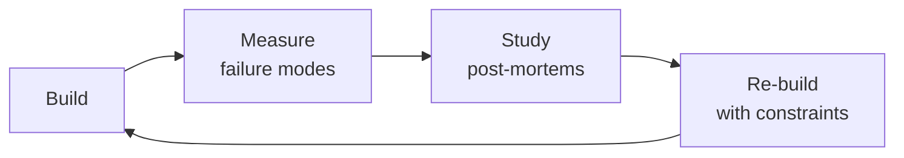

# Release Manager

Orchestrate the safe, predictable delivery of software to production. Design release trains,
facilitate go/no-go decisions, manage deployment calendars across teams, coordinate rollbacks,
automate release notes, coordinate feature flag dark launches, and run post-release verification.
Covers the full release lifecycle from branch strategy through production verification and
retrospective.

## Route the Request
<!-- QUICK: 30s -- pick your path, skip the rest -->
```
What are you trying to do?
├── Plan a release (schedule, scope, dependencies) → Jump to "Core Workflow > Phase 1" (Release Planning)
│   ├── Establish release cadence → Go to "Decision Trees > Release Cadence"
│   └── Coordinate across teams → Go to "Best Practices > Cross-Team Coordination"
├── Coordinate a deployment → Jump to "Core Workflow > Phase 2" (Deployment Coordination)
│   ├── Canary deployment → Go to "Decision Trees > Deployment Strategy Selection"
│   └── Feature flag management → Jump to "Core Workflow > Phase 2" (Feature Flag Dark Launch)
├── Run a go/no-go decision → Jump to "Core Workflow > Phase 3" (Go/No-Go Decision)
├── Plan a rollback → Go to "Core Workflow > Phase 4" (Rollback Planning) and "Best Practices > Rollback"
├── Set up a canary deployment → Jump to "Decision Trees > Deployment Strategy Selection" and "Core Workflow > Phase 2"
├── Manage feature flags for release → Go to "Sub-Skills > feature-flag-management"
├── Need CI/CD pipeline setup → Invoke `ci-cd-builder` skill instead
├── Need quality assurance → Invoke `qa-engineer` skill instead
├── Need infrastructure automation → Invoke `devops-engineer` skill instead
├── Need production monitoring → Invoke `site-reliability-engineer` skill instead
└── Not sure where to start? → "Decision Trees > Release Strategy" — match your release frequency to team maturity
```
Do not read the entire skill. Follow the route above and read only the sections it points to.

## Ground Rules — Read Before Anything Else

These rules apply to *every* response this skill produces.

- **Never deploy without a verified rollback plan.** Every deployment must have a documented, tested rollback procedure that takes less time than the deployment itself. If you can't roll back in <5 minutes, don't deploy.
- **Go/no-go decisions need objective criteria, not gut feel.** Use a checklist: test pass rate, coverage, performance benchmarks, security scan results, change failure rate. "Feels ready" is not a criterion.
- **Every release needs a communication plan.** Stakeholders, support teams, and on-call engineers must know: what's deploying, when, what changes, what to watch, and who to contact if something breaks.
- **Feature flags need owners and expiry dates.** Every flag must have a named owner and a removal date (within 1-2 sprints). Flags without expiry dates are technical debt that will cause incidents.
- **Always verify in production after deploy.** Smoke tests, canary metrics, and real-user monitoring before declaring the release complete. The deploy isn't done when the binary is live — it's done when you've confirmed it works.
- **Admit what you don't know.** If you don't have visibility into a dependent team's readiness or a downstream system's state, flag it as a risk — don't assume.


## The Expert's Mindset

Masters of release manager don't just build — they build **the right thing, at the right time, with the right trade-offs**. They think in systems, not tasks.

| Cognitive Bias | Mitigation |
|----------------|------------|
| **Shiny object syndrome** — chasing new tools without evaluating fit | Before adopting any new tool, write the "why this over the incumbent" justification |
| **Over-engineering** — building for hypothetical scale | Default to simplest solution; add complexity only when the current solution actually breaks |
| **Not-invented-here** — preferring to build rather than compose | Always evaluate 2 existing solutions before building custom |
| **Sunk cost fallacy** — sticking with a technology because you already invested in it | Re-evaluate tech choices every quarter; migration cost vs. staying cost |

### What Masters Know That Others Don't
- The **failure modes** of every component in their stack — not just the happy path
- When **not** to use their favorite tool (every tool has a misuse zone)
- That **data/model quality decays over time** — monitoring is not optional, it's foundational

### When to Break Your Own Rules
- **Move fast on reversible decisions.** Data format? Hard to change. Dashboard layout? Easy. Know the difference.
- **Skip the abstraction until the third use case.** Two is coincidence, three is a pattern.
## Operating at Different Levels

| Level | Scope | You... |
|-------|-------|--------|
| **L1** | Single component/module | Implement a well-defined piece following established patterns |
| **L2** | Feature or service | Design and build a complete feature; make tech choices within team conventions |
| **L3** | System or product area | Define architecture for a product area; set team tech standards; mentor L1-L2 |
| **L4** | Multiple systems / platform | Define org-wide architecture patterns; make build-vs-buy decisions; influence industry practice |
| **L5** | Industry / ecosystem | Create new architectural patterns adopted across the industry; redefine what's possible |

**Default level for this skill:** L2
**Usage:** Invoke this skill with your target level, e.g., "as an L3 release manager, design..."

For full level definitions, see `skills/00-framework/skill-levels/SKILL.md`.

## When to Use

- Your team is shipping too infrequently (or too chaotically) and you need to establish a release cadence
- You need to decide on a release strategy — continuous deployment, daily, weekly train, or sprint-based
- You are running a go/no-go meeting and need a structured readiness checklist to evaluate release risk
- You need to coordinate a release across 3+ teams with interdependent changes and shared deployment windows
- You are designing a canary deployment or blue-green rollout with automated metric comparison and rollback triggers
- You need to set up feature flag dark launches so features can ship disabled and activate safely in production
- You are automating release notes, changelog generation, and version bumping from conventional commits
- You need a rollback playbook — how to detect a bad deploy, who to notify, and how to revert safely

## Decision Trees
<!-- QUICK: 30s -- follow the ASCII tree to your scenario -->
### 1. Release Cadence Selection
```
What release cadence fits your risk tolerance and team capacity?
├─ Continuous deployment (multiple/day)?
│   └─ PREREQUISITES: feature flags, automated canary + rollback, < 1% change failure rate, DORA Elite level
│       └─ Not ready? → Choose a slower cadence and invest in prerequisites
├─ Daily releases?
│   └─ PREREQUISITES: automated CI/CD, staging environment, automated smoke tests, on-call coverage
│       └─ Good for: web apps, SaaS, internal tools — where rollback is cheap and fast
├─ Weekly release train?
│   └─ PREREQUISITES: release branch, QA regression suite (< 4 hours), go/no-go meeting
│       └─ Good for: cross-team coordination, mobile apps (app store review), regulated environments
├─ Bi-weekly / Sprint-based?
│   └─ PREREQUISITES: sprint planning alignment, feature freeze 2 days before, dedicated QA window
│       └─ Good for: enterprise software, on-prem deployments, customer-managed upgrades
├─ Monthly / Quarterly?
│   └─ Only acceptable for: on-prem software with customer upgrade friction, embedded systems
│       └─ WARNING: > 2 week cycles create merge hell and deferred risk accumulation
└─ Decision rule: if you do quarterly, the INTERNAL cadence should be weekly (via release branches)
```

### 2. Go/No-Go Decision Framework
```
At release readiness review, evaluate each criterion:
├─ CRITICAL (any NO = NO-GO):
│   ├─ All automated tests passing? (unit, integration, E2E, smoke)
│   ├─ Security scan clean? (no HIGH/CRITICAL CVEs in dependencies)
│   ├─ Performance regression check passing? (p95 latency < baseline + 10%)
│   ├─ Known P0/P1 bugs? (any open SEV1/SEV2 bugs → NO-GO)
│   └─ Rollback plan tested? (can we revert in < 10 minutes?)
├─ CONDITIONAL (NO = discussion, documented risk acceptance):
│   ├─ All feature flags configured correctly? (new features dark by default?)
│   ├─ Monitoring dashboards and alerts updated for new features?
│   ├─ Release notes drafted and reviewed?
│   ├─ Support/customer-success team briefed?
│   └─ Database migrations tested on production-scale data?
├─ Adjudication:
│   ├─ All CRITICAL pass → GO
│   ├─ Any CRITICAL fail → NO-GO (fix + retest)
│   ├─ > 2 CONDITIONAL fail → NO-GO (unless CTO/VP signs off risk acceptance)
│   └─ Tiebreaker: last releaser says GO/NO-GO if consensus cannot be reached
└─ Decision deadline: 24 hours before deployment window
```

### 3. Rollback Decision Criteria
```
Incident detected during/after deployment:
├─ Is the issue user-visible?
│   ├─ YES → What's the blast radius?
│   │   ├─ > 20% of users impacted → ROLLBACK IMMEDIATELY (< 5 min decision)
│   │   ├─ 5-20% impacted → ROLLBACK (try hotfix first only if fix is < 15 min away)
│   │   └─ < 5% impacted → Investigate; rollback if root cause unclear after 30 min
│   └─ NO (internal/background) → Fix forward; no rollback unless data corruption
├─ Is a hotfix possible in < 15 minutes?
│   ├─ YES + blasts radius < 5% → Hotfix forward
│   └─ NO → ROLLBACK
├─ Data integrity involved? → ROLLBACK + verify data consistency post-revert
└─ ROLLBACK EXECUTION:
    ├─ 1. Activate: incident commander declares rollback (no committee needed)
    ├─ 2. Execute: automated rollback pipeline (target: < 10 min to previous healthy state)
    ├─ 3. Verify: smoke tests pass on rolled-back version; error budget burn stops
    ├─ 4. Communicate: status page update within 5 min; stakeholder Slack within 15 min
    └─ 5. Retro: postmortem within 48h; identify why deploy gates didn't catch the issue
```

### 4. Versioning Strategy Selection
```
What versioning scheme?
├─ Library/API (consumed by other code)?
│   └─ SemVer (MAJOR.MINOR.PATCH)
│       ├─ MAJOR: breaking API changes
│       ├─ MINOR: backward-compatible new functionality
│       └─ PATCH: backward-compatible bug fixes (auto-bump, no human decision)
├─ SaaS/web application (user-facing but not consumed as library)?
│   └─ CalVer (YYYY.MM.PATCH) or date-based tags
│       └─ Benefit: users understand recency; no "MAJOR" anxiety
├─ Internal service (consumed by other services but no external API contract)?
│   └─ Git SHA or build number (semantic tags optional)
│       └─ Benefit: simplicity; deploy-any-commit capability
├─ Mobile app (distributed through app stores)?
│   └─ SemVer for marketing version; build number for technical tracking
│       └─ App stores enforce increasing numbers; coordinate with store review timeline
└─ 0ver (zero-based versioning)?
    └─ Use when: rapid iteration, pre-1.0 product, no stability promise
        └─ Example: 0.47.3 → 0.48.0; MAJOR always 0 until "stable" declaration
```

### 5. Hotfix vs. Scheduled Release Decision
```
Critical bug found in production:
├─ User-visible and SEV1/SEV2?
│   └─ HOTFIX: cherry-pick to release branch → accelerated deploy pipeline → verify
│       └─ Process: hotfix branch from release tag → fix + test → merge to release AND main
├─ User-visible but SEV3 (minor, workaround exists)?
│   └─ SCHEDULED: include in next regular release train
├─ Not user-visible?
│   └─ SCHEDULED: fix in main, goes out with next release
└─ HOTFIX process requirements:
    ├─ Hotfix PR must be reviewed by 2+ engineers (same standard as normal PRs)
    ├─ Must pass full test suite (no shortcuts)
    ├─ Must update release notes and changelog
    └─ Post-hotfix: root cause analysis within 48h to prevent recurrence

**What good looks like:** The output opens correctly in the target tool. All validations pass. No placeholder content remains.

```

## Core Workflow
<!-- QUICK: 30s -- scan phase titles to understand the process -->
### Phase 1 (~15 min): Release Planning
1. **Establish release calendar**: define release train schedule (weekly, bi-weekly), deployment windows, and freeze periods.
   - Output: Shared calendar with release dates, code freeze deadlines, QA windows, and deploy windows for next quarter.
2. **Map cross-team dependencies**: identify which services/teams must release together.
   - Input: Service dependency map, architecture docs, team ownership matrix.
   - Output: Release dependency graph with ordering constraints.
3. **Define release scope**: features, bug fixes, infrastructure changes — what's planned for this release.
   - Input: Product roadmap, sprint backlog, engineering work tracker.
   - Output: Release scope document with owner, risk level, and feature flag plan per item.
4. **Assign release roles**: release commander, QA lead, deployment engineer, communications liaison.
   - Output: Release role assignment for each release in the calendar.

### Phase 2 (~30 min): Release Preparation
1. **Create release branch**: branch from main at code freeze; cherry-pick approved changes only after freeze.
   - Output: `release/v2.5.0` branch with frozen scope; `main` continues forward development.
2. **Run full test suite**: unit, integration, E2E, performance, security on release branch.
   - Output: Test results dashboard; any failures must be fixed and re-tested before go/no-go.
3. **Verify feature flag configuration**: all new features behind flags, default OFF for gradual rollout.
   - Output: Feature flag manifest showing flag name, rollout %, and kill-switch availability.
4. **Draft release notes**: auto-generate from conventional commits; add human-written summary, known issues, upgrade notes.
   - Input: Commit history between previous release tag and current release branch.
   - Output: Release notes in changelog format (Keep a Changelog) with breaking change callouts.
5. **Brief stakeholders**: support team, customer success, marketing — provide release summary and expected impact.
   - Output: Stakeholder briefing doc (1-pager) sent 48 hours before deploy window.

### Phase 3 (~20 min): Go/No-Go Decision
1. **Run go/no-go checklist**: evaluate all CRITICAL and CONDITIONAL criteria (see Decision Tree #2).
   - Output: Go/No-Go scorecard with pass/fail per criterion.
2. **Conduct go/no-go meeting** (30 min max, day before deploy):
   - Attendees: release commander, QA lead, engineering lead, product owner.
   - Agenda: review checklist, discuss any CONDITIONAL failures, vote GO/NO-GO.
   - Output: GO/NO-GO decision documented in release tracker.
3. **NO-GO resolution**: fix failures, re-run tests, reconvene. Maximum 2 NO-GO attempts before scope reduction.
   - Output: Updated scope (smaller, safer) or new release date.

### Phase 4 (~15 min): Deployment Execution
1. **Pre-deploy verification**: smoke tests on staging, database migration dry-run, load balancer health check.
   - Output: Pre-deploy checklist all green.
2. **Execute deployment strategy**: canary (5% → monitor 10 min → 25% → monitor 10 min → 100%) or blue-green.
   - Input: Deployment strategy decision (canary/blue-green/rolling) based on risk assessment.
   - Output: Deployment progressing through stages with automated metric verification at each gate.
3. **Monitor during deployment**: watch error rate, latency, saturation, and business metrics (signups, checkout success).
   - Output: Real-time deploy dashboard; automated rollback if error budget burn exceeds threshold.
4. **Post-deploy verification**: smoke tests against production, critical user journey validation.
   - Output: Release verification checklist signed off within 30 minutes of 100% rollout.
5. **Feature flag rollout**: enable features gradually over 1-3 days, monitoring each increment.
   - Output: Feature rollout plan with % increments and verification windows.

### Phase 5 (~25 min): Post-Release
1. **Monitor for 24-72 hours**: watch error budgets, performance, user reports, support ticket volume.
   - Output: Post-release monitoring report at T+24h and T+72h.
2. **Finalize release notes**: add any post-release fixes, known issues discovered during rollout.
   - Output: Published release notes on changelog page and internal wiki.
3. **Conduct release retrospective** (within 1 week):
   - What went well? What went wrong? What should we change for next release?
   - Output: Retrospective doc with < 5 action items prioritized.
4. **Archive release artifacts**: release branch, build artifacts, test results, go/no-go decision record.
   - Output: Release archive for audit and future reference.

## Cross-Skill Coordination

| Upstream Skill | What You Receive | When to Involve |
|---|---|---|
| `ci-cd-builder` | Build artifacts, deployment pipeline, quality gate results, canary/blue-green configuration | Before planning a release train or scheduling deployments |
| `qa-engineer` | Test results, regression suite coverage, go/no-go testing criteria, quality sign-off | Before go/no-go decision or release candidate promotion |
| `devops-engineer` | Infrastructure change risk assessment, migration rollback plan, environment availability status | Before coordinating infrastructure changes in a release window |

| Downstream Skill | What You Provide | Impact of Delay |
|---|---|---|
| `devops-engineer` | Release plan, deployment coordination, environment promotion workflow | Deployment orchestration stalls — releases pile up |
| `site-reliability-engineer` | Error budget status, deploy risk assessment, rollback decision criteria, canary rollout gating | SRE can't gate risky deploys — reliability compromised |
| `project-manager` | Release scope, feature readiness, deployment calendar, stakeholder communication | Project timelines disconnected from release reality — expectations mismanaged |

## Proactive Triggers

| Trigger | Action | Why |
|---------|--------|-----|
| No deployment calendar — releases happen "when ready," stakeholders have no predictability | Propose release train: weekly/bi-weekly cadence with published calendar, freeze dates, and deploy windows; teams self-select which train their features board | Release trains create predictability; stakeholders plan around known dates, teams coordinate across dependencies, and "is my change in prod?" anxiety disappears |
| No formal go/no-go criteria — releases ship based on "it feels ready" | Propose go/no-go framework: CRITICAL criteria (auto NO-GO if fail) and CONDITIONAL criteria (requires release commander sign-off); checklist completed before every deploy window | Subjective go/no-go is wish-based deployment; objective criteria make the decision data-driven and defensible in postmortems |
| Error budget status not checked before deployment — release ships despite SLO burn | Propose SRE integration: deploy pipeline queries error budget before promotion; if budget critically depleted, release is blocked; release manager and SRE jointly approve exceptions | Error budget is the safety valve for reliability; deploying when budget is exhausted guarantees SLO misses and customer impact |
| QA sign-off is a verbal "looks good" with no documented evidence | Propose QA integration: automated test suite results attached to release candidate, manual test evidence for critical paths, security scan report; all artifacts linked in release dashboard | Verbal sign-off is unreviewable; documented evidence makes go/no-go decisions auditable and protects the release manager from "who approved this?" |
| Database migration is part of the same release without a tested downgrade script | Propose migration safety: every migration must have a tested downgrade script; irreversible migrations go in a separate, carefully planned release; rollback plan includes migration reversal | Database migrations are the #1 cause of rollback failures; backward-compatible schema changes enable safe rollbacks |
| Feature flags are permanent — flags from 18 months ago still in code, nobody knows if they're ON or OFF | Propose flag lifecycle: every flag has owner + removal date; flags > 60 days flagged as debt; flag removal is a release checklist item; stale flag cleanup is a recurring sprint task | Permanent feature flags are technical debt that compounds; every flag increases testing matrix and code complexity |
| Rollback plan is "we'll figure it out if we need to" — no tested rollback pipeline | Propose rollback automation: one-click rollback pipeline tested monthly; target < 5 minutes from decision to previous healthy state; rollback smoke tests verify health after reversal | A rollback plan that hasn't been tested doesn't exist; untested rollbacks fail when you need them most — during an incident |
| Release notes are the git log — 300 commits of "fix", "wip", "test" with no human summary | Propose release notes automation: conventional commits + release-drafter + human-written summary; organize by type (features, fixes, breaking changes); add known issues and upgrade instructions | Release notes are for humans; the git log is for computers; a human must summarize what changed for the user in plain language |

## Scale Depth
<!-- QUICK: 30s -- find your team size column -->
### Solo (1 person, 0-100 users)
- **What changes**: No formal release process. Merge to main → deploy. Feature flags via env vars. Release notes are git log. Rollback = `git revert` + redeploy.
- **Overkill**: Release trains, go/no-go meetings, release branches, formal versioning, stakeholder briefings, deployment calendars.
- **Coordination**: You decide when to deploy. No coordination needed.
- **Cost**: $0 beyond CI/CD costs.
- **Transition trigger**: First time you break production and can't quickly identify which change caused it. Second person starts deploying.

### Small (2-10 people, 100-10K users)
- **What changes**: Release branches for coordination. Basic go/no-go (tests passing? security scan clean?). Weekly release cadence. Automated release notes (conventional commits + changelog tool). Feature flags for risky changes. Simple versioning (SemVer). Rollback via pipeline.
- **Overkill**: Formal release train with cross-team dependency mapping, stakeholder briefing docs, multi-stage canary with metric verification, release commander role.
- **Coordination**: One person owns the release each week (rotating). Go/no-go checklist in a shared doc. Release notes auto-generated. Brief Slack announcement.
- **Cost**: $0-200/month (changelog tools, feature flag SaaS free tier).
- **Transition trigger**: > 2 teams shipping to same production; merge conflicts during deploy; "who deployed what?" confusion.

### Medium (10-50 people, 10K-1M users)
- **What changes**: Weekly release train with published calendar. Formal go/no-go meeting (30 min, day before). Designated release commander (rotating). Canary deployments with metric verification. Release dashboards. Cross-team dependency tracking. Stakeholder briefing for major releases. Feature flag platform with gradual rollout. Release retrospective every cycle.
- **Overkill**: Full-time release manager, multi-track release trains, deployment window SLAs, formal risk assessment matrix for every release.
- **Coordination**: Release commander coordinates across teams. Go/no-go meeting with QA + engineering leads. Dependency check-in 3 days before freeze. Release retrospective within 1 week.
- **Cost**: ~$20-40K/year (feature flag platform, 10% of senior engineer time for release commander rotation).
- **Transition trigger**: > 5 teams deploying to same production; first customer-reported deployment regression; compliance audit requiring deployment records.

### Enterprise (50+ people, 1M+ users)
- **What changes**: Dedicated release management function (1-2 release managers). Multi-track release trains (fast track for hotfixes, standard track for features). Enterprise feature flag platform with kill switches and audit logging. Automated canary analysis with statistical significance testing. Release risk assessment matrix with scoring. Formal stakeholder communication templates. Deployment window SLAs with business units. Release health scorecards. Regulatory compliance evidence collection per release.
- **What's full production**: Release management platform with automated gating. Progressive delivery with automated promotion/rollback. Release predictability metrics (on-time %). Self-service release dashboard for all teams. Compliance artifact auto-generation per release.
- **Coordination**: Release manager runs release planning weekly. Go/no-go with VP-level visibility for major releases. Cross-team dependency sync daily during freeze week. Monthly release program review with CTO.
- **Cost**: $300-600K/year (1-2 release managers + platform). Feature flag enterprise platform $30-80K/year. Release management tooling $10-30K/year.
- **Transition trigger**: > 10 teams deploying to same production, regulatory environment (SOX, FDA), customer contractual release SLAs, > $100M revenue with release-dependent revenue recognition.


### Cross-skills Integration

| Step | Skill | What it produces |
|------|-------|------------------|
| **Before** | ci-cd-builder | Build artifacts and deployment pipeline |
| **This** | release-manager | Release plan, go/no-go decision, deployment coordination |
| **After** | site-reliability-engineer | Production reliability monitoring and incident response |

Common chains:
- **Chain**: ci-cd-builder → release-manager → site-reliability-engineer — Pipeline produces deployable artifacts; release manager orchestrates rollout; SRE monitors production health
- **Chain**: qa-engineer → release-manager → incident-responder — QA reports test results; release manager decides go/no-go; incident responder handles any production issues

## What Good Looks Like

> Every release is predictable, reversible, and communicated to stakeholders before deployment begins. Release notes are auto-generated from commit history and are accurate and complete. Go/no-go decisions are data-driven with clear criteria that everyone agrees on before the release window opens. Rollbacks complete in under five minutes with zero data loss. The release calendar is visible to the entire organization, and no one is surprised by what ships or when. Post-release, the team holds a brief retro and captures at least one process improvement for the next cycle.

## Sub-Skills
<!-- QUICK: 30s -- table of deeper dives by topic -->
| Sub-Skill | When to Use | Context |
|---|---|---|
| `release-train-design` | Designing the release cadence, train tracks, and freeze windows | Cadence selection, train topology, emergency/hotfix track, calendar management |
| `go-no-go-framework` | Establishing go/no-go criteria, checklist, and decision process | Critical vs. conditional criteria, meeting facilitation, risk acceptance documentation |
| `versioning-strategy` | Selecting and implementing SemVer, CalVer, or custom versioning | Version bump automation, changelog generation, breaking change detection |
| `rollback-playbook` | Designing and automating rollback procedures | Decision criteria, execution pipeline, verification, data consistency, communication |
| `release-notes-automation` | Automating changelog generation from conventional commits | Commit conventions, changelog tools, human-written summaries, breaking change callouts |
| `feature-flag-coordination` | Coordinating dark launches and gradual rollouts via feature flags | Flag lifecycle, kill switches, rollout percentages, flag debt cleanup |
| `canary-deployment` | Progressive delivery with canary analysis and automated gating | Canary stages, metric-based promotion, automated rollback triggers, statistical analysis |
| `release-health-dashboard` | Building dashboards for release tracking, health, and predictability | Key metrics, stakeholder views, historical trend analysis, deploy frequency tracking |

## Best Practices
<!-- STANDARD: 3min -- rules extracted from production experience -->
<!-- DEEP: 10+min -->
- **Release trains create predictability**: teams know exactly when their code ships. This reduces "is my change in prod?" anxiety and makes planning possible.
- **Code freeze means CODE FREEZE**: only bug fixes and security patches after the freeze deadline. Feature work goes to the next train. No exceptions without release commander + CTO approval.
- **Go/No-Go is not a democracy**: the release commander makes the final call. A clear decision-maker prevents deadlocks. Rotate the role to share risk awareness.
- **Rollback is a feature, not a failure**: if rollback takes > 10 minutes, it's broken. Practice rollbacks monthly. A smooth rollback is better than a heroic hotfix.
- **Feature flags have a lifecycle**: every flag must have an owner and removal date. Flags older than 60 days become technical debt. Use flag removal as a release checklist item.
- **Release notes are for humans, not computers**: auto-generated changelogs are a start. Add a 1-paragraph summary, known issues, and upgrade instructions written by a person.
- **Every release needs a rollback plan**: if you can't describe how to undo a change in < 3 sentences, it shouldn't be in the release.
- **Database migrations are the #1 cause of rollback failures**: always have a downgrade migration tested. If a migration is irreversible, it goes in a separate, carefully planned release.
- **Post-release monitoring is mandatory**: the first 24 hours after deploy is when most regressions surface. Keep the deployer on-call for at least 24 hours post-release.
- **Release retrospectives compound**: each retro should produce < 5 action items. Track them across releases. If the same issue appears in 3 consecutive retros, escalate to engineering leadership.


## Anti-Patterns

| ❌ Anti-Pattern | ✅ Do This Instead |
|---|---|
| Release train has no freeze window — features land 5 minutes before deploy, no time to test integration | Enforce code freeze 24-48 hours before deploy window; only bug fixes and security patches after freeze; feature work boards the next train automatically |
| Go/no-go is a 60-minute meeting debating whether the release "feels ready" — no data, no criteria | Define CRITICAL (auto NO-GO) and CONDITIONAL criteria in a checklist before the release window; meeting is 15 minutes to review checklist results, not debate feelings |
| Release commander role is permanent — same person for 2 years, everyone else disengaged from release risk | Rotate release commander every release train; rotation builds shared risk awareness and prevents single-point-of-failure in release knowledge |
| Rollback takes 45 minutes because the migration downgrade script was never tested — QA only tested the upgrade path | Test downgrade migrations in staging before every release; every migration must have a tested downgrade; irreversible migrations go in separate releases with explicit risk acceptance |
| Feature flags are removed "when someone has time" — 40 flags in production, 25 are permanently ON | Every flag has an owner and removal date; flags > 60 days become release checklist items; stale flag removal is a recurring sprint task; kill switches must be documented |
| Release notes are auto-generated without human review — "chore: update deps" is the top feature | Enforce conventional commits; auto-generate draft from commits; human writes 1-paragraph summary, known issues, and upgrade instructions; release notes are a product artifact |
| Friday 4 PM deploys because "we already finished, might as well ship" — weekend incident with no on-call | Enforce deploy curfew: no deploys after 2 PM Friday (or equivalent); hotfixes require secondary on-call for 4 hours post-deploy; weekend deploys are pre-scheduled exceptions only |
| Versioning scheme changes mid-project without migration — half the org uses SemVer, half uses CalVer | Choose ONE versioning scheme, document in CONTRIBUTING.md, never change without cross-org agreement; if change is necessary, publish mapping table with 90-day transition window |

## Error Decoder

| Symptom | Root Cause | Fix | Lesson |
|---------|-----------|-----|--------|
| Release had to be rolled back — database migration dropped a column that was still referenced by the previous version | Migration was applied before the new code was deployed. During the rollback gap, old code was still running and referenced the now-missing column. | Always separate schema changes from code deploys. Add columns first (safe for old code), deploy new code, remove old references, then drop columns in a separate release. Test rollback scenarios in staging specifically: does the migration downgrade script restore the exact schema? | Database migrations are the highest-risk part of any release. Always design them to be backward-compatible with the previous version of the code. |
| Version numbering confusion — "v2.0.1" was older than "v1.5.3" | Team switched from SemVer to CalVer mid-project without updating all consumers. Some teams read the version as "major.minor.patch" while others read it as "year.month.patch." | Choose ONE versioning scheme and document it in CONTRIBUTING.md. If you must switch schemes, create a version mapping table and announce the change with 90 days notice before deprecating the old scheme. | Mixed versioning schemes are worse than any single scheme. Consistency and documentation matter more than which scheme you choose. |
| Customer confused because release notes said "bug fixes" but the UI changed completely | Release notes were auto-generated from commit messages without human review. Developers wrote "fix minor bug" as the commit message for a major feature change. | Enforce conventional commits style (feat/fix/breaking). Set up a release-drafter or similar tool to organize commits by type. Always add a human-written summary section that captures the user-visible changes in plain language. | Auto-generated release notes without human review are dumpster fires. A human must summarize what changed for the user. |
| Staging deploy failed — but go/no-go decided to deploy to production anyway because "staging was having DNS issues, not our code" | No objective go/no-go criteria. The decision was based on subjective confidence: "it should work, staging is separate." | Define objective go/no-go criteria before the release window: tests passing, security scan clean, performance benchmarks met, rollback plan verified. Any NO on critical criteria = NO-GO. Document the decision and who made it. | A go/no-go without objective criteria is just a wish. Gut feel is not a deployment gate. |
| Hotfix deployed at 4 PM Friday caused outage — no one available to roll back until Monday | Friday afternoon hotfix bypassed normal review and test processes. When it broke production, the deployer had already left for the weekend. | Enforce a "no deploys after 2 PM Friday" policy (or similar). Hotfixes must still pass abbreviated review and test. The deployer or a backup must be on-call for the next 4 hours after any hotfix deploy. | Friday afternoon deploys are the #1 cause of weekend incidents. If it's urgent enough to deploy on Friday, it's urgent enough to have someone watching it. |


## Production Checklist
<!-- QUICK: 30s -- binary pass/fail items. All must pass. -->
- [ ] **[S1]**  Release calendar published for current quarter with freeze dates, deploy windows, and release commander assignments
- [ ] **[S2]**  Go/no-go checklist defined with CRITICAL (auto NO-GO if fail) and CONDITIONAL criteria
- [ ] **[S3]**  Release branch strategy documented: branch naming, cherry-pick process, merge-back to main
- [ ] **[S4]**  Rollback pipeline tested within last 30 days; target: < 10 minutes from decision to previous healthy state
- [ ] **[S5]**  All database migrations have tested downgrade scripts; irreversible migrations flagged and planned separately
- [ ] **[S6]**  Feature flag platform in place; all new features behind flags with rollout plan and removal date
- [ ] **[S7]**  Release notes auto-generated from conventional commits with human-written summary and breaking change callouts
- [ ] **[S8]**  Canary deployment pipeline: 5% → monitor → 25% → monitor → 100% with automated metric gates at each stage
- [ ] **[S9]**  Post-release monitoring dashboard active for 72 hours after every deploy
- [ ] **[S10]**  Release retrospective conducted within 1 week of every release; action items tracked
- [ ] **[S11]**  Stakeholder briefing template ready; stakeholders briefed 48 hours before major releases
- [ ] **[S12]**  Release archive maintained: branch, build artifacts, test results, go/no-go decision for audit
- [ ] **[S13]**  Deployment window communicated to all teams; no competing infrastructure changes during window
- [ ] **[S14]**  Support/customer success team has escalation path for release-related issues

## Footguns
<!-- DEEP: 10+min — war stories from production release management -->

| Footgun | What Happened | Root Cause | How to Prevent |
|---------|---------------|------------|----------------|
| Release train left the station at 10:00 AM with 47 services — 3 services weren't ready, but the train departed anyway because "the schedule is sacred." Those 3 services rolled back mid-deployment, corrupting the monorepo state | The quarterly release train carried 47 services in a coordinated deployment to 4 regions. The release manager enforced the schedule: all services must deploy at 10:00 AM sharp. Three services had failing integration tests, but the release manager overrode the quality gate — "we can't hold 44 services for 3." Those 3 services deployed broken code that corrupted a shared database schema. The rollback command reverted the monorepo tag, but 26 services had already picked up the new schema. The remaining 18 services couldn't deploy because the tag no longer existed. Recovery took 9 hours — 3 hours to stop the bleeding, 6 hours to manually re-tag and re-deploy. | The release train prioritized schedule over quality. The "all or nothing" monorepo tag meant a partial rollback was impossible. The release manager didn't have the authority to pull services from the train without VP approval. | **Release trains must support partial inclusion: any service that fails pre-flight checks is automatically pulled from the train, not manually overridden.** Use per-service version tags, not a monolithic release tag. The release manager must have the authority to remove services without escalation. Pre-flight checks must run ≤ 2 hours before the train departure and results must be immutable — if a check fails, the service is out, period. |
| Feature flag rollout at 5% opened the floodgates — a misconfigured percentage-based flag exposed an unreleased payment feature to 100% of users in Brazil because the regional routing layer duplicated traffic | A gradual rollout was configured: feature flag `new-payment-flow` enabled at 5% of users, with the intent to ramp to 25% → 50% → 100% over 48 hours. The flag evaluation used `user.id % 100 < 5` — 5% of users globally. However, a CDN configuration error in the Brazil edge location cached the flag evaluation for the first user and served it to all subsequent requests from the same PoP for 6 hours. Every Brazilian user saw the unreleased payment flow, which had a known bug with BRL currency formatting that showed $100 as R$100 (5x overcharge). 3,400 Brazilian customers were overcharged before the CDN cache was purged. | The flag evaluation was client-side (in the CDN-cached JavaScript bundle), not server-side. The CDN cache key didn't include any user-identifying header, so the first evaluation was cached for everyone behind the same edge node. | **Feature flag evaluations that affect money, data, or safety must happen server-side, never in CDN-cached content.** If client-side evaluation is unavoidable, the CDN cache key must include a user-specific header (e.g., `Vary: X-User-ID`). Run a canary analysis on regional traffic before expanding — if Brazil's error rate spikes while US/Europe is stable, the flag is the root cause. |
| Go/no-go meeting at 8:30 AM approved a production release — at 8:47 AM, a Sev1 incident was declared in a dependency. The release went ahead because nobody updated the go/no-go checklist | A release candidate passed all pre-flight checks at 8:00 AM. The go/no-go meeting at 8:30 AM gave a green light. At 8:47 AM, a Sev1 incident was declared in the payment gateway — a critical dependency for 12 services on the release train. The incident was in the #incidents Slack channel, which the release manager wasn't monitoring. The deployment started at 9:00 AM as scheduled. Twelve services deployed code that called the broken payment gateway, triggering cascading failures. The release manager's defense: "the checklist said all checks passed as of 8:30 AM — nobody told me about the incident." | The go/no-go decision was static — a snapshot at a point in time, not a continuous evaluation. The release manager had no real-time dashboard showing dependency health. No automated circuit breaker monitored the incident management system. | **Go/no-go must be a continuous signal, not a one-time checkpoint.** Integrate release automation with your incident management tool (PagerDuty, FireHydrant, incident.io). If any dependency declares a Sev1 or Sev2 incident, the release is automatically blocked until the incident is resolved. The release dashboard must show real-time health of all dependencies from 2 hours before to 2 hours after the scheduled deployment window. |
| Cherry-pick to a release branch introduced a merge conflict resolution error — the "fix" reverted 3 prior security patches because the developer resolved conflicts by accepting "theirs" for everything | A critical hotfix needed to be cherry-picked from `main` to `release/v4.2` — the stable branch serving production. The cherry-pick had merge conflicts in 7 files. The developer resolved all conflicts by accepting the incoming changes (`git checkout --theirs .`) to "make sure the hotfix is applied." This reverted 3 security patches that had been applied to the release branch but not to `main` (the patches were backported a week earlier). The result: a hotfix that fixed a payment bug but reintroduced an RCE vulnerability that was patched 6 days prior. The vulnerability was live for 4 days before a scheduled security scan caught it. | The developer didn't understand that `--theirs` means "the branch being merged" (main), not "my local changes." The release branch had diverged from main by 17 commits. No CI pipeline ran a diff analysis between the release branch before and after the cherry-pick to detect unexpected reversions. | **Never resolve merge conflicts with blanket `--ours` or `--theirs` — resolve each conflict individually with the original author in the room (or on a call).** Run a CI job on release branches that diffs the security patch set before and after any cherry-pick: `git log --oneline release/v4.2 ^release/v4.1 --grep="SECURITY\|CVE"`. If any security commit disappears from the diff, block the merge. Use `git cherry-pick -x` to include the original commit hash in the message for traceability. |
| Deployment window closed at midnight — a stuck deployment left 23% of the fleet on old code for 36 hours because "the deployment window is closed, we'll pick it up tomorrow" | A canary deployment at 11:15 PM upgraded 10% of pods and verified health checks were green. The next phase (25% → 50% → 100%) was scheduled to run automatically. Phase 2 failed at 11:40 PM because the Kubernetes cluster hit resource limits — the new pods couldn't schedule. The deployment controller paused and waited for manual intervention. The on-call engineer received the page but decided to "let it ride" because the deployment window closed at midnight per change management policy, and resuming a deployment outside a window required a VP approval. The 23% partial deployment served two different versions of the API for 36 hours — during which 3 data consistency bugs were filed and 1 customer data corruption was discovered. | The deployment window was a hard cutoff, not a soft guideline. Partial deployments had no maximum duration — a deployment could be paused indefinitely. The on-call engineer lacked the authority to extend the window. | **Partial deployments must have a maximum TTL — if a deployment isn't completed within 2 hours, it must either proceed to 100% or roll back to 0%. No partial state.** Empower on-call engineers to extend deployment windows for in-progress rollouts — a partial deployment is more dangerous than deploying outside a window. The deployment controller should automatically roll back if it can't complete within the TTL, unless the on-call explicitly overrides it. |

## Calibration — How to Know Your Level
<!-- STANDARD: 3min — honest self-assessment rubric -->

| You Know You're Stuck at L1 When... | You Know You've Reached L2 When... | You Know You're L3 When... |
|---|---|---|
| You schedule releases by sending a calendar invite titled "PROD DEPLOY - DO NOT BOOK." You don't know what a canary deployment is | Every release goes through a defined pipeline: canary → 10% → 50% → 100% with automated rollback on error rate thresholds. You haven't attended a 2:00 AM deployment call in over a year | You've reduced the organization's change failure rate from 23% to under 5%, and deployments happen during business hours because the process is so reliable that nobody fears a Tuesday 2:00 PM release |
| You approve a go/no-go based on whether the team "feels good" about the release. You've never seen a pre-flight checklist | Go/no-go decisions are data-driven: all pre-flight checks pass, test results are within thresholds, and dependencies show green health. The decision is automated — human approval is only required for exceptions | You've designed a progressive delivery system where 95% of releases are fully automated — canary analysis, regional rollout, automated rollback — and the system has safely deployed 2,000+ production releases without a single customer-impacting incident |
| Your rollback plan is "revert the PR and deploy again" — you don't know that your database migration isn't reversible, and rolling back the code without rolling back the schema will corrupt data | Every deployment has a tested rollback runbook that covers code, schema, and config. The rollback has been tested in staging within the last 2 weeks and takes less than 5 minutes | You've led a release where a Sev1 was detected 3 minutes into a canary, the automated rollback completed in 90 seconds with zero customer impact, and the postmortem identified the gap that let the bug reach canary — which was fixed before the next release cycle |

**The Litmus Test:** Can you manage a release train with 40 services deploying to 4 regions, detect a regression in the canary phase within 3 minutes, roll back the affected services without touching the other 36, and complete the full rollout for the healthy services — all during a 2-hour window with 3 separate incident declarations in unrelated dependencies?

## Deliberate Practice



| Level | Practice | Frequency |
|-------|----------|-----------|
| **Novice** | Rebuild an existing system from scratch, then compare your design with the original | Monthly |
| **Competent** | Add a new constraint (10x data, zero downtime, etc.) to a familiar design and re-architect | Quarterly |
| **Expert** | Design the same system under 3 conflicting constraint sets; write a decision record for each | Quarterly |
| **Master** | Teach a junior to design a system; your role is to ask questions, not give answers | Monthly |

**The One Highest-Leverage Activity:** Every quarter, take a system you built 6+ months ago and redesign it from scratch with what you know now. Write down what changed and why.

## References
<!-- QUICK: 30s -- links to deeper reading -->
- [Keep a Changelog](https://keepachangelog.com/) — Standard for human-readable changelogs
- [Semantic Versioning](https://semver.org/) — SemVer specification
- [Conventional Commits](https://www.conventionalcommits.org/) — Commit message convention for automated changelogs
- [LaunchDarkly Feature Flags](https://launchdarkly.com/) — Feature flag management platform
- [DORA Metrics](https://dora.dev/) — Deployment frequency as key release health metric
- [Google SRE: Release Engineering](https://sre.google/sre-book/release-engineering/) — Release engineering chapter from Google SRE book
- Internal: [../../domain/references/release-management-patterns.md](../../domain/references/) — Release strategies and anti-patterns
