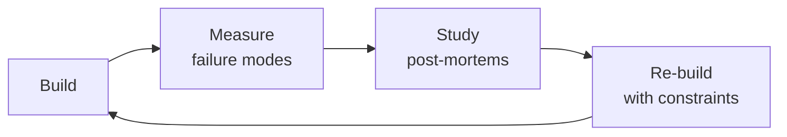

# Release Manager
> **Portability target:** Spec-level (runs on Claude Code, Copilot, Gemini CLI, Codex, Cursor). No vendor-specific frontmatter fields.

Orchestrate the safe, predictable delivery of software to production. Design release trains,
facilitate go/no-go decisions, manage deployment calendars across teams, coordinate rollbacks,
automate release notes, coordinate feature flag dark launches, and run post-release verification.
Covers the full release lifecycle from branch strategy through production verification and
retrospective.

## Route the Request

<!-- QUICK: 30s -- auto-route first, then intent-route -->

### Auto-Route (No User Input Required)
Evaluate these file-system conditions in order. First match wins — jump immediately.

| # | Condition | Action |
|---|-----------|--------|
| A1 | `file_exists(".github/workflows/release*.yml")` OR `file_contains(".github/workflows/*.yml", "release.*train\|deploy.*prod")` | Go to "Core Workflow > Phase 2" (Deployment Coordination) — release pipeline detected |
| A2 | `file_contains("**/migrations/**", "down\|downgrade\|rollback")` OR `file_exists("prisma/migrations/")` | Go to "Core Workflow > Phase 4" (Rollback Planning) — DB migrations detected |
| A3 | `file_exists("feature-flags.yaml")` OR `file_contains("*.go", "featureflag\|launchdarkly\|unleash")` OR `file_contains("*.env", "FEATURE_FLAG\|FF_")` | Go to "Sub-Skills > feature-flag-management" — feature flags detected |
| A4 | `file_exists("go-no-go-checklist.md")` OR `file_contains("docs/*.md", "go.*no-go\|go/no-go\|release.*checklist")` | Go to "Core Workflow > Phase 3" (Go/No-Go Decision) — go/no-go docs detected |
| A5 | `file_contains(".github/release-drafter.yml", "template\|categories")` OR `file_exists(".github/release.yml")` | Go to "Best Practices > Release Notes" — release drafter/notes config detected |
| A6 | `file_contains("CHANGELOG.md", "BREAKING CHANGE\|## [v")` AND `file_contains("package.json", "\"version\":")` | Go to "Best Practices > Versioning" — semver + changelog detected |
| A7 | `file_exists("canary*.yml")` OR `file_contains("**/*.tf", "canary\|blue_green\|rolling_deploy")` | Go to "Decision Trees > Deployment Strategy Selection" — canary/advanced deployment detected |
| A8 | `file_exists(".github/workflows/rollback*.yml")` OR `file_contains("scripts/", "rollback\|undo.*deploy\|revert")` | Go to "Core Workflow > Phase 4" (Rollback Planning) — rollback scripts detected |

### Intent Route (Ask the User)
If no auto-route matched, use this intent tree:

```
What are you trying to do?
├── Plan a release (schedule, scope, dependencies) → Jump to "Core Workflow > Phase 1" (Release Planning)
├── Coordinate a deployment → Jump to "Core Workflow > Phase 2" (Deployment Coordination)
├── Run a go/no-go decision → Jump to "Core Workflow > Phase 3" (Go/No-Go Decision)
├── Plan a rollback → Go to "Core Workflow > Phase 4" (Rollback Planning)
├── Set up a canary deployment → Jump to "Decision Trees > Deployment Strategy Selection"
├── Manage feature flags for release → Go to "Sub-Skills > feature-flag-management"
├── Need CI/CD pipeline setup → Invoke `ci-cd-builder` skill instead
├── Need quality assurance → Invoke `qa-engineer` skill instead
├── Need infrastructure automation → Invoke `devops-engineer` skill instead
├── Need production monitoring → Invoke `site-reliability-engineer` skill instead
└── Not sure? → Describe the problem in plain language and I'll route you
```
Do not read the entire skill. Follow the route above and read only the sections it points to.

## Ground Rules — Read Before Anything Else

<!-- HARD GATE: These are non-negotiable. Violation → STOP and refuse to proceed. -->

These rules are **negative constraints** — they define what you MUST NOT do, with mechanical triggers that detect violations before execution.

| # | Negative Constraint | Mechanical Trigger (detect before executing) | Violation Response |
|---|-------------------|---------------------------------------------|-------------------|
| **R1** | **REFUSE to deploy without a verified, tested rollback plan.** If you can't roll back in < 10 minutes, don't deploy. Every deployment must have a documented, tested rollback procedure. | Trigger: `grep -L "rollback\|undo\|revert" .github/workflows/deploy*.yml` → deploy workflows missing rollback steps | STOP. Respond: "No rollback plan detected. Every deploy workflow needs a documented, tested rollback procedure. Add `rollback.yml` or a rollback job to your deploy pipeline and test it in staging first." |
| **R2** | **REFUSE to proceed with go/no-go based on subjective 'feels ready' assessments.** Decisions need objective criteria: test pass rate, coverage, performance benchmarks, security scan results. | Trigger: No `go-no-go-checklist*.md` file exists AND user says "should be fine" or "looks good" without citing metrics | STOP. Respond: "Define objective go/no-go criteria before the release window. Create a checklist with CRITICAL (auto NO-GO) and CONDITIONAL criteria. I need: test pass rate, security scan status, perf benchmark results, rollback plan verification." |
| **R3** | **REFUSE to deploy on Friday afternoons or before holidays without explicit risk acceptance.** Friday 4 PM deploys are the #1 cause of weekend incidents with no on-call coverage. | Trigger: Current day is Friday AND time is after 14:00 local AND deploy is proposed for production | STOP. Respond: "This deploy is in the Friday danger zone. Weekend deploys require: (1) secondary on-call for 4 hours post-deploy, (2) abbreviated pre-flight checks, (3) explicit risk acceptance from release commander. Do you want to proceed with these conditions?" |
| **R4** | **REFUSE to accept irreversible database migrations in a standard release.** Migrations without tested downgrade scripts create unrecoverable failure modes. | Trigger: `grep -rn "CREATE\|DROP\|ALTER" migrations/**/*.sql \| grep -v "down\|downgrade\|rollback"` AND no corresponding `.down.sql` file | STOP. Respond: "Irreversible migrations detected (no downgrade script). Separating: (1) forward-compatible changes go in this release, (2) destructive changes (DROP COLUMN, DROP TABLE) go in a separate follow-up release after old code is confirmed removed." |
| **R5** | **STOP and ASK when feature flags lack owners and expiry dates.** Flags without owners and removal dates are technical debt that causes production incidents. | Trigger: `grep -rn "FEATURE_FLAG\|FF_\|feature.*flag" --include="*.env" --include="*.yaml" \| grep -v "owner\|expir\|removal_date\|created_by"` → flags missing ownership metadata | STOP. Ask: "Who owns each feature flag? When does each flag expire? Every flag needs: (1) named owner, (2) removal date (within 60 days), (3) rollout plan. Can you provide ownership and expiry for each flag?" |
| **R6** | **DETECT and WARN about missing release communication plan.** Stakeholders, support, and on-call must know what's deploying, when, and who to contact. | Trigger: No `RELEASE_NOTES.md` or `release-briefing*` file staged alongside the deploy | WARN: "No release communication detected. Add a release briefing including: what's deploying, when, what changes, what to watch, who to contact. Template: `docs/release-briefing-template.md`." |
| **R7** | **DETECT and WARN about version scheme inconsistency across the codebase.** Mixed versioning (SemVer + CalVer in different places) causes confusion and deployment errors. | Trigger: `grep -rn "version\|VERSION" package.json pyproject.toml Makefile Dockerfile \| grep -oP '\d+\.\d+\.\d+' \| sort -u \| wc -l` > 3 different version formats detected | WARN: "Multiple versioning patterns detected. Choose one scheme (SemVer or CalVer), document in CONTRIBUTING.md, and standardize all version sources. Mixed schemes cause deployment ordering bugs." |

## The Expert's Mindset

Masters of release manager don't just build — they build **the right thing, at the right time, with the right trade-offs**. They think in systems, not tasks.

| Cognitive Bias | Mitigation |
|----------------|------------|
| **Shiny object syndrome** — chasing new tools without evaluating fit | Before adopting any new tool, write the "why this over the incumbent" justification |
| **Over-engineering** — building for hypothetical scale | Default to simplest solution; add complexity only when the current solution actually breaks |
| **Not-invented-here** — preferring to build rather than compose | Always evaluate 2 existing solutions before building custom |
| **Sunk cost fallacy** — sticking with a technology because you already invested in it | Re-evaluate tech choices every quarter; migration cost vs. staying cost |

### What Masters Know That Others Don't
- The **failure modes** of every component in their stack — not just the happy path
- When **not** to use their favorite tool (every tool has a misuse zone)
- That **data/model quality decays over time** — monitoring is not optional, it's foundational

### When to Break Your Own Rules
- **Move fast on reversible decisions.** Data format? Hard to change. Dashboard layout? Easy. Know the difference.
- **Skip the abstraction until the third use case.** Two is coincidence, three is a pattern.

## Operating at Different Levels

| Level | Scope | You... |
|-------|-------|--------|
| **L1** | Single component/module | Implement a well-defined piece following established patterns |
| **L2** | Feature or service | Design and build a complete feature; make tech choices within team conventions |
| **L3** | System or product area | Define architecture for a product area; set team tech standards; mentor L1-L2 |
| **L4** | Multiple systems / platform | Define org-wide architecture patterns; make build-vs-buy decisions; influence industry practice |
| **L5** | Industry / ecosystem | Create new architectural patterns adopted across the industry; redefine what's possible |

**Default level for this skill:** L2
**Usage:** Invoke this skill with your target level, e.g., "as an L3 release manager, design..."

For full level definitions, see `skills/00-framework/skill-levels/SKILL.md`.

## When to Use

- Your team is shipping too infrequently (or too chaotically) and you need to establish a release cadence
- You need to decide on a release strategy — continuous deployment, daily, weekly train, or sprint-based
- You are running a go/no-go meeting and need a structured readiness checklist to evaluate release risk
- You need to coordinate a release across 3+ teams with interdependent changes and shared deployment windows
- You are designing a canary deployment or blue-green rollout with automated metric comparison and rollback triggers
- You need to set up feature flag dark launches so features can ship disabled and activate safely in production
- You are automating release notes, changelog generation, and version bumping from conventional commits
- You need a rollback playbook — how to detect a bad deploy, who to notify, and how to revert safely

## Decision Trees

<!-- QUICK: 30s -- follow the ASCII tree to your scenario -->
### 1. Release Cadence Selection
```
What release cadence fits your risk tolerance and team capacity?
├─ Continuous deployment (multiple/day)?
│   └─ PREREQUISITES: feature flags, automated canary + rollback, < 1% change failure rate, DORA Elite level
│       └─ Not ready? → Choose a slower cadence and invest in prerequisites
├─ Daily releases?
│   └─ PREREQUISITES: automated CI/CD, staging environment, automated smoke tests, on-call coverage
│       └─ Good for: web apps, SaaS, internal tools — where rollback is cheap and fast
├─ Weekly release train?
│   └─ PREREQUISITES: release branch, QA regression suite (< 4 hours), go/no-go meeting
│       └─ Good for: cross-team coordination, mobile apps (app store review), regulated environments
├─ Bi-weekly / Sprint-based?
│   └─ PREREQUISITES: sprint planning alignment, feature freeze 2 days before, dedicated QA window
│       └─ Good for: enterprise software, on-prem deployments, customer-managed upgrades
├─ Monthly / Quarterly?
│   └─ Only acceptable for: on-prem software with customer upgrade friction, embedded systems
│       └─ WARNING: > 2 week cycles create merge hell and deferred risk accumulation
└─ Decision rule: if you do quarterly, the INTERNAL cadence should be weekly (via release branches)
```

### 2. Go/No-Go Decision Framework
```
At release readiness review, evaluate each criterion:
├─ CRITICAL (any NO = NO-GO):
│   ├─ All automated tests passing? (unit, integration, E2E, smoke)
│   ├─ Security scan clean? (no HIGH/CRITICAL CVEs in dependencies)
│   ├─ Performance regression check passing? (p95 latency < baseline + 10%)
│   ├─ Known P0/P1 bugs? (any open SEV1/SEV2 bugs → NO-GO)
│   └─ Rollback plan tested? (can we revert in < 10 minutes?)
├─ CONDITIONAL (NO = discussion, documented risk acceptance):
│   ├─ All feature flags configured correctly? (new features dark by default?)
│   ├─ Monitoring dashboards and alerts updated for new features?
│   ├─ Release notes drafted and reviewed?
│   ├─ Support/customer-success team briefed?
│   └─ Database migrations tested on production-scale data?
├─ Adjudication:
│   ├─ All CRITICAL pass → GO
│   ├─ Any CRITICAL fail → NO-GO (fix + retest)
│   ├─ > 2 CONDITIONAL fail → NO-GO (unless CTO/VP signs off risk acceptance)
│   └─ Tiebreaker: last releaser says GO/NO-GO if consensus cannot be reached
└─ Decision deadline: 24 hours before deployment window
```

### 3. Rollback Decision Criteria
```
Incident detected during/after deployment:
├─ Is the issue user-visible?
│   ├─ YES → What's the blast radius?
│   │   ├─ > 20% of users impacted → ROLLBACK IMMEDIATELY (< 5 min decision)
│   │   ├─ 5-20% impacted → ROLLBACK (try hotfix first only if fix is < 15 min away)
│   │   └─ < 5% impacted → Investigate; rollback if root cause unclear after 30 min
│   └─ NO (internal/background) → Fix forward; no rollback unless data corruption
├─ Is a hotfix possible in < 15 minutes?
│   ├─ YES + blasts radius < 5% → Hotfix forward
│   └─ NO → ROLLBACK
├─ Data integrity involved? → ROLLBACK + verify data consistency post-revert
└─ ROLLBACK EXECUTION:
    ├─ 1. Activate: incident commander declares rollback (no committee needed)
    ├─ 2. Execute: automated rollback pipeline (target: < 10 min to previous healthy state)
    ├─ 3. Verify: smoke tests pass on rolled-back version; error budget burn stops
    ├─ 4. Communicate: status page update within 5 min; stakeholder Slack within 15 min
    └─ 5. Retro: postmortem within 48h; identify why deploy gates didn't catch the issue
```

### 4. Versioning Strategy Selection
```
What versioning scheme?
├─ Library/API (consumed by other code)?
│   └─ SemVer (MAJOR.MINOR.PATCH)
│       ├─ MAJOR: breaking API changes
│       ├─ MINOR: backward-compatible new functionality
│       └─ PATCH: backward-compatible bug fixes (auto-bump, no human decision)
├─ SaaS/web application (user-facing but not consumed as library)?
│   └─ CalVer (YYYY.MM.PATCH) or date-based tags
│       └─ Benefit: users understand recency; no "MAJOR" anxiety
├─ Internal service (consumed by other services but no external API contract)?
│   └─ Git SHA or build number (semantic tags optional)
│       └─ Benefit: simplicity; deploy-any-commit capability
├─ Mobile app (distributed through app stores)?
│   └─ SemVer for marketing version; build number for technical tracking
│       └─ App stores enforce increasing numbers; coordinate with store review timeline
└─ 0ver (zero-based versioning)?
    └─ Use when: rapid iteration, pre-1.0 product, no stability promise
        └─ Example: 0.47.3 → 0.48.0; MAJOR always 0 until "stable" declaration
```

### 5. Hotfix vs. Scheduled Release Decision
```
Critical bug found in production:
├─ User-visible and SEV1/SEV2?
│   └─ HOTFIX: cherry-pick to release branch → accelerated deploy pipeline → verify
│       └─ Process: hotfix branch from release tag → fix + test → merge to release AND main
├─ User-visible but SEV3 (minor, workaround exists)?
│   └─ SCHEDULED: include in next regular release train
├─ Not user-visible?
│   └─ SCHEDULED: fix in main, goes out with next release
└─ HOTFIX process requirements:
    ├─ Hotfix PR must be reviewed by 2+ engineers (same standard as normal PRs)
    ├─ Must pass full test suite (no shortcuts)
    ├─ Must update release notes and changelog
    └─ Post-hotfix: root cause analysis within 48h to prevent recurrence

**What good looks like:** The output opens correctly in the target tool. All validations pass. No placeholder content remains.

```

## Core Workflow

<!-- QUICK: 30s -- scan phase titles to understand the process -->
### Phase 1 (~15 min): Release Planning
1. **Establish release calendar**: define release train schedule (weekly, bi-weekly), deployment windows, and freeze periods.
   - Output: Shared calendar with release dates, code freeze deadlines, QA windows, and deploy windows for next quarter.
2. **Map cross-team dependencies**: identify which services/teams must release together.
   - Input: Service dependency map, architecture docs, team ownership matrix.
   - Output: Release dependency graph with ordering constraints.
3. **Define release scope**: features, bug fixes, infrastructure changes — what's planned for this release.
   - Input: Product roadmap, sprint backlog, engineering work tracker.
   - Output: Release scope document with owner, risk level, and feature flag plan per item.
4. **Assign release roles**: release commander, QA lead, deployment engineer, communications liaison.
   - Output: Release role assignment for each release in the calendar.

### Phase 2 (~30 min): Release Preparation
1. **Create release branch**: branch from main at code freeze; cherry-pick approved changes only after freeze.
   - Output: `release/v2.5.0` branch with frozen scope; `main` continues forward development.
2. **Run full test suite**: unit, integration, E2E, performance, security on release branch.
   - Output: Test results dashboard; any failures must be fixed and re-tested before go/no-go.
3. **Verify feature flag configuration**: all new features behind flags, default OFF for gradual rollout.
   - Output: Feature flag manifest showing flag name, rollout %, and kill-switch availability.
4. **Draft release notes**: auto-generate from conventional commits; add human-written summary, known issues, upgrade notes.
   - Input: Commit history between previous release tag and current release branch.
   - Output: Release notes in changelog format (Keep a Changelog) with breaking change callouts.
5. **Brief stakeholders**: support team, customer success, marketing — provide release summary and expected impact.
   - Output: Stakeholder briefing doc (1-pager) sent 48 hours before deploy window.

### Phase 3 (~20 min): Go/No-Go Decision
1. **Run go/no-go checklist**: evaluate all CRITICAL and CONDITIONAL criteria (see Decision Tree #2).
   - Output: Go/No-Go scorecard with pass/fail per criterion.
2. **Conduct go/no-go meeting** (30 min max, day before deploy):
   - Attendees: release commander, QA lead, engineering lead, product owner.
   - Agenda: review checklist, discuss any CONDITIONAL failures, vote GO/NO-GO.
   - Output: GO/NO-GO decision documented in release tracker.
3. **NO-GO resolution**: fix failures, re-run tests, reconvene. Maximum 2 NO-GO attempts before scope reduction.
   - Output: Updated scope (smaller, safer) or new release date.

### Phase 4 (~15 min): Deployment Execution
1. **Pre-deploy verification**: smoke tests on staging, database migration dry-run, load balancer health check.
   - Output: Pre-deploy checklist all green.
2. **Execute deployment strategy**: canary (5% → monitor 10 min → 25% → monitor 10 min → 100%) or blue-green.
   - Input: Deployment strategy decision (canary/blue-green/rolling) based on risk assessment.
   - Output: Deployment progressing through stages with automated metric verification at each gate.
3. **Monitor during deployment**: watch error rate, latency, saturation, and business metrics (signups, checkout success).
   - Output: Real-time deploy dashboard; automated rollback if error budget burn exceeds threshold.
4. **Post-deploy verification**: smoke tests against production, critical user journey validation.
   - Output: Release verification checklist signed off within 30 minutes of 100% rollout.
5. **Feature flag rollout**: enable features gradually over 1-3 days, monitoring each increment.
   - Output: Feature rollout plan with % increments and verification windows.

### Phase 5 (~25 min): Post-Release
1. **Monitor for 24-72 hours**: watch error budgets, performance, user reports, support ticket volume.
   - Output: Post-release monitoring report at T+24h and T+72h.
2. **Finalize release notes**: add any post-release fixes, known issues discovered during rollout.
   - Output: Published release notes on changelog page and internal wiki.
3. **Conduct release retrospective** (within 1 week):
   - What went well? What went wrong? What should we change for next release?
   - Output: Retrospective doc with < 5 action items prioritized.
4. **Archive release artifacts**: release branch, build artifacts, test results, go/no-go decision record.
   - Output: Release archive for audit and future reference.

## Cross-Skill Coordination

| Upstream Skill | What You Receive | When to Involve |
|---|---|---|
| `ci-cd-builder` | Build artifacts, deployment pipeline, quality gate results, canary/blue-green configuration | Before planning a release train or scheduling deployments |
| `qa-engineer` | Test results, regression suite coverage, go/no-go testing criteria, quality sign-off | Before go/no-go decision or release candidate promotion |
| `devops-engineer` | Infrastructure change risk assessment, migration rollback plan, environment availability status | Before coordinating infrastructure changes in a release window |

| Downstream Skill | What You Provide | Impact of Delay |
|---|---|---|
| `devops-engineer` | Release plan, deployment coordination, environment promotion workflow | Deployment orchestration stalls — releases pile up |
| `site-reliability-engineer` | Error budget status, deploy risk assessment, rollback decision criteria, canary rollout gating | SRE can't gate risky deploys — reliability compromised |
| `project-manager` | Release scope, feature readiness, deployment calendar, stakeholder communication | Project timelines disconnected from release reality — expectations mismanaged |

## Proactive Triggers

| Trigger | Action | Why |
|---------|--------|-----|
| No deployment calendar — releases happen "when ready," stakeholders have no predictability | Propose release train: weekly/bi-weekly cadence with published calendar, freeze dates, and deploy windows; teams self-select which train their features board | Release trains create predictability; stakeholders plan around known dates, teams coordinate across dependencies, and "is my change in prod?" anxiety disappears |
| No formal go/no-go criteria — releases ship based on "it feels ready" | Propose go/no-go framework: CRITICAL criteria (auto NO-GO if fail) and CONDITIONAL criteria (requires release commander sign-off); checklist completed before every deploy window | Subjective go/no-go is wish-based deployment; objective criteria make the decision data-driven and defensible in postmortems |
| Error budget status not checked before deployment — release ships despite SLO burn | Propose SRE integration: deploy pipeline queries error budget before promotion; if budget critically depleted, release is blocked; release manager and SRE jointly approve exceptions | Error budget is the safety valve for reliability; deploying when budget is exhausted guarantees SLO misses and customer impact |
| QA sign-off is a verbal "looks good" with no documented evidence | Propose QA integration: automated test suite results attached to release candidate, manual test evidence for critical paths, security scan report; all artifacts linked in release dashboard | Verbal sign-off is unreviewable; documented evidence makes go/no-go decisions auditable and protects the release manager from "who approved this?" |
| Database migration is part of the same release without a tested downgrade script | Propose migration safety: every migration must have a tested downgrade script; irreversible migrations go in a separate, carefully planned release; rollback plan includes migration reversal | Database migrations are the #1 cause of rollback failures; backward-compatible schema changes enable safe rollbacks |
| Feature flags are permanent — flags from 18 months ago still in code, nobody knows if they're ON or OFF | Propose flag lifecycle: every flag has owner + removal date; flags > 60 days flagged as debt; flag removal is a release checklist item; stale flag cleanup is a recurring sprint task | Permanent feature flags are technical debt that compounds; every flag increases testing matrix and code complexity |
| Rollback plan is "we'll figure it out if we need to" — no tested rollback pipeline | Propose rollback automation: one-click rollback pipeline tested monthly; target < 5 minutes from decision to previous healthy state; rollback smoke tests verify health after reversal | A rollback plan that hasn't been tested doesn't exist; untested rollbacks fail when you need them most — during an incident |
| Release notes are the git log — 300 commits of "fix", "wip", "test" with no human summary | Propose release notes automation: conventional commits + release-drafter + human-written summary; organize by type (features, fixes, breaking changes); add known issues and upgrade instructions | Release notes are for humans; the git log is for computers; a human must summarize what changed for the user in plain language |

## What Good Looks Like

> Every release is predictable, reversible, and communicated to stakeholders before deployment begins. Release notes are auto-generated from commit history and are accurate and complete.

> See [references/what-good-looks-like.md](references/what-good-looks-like.md) for the full quality standard.


## Deliberate Practice



| Level | Practice | Frequency |
|-------|----------|-----------|
| **Novice** | Rebuild an existing system from scratch, then compare your design with the original | Monthly |
| **Competent** | Add a new constraint (10x data, zero downtime, etc.) to a familiar design and re-architect | Quarterly |
| **Expert** | Design the same system under 3 conflicting constraint sets; write a decision record for each | Quarterly |
| **Master** | Teach a junior to design a system; your role is to ask questions, not give answers | Monthly |

**The One Highest-Leverage Activity:** Every quarter, take a system you built 6+ months ago and redesign it from scratch with what you know now. Write down what changed and why.

## Gotchas

- **Release "go/no-go" decisions** based on test pass rate alone — tests pass because they test known scenarios. Unknown scenarios (the thing that will break) have no tests. A green test suite means "nothing we predicted broke" not "nothing broke." Go/no-go needs production canary data, not just test results.
- **Canary deployment duration** — if you canary for 10 minutes and your P99 latency is 500ms with 100 RPS, that's 60K requests. A 0.01% error rate bug appears once per ~17 minutes on average. Your canary will miss it. Duration must be long enough to see the target error rate at least 5 times.
- **Database migrations in release** — an `ALTER TABLE ADD COLUMN` with a default value on a 200M-row table locks the table for the entire duration. If the ALTER takes 45 minutes, your 10-minute deployment window is blown by 35 minutes and the table was locked the whole time. Use `ALGORITHM=INPLACE, LOCK=NONE` or online schema change tools.
- **Rollback safety** — a release that adds a new API field is safe to rollback (clients never saw the field). A release that RENAMES an API field is NOT safe to rollback — rollback restores the old name, but clients that saw the new name are now broken. Never rename; add-new-then-deprecate-old.
- **Release train "all aboard"** cutoff — if you allow commits until 2 PM and release at 3 PM, a commit at 1:58 PM gets 2 minutes of CI. If CI takes 45 minutes, the release goes out without those changes tested. Cutoff must be `release_time - CI_duration - buffer`.


## References

Detailed reference material loaded on demand:

- **Anti-Patterns**: See [anti-patterns.md](references/anti-patterns.md)
- **Best Practices**: See [best-practices.md](references/best-practices.md)
- **Calibration — How to Know Your Level**: See [calibration.md](references/calibration.md)
- **Production Checklist**: See [checklist.md](references/checklist.md)
- **Error Decoder**: See [error-decoder.md](references/error-decoder.md)
- **Scale Depth**: See [scale-depth.md](references/scale-depth.md)
- **Sub-Skills**: See [sub-skills.md](references/sub-skills.md)

