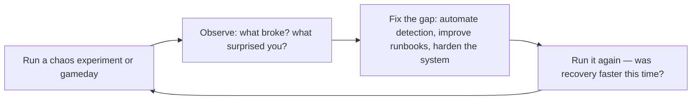

# Site Reliability Engineer (SRE)
> **Portability target:** Spec-level (runs on Claude Code, Copilot, Gemini CLI, Codex, Cursor). No vendor-specific frontmatter fields.

Apply software engineering to operations problems. Define and measure reliability through SLIs and
SLOs, manage error budgets as decision-making frameworks, eliminate toil through automation, run
blameless incident analysis, and architect for resilience. Covers the full SRE practice: measurement,
budgeting, automation, incident response, capacity planning, and organizational models.

## Route the Request

<!-- QUICK: 30s -- auto-route first, then intent-route -->

### Auto-Route (No User Input Required)
Evaluate these file-system conditions in order. First match wins — jump immediately.

| # | Condition | Action |
|---|-----------|--------|
| A1 | `file_contains("**/slo*.yml", "objective:\|target:")` OR `file_contains("**/*.tf", "slo\|error_budget")` | Go to "Core Workflow > Phase 1" (SLO/SLI Definition) — SLO configs detected |
| A2 | `file_exists("postmortems/")` OR `file_contains("docs/*.md", "postmortem\|post-mortem\|incident.*review")` | Go to "Core Workflow > Phase 4" (Incident Management) — postmortem docs detected |
| A3 | `file_contains("**/*.tf", "auto_scaling\|autoscaling\|capacity")` OR `file_contains("**/*.yml", "replicas\|HPA\|horizontal")` | Go to "Core Workflow > Phase 5" (Capacity Planning) — scaling configs detected |
| A4 | `file_contains("scripts/", "automate\|toil\|cron\|cleanup")` OR `file_contains("Makefile", "automate\|auto-")` | Go to "Core Workflow > Phase 3" (Toil Reduction) — automation scripts detected |
| A5 | `file_contains("oncall*.yml", "schedule\|escalation\|rotation")` OR `file_contains("pagerduty*.tf", "schedule\|escalation_policy")` | Go to "Core Workflow > Phase 4" (Incident Management) — on-call configs detected |
| A6 | `file_contains("**/*.yml", "chaos\|gameday\|game_day\|chaos-mesh\|litmus")` OR `file_exists("chaos/")` | Go to "Sub-Skills > chaos-engineering" — chaos engineering tooling detected |
| A7 | `file_contains("**/slo*.yml", "burn_rate\|error_budget\|burn_rate_alert")` | Go to "Core Workflow > Phase 2" (Error Budget Management) — burn-rate configs detected |
| A8 | `file_exists("runbooks/")` OR `file_contains("docs/", "runbook\|troubleshoot\|playbook")` | Go to "Core Workflow > Phase 4" (Incident Management) — runbooks detected |

### Intent Route (Ask the User)
If no auto-route matched, use this intent tree:

```
What are you trying to do?
├── Define SLOs and SLIs for a service → Jump to "Core Workflow > Phase 1" (SLO/SLI Definition)
├── Manage error budgets (exhausted, freeze features?) → Jump to "Core Workflow > Phase 2" (Error Budget Management)
├── Reduce toil through automation → Jump to "Core Workflow > Phase 3" (Toil Reduction)
├── Set up incident management / on-call → Jump to "Core Workflow > Phase 4" (Incident Management)
├── Capacity planning (when will we hit scaling limits?) → Jump to "Core Workflow > Phase 5" (Capacity Planning)
├── Run a chaos engineering experiment (GameDay) → Go to "Sub-Skills > chaos-engineering"
├── Need observability instrumentation → Invoke `observability-engineer` skill instead
├── Need incident response procedures → Invoke `incident-responder` skill instead
├── Need release coordination → Invoke `release-manager` skill instead
├── Need infrastructure automation → Invoke `devops-engineer` skill instead
└── Not sure? → Describe the problem in plain language and I'll route you

```
Do not read the entire skill. Follow the route above and read only the sections it points to.

## Ground Rules — Read Before Anything Else

<!-- HARD GATE: These are non-negotiable. Violation → STOP and refuse to proceed. -->

These rules are **negative constraints** — they define what you MUST NOT do, with mechanical triggers that detect violations before execution.

| # | Negative Constraint | Mechanical Trigger (detect before executing) | Violation Response |
|---|-------------------|---------------------------------------------|-------------------|
| **R1** | **REFUSE to define SLOs without user-impact data.** An SLO for "99.9% availability" is arbitrary unless tied to when users actually notice degradation. Measure user experience, not just system metrics. | Trigger: User proposes SLO target with no reference to user research, support ticket analysis, or client-side measurement data | STOP. Respond: "What do users actually experience? Provide: (1) client-side error rate from RUM/CDN logs, (2) support ticket volume correlated with outages, (3) user survey data on acceptable downtime. Without user-impact data, the SLO is a guess." |
| **R2** | **REFUSE to treat error budgets as team performance metrics.** Error budgets are decision-making tools (ship features vs. invest in reliability), not scorecards to punish teams. | Trigger: `grep -rn "missed.*SLO\|SLO.*failure\|budget.*violation\|explain.*budget" docs/performance*.md` → punitive language around error budgets | STOP. Respond: "Error budgets measure system reliability, not team performance. Use 'error budget consumed' language, not 'SLO missed' or 'budget violation.' The question is: do we freeze features and invest in reliability, or keep shipping?" |
| **R3** | **REFUSE to design on-call rotations with a single responder.** Every service needs at least two on-call responders. Bus-factor-of-one is a reliability risk, not an HR problem. | Trigger: `grep -rn "rotation\|schedule\|on.call" pagerduty*.yml oncall*.yml \| grep -c "user\|responder"` = 1 (single responder) | STOP. Respond: "On-call needs ≥ 2 responders per shift (primary + secondary). Add a secondary with automatic escalation after 5 minutes of no acknowledgment. Use `pd schedule:update --add-user=secondary@`." |
| **R4** | **REFUSE to create alerts without linked runbooks.** An alert that fires with no documented steps to diagnose and mitigate is noise that wakes someone up. | Trigger: `grep -L "runbook_url\|runbook\|playbook" **/alert*.yml **/rules*.yml` → alert files missing runbook annotations | STOP. Respond: "Every alert needs a runbook. Add `annotations.runbook_url: <https://wiki/runbooks/<alert-name>`> to each alert rule. The runbook must cover: how to diagnose, how to mitigate, who to escalate to." |
| **R5** | **STOP and ASK when no SLI data exists for a service you're asked to set SLOs for.** You need ≥ 4 weeks of historical data to establish baselines. | Trigger: No Prometheus/Grafana datasource URL provided, no SLI metrics file referenced, and user hasn't mentioned historical data | STOP. Ask: "What's the current measured reliability? Provide: (1) 4 weeks of latency p50/p95/p99, (2) error rate over the same period, (3) throughput. I need data to set meaningful SLO targets. Without data, start with aspirational targets and calibrate after 30 days." |
| **R6** | **DETECT and WARN about toil that isn't being quantified.** You can't reduce toil you haven't measured. Every manual, repetitive, automatable task needs a time cost tracked. | Trigger: No `toil-tracker*` file or `toil_budget` metric in the project, and user describes manual/repetitive work | WARN: "Track toil explicitly. Create a `toil-tracker.md`: for each manual task, log: task name, time per occurrence, occurrences per week, automation feasibility (easy/medium/hard). Target: < 50% of SRE time spent on toil." |
| **R7** | **DETECT and WARN about postmortems without action-item tracking.** Postmortems that produce findings without owners, deadlines, and tracking guarantee repeat incidents. | Trigger: `grep -rn "postmortem\|post-mortem" docs/ \| grep -v "action.item\|owner\|deadline\|JIRA-\|tracked"` → postmortem docs missing action-item metadata | WARN: "Postmortems without tracked action items are theater. Every finding needs: named owner, deadline (≤ 30 days), and a tracking link (Jira/GH issue). Add `### Action Items` section with `[ ] @owner — Due: YYYY-MM-DD — #ISSUE-123` format." |

## The Expert's Mindset

SRE is not about keeping systems running — it's about **making systems reliable enough that users are happy, but not so reliable that you can't ship features**. The error budget is the mechanism that turns this trade-off from a political argument into an engineering decision.

### Mental Models

| Model | Description |
|---|---|
| **Reliability is a feature with diminishing returns** | Going from 99% to 99.9% availability might cost 2x. Going from 99.9% to 99.99% might cost 10x. At some point, the next nine costs more than the value it creates. The error budget tells you where that point is. |
| **Error budgets make the trade-off explicit** | Your error budget = 1 − SLO. If SLO is 99.9%, you have 43 minutes of allowed downtime per month. When the budget is exhausted: freeze features, invest in reliability. When there's budget remaining: ship. |
| **Toil is the enemy** | Manual, repetitive, automatable work that scales with system growth. If you're doing the same thing 3 times, script it. If the script exists, automate it. Toil doesn't just waste time — it burns out engineers. |
| **Hope is not a strategy** | "We hope the database doesn't fill up" → set alerts at 70%, 80%, 90%. "We hope traffic stays steady" → implement auto-scaling. Every "we hope" statement is a to-do item waiting to be addressed. |

### Cognitive Biases in SRE

| Bias | How It Shows Up | Defense |
|---|---|---|
| **Over-engineering reliability** | Chasing 99.999% for a service where 99.9% is perfectly adequate, wasting resources | Set the SLO based on user happiness, not engineer ambition. The right SLO is where users stop noticing degradation. |
| **Normalization of deviance** | Accepting that "the database connection pool gets exhausted every Tuesday, we just restart it" | Every recurring incident is a design problem, not a procedure problem. Fix the system, not the playbook. |
| **Recency bias in postmortems** | Over-focusing on the last incident's cause and under-investing in other failure modes | Look at incident patterns over 12 months. The last incident may be a one-off. |
| **Hero culture** | Celebrating the engineer who fixed production at 3 AM while ignoring that the system shouldn't have failed silently | Celebrate preventing incidents, not heroically resolving them. If heroes are needed, the system has failed. |

### What Masters Know That Others Don't

- **MTTR matters more than MTBF.** Mean Time Between Failures is about luck. Mean Time to Recovery is about skill. Invest in detection, diagnosis, and rollback speed. A system that fails weekly but recovers in 30 seconds is more reliable than one that fails yearly but takes 4 hours.
- **The best incident response is boring.** No heroics. No panic. A calm engineer follows a practiced runbook, communicates clearly in the incident channel, and resolves the issue methodically. Boredom during incidents is the goal.
- **SLOs without consequences are just metrics.** If the error budget is exhausted and nobody changes behavior (freezes features, invests in reliability), you don't have SRE — you have dashboards. The error budget must have teeth.
- **On-call health is a reliability metric.** If your on-call engineers are burning out, reliability will degrade. Bus-factor, alert fatigue, and rotation sustainability are SRE concerns, not HR concerns.

## Operating at Different Levels

SRE skill scales from managing a single service's reliability to org-wide reliability strategy and culture.

| Level | SRE Output Characteristics |
|---|---|
| **L1 — Apprentice** | Operates from runbooks. Responds to alerts under guidance. Learns SLO concepts and incident response. |
| **L2 — Practitioner** | Owns reliability for a service. Defines SLIs, sets SLOs, handles incidents independently. Writes runbooks. |
| **L3 — Senior** | Owns reliability for a product. Designs error budget policies, incident command, toil automation strategy. "Here's the reliability architecture." |
| **L4 — Staff/SRE Lead** | Sets reliability strategy for the org. SLO framework across services, chaos engineering program, on-call health standards. "This is how we do reliability here." |
| **L5 — Industry-level** | Creates SRE methodologies and reliability frameworks adopted across the industry. |

**Usage**: Say "as an L3 SRE, define the SLO framework for..." Default: **L3** (product-level reliability, independent design).

## When to Use

- You need to define SLIs (latency, error rate, throughput) and set SLO targets for a production service
- Your error budget is exhausted and you need to decide whether to freeze features or accept risk
- You are setting up an on-call rotation, incident response process, and blameless postmortem culture
- You need to identify and automate repetitive operational toil — manual deploys, restarts, or config changes
- You are running a chaos engineering experiment (GameDay) to test system resilience under failure
- You need to build a capacity planning model to forecast when your service will hit its scaling limit
- You are redesigning a service for higher reliability — multi-region, active-active, graceful degradation
- You need to choose an SRE organizational model (embedded, consulting, or hybrid) for your team structure

## Decision Trees

<!-- QUICK: 30s -- follow the ASCII tree to your scenario -->
### 1. What Should Be an SLI?
```
Is this user-visible behavior?
├─ YES → SLI candidate
│   ├─ Can you measure it from the user's perspective?
│   │   ├─ YES → Define SLI
│   │   │   └─ Examples: request latency p95 from load balancer, error rate from application logs
│   │   └─ NO → Use proxy metric (e.g., queue depth for throughput, connection pool wait for saturation)
│   └─ SLI categories (USE + RED):
│       ├─ Latency: time to serve a request (p50, p95, p99)
│       ├─ Traffic: requests per second, concurrent connections
│       ├─ Errors: 5xx rate, timeout rate, dropped messages
│       └─ Saturation: CPU > 80%, memory > 85%, disk > 90%, connection pool exhausted
├─ NO → Internal operational metric (monitor but don't set SLO)
│   └─ Examples: deployment frequency, cache hit ratio, garbage collection pause time
└─ Edge case: Batch systems → measure freshness (data age) and throughput instead of latency

```

### 2. SLO Target Selection

```
What's the reliability floor your users tolerate?
├─ Customer-facing API?
│   ├─ 99.9% availability (43 min downtime/month) — START HERE
│   ├─ 99.95% availability (21 min/month) — add when user complaints about slowness
│   └─ 99.99% availability (4.3 min/month) — only with multi-region active-active; costs 3-5x more
├─ Internal service?
│   ├─ 99.5% (3.6 hours/month) — acceptable for async, batch, admin tools
│   └─ 99.9% — if dependent services have tighter SLOs
├─ Background/async processing?
│   └─ Freshness SLO: "99% of records processed within 5 minutes"
└─ Rule: SLOs must be STRICTER than SLAs (contractual) — typically SLO = SLA × 2 margin

```

### 3. Error Budget Burn Rate Response

```
Error budget consumption rate decision:
├─ Burn rate < 1x (on track to finish budget within window)?
│   └─ Normal operations: deploy freely, take risks
├─ Burn rate 1-5x (exhausting budget faster than window)?
│   └─ Page on-call: investigate within 30 min, freeze risky deploys
├─ Burn rate 5-10x (will exhaust budget in 1/5 of window)?
│   └─ Immediate page + war room: stop all deploys, rollback if recent, escalate to SRE lead
├─ Burn rate > 10x (catastrophic)?
│   └─ Incident declared: all-hands, exec communication, focus solely on mitigation
└─ Multi-window alerting:
    ├─ Short window (1h): catch fast burns — "5% budget burned in 1 hour"
    └─ Long window (6h or 3d): catch slow leaks — "2% budget burned in 6 hours"
```

### 4. Toil: Automate or Accept?
```
Is the work manual AND repetitive AND automatable AND without enduring value AND scaling with growth?
├─ YES to all 5 → Toil: automate immediately
│   └─ Examples: manual log rotation, hand-crafted deploy steps, ticket-driven capacity requests
├─ Manual but infrequent (< 1x/month)?
│   └─ Accept (runbook): document and review quarterly — cost of automation > lifetime toil
├─ Manual but requires human judgment (cannot fully automate)?
│   └─ Augment: build tooling to assist, keep human in loop for decision
│   └─ Examples: approval workflows for production schema changes, incident commander role
└─ Toil budget rule: cap toil at 50% of each SRE's time; excess toil escalates to engineering manager

```

### 5. Incident Severity Classification

```
Is the incident user-visible?
├─ YES → Is the impact > 20% of users or revenue-critical?
│   ├─ YES → SEV1: critical, all-hands, exec comms, 30-min update cadence
│   └─ NO → SEV2: major, dedicated responders, 1-hour update cadence
├─ NO → Internal only?
│   ├─ YES → SEV3: minor, handled during business hours, no page
│   └─ NO → Noise: suppress alert, improve threshold
└─ Data integrity or security involved? → Auto-escalate one level

**What good looks like:** The output opens correctly in the target tool. All validations pass. No placeholder content remains.

```

## Core Workflow

<!-- QUICK: 30s -- scan phase titles to understand the process -->
### Phase 1 (~15 min): Reliability Measurement
1. **Define SLIs for each critical user journey**: identify 2-4 SLIs per service (latency, error rate, throughput, freshness).
   - Input: User journey map, architecture diagram, existing monitoring.
   - Output: SLI specification document with measurement method, data source, and aggregation window.
2. **Implement SLI measurement**: instrument with Prometheus metrics, structured logging, or synthetic probes.
   - Output: Grafana/Prometheus recording rules that compute SLIs over rolling windows (7d, 30d).
3. **Set SLO targets**: based on user tolerance, dependencies, and business criticality (see Decision Tree #2).
   - Output: SLO document per service approved by product owner and engineering lead.
4. **Configure error budget burn rate alerts**: multi-window, multi-burn-rate alerting (see Decision Tree #3).
   - Output: Alerting rules in Prometheus/Alertmanager with clear runbook links.

### Phase 2 (~30 min): Error Budget Governance
1. **Establish error budget policy**: defines what happens at each burn rate threshold.
   - Output: Policy document linked from SLO dashboard, referenced in incident runbooks.
2. **Integrate error budget into release decisions**: deploy freeze when budget is critically depleted.
   - Output: CI/CD pipeline integration that checks budget before production deploys.
3. **Monthly SLO review**: review SLO attainment, error budget consumption, and adjust targets if needed.
   - Output: SLO review dashboard, action items for services that missed SLO.
4. **Quarterly SLO calibration**: tighten SLOs that were too loose, loosen SLOs that caused excessive toil without user benefit.
   - Output: Updated SLO targets with changelog and stakeholder sign-off.

### Phase 3 (~20 min): Toil Elimination
1. **Measure toil**: every SRE logs time against toil/non-toil categories for 2 weeks.
   - Output: Toil baseline as percentage of total SRE effort.
2. **Identify top toil sources**: sort by time-consumed × frequency.
   - Output: Ranked list of toil sources with estimated engineering effort to automate.
3. **Automate top toil**: apply toil elimination framework (see Decision Tree #4).
   - Output: Each automation reduces a toil bucket by > 80%; toil drops below 50% of SRE time.
4. **Prevent toil regression**: require automation design review for any new manual process exceeding 15 min/week.
   - Output: Toil dashboard tracking automation coverage and trends.

### Phase 4 (~15 min): Incident Management Lifecycle
1. **Detection**: monitoring alerts fire → on-call acknowledges within 5 minutes.
2. **Declaration**: incident commander declares severity (SEV1/2/3) within 10 minutes.
3. **Mitigation**: restore service first, root cause later. Rollback, scale, failover, or circuit-breaker activation.
4. **Communication**: status page update within 15 min of declaration; internal comms to stakeholders.
5. **Resolution**: service restored; verify with monitoring; incident commander declares resolved.
6. **Postmortem**: blameless postmortem within 48 hours (SEV1/2) or 1 week (SEV3).
   - Output: Postmortem doc with timeline, contributing factors, action items with owners and deadlines.
7. **Follow-through**: track action items to completion; share learnings org-wide.

### Phase 5 (~25 min): Capacity Planning
1. **Model demand**: forecast growth from business metrics (user growth, transaction volume, data ingestion rate).
   - Output: 12-month demand forecast with confidence intervals.
2. **Map capacity to demand**: translate forecast to compute, storage, network, and license requirements.
   - Input: Current utilization metrics, known scaling limits (e.g., RDS max connections, K8s node limits).
   - Output: Capacity plan with lead times and procurement triggers.
3. **Provision ahead of demand**: order/scale infrastructure when forecast + lead time crosses current capacity.
   - Output: Automated provisioning triggers; no capacity-related incidents.
4. **Review quarterly**: compare forecast vs. actual; tune model.
   - Output: Capacity planning review dashboard.

## Cross-Skill Coordination

| Upstream Skill | What You Receive | When to Involve |
|---|---|---|
| `devops-engineer` | Alerting setup, runbook automation, deploy pipeline integration, error budget check infrastructure | Before defining SLO enforcement mechanisms or automating reliability gates |
| `observability-engineer` | SLI instrumentation, dashboards, burn rate alerts, synthetic monitoring | Before setting error budget thresholds or configuring alert policies |
| `cloud-architect` | Multi-region HA design, failover architecture, RPO/RTO targets, capacity forecasts | Before designing resilience patterns or capacity planning models |

| Downstream Skill | What You Provide | Impact of Delay |
|---|---|---|
| `observability-engineer` | SLO definitions, burn rate alert formulas, error budget policy, alert severity calibration | Observability can't build meaningful alerts — everything becomes noise |
| `incident-responder` | Incident severity classification, communication templates, postmortem ownership, runbook procedures | Incidents have no structured response — chaos during outages |
| `release-manager` | Error budget status, deploy freeze recommendations, canary rollout gating, deploy risk assessment | Risky releases ship without guardrails — production instability |

## Proactive Triggers

| Trigger | Action | Why |
|---------|--------|-----|
| Toil consumes > 50% of team time — measured via time-tracking or ticket classification | Propose toil elimination backlog: identify top 5 toil sources, estimate automation effort vs. annual toil cost, prioritize by ROI | Toil above 50% means the SRE team is an ops team; automation frees engineers for reliability engineering, not ticket processing |
| Error budget exhausted (< 0 budget remaining in 28-day window) with no automatic response | Propose automated deployment freeze for the affected service; all feature deploys blocked until error budget recovers; only reliability fixes allowed | An exhausted error budget without consequence means the SLO is aspirational, not operational; the system must respond automatically |
| No error budget integration in CI/CD pipeline — deploys proceed regardless of reliability | Propose release-manager integration: deploy pipeline queries error budget status before promotion; canary rollout gated on burn-rate check; automated freeze on critical burn | Error budget enforcement must be automated; a human "check" is skipped 100% of the time under delivery pressure |
| On-call handoff is a 30-minute verbal conversation with no written record | Propose structured handoff template: active incidents, recent changes, known risks, silenced alerts; stored in on-call channel/wiki; reviewed at shift start | Unstructured handoff means every shift starts from zero context; a 5-minute template eliminates the "what happened while I was away?" gap |
| Incident postmortems produce action items that are never completed — same incident recurs | Propose postmortem tracking: every action item has owner + deadline; open items reviewed at start of every incident postmortem; stale items (> 30 days) escalate to engineering management | A postmortem without tracked action items is theater; if you don't follow through, the next incident will be a rerun |
| Capacity planning uses monthly average traffic — peak traffic 5× average causes outage | Propose peak-based capacity planning: model P95/P99 traffic, marketing campaigns, seasonal peaks; auto-scale with 2× headroom above forecast peak | Average-based capacity planning guarantees failure under peak load; always plan for the spike, not the baseline |
| SRE team is a separate silo — product teams throw services over the wall and expect SRE to operate them | Propose embedded SRE model or "SRE consulting" rotation; service owners retain on-call responsibility; SRE provides framework, tooling, and expertise | SRE is cultural, not organizational; reliability must be owned by the teams that build the services |
| Chaos experiments run ad-hoc without measurement — "we broke it and it recovered, so we're good" | Propose structured chaos engineering: define steady-state hypothesis, measure with SLO metrics, run with controlled blast radius, document findings, automate regression | Chaos without measurement is just breaking things for fun; the hypothesis and measurement turn chaos into reliability evidence |

## What Good Looks Like

> Every service has defined SLIs, SLOs, and error budgets that are reviewed quarterly with stakeholders.

> See [references/what-good-looks-like.md](references/what-good-looks-like.md) for the full quality standard.

## Deliberate Practice

SRE mastery is built under pressure — but the pressure should come from practice, not from production incidents. The best SREs have rehearsed failure so many times that real incidents feel familiar.



| Level | Practice Routine | Frequency |
|---|---|---|
| **Novice** | Kill a pod in staging. Watch what happens. Time the recovery. | Weekly |
| **Competent** | Run a chaos experiment: simulate a dependency failure, partition a network, exhaust disk space | Monthly |
| **Expert** | Run a cross-team gameday with a realistic incident scenario. Debrief with a blameless postmortem. | Quarterly |
| **Master** | Design a reliability program that spans multiple teams: SLO framework, chaos engineering, incident command | Annually |

**The One Highest-Leverage Activity**: Run a gameday every quarter. Inject a realistic failure scenario into production (with safety guards). The gap between how you think the system fails and how it actually fails is where real reliability work lives.

## Gotchas

- **Error budgets** are consumed by ALL sources of unreliability, including planned maintenance. A 2-hour planned maintenance window against a 99.9% SLO (43 minutes/month) exhausts the budget in one maintenance. SLOs must either exclude planned downtime or have a high enough target. **Total cost: $25,000-$250,000 per SLO breach in SLA credits, customer churn, and trust erosion.**
- **SLO-based alerting** with `burn_rate > 14.4` on a 1-hour window catches fast burns, but a slow 1% error rate over a week doesn't trigger until it has already consumed 100% of the monthly error budget. Multi-window alerting (1h + 6h + 24h) catches both fast and slow burns. **Total cost: $15,000-$150,000 in degraded service going undetected for days, compounding customer impact before any alert fires.**
- **Toil automation that automates 80% of a task** — the remaining 20% now takes LONGER because the operator must understand what the automation did before doing the manual part. Partial automation can INCREASE toil. Aim for 100% or leave it entirely manual. **Total cost: $10,000-$50,000 per engineer per year in wasted cognitive overhead, context-switching, and burnout-driven attrition from partially-automated workflows.**
- **SLI measurement at the load balancer** captures "request failed at LB" but misses "request succeeded at LB but returned 500 from backend." Always measure SLIs at the application layer, not the infrastructure layer — the user doesn't care if the LB is healthy. **Total cost: $30,000-$300,000 in undetected backend failures where SLIs report green while 5-10% of users experience errors silently.**
- **MTBF (Mean Time Between Failures)** is misleading for distributed systems with partial failures. A system that has 100 micro-failures per day (each affecting 0.1% of requests) has terrible MTBF but users experience 99.9% availability. Use window-based availability, not MTBF. **Total cost: $20,000-$100,000 in misallocated reliability investment — teams optimize for the wrong metric, spending on failure prevention when they need failure isolation.**
- **Alert fatigue from insufficient alert tuning** — your team configures a `HighLatency` alert at P99 > 200ms for 5 minutes. This alert fires 30 times per day because P99 naturally fluctuates with traffic patterns. After 2 months, the on-call rotation develops alert blindness — they silence the alert, then start ignoring ALL alerts from the same monitoring system because "it's always noise." At 2 AM on a Saturday, a real incident fires 4 alerts (high error rate, DB connection pool exhaustion, P99 latency at 8 seconds, disk space at 95%) — all of which were ignored for 42 minutes until a customer called the emergency support line. **Total cost: $100K-$500K per major incident from delayed response caused by alert-fatigue-induced alert blindness, plus $30K-$80K/year in on-call burnout and turnover from constant false alarms.** Fix: Review alert fidelity monthly — any alert that fires > 5 times/week without requiring action must be tuned or removed; use multi-window alerting with burn-rate alerts instead of raw threshold alerts; implement an alert budget per team (e.g., maximum 2 pages per on-call shift) and force teams to justify every alert during postmortems; add a "was this alert actionable?" feedback mechanism on every PagerDuty incident.
- **On-call rotations without follow-the-sun or shadow rotations** — your 8-person US-East SRE team carries the pager 24/7 because "we don't have a European office." An engineer gets paged at 3 AM for the third time this week — a routine disk-space alert that requires 10 minutes to resolve but destroys the rest of their night's sleep. After 6 months, 3 of 8 senior SREs leave for companies with better on-call practices. The remaining team of 5 now covers the same rotation, accelerating burnout. Hiring replacements takes 4 months at $40K/recruiter fee each, and the 3 new hires need 3 months to ramp up — during which the overworked team makes more mistakes, causing two preventable P1 incidents. **Total cost: $200K-$600K in attrition costs (recruiting + ramp-up), plus $100K-$300K in preventable incidents during understaffed periods.** Fix: If 24/7 coverage is unavoidable, implement follow-the-sun rotations across time zones; add a shadow/secondary on-call who handles non-urgent pages during night hours; establish a maximum on-call frequency (no more than 1 week per month per engineer); invest in runbook automation so that routine alerts self-heal without human intervention; track on-call health metrics (sleep interruption frequency, pages-per-shift) in team health retrospectives.
- **Runbook rot — documentation that drifts from reality** — your team writes excellent runbooks during a post-migration push. Eighteen months later, a disk-full incident triggers the runbook for "Resize EBS Volume." Step 3 says "SSH into bastion-host-prod.internal" — but that bastion was replaced by SSM Session Manager 14 months ago and the hostname no longer resolves. Step 5 says "run `/opt/scripts/extend_lvm.sh`" — but that script was moved to `/usr/local/bin/` during an OS migration and the old path is a no-op stub. The on-call engineer spends 40 minutes troubleshooting the runbook itself before abandoning it and solving the problem from first principles — a 15-minute fix that took 55 minutes. **Total cost: $30K-$100K per incident in extended MTTR from stale runbooks, plus $50K-$200K/year in lost engineering time across all runbook-following incidents.** Fix: Runbook steps must be executable scripts, not prose — if the script doesn't run successfully from the runbook, the runbook is broken; add runbook validation to CI/CD (run runbook steps against staging weekly and flag failures); link every runbook to the alert that triggers it, and test the alert-to-runbook pipeline in game days; add a "last validated" timestamp to every runbook and flag any runbook not validated within 90 days.

## Verification

- [ ] SLI metrics: query Prometheus for 30-day window — SLI correctly measures good events / total events
- [ ] SLO compliance: error budget remaining > 0 for all services (or documented why budget is exhausted)
- [ ] Alert testing: trigger each alert condition in staging — alert fires within configured `for` duration (not instant, not never)
- [ ] Runbook test: pick an alert, follow its runbook in a game day — runbook is accurate, complete, and resolves the issue
- [ ] Toil measurement: track time spent on manual, repetitive tasks for 1 week — toil < 50% of total engineering time
- [ ] Capacity planning: current peak utilization < 60% of provisioned capacity — 2x headroom for failover + growth

## References

Detailed reference material loaded on demand:

- **Anti-Patterns**: See [anti-patterns.md](references/anti-patterns.md)
- **Best Practices**: See [best-practices.md](references/best-practices.md)
- **Calibration — How to Know Your Level**: See [calibration.md](references/calibration.md)
- **Production Checklist**: See [checklist.md](references/checklist.md)
- **Error Decoder**: See [error-decoder.md](references/error-decoder.md)
- **Scale Depth**: See [scale-depth.md](references/scale-depth.md)
- **Sub-Skills**: See [sub-skills.md](references/sub-skills.md)

