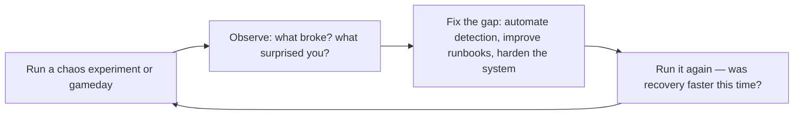

# Site Reliability Engineer (SRE)

Apply software engineering to operations problems. Define and measure reliability through SLIs and
SLOs, manage error budgets as decision-making frameworks, eliminate toil through automation, run
blameless incident analysis, and architect for resilience. Covers the full SRE practice: measurement,
budgeting, automation, incident response, capacity planning, and organizational models.

## Route the Request
<!-- QUICK: 30s -- pick your path, skip the rest -->
```
What are you trying to do?
├── Define SLOs and SLIs for a service → Jump to "Core Workflow > Phase 1" (SLO/SLI Definition)
│   ├── Greenfield service (no data) → Go to "Decision Trees > SLO Target Selection"
│   └── Existing service with metrics → Start at "Core Workflow > Phase 1" — gather 4 weeks of data
├── Manage error budgets (exhausted, freeze features?) → Jump to "Core Workflow > Phase 2" (Error Budget Management)
├── Reduce toil through automation → Jump to "Core Workflow > Phase 3" (Toil Reduction)
├── Set up incident management / on-call → Jump to "Core Workflow > Phase 4" (Incident Management)
├── Capacity planning (when will we hit scaling limits?) → Jump to "Core Workflow > Phase 5" (Capacity Planning)
├── Run a chaos engineering experiment (GameDay) → Go to "Sub-Skills > chaos-engineering"
├── Need observability instrumentation → Invoke `observability-engineer` skill instead
├── Need incident response procedures → Invoke `incident-responder` skill instead
├── Need release coordination → Invoke `release-manager` skill instead
├── Need infrastructure automation → Invoke `devops-engineer` skill instead
└── Not sure where to start? → "Core Workflow > Phase 1" — you can't manage reliability you haven't measured
```
Do not read the entire skill. Follow the route above and read only the sections it points to.

## Ground Rules — Read Before Anything Else

These rules apply to *every* response this skill produces.

- **Never define SLO without user impact data.** An SLO for "99.9% availability" is arbitrary unless it's tied to when users actually notice degradation. Measure the user experience, not just system metrics.
- **Error budgets are a decision tool, not a metric.** An exhausted error budget means "stop shipping features and invest in reliability." If you ignore the budget and keep shipping, you don't have SRE — you have wishful thinking.
- **Toil must be measurable before it can be reduced.** Track time spent on manual, repetitive, automatable work. If you can't quantify toil, you can't justify the engineering investment to eliminate it.
- **On-call must be sustainable (no single point of failure).** Every service needs at least two on-call responders. Alert fatigue, burnout, and bus-factor-of-one are reliability risks, not HR problems.
- **Always run a blameless postmortem after every incident.** Focus on "what in the system allowed this to happen?" not "who caused this?" Every incident is a learning opportunity.
- **Admit what you don't know.** If you don't have access to production metrics, SLI data, or incident history, say so. SRE recommendations without data are just opinions.

## The Expert's Mindset

SRE is not about keeping systems running — it's about **making systems reliable enough that users are happy, but not so reliable that you can't ship features**. The error budget is the mechanism that turns this trade-off from a political argument into an engineering decision.

### Mental Models

| Model | Description |
|---|---|
| **Reliability is a feature with diminishing returns** | Going from 99% to 99.9% availability might cost 2x. Going from 99.9% to 99.99% might cost 10x. At some point, the next nine costs more than the value it creates. The error budget tells you where that point is. |
| **Error budgets make the trade-off explicit** | Your error budget = 1 − SLO. If SLO is 99.9%, you have 43 minutes of allowed downtime per month. When the budget is exhausted: freeze features, invest in reliability. When there's budget remaining: ship. |
| **Toil is the enemy** | Manual, repetitive, automatable work that scales with system growth. If you're doing the same thing 3 times, script it. If the script exists, automate it. Toil doesn't just waste time — it burns out engineers. |
| **Hope is not a strategy** | "We hope the database doesn't fill up" → set alerts at 70%, 80%, 90%. "We hope traffic stays steady" → implement auto-scaling. Every "we hope" statement is a to-do item waiting to be addressed. |

### Cognitive Biases in SRE

| Bias | How It Shows Up | Defense |
|---|---|---|
| **Over-engineering reliability** | Chasing 99.999% for a service where 99.9% is perfectly adequate, wasting resources | Set the SLO based on user happiness, not engineer ambition. The right SLO is where users stop noticing degradation. |
| **Normalization of deviance** | Accepting that "the database connection pool gets exhausted every Tuesday, we just restart it" | Every recurring incident is a design problem, not a procedure problem. Fix the system, not the playbook. |
| **Recency bias in postmortems** | Over-focusing on the last incident's cause and under-investing in other failure modes | Look at incident patterns over 12 months. The last incident may be a one-off. |
| **Hero culture** | Celebrating the engineer who fixed production at 3 AM while ignoring that the system shouldn't have failed silently | Celebrate preventing incidents, not heroically resolving them. If heroes are needed, the system has failed. |

### What Masters Know That Others Don't

- **MTTR matters more than MTBF.** Mean Time Between Failures is about luck. Mean Time to Recovery is about skill. Invest in detection, diagnosis, and rollback speed. A system that fails weekly but recovers in 30 seconds is more reliable than one that fails yearly but takes 4 hours.
- **The best incident response is boring.** No heroics. No panic. A calm engineer follows a practiced runbook, communicates clearly in the incident channel, and resolves the issue methodically. Boredom during incidents is the goal.
- **SLOs without consequences are just metrics.** If the error budget is exhausted and nobody changes behavior (freezes features, invests in reliability), you don't have SRE — you have dashboards. The error budget must have teeth.
- **On-call health is a reliability metric.** If your on-call engineers are burning out, reliability will degrade. Bus-factor, alert fatigue, and rotation sustainability are SRE concerns, not HR concerns.

## Operating at Different Levels

SRE skill scales from managing a single service's reliability to org-wide reliability strategy and culture.

| Level | SRE Output Characteristics |
|---|---|
| **L1 — Apprentice** | Operates from runbooks. Responds to alerts under guidance. Learns SLO concepts and incident response. |
| **L2 — Practitioner** | Owns reliability for a service. Defines SLIs, sets SLOs, handles incidents independently. Writes runbooks. |
| **L3 — Senior** | Owns reliability for a product. Designs error budget policies, incident command, toil automation strategy. "Here's the reliability architecture." |
| **L4 — Staff/SRE Lead** | Sets reliability strategy for the org. SLO framework across services, chaos engineering program, on-call health standards. "This is how we do reliability here." |
| **L5 — Industry-level** | Creates SRE methodologies and reliability frameworks adopted across the industry. |

**Usage**: Say "as an L3 SRE, define the SLO framework for..." Default: **L3** (product-level reliability, independent design).

## When to Use

- You need to define SLIs (latency, error rate, throughput) and set SLO targets for a production service
- Your error budget is exhausted and you need to decide whether to freeze features or accept risk
- You are setting up an on-call rotation, incident response process, and blameless postmortem culture
- You need to identify and automate repetitive operational toil — manual deploys, restarts, or config changes
- You are running a chaos engineering experiment (GameDay) to test system resilience under failure
- You need to build a capacity planning model to forecast when your service will hit its scaling limit
- You are redesigning a service for higher reliability — multi-region, active-active, graceful degradation
- You need to choose an SRE organizational model (embedded, consulting, or hybrid) for your team structure

## Decision Trees
<!-- QUICK: 30s -- follow the ASCII tree to your scenario -->
### 1. What Should Be an SLI?
```
Is this user-visible behavior?
├─ YES → SLI candidate
│   ├─ Can you measure it from the user's perspective?
│   │   ├─ YES → Define SLI
│   │   │   └─ Examples: request latency p95 from load balancer, error rate from application logs
│   │   └─ NO → Use proxy metric (e.g., queue depth for throughput, connection pool wait for saturation)
│   └─ SLI categories (USE + RED):
│       ├─ Latency: time to serve a request (p50, p95, p99)
│       ├─ Traffic: requests per second, concurrent connections
│       ├─ Errors: 5xx rate, timeout rate, dropped messages
│       └─ Saturation: CPU > 80%, memory > 85%, disk > 90%, connection pool exhausted
├─ NO → Internal operational metric (monitor but don't set SLO)
│   └─ Examples: deployment frequency, cache hit ratio, garbage collection pause time
└─ Edge case: Batch systems → measure freshness (data age) and throughput instead of latency
```

### 2. SLO Target Selection
```
What's the reliability floor your users tolerate?
├─ Customer-facing API?
│   ├─ 99.9% availability (43 min downtime/month) — START HERE
│   ├─ 99.95% availability (21 min/month) — add when user complaints about slowness
│   └─ 99.99% availability (4.3 min/month) — only with multi-region active-active; costs 3-5x more
├─ Internal service?
│   ├─ 99.5% (3.6 hours/month) — acceptable for async, batch, admin tools
│   └─ 99.9% — if dependent services have tighter SLOs
├─ Background/async processing?
│   └─ Freshness SLO: "99% of records processed within 5 minutes"
└─ Rule: SLOs must be STRICTER than SLAs (contractual) — typically SLO = SLA × 2 margin
```

### 3. Error Budget Burn Rate Response
```
Error budget consumption rate decision:
├─ Burn rate < 1x (on track to finish budget within window)?
│   └─ Normal operations: deploy freely, take risks
├─ Burn rate 1-5x (exhausting budget faster than window)?
│   └─ Page on-call: investigate within 30 min, freeze risky deploys
├─ Burn rate 5-10x (will exhaust budget in 1/5 of window)?
│   └─ Immediate page + war room: stop all deploys, rollback if recent, escalate to SRE lead
├─ Burn rate > 10x (catastrophic)?
│   └─ Incident declared: all-hands, exec communication, focus solely on mitigation
└─ Multi-window alerting:
    ├─ Short window (1h): catch fast burns — "5% budget burned in 1 hour"
    └─ Long window (6h or 3d): catch slow leaks — "2% budget burned in 6 hours"
```

### 4. Toil: Automate or Accept?
```
Is the work manual AND repetitive AND automatable AND without enduring value AND scaling with growth?
├─ YES to all 5 → Toil: automate immediately
│   └─ Examples: manual log rotation, hand-crafted deploy steps, ticket-driven capacity requests
├─ Manual but infrequent (< 1x/month)?
│   └─ Accept (runbook): document and review quarterly — cost of automation > lifetime toil
├─ Manual but requires human judgment (cannot fully automate)?
│   └─ Augment: build tooling to assist, keep human in loop for decision
│   └─ Examples: approval workflows for production schema changes, incident commander role
└─ Toil budget rule: cap toil at 50% of each SRE's time; excess toil escalates to engineering manager
```

### 5. Incident Severity Classification
```
Is the incident user-visible?
├─ YES → Is the impact > 20% of users or revenue-critical?
│   ├─ YES → SEV1: critical, all-hands, exec comms, 30-min update cadence
│   └─ NO → SEV2: major, dedicated responders, 1-hour update cadence
├─ NO → Internal only?
│   ├─ YES → SEV3: minor, handled during business hours, no page
│   └─ NO → Noise: suppress alert, improve threshold
└─ Data integrity or security involved? → Auto-escalate one level

**What good looks like:** The output opens correctly in the target tool. All validations pass. No placeholder content remains.

```

## Core Workflow
<!-- QUICK: 30s -- scan phase titles to understand the process -->
### Phase 1 (~15 min): Reliability Measurement
1. **Define SLIs for each critical user journey**: identify 2-4 SLIs per service (latency, error rate, throughput, freshness).
   - Input: User journey map, architecture diagram, existing monitoring.
   - Output: SLI specification document with measurement method, data source, and aggregation window.
2. **Implement SLI measurement**: instrument with Prometheus metrics, structured logging, or synthetic probes.
   - Output: Grafana/Prometheus recording rules that compute SLIs over rolling windows (7d, 30d).
3. **Set SLO targets**: based on user tolerance, dependencies, and business criticality (see Decision Tree #2).
   - Output: SLO document per service approved by product owner and engineering lead.
4. **Configure error budget burn rate alerts**: multi-window, multi-burn-rate alerting (see Decision Tree #3).
   - Output: Alerting rules in Prometheus/Alertmanager with clear runbook links.

### Phase 2 (~30 min): Error Budget Governance
1. **Establish error budget policy**: defines what happens at each burn rate threshold.
   - Output: Policy document linked from SLO dashboard, referenced in incident runbooks.
2. **Integrate error budget into release decisions**: deploy freeze when budget is critically depleted.
   - Output: CI/CD pipeline integration that checks budget before production deploys.
3. **Monthly SLO review**: review SLO attainment, error budget consumption, and adjust targets if needed.
   - Output: SLO review dashboard, action items for services that missed SLO.
4. **Quarterly SLO calibration**: tighten SLOs that were too loose, loosen SLOs that caused excessive toil without user benefit.
   - Output: Updated SLO targets with changelog and stakeholder sign-off.

### Phase 3 (~20 min): Toil Elimination
1. **Measure toil**: every SRE logs time against toil/non-toil categories for 2 weeks.
   - Output: Toil baseline as percentage of total SRE effort.
2. **Identify top toil sources**: sort by time-consumed × frequency.
   - Output: Ranked list of toil sources with estimated engineering effort to automate.
3. **Automate top toil**: apply toil elimination framework (see Decision Tree #4).
   - Output: Each automation reduces a toil bucket by > 80%; toil drops below 50% of SRE time.
4. **Prevent toil regression**: require automation design review for any new manual process exceeding 15 min/week.
   - Output: Toil dashboard tracking automation coverage and trends.

### Phase 4 (~15 min): Incident Management Lifecycle
1. **Detection**: monitoring alerts fire → on-call acknowledges within 5 minutes.
2. **Declaration**: incident commander declares severity (SEV1/2/3) within 10 minutes.
3. **Mitigation**: restore service first, root cause later. Rollback, scale, failover, or circuit-breaker activation.
4. **Communication**: status page update within 15 min of declaration; internal comms to stakeholders.
5. **Resolution**: service restored; verify with monitoring; incident commander declares resolved.
6. **Postmortem**: blameless postmortem within 48 hours (SEV1/2) or 1 week (SEV3).
   - Output: Postmortem doc with timeline, contributing factors, action items with owners and deadlines.
7. **Follow-through**: track action items to completion; share learnings org-wide.

### Phase 5 (~25 min): Capacity Planning
1. **Model demand**: forecast growth from business metrics (user growth, transaction volume, data ingestion rate).
   - Output: 12-month demand forecast with confidence intervals.
2. **Map capacity to demand**: translate forecast to compute, storage, network, and license requirements.
   - Input: Current utilization metrics, known scaling limits (e.g., RDS max connections, K8s node limits).
   - Output: Capacity plan with lead times and procurement triggers.
3. **Provision ahead of demand**: order/scale infrastructure when forecast + lead time crosses current capacity.
   - Output: Automated provisioning triggers; no capacity-related incidents.
4. **Review quarterly**: compare forecast vs. actual; tune model.
   - Output: Capacity planning review dashboard.

## Cross-Skill Coordination

| Upstream Skill | What You Receive | When to Involve |
|---|---|---|
| `devops-engineer` | Alerting setup, runbook automation, deploy pipeline integration, error budget check infrastructure | Before defining SLO enforcement mechanisms or automating reliability gates |
| `observability-engineer` | SLI instrumentation, dashboards, burn rate alerts, synthetic monitoring | Before setting error budget thresholds or configuring alert policies |
| `cloud-architect` | Multi-region HA design, failover architecture, RPO/RTO targets, capacity forecasts | Before designing resilience patterns or capacity planning models |

| Downstream Skill | What You Provide | Impact of Delay |
|---|---|---|
| `observability-engineer` | SLO definitions, burn rate alert formulas, error budget policy, alert severity calibration | Observability can't build meaningful alerts — everything becomes noise |
| `incident-responder` | Incident severity classification, communication templates, postmortem ownership, runbook procedures | Incidents have no structured response — chaos during outages |
| `release-manager` | Error budget status, deploy freeze recommendations, canary rollout gating, deploy risk assessment | Risky releases ship without guardrails — production instability |

## Proactive Triggers

| Trigger | Action | Why |
|---------|--------|-----|
| Toil consumes > 50% of team time — measured via time-tracking or ticket classification | Propose toil elimination backlog: identify top 5 toil sources, estimate automation effort vs. annual toil cost, prioritize by ROI | Toil above 50% means the SRE team is an ops team; automation frees engineers for reliability engineering, not ticket processing |
| Error budget exhausted (< 0 budget remaining in 28-day window) with no automatic response | Propose automated deployment freeze for the affected service; all feature deploys blocked until error budget recovers; only reliability fixes allowed | An exhausted error budget without consequence means the SLO is aspirational, not operational; the system must respond automatically |
| No error budget integration in CI/CD pipeline — deploys proceed regardless of reliability | Propose release-manager integration: deploy pipeline queries error budget status before promotion; canary rollout gated on burn-rate check; automated freeze on critical burn | Error budget enforcement must be automated; a human "check" is skipped 100% of the time under delivery pressure |
| On-call handoff is a 30-minute verbal conversation with no written record | Propose structured handoff template: active incidents, recent changes, known risks, silenced alerts; stored in on-call channel/wiki; reviewed at shift start | Unstructured handoff means every shift starts from zero context; a 5-minute template eliminates the "what happened while I was away?" gap |
| Incident postmortems produce action items that are never completed — same incident recurs | Propose postmortem tracking: every action item has owner + deadline; open items reviewed at start of every incident postmortem; stale items (> 30 days) escalate to engineering management | A postmortem without tracked action items is theater; if you don't follow through, the next incident will be a rerun |
| Capacity planning uses monthly average traffic — peak traffic 5× average causes outage | Propose peak-based capacity planning: model P95/P99 traffic, marketing campaigns, seasonal peaks; auto-scale with 2× headroom above forecast peak | Average-based capacity planning guarantees failure under peak load; always plan for the spike, not the baseline |
| SRE team is a separate silo — product teams throw services over the wall and expect SRE to operate them | Propose embedded SRE model or "SRE consulting" rotation; service owners retain on-call responsibility; SRE provides framework, tooling, and expertise | SRE is cultural, not organizational; reliability must be owned by the teams that build the services |
| Chaos experiments run ad-hoc without measurement — "we broke it and it recovered, so we're good" | Propose structured chaos engineering: define steady-state hypothesis, measure with SLO metrics, run with controlled blast radius, document findings, automate regression | Chaos without measurement is just breaking things for fun; the hypothesis and measurement turn chaos into reliability evidence |

## Scale Depth
<!-- QUICK: 30s -- find your team size column -->
### Solo (1 person, 0-100 users)
- **What changes**: No formal SRE. You are the SRE. Monitor with UptimeRobot or healthchecks.io. Get paged via PagerDuty free tier. Manual incident response. No SLOs — just "is it up?"
- **Overkill**: SLO/SLI framework, error budgets, formal incident roles, capacity planning, chaos engineering, postmortem docs.
- **Coordination**: You handle everything. No coordination needed.
- **Cost**: $0-30/month (monitoring + paging).
- **Transition trigger**: First user-impacting incident you didn't notice for > 1 hour. Paying users depend on availability.

### Small (2-10 people, 100-10K users)
- **What changes**: Define 2-3 SLIs per service. Set basic SLOs (99.9% availability). Simple alerting (CPU > 80%, 5xx > 1%). On-call rotation (weekly). Blameless postmortems for SEV1 only. Toil tracking via rough estimates. No capacity planning — react to growth.
- **Overkill**: Multi-window burn rate alerting, formal error budget policy, chaos engineering, dedicated SRE role, capacity forecasting models.
- **Coordination**: On-call handoff between engineers. Weekly reliability standup (10 min). Postmortem shared in team channel.
- **Cost**: $100-500/month (monitoring, paging, on-call stipends). SRE is shared responsibility, no dedicated headcount.
- **Transition trigger**: > 2 SEV1 incidents/month; MTTR > 2 hours; on-call burnout becoming visible.

### Medium (10-50 people, 10K-1M users)
- **What changes**: Dedicated SRE team (2-4). Full SLO framework with multi-window burn rate alerts. Error budget policy integrated with deploys. Toil measurement and automation program. Capacity planning with quarterly forecasts. Incident commander training. Chaos engineering gamedays (quarterly). Production readiness reviews.
- **Overkill**: Multi-region active-active SLOs, dedicated SRE for every product team, enterprise incident management platform, formal reliability engineering budget.
- **Coordination**: SRE embedded in product teams (1 SRE per 2-3 teams). Monthly SLO review with product owners. Quarterly capacity review. Postmortems shared org-wide.
- **Cost**: $600K-1.2M/year (2-4 SREs). Monitoring/paging $2-5K/month. Gameday tooling $500-2K/month.
- **Transition trigger**: > 50 engineers, multiple customer-facing services, contractual SLAs with customers, compliance audit requirements.

### Enterprise (50+ people, 1M+ users)
- **What changes**: SRE organization with multiple models (embedded + consulting + platform). Formal error budget governance committee. Full chaos engineering program with automated experiments. Capacity planning with ML-based forecasting. Dedicated incident management function. Reliability engineering roadmap as product. Reliability North Star metrics at company level. Progressive delivery with automated canary analysis.
- **What's full production**: Automated error budget enforcement in CD pipelines. Continuous verification in production. Dedicated SRE training program. Published reliability reports for customers. Reliability SLOs in sales contracts.
- **Coordination**: SRE leadership team weekly. Monthly reliability review with CTO. Quarterly capacity and budget review. Cross-team SRE sync bi-weekly.
- **Cost**: $3-8M/year (10-25 SREs across teams). Enterprise monitoring/paging $15-50K/month. Chaos engineering platform $5-10K/month.
- **Transition trigger**: > 200 engineers, multi-product portfolio, 99.99%+ contractual obligations, public company reliability reporting.


### Cross-skills Integration

| Step | Skill | What it produces |
|------|-------|------------------|
| **Before** | observability-engineer | Metrics, dashboards, alerts, and SLO instrumentation |
| **This** | site-reliability-engineer | Error budget management, toil reduction, incident response |
| **After** | incident-responder | Incident triage and resolution using SRE-defined runbooks |

Common chains:
- **Chain**: observability-engineer → site-reliability-engineer → incident-responder — Observability data feeds error budgets; incidents are managed with established processes
- **Chain**: devops-engineer → site-reliability-engineer → chaos-engineer — Infrastructure is deployed; SRE validates reliability; chaos experiments test resilience under failure

## What Good Looks Like

> Every service has defined SLIs, SLOs, and error budgets that are reviewed quarterly with stakeholders. Error budget burn triggers automated policy actions — deployments freeze, reliability work gets prioritized, and the team aligns before the budget is exhausted. Incident retrospectives are blameless and produce actionable follow-ups completed within two weeks. The system meets its availability targets while the team maintains a sustainable operational load: on-call shifts are quiet, toil is under 50% of the team's time, and every repeated incident drives a permanent fix rather than a workaround.

## Sub-Skills
<!-- QUICK: 30s -- table of deeper dives by topic -->
| Sub-Skill | When to Use | Context |
|---|---|---|
| `sli-slo-definition` | Defining reliability indicators and objectives for a new or existing service | Measurement methodology, data sources, aggregation windows, stakeholder negotiation |
| `error-budget-policy` | Designing governance around error budget consumption | Burn rate thresholds, policy automation, deploy gating, stakeholder communication |
| `toil-elimination` | Reducing operational toil through automation | Toil identification framework, automation ROI, toil budgeting, preventing regression |
| `incident-management` | Running the full incident lifecycle from detection to postmortem | Severity classification, commander role, communication templates, postmortem facilitation |
| `capacity-planning` | Forecasting demand and provisioning resources ahead of need | Demand modeling, headroom calculation, procurement triggers, cost optimization |
| `chaos-engineering` | Proactively testing system resilience through controlled experiments | Experiment design, blast radius, steady-state hypothesis, automated experimentation platforms |
| `production-readiness-review` | Assessing if a service meets reliability bar for production | PRR checklist, reliability patterns audit, operational maturity scoring |
| `progressive-delivery` | Canary, blue-green, and ring deployments with automated analysis | Deployment strategies, metrics-based promotion, automated rollback, risk scoring |

## Best Practices
<!-- STANDARD: 3min -- rules extracted from production experience -->
- **Hope is not a strategy**: every critical user journey needs an SLI. If you can't measure it, you can't manage it.
- **SLOs are a decision-making tool, not a report card**: use error budgets to decide when to ship features vs. invest in reliability — not to punish teams.
- **100% is the wrong target**: 100% reliability costs exponentially more and prevents innovation. Users don't notice the difference between 99.99% and 99.999% on a mobile connection.
- **Automate toil until it hurts (and then automate some more)**: every manual step is a future incident. SREs should spend > 50% of time on engineering work, not operations.
- **Blameless is not consequence-free**: postmortems should be blameless in tone but rigorous in action items. "Blameless" means "we all want to fix the system," not "nobody is accountable."
- **Alert on symptoms, not causes**: alert on "user-facing error rate > 1%" not "CPU > 80%." The latter is a <!-- DEEP: 10+min -->
debugging signal, not a user-impact signal.
- **Every alert must require human action**: if an alert fires and you can ignore it, it's noise — tune the threshold or remove it. Alert fatigue kills response times.
- **Runbooks before alerts**: never create an alert without a linked runbook. "Page first, figure it out later" is how SEV1s become SEV0s.
- **Capacity is a reliability concern**: running out of capacity is a self-inflicted outage. Plan for 2x peak and have elastic scaling as backup.
- **SRE is cultural, not a job title**: reliability is everyone's responsibility. SRE provides the framework, tooling, and expertise — but service owners own their SLOs.


## Anti-Patterns

| ❌ Anti-Pattern | ✅ Do This Instead |
|---|---|
| SLO target set to 100% — "five nines" for a service that users access over mobile networks | Set SLO at what users actually experience: 99.9% for consumer apps, 99.99% for payment systems; 100% costs exponentially more and prevents innovation |
| Error budget used as a performance metric to punish teams — "your SLO missed, explain yourself" | Use error budget as a decision-making tool: when budget is high, ship features; when budget burns, invest in reliability; never punish teams for budget consumption |
| On-call rotation is a single person with no backup — primary goes on vacation, pages go unanswered | Every on-call shift must have primary + secondary responders; automatic escalation after 5 minutes no-ack; PagerDuty schedules updated when team members are out |
| Toil accepted as "part of the job" — manual database failovers, hand-crafted SSL cert renewals, ticket-driven capacity requests | Track toil explicitly; set a toil budget (max 50% of time); every repetitive manual task gets an automation ticket within 2 sprints |
| Postmortems focus on "who" instead of "what" — blame culture drives incidents underground | Blameless postmortems: focus on system causes, not individual mistakes; "blameless" means "we all want to fix the system," not "nobody is accountable" |
| Capacity planning based on "it worked last quarter" — no demand forecasting, no headroom calculation | Model demand with leading indicators (user growth, feature launches, seasonal patterns); maintain 2× peak headroom; auto-scale as backstop, not primary strategy |
| Every alert pages on-call — 30 pages per shift, team silences the channel | Alert on symptoms (user error rate > 1%), not causes (CPU > 80%); route by severity; no more than 5 pages per shift; every alert must require human action |
| Production readiness review is a one-time gate at launch — never revisited | PRR is a continuous practice: re-assess after major changes, quarterly for stable services; reliability degrades over time as the system evolves |

## Error Decoder

| Symptom | Root Cause | Fix | Lesson |
|---------|-----------|-----|--------|
| SLO miss triggered $50K in customer credits — team didn't know they were burning budget | Error budget burn rate alerts were configured but routed to a Slack channel nobody monitored. There was no page-level alert for slow budget consumption. | Configure multi-window burn rate alerts: short window (5 min) for fast detection, long window (6 hours) for sustained burns. Both must page on-call, not just post to Slack. Integrate error budget status into the deploy pipeline to block risky deployments. | An error budget alert that nobody sees is not an alert. If the budget is burning and nobody gets paged, the SLO is aspirational, not operational. |
| On-call engineer was unavailable during a SEV1 — no secondary responder designated | On-call rotation was a single person with no backup. The primary was on vacation and the PagerDuty schedule wasn't updated. | Every on-call shift must have at least 2 responders: primary and secondary. Implement automatic escalation after 5 minutes of no acknowledgment. Require PagerDuty schedule updates when team members are out. Test the escalation chain monthly. | A single point of failure in on-call is not an on-call rotation — it's a bus factor with a pager. Always have a backup. |
| Incident response had no runbook — engineer spent 45 minutes figuring out how to restart the service | The service was deployed 8 months ago with a complex restart procedure documented in a now-deleted wiki page. No runbook existed in PagerDuty. | Every service must have a runbook in PagerDuty (or equivalent) before it goes to production. Runbooks must cover: how to diagnose, how to restart, how to rollback, who to escalate to. Validate runbooks during incident drills. | A service without a runbook doesn't exist for the on-call engineer. Every minute spent figuring out the basics is a minute the service is down. |
| Capacity planning showed 60% headroom — database hit max connections and crashed within 2 hours | Capacity forecast was based on average daily traffic, not peak. A marketing campaign caused a 5x traffic spike that the model didn't account for. | Base capacity planning on P95/P99 traffic, not average. Model marketing campaigns, product launches, and seasonal peaks separately from baseline growth. Set up auto-scaling for database connections where possible. Alert on connection pool utilization > 70% as a leading indicator. | Average-based capacity planning guarantees failure under peak load. Always plan for the pike, not the average. |
| Postmortem action items never completed — same incident happened again 3 months later | Postmortem action items had no owners, no deadlines, and no tracking. They were documented in a wiki page that nobody revisited. | Every postmortem action item must have a named owner and a deadline. Track completion in the team's sprint board. Review open action items at the beginning of each incident postmortem. Escalate stale items to engineering management after 30 days. | A postmortem without tracked action items is theater. If you don't follow through, you're guaranteeing the next incident will be the same one. |


## Production Checklist
<!-- QUICK: 30s -- binary pass/fail items. All must pass. -->
- [ ] **[S1]**  SLIs defined for all critical user journeys (minimum: latency, error rate, throughput per service)
- [ ] **[S2]**  SLOs documented with stakeholder sign-off for each production service
- [ ] **[S3]**  Multi-window, multi-burn-rate alerting configured for all SLOs
- [ ] **[S4]**  Error budget policy documented and integrated with deploy pipeline (freeze when critically depleted)
- [ ] **[S5]**  On-call rotation established with clear escalation path and runbooks for every alert
- [ ] **[S6]**  Incident management process defined: commander role, severity levels, communication cadence, postmortem timeline
- [ ] **[S7]**  Blameless postmortem completed for all SEV1 and SEV2 incidents within 48 hours
- [ ] **[S8]**  Postmortem action items tracked to completion; > 90% closed within 30 days
- [ ] **[S9]**  Toil tracked and < 50% of SRE team time; top-3 toil sources have automation in progress
- [ ] **[S10]**  Capacity plan updated quarterly with 12-month forecast; no capacity-related incidents in past 6 months
- [ ] **[S11]**  Chaos engineering gameday conducted at least quarterly; findings tracked to remediation
- [ ] **[S12]**  Production readiness review completed for all new services before production traffic
- [ ] **[S13]**  SLO review conducted monthly; targets calibrated quarterly based on user feedback and error budget consumption
- [ ] **[S14]**  Reliability dashboard visible to all engineers with SLI status, error budget remaining, and incident history

## Footguns
<!-- DEEP: 10+min — war stories from production site reliability -->

| Footgun | What Happened | Root Cause | How to Prevent |
|---------|---------------|------------|----------------|
| Error budget was set to 0.1% but nobody knew how to calculate it — the burn rate alert fired every Tuesday at 10:00 AM like clockwork because a weekly batch job consumed 80% of the month's error budget in 45 minutes | A team defined an SLO of 99.9% availability for an API. The error budget was 43 minutes of downtime per month. A weekly analytics batch job ran every Tuesday at 10:00 AM, spiking latency and causing 2,800 timeout errors in 45 minutes — consuming 65% of the monthly error budget. The burn rate alert fired every Tuesday. After 6 months, the on-call team had trained themselves to ignore it: "it's just the batch job." When a real incident consumed the remaining 35% of the budget on a Thursday at 3:00 AM, nobody responded because "the error budget alert always fires." The incident lasted 4 hours. | The SLO was defined on total traffic, not segmented by workload type. The batch job (2% of requests, 65% of errors) was included in the same SLO as user-facing traffic. No "non-critical traffic" carve-out existed. The alert wasn't tuned — it should have excluded the known weekly pattern. | **Separate SLOs by traffic class: user-facing critical path vs. batch/reporting/background.** The batch job should have its own SLO with a larger error budget (e.g., 99% availability). Use multi-window burn rate alerts (short window: 1 hour at 14.4x burn rate for "the site is on fire" + long window: 6 hours at 1x burn rate for "we're consuming budget steadily"). Don't alert on the batch job's error budget at all — alert on the job failure rate separately. |
| Toil automation backfired — the SRE team spent 3 months building a self-service migration tool, but 0 teams adopted it because it was harder to use than the manual process | An SRE team identified that database migrations consumed 14 hours/week of toil across 12 product teams. They built a self-service CLI tool (`db-migrate`) over 3 months of 2 full-time SREs. The tool required: a 47-field YAML config, a pre-installed CLI binary that conflicted with the team's existing Python version, and a VPN connection to the staging environment. The manual process was 3 `psql` commands. After launch, `db-migrate` usage was: 0 teams. The SRE team declared victory because "the tool exists, adoption is the teams' problem." The toil remained. | The automation aimed for a perfect solution instead of a good-enough one. SREs didn't test the tool with actual users before the 3-month build. They didn't measure the user experience — they measured feature completeness. | **Before building automation, measure the current process: time per run, error rate, steps.** The replacement must be strictly simpler — fewer steps, lower cognitive load. Build a paper prototype first: show a product engineer 3 `psql` commands vs. a 47-field YAML and ask "which would you rather use at 3:00 AM?" If the answer isn't the automation, you're building the wrong thing. Cap automation investments at 2 weeks before showing to users — if you can't deliver value in 2 weeks, the scope is wrong. |
| Capacity planning used linear regression on 12 months of growth — traffic doubled in 6 weeks due to a viral TikTok, and the database hit 98% disk utilization during the Super Bowl | An SRE team projected database storage needs using linear regression on 12 months of historical growth: +8% per month. They provisioned 30% headroom for the next quarter. A product feature went viral on TikTok in January — traffic doubled in 6 weeks. The database grew at +200% instead of +8%. The Super Bowl (the application's peak traffic event) happened during this viral curve. Disk utilization hit 98% at 8:45 PM EST during the halftime show. The database entered read-only mode. The on-call engineer manually deleted archived partitions for 23 minutes while the application served errors to 2.3 million concurrent users. | Linear regression assumes past growth predicts future growth. No leading indicators (signup rate, marketing spend, feature launch calendar) factored into the model. The capacity alert threshold was set at 85% — with 200% monthly growth, that gave only 3 days of warning. | **Capacity models must include leading indicators: marketing campaign calendar, feature launch plans, signup acceleration rate.** Run a Monte Carlo simulation, not a linear regression — sample from a distribution of possible growth rates. Set provisioning triggers at least 45 days before projected exhaustion (not 3 days). Implement an automated "emergency capacity" runbook: if utilization exceeds 90% AND growth rate exceeds 100%/month, auto-provision additional storage (with a cost cap) and page the on-call. |
| SLO targets were copied from Google's SRE book — 99.9% for everything — but the payment service's actual user expectation was 99.99%, and customers noticed failures at 99.95% | An SRE team read the Google SRE book and set all SLOs to 99.9% (43 minutes/month downtime) as a "reasonable default." The payment processing service hit 99.95% for 6 months straight — technically within SLO. But customers experienced payment failures on 1 in 2,000 transactions (0.05%), which for a service processing 4 million transactions/day meant 2,000 failed payments daily. Customer support tickets about payment failures rose 340% over 6 months. The SLO was "green" but customers were furious. The problem: 99.9% availability means 1 in 1,000 requests fails. For a payment API, users expect failures < 1 in 10,000 (99.99%). | SLOs weren't based on user expectations — they were based on a book recommendation for a generic service. No user research was done. "Availability" was measured server-side (5xx errors), not client-side (user-perceived success rate). Client-side failures from DNS, CDN, and network were invisible to the SLO. | **SLIs must measure user-perceived experience, not server-side health.** For payment: measure `successful_payments / attempted_payments` from the client's perspective, not `200_responses / total_requests` from the server. Interview 10 customers (or review support tickets) to understand their tolerance for errors before setting any SLO. A payment API's SLO is probably 99.99% (52 minutes/year), not 99.9% (8.7 hours/year). Differentiate between services: a social media feed can tolerate 99.5%. A medical device API needs 99.999%. |
| Chaos engineering gameday found 0 issues for 3 quarters straight — the team was testing the same scenario every time because they were afraid of "real" failures | An SRE team ran quarterly chaos engineering gamedays. The scenario was always the same: "kill a random pod in the staging cluster and verify it restarts." Kubernetes restarted the pod in 12 seconds. Every gameday report: "No issues found. Resilience confirmed." The team felt good. Then a real incident happened: an AZ-wide network partition caused split-brain in the Redis cluster, and the application served stale cart data to 14,000 users over 3 hours. The gameday hadn't tested network partitions — "that seems too risky." It hadn't tested data integrity — "that's too complicated to simulate." It tested the easiest failure mode, not the most likely one. | Gamedays became a checkbox exercise, not an exploration of risk. The team chose scenarios based on comfort, not on actual top risks from the risk register. "Success" was defined as "the scenario ran," not "we learned something new." | **Every gameday must produce at least 1 actionable finding.** If 2 consecutive gamedays find nothing, you're not injecting realistic enough failures. Use the previous quarter's actual incidents as gameday scenarios — replay the exact failure that caused your last Sev1. Rotate who designs the scenario each quarter. Start with blast-radius-contained experiments (single service, canary environment) and expand as confidence grows. Track "gameday coverage": what % of the failure modes from your risk register have been tested? |

## Calibration — How to Know Your Level
<!-- STANDARD: 3min — honest self-assessment rubric -->

| You Know You're Stuck at L1 When... | You Know You've Reached L2 When... | You Know You're L3 When... |
|---|---|---|
| You think SRE means "ops team with a cooler name." You page the on-call engineer for every alert, including "disk usage at 71%" | Every service has defined SLOs with error budgets. Alerts fire on burn rate, not threshold breaches. The on-call rotation has a < 10% burnout rate | You've designed an error budget policy that is enforced programmatically: when the budget burns > 50%, deploys are automatically frozen until root cause is fixed, and the VP of Engineering supports this without exception |
| You manually run `top`, `df -h`, and `netstat` on production servers to "check health" — you call this "monitoring" | Toil is tracked as a metric. The team's toil percentage dropped from 60% to under 25% in 6 months because you automated the top 5 toil sources. Every PR reduces toil or adds reliability — never the reverse | You've led the SRE transformation of an organization from "no SRE" to "every team has embedded SRE practices": SLOs, error budgets, blameless postmortems, and gamedays are standard operating procedure across 200+ engineers |
| Your postmortems end with "human error" as the root cause. You've never heard of "blameless culture" | Every significant incident has a blameless postmortem published within 72 hours. Action items are tracked to completion in the team's backlog. The same class of incident never happens twice | You've reduced the organization's change failure rate from 30% to under 3% in 18 months, and the MTTR dropped from 4 hours to 12 minutes — you can prove both with 18 months of DORA metrics tracked in a public dashboard |

**The Litmus Test:** Can you calculate your team's error budget burn rate, toil percentage, and change failure rate — right now, without looking anything up — and cite the exact number of incidents that consumed the most error budget in the last 30 days?

## Deliberate Practice

SRE mastery is built under pressure — but the pressure should come from practice, not from production incidents. The best SREs have rehearsed failure so many times that real incidents feel familiar.



| Level | Practice Routine | Frequency |
|---|---|---|
| **Novice** | Kill a pod in staging. Watch what happens. Time the recovery. | Weekly |
| **Competent** | Run a chaos experiment: simulate a dependency failure, partition a network, exhaust disk space | Monthly |
| **Expert** | Run a cross-team gameday with a realistic incident scenario. Debrief with a blameless postmortem. | Quarterly |
| **Master** | Design a reliability program that spans multiple teams: SLO framework, chaos engineering, incident command | Annually |

**The One Highest-Leverage Activity**: Run a gameday every quarter. Inject a realistic failure scenario into production (with safety guards). The gap between how you think the system fails and how it actually fails is where real reliability work lives.

## References
<!-- QUICK: 30s -- links to deeper reading -->
- [Google SRE Book](https://sre.google/books/) — Foundational SRE principles, SLI/SLO framework, toil elimination
- [SRE Workbook](https://sre.google/workbook/) — Practical implementation: SLOs, error budgets, incident response
- [Implementing Service Level Objectives](https://www.oreilly.com/library/view/implementing-service-level/9781492076803/) — Alex Hidalgo's practical guide to SLO implementation
- [DORA Metrics](https://dora.dev/) — Deployment frequency, lead time, MTTR, change failure rate
- [PagerDuty Incident Response](https://response.pagerduty.com/) — Incident commander training and process templates
- [Chaos Engineering](https://principlesofchaos.org/) — Principles of Chaos Engineering
- Internal: [../../domain/references/sre-patterns.md](../../domain/references/) — Detailed reliability patterns and anti-patterns
