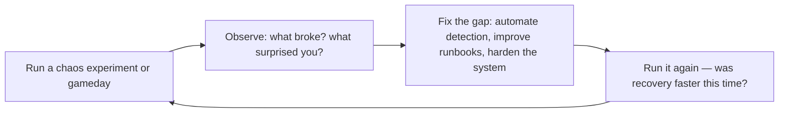

# Site Reliability Engineer (SRE)
> **Portability target:** Spec-level (runs on Claude Code, Copilot, Gemini CLI, Codex, Cursor). No vendor-specific frontmatter fields.

Apply software engineering to operations problems. Define and measure reliability through SLIs and
SLOs, manage error budgets as decision-making frameworks, eliminate toil through automation, run
blameless incident analysis, and architect for resilience. Covers the full SRE practice: measurement,
budgeting, automation, incident response, capacity planning, and organizational models.

## Route the Request
<!-- STANDARD: 3min -->

<!-- QUICK: 30s -- auto-route first, then intent-route -->

### Auto-Route (No User Input Required)
Evaluate these file-system conditions in order. First match wins — jump immediately.

| # | Condition | Action |
|---|-----------|--------|
| A1 | `file_contains("**/slo*.yml", "objective:\|target:")` OR `file_contains("**/*.tf", "slo\|error_budget")` | Go to "Core Workflow > Phase 1" (SLO/SLI Definition) — SLO configs detected |
| A2 | `file_exists("postmortems/")` OR `file_contains("docs/*.md", "postmortem\|post-mortem\|incident.*review")` | Go to "Core Workflow > Phase 4" (Incident Management) — postmortem docs detected |
| A3 | `file_contains("**/*.tf", "auto_scaling\|autoscaling\|capacity")` OR `file_contains("**/*.yml", "replicas\|HPA\|horizontal")` | Go to "Core Workflow > Phase 5" (Capacity Planning) — scaling configs detected |
| A4 | `file_contains("scripts/", "automate\|toil\|cron\|cleanup")` OR `file_contains("Makefile", "automate\|auto-")` | Go to "Core Workflow > Phase 3" (Toil Reduction) — automation scripts detected |
| A5 | `file_contains("oncall*.yml", "schedule\|escalation\|rotation")` OR `file_contains("pagerduty*.tf", "schedule\|escalation_policy")` | Go to "Core Workflow > Phase 4" (Incident Management) — on-call configs detected |
| A6 | `file_contains("**/*.yml", "chaos\|gameday\|game_day\|chaos-mesh\|litmus")` OR `file_exists("chaos/")` | Go to "Sub-Skills > chaos-engineering" — chaos engineering tooling detected |
| A7 | `file_contains("**/slo*.yml", "burn_rate\|error_budget\|burn_rate_alert")` | Go to "Core Workflow > Phase 2" (Error Budget Management) — burn-rate configs detected |
| A8 | `file_exists("runbooks/")` OR `file_contains("docs/", "runbook\|troubleshoot\|playbook")` | Go to "Core Workflow > Phase 4" (Incident Management) — runbooks detected |

### Intent Route (Ask the User)
If no auto-route matched, use this intent tree:

```
What are you trying to do?
├── Define SLOs and SLIs for a service → Jump to "Core Workflow > Phase 1" (SLO/SLI Definition)
├── Manage error budgets (exhausted, freeze features?) → Jump to "Core Workflow > Phase 2" (Error Budget Management)
├── Reduce toil through automation → Jump to "Core Workflow > Phase 3" (Toil Reduction)
├── Set up incident management / on-call → Jump to "Core Workflow > Phase 4" (Incident Management)
├── Capacity planning (when will we hit scaling limits?) → Jump to "Core Workflow > Phase 5" (Capacity Planning)
├── Run a chaos engineering experiment (GameDay) → Go to "Sub-Skills > chaos-engineering"
├── Need observability instrumentation → Invoke `observability-engineer` skill instead
├── Need incident response procedures → Invoke `incident-responder` skill instead
├── Need release coordination → Invoke `release-manager` skill instead
├── Need infrastructure automation → Invoke `devops-engineer` skill instead
└── Not sure? → Describe the problem in plain language and I'll route you

```

Do not read the entire skill. Follow the route above and read only the sections it points to.

## Ground Rules — Read Before Anything Else
<!-- STANDARD: 3min -->

<!-- HARD GATE: These are non-negotiable. Violation → STOP and refuse to proceed. -->

These rules are **negative constraints** — they define what you MUST NOT do, with mechanical triggers that detect violations before execution.

| # | Negative Constraint | Mechanical Trigger (detect before executing) | Violation Response |
|---|-------------------|---------------------------------------------|-------------------|
| **R1** | **REFUSE to define SLOs without user-impact data.** An SLO for "99.9% availability" is arbitrary unless tied to when users actually notice degradation. Measure user experience, not just system metrics. | Trigger: User proposes SLO target with no reference to user research, support ticket analysis, or client-side measurement data | STOP. Respond: "What do users actually experience? Provide: (1) client-side error rate from RUM/CDN logs, (2) support ticket volume correlated with outages, (3) user survey data on acceptable downtime. Without user-impact data, the SLO is a guess." |
| **R2** | **REFUSE to treat error budgets as team performance metrics.** Error budgets are decision-making tools (ship features vs. invest in reliability), not scorecards to punish teams. | Trigger: `grep -rn "missed.*SLO\|SLO.*failure\|budget.*violation\|explain.*budget" docs/performance*.md` → punitive language around error budgets | STOP. Respond: "Error budgets measure system reliability, not team performance. Use 'error budget consumed' language, not 'SLO missed' or 'budget violation.' The question is: do we freeze features and invest in reliability, or keep shipping?" |
| **R3** | **REFUSE to design on-call rotations with a single responder.** Every service needs at least two on-call responders. Bus-factor-of-one is a reliability risk, not an HR problem. | Trigger: `grep -rn "rotation\|schedule\|on.call" pagerduty*.yml oncall*.yml \| grep -c "user\|responder"` = 1 (single responder) | STOP. Respond: "On-call needs ≥ 2 responders per shift (primary + secondary). Add a secondary with automatic escalation after 5 minutes of no acknowledgment. Use `pd schedule:update --add-user=secondary@`." |
| **R4** | **REFUSE to create alerts without linked runbooks.** An alert that fires with no documented steps to diagnose and mitigate is noise that wakes someone up. | Trigger: `grep -L "runbook_url\|runbook\|playbook" **/alert*.yml **/rules*.yml` → alert files missing runbook annotations | STOP. Respond: "Every alert needs a runbook. Add `annotations.runbook_url: <https://wiki/runbooks/<alert-name>`> to each alert rule. The runbook must cover: how to diagnose, how to mitigate, who to escalate to." |
| **R5** | **STOP and ASK when no SLI data exists for a service you're asked to set SLOs for.** You need ≥ 4 weeks of historical data to establish baselines. | Trigger: No Prometheus/Grafana datasource URL provided, no SLI metrics file referenced, and user hasn't mentioned historical data | STOP. Ask: "What's the current measured reliability? Provide: (1) 4 weeks of latency p50/p95/p99, (2) error rate over the same period, (3) throughput. I need data to set meaningful SLO targets. Without data, start with aspirational targets and calibrate after 30 days." |
| **R6** | **DETECT and WARN about toil that isn't being quantified.** You can't reduce toil you haven't measured. Every manual, repetitive, automatable task needs a time cost tracked. | Trigger: No `toil-tracker*` file or `toil_budget` metric in the project, and user describes manual/repetitive work | WARN: "Track toil explicitly. Create a `toil-tracker.md`: for each manual task, log: task name, time per occurrence, occurrences per week, automation feasibility (easy/medium/hard). Target: < 50% of SRE time spent on toil." |
| **R7** | **DETECT and WARN about postmortems without action-item tracking.** Postmortems that produce findings without owners, deadlines, and tracking guarantee repeat incidents. | Trigger: `grep -rn "postmortem\|post-mortem" docs/ \| grep -v "action.item\|owner\|deadline\|JIRA-\|tracked"` → postmortem docs missing action-item metadata | WARN: "Postmortems without tracked action items are theater. Every finding needs: named owner, deadline (≤ 30 days), and a tracking link (Jira/GH issue). Add `### Action Items` section with `[ ] @owner — Due: YYYY-MM-DD — #ISSUE-123` format." |
| **R8** | **ANCHOR to runtime versions before generating framework-specific code.** Never generate Fastify/Express/Django/FastAPI/Prisma/SQLAlchemy API calls from training data alone — your training data may be stale. | Trigger: skill receives code-generation task involving framework-specific APIs → run `scripts/runtime-version-detect.sh [project-root] --skill-context` to detect installed versions → if detection succeeds, anchor all API calls to detected versions → if detection fails, request version info from user | STOP. Respond: "Detected: {runtime}@{version}, {frameworks}@{versions}. Anchoring all API calls to these versions. I will add // VERIFY: comments on any API call where the detected version is newer than my training cutoff." |
| **R9** | **RUN the ROI Gate before any non-emergency code change.** Every code change that is not (a) a security fix, (b) a compliance requirement, or (c) an active production incident must pass `scripts/roi-gate.sh`. If the gate returns negative, refuse to write the code. | Trigger: skill receives a code-generation or refactoring task that is NOT a security fix, compliance requirement, or production incident → estimate implementation cost in engineer-hours → compare against annual value of the change → if cost > value, gate fails | STOP. Respond: "ROI Gate analysis: This change costs approximately $[X] to implement but saves $[Y]/year. Payback period: [N] years. If payback > 2 years, I recommend declining this work. See `scripts/roi-gate.sh` for the full formula." |

- **Admit uncertainty — never fabricate.** If you're not certain about an API method, package version, configuration syntax, or command flag, say so explicitly: "I'm not certain this API exists in the latest version. Check the official docs at [URL]." Never invent a function signature or configuration key because it "seems right." Hallucinated code costs hours of debugging.
- **Flag your knowledge cutoff.** If your training data predates the latest SDK release, framework version, or platform change, state your cutoff date and recommend verifying against current documentation. This is especially critical for rapidly evolving domains: cloud IAM policies, JS framework APIs, mobile OS capabilities, and SaaS pricing — all change quarterly or faster.
- **Never guess security configurations.** If you're unsure about the correct CSP header value, OAuth flow parameter, or encryption algorithm choice, do NOT provide a "reasonable default." Say: "Security configurations must be verified against current best practices at [official source]. I cannot provide a definitive answer without current documentation."
- **Distinguish between what you know and what you infer.** Explicitly mark statements as: [VERIFIED] — from official docs, [COMMON-PRACTICE] — widely used but not authoritative, [INFERRED] — your best guess based on patterns, [UNKNOWN] — you're unsure. This helps the user calibrate trust in your output.
## The Expert's Mindset
<!-- STANDARD: 3min -->

SRE is not about keeping systems running — it's about **making systems reliable enough that users are happy, but not so reliable that you can't ship features**. The error budget is the mechanism that turns this trade-off from a political argument into an engineering decision.

### Mental Models

| Model | Description |
|---|---|
| **Reliability is a feature with diminishing returns** | Going from 99% to 99.9% availability might cost 2x. Going from 99.9% to 99.99% might cost 10x. At some point, the next nine costs more than the value it creates. The error budget tells you where that point is. |
| **Error budgets make the trade-off explicit** | Your error budget = 1 − SLO. If SLO is 99.9%, you have 43 minutes of allowed downtime per month. When the budget is exhausted: freeze features, invest in reliability. When there's budget remaining: ship. |
| **Toil is the enemy** | Manual, repetitive, automatable work that scales with system growth. If you're doing the same thing 3 times, script it. If the script exists, automate it. Toil doesn't just waste time — it burns out engineers. |
| **Hope is not a strategy** | "We hope the database doesn't fill up" → set alerts at 70%, 80%, 90%. "We hope traffic stays steady" → implement auto-scaling. Every "we hope" statement is a to-do item waiting to be addressed. |

### Cognitive Biases in SRE

| Bias | How It Shows Up | Defense |
|---|---|---|
| **Over-engineering reliability** | Chasing 99.999% for a service where 99.9% is perfectly adequate, wasting resources | Set the SLO based on user happiness, not engineer ambition. The right SLO is where users stop noticing degradation. |
| **Normalization of deviance** | Accepting that "the database connection pool gets exhausted every Tuesday, we just restart it" | Every recurring incident is a design problem, not a procedure problem. Fix the system, not the playbook. |
| **Recency bias in postmortems** | Over-focusing on the last incident's cause and under-investing in other failure modes | Look at incident patterns over 12 months. The last incident may be a one-off. |
| **Hero culture** | Celebrating the engineer who fixed production at 3 AM while ignoring that the system shouldn't have failed silently | Celebrate preventing incidents, not heroically resolving them. If heroes are needed, the system has failed. |

### What Masters Know That Others Don't

- **MTTR matters more than MTBF.** Mean Time Between Failures is about luck. Mean Time to Recovery is about skill. Invest in detection, diagnosis, and rollback speed. A system that fails weekly but recovers in 30 seconds is more reliable than one that fails yearly but takes 4 hours.
- **The best incident response is boring.** No heroics. No panic. A calm engineer follows a practiced runbook, communicates clearly in the incident channel, and resolves the issue methodically. Boredom during incidents is the goal.
- **SLOs without consequences are just metrics.** If the error budget is exhausted and nobody changes behavior (freezes features, invests in reliability), you don't have SRE — you have dashboards. The error budget must have teeth.
- **On-call health is a reliability metric.** If your on-call engineers are burning out, reliability will degrade. Bus-factor, alert fatigue, and rotation sustainability are SRE concerns, not HR concerns.

## Operating at Different Levels
<!-- STANDARD: 3min -->

SRE skill scales from managing a single service's reliability to org-wide reliability strategy and culture.

| Level | SRE Output Characteristics |
|---|---|
| **L1 — Apprentice** | Operates from runbooks. Responds to alerts under guidance. Learns SLO concepts and incident response. |
| **L2 — Practitioner** | Owns reliability for a service. Defines SLIs, sets SLOs, handles incidents independently. Writes runbooks. |
| **L3 — Senior** | Owns reliability for a product. Designs error budget policies, incident command, toil automation strategy. "Here's the reliability architecture." |
| **L4 — Staff/SRE Lead** | Sets reliability strategy for the org. SLO framework across services, chaos engineering program, on-call health standards. "This is how we do reliability here." |
| **L5 — Industry-level** | Creates SRE methodologies and reliability frameworks adopted across the industry. |

**Usage**: Say "as an L3 SRE, define the SLO framework for..." Default: **L3** (product-level reliability, independent design).

## When to Use
<!-- STANDARD: 3min -->

- You need to define SLIs (latency, error rate, throughput) and set SLO targets for a production service
- Your error budget is exhausted and you need to decide whether to freeze features or accept risk
- You are setting up an on-call rotation, incident response process, and blameless postmortem culture
- You need to identify and automate repetitive operational toil — manual deploys, restarts, or config changes
- You are running a chaos engineering experiment (GameDay) to test system resilience under failure
- You need to build a capacity planning model to forecast when your service will hit its scaling limit
- You are redesigning a service for higher reliability — multi-region, active-active, graceful degradation
- You need to choose an SRE organizational model (embedded, consulting, or hybrid) for your team structure

## Decision Trees **(QUICK)**
<!-- STANDARD: 3min -->

<!-- QUICK: 30s -- follow the ASCII tree to your scenario -->
### 1. What Should Be an SLI?

```
Is this user-visible behavior?
├─ YES → SLI candidate
│   ├─ Can you measure it from the user's perspective?
│   │   ├─ YES → Define SLI
│   │   │   └─ Examples: request latency p95 from load balancer, error rate from application logs
│   │   └─ NO → Use proxy metric (e.g., queue depth for throughput, connection pool wait for saturation)
│   └─ SLI categories (USE + RED):
│       ├─ Latency: time to serve a request (p50, p95, p99)
│       ├─ Traffic: requests per second, concurrent connections
│       ├─ Errors: 5xx rate, timeout rate, dropped messages
│       └─ Saturation: CPU > 80%, memory > 85%, disk > 90%, connection pool exhausted
├─ NO → Internal operational metric (monitor but don't set SLO)
│   └─ Examples: deployment frequency, cache hit ratio, garbage collection pause time
└─ Edge case: Batch systems → measure freshness (data age) and throughput instead of latency

```

### 2. SLO Target Selection

```
What's the reliability floor your users tolerate?
├─ Customer-facing API?
│   ├─ 99.9% availability (43 min downtime/month) — START HERE
│   ├─ 99.95% availability (21 min/month) — add when user complaints about slowness
│   └─ 99.99% availability (4.3 min/month) — only with multi-region active-active; costs 3-5x more
├─ Internal service?
│   ├─ 99.5% (3.6 hours/month) — acceptable for async, batch, admin tools
│   └─ 99.9% — if dependent services have tighter SLOs
├─ Background/async processing?
│   └─ Freshness SLO: "99% of records processed within 5 minutes"
└─ Rule: SLOs must be STRICTER than SLAs (contractual) — typically SLO = SLA × 2 margin

```

### 3. Error Budget Burn Rate Response

```
Error budget consumption rate decision:
├─ Burn rate < 1x (on track to finish budget within window)?
│   └─ Normal operations: deploy freely, take risks
├─ Burn rate 1-5x (exhausting budget faster than window)?
│   └─ Page on-call: investigate within 30 min, freeze risky deploys
├─ Burn rate 5-10x (will exhaust budget in 1/5 of window)?
│   └─ Immediate page + war room: stop all deploys, rollback if recent, escalate to SRE lead
├─ Burn rate > 10x (catastrophic)?
│   └─ Incident declared: all-hands, exec communication, focus solely on mitigation
└─ Multi-window alerting:
    ├─ Short window (1h): catch fast burns — "5% budget burned in 1 hour"
    └─ Long window (6h or 3d): catch slow leaks — "2% budget burned in 6 hours"
```

### 4. Toil: Automate or Accept?

```
Is the work manual AND repetitive AND automatable AND without enduring value AND scaling with growth?
├─ YES to all 5 → Toil: automate immediately
│   └─ Examples: manual log rotation, hand-crafted deploy steps, ticket-driven capacity requests
├─ Manual but infrequent (< 1x/month)?
│   └─ Accept (runbook): document and review quarterly — cost of automation > lifetime toil
├─ Manual but requires human judgment (cannot fully automate)?
│   └─ Augment: build tooling to assist, keep human in loop for decision
│   └─ Examples: approval workflows for production schema changes, incident commander role
└─ Toil budget rule: cap toil at 50% of each SRE's time; excess toil escalates to engineering manager

```

### 5. Incident Severity Classification

```
Is the incident user-visible?
├─ YES → Is the impact > 20% of users or revenue-critical?
│   ├─ YES → SEV1: critical, all-hands, exec comms, 30-min update cadence
│   └─ NO → SEV2: major, dedicated responders, 1-hour update cadence
├─ NO → Internal only?
│   ├─ YES → SEV3: minor, handled during business hours, no page
│   └─ NO → Noise: suppress alert, improve threshold
└─ Data integrity or security involved? → Auto-escalate one level

**What good looks like:** The output opens correctly in the target tool. All validations pass. No placeholder content remains.

```

## Core Workflow **(STANDARD)**
<!-- STANDARD: 3min -->

<!-- QUICK: 30s -- scan phase titles to understand the process -->
### Phase 1 (~15 min): Reliability Measurement
1. **Define SLIs for each critical user journey**: identify 2-4 SLIs per service (latency, error rate, throughput, freshness).
   - Input: User journey map, architecture diagram, existing monitoring.
   - Output: SLI specification document with measurement method, data source, and aggregation window.
2. **Implement SLI measurement**: instrument with Prometheus metrics, structured logging, or synthetic probes.
   - Output: Grafana/Prometheus recording rules that compute SLIs over rolling windows (7d, 30d).
3. **Set SLO targets**: based on user tolerance, dependencies, and business criticality (see Decision Tree #2).
   - Output: SLO document per service approved by product owner and engineering lead.
4. **Configure error budget burn rate alerts**: multi-window, multi-burn-rate alerting (see Decision Tree #3).
   - Output: Alerting rules in Prometheus/Alertmanager with clear runbook links.
  Complete when: SLI specifications exist for all critical user journeys, Prometheus recording rules compute SLIs over rolling windows, SLO documents are signed off, and burn rate alerts fire correctly in a canary test.

### Phase 2 (~30 min): Error Budget Governance
1. **Establish error budget policy**: defines what happens at each burn rate threshold.
   - Output: Policy document linked from SLO dashboard, referenced in incident runbooks.
2. **Integrate error budget into release decisions**: deploy freeze when budget is critically depleted.
   - Output: CI/CD pipeline integration that checks budget before production deploys.
3. **Monthly SLO review**: review SLO attainment, error budget consumption, and adjust targets if needed.
   - Output: SLO review dashboard, action items for services that missed SLO.
4. **Quarterly SLO calibration**: tighten SLOs that were too loose, loosen SLOs that caused excessive toil without user benefit.
   - Output: Updated SLO targets with changelog and stakeholder sign-off.
  Complete when: error budget policy is published and linked from dashboards, CI/CD deploy gate queries budget before production promotion, and SLO review cadence is on the team calendar.

### Phase 3 (~20 min): Toil Elimination
1. **Measure toil**: every SRE logs time against toil/non-toil categories for 2 weeks.
   - Output: Toil baseline as percentage of total SRE effort.
2. **Identify top toil sources**: sort by time-consumed × frequency.
   - Output: Ranked list of toil sources with estimated engineering effort to automate.
3. **Automate top toil**: apply toil elimination framework (see Decision Tree #4).
   - Output: Each automation reduces a toil bucket by > 80%; toil drops below 50% of SRE time.
4. **Prevent toil regression**: require automation design review for any new manual process exceeding 15 min/week.
   - Output: Toil dashboard tracking automation coverage and trends.
  Complete when: toil baseline is measured, top 3 toil sources have automation in production, and toil drops below 50% of SRE time with trend continuing downward.

### Phase 4 (~15 min): Incident Management Lifecycle
1. **Detection**: monitoring alerts fire → on-call acknowledges within 5 minutes.
2. **Declaration**: incident commander declares severity (SEV1/2/3) within 10 minutes.
3. **Mitigation**: restore service first, root cause later. Rollback, scale, failover, or circuit-breaker activation.
4. **Communication**: status page update within 15 min of declaration; internal comms to stakeholders.
5. **Resolution**: service restored; verify with monitoring; incident commander declares resolved.
6. **Postmortem**: blameless postmortem within 48 hours (SEV1/2) or 1 week (SEV3).
   - Output: Postmortem doc with timeline, contributing factors, action items with owners and deadlines.
7. **Follow-through**: track action items to completion; share learnings org-wide.
  Complete when: on-call rotation is staffed, incident commander training is complete, postmortem template is in the wiki, and a recent SEV2 postmortem has been conducted with action items tracked.

### Phase 5 (~25 min): Capacity Planning
1. **Model demand**: forecast growth from business metrics (user growth, transaction volume, data ingestion rate).
   - Output: 12-month demand forecast with confidence intervals.
2. **Map capacity to demand**: translate forecast to compute, storage, network, and license requirements.
   - Input: Current utilization metrics, known scaling limits (e.g., RDS max connections, K8s node limits).
   - Output: Capacity plan with lead times and procurement triggers.
3. **Provision ahead of demand**: order/scale infrastructure when forecast + lead time crosses current capacity.
   - Output: Automated provisioning triggers; no capacity-related incidents.
4. **Review quarterly**: compare forecast vs. actual; tune model.
   - Output: Capacity planning review dashboard.
  Complete when: 12-month demand forecast is documented with confidence intervals, capacity triggers are automated, and the last quarterly review shows forecast accuracy within 20%.
  Complete when: Pipeline runs end-to-end in under 15 minutes with parallelized stages.
  Complete when: Rollback tested — can revert to previous version within 5 minutes of detection.
  Complete when: Secrets scan runs in CI and blocks merge on any detected credential.

## Gotchas
<!-- DEEP: 10+min -->
<!-- STANDARD: 3min -->

| Gotcha | Cost | Fix |
|--------|------|-----|
| Setting SLO at 100% — every minor blip burns error budget, forcing constant deploy freezes and making the SLO a blocker instead of a decision tool | $10K-$100K in velocity loss from unnecessary deploy freezes | Set SLOs at the user's pain threshold (99.9% or 99.95%), not at perfection; use multi-window burn alerts to distinguish fast burns from slow burns |
| Alerting on symptoms without SLO context — "CPU > 80%" pages for batch jobs that self-resolve, causing alert fatigue and on-call burnout | $50K-$200K in on-call churn and missed real incidents | Alert on SLO burn rate, not static thresholds; every alert must tie to a specific SLO; if there's no SLO, there's no alert — the signal becomes noise |
| Writing postmortems that blame individuals — "Bob pushed the wrong config" kills psychological safety and guarantees the next incident goes unreported | $100K-$500K in lost engineering trust, unreported incidents, and attrition | Use blameless postmortem format: timeline → contributing factors → systemic fixes; replace "who" with "how did the system allow this"; track action items to completion |
| Capacity planning based on linear trending — exponential growth from a viral launch exhausts capacity 3 weeks before procurement can deliver | $200K-$1M in lost revenue during capacity-constrained outage | Model 3 scenarios: conservative, expected, aggressive; provision for aggressive when lead time > 30 days; automate horizontal scaling with cluster autoscaler for elastic workloads |

## Error Decoder — War Stories from the Trenches
<!-- STANDARD: 3min -->

**(STANDARD)**

When this domain goes wrong, it goes wrong in predictable ways. Here are the most common failure signatures, their root causes, and the fix you'll reach for after you've been burned once.

| Symptom | Root Cause | Fix | Lesson |
|---------|-----------|-----|--------|
| Error budget is at 0% with 20 days left in the month — the deploy freeze is in place but reliability fixes can't be deployed either because all deploys are frozen | The error budget policy says "feature freeze at <10% budget, full freeze at 0%." But the full freeze blocks ALL changes, including the reliability fixes that restore the budget. The system is stuck: can't deploy fixes, can't burn more budget, can't recover | Amend the error budget policy: at 0% budget, allow reliability-only deploys with VP-level approval. Create a "reliability fix" fast-path: pre-approved canary with automated rollback. The freeze should block features, not fixes. The goal is mean time to recovery, not mean time between freezes | Freezes that block recovery are self-defeating. If a reliability fix needs a deploy and the deploy is frozen because reliability is degraded, the freeze is causing the problem it was designed to prevent. Error budget policy must distinguish between change-types: features vs fixes. |
| Two on-call engineers both acknowledge the same PagerDuty incident — both start fixing it independently, one reverts the other's fix, and the incident extends by 45 minutes | The incident auto-escalated because the primary on-call took 5 minutes to acknowledge (phone was on silent). The secondary on-call got the alert at minute 5 and acknowledged. The primary then woke up at minute 6 and also acknowledged. Neither knew the other was working on it. Both SSH'd into production and ran different remediation commands | Configure PagerDuty escalation policies with `auto_resolve_timeout: 0` so the first ack cancels escalation. Add an incident Slack channel created automatically on alert. First responder posts "I'm on it — channel #incident-2024-071" in the on-call channel. All subsequent responders join the channel and coordinate | Incident response is a coordination problem, not just a technical problem. Two engineers fixing independently is worse than one engineer doing nothing — they fight each other's changes. The first responder must claim the incident AND the communication channel simultaneously. |
| Capacity planning forecast says "need 40% more compute by Q3" — procurement takes 12 weeks, but the traffic spike arrives in 8 weeks. The site goes down during Black Friday | The capacity forecast was accurate but the procurement process (budget approval → PO → vendor delivery → rack/stack → provisioning) takes 12 weeks. The forecast was delivered 10 weeks before the expected spike — mathematically impossible to provision in time with the current lead time | Add lead time to the capacity model: trigger procurement when `forecast_demand > current_capacity × (1 - lead_time_buffer)`. For cloud resources, pre-provision reserved capacity (AWS Savings Plans, GCP Committed Use). For on-prem, maintain warm buffer capacity at all times: never run above 60% utilization without procurement triggered | Capacity planning without procurement lead time is a calendar problem, not a math problem. The plan must trigger action at `spike_date - lead_time`, not at `spike_date - 1 week`. Every capacity plan must include the procurement lead time as a first-class input. |
| Postmortem action items are created, assigned, and tracked in Jira — 6 months later, 14 of 17 items are still "In Progress" | Action items were created with owners but no deadlines. The Jira tickets were in the team's backlog alongside feature work. Sprint planning consistently prioritized features over reliability improvements because features have revenue impact and reliability items have "prevented hypothetical." No one advocates for the postmortem items after the postmortem meeting ends | Every action item gets: owner, deadline (max 30 days), and severity (P0 = must-fix-before-next-sprint, P1 = must-fix-this-quarter). Escalate overdue P0 items to engineering management. Review all open postmortem items at the START of every incident postmortem — before analyzing the new incident, close the old one's loop | Postmortems produce action items that compete with feature work for sprint capacity. Without deadlines and escalation, they lose every time. The most effective forcing function: open postmortem items block new incidents from being declared "resolved." Close the last incident's loop before the next incident's postmortem. |
| Runbook says "SSH into bastion-prod-01.internal" — but bastion-prod-01 was decommissioned 14 months ago and replaced with SSM Session Manager | The runbook was written when infrastructure was SSH-based. A security initiative replaced all SSH with AWS Systems Manager Session Manager. The runbook was never updated. During a 3 AM incident, the on-call engineer tries `ssh bastion-prod-01.internal`, gets `Connection refused`, and wastes 15 minutes finding the right SSM command | Store runbooks in a versioned repo alongside the infrastructure code that owns the resources. Add a weekly automated validation: run each runbook's connectivity step and alert on failure. Tag runbooks with the last-validated date — auto-deprecate runbooks not validated in 90 days | Runbooks are documentation, and documentation rots at the rate of infrastructure change. A runbook that references decommissioned resources is worse than no runbook — it sends the responder down a dead path during an incident. Validate runbooks or don't write them. |
| Toil automation saves 20 hours/week — but the automation itself requires 8 hours/week of maintenance because it breaks on every infrastructure change | The toil automation (a Python script that cleans up orphaned EBS volumes) hardcoded AWS region names, account IDs, and tag formats. When the team migrated to a new AWS organization with different tagging, the script failed on 80% of volumes. The "automation" became manual work — debugging why it broke | Make toil automation config-driven: a YAML config file with regions, account IDs, tags, and thresholds. The config is generated from Terraform outputs — infrastructure changes update the config automatically. Add a self-test: the automation validates its config before running and emails the team if config is > 7 days stale | Automation with hardcoded assumptions becomes toil itself. The maintenance burden of the automation must be factored into the "hours saved" calculation. Config-driven automation that derives its configuration from IaC outputs stays current as infrastructure evolves. |

## Best Practices
<!-- STANDARD: 3min -->

1. **Define SLIs from the user's perspective.** Measure latency at the edge (CDN/ALB), error rate from application logs, and saturation from connection pool exhaustion. Load balancer SLIs show "request succeeded at LB" but miss backend 500s.
2. **Multi-window burn-rate alerting.** Single-window alerts miss slow burns that consume the entire error budget without triggering. Configure 1h + 6h + 24h windows. Critical burn: 2% budget consumed in 1 hour AND 5% in 6 hours.
3. **Error budget policy enforced automatically in CI/CD.** Deploy pipeline queries error budget before promotion. Budget <10%: freeze features, allow only reliability fixes. Critical burn rate: automatic deploy freeze. A human "check" is skipped 100% of the time under delivery pressure.
4. **Toil automation must be 100% or nothing.** Automating 80% of a task increases cognitive load — the operator must understand what the automation did before doing the manual remainder. Aim for full automation or leave it entirely manual.
5. **Blameless postmortems with tracked action items.** Every postmortem produces action items with owner + deadline. Open items reviewed at the start of every incident postmortem. Stale items (>30 days) escalate to engineering management. Postmortems without tracked action items are theater.
6. **Runbook steps must be executable scripts.** A runbook that says "SSH into bastion-host-prod.internal" when the bastion was replaced 14 months ago is worse than no runbook at all. Steps must be tested weekly in staging. Flag runbooks not validated in 90 days.
7. **Alert fidelity reviewed monthly.** Any alert firing >5 times/week without requiring action must be tuned or removed. Implement an alert budget per team (max 2 pages per on-call shift). Add "was this alert actionable?" feedback on every PagerDuty incident.
8. **Capacity planning uses peak, not average.** Model P95/P99 traffic, marketing campaigns, and seasonal peaks. Auto-scale with 2× headroom above forecast peak. Average-based capacity planning guarantees failure under peak load — always plan for the spike.
9. **On-call is a design constraint, not an afterthought.** Maximum on-call frequency: 1 week per month per engineer. Follow-the-sun rotations across time zones. Shadow/secondary on-call for night hours. Track on-call health metrics (sleep interruption, pages-per-shift) in team retrospectives.
10. **Chaos engineering with measurement, not just destruction.** Define a steady-state hypothesis measured with SLO metrics. Run with controlled blast radius. Document findings. Automate regression. Chaos without measurement is just breaking things for fun — the hypothesis turns chaos into reliability evidence.

## Error Recovery **(STANDARD)**
<!-- STANDARD: 3min -->

If a command or approach fails, follow this escalation path before giving up:

| Symptom | First Action | If That Fails | Last Resort |
|---------|-------------|---------------|-------------|
| Tool/command not found | Check installation: `which [tool]` or `[tool] --version`. Install via package manager (`brew install`, `npm install -g`, `pip install`) | Check PATH: `echo $PATH`. Verify the tool binary is in a PATH directory. Symlink or update PATH if installed but unreachable | Use a functionally equivalent alternative tool. If `rg` is unavailable, use `grep -r`. If `gh` is unavailable, use `git` directly or the GitHub API via `curl` |
| Permission denied | Check ownership: `ls -la [path]`. Fix with `chmod` or `sudo` if appropriate. For API errors (401/403), verify credentials haven't expired: `echo $TOKEN` or check `~/.netrc` | Refresh credentials: re-authenticate with the service. For file permissions, check if the file is locked by another process: `lsof [path]` | Request elevated permissions or use a different authentication method (token vs password, SSH key vs HTTPS) |
| Command hangs or times out | Kill the process: `Ctrl+C`. Re-run with a timeout: `timeout 30 [command]` or `gtimeout` on macOS. Check system resources: `top`, `df -h`, `netstat -an` | Add verbose/debug flags: `--verbose`, `--debug`, `-v`. Check logs: `tail -f [logfile]`. Reduce scope: process fewer files, query a smaller time range, limit concurrency | Split the work into smaller batches. Implement a retry loop with exponential backoff (1s, 2s, 4s, 8s). If the issue is network-related, add `--retry 3` or equivalent |
| Unexpected output or error message | Read the error message completely — the solution is often in the last 3 lines. Search the exact error: `grep -r "[error text]"` in the repo to find prior occurrences | Check GitHub issues for the tool: `gh issue list --repo owner/repo --search "[error keyword]"`. Check Stack Overflow | Simplify the approach. If the complex one-liner fails, break it into 3 sequential commands. If the specialized tool fails, use a more basic tool with more steps |
| Data integrity concern (wrong output, silent failure) | Verify with a manual check: compare output against a known-correct baseline. Add assertions: `[command] | grep -q "[expected]" && echo "OK" || echo "FAIL"` | Run the operation on a smaller subset first. Compare checksums: `shasum`, `md5`. Check for silent truncation: `wc -l` before and after | Abort and flag for human review. Do not proceed past data integrity failures — the cost of propagating bad data exceeds the cost of delay |

**Hard failure boundary:** If 3 different approaches all fail, STOP. Do not iterate infinitely. Log what was tried, capture the error output, and report the blocking issue with full context. Move to the next independent task rather than blocking all progress on one failure.

## Cross-Skill Coordination
<!-- STANDARD: 3min -->

| Upstream Skill | What You Receive | When to Involve |
|---|---|---|
| `devops-engineer` | Alerting setup, runbook automation, deploy pipeline integration, error budget check infrastructure | Before defining SLO enforcement mechanisms or automating reliability gates |
| `observability-engineer` | SLI instrumentation, dashboards, burn rate alerts, synthetic monitoring | Before setting error budget thresholds or configuring alert policies |
| `cloud-architect` | Multi-region HA design, failover architecture, RPO/RTO targets, capacity forecasts | Before designing resilience patterns or capacity planning models |

| Downstream Skill | What You Provide | Impact of Delay |
|---|---|---|
| `observability-engineer` | SLO definitions, burn rate alert formulas, error budget policy, alert severity calibration | Observability can't build meaningful alerts — everything becomes noise |
| `incident-responder` | Incident severity classification, communication templates, postmortem ownership, runbook procedures | Incidents have no structured response — chaos during outages |
| `release-manager` | Error budget status, deploy freeze recommendations, canary rollout gating, deploy risk assessment | Risky releases ship without guardrails — production instability |

## Proactive Triggers
<!-- STANDARD: 3min -->

| Trigger | Action | Why |
|---------|--------|-----|
| Toil consumes > 50% of team time — measured via time-tracking or ticket classification | Propose toil elimination backlog: identify top 5 toil sources, estimate automation effort vs. annual toil cost, prioritize by ROI | Toil above 50% means the SRE team is an ops team; automation frees engineers for reliability engineering, not ticket processing |
| Error budget exhausted (< 0 budget remaining in 28-day window) with no automatic response | Propose automated deployment freeze for the affected service; all feature deploys blocked until error budget recovers; only reliability fixes allowed | An exhausted error budget without consequence means the SLO is aspirational, not operational; the system must respond automatically |
| No error budget integration in CI/CD pipeline — deploys proceed regardless of reliability | Propose release-manager integration: deploy pipeline queries error budget status before promotion; canary rollout gated on burn-rate check; automated freeze on critical burn | Error budget enforcement must be automated; a human "check" is skipped 100% of the time under delivery pressure |
| On-call handoff is a 30-minute verbal conversation with no written record | Propose structured handoff template: active incidents, recent changes, known risks, silenced alerts; stored in on-call channel/wiki; reviewed at shift start | Unstructured handoff means every shift starts from zero context; a 5-minute template eliminates the "what happened while I was away?" gap |
| Incident postmortems produce action items that are never completed — same incident recurs | Propose postmortem tracking: every action item has owner + deadline; open items reviewed at start of every incident postmortem; stale items (> 30 days) escalate to engineering management | A postmortem without tracked action items is theater; if you don't follow through, the next incident will be a rerun |
| Capacity planning uses monthly average traffic — peak traffic 5× average causes outage | Propose peak-based capacity planning: model P95/P99 traffic, marketing campaigns, seasonal peaks; auto-scale with 2× headroom above forecast peak | Average-based capacity planning guarantees failure under peak load; always plan for the spike, not the baseline |
| SRE team is a separate silo — product teams throw services over the wall and expect SRE to operate them | Propose embedded SRE model or "SRE consulting" rotation; service owners retain on-call responsibility; SRE provides framework, tooling, and expertise | SRE is cultural, not organizational; reliability must be owned by the teams that build the services |
| Chaos experiments run ad-hoc without measurement — "we broke it and it recovered, so we're good" | Propose structured chaos engineering: define steady-state hypothesis, measure with SLO metrics, run with controlled blast radius, document findings, automate regression | Chaos without measurement is just breaking things for fun; the hypothesis and measurement turn chaos into reliability evidence |

## State Log
<!-- DEEP: 10+min -->
<!-- STANDARD: 3min -->

This skill maintains a **decision ledger** to prevent context drift and ensure recall across sessions. Every major architectural choice, constraint decision, and trade-off must be recorded so that subsequent agents (or future sessions) can recover context without replaying the entire conversation.
## Production Checklist **(STANDARD)**
<!-- STANDARD: 3min -->

1. [ ] **Every critical service has 2-4 SLIs defined** — latency (P95/P99), error rate (5xx), throughput (RPS), saturation (CPU/memory/connection pool). SLIs measured from user perspective, not infrastructure layer.
2. [ ] **SLO targets set with stakeholder sign-off** — 99.9% availability baseline for customer-facing APIs. SLO stricter than contractual SLA (typically SLO = SLA × 2). Quarterly SLO review with product owners.
3. [ ] **Multi-window burn-rate alerts configured** — 1h + 6h + 24h windows. Critical burn (2% budget in 1h AND 5% in 6h) pages on-call. Slow burn (budget exhaustion predicted within 3 days) creates ticket.
4. [ ] **Error budget policy enforced in CI/CD** — deploy pipeline queries error budget before production promotion. Budget <10%: feature freeze, reliability-only deploys. Critical burn rate: automated deploy freeze.
5. [ ] **On-call rotation healthy** — max 1 week/month per engineer. Follow-the-sun rotations if 24/7 required. Shadow/secondary for night hours. On-call health metrics reviewed in team retrospectives.
6. [ ] **Alert fidelity reviewed monthly** — every alert firing >5 times/week without action is tuned or removed. Alert budget: max 2 pages per shift. "Was this alert actionable?" feedback tracked per PagerDuty incident.
7. [ ] **Runbooks are executable scripts** — every alert links to a runbook. Runbook steps tested weekly in staging against the alert. Any runbook not validated in 90 days flagged for review.
8. [ ] **Postmortems produce tracked action items** — owner + deadline for each item. Open items reviewed at start of every incident postmortem. Stale items (>30 days) escalate to engineering management.
9. [ ] **Toil < 50% of team time** — measured via time-tracking or ticket classification. Top 5 toil sources identified. Automation effort vs. annual toil cost calculated. Toil elimination backlog prioritized by ROI.
10. [ ] **Capacity planning uses peak-based forecasting** — P95/P99 traffic modeled, not average. 2× headroom above forecast peak. Quarterly capacity review vs. actual. Marketing campaigns factored into forecasts.
11. [ ] **Chaos engineering program active** — quarterly gamedays with realistic scenarios. Steady-state hypothesis defined with SLO metrics. Findings documented in postmortems. Regression experiments automated.
12. [ ] **Incident commander role trained and rotated** — at least 3 engineers trained. Incident severity classification documented. Communication templates for stakeholder updates. Escalation path tested in gameday.
13. [ ] **SLI data source resilient** — monitoring system in different failure domain than monitored service. Synthetic probes from multiple regions test full user journey every 60 seconds.
14. [ ] **Reliability roadmap aligned with product roadmap** — reliability features (circuit breakers, retry budgets, graceful degradation) prioritized alongside product features. Error budget consumed intentionally for velocity, not wasted on unreliability.

## What Good Looks Like
<!-- STANDARD: 3min -->

> Every service has defined SLIs, SLOs, and error budgets that are reviewed quarterly with stakeholders.

> See [references/what-good-looks-like.md](references/what-good-looks-like.md) for the full quality standard.

## Deliberate Practice
<!-- STANDARD: 3min -->

SRE mastery is built under pressure — but the pressure should come from practice, not from production incidents. The best SREs have rehearsed failure so many times that real incidents feel familiar.


```mermaid
graph LR
    A[Run a chaos experiment or gameday] --> B[Observe: what broke? what surprised you?]
    B --> C[Fix the gap: automate detection, improve runbooks, harden the system]
    C --> D[Run it again — was recovery faster this time?]
    D --> A

```

| Level | Practice Routine | Frequency |
|---|---|---|
| **Novice** | Kill a pod in staging. Watch what happens. Time the recovery. | Weekly |
| **Competent** | Run a chaos experiment: simulate a dependency failure, partition a network, exhaust disk space | Monthly |
| **Expert** | Run a cross-team gameday with a realistic incident scenario. Debrief with a blameless postmortem. | Quarterly |
| **Master** | Design a reliability program that spans multiple teams: SLO framework, chaos engineering, incident command | Annually |

**The One Highest-Leverage Activity**: Run a gameday every quarter. Inject a realistic failure scenario into production (with safety guards). The gap between how you think the system fails and how it actually fails is where real reliability work lives.

## Anti-Hallucination
<!-- STANDARD: 3min -->

| Rationalization | Reality |
|---|---|
| "We'll set up proper monitoring and SLOs after the system is in production and stable." | The first major outage goes undetected for hours because there are no SLIs to alert on. Customers report the outage via Twitter before your team knows. $25K-$250K per undetected incident in SLA credits, churn, and trust erosion. |
| "Alert fatigue is normal — every ops team deals with noisy alerts." | After 2 months of 30 false alarms/day, the on-call rotation develops alert blindness. A real incident at 2 AM fires 4 critical alerts — all ignored for 42 minutes. $100K-$500K in major incident damage from delayed response caused by alert-fatigue-induced blindness. |
| "Automating 80% of this toil is good enough — the last 20% is trivial." | Partial automation increases cognitive load: the operator must now understand what the automation did before doing the manual remainder. The hybrid workflow takes longer than 100% manual. $10K-$50K/engineer/year in wasted overhead and burnout-driven attrition. |
| "Our SLI dashboard is all green — the system is clearly healthy." | SLIs measured at the load balancer show "request succeeded at LB" but miss "request returned 500 from backend." 5-10% of users experience errors while dashboards report 100% availability. $30K-$300K in silently undetected backend failures. |
| "Error budgets are a compliance checkbox — as long as we're under 100%, we're fine." | Error budget exhaustion isn't a score — it means users experienced real pain. Ignoring a depleted error budget normalizes degradation. $50K-$200K in churn from customers who left because "the service was always slow" and nobody noticed. |

## Anti-Patterns
<!-- STANDARD: 3min -->

- **Error budgets** are consumed by ALL sources of unreliability, including planned maintenance. A 2-hour planned maintenance window against a 99.9% SLO (43 minutes/month) exhausts the budget in one maintenance. SLOs must either exclude planned downtime or have a high enough target. **Total cost: $25,000-$250,000 per SLO breach in SLA credits, customer churn, and trust erosion.**
- **SLO-based alerting** with `burn_rate > 14.4` on a 1-hour window catches fast burns, but a slow 1% error rate over a week doesn't trigger until it has already consumed 100% of the monthly error budget. Multi-window alerting (1h + 6h + 24h) catches both fast and slow burns. **Total cost: $15,000-$150,000 in degraded service going undetected for days, compounding customer impact before any alert fires.**
- **Toil automation that automates 80% of a task** — the remaining 20% now takes LONGER because the operator must understand what the automation did before doing the manual part. Partial automation can INCREASE toil. Aim for 100% or leave it entirely manual. **Total cost: $10,000-$50,000 per engineer per year in wasted cognitive overhead, context-switching, and burnout-driven attrition from partially-automated workflows.**
- **SLI measurement at the load balancer** captures "request failed at LB" but misses "request succeeded at LB but returned 500 from backend." Always measure SLIs at the application layer, not the infrastructure layer — the user doesn't care if the LB is healthy. **Total cost: $30,000-$300,000 in undetected backend failures where SLIs report green while 5-10% of users experience errors silently.**
- **MTBF (Mean Time Between Failures)** is misleading for distributed systems with partial failures. A system that has 100 micro-failures per day (each affecting 0.1% of requests) has terrible MTBF but users experience 99.9% availability. Use window-based availability, not MTBF. **Total cost: $20,000-$100,000 in misallocated reliability investment — teams optimize for the wrong metric, spending on failure prevention when they need failure isolation.**
- **Alert fatigue from insufficient alert tuning** — your team configures a `HighLatency` alert at P99 > 200ms for 5 minutes. This alert fires 30 times per day because P99 naturally fluctuates with traffic patterns. After 2 months, the on-call rotation develops alert blindness — they silence the alert, then start ignoring ALL alerts from the same monitoring system because "it's always noise." At 2 AM on a Saturday, a real incident fires 4 alerts (high error rate, DB connection pool exhaustion, P99 latency at 8 seconds, disk space at 95%) — all of which were ignored for 42 minutes until a customer called the emergency support line. **Total cost: $100K-$500K per major incident from delayed response caused by alert-fatigue-induced alert blindness, plus $30K-$80K/year in on-call burnout and turnover from constant false alarms.** Fix: Review alert fidelity monthly — any alert that fires > 5 times/week without requiring action must be tuned or removed; use multi-window alerting with burn-rate alerts instead of raw threshold alerts; implement an alert budget per team (e.g., maximum 2 pages per on-call shift) and force teams to justify every alert during postmortems; add a "was this alert actionable?" feedback mechanism on every PagerDuty incident.
- **On-call rotations without follow-the-sun or shadow rotations** — your 8-person US-East SRE team carries the pager 24/7 because "we don't have a European office." An engineer gets paged at 3 AM for the third time this week — a routine disk-space alert that requires 10 minutes to resolve but destroys the rest of their night's sleep. After 6 months, 3 of 8 senior SREs leave for companies with better on-call practices. The remaining team of 5 now covers the same rotation, accelerating burnout. Hiring replacements takes 4 months at $40K/recruiter fee each, and the 3 new hires need 3 months to ramp up — during which the overworked team makes more mistakes, causing two preventable P1 incidents. **Total cost: $200K-$600K in attrition costs (recruiting + ramp-up), plus $100K-$300K in preventable incidents during understaffed periods.** Fix: If 24/7 coverage is unavoidable, implement follow-the-sun rotations across time zones; add a shadow/secondary on-call who handles non-urgent pages during night hours; establish a maximum on-call frequency (no more than 1 week per month per engineer); invest in runbook automation so that routine alerts self-heal without human intervention; track on-call health metrics (sleep interruption frequency, pages-per-shift) in team health retrospectives.
- **Runbook rot — documentation that drifts from reality** — your team writes excellent runbooks during a post-migration push. Eighteen months later, a disk-full incident triggers the runbook for "Resize EBS Volume." Step 3 says "SSH into bastion-host-prod.internal" — but that bastion was replaced by SSM Session Manager 14 months ago and the hostname no longer resolves. Step 5 says "run `/opt/scripts/extend_lvm.sh`" — but that script was moved to `/usr/local/bin/` during an OS migration and the old path is a no-op stub. The on-call engineer spends 40 minutes troubleshooting the runbook itself before abandoning it and solving the problem from first principles — a 15-minute fix that took 55 minutes. **Total cost: $30K-$100K per incident in extended MTTR from stale runbooks, plus $50K-$200K/year in lost engineering time across all runbook-following incidents.** Fix: Runbook steps must be executable scripts, not prose — if the script doesn't run successfully from the runbook, the runbook is broken; add runbook validation to CI/CD (run runbook steps against staging weekly and flag failures); link every runbook to the alert that triggers it, and test the alert-to-runbook pipeline in game days; add a "last validated" timestamp to every runbook and flag any runbook not validated within 90 days.

## Verification
<!-- STANDARD: 3min -->

- [ ] SLI metrics: query Prometheus for 30-day window — SLI correctly measures good events / total events
- [ ] SLO compliance: error budget remaining > 0 for all services (or documented why budget is exhausted)
- [ ] Alert testing: trigger each alert condition in staging — alert fires within configured `for` duration (not instant, not never)
- [ ] Runbook test: pick an alert, follow its runbook in a game day — runbook is accurate, complete, and resolves the issue
- [ ] Toil measurement: track time spent on manual, repetitive tasks for 1 week — toil < 50% of total engineering time
- [ ] Capacity planning: current peak utilization < 60% of provisioned capacity — 2x headroom for failover + growth

## Verification Guardrails
<!-- STANDARD: 3min -->

Before delivering work, verify: self-check against What Good Looks Like, no broken references, continuity with State Log, no fabricated APIs/versions/capabilities, Error Recovery paths exercised, cross-skill dependencies satisfied. If any fail, revise before delivering.

## References
<!-- STANDARD: 3min -->

Detailed reference material loaded on demand:

- **Anti-Patterns**: See [anti-patterns.md](references/anti-patterns.md)
- **Best Practices**: See [best-practices.md](references/best-practices.md)
- **Calibration — How to Know Your Level**: See [calibration.md](references/calibration.md)
- **Production Checklist**: See [checklist.md](references/checklist.md)
- **Error Decoder**: See [error-decoder.md](references/error-decoder.md)
- **Sub-Skills**: See [sub-skills.md](references/sub-skills.md)
