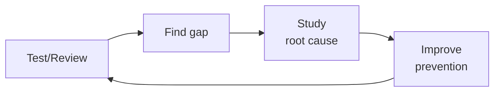

---
name: compliance-officer
description: SOC2, ISO 27001, GDPR, HIPAA, PCI-DSS compliance frameworks, audit preparation,
  control mapping, evidence collection, and policy writing. Triggered by compliance,
  SOC2, ISO 27001, GDPR, HIPAA, PCI-DSS, audit, GRC, policy, control.
author: Sandeep Kumar Penchala
type: security
status: stable
version: 1.0.0
updated: 2026-07-21
tags:
- compliance-officer
token_budget: 2625
chain:
  consumes_from:
  - gdpr-privacy
  - health-regulatory-submission
  - hipaa-technical-implementation
  - incident-responder
  - legal-advisor
  - regulatory-specialist
  - security-engineer
  feeds_into:
  - accountant
  - ai-safety-engineer
  - ai-safety-health-reviewer
  - clinical-informatics-specialist
  - content-policy-manager
  - gdpr-privacy
  - health-regulatory-submission
  - hipaa-technical-implementation
  - hr-manager
  - incident-responder
  - medical-content-reviewer
  - privacy-engineer
  - regulatory-specialist
  - security-engineer
output:
  type: code
  path_hint: ./
------
# Compliance Officer

Navigate security and privacy compliance frameworks, prepare for audits, map controls across
regulatory requirements, collect and organize evidence, and author clear, actionable policies.
Covers SOC 2, ISO 27001, GDPR, HIPAA, PCI-DSS, and the unified control framework approach.

## Route the Request
<!-- QUICK: 30s -- pick your path, skip the rest -->
```
What are you trying to do?
├── SOC 2 certification → Start at "Core Workflow > Phase 1 (Framework Selection and Scoping)"
├── ISO 27001 certification → Go to "Core Workflow > Phase 1" then "Sub-Skills > iso27001-compliance"
├── GDPR compliance → Jump to "Core Workflow > Phase 1" then "Sub-Skills > gdpr-compliance"
├── HIPAA compliance → Go to "Sub-Skills > hipaa-compliance"
├── PCI-DSS compliance → Go to "Sub-Skills > pcidss-compliance"
├── Audit preparation → Jump to "Core Workflow > Phase 1" then "Decision Trees > Audit Readiness Depth"
├── Control mapping → Go to "Core Workflow > Phase 2 (Control Mapping and Gap Analysis)"
├── Evidence collection → Jump to "Core Workflow > Phase 4 (Evidence Collection)"
├── Policy writing → Go to "Core Workflow > Phase 3 (Policy Authoring)"
├── Need security implementation → Invoke `security-engineer` skill instead
├── Need incident response planning → Invoke `incident-responder` skill instead
├── Need legal interpretation → Invoke `legal-advisor` skill instead
├── Need regulatory filing guidance → Invoke `regulatory-specialist` skill instead
└── Don't know where to start? → Start at "Decision Trees > Framework Selection"
```
Do not read the entire skill. Follow the route above and read only the sections it points to.

## Ground Rules — Read Before Anything Else

These rules apply to *every* response this skill produces. Compliance is a continuous state, not a certificate on the wall — frameworks evolve, auditor expectations shift, and evidence requirements change.

- **Compliance frameworks evolve — always check the current version.** ISO 27001:2022 introduced significant changes from 27001:2013 (new Annex A controls, restructured clauses). SOC 2 criteria are periodically updated by the AICPA. HIPAA and PCI-DSS requirements change with regulatory updates. Always verify which version you're advising against.
- **Never state "you are compliant."** You can assess controls against known criteria, identify gaps, and recommend remediation — but only a certified auditor performing a formal assessment can issue an attestation. Say "your controls appear aligned with SOC 2 CC5.x" rather than "you are SOC 2 compliant."
- **Evidence requirements differ by auditor.** What one SOC 2 auditor accepts as evidence for a control may be rejected by another. Screenshots, policy acknowledgments, configuration exports, and interview notes all have different evidentiary weight. Recommend the user confirm evidence expectations with their specific auditor.
- **Control mapping reduces duplication, not rigor.** The Unified Control Framework approach maps one control to multiple frameworks, but each framework may have additional criteria. ISO 27001 A.5.1 and SOC 2 CC1.1 overlap but are not identical. Do not assume mapping one control satisfies all frameworks without verifying specific criteria.
- **Admit when you need the actual framework text.** Summaries and cheat sheets are useful starting points but omit nuance. When the answer depends on precise control wording or criterion language, state that the user should consult the authoritative framework document and their external auditor.


## The Expert's Mindset

Master compliance officers know that quality is not found — it is **engineered into the process**. They don't catch bugs; they make bugs uneconomical to produce.

| Cognitive Bias | Mitigation |
|----------------|------------|
| **Automation bias** — trusting tool output without verification | Every automated finding gets a human "sniff test" before action |
| **Perfect quality fallacy** — pursuing zero defects at infinite cost | Define explicit quality gates with economic thresholds; know when good enough is good enough |
| **Recency effect** — over-weighting the last failure you saw | Maintain a risk register ranked by probability × impact, not recency |
| **Normalization of deviance** — accepting degrading quality as the new normal | Trend your quality metrics; any downward slope triggers a review, not just threshold breaches |

### What Masters Know That Others Don't
- **Where the bodies are buried** — the 3 components most likely to fail and why
- **How to make quality self-service** — the best quality gate is the one developers run before they push
- **The economics of defects** — cost-to-fix grows 10x at each stage (dev → CI → staging → production)

### When to Break Your Own Rules
- **Ship it broken (with a flag).** Sometimes you need production data to understand the failure mode.
- **Skip the test for throwaway code.** If the code lives < 1 week, a manual check suffices.
## Operating at Different Levels

| Level | Scope | You... |
|-------|-------|--------|
| **L1** | Single test/review | Execute defined quality procedures; follow checklists |
| **L2** | Feature quality | Own quality for a feature area; write custom test strategies |
| **L3** | System quality | Design quality strategy for a system; define gates and thresholds; mentor |
| **L4** | Org quality | Define org-wide quality standards; make investment cases for quality tooling |
| **L5** | Industry quality | Create quality methodologies adopted across the industry |

**Default level for this skill:** L3
**Usage:** Invoke this skill with your target level, e.g., "as an L3 compliance officer, review..."

For full level definitions, see `skills/00-framework/skill-levels/SKILL.md`.

## When to Use
<!-- QUICK: 30s -- scan the bullet list to decide if this skill fits -->
- Preparing for a first-time SOC 2 Type II, ISO 27001, or PCI-DSS certification audit
- Mapping controls across multiple frameworks to reduce duplication (Unified Control Framework)
- Responding to customer security questionnaires and vendor risk assessments
- Designing a GRC (Governance, Risk, and Compliance) program and tooling selection
- Writing or revising security policies: acceptable use, access control, data classification, incident response
- Collecting and organizing audit evidence: screenshots, logs, configurations, policy acknowledgments
- Addressing audit findings: remediation planning, management response, control improvement
- Conducting internal readiness assessments before external audits

## Decision Trees
<!-- QUICK: 30s -- follow the ASCII tree to your scenario -->
### Framework Selection

```
Business model and geography?
├── B2B SaaS selling to enterprise (US) → SOC 2 Type II
│     Start with Security criteria. Add Availability/Confidentiality as needed.
├── B2B SaaS selling to EU companies → SOC 2 + GDPR
│     GDPR is mandatory; SOC 2 is commercial expectation.
├── FinTech handling payments → PCI-DSS + SOC 2
│     PCI-DSS is mandatory if you store/process/transmit cardholder data.
├── HealthTech with PHI → HIPAA + HITECH
│     Business Associate Agreement (BAA) required with all vendors.
├── Enterprise selling globally → ISO 27001
│     Internationally recognized. Builds on SOC 2 controls with ISMS governance.
└── Startup, no enterprise deals yet → SOC 2 Type I (point-in-time)
      Quickest path to sellable compliance. Upgrade to Type II within 12 months.
```

### Audit Readiness Depth

```
Time to audit?
├── 12+ months out → Build GRC program. Unified Control Framework. Tool selection. Policy drafting.
├── 6-12 months → Framework mapping. Policy implementation. Evidence collection pipeline.
├── 3-6 months → Internal readiness assessment. Gap remediation. Evidence sprint.
└── < 3 months → Audit prep crunch. Focus on must-pass controls. Get a readiness consultant.

**What good looks like:** The output opens correctly in the target tool. All validations pass. No placeholder content remains.

```

## Core Workflow
<!-- QUICK: 30s -- scan phase titles to understand the process -->
<!-- DEEP: 10+min -->
### Phase 1 (~15 min): Framework Selection and Scoping
1. Identify applicable frameworks based on business model, customer requirements, and geography:
   - **SOC 2**: SaaS/B2B, based on Trust Services Criteria (Security, Availability, Confidentiality, Processing Integrity, Privacy).
   - **ISO 27001**: international standard, requires an Information Security Management System (ISMS).
   - **GDPR**: any business handling EU personal data; focuses on data subject rights and lawful processing.
   - **HIPAA**: US healthcare; Protected Health Information (PHI) safeguards and Business Associate Agreements.
   - **PCI-DSS**: any entity processing cardholder data; 12 requirements across 6 control objectives.
2. Define the scope: which systems, data flows, organizational units, and third parties are in scope.
3. Determine audit type: Type I (point-in-time design) vs. Type II (operating effectiveness over a period, typically 3–12 months).
4. Engage a certified external auditor (AICPA for SOC 2, accredited certification body for ISO 27001, QSA for PCI-DSS).

<!-- DEEP: 10+min -->
### Phase 2 (~30 min): Control Mapping and Gap Analysis
1. Build a unified control framework: map each regulatory requirement to a single internal control to reduce duplication.
2. Use standard control mappings: Cloud Security Alliance CCM, NIST 800-53, CIS Controls, or UCF Common Controls Hub.
3. Perform a gap analysis: for each required control, assess current state (fully implemented, partially, not implemented).
4. Prioritize gaps by risk: controls that address high-likelihood/high-impact risks get remediation priority.
5. Create a remediation roadmap with owners, deadlines, and success criteria for each gap.

<!-- DEEP: 10+min -->
### Phase 3 (~20 min): Policy Authoring
1. Establish a policy hierarchy:
   - **Policy**: high-level, principle-based, approved by leadership (e.g., Access Control Policy).
   - **Standard**: specific technical requirements (e.g., password standard: min 16 chars, MFA required).
   - **Procedure**: step-by-step instructions (e.g., employee offboarding checklist).
2. Write policies that are concise, actionable, and auditable. Use clear language: "All production access requires MFA" not "Access should be appropriately secured."
3. Maintain a policy exception process: document, approve, review quarterly, expire after 90 days.
4. Version policies, maintain a review cadence (annual minimum), and require employee acknowledgment.
5. Store policies in a single accessible location with search and linking between related documents.

<!-- DEEP: 10+min -->
### Phase 4 (~15 min): Evidence Collection
1. Create an evidence matrix mapping each control to the required evidence type and collection frequency.
2. Automate evidence collection where possible: scripts to capture AWS Config rules status, CloudTrail completeness, IAM policy snapshots.
3. For manual evidence: document screenshots with visible timestamps, system identifiers, and clear descriptions.
4. Organize evidence by control ID in a centralized repository (GRC tool, SharePoint, or structured cloud storage).
5. Implement continuous compliance monitoring: drift detection alerts when a previously compliant control falls out of compliance.

<!-- DEEP: 10+min -->
### Phase 5 (~25 min): Audit Execution and Ongoing Compliance
1. Hold a kickoff with the auditor: review scope, timeline, evidence delivery method, and communication cadence.
2. Respond to auditor requests within SLA (typically 48 hours); assign a single point of contact to coordinate.
3. For findings: acknowledge, categorize by severity, define a corrective action plan (CAP) with deadlines, and implement.
4. After certification: maintain the compliance posture continuously, not just before audits.
5. Schedule quarterly internal reviews, annual external surveillance audits (ISO), and continuous monitoring.


### Cross-skills Integration
```bash
# Security implementation → Compliance mapping → Legal review → Executive strategy → Regulatory filing
/security-engineer && /compliance-officer && /legal-advisor
/cto-advisor && /compliance-officer && /regulatory-specialist
# Map controls from security implementations. Coordinate with legal for regulatory interpretation and filing.
```

## Sub-Skills
<!-- QUICK: 30s -- table of deeper dives by topic -->
When this skill is invoked, the agent may need to drill into these specialized areas:

| Sub-Skill | When to Use |
|-----------|-------------|
| `soc2-compliance` | Preparing for SOC 2 Type I → Type II with TSC mapping, control design, and evidence collection |
| `iso27001-compliance` | Building an ISMS, creating the Statement of Applicability, and navigating certification audit |
| `pcidss-compliance` | Determining SAQ type, completing ROC, and running quarterly ASV scans for payment systems |
| `hipaa-compliance` | Implementing HIPAA technical safeguards, BAA management, and breach notification procedures |
| `fedramp-compliance` | Navigating the ATO process, 3PAO assessment, and continuous monitoring for US government |
| `gdpr-compliance` | Conducting DPIAs, designating a DPO, handling DSARs, and managing cross-border transfers |
| `evidence-automation` | Automating evidence collection, screen captures, and audit trails across all frameworks |

## Scale Depth: Solo → Small → Medium → Enterprise

### Solo
Focus: SOC 2 Type I compliance using checklists and shared drive. Tooling: spreadsheets + shared drive. Cost: $0-200/month. Audit prep: DIY with checklist, 1-2 weeks. Policies: 5-10 core policies from templates. Evidence: manual screenshots. Skip: multiple frameworks, automation, enterprise GRC tooling.

### Small Team
Focus: SOC 2 + GDPR compliance with consultant assistance. Tooling: Vanta/Drata for automated monitoring. Cost: $2K-10K/month. Audit prep: consultant-assisted, 4-6 weeks. Policies: 15-25 policies, annual review. Evidence: semi-automated (scripts + docs). Coordination: with engineering on evidence collection automation.

### Medium Team
Focus: 3-4 frameworks (SOC 2, ISO 27001, GDPR, PCI-DSS) with full-time GRC person. Tooling: GRC platform (Vanta + Jira integration). Cost: $10K-50K/month. Audit prep: dedicated GRC person, 8-12 weeks. Policies: 30-50 policies, semi-annual review, exception process. Evidence: automated pipeline (60% auto-collected). Coordination: with legal on policy exceptions, with security on evidence pipeline.

### Enterprise
Focus: Unified Control Framework across 6+ regulations, continuous compliance. Tooling: Enterprise GRC (Archer, ServiceNow) + custom integrations. Cost: $50K-200K+/month. Audit prep: Dedicated GRC team (2+), continuous compliance. Policies: 50+ policies, policy-as-code, automated attestation. Evidence: continuous monitoring with drift detection. Coordination: with audit committee on findings, with legal on regulatory changes, with finance on SOX controls.

### Transition Triggers
| From → To | Trigger |
|-----------|---------|
| Solo → Small | First enterprise customer requires SOC 2 report |
| Small → Medium | First major audit with external auditor; multiple frameworks overlap |
| Medium → Enterprise | IPO prep, FedRAMP, or operating in 5+ regulated jurisdictions |

## What Good Looks Like

> Compliance is a seamless operating rhythm, not a pre-audit fire drill. Every control has automated evidence collection running on a cadence, every policy is versioned and acknowledged, and the unified control framework maps one internal control to five regulatory requirements without duplication. Auditors receive organized evidence packages within hours, not weeks, and the organization passes surveillance audits with zero major findings because compliance is continuously verified, not annually assembled. The GRC program is so well-instrumented that a new framework can be scoped and gap-assessed in under a week.

## Cross-Skill Coordination

| Upstream Skill | What You Receive | When to Involve |
|---|---|---|
| `legal-advisor` | DPA terms, SCCs for data transfers, breach notification requirements, regulatory filing deadlines | Before interpreting regulatory obligations or drafting compliance policies |
| `security-engineer` | Technical control evidence, vulnerability management metrics, audit preparation support, control implementation status | Before mapping controls to frameworks or preparing audit evidence |
| `regulatory-specialist` | Jurisdiction-specific regulatory requirements, filing procedures, regulator communication protocols | Before scoping frameworks or determining regulatory applicability |

| Downstream Skill | What You Provide | Impact of Delay |
|---|---|---|
| `security-engineer` | Control requirements mapped to technical implementations, compliance evidence expectations, remediation priorities | Security teams build controls without compliance alignment — audit findings inevitable |
| `incident-responder` | Breach classification criteria, regulatory notification clock triggers, evidence preservation requirements | Incident response misses regulatory deadlines — fines and penalties |
| `gdpr-privacy` | Data subject rights requirements, DPIA triggers, cross-border transfer restrictions | GDPR compliance gaps — regulatory exposure |
| `privacy-engineer` | Privacy-by-design requirements, data classification guidance, PII handling policies | Privacy controls not embedded in architecture — retrofitting costs |

## Proactive Triggers

| Trigger | Action | Why |
|---------|--------|-----|
| A new vendor or SaaS tool is being onboarded without a completed vendor risk assessment | Halt onboarding until the vendor provides a SOC 2 Type II report, ISO 27001 certificate, or completes your security questionnaire. Require a DPA if they process personal data. Unvetted vendors are the #1 source of fourth-party risk. | Vendor risk is your risk. A vendor breach involving your customer data is your breach in the eyes of regulators and customers. |
| A data subject access request (DSAR) arrives with a 30-day GDPR/CCPA response deadline and no process exists to handle it | Start the clock immediately. Identify all systems that store the subject's data, collect and collate the records, redact third-party data, and respond within the deadline. Document every step — regulators will audit the process, not just the outcome. | GDPR Article 15 fines start at €10M or 2% of global turnover. A missed DSAR deadline is the easiest fine for a regulator to issue because the violation is binary: you responded on time or you didn't. |
| The scope of an upcoming SOC 2 audit includes systems that don't process or store customer data | Challenge the scope immediately — over-scoping multiplies audit cost, timeline, and complexity. Define explicit system boundaries with a data flow diagram showing which systems touch regulated data. | Scope creep is the #1 cost driver in compliance audits. Every system in scope adds controls to test, evidence to collect, and auditor hours to bill. |
| A new regulation (e.g., EU AI Act, state privacy law) passes that may apply to the business within 12–18 months | Start a regulatory impact assessment within 30 days. Map the regulation's requirements to your existing control framework. The worst time to discover you need a 12-month implementation program is 6 months before the enforcement date. | Regulatory lead time is your most valuable compliance asset. Starting early means you can phase implementation. Starting late means you're racing a hard deadline with no margin for error. |
| Evidence collection for a continuous monitoring control has been failing silently for >1 week | The control is effectively non-operational for the period the evidence is missing. Fix the collection pipeline immediately and document the gap — auditors will ask about the missing evidence window. A 1-week gap in a 52-week audit period is a finding. | Continuous monitoring means continuous. Every day of missing evidence is a day auditors can claim the control wasn't operating. Document the gap and implement alerting for collection failures. |
| An employee reports that a data processing activity doesn't match what's documented in the Record of Processing Activities (ROPA) | Update the ROPA within 72 hours. GDPR Article 30 requires the ROPA to be accurate and up to date. An inaccurate ROPA is both a standalone violation and evidence that your data governance processes are broken. | The ROPA is the foundation of GDPR compliance. If regulators discover processing activities not documented in your ROPA, they will question what else is missing. |
| A third-party vendor announces a data breach that potentially involves your customer data | Activate your incident response plan: determine what data was exposed, notify your DPO within 24 hours, assess breach notification obligations (GDPR: 72 hours to supervisory authority), and prepare customer notification. Delay turns a vendor breach into your negligence. | The clock starts when you learn of the breach, not when the vendor confirms the details. Regulators expect you to notify within the deadline even if you're still investigating — you can update the notification as more facts become available. |
| A penetration test or security audit finds that documented controls don't match implemented controls | This is a control design failure — your policy says one thing, your infrastructure does another. Remediate the gap and update either the control implementation or the policy. Mismatched documentation is guaranteed to produce audit findings. | Documentation without implementation is compliance theater. Auditors verify that controls exist and operate — if your access review policy says "quarterly" but you only review annually, that's a finding. |

## Best Practices
<!-- STANDARD: 3min -- rules extracted from production experience -->
- **Unified control framework**: one control satisfies many requirements; do the work once.
- **Policy as code**: where possible, enforce policies automatically (OPA, AWS SCPs, Azure Policy) rather than relying on manual adherence.
- **Evidence automation**: script evidence collection; manual screenshots don't scale beyond 20 controls.
- **Tone from the top**: executive sponsorship is critical — compliance isn't just a security team responsibility.
- **Vendor risk management**: assess third-party compliance; require SOC 2 reports or ISO certificates from critical vendors.
- **Privacy by design**: bake GDPR/CCPA data subject rights (access, deletion, portability) into system architecture from day one.

## Anti-Patterns

| ❌ Anti-Pattern | ✅ Do This Instead |
|-----------------|---------------------|
| Writing policies as aspirational documents ("we should use MFA") rather than auditable requirements ("MFA enforced for all human users, verified quarterly via IAM access review") | Every policy statement must be verifiable: define who, what, when, and how it's measured. "Should" isn't auditable. "Must, enforced by X, verified by Y on Z cadence" is. If you can't write the audit test for a policy statement, rewrite it. |
| Scoping a SOC 2 audit to include every SaaS tool, internal wiki, and development environment | Only systems that process, store, or transmit customer data belong in scope. Define scope boundaries with a data flow diagram. Every system in scope adds 3–5 controls to test and hours of evidence collection — over-scoping is the fastest way to audit failure and budget overrun. |
| Collecting audit evidence manually via screenshots 2 weeks before the audit | Automate evidence collection on a continuous cadence. Use a GRC platform (Vanta, Drata, Secureframe) or evidence-as-code scripts that run monthly. Manual evidence collection always misses time periods and produces inconsistent formats — both are auditor red flags. |
| Treating GDPR consent as a one-time checkbox during signup | Implement granular consent (per purpose), a preference center where users can modify consent, and an audit log recording every consent change with timestamp and consent text version. GDPR Article 7 requires consent to be as easy to withdraw as it is to give. A buried preferences page violates this. |
| Signing a vendor's DPA without reviewing whether their sub-processor list includes companies in non-adequate jurisdictions | Review the DPA's sub-processor list and cross-border transfer mechanisms (SCCs, BCRs). If the vendor uses sub-processors in countries without adequacy decisions and hasn't implemented SCCs, your data transfer is illegal under GDPR Chapter V. |
| Running a compliance program as an annual pre-audit fire drill rather than a continuous operational rhythm | Implement continuous monitoring: automated control testing runs weekly, evidence collection runs monthly, policy reviews are scheduled, and the control framework is updated as regulations change. An 11-month gap between compliance activities guarantees findings — auditors test the full audit period, not just the last month. |
| Accepting a vendor's SOC 2 report without reading the scope, exceptions, or complementary user entity controls (CUECs) | Read the full report: what's in scope (services, data centers, time period), what exceptions were noted, and what CUECs you're responsible for. A SOC 2 with 12 exceptions in critical trust principles is a red flag. CUECs are controls you must implement — if you miss them, the vendor's control doesn't protect you. |

<!-- DEEP: 10+min -->
## Error Decoder

| Symptom | Root Cause | Fix | Lesson |
|---------|------------|-----|--------|
| SOC 2 audit fails -- no evidence for change management control | No automated evidence collection; relies on annual manual screenshots, missing key time periods | Implement continuous evidence automation (Vanta/Drata scripts, evidence-as-code, monthly snapshots stored per control) | Manual evidence collection always misses the gap auditors find -- automate before the audit, not after the finding |
| GDPR fine issued for dark patterns in consent UX | Checkbox pre-ticked, opt-out requires 5 clicks vs 1-click opt-in, no consent audit trail | Deploy proper consent management (granular opt-in, preference center, audit-logged consent events, no pre-ticked checkboxes) | Dark patterns violate GDPR Article 7 (freely given consent) and cost 4% of global revenue -- UX is a compliance surface |
| HIPAA violation -- unsecured PHI found in application logs | Application logging diagnosis codes and patient IDs to plaintext logs with no encryption or access controls | Implement log redaction pipeline (PII detection, log sanitization, encrypted log storage, restricted access) | Logs are a compliance surface, not just a debugging tool -- PHI in logs is a breach, not a bug |
| Penetration test failed -- all critical controls had gaps | Compliance program focused on policy documentation; assumed technical controls were correctly implemented | Run internal pen test before external audit; map security test findings to control framework; remediate gaps before assessment | Documentation without security validation is theater -- auditors and pentesters both check controls independently |
| Scope creep doubled audit cost and timeline | No clear system boundary definition; scoped all SaaS tools and internal tools into initial audit | Define explicit in-scope/out-of-scope systems with boundary diagrams; only include systems that process regulated data | Scope is the #1 cost driver -- over-scoping multiplies time, cost, and complexity without improving compliance posture |
| SOC 2 audit failure from missing evidence collection | Automated evidence collection pipeline wasn't implemented; relied on manual screenshots that auditors rejected as insufficient | Implement continuous evidence collection with automated screenshots and log exports. Use a compliance platform (Vanta/Drata) that maps controls to evidence. Run a mock audit before the real one. | A startup failed SOC 2 Type II because they couldn't prove the control was operating for the full audit period. Their manual screenshots only covered the last 2 weeks. Re-audit cost: $30K + 3 months delay closing enterprise deals. |
| GDPR fine for insufficient consent records | Consent management platform wasn't capturing audit-grade records of user consent | Implement a consent management platform (CMP) that records: who, when, what version of consent was shown, what the user clicked. Keep consent records for the duration of data processing plus 3 years. | A German data protection authority fined a SaaS company 500K EUR because they couldn't prove a user had consented to marketing emails before sending them. The CMP only tracked "accepted/declined" without timestamps or version. |
| HIPAA violation from third-party data sharing without BAA | Engineering team used a subprocessor (analytics tool, cloud provider, AI API) without signing a Business Associate Agreement | Maintain a subprocessor register. Before engaging any third party that touches PHI: sign a BAA, verify their HIPAA compliance, and limit data sharing to minimum necessary. Review quarterly. | A health tech startup used an AI summarization API that analyzed de-identified clinical notes. The API provider didn't have a BAA. HHS fined the startup $150K after an audit discovered the arrangement. |
| Failed penetration test -- critical findings with no remediation plan | Pen test was treated as a checkbox, not a security improvement exercise; findings went unaddressed for months | Run penetration tests annually (bi-annually for critical systems). For each finding: assign owner, set remediation deadline, track to closure. Severity-based SLAs: Critical <7 days, High <30 days, Medium <90 days. | A startup's pen test found 12 critical vulnerabilities. The CEO ignored the report for 6 months. When an enterprise customer's security team asked for the pen test report, they walked from a $500K deal. |
| Ransomware attack encrypted 2 years of financial data | No offline backups; cloud backups were in the same account that got compromised | Implement the 3-2-1 backup rule: 3 copies, 2 different media types, 1 offline/air-gapped. Test restore monthly. Encrypt backups. Use immutable backup storage (WORM). | A company paid $1.2M in Bitcoin to recover from ransomware because their cloud backups were in the same AWS account as production. The attacker deleted the backups before triggering the encryption. Offline backups would have made the ransom unnecessary. |


## Production Checklist
<!-- QUICK: 30s -- binary pass/fail items. All must pass. -->
- [ ] **[S1]**  Applicable frameworks identified and scoped; external auditor engaged
- [ ] **[S2]**  Unified control framework established; all controls mapped to regulatory requirements
- [ ] **[S3]**  Gap analysis completed with prioritized remediation roadmap
- [ ] **[S4]**  Policy hierarchy in place: policies, standards, procedures — all versioned and reviewed within 12 months
- [ ] **[S5]**  Evidence matrix defined; automated evidence collection for at least 60% of controls
- [ ] **[S6]**  Continuous compliance monitoring configured with drift alerts
- [ ] **[S7]**  Vendor risk management program operational; critical vendor assessments current
- [ ] **[S8]**  Incident response and breach notification procedures documented per GDPR/HIPAA requirements
- [ ] **[S9]**  Employee security awareness training completed with acknowledgment records
- [ ] **[S10]**  Audit preparation dry-run conducted; internal findings remediated before external audit begins

## Deliberate Practice



| Level | Practice | Frequency |
|-------|----------|-----------|
| **Novice** | Review your own work from 3 months ago; catalog everything you'd now flag | Monthly |
| **Competent** | Shadow a more senior reviewer; compare their findings to yours; study the delta | Weekly |
| **Expert** | Design a new quality gate; measure false positive/negative rates; tune for 6 months | Quarterly |
| **Master** | Create a training module that teaches others your quality intuition; measure their improvement | Quarterly |

**The One Highest-Leverage Activity:** Keep a "mistakes journal." Every time you miss something, write down: what you missed, why you missed it, and what rule would have caught it.

## References
<!-- QUICK: 30s -- links to deeper reading -->
- AICPA SOC 2 Guide: https://www.aicpa.org/soc4so
- ISO 27001:2022 Standard: https://www.iso.org/standard/27001
- GDPR Official Text: https://gdpr-info.eu/
- PCI-DSS v4.0: https://www.pcisecuritystandards.org/
- Cloud Security Alliance CCM: https://cloudsecurityalliance.org/research/cloud-controls-matrix/
- CIS Critical Security Controls: https://www.cisecurity.org/controls
