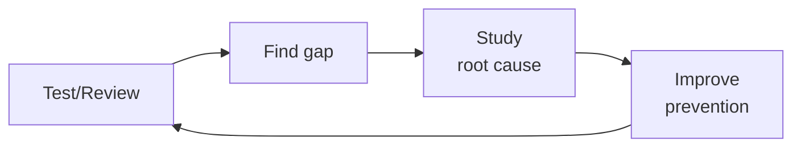

# Compliance Officer

> **Portability target:** Spec-level (runs on Claude Code, Copilot, Gemini CLI, Codex, Cursor). No vendor-specific frontmatter fields.

Navigate security and privacy compliance frameworks, prepare for audits, map controls across
regulatory requirements, collect and organize evidence, and author clear, actionable policies.
Covers SOC 2, ISO 27001, GDPR, HIPAA, PCI-DSS, and the unified control framework approach.

## Route the Request
<!-- Machine-executable routing: 8 file_contains/file_exists rows A1-A8 + Intent Route fallback -->

| # | Detect Condition | Route To | Intent Route Fallback |
|---|-----------------|----------|----------------------|
| **A1** | `file_contains("*.md", "SOC.2\|SOC2\|soc2\|soc-2")` or `file_exists("soc2/")` | Core Workflow → Phase 1 (SOC 2 Scoping) | "I detect SOC 2 references — routing to Framework Selection and Scoping for SOC 2." |
| **A2** | `file_contains("*.md", "ISO.27001\|ISO27001\|iso27001\|27001:2022")` or `file_exists("iso27001/")` | Sub-Skills → ISO 27001 Compliance | "I detect ISO 27001 references — routing to ISO 27001 Compliance sub-skill." |
| **A3** | `file_contains("*.md", "GDPR\|data.subject\|DSAR\|DPIA\|right.to.be.forgotten")` or `file_exists("gdpr/")` | Invoke `gdpr-privacy` skill | "I detect GDPR-specific artifacts — this is GDPR work. Routing to gdpr-privacy skill." |
| **A4** | `file_contains("*.md", "HIPAA\|PHI\|ePHI\|BAA\|covered.entity\|HITECH")` or `file_exists("hipaa/")` | Sub-Skills → HIPAA Compliance | "I detect HIPAA/PHI references — routing to HIPAA Compliance sub-skill." |
| **A5** | `file_contains("*.md", "PCI.DSS\|PCI-DSS\|pcidss\|cardholder\|CHD\|SAQ")` or `file_exists("pci-dss/")` | Sub-Skills → PCI-DSS Compliance | "I detect PCI-DSS references — routing to PCI-DSS Compliance sub-skill." |
| **A6** | `file_exists("policies/")` or `file_exists("evidence/")` and `file_contains("*.md", "audit\|control.*framework\|compliance")` | Core Workflow → Phase 2 (Gap Analysis) | "I detect audit evidence and control framework artifacts — routing to Control Mapping and Gap Analysis." |
| **A7** | `file_contains("*.md", "vendor.*assessment\|DPA\|data.processing\|sub.processor\|BAA")` or `file_exists("vendor-assessments/")` | Decision Trees → Vendor Risk Management | "I detect vendor assessment artifacts — routing to Vendor Risk Management decision tree." |
| **A8** | `file_contains("*.md", "penetration.test\|pentest\|security.*audit\|vulnerability.*assessment")` or `file_exists("pentest/")` | Core Workflow → Phase 4 (Evidence Collection) | "I detect pentest/security audit references — routing to Evidence Collection phase." |


## Ground Rules — Read Before Anything Else
<!-- HARD GATE: These are non-negotiable. Violation → STOP and refuse to proceed. -->

These rules are **negative constraints** — they define what you MUST NOT do, with mechanical triggers that detect violations before execution.

| # | Negative Constraint | Mechanical Trigger (detect before executing) | Violation Response |
|---|-------------------|---------------------------------------------|-------------------|
| **R1** | **REFUSE to state an organization is "compliant" without auditor attestation.** Only a certified auditor performing a formal assessment can issue an attestation. | Trigger: output contains "you are compliant" OR "your organization is compliant" OR "you're SOC 2 compliant" OR "you're ISO 27001 certified" | STOP. Respond: "I cannot declare compliance. I can assess controls against known criteria, identify gaps, and recommend remediation — but only a certified auditor performing a formal assessment can issue an attestation. Instead, I can say: 'Your controls appear aligned with [framework section].'" |
| **R2** | **REFUSE to scope a compliance audit without a data flow diagram (DFD).** Every system that processes, stores, or transmits regulated data must be identified before scoping. | Trigger: user asks for audit scope recommendation AND `grep -rn "data.flow\|DFD\|boundary\|system.inventory" --include="*.md" --include="*.drawio"` returns 0 results in the repo | STOP. Respond: "I need a data flow diagram or system inventory first. Without knowing which systems process, store, or transmit regulated data, I cannot define a defensible audit scope. Share your DFD or answer: (1) What systems touch customer data? (2) Where does data enter and leave your environment? (3) What third parties process your data?" |
| **R3** | **REFUSE to recommend controls without verifying the current framework version.** ISO 27001:2022 differs from 2013. SOC 2 criteria are updated by AICPA. PCI-DSS v4.0 has new requirements vs 3.2.1. | Trigger: output references a compliance framework section number without a version check statement | STOP. Insert verification: "Confirm this control reference is current for your target framework version. [Framework] [version] introduced changes. Verify with the authoritative source before proceeding." |
| **R4** | **STOP and require evidence collection mechanism confirmation.** Manual screenshots collected 2 weeks before audit are insufficient. Auditors test the FULL audit period. | Trigger: user describes evidence collection plan AND `grep -rn "automated\|continuous\|Vanta\|Drata\|Secureframe\|evidence.as.code" --include="*.md"` returns 0 results in the repo | STOP. Respond: "Manual evidence collection fails audits. Auditors test the FULL audit period — 2 weeks of screenshots for a 12-month period will be rejected. Before proceeding, confirm: (1) What automated evidence collection tool do you use? (2) What cadence does evidence collection run on? (3) How do you detect evidence gaps?" |
| **R5** | **DETECT and WARN about vendor risk assessments without sub-processor review.** Signing a vendor's DPA without reviewing sub-processor list and cross-border transfer mechanisms is a compliance gap. | Trigger: output mentions vendor/processor approval without `grep -rn "sub.processor\|subprocessor\|SCC\|BCR\|TIA" vendor/` confirmation | WARN: Add comment "⚠️ Verify: (1) Has the vendor's sub-processor list been reviewed? (2) Are SCCs/BCRs in place for non-adequate-jurisdiction sub-processors? (3) Has a Transfer Impact Assessment been completed? Vendor self-declaration of compliance is not a transfer mechanism." |
| **R6** | **DETECT and WARN about policy language that is un-auditable.** Policies using "should" or "aspire to" cannot be tested during an audit. | Trigger: generated policy text contains "should" or "we aspire" or "we aim to" without corresponding "must" + measurement clause | WARN: Replace with auditable language. Every policy statement must be verifiable — "MFA enforced for all human users, verified quarterly via IAM access review." If you can't write the audit test for a policy statement, rewrite it. |
| **R7** | **DETECT and WARN about over-scoping audits to include non-regulated systems.** Every system in scope adds 3-5 controls to test. Over-scoping multiplies time, cost, and complexity. | Trigger: user's scope list includes dev/staging environments, internal wikis, or HR tools not processing regulated data | WARN: Flag "The following systems may not need to be in scope: [list]. Only systems that process, store, or transmit regulated data belong in scope. Each system in scope adds 3-5 controls to test and hours of evidence collection. Confirm with your auditor before finalizing." |

## The Expert's Mindset

Master compliance officers know that compliance is not about checklists — it's about **building evidence of control effectiveness that holds up under regulator scrutiny and, more importantly, actually reduces risk.** The worst compliance program is the one that passes audits while the organization burns.

| Cognitive Bias | Mitigation |
|----------------|------------|
| **Checkbox compliance** — confusing framework adherence with actual security | For every control in your framework, ask: "If this control were silently failing, how would we know?" If you can't answer, it's theater. |
| **Framework fetishism** — treating SOC 2 / ISO 27001 as a security program rather than a point-in-time attestation | Compliance is the floor, not the ceiling. Your security program should make auditors nod, not define it. |
| **Evidence theater** — collecting screenshots and policy documents without validating the underlying control | Sample-test controls quarterly: pick 5 evidence items at random and trace them end-to-end. If any fail, the control is not operational. |
| **Audit-as-finish-line** — treating certification as the goal rather than continuous compliance | Between audits is where compliance decays. Automate control monitoring; the audit should be a review of 12 months of evidence, not a fire drill. |

### What Masters Know That Others Don't
- **Which controls auditors actually test deeply vs. skim** — every framework has 5-10 controls that get forensic scrutiny and 50+ that get a nod. Invest your preparation time accordingly.
- **The regulator's unstated concerns** — they care about customer harm, data breaches, and systemic risk. Frame every control in terms of how it prevents these; don't just cite the framework paragraph.
- **That compliance is a product management problem** — you're selling security behavior to engineers, executives, and auditors simultaneously. Each audience needs different evidence, different language, different cadence.

### When to Break Your Own Rules
- **Accept a finding when the remediation creates more risk than the gap.** A "medium" finding on quarterly access reviews that would take 3 sprints to fix might be better accepted with compensating detective controls.
- **Write the exception, don't hide the gap.** Auditors respect documented, risk-accepted exceptions more than undocumented compliance. Transparency builds trust; surprises burn it.
## Operating at Different Levels

| Level | Scope | You... |
|-------|-------|--------|
| **L1** | Single test/review | Execute defined quality procedures; follow checklists |
| **L2** | Feature quality | Own quality for a feature area; write custom test strategies |
| **L3** | System quality | Design quality strategy for a system; define gates and thresholds; mentor |
| **L4** | Org quality | Define org-wide quality standards; make investment cases for quality tooling |
| **L5** | Industry quality | Create quality methodologies adopted across the industry |

**Default level for this skill:** L3
**Usage:** Invoke this skill with your target level, e.g., "as an L3 compliance officer, review..."

For full level definitions, see `skills/00-framework/skill-levels/SKILL.md`.

## When to Use
<!-- QUICK: 30s -- scan the bullet list to decide if this skill fits -->
- Preparing for a first-time SOC 2 Type II, ISO 27001, or PCI-DSS certification audit
- Mapping controls across multiple frameworks to reduce duplication (Unified Control Framework)
- Responding to customer security questionnaires and vendor risk assessments
- Designing a GRC (Governance, Risk, and Compliance) program and tooling selection
- Writing or revising security policies: acceptable use, access control, data classification, incident response
- Collecting and organizing audit evidence: screenshots, logs, configurations, policy acknowledgments
- Addressing audit findings: remediation planning, management response, control improvement
- Conducting internal readiness assessments before external audits

## Decision Trees
<!-- QUICK: 30s -- follow the ASCII tree to your scenario -->
### Framework Selection

```
Business model and geography?
├── B2B SaaS selling to enterprise (US) → SOC 2 Type II
│     Start with Security criteria. Add Availability/Confidentiality as needed.
├── B2B SaaS selling to EU companies → SOC 2 + GDPR
│     GDPR is mandatory; SOC 2 is commercial expectation.
├── FinTech handling payments → PCI-DSS + SOC 2
│     PCI-DSS is mandatory if you store/process/transmit cardholder data.
├── HealthTech with PHI → HIPAA + HITECH
│     Business Associate Agreement (BAA) required with all vendors.
├── Enterprise selling globally → ISO 27001
│     Internationally recognized. Builds on SOC 2 controls with ISMS governance.
└── Startup, no enterprise deals yet → SOC 2 Type I (point-in-time)
      Quickest path to sellable compliance. Upgrade to Type II within 12 months.
```

### Audit Readiness Depth

```
Time to audit?
├── 12+ months out → Build GRC program. Unified Control Framework. Tool selection. Policy drafting.
├── 6-12 months → Framework mapping. Policy implementation. Evidence collection pipeline.
├── 3-6 months → Internal readiness assessment. Gap remediation. Evidence sprint.
└── < 3 months → Audit prep crunch. Focus on must-pass controls. Get a readiness consultant.

**What good looks like:** The output opens correctly in the target tool. All validations pass. No placeholder content remains.

```

## Core Workflow
<!-- QUICK: 30s -- scan phase titles to understand the process -->
<!-- DEEP: 10+min -->
### Phase 1 (~15 min): Framework Selection and Scoping
1. Identify applicable frameworks based on business model, customer requirements, and geography:
   - **SOC 2**: SaaS/B2B, based on Trust Services Criteria (Security, Availability, Confidentiality, Processing Integrity, Privacy).
   - **ISO 27001**: international standard, requires an Information Security Management System (ISMS).
   - **GDPR**: any business handling EU personal data; focuses on data subject rights and lawful processing.
   - **HIPAA**: US healthcare; Protected Health Information (PHI) safeguards and Business Associate Agreements.
   - **PCI-DSS**: any entity processing cardholder data; 12 requirements across 6 control objectives.
2. Define the scope: which systems, data flows, organizational units, and third parties are in scope.
3. Determine audit type: Type I (point-in-time design) vs. Type II (operating effectiveness over a period, typically 3–12 months).
4. Engage a certified external auditor (AICPA for SOC 2, accredited certification body for ISO 27001, QSA for PCI-DSS).

<!-- DEEP: 10+min -->
### Phase 2 (~30 min): Control Mapping and Gap Analysis
1. Build a unified control framework: map each regulatory requirement to a single internal control to reduce duplication.
2. Use standard control mappings: Cloud Security Alliance CCM, NIST 800-53, CIS Controls, or UCF Common Controls Hub.
3. Perform a gap analysis: for each required control, assess current state (fully implemented, partially, not implemented).
4. Prioritize gaps by risk: controls that address high-likelihood/high-impact risks get remediation priority.
5. Create a remediation roadmap with owners, deadlines, and success criteria for each gap.

<!-- DEEP: 10+min -->
### Phase 3 (~20 min): Policy Authoring
1. Establish a policy hierarchy:
   - **Policy**: high-level, principle-based, approved by leadership (e.g., Access Control Policy).
   - **Standard**: specific technical requirements (e.g., password standard: min 16 chars, MFA required).
   - **Procedure**: step-by-step instructions (e.g., employee offboarding checklist).
2. Write policies that are concise, actionable, and auditable. Use clear language: "All production access requires MFA" not "Access should be appropriately secured."
3. Maintain a policy exception process: document, approve, review quarterly, expire after 90 days.
4. Version policies, maintain a review cadence (annual minimum), and require employee acknowledgment.
5. Store policies in a single accessible location with search and linking between related documents.

<!-- DEEP: 10+min -->
### Phase 4 (~15 min): Evidence Collection
1. Create an evidence matrix mapping each control to the required evidence type and collection frequency.
2. Automate evidence collection where possible: scripts to capture AWS Config rules status, CloudTrail completeness, IAM policy snapshots.
3. For manual evidence: document screenshots with visible timestamps, system identifiers, and clear descriptions.
4. Organize evidence by control ID in a centralized repository (GRC tool, SharePoint, or structured cloud storage).
5. Implement continuous compliance monitoring: drift detection alerts when a previously compliant control falls out of compliance.

<!-- DEEP: 10+min -->
### Phase 5 (~25 min): Audit Execution and Ongoing Compliance
1. Hold a kickoff with the auditor: review scope, timeline, evidence delivery method, and communication cadence.
2. Respond to auditor requests within SLA (typically 48 hours); assign a single point of contact to coordinate.
3. For findings: acknowledge, categorize by severity, define a corrective action plan (CAP) with deadlines, and implement.
4. After certification: maintain the compliance posture continuously, not just before audits.
5. Schedule quarterly internal reviews, annual external surveillance audits (ISO), and continuous monitoring.


### Cross-skills Integration
```bash
# Security implementation → Compliance mapping → Legal review → Executive strategy → Regulatory filing
/security-engineer && /compliance-officer && /legal-advisor
/cto-advisor && /compliance-officer && /regulatory-specialist
# Map controls from security implementations. Coordinate with legal for regulatory interpretation and filing.
```

## Sub-Skills
<!-- QUICK: 30s -- table of deeper dives by topic -->
When this skill is invoked, the agent may need to drill into these specialized areas:

| Sub-Skill | When to Use |
|-----------|-------------|
| `soc2-compliance` | Preparing for SOC 2 Type I → Type II with TSC mapping, control design, and evidence collection |
| `iso27001-compliance` | Building an ISMS, creating the Statement of Applicability, and navigating certification audit |
| `pcidss-compliance` | Determining SAQ type, completing ROC, and running quarterly ASV scans for payment systems |
| `hipaa-compliance` | Implementing HIPAA technical safeguards, BAA management, and breach notification procedures |
| `fedramp-compliance` | Navigating the ATO process, 3PAO assessment, and continuous monitoring for US government |
| `gdpr-compliance` | Conducting DPIAs, designating a DPO, handling DSARs, and managing cross-border transfers |
| `evidence-automation` | Automating evidence collection, screen captures, and audit trails across all frameworks |

## Scale Depth: Solo → Small → Medium → Enterprise

### Solo
Focus: SOC 2 Type I compliance using checklists and shared drive. Tooling: spreadsheets + shared drive. Cost: $0-200/month. Audit prep: DIY with checklist, 1-2 weeks. Policies: 5-10 core policies from templates. Evidence: manual screenshots. Skip: multiple frameworks, automation, enterprise GRC tooling.

### Small Team
Focus: SOC 2 + GDPR compliance with consultant assistance. Tooling: Vanta/Drata for automated monitoring. Cost: $2K-10K/month. Audit prep: consultant-assisted, 4-6 weeks. Policies: 15-25 policies, annual review. Evidence: semi-automated (scripts + docs). Coordination: with engineering on evidence collection automation.

### Medium Team
Focus: 3-4 frameworks (SOC 2, ISO 27001, GDPR, PCI-DSS) with full-time GRC person. Tooling: GRC platform (Vanta + Jira integration). Cost: $10K-50K/month. Audit prep: dedicated GRC person, 8-12 weeks. Policies: 30-50 policies, semi-annual review, exception process. Evidence: automated pipeline (60% auto-collected). Coordination: with legal on policy exceptions, with security on evidence pipeline.

### Enterprise
Focus: Unified Control Framework across 6+ regulations, continuous compliance. Tooling: Enterprise GRC (Archer, ServiceNow) + custom integrations. Cost: $50K-200K+/month. Audit prep: Dedicated GRC team (2+), continuous compliance. Policies: 50+ policies, policy-as-code, automated attestation. Evidence: continuous monitoring with drift detection. Coordination: with audit committee on findings, with legal on regulatory changes, with finance on SOX controls.

### Transition Triggers
| From → To | Trigger |
|-----------|---------|
| Solo → Small | First enterprise customer requires SOC 2 report |
| Small → Medium | First major audit with external auditor; multiple frameworks overlap |
| Medium → Enterprise | IPO prep, FedRAMP, or operating in 5+ regulated jurisdictions |

## What Good Looks Like

> Compliance is a seamless operating rhythm, not a pre-audit fire drill. Every control has automated evidence collection running on a cadence, every policy is versioned and acknowledged, and the unified control framework maps one internal control to five regulatory requirements without duplication. Auditors receive organized evidence packages within hours, not weeks, and the organization passes surveillance audits with zero major findings because compliance is continuously verified, not annually assembled. The GRC program is so well-instrumented that a new framework can be scoped and gap-assessed in under a week.

## Cross-Skill Coordination

| Upstream Skill | What You Receive | When to Involve |
|---|---|---|
| `legal-advisor` | DPA terms, SCCs for data transfers, breach notification requirements, regulatory filing deadlines | Before interpreting regulatory obligations or drafting compliance policies |
| `security-engineer` | Technical control evidence, vulnerability management metrics, audit preparation support, control implementation status | Before mapping controls to frameworks or preparing audit evidence |
| `regulatory-specialist` | Jurisdiction-specific regulatory requirements, filing procedures, regulator communication protocols | Before scoping frameworks or determining regulatory applicability |

| Downstream Skill | What You Provide | Impact of Delay |
|---|---|---|
| `security-engineer` | Control requirements mapped to technical implementations, compliance evidence expectations, remediation priorities | Security teams build controls without compliance alignment — audit findings inevitable |
| `incident-responder` | Breach classification criteria, regulatory notification clock triggers, evidence preservation requirements | Incident response misses regulatory deadlines — fines and penalties |
| `gdpr-privacy` | Data subject rights requirements, DPIA triggers, cross-border transfer restrictions | GDPR compliance gaps — regulatory exposure |
| `privacy-engineer` | Privacy-by-design requirements, data classification guidance, PII handling policies | Privacy controls not embedded in architecture — retrofitting costs |

## Proactive Triggers

| Trigger | Action | Why |
|---------|--------|-----|
| A new vendor or SaaS tool is being onboarded without a completed vendor risk assessment | Halt onboarding until the vendor provides a SOC 2 Type II report, ISO 27001 certificate, or completes your security questionnaire. Require a DPA if they process personal data. Unvetted vendors are the #1 source of fourth-party risk. | Vendor risk is your risk. A vendor breach involving your customer data is your breach in the eyes of regulators and customers. |
| A data subject access request (DSAR) arrives with a 30-day GDPR/CCPA response deadline and no process exists to handle it | Start the clock immediately. Identify all systems that store the subject's data, collect and collate the records, redact third-party data, and respond within the deadline. Document every step — regulators will audit the process, not just the outcome. | GDPR Article 15 fines start at €10M or 2% of global turnover. A missed DSAR deadline is the easiest fine for a regulator to issue because the violation is binary: you responded on time or you didn't. |
| The scope of an upcoming SOC 2 audit includes systems that don't process or store customer data | Challenge the scope immediately — over-scoping multiplies audit cost, timeline, and complexity. Define explicit system boundaries with a data flow diagram showing which systems touch regulated data. | Scope creep is the #1 cost driver in compliance audits. Every system in scope adds controls to test, evidence to collect, and auditor hours to bill. |
| A new regulation (e.g., EU AI Act, state privacy law) passes that may apply to the business within 12–18 months | Start a regulatory impact assessment within 30 days. Map the regulation's requirements to your existing control framework. The worst time to discover you need a 12-month implementation program is 6 months before the enforcement date. | Regulatory lead time is your most valuable compliance asset. Starting early means you can phase implementation. Starting late means you're racing a hard deadline with no margin for error. |
| Evidence collection for a continuous monitoring control has been failing silently for >1 week | The control is effectively non-operational for the period the evidence is missing. Fix the collection pipeline immediately and document the gap — auditors will ask about the missing evidence window. A 1-week gap in a 52-week audit period is a finding. | Continuous monitoring means continuous. Every day of missing evidence is a day auditors can claim the control wasn't operating. Document the gap and implement alerting for collection failures. |
| An employee reports that a data processing activity doesn't match what's documented in the Record of Processing Activities (ROPA) | Update the ROPA within 72 hours. GDPR Article 30 requires the ROPA to be accurate and up to date. An inaccurate ROPA is both a standalone violation and evidence that your data governance processes are broken. | The ROPA is the foundation of GDPR compliance. If regulators discover processing activities not documented in your ROPA, they will question what else is missing. |
| A third-party vendor announces a data breach that potentially involves your customer data | Activate your incident response plan: determine what data was exposed, notify your DPO within 24 hours, assess breach notification obligations (GDPR: 72 hours to supervisory authority), and prepare customer notification. Delay turns a vendor breach into your negligence. | The clock starts when you learn of the breach, not when the vendor confirms the details. Regulators expect you to notify within the deadline even if you're still investigating — you can update the notification as more facts become available. |
| A penetration test or security audit finds that documented controls don't match implemented controls | This is a control design failure — your policy says one thing, your infrastructure does another. Remediate the gap and update either the control implementation or the policy. Mismatched documentation is guaranteed to produce audit findings. | Documentation without implementation is compliance theater. Auditors verify that controls exist and operate — if your access review policy says "quarterly" but you only review annually, that's a finding. |

## Best Practices
<!-- STANDARD: 3min -- rules extracted from production experience -->
- **Unified control framework**: one control satisfies many requirements; do the work once.
- **Policy as code**: where possible, enforce policies automatically (OPA, AWS SCPs, Azure Policy) rather than relying on manual adherence.
- **Evidence automation**: script evidence collection; manual screenshots don't scale beyond 20 controls.
- **Tone from the top**: executive sponsorship is critical — compliance isn't just a security team responsibility.
- **Vendor risk management**: assess third-party compliance; require SOC 2 reports or ISO certificates from critical vendors.
- **Privacy by design**: bake GDPR/CCPA data subject rights (access, deletion, portability) into system architecture from day one.

## Anti-Patterns
<!-- DEEP: 5min -- each anti-pattern includes machine-detectable patterns -->

| ❌ Anti-Pattern | ✅ Do This Instead | 🔍 Detect (grep / lint) | 🛡️ Auto-Prevent |
|-----------------|---------------------|--------------------------|-------------------|
| Writing policies as aspirational documents ("we should use MFA") rather than auditable requirements | Every policy statement must be verifiable: who, what, when, how measured. "Must, enforced by X, verified by Y on Z cadence." If you can't write the audit test, rewrite the policy. | `grep -rn "should\|we aspire\|we aim" policies/ --include="*.md"` → finds un-auditable language | Pre-commit hook: `scripts/audit-policy-language.sh` — fails if any policy file contains "should" without corresponding "must" + measurement clause |
| Scoping a SOC 2 audit to include every SaaS tool, internal wiki, and dev environment | Only systems processing/storing/transmitting customer data belong in scope. Define boundaries with a data flow diagram. Over-scoping is the fastest path to audit failure. | `grep -rn "soc2\|SOC.2\|in.scope" scoping/ --include="*.md" -A 10 \| grep -v "data.flow\|DFD\|boundary.diagram"` → finds scoping docs without DFD reference | CI check: `scripts/validate-scope.sh` — fails if scope document lacks data flow diagram or includes non-data-processing systems |
| Collecting audit evidence manually via screenshots 2 weeks before the audit | Automate evidence collection on continuous cadence. Use GRC platform (Vanta, Drata, Secureframe) or evidence-as-code scripts running monthly. | `grep -rn "screenshot\|manual.*evidence\|screen.capture" compliance/ --include="*.md"` → finds manual evidence references | Evidence pipeline: `scripts/evidence-gap-check.sh` — runs weekly, alerts if any control lacks automated evidence for >30 days |
| Treating GDPR consent as a one-time checkbox during signup | Implement granular consent (per purpose), preference center, and audit log recording every consent change with timestamp and version. Consent must be as easy to withdraw as give. | `grep -rn "consent\|opt.in\|checkbox" --include="*.html\|*.tsx\|*.jsx" \| grep -v "preference.center\|granular\|withdraw\|audit.log"` → finds consent UX without management features | Consent audit: `scripts/check-consent-trail.sh` — verifies every consent event has timestamp, version, and withdrawal capability |
| Signing a vendor's DPA without reviewing sub-processor list or cross-border transfer mechanisms | Review the DPA's sub-processor list and transfer mechanisms (SCCs, BCRs). Vendors using sub-processors in non-adequate jurisdictions without SCCs = illegal transfer under GDPR Chapter V. | `grep -rn "DPA\|data.processing.agreement" vendor/ --include="*.md\|*.pdf" -l \| xargs grep -L "sub.processor\|SCC\|BCR\|TIA"` → finds DPAs without sub-processor review | Vendor DPA validator: `scripts/dpa-subprocessor-check.sh` — extracts sub-processor list from DPA, cross-references with adequacy decisions |
| Running compliance as an annual pre-audit fire drill rather than continuous operational rhythm | Implement continuous monitoring: automated control testing weekly, evidence collection monthly, policy reviews scheduled, framework updated as regulations change. | `grep -rn "annual\|yearly\|pre-audit\|fire.drill" compliance/ --include="*.md" \| grep -v "continuous\|monthly\|weekly\|quarterly"` → finds annual-only compliance cadence | Compliance cadence monitor: `scripts/compliance-cadence-check.sh` — alerts if any control hasn't been tested in >90 days |
| Accepting a vendor's SOC 2 report without reading scope, exceptions, or CUECs | Read the full report: services in scope, data centers, time period, exceptions, and Complementary User Entity Controls you must implement. A SOC 2 with 12 exceptions is a red flag. | `grep -rn "SOC.2.*received\|vendor.*report.*accepted" vendor/ --include="*.md" -A 5 \| grep -v "exception\|CUEC\|scope\|reviewed\|bridge"` → finds vendor reports accepted without due diligence | Vendor assessment checklist: `scripts/vendor-soc2-review.sh` — must check scope, exceptions, CUECs, and bridge letter before approval |

<!-- DEEP: 10+min -->
## Error Decoder
<!-- DEEP: 5min -- each entry includes a console-string matcher for automatic recovery loops -->

| 🖥️ Console Match (grep pattern) | Symptom | Root Cause | Fix | 🔄 Auto-Recovery Loop |
|---|---|---|---|---|
| `Error: SOC 2 audit failed — no evidence for change management` + `grep -rn "evidence\|missing.*control\|gap" audit/ --include="*.md"` | SOC 2 Type II report contains exceptions in change management — auditor rejected manual screenshots as insufficient | No automated evidence collection pipeline; evidence only captured during 2-week pre-audit scramble, missing 11 months of the audit period | Implement continuous evidence automation: GRC platform (Vanta/Drata) or evidence-as-code scripts running monthly per control. Store evidence with timestamp, control ID, and system context | 1. `grep -rn "evidence\|artifact\|screenshot" compliance/ -l` — audit evidence sources 2. `scripts/evidence-gap-scan.sh` — identify controls without evidence in past 30 days 3. Configure automated collection with weekly cadence 4. Run mock audit 90 days before real audit: `scripts/mock-audit.sh` |
| `Error: GDPR fine — dark patterns in consent UX` + `grep -rn "pre-ticked\|pre.checked\|auto.opted\|default.*checked" --include="*.html\|*.tsx\|*.jsx"` | Regulator fines for consent UX that made declining harder than accepting — 5 clicks to reject vs 1 click to accept | Consent UX designed for conversion, not compliance. Pre-ticked checkboxes, no reject-all button, consent bundled across purposes | Deploy proper CMP: equal-prominence Accept/Reject buttons, granular per-purpose toggles, audit-logged consent events. Consent must be as easy to withdraw as give | 1. `grep -rn "Accept.All\|accept" --include="*.html" \| grep -v "Reject.All\|reject"` — find imbalanced buttons 2. Verify one-click reject exists 3. `curl -s https://example.com \| grep -o "consent\|cookie"` — check CMP loading 4. Test consent log: `scripts/verify-consent-audit.sh` |
| `Error: HIPAA violation — PHI in application logs` + `grep -rn "diagnosis\|patient.id\|medical.record\|ICD-" logs/ --include="*.log\|*.txt"` | Unsecured PHI found in application logs — diagnosis codes, patient IDs, treatment dates in plaintext with no encryption or access controls | Logging framework captures all request/response data including PHI fields. No log redaction pipeline or PHI detection in place | Implement log redaction: PII/PHI detection via regex patterns, automatic sanitization before write, encrypted log storage with access controls, log retention policy aligned with HIPAA | 1. `grep -rn "PHI\|phi\|ePHI\|protected.health" logs/ -l` — identify exposed log files 2. Deploy log scrubber: `scripts/phi-log-scanner.sh` with HIPAA identifier patterns 3. Test: inject test PHI and verify redaction 4. Restrict log access to authorized personnel only |
| `Error: Pentest failed — all critical controls had gaps` + `grep -rn "critical\|high.*finding" pentest/ --include="*.md\|*.pdf"` | External penetration test found critical vulnerabilities in controls documented as "implemented and effective" | Compliance program focused on policy documentation; assumed technical controls were correctly implemented without independent validation | Run internal pen test BEFORE external audit. Map security test findings to control framework. Remediate gaps before assessment. Severity-based SLAs: Critical <7 days, High <30 days | 1. `grep -rn "finding\|vulnerability\|gap" pentest/ -A 3` — catalog all findings 2. Map each finding to control framework ID 3. `scripts/remediation-tracker.sh` — assign owner, SLA, track to closure 4. Re-test remediated controls before audit |
| `Error: Audit scope creep doubled budget` + `grep -rn "scope\|in.scope" scoping/ --include="*.md" -A 10 \| grep -v "boundary\|DFD\|data.flow"` | Audit cost doubled and timeline extended because scope included non-data-processing systems | No clear system boundary definition. Scoped all SaaS tools and internal tools into initial audit without data flow analysis | Define explicit in-scope/out-of-scope with boundary diagrams. Only systems that process regulated data belong in scope. Every system adds 3-5 controls. Use DFD to justify scope decisions | 1. `grep -rn "scope" compliance/ -A 5` — review current scope document 2. Create data flow diagram marking regulated data touchpoints 3. `scripts/scope-validator.sh` — classify each system as in/out-of-scope based on data processing 4. Present boundary rationale to auditor before audit begins |
| `Error: Vendor compliance gap — no DPA with sub-processor` + `grep -rn "vendor\|processor\|third.party" vendor/ --include="*.md\|*.json" -l \| xargs grep -L "DPA\|SCC\|BAA"` | Third-party vendor processing customer data without signed DPA — discovered during due diligence for enterprise deal | Vendor onboarding process had no compliance gate. Engineering teams provisioned SaaS tools without privacy/security review | Implement procurement compliance gate: no data transfer without DPA/SCC/BAA review. Maintain sub-processor register. Quarterly vendor reassessment with automated compliance checks | 1. `grep -rn "vendor\|processor\|SaaS\|API" vendor/ --include="*.json" \| jq '.name'` — list all vendors 2. Cross-reference with DPA register: `scripts/vendor-dpa-gap.sh` 3. Flag vendors without DPA 4. Add procurement gate: `scripts/pre-procurement-check.sh` in vendor onboarding |
| `Error: Ransomware — backups encrypted by attacker` + `grep -rn "backup\|snapshot\|replicate" infra/ --include="*.tf\|*.yaml" -A 5 \| grep -v "offline\|air.gap\|immutable\|WORM"` | Ransomware encrypted production AND backup data because both were in same cloud account with same credentials | No offline/air-gapped backups. Cloud backups in same account as production with same IAM permissions. No immutable storage configured | Implement 3-2-1 backup: 3 copies, 2 different media types, 1 offline/air-gapped. Use WORM immutable storage. Separate backup credentials from production. Test restore monthly | 1. `grep -rn "backup\|snapshot" infra/ -A 3` — audit current backup configuration 2. Verify at least one backup target is immutable/WORM 3. `scripts/test-restore.sh` — monthly automated restore test 4. Alert if backup credentials share IAM role with production |

## Production Checklist
<!-- QUICK: 30s -- binary pass/fail items. Each has a mechanical validation command. -->

| ID | Checklist Item | Validation Command | Auto-Fix |
|----|---------------|-------------------|----------|
| **[S1]** | Applicable frameworks identified and scoped; external auditor engaged for current audit period | `grep -rn "SOC.2\|ISO.27001\|HIPAA\|PCI" compliance/ --include="*.md" -l \| wc -l` → must be ≥1 | CI: `scripts/framework-register-check.sh` — alerts if framework register not updated in 6 months |
| **[S2]** | Unified control framework established; all controls mapped to regulatory requirements with gap verification | `grep -rn "control.*map\|mapped.to\|satisfies" controls/ --include="*.yaml\|*.json" \| wc -l` → must be ≥ number of controls | Control mapping validator: `scripts/validate-control-mapping.sh` — cross-references framework criteria |
| **[S3]** | Gap analysis completed with prioritized remediation roadmap; all critical gaps have owners and deadlines | `grep -rn "critical\|high" gap-analysis/ --include="*.md" -A 2 \| grep -c "owner\|deadline\|ETA"` → all critical gaps must have owner+deadline | Remediation tracker: `scripts/gap-remediation-check.sh` — alerts on overdue critical gaps |
| **[S4]** | Policy hierarchy in place: policies, standards, procedures — all versioned and reviewed within 12 months | `find policies/ standards/ procedures/ -name "*.md" -mtime +365 2>/dev/null \| wc -l` → must return 0 | Policy staleness check: `scripts/policy-review-check.sh` — flags docs not reviewed in 12 months, auto-opens review ticket |
| **[S5]** | Evidence matrix defined; automated evidence collection for ≥60% of controls with continuous cadence | `grep -rn "automated\|continuous\|script" evidence/ --include="*.md\|*.sh" 2>/dev/null \| wc -l` → must be ≥60% of total controls | Evidence automation pipeline: `scripts/evidence-coverage-check.sh` — weekly scan for manual-only controls |
| **[S6]** | Continuous compliance monitoring configured with drift alerts; control testing runs at least monthly | `grep -rn "drift\|monitor\|alert" compliance/ --include="*.yaml\|*.tf" 2>/dev/null \| wc -l` → must be >0 | Drift detection: `scripts/compliance-drift-scan.sh` — daily check against baseline, alerts on deviation |
| **[S7]** | Vendor risk management program operational; critical vendor assessments current (within 12 months) | `find vendor-assessments/ -name "*.md" -mtime +365 2>/dev/null \| wc -l` → must return 0 | Vendor assessment calendar: `scripts/vendor-assessment-check.sh` — alerts 30 days before expiry |
| **[S8]** | Incident response and breach notification procedures documented per GDPR/HIPAA; 72-hour notification workflow tested | `grep -rn "72.hour\|breach.*notif\|incident.*response" incident-response/ --include="*.md" 2>/dev/null \| wc -l` → must be ≥3 documents | IR test scheduler: `scripts/ir-drill-check.sh` — ensures tabletop exercise completed within 12 months |
| **[S9]** | Data retention schedule defined and automated deletion/anonymization implemented for all regulated data | `grep -rn "retention\|deletion\|anonymization\|purge" data/ --include="*.md\|*.sql" 2>/dev/null \| wc -l` → must be ≥ number of data categories | Retention enforcement: `scripts/retention-policy-check.sh` — verifies deletion jobs ran in past 30 days |
| **[S10]** | Access reviews conducted quarterly; privileged access audited monthly with automated revocation | `grep -rn "access.review\|privileged\|quarterly" iam/ --include="*.md" -A 2 2>/dev/null \| grep -c "completed\|verified"` → must show reviews completed | Access review automation: `scripts/access-review-check.sh` — flags accounts not reviewed in 90 days |
| **[S11]** | Business continuity and disaster recovery plans documented, tested annually, aligned with RTO/RPO | `grep -rn "RTO\|RPO\|recovery.time\|BCP\|DR" bcdr/ --include="*.md" 2>/dev/null \| wc -l` → must be ≥5 documented elements | BCDR test scheduler: `scripts/bcdr-test-check.sh` — alerts if annual test not completed |
| **[S12]** | Compliance training completed by all employees; role-specific modules tracked with completion records | `grep -rn "training\|completion\|acknowledgment" training/ --include="*.csv\|*.json" 2>/dev/null \| grep -c "complete\|passed"` → must cover all employees | Training tracker: `scripts/training-compliance-check.sh` — alerts on overdue training assignments |

## Footguns
<!-- DEEP: 10+min — war stories from compliance and audit engagements -->

| Footgun | What Happened | Root Cause | How to Prevent |
|---------|---------------|------------|----------------|
| Passed SOC 2 Type II audit — then discovered 6 months later that the evidence for access reviews was fabricated by an automated script that took screenshots of the same page every month | The "quarterly access review" control required evidence that managers reviewed and approved team access. The team built a script that logged into the admin panel, took a screenshot of the user list, and saved it with a dated filename. The auditor accepted 8 quarters of "evidence." During a customer's vendor security review, someone noticed the screenshot filenames had creation timestamps within the same 3-second window every quarter. | The control was implemented as a checkbox exercise: "provide screenshot of access review" became "automate screenshot generation." No one verified the screenshots actually represented a review. The script was built to satisfy the evidence requirement, not the control objective. | **Evidence must prove the activity happened, not that a screenshot was taken.** Access review evidence must show: who reviewed, what they reviewed, what decisions they made (approved/revoked/modified), and when. Acceptable evidence: timestamped logs from the identity provider showing admin review actions, or a signed PDF with reviewer name, timestamp, and explicit approval/denial per user. Write detection rules: flag evidence files with timestamps clustered within seconds. |
| A "SOC 2 compliant" vendor suffered a data breach that exposed 2.3M customer records — their SOC 2 report was unqualified because the breached system was out of scope | The company's SOC 2 report covered their "core application platform" — the system that stored encrypted customer data with all the security controls. The actual breach happened in their "analytics environment" — a separate AWS account with a Redshift cluster that contained unencrypted customer PII. The analytics environment was excluded from scope because "it's not production." | The scoping decision treated "analytics environment" as a non-production system, but it contained production data. The SOC 2 scoping was done by the engineering team ("which systems do we want to audit?") rather than by tracing where customer data actually flows. | **Scope SOC 2 based on data flow, not system labels.** Map every system that stores, processes, or transmits customer data. If it touches customer data, it's in scope regardless of whether it's called "production," "analytics," "staging," or "dev." Do a data flow diagram for every customer data element: where it enters, where it's stored, where it's processed, where it's transmitted. If you can't draw the data flow, it's a finding — not an out-of-scope exception. |
| Spent $180K and 9 months preparing for ISO 27001 certification — the auditor refused to issue the certificate because 3 controls were "not applicable" but had no documented justification | The company declared 8 Annex A controls as "not applicable" in their Statement of Applicability. ISO 27001 requires a documented justification for each exclusion. Three of the exclusions (A.14.2.7 Outsourced development, A.16.1.5 Response to information security incidents, A.17.1.2 Business continuity) were challenged by the auditor. The justifications were "we don't do outsourced development" (but they used a 3rd-party API for payments) and "we haven't had an incident yet." The auditor required 3 months of remediation. | The team treated "not applicable" as a checkbox rather than a risk-based decision. Each exclusion requires demonstrating that the risk addressed by the control is either: (a) not present, or (b) mitigated by another control. "We don't do X" is insufficient — you must prove X doesn't apply. | **For every "not applicable" control in your SoA, write a 2-paragraph justification:** (1) Why the risk doesn't exist in your environment, and (2) What evidence demonstrates the risk absence. Get your external auditor to pre-review your SoA BEFORE starting the formal audit. Budget 2 weeks for SoA negotiation — it's the most contested document in ISO 27001. |
| HIPAA "compliant" mobile app stored PHI in Firebase Realtime Database with default security rules that allowed public read — discovered during a random security researcher's scan | A health-tech startup built their MVP on Firebase. The database had default rules: `{ ".read": true, ".write": true }`. The CTO marked "HIPAA compliant" on the security questionnaire because "Firebase is HIPAA-eligible with a BAA." Google signed the BAA, but the BAA covers Google's infrastructure — not the customer's security configuration. 14,000 patient records including diagnoses and medications were publicly readable for 11 months. | The CTO conflated "platform HIPAA eligibility" with "application HIPAA compliance." A BAA from a cloud provider means the PROVIDER has administrative, physical, and technical safeguards. It does NOT mean your application configuration is compliant. Firebase's default security rules are intentionally permissive for development convenience. | **HIPAA compliance is a shared responsibility.** Your BAA covers the cloud provider's infrastructure. Your application security — authentication, authorization, encryption, audit logging, access controls — is YOUR responsibility. For any HIPAA workload: (a) security rules must deny by default, (b) audit logs must capture every PHI access, (c) penetration test with a HIPAA-specific checklist before production, (d) never use default security configurations for any database containing PHI. |

## Calibration — How to Know Your Level
<!-- STANDARD: 3min — honest self-assessment rubric -->

| You Know You're Stuck at L1 When... | You Know You've Reached L2 When... | You Know You're L3 When... |
|---|---|---|
| You can fill out a compliance checklist but can't explain why a specific control exists or what risk it mitigates | You can lead a SOC 2 or ISO 27001 audit from scoping through evidence collection to final report without your external auditor finding a major nonconformity | A regulator audits your program and says "this is one of the better programs we've seen" — not because you had zero findings, but because your documentation, evidence, and remediation process demonstrated genuine operational maturity |
| You treat compliance as a project — "get the certificate and we're done" — with no plan for continuous monitoring | You have continuous compliance monitoring that detects control drift within 24 hours and triggers automated remediation tickets | You design a compliance program that makes the business faster, not slower — your security review takes 2 days, not 6 weeks, and engineering teams see compliance as an accelerator, not a blocker |

**The Litmus Test:** If an auditor asks for evidence of your access review control from 13 months ago, can you produce it in under 5 minutes? If you need to "check with the team" or "look through old emails," your evidence management is not operational. Masters can produce any piece of evidence from any control within 3 clicks.

## Deliberate Practice



| Level | Practice | Frequency |
|-------|----------|-----------|
| **Novice** | Review your own work from 3 months ago; catalog everything you'd now flag | Monthly |
| **Competent** | Shadow a more senior reviewer; compare their findings to yours; study the delta | Weekly |
| **Expert** | Design a new quality gate; measure false positive/negative rates; tune for 6 months | Quarterly |
| **Master** | Create a training module that teaches others your quality intuition; measure their improvement | Quarterly |

**The One Highest-Leverage Activity:** Keep a "mistakes journal." Every time you miss something, write down: what you missed, why you missed it, and what rule would have caught it.

## References
<!-- QUICK: 30s -- links to deeper reading -->
- AICPA SOC 2 Guide: https://www.aicpa.org/soc4so
- ISO 27001:2022 Standard: https://www.iso.org/standard/27001
- GDPR Official Text: https://gdpr-info.eu/
- PCI-DSS v4.0: https://www.pcisecuritystandards.org/
- Cloud Security Alliance CCM: https://cloudsecurityalliance.org/research/cloud-controls-matrix/
- CIS Critical Security Controls: https://www.cisecurity.org/controls
