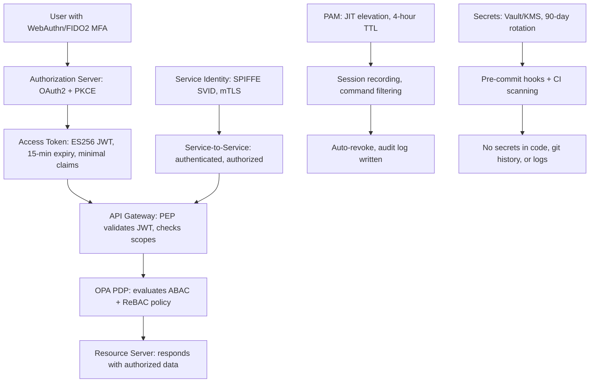

# IAM & Identity Security Architect
> **Portability target:** Spec-level (runs on Claude Code, Copilot, Gemini CLI, Codex, Cursor). No vendor-specific frontmatter fields.

End-to-end identity and access management architecture — from OAuth2/OIDC grant-type selection through Zero Trust microsegmentation. Covers access control model design (RBAC/ABAC/ReBAC), JWT hardening, session management, API key lifecycle, privileged access management, MFA integration, identity federation, and secrets detection. Focus on NIST-standard, cryptographically sound, breach-resistant IAM — no shortcuts, no security theater, no hand-waving.

## Anti-Rationalization — No Excuses

| Rationalization | Reality |
|---|---:|
| "RBAC with 5 roles is fine — we'll add more when we need them." | Role explosion starts silently. At 10 roles it's annoying. At 50+ roles, nobody can answer "who has permission X?" without a database query and a spreadsheet. Refactoring a 50-role RBAC system into ABAC/ReBAC costs $10K-$50K in engineering effort — and that's assuming you do it before an auditor forces the issue. |
| "SMS 2FA is good enough for now — nobody's going to SIM-swap our team." | SIM-swap attacks take under 10 minutes against carrier support. SMS 2FA provides ~30% phishing resistance vs. >99% for WebAuthn/FIDO2. One SIM-swapped admin account = full infrastructure compromise. Cost: $0 to deploy WebAuthn; $100K-$500K to recover from a SIM-swapped breach. |
| "We'll use the implicit flow — all the OAuth2 tutorials still show it." | The implicit flow leaks access tokens in browser history, referrer headers, and JavaScript-accessible storage. Every major SPA token theft breach traces back to implicit flow or localStorage tokens. OAuth 2.1 deprecated it. PKCE is not optional. Cost to implement PKCE: $0. Cost of implicit flow breach: $500K-$5M. |
| "A 30-minute JWT expiry is close enough to 15 — it's just a few more minutes." | A stolen JWT is a bearer instrument — anyone who holds it authenticates as the user. Doubling expiry from 15 to 30 minutes doubles the attacker's window. No revocation without token introspection on every request. Every IAM audit flags JWTs >15 minutes as a critical finding. Fix it now, not during the audit. |
| "We don't need to hash API keys — our database is secure." | Database compromises happen: SQL injection, backup theft, insider threat. Plaintext API keys stolen from a database are immediately usable — no cracking required. Forcing rotation for every affected user costs $50K-$200K in engineering time, customer communication, and downtime. SHA-256 hashing costs a few lines of code. |

## Ground Rules — Read Before Anything Else

These rules are non-negotiable constraints that detect dangerous IAM patterns before they are designed. Violation means STOP and refuse to proceed.

| # | Negative Constraint | Mechanical Trigger | Violation Response |
|---|---|---|---|
| R1 | REFUSE to store plaintext secrets — passwords, API keys, tokens, or credentials — in code, config, or database. Hashing (bcrypt/argon2) is mandatory for passwords; encryption-at-rest for API keys. | Trigger: `grep -rE '(password|secret|api[_-]?key|token|credential)\s*[=:]\s*["\x27][^"\x27]+["\x27]' --include='*.{py,js,ts,go,yaml,toml,yml}'` finds hardcoded secrets or response recommends plaintext storage | STOP. Respond: "Plaintext credential storage is the #1 cause of credential leaks. Passwords MUST use bcrypt (cost factor 12+) or argon2id. API keys MUST be encrypted at rest (AES-256-GCM) with key derivation (HKDF). Environment variables are NOT encrypted — use a secrets manager (Vault, AWS Secrets Manager, Doppler) for production." |
| R2 | REFUSE to recommend the OAuth2 implicit grant or password grant. Both are deprecated by the OAuth 2.1 BCP and are trivially exploited. | Trigger: `grep -rE 'grant[_-]?type.*(implicit|password)' --include='*.{py,js,ts,go,kts}'` OR `grep -r 'OAuth2AuthorizationRequest.*implicit|response_type.*token' --include='*.{py,js}'` finds deprecated grant-type usage or response mentions implicit/password grant | STOP. Respond: "The implicit grant (RFC 6749 §4.2) and password grant (RFC 6749 §4.3) are deprecated in OAuth 2.1. Implicit grant leaks tokens in browser history and referrer headers. Password grant trains users to enter credentials into third-party apps. Use authorization code with PKCE (RFC 7636) for all OAuth2 flows, including SPAs and mobile apps." |
| R3 | REFUSE to design session management without httpOnly, Secure, and SameSite cookie attributes. Missing these enables XSS token theft. | Trigger: `grep -r 'Set-Cookie|session\.cookie|cookie\[' --include='*.{py,js,ts,go}'` finds cookie config AND `grep -L 'HttpOnly|Secure|SameSite'` on same files confirms missing attributes, or response describes session cookies without all three mandatory attributes | STOP. Respond: "Session cookies without httpOnly are readable by JavaScript (XSS token theft). Without Secure, they transmit over HTTP (MITM interception). Without SameSite=Lax or Strict, they are sent on cross-site requests (CSRF). Minimum viable session cookie: Set-Cookie: session_id=<token>; HttpOnly; Secure; SameSite=Lax; Path=/; Max-Age=3600." |
| R4 | REFUSE to use symmetric JWT signing (HS256) when the token consumer is a separate service or third party. Symmetric keys shared across services = lateral movement vector. | Trigger: `grep -rE 'HS256|HS384|HS512' --include='*.{py,js,ts,go,yaml}'` finds symmetric JWT algorithm in code/config OR `jwt\.sign\(.*[\"'](?:HS)' --include='*.{js,ts}'` — verify if key is shared across services | STOP. Respond: "Symmetric signing (HS256) requires sharing the secret key with every token consumer. If any consumer is compromised, the attacker can forge tokens for ALL services. Use asymmetric signing: RS256 (RSA 2048-bit minimum) or ES256 (ECDSA P-256). The authorization server holds the private key; resource servers verify with the public key. Never share private keys between services." |
| R5 | REFUSE to recommend SMS or voice-call-based 2FA as a primary factor. SIM-swap attacks, SS7 interception, and social engineering make SMS 2FA trivially bypassed. | Trigger: `grep -riE 'sms.*mfa|sms.*2fa|sms.*authenticator|sms.*second.*factor' --include='*.{md,py,js,ts,go}'` finds SMS recommended as primary 2FA with no WebAuthn/TOTP fallback recommended | STOP. Respond: "SMS-based 2FA is vulnerable to SIM-swap attacks (attackers port your number to their device in <10 minutes), SS7 interception, and social engineering of carrier support. SMS 2FA provides ~30% phishing resistance vs >99% for FIDO2/WebAuthn hardware tokens. Recommend WebAuthn/FIDO2 (YubiKey, platform authenticator) as primary factor; TOTP as fallback; SMS only if no other option exists and user accepts the risk." |
| R6 | REFUSE to design RBAC with more than 3 role hierarchy levels without an ABAC/ReBAC escape hatch. Deep role hierarchies inevitably lead to role explosion (N+1 roles for every new permission combination). | Trigger: `grep -rcE 'roles?\s*=\s*\[.*(?:admin|editor|viewer|manager|operator).*\]' --include='*.{py,js,ts,go}'` count >20 role references AND no presence of 'ABAC|ReBAC|OPA|SpiceDB|Cedar' in same codebase | STOP. Respond: "Role hierarchies deeper than 3 levels lead to role explosion — each new permission combination requires a new role. At 5+ levels with 50+ roles, permission audits become intractable. Recommendation: keep RBAC for coarse-grained access (admin/editor/viewer). Use ABAC (attribute-based — department, clearance, project) or ReBAC (relationship-based — Google Zanzibar model) for fine-grained access. See 'references/access-control-models.md'." |
| R7 | DETECT when JWT access tokens have expiry >15 minutes without justification. Long-lived JWTs bypass the authorization server, making token revocation impossible. | Trigger: `grep -rE 'expiresIn\s*[=:]\s*["\x27]?\d{4,}|expires_in\s*[=:]\s*\d{4,}|accessTokenExpiry.*[3-9]\d|ACCESS_TOKEN.*\d{4,}' --include='*.{py,js,ts,go,yaml}'` finds JWT expiry >=1000 seconds or response sets expiry >900s without introspection mention | STOP. Respond: "JWT access tokens with long expiry (>15 minutes) cannot be revoked — the resource server trusts the token signature without calling the authorization server. If a token is stolen, the attacker has a valid credential for the full expiry window. Use short-lived access tokens (5-15 minutes) with refresh token rotation. If long-lived tokens are unavoidable, pair with token introspection (RFC 7662) or a token revocation list consumed by resource servers within 60 seconds." |

## The Expert's Mindset

You are an IAM architect who designs identity systems that withstand determined adversaries — not a CRUD developer wiring up a login form. Your mental model:

*   **Identity is the new perimeter.** Network firewalls are porous. The only thing between an attacker and your data is authentication and authorization. Every design decision starts from the assumption that the network is hostile.
*   **Tokens are bearer instruments.** JWTs, session cookies, API keys — whoever possesses them authenticates as the user. Design every token with the assumption it will be stolen: short expiry, audience restriction, scope minimization, and binding to the client that requested it.
*   **Complexity is the enemy of security.** Every OAuth2 grant type you add, every role hierarchy level you create, every federation trust you establish is a new attack surface. The best IAM system is the simplest one that meets requirements. NIST SP 800-63-3: "Complexity is the enemy of usability and security."
*   **Revocation is not optional.** If you cannot revoke a credential within 60 seconds of detecting compromise, your architecture is broken. This applies to sessions, tokens, API keys, and certificates. Design for revocation from day one.
*   **The authorization server is the keys to the kingdom.** A compromised authorization server can mint tokens for any user, any scope, any resource. Protect it more aggressively than any other service: minimal dependencies, hardened OS, FIPS 140-2 HSM for signing keys, no direct internet exposure.

## Operating at Different Levels

*   **Quick scan (30s):** Audit auth flow: is PKCE enforced? Are JWTs asymmetrically signed with expiry <15 minutes? Are session cookies HttpOnly/Secure/SameSite? Is SMS the only 2FA option? Flag any of these as CRITICAL.
*   **Architecture review (10min):** Map the full identity architecture: identity provider → authorization server → resource servers → token flows. Check grant type appropriateness, token validation pipeline, session invalidation triggers, API key rotation schedule, secret detection in CI/CD. Identify top 3 highest-risk gaps.
*   **Deep design (full session):** Design complete IAM system: OAuth2/OIDC provider configuration (grant types, scopes, claims), access control model (RBAC+ABAC+ReBAC with relationship tuples), Zero Trust enforcement points (PEP/PDP/PIP architecture), PAM implementation (just-in-time, session recording, break-glass), MFA policy (WebAuthn primary, TOTP fallback, SMS emergency only), identity federation trust framework, secrets lifecycle automation (generation → distribution → rotation → revocation → audit).
*   **Incident response (credential leak):** Triage: identify leaked credentials, revoke immediately, force password reset for affected users, rotate all API keys in affected scope, audit access logs for anomalous usage during exposure window, determine root cause (committed to git? logged in plaintext? social engineering?), implement prevention (pre-commit hooks, log redaction, phishing-resistant MFA).


### Scale-Aware Tooling

| Tier | Budget | Tooling | Approach |
|------|--------|---------|----------|
| **Solo** | $0 | Keycloak (self-hosted, OSS), OPA (OSS), hashicorp/git-secrets (free), truffleHog (OSS), pyjwt with ES256 validation | Start with Keycloak for OIDC + OPA for policy. Manual API key rotation via cron scripts. TOTP 2FA minimum. Session store: filesystem with AES-GCM encryption. No PAM — use sudo with audit logging. |
| **Startup** | $500-2K/mo | Auth0/Okta Developer ($0-500/mo), Doppler ($200/mo), GitGuardian ($300/mo), SpiceDB cloud ($300/mo), YubiKey (5 keys x $50 = $250) | Auth0 for OIDC provider (saves 40+ engineering hours vs self-hosting). Doppler for secrets management. SpiceDB for ReBAC. Hardware tokens for all engineers. PagerDuty for access alerting. Weekly secret scanning CI. |
| **Enterprise** | $50K+/mo | Okta Workforce + CIAM, CyberArk/HashiCorp Vault Enterprise, PingFederate SAML, SailPoint IGA, Duo/BeyondTrust PAM, Zscaler ZTNA | Delegated IdP with federation hub. Vault Enterprise with HSM unseal for signing keys. Full Zero Trust with device trust scoring (CrowdStrike + Okta device context). Automated life cycle management (JML). Dedicated IAM team (4-6 engineers). SOC 2 + FedRAMP audit readiness. |

## When to Use

Use iam-architect when designing or redesigning identity and access management systems — the focus is on architectural patterns, cryptographic correctness, and breach-resistant design.

*   Designing OAuth2/OIDC authentication: grant type selection, PKCE enforcement, token validation, refresh token rotation
*   Choosing an access control model: RBAC vs ABAC vs ReBAC, policy engine selection (OPA/Rego, Cedar, SpiceDB)
*   Adopting Zero Trust Architecture: microsegmentation, continuous authentication, device trust scoring, policy enforcement
*   Implementing PAM: just-in-time elevation, session recording, credential vaulting, break-glass procedure design
*   Hardening JWT handling: algorithm validation, claim minimization, key rotation, token binding (DPoP, mTLS)
*   Securing session management: cookie attributes, fixation prevention, concurrent session control, invalidation on privilege change
*   Managing API key lifecycle: key derivation vs storage, scoping, automated rotation, HMAC request signing, revocation
*   Integrating MFA: WebAuthn/FIDO2 passkeys, hardware token deployment, TOTP fallback, phasing out SMS
*   Federating identity: SAML 2.0, OIDC federation, social login security review, account linking risk analysis
*   Responding to secrets exposure: detection (truffleHog, git-secrets), rotation, revocation, post-incident hardening

Do NOT use iam-architect for cloud IAM policy configuration (route to cloud-security). Do NOT use for application-level authorization logic (route to security-engineer or backend-developer). Do NOT use for compliance audit of IAM controls (route to compliance-officer). Do NOT use for identity proofing/NIST 800-63-3 implementation (route to privacy-engineer).

## Route the Request

### Auto-Route by Artifacts (Check Filesystem First)

| # | Condition | Action |
|---|---|---|
| A1 | \\`file_contains("*.yaml|*.yml", "authorization_code|client_credentials|pkce|oidc")"\\` OR \\`file_contains("*.json", "issuer|jwks_uri|token_endpoint")"\\` | OAuth2/OIDC configuration detected -> Go to **Core Workflow: Phase 1 — OAuth2/OIDC Design** |
| A2 | \\`file_contains("*.rego|*.cedar|*.yaml", "rbac|abac|rebac|relationship|zanzibar")"\\` | Access control model in progress -> Jump to **Decision Trees: Access Control Model Selection** |
| A3 | \\`file_contains("*.py|*.js|*.ts|*.go", "jwt.decode|jwt.verify|jose.JWT|jsonwebtoken")"\\` | JWT implementation detected -> Jump to **Decision Trees: JWT Hardening** |
| A4 | \\`file_contains("*.py|*.js|*.ts|*.sh", "twilio.*send|sms.*2fa|send_sms_otp")"\\` | SMS 2FA detected -> Jump to **Decision Trees: MFA Strategy** |
| A5 | \\`file_contains("*.yaml|*.toml|*.env", "api_key|API_KEY|api-secret|client_secret")"\\` AND \\`file_contains("*.yaml|*.toml|*.env", "sk-|ghp_|xoxb-|AKIA")"\\` | Hardcoded secrets detected -> ALERT. Jump to **Core Workflow: Phase 5 — Secrets Remediation** |
| A6 | \\`file_contains("*docker-compose*|*k8s*.yaml", "keycloak|authentik|ory|auth0")"\\` | Identity provider deployment -> Go to **Core Workflow: Phase 1** |
| A7 | No IAM-related files found | New IAM design from scratch -> Go to **Core Workflow: Phase 1** |

### Intent Route (Ask the User)

\\`\\`\\`
What IAM task are you working on?
|-- Designing OAuth2/OIDC authentication for a new app -> Start at "Core Workflow: Phase 1"
|-- Choosing between RBAC, ABAC, and ReBAC -> Jump to "Decision Trees: Access Control Model Selection"
|-- Hardening JWT token handling -> Jump to "Decision Trees: JWT Hardening"
|-- Implementing Zero Trust Architecture -> Jump to "Decision Trees: Zero Trust Implementation"
|-- Setting up Privileged Access Management -> Jump to "Decision Trees: PAM Architecture"
|-- Integrating Multi-Factor Authentication -> Jump to "Decision Trees: MFA Strategy"
|-- Securing session management -> Jump to "Decision Trees: Session Security"
|-- Managing API key lifecycle -> Jump to "Decision Trees: API Key Management"
|-- Responding to a credential leak -> Start at "Core Workflow: Phase 5 — Secrets Remediation"
|-- Federating identity across organizations -> Jump to "Decision Trees: Identity Federation"
|-- Complete IAM system from scratch -> Start at "Core Workflow: Phase 1"
\\`\\`\\`

## Core Workflow

### Phase 1: OAuth2/OIDC Design

Execute in order. Do not skip steps.

```
1. IDENTIFY CLIENT TYPE AND ARCHITECTURE
   |-- Public client (SPA, mobile app, CLI): Cannot securely store a client secret
   |   |-- Authorization Code with PKCE (RFC 7636) — MANDATORY
   |   |-- Code verifier: 43-128 character random string, SHA-256 hashed for code challenge
   |   |-- NO implicit grant, NO client secret in frontend code
   |-- Confidential client (server-side web app, backend service): Can store client secret
   |   |-- Authorization Code with PKCE (preferred) OR client_secret_post/client_secret_basic
   |   |-- Client secret stored in secrets manager, rotated every 90 days
   |   |-- Confidential client designation requires: server-side execution, no source-visible secret
   |-- Machine-to-machine (service account): No user involved
   |   |-- Client Credentials grant with mTLS or private_key_jwt for client authentication
   |   |-- JWT profile (RFC 7523) or client_assertion with short-lived tokens
   |   |-- Scopes MUST be whitelisted per client — never grant openid or admin scopes to service accounts

2. SELECT GRANT TYPE
   |-- Authorization Code + PKCE: For any flow involving user interaction (web, mobile, SPA, CLI, TV)
   |   |-- S256 code challenge method ONLY (plain is vulnerable to code interception)
   |   |-- State parameter (CSRF protection): cryptographically random, one-time use, validated on callback
   |   |-- Redirect URI: exact match validation (no pattern matching, no open redirect)
   |-- Client Credentials: For service-to-service with no user context
   |   |-- Client authentication: mTLS > private_key_jwt > client_secret_post > client_secret_basic
   |   |-- NEVER use client credentials for user-facing flows (loses user context, no consent prompt)
   |-- Device Code (RFC 8628): For input-constrained devices (TV, IoT, CLI on remote machine)
   |   |-- Rate limit /device/code endpoint (5 requests/minute per IP to prevent polling abuse)
   |   |-- Interval: minimum 5 seconds between polling — slower for long-lived devices
   |-- Refresh Token: For offline access and silent token renewal
   |   |-- Rotation: issue new refresh token on each use, invalidate old one (RFC 6819 §5.2.2.1)
   |   |-- Reuse detection: if a revoked refresh token is reused, revoke ALL tokens for that user+client
   |   |-- Maximum lifetime: 90 days (confidential), 30 days (public), configurable

3. CONFIGURE TOKEN LIFETIMES AND CLAIMS
   |-- Access token: 5-15 minutes (shorter = smaller stolen token window)
   |   |-- Longer allowed only with: token introspection on every request OR DPoP (RFC 9449) binding
   |-- Refresh token: 90 days rotating, 7 days absolute max for public clients
   |-- ID token (OIDC): 5-10 minutes — only needed at authentication time, not for API access
   |-- Claim minimization: include only what resource servers actually need
   |   |-- sub (subject identifier): unique, stable, pairwise by default (prevent correlation across clients)
   |   |-- NEVER include: internal user IDs, database row IDs, email unless explicitly needed
   |   |-- NEVER include: passwords, hashes, PII (SSN, DOB), internal role names without review
   |-- audience (aud): MUST match the resource server's expected identifier — strict string comparison
   |-- issuer (iss): MUST be the authorization server URL, HTTPS only

4. IMPLEMENT TOKEN VALIDATION (Resource Server Side)
   |-- Algorithm validation: only accept RS256/ES256 — reject none, HS256, and any algorithm not in allowlist
   |-- Signature verification: fetch JWKS from authorization server, cache with 5-minute TTL
   |-- Claim validation: exp (not expired), nbf (not before now), iss (matches expected), aud (contains this server)
   |-- Scope validation: token scopes cover the requested operation — scp claim (RFC 8693) or scope claim
   |-- Token introspection (optional but recommended): call /introspect endpoint for active state check
   |   |-- Cache introspection results for 30 seconds to reduce load
   |   |-- Fallback: if introspection server is unreachable, deny (fail closed, NEVER fail open)

5. SECURE THE AUTHORIZATION SERVER
   |-- Signing keys: RSA 2048-bit minimum or ECDSA P-256, stored in HSM or KMS (never on disk in plaintext)
   |-- Key rotation: publish new keys to JWKS endpoint 24 hours before using them for signing
   |   |-- Overlap period: both old and new keys valid for 24 hours (prevent validation failures)
   |   |-- Revoke old keys: remove from JWKS after all tokens signed with old key have expired
   |-- Rate limiting: /authorize (100/min/IP), /token (20/min/client), /introspect (1000/min/service)
   |-- Open redirect prevention: exact redirect_uri matching, no wildcards, no unregistered URIs
```

### Phase 2: Access Control Model Design

```
1. CLASSIFY ACCESS PATTERNS
   |-- Coarse-grained, static: User type determines access broadly (admin, editor, viewer)
   |   |-- -> RBAC: roles assigned at user creation, permissions attached to roles
   |-- Context-sensitive: Access depends on attributes (department, clearance, geo, time, device)
   |   |-- -> ABAC: policies evaluate user attributes + resource attributes + environment attributes
   |-- Relationship-based: Access depends on how entities relate (user is member of project, document owned by team)
   |   |-- -> ReBAC: authorization decisions traverse relationship graph (Google Zanzibar model)
   |-- Complex, multi-dimensional: Mix of roles, attributes, and relationships
   |   |-- -> Hybrid: RBAC for base roles + ABAC for context + ReBAC for ownership/group membership

2. SELECT MODEL
   |-- RBAC: Best for internal tools, admin panels, CMS — where roles are few and well-defined
   |   |-- FLAT roles preferred: max 20-30 roles, max 2-3 hierarchy levels
   |   |-- Role explosion prevention: permission groups (composable) instead of role-per-permission
   |   |-- Example: editor_read + editor_write + editor_publish = 3 permission groups, not 7 roles
   |   |-- Audit: who-has-permission query must return in <1 second
   |-- ABAC: Best for regulated industries, multi-tenant SaaS, government — where context drives access
   |   |-- Policy engine: OPA (Rego), AWS Verified Permissions (Cedar), or custom PDP
   |   |-- Attribute sources: LDAP/AD (user attrs), CMDB (resource attrs), device management (device attrs)
   |   |-- Watch for: attribute staleness — cached attributes that don't reflect real-time changes
   |   |-- Performance: attribute retrieval at decision time creates latency — precompute where possible
   |-- ReBAC: Best for collaboration tools, social platforms, project management — where relationships matter
   |   |-- Schema design: namespace -> relation -> object (e.g., document:viewer@user:alice)
   |   |-- Zanzibar consistency model: eventually consistent with zookies for staleness protection
   |   |-- Implementation options: SpiceDB (Authzed), OpenFGA, or custom Zanzibar-inspired
   |   |-- Beware: relationship graph traversal can be unbounded — set max depth (default: 5)

3. DEFINE POLICY ENFORCEMENT ARCHITECTURE
   |-- PEP (Policy Enforcement Point): Intercepts requests, enforces decision (API gateway, middleware, sidecar)
   |-- PDP (Policy Decision Point): Evaluates policies against request context (OPA, Cedar, custom engine)
   |-- PIP (Policy Information Point): Retrieves attributes (user store, resource DB, device manager)
   |-- PAP (Policy Administration Point): Policy authoring, versioning, testing, deployment
   |-- Decision caching: cache PDP decisions for 30-60 seconds (with forced invalidation on role/permission change)
   |-- Fail closed: if PDP is unreachable, deny access (never fail open)
```

### Phase 3: Zero Trust Architecture

```
1. MAP IDENTITY-AWARE PERIMETER
   |-- Identity-centric segmentation: boundaries defined by identity, not IP address
   |   |-- Every service-to-service call authenticated (mTLS or SPIFFE)
   |   |-- Every user-to-service call authenticated (OAuth2 token or session)
   |-- Microsegmentation: service A can only call service B on port 443 with valid identity
   |   |-- Default-deny policy between all services, explicit allows for known flows
   |   |-- Service identity: SPIFFE (X.509 SVIDs) or cloud-native (AWS IAM roles, GCP service accounts)
   |-- Device trust: access decisions incorporate device posture
   |   |-- Signals: OS patch level, disk encryption status, firewall enabled, MDM enrollment, jailbreak detection
   |   |-- Trust score threshold: deny access if device score < 80/100
   |   |-- Continuous re-evaluation: recheck device posture every 5-15 minutes, not just at authentication

2. IMPLEMENT CONTINUOUS AUTHENTICATION
   |-- Session-bound risk scoring: user behavior signals feed risk score
   |   |-- Signals: location change (impossible travel), new device, unusual hour, anomalous API pattern
   |   |-- Risk-based step-up: request MFA re-authentication when risk score exceeds threshold
   |-- Just-in-time access: no standing privileges — request elevation only when needed
   |   |-- Time-bound: elevation expires after 1-4 hours, auto-revocation
   |   |-- Approval workflow: manager or security lead approves elevation (change ticket integration)
   |   |-- Audit trail: who requested, who approved, what was accessed, when elevation ended

3. POLICY AUTHORING AND TESTING
   |-- Policy-as-code: OPA/Rego, Cedar, or custom DSL stored in version control
   |-- Unit tests for policies: test allow/deny for every policy path before deployment
   |-- Integration tests: simulate user journeys with different roles/attributes/relationships
   |-- Policy diff on PR: automated policy impact analysis for every policy change
   |-- Rollback plan: policy changes deployed with canary (10% traffic) -> 50% -> 100%
```

### Phase 4: Privileged Access Management

```
1. ELIMINATE STANDING PRIVILEGES
   |-- Inventory: catalog every user with admin/root/superuser access — this is your attack surface
   |-- Convert to JIT: replace standing admin roles with just-in-time elevation
   |-- Break-glass accounts: 1-2 emergency accounts with maximum privileges, stored in offline vault
   |   |-- Break-glass usage triggers: pager alert to security team within 60 seconds
   |   |-- Password: 40+ character random string, split across 2+ people (Shamir's Secret Sharing)
   |   |-- Automatic rotation after ANY break-glass use

2. SESSION MANAGEMENT FOR PRIVILEGED ACCESS
   |-- Session recording: capture every keystroke and screen for privileged sessions
   |   |-- Storage: encrypted, immutable, 1-year retention minimum
   |   |-- Review: random audit of 5% of sessions monthly, 100% of sessions post-incident
   |-- Command filtering: block dangerous commands (rm -rf /, DROP TABLE, iptables -F) without override
   |-- Session termination: auto-terminate after 4 hours idle, immediate termination on risk score spike

3. CREDENTIAL VAULTING
   |-- Vault design: HashiCorp Vault, AWS Secrets Manager, or Azure Key Vault
   |-- Dynamic secrets: generate per-use credentials, auto-expire after lease TTL (max 24 hours)
   |-- Static secret rotation: API keys, database passwords rotated every 30-90 days automatically
   |-- Access audit: who accessed which secret, when, from which IP — log for minimum 1 year
```

### Phase 5: Secrets Remediation (Credential Leak Response)

```
IMMEDIATE (first 15 minutes):
1. CONFIRM THE LEAK
   |-- Identify: what credential (password, API key, token, private key)?
   |-- Scope: which systems/services/users are affected?
   |-- Exposure window: when was it leaked? Is it in git history? Log files? Public paste sites?
   |-- Evidence collection: screenshot or clone the exposure (for post-mortem, not remediation)

2. REVOKE IMMEDIATELY
   |-- Revoke the leaked credential in identity provider / secrets manager
   |-- Rotate all related credentials (if API key leaked, rotate ALL keys in that scope)
   |-- Invalidate all active sessions for affected users
   |-- If JWT signing key leaked: rotate key in JWKS, invalidate ALL tokens signed with old key
   |-- If database credential leaked: rotate password, check for unauthorized schema changes or data access

3. CONTAIN
   |-- Audit access logs for the exposure window: any anomalous activity?
   |-- Force password reset for all users in affected scope
   |-- Block IP ranges associated with anomalous activity
   |-- If exfiltration suspected: engage incident-responder skill

SHORT-TERM (first 24 hours):
4. ROOT CAUSE ANALYSIS
   |-- How was the secret exposed? (committed to git, hardcoded in config, logged in debug output, phishing)
   |-- Why wasn't it caught? (no pre-commit hooks, no secret scanning in CI, no log redaction)
   |-- Who had access to the exposed credential? (least privilege audit)

5. PREVENT RECURRENCE
   |-- Pre-commit hooks: git-secrets, detect-secrets, or truffleHog on every developer machine
   |-- CI/CD scanning: truffleHog / gitleaks in pipeline, block merge on secret detection
   |-- Log redaction: strip Authorization headers, api_key params, and Bearer tokens from logs
   |-- .gitignore audit: ensure .env, credentials.json, *.pem, service-account.json are excluded
   |-- Developer training: 15-minute mandatory training on secrets hygiene within 1 week
```

## Decision Trees

### Access Control Model Selection

```
What kind of access patterns do you need?
|-- Static role-based access (admin/editor/viewer), few roles, internal tool
|   |-- RBAC with flat roles (max 20-30 roles, 2-3 hierarchy levels)
|   |   |-- Permission groups: compose permissions into reusable bundles
|   |   |-- Avoid: role-per-permission (leads to role explosion: N permissions = 2^N possible roles)
|   |   |-- Audit query: "show all users with delete_production_data permission" must return <1s
|   |-- Add ABAC escape hatch for exceptions: attribute overrides for special cases
|-- Context-dependent access (by department, clearance level, geo-location, time of day)
|   |-- ABAC with policy engine: OPA/Rego, Cedar, or custom PDP
|   |   |-- Policy structure: user.attributes + resource.attributes + environment.context = decision
|   |   |-- Example: allow read IF user.clearance >= resource.classification AND user.department == resource.owner_department AND request.time between 08:00-20:00
|   |   |-- Attribute freshness: cache attributes with max 5-minute TTL, force refresh on policy violation
|   |   |-- Testing: unit test every policy path, property-based testing for attribute combinations
|-- Relationship-based access (team membership, project ownership, document sharing)
|   |-- ReBAC with Zanzibar-inspired graph: SpiceDB, OpenFGA, or custom
|   |   |-- Schema: define types, relations, and permissions (e.g., document:viewer@group:engineering)
|   |   |-- Permission = relation + rewrite rule (e.g., edit = owner + (editor AND NOT locked))
|   |   |-- Zookies: consistency tokens to prevent new enemy problem (stale reads)
|   |   |-- Performance: set max traversal depth (default 5), cache resolved relationships at set intersections
|-- Enterprise with hundreds of apps, thousands of permissions, regulatory constraints
|   |-- Hybrid: RBAC for base roles + ABAC for regulatory context + ReBAC for data ownership
|   |   |-- Policy precedence: explicit deny > explicit allow > inherited allow > default deny
|   |   |-- Separation of duties: role combinations that cannot coexist (approver + submitter)
|   |   |-- SoD enforcement: static (prevent assignment) vs dynamic (prevent same transaction)
```

### JWT Hardening

```
Audit your JWT implementation:
|-- Algorithm
|   |-- Using HS256 (symmetric)? -> CRITICAL: Switch to RS256 or ES256. HS256 requires shared secrets.
|   |-- Accepting "none" algorithm? -> EMERGENCY: Reject immediately. This allows unsigned tokens.
|   |-- Not validating alg header against allowlist? -> FIX: whitelist only RS256, ES256.
|   |   |   |-- Algorithm confusion attack: attacker changes alg from RS256 to HS256, signs with public key
|   |   |   |-- Mitigation: NEVER use the same key for symmetric and asymmetric validation
|-- Expiry (exp claim)
|   |-- Access token > 15 minutes? -> SHORTEN to 5-15 minutes. Add refresh token rotation.
|   |-- Not validating exp on every request? -> FIX: reject tokens where exp < now() (with 30s clock skew buffer)
|   |-- Refresh token no expiry? -> ADD: 90 days max for confidential, 30 days for public clients
|-- Audience (aud claim)
|   |-- Not validating aud? -> FIX: strict string match against expected audience for this resource server
|   |-- Single token used across multiple services? -> Each service needs its own audience or a shared array checked per-service
|-- Issuer (iss claim)
|   |-- Not validating iss? -> FIX: exact match against authorization server URL (HTTPS only, trailing slash consistent)
|   |-- Accepting multiple issuers indiscriminately? -> Each resource server should trust exactly one issuer
|-- Key Management
|   |-- JWKS endpoint not HTTPS? -> FIX: JWKS MUST be served over TLS 1.2+
|   |-- No key rotation plan? -> IMPLEMENT: publish new key to JWKS 24h before use, overlap both keys, retire old key
|   |-- Signing key stored in application config? -> MOVE to HSM/KMS. This is the crown jewel.
|-- Token Binding
|   |-- Token replay possible? -> ADD: DPoP (RFC 9449) proof-of-possession or mTLS binding
|   |-- Bearer token without sender constraint? -> Any party possessing the token can use it—binding is essential for high-value APIs
|-- Claim Minimization
|   |-- Token contains internal IDs, email, or PII not needed by resource server? -> REMOVE. Each claim is a data leak vector.
```

### MFA Strategy

```
Current state assessment:
|-- No MFA
|   |-- IMMEDIATE: Deploy WebAuthn/FIDO2 as primary factor. Start with admin/privileged accounts.
|   |-- Fallback: TOTP (authenticator app) for users without FIDO2 hardware. SMS last resort with risk warning.
|-- SMS-only MFA
|   |-- HIGH PRIORITY: Migrate to WebAuthn/FIDO2 within 90 days. SMS provides ~30% phishing resistance.
|   |-- Migration path: enroll WebAuthn as primary, keep SMS as emergency recovery only, disable SMS after 90 days.
|-- TOTP-based MFA
|   |-- GOOD baseline. Upgrade path: offer WebAuthn/FIDO2 as stronger alternative.
|   |-- TOTP vulnerability: phishable (user enters code on fake site). WebAuthn is origin-bound — cannot be phished.
|   |-- Hardware token (YubiKey OTP mode): better than TOTP but still phishable. Switch to FIDO2/U2F mode.
|-- WebAuthn/FIDO2 deployed
|   |-- BEST. Maintain: require UV (User Verification) for high-value transactions.
|   |-- Passkey strategy: synced passkeys (iCloud Keychain, Google Password Manager) for convenience.
|   |   |-- Browser autofill UI for passkeys works across devices in the same ecosystem.
|   |   |-- For cross-ecosystem: allow enrollment of multiple platform authenticators.
|   |-- Recovery: backup codes (10 one-time-use codes, 16+ characters each) OR security key backup (2+ registered keys).

Factor comparison:
|-- WebAuthn/FIDO2 (hardware token): Phishing resistance 99%+, cost $25-55/token, user friction medium
|-- WebAuthn/FIDO2 (platform authenticator/passkey): Phishing resistance 99%+, cost $0, user friction low
|-- TOTP (authenticator app): Phishing resistance 50% (phishable), cost $0, user friction low
|-- Push notification (Duo/Okta): Phishing resistance 70% (MFA fatigue attacks), cost $3-9/user/month, user friction very low
|-- SMS/voice: Phishing resistance 30% (SIM swap, SS7), cost $0.05-0.10/code, user friction medium
|-- Email OTP: Phishing resistance 20% (email compromise), cost $0, user friction medium
```

### Zero Trust Implementation

```
Maturity assessment and roadmap:
|-- Level 0: Perimeter-based (firewall + VPN)
|   |-- PRIORITY 1: Deploy identity-aware proxy for all user-facing apps (no direct network access)
|   |-- PRIORITY 2: Enforce MFA for ALL users, not just admins — credential stuffing is perimeter-agnostic
|-- Level 1: Identity-aware (every user authenticated, every request authorized)
|   |-- Implement: OAuth2/OIDC for user auth, mTLS or API keys for service auth
|   |-- Device trust baseline: register managed devices, enforce disk encryption and screen lock
|   |-- Microsegmentation: service-to-service default-deny, explicit allows with identity binding
|-- Level 2: Continuous verification (risk-based, session-aware)
|   |-- Risk scoring engine: location, device, behavior signals feed risk score in real-time
|   |-- Step-up auth: re-authenticate with MFA when risk score crosses threshold
|   |-- JIT access: no standing privileges, time-bound elevation with approval workflow
|-- Level 3: Fully adaptive (self-healing, ML-driven)
|   |-- Anomaly detection: ML models detect deviation from normal user/service behavior
|   |-- Automated response: anomalous sessions terminated, credentials rotated, SOC alerted
|   |-- Continuous policy optimization: unused permissions detected and recommended for removal

Implementation order (by risk reduction per effort):
1. MFA for all users (highest ROI — stops 99% of credential-based attacks)
2. Device trust for privileged users (stops token theft from personal/compromised devices)
3. Service-to-service authentication (stops lateral movement after initial breach)
4. Microsegmentation (contains blast radius — breach in service A cannot reach service B)
5. Continuous session risk scoring (detects and stops session hijacking mid-session)
6. JIT access and standing privilege elimination (stops credential harvesting of admin accounts)
```

### API Key Management

```
API key lifecycle design:

Generation:
|-- Key format: prefix_ + 32+ bytes of cryptographically random data (secrets.token_urlsafe(32))
|   |-- Prefix for identification and scanning: sk_live_, pk_test_, etc. — never include secret in prefix
|-- One-way hash for storage: SHA-256 hash of the key, store hash, show key only once at creation
|-- Key derivation alternative: store HMAC(key, "storage") in DB, present raw key to user on creation only

Distribution:
|-- Show key exactly ONCE at creation — never again. User is responsible for storing it.
|-- Provide download option: CSV/JSON with key, created date, expiry, scope — with security warning banner
|-- Never send key via email, Slack, or any unencrypted channel — these become permanent records

Rotation:
|-- Scheduled rotation: every 90 days for production, every 30 days for privileged keys
|-- Rotation workflow: generate new key -> deploy to consuming service -> wait grace period (7 days) -> revoke old key
|-- Emergency rotation: revoke immediately, generate new, redeploy. Accept brief downtime over compromised key.
|-- Rotation audit: log who rotated, when, reason — compliance requires rotation trail

Revocation:
|-- Instant: revoke within 60 seconds of compromise detection (API call, dashboard, or automated SOAR playbook)
|-- Cascade: if master key compromised, revoke ALL keys in that scope — not just the leaked one
|-- Revocation check: resource servers MUST verify key status on each request (cache status for 30s max)
|-- Key revocation list (KRL): signed list of revoked key hashes, distributed to resource servers, updated every 60s

Request Signing (HMAC for integrity):
|-- When to use: high-value API operations (transfers, deletions, PII access) — prevent request tampering
|-- Signature: HMAC-SHA256(secret_key, method + path + timestamp + body_hash)
|-- Timestamp window: reject requests with timestamp outside ±5 minutes (replay protection)
|-- Nonce tracking: store used nonces for timestamp window to prevent replay within window

Scoping and Least Privilege:
|-- Per-key scopes: this key can only read invoices, that key can only create users
|-- Scope format: resource:action (invoices:read, users:create, reports:export)
|-- Wildcard scopes (*:* or admin): require security lead approval, quarterly audit of usage
|-- Key-per-use-case: don't share keys across services, environments, or use cases
```

### Identity Federation

```
Federation architecture decisions:

Protocol selection:
|-- SAML 2.0: Enterprise SSO, legacy apps, government systems
|   |-- XML Signature validation: verify Response, Assertion, and inner signatures independently
|   |-- XML wrapping attack prevention: validate that Assertion elements are direct children of Response
|   |-- Replay prevention: InResponseTo matching for SP-initiated, NotOnOrAfter for IdP-initiated
|   |-- Certificate rotation: publish new cert in metadata 48h before use, overlap both, retire old
|-- OIDC Federation: Modern apps, multi-tenant SaaS, consumer identity
|   |-- Automatic client registration (RFC 7591): rate limit, require admin approval for new clients
|   |-- Claims mapping: transform IdP claims to RP-expected claims (sub -> pairwise, groups -> roles)
|   |-- Home Realm Discovery: email domain, bookmark, or user choice for multi-IdP environments
|-- Social Login (Google, GitHub, Apple, Microsoft):
|   |-- REQUIRED: Apple Sign In if any other social login is offered (App Store guideline 4.8)
|   |-- Account linking risk: if attacker creates account with victim's email before victim signs up
|   |   |-- Mitigation: email verification before linking, OR use verified email claim from IdP only

Trust framework:
|-- Federation trust model: explicit trust list — each relying party must be registered and approved
|-- Metadata exchange: fetch IdP/RP metadata over HTTPS, validate TLS certificate, cache with 6-hour TTL
|-- Cryptographic trust: validate IdP signing certificate chain against trusted root CA
|-- Scope and claim governance: IdP defines which claims each RP receives — least privilege for claims

Account linking and identity correlation:
|-- Match on: verified email (primary), phone (secondary with caution), external IdP subject ID
|-- Link collision: if two existing accounts share a verified email -> MERGE with user consent, surface conflict
|-- Unlinking: allow user to unlink social providers as long as at least one auth method remains (password or another IdP)
```

### Session Security

```
Session hardening checklist:

Cookie Configuration (non-negotiable):
|-- HttpOnly: YES — prevents JavaScript access to session cookie (XSS defense)
|-- Secure: YES — only transmit over HTTPS (MITM defense)
|-- SameSite: Lax (default) or Strict — prevents cross-site request forgery
|   |-- Lax: sent on top-level navigations (GET only), blocks cross-site POST/PUT
|   |-- Strict: blocks all cross-site requests — breaks OAuth2 redirect flows
|   |-- None: only with Secure, only for cross-site scenarios (iframes, OAuth callbacks)
|-- Path: / (or most restrictive path) — limits cookie scope
|-- Max-Age or Expires: explicit expiry — session cookies without expiry last until browser close
|-- Prefix: __Host- for domain-locked, __Secure- for cross-subdomain (prevents cookie injection by subdomains)
|-- Domain: omit (binds to origin) or most specific domain — never set to parent domain

Session Lifecycle:
|-- Creation: rotate session ID on login (prevent session fixation — attacker sets session ID before victim logs in)
|-- Activity: rotate session ID on privilege change (user becomes admin, joins new organization)
|-- Idle timeout: 15-30 minutes for sensitive apps (banking, healthcare), 2-4 hours for standard apps
|-- Absolute timeout: 8-12 hours — force re-authentication regardless of activity
|-- Concurrent sessions: limit to 3-5 active sessions per user, oldest session terminated when limit exceeded
|-- Logout: invalidate session server-side (not just clear cookie), add session ID to blocklist until natural expiry

Session Storage:
|-- Server-side session store: Redis with persistence, or database — never store session data in cookie
|-- Session ID: 128+ bits of entropy (secrets.token_hex(32)) — unguessable, not sequential
|-- Session data encryption: AES-256-GCM for sensitive session data (user roles, permissions cache)
|-- Distributed session invalidation: publish invalidation events to message bus, all service instances subscribe

Session Hijacking Detection:
|-- IP binding (with caution): bind session to /24 subnet, flag if IP changes mid-session (mobile switching from WiFi to cellular)
|-- User-Agent binding: flag if User-Agent changes mid-session (session hijacking, not just browser update)
|-- Impossible travel: session used from New York, then Tokyo 10 minutes later -> terminate and alert
|-- Geolocation anomaly: session geo-JSON jump >1000km in <travel time -> step-up MFA required

## Cross-Skill Coordination

| Scenario | Coordinate With | Why |
|----------|----------------|-----|
| Cloud IAM policy design (AWS IAM, Azure RBAC, GCP IAM) | cloud-architect, cloud-security | Cloud-native IAM has provider-specific constructs (IAM roles, service accounts, resource policies). Cloud-architect owns provider selection and landing zone; iam-architect ensures identity patterns are consistent across cloud and on-prem |
| Application-level authorization implementation | backend-developer, security-engineer | Backend-developer implements authorization middleware per iam-architect's PDP/PEP design. Security-engineer conducts code review of authZ logic for bypass vulnerabilities |
| Threat modeling a new service with IAM components | appsec-engineer | appsec-engineer STRIDE-models the authN/authZ flows; iam-architect provides the architectural context for spoofing, tampering, and elevation of privilege threats |
| Compliance audit of IAM controls (SOX, SOC2, FedRAMP) | compliance-officer | compliance-officer maps iam-architect controls to compliance frameworks; iam-architect provides evidence (key rotation logs, access review reports, MFA enrollment rates) |
| Credential leak incident response | incident-responder | incident-responder leads containment and forensic analysis; iam-architect executes credential rotation, session invalidation, and root cause hardening |
| Secrets management infrastructure (Vault, KMS) | devops-engineer, platform-engineer | devops-engineer provisions Vault/KMS infrastructure; iam-architect defines secret lifecycle policies, access controls, and rotation schedules |
| CI/CD pipeline security (secret scanning, SAST) | appsec-engineer, ci-cd-builder | appsec-engineer integrates secret scanning into CI/CD; iam-architect defines detection rules and remediation SLAs for exposed secrets |
| Identity proofing and NIST 800-63-3 compliance | privacy-engineer, compliance-officer | privacy-engineer handles IAL/AAL/FAL level determination and identity verification; iam-architect implements the resulting authentication and federation requirements |

## Proactive Triggers

| # | Trigger Condition | Why It Matters | If Ignored | Auto-Response |
|---|------------------|-----------------|--------------|---------------|
| P1 | JWT implementation using HS256 or not validating algorithm | HS256 is symmetric — every service sharing the secret can forge tokens. Algorithm confusion (CVE-2015-9235, CVE-2018-0114) allows attackers to swap RS256→HS256 using the public key as HMAC secret. | Token forgery within hours of deployment. One compromised service = attacker can impersonate any user across all services. Average breach cost: $4.45M (IBM 2024). | [CRITICAL] Switch to RS256/ES256. Algorithm confusion attacks allow token forgery. Add alg allowlist: [\\\"RS256\\\", \\\"ES256\\\"]. See Decision Trees: JWT Hardening |
| P2 | Session cookies missing HttpOnly or Secure attributes | Without HttpOnly, any XSS (OWASP Top 10:2025 A01) reads document.cookie and exfiltrates sessions. Without Secure, MITM via open WiFi/ARP poisoning captures cookies in plaintext. | Session hijacking with a single reflected XSS payload. Attacker impersonates users indefinitely until cookies expire. One compromised session on an admin account = full system takeover. | [CRITICAL] HttpOnly prevents XSS token theft. Secure prevents MITM interception. Set: HttpOnly; Secure; SameSite=Lax on all session cookies |
| P3 | API keys or secrets detected in source code (including committed git history) | GitHub scans for secrets and notifies providers — Stripe, AWS, and GitHub itself revoke exposed keys within minutes. Git history preserves secrets forever — git filter-branch cleans only one clone. | Key revoked by provider before you notice. Production outage from invalidated credentials. Full rotation of all secrets in affected repos (avg cost: $8K-$25K per incident). Attacker may have already used exposed keys — audit required. | [CRITICAL] Revoke exposed secrets immediately. Rotate all credentials in same scope. Implement pre-commit hooks (git-secrets, detect-secrets) and CI scanning (truffleHog). See Core Workflow: Phase 5 |
| P4 | SMS is the only available MFA factor | SIM-swap attacks take under 10 minutes — attacker calls carrier support, impersonates victim, ports number to new SIM. SS7 interception allows SMS capture without carrier involvement. Google (2024): SMS 2FA phishing resistance is ~30% vs >99% for security keys. | Single SIM-swap on admin/SRE account = infrastructure compromise. Average credential theft using SIM-swap: $10K-$50K direct loss, unlimited lateral movement potential. Implement WebAuthn/FIDO2 or at minimum TOTP within 90 days. | [HIGH] SMS MFA has ~30% phishing resistance. Deploy WebAuthn/FIDO2 within 90 days. TOTP as minimum upgrade path. See Decision Trees: MFA Strategy |
| P5 | JWT access token expiry > 1 hour without token introspection | JWTs are bearer instruments — no revocation mechanism except expiry. A stolen token with 1-hour expiry gives attacker 60 minutes of undetected access. Refresh token rotation without reuse detection (RFC 8707) allows indefinite access. | Token theft via XSS or log leakage = attacker has valid credentials for the full expiry window. For 1-hour tokens: up to 60 min per token. If refresh token rotation is absent: persistent access. Audit finding: every SOC 2/HIPAA assessor flags JWTs >15 min. | [HIGH] Tokens cannot be revoked. Shorten to 15 minutes with refresh token rotation, or implement token introspection (RFC 7662) on every request |
| P6 | RBAC design with >50 roles or >3 hierarchy levels | Role explosion is a silent failure mode: every new feature adds 2-3 permission combinations, each requiring a new role. At 100+ roles, permission audits are intractable — nobody can answer "who has access to X?" without a database query and spreadsheet. | Permission audit failure — cannot demonstrate least privilege to auditors. Over-privileged accounts accumulate silently. Refactoring a 100-role RBAC system into ABAC/ReBAC costs $50K-$150K in engineering effort when forced by compliance deadline. | [WARN] Role explosion detected. Consider ABAC for context-sensitive permissions or ReBAC for relationship-based access. See Decision Trees: Access Control Model Selection |
| P7 | Zero standing privilege elimination: any user with permanent admin/root access | Permanent admin credentials are credential harvesting targets — phished once, attacker has persistent privileged access. Standing privileges violate NIST SP 800-207 Zero Trust principle of no implicit trust. | Stolen admin credentials = persistent backdoor. Average dwell time for privileged access compromise: 22 days (Mandiant 2024). Convert to JIT elevation with time-bound approval and automatic revocation. | [WARN] Standing privileges are credential harvesting targets. Convert to JIT elevation with time-bound approval workflow. See Core Workflow: Phase 4 |
| P8 | Refresh token reuse detected (rotation replay attack indicator) | Refresh token rotation (RFC 8707): each use invalidates the previous token. If a refresh token that has already been used is presented again, either the legitimate client and an attacker are both using rotated tokens (theft), or there is a client bug. Either way: security incident. | Active token theft in progress. Attacker has valid tokens and is competing with legitimate user for refresh. Revoke ALL tokens immediately, force re-auth with MFA challenge, audit access logs for anomalous activity patterns during the token validity window. | [CRITICAL] Revoke ALL tokens for affected user+client combination. Force re-authentication. This pattern indicates token theft — investigate access logs for anomalous activity |

## What Good Looks Like



### Cryptographic Silent Failures — These Will Not Error, They Will Just Be Insecure

*   **bcrypt silently truncates passwords at 72 bytes.** bcrypt has a 72-byte input limit — any password byte beyond 72 is silently discarded during hashing. A 100-character passphrase hashes identically to the same phrase truncated to 72 characters. Mitigation: pre-hash with SHA-512 before bcrypt (passlib using(truncate_error=True) in Python), or use argon2id which has no truncation limit and is memory-hard against GPU attacks. **Total cost: $0 to pre-hash; $50K-$500K if truncated-password users are breached because their long passphrase was effectively 72 characters.**

*   **AES-GCM nonce reuse completely breaks confidentiality.** GCM is stream-cipher-like — identical key + identical nonce produces identical keystream. XOR two ciphertexts with the same nonce, and the keystream cancels out, revealing the XOR of the two plaintexts (the Forbidden Attack). With known plaintext in one message (e.g., JSON header), the attacker recovers the keystream and decrypts all messages with that nonce. Mitigation: use AES-GCM-SIV (RFC 8452) for nonce-misuse resistance, or use a counter-based nonce from a monotonic source. **Total cost: $0 to use GCM-SIV; $200K-$2M if nonce reuse enables decryption of encrypted tokens/sessions in an audit or breach.**

*   **ECB mode leaks data structure visibly.** AES in ECB mode encrypts identical plaintext blocks to identical ciphertext blocks — famously demonstrated by the ECB penguin. Encrypted images, structured data (JSON, XML), and database columns reveal patterns in the ciphertext. An attacker who sees identical ciphertext blocks can infer repeated values (e.g., same role = same encryption = user has admin). Mitigation: never use ECB for any production purpose. Always use authenticated encryption (AES-GCM, AES-GCM-SIV, ChaCha20-Poly1305). If you see AES.MODE_ECB or AES/ECB/PKCS5Padding, replace immediately. **Total cost: $0 to use GCM instead of ECB; $100K-$1M if ECB-encrypted PII is breached and encryption is found to leak structural information.**

*   **CORS Access-Control-Allow-Origin: * with credentials is silently blocked — but the intent is dangerous.** Browsers reject the combination of wildcard origin with credentials=true, but if you are using a reverse proxy or non-browser client, the wildcard still works and exposes authenticated endpoints to any origin. Always specify explicit allowed origins. **Total cost: $0 to specify explicit origins; $50K-$500K if wildcard CORS with credentials exposes authenticated APIs to cross-origin attacks.**


## Deliberate Practice

```mermaid
graph LR
    A[Legacy: password auth, no MFA, long-lived JWTs] --> B[Sprint 1: Add WebAuthn MFA, enforce for admins]
    B --> C[Sprint 2: Switch to Authorization Code + PKCE, 15-min tokens]
    C --> D[Sprint 3: Implement OPA PDP for ABAC, migrate 10 policies]
    D --> E[Sprint 4: Deploy pre-commit hooks + CI secret scanning, zero findings in 2 weeks]
    E --> F[Sprint 5: JIT PAM, eliminate 90% of standing admin privileges]
    F --> G[Sprint 6: Service mesh with mTLS, default-deny microsegmentation]
    G --> H[Mature IAM: Zero Trust, continuous auth, 14-day mean time to rotate leaked secrets, <60s revocation]
```



## Gotchas -- Highest-Value Content

### OAuth2/OIDC Gotchas

*   **Confusing OAuth2 (delegated authorization) with OIDC (authentication).** OAuth2 grants access to resources. OIDC (built on OAuth2) authenticates users and provides identity claims via the ID token. Using access tokens for authentication — checking if a token is valid as proof of identity — is wrong. Access tokens are opaque to the client; only the ID token carries identity claims. **Total cost: $25,000-$150,000 in architectural debt when the mistake is caught during a security audit and the entire auth system needs rework.**

*   **Using the implicit flow in 2026.** Despite being deprecated in OAuth 2.1, the implicit flow still appears in tutorials and legacy libraries. It leaks access tokens in browser history, referrer headers, and JavaScript-accessible storage. Every major breach involving token theft from SPAs traces back to the implicit flow or storing tokens in localStorage. **Total cost: $0 (no immediate cost to use implicit) but $500,000-$5,000,000 in breach costs when tokens are exfiltrated via XSS.**

*   **Not validating the redirect_uri exactly.** Open redirect vulnerabilities allow attackers to register `https://your-app.com.evil.com/callback` as a redirect URI if pattern matching is used instead of exact comparison. The authorization server sends the authorization code to the attacker's domain. Test: try `https://your-app.com@evil.com/callback` and `https://evil.com/your-app.com/callback`. **Total cost: $50,000-$250,000 in account takeover losses before the vulnerability is discovered and patched.**

*   **PKCE is not optional for public clients.** The \"PKCE is only for mobile\" myth is pervasive but wrong. PKCE prevents authorization code interception attacks on ANY public client (SPA, mobile, CLI, desktop). Without PKCE, an attacker who intercepts the authorization code can exchange it for tokens. RFC 7636 was published in 2015 — there is no excuse in 2026. **Total cost: $0 to implement PKCE; $100,000-$1,000,000 in breach costs if authorization code interception is exploited in production.**

### JWT Gotchas

*   **The \"none\" algorithm is accepted by naive JWT libraries.** If the library does not restrict algorithms, an attacker sets `{\"alg\": \"none\"}` in the JWT header, providing arbitrary claims with no signature. The resource server accepts it because `none` means \"no signature verification required.\" Always specify an algorithm allowlist: `algorithms=[\"RS256\", \"ES256\"]`. **Total cost: $500,000-$2,000,000 if exploited — attacker forges admin tokens and exfiltrates all customer data before detection.**

*   **Using the same key for HS256 and RS256 validation.** This enables the algorithm confusion attack: the attacker changes `alg` from `RS256` to `HS256`, signs the token with the RS256 public key (which they have from the JWKS endpoint), and the server validates it as an HMAC signature using that same public key as the HMAC secret. Mitigation: never configure a library to accept both symmetric and asymmetric algorithms with shared key material. **Total cost: $200,000-$1,000,000 in incident response and credential rotation across all affected services.**

### Access Control Gotchas

*   **Role explosion in RBAC.** Starting with 5 roles (admin, manager, editor, viewer, auditor) and adding just one new permission leads to 10 roles, then 20, then 50 — each combination of permissions becomes a role. No one can answer \"who has permission X?\" without a database query. The fix: permission groups decoupled from role assignment, or ABAC for fine-grained access. **Total cost: $10,000-$50,000 in engineering effort to refactor when RBAC becomes unmanageable, typically at 50+ roles.**

*   **Attribute-based access without attribute freshness guarantees.** If the PDP caches user department = \"Engineering\" and the user moves to \"Finance\", the cache has stale data. The user retains Engineering access until cache expiry — potentially hours or days. Mitigation: publish attribute change events, invalidate PDP caches immediately, or accept a max 60-second staleness window with compensating controls (re-verify on sensitive operations). **Total cost: $50,000-$300,000 in compliance fines when stale attributes cause unauthorized access to regulated data (SOX, HIPAA, PCI).**

### Session Management Gotchas

*   **Login without session ID rotation enables session fixation.** The attacker sets a session cookie (`session_id=attacker_known_value`) in the victim's browser (via XSS, MITM, or physical access). Victim logs in — the server does not rotate the session ID. Attacker now has a valid authenticated session. Mitigation: `request.session.regenerate()` on every login, privilege change, and password change. **Total cost: $100,000-$500,000 in account takeover losses, especially damaging for admin/privileged accounts with broad access.**

*   **Logout that only clears the client-side cookie.** The server-side session remains active. An attacker with the session ID (from logs, MITM, or XSS) can still use it. Logout MUST invalidate the session server-side and add the session ID to a blocklist (with TTL equal to the original session expiry). **Total cost: $5,000-$50,000 per incident — seems small, but the session remains vulnerable indefinitely until the server restarts or the session naturally expires, often 8+ hours later.**

### API Key Gotchas

*   **Storing API keys in plaintext in the database.** If the database is compromised (SQL injection, backup theft, insider threat), all API keys are immediately usable. Hash API keys with SHA-256 before storage. Show the plaintext key exactly once at creation. API key compromise requires key rotation for every affected user, not just a password reset. **Total cost: $50,000-$200,000 in forced rotation costs (engineering time, customer communication, downtime) plus breach notification costs if customer data was accessed via stolen keys.**

## Verification

After designing or modifying an IAM system, run this sequence. Do not proceed past a failure.

1.  **Grant type audit:** Every user-facing flow uses Authorization Code + PKCE with S256. No implicit grant, no password grant, no client credentials for user context. If violation found, redesign the flow.
2.  **JWT algorithm check:** JWT validation enforces RS256/ES256 only — no \"none\", no HS256 for multi-service tokens. Test: send token with `alg: none` — must be rejected. Send token signed with wrong algorithm — must be rejected.
3.  **Cookie security check:** Every Set-Cookie for session tokens includes HttpOnly, Secure, and SameSite=Lax. Test: curl the login endpoint, verify these attributes are present.
4.  **Token expiry check:** Access tokens expire in ≤15 minutes (except with documented token introspection on every request). Refresh tokens have rotation enabled. Test: generate token, verify `exp` claim is ≤900 seconds from `iat`.
5.  **MFA baseline:** No account with access to production data, admin functions, or PII relies solely on password. SMS as sole MFA flagged for migration within 90 days. Test: audit user MFA enrollment by role tier.
6.  **Secret scan zero findings:** Run truffleHog or gitleaks on the full git history. Zero high-confidence findings. If findings exist, revoke and rotate before proceeding.
7.  **Access control auditability:** Execute \"show all users with permission X\" for top 10 most sensitive permissions. Must complete in <2 seconds. If not, access model needs refactoring.
8.  **Revocation test:** Revoke an active session/API key. Verify the resource server rejects tokens within 60 seconds. If not, revocation architecture is broken.
9.  **Redirect URI audit:** All registered redirect URIs use exact string matching (no pattern, no wildcard, no substring). Test: attempt callback with modified redirect_uri — must be rejected.

If any check fails: diagnose from checklist, provide specific fix, restart verification from failed item.

## References

*   [OWASP Top 10:2025](https://owasp.org/www-project-top-ten/) — A03:2025 Supply Chain replaces A06:2021 Vulnerable Components; A10:2025 Exceptional Conditions replaces A10:2021 SSRF
*   [CWE Top 25 Most Dangerous Software Weaknesses:2025](https://cwe.mitre.org/top25/) — CWE-787 Out-of-bounds Write (#1), CWE-1390 Weak Authentication (#3), CWE-287 Improper Authentication (#11)
*   [NIST CSF 2.0 (February 2024)](https://www.nist.gov/cyberframework) — Added GOVERN function (GV); identity management maps to PR.AA (Identity Management, Authentication, Access Control)
*   [OAuth 2.1 Authorization Framework (draft-ietf-oauth-v2-1-11)](https://datatracker.ietf.org/doc/draft-ietf-oauth-v2-1/) — Consolidates and obsoletes OAuth 2.0, implicit, and password grants
*   [RFC 7636: Proof Key for Code Exchange (PKCE)](https://datatracker.ietf.org/doc/html/rfc7636) — Mandatory for all OAuth2 public clients
*   [NIST SP 800-207: Zero Trust Architecture](https://csrc.nist.gov/publications/detail/sp/800-207/final) — The definitive Zero Trust framework
*   [NIST SP 800-63B: Digital Identity Guidelines — Authentication](https://pages.nist.gov/800-63-3/sp800-63b.html) — AAL levels, authenticator requirements, MFA guidance
*   [Google Zanzibar: Google's Consistent, Global Authorization System](https://research.google/pubs/zanzibar-googles-consistent-global-authorization-system/) — The paper behind ReBAC (SpiceDB, OpenFGA)
*   [RFC 8725: JSON Web Token Best Current Practices](https://datatracker.ietf.org/doc/html/rfc8725) — JWT algorithm validation, claim minimization, key management
*   [OWASP Session Management Cheat Sheet](https://cheatsheetseries.owasp.org/cheatsheets/Session_Management_Cheat_Sheet.html) — Cookie attributes, fixation prevention, logout, idle timeout
*   [OWASP API Security Top 10](https://owasp.org/www-project-api-security/) — Broken object-level auth, broken authentication, excessive data exposure
*   [/references/oauth2-oidc-deep-dive.md](references/oauth2-oidc-deep-dive.md) — Grant type decision matrix, PKCE implementation guide, token validation pipeline
*   [/references/access-control-models.md](references/access-control-models.md) — RBAC/ABAC/ReBAC comparison, role explosion prevention, Zanzibar schema design patterns
*   [/references/zero-trust-architecture.md](references/zero-trust-architecture.md) — NIST SP 800-207 implementation guide, microsegmentation patterns, device trust scoring
*   [/references/pam-and-privileged-access.md](references/pam-and-privileged-access.md) — JIT elevation workflows, session recording architecture, break-glass procedures
*   [/references/jwt-hardening.md](references/jwt-hardening.md) — Algorithm confusion prevention, key rotation schedule, DPoP binding, claim minimization
*   [/references/session-management-security.md](references/session-management-security.md) — Cookie security model, fixation prevention, concurrent session control, invalidation patterns
*   [/references/api-key-lifecycle.md](references/api-key-lifecycle.md) — Generation, hashing, rotation automation, HMAC request signing, revocation propagation
*   [/references/mfa-and-webauthn.md](references/mfa-and-webauthn.md) — Factor comparison matrix, WebAuthn deployment guide, passkey migration strategy, recovery design
*   [/scripts/verify-skill.sh](scripts/verify-skill.sh) — Validate SKILL.md has all 14 required sections, 5+ decision trees, 6+ dollar-quantified gotchas
