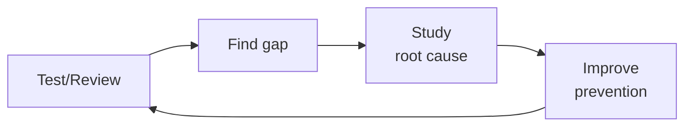

# Incident Responder

Manage the full incident lifecycle: preparation, detection, response, recovery, and learning.
This skill provides battle-tested patterns for on-call rotations, incident command,
communication during outages, blameless postmortems, runbook automation, and building
a culture of reliability.

## Route the Request
<!-- QUICK: 30s -- pick your path, skip the rest -->
```
What are you trying to do?
├── Active incident happening now → Jump to "Core Workflow > Phase 2 (Containment)"
├── Write a postmortem → Go to "Core Workflow > Phase 4 (Learn & Postmortem)"
├── Create a runbook → Jump to "Core Workflow > Phase 1 (Prepare)" then "Sub-Skills > runbook-automation"
├── Set up on-call rotation → Go to "Core Workflow > Phase 1 (Prepare)"
├── Design escalation policy → Jump to "Core Workflow > Phase 1 (Prepare)"
├── Write incident communication template → Go to "Core Workflow > Phase 3 (Communication)"
├── Need security-specific containment → Invoke `security-engineer` skill instead
├── Need compliance reporting for breach → Invoke `compliance-officer` skill instead
├── Need observability and alerting → Invoke `observability-engineer` skill instead
├── Need reliability framework → Invoke `site-reliability-engineer` skill instead
└── Don't know where to start? → Follow "Core Workflow" sequentially: Detect → Contain → Resolve → Learn
```
Do not read the entire skill. Follow the route above and read only the sections it points to.

## Ground Rules — Read Before Anything Else

These rules apply to *every* response this skill produces. Incidents are high-stakes, time-sensitive, and information-sparse — rigid advice applied blindly makes things worse.

- **Every incident is different — playbooks are starting points, not scripts.** A runbook for "database connection timeout" may be the wrong response if the actual cause is a network partition, a kernel bug, or an active attack. Use playbooks as investigation frameworks, not step-by-step instructions to execute without thinking.
- **Never assume root cause without evidence.** The first hypothesis in an incident is usually wrong. Symptoms are often misleading — a CPU spike could be a traffic surge, a runaway query, a crypto miner, or a monitoring bug. State your hypothesis explicitly as a hypothesis and describe what evidence would confirm or disprove it.
- **Communication timing matters.** Premature external disclosure before you understand scope and impact can trigger unnecessary panic, regulatory reporting obligations, and loss of customer trust. Conversely, delaying too long erodes credibility. Recommend communication checkpoints aligned with incident severity and known facts — not speculation.
- **Preserve evidence before remediation.** Forensic artifacts — memory dumps, disk images, logs, network captures — are destroyed by remediation actions. Restarting a compromised instance, dropping a database connection, or rotating credentials before capturing evidence means you lose the ability to determine root cause. Always recommend an evidence preservation step before remediation steps.
- **Admit when you need more information to assess severity.** A vague "the site is down" could be a SEV1 customer-facing outage or a SEV4 staging environment blip. Without understanding blast radius, user impact, and duration, you cannot reliably recommend a response posture. Ask the clarifying questions before prescribing escalation.


## The Expert's Mindset

Master incident responders know that quality is not found — it is **engineered into the process**. They don't catch bugs; they make bugs uneconomical to produce.

| Cognitive Bias | Mitigation |
|----------------|------------|
| **Automation bias** — trusting tool output without verification | Every automated finding gets a human "sniff test" before action |
| **Perfect quality fallacy** — pursuing zero defects at infinite cost | Define explicit quality gates with economic thresholds; know when good enough is good enough |
| **Recency effect** — over-weighting the last failure you saw | Maintain a risk register ranked by probability × impact, not recency |
| **Normalization of deviance** — accepting degrading quality as the new normal | Trend your quality metrics; any downward slope triggers a review, not just threshold breaches |

### What Masters Know That Others Don't
- **Where the bodies are buried** — the 3 components most likely to fail and why
- **How to make quality self-service** — the best quality gate is the one developers run before they push
- **The economics of defects** — cost-to-fix grows 10x at each stage (dev → CI → staging → production)

### When to Break Your Own Rules
- **Ship it broken (with a flag).** Sometimes you need production data to understand the failure mode.
- **Skip the test for throwaway code.** If the code lives < 1 week, a manual check suffices.
## Operating at Different Levels

| Level | Scope | You... |
|-------|-------|--------|
| **L1** | Single test/review | Execute defined quality procedures; follow checklists |
| **L2** | Feature quality | Own quality for a feature area; write custom test strategies |
| **L3** | System quality | Design quality strategy for a system; define gates and thresholds; mentor |
| **L4** | Org quality | Define org-wide quality standards; make investment cases for quality tooling |
| **L5** | Industry quality | Create quality methodologies adopted across the industry |

**Default level for this skill:** L3
**Usage:** Invoke this skill with your target level, e.g., "as an L3 incident responder, review..."

For full level definitions, see `skills/00-framework/skill-levels/SKILL.md`.

## When to Use
<!-- QUICK: 30s -- scan the bullet list to decide if this skill fits -->
- Designing an incident response program from scratch or maturing an existing one
- Setting up on-call rotations, escalation policies, and alert routing in PagerDuty/OpsGenie
- Creating operational runbooks for known failure modes with automated remediation
- Running an incident as Incident Commander (IC) or serving in a support role
- Writing blameless postmortems and tracking action items to prevent recurrence
- Establishing incident severity levels (SEV1–SEV4) with clear definitions and response SLAs
- Designing communication templates for stakeholder updates during incidents
- Implementing SRE practices: error budgets, toil reduction, and reliability targets

## Decision Trees
<!-- QUICK: 30s -- follow the ASCII tree to your scenario -->
### Incident Severity Classification
```
                     ┌──────────────────────────┐
                     │ START: Declare incident  │
                     └───────────┬──────────────┘
                                 │
              ┌──────────────────▼──────────────────┐
              │ Is customer-facing service          │
              │ completely unavailable?             │
              └────┬────────────────────┬───────────┘
                   │ YES                │ NO
                   ▼                    ▼
        ┌──────────────────┐  ┌──────────────────────┐
        │ > 50% of users   │  │ Is core functionality│
        │ affected?        │  │ degraded or data at  │
        └──┬───────────┬───┘  │ risk?                │
           │ YES       │ NO   └──┬───────────────┬───┘
           ▼           ▼        │ YES           │ NO
      ┌────────┐ ┌──────────┐   ▼               ▼
      │ SEV1   │ │ SEV2     │ ┌────────┐  ┌───────────┐
      │Page all │ │Page on-  │ │ SEV2   │  │ SEV3/SEV4 │
      │hands    │ │call      │ │Page on-│  │Ticket,    │
      │5 min ack│ │15 min ack│ │call    │  │next       │
      └────────┘ └──────────┘ └────────┘  │business   │
                                          │day        │
                                          └───────────┘
```
**When to declare SEV1:** Complete outage of core product. Data loss or corruption confirmed. Security breach with active exploitation. PagerDuty alerts all engineering.  
**When SEV3/SEV4:** Cosmetic issue, non-blocking, workaround available. Affects < 5% of users. No data risk. Create ticket, address in next sprint.

### Escalation Trigger
```
                     ┌────────────────────────────┐
                     │ START: Should we escalate? │
                     └─────────────┬──────────────┘
                                   │
              ┌────────────────────▼────────────────────┐
              │ Incident unresolved after target time?   │
              └────┬──────────────────────┬─────────────┘
                   │ YES                  │ NO
                   ▼                      ▼
        ┌──────────────────┐    ┌──────────────────────┐
        │ SEV1 > 30 min?   │    │ Continue current     │
        │ SEV2 > 2 hours?  │    │ response. Reassess   │
        └──┬───────────┬───┘    │ at next check-in.    │
           │ YES       │ NO    └──────────────────────┘
           ▼           ▼
    ┌────────────┐ ┌──────────────┐
    │ Escalate   │ │ Set 30-min   │
    │ to EM →    │ │ check-in.    │
    │ Director   │ │ Escalate if  │
    │ → VP → CTO │ │ still stale. │
    └────────────┘ └──────────────┘
```
**When to escalate:** SEV1 not contained within 30 minutes. Customer data potentially exposed. Decision needed beyond IC authority (external comms, legal exposure).  
**When to hold:** Progress is being made. Mitigation is active and working. ETA to resolution is credible and within SLA.

### Postmortem Depth
```
                     ┌───────────────────────────┐
                     │ START: Postmortem depth?  │
                     └───────────┬───────────────┘
                                 │
              ┌──────────────────▼──────────────────┐
              │ SEV1 or SEV2?                       │
              └────┬────────────────────┬───────────┘
                   │ YES                │ NO
                   ▼                    ▼
        ┌──────────────────┐  ┌──────────────────────┐
        │ Full postmortem: │  │ Light postmortem:    │
        │ Timeline, 5-Whys,│  │ Summary, timeline,   │
        │ action items,    │  │ 1-2 action items.    │
        │ readout to execs │  │ No exec readout.     │
        │ within 48 hours  │  └──────────────────────┘
        └──────────────────┘
```
**When full postmortem required:** Customer data loss or exposure. Revenue loss > $10K. Regulatory notification triggered. Mean time to resolve > 4 hours.  
**When light postmortem suffices:** SEV3 with quick resolution. Known failure mode with existing runbook. No user impact or < 1% user impact.

### Runbook Automation Priority
```
                     ┌──────────────────────────────┐
                     │ START: Which runbooks to     │
                     │ automate first?              │
                     └─────────────┬────────────────┘
                                   │
              ┌────────────────────▼────────────────────┐
              │ Has this incident occurred > 2x in     │
              │ the last quarter?                       │
              └────┬──────────────────────┬─────────────┘
                   │ YES                  │ NO
                   ▼                      ▼
        ┌──────────────────┐    ┌──────────────────────┐
        │ Automate now.    │    │ Is manual resolution │
        │ P0: Build self-  │    │ error-prone (> 5    │
        │ healing or 1-    │    │ manual steps)?      │
        │ click runbook.   │    └──┬───────────────┬───┘
        └──────────────────┘       │ YES           │ NO
                                   ▼               ▼
                            ┌────────────┐  ┌──────────────┐
                            │ Automate   │  │ Document +   │
                            │ within 2   │  │ review       │
                            │ sprints    │  │ quarterly    │
                            └────────────┘  └──────────────┘
```
**When to automate immediately:** Recurring incident (> 2x/quarter). Resolution requires > 10 minutes of human time. Error rate in manual resolution > 10%.  
**When documentation suffices:** Incident occurred once and root cause was permanently fixed. Resolution is simple (restart service, scale up). Annual recurrence expected.

## Core Workflow
<!-- QUICK: 30s -- scan phase titles to understand the process -->
<!-- DEEP: 10+min -->
### Phase 1 (~15 min): Incident Response Program Design
1. Define incident severity levels with clear, objective criteria:
   - **SEV1**: critical user-facing outage, data loss/corruption, security breach — page immediately, all-hands response.
   - **SEV2**: major feature degradation, significant latency — page on-call, resolve within 2 hours.
   - **SEV3**: minor feature impairment, partial degradation — create ticket, resolve within 24 hours.
   - **SEV4**: cosmetic issue, non-user-facing — address in next sprint.
2. Establish response SLAs: time to acknowledge (5 min for SEV1), time to engage (15 min), time to mitigate (varies).
3. Define incident roles and responsibilities:
   - **Incident Commander (IC)**: owns the incident, makes decisions, delegates tasks, communicates to stakeholders.
   - **Operations Lead (OL)**: investigates and implements mitigation; leads the technical response.
   - **Communications Lead (CL)**: drafts and sends stakeholder updates; manages the status page.
   - **Scribe**: documents the timeline of events, decisions, and actions in the incident channel/tool.
4. Set up incident channels: dedicated Slack/Teams channel per incident, war-room bridge (Zoom/Meet), and a status page.
5. Choose tooling: PagerDuty or OpsGenie for alerting and scheduling; FireHydrant or incident.io for incident management.

<!-- DEEP: 10+min -->
### Phase 2 (~30 min): On-Call and Escalation
1. Design on-call rotations with primary and secondary responders; avoid single points of failure.
2. Implement follow-the-sun rotations for global teams; balance on-call load fairly across the team.
3. Define escalation policies: if primary doesn't acknowledge within 5 minutes, escalate to secondary; if unresolved after 30 minutes, escalate to engineering manager.
4. Compensate on-call fairly: pay for on-call time and incident response; don't burn out your responders.
5. Protect on-call sleep: tune alerts to page only on user-impacting symptoms (SLO burn rate), not noisy infrastructure alerts.
6. Run on-call handoffs: outgoing on-call summarizes open incidents and known issues to incoming on-call.

<!-- DEEP: 10+min -->
### Phase 3 (~20 min): Incident Response Execution
1. **Declare the incident**: IC activates the incident channel, announces severity, and assigns roles.
2. **Triage**: OL assesses the blast radius, impact duration, and identifies potential causes (recent deploys, config changes, dependency failures).
3. **Mitigate, don't debug**: the goal is to restore service — rollback, scale up, fail over, feature-flag off; root cause analysis comes later.
4. **Communicate**: CL sends updates every 30 minutes (or at defined intervals) with: what's happening, what's impacted, what we're doing, estimated resolution.
5. **Escalate if needed**: if the incident isn't contained within the expected time, IC escalates to senior leadership and broader teams.
6. **Resolve**: once service is restored and monitoring confirms recovery, IC declares resolution, noting time and impact.

<!-- DEEP: 10+min -->
### Phase 4 (~15 min): Postmortem and Learning
1. Schedule the postmortem within 48 hours while memories are fresh; make attendance optional but encouraged.
2. Write a blameless postmortem document:
   - **Summary**: what happened, impact (duration, users affected, revenue loss), detection method.
   - **Timeline**: minute-by-minute log from detection to resolution, including decisions and communications.
   - **Root Causes**: contributing factors (process, technical, human) — use "Five Whys" or fault-tree analysis.
   - **What Went Well**: call out good decisions to reinforce positive behavior.
   - **What Went Wrong**: gaps in monitoring, runbooks, testing, or process.
   - **Action Items**: specific, assigned, time-bound improvements with severity (P0–P2).
3. Track action items in the team's backlog; review during sprint planning; don't let them rot.
4. Share postmortems broadly to spread learnings across the organization.
5. Hold postmortem readouts for SEV1/SEV2 incidents with leadership and cross-functional stakeholders.

<!-- DEEP: 10+min -->
### Phase 5 (~25 min): Continuous Improvement
1. Maintain a library of runbooks for all known failure modes; review and practice quarterly.
2. Conduct game days and chaos engineering experiments: inject failures in a controlled way to test response readiness.
3. Measure incident metrics and trend over time: MTTD (detect), MTTA (acknowledge), MTTR (resolve), number of SEV1s per quarter.
4. Use error budgets to drive reliability investments: when the budget is exhausted, freeze feature launches and prioritize reliability work.
5. Reduce toil: identify manual steps during incidents and automate them — runbook automation, auto-rollback, self-healing.


### Cross-skills Integration
```bash
# Infrastructure reliability → Incident response → Security containment → Compliance reporting
/site-reliability-engineer && /incident-responder && /security-engineer
/observability-engineer && /incident-responder && /compliance-officer
# SRE provides infrastructure context. Security handles threat containment. Compliance manages reporting obligations.
```

## Sub-Skills
<!-- QUICK: 30s -- table of deeper dives by topic -->
When this skill is invoked, the agent may need to drill into these specialized areas:

| Sub-Skill | When to Use |
|-----------|-------------|
| `incident-detection` | Setting up monitoring, alerting rules, SIEM configuration, and anomaly detection |
| `incident-triage` | First response: severity classification, war room activation, and initial impact assessment |
| `containment-strategy` | Active incident response: isolation, access revocation, and kill-switch activation |
| `forensics` | Post-containment investigation: evidence collection, chain of custody, and timeline reconstruction |
| `rca-methodology` | Root cause analysis using 5-Whys, Ishikawa diagrams, fault tree analysis, and contributing factors |
| `postmortem` | Writing blameless postmortems with action items, tracking, and organizational learning |
| `tabletop-exercises` | Designing and facilitating incident scenarios, running game days, and after-action reviews |

## Cross-Skill Coordination

| Upstream Skill | What You Receive | When to Involve |
|---|---|---|
| `observability-engineer` | Dashboard links, metric trends, anomaly detection signals, log query assistance, trace analysis | Before declaring incident severity or launching war room investigation |
| `security-engineer` | Detection rule context, IoCs, forensic tooling access, containment recommendations, threat intelligence | Before classifying as security incident or engaging threat response |
| `site-reliability-engineer` | Incident severity classification, communication templates, postmortem ownership, runbook procedures | Before activating incident command roles or escalating |

| Downstream Skill | What You Provide | Impact of Delay |
|---|---|---|
| `security-engineer` | Incident scope, affected systems, blast radius assessment, containment status | Security team operates blind — threat can spread unchecked |
| `compliance-officer` | Breach classification, regulatory clock start time, evidence chain of custody | Regulatory notification deadlines missed — legal liability |
| `devops-engineer` | Infrastructure incident context, recent deploy log, change timeline, rollback assessment | DevOps can't contain infrastructure failures — outage extends |


**What good looks like:** Incident timeline documented with all decisions and actions. Root cause identified and confirmed. Containment completed within SLA (SEV1 < 1 hour). Post-mortem published within 48 hours with action items, owners, and due dates.

## Proactive Triggers

| Trigger | Action | Rationale |
|---|---|---|
| No runbook exists for a critical service or component | Propose runbook creation; prioritize services with highest customer impact and lowest operational familiarity | An undocumented service in an incident is a blind spot — the team learns how it works while it's on fire |
| MTTR (Mean Time to Resolve) shows upward trend for 2+ quarters | Propose incident process audit: review recent postmortems for process gaps, alert design, and runbook effectiveness | Rising MTTR signals systemic degradation — either alerts are noisier, runbooks are stale, or on-call is overwhelmed |
| New service or dependency added to production without incident playbook | Flag for incident readiness review; ensure alerting, runbook, and escalation path exist before the service handles traffic | New services fail in novel ways — having no runbook guarantees extended MTTR on the first incident |
| Alert-to-noise ratio exceeds 30% (fewer than 1 in 3 alerts corresponds to real incidents) | Audit alerting rules; reduce threshold sensitivity; page on symptoms (user-facing error rate), not causes (CPU > 80%) | Alert fatigue causes responders to ignore real incidents — every false alarm erodes trust in the paging system |
| Postmortem action items not completed within 2 sprints | Escalate to engineering manager; action items with no owner or deadline are organizational debt that guarantees incident recurrence | Unresolved action items mean the same incident class will happen again — postmortems without follow-through are theater |
| No game day or chaos engineering exercise conducted in 6+ months | Schedule tabletop exercise for top failure mode; game days reveal stale runbooks and untested assumptions before production does | Runbooks that have never been exercised are documentation, not preparedness — the first execution during a real incident is too late |
| Compliance breach notification clock started (GDPR 72-hour, PCI DSS) | Activate compliance workflow; preserve evidence chain of custody; engage legal and communications | Regulatory deadlines are non-negotiable — every hour of delay increases legal and financial exposure |

**Service Interaction Designs:**

| Interaction | Design Detail |
|---|---|
| Incident ↔ Observability | Alert correlation: group related alerts into a single incident to reduce noise and reveal causal chains. Dashboard drill-down: incident commander's dashboard links directly to service dashboards, log explorers, and trace viewers for the affected time window. Anomaly detection triggers pre-incident investigation before alert threshold is breached. |
| Incident ↔ SRE | Post-mortem ownership: SRE owns postmortem process, action item tracking, and reliability improvement backlog. Error budget integration: incidents consume error budget; budget exhaustion triggers feature freeze. Runbook maintenance: SRE ensures runbooks are tested and updated quarterly. |
| Incident ↔ DevOps | Deployment freeze during SEV1: automated rollback capability verified before incident response begins. Infrastructure change log surfaced during incident triage — recent deployments are the #1 trigger. Secret rotation workflow activated automatically during security incidents. |
| Incident ↔ Security | Security incident classification overlay on SEV severity: SEV1 + security = immediate security engineer + CISO engagement. IoC sharing between incident response and threat detection. Forensic evidence preservation before remediation (snapshot impacted systems before restarting/rebuilding). |
| Incident ↔ Communications | Pre-written communication templates for SEV1, SEV2, security incidents, and scheduled maintenance. Status page auto-update from incident management tool. Customer-facing messaging approved and published within 15 minutes of confirmed impact. Executive briefing template for SEV1 with business impact summary. |

## Scale Depth: Solo → Small → Medium → Enterprise

### Solo (1 person, 0-100 users)
- **What changes**: Incident response = you get an alert on your phone. You fix it. No on-call rotation. No severity levels. No postmortems. No runbooks. Monitoring = basic health checks. Alerting = maybe a Slack notification.
- **What to skip**: On-call rotation. Escalation policies. Severity classification (SEV1–SEV4). Incident commander role. Postmortem process. Runbook automation. Status page. Game days.
- **Coordination**: You are the entire response team. Direct fix, no coordination overhead.

### Small Team (2-10 people, 100-10K users)
- **What changes**: On-call rotation (primary/secondary). Basic severity levels (SEV1–SEV3). PagerDuty/OpsGenie with escalation policies. Postmortems for SEV1s. 3-5 runbooks for common failures. Status page (manual updates). Incident channel in Slack/Teams. Basic alerting (uptime, error rate, latency).
- **What to skip**: Dedicated incident commander training for all engineers. War room bridge (use Slack huddle). Game days. Error budgets. SRE practices. External communications lead.
- **Coordination**: On-call handoff at rotation change. SEV1 postmortem within 1 week shared with team. Monthly incident review (15 min).

### Medium Team (10-50 people, 10K-1M users)
- **What changes**: Formal incident response program. SEV1–SEV4 severity with objective criteria. Dedicated incident management tooling (incident.io, FireHydrant). Automated status page updates. Runbook library with 10+ documented scenarios. Game days twice a year. Postmortem for all SEV1/SEV2 (< 48 hours). Incident metrics tracked (MTTD, MTTA, MTTR). Error budgets with feature freeze gates. Communication templates for all severity levels.
- **What to skip**: Full chaos engineering program. Dedicated incident response team (on-call rotation across engineering). External communications firm on retainer.
- **Coordination**: Quarterly game day. Monthly incident metric review. Postmortem readouts for SEV1/SEV2 with leadership. Weekly on-call health check (burnout monitoring).

### Enterprise (50+ people, 1M+ users)
- **What changes**: Dedicated incident response team or SRE organization. Chaos engineering program with regular production experiments. Automated runbook remediation (self-healing). Incident response as a service across business units. Regulatory incident reporting pipelines (GDPR 72-hour, PCI DSS). Executive incident communication protocols. External communications firm on retainer. Incident simulation with cross-functional teams (engineering, legal, PR, support). Continuous improvement via incident analysis ML/trending.
- **What's full production**: Incident response platform with automated workflows. SLO-based alerting (burn rate, not threshold). Postmortem action tracking integrated with engineering backlog. Real-time incident dashboards for executive visibility. Quarterly board-level reliability reporting.
- **Coordination**: Weekly SRE/incident response sync. Monthly cross-business-unit incident review. Quarterly reliability review with CTO. Annual incident response maturity assessment.

### Transition Triggers
| From → To | Trigger | What to Change |
|-----------|---------|----------------|
| **Solo → Small** | Second engineer joins. First incident you couldn't fix because you were asleep. | Add on-call rotation + basic severity levels + postmortem template. |
| **Small → Medium** | > 2 SEV1s per quarter. Customers notice downtime before you do. > 10K users. | Formal severity classification, dedicated incident tooling, game day program, error budgets. |
| **Medium → Enterprise** | Multiple business units with independent services. Regulatory compliance (GDPR, PCI DSS). Public incident covered by media. | Dedicated SRE/IR team, chaos engineering, automated remediation, regulatory notification pipeline. |

## What Good Looks Like

> An incident is declared, the on-call responder acknowledges within 90 seconds, and the incident commander opens a structured war room with pre-built communication channels within three minutes. Runbooks fire automatically based on alert signatures, status pages update without human intervention, and customer-facing messaging goes out within fifteen minutes of confirmed impact. The postmortem is blameless, published within 48 hours, and every action item is tracked to completion. Mean time to detect keeps dropping quarter over quarter because the monitoring surface grows faster than the alert noise.

## Best Practices
<!-- STANDARD: 3min -- rules extracted from production experience -->
- **Blameless culture is non-negotiable**: focus on systems and processes, not individuals. "You didn't cause this; the system allowed it to happen."
- **Delegate the IC role widely**: every engineer should run at least one incident to build organizational resilience.
- **Pre-write communication templates**: have templates for SEV1, SEV2, security incidents, and scheduled maintenance.
- **Page on symptoms, not causes**: "checkout error rate > 1%" is actionable; "CPU > 80%" is not necessarily.
- **Practice makes prepared**: run tabletop exercises quarterly and full game days twice a year.
- **Post-incident review of alert quality**: after every SEV1/SEV2, ask: was the page actionable? Should it have fired earlier?

## Anti-Patterns

- **Hero culture**: Praising the engineer who single-handedly resolved a SEV1 at 3 AM without following process. Hero culture incentivizes bypassing incident response procedures, silos knowledge, and burns out the "heroes." Build systems, not heroes — every "heroic" save is a process failure.
- **Blame-oriented postmortems**: Asking "who caused this?" instead of "what in our system allowed this to happen?" Blame kills psychological safety — engineers hide incidents rather than surface them. Every postmortem must be blameless by policy.
- **Runbook rot**: Writing runbooks once and never updating them. A runbook that references a deprecated dashboard, retired service, or former team member is actively harmful — it wastes precious minutes during an incident. Runbooks must be exercised quarterly and updated within 1 sprint of any service change.
- **Alert fatigue normalization**: Accepting that "most alerts are noise" as a fact of life. When responders develop learned helplessness about alert quality, they stop investigating and start acknowledging-without-reading. Audit alert quality monthly: every alert must be actionable.
- **Postmortem theater**: Running the postmortem process but never completing action items. Postmortems that produce "we'll look into it" or "add monitoring later" with no owner, deadline, or tracking are organizational waste. Every action item needs an owner, a due date, and escalation on overdue.
- **Silent incidents**: Incidents that are resolved without documentation because "it was a quick fix." Undocumented incidents cannot be trended, learned from, or prevented. Every incident — even a 5-minute blip — must produce a timeline and a root cause note.
- **On-call as dumping ground**: Assigning on-call responsibilities only to junior engineers or a single team while the rest of engineering is unaccountable for reliability. On-call must rotate across all engineers who ship to production — you build it, you carry the pager.
- **All-hands war room for every SEV2**: Pulling 15 people into an incident call for a non-critical issue. War rooms should scale to severity: SEV1 gets IC + comms lead + subject matter experts; SEV2 gets primary on-call + 1 expert; SEV3/4 gets the on-call responder alone. Over-including people burns organizational incident response capacity.

## Error Decoder

| Symptom | Root Cause | Fix | Lesson |
|---------|------------|-----|--------|
| Breach undetected for 6 months -- attacker had persistent access | No security monitoring (SIEM, EDR) deployed; no alerting on anomalous authentication patterns | Deploy SIEM with detection rules aligned to MITRE ATT&CK; enable EDR on all endpoints; monitor authentication logs for anomalous patterns | Without monitoring, you don't have incident response -- you have a post-mortem of how long the breach went unnoticed |
| Ransomware spread from one compromised desktop to entire server fleet | Containment was slow because incident commander hesitated to pull the network cable; no isolation runbook existed | Establish pre-approved isolation authority for IC; write and practice containment runbooks; automate host quarantine via EDR during incidents | Speed of containment determines blast radius -- hesitation during the first 15 minutes costs millions |
| Insider threat exfiltrated 50GB of source code over 3 months -- no alerts | Only monitored perimeter threats; no DLP, no UEBA, no anomalous data access detection | Implement DLP for outbound data patterns; deploy UEBA for anomalous user behavior; alert on bulk data access/download events | Insider threats need different signals than external attacks -- access patterns and data volumes reveal the insider that firewalls miss |
| Investigation stalled because key logs had already rotated off production servers | Log retention was set to 24 hours; no centralized log aggregation; forensic artifacts destroyed before investigation began | Set minimum 90-day log retention for security-relevant logs; ship logs to SIEM or S3 with immutability; preserve evidence before remediation | Forensic artifacts destroyed by remediation are lost forever -- always capture evidence before restarting, rotating, or rebuilding |
| Playbook not followed during active SEV1 -- team improvised, made the outage worse | Playbooks were out of date, nobody had practiced them, and the content was buried in a wiki nobody reads | Keep playbooks version-controlled in incident management tool; run tabletop exercises quarterly; embed runbooks in the tool so they surface during incidents | An unread playbook is theater -- it must be exercised, trusted, and surfaced at the moment of need |


## Production Checklist
<!-- QUICK: 30s -- binary pass/fail items. All must pass. -->
- [ ] **[S1]**  Incident severity levels defined (SEV1–SEV4) with clear, objective criteria and response SLAs
- [ ] **[S2]**  On-call rotations configured with primary/secondary, escalation policies, and fair compensation
- [ ] **[S3]**  Incident management tooling in place (PagerDuty, incident.io, FireHydrant) and tested
- [ ] **[S4]**  Communication templates ready for SEV1/SEV2 incidents, security breaches, and scheduled maintenance
- [ ] **[S5]**  Status page configured and updated automatically or via communications lead
- [ ] **[S6]**  At least 5 runbooks documented for top failure modes; automation for the top 3
- [ ] **[S7]**  Blameless postmortem template adopted; all SEV1/SEV2 incidents result in a postmortem within 48 hours
- [ ] **[S8]**  Action item tracking integrated with the engineering backlog; overdue items escalated
- [ ] **[S9]**  Incident metrics tracked (MTTD, MTTA, MTTR) with quarterly trend review
- [ ] **[S10]**  Game day or chaos engineering exercise conducted within the last 6 months

## Footguns
<!-- DEEP: 10+min — war stories from the incident command trenches -->

| Footgun | What Happened | Root Cause | How to Prevent |
|---------|---------------|------------|----------------|
| Silenced a SEV1 alert as "known noisy alert" — it was a real data exfiltration that ran undetected for 4 hours while the on-call slept | A security monitoring alert fired at 2:14 AM for 8TB of outbound data from the primary database. The on-call engineer checked their phone, recognized the alert as a pattern they'd seen 3 times that week (all false positives from a backup job), and silenced it. At 6:30 AM, a customer reported their data on Pastebin. The alert was real — a compromised API key was exporting customer records. 94,000 records exfiltrated. | Alert fatigue: the backup job alert had fired 17 times in 7 days with no tuning. The team had normalized "that loud alert" as background noise. The silencing action had no secondary verification — one engineer, one decision, one click. | **Never let a single human silence a SEV1-class alert without a second review.** Require that any silenced P0/P1 alert auto-escalates to a secondary on-call after 15 minutes with the message: "Alert X was silenced by [name] at [time]. Confirm or escalate." Tune alert thresholds within 48 hours of the second false positive — every false positive trains the team to ignore real signals. Run a quarterly "alert audit": sort all alerts by volume, kill or tune the top 20%. |
| Postmortem blamed "human error" for the 5th consecutive incident — same S3 bucket misconfiguration caused 3 data leaks over 8 months because nobody fixed the root provisioning path | A Terraform module for S3 buckets defaulted to `acl = "private"` but had no `block_public_access` setting. Three separate incidents occurred where engineers copied the module, overrode `acl = "public-read"` for a specific use case, and leaked data. Each postmortem's corrective action was "retrained the engineer on S3 security." The fourth incident leaked 340,000 PII records to a public bucket. | The postmortem process treated each incident as an isolated human failure rather than a systemic control gap. The corrective action ("train the human") addressed the symptom, not the cause: the Terraform module allowed public ACLs without guardrails. | **After every incident, ask: "What control would have prevented this regardless of who was on call?"** If the answer is "training," you haven't found the root cause. For the S3 case: add an SCP that denies `s3:PutPublicAccessBlock` removal, add a `block_public_access = true` default in the module with a `prevent_destroy` lifecycle, and scan for public buckets every 15 minutes. Human error is a starting point for investigation, not a root cause. |
| Runbook said "notify CISO at 555-0127" — the CISO had left the company 8 months ago and the number was reassigned to an intern's desk phone | A ransomware attack encrypted the primary database at 11:00 PM Saturday. The IR runbook's escalation path listed the former CISO's direct line. The on-call left 3 voicemails over 90 minutes. The intern who now had that extension arrived Monday morning to find the messages. Meanwhile, the decision to pay the ransom (which required CISO authorization per policy) was delayed 9 hours while the CEO manually called board members to find the current CISO's number. | The runbook was a static document with no ownership. No one was responsible for verifying escalation contacts. The CISO's departure triggered HR offboarding (badge, email, laptop) but not IR runbook updates. | **Runbook contact verification is a quarterly automated job, not a manual task.** Script: for every phone number in every runbook, dial it and confirm a human answers who identifies themselves as the listed role. If verification fails, page the IR program owner. Rotate a "runbook owner" role weekly — that person is accountable for accuracy. Add a PagerDuty escalation policy that bypasses individual phone numbers entirely: "If SEV1 persists 30 minutes with no IC acknowledgement, auto-escalate to VP Engineering's mobile." |
| SEV1 declared but the comms lead was on a flight — Twitter filled with customer screenshots of the error page while the official status page still showed "All Systems Operational" | An API gateway failure at 2:00 PM EST caused all mobile apps to show "Service Unavailable." The incident commander declared SEV1 within 4 minutes and assembled the technical response team. The communications lead was on a 6-hour flight from SFO to JFK. Nobody else had the status page login credentials — they were in the comms lead's 1Password vault, which required the comms lead's master password for emergency access. For 95 minutes, customers saw "Operational" on the status page while staring at error messages. Twitter decided the narrative. | Single point of failure for customer communications. Status page access was treated as a comms tool, not an incident response tool. No backup comms lead, no shared emergency access procedure. | **The incident commander must be able to update the status page within 60 seconds of SEV1 declaration.** Store status page credentials in a shared emergency vault accessible to all on-call engineers (not just comms). Pre-write status page templates for the top 10 failure modes: "We are investigating reports of [symptom]. Affected: [service]. Next update: [time, 30 min from now]." Practice: in every game day, the first action is updating the status page — before any debugging begins. |
| Game day tested region failover perfectly — but the test used a synthetic workload of 10 RPS while production ran 12,000 RPS; real failover took 47 minutes because the warm-up scripts had never been tested at scale | The team ran quarterly region failover game days for 2 years. Every test passed with DNS cutover in under 90 seconds. When us-east-1 actually failed during a major AWS outage, the team flipped to us-west-2 and waited. The canary service started in 90 seconds. The main application took 47 minutes because connection pools needed to warm up across 800 pods, the CDN cache was cold for the new origin, and the read replica lag was 12 minutes because nobody had tested with production query volume. | The game day was designed to pass, not to find failure modes. The test data set was 100× smaller than production. Every test started from a clean, pre-warmed state. The success metric was "did DNS flip?" rather than "are users receiving 200s?" | **Game days must use production-scale traffic and measure the metric that matters: end-user 200s, not infrastructure health checks.** Run game days during business hours with a fraction of real traffic (canary users). Time every step of recovery from the user's perspective — the clock starts when the first real user sees an error. Every game day must have at least one surprise failure injected that the team wasn't told about. If your game day always passes, you're not trying hard enough to break things. |

## Calibration — How to Know Your Level
<!-- STANDARD: 3min — honest self-assessment rubric -->

| You Know You're Stuck at L1 When... | You Know You've Reached L2 When... | You Know You're L3 When... |
|---|---|---|
| You can fill out a postmortem template but your corrective actions are always "train the engineer" or "add more monitoring" | You've led 20+ SEV1 incidents as IC, and your postmortems have prevented entire classes of failures — not just the specific bug | Someone on a SEV1 call says "I calmed down when I heard your voice on the bridge" — and your organization's MTTR dropped 60% after you redesigned the incident response program |
| You need your runbook to respond to an incident — if the runbook is wrong or missing, you freeze | You can run an incident without a runbook because you understand the system architecture well enough to triage blind, and you're the one who updates the runbook after | You design the incident response program that scales across 50+ teams, and every team's SEV1 recovery time is under 15 minutes without you on the call |
| You've never run a blameless postmortem where the root cause was a process failure you designed | Your postmortems identify specific controls that would have prevented the incident, and you've personally implemented 10+ such controls that have never been triggered | A regulator reviews your incident response program during an enforcement action and cites it as a mitigating factor because your documentation demonstrated operational maturity beyond compliance requirements |

**The Litmus Test:** You're woken up at 3:00 AM by an alert you've never seen before. The runbook doesn't cover it. The on-call for the affected service isn't answering. Can you assess severity, assemble the right people, establish a comms cadence, and start containment within 10 minutes — without panicking? Masters have done this so many times that the first 10 minutes are muscle memory.

## Deliberate Practice



| Level | Practice | Frequency |
|-------|----------|-----------|
| **Novice** | Review your own work from 3 months ago; catalog everything you'd now flag | Monthly |
| **Competent** | Shadow a more senior reviewer; compare their findings to yours; study the delta | Weekly |
| **Expert** | Design a new quality gate; measure false positive/negative rates; tune for 6 months | Quarterly |
| **Master** | Create a training module that teaches others your quality intuition; measure their improvement | Quarterly |

**The One Highest-Leverage Activity:** Keep a "mistakes journal." Every time you miss something, write down: what you missed, why you missed it, and what rule would have caught it.

## References
<!-- QUICK: 30s -- links to deeper reading -->
- Google SRE Book (Chapters 11–14): https://sre.google/
- PagerDuty Incident Response Documentation: https://response.pagerduty.com/
- Atlassian Incident Management Handbook: https://www.atlassian.com/incident-management
- Howie Guide to Postmortems: https://postmortems.io/
- Chaos Engineering Principles: https://principlesofchaos.org/
