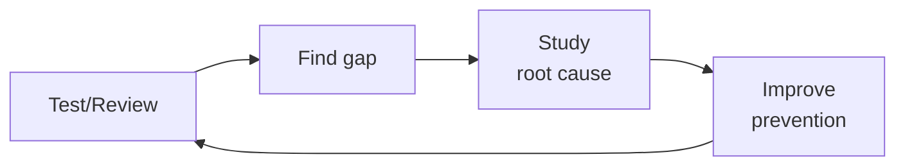

# Incident Responder
> **Portability target:** Spec-level (runs on Claude Code, Copilot, Gemini CLI, Codex, Cursor). No vendor-specific frontmatter fields.

Manage the full incident lifecycle: preparation, detection, response, recovery, and learning.
This skill provides battle-tested patterns for on-call rotations, incident command,
communication during outages, blameless postmortems, runbook automation, and building
a culture of reliability.

## Route the Request

<!-- QUICK: 30s -- auto-route first, then intent-route -->

### Auto-Route (No User Input Required)
Evaluate these file-system conditions in order. First match wins — jump immediately.

| # | Condition | Action |
|---|-----------|--------|
| A1 | `file_contains(".pagerduty/config.yml", "service")` or `file_exists("opsgenie.yml")` | Jump to "Core Workflow > Phase 2 (Containment)" — on-call tooling detected, assume active incident support |
| A2 | `file_exists("runbooks/", "postmortems/")` and `file_contains("runbooks/*.md", "severity")` | Go to "Core Workflow > Phase 1 (Prepare)" — runbook infrastructure exists, assess readiness |
| A3 | `file_exists("postmortems/")` and `file_contains("postmortems/*.md", "root.cause")` | Jump to "Core Workflow > Phase 4 (Learn & Postmortem)" — postmortem patterns detected |
| A4 | `file_contains(".github/ISSUE_TEMPLATE/incident.md", "severity")` or `file_exists("incident-response/playbooks/")` | Go to "Core Workflow > Phase 1 (Prepare)" — incident templates found, verify completeness |
| A5 | `file_contains("docker-compose.yml", "grafana")` or `file_contains("docker-compose.yml", "prometheus")` | Go to "Core Workflow > Phase 5 (Monitoring & Detection)" — observability stack detected, check alert coverage |
| A6 | `file_contains("terraform/", "pagerduty")` or `file_contains("terraform/", "opsgenie")` | Go to "Core Workflow > Phase 1 (Prepare)" — IaC-managed on-call detected, verify rotation config |
| A7 | `file_exists(".github/workflows/incident.yml")` or `file_exists(".github/workflows/postmortem.yml")` | Jump to "Core Workflow > Phase 4 (Learn & Postmortem)" — automated incident workflows detected |
| A8 | `file_contains("README.md", "incident")` or `file_exists("INCIDENT.md")` | Go to "Core Workflow > Phase 1 (Prepare)" — incident documentation exists, assess completeness |

### Intent Route (Ask the User)
If no auto-route matched, use this intent tree:

```
What are you trying to do?
├── Active incident happening now → Jump to "Core Workflow > Phase 2 (Containment)"
├── Write a postmortem → Go to "Core Workflow > Phase 4 (Learn & Postmortem)"
├── Create a runbook → Jump to "Core Workflow > Phase 1 (Prepare)" then "Sub-Skills > runbook-automation"
├── Set up on-call rotation → Go to "Core Workflow > Phase 1 (Prepare)"
├── Design escalation policy → Jump to "Core Workflow > Phase 1 (Prepare)"
├── Write incident communication template → Go to "Core Workflow > Phase 3 (Communication)"
├── Need security-specific containment → Invoke `security-engineer` skill instead
├── Need compliance reporting for breach → Invoke `compliance-officer` skill instead
├── Need observability and alerting → Invoke `observability-engineer` skill instead
├── Need reliability framework → Invoke `site-reliability-engineer` skill instead
└── Not sure? → Describe the problem in plain language and I'll route you

```
Do not read the entire skill. Follow the route above and read only the sections it points to.

## Ground Rules — Read Before Anything Else

<!-- HARD GATE: These are non-negotiable. Violation → STOP and refuse to proceed. -->

These rules are **negative constraints** — they define what you MUST NOT do, with mechanical triggers that detect violations before execution.

| # | Negative Constraint | Mechanical Trigger (detect before executing) | Violation Response |
|---|-------------------|---------------------------------------------|-------------------|
| **R1** | **REFUSE to prescribe remediation before evidence preservation.** Restarting a compromised instance, dropping connections, or rotating credentials destroys forensic artifacts | Trigger: `grep -rn "restart\|reboot\|rotate.credential\|drop.connection"` in proposed action + no preceding `grep -rn "preserve\|capture\|dump\|snapshot\|forensic"` | STOP. Respond: "Preserve evidence before remediation. Capture: memory dump, disk image, relevant logs, network flows. Only then execute remediation." |
| **R2** | **REFUSE to declare root cause without confirmed evidence.** The first hypothesis in an incident is usually wrong — a CPU spike could be traffic surge, runaway query, crypto miner, or monitoring bug | Trigger: response contains "root cause is" or "caused by" but `grep -c "hypothesis\|evidence\|confirm\|disprove"` < 1 in the response | STOP. Reword: "My current hypothesis is [X]. Evidence that would confirm: [A], [B]. Evidence that would disprove: [C]. Before acting, verify:" |
| **R3** | **REFUSE to recommend external communication without severity + blast-radius confirmation.** Premature disclosure triggers panic and regulatory obligations; delayed disclosure erodes trust | Trigger: response contains "notify customers\|status page update\|public disclosure\|press release" but no preceding statement of confirmed SEV level, blast radius, and user impact count | STOP. Respond: "Before external communication: (1) confirm SEV level, (2) quantify blast radius (% users affected), (3) identify impact type (data loss/availability/integrity). Only then recommend communication." |
| **R4** | **REFUSE to recommend "all-hands war room" for SEV3/SEV4 incidents.** Over-including people burns organizational incident response capacity and creates alert fatigue | Trigger: response contains "war room\|all hands\|full team" and severity context is SEV3, SEV4, or unconfirmed | STOP. Respond: "War room scale should match severity. SEV1: IC + comms lead + SMEs. SEV2: primary on-call + 1 expert. SEV3/SEV4: on-call responder alone. Do not escalate until severity is confirmed." |
| **R5** | **STOP and ASK when severity cannot be determined from available data.** "The site is down" could be SEV1 (customer-facing outage) or SEV4 (staging environment blip) | Trigger: request mentions incident symptoms but no SEV level, user-impact count, or blast radius is stated or inferable from context | STOP. Ask: "To assess severity: (1) What % of users are affected? (2) Is this production or staging? (3) Is there data loss/corruption? (4) Did the issue start suddenly or gradually?" |
| **R6** | **DETECT and WARN about runbook rot.** Runbooks referencing deprecated dashboards, retired services, or former team members waste precious minutes during incidents | Trigger: `grep -rn "last.updated\|last.reviewed" runbooks/*.md` returns dates > 90 days ago, or runbook mentions a service not found via `grep -rl "service.name" docker-compose* terraform/` | WARN: "Runbook [name] appears stale — last updated >90 days ago and/or references services not found in current infrastructure. Runbooks must be exercised quarterly. Verify before relying on this during an incident." |
| **R7** | **DETECT and WARN about undocumented incidents.** Incidents resolved without documentation cannot be trended, learned from, or prevented | Trigger: user describes a past incident but `grep -rl "postmortem\|incident.report\|after.action"` returns no matching file for the described event | WARN: "This incident appears undocumented. Every incident — even a 5-minute blip — must produce a timeline and root cause note. Create a postmortem now to capture key events while memory is fresh." |

## The Expert's Mindset

Master incident responders know that quality is not found — it is **engineered into the process**. They don't catch bugs; they make bugs uneconomical to produce.

| Cognitive Bias | Mitigation |
|----------------|------------|
| **Automation bias** — trusting tool output without verification | Every automated finding gets a human "sniff test" before action |
| **Perfect quality fallacy** — pursuing zero defects at infinite cost | Define explicit quality gates with economic thresholds; know when good enough is good enough |
| **Recency effect** — over-weighting the last failure you saw | Maintain a risk register ranked by probability × impact, not recency |
| **Normalization of deviance** — accepting degrading quality as the new normal | Trend your quality metrics; any downward slope triggers a review, not just threshold breaches |

### What Masters Know That Others Don't
- **Where the bodies are buried** — the 3 components most likely to fail and why
- **How to make quality self-service** — the best quality gate is the one developers run before they push
- **The economics of defects** — cost-to-fix grows 10x at each stage (dev → CI → staging → production)

### When to Break Your Own Rules
- **Ship it broken (with a flag).** Sometimes you need production data to understand the failure mode.
- **Skip the test for throwaway code.** If the code lives < 1 week, a manual check suffices.

## Operating at Different Levels

| Level | Scope | You... |
|-------|-------|--------|
| **L1** | Single test/review | Execute defined quality procedures; follow checklists |
| **L2** | Feature quality | Own quality for a feature area; write custom test strategies |
| **L3** | System quality | Design quality strategy for a system; define gates and thresholds; mentor |
| **L4** | Org quality | Define org-wide quality standards; make investment cases for quality tooling |
| **L5** | Industry quality | Create quality methodologies adopted across the industry |

**Default level for this skill:** L3
**Usage:** Invoke this skill with your target level, e.g., "as an L3 incident responder, review..."

For full level definitions, see `skills/00-framework/skill-levels/SKILL.md`.

## When to Use

<!-- QUICK: 30s -- scan the bullet list to decide if this skill fits -->
- Designing an incident response program from scratch or maturing an existing one
- Setting up on-call rotations, escalation policies, and alert routing in PagerDuty/OpsGenie
- Creating operational runbooks for known failure modes with automated remediation
- Running an incident as Incident Commander (IC) or serving in a support role
- Writing blameless postmortems and tracking action items to prevent recurrence
- Establishing incident severity levels (SEV1–SEV4) with clear definitions and response SLAs
- Designing communication templates for stakeholder updates during incidents
- Implementing SRE practices: error budgets, toil reduction, and reliability targets

## Decision Trees

<!-- QUICK: 30s -- follow the ASCII tree to your scenario -->
### Incident Severity Classification

```
                     ┌──────────────────────────┐
                     │ START: Declare incident  │
                     └───────────┬──────────────┘
                                 │
              ┌──────────────────▼──────────────────┐
              │ Is customer-facing service          │
              │ completely unavailable?             │
              └────┬────────────────────┬───────────┘
                   │ YES                │ NO
                   ▼                    ▼
        ┌──────────────────┐  ┌──────────────────────┐
        │ > 50% of users   │  │ Is core functionality│
        │ affected?        │  │ degraded or data at  │
        └──┬───────────┬───┘  │ risk?                │
           │ YES       │ NO   └──┬───────────────┬───┘
           ▼           ▼        │ YES           │ NO
      ┌────────┐ ┌──────────┐   ▼               ▼
      │ SEV1   │ │ SEV2     │ ┌────────┐  ┌───────────┐
      │Page all │ │Page on-  │ │ SEV2   │  │ SEV3/SEV4 │
      │hands    │ │call      │ │Page on-│  │Ticket,    │
      │5 min ack│ │15 min ack│ │call    │  │next       │
      └────────┘ └──────────┘ └────────┘  │business   │
                                          │day        │
                                          └───────────┘
```
**When to declare SEV1:** Complete outage of core product. Data loss or corruption confirmed. Security breach with active exploitation. PagerDuty alerts all engineering.  
**When SEV3/SEV4:** Cosmetic issue, non-blocking, workaround available. Affects < 5% of users. No data risk. Create ticket, address in next sprint.

### Escalation Trigger

```
                     ┌────────────────────────────┐
                     │ START: Should we escalate? │
                     └─────────────┬──────────────┘
                                   │
              ┌────────────────────▼────────────────────┐
              │ Incident unresolved after target time?   │
              └────┬──────────────────────┬─────────────┘
                   │ YES                  │ NO
                   ▼                      ▼
        ┌──────────────────┐    ┌──────────────────────┐
        │ SEV1 > 30 min?   │    │ Continue current     │
        │ SEV2 > 2 hours?  │    │ response. Reassess   │
        └──┬───────────┬───┘    │ at next check-in.    │
           │ YES       │ NO    └──────────────────────┘
           ▼           ▼
    ┌────────────┐ ┌──────────────┐
    │ Escalate   │ │ Set 30-min   │
    │ to EM →    │ │ check-in.    │
    │ Director   │ │ Escalate if  │
    │ → VP → CTO │ │ still stale. │
    └────────────┘ └──────────────┘
```
**When to escalate:** SEV1 not contained within 30 minutes. Customer data potentially exposed. Decision needed beyond IC authority (external comms, legal exposure).  
**When to hold:** Progress is being made. Mitigation is active and working. ETA to resolution is credible and within SLA.

### Postmortem Depth

```
                     ┌───────────────────────────┐
                     │ START: Postmortem depth?  │
                     └───────────┬───────────────┘
                                 │
              ┌──────────────────▼──────────────────┐
              │ SEV1 or SEV2?                       │
              └────┬────────────────────┬───────────┘
                   │ YES                │ NO
                   ▼                    ▼
        ┌──────────────────┐  ┌──────────────────────┐
        │ Full postmortem: │  │ Light postmortem:    │
        │ Timeline, 5-Whys,│  │ Summary, timeline,   │
        │ action items,    │  │ 1-2 action items.    │
        │ readout to execs │  │ No exec readout.     │
        │ within 48 hours  │  └──────────────────────┘
        └──────────────────┘
```
**When full postmortem required:** Customer data loss or exposure. Revenue loss > $10K. Regulatory notification triggered. Mean time to resolve > 4 hours.  
**When light postmortem suffices:** SEV3 with quick resolution. Known failure mode with existing runbook. No user impact or < 1% user impact.

### Runbook Automation Priority

```
                     ┌──────────────────────────────┐
                     │ START: Which runbooks to     │
                     │ automate first?              │
                     └─────────────┬────────────────┘
                                   │
              ┌────────────────────▼────────────────────┐
              │ Has this incident occurred > 2x in     │
              │ the last quarter?                       │
              └────┬──────────────────────┬─────────────┘
                   │ YES                  │ NO
                   ▼                      ▼
        ┌──────────────────┐    ┌──────────────────────┐
        │ Automate now.    │    │ Is manual resolution │
        │ P0: Build self-  │    │ error-prone (> 5    │
        │ healing or 1-    │    │ manual steps)?      │
        │ click runbook.   │    └──┬───────────────┬───┘
        └──────────────────┘       │ YES           │ NO
                                   ▼               ▼
                            ┌────────────┐  ┌──────────────┐
                            │ Automate   │  │ Document +   │
                            │ within 2   │  │ review       │
                            │ sprints    │  │ quarterly    │
                            └────────────┘  └──────────────┘
```
**When to automate immediately:** Recurring incident (> 2x/quarter). Resolution requires > 10 minutes of human time. Error rate in manual resolution > 10%.  
**When documentation suffices:** Incident occurred once and root cause was permanently fixed. Resolution is simple (restart service, scale up). Annual recurrence expected.

## Core Workflow

<!-- QUICK: 30s -- scan phase titles to understand the process -->
<!-- DEEP: 10+min -->
### Phase 1 (~15 min): Incident Response Program Design
1. Define incident severity levels with clear, objective criteria:
   - **SEV1**: critical user-facing outage, data loss/corruption, security breach — page immediately, all-hands response.
   - **SEV2**: major feature degradation, significant latency — page on-call, resolve within 2 hours.
   - **SEV3**: minor feature impairment, partial degradation — create ticket, resolve within 24 hours.
   - **SEV4**: cosmetic issue, non-user-facing — address in next sprint.
2. Establish response SLAs: time to acknowledge (5 min for SEV1), time to engage (15 min), time to mitigate (varies).
3. Define incident roles and responsibilities:
   - **Incident Commander (IC)**: owns the incident, makes decisions, delegates tasks, communicates to stakeholders.
   - **Operations Lead (OL)**: investigates and implements mitigation; leads the technical response.
   - **Communications Lead (CL)**: drafts and sends stakeholder updates; manages the status page.
   - **Scribe**: documents the timeline of events, decisions, and actions in the incident channel/tool.
4. Set up incident channels: dedicated Slack/Teams channel per incident, war-room bridge (Zoom/Meet), and a status page.
5. Choose tooling: PagerDuty or OpsGenie for alerting and scheduling; FireHydrant or incident.io for incident management.

<!-- DEEP: 10+min -->
### Phase 2 (~30 min): On-Call and Escalation
1. Design on-call rotations with primary and secondary responders; avoid single points of failure.
2. Implement follow-the-sun rotations for global teams; balance on-call load fairly across the team.
3. Define escalation policies: if primary doesn't acknowledge within 5 minutes, escalate to secondary; if unresolved after 30 minutes, escalate to engineering manager.
4. Compensate on-call fairly: pay for on-call time and incident response; don't burn out your responders.
5. Protect on-call sleep: tune alerts to page only on user-impacting symptoms (SLO burn rate), not noisy infrastructure alerts.
6. Run on-call handoffs: outgoing on-call summarizes open incidents and known issues to incoming on-call.

<!-- DEEP: 10+min -->
### Phase 3 (~20 min): Incident Response Execution
1. **Declare the incident**: IC activates the incident channel, announces severity, and assigns roles.
2. **Triage**: OL assesses the blast radius, impact duration, and identifies potential causes (recent deploys, config changes, dependency failures).
3. **Mitigate, don't debug**: the goal is to restore service — rollback, scale up, fail over, feature-flag off; root cause analysis comes later.
4. **Communicate**: CL sends updates every 30 minutes (or at defined intervals) with: what's happening, what's impacted, what we're doing, estimated resolution.
5. **Escalate if needed**: if the incident isn't contained within the expected time, IC escalates to senior leadership and broader teams.
6. **Resolve**: once service is restored and monitoring confirms recovery, IC declares resolution, noting time and impact.

<!-- DEEP: 10+min -->
### Phase 4 (~15 min): Postmortem and Learning
1. Schedule the postmortem within 48 hours while memories are fresh; make attendance optional but encouraged.
2. Write a blameless postmortem document:
   - **Summary**: what happened, impact (duration, users affected, revenue loss), detection method.
   - **Timeline**: minute-by-minute log from detection to resolution, including decisions and communications.
   - **Root Causes**: contributing factors (process, technical, human) — use "Five Whys" or fault-tree analysis.
   - **What Went Well**: call out good decisions to reinforce positive behavior.
   - **What Went Wrong**: gaps in monitoring, runbooks, testing, or process.
   - **Action Items**: specific, assigned, time-bound improvements with severity (P0–P2).
3. Track action items in the team's backlog; review during sprint planning; don't let them rot.
4. Share postmortems broadly to spread learnings across the organization.
5. Hold postmortem readouts for SEV1/SEV2 incidents with leadership and cross-functional stakeholders.

<!-- DEEP: 10+min -->
### Phase 5 (~25 min): Continuous Improvement
1. Maintain a library of runbooks for all known failure modes; review and practice quarterly.
2. Conduct game days and chaos engineering experiments: inject failures in a controlled way to test response readiness.
3. Measure incident metrics and trend over time: MTTD (detect), MTTA (acknowledge), MTTR (resolve), number of SEV1s per quarter.
4. Use error budgets to drive reliability investments: when the budget is exhausted, freeze feature launches and prioritize reliability work.
5. Reduce toil: identify manual steps during incidents and automate them — runbook automation, auto-rollback, self-healing.

### Cross-skills Integration

```bash
# Infrastructure reliability → Incident response → Security containment → Compliance reporting
/site-reliability-engineer && /incident-responder && /security-engineer
/observability-engineer && /incident-responder && /compliance-officer
# SRE provides infrastructure context. Security handles threat containment. Compliance manages reporting obligations.
```

## Cross-Skill Coordination

| Upstream Skill | What You Receive | When to Involve |
|---|---|---|
| `observability-engineer` | Dashboard links, metric trends, anomaly detection signals, log query assistance, trace analysis | Before declaring incident severity or launching war room investigation |
| `security-engineer` | Detection rule context, IoCs, forensic tooling access, containment recommendations, threat intelligence | Before classifying as security incident or engaging threat response |
| `site-reliability-engineer` | Incident severity classification, communication templates, postmortem ownership, runbook procedures | Before activating incident command roles or escalating |

| Downstream Skill | What You Provide | Impact of Delay |
|---|---|---|
| `security-engineer` | Incident scope, affected systems, blast radius assessment, containment status | Security team operates blind — threat can spread unchecked |
| `compliance-officer` | Breach classification, regulatory clock start time, evidence chain of custody | Regulatory notification deadlines missed — legal liability |
| `devops-engineer` | Infrastructure incident context, recent deploy log, change timeline, rollback assessment | DevOps can't contain infrastructure failures — outage extends |

**What good looks like:** Incident timeline documented with all decisions and actions. Root cause identified and confirmed. Containment completed within SLA (SEV1 < 1 hour). Post-mortem published within 48 hours with action items, owners, and due dates.

## Proactive Triggers

| Trigger | Action | Rationale |
|---|---|---|
| No runbook exists for a critical service or component | Propose runbook creation; prioritize services with highest customer impact and lowest operational familiarity | An undocumented service in an incident is a blind spot — the team learns how it works while it's on fire |
| MTTR (Mean Time to Resolve) shows upward trend for 2+ quarters | Propose incident process audit: review recent postmortems for process gaps, alert design, and runbook effectiveness | Rising MTTR signals systemic degradation — either alerts are noisier, runbooks are stale, or on-call is overwhelmed |
| New service or dependency added to production without incident playbook | Flag for incident readiness review; ensure alerting, runbook, and escalation path exist before the service handles traffic | New services fail in novel ways — having no runbook guarantees extended MTTR on the first incident |
| Alert-to-noise ratio exceeds 30% (fewer than 1 in 3 alerts corresponds to real incidents) | Audit alerting rules; reduce threshold sensitivity; page on symptoms (user-facing error rate), not causes (CPU > 80%) | Alert fatigue causes responders to ignore real incidents — every false alarm erodes trust in the paging system |
| Postmortem action items not completed within 2 sprints | Escalate to engineering manager; action items with no owner or deadline are organizational debt that guarantees incident recurrence | Unresolved action items mean the same incident class will happen again — postmortems without follow-through are theater |
| No game day or chaos engineering exercise conducted in 6+ months | Schedule tabletop exercise for top failure mode; game days reveal stale runbooks and untested assumptions before production does | Runbooks that have never been exercised are documentation, not preparedness — the first execution during a real incident is too late |
| Compliance breach notification clock started (GDPR 72-hour, PCI DSS) | Activate compliance workflow; preserve evidence chain of custody; engage legal and communications | Regulatory deadlines are non-negotiable — every hour of delay increases legal and financial exposure |

**Service Interaction Designs:**

| Interaction | Design Detail |
|---|---|
| Incident ↔ Observability | Alert correlation: group related alerts into a single incident to reduce noise and reveal causal chains. Dashboard drill-down: incident commander's dashboard links directly to service dashboards, log explorers, and trace viewers for the affected time window. Anomaly detection triggers pre-incident investigation before alert threshold is breached. |
| Incident ↔ SRE | Post-mortem ownership: SRE owns postmortem process, action item tracking, and reliability improvement backlog. Error budget integration: incidents consume error budget; budget exhaustion triggers feature freeze. Runbook maintenance: SRE ensures runbooks are tested and updated quarterly. |
| Incident ↔ DevOps | Deployment freeze during SEV1: automated rollback capability verified before incident response begins. Infrastructure change log surfaced during incident triage — recent deployments are the #1 trigger. Secret rotation workflow activated automatically during security incidents. |
| Incident ↔ Security | Security incident classification overlay on SEV severity: SEV1 + security = immediate security engineer + CISO engagement. IoC sharing between incident response and threat detection. Forensic evidence preservation before remediation (snapshot impacted systems before restarting/rebuilding). |
| Incident ↔ Communications | Pre-written communication templates for SEV1, SEV2, security incidents, and scheduled maintenance. Status page auto-update from incident management tool. Customer-facing messaging approved and published within 15 minutes of confirmed impact. Executive briefing template for SEV1 with business impact summary. |

## What Good Looks Like

> The postmortem is blameless, published within 48 hours, and every action item is tracked to completion.

> See [references/what-good-looks-like.md](references/what-good-looks-like.md) for the full quality standard.

## Deliberate Practice



| Level | Practice | Frequency |
|-------|----------|-----------|
| **Novice** | Review your own work from 3 months ago; catalog everything you'd now flag | Monthly |
| **Competent** | Shadow a more senior reviewer; compare their findings to yours; study the delta | Weekly |
| **Expert** | Design a new quality gate; measure false positive/negative rates; tune for 6 months | Quarterly |
| **Master** | Create a training module that teaches others your quality intuition; measure their improvement | Quarterly |

**The One Highest-Leverage Activity:** Keep a "mistakes journal." Every time you miss something, write down: what you missed, why you missed it, and what rule would have caught it.

## Anti-Patterns

- **"Let's just reboot everything"** — rebooting destroys forensic evidence (memory dumps, active connections, attacker persistence mechanisms). For security incidents, isolate and preserve evidence FIRST. For availability incidents, rebooting is the LAST resort after evidence capture.
- **Incident declared 2 hours after the first alert** because "we thought it was a false positive." Every alert that isn't triaged within 5 minutes is an untriaged incident. If you've been ignoring a critical alert for months, it IS an incident when it finally fires for real — the response time starts at alert, not at declaration.
- **"Engineering is fixing it, we'll update when it's fixed"** as the ONLY external communication. Silence during an outage tells customers "we don't know what's happening" (worse than "it's broken"). Update every 30 minutes even if the update is "still investigating, no ETA yet."
- **Incident commander who's also the subject matter expert** — the IC who's also SSH'd into production trying to fix it. They can't run the incident (coordinating, communicating, tracking timeline) AND fix the problem. Split roles: Incident Commander (coordinates) and Technical Lead (fixes). Never the same person.
- **Post-incident review that becomes a blame session** — "Who deployed the bad config?" "Why wasn't this caught in review?" The room gets defensive, people hide details, and the same incident happens again with different people. Blameless postmortems ask: "What conditions allowed this to happen?" not "Who caused this?"

## Error Decoder

- **PagerDuty: "Incident acknowledged but no one responding"** → The on-call engineer acknowledged (to stop the escalation) but is driving/driving/sleeping and can't respond. Escalation policy should auto-escalate if acknowledged but no activity (comment, status update) within 5 minutes.
- **"Alert auto-resolved after 10 minutes"** → The condition that triggered the alert self-healed (CPU dropped below threshold, error rate returned to normal). But the underlying cause is still there (memory leak building up for next spike, race condition that hits 1% of requests). Auto-resolve = hiding real problems.
- **"Can't find the runbook"** → The runbook is in a wiki that requires VPN. The VPN is down (that's the incident). Runbooks must be accessible WITHOUT the infrastructure they're documenting. Print critical runbooks or store them in an always-available external system.
- **"All dashboards are empty" during an incident** → Your monitoring stack is in the same region that's down. Dashboards, logs, metrics, and traces all went dark simultaneously because they share infrastructure with production. Monitoring must be deployed in a separate failure domain (different region, different account).

## Production Checklist

- [ ] On-call rotation: current (no gaps), primary and secondary assigned, escalation policy tested within last month
- [ ] Runbooks: top 10 incident scenarios have runbooks. All runbooks tested within last quarter. Runbooks accessible without production infrastructure.
- [ ] Communication templates: pre-drafted for data breach, service outage, security incident, and false alarm. All templates reviewed within last 6 months.
- [ ] Monitoring: monitoring stack in separate failure domain from production. Dead-man's switch alert configured (alerts if monitoring itself goes down).
- [ ] Incident roles: Incident Commander and Technical Lead identified per shift. Both roles trained (not just assigned).
- [ ] Post-incident process: review conducted within 5 business days. Findings tracked to remediation. Action items have owners and due dates.
- [ ] Game day: incident response drill conducted within last quarter. Findings incorporated into runbooks and escalation policies.

## Gotchas

- **"Revert to last known good"** as a first instinct — if the incident is a security breach, reverting destroys forensic evidence (access logs, modified files, attacker persistence mechanisms). For security incidents, isolate first, investigate, then remediate. Only revert for availability incidents.
- **Communication "blast radius"**: posting "PRODUCTION DOWN" in the #general Slack channel summons 500 people into the incident channel. Every new person asks "what's happening?" restarting the diagnostic cycle. Use a designated incident channel, announce only to responders, and post external updates to a status page.
- **IMOC (Incident Manager on Call) handoff** during long incidents — the new IMOC inherits the mental model of the old IMOC through a verbal handoff. Critical context is lost: "we ruled out database" becomes "database is fine" which becomes "why is the database down?" 2 hours later. Written handoff template with timeline is non-negotiable.
- **`kill -9` on a production process** during incident response destroys thread dumps, heap dumps, and in-memory state needed for root cause analysis. Always `kill -3` (Java thread dump) or equivalent first, capture state, THEN terminate.
- **Post-incident review timeline**: if the review happens the next day, details are fresh but emotions are high. If it happens 2 weeks later, emotions are lower but details are lost. The sweet spot is 3-5 days — enough distance for objectivity, close enough for accuracy.

## Verification

- [ ] Run incident response drill: inject a known failure — incident declared within 2 minutes, IMOC assigned, comms channel created
- [ ] Verify on-call rotation: PagerDuty/Opsgenie schedule is current — next week's on-call engineer confirmed
- [ ] Runbook accuracy: pick 3 runbooks at random, execute steps exactly — all commands work, no outdated references
- [ ] Post-incident review template: timeline captured, contributing causes identified, action items assigned with owners and due dates
- [ ] Comms template: status page update, internal #incident Slack post, customer-facing email — all templates tested within last quarter
- [ ] Verify monitoring coverage: every service in production has an alert for "service is down" + "service is degraded"

## References

Detailed reference material loaded on demand:

- **Anti-Patterns**: See [anti-patterns.md](references/anti-patterns.md)
- **Best Practices**: See [best-practices.md](references/best-practices.md)
- **Calibration — How to Know Your Level**: See [calibration.md](references/calibration.md)
- **Production Checklist**: See [checklist.md](references/checklist.md)
- **Error Decoder**: See [error-decoder.md](references/error-decoder.md)
- **Footguns**: See [footguns.md](references/footguns.md)
- **Scale Depth: Solo → Small → Medium → Enterprise**: See [scale-depth.md](references/scale-depth.md)
- **Sub-Skills**: See [sub-skills.md](references/sub-skills.md)

