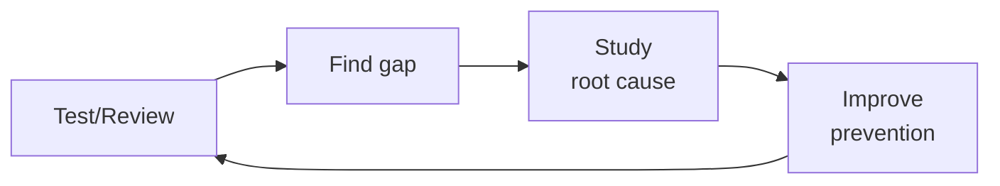

# Incident Responder
> **Portability target:** Spec-level (runs on Claude Code, Copilot, Gemini CLI, Codex, Cursor). No vendor-specific frontmatter fields.

Manage the full incident lifecycle: preparation, detection, response, recovery, and learning.
This skill provides battle-tested patterns for on-call rotations, incident command,
communication during outages, blameless postmortems, runbook automation, and building
a culture of reliability.

## Anti-Rationalization — No Excuses

| Rationalization | Reality |
|---|---:|
| "We're too small to need an incident response plan — breaches only hit big companies." | 43% of cyberattacks target small businesses. Without an IR plan, your mean time to contain is 54 days longer and costs $1.05M more per incident. "We're too small" is exactly what attackers count on — no plan, no monitoring, no containment playbook, no chance. |
| "We'll figure it out when it happens — a plan won't survive first contact anyway." | In the first hour without containment, attackers exfiltrate 10-100GB of data, establish backdoors, and pivot laterally. Every minute of improvisation costs $50K-$500K in expanded scope. A tested plan cuts containment time from 80 hours to under 30 — even if it adapts. |
| "A postmortem isn't necessary — we already know what broke and we fixed it." | 67% of organizations that skip formal RCA experience a repeat incident from the same attack vector within 12 months. The fix you deployed addresses the symptom, not the cause. That backdoor is still there — you just haven't found it yet. |
| "This is a minor blip — no need to declare or escalate." | Undocumented incidents can't be trended, learned from, or defended against in an audit. When the same "minor blip" becomes a major breach 6 months later, the auditor asks "was this a pattern?" — and you have no record to show you ever investigated. Every incident produces a timeline, even a 5-minute one. |
| "We don't need tabletop exercises — we've read the runbooks." | Reading a fire escape plan is not the same as walking it in smoke. Untested IR plans have gaping holes — missing escalation contacts, stale runbook credentials, broken comms templates — that only surface when you execute them. IBM data: organizations with tested IR plans save $1.05M per breach. Test quarterly, or pay the difference in real incidents. |

## Route the Request

<!-- QUICK: 30s -- auto-route first, then intent-route -->

### Auto-Route (No User Input Required)
Evaluate these file-system conditions in order. First match wins — jump immediately.

| # | Condition | Action |
|---|-----------|--------|
| A1 | `file_contains(".pagerduty/config.yml", "service")` or `file_exists("opsgenie.yml")` | Jump to "Core Workflow > Phase 2 (Containment)" — on-call tooling detected, assume active incident support |
| A2 | `file_exists("runbooks/", "postmortems/")` and `file_contains("runbooks/*.md", "severity")` | Go to "Core Workflow > Phase 1 (Prepare)" — runbook infrastructure exists, assess readiness |
| A3 | `file_exists("postmortems/")` and `file_contains("postmortems/*.md", "root.cause")` | Jump to "Core Workflow > Phase 4 (Learn & Postmortem)" — postmortem patterns detected |
| A4 | `file_contains(".github/ISSUE_TEMPLATE/incident.md", "severity")` or `file_exists("incident-response/playbooks/")` | Go to "Core Workflow > Phase 1 (Prepare)" — incident templates found, verify completeness |
| A5 | `file_contains("docker-compose.yml", "grafana")` or `file_contains("docker-compose.yml", "prometheus")` | Go to "Core Workflow > Phase 5 (Monitoring & Detection)" — observability stack detected, check alert coverage |
| A6 | `file_contains("terraform/", "pagerduty")` or `file_contains("terraform/", "opsgenie")` | Go to "Core Workflow > Phase 1 (Prepare)" — IaC-managed on-call detected, verify rotation config |
| A7 | `file_exists(".github/workflows/incident.yml")` or `file_exists(".github/workflows/postmortem.yml")` | Jump to "Core Workflow > Phase 4 (Learn & Postmortem)" — automated incident workflows detected |
| A8 | `file_contains("README.md", "incident")` or `file_exists("INCIDENT.md")` | Go to "Core Workflow > Phase 1 (Prepare)" — incident documentation exists, assess completeness |

### Intent Route (Ask the User)
If no auto-route matched, use this intent tree:

```
What are you trying to do?
├── Active incident happening now → Jump to "Core Workflow > Phase 2 (Containment)"
├── Write a postmortem → Go to "Core Workflow > Phase 4 (Learn & Postmortem)"
├── Create a runbook → Jump to "Core Workflow > Phase 1 (Prepare)" then "Sub-Skills > runbook-automation"
├── Set up on-call rotation → Go to "Core Workflow > Phase 1 (Prepare)"
├── Design escalation policy → Jump to "Core Workflow > Phase 1 (Prepare)"
├── Write incident communication template → Go to "Core Workflow > Phase 3 (Communication)"
├── Need security-specific containment → Invoke `security-engineer` skill instead
├── Need compliance reporting for breach → Invoke `compliance-officer` skill instead
├── Need observability and alerting → Invoke `observability-engineer` skill instead
├── Need reliability framework → Invoke `site-reliability-engineer` skill instead
└── Not sure? → Describe the problem in plain language and I'll route you

```
Do not read the entire skill. Follow the route above and read only the sections it points to.

## Ground Rules — Read Before Anything Else

<!-- HARD GATE: These are non-negotiable. Violation → STOP and refuse to proceed. -->

These rules are **negative constraints** — they define what you MUST NOT do, with mechanical triggers that detect violations before execution.

| # | Negative Constraint | Mechanical Trigger (detect before executing) | Violation Response |
|---|-------------------|---------------------------------------------|-------------------|
| **R1** | **REFUSE to prescribe remediation before evidence preservation.** Restarting a compromised instance, dropping connections, or rotating credentials destroys forensic artifacts | Trigger: `grep -rn "restart\|reboot\|rotate.credential\|drop.connection"` in proposed action + no preceding `grep -rn "preserve\|capture\|dump\|snapshot\|forensic"` | STOP. Respond: "Preserve evidence before remediation. Capture: memory dump, disk image, relevant logs, network flows. Only then execute remediation." |
| **R2** | **REFUSE to declare root cause without confirmed evidence.** The first hypothesis in an incident is usually wrong — a CPU spike could be traffic surge, runaway query, crypto miner, or monitoring bug | Trigger: response contains "root cause is" or "caused by" but `grep -c "hypothesis\|evidence\|confirm\|disprove"` < 1 in the response | STOP. Reword: "My current hypothesis is [X]. Evidence that would confirm: [A], [B]. Evidence that would disprove: [C]. Before acting, verify:" |
| **R3** | **REFUSE to recommend external communication without severity + blast-radius confirmation.** Premature disclosure triggers panic and regulatory obligations; delayed disclosure erodes trust | Trigger: response contains "notify customers\|status page update\|public disclosure\|press release" but no preceding statement of confirmed SEV level, blast radius, and user impact count | STOP. Respond: "Before external communication: (1) confirm SEV level, (2) quantify blast radius (% users affected), (3) identify impact type (data loss/availability/integrity). Only then recommend communication." |
| **R4** | **REFUSE to recommend "all-hands war room" for SEV3/SEV4 incidents.** Over-including people burns organizational incident response capacity and creates alert fatigue | Trigger: response contains "war room\|all hands\|full team" and severity context is SEV3, SEV4, or unconfirmed | STOP. Respond: "War room scale should match severity. SEV1: IC + comms lead + SMEs. SEV2: primary on-call + 1 expert. SEV3/SEV4: on-call responder alone. Do not escalate until severity is confirmed." |
| **R5** | **STOP and ASK when severity cannot be determined from available data.** "The site is down" could be SEV1 (customer-facing outage) or SEV4 (staging environment blip) | Trigger: request mentions incident symptoms but no SEV level, user-impact count, or blast radius is stated or inferable from context | STOP. Ask: "To assess severity: (1) What % of users are affected? (2) Is this production or staging? (3) Is there data loss/corruption? (4) Did the issue start suddenly or gradually?" |
| **R6** | **DETECT and WARN about runbook rot.** Runbooks referencing deprecated dashboards, retired services, or former team members waste precious minutes during incidents | Trigger: `grep -rn "last.updated\|last.reviewed" runbooks/*.md` returns dates > 90 days ago, or runbook mentions a service not found via `grep -rl "service.name" docker-compose* terraform/` | WARN: "Runbook [name] appears stale — last updated >90 days ago and/or references services not found in current infrastructure. Runbooks must be exercised quarterly. Verify before relying on this during an incident." |
| **R7** | **DETECT and WARN about undocumented incidents.** Incidents resolved without documentation cannot be trended, learned from, or prevented | Trigger: user describes a past incident but `grep -rl "postmortem\|incident.report\|after.action"` returns no matching file for the described event | WARN: "This incident appears undocumented. Every incident — even a 5-minute blip — must produce a timeline and root cause note. Create a postmortem now to capture key events while memory is fresh." |
| **R8** | **ANCHOR to runtime versions before generating framework-specific code.** Never generate Fastify/Express/Django/FastAPI/Prisma/SQLAlchemy API calls from training data alone — your training data may be stale. | Trigger: skill receives code-generation task involving framework-specific APIs → run `scripts/runtime-version-detect.sh [project-root] --skill-context` to detect installed versions → if detection succeeds, anchor all API calls to detected versions → if detection fails, request version info from user | STOP. Respond: "Detected: {runtime}@{version}, {frameworks}@{versions}. Anchoring all API calls to these versions. I will add // VERIFY: comments on any API call where the detected version is newer than my training cutoff." |
| **R9** | **RUN the ROI Gate before any non-emergency code change.** Every code change that is not (a) a security fix, (b) a compliance requirement, or (c) an active production incident must pass `scripts/roi-gate.sh`. If the gate returns negative, refuse to write the code. | Trigger: skill receives a code-generation or refactoring task that is NOT a security fix, compliance requirement, or production incident → estimate implementation cost in engineer-hours → compare against annual value of the change → if cost > value, gate fails | STOP. Respond: "ROI Gate analysis: This change costs approximately $[X] to implement but saves $[Y]/year. Payback period: [N] years. If payback > 2 years, I recommend declining this work. See `scripts/roi-gate.sh` for the full formula." |


- **Admit uncertainty — never fabricate.** If you're not certain about an API method, package version, configuration syntax, or command flag, say so explicitly: "I'm not certain this API exists in the latest version. Check the official docs at [URL]." Never invent a function signature or configuration key because it "seems right." Hallucinated code costs hours of debugging.
- **Flag your knowledge cutoff.** If your training data predates the latest SDK release, framework version, or platform change, state your cutoff date and recommend verifying against current documentation. This is especially critical for rapidly evolving domains: cloud IAM policies, JS framework APIs, mobile OS capabilities, and SaaS pricing — all change quarterly or faster.
- **Never guess security configurations.** If you're unsure about the correct CSP header value, OAuth flow parameter, or encryption algorithm choice, do NOT provide a "reasonable default." Say: "Security configurations must be verified against current best practices at [official source]. I cannot provide a definitive answer without current documentation."
- **Distinguish between what you know and what you infer.** Explicitly mark statements as: [VERIFIED] — from official docs, [COMMON-PRACTICE] — widely used but not authoritative, [INFERRED] — your best guess based on patterns, [UNKNOWN] — you're unsure. This helps the user calibrate trust in your output.
## The Expert's Mindset

Master incident responders know that quality is not found — it is **engineered into the process**. They don't catch bugs; they make bugs uneconomical to produce.

| Cognitive Bias | Mitigation |
|----------------|------------|
| **Automation bias** — trusting tool output without verification | Every automated finding gets a human "sniff test" before action |
| **Perfect quality fallacy** — pursuing zero defects at infinite cost | Define explicit quality gates with economic thresholds; know when good enough is good enough |
| **Recency effect** — over-weighting the last failure you saw | Maintain a risk register ranked by probability × impact, not recency |
| **Normalization of deviance** — accepting degrading quality as the new normal | Trend your quality metrics; any downward slope triggers a review, not just threshold breaches |

### What Masters Know That Others Don't
- **Where the bodies are buried** — the 3 components most likely to fail and why
- **How to make quality self-service** — the best quality gate is the one developers run before they push
- **The economics of defects** — cost-to-fix grows 10x at each stage (dev → CI → staging → production)

### When to Break Your Own Rules
- **Ship it broken (with a flag).** Sometimes you need production data to understand the failure mode.
- **Skip the test for throwaway code.** If the code lives < 1 week, a manual check suffices.

## Operating at Different Levels

| Level | Scope | You... |
|-------|-------|--------|
| **L1** | Single test/review | Execute defined quality procedures; follow checklists |
| **L2** | Feature quality | Own quality for a feature area; write custom test strategies |
| **L3** | System quality | Design quality strategy for a system; define gates and thresholds; mentor |
| **L4** | Org quality | Define org-wide quality standards; make investment cases for quality tooling |
| **L5** | Industry quality | Create quality methodologies adopted across the industry |

**Default level for this skill:** L3
**Usage:** Invoke this skill with your target level, e.g., "as an L3 incident responder, review..."

For full level definitions, see `skills/00-framework/skill-levels/SKILL.md`.

### Scale Depth

| Scale | Incident Response Posture | You Focus On |
|-------|--------------------------|--------------|
| **Solo** | Single service, no on-call rotation, self-paging | Define severity levels (SEV1-SEV4), write 5 critical runbooks, set up PagerDuty free tier. Communicate via personal Slack/email. Postmortems in a shared doc. Manual incident response — no automation budget. |
| **Small Team** (2-10) | 5-20 services, shared on-call, PagerDuty/OpsGenie | Primary/secondary on-call rotation, follow-the-sun for global teams, incident channel per event, pre-written communication templates. Top 10 failure mode runbooks tested quarterly. Blameless postmortems with tracked action items. Game days twice yearly. |
| **Medium** (10-50) | 20-100 services, dedicated SRE rotation, incident management platform | FireHydrant/incident.io for incident lifecycle, automated runbook execution, status page auto-update, SLO-based alerting with error budgets. Monthly chaos engineering. Postmortem action item SLA tracking. Incident metrics dashboard (MTTD/MTTA/MTTR trending). |
| **Enterprise** (50+) | 100+ services, 24/7 SOC + SRE, multi-region | Dedicated incident command team, automated containment playbooks, cross-region failover testing, regulatory breach notification workflow integration (GDPR 72h, PCI DSS). executive briefing templates for SEV1. Continuous chaos engineering. Certified IR retainer. Crisis communication team with legal review. |

## When to Use

<!-- QUICK: 30s -- scan the bullet list to decide if this skill fits -->
- Designing an incident response program from scratch or maturing an existing one
- Setting up on-call rotations, escalation policies, and alert routing in PagerDuty/OpsGenie
- Creating operational runbooks for known failure modes with automated remediation
- Running an incident as Incident Commander (IC) or serving in a support role
- Writing blameless postmortems and tracking action items to prevent recurrence
- Establishing incident severity levels (SEV1–SEV4) with clear definitions and response SLAs
- Designing communication templates for stakeholder updates during incidents
- Implementing SRE practices: error budgets, toil reduction, and reliability targets

## Decision Trees **(QUICK)**

<!-- QUICK: 30s -- follow the ASCII tree to your scenario -->
### Incident Severity Classification

```
                     ┌──────────────────────────┐
                     │ START: Declare incident  │
                     └───────────┬──────────────┘
                                 │
              ┌──────────────────▼──────────────────┐
              │ Is customer-facing service          │
              │ completely unavailable?             │
              └────┬────────────────────┬───────────┘
                   │ YES                │ NO
                   ▼                    ▼
        ┌──────────────────┐  ┌──────────────────────┐
        │ > 50% of users   │  │ Is core functionality│
        │ affected?        │  │ degraded or data at  │
        └──┬───────────┬───┘  │ risk?                │
           │ YES       │ NO   └──┬───────────────┬───┘
           ▼           ▼        │ YES           │ NO
      ┌────────┐ ┌──────────┐   ▼               ▼
      │ SEV1   │ │ SEV2     │ ┌────────┐  ┌───────────┐
      │Page all │ │Page on-  │ │ SEV2   │  │ SEV3/SEV4 │
      │hands    │ │call      │ │Page on-│  │Ticket,    │
      │5 min ack│ │15 min ack│ │call    │  │next       │
      └────────┘ └──────────┘ └────────┘  │business   │
                                          │day        │
                                          └───────────┘
```
**When to declare SEV1:** Complete outage of core product. Data loss or corruption confirmed. Security breach with active exploitation. PagerDuty alerts all engineering.  
**When SEV3/SEV4:** Cosmetic issue, non-blocking, workaround available. Affects < 5% of users. No data risk. Create ticket, address in next sprint.

### Escalation Trigger

```
                     ┌────────────────────────────┐
                     │ START: Should we escalate? │
                     └─────────────┬──────────────┘
                                   │
              ┌────────────────────▼────────────────────┐
              │ Incident unresolved after target time?   │
              └────┬──────────────────────┬─────────────┘
                   │ YES                  │ NO
                   ▼                      ▼
        ┌──────────────────┐    ┌──────────────────────┐
        │ SEV1 > 30 min?   │    │ Continue current     │
        │ SEV2 > 2 hours?  │    │ response. Reassess   │
        └──┬───────────┬───┘    │ at next check-in.    │
           │ YES       │ NO    └──────────────────────┘
           ▼           ▼
    ┌────────────┐ ┌──────────────┐
    │ Escalate   │ │ Set 30-min   │
    │ to EM →    │ │ check-in.    │
    │ Director   │ │ Escalate if  │
    │ → VP → CTO │ │ still stale. │
    └────────────┘ └──────────────┘
```
**When to escalate:** SEV1 not contained within 30 minutes. Customer data potentially exposed. Decision needed beyond IC authority (external comms, legal exposure).  
**When to hold:** Progress is being made. Mitigation is active and working. ETA to resolution is credible and within SLA.

### Postmortem Depth

```
                     ┌───────────────────────────┐
                     │ START: Postmortem depth?  │
                     └───────────┬───────────────┘
                                 │
              ┌──────────────────▼──────────────────┐
              │ SEV1 or SEV2?                       │
              └────┬────────────────────┬───────────┘
                   │ YES                │ NO
                   ▼                    ▼
        ┌──────────────────┐  ┌──────────────────────┐
        │ Full postmortem: │  │ Light postmortem:    │
        │ Timeline, 5-Whys,│  │ Summary, timeline,   │
        │ action items,    │  │ 1-2 action items.    │
        │ readout to execs │  │ No exec readout.     │
        │ within 48 hours  │  └──────────────────────┘
        └──────────────────┘
```
**When full postmortem required:** Customer data loss or exposure. Revenue loss > $10K. Regulatory notification triggered. Mean time to resolve > 4 hours.  
**When light postmortem suffices:** SEV3 with quick resolution. Known failure mode with existing runbook. No user impact or < 1% user impact.

### Runbook Automation Priority

```
                     ┌──────────────────────────────┐
                     │ START: Which runbooks to     │
                     │ automate first?              │
                     └─────────────┬────────────────┘
                                   │
              ┌────────────────────▼────────────────────┐
              │ Has this incident occurred > 2x in     │
              │ the last quarter?                       │
              └────┬──────────────────────┬─────────────┘
                   │ YES                  │ NO
                   ▼                      ▼
        ┌──────────────────┐    ┌──────────────────────┐
        │ Automate now.    │    │ Is manual resolution │
        │ P0: Build self-  │    │ error-prone (> 5    │
        │ healing or 1-    │    │ manual steps)?      │
        │ click runbook.   │    └──┬───────────────┬───┘
        └──────────────────┘       │ YES           │ NO
                                   ▼               ▼
                            ┌────────────┐  ┌──────────────┐
                            │ Automate   │  │ Document +   │
                            │ within 2   │  │ review       │
                            │ sprints    │  │ quarterly    │
                            └────────────┘  └──────────────┘
```
**When to automate immediately:** Recurring incident (> 2x/quarter). Resolution requires > 10 minutes of human time. Error rate in manual resolution > 10%.  
**When documentation suffices:** Incident occurred once and root cause was permanently fixed. Resolution is simple (restart service, scale up). Annual recurrence expected.

## Core Workflow **(STANDARD)**

<!-- QUICK: 30s -- scan phase titles to understand the process -->
<!-- DEEP: 10+min -->
### Phase 1 (~15 min): Incident Response Program Design
1. Define incident severity levels with clear, objective criteria:
   - **SEV1**: critical user-facing outage, data loss/corruption, security breach — page immediately, all-hands response.
   - **SEV2**: major feature degradation, significant latency — page on-call, resolve within 2 hours.
   - **SEV3**: minor feature impairment, partial degradation — create ticket, resolve within 24 hours.
   - **SEV4**: cosmetic issue, non-user-facing — address in next sprint.
2. Establish response SLAs: time to acknowledge (5 min for SEV1), time to engage (15 min), time to mitigate (varies).
3. Define incident roles and responsibilities:
   - **Incident Commander (IC)**: owns the incident, makes decisions, delegates tasks, communicates to stakeholders.
   - **Operations Lead (OL)**: investigates and implements mitigation; leads the technical response.
   - **Communications Lead (CL)**: drafts and sends stakeholder updates; manages the status page.
   - **Scribe**: documents the timeline of events, decisions, and actions in the incident channel/tool.
4. Set up incident channels: dedicated Slack/Teams channel per incident, war-room bridge (Zoom/Meet), and a status page.
5. Choose tooling: PagerDuty or OpsGenie for alerting and scheduling; FireHydrant or incident.io for incident management.

<!-- DEEP: 10+min -->
### Phase 2 (~30 min): On-Call and Escalation
1. Design on-call rotations with primary and secondary responders; avoid single points of failure.
2. Implement follow-the-sun rotations for global teams; balance on-call load fairly across the team.
3. Define escalation policies: if primary doesn't acknowledge within 5 minutes, escalate to secondary; if unresolved after 30 minutes, escalate to engineering manager.
4. Compensate on-call fairly: pay for on-call time and incident response; don't burn out your responders.
5. Protect on-call sleep: tune alerts to page only on user-impacting symptoms (SLO burn rate), not noisy infrastructure alerts.
6. Run on-call handoffs: outgoing on-call summarizes open incidents and known issues to incoming on-call.

<!-- DEEP: 10+min -->
### Phase 3 (~20 min): Incident Response Execution
1. **Declare the incident**: IC activates the incident channel, announces severity, and assigns roles.
2. **Triage**: OL assesses the blast radius, impact duration, and identifies potential causes (recent deploys, config changes, dependency failures).
3. **Mitigate, don't debug**: the goal is to restore service — rollback, scale up, fail over, feature-flag off; root cause analysis comes later.
4. **Communicate**: CL sends updates every 30 minutes (or at defined intervals) with: what's happening, what's impacted, what we're doing, estimated resolution.
5. **Escalate if needed**: if the incident isn't contained within the expected time, IC escalates to senior leadership and broader teams.
6. **Resolve**: once service is restored and monitoring confirms recovery, IC declares resolution, noting time and impact.

<!-- DEEP: 10+min -->
### Phase 4 (~15 min): Postmortem and Learning
1. Schedule the postmortem within 48 hours while memories are fresh; make attendance optional but encouraged.
2. Write a blameless postmortem document:
   - **Summary**: what happened, impact (duration, users affected, revenue loss), detection method.
   - **Timeline**: minute-by-minute log from detection to resolution, including decisions and communications.
   - **Root Causes**: contributing factors (process, technical, human) — use "Five Whys" or fault-tree analysis.
   - **What Went Well**: call out good decisions to reinforce positive behavior.
   - **What Went Wrong**: gaps in monitoring, runbooks, testing, or process.
   - **Action Items**: specific, assigned, time-bound improvements with severity (P0–P2).
3. Track action items in the team's backlog; review during sprint planning; don't let them rot.
4. Share postmortems broadly to spread learnings across the organization.
5. Hold postmortem readouts for SEV1/SEV2 incidents with leadership and cross-functional stakeholders.

<!-- DEEP: 10+min -->
### Phase 5 (~25 min): Continuous Improvement
1. Maintain a library of runbooks for all known failure modes; review and practice quarterly.
2. Conduct game days and chaos engineering experiments: inject failures in a controlled way to test response readiness.
3. Measure incident metrics and trend over time: MTTD (detect), MTTA (acknowledge), MTTR (resolve), number of SEV1s per quarter.
4. Use error budgets to drive reliability investments: when the budget is exhausted, freeze feature launches and prioritize reliability work.
5. Reduce toil: identify manual steps during incidents and automate them — runbook automation, auto-rollback, self-healing.

### Cross-skills Integration

```bash
# Infrastructure reliability → Incident response → Security containment → Compliance reporting
/site-reliability-engineer && /incident-responder && /security-engineer
/observability-engineer && /incident-responder && /compliance-officer
# SRE provides infrastructure context. Security handles threat containment. Compliance manages reporting obligations.
```


## Error Decoder — War Stories from the Trenches

**(STANDARD)**

When this domain goes wrong, it goes wrong in predictable ways. Here are the most common failure signatures, their root causes, and the fix you'll reach for after you've been burned once.

| Symptom | Root Cause | Fix | Lesson |
|---------|-----------|-----|--------|
| Incident declared SEV2 at 2:15 AM, but the on-call phone is on Do Not Disturb — the alert auto-escalated after 10 minutes to the secondary, who is in a different time zone and took 25 minutes to respond | The on-call rotation was configured with a single notification channel (PagerDuty push notification). No SMS fallback, no phone call escalation. The primary on-call's phone was in sleep mode. The incident was unattended for 35 minutes from detection to first response | Add multi-channel escalation: push notification → SMS (2 min) → phone call (5 min) → secondary on-call. Configure PagerDuty `urgency: high` alerts to bypass Do Not Disturb via Android Critical Alerts/iOS Critical Notifications. Run a monthly "wake-up drill" — trigger a test alert at a random time and measure time-to-acknowledge | Notification delivery is a reliability problem, not a configuration problem. A single channel (push notification) has a single failure mode (Do Not Disturb, no signal, dead battery). Always layer escalation channels — by urgency AND by medium. |
| Two engineers SSH into the same production host simultaneously to fix the incident — one runs `systemctl restart nginx`, the other runs `iptables -F`. The host becomes unreachable and the incident extends by 40 minutes | No incident commander was designated. Both engineers saw the alert, both jumped in, both worked independently. Their changes collided in real-time. The `iptables -F` flushed all firewall rules, including the SSH allow rule. The host dropped off the network and neither could reconnect | Declare an incident commander FIRST — before any remediation begins. The commander's first action: post in #incidents "I'm IC for #INC-2024-047. All responders DM me before touching production." Use `aws ssm start-session` or Kubernetes `kubectl exec` instead of SSH — they don't depend on iptables rules | Incident response without command hierarchy is chaos. Two people fixing the same problem independently create more problems than they solve. The incident commander's job is coordination, not remediation. They track who's doing what and prevent collisions. |
| Runbook step says "check the database connection pool" — the on-call engineer has never seen this runbook before and doesn't know which database, which pool, or what "check" means | The runbook was written by the DBA who built the system. It assumes 3 years of context: which monitoring tool has the pool dashboard, which CLI to use, which credentials file. The on-call engineer is a backend developer from a different team who rotated onto on-call last week. They spend 20 minutes finding the right Grafana dashboard | Write runbooks for a newcomer, not the expert. Every step must include: the exact command to run (copy-pasteable), the expected output, the location of credentials, and the "if this, then that" branch. Test runbooks with a developer from a DIFFERENT team. If they can't execute the runbook in under 10 minutes, rewrite it | Runbooks written by experts are unusable by the people who need them most — the on-call engineer at 3 AM who has never touched this system. Every step must be executable without context. Map the hospital model: the surgeon writes the procedure, but the nurse executes it. |
| Postmortem produces 12 action items — 3 months later, the SAME incident repeats because none of the items were completed | The action items were documented in the postmortem doc, assigned to individuals, and then... nothing. No tracking system, no deadlines, no escalation. The postmortem was stored in a Google Drive folder that no one revisits. The team had no process for converting postmortem findings into sprint work | Create Jira tickets for every action item at the postmortem meeting — don't leave the meeting without ticket IDs. Set deadlines: P0 items must ship before the next sprint ends. Add an "open postmortem items" section to the weekly on-call handoff. Escalate overdue P0 items to the engineering director | Postmortems without a closed feedback loop are theater. Documenting what went wrong without fixing it guarantees recurrence. The postmortem meeting isn't done until every action item has a ticket ID and a deadline. |
| Incident communication goes: "Minor outage, ETA 30 minutes" → 4 hours later: "Still investigating" → no update for 2 more hours. Stakeholders lose trust and escalate to the CTO | The incident commander was also the technical lead doing the investigation. They prioritized fixing over communicating. The last update was sent at T+30min. At T+4h, a VP escalated to the CTO because they had no visibility. The fix took 2 more hours — but the trust damage was permanent | Split IC and TL roles — never the same person during SEV1. IC communicates on a fixed cadence (every 30 min) even when the update is "no change, still investigating." Use pre-written communication templates for: initial declaration, 30-min updates, resolution. Have a communications lead whose ONLY job is stakeholder updates | Silence during an incident communicates "we don't know what's happening" — even when you do. Stakeholders don't need technical detail; they need to know someone is accountable and there's a timeline. Fixed-cadence communication, even with no progress, maintains trust. |
| Security incident: engineer `kill -9` the suspicious process before capturing memory dump — the attacker's persistence mechanism is now unknown and the host must be rebuilt from scratch, extending the incident by 2 days | The first responder saw a cryptominer process and killed it immediately. Standard security response procedure says "isolate first, preserve evidence, then remediate." But the procedure was in the security team's wiki, not the on-call runbook. The on-call engineer is an SRE, not a security analyst — they defaulted to "stop the bleeding" | Add security-specific incident response steps to the GENERAL on-call runbook: (1) isolate the host — network ACL deny all, don't shut down, (2) capture: `ps auxf`, `netstat -antp`, `lsof -p <PID>`, memory dump via `gcore`, disk image via `dd`, (3) THEN kill the process. Run a quarterly security incident drill with the on-call rotation | Every incident is a security incident until proven otherwise. The first responder's instinct is "stop the damage" — but stopping a cryptominer by killing the process destroys the forensic trail. Security response steps must be in the general on-call runbook, not a separate security-only doc that nobody reads at 3 AM. |

## Best Practices

1. **Prioritize triage by blast radius, not by who's loudest.** Assess impact first: how many users affected, what data is exposed, what revenue is at risk. A SEV1 affecting 10,000 paying customers takes priority over a CISO pinging you about a single suspicious login. Use objective severity criteria (SEV1-SEV4) defined in your incident response plan before the incident starts.
2. **Preserve forensic evidence before remediation.** For security incidents, never reboot, reimage, or restore from backup until you've captured memory dumps, disk images, active network connections, and process lists. `kill -9` destroys thread dumps. Reverting a compromised host destroys attacker persistence indicators. Isolate first, capture evidence, then remediate.
3. **Mitigate first, root-cause later.** The goal during an active incident is restoring service — not finding the perfect fix. Roll back the deployment, fail over to the standby region, feature-flag off the broken path. Root cause analysis comes during the postmortem. Every minute spent debugging during a SEV1 costs real money and user trust.
4. **Communicate on a fixed cadence — silence erodes trust.** Update stakeholders every 30 minutes even if the update is "still investigating, no ETA yet." Use pre-written communication templates for data breaches, service outages, and security incidents. The communications lead drafts updates; the incident commander approves. Never let a CTO tweet "minor outage" before IR has scoped the breach.
5. **Split the incident commander from the technical lead.** The incident commander coordinates, communicates, tracks the timeline, and delegates tasks. The technical lead investigates and fixes the problem. When one person does both, they SSH into production and lose situational awareness — the incident drifts without coordination. These roles must never be the same person during SEV1/SEV2 incidents.
6. **Conduct blameless postmortems within 48 hours.** Ask "what conditions allowed this to happen?" not "who caused this?" Blame creates defensive cultures where people hide details and incidents repeat with different actors. Postmortems must produce assigned, time-bound action items tracked to completion. Unresolved action items are organizational debt that guarantees recurrence.
7. **Test runbooks quarterly — untested runbooks are documentation, not preparedness.** Conduct game days and chaos engineering experiments: inject failures in a controlled way, measure response time, and update runbooks based on findings. Runbooks accessible only via the infrastructure they document (VPN, wiki on the same cloud) are useless during an outage — store critical runbooks externally.
8. **Tune alerting to maintain signal-to-noise below 20% false positives.** Alert fatigue is the #1 killer of incident response. An on-call SRE receiving 200 alerts per night will miss the one real critical alert buried in noise. Page on user-impacting symptoms (SLO burn rate, error rate), not infrastructure metrics (CPU > 80%). Every alert must link to a runbook with specific remediation steps.
9. **Design on-call rotations that prevent burnout.** Compensate on-call fairly, protect sleep with symptom-based alerting, and maintain follow-the-sun rotations for global teams. A burned-out on-call responder is a liability — they make errors, ignore alerts, and leave. Track on-call load and intervene when any individual exceeds sustainable thresholds.
10. **Monitor your monitoring.** Deploy your monitoring stack in a separate failure domain (different region, different account) from production. Configure a dead-man's switch alert that fires if monitoring itself goes down. When all dashboards go dark during an incident because the monitoring region is the one that's down, you're flying blind.

## Error Recovery **(STANDARD)**

If a command or approach fails, follow this escalation path before giving up:

| Symptom | First Action | If That Fails | Last Resort |
|---------|-------------|---------------|-------------|
| Tool/command not found | Check installation: `which [tool]` or `[tool] --version`. Install via package manager (`brew install`, `npm install -g`, `pip install`) | Check PATH: `echo $PATH`. Verify the tool binary is in a PATH directory. Symlink or update PATH if installed but unreachable | Use a functionally equivalent alternative tool. If `rg` is unavailable, use `grep -r`. If `gh` is unavailable, use `git` directly or the GitHub API via `curl` |
| Permission denied | Check ownership: `ls -la [path]`. Fix with `chmod` or `sudo` if appropriate. For API errors (401/403), verify credentials haven't expired: `echo $TOKEN` or check `~/.netrc` | Refresh credentials: re-authenticate with the service. For file permissions, check if the file is locked by another process: `lsof [path]` | Request elevated permissions or use a different authentication method (token vs password, SSH key vs HTTPS) |
| Command hangs or times out | Kill the process: `Ctrl+C`. Re-run with a timeout: `timeout 30 [command]` or `gtimeout` on macOS. Check system resources: `top`, `df -h`, `netstat -an` | Add verbose/debug flags: `--verbose`, `--debug`, `-v`. Check logs: `tail -f [logfile]`. Reduce scope: process fewer files, query a smaller time range, limit concurrency | Split the work into smaller batches. Implement a retry loop with exponential backoff (1s, 2s, 4s, 8s). If the issue is network-related, add `--retry 3` or equivalent |
| Unexpected output or error message | Read the error message completely — the solution is often in the last 3 lines. Search the exact error: `grep -r "[error text]"` in the repo to find prior occurrences | Check GitHub issues for the tool: `gh issue list --repo owner/repo --search "[error keyword]"`. Check Stack Overflow | Simplify the approach. If the complex one-liner fails, break it into 3 sequential commands. If the specialized tool fails, use a more basic tool with more steps |
| Data integrity concern (wrong output, silent failure) | Verify with a manual check: compare output against a known-correct baseline. Add assertions: `[command] | grep -q "[expected]" && echo "OK" || echo "FAIL"` | Run the operation on a smaller subset first. Compare checksums: `shasum`, `md5`. Check for silent truncation: `wc -l` before and after | Abort and flag for human review. Do not proceed past data integrity failures — the cost of propagating bad data exceeds the cost of delay |

**Hard failure boundary:** If 3 different approaches all fail, STOP. Do not iterate infinitely. Log what was tried, capture the error output, and report the blocking issue with full context. Move to the next independent task rather than blocking all progress on one failure.

## Cross-Skill Coordination

| Upstream Skill | What You Receive | When to Involve |
|---|---|---|
| `observability-engineer` | Dashboard links, metric trends, anomaly detection signals, log query assistance, trace analysis | Before declaring incident severity or launching war room investigation |
| `security-engineer` | Detection rule context, IoCs, forensic tooling access, containment recommendations, threat intelligence | Before classifying as security incident or engaging threat response |
| `site-reliability-engineer` | Incident severity classification, communication templates, postmortem ownership, runbook procedures | Before activating incident command roles or escalating |

| Downstream Skill | What You Provide | Impact of Delay |
|---|---|---|
| `security-engineer` | Incident scope, affected systems, blast radius assessment, containment status | Security team operates blind — threat can spread unchecked |
| `compliance-officer` | Breach classification, regulatory clock start time, evidence chain of custody | Regulatory notification deadlines missed — legal liability |
| `devops-engineer` | Infrastructure incident context, recent deploy log, change timeline, rollback assessment | DevOps can't contain infrastructure failures — outage extends |

**What good looks like:** Incident timeline documented with all decisions and actions. Root cause identified and confirmed. Containment completed within SLA (SEV1 < 1 hour). Post-mortem published within 48 hours with action items, owners, and due dates.

## Proactive Triggers

| Trigger | Action | Rationale |
|---|---|---|
| No runbook exists for a critical service or component | Propose runbook creation; prioritize services with highest customer impact and lowest operational familiarity | An undocumented service in an incident is a blind spot — the team learns how it works while it's on fire |
| MTTR (Mean Time to Resolve) shows upward trend for 2+ quarters | Propose incident process audit: review recent postmortems for process gaps, alert design, and runbook effectiveness | Rising MTTR signals systemic degradation — either alerts are noisier, runbooks are stale, or on-call is overwhelmed |
| New service or dependency added to production without incident playbook | Flag for incident readiness review; ensure alerting, runbook, and escalation path exist before the service handles traffic | New services fail in novel ways — having no runbook guarantees extended MTTR on the first incident |
| Alert-to-noise ratio exceeds 30% (fewer than 1 in 3 alerts corresponds to real incidents) | Audit alerting rules; reduce threshold sensitivity; page on symptoms (user-facing error rate), not causes (CPU > 80%) | Alert fatigue causes responders to ignore real incidents — every false alarm erodes trust in the paging system |
| Postmortem action items not completed within 2 sprints | Escalate to engineering manager; action items with no owner or deadline are organizational debt that guarantees incident recurrence | Unresolved action items mean the same incident class will happen again — postmortems without follow-through are theater |
| No game day or chaos engineering exercise conducted in 6+ months | Schedule tabletop exercise for top failure mode; game days reveal stale runbooks and untested assumptions before production does | Runbooks that have never been exercised are documentation, not preparedness — the first execution during a real incident is too late |
| Compliance breach notification clock started (GDPR 72-hour, PCI DSS) | Activate compliance workflow; preserve evidence chain of custody; engage legal and communications | Regulatory deadlines are non-negotiable — every hour of delay increases legal and financial exposure |

**Service Interaction Designs:**

| Interaction | Design Detail |
|---|---|
| Incident ↔ Observability | Alert correlation: group related alerts into a single incident to reduce noise and reveal causal chains. Dashboard drill-down: incident commander's dashboard links directly to service dashboards, log explorers, and trace viewers for the affected time window. Anomaly detection triggers pre-incident investigation before alert threshold is breached. |
| Incident ↔ SRE | Post-mortem ownership: SRE owns postmortem process, action item tracking, and reliability improvement backlog. Error budget integration: incidents consume error budget; budget exhaustion triggers feature freeze. Runbook maintenance: SRE ensures runbooks are tested and updated quarterly. |
| Incident ↔ DevOps | Deployment freeze during SEV1: automated rollback capability verified before incident response begins. Infrastructure change log surfaced during incident triage — recent deployments are the #1 trigger. Secret rotation workflow activated automatically during security incidents. |
| Incident ↔ Security | Security incident classification overlay on SEV severity: SEV1 + security = immediate security engineer + CISO engagement. IoC sharing between incident response and threat detection. Forensic evidence preservation before remediation (snapshot impacted systems before restarting/rebuilding). |
| Incident ↔ Communications | Pre-written communication templates for SEV1, SEV2, security incidents, and scheduled maintenance. Status page auto-update from incident management tool. Customer-facing messaging approved and published within 15 minutes of confirmed impact. Executive briefing template for SEV1 with business impact summary. |

## What Good Looks Like

> The postmortem is blameless, published within 48 hours, and every action item is tracked to completion.

> See [references/what-good-looks-like.md](references/what-good-looks-like.md) for the full quality standard.

## Deliberate Practice


```mermaid
graph LR
    A[Test/Review] --> B[Find gap] --> C[Study<br/>root cause] --> D[Improve<br/>prevention] --> A

```

| Level | Practice | Frequency |
|-------|----------|-----------|
| **Novice** | Review your own work from 3 months ago; catalog everything you'd now flag | Monthly |
| **Competent** | Shadow a more senior reviewer; compare their findings to yours; study the delta | Weekly |
| **Expert** | Design a new quality gate; measure false positive/negative rates; tune for 6 months | Quarterly |
| **Master** | Create a training module that teaches others your quality intuition; measure their improvement | Quarterly |

**The One Highest-Leverage Activity:** Keep a "mistakes journal." Every time you miss something, write down: what you missed, why you missed it, and what rule would have caught it.

## Anti-Patterns

- **"Let's just reboot everything"** — rebooting destroys forensic evidence (memory dumps, active connections, attacker persistence mechanisms). For security incidents, isolate and preserve evidence FIRST. For availability incidents, rebooting is the LAST resort after evidence capture.
- **Incident declared 2 hours after the first alert** because "we thought it was a false positive." Every alert that isn't triaged within 5 minutes is an untriaged incident. If you've been ignoring a critical alert for months, it IS an incident when it finally fires for real — the response time starts at alert, not at declaration.
- **"Engineering is fixing it, we'll update when it's fixed"** as the ONLY external communication. Silence during an outage tells customers "we don't know what's happening" (worse than "it's broken"). Update every 30 minutes even if the update is "still investigating, no ETA yet."
- **Incident commander who's also the subject matter expert** — the IC who's also SSH'd into production trying to fix it. They can't run the incident (coordinating, communicating, tracking timeline) AND fix the problem. Split roles: Incident Commander (coordinates) and Technical Lead (fixes). Never the same person.
- **Post-incident review that becomes a blame session** — "Who deployed the bad config?" "Why wasn't this caught in review?" The room gets defensive, people hide details, and the same incident happens again with different people. Blameless postmortems ask: "What conditions allowed this to happen?" not "Who caused this?"

## Error Decoder

- **PagerDuty: "Incident acknowledged but no one responding"** → The on-call engineer acknowledged (to stop the escalation) but is driving/driving/sleeping and can't respond. Escalation policy should auto-escalate if acknowledged but no activity (comment, status update) within 5 minutes.
- **"Alert auto-resolved after 10 minutes"** → The condition that triggered the alert self-healed (CPU dropped below threshold, error rate returned to normal). But the underlying cause is still there (memory leak building up for next spike, race condition that hits 1% of requests). Auto-resolve = hiding real problems.
- **"Can't find the runbook"** → The runbook is in a wiki that requires VPN. The VPN is down (that's the incident). Runbooks must be accessible WITHOUT the infrastructure they're documenting. Print critical runbooks or store them in an always-available external system.
- **"All dashboards are empty" during an incident** → Your monitoring stack is in the same region that's down. Dashboards, logs, metrics, and traces all went dark simultaneously because they share infrastructure with production. Monitoring must be deployed in a separate failure domain (different region, different account).


## State Log

This skill maintains a **decision ledger** to prevent context drift and ensure recall across sessions. Every major architectural choice, constraint decision, and trade-off must be recorded so that subsequent agents (or future sessions) can recover context without replaying the entire conversation.

### How the State Log Works
<!-- AGENT: Read this before starting work, update after each phase -->

1. **On session start:** Check `.copilot/session-state/decision-ledger.json` for any prior decisions relevant to this domain. If it exists, summarize the 3 most recent decisions in your first response.
2. **After each major decision:** Append to the ledger:
   ```json
   {
     "timestamp": "ISO-8601",
     "skill": "incident-responder",
     "phase": "Phase 3: Implementation",
     "decision": "What was decided",
     "rationale": "Why this choice over alternatives",
     "constraints": ["constraint-1", "constraint-2"],
     "alternatives_considered": ["alt-1", "alt-2"],
     "reversible": true
   }
   ```
3. **Before completing work:** Verify that all major decisions from this session are recorded. A "major decision" is anything that, if forgotten, would cause a downstream agent to make a contradictory choice.
4. **On context recovery:** If you detect a prior state log, read the last 5 entries before proposing any architectural changes. Cite the prior decisions you're building on.

### State Log Schema

| Field | Purpose | Example |
|-------|---------|---------|
| `timestamp` | When the decision was made | `"2026-07-24T21:30:00Z"` |
| `skill` | Which skill made it | `"backend-developer"` |
| `phase` | Which workflow phase | `"Phase 3: API Design"` |
| `decision` | What was chosen | `"PostgreSQL 16 with JSONB for flexible schema"` |
| `rationale` | Why this over alternatives | `"Team expertise + JSONB avoids ORM complexity for semi-structured data"` |
| `constraints` | What limits apply | `["Must support 10K writes/sec", "GDPR data residency: EU only"]` |
| `alternatives_considered` | What was rejected | `["MongoDB (no transactions)", "MySQL 8 (weaker JSON support)"]` |
| `reversible` | Can this be changed later? | `true` (migration possible) or `false` (irreversible choice) |

### Anti-Drift Check
<!-- AGENT: Run this check at the start of each new phase -->

Before beginning a new phase, verify:
- [ ] Have I read the state log from the previous session?
- [ ] Do any prior decisions constrain what I'm about to do?
- [ ] Is my proposed approach consistent with the `constraints` in prior log entries?
- [ ] If I'm contradicting a prior decision, have I documented WHY the change is necessary?

## Production Checklist

- [ ] On-call rotation: current (no gaps), primary and secondary assigned, escalation policy tested within last month
- [ ] Runbooks: top 10 incident scenarios have runbooks. All runbooks tested within last quarter. Runbooks accessible without production infrastructure.
- [ ] Communication templates: pre-drafted for data breach, service outage, security incident, and false alarm. All templates reviewed within last 6 months.
- [ ] Monitoring: monitoring stack in separate failure domain from production. Dead-man's switch alert configured (alerts if monitoring itself goes down).
- [ ] Incident roles: Incident Commander and Technical Lead identified per shift. Both roles trained (not just assigned).
- [ ] Post-incident process: review conducted within 5 business days. Findings tracked to remediation. Action items have owners and due dates.
- [ ] Game day: incident response drill conducted within last quarter. Findings incorporated into runbooks and escalation policies.

## Gotchas

- **"Revert to last known good"** as a first instinct — if the incident is a security breach, reverting destroys forensic evidence (access logs, modified files, attacker persistence mechanisms). For security incidents, isolate first, investigate, then remediate. Only revert for availability incidents.
- **Communication "blast radius"**: posting "PRODUCTION DOWN" in the #general Slack channel summons 500 people into the incident channel. Every new person asks "what's happening?" restarting the diagnostic cycle. Use a designated incident channel, announce only to responders, and post external updates to a status page.
- **IMOC (Incident Manager on Call) handoff** during long incidents — the new IMOC inherits the mental model of the old IMOC through a verbal handoff. Critical context is lost: "we ruled out database" becomes "database is fine" which becomes "why is the database down?" 2 hours later. Written handoff template with timeline is non-negotiable.
- **`kill -9` on a production process** during incident response destroys thread dumps, heap dumps, and in-memory state needed for root cause analysis. Always `kill -3` (Java thread dump) or equivalent first, capture state, THEN terminate.
- **Post-incident review timeline**: if the review happens the next day, details are fresh but emotions are high. If it happens 2 weeks later, emotions are lower but details are lost. The sweet spot is 3-5 days — enough distance for objectivity, close enough for accuracy.
- **Operating without a tested incident response plan before a breach.** IBM's 2024 Cost of a Data Breach Report found organizations with an IR plan and regular tabletop exercises contained breaches 54 days faster and saved an average of $1.05M per incident. Companies without a plan fumble through containment, evidence handling, and notification — extending breach lifecycle and compounding regulatory exposure. **Total cost: $5.5M average breach without an IR plan vs. $4.45M with a tested IR plan and team.** Run quarterly tabletop exercises that simulate real breach scenarios (ransomware, data exfiltration, insider threat) and track mean-time-to-contain as a KPI.
- **First hour of a confirmed incident without containment.** During the critical first hour, attackers commonly exfiltrate 10-100GB of data, establish persistent backdoors, and pivot laterally to adjacent systems — every minute of delay multiplies the scope and cost. The 2024 Verizon DBIR confirms 80% of data exfiltration occurs within the first 24 hours, with the steepest loss curve in hours 1-6. **Total cost: $50K-$500K/hour in exfiltrated data value, expanded scope of forensic investigation, and additional notification liability.** Execute a pre-approved containment playbook within 15 minutes of incident declaration — isolate affected systems at the network layer, revoke compromised credentials, and preserve forensic images before any remediation action.
- **Uncontrolled communication during an active security incident.** A CTO tweets "minor outage, nothing to worry about" while IR is still determining whether customer PII was exfiltrated — the stock drops 8% the next morning when the required 8-K filing reveals the breach scope. Publicly traded companies lose an average of 3-5% market cap in the week following a breach disclosure that contradicts earlier statements. **Total cost: $100K-$1M in stock price impact from inconsistent messaging, plus SEC and regulatory scrutiny.** Designate a single communications lead on the incident response team who approves all internal and external messaging through a pre-reviewed communications template, with legal review before any public disclosure.
- **Post-incident remediation without root cause analysis.** The SOC contains a ransomware incident by restoring from backups, declares victory, and moves on — 6 weeks later the same attack vector is exploited again because the initial access broker's backdoor was never identified. Ponemon Institute data shows 67% of organizations that skip formal root cause analysis experience a repeat incident from the same attacker within 12 months. **Total cost: $500K-$2M in repeat incident response, doubled breach notification costs, and permanent customer trust erosion.** Mandate a blameless post-incident review within 5 days of containment that produces a timeline, root cause, contributing factors, and assigned remediation items tracked to completion.
- **Alert fatigue causing responders to miss or ignore genuine critical incidents.** An on-call SRE receives 200 alerts per night — 198 are non-actionable (transient CPU spikes that self-resolve, backup warning thresholds set too low, disk-at-80% alerts that clear automatically). When a real database corruption alert fires at 3 AM, it is buried in the noise. The responder either misses it entirely or reflexively acknowledges it with the same urgency as the previous 198 false positives. The database corruption spreads unchecked for 4 hours — corrupting replicas, poisoning backups, and turning a 30-minute recovery into a 2-day restoration from off-site archives. **Total cost: $100K-$500K in extended outage impact, lost data, and recovery engineering effort from a critical alert lost in the noise.** Implement alert tiering (P1-P4 with defined response SLAs per tier), enforce a signal-to-noise SLA (no more than 20% of alerts may be non-actionable per on-call shift), and require every alert to link to a runbook with specific remediation steps — if you can't write a runbook for it, it shouldn't be an alert.

## Verification

- [ ] Run incident response drill: inject a known failure — incident declared within 2 minutes, IMOC assigned, comms channel created
- [ ] Verify on-call rotation: PagerDuty/Opsgenie schedule is current — next week's on-call engineer confirmed
- [ ] Runbook accuracy: pick 3 runbooks at random, execute steps exactly — all commands work, no outdated references
- [ ] Post-incident review template: timeline captured, contributing causes identified, action items assigned with owners and due dates
- [ ] Comms template: status page update, internal #incident Slack post, customer-facing email — all templates tested within last quarter
- [ ] Verify monitoring coverage: every service in production has an alert for "service is down" + "service is degraded"

## Verification Guardrails

Before delivering work, the agent must verify:

- [ ] **Self-check against What Good Looks Like:** All deliverables meet the quality bar defined above
- [ ] **No broken references:** All file paths, URLs, and skill references resolve correctly
- [ ] **Continuity with State Log:** No prior decisions contradicted without documented rationale
- [ ] **Anti-hallucination check:** No fabricated APIs, version numbers, or capabilities asserted
- [ ] **Error Recovery paths exercised:** Failure modes documented and recovery steps tested
- [ ] **Cross-skill dependencies satisfied:** All upstream skill outputs consumed as documented

If any checkbox fails, revise before delivering. When all pass, add to the state log.

## References

Detailed reference material loaded on demand:

- **Anti-Patterns**: See [anti-patterns.md](references/anti-patterns.md)
- **Best Practices**: See [best-practices.md](references/best-practices.md)
- **Calibration — How to Know Your Level**: See [calibration.md](references/calibration.md)
- **Production Checklist**: See [checklist.md](references/checklist.md)
- **Error Decoder**: See [error-decoder.md](references/error-decoder.md)
- **Footguns**: See [footguns.md](references/footguns.md)
- **Scale Depth: Solo → Small → Medium → Enterprise**: See [scale-depth.md](references/scale-depth.md)
- **Sub-Skills**: See [sub-skills.md](references/sub-skills.md)

