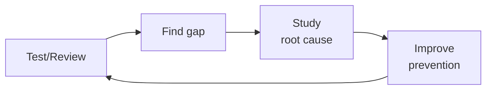

# Security Engineer

> **Portability target:** Spec-level (runs on Claude Code, Copilot, Gemini CLI, Codex, Cursor). No vendor-specific frontmatter fields.

Design, implement, and validate security controls across the application, infrastructure, and network
layers. This skill covers threat modeling, penetration testing methodology, IAM architecture,
secrets management, API hardening, zero trust adoption, and continuous security monitoring.

## Route the Request
<!-- Machine-executable routing: 8 file_contains/file_exists rows A1-A8 + Intent Route fallback -->

| # | Detect Condition | Route To | Intent Route Fallback |
|---|-----------------|----------|----------------------|
| **A1** | `file_exists("threat-model/")` or `file_contains("*.md", "STRIDE\|attack.tree\|threat.model\|trust.boundary")` | Core Workflow → Phase 1 (Threat Modeling) | "I detect threat modeling artifacts — routing to Threat Modeling phase." |
| **A2** | `file_contains("docker-compose.yml", "vault\|hashicorp")` or `file_exists(".sops.yaml")` or `file_contains("*.tf", "aws_secretsmanager\|azure_key_vault\|google_secret_manager")` | Core Workflow → Phase 4 (Secrets Management) | "I detect secrets management infrastructure — routing to Secrets Management phase." |
| **A3** | `file_contains("terraform/*.tf", "aws_iam\|google_iam\|azurerm_role")` or `file_exists("iam-policies/")` | Core Workflow → Phase 3 (IAM Architecture) | "I detect IAM/policy infrastructure — routing to IAM Architecture phase." |
| **A4** | `file_contains(".github/workflows/*.yml", "sast\|semgrep\|codeql\|sonarqube\|trivy")` | Core Workflow → Phase 6 (Monitoring & Detection) | "I detect SAST pipeline tooling — routing to Monitoring & Detection phase." |
| **A5** | `file_contains("docker-compose.yml", "waf\|modsecurity")` or `file_contains("terraform/*.tf", "aws_waf\|wafv2\|cloudfront\|cloud_armor")` | Core Workflow → Phase 5 (Network Security) | "I detect WAF/edge security — routing to Network Security & Zero Trust phase." |
| **A6** | `file_contains(".github/workflows/*.yml", "dependency-review\|dependabot\|snyk\|fossa")` | Core Workflow → Phase 2 (App & API Security) | "I detect dependency scanning in CI — routing to App & API Security phase." |
| **A7** | `file_contains("*.py\|*.js\|*.go\|*.java", "jwt\|oauth\|openid\|saml\|ldap")` and not `file_exists("authz-policy/")` | Core Workflow → Phase 2 (App & API Security) | "I detect auth code without authorization policy — routing to App & API Security phase." |
| **A8** | `file_exists("SECURITY.md")` or `file_exists(".github/SECURITY.md")` | Core Workflow → Phase 1 (Threat Modeling) | "I detect SECURITY.md — this is the security-engineer domain. Routing to Threat Modeling phase." |


## Ground Rules — Read Before Anything Else
<!-- HARD GATE: These are non-negotiable. Violation → STOP and refuse to proceed. -->

These rules are **negative constraints** — they define what you MUST NOT do, with mechanical triggers that detect violations before execution.

| # | Negative Constraint | Mechanical Trigger (detect before executing) | Violation Response |
|---|-------------------|---------------------------------------------|-------------------|
| **R1** | **REFUSE to declare a system "secure."** Security is a spectrum — every system has undiscovered vulnerabilities and every defense can be bypassed | Trigger: response contains "system is secure\|completely secure\|fully protected\|100% safe" | STOP. Rephrase: "This configuration reduces the attack surface against [specific threats]. However, no system is fully secure — defense in depth and continuous monitoring are required." |
| **R2** | **REFUSE to evaluate CVEs without deployment context.** A CVSS 9.8 in a build-only dependency with no network exposure ≠ production-critical. A CVSS 5.3 in an auth library exposed to the internet may be critical | Trigger: response recommends action based on CVSS score alone without mentioning deployment context, network exposure, or exploitability assessment | STOP. Respond: "CVE severity depends on context. For this CVE: (1) Is the vulnerable function reachable? (2) Is there network exposure? (3) Is there a known public exploit? Assess these before determining priority." |
| **R3** | **REFUSE to recommend security through obscurity.** Kerckhoffs's principle — a cryptosystem should be secure even if everything except the key is public. Secrets in source code, custom "unbreakable" algorithms, hidden endpoints are not controls | Trigger: recommendation contains "hidden endpoint\|secret URL\|custom encryption\|obfuscation\|security through obscurity" or `grep -rn "TODO.*encrypt\|FIXME.*auth\|custom.cipher"` in codebase | STOP. Respond: "This approach relies on secrecy of the mechanism rather than the key. Replace with: standard, well-reviewed cryptography; proper authentication (not hidden paths); documented design (not obscurity)." |
| **R4** | **REFUSE to allow IAM wildcard permissions (`*`) without documented justification.** Wildcards are the #1 cause of privilege escalation paths — a compromised Lambda with `s3:*` can read, write, and delete every bucket | Trigger: `grep -rn '"\*:\*"\|"s3:\*"\|"ec2:\*"\|"iam:\*"\|Action.*\*\|Resource.*\*' iam-policies/ terraform/*.tf` returns matches | STOP. Respond: "Wildcard IAM permissions detected. Replace with specific actions based on actual API calls (use IAM Access Analyzer). A single compromised resource with wildcard access can compromise the entire account." |
| **R5** | **STOP and ASK when operating outside a known threat model.** Recommending controls without understanding the full system architecture and data flows misses critical gaps | Trigger: request asks for security recommendations but no threat model, architecture diagram, data flow description, or trust boundary definition is provided | STOP. Ask: "To design appropriate controls, I need: (1) System architecture diagram or description, (2) Data flows (what data, between which components, over what protocols), (3) Trust boundaries, (4) What are you protecting against? (external attacker, insider, supply chain)" |
| **R6** | **DETECT and WARN about secrets in source code or config files.** Secrets in source code are the #1 initial access vector for cloud breaches — they survive in git history forever | Trigger: `grep -rn "API_KEY\|SECRET\|PASSWORD\|TOKEN\|private.key\|-----BEGIN" --include="*.py" --include="*.js" --include="*.yml" --include="*.json" --exclude-dir=.git --exclude-dir=node_modules` returns matches | WARN: "Secrets detected in source code. Every secret committed to git history is compromised — rotation is required even if you delete the file. Deploy pre-commit hooks (gitleaks, detect-secrets) and rotate all exposed credentials immediately." |
| **R7** | **DETECT and WARN about unmaintained dependencies with known vulnerabilities.** Abandoned packages accumulate known vulnerabilities without fixes — they are time bombs | Trigger: `grep -rn "unmaintained\|deprecated\|no.longer.supported"` in dependency manifests, or `npm audit --json \| jq '.vulnerabilities[] \| select(.severity=="critical" or .severity=="high")'` returns results with no fix available | WARN: "Unmaintained dependencies with known CVEs detected. For each: find actively maintained alternative, fork and patch if critical to application, or isolate behind API boundary. Document risk acceptance if keeping (with expiration date)." |


## The Expert's Mindset

Master security engineers think like attackers, not defenders. They don't ask "is this system secure?" — they ask **"how would I break this if I wanted to?"** Security is not a feature; it's an emergent property of design.

| Cognitive Bias | Mitigation |
|----------------|------------|
| **Threat-of-the-month** — chasing the latest CVE while neglecting foundational controls | Every new threat gets scored against your actual attack surface; if it doesn't change your top-3 risks, it's noise |
| **Perimeter fixation** — over-investing in network security while ignoring identity, supply chain, and insider threats | Draw your trust boundary at the identity, not the firewall; assume breach at every layer |
| **Tool-completeness illusion** — believing a SAST + DAST + WAF stack makes you secure | Every quarter, run a manual penetration test against your own controls; tools catch ~40% of what a skilled human finds |
| **Alert-fatigue normalization** — tuning out alerts because 99% are false positives | Every alert that fires >10 times without a true positive gets tuned or removed; noisy alerts hide real attacks |

### What Masters Know That Others Don't
- **The blast radius of every component** — not just whether it can be compromised, but what the attacker gets when they succeed
- **That security is an economic problem** — attackers have budgets too; make the cost of attacking you higher than the value of what you protect
- **The 3 controls that would stop 80% of real-world attacks** — MFA everywhere, least-privilege IAM, and known-vulnerability patching within SLA. Everything else is optimization on the margin.

### When to Break Your Own Rules
- **Accept a known risk when the mitigation is worse than the threat.** A 0.001% breach probability × $10K impact = $0.10 expected loss. Don't spend $100K to fix it.
- **Ship with a security exception (documented, time-bound).** Sometimes you need to move fast. The exception must have an owner, an expiration date, and compensating controls.
## Operating at Different Levels

| Level | Scope | You... |
|-------|-------|--------|
| **L1** | Single test/review | Execute defined quality procedures; follow checklists |
| **L2** | Feature quality | Own quality for a feature area; write custom test strategies |
| **L3** | System quality | Design quality strategy for a system; define gates and thresholds; mentor |
| **L4** | Org quality | Define org-wide quality standards; make investment cases for quality tooling |
| **L5** | Industry quality | Create quality methodologies adopted across the industry |

**Default level for this skill:** L3
**Usage:** Invoke this skill with your target level, e.g., "as an L3 security engineer, review..."

For full level definitions, see `skills/00-framework/skill-levels/SKILL.md`.

## When to Use
<!-- QUICK: 30s -- scan the bullet list to decide if this skill fits -->
- Conducting threat modeling sessions using STRIDE, PASTA, or attack trees
- Performing penetration tests against web applications, APIs, cloud infrastructure, or mobile apps
- Designing IAM strategies: role-based access control, attribute-based access control, just-in-time access
- Implementing secrets management with HashiCorp Vault, AWS Secrets Manager, or SOPS
- Hardening APIs against OWASP Top 10: injection, broken auth, SSRF, excessive data exposure
- Architecting network security: network policies, WAF, DDoS protection, segmentation
- Adopting zero trust architecture: micro-segmentation, continuous verification, device trust
- Building a security monitoring and detection pipeline (SIEM, SOAR, threat intelligence feeds)

- **Use `/security-reviewer` instead** when: You need a code-level security review of a PR, dependency audit on a specific change, or SAST finding triage. Security-engineer builds the security program; security-reviewer inspects individual changes against it.
- **Use `/incident-responder` instead** when: A security incident is in progress or has just been detected — active containment, eradication, and recovery. Security-engineer builds preventive controls; incident-responder handles active breaches.

## Decision Trees
<!-- QUICK: 30s -- follow the ASCII tree to your scenario -->
### Threat Modeling Depth

```
System maturity and risk?
├── Greenfield (new system, pre-code) → Full STRIDE per component. DFDs from architecture.
│     Goal: Eliminate threats in design before they become code. Cheapest time to fix.
├── Brownfield (existing system, new feature) → Threat modeling on changed components only.
│     Focus: Data flows crossing trust boundaries. Input validation at new entry points.
├── Scale (prod with >10K users) → Continuous threat modeling. PASTA or attack trees.
│     Goal: Prioritize by business impact. Red team exercises for validation.
└── Compliance-driven (PCI-DSS, SOC 2) → Asset-based. Map threats to control requirements.
      Goal: Demonstrate due diligence. Generate compliance artifacts alongside findings.
```

### Security Tooling by Team Size

```
Team size?
├── Solo → OWASP ZAP (free). GitHub Dependabot (free). Manual pentest checklist.
│     Cost: $0. Time: 4 hours/month for security review.
├── Small (2-10) → Snyk/Burp Suite Community + npm audit + Trivy + Semgrep (OSS).
│     Cost: $0-200/month. CI-integrated SAST. Monthly manual review of critical paths.
├── Medium (10-50) → Burp Suite Pro + Snyk Team + Wazuh SIEM + HashiCorp Vault.
│     Cost: $500-5K/month. Dedicated security engineer. Quarterly pentests.
└── Enterprise (50+) → Full AppSec program. DAST + SAST + IAST + RASP. Bug bounty.
      Cost: $50K+/month. Security team (3+). Continuous red team. SOC 2 Type II.

**What good looks like:** The output opens correctly in the target tool. All validations pass. No placeholder content remains.

```

## Core Workflow
<!-- QUICK: 30s -- scan phase titles to understand the process -->
<!-- DEEP: 10+min -->
### Phase 1 (~15 min): Threat Modeling and Risk Assessment
1. Diagram the system: data flow diagrams (DFDs) showing trust boundaries, external entities, data stores, and processes.
2. Apply STRIDE per element: Spoofing, Tampering, Repudiation, Information disclosure, Denial of service, Elevation of privilege.
3. Identify threats and rank by likelihood × impact using a risk matrix (CVSS or custom scoring).
4. Define mitigations: eliminate the threat, reduce likelihood, reduce impact, transfer risk, or accept with justification.
5. Document in a threat model register; review quarterly or on major architectural changes.

<!-- DEEP: 10+min -->
### Phase 2 (~30 min): Application and API Security
1. Integrate SAST (Semgrep, SonarQube, CodeQL) into the CI pipeline at PR time; block on critical/high findings.
2. Run SCA (Dependabot, Snyk, OWASP Dependency-Check) to detect vulnerable open-source libraries.
3. Perform DAST (OWASP ZAP, Burp Suite) against staging environments on a schedule and on major releases.
4. Harden API endpoints: implement rate limiting, input validation, output encoding, proper CORS, and content security policies.
5. Enforce authentication and authorization at the API gateway; use OAuth2/OIDC with short-lived tokens and refresh token rotation.
6. Protect against OWASP Top 10: parameterized queries for SQL injection, HTML entity encoding for XSS, strict deserialization.

<!-- DEEP: 10+min -->
### Phase 3 (~20 min): Identity and Access Management (IAM)
1. Design role-based access control (RBAC) with well-defined role hierarchies and least-privilege defaults.
2. Implement just-in-time (JIT) access for privileged operations: request, approve, grant temporary elevation, auto-revoke.
3. Use OIDC for service-to-service and CI/CD-to-cloud authentication — no long-lived static credentials.
4. Enforce multi-factor authentication (MFA) for all human users; hardware security keys for administrative roles.
5. Implement permission boundaries and service control policies to limit the blast radius of compromised credentials.
6. Audit IAM quarterly: review unused roles, overly permissive policies, and inactive users; use IAM Access Analyzer or Policy Simulator.

<!-- DEEP: 10+min -->
### Phase 4 (~15 min): Secrets Management
1. Centralize secrets in a dedicated vault (HashiCorp Vault, AWS Secrets Manager, GCP Secret Manager, Azure Key Vault).
2. Implement dynamic secrets for databases: generate ephemeral credentials on demand, auto-expire within hours.
3. Use envelope encryption: encrypt data with a data key, encrypt the data key with a master key (KMS).
4. Never log, echo, or commit secrets; use pre-commit hooks (detect-secrets, gitleaks) to block accidental exposure.
5. Rotate secrets automatically: database passwords, API keys, TLS certificates — all on a defined rotation schedule.
6. For Kubernetes: use External Secrets Operator or Sealed Secrets; never store raw secrets in etcd without encryption at rest.

<!-- DEEP: 10+min -->
### Phase 5 (~25 min): Network Security and Zero Trust
1. Implement micro-segmentation: default-deny network policies, explicit allow rules between specific services.
2. Deploy a Web Application Firewall (AWS WAF, Cloudflare, ModSecurity) with OWASP Core Rule Set; tune to reduce false positives.
3. Protect against DDoS: CloudFront/Cloudflare at the edge, AWS Shield Advanced or equivalent for layer 3/4 protection.
4. Zero trust principles: never trust, always verify — authenticate every request regardless of source network.
5. Use mutual TLS (mTLS) for service-to-service communication; manage certificates with cert-manager or a service mesh.
6. Implement outbound traffic inspection with a forward proxy to detect data exfiltration and command-and-control traffic.

<!-- DEEP: 10+min -->
### Phase 6 (~25 min): Security Monitoring and Incident Detection
1. Aggregate logs centrally: CloudTrail, VPC Flow Logs, application logs, WAF logs → SIEM (Splunk, Elastic Security, Sentinel).
2. Define detection rules for common attack patterns: credential brute-force, privilege escalation, data exfiltration, crypto mining.
3. Set up SOAR playbooks for automated triage: enrich alerts with threat intelligence, quarantine compromised hosts, revoke credentials.
4. Hunt for threats proactively: run hypothesis-driven threat hunts monthly based on threat intelligence and MITRE ATT&CK.
5. Tune alerting to balance signal-to-noise: measure mean time to detect (MTTD) and mean time to acknowledge (MTTA).


### Cross-skills Integration
```bash
# Security review → Security implementation → Compliance mapping
/security-reviewer && /security-engineer && /compliance-officer
# Infrastructure security → Security hardening → Incident response
/devops-engineer && /security-engineer && /incident-responder
# Security reviewer finds issues. Security engineer implements fixes. Compliance officer maps to controls.
```

## What Good Looks Like

> Every pull request runs SAST, SCA, and container scanning in CI, and critical findings block merge without exception. Secrets never touch plaintext — pre-commit hooks catch them, Vault issues dynamic credentials that auto-expire, and rotation is fully automated. The threat model is a living document reviewed every quarter, and new features ship with abuse cases already mitigated. The SIEM surfaces actionable signals, not noise, and the mean time to remediate a critical CVE is under 24 hours. Security is embedded in the engineering workflow, not bolted on at release time.

## Cross-Skill Coordination

| Upstream Skill | What You Receive | When to Involve |
|---|---|---|
| `compliance-officer` | Control requirements mapped to technical implementations, compliance evidence expectations, audit preparation support | Before implementing security controls that must satisfy regulatory frameworks |
| `system-architect` | System topology, trust boundaries, data flow diagrams, component interactions | Before threat modeling or designing security architecture |
| `cloud-architect` | KMS key policies, SCP design, CloudTrail/Audit Log configuration, WAF rules, DDoS protection | Before configuring cloud security posture or IAM policies |
| `devops-engineer` | Vault/Secrets Manager architecture, security group/NetworkPolicy design, IAM least-privilege, container hardening | Before implementing secrets management or network security controls |

| Downstream Skill | What You Provide | Impact of Delay |
|---|---|---|
| `security-reviewer` | Security requirements per data classification, approved crypto libraries, secure coding patterns, dependency allowlists | Code reviews miss security issues — vulnerabilities ship to production |
| `backend-developer` | Auth design patterns, data protection requirements, secure coding guidance, dependency security policies | Developers implement insecure patterns — technical debt accumulates |
| `incident-responder` | Detection rules, SOAR playbooks, forensic tooling access, threat intelligence sharing | Incident response has no detection capability — breaches go unnoticed |
| `compliance-officer` | Technical control evidence, vulnerability management metrics, security monitoring coverage | Compliance audits fail without technical evidence — certification at risk |

## Proactive Triggers

| Trigger | Action | Why |
|---------|--------|-----|
| SAST/SCA scanner flags a critical CVE in a transitive dependency with a published exploit | Assess exploitability in your context (is the vulnerable code path reachable?), then apply the patch within 24 hours per SLA. If patching is blocked, implement a compensating control (WAF rule, network segmentation) and document the risk acceptance. | Critical CVEs with known exploits are being actively targeted. Every hour of delay increases the probability of compromise exponentially. |
| A developer commits an `.env` file or hardcoded secret that passes pre-commit hooks | Investigate why the pre-commit hook didn't catch it — the secret pattern may be missing from the detection rules. Rotate the exposed credential immediately. Add the detected pattern to the hook and scan the full repo history for prior exposures. | A secret that survives pre-commit hooks today means it was also missed yesterday. Every undetected secret in git history is a latent breach waiting to happen. |
| CloudTrail/Audit Log shows an IAM principal performing an action it has never performed before | This is an anomaly signal. Check if it's a new team member, a legitimate automation change, or a compromised credential. Correlate with login geography and source IP. If suspicious, revoke the credential and initiate incident response. | Unusual IAM activity is the most common early indicator of credential compromise. Novelty alone doesn't equal malice, but it demands immediate investigation. |
| A new S3 bucket or storage resource is created without Block Public Access enabled | Immediately enable Block Public Access at the bucket level and investigate the creation context. If this was an automated provisioning pipeline, fix the template. Public S3 buckets are the #1 cause of cloud data breaches. | Default-open storage is a data exfiltration waiting to happen. A single misconfigured bucket can expose millions of records in minutes. |
| Vulnerability scanner finds an unpatched critical CVE that was disclosed >7 days ago with a CVSS score ≥9.0 | This is an SLA violation — the CVE should have been patched within 24 hours. Escalate to the service owner and security leadership. Apply the patch immediately and conduct a postmortem on why the SLA was missed. | A missed SLA on a 9.0+ CVE is a near-miss incident. The vulnerability was exploitable for at least 6 days longer than policy allows — determine if it was exploited during that window. |
| SIEM alert fires for an outbound data transfer exceeding 500MB from a database-hosting subnet to an external IP | This is a potential data exfiltration event. Immediately isolate the source host, preserve forensic evidence (memory dump, network flows, process list), and initiate incident response. Outbound data transfer from data-tier subnets should be near-zero. | Large outbound flows from database subnets are almost never legitimate. Databases don't initiate outbound connections to the internet — someone or something is exfiltrating data. |
| An OWASP dependency-check or npm audit returns a vulnerability in a package that hasn't been updated in >2 years | The package is likely abandoned. Replace it with an actively maintained alternative, or fork and patch it yourself if it's critical to your application. Unmaintained dependencies accumulate known vulnerabilities without fixes. | Abandoned packages are time bombs. The Log4Shell crisis proved that even widely-used libraries can become unmaintained and critically vulnerable. |
| Security scanning pipeline is bypassed or disabled for an "emergency hotfix" without documented approval | The hotfix must still pass SAST and secret scanning — these checks add <2 minutes. If truly impossible, require a break-glass approval from the security lead with a 24-hour remediation window. Bypassing security gates normalizes the behavior. | Emergency bypasses are how Shadow IT creeps into production. Every bypass that isn't remediated becomes the new normal — and attackers know to target the un-scanned paths. |

## Deliberate Practice



| Level | Practice | Frequency |
|-------|----------|-----------|
| **Novice** | Review your own work from 3 months ago; catalog everything you'd now flag | Monthly |
| **Competent** | Shadow a more senior reviewer; compare their findings to yours; study the delta | Weekly |
| **Expert** | Design a new quality gate; measure false positive/negative rates; tune for 6 months | Quarterly |
| **Master** | Create a training module that teaches others your quality intuition; measure their improvement | Quarterly |

**The One Highest-Leverage Activity:** Keep a "mistakes journal." Every time you miss something, write down: what you missed, why you missed it, and what rule would have caught it.

## References
- **Anti-Patterns**: See [anti-patterns.md](references/anti-patterns.md)
- **Best Practices**: See [best-practices.md](references/best-practices.md)
- **Calibration — How to Know Your Level**: See [calibration.md](references/calibration.md)
- **Production Checklist**: See [checklist.md](references/checklist.md)
- **Error Decoder**: See [error-decoder.md](references/error-decoder.md)
- **Footguns**: See [footguns.md](references/footguns.md)
- **Scale Depth: Solo → Small → Medium → Enterprise**: See [scale-depth.md](references/scale-depth.md)
- **Sub-Skills**: See [sub-skills.md](references/sub-skills.md)
<!-- QUICK: 30s -- links to deeper reading -->
- OWASP Top 10: https://owasp.org/www-project-top-ten/
- MITRE ATT&CK Framework: https://attack.mitre.org/
- NIST Zero Trust Architecture (SP 800-207): https://www.nist.gov/publications/zero-trust-architecture
- OWASP Application Security Verification Standard (ASVS): https://owasp.org/www-project-application-security-verification-standard/
- HashiCorp Vault Best Practices: https://developer.hashicorp.com/vault/docs/enterprise/best-practices
