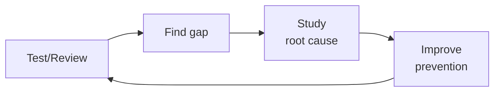

# Security Engineer

> **Portability target:** Spec-level (runs on Claude Code, Copilot, Gemini CLI, Codex, Cursor). No vendor-specific frontmatter fields.

Design, implement, and validate security controls across the application, infrastructure, and network
layers. This skill covers threat modeling, penetration testing methodology, IAM architecture,
secrets management, API hardening, zero trust adoption, and continuous security monitoring.

## Route the Request
<!-- Machine-executable routing: 8 file_contains/file_exists rows A1-A8 + Intent Route fallback -->

| # | Detect Condition | Route To | Intent Route Fallback |
|---|-----------------|----------|----------------------|
| **A1** | `file_exists("threat-model/")` or `file_contains("*.md", "STRIDE\|attack.tree\|threat.model\|trust.boundary")` | Core Workflow → Phase 1 (Threat Modeling) | "I detect threat modeling artifacts — routing to Threat Modeling phase." |
| **A2** | `file_contains("docker-compose.yml", "vault\|hashicorp")` or `file_exists(".sops.yaml")` or `file_contains("*.tf", "aws_secretsmanager\|azure_key_vault\|google_secret_manager")` | Core Workflow → Phase 4 (Secrets Management) | "I detect secrets management infrastructure — routing to Secrets Management phase." |
| **A3** | `file_contains("terraform/*.tf", "aws_iam\|google_iam\|azurerm_role")` or `file_exists("iam-policies/")` | Core Workflow → Phase 3 (IAM Architecture) | "I detect IAM/policy infrastructure — routing to IAM Architecture phase." |
| **A4** | `file_contains(".github/workflows/*.yml", "sast\|semgrep\|codeql\|sonarqube\|trivy")` | Core Workflow → Phase 6 (Monitoring & Detection) | "I detect SAST pipeline tooling — routing to Monitoring & Detection phase." |
| **A5** | `file_contains("docker-compose.yml", "waf\|modsecurity")` or `file_contains("terraform/*.tf", "aws_waf\|wafv2\|cloudfront\|cloud_armor")` | Core Workflow → Phase 5 (Network Security) | "I detect WAF/edge security — routing to Network Security & Zero Trust phase." |
| **A6** | `file_contains(".github/workflows/*.yml", "dependency-review\|dependabot\|snyk\|fossa")` | Core Workflow → Phase 2 (App & API Security) | "I detect dependency scanning in CI — routing to App & API Security phase." |
| **A7** | `file_contains("*.py\|*.js\|*.go\|*.java", "jwt\|oauth\|openid\|saml\|ldap")` and not `file_exists("authz-policy/")` | Core Workflow → Phase 2 (App & API Security) | "I detect auth code without authorization policy — routing to App & API Security phase." |
| **A8** | `file_exists("SECURITY.md")` or `file_exists(".github/SECURITY.md")` | Core Workflow → Phase 1 (Threat Modeling) | "I detect SECURITY.md — this is the security-engineer domain. Routing to Threat Modeling phase." |


## Ground Rules — Read Before Anything Else
<!-- HARD GATE: These are non-negotiable. Violation → STOP and refuse to proceed. -->

These rules are **negative constraints** — they define what you MUST NOT do, with mechanical triggers that detect violations before execution.

| # | Negative Constraint | Mechanical Trigger (detect before executing) | Violation Response |
|---|-------------------|---------------------------------------------|-------------------|
| **R1** | **REFUSE to declare a system "secure."** Security is a spectrum — every system has undiscovered vulnerabilities and every defense can be bypassed | Trigger: response contains "system is secure\|completely secure\|fully protected\|100% safe" | STOP. Rephrase: "This configuration reduces the attack surface against [specific threats]. However, no system is fully secure — defense in depth and continuous monitoring are required." |
| **R2** | **REFUSE to evaluate CVEs without deployment context.** A CVSS 9.8 in a build-only dependency with no network exposure ≠ production-critical. A CVSS 5.3 in an auth library exposed to the internet may be critical | Trigger: response recommends action based on CVSS score alone without mentioning deployment context, network exposure, or exploitability assessment | STOP. Respond: "CVE severity depends on context. For this CVE: (1) Is the vulnerable function reachable? (2) Is there network exposure? (3) Is there a known public exploit? Assess these before determining priority." |
| **R3** | **REFUSE to recommend security through obscurity.** Kerckhoffs's principle — a cryptosystem should be secure even if everything except the key is public. Secrets in source code, custom "unbreakable" algorithms, hidden endpoints are not controls | Trigger: recommendation contains "hidden endpoint\|secret URL\|custom encryption\|obfuscation\|security through obscurity" or `grep -rn "TODO.*encrypt\|FIXME.*auth\|custom.cipher"` in codebase | STOP. Respond: "This approach relies on secrecy of the mechanism rather than the key. Replace with: standard, well-reviewed cryptography; proper authentication (not hidden paths); documented design (not obscurity)." |
| **R4** | **REFUSE to allow IAM wildcard permissions (`*`) without documented justification.** Wildcards are the #1 cause of privilege escalation paths — a compromised Lambda with `s3:*` can read, write, and delete every bucket | Trigger: `grep -rn '"\*:\*"\|"s3:\*"\|"ec2:\*"\|"iam:\*"\|Action.*\*\|Resource.*\*' iam-policies/ terraform/*.tf` returns matches | STOP. Respond: "Wildcard IAM permissions detected. Replace with specific actions based on actual API calls (use IAM Access Analyzer). A single compromised resource with wildcard access can compromise the entire account." |
| **R5** | **STOP and ASK when operating outside a known threat model.** Recommending controls without understanding the full system architecture and data flows misses critical gaps | Trigger: request asks for security recommendations but no threat model, architecture diagram, data flow description, or trust boundary definition is provided | STOP. Ask: "To design appropriate controls, I need: (1) System architecture diagram or description, (2) Data flows (what data, between which components, over what protocols), (3) Trust boundaries, (4) What are you protecting against? (external attacker, insider, supply chain)" |
| **R6** | **DETECT and WARN about secrets in source code or config files.** Secrets in source code are the #1 initial access vector for cloud breaches — they survive in git history forever | Trigger: `grep -rn "API_KEY\|SECRET\|PASSWORD\|TOKEN\|private.key\|-----BEGIN" --include="*.py" --include="*.js" --include="*.yml" --include="*.json" --exclude-dir=.git --exclude-dir=node_modules` returns matches | WARN: "Secrets detected in source code. Every secret committed to git history is compromised — rotation is required even if you delete the file. Deploy pre-commit hooks (gitleaks, detect-secrets) and rotate all exposed credentials immediately." |
| **R7** | **DETECT and WARN about unmaintained dependencies with known vulnerabilities.** Abandoned packages accumulate known vulnerabilities without fixes — they are time bombs | Trigger: `grep -rn "unmaintained\|deprecated\|no.longer.supported"` in dependency manifests, or `npm audit --json \| jq '.vulnerabilities[] \| select(.severity=="critical" or .severity=="high")'` returns results with no fix available | WARN: "Unmaintained dependencies with known CVEs detected. For each: find actively maintained alternative, fork and patch if critical to application, or isolate behind API boundary. Document risk acceptance if keeping (with expiration date)." |


## The Expert's Mindset

Master security engineers think like attackers, not defenders. They don't ask "is this system secure?" — they ask **"how would I break this if I wanted to?"** Security is not a feature; it's an emergent property of design.

| Cognitive Bias | Mitigation |
|----------------|------------|
| **Threat-of-the-month** — chasing the latest CVE while neglecting foundational controls | Every new threat gets scored against your actual attack surface; if it doesn't change your top-3 risks, it's noise |
| **Perimeter fixation** — over-investing in network security while ignoring identity, supply chain, and insider threats | Draw your trust boundary at the identity, not the firewall; assume breach at every layer |
| **Tool-completeness illusion** — believing a SAST + DAST + WAF stack makes you secure | Every quarter, run a manual penetration test against your own controls; tools catch ~40% of what a skilled human finds |
| **Alert-fatigue normalization** — tuning out alerts because 99% are false positives | Every alert that fires >10 times without a true positive gets tuned or removed; noisy alerts hide real attacks |

### What Masters Know That Others Don't
- **The blast radius of every component** — not just whether it can be compromised, but what the attacker gets when they succeed
- **That security is an economic problem** — attackers have budgets too; make the cost of attacking you higher than the value of what you protect
- **The 3 controls that would stop 80% of real-world attacks** — MFA everywhere, least-privilege IAM, and known-vulnerability patching within SLA. Everything else is optimization on the margin.

### When to Break Your Own Rules
- **Accept a known risk when the mitigation is worse than the threat.** A 0.001% breach probability × $10K impact = $0.10 expected loss. Don't spend $100K to fix it.
- **Ship with a security exception (documented, time-bound).** Sometimes you need to move fast. The exception must have an owner, an expiration date, and compensating controls.
## Operating at Different Levels

| Level | Scope | You... |
|-------|-------|--------|
| **L1** | Single test/review | Execute defined quality procedures; follow checklists |
| **L2** | Feature quality | Own quality for a feature area; write custom test strategies |
| **L3** | System quality | Design quality strategy for a system; define gates and thresholds; mentor |
| **L4** | Org quality | Define org-wide quality standards; make investment cases for quality tooling |
| **L5** | Industry quality | Create quality methodologies adopted across the industry |

**Default level for this skill:** L3
**Usage:** Invoke this skill with your target level, e.g., "as an L3 security engineer, review..."

For full level definitions, see `skills/00-framework/skill-levels/SKILL.md`.

## When to Use
<!-- QUICK: 30s -- scan the bullet list to decide if this skill fits -->
- Conducting threat modeling sessions using STRIDE, PASTA, or attack trees
- Performing penetration tests against web applications, APIs, cloud infrastructure, or mobile apps
- Designing IAM strategies: role-based access control, attribute-based access control, just-in-time access
- Implementing secrets management with HashiCorp Vault, AWS Secrets Manager, or SOPS
- Hardening APIs against OWASP Top 10: injection, broken auth, SSRF, excessive data exposure
- Architecting network security: network policies, WAF, DDoS protection, segmentation
- Adopting zero trust architecture: micro-segmentation, continuous verification, device trust
- Building a security monitoring and detection pipeline (SIEM, SOAR, threat intelligence feeds)

- **Use `/security-reviewer` instead** when: You need a code-level security review of a PR, dependency audit on a specific change, or SAST finding triage. Security-engineer builds the security program; security-reviewer inspects individual changes against it.
- **Use `/incident-responder` instead** when: A security incident is in progress or has just been detected — active containment, eradication, and recovery. Security-engineer builds preventive controls; incident-responder handles active breaches.

## Decision Trees
<!-- QUICK: 30s -- follow the ASCII tree to your scenario -->
### Threat Modeling Depth

```
System maturity and risk?
├── Greenfield (new system, pre-code) → Full STRIDE per component. DFDs from architecture.
│     Goal: Eliminate threats in design before they become code. Cheapest time to fix.
├── Brownfield (existing system, new feature) → Threat modeling on changed components only.
│     Focus: Data flows crossing trust boundaries. Input validation at new entry points.
├── Scale (prod with >10K users) → Continuous threat modeling. PASTA or attack trees.
│     Goal: Prioritize by business impact. Red team exercises for validation.
└── Compliance-driven (PCI-DSS, SOC 2) → Asset-based. Map threats to control requirements.
      Goal: Demonstrate due diligence. Generate compliance artifacts alongside findings.
```

### Security Tooling by Team Size

```
Team size?
├── Solo → OWASP ZAP (free). GitHub Dependabot (free). Manual pentest checklist.
│     Cost: $0. Time: 4 hours/month for security review.
├── Small (2-10) → Snyk/Burp Suite Community + npm audit + Trivy + Semgrep (OSS).
│     Cost: $0-200/month. CI-integrated SAST. Monthly manual review of critical paths.
├── Medium (10-50) → Burp Suite Pro + Snyk Team + Wazuh SIEM + HashiCorp Vault.
│     Cost: $500-5K/month. Dedicated security engineer. Quarterly pentests.
└── Enterprise (50+) → Full AppSec program. DAST + SAST + IAST + RASP. Bug bounty.
      Cost: $50K+/month. Security team (3+). Continuous red team. SOC 2 Type II.

**What good looks like:** The output opens correctly in the target tool. All validations pass. No placeholder content remains.

```

## Core Workflow
<!-- QUICK: 30s -- scan phase titles to understand the process -->
<!-- DEEP: 10+min -->
### Phase 1 (~15 min): Threat Modeling and Risk Assessment
1. Diagram the system: data flow diagrams (DFDs) showing trust boundaries, external entities, data stores, and processes.
2. Apply STRIDE per element: Spoofing, Tampering, Repudiation, Information disclosure, Denial of service, Elevation of privilege.
3. Identify threats and rank by likelihood × impact using a risk matrix (CVSS or custom scoring).
4. Define mitigations: eliminate the threat, reduce likelihood, reduce impact, transfer risk, or accept with justification.
5. Document in a threat model register; review quarterly or on major architectural changes.

<!-- DEEP: 10+min -->
### Phase 2 (~30 min): Application and API Security
1. Integrate SAST (Semgrep, SonarQube, CodeQL) into the CI pipeline at PR time; block on critical/high findings.
2. Run SCA (Dependabot, Snyk, OWASP Dependency-Check) to detect vulnerable open-source libraries.
3. Perform DAST (OWASP ZAP, Burp Suite) against staging environments on a schedule and on major releases.
4. Harden API endpoints: implement rate limiting, input validation, output encoding, proper CORS, and content security policies.
5. Enforce authentication and authorization at the API gateway; use OAuth2/OIDC with short-lived tokens and refresh token rotation.
6. Protect against OWASP Top 10: parameterized queries for SQL injection, HTML entity encoding for XSS, strict deserialization.

<!-- DEEP: 10+min -->
### Phase 3 (~20 min): Identity and Access Management (IAM)
1. Design role-based access control (RBAC) with well-defined role hierarchies and least-privilege defaults.
2. Implement just-in-time (JIT) access for privileged operations: request, approve, grant temporary elevation, auto-revoke.
3. Use OIDC for service-to-service and CI/CD-to-cloud authentication — no long-lived static credentials.
4. Enforce multi-factor authentication (MFA) for all human users; hardware security keys for administrative roles.
5. Implement permission boundaries and service control policies to limit the blast radius of compromised credentials.
6. Audit IAM quarterly: review unused roles, overly permissive policies, and inactive users; use IAM Access Analyzer or Policy Simulator.

<!-- DEEP: 10+min -->
### Phase 4 (~15 min): Secrets Management
1. Centralize secrets in a dedicated vault (HashiCorp Vault, AWS Secrets Manager, GCP Secret Manager, Azure Key Vault).
2. Implement dynamic secrets for databases: generate ephemeral credentials on demand, auto-expire within hours.
3. Use envelope encryption: encrypt data with a data key, encrypt the data key with a master key (KMS).
4. Never log, echo, or commit secrets; use pre-commit hooks (detect-secrets, gitleaks) to block accidental exposure.
5. Rotate secrets automatically: database passwords, API keys, TLS certificates — all on a defined rotation schedule.
6. For Kubernetes: use External Secrets Operator or Sealed Secrets; never store raw secrets in etcd without encryption at rest.

<!-- DEEP: 10+min -->
### Phase 5 (~25 min): Network Security and Zero Trust
1. Implement micro-segmentation: default-deny network policies, explicit allow rules between specific services.
2. Deploy a Web Application Firewall (AWS WAF, Cloudflare, ModSecurity) with OWASP Core Rule Set; tune to reduce false positives.
3. Protect against DDoS: CloudFront/Cloudflare at the edge, AWS Shield Advanced or equivalent for layer 3/4 protection.
4. Zero trust principles: never trust, always verify — authenticate every request regardless of source network.
5. Use mutual TLS (mTLS) for service-to-service communication; manage certificates with cert-manager or a service mesh.
6. Implement outbound traffic inspection with a forward proxy to detect data exfiltration and command-and-control traffic.

<!-- DEEP: 10+min -->
### Phase 6 (~25 min): Security Monitoring and Incident Detection
1. Aggregate logs centrally: CloudTrail, VPC Flow Logs, application logs, WAF logs → SIEM (Splunk, Elastic Security, Sentinel).
2. Define detection rules for common attack patterns: credential brute-force, privilege escalation, data exfiltration, crypto mining.
3. Set up SOAR playbooks for automated triage: enrich alerts with threat intelligence, quarantine compromised hosts, revoke credentials.
4. Hunt for threats proactively: run hypothesis-driven threat hunts monthly based on threat intelligence and MITRE ATT&CK.
5. Tune alerting to balance signal-to-noise: measure mean time to detect (MTTD) and mean time to acknowledge (MTTA).


### Cross-skills Integration
```bash
# Security review → Security implementation → Compliance mapping
/security-reviewer && /security-engineer && /compliance-officer
# Infrastructure security → Security hardening → Incident response
/devops-engineer && /security-engineer && /incident-responder
# Security reviewer finds issues. Security engineer implements fixes. Compliance officer maps to controls.
```

## Sub-Skills
<!-- QUICK: 30s -- table of deeper dives by topic -->
When this skill is invoked, the agent may need to drill into these specialized areas:

| Sub-Skill | When to Use |
|-----------|-------------|
| `threat-modeling` | Applying STRIDE, attack trees, and MITRE ATT&CK to architecture and new features |
| `sast-implementation` | Writing Semgrep rules, custom detectors, and CI gates for code-level security |
| `secrets-management` | Implementing Vault patterns, pre-commit hooks, secret rotation, and just-in-time access |
| `auth-security` | Designing MFA, password policies, OAuth2 threat mitigation, and session management |
| `network-security` | Architecting zero trust, mTLS, WAF deployment, and API gateway security |
| `container-security` | Scanning images for CVEs, enforcing non-root users, read-only filesystems, and seccomp profiles |
| `dependency-security` | Managing software supply chain risk: SBOM, vulnerability triage, and automated patching |
| `security-champions` | Embedding security culture through training, gamification, and champion programs |

## Scale Depth: Solo → Small → Medium → Enterprise

### Solo
Focus: basic AppSec (OWASP ZAP + Dependabot), manual threat modeling on critical paths. IAM: AWS IAM roles, no long-lived keys. Secrets: .env in gitignored vault, manual rotation. Monitoring: CloudTrail + GuardDuty. Team: part-time security (dev wears security hat). Skip: enterprise SIEM, full AppSec program, dedicated security team.

### Small Team
Focus: CI-integrated AppSec (Snyk/Trivy + Semgrep OSS), quarterly STRIDE reviews. IAM: RBAC + MFA for all humans. Secrets: HashiCorp Vault OSS or cloud secret manager. Monitoring: Wazuh/Elastic SIEM (OSS). Team: 1 dedicated security engineer. Coordination: with dev team on SAST findings triage, with DevOps on secrets rotation.

### Medium Team
Focus: Continuous threat modeling (PASTA), Burp Suite Pro + custom rules. IAM: JIT access + OIDC + quarterly access reviews. Secrets: Vault Enterprise, dynamic secrets, auto-rotation. Monitoring: Splunk/Elastic + SOAR playbooks. Team: Security team (2-3) + security champions. Coordination: with platform engineering on runtime security, with legal on compliance evidence.

### Enterprise
Focus: Full AppSec program (SAST+DAST+IAST+RASP, bug bounty). IAM: ABAC + permission boundaries + automated deprovisioning. Secrets: Multi-region Vault clusters, HSM-backed, envelope encryption. Monitoring: Full SOC (SIEM+SOAR+UEBA+threat intel, 24/7). Team: CISO + AppSec + InfraSec + SOC + GRC (8+). Coordination: with board/audit committee on security posture reporting, with legal on breach notification, with regulatory affairs on FedRAMP/SOC 2.

### Transition Triggers
| From → To | Trigger |
|-----------|---------|
| Solo → Small | First security incident; first enterprise customer security review |
| Small → Medium | SOC 2/ISO 27001 certification; dedicated security hire justified |
| Medium → Enterprise | IPO prep, operating critical infrastructure, or regulatory mandate (FedRAMP, PCI-DSS Level 1) |

## What Good Looks Like

> Every pull request runs SAST, SCA, and container scanning in CI, and critical findings block merge without exception. Secrets never touch plaintext — pre-commit hooks catch them, Vault issues dynamic credentials that auto-expire, and rotation is fully automated. The threat model is a living document reviewed every quarter, and new features ship with abuse cases already mitigated. The SIEM surfaces actionable signals, not noise, and the mean time to remediate a critical CVE is under 24 hours. Security is embedded in the engineering workflow, not bolted on at release time.

## Cross-Skill Coordination

| Upstream Skill | What You Receive | When to Involve |
|---|---|---|
| `compliance-officer` | Control requirements mapped to technical implementations, compliance evidence expectations, audit preparation support | Before implementing security controls that must satisfy regulatory frameworks |
| `system-architect` | System topology, trust boundaries, data flow diagrams, component interactions | Before threat modeling or designing security architecture |
| `cloud-architect` | KMS key policies, SCP design, CloudTrail/Audit Log configuration, WAF rules, DDoS protection | Before configuring cloud security posture or IAM policies |
| `devops-engineer` | Vault/Secrets Manager architecture, security group/NetworkPolicy design, IAM least-privilege, container hardening | Before implementing secrets management or network security controls |

| Downstream Skill | What You Provide | Impact of Delay |
|---|---|---|
| `security-reviewer` | Security requirements per data classification, approved crypto libraries, secure coding patterns, dependency allowlists | Code reviews miss security issues — vulnerabilities ship to production |
| `backend-developer` | Auth design patterns, data protection requirements, secure coding guidance, dependency security policies | Developers implement insecure patterns — technical debt accumulates |
| `incident-responder` | Detection rules, SOAR playbooks, forensic tooling access, threat intelligence sharing | Incident response has no detection capability — breaches go unnoticed |
| `compliance-officer` | Technical control evidence, vulnerability management metrics, security monitoring coverage | Compliance audits fail without technical evidence — certification at risk |

## Proactive Triggers

| Trigger | Action | Why |
|---------|--------|-----|
| SAST/SCA scanner flags a critical CVE in a transitive dependency with a published exploit | Assess exploitability in your context (is the vulnerable code path reachable?), then apply the patch within 24 hours per SLA. If patching is blocked, implement a compensating control (WAF rule, network segmentation) and document the risk acceptance. | Critical CVEs with known exploits are being actively targeted. Every hour of delay increases the probability of compromise exponentially. |
| A developer commits an `.env` file or hardcoded secret that passes pre-commit hooks | Investigate why the pre-commit hook didn't catch it — the secret pattern may be missing from the detection rules. Rotate the exposed credential immediately. Add the detected pattern to the hook and scan the full repo history for prior exposures. | A secret that survives pre-commit hooks today means it was also missed yesterday. Every undetected secret in git history is a latent breach waiting to happen. |
| CloudTrail/Audit Log shows an IAM principal performing an action it has never performed before | This is an anomaly signal. Check if it's a new team member, a legitimate automation change, or a compromised credential. Correlate with login geography and source IP. If suspicious, revoke the credential and initiate incident response. | Unusual IAM activity is the most common early indicator of credential compromise. Novelty alone doesn't equal malice, but it demands immediate investigation. |
| A new S3 bucket or storage resource is created without Block Public Access enabled | Immediately enable Block Public Access at the bucket level and investigate the creation context. If this was an automated provisioning pipeline, fix the template. Public S3 buckets are the #1 cause of cloud data breaches. | Default-open storage is a data exfiltration waiting to happen. A single misconfigured bucket can expose millions of records in minutes. |
| Vulnerability scanner finds an unpatched critical CVE that was disclosed >7 days ago with a CVSS score ≥9.0 | This is an SLA violation — the CVE should have been patched within 24 hours. Escalate to the service owner and security leadership. Apply the patch immediately and conduct a postmortem on why the SLA was missed. | A missed SLA on a 9.0+ CVE is a near-miss incident. The vulnerability was exploitable for at least 6 days longer than policy allows — determine if it was exploited during that window. |
| SIEM alert fires for an outbound data transfer exceeding 500MB from a database-hosting subnet to an external IP | This is a potential data exfiltration event. Immediately isolate the source host, preserve forensic evidence (memory dump, network flows, process list), and initiate incident response. Outbound data transfer from data-tier subnets should be near-zero. | Large outbound flows from database subnets are almost never legitimate. Databases don't initiate outbound connections to the internet — someone or something is exfiltrating data. |
| An OWASP dependency-check or npm audit returns a vulnerability in a package that hasn't been updated in >2 years | The package is likely abandoned. Replace it with an actively maintained alternative, or fork and patch it yourself if it's critical to your application. Unmaintained dependencies accumulate known vulnerabilities without fixes. | Abandoned packages are time bombs. The Log4Shell crisis proved that even widely-used libraries can become unmaintained and critically vulnerable. |
| Security scanning pipeline is bypassed or disabled for an "emergency hotfix" without documented approval | The hotfix must still pass SAST and secret scanning — these checks add <2 minutes. If truly impossible, require a break-glass approval from the security lead with a 24-hour remediation window. Bypassing security gates normalizes the behavior. | Emergency bypasses are how Shadow IT creeps into production. Every bypass that isn't remediated becomes the new normal — and attackers know to target the un-scanned paths. |

## Best Practices
<!-- STANDARD: 3min -- rules extracted from production experience -->
- **Shift left**: security testing in the IDE and at PR time; don't wait for staging or production scans.
- **Defense in depth**: no single control should be the only line of defense; layer preventive, detective, and corrective controls.
- **Assume breach**: design systems to limit blast radius, detect intrusions quickly, and recover gracefully.
- **Secrets never travel in plaintext**: encrypt in transit (TLS) and at rest (KMS); use ephemeral credentials whenever possible.
- **Patch aggressively**: automate OS and dependency patching; SLA: critical patches within 24 hours, high within 7 days.

## Anti-Patterns
<!-- DEEP: 5min -- each anti-pattern includes machine-detectable patterns -->

| ❌ Anti-Pattern | ✅ Do This Instead | 🔍 Detect (grep / lint) | 🛡️ Auto-Prevent |
|-----------------|---------------------|--------------------------|-------------------|
| Running SAST as nightly job instead of blocking PRs on critical/high findings — vulnerabilities reach main before detection | Integrate SAST into CI pipeline: run on every PR, configure severity gates, critical/high findings block merge. PR-time scans prevent vulnerabilities from reaching main | `grep -rn "schedule\|cron" .github/workflows/*sast*` → finds scheduled-only SAST. Verify CI config also triggers on `pull_request` event with blocking rules | CI gate: SAST job must run on `pull_request` trigger, not just `schedule`. Add branch protection rule: "Require SAST check to pass before merging" |
| Storing secrets in environment variables assuming "only the app can read them" — they leak through child processes, debug endpoints, crash dumps, logging frameworks | Use secrets manager (HashiCorp Vault, AWS Secrets Manager) with dynamic credentials that auto-expire. Environment variables are not a security boundary | `grep -rn "process.env.\|os.environ\|ENV\[" **/*.{js,py,go,ts}` → finds env-var usage. `grep -rn "SECRET\|API_KEY\|PASSWORD" .env*` → finds raw secrets | Pre-commit hook: `detect-secrets scan` or `gitleaks detect` blocks commits with secrets. CI validates no `.env` files in repo. Secrets manager integration check |
| Running penetration test, filing report, never remediating — creates documented, known vulnerabilities that security team acknowledged and ignored | Assign each pen test finding: owner, severity-based SLA (Critical: 7 days, High: 30 days), tracked in same system as engineering bugs. Un-remediated findings are pre-acknowledged exploits | `grep -rn "pen.test\|pentest\|penetration.test"` reports/ → find report. Cross-reference finding IDs with Jira/GitHub issues → flag findings with no tracking ticket | CI check: pen test report findings must have corresponding Jira tickets with severity-appropriate SLA. Overdue findings auto-escalate to security lead |
| Implementing threat modeling only at project kickoff, never revisiting — MVP model doesn't cover payment integration, third-party API, admin panel added 6 months later | Threat model as living document: reviewed quarterly, updated on every major architecture change. Trigger reviews on: new data store, new auth mechanism, new third-party integration, new user role | `grep -rn "last.reviewed\|last.updated" threat-model/*.md` → flag if > 180 days. `git log --oneline --since=6.months architecture/` → check for changes without threat model updates | CI pre-merge check: if PR modifies architecture docs, data flow diagrams, or adds new dependency, require threat-model review update or explicit "no impact" sign-off |
| Allowing IAM roles with wildcard permissions (`s3:*`, `ec2:*`) because "it's easier than figuring out exact actions" — #1 cause of privilege escalation paths | Start with `ReadOnlyAccess`, add specific actions based on actual API calls (IAM Access Analyzer). A compromised Lambda with `s3:*` can read, write, delete every bucket in the account | `grep -rn '"\*:\*"\|"s3:\*"\|"ec2:\*"\|"dynamodb:\*"\|"sqs:\*"\|"sns:\*"' terraform/*.tf iam-policies/*.json` → flag wildcards | CI IAM linter: reject Terraform/CloudFormation with IAM wildcards. Grant only actions identified by Access Analyzer. Exception requires security lead approval with documented justification |
| Disabling IMDSv2 on EC2 instances because "legacy app needs IMDSv1" — vulnerable to SSRF attacks leaking IAM credentials (Capital One breach root cause) | Migrate to IMDSv2 (session-oriented with PUT token requirement) or isolate legacy app in separate subnet with additional network controls. IMDSv1 is a known SSRF vector | `grep -rn "HttpTokens.*optional\|http_tokens.*optional\|IMDSv1\|metadata_options.*optional" terraform/*.tf` → flag instances with IMDSv2 not enforced | AWS Config rule: `ec2-imdsv2-check` enforces IMDSv2. Terraform policy: require `http_tokens = "required"` on all `aws_instance` resources |
| Running vulnerability scans but never building SBOM or tracking transitive dependencies — Log4Shell was transitive in thousands of apps that "didn't use Log4j" | Generate SBOM (CycloneDX/SPDX) for every application, store alongside build artifact. Transitive dependencies are the silent attack surface — you can't patch what you don't know you have | `find . -name "*.cdx.json" -o -name "*.spdx.json" \| wc -l` → must be ≥ number of deployed services. `grep -rn "sbom\|cyclonedx\|spdx" .github/workflows/` → verify SBOM generation in CI | CI pipeline: generate SBOM as build artifact. CI gate: if SBOM missing, block deployment. SBOM diff on dependency changes flags new transitive deps for review |
| Deploying WAF in block mode on launch day without monitor-only period — blocked legitimate traffic (mobile app, API clients) because QA only tested desktop User-Agent strings | Deploy WAF rules in count/monitor mode for 2 weeks before blocking. Review dashboard daily: which rules would have blocked? Are those attacks or false positives? Test with production traffic replay | `grep -rn "action.*BLOCK\|override_action.*none\|rule_action.*BLOCK" terraform/*waf*` → flag immediate-block config. Verify monitor-only period in deployment history | CI WAF deployment validator: require `action = "COUNT"` for initial deployment, with `date + 14d` set as block-mode transition date. Auto-generate dashboard for count-mode review period |

<!-- DEEP: 10+min -->
## Error Decoder
<!-- DEEP: 5min -- each entry includes a console-string matcher for automatic recovery loops -->

| 🖥️ Console Match (grep pattern) | Symptom | Root Cause | Fix | 🔄 Auto-Recovery Loop |
|---|---|---|---|---|
| `grep -rn "CVE-2021-44228\|log4j\|JndiLookup\|log4shell" /var/log/*.log dependency-check-report.json` + `find . -name "log4j-core-*.jar"` | Remote code execution via Log4j — attacker controlled string in User-Agent/headers triggers JNDI lookup to malicious LDAP server. Critical severity, actively exploited in the wild | Log4j 2.x (2.0–2.14.1) with JNDI lookup enabled in the classpath. SBOM not maintained — dependency tree included Log4j through a transitive dep that no one knew about | 1. Inventory all Log4j instances: `find / -name "log4j-core-*.jar"`. 2. Patch to 2.17.1+. 3. Set `log4j2.formatMsgNoLookups=true`. 4. Generate SBOM for all apps to find other blind spots | 1. `find / -name "log4j-core-*.jar" -exec jar -tf {} \; \| grep JndiLookup` → identify vulnerable. 2. `mvn versions:set -DnewVersion=2.17.1` or `sed -i 's/log4j.*2\.[0-9]\.[0-9]/2.17.1/'` → patch. 3. `grep -r "log4j" pom.xml build.gradle requirements.txt` → verify all patched. 4. `cyclonedx-cli generate` → create SBOM → scan |
| `grep -rn "AccessDenied\|403\|InvalidToken\|ExpiredToken" /var/log/cloudtrail*.log` + `aws iam get-account-authorization-details` shows wildcard policies | AWS root access key found committed to public GitHub repo — bot discovered it in <24 hours, spun up 200 GPU instances for crypto mining. $87K bill in 3 days | Developer committed `.env` file with hardcoded credentials. No pre-commit hooks, no secret scanning in CI. IAM roles not used — long-lived access keys instead | 1. Rotate exposed key immediately: `aws iam delete-access-key && aws iam create-access-key`. 2. `gitleaks detect --source .` to find other leaked secrets. 3. Deploy pre-commit hooks. 4. Enable GitHub secret scanning push protection | 1. `aws iam list-access-keys --user-name USER` → identify exposed key. 2. `aws iam delete-access-key --access-key-id AKIA...` → revoke. 3. `aws cloudtrail lookup-events --lookup-attributes AttributeKey=AccessKeyId,AttributeValue=AKIA...` → audit usage. 4. `pre-commit install && pre-commit run --all-files` → prevent recurrence |
| `grep -rn "PublicAccessBlock\|BlockPublicAccess.*false\|acl.*public-read" terraform/*.tf` + `aws s3api get-public-access-block --bucket BUCKET` returns no block config | 2M customer records exposed via public S3 bucket — bucket policy set to `Allow *` with `Principal: *` for "ease of data sharing" | No bucket-level Block Public Access. No automated bucket policy scanner (CloudSploit, ScoutSuite, Prowler). Sensitive data buckets not tagged for enhanced monitoring | 1. Enable S3 Block Public Access at account level. 2. `aws s3api put-public-access-block --bucket BUCKET --public-access-block-configuration BlockPublicAcls=true,...`. 3. Scan all buckets: `prowler -c s3`. 4. Tag sensitive-data buckets; add CloudWatch alert on policy changes | 1. `aws s3 ls \| awk '{print $3}' \| xargs -I {} aws s3api get-public-access-block --bucket {}` → audit all buckets. 2. `aws s3api put-public-access-block` on every bucket missing it. 3. `prowler aws -c s3` → verify. 4. `aws s3api put-bucket-tagging --tagging 'TagSet=[{Key=sensitivity,Value=high}]'` on sensitive buckets |
| `grep -rn "169.254.169.254\|metadata.google.internal" app-code/` + `curl -s http://169.254.169.254/latest/meta-data/` returns IAM creds | SSRF vulnerability allowed attacker to access cloud metadata service, retrieve IAM credentials, and exfiltrate 100M+ records (Capital One breach pattern) | Web app accepts user-supplied URLs without validation. No outbound network segmentation. IMDSv1 left enabled — no session token required to access metadata | 1. Enforce IMDSv2: `aws ec2 modify-instance-metadata-options --http-tokens required`. 2. Validate/allowlist all user-supplied URLs. 3. Deploy outbound proxy. 4. Block 169.254.169.254 from application containers via iptables/network policy | 1. `aws ec2 describe-instances --query 'Reservations[].Instances[?MetadataOptions.HttpTokens!=`required`].InstanceId'` → find vulnerable. 2. `aws ec2 modify-instance-metadata-options --http-tokens required --instance-id i-xxx` → enforce. 3. `curl -H "X-aws-ec2-metadata-token: INVALID" http://169.254.169.254/` → must return 401 |
| `grep -rn "BEGIN RSA PRIVATE KEY\|BEGIN OPENSSH PRIVATE KEY\|api[_-]?key\|secret[_-]?key" **/*.{py,js,yml,yaml,toml,json}` (non-.git non-vault paths) | JWT signing secret committed to public repo — same secret shared across 12 microservices. Rotation required 92 hours of coordinated cutover | No secret isolation: one key for all services. Pre-commit hooks not installed. Onboarding process gave production secrets to new engineers without guardrails | 1. Rotate exposed secret immediately on all 12 services. 2. Key-per-service: each microservice gets its own JWT key. 3. Implement overlapping keys: 2 active signing keys with 24h overlap for graceful rotation. 4. `gitleaks detect --source .` for other leaks | 1. `gitleaks detect -v --source .` → find all secrets. 2. Rotate each: generate new key, deploy to service, invalidate old after 24h overlap. 3. `git filter-repo --path config.ts --invert-paths` → scrub git history. 4. `pre-commit install && git secrets --install` → prevent |
| `grep -rn "GPL\|AGPL\|EUPL\|LGPL\|copyleft" package.json pom.xml go.mod Cargo.toml` + `npm audit --json \| jq '.vulnerabilities'` | GPL-licensed library in proprietary product — copyleft triggers source disclosure requirement. Acquisition deal-killer in due diligence | Engineering included a GPL library without legal review. No automated license scanning in CI. No license policy or approved-license list documented | 1. Audit all deps: `fossa analyze` or `snyk test --all-projects`. 2. Replace GPL deps with MIT/Apache 2.0 equivalents. 3. If no equivalent exists, isolate behind API boundary. 4. Implement CI license check: reject non-approved licenses | 1. `npx license-checker --json \| jq '.[] \| select(.licenses | contains("GPL"))'` → find copyleft. 2. Find alternatives: `npm search TERM --json \| jq '.[] \| select(.license=="MIT")'`. 3. `fossa init && fossa analyze` → generate full compliance report. 4. CI: `fossa test` blocks non-approved licenses |
| `grep -rn "SAST.*12[0-9][0-9][0-9]\|SonarQube.*12[0-9][0-9][0-9]\|Semgrep.*12[0-9][0-9][0-9]" reports/` + `grep -c "critical\|high" sast-report.json` > 1000 | SAST scanner reported 12,000+ "critical" findings — developers ignored ALL results, including 3 real SQL injection vectors exploited 6 weeks later | Alert fatigue from un-tuned tools. Three different scanners (Semgrep, CodeQL, SonarQube) with different severity scales. No triage pipeline distinguishing "company-ending tomorrow" from "regex theoretically 0.01% faster" | 1. Normalize all scanner outputs into single queue (DefectDojo). 2. Define "Critical = exploitable from internet without auth, confirmed by 2+ scanners". 3. Auto-close findings below bar. 4. Queue must trend toward zero — growing = generating noise faster than clearing it | 1. `jq '.[] \| select(.severity=="critical")' sast-report.json \| wc -l` → count. 2. `jq '[.[] \| select(.cvss > 9.0)]'` → filter extreme-only. 3. `defectdojo-cli import` → normalize. 4. `defectdojo-cli findings --active --severity Critical \| wc -l` → must be < 50. Weekly triage sprint until true criticals are zero |


## Production Checklist
<!-- QUICK: 30s -- binary pass/fail items. Each has a mechanical validation command. -->

| ID | Checklist Item | Validation Command | Auto-Fix |
|----|---------------|-------------------|----------|
| **[S1]** | Threat model documented for all tier-1 services; reviewed within last 6 months | `find threat-model/ -name "*.md" \| wc -l` → ≥ number of tier-1 services. `grep -rn "last.reviewed.*20[2-9][0-9]" threat-model/*.md \| awk -F: '{print $NF}' \| xargs -I{} date -j -f "%Y-%m-%d" {} +%s` → none older than 180 days | Generate threat-model-template.md per service; CI check on architecture PRs: require threat-model update or "no impact" sign-off |
| **[S2]** | SAST, SCA, and container scanning integrated into CI pipeline; critical/high findings block merge | `grep -rn "semgrep\|codeql\|sonarqube\|trivy\|snyk" .github/workflows/*.yml` → must find ≥ 2 tool configs. `grep -rn "severity.*critical\|severity.*high\|fail-on.*critical" .github/workflows/*security*` → blocking gates configured | CI validator: `grep -c "pull_request" .github/workflows/*security*` ≥ 1. If not, generate PR-triggered security workflow. Branch protection: require security checks before merge |
| **[S3]** | DAST scanning runs weekly against staging; results triaged and remediated | `grep -rn "zap\|burp\|nikto\|dast" .github/workflows/` → schedule trigger found. `curl -s https://staging.example.com` + ZAP API `/JSON/ascan/view/status/` → scan completed in last 7 days | Generate weekly-scheduled DAST workflow. CI gate: if DAST findings exist > 30 days without `fixed` status, auto-create Jira ticket with Critical severity |
| **[S4]** | API gateway enforces authentication, authorization, rate limiting, and input validation | `grep -rn "rate.limit\|rate_limit\|throttle\|auth.*required\|validate.*input" api-gateway/ nginx/ kong/` → must find configs for all 4 controls. `curl -s -o /dev/null -w "%{http_code}" https://api.example.com/unauthenticated` → 401 | Generate api-gateway-checklist.sh: test each endpoint for auth requirement, rate limit headers, input validation errors. Flag missing controls |
| **[S5]** | IAM: no long-lived credentials, MFA for all humans, least-privilege roles, quarterly access reviews | `aws iam list-users --query 'Users[?PasswordLastUsed>`date -d -90d +%Y-%m-%d`]'` → check for inactive users. `aws iam list-virtual-mfa-devices` → all human users. `aws iam generate-credential-report` → check for access keys > 90 days | `iam-audit.sh`: list users without MFA, list access keys > 90 days old, list roles with wildcard policies. Auto-disable keys > 90 days, auto-notify MFA-lacking users |
| **[S6]** | Secrets management: centralized vault, auto-rotation enabled, pre-commit hooks detect plaintext secrets | `grep -rn "vault\|aws.secretsmanager\|azure.keyvault\|gcp.secretmanager" terraform/ docker-compose*` → vault configured. `gitleaks detect --source . --no-git` → zero findings. `pre-commit run --all-files` exit code → 0 | Run `secrets-audit.sh`: verify vault reachable, test credential auto-rotation, scan full repo history for secrets. If secrets found → rotate all + scrub git history |
| **[S7]** | Network: default-deny policies, WAF deployed, DDoS protection active, mTLS for east-west traffic | `grep -rn "aws_wafv2\|google_cloud_armor\|cloudfront.*waf" terraform/` → WAF configured. `grep -rn "ingress\|network_policy\|NetworkPolicy" kubernetes/` → default-deny. `grep -rn "mtls\|mutual.tls\|istio"` → mTLS config | `network-audit.sh`: verify security group default-deny, check WAF is associated with all public endpoints, test mTLS on service mesh. Flag unprotected ingress paths |
| **[S8]** | SIEM aggregating all security logs; detection rules aligned to MITRE ATT&CK framework | `grep -rn "splunk\|elastic\|sumo\|datadog.*siem\|azure.sentinel" terraform/` → SIEM configured. `grep -rn "MITRE\|ATT.CK\|T[0-9]\{4\}" detection-rules/` → rules mapped to techniques | `siem-coverage-check.sh`: enumerate log sources, verify each ships to SIEM, cross-reference detection rules against MITRE ATT&CK matrix. Flag uncovered techniques |
| **[S9]** | Incident response playbooks documented and tabletop-exercised annually | `find playbooks/ -name "*.md" \| wc -l` → ≥ 5. `grep -rn "tabletop\|exercise\|game.day\|tested.*20[2-9][0-9]" playbooks/` → exercise record within 365 days | Generate playbook-template.md per top threat. CI: flag playbooks where `last.exercised` > 365 days. Auto-schedule tabletop exercise calendar invite |
| **[S10]** | Vulnerability disclosure program and bug bounty policy published | `grep -rn "security.txt\|vulnerability.disclosure\|bug.bounty\|responsible.disclosure" SECURITY.md .well-known/security.txt` → policy found. `curl -s https://example.com/.well-known/security.txt` → returns 200 | Generate `.well-known/security.txt` with contact, policy link, acknowledgments. CI: `curl -s https://{domain}/.well-known/security.txt` → verify 200 and contains `Contact:` and `Policy:` fields |

## Footguns
<!-- DEEP: 10+min — war stories from security engineering -->

| Footgun | What Happened | Root Cause | How to Prevent |
|---------|---------------|------------|----------------|
| WAF deployed in "block mode" on launch day — blocked all mobile app traffic because QA tested with desktop User-Agent strings only; $1.2M in lost launch-day revenue | The security team deployed AWS WAF with AWS Managed Rules 3 days before a major product launch. QA signed off because all tests passed — but every test used Chrome on desktop. The WAF's `AWSManagedRulesCommonRuleSet` blocked mobile app traffic because the User-Agent header pattern from the React Native app matched a known bot signature. The mobile app (62% of users) showed a white screen with no error message. The WAF was put in count mode after 4 hours of frantic debugging. | Security testing was decoupled from real traffic patterns. QA tested the "happy path" with clean headers. Nobody tested with the actual mobile app User-Agent strings. The WAF was deployed in block mode without a monitor-only period. | **Deploy WAF rules in count mode for 2 weeks before blocking.** Route count-mode logs to a dashboard and review daily: which rules would have blocked traffic? Are those blocks legitimate attacks or false positives? Test WAF rules with production traffic replay, not synthetic QA traffic. Include mobile app traffic, API clients, and SDK integrations in test suites. Add managed rule groups one at a time with a 1-week soak period each. |
| SAST scanner reported 12,000 "critical" findings — developers started ignoring ALL results, including the 3 real SQL injection vectors that were exploited 6 weeks later | After a security tooling push, the SAST scanner was configured with default rulesets from 3 different tools (Semgrep, CodeQL, SonarQube). Each tool used different severity scales. Total findings: 12,471 "critical" and "high." The security team triaged 200 before giving up. Engineering leadership declared a "security findings amnesty" while the team "figured out prioritization." During the 6-week amnesty, an attacker exploited an unpatched SQL injection that had been flagged by all 3 scanners on day one. | Alert fatigue from un-tuned tools. Severity inflation turned "critical" into a meaningless label. No triage pipeline distinguished "this finding could end the company tomorrow" from "this regex could theoretically be 0.01% faster." | **Every security finding must have a single, normalized severity and a 24-hour SLA for triage.** Merge all scanner outputs into a single queue (DefectDojo, Snyk, or custom). Normalize severities with a cross-walk: "Critical = exploitable from internet without auth, confirmed by 2+ scanners or manual review." Auto-close findings that don't meet the bar. The queue must trend toward zero — if it's growing, you're generating noise faster than you can clear it. A finding that sits untriaged for 7 days is a finding that might as well not exist. |
| Rotated all production database credentials via Vault — forgot to update connection strings in 3 Kubernetes ConfigMaps; every service went down simultaneously for 107 minutes | The security team automated database credential rotation via Vault's dynamic secrets engine with a 30-day TTL. The rotation script updated the Kubernetes Secret. But 3 services (payments, user-auth, notifications) had their connection strings hardcoded in ConfigMaps from before the Vault migration. When credentials rotated, Vault invalidated the old credentials. The 3 services couldn't connect, cascading into 14 downstream service failures. The incident lasted 107 minutes because each ConfigMap had to be manually edited and each service pod recycled. | The Vault migration created a split-brain: some services used Vault-injected secrets, others used static ConfigMaps. The rotation script verified Vault Secret updates but never validated that all consumers were using the Vault path. No integration test validated credential rotation end-to-end. | **Never rotate credentials without a pre-rotation audit of every consumer.** Script: for each database, enumerate every connection source by querying active connections 1 hour before rotation, map each to a Kubernetes resource (Secret or ConfigMap), and flag any that aren't backed by Vault. Run credential rotation in staging first. In production: rotate non-critical databases first, wait 24 hours, verify all services healthy, then rotate critical databases one at a time with a 1-hour soak between each. |
| JWT signing secret committed to a public GitHub repo by an intern during onboarding — the same secret was shared across production, staging, and 12 microservices, taking 4 days to fully rotate | During onboarding, an intern was building a sample microservice and needed a test JWT secret. A senior engineer told them to "grab it from the payments service ConfigMap." The intern copied the raw secret into a `config.ts` file and pushed to their public fork. Within 6 hours, GitHub's secret scanning detected it. The secret was the SAME key used for JWT signing across 12 production microservices. Rotation required: generating a new key, deploying it to all 12 services simultaneously, invalidating all existing tokens (logging out every user), and coordinating the cutover. Total time from detection to complete rotation: 92 hours. | Lack of secret isolation: one key for all services. No pre-commit hook blocked secrets locally. The onboarding process handed out production secrets to new engineers without tooling guardrails. | **Every microservice gets its own JWT signing key.** Key compromise should impact ONE service, not your entire architecture. Run `git-secrets` or `detect-secrets` as a pre-commit hook (not just post-push scanning). Onboarding tasks must use ephemeral dev-only secrets scoped to localhost. Implement key rotation that supports overlapping keys: 2 active signing keys with a 24-hour overlap so token invalidation is graceful. Test key rotation in production quarterly — if the first time you rotate keys is during an incident, it will fail. |
| Penetration test report showed "critical RCE in admin panel" — team spent 3 days investigating, only to discover it was the pentester's own reverse shell left open from the test setup | The external pentest firm delivered a 47-page report with one critical finding: "Remote Code Execution via unauthenticated admin panel access — attacker can execute arbitrary commands on app-server-01." The security team activated incident response, isolated the server, took memory dumps, and rotated all credentials. After 72 hours of forensic analysis, they discovered the "backdoor" was the pentester's own Meterpreter session that the test team forgot to close. Total cost: $140K in IR time, 3 sleepless nights for the security team, and the actual pentest findings were delayed by a week. | The pentest firm's cleanup checklist had no verification step. The engagement scope document said "remove all testing artifacts within 24 hours of test completion," but there was no automated verification that artifacts were actually removed. | **Pentest contracts must include an artifact cleanup verification clause: the tester provides evidence (screenshots, logs) that all test artifacts were removed, and the client verifies independently before signing off.** Require the pentesting firm to use ephemeral testing infrastructure that's destroyed at test completion. Post-engagement: run your own vuln scan against the tested systems. If anything lights up that wasn't in your pre-test baseline, the pentester left something behind. |

## Calibration — How to Know Your Level
<!-- STANDARD: 3min — honest self-assessment rubric -->

| You Know You're Stuck at L1 When... | You Know You've Reached L2 When... | You Know You're L3 When... |
|---|---|---|
| You run vulnerability scanners and forward the raw report to engineering with subject line "Please fix these" | You can review a threat model and identify the 3 controls that matter — and you can argue both sides of a risk acceptance decision to the CISO and the VP of Engineering, and both agree | You design a detection that catches a real attacker in the first 5 minutes of a breach — and it actually works in production against a skilled adversary, not just in a tabletop exercise |
| You implement security controls because "the checklist says so" without understanding the threat they're mitigating | You can walk into any engineering team's design review and ask the 3 questions that make them redesign their architecture to be inherently more secure | A zero-day drops for a critical dependency you use, and your team has a patch deployed to production within 4 hours — and this wasn't a drill |
| Your "security architecture review" consists of running a SAST scanner and checking the OWASP Top 10 | You've designed a detection pipeline where every alert that fires has a >90% true positive rate, and your SOC team's mean time to triage is under 5 minutes | The CISO presents your security architecture to the board as evidence that security is a competitive advantage, not a cost center |

**The Litmus Test:** A developer pushes code that introduces an SSRF vulnerability in a new payment integration. Does your security pipeline catch it BEFORE it reaches production? If the answer involves "someone would notice during code review," you don't have a security engineering program — you have hope. Masters catch it at the pre-commit hook, the CI pipeline, and the WAF, and all three are verified to work.

## Deliberate Practice



| Level | Practice | Frequency |
|-------|----------|-----------|
| **Novice** | Review your own work from 3 months ago; catalog everything you'd now flag | Monthly |
| **Competent** | Shadow a more senior reviewer; compare their findings to yours; study the delta | Weekly |
| **Expert** | Design a new quality gate; measure false positive/negative rates; tune for 6 months | Quarterly |
| **Master** | Create a training module that teaches others your quality intuition; measure their improvement | Quarterly |

**The One Highest-Leverage Activity:** Keep a "mistakes journal." Every time you miss something, write down: what you missed, why you missed it, and what rule would have caught it.

## References
<!-- QUICK: 30s -- links to deeper reading -->
- OWASP Top 10: https://owasp.org/www-project-top-ten/
- MITRE ATT&CK Framework: https://attack.mitre.org/
- NIST Zero Trust Architecture (SP 800-207): https://www.nist.gov/publications/zero-trust-architecture
- OWASP Application Security Verification Standard (ASVS): https://owasp.org/www-project-application-security-verification-standard/
- HashiCorp Vault Best Practices: https://developer.hashicorp.com/vault/docs/enterprise/best-practices
