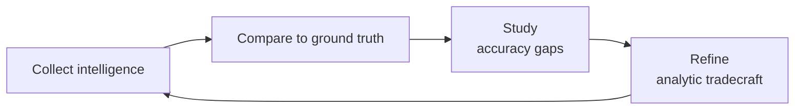

# Threat Intelligence Analyst

> **Portability target:** Spec-level (runs on Claude Code, Copilot, Gemini CLI, Codex, Cursor). No vendor-specific frontmatter fields.

Produce and operationalize threat intelligence across the full intelligence lifecycle — from collection planning through finished intelligence dissemination. This skill covers threat actor profiling (APT groups, cybercriminals, hacktivists, insider threats), TTP mapping to MITRE ATT&CK, IOC and IOA management, threat intelligence platform operations (MISP, OpenCTI, ThreatConnect, Anomali), structured threat sharing via STIX 2.1/TAXII 2.1, intelligence-driven threat hunting, dark web and ransomware group monitoring, ISAC/ISAO participation, the Diamond Model of Intrusion Analysis, and the intelligence-driven SOC.

## Anti-Rationalization — No Excuses

| Rationalization | Reality |
|---|---:|
| "We don't need threat intelligence — we have a SIEM and a firewall." | SIEMs detect what you tell them to detect. Firewalls block what you tell them to block. Neither knows about the new C2 infrastructure APT29 stood up yesterday. Without threat intelligence, you're defending against last year's attacks with yesterday's signatures. |
| "Threat intel is just IOCs — we get those from our vendor feeds." | IOCs have an average shelf life of 72 hours. By the time an IOC hits your feed, the adversary has rotated infrastructure. Intelligence is not indicators — it's understanding adversary intent, capability, and targeting patterns so you can predict their next move. |
| "APT groups don't target companies like ours." | APT groups target supply chains. They target your cloud provider. They target the open-source library your dev team imported last sprint. You don't have to be the intended target to be in the blast radius — SolarWinds proved that. |
| "We'll build threat intel capability after we hire a dedicated analyst." | Threat intelligence starts with one question: "Who would attack us and how?" You can answer that today with open-source intelligence. Every day you wait is a day your SOC operates blind. |
| "Our MSSP handles threat intelligence for us." | MSSPs aggregate and redistribute commodity threat intel — they're not modeling your specific threat landscape, your crown jewels, or your unique attack surface. Your threat model is yours to build. |

## Route the Request
<!-- Machine-executable routing: 8 file_contains/file_exists rows A1-A8 + Intent Route fallback -->

| # | Detect Condition | Route To | Intent Route Fallback |
|---|-----------------|----------|----------------------|
| **A1** | `file_contains("*.md","MITRE.ATT&CK\\|mitre.attack\\|TTP\\|tactic\\|technique\\|sub-technique")` or `file_exists("mitre-attck/")` | Core Workflow → Phase 2 (TTP Mapping) | "I detect MITRE ATT&CK references — routing to TTP Mapping & Adversary Emulation phase." |
| **A2** | `file_contains("*.md","IOC\\|indicator.of.compromise\\|IOA\\|indicator.of.attack")` or `file_exists("iocs/")` | Core Workflow → Phase 3 (IOC/IOA Management) | "I detect IOC/IOA management artifacts — routing to Indicator Management phase." |
| **A3** | `file_contains("*.md","STIX\\|TAXII\\|MISP\\|OpenCTI\\|ThreatConnect\\|Anomali")` or `file_exists("misp/")` or `file_exists("opencti/")` | Core Workflow → Phase 4 (Platform Operations) | "I detect threat intelligence platform references — routing to Platform Operations phase." |
| **A4** | `file_contains("*.md","threat.hunt\\|hunting.hypothesis\\|Pyramid.of.Pain\\|Kill.Chain")` or `file_exists("threat-hunts/")` | Core Workflow → Phase 5 (Threat Hunting) | "I detect threat hunting artifacts — routing to Intelligence-Driven Hunting phase." |
| **A5** | `file_contains("*.md","APT\\|threat.actor\\|FIN\\|Lazarus\\|Cozy.Bear\\|ransomware.gang\\|cybercriminal")` or `file_exists("actor-profiles/")` | Core Workflow → Phase 1 (Actor Profiling) | "I detect threat actor references — routing to Actor Profiling & Attribution phase." |
| **A6** | `file_contains("*.md","dark.web\\|ransomware.blog\\|leak.site\\|underground.forum")` or `file_exists("dark-web/")` | Core Workflow → Phase 6 (Dark Web Monitoring) | "I detect dark web monitoring references — routing to Dark Web & Ransomware Tracking phase." |
| **A7** | `file_contains("*.md","ISAC\\|ISAO\\|CISA.AIS\\|intelligence.sharing\\|information.sharing")` or `file_exists("isac/")` | Core Workflow → Phase 7 (Intelligence Sharing) | "I detect intelligence sharing community references — routing to Intelligence Sharing & Dissemination phase." |
| **A8** | `file_contains("*.md","Diamond.Model\\|intrusion.analysis\\|Campbell")` or `file_exists("diamond-models/")` | Core Workflow → Phase 1 (Actor Profiling) | "I detect Diamond Model references — routing to Actor Profiling phase for intrusion analysis." |

## Ground Rules — Read Before Anything Else
<!-- HARD GATE: These are non-negotiable. Violation → STOP and refuse to proceed. -->

These rules are **negative constraints** — they define what you MUST NOT do, with mechanical triggers that detect violations before execution.

| # | Negative Constraint | Mechanical Trigger (detect before executing) | Violation Response |
|---|-------------------|---------------------------------------------|-------------------|
| **R1** | **REFUSE to attribute an intrusion to a specific threat actor without multiple corroborating intelligence sources.** Single-source attribution is speculation. Attribution requires TTP overlap, infrastructure overlap, targeting pattern alignment, and ideally corroboration from at least one trusted third party (ISAC, government CERT, commercial TI vendor). | Trigger: output contains "attributed to [actor]" OR "carried out by [APT group]" AND only one intelligence source is cited | STOP. Respond: "Attribution requires corroboration from multiple independent sources. I can describe: (1) observed TTPs and their MITRE ATT&CK mapping, (2) known actors that use similar TTPs with confidence levels, (3) infrastructure overlaps with known campaigns. But definitive attribution requires multi-source corroboration I don't have from this analysis." |
| **R2** | **REFUSE to produce intelligence that could enable offensive operations.** CTI is for defensive purposes. Describing how to exploit a vulnerability, providing attack code, or detailing weaponization steps crosses the line to offense. | Trigger: output contains exploit code, attack scripts, weaponization instructions, or "here's how you would execute this attack" | STOP. Respond: "I produce intelligence for defensive purposes — to help defenders detect, prevent, and respond. I can describe: what the adversary does (TTPs), how to detect it (detection rules), how to prevent it (mitigations), and what IOCs to look for. I will not provide exploit code or attack instructions." |
| **R3** | **REFUSE to treat a single IOC feed as a complete threat intelligence program.** IOC feeds are commodity intelligence — they provide tactical indicators, not strategic understanding. An IOC feed without context (what adversary uses this? what campaign? what's their objective?) is a list of IPs, not intelligence. | Trigger: user requests or describes a threat intelligence program that consists solely of IOC feed ingestion without mentioning adversary analysis, TTP mapping, or threat modeling | STOP. Respond: "IOC feeds are tactical data, not intelligence. Intelligence requires analysis — understanding who is attacking you, why, with what capabilities, and what they're after. An IOC-based program missing adversary analysis and TTP mapping provides false confidence. Let me help you build the analysis layer on top of your IOC feeds." |
| **R4** | **STOP and ASK when intelligence requirements lack a defined consumer and decision point.** Intelligence produced without a consumer who will act on it is shelfware. Every intelligence product must answer: who is this for, what decision will it inform, and what action should the consumer take? | Trigger: intelligence product is being created without a defined audience, decision point, or call to action — just "analysis for analysis's sake" | STOP. Ask: "To produce actionable intelligence, I need: (1) Who is the consumer? (SOC analyst? CISO? Board? Incident responder?), (2) What decision will this intel inform? (Deploy a detection rule? Prioritize patching? Adjust security budget?), (3) What time horizon? (Tactical: next 24h, Operational: next 30d, Strategic: next 12 months?)" |
| **R5** | **DETECT and WARN about stale IOCs — indicators older than 30 days without a review or expiration.** IOCs decay. IP addresses rotate, domains get re-registered, hashes change with every recompile. A 6-month-old IOC list generates false positives and alert fatigue. | Trigger: `grep -rn "last.reviewed\\|expires\\|valid.until" iocs/` returns no results, or IOC creation dates are >30 days old with no review date | WARN: "Stale IOCs detected. IOCs have an average shelf life of 72 hours for network indicators, 7-14 days for host indicators. IOCs without expiration dates create alert fatigue — every stale IOC that fires is analyst time wasted on a dead indicator. Implement: (1) automated IOC age tracking, (2) auto-expiry at 30 days unless revalidated, (3) regular (weekly) IOC list review and pruning." |
| **R6** | **DETECT and WARN when threat intelligence is produced but never mapped to detection rules or defensive controls.** Intelligence without operationalization is a report that goes unread. Every intelligence finding must produce at least one of: a detection rule, a prevention control, a hunt hypothesis, or a risk acceptance decision. | Trigger: intelligence report produced AND `grep -rn "detection.rule\\|prevention.control\\|hunt.hypothesis\\|risk.accepted"` in the last 30 days of work returns no results tied to that intel | WARN: "Intelligence without operationalization is wasted analysis. For every intelligence finding, map to at least one: (1) SIGMA/YARA/Suricata detection rule, (2) prevention control (block rule, WAF rule, email filter), (3) threat hunting hypothesis with a hunt plan, or (4) documented risk acceptance with expiration. Intelligence that informs no action was never needed." |
| **R7** | **DETECT and WARN about unverified or low-confidence intelligence being disseminated as finished intelligence.** Intelligence with a single uncorroborated source, low confidence assessment, or unverified claim must be clearly labeled with confidence level and caveats. Disseminating unverified intelligence as fact leads to wrong decisions. | Trigger: intelligence product being disseminated without confidence levels (High/Medium/Low) per finding AND without source reliability ratings (A-F per Admiralty Code or equivalent) | WARN: "Every intelligence judgment must include a confidence level. Add: (1) Confidence assessment per key judgment (High/Moderate/Low based on source corroboration and analytic rigor), (2) Source reliability rating using Admiralty Code or equivalent scale, (3) Explicit caveats: 'This assessment relies on a single source and should be treated as a lead for further investigation, not finished intelligence.'" |
| **R8** | **DETECT and WARN when intelligence collection planning skips the direction phase — collecting data without first defining intelligence requirements.** Collection without direction is data hoarding. You collect everything, analyze nothing, and produce intelligence on what's easy to collect rather than what's needed. | Trigger: collection plan exists (MISP feeds, OSINT scraping, vendor feeds) BUT no documented Priority Intelligence Requirements (PIRs), Essential Elements of Information (EEIs), or consumer-defined intelligence requirements | WARN: "Collection without direction produces noise. Before adding another feed or collection source, define: (1) Priority Intelligence Requirements (PIRs) — the 3-5 questions your organization MUST answer about threats, (2) Essential Elements of Information (EEIs) — the specific data points needed to answer each PIR, (3) Collection sources mapped to EEIs. If a collection source doesn't map to a PIR, stop collecting it." |

## The Expert's Mindset

Master threat intelligence analysts don't collect indicators — they model adversaries. They understand that every intrusion is a human decision made by an adversary with objectives, constraints, and a budget. Intelligence is the art of understanding that adversary well enough to predict their next move — and deny them the opportunity to make it.

| Cognitive Bias | Mitigation |
|----------------|------------|
| **Mirror imaging** — assuming the adversary thinks like you, has your constraints, and values what you value | Every adversary profile must include a section: "How their objectives differ from ours." A cybercriminal wants money. An APT wants persistent access. Their risk calculus is not yours. |
| **Indicator fixation** — collecting IOCs and calling it intelligence, ignoring adversary behavior, motivation, and targeting patterns | For every IOC feed, ask: "What adversary uses this? In what campaign? With what objective?" If you can't answer, it's data, not intelligence. |
| **Recency bias** — over-weighting the latest threat report or breach headline while ignoring the persistent, low-and-slow adversary who's been in your network for 18 months | Maintain a threat register sorted by estimated risk (likelihood × impact × your defensive maturity), not by publication date. The adversary who's been quiet is not gone. |
| **Certainty illusion** — presenting intelligence judgments as facts when the evidence supports only probabilistic assessment | Every key judgment must include a confidence level and the basis for that confidence. "We assess with moderate confidence" is honest intelligence; "the adversary will attack" is fortune-telling. |

### What Masters Know That Others Don't
- **That 90% of "new" intrusions are variations of known TTPs.** The adversary reuses what works. A new C2 domain doesn't mean a new adversary — it means the same adversary rotated infrastructure. Pattern recognition across campaigns is the master skill.
- **The difference between intelligence and data.** Data is an IP address. Information is "this IP is a C2 node." Intelligence is "this IP is a C2 node used by APT29 in targeting cloud service providers — your business model makes you a target, deploy this detection rule." Master analysts produce intelligence, not data.
- **That intelligence is perishable and must be operationalized.** A brilliant intelligence assessment delivered 72 hours after the intrusion is history, not intelligence. The half-life of tactical intelligence is measured in hours. Speed of operationalization — from intelligence to detection rule to SOC playbook — is the metric that matters.

### When to Break Your Own Rules
- **Disseminate single-source intelligence when the cost of waiting exceeds the cost of being wrong.** If you have moderate-confidence intelligence that a ransomware group is actively targeting your industry vertical with a specific initial access vector, share it immediately with the caveat: "Single-source, moderate confidence — treat as a lead for immediate investigation, not finished intelligence."
- **Accept a known intelligence gap when the collection cost exceeds the decision value.** If collecting intelligence on a low-capability threat actor costs $50K in tooling and analyst time, and your existing controls already mitigate that threat, document the gap, accept the risk, and redirect resources.

## Operating at Different Levels

| Level | Scope | You... |
|-------|-------|--------|
| **L1** | Single IOC/enrichment | Execute defined enrichment workflows; pivot on indicators using existing tooling; follow collection plans |
| **L2** | Campaign analysis | Own analysis for a specific campaign or adversary; produce tactical intelligence; map TTPs to MITRE ATT&CK |
| **L3** | Threat landscape | Design the organization's intelligence requirements; produce operational and strategic intelligence; manage TI platforms |
| **L4** | Org intelligence program | Define the CTI program strategy, tooling, and budget; build intelligence-sharing partnerships; present to executive leadership |
| **L5** | Industry intelligence | Create intelligence methodologies adopted across the industry; contribute to ISAC/ISAO leadership; shape threat information sharing standards |

**Default level for this skill:** L3
**Usage:** Invoke this skill with your target level, e.g., "as an L3 threat intelligence analyst, assess..."

For full level definitions, see `skills/00-framework/skill-levels/SKILL.md`.

## When to Use
<!-- QUICK: 30s -- scan the bullet list to decide if this skill fits -->
- Producing a strategic threat landscape assessment for executive leadership or the board
- Profiling a threat actor or APT group: TTPs, motivation, targeting patterns, known campaigns
- Mapping observed adversary behavior to MITRE ATT&CK tactics, techniques, and sub-techniques
- Designing Priority Intelligence Requirements (PIRs) and collection plans for a CTI program
- Managing IOC/IOA feeds: ingestion, deduplication, enrichment, expiration, and operationalization
- Deploying or configuring a threat intelligence platform: MISP, OpenCTI, ThreatConnect, Anomali
- Building STIX 2.1/TAXII 2.1 intelligence-sharing pipelines with ISACs, ISAOs, or partners
- Designing intelligence-driven threat hunting hypotheses using the Pyramid of Pain and Cyber Kill Chain
- Monitoring dark web forums, ransomware leak sites, and underground marketplaces for relevant threats
- Integrating threat intelligence into SOC workflows: SIEM enrichment, SOAR playbook inputs, detection engineering pipelines
- Conducting a Diamond Model intrusion analysis to understand adversary infrastructure and capability
- Establishing membership and intelligence-sharing workflows with sector-specific ISACs or CISA AIS

- **Use `/incident-responder` instead** when: An active intrusion is in progress — containment, eradication, and recovery are priority. Threat intelligence supports incident response but does not lead it during active incidents.
- **Use `/security-engineer` instead** when: You need to design or implement a detection rule, SIEM correlation, or security control. Threat intelligence informs what to detect; security engineering implements the detection.
- **Use `/ceo-strategist` or `/cto-advisor` instead** when: You need to make a business decision based on threat intelligence (budget allocation, insurance coverage, market entry risk). Threat intelligence provides the threat picture; these skills translate it to business decisions.

## Decision Trees
<!-- QUICK: 30s -- follow the ASCII tree to your scenario -->
### Intelligence Level Selection

```
What decision does this intelligence need to inform?
├── Immediate SOC action (next 24 hours) → Tactical Intelligence
│     ├── Deliverable: IOCs, detection rules, SIEM correlation logic, SOAR playbooks
│     ├── Consumer: SOC analysts, detection engineers, incident responders
│     ├── Format: Machine-readable (STIX, SIGMA, YARA, Suricata rules)
│     └── Shelf life: Hours to days. Must be automated into detection pipeline.
├── Operational planning (next 30-90 days) → Operational Intelligence
│     ├── Deliverable: Campaign analysis, adversary TTP profiles, targeting assessments
│     ├── Consumer: Threat hunters, security architects, vulnerability management
│     ├── Format: Structured reports with MITRE ATT&CK mapping, hunt hypotheses
│     └── Shelf life: Weeks to months. Informs hunt planning and control prioritization.
├── Strategic decision-making (next 6-18 months) → Strategic Intelligence
│     ├── Deliverable: Threat landscape assessment, industry risk analysis, adversary capability trends
│     ├── Consumer: CISO, CTO, Board, risk management
│     ├── Format: Executive briefings, risk registers, budget impact assessments
│     └── Shelf life: Months to a year. Informs security strategy and investment.
└── All three levels needed → Intelligence Program Design
      Start with PIRs. Define consumers per level. Build collection → analysis → dissemination pipelines.
      Goal: Every intelligence product has a named consumer and a decision it informs.
```

### Threat Actor Profiling Depth

```
What do you know about the adversary?
├── Unknown actor, first observation → Baseline profiling
│     ├── Map observed TTPs to MITRE ATT&CK (tactics, techniques, sub-techniques)
│     ├── Document infrastructure: IPs, domains, hashes, email addresses, SSL certs
│     ├── Identify targeting pattern: industry vertical, geography, org size, initial access vector
│     └── Confidence: Low. Purpose: Establish a baseline for future correlation.
├── Known actor, new campaign → Comparative analysis
│     ├── Compare current TTPs to historical actor profile — what changed? What's consistent?
│     ├── Assess: Is this a new campaign, a variant, or a different actor using similar TTPs (false flag)?
│     ├── Update actor profile with new IOCs, TTPs, infrastructure overlaps
│     └── Confidence: Moderate. Purpose: Track actor evolution and detect campaign shifts.
├── Known actor, deep-dive → Full actor profile
│     ├── Motivation: Financial, espionage, destructive, hacktivist — what do they want?
│     ├── Capability: Custom malware, zero-days, living-off-the-land — how sophisticated are they?
│     ├── Targeting history: Industry, geo, company size, initial access vectors over time
│     ├── Infrastructure patterns: Registrar preferences, hosting providers, domain generation algorithms
│     ├── Diamond Model: Map adversary ↔ infrastructure ↔ capability ↔ victim for key intrusions
│     └── Confidence: High. Purpose: Predictive — anticipate next target and initial access vector.
└── Attribution needed → Multi-source corroboration
      Corroborate across: (1) TTP overlap (MITRE ATT&CK comparison), (2) Infrastructure overlap (domain/IP/cert),
      (3) Targeting consistency, (4) Language/working hours/timezone indicators, (5) Third-party intelligence
      (government CERT, ISAC, commercial TI). Attribution without 3+ corroborating sources is speculative.
```

### IOC Management Pipeline

```
IOC source and volume?
├── Open-source feed (abuse.ch, AlienVault OTX, URLhaus) — 10K+ IOCs/day → Automated pipeline
│     ├── Ingest: API polling every 15-60 min into MISP/OpenCTI
│     ├── Deduplicate: Match against existing IOCs. ~70% will be duplicates.
│     ├── Enrich: WHOIS, Passive DNS, SSL certificate data, VirusTotal lookup
│     ├── Score: Confidence based on source reliability + number of sources reporting
│     ├── Expire: Auto-expire after 30 days unless revalidated. Network IOCs expire faster (7-14 days).
│     └── Operationalize: High-confidence IOCs → SIEM watchlist, firewall blocklist, EDR custom IOCs
├── Commercial TI vendor (CrowdStrike, Mandiant, Recorded Future) — 1K-5K IOCs/day → Curated pipeline
│     ├── Triage: Commercial vendors provide context — adversary, campaign, confidence. Validate context.
│     ├── Map: Every IOC to an adversary profile and campaign in your threat library
│     ├── Prioritize: Which IOCs are relevant to your industry, geography, and technology stack?
│     └── Operationalize: Relevant IOCs → detection pipeline. Irrelevant IOCs → archive for historical reference.
├── Internal investigation (IR findings, hunt discoveries) — 10-50 IOCs/incident → High-priority pipeline
│     ├── These are YOUR IOCs from YOUR environment — highest confidence, highest priority
│     ├── Immediate operationalization: Block at firewall/proxy, add to EDR, deploy SIEM correlation
│     ├── Share: Submit to ISAC/ISAO (sanitized). Contribute to community defense.
│     └── Long-term: Add to adversary profile. These IOCs are the best fingerprint of your actual adversary.
└── Human-generated (analyst research, dark web monitoring) — 5-50 IOCs/week → Analyst-curated pipeline
      Manual validation required. Cross-reference before operationalizing. High value per IOC, low volume.
      These often catch adversary infrastructure BEFORE it appears in feeds — highest impact.
```

### Intelligence Sharing Architecture

```
Who needs to receive your intelligence?
├── Internal SOC/IR team → Real-time, machine-readable
│     ├── Format: STIX 2.1 via TAXII server, SIGMA rules, YARA rules, Suricata/SNORT signatures
│     ├── Platform: MISP → SIEM/SOAR integration. OpenCTI → detection engineering pipeline.
│     └── SLA: < 15 min from intelligence creation to detection rule deployment
├── Peer organizations in your ISAC/ISAO → Anonymized, sanitized, timely
│     ├── Before sharing: Remove victim identity, internal IPs, employee names, customer data
│     ├── Format: STIX 2.1 via TAXII 2.1 server or ISAC portal upload
│     ├── Traffic Light Protocol (TLP): Mark all shared intel — TLP:AMBER (limited distribution) default
│     └── Reciprocity: Share as much as you receive. Intelligence sharing is a network effect — value scales with participation.
├── Executive leadership / Board → Strategic, non-technical, decision-focused
│     ├── Format: Quarterly threat brief — no IPs, no hashes, no CVEs. Answer: "What's the risk to our business?"
│     ├── Content: Adversary trends in your sector, capability evolution, potential impact on revenue/operations
│     └── Ask: Board needs to approve security budget. Your intel brief is the evidence for why.
└── Government CERT / CISA → Mandatory for critical infrastructure sectors
      CISA AIS (Automated Indicator Sharing) for US-based organizations. Report incidents within regulatory timelines.
      Two-way: You share indicators → government enriches and redistributes anonymized intelligence.
```

## Core Workflow
<!-- QUICK: 30s -- scan phase titles to understand the process -->
<!-- DEEP: 10+min -->
### Phase 1 (~30 min): Direction — Defining Intelligence Requirements
1. Elicit Priority Intelligence Requirements (PIRs) from intelligence consumers: SOC manager, CISO, threat hunting lead, vulnerability management, executive leadership.
2. For each PIR, define Essential Elements of Information (EEIs) — the specific, collectible data points that answer the requirement.
3. Map EEIs to collection sources: open-source feeds, commercial TI vendors, ISAC/ISAO partners, internal telemetry, dark web monitoring.
4. Identify intelligence gaps: which EEIs have no collection source? Document gaps and assess whether the gap can be filled (new source, new tooling) or must be accepted (risk decision).
5. Define dissemination schedule and format per consumer: real-time machine-readable for SOC, weekly summary for threat hunting lead, quarterly brief for board.
6. Review PIRs quarterly: are they still the right questions? Adversary TTPs evolve; your intelligence requirements must evolve with them.

<!-- DEEP: 10+min -->
### Phase 2 (~25 min): Collection — Gathering Raw Data
1. Configure automated collection: MISP feed sync, OpenCTI connectors, commercial TI API polling, OSINT scraping (Twitter/X, GitHub, Pastebin, security blogs).
2. Ingest internal telemetry: EDR telemetry, firewall/proxy logs, DNS logs, email gateway logs, cloud audit logs (CloudTrail, Azure Monitor, GCP Audit Logs).
3. Establish dark web monitoring: monitor ransomware leak sites (BlackCat, LockBit, Clop), underground forums (Exploit, XSS, BreachForums), Telegram channels used by threat actors.
4. Collect vulnerability intelligence: CISA KEV (Known Exploited Vulnerabilities), EPSS scores, vendor advisories, exploit availability in the wild.
5. Normalize all collected data to a common schema: STIX 2.1 for structured threat data, vendor-to-STIX connectors for commercial feeds, custom parsers for OSINT.
6. Validate collection pipeline health: are all feeds receiving data? Is any source silent (potentially blocked, API key expired, or feed deprecated)?

<!-- DEEP: 10+min -->
### Phase 3 (~20 min): Processing — From Raw Data to Structured Information
1. Deduplicate IOCs across all sources: hash-based dedup for file hashes, fuzzy matching for domains (watch for punycode and homograph attacks).
2. Enrich IOCs with context: WHOIS, passive DNS, SSL certificate transparency logs, VirusTotal/GreyNoise/Shodan lookups, malware sandbox detonation results.
3. Age and score IOCs: assign confidence based on source reliability (Admiralty Code), number of corroborating sources, and freshness. Mark for auto-expiry: network IOCs at 14 days, host IOCs at 30 days, file hashes at 90 days (unless revalidated).
4. Tag IOCs with adversary, campaign, sector, and kill chain phase metadata. An IOC without adversary context is a dead indicator — it tells you what to block but not why.
5. Cluster related IOCs into intrusion sets: infrastructure that appears together across multiple sources likely belongs to the same campaign or adversary.
6. Store structured intelligence in the TI platform (MISP/OpenCTI) with full provenance: source, collection timestamp, enrichment history, analyst notes.

<!-- DEEP: 10+min -->
### Phase 4 (~30 min): Analysis — Producing Intelligence
1. For each intrusion set or campaign, apply the Diamond Model: adversary (who), capability (what tools/malware), infrastructure (what IPs/domains), victim (who is targeted). Map the relationships between these four nodes.
2. Map all observed TTPs to MITRE ATT&CK: tactic → technique → sub-technique → procedure (how this specific actor implements the technique). Note: it's the procedure-level detail that enables detection engineering.
3. Assess the adversary's position on the Cyber Kill Chain: which phases have been observed? Recon? Weaponization? Delivery? Exploitation? Installation? C2? Actions on Objectives? Identify where in the kill chain your existing controls would have detected or prevented the intrusion.
4. Apply the Pyramid of Pain: IOCs (bottom, easy to change) → Tools → Procedures → TTPs (top, hardest to change). Prioritize intelligence that forces the adversary to change TTPs — that's where you impose the highest cost.
5. Produce intelligence products at the appropriate level:
   - **Tactical**: IOCs with context, detection rules (SIGMA/YARA/Suricata), SIEM correlation logic, SOAR playbook inputs
   - **Operational**: Campaign analysis, adversary TTP evolution, targeting trends, hunt hypothesis packages
   - **Strategic**: Threat landscape for your sector, adversary capability trends, risk to business objectives
6. Assign confidence levels to every key judgment:
   - **High**: Multiple corroborating sources, consistent over time, logical coherence with known adversary behavior
   - **Moderate**: Partially corroborated, some gaps, plausible but not definitive
   - **Low**: Single source, uncorroborated, significant gaps — treat as a lead for investigation
7. Peer review: at least one other analyst reviews the intelligence product before dissemination. Fresh eyes catch mirror imaging, confirmation bias, and logical leaps.

<!-- DEEP: 10+min -->
### Phase 5 (~20 min): Dissemination — Getting Intelligence to Consumers
1. Package intelligence in consumer-appropriate format:
   - SOC: Machine-readable STIX 2.1 via TAXII, detection rules deployed to SIEM/EDR, IOCs pushed to firewall/proxy blocklists
   - Threat hunters: Hunt packages with hypothesis, MITRE ATT&CK technique, suggested data sources, expected artifacts
   - CISO/CTO: Executive summary — no technical detail, focus on business risk and recommended actions
   - ISAC/ISAO peers: Anonymized STIX 2.1, TLP:AMBER, sanitized of victim identity and internal infrastructure
2. Apply Traffic Light Protocol (TLP) markings to every dissemination:
   - TLP:RED — for named recipients only, no further distribution
   - TLP:AMBER — limited distribution within the recipient's organization
   - TLP:GREEN — community-wide distribution, not public
   - TLP:CLEAR — unrestricted, publicly shareable
3. Track dissemination: who received what intelligence, when, and in what format. This is critical for post-incident review — if intelligence was disseminated but not actioned, that's a process failure.
4. Set a review cadence for disseminated intelligence: tactical IOCs reviewed weekly, operational assessments monthly, strategic assessments quarterly.

<!-- DEEP: 10+min -->
### Phase 6 (~15 min): Feedback — Closing the Intelligence Loop
1. Solicit feedback from every consumer group: did the intelligence arrive in time? In a usable format? Did it inform a decision? What was missing?
2. Measure intelligence effectiveness metrics:
   - **Prevention**: How many IOCs from your intelligence were blocked BEFORE they hit your environment? (Leading indicator — measure weekly)
   - **Detection**: How many intrusions were detected via intelligence-driven detection rules vs. other means? (Measure monthly)
   - **Time-to-operationalize**: From intelligence creation to detection rule deployed in production — target < 4 hours for tactical, < 48 hours for operational
   - **Accuracy**: False positive rate on intelligence-driven alerts — target < 5%
3. Update PIRs based on feedback: consumers say "we need more intelligence on X" — that becomes a new or modified PIR.
4. Document lessons learned: what intelligence was accurate? What was wrong? What assumptions did we make that didn't hold? This is the calibration loop that makes the intelligence program better over time.
5. Feed back into Direction (Phase 1): the intelligence lifecycle is a cycle, not a linear process. Feedback drives the next iteration of PIRs.

<!-- DEEP: 10+min -->
### Phase 7 (~20 min): Intelligence-Driven Threat Hunting
1. Convert finished intelligence into hunt hypotheses: "If [adversary] is targeting [our sector] using [technique], then we would expect to see [artifacts] in [data sources]."
2. Prioritize hunts by: adversary relevance (are they targeting your sector/geo/tech?), technique prevalence (is it commonly used?), and data availability (do you have the logs to hunt?).
3. Design hunt packages: hypothesis statement, MITRE ATT&CK technique IDs, required data sources, expected artifacts (file paths, registry keys, process command lines, network connections), false positive scenarios.
4. Execute the hunt: query SIEM/EDR/data lake for the expected artifacts. Document results — both findings (potential intrusions that need escalation) and non-findings (absence of evidence, which updates your risk posture).
5. Feed hunt findings back into intelligence: if the hunt discovers new IOCs, TTPs, or infrastructure, these become new intelligence that enriches the adversary profile and potentially triggers new PIRs.

### Cross-skills Integration

```bash
# Threat landscape → Security controls → Incident readiness
/threat-intelligence-analyst && /security-engineer && /incident-responder
# Adversary capability assessment → CTO technology strategy → CEO risk posture
/threat-intelligence-analyst && /cto-advisor && /ceo-strategist
# Intelligence-driven detection → Security review → Compliance evidence
/threat-intelligence-analyst && /security-reviewer && /compliance-officer
```

## What Good Looks Like

> Every Priority Intelligence Requirement has a named consumer, a decision it informs, and a collection-to-dissemination pipeline that delivers intelligence before the decision deadline. Every IOC in the platform has an adversary context, a confidence score, an expiration date, and an automated path to operationalization in the SOC detection pipeline. Intelligence consumers receive products in their preferred format at their required cadence — SOC analysts get STIX and SIGMA rules in near-real-time, threat hunters get hypothesis packages weekly, the board gets a risk-focused strategic brief quarterly. The intelligence lifecycle is a continuous feedback loop: consumer feedback shapes the next iteration of PIRs, intelligence gaps are documented and managed as risk decisions, and every intelligence finding that warrants action produces at least one detection rule, prevention control, hunt hypothesis, or risk acceptance within 48 hours.

> See [references/what-good-looks-like.md](references/what-good-looks-like.md) for the full quality standard.

## Cross-Skill Coordination

### Upstream — What You Consume

| Upstream Skill | What You Receive | Impact |
|---|---|---|
| `incident-responder` | Incident timelines, observed TTPs, forensic artifacts, compromised IOCs | Incident findings are your highest-fidelity intelligence source — these are adversary TTPs confirmed in YOUR environment. Feed them into adversary profiles and hunt hypotheses. |
| `security-engineer` | Detection rule coverage maps, control effectiveness metrics, attack surface inventory | Knowing which MITRE ATT&CK techniques your controls detect vs. miss tells you where to focus intelligence collection and hunt efforts. |
| `observability-engineer` | Log source inventory, data retention policies, SIEM query capabilities, telemetry gaps | Intelligence-driven hunts require specific data sources. If observability hasn't instrumented a data source, you can't hunt on it. |
| `networking-engineer` | Network topology, segmentation boundaries, east-west traffic visibility, proxy/DNS logging coverage | Adversary infrastructure intelligence (C2 IPs, domains) is only actionable if the network can block at those choke points. |
| `devops-engineer` | CI/CD pipeline inventory, software supply chain, container registry, dependency manifests | Supply chain threat intelligence requires knowing your own supply chain — what libraries, base images, and build tools you depend on. |
| `cloud-architect` | Cloud service inventory, IAM structure, multi-account topology, API gateway configuration | Cloud-focused adversaries target specific services (IMDS, Lambda, S3). Intelligence must be contextualized to your cloud architecture. |

### Downstream — What You Provide

| Downstream Skill | What You Provide | Impact of Delay |
|---|---|---|
| `security-engineer` | Adversary TTPs mapped to MITRE ATT&CK, detection rules (SIGMA/YARA/Suricata), prioritized control gaps based on adversary capability | Detection engineering builds rules for threats you haven't identified yet — every week of delay is a week your SOC is blind to a known adversary technique. |
| `incident-responder` | Adversary profile during incident (known TTPs, expected next steps, typical dwell time, data exfiltration patterns), live IOC enrichment during triage | During a live intrusion, every hour without adversary context is an hour the IR team operates blind — they don't know what the adversary wants, what they'll do next, or what to look for. |
| `cto-advisor` | Technology risk landscape: which technologies are being targeted, which are being abandoned by adversaries, emerging threat vectors | Technology strategy decisions (build vs. buy, stack selection, cloud provider choice) made without threat context create structural risk that takes years to unwind. |
| `ceo-strategist` | Strategic threat assessment: sector-level targeting trends, nation-state activity relevant to business operations, risk to revenue and brand | Board-level decisions on security investment, cyber insurance, and M&A due diligence require a threat-informed basis or they're made on intuition. |
| `security-reviewer` | Threat-informed code review guidance: techniques used by adversaries targeting your stack, common vulnerability patterns exploited in your sector | Code review without threat context catches generic bugs but misses adversary-specific weakness patterns. |
| `observability-engineer` | Required log sources and retention periods for specific adversary techniques, detection coverage gaps | Logging strategy without threat modeling logs everything you don't need and misses what you do. Intelligence tells you exactly what artifacts to collect. |
| `compliance-officer` | Threat-based evidence for control prioritization: which controls actually stop real-world adversaries vs. which are checkbox exercises | Compliance frameworks treat all controls as equal. Threat intelligence tells you which controls bear the weight of actual adversary activity — invest audit preparation time there. |

## Proactive Triggers

| Trigger | Action | Why |
|---------|--------|-----|
| A new CVE appears in CISA KEV (Known Exploited Vulnerabilities) with active exploitation in the wild, and it affects a technology in your stack | Immediately assess: is the vulnerable component reachable? Is there a known public exploit? Map to potential adversaries: which groups are exploiting this? Produce tactical intelligence: IOCs for exploitation attempts, detection rules, patching SLA escalation. | CISA KEV listing means attackers are actively exploiting this right now. The mean time from KEV listing to widespread exploitation is 48 hours. Every hour without a detection rule and patching plan is an hour of exposure to a known attack. |
| A ransomware group announces your industry vertical as a priority target on their leak site or Telegram channel | Produce an operational threat assessment within 24 hours: group's known initial access vectors, typical dwell time before encryption, data exfiltration patterns, ransom demands. Brief the SOC on detection rules specific to this group's TTPs. Brief leadership on business risk. | Ransomware groups increasingly announce targeting campaigns to pressure victims. If they name your sector, they're already actively attempting intrusions against companies like yours. |
| Open-source intelligence reveals a new APT campaign targeting your cloud provider, software supply chain, or a widely-used library in your dependency tree | Map the campaign TTPs to MITRE ATT&CK. Assess: does the initial access vector apply to your environment? Does the C2 infrastructure overlap with your network egress? Produce hunt hypotheses for the campaign's known artifacts. | Supply chain and cloud provider compromises are force multipliers — one successful intrusion yields access to thousands of downstream victims. You don't need to be the target to be in the blast radius. |
| Internal telemetry shows a technique mapped to a known adversary group being used in your environment for the first time — but no incident has been declared | Immediately investigate: is this a red team exercise? A new tool deployment? Or an undetected intrusion? Correlate with other TTPs from the same adversary. If suspicious, escalate to incident response. | Adversaries reuse TTPs. A single technique in isolation could be benign — a cluster of techniques matching a known actor profile is an intrusion indicator that predates IOCs. |
| One of your TI platform connectors or feed sources has been silent for >24 hours — no data received | Investigate immediately: is the feed source deprecated? API key expired? Network egress blocked? A silent feed means you're not receiving intelligence. During those 24 hours, IOCs for active campaigns targeting your sector may have been published and missed. | Intelligence gaps compound. A 24-hour collection gap creates a permanent blind spot — the IOCs published during that window will never be in your detection pipeline unless manually backfilled. |
| A peer ISAC/ISAO member shares intelligence indicating an active intrusion at an organization in your sector with similar technology stack and size | This is the highest-priority intelligence you'll receive — a confirmed intrusion at a peer. Within 4 hours: extract all IOCs and TTPs, deploy detection rules, initiate a threat hunt for the same TTPs in your environment, brief the SOC. | Adversaries target sectors, not individual companies. If a peer just got hit, your organization is on the same target list. The clock for detection is already running — you may already be compromised by the same actor. |
| A third-party risk assessment or vendor security alert indicates a breach at a critical supplier that handles your data or provides critical services | Immediately pivot: does the supplier's breach involve systems that connect to your environment? Are your credentials or data exposed? Map the supplier's disclosed IOCs and TTPs to your detection pipeline. | Third-party breaches are your breaches when your data is involved. The regulatory notification clock may have already started. Intelligence-driven assessment within the first 24 hours determines whether this is an informational alert or a full incident response activation. |
| Board or executive leadership requests a threat briefing for an upcoming strategic decision (M&A, market entry, major product launch) | Produce a strategic intelligence assessment: threat landscape for the target market/company, relevant adversary groups, intellectual property theft risk, regulatory threat environment. Deliver within the decision timeline — not after. | Strategic decisions without threat context are blind risks. An acquisition target with undetected APT access is a liability purchase. Market entry into a region with active nation-state targeting of your sector is a risk that should be priced into the decision. |

## Deliberate Practice



| Level | Practice | Frequency |
|-------|----------|-----------|
| **Novice** | Read 5 threat reports from different vendors on the same intrusion. Compare: which TTPs did they agree on? Where did they differ? What assumptions did each vendor make? Write a 1-page comparison identifying analytic gaps and confidence divergences. | Weekly |
| **Competent** | Pick a known intrusion from the past 12 months. Reconstruct the intelligence timeline: when was each IOC first observed? When was it shared? When was it operationalized? Identify: what intelligence arrived in time to prevent impact vs. what arrived after? Calculate the "intelligence lag" — the delta between first observation and operationalization. | Monthly |
| **Expert** | Design an intelligence collection plan for a fictional but realistic adversary targeting your organization. Write PIRs, define EEIs, map collection sources, identify gaps, estimate confidence levels, and design dissemination. Then red-team it: ask a colleague to find the blind spots in your plan. | Quarterly |
| **Master** | Build an adversary emulation exercise based on your own intelligence: take a real threat actor's TTPs, map to MITRE ATT&CK, design an emulation plan, execute it against YOUR detection pipeline, and measure detection coverage. Publish the methodology and results to your ISAC. | Quarterly |

**The One Highest-Leverage Activity:** Maintain an "intelligence accuracy journal." For every key judgment you produce, record: what you assessed, your confidence level, the basis for that confidence, and the date. Review quarterly against what actually happened. Track your accuracy rate, calibration (does "high confidence" actually mean high accuracy?), and specific biases (do you overestimate APT activity? underestimate cybercriminal innovation?). This journal is your personal calibration instrument — in 12 months, you'll know exactly which types of judgments you're good at and which you consistently get wrong.

## Gotchas

- **Treating MITRE ATT&CK technique coverage as a scorecard rather than an analysis framework.** "We have detection for 85% of techniques!" — but the 15% you're missing are the specific techniques used by the two APT groups actively targeting your sector. Coverage percentage without adversary context is a vanity metric. ATT&CK is a map for navigating adversary behavior, not a compliance checklist. **Total cost: $100K-$500K in undetected intrusions — an APT operating entirely within your coverage gap for 6+ months, exfiltrating intellectual property and customer data through techniques you don't monitor because the dashboard showed 85% green.** Fix: Overlay your ATT&CK coverage map with the specific techniques used by your top 5 relevant threat actors. Prioritize detection engineering for techniques where adversary usage AND your coverage gap overlap. Those are the techniques actively being used against you that you can't see.

- **Running MISP/OpenCTI as an IOC warehouse rather than an intelligence platform.** 500,000 IOCs in MISP, zero adversary profiles, zero campaign tracking, zero TTP mapping. When an incident happens, analysts can search for an IP and get "seen in 14 feeds" — but can't answer: who uses this IP? In what campaign? With what objective? The platform is a data lake, not an intelligence platform. **Total cost: $80K-$250K in platform licensing + 2 FTEs maintaining feeds that produce no actionable intelligence. During an actual intrusion, the TI platform provides no adversary context — incident response operates at IOC-level (block-and-hope) rather than adversary-level (predict next move, deny objectives).** Fix: For every IOC ingested, require adversary and campaign tagging. Build adversary profiles in the platform with TTP mapping, targeting history, and infrastructure patterns. The platform's value is measured in analyst questions it can answer, not IOCs it stores.

- **Confusing tactical intelligence (IOCs) with operational intelligence (adversary behavior) when communicating with leadership.** Briefing the CISO with a list of IPs and domains: "Here are the latest IOCs from APT29." The CISO needs: "APT29 is actively targeting our sector with a new initial access technique we don't currently detect. The risk to our business is X. I recommend we invest Y in detection engineering within Z timeframe." IOCs are data points for SOC analysts; adversary behavior and risk impact are intelligence for leadership. **Total cost: $50K-$200K in misallocated security budget — leadership funds the wrong controls because they were briefed on IOCs instead of adversary capability and risk. Plus the reputational cost of a CISO who can't answer board questions about the actual threat to the business.** Fix: Every intelligence product must be level-appropriate. Tactical products contain IOCs and detection rules for SOC. Operational/strategic products for leadership contain adversary intent, capability, targeting, and business risk — zero technical indicators.

- **Sharing intelligence with ISAC/ISAO partners without sanitization — leaking victim identity, internal network architecture, or sensitive business context.** An intelligence report shared with 200 peer organizations that contains: "Our VPN at vpn.acme-corp.com was compromised, giving the adversary access to 10.0.0.0/8." You've just told every ISAC member your external hostname, internal network scheme, and that you were breached. Most ISAC members are trustworthy; the adversary only needs one compromised member or one leaked report. **Total cost: $500K-$5M — the adversary uses your own intelligence report to refine their targeting (they now know your VPN hostname and internal architecture), accelerating their compromise of your organization and potentially your ISAC peers. Regulatory penalties for unauthorized disclosure. ISAC membership at risk — partners stop sharing with you because you can't protect their data.** Fix: Sanitization checklist before every external share: (1) Replace victim organization name with "[Organization in X sector, Y size]", (2) Replace internal IPs with CIDR notation or remove entirely, (3) Replace specific hostnames with functional descriptions ("VPN gateway," not "vpn.corp.com"), (4) Remove any information that identifies the victim beyond what's necessary for threat context, (5) Have a second analyst review for inadvertent PII/sensitive data before sharing.

- **Building threat intelligence on open-source feeds alone without internal telemetry.** You know what's happening globally but not in your environment. You produce reports on APT29's latest campaign — but you don't know if APT29's TTPs have ever been seen in your network because nobody correlated your EDR telemetry with the intelligence. External intelligence without internal context is a newspaper, not a defense. **Total cost: $150K-$750K — the CTI team functions as a research department producing reports that nobody reads because the intelligence doesn't answer "is this happening to us right now?" An intrusion using known TTPs goes undetected for months because the intelligence was never correlated with internal telemetry.** Fix: Integrate your TI platform with your SIEM/EDR. Every adversary profile in the TI platform should have automated correlation rules: if EDR telemetry matches this technique, trigger a hunt. Intelligence that doesn't query your own data is academic.

- **Producing intelligence at analyst-pace when adversaries operate at machine-speed.** An analyst manually enriches 50 IOCs per day through web interfaces. Meanwhile, automated malware campaigns generate 10,000 new C2 domains daily. The analyst provides deep context on 50 IOCs while 9,950 go unanalyzed — and one of those is the C2 domain for the adversary already in your network. **Total cost: $200K-$1M — a full-time analyst salary producing manually-enriched intelligence that covers <1% of the threat surface. The actual intrusion's C2 traffic was in your logs for 3 weeks before an analyst manually reviewed that IOC. By then, data exfiltration was complete.** Fix: Automate IOC enrichment (VirusTotal API, passive DNS, WHOIS) for high-volume feeds. Reserve analyst time for the IOCs that automation flags as relevant (matching your industry, technology stack, or known adversary TTPs). An analyst's value is in analytic judgment, not manual data entry.

- **Treating all intelligence sources as equally reliable — a tweet, a vendor report, a government advisory, and a forum post all feeding into the same pipeline with no source reliability rating.** The adversary knows this. They plant false IOCs in open-source feeds to waste analyst time and pollute detection pipelines. A single unverified IOC from an anonymous paste that makes it into your SIEM watchlist triggers false alerts for weeks. **Total cost: $80K-$300K in alert fatigue — analysts spend 40% of their time investigating false positives from low-reliability IOCs. Real intrusions are missed because the SOC has been desensitized. Plus the operational cost of blocking legitimate traffic from false positive IOCs (customer-facing services blocked because an adversary planted your partner's IP in an OSINT feed).** Fix: Every intelligence source needs a reliability rating (Admiralty Code A-F or equivalent). Low-reliability IOCs (single source, unverified, anonymous) never auto-deploy to blocking controls — they go to analyst review. Auto-deployment to SIEM/EDR only for high-confidence IOCs from rated sources. False-positive-prone IOCs (IPs shared by CDNs, cloud providers, major services) get additional validation before operationalization.

## Verification

- [ ] Priority Intelligence Requirements (PIRs) documented with named consumers, decision points, and refresh cadence (quarterly review minimum)
- [ ] Every IOC in the TI platform has: adversary tag, campaign tag, confidence score, source attribution, and expiration date — run `scripts/ioc-health-check.py` to verify
- [ ] Top 5 relevant threat actors have current adversary profiles with MITRE ATT&CK technique mapping, targeting patterns, and infrastructure characteristics
- [ ] Intelligence dissemination pipeline: tactical IOCs flow to SOC detection within 15 minutes of creation, operational assessments distributed within 24 hours of analysis completion
- [ ] All external intelligence sharing follows sanitization checklist — run `scripts/sanitization-audit.py` on last 30 days of shared intelligence
- [ ] Intelligence-driven detection rules exist for 100% of techniques used by your top 3 relevant threat actors — coverage gaps documented with risk acceptance and remediation timeline
- [ ] Collection pipeline health alerting active: any feed source silent for >12 hours triggers an alert and investigation
- [ ] Intelligence accuracy journal maintained: key judgments reviewed quarterly against ground truth, accuracy rate and calibration tracked
- [ ] Dark web and ransomware monitoring operational: leak sites, forums, and Telegram channels relevant to your sector monitored with automated alerting for mentions
- [ ] Feedback loop operational: all intelligence consumer groups provide structured feedback at their consumption cadence, feedback informs PIR revision

## References

Detailed reference material loaded on demand:

### Internal Skill References
- **Anti-Patterns**: See [anti-patterns.md](references/anti-patterns.md)
- **Best Practices**: See [best-practices.md](references/best-practices.md)
- **Calibration — How to Know Your Level**: See [calibration.md](references/calibration.md)
- **Production Checklist**: See [checklist.md](references/checklist.md)
- **Error Decoder**: See [error-decoder.md](references/error-decoder.md)
- **Footguns**: See [footguns.md](references/footguns.md)
- **Scale Depth: Solo → Small → Medium → Enterprise**: See [scale-depth.md](references/scale-depth.md)
- **Sub-Skills**: See [sub-skills.md](references/sub-skills.md)

### External Threat Intelligence Resources
- MITRE ATT&CK Framework: <https://attack.mitre.org/>
- MITRE ATT&CK Navigator (coverage mapping): <https://mitre-attack.github.io/attack-navigator/>
- STIX 2.1 Specification: <https://docs.oasis-open.org/cti/stix/v2.1/os/stix-v2.1-os.html>
- TAXII 2.1 Specification: <https://docs.oasis-open.org/cti/taxii/v2.1/os/taxii-v2.1-os.html>
- MISP Threat Sharing Platform: <https://www.misp-project.org/>
- OpenCTI Threat Intelligence Platform: <https://github.com/OpenCTI-Platform/opencti>
- CISA Known Exploited Vulnerabilities (KEV) Catalog: <https://www.cisa.gov/known-exploited-vulnerabilities-catalog>
- CISA Automated Indicator Sharing (AIS): <https://www.cisa.gov/automated-indicator-sharing-ais>
- National Council of ISACs: <https://www.nationalisacs.org/>
- Diamond Model of Intrusion Analysis: <https://apps.dtic.mil/sti/citations/ADA586960>
- Pyramid of Pain (David Bianco): <https://detect-respond.blogspot.com/2013/03/the-pyramid-of-pain.html>
- Cyber Kill Chain (Lockheed Martin): <https://www.lockheedmartin.com/en-us/capabilities/cyber/cyber-kill-chain.html>
- Traffic Light Protocol (TLP): <https://www.first.org/tlp/>
- Admiralty Code (source reliability): <https://www.cisa.gov/sites/default/files/2023-02/Admiralty%20Code%20-%20Source%20Reliability.pdf>
- MISP Galaxy (threat actor, campaign, TTP clusters): <https://github.com/MISP/misp-galaxy>
- Sigma Detection Rule Repository: <https://github.com/SigmaHQ/sigma>
<!-- QUICK: 30s -- links to deeper reading -->
