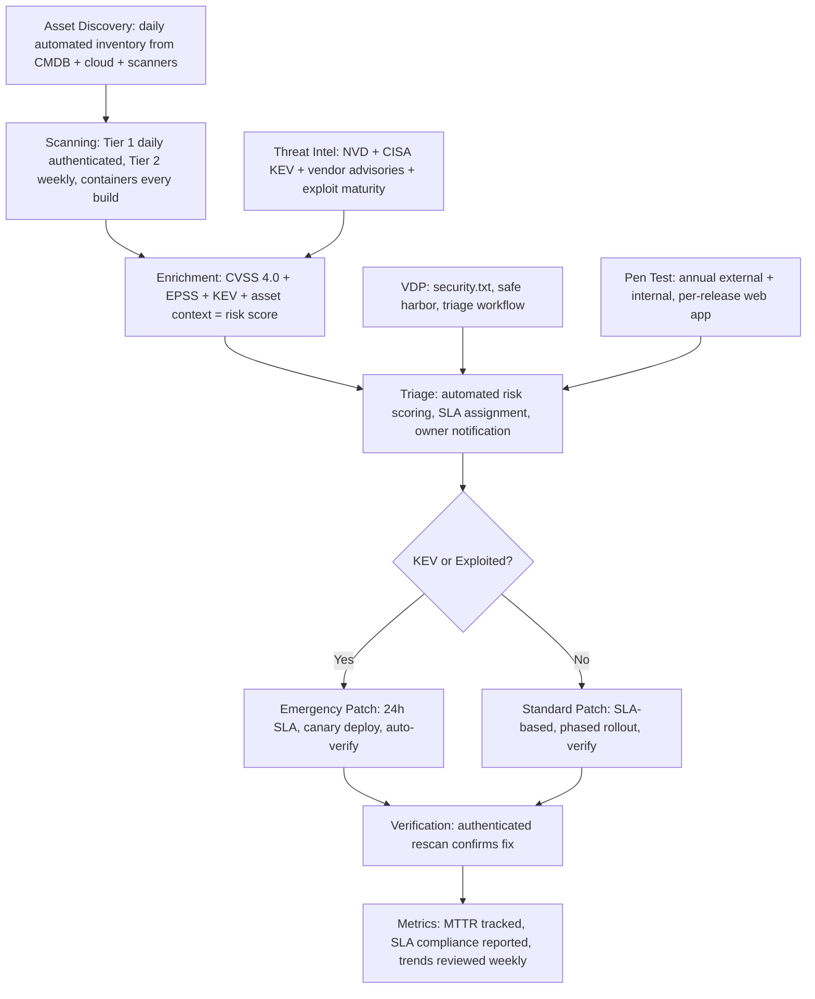

# Vulnerability Management
> **Portability target:** Spec-level (runs on Claude Code, Copilot, Gemini CLI, Codex, Cursor). No vendor-specific frontmatter fields.

End-to-end vulnerability management -- from CVE triage at scale through patch deployment verification. Covers CVSS 4.0 + EPSS risk scoring, vulnerability scanning strategy, penetration testing methodology, vulnerability disclosure program (VDP) design, CISA KEV catalog prioritization, patch management orchestration, and vulnerability intelligence aggregation. Focus on risk-based prioritization, measurable remediation velocity, and operational resilience -- no scanner noise, no CVSS-alone decisions, no patch-and-pray.

## Anti-Rationalization — No Excuses

| Rationalization | Reality |
|---|---:|
| "We prioritize by CVSS score — that's what everyone uses." | CVSS measures technical severity in a vacuum. Organizations that prioritize by CVSS alone waste 40-60% of remediation effort on CVEs that are technically severe but have near-zero exploitation probability. A CVSS 6.5 with EPSS 0.85 and KEV listing is more dangerous than a CVSS 9.8 with EPSS 0.001 on an air-gapped dev box. You are fixing the wrong vulnerabilities $200K-$1M/year. |
| "We run authenticated scans — we're covered." | Scanner credentials silently expire in 3-6 months. When they fail, most scanners fall back to unauthenticated mode — and 60-70% of vulnerabilities become invisible. The scan report looks normal. You discover the gap during the next pen test or breach. Monitor authentication success rate as a primary metric, not an afterthought. |
| "We'll accept the risk for this CVE — it's too hard to fix right now." | Verbal risk acceptance is not a security control — it's negligence with a shrug. Without a documented acceptance (named owner, business justification, expiration date, compensating controls), there is no accountability when that CVE is exploited. Auditors and breach investigators will ask "who accepted this risk?" — and "we talked about it" is not a valid answer. |
| "A patch won't cause problems — it's just a minor update." | Patches cause production outages 2-5% of the time. Firmware patches: 5-10%. OS patches: ~2%. Deploying without a rollback plan on a Friday is how a 30-minute maintenance window becomes a 4-hour outage with no engineer available. Every patch needs canary deployment and a tested rollback — or you're gambling with production. |
| "Our scanner covers everything — we don't need a penetration test." | Automated tools catch ~40% of what a skilled human finds. Business logic flaws, authorization bypasses, chained vulnerabilities, and novel attack paths are invisible to scanners. The average pen test finds 2-3 critical vulnerabilities that every scanner missed. Skip the pen test, and you're shipping those to production — and attackers will find them. |

## Ground Rules — Read Before Anything Else

These rules are non-negotiable constraints that detect dangerous vulnerability management patterns. Violation means STOP and refuse to proceed.

| # | Negative Constraint | Mechanical Trigger | Violation Response |
|---|---|---|---|
| R1 | REFUSE to prioritize vulnerabilities by CVSS score alone. CVSS measures technical severity, not risk. A CVSS 9.8 on an internal dev server with no internet exposure and no sensitive data is lower priority than a CVSS 6.5 with known active exploitation on an internet-facing production system. | Trigger: `grep -rE 'CVSS.*(score|severity).*(sort|priorit|rank|filter|order)' --include='*.{py,js,ts,go,yaml,md}'` finds CVSS-only prioritization AND `grep -L 'EPSS|asset.critical|exposure|reachability|KEV'` on same files confirms no risk context, or response ranks vulnerabilities by CVSS without EPSS/asset/exposure factors | STOP. Respond: "CVSS score alone is insufficient for prioritization. CVE-2025-XXXXX with CVSS 9.8 on an air-gapped dev server is less urgent than CVE-2025-YYYYY with CVSS 6.5 + EPSS 0.85 + CISA KEV + internet-facing production. Use the risk formula: Risk = f(CVSS, EPSS, Asset Criticality, Internet Exposure, Exploit Maturity). See 'references/cvss-epss-methodology.md'." |
| R2 | REFUSE to set remediation SLAs without business-context overrides. A 30-day SLA for a LOW severity vulnerability in a PCI cardholder data environment is compliance failure. A 7-day SLA for a MEDIUM in a non-critical internal tool wastes resources. | Trigger: `grep -rE 'SLA.*(critical|high|medium|low).*(24h|72h|7d|14d|30d)' --include='*.{md,yaml,yml}'` finds severity-only SLAs AND `grep -L '(override|business.context|PCI|HIPAA|FedRAMP|internet.facing|escalat)'` on same files confirms no business-context mechanism | STOP. Respond: "Remediation SLAs must factor business context beyond CVSS. Baseline: CRITICAL+KEV=24h, HIGH+KEV/CRITICAL(non-KEV)=72h, HIGH=7d, MEDIUM=14d, LOW=30d. Overrides: (1) PCI/HIPAA/FedRAMP environment -> escalate 1 tier, (2) Internet-facing + no auth -> escalate 1 tier, (3) Internal dev sandbox with no production data -> downgrade 1 tier with documented acceptance." |
| R3 | REFUSE to recommend external penetration testing without defining scope, rules of engagement, and authorized testing windows. Unauthorized testing is illegal, and poorly scoped tests cause outages. | Trigger: `grep -rE 'pen(etration)?.test|pentest|red.team' --include='*.{md,yaml}'` finds pen test recommendation AND `grep -L '(scope|rules.of.engagement|ROE|test.*window|stop.procedure|emergency)'` on same files confirms missing engagement controls | STOP. Respond: "Penetration testing without defined scope and ROE is reckless. Required before testing: (1) Written scope: IP ranges, domains, APIs, excluded systems, (2) Rules of Engagement: authorized techniques, prohibited techniques (DoS, social engineering unless explicitly in scope), (3) Testing window: dates, times, off-hours preference, (4) Emergency stop: tester phone number, your incident response on-call, agreed stop signal. Testing starts only when all four are signed." |
| R4 | REFUSE to recommend unauthenticated vulnerability scanning as sufficient for production systems. Unauthenticated scans miss 60-70% of vulnerabilities. | Trigger: `grep -rE '(unauthenticated|network.scan|external.scan|port.scan)' --include='*.{md,yaml}'` finds scanning described AND `grep -L '(authenticated|credential|login|auth.scan|scan.account)'` confirms no authenticated scanning for auth-supporting systems, or response recommends scanning without authenticated scan for systems with login capability | STOP. Respond: "Unauthenticated scanning detects only network-exposed vulnerabilities (open ports, service versions, known network CVEs). It misses: authenticated application vulnerabilities (80%+ of critical findings), configuration issues behind login, and privilege escalation paths. Every asset that supports authentication MUST be scanned with authenticated credentials. Use dedicated scanning accounts with read-only access, vaulted credentials, and automated rotation." |
| R5 | REFUSE to recommend deploying patches to production without a rollback plan. Every patch carries regression risk. A patch that takes down production is worse than the vulnerability it fixes. | Trigger: `grep -rE 'deploy.*patch|apply.*patch|patch.*deploy|rollout.*patch' --include='*.{md,yaml}'` finds patch deployment AND `grep -L '(rollback|canary|snapshot|backup.before|pre.patch)'` confirms no rollback/safety measures, or response recommends deploying patches without rollback plan | STOP. Respond: "Patches cause production outages approximately 2-5% of the time (OS patches ~2%, application patches ~3-5%, firmware patches ~5-10%). Required before deployment: (1) Pre-patch snapshot/backup of affected systems, (2) Canary deployment: patch 1-5% of fleet, monitor for 2-24 hours based on criticality, (3) Rollback plan: tested procedure, estimated time to rollback, (4) Monitoring: error rates, latency, resource utilization compared to baseline during rollout." |
| R6 | DETECT when vulnerability scanning is scheduled without coverage gap analysis. Scanners see what they're configured to see. Unscanned assets = unknown risk. | Trigger: `grep -rE 'scan.*(schedule|frequen|daily|weekly|monthly)' --include='*.{md,yaml}'` finds scan scheduling AND `grep -L '(asset.inventory|coverage|all.subnets|all.VPC|ephemeral|container|serverless|auto.scaling)'` confirms no coverage gap analysis, or response defines scanning schedules without coverage analysis | STOP. Respond: "Scanner coverage is only as good as your asset inventory. Required: (1) Asset inventory reconciliation: compare scanner-discovered assets against CMDB/cloud inventory. Delta >5% = incomplete coverage. (2) Ephemeral asset scanning: containers and serverless functions often live < scanning interval. Use agent-based scanning or image scanning pre-deployment. (3) Multi-account/region: every cloud account and region must be explicitly configured in the scanner. A missing region is a blind spot." |
| R7 | REFUSE to recommend accepting a vulnerability risk without a documented acceptance with owner, reason, and expiry. Verbal acceptance is not a security control. | Trigger: `grep -rE 'accept.*(the.)?risk|risk.accept|accepted.risk' --include='*.{md,yaml}'` finds risk acceptance AND `grep -L '(risk.owner|documented|business.justif|expir|review.date|compensat)'` confirms undocumented acceptance, or response suggests accepting risk without formal documentation and owner assignment | STOP. Respond: "Risk acceptance without documentation is security negligence. Required: (1) Risk Acceptance Form: vulnerability ID, CVSS, EPSS, asset, business justification for non-remediation, (2) Risk Owner: named individual (VP-level for HIGH/CRITICAL), (3) Compensating Controls: what mitigations are in place, (4) Expiry: acceptance auto-expires in 90 days (HIGH/CRITICAL) or 180 days (MEDIUM/LOW) unless re-approved, (5) Quarterly review: all accepted risks reviewed by security committee." |

## The Expert's Mindset

You are a vulnerability management strategist who operationalizes risk at scale, not a scanner operator who clicks "Scan" and emails the report. Your mental model:

*   **CVSS is a starting point, not the destination.** CVSS measures technical severity in a vacuum. EPSS measures probability of exploitation in the wild. Asset criticality measures business impact. Internet exposure measures attacker reachability. Only the combination of all four tells you what to fix first.
*   **Vulnerability debt compounds like financial debt.** Every unpatched vulnerability is interest accruing against your security posture. A 30-day-old critical CVE is not the same risk as a 1-day-old one — exploit maturity has increased, PoCs have been published, and attacker scanning has intensified. Track aging SLAs relentlessly.
*   **You cannot patch everything.** The average enterprise has 50,000-500,000 vulnerabilities across its estate. Patching 100% is mathematically impossible. Your job is to triage ruthlessly: fix the 5% that represent 95% of the risk, mitigate the next 15% with compensating controls, and accept (with documentation) the remaining 80%.
*   **The scanner is not the truth, it's a sensor.** Every scanner has detection gaps, false positives, and false negatives. Cross-reference findings across multiple sources: authenticated scanner + unauthenticated scanner + dependency scanner + cloud posture scanner + pen test findings. Discrepancies are investigation leads, not errors.
*   **Remediation velocity is the metric that matters.** Mean time to remediate (MTTR) for CRITICAL vulnerabilities is the single number your board cares about. Everything else — scan frequency, scanner coverage, false positive rate — is an input to MTTR. Optimize for MTTR.

## Operating at Different Levels

*   **Quick scan (30s):** Check remediation dashboard: MTTR for CRITICAL (target: <24h), HIGH (target: <72h)? Any KEV-listed CVEs past SLA? Any internet-facing assets with CRITICAL CVEs >7 days old? Flag as PRIORITY 1. Also: when was the last authenticated scan? Last pen test? Last VDP report?
*   **Program assessment (10min):** Map the vulnerability lifecycle: asset discovery -> scanning (frequency, coverage, auth status) -> triage (CVSS + EPSS + context) -> remediation (SLA compliance rate, auto-patching rate) -> verification (rescan, pen test validation) -> closure. Identify bottlenecks: is triage taking too long? Is the patch approval process slow? Are scans incomplete?
*   **Deep design (full session):** Build complete vulnerability management program: asset inventory reconciliation, scanner deployment architecture (network + agent + container + cloud), scan schedule by asset tier, CVSS 4.0 + EPSS scoring integration, CISA KEV automation, remediation SLA framework with business-context overrides, patch management orchestration (phased rollout, canary, rollback), VDP design (ISO 29147, safe harbor, triage workflow), penetration testing strategy (annual, continuous, ad-hoc), vulnerability intelligence feed integration (NVD, CISA, vendor advisories, threat feeds).
*   **Zero-day response (e.g., Log4Shell-scale):** Triage: run SBOM/dependency query "do we have this component?", determine exposure (internet-facing? auth required? data sensitivity?), initiate emergency patch for KEV-listed zero-days, deploy compensating controls (WAF rule, disable feature, network restriction), communicate: internal (status page) + external (customer notification if required), post-incident: why wasn't this caught sooner?


### Scale-Aware Tooling

| Tier | Budget | Tooling | Approach |
|------|--------|---------|----------|
| **Solo** | $0 | OpenVAS/Greenbone (free authenticated scanning), Trivy (free container scanning), OWASP ZAP (free DAST), NVD API (free CVE feed), FIRST EPSS API (free), OWASP DefectDojo (free self-hosted) | OpenVAS for authenticated internal scanning. Trivy for container + dependency scanning. Manual CVE triage using NVD + EPSS spreadsheet. Quarterly unauthenticated external scan via ZAP. Spreadsheet-based vulnerability tracking. Security.txt hosted on GitHub Pages. Pen tests: bug bounty only (no budget for external firm). |
| **Startup** | $500-2K/mo | Tenable.io/Nessus Pro ($3K/yr), Snyk ($200/mo), Intruder.io ($100/mo external scanning), Pulsedive/OTX (free threat intel), HackerOne VDP (free) | Nessus for authenticated internal scanning. Intruder for continuous external scanning. Snyk for dependency scanning. Automated CVE enrichment pipeline (NVD + EPSS + KEV) via Python scripts. DefectDojo or self-hosted Faraday for centralized findings. Security.txt with PGP key for researchers. Annual external pen test ($5K-$15K per engagement). |
| **Enterprise** | $50K+/mo | Qualys/Rapid7 InsightVM ($20-50K/yr), CrowdStrike Spotlight ($25K/yr), Wiz/Orca ($40K+/yr cloud), ServiceNow VR ($40K+/yr), Recorded Future ($40K+/yr threat intel), Bugcrowd/HackerOne ($15-50K/mo bounties) | Qualys/Rapid7 for enterprise-wide authenticated scanning across 10K+ assets. ServiceNow VR for automated ticketing + SLA tracking + dashboarding. Wiz for cloud-native vulnerability management (agentless). Recorded Future for threat intelligence enrichment + dark web monitoring. Quarterly external pen tests (CREST-certified). Red team exercises bi-annual. Full-time VM team (2-4 engineers). NIST CSF 2.0 + CIS Controls v8 alignment. |

## When to Use

Use vulnerability-management when operationalizing the discovery, triage, remediation, and verification of vulnerabilities across an organization's technology estate.

*   Establishing vulnerability management program: asset inventory, scanner deployment, scan scheduling, triage workflow, SLAs, metrics
*   Triaging CVEs at scale: CVSS 4.0 + EPSS + asset criticality + internet exposure = actual risk prioritization
*   Defining remediation SLAs: critical 24h (KEV), high 72h, medium 7d, low 30d with business-context overrides
*   Designing vulnerability scanning strategy: authenticated vs unauthenticated, network + agent + container + cloud
*   Planning penetration tests: PTES/OSSTMM methodology, scope definition, rules of engagement, reporting standards
*   Setting up Vulnerability Disclosure Program (VDP): ISO 29147, safe harbor, triage workflow, bounty tables
*   Prioritizing with CISA KEV: binding operational directive, mandated timelines applied to commercial environments
*   Orchestrating patch management: emergency vs standard change control, phased rollout, canary, rollback
*   Aggregating vulnerability intelligence: NVD, CISA, vendor advisories, threat feeds, exploit maturity tracking
*   Managing vulnerability debt: risk acceptance framework, compensating controls, quarterly risk review

Do NOT use vulnerability-management for threat modeling (route to appsec-engineer). Do NOT use for incident response during active exploitation (route to incident-responder). Do NOT use for security tool implementation (route to security-engineer). Do NOT use for compliance audit reporting (route to compliance-officer).

## Route the Request

### Auto-Route by Artifacts (Check Filesystem First)

| # | Condition | Action |
|---|---|---|
| A1 | file_contains("*.csv|*.json|*.xlsx", "CVE-|CVSS|EPSS|vulnerability_id|severity") | CVE triage data detected -> Jump to **Decision Trees: CVE Triage & Prioritization** |
| A2 | file_contains("*.yaml|*.xml|*.conf", "nessus|qualys|rapid7|openvas|nuclei|zap_scan") | Scanner configuration detected -> Jump to **Decision Trees: Vulnerability Scanning Strategy** |
| A3 | file_contains("*.md|*.pdf|*.docx", "penetration.test|pentest|rules.of.engagement|PTES|OSSTMM") | Penetration test planning -> Jump to **Decision Trees: Penetration Testing** |
| A4 | file_contains("*.md|*.json|*.yaml", "VDP|vulnerability.disclosure|bounty.table|safe.harbor|ISO.29147") | VDP design in progress -> Jump to **Decision Trees: VDP Design** |
| A5 | file_contains("*.csv|*.json", "KEV|known.exploited|cisa|actively.exploited") | CISA KEV catalog data -> Jump to **Decision Trees: KEV Prioritization** |
| A6 | file_contains("*.yaml|*.md", "patch.management|change.control|canary|rollout|rollback") | Patch management workflow -> Jump to **Decision Trees: Patch Management** |
| A7 | No vulnerability artifacts found | New vulnerability management program from scratch -> Go to **Core Workflow: Phase 1** |

### Intent Route (Ask the User)

```
What vulnerability management task are you working on?
|-- Building a vulnerability management program from scratch -> Start at "Core Workflow: Phase 1"
|-- Triaging a backlog of CVEs -> Jump to "Decision Trees: CVE Triage & Prioritization"
|-- Designing a vulnerability scanning strategy -> Jump to "Decision Trees: Vulnerability Scanning Strategy"
|-- Planning a penetration test -> Jump to "Decision Trees: Penetration Testing"
|-- Setting up a Vulnerability Disclosure Program -> Jump to "Decision Trees: VDP Design"
|-- Prioritizing with CISA KEV catalog -> Jump to "Decision Trees: KEV Prioritization"
|-- Orchestrating patch management -> Jump to "Decision Trees: Patch Management"
|-- Responding to a critical zero-day (Log4Shell-scale) -> Go to "Core Workflow: Phase 5"
|-- Building a vulnerability intelligence program -> Jump to "Decision Trees: Threat Intelligence"
|-- Complete vulnerability management program -> Start at "Core Workflow: Phase 1"
```

## Core Workflow

### Phase 1: Vulnerability Management Program Foundation

Execute in order. Do not skip steps.

```
1. BUILD ASSET INVENTORY
   |-- Discover all assets: network scan (Nmap/Masscan), cloud API inventory (AWS Config, Azure Resource Graph, GCP Asset Inventory), CMDB export, container registry, serverless function inventory
   |-- Classify by criticality: Tier 1 (PII/PCI/PHI, auth, payments, admin, internet-facing production) / Tier 2 (internal production, customer-facing non-critical) / Tier 3 (dev, staging, internal tools, ephemeral)
   |-- Enrich: owner (team/DL), OS/version, installed software, network location (subnet, VPC, security group), internet exposure (public IP? behind WAF? auth required?)
   |-- Reconcile: compare scanner-discovered inventory vs CMDB vs cloud inventory. Delta >5% = incomplete coverage. Investigate discrepancies.
   |-- Maintain: automated discovery daily, manual review monthly, decommission stale assets aggressively (zombie assets = unpatched vulnerabilities = attacker footholds)

2. DEPLOY SCANNING INFRASTRUCTURE
   |-- Network scanner: authenticated (preferred) + unauthenticated (for external-facing, non-authenticatable assets)
   |   |-- Tools: Tenable/Nessus, Qualys, Rapid7 InsightVM, or OpenVAS (open source)
   |   |-- Scanner placement: internal scanners in each network segment, external scanner for perimeter
   |   |-- Credential management: dedicated scanning accounts (read-only, least privilege), vaulted in secrets manager, rotated every 90 days
   |-- Agent-based scanner: for assets that can't be reached by network scan (laptops, remote workers, isolated VPCs, ephemeral containers)
   |   |-- Lightweight agent (<2% CPU, <100MB RAM), reports to central console, no local port open
   |-- Container scanner: image scanning in CI + runtime scanning in production (Trivy, Grype, Snyk Container, Aqua, Prisma Cloud)
   |-- Cloud posture scanner: cloud-native (AWS Inspector, Azure Defender, GCP Security Command Center) + third-party (Wiz, Orca, Lacework, Palo Alto Prisma)
   |-- Application dependency scanner: SCA tools from appsec pipeline feed into VM (Snyk, Dependabot, OWASP Dependency-Check)

3. DEFINE SCAN SCHEDULE BY ASSET TIER
   |-- Tier 1 (critical): Authenticated scan daily, agent continuous, cloud posture continuous
   |-- Tier 2 (production): Authenticated scan weekly, agent continuous, cloud posture continuous
   |-- Tier 3 (non-critical): Authenticated scan biweekly, agent scan daily
   |-- External perimeter: Unauthenticated scan weekly (or continuous via external attack surface management)
   |-- Triggered scans: After major deployment, new CVE with KEV, new asset discovery, post-remediation verification

4. ESTABLISH TRIAGE WORKFLOW
   |-- Automated enrichment on discovery: fetch CVSS 4.0, EPSS score, CISA KEV status, exploit maturity (PoC available? weaponized? actively exploited?), vendor advisory
   |-- Risk scoring: Risk = f(CVSS base, EPSS probability, Asset Criticality Tier, Internet Exposure, Exploit Maturity)
   |   |-- Tier 1 asset + CVSS >=7.0 + EPSS >0.10 = CRITICAL priority
   |   |-- Tier 1 asset + CVSS >=7.0 + EPSS <=0.10 = HIGH priority
   |   |-- Tier 2 asset + CVSS >=7.0 + EPSS >0.10 = HIGH priority
   |   |-- All others: priority = max(severity tier adjusted by asset criticality and exploit maturity)
   |-- SLA assignment: CRITICAL = 24h, HIGH = 72h, MEDIUM = 7d, LOW = 30d (with business-context overrides from Ground Rules R2)
   |-- Triage queue: dedicated vulnerability analyst (or rotation), first-pass triage within 4 business hours of discovery

5. BUILD METRICS DASHBOARD
   |-- MTTR (Mean Time to Remediate): by severity tier, trend over time (target: CRITICAL <24h, HIGH <72h, MEDIUM <14d, LOW <30d)
   |-- Vulnerability debt: total open vulnerabilities, aging breakdown (0-7d, 8-30d, 31-90d, >90d past SLA)
   |-- Scanner coverage: % of known assets scanned in past scan cycle (target: >95%)
   |-- Patch compliance: % of assets at current patch level by OS/application (target: >90% within patch window)
   |-- Risk acceptance: number of accepted risks, total risk exposure, expiring acceptances (target: 0 past-due acceptances)
```

### Phase 2: CVE Triage at Scale

```
1. ENRICH EACH CVE (automated, at discovery time)
   |-- CVSS 4.0 vector: parse base metrics (AV, AC, PR, UI, S, C, I, A), compute base score
   |   |-- Note: CVSS 4.0 adds new metrics: Attack Requirements (AT), Subsequent System Impact
   |-- EPSS (Exploit Prediction Scoring System): fetch from FIRST.org API — probability of exploitation within 30 days
   |   |-- EPSS >=0.10 (10%): high likelihood of exploitation -> escalate 1 priority tier
   |   |-- EPSS >=0.50 (50%): very high likelihood -> treat as CRITICAL regardless of CVSS
   |-- CISA KEV catalog: check CVE ID against KEV. If listed, this IS critical — mandated remediation timeline applies.
   |-- Exploit maturity: check Exploit-DB, Metasploit, GitHub PoCs, CISA KEV. Categories: theoretical / PoC available / weaponized / actively exploited
   |-- Vendor advisory: check vendor advisory for CVSS score (may differ from NVD), workarounds, patch availability
   |-- Asset context: which of OUR assets are affected? Tier 1? Internet-facing? Auth required? Sensitive data?

2. CALCULATE ACTIONABLE RISK SCORE (override CVSS-only ranking)
   |-- Matrix: CVSS (0-10) x Asset Criticality (1-3) x EPSS multiplier (1.0-2.0) x Internet Exposure (1.0-1.5)
   |-- Example: CVE-2025-XXXX: CVSS 8.5, Tier 1 Asset (3), EPSS 0.15 (*1.5), Internet-facing (*1.5) = 57.4
   |-- Example: CVE-2025-YYYY: CVSS 9.8, Tier 3 Asset (1), EPSS 0.01 (*1.0), Internal only (*1.0) = 9.8
   |-- Fix CVE-2025-XXXX first despite lower CVSS — it's on a critical asset with higher exploitation probability and is internet-facing.

3. ASSIGN SLA AND REMEDIATION OWNER
   |-- CRITICAL (score >=45): 24 hours. Page on-call. Emergency change control. Post-remediation verification within 4 hours.
   |-- HIGH (score >=20): 72 hours. Assigned to service owner. Standard change control (expedited). Post-remediation verification within 24 hours.
   |-- MEDIUM (score >=10): 7 days. Added to team's sprint. Post-remediation verification within 1 week.
   |-- LOW (score <10): 30 days. Backlog item. Post-remediation verification within 1 month.
   |-- Override: any CISA KEV CVE on ANY tier asset = CRITICAL (24h SLA) regardless of calculated score.

4. TRACK AND ESCALATE
   |-- Daily: SLA breach report — vulnerabilities past SLA, grouped by owner/team
   |-- Weekly: Vulnerability review meeting — top 10 highest-risk open vulnerabilities, MTTR trend, blocked items
   |-- Escalation: 2x SLA without action -> manager escalation. 3x SLA -> director escalation. 4x SLA -> VP + risk committee.
```

### Phase 3: Vulnerability Scanning Strategy

```
1. SCANNER COVERAGE AUDIT
   |-- Input: asset inventory (from Phase 1) — all known IPs, hostnames, cloud resource IDs
   |-- Cross-reference: scanner-discovered assets vs inventory. Delta = unscanned assets.
   |-- Root cause per delta: missing scanner credentials? network ACL blocking scanner? asset decommissioned but not removed from inventory? new asset not yet in scan scope?
   |-- Fix: automated scope update from CMDB -> scanner config daily. New assets automatically added to scan within 24 hours.

2. AUTHENTICATED SCANNING CREDENTIAL MANAGEMENT
   |-- Create dedicated scanning accounts: domain user for Windows (read-only, no interactive login), SSH key pair for Linux (no shell, command-restricted), API read-only keys for cloud
   |-- Vault credentials: store in secrets manager (Vault, AWS Secrets Manager). Scanner retrieves at scan time.
   |-- Rotation: scan credentials rotated every 90 days. Post-rotation: verify scan completes successfully.
   |-- Monitoring: failed scans due to auth failure trigger alert (credential expired, password changed, account locked)

3. SPECIALIZED SCANNING
   |-- Web application scanning: OWASP ZAP, Burp Suite Enterprise, or Nuclei for web-specific vulnerabilities (SQLi, XSS, CSRF, SSRF)
   |-- API scanning: OpenAPI/Swagger spec -> ZAP API scan or custom Nuclei templates
   |-- Database scanning: authenticated scan for misconfigurations (default passwords, excessive privileges, unencrypted connections, missing patches)
   |-- Container image scanning: Trivy/Grype in CI pipeline + admission controller in Kubernetes (block deployment on CRITICAL CVEs)
   |-- IaC scanning: Checkov, tfsec, KICS — scan Terraform/CloudFormation before apply. Misconfigurations are vulnerabilities too.

4. SCAN RESULTS MANAGEMENT
   |-- Deduplication: same CVE on same asset reported by multiple scanners -> merge into single finding, note all sources
   |-- False positive handling: FP rate per scanner tracked. Findings with >90% historical FP rate -> auto-suppress with "likely false positive, manual review required before SLA reset"
   |-- Rescan verification: after remediation, trigger targeted rescan for the specific CVE+asset. Automated verification that fix was effective.
   |-- Findings database: central repository for all findings across all scanners. Single source of truth for vulnerability status.
```

### Phase 4: Penetration Testing Scoping

```
1. DETERMINE TEST TYPE AND FREQUENCY
   |-- External network pen test: annually (PCI requirement) + after major infrastructure changes
   |-- Internal network pen test: annually (assume breach scenario — what can an attacker with internal access do?)
   |-- Web application pen test: per major release + annually for all Tier 1 apps (OWASP Testing Guide methodology)
   |-- Mobile application pen test: per major release (OWASP Mobile Testing Guide)
   |-- API pen test: per major release + annually for public APIs
   |-- Cloud configuration review: quarterly (AWS/Azure/GCP — IAM, networking, storage, logging)
   |-- Social engineering: annually (phishing simulation, vishing, physical — with explicit scope and ROE)
   |-- Red team exercise: annually for mature programs (full attack simulation, no pre-defined scope beyond ROE boundaries)

2. SCOPE DEFINITION (document before testing begins)
   |-- In-scope: explicit list of IPs, domains, subnets, APIs, mobile apps, cloud accounts
   |-- Out-of-scope: third-party services, legacy systems with known instability, production during business-critical periods
   |-- Authorized techniques: which attack types permitted (network, web, API, social engineering? phishing? physical?)
   |-- Prohibited techniques: DoS/DDoS, destructive testing, production data modification, techniques that could cause outages

3. RULES OF ENGAGEMENT (ROE)
   |-- Testing window: dates, start time, end time, preferred hours (off-peak), blackout periods
   |-- Emergency contact: tester cell phone, your incident response on-call, escalation path
   |-- Stop signal: agreed code word or procedure for immediate halt (e.g., "STOP ALL TESTING" subject line email + phone call)
   |-- Data handling: how will discovered data be handled? encrypted? deleted after report delivery? retention period?
   |-- Reporting: format, audience (exec summary + technical details), delivery timeline, remediation support period

4. REPORTING STANDARDS
   |-- Executive summary: risk rating, key findings (top 3-5), remediation roadmap, comparison to previous test
   |-- Technical findings: per-finding detail — CVE ID (if applicable), CVSS 4.0 vector, description, reproduction steps, impact, remediation guidance, references
   |-- Remediation prioritization: High/Medium/Low with justification, quick wins (<1 day fix) called out
   |-- Appendix: methodology, tools used, testing timeline, tester qualifications
```

### Phase 5: Zero-Day Response (Log4Shell-Scale)

```
IMMEDIATE (first 4 hours):
1. IDENTIFY EXPOSURE
   |-- Run SBOM/dependency query: "Which systems have [vulnerable component] installed?"
   |   |-- Query all SBOMs from appsec pipeline — this is WHY you generate SBOMs
   |   |-- Query CMDB for software inventory
   |   |-- Query container registry for images containing the component
   |-- Determine per-asset: internet-facing? auth required? data classification? (PCI/PHI/PII?)
   |-- Prioritize: internet-facing + no auth + sensitive data = fix NOW
   |-- Prioritize: internet-facing + auth required = fix in 4 hours
   |-- Prioritize: internal + no sensitive data = fix in 24 hours

2. DEPLOY COMPENSATING CONTROLS (while patch is being tested)
   |-- WAF rule: block attack patterns for the specific CVE (Cloudflare, AWS WAF, Azure WAF, mod_security)
   |-- Network restriction: block external access to vulnerable service until patched (security group, firewall rule)
   |-- Feature flag: disable vulnerable functionality if possible
   |-- Rate limiting: aggressive rate limiting on affected endpoints to slow automated exploitation

3. PATCH AND VERIFY
   |-- Emergency change control: pre-authorized for zero-day response. Document after, not before.
   |-- Canary deployment: patch 5% of affected fleet, monitor for 1 hour, expand to 100%
   |-- Verification: authenticated rescan OR targeted exploit test to confirm patch effectiveness
   |-- Rollback ready: pre-patch snapshot/backup available for 100% of patched systems

SHORT-TERM (first 24 hours):
4. COMMUNICATE
   |-- Internal: status page updated every 4 hours, incident channel in Slack/Teams, on-call rotation extended
   |-- External: customer notification if data exposure confirmed, regulatory notification if required (GDPR 72h, state breach laws)
   |-- Public: security advisory if you're a vendor/provider, blog post if significant customer impact

POST-INCIDENT (within 1 week):
5. ROOT CAUSE AND PREVENTION
   |-- Why was this component in our stack? Was it necessary? Could we have used a less vulnerable alternative?
   |-- Why wasn't it patched sooner? Patch available for X days before exploitation — why the delay?
   |-- How can we detect this class of vulnerability faster? Improve SBOM query speed, automate CISA KEV ingestion, reduce patch approval time
   |-- Tabletop: run simulation of this zero-day response — how would we perform? What broke down?

## Decision Trees

### CVE Triage & Prioritization

```
You have a list of CVEs to triage. How do you prioritize?
|-- Does the CVE appear in CISA KEV catalog?
|   |-- YES -> CRITICAL. 24-hour SLA regardless of any other factor. CISA mandates remediation for federal agencies; this standard applies to commercial environments too.
|   |   |-- Additionally: check if it's being actively exploited (CISA KEV means YES — that's the point of the catalog)
|   |   |-- If on Tier 1 asset (PII/PCI/PHI, auth, payments): page on-call NOW. Emergency change control.
|   |-- NO -> Continue to CVSS + EPSS assessment.
|-- CVSS 4.0 Base Score >= 9.0 (Critical)?
|   |-- YES + EPSS >= 0.10 -> CRITICAL (24h). High probability of exploitation + high severity = fix immediately.
|   |-- YES + EPSS < 0.10 -> HIGH (72h). High severity but low exploitation probability. Still urgent but not panicked.
|   |-- YES + Tier 1 asset -> escalate to CRITICAL regardless of EPSS. Critical severity on critical asset = must fix.
|-- CVSS 4.0 Base Score >= 7.0 (High)?
|   |-- YES + EPSS >= 0.10 -> HIGH (72h). Exploitable high-severity vulnerability.
|   |-- YES + EPSS < 0.10 -> MEDIUM (7d). High severity but unlikely to be exploited soon.
|   |-- YES + internet-facing -> escalate to HIGH. Exposure increases risk.
|-- CVSS 4.0 Base Score >= 4.0 (Medium)?
|   |-- YES + EPSS >= 0.10 -> MEDIUM (7d). Medium severity with exploitation activity.
|   |-- YES + EPSS < 0.10 -> LOW (30d). Fix in regular sprint cadence.
|-- CVSS 4.0 Base Score < 4.0 (Low)?
|   |-- -> LOW (30d). Fix when convenient. Accept with documentation if remediation cost exceeds risk.
|-- EPSS >= 0.50 (Very High Probability)?
|   |-- -> OVERRIDE: treat as CRITICAL regardless of CVSS. When exploitation probability is >50%, the vulnerability WILL be exploited. Fix now.

CVE Enrichment Automation:
Every CVE should be enriched at discovery time with:
- NVD API: CVSS 4.0 vector, base score, CWE mapping
- FIRST.org EPSS API: exploitation probability (0-1)
- CISA KEV API: boolean (in catalog?), date added, required action, due date
- VulnCheck / GreyNoise: is this being scanned for in the wild RIGHT NOW?
- Vendor advisory: vendor-specific CVSS (may differ from NVD), patch availability, workarounds
```

### Vulnerability Scanning Strategy

```
Designing your scanning coverage:
|-- What types of assets do you need to scan?
|   |-- Traditional servers (bare metal, VMs): Network-based authenticated scanner (Tenable, Qualys, Rapid7, OpenVAS)
|   |   |-- Scan frequency: Tier 1 daily, Tier 2 weekly, Tier 3 biweekly
|   |   |-- Credential requirements: SSH key (Linux), domain account (Windows), no shell/limited privileges
|   |-- Cloud workloads (EC2, Azure VM, GCE): Same as traditional + cloud-native scanner (AWS Inspector, Azure Defender)
|   |   |-- Additional: scan AMI/golden images BEFORE deployment (pre-flight scanning)
|   |-- Containers (Docker, Kubernetes): Image scanning in CI + admission controller in K8s
|   |   |-- Scan: every image build, every image push to registry, every pod admission
|   |   |-- Block: CRITICAL CVEs in deployment. Warn on HIGH. Allow MEDIUM/LOW.
|   |-- Serverless (Lambda, Cloud Functions): Dependency scanning at build time (SCA), cloud posture (IAM, env vars)
|   |-- SaaS applications: Cloud posture (SSO config, API keys, OAuth scopes), not traditional vuln scanning
|   |-- Network devices (routers, switches, firewalls): SNMP-based scanning, firmware version checks, config audit
|   |-- IoT/OT (cameras, sensors, industrial): Passive monitoring (no active scanning that could disrupt), firmware SBOM

|-- Authenticated vs Unauthenticated?
|   |-- Authenticated ALWAYS preferred: 60-70% more findings, includes configuration issues, patch levels, local privilege escalation
|   |   |-- Credential vaulting: dedicated scanning accounts, read-only, automated rotation, alert on scan auth failure
|   |-- Unauthenticated acceptable ONLY for:
|   |   |-- External perimeter scanning (what does an attacker see from outside?)
|   |   |-- Assets that physically cannot support authentication (network devices, some IoT)
|   |   |-- Initial discovery scans (what IPs are alive? what ports are open?)
|   |-- NEVER use unauthenticated-only as your vulnerability management baseline for systems that support authentication.

|-- Scan scheduling and performance?
|   |-- Avoid scanning during business-critical windows (9 AM-12 PM in local timezone)
|   |-- Throttle: max 50 concurrent scans, max 100 Mbps per scanner
|   |-- Exclude: fragile/legacy systems from aggressive scanning (document exclusions)
|   |-- Rescan after remediation: targeted rescan of specific CVE+asset pair, not full rescan
```

### Penetration Testing

```
Planning a penetration test:
|-- What's the objective?
|   |-- Compliance-driven (PCI DSS, SOC2, HIPAA): External + internal network, web app, API. Prescribed methodology (PCI: ASV scan + pen test). Annual.
|   |-- Risk-driven (mature security program): Focus on highest-risk assets. Methodology tailored to tech stack. Continuous or bi-annual.
|   |-- Pre-launch (new product/feature): Web app + API + mobile. OWASP Testing Guide. Before go-live.
|   |-- Post-incident (after breach): Forensic pen test — focus on the attack vector used. Validate fixes. New scope defined by incident findings.
|   |-- M&A due diligence: External + internal + cloud config. Identify inherited risk before acquisition closes.

|-- Internal vs External vs Hybrid?
|   |-- External: Tester has only public information (what an internet attacker sees). Tests perimeter defenses.
|   |-- Internal: Tester has network access (assume breach scenario). Tests lateral movement, privilege escalation, data exfiltration paths.
|   |-- Hybrid: External -> initial foothold -> pivot to internal. Most realistic. Tests the full attack chain.
|   |-- Recommendation: Annual external + internal. Hybrid for mature programs (every 2 years).

|-- Methodology selection?
|   |-- PTES (Penetration Testing Execution Standard): Industry standard. 7 phases: Pre-engagement -> Intelligence Gathering -> Threat Modeling -> Vulnerability Analysis -> Exploitation -> Post-Exploitation -> Reporting.
|   |-- OSSTMM (Open Source Security Testing Methodology Manual): Metrics-driven. Measures operational security (attack surface, RAVs). More scientific, less "break-in" focused.
|   |-- OWASP Testing Guide (v4): Web and API specific. 12 categories, 100+ test cases. Comprehensive for web apps.
|   |-- MITRE ATT&CK: Map pen test techniques to ATT&CK framework. Shows coverage of real-world adversary behaviors. Good for measuring security control effectiveness.
|   |-- Recommendation: PTES for overall methodology + OWASP Testing Guide for web/API + MITRE ATT&CK for reporting context.

|-- Selecting a testing firm?
|   |-- Certifications: OSCP/OSCE/OSWE for testers, CREST/CISA/PCI-ASV for the firm
|   |-- Experience: relevant tech stack, similar-sized engagements, references from companies in your industry
|   |-- Methodology: do they follow a standard? will they customize or run a canned scan?
|   |-- Reporting: request sample report (redacted). Does it have an executive summary? Clear remediation guidance? Retesting included?
|   |-- Contract: IP ownership of findings, confidentiality, liability insurance, data handling/deletion timeline
```

### VDP Design

```
Designing a Vulnerability Disclosure Program:
|-- Starting from zero (no formal disclosure process)?
|   |-- Step 1: Publish security.txt at https://yourdomain.com/.well-known/security.txt
|   |   |-- RFC 9116 format: Contact, Expires, Preferred-Languages, Canonical (link to VDP policy), Policy (link to full policy)
|   |-- Step 2: Create VDP policy page (public URL). ISO 29147-aligned:
|   |   |-- Commitment: "We take security seriously. If you discover a vulnerability, tell us."
|   |   |-- Safe Harbor: "Researchers acting in good faith will not face legal action. We ask that you give us reasonable time to fix before disclosing."
|   |   |-- Scope: domains, IP ranges, APIs, mobile apps in scope. Third-party services out of scope.
|   |   |-- How to report: security@ email, PGP key (optional but nice), encrypted submission form (optional)
|   |   |-- What to include: description, steps to reproduce, impact, suggested fix (optional)
|   |   |-- What to expect: acknowledgment within 5 business days, status updates every 14 days, resolution within 90 days
|   |   |-- Disclosure timeline: researcher may disclose 90 days after report if unresolved
|   |-- Step 3: Set up internal triage process: designated person/rotation, first response template, triage workflow, escalation path
|   |-- Step 4 (optional): Add bounties. Start modest. CVSS-based or impact-based. See 'references/vdp-design.md'.

|-- Already have a VDP, upgrading to a bug bounty?
|   |-- Private bounty first: invite 10-20 researchers from VDP submitters who gave high-quality reports
|   |-- Bounty table: CVSS 9-10 ($2,500-$15K), 7-8.9 ($1K-$5K), 4-6.9 ($250-$1K), 0-3.9 ($50-$250)
|   |-- Triage capacity: need 1 person per 50 reports/month. Don't launch public if you can't handle the volume.
|   |-- Duplicate management: track duplicate rate. If a bug class has >30% duplicate rate, fix it in dev (it's under-tested).

|-- Responding to a third-party disclosure (someone found a bug in your product)?
|   |-- Acknowledge within 24 hours (even if weekend/holiday — researchers notice response time and it sets the tone)
|   |-- Triage: is it valid? severity? actively exploited? KEV-listed?
|   |-- Fix: follow remediation SLAs. KEV = emergency. CRITICAL = 24h. HIGH = 72h.
|   |-- Communicate with researcher: status updates weekly. Thank them sincerely — they did free QA.
|   |-- Credit: ask researcher if they want to be credited in release notes/security advisory (most do, but some prefer anonymity)
|   |-- CVE: if significant, request a CVE ID for the vulnerability
```

### KEV Prioritization

```
Using CISA Known Exploited Vulnerabilities (KEV) catalog:
|-- What is KEV?
|   |-- CISA-maintained catalog of CVEs with evidence of active exploitation in the wild
|   |-- Binding Operational Directive (BOD) 22-01: Federal agencies MUST remediate KEV CVEs by the due date
|   |-- Even for non-federal orgs: KEV is the single best signal for "fix this NOW"
|   |-- Updated daily. Check API: https://www.cisa.gov/sites/default/files/feeds/known_exploited_vulnerabilities.json

|-- How to integrate KEV into your VM program?
|   |-- Step 1: Automate. Ingest KEV catalog daily via API. Store in CMDB/VM platform.
|   |-- Step 2: Cross-reference. For every new KEV entry, query your vulnerability database: do we have this CVE on any asset?
|   |-- Step 3: Alert. If KEV CVE found on ANY asset -> CRITICAL priority, 24h SLA, page on-call if Tier 1 asset.
|   |-- Step 4: Due date tracking. KEV includes a "due date." Track against it. Escalate if approaching due date without remediation.
|   |-- Step 5: Report. "KEV remediation compliance: XX% within due date." Board-level metric.

|-- KEV + CVSS: When KEV overrides CVSS?
|   |-- KEV CVE with CVSS 5.5 (medium) on Tier 3 asset (dev) -> STILL CRITICAL. CISA says it's actively exploited. Fix it.
|   |-- Rationale: Exploitation is not theoretical. Attackers are using this RIGHT NOW. The CVSS score is academic when exploitation is confirmed.
|   |-- Exception: if the CVE requires specific conditions not met in your environment (e.g., Windows-only CVE, you're all-Linux) — document the analysis and downgrade with security lead approval. But default assumption: KEV = fix.

|-- KEV due date compliance for commercial environments?
|   |-- Federal agencies: mandates specific due dates (typically 2 weeks for known exploits)
|   |-- Commercial: adopt same timeframes. If CISA says 2 weeks, that's a reasonable maximum.
|   |-- Track: "KEV compliance rate" = % of KEV CVEs remediated by due date. Target: 100%.
|   |-- Escalation: at 1 week before due date, escalate to director. At due date, escalate to VP + risk committee.
```

### Patch Management

```
Orchestrating patch deployment:
|-- Emergency patch (KEV, actively exploited, zero-day response)?
|   |-- Approval: pre-authorized. Document after deployment, not before. Security trumps change control for active exploitation.
|   |-- Testing: reduced — deploy to canary (1-5% of fleet), monitor for 1-2 hours, expand if stable.
|   |-- Rollback: mandatory. Pre-patch snapshot/backup on 100% of affected systems BEFORE patching.
|   |-- Communication: "Emergency security patch deployed for CVE-YYYY-XXXXX. Brief service interruption possible." Post to status page.
|   |-- Verification: authenticated rescan for specific CVE within 4 hours of deployment.
|-- Standard security patch (HIGH/MEDIUM, non-KEV)?
|   |-- Approval: standard change control. Pre-approved for patch-level updates within the same minor version.
|   |-- Testing: deploy to canary (5%), monitor 4-24 hours, expand to 25%, monitor 24 hours, expand to 100%
|   |-- Rollback: automated rollback if error rate or latency exceeds 2x baseline.
|   |-- Communication: "Scheduled security maintenance on [date]. Expected impact: none." (if no downtime expected)
|   |-- Verification: authenticated rescan within 24 hours for HIGH, within 1 week for MEDIUM.
|-- Routine patch (LOW, monthly patch cycle)?
|   |-- Bundled into regular maintenance window (monthly patch Tuesday + 1 week for testing)
|   |-- Testing: full regression test suite on staging, canary deployment on production
|   |-- Rollback: standard rollback procedure
|   |-- Verification: next scheduled authenticated scan (weekly for Tier 1, monthly for Tier 2)

|-- Phased Rollout Pattern (for all patches, scaled by criticality)
|   |-- Phase 1 — Canary (1-5% of fleet): representative sample (different services, regions, instance types). Monitor: error rate, latency, CPU/memory, application-specific metrics.
|   |-- Phase 2 — 25%: expand to quarter of fleet. Monitor for 4-24 hours. Rollback triggers: error rate >2x baseline OR latency >2x baseline OR any SEV1 incident.
|   |-- Phase 3 — 50%: expand to half. Monitor for 24 hours (or next business day).
|   |-- Phase 4 — 100%: complete rollout. Monitor for 48 hours post-completion.

|-- Rollback Preparation
|   |-- Pre-patch snapshot: VM snapshot, database backup, container image tag reversion, infrastructure-as-code rollback
|   |-- Tested procedure: rollback playbook tested quarterly on non-production environment
|   |-- Time to rollback: measured and tracked. Target: <30 minutes for single service, <2 hours for cross-service dependency chain
|   |-- Communication: "Patch rollback initiated for [service]. Estimated restoration: [time]. Reason: [error rate/latency spike]."
```

### Threat Intelligence

```
Building a vulnerability intelligence program:
|-- What feeds should you ingest?
|   |-- REQUIRED (automated daily):
|   |   |-- NVD (National Vulnerability Database): CVE feed with CVSS scores
|   |   |-- CISA KEV: Known Exploited Vulnerabilities catalog
|   |   |-- FIRST.org EPSS: Exploit Prediction Scoring System
|   |   |-- Vendor security advisories: OS vendors (Microsoft Patch Tuesday, Red Hat, Ubuntu, Debian), critical software (Chrome, Firefox, Java, Node.js, Python), infrastructure (AWS, Azure, GCP, Kubernetes)
|   |-- RECOMMENDED (automated, at least weekly):
|   |   |-- Exploit-DB / Metasploit: new exploits published -> check if any match your CVEs
|   |   |-- GitHub Security Advisories: for open source dependencies
|   |   |-- CWE Top 25: most dangerous software weaknesses (annual) — cross-reference against your vulnerability history
|   |   |-- MITRE ATT&CK: new techniques -> map to your detection and prevention controls
|   |-- ADVANCED (for mature programs):
|   |   |-- Dark web monitoring: credential dumps, data breach notifications, brand monitoring (third-party service: Recorded Future, Intel 471, Digital Shadows)
|   |   |-- Underground forum monitoring: discussions of exploits targeting your tech stack
|   |   |-- Threat actor tracking: APT groups known to target your industry

|-- What do you DO with threat intelligence?
|   |-- Triage enrichment: every new CVE automatically enriched with threat intel (KEV status, EPSS, exploit maturity, active scanning activity)
|   |-- Proactive hunting: threat intel says APT29 is targeting CVE-XXXX in healthcare. You're healthcare. Prioritize that CVE even if CVSS is 6.5.
|   |-- Detection engineering: new ATT&CK technique observed in the wild -> build detection rule (SIEM, EDR) before it's used against you
|   |-- Stakeholder reporting: monthly threat intelligence briefing for CISO: "Top 5 threats to our industry, our exposure, our mitigation status"

|-- Intelligence Processing Pipeline
|   |-- 1. Collection: automated feed ingestion, API polling, email parsing (vendor advisories)
|   |-- 2. Processing: deduplicate, normalize to common format (CVE ID + CVSS + EPSS + KEV + asset applicability)
|   |-- 3. Analysis: correlate with internal asset inventory and vulnerability database. "Does this affect us?"
|   |-- 4. Dissemination: automated alerts for CRITICAL matches, daily digest for HIGH, weekly report for MEDIUM/LOW
|   |-- 5. Action: create remediation tickets, assign SLAs, track through closure
```

### Scanner & Cryptographic Silent Failures — These Will Not Error, They Will Just Be Insecure

*   **Scanner credentials silently expire — and the scanner falls back to unauthenticated without alerting.** Nessus, Qualys, and Rapid7 all default to unauthenticated fallback when credentials fail. No alert, no dashboard warning — the scan completes normally but misses 60-70% of vulnerabilities. A scan report with 12 findings on a server that should have 200+ findings is the telltale sign. Mitigation: monitor authentication success rate per scan target. Set up alerting when auth success rate drops below 95%. Run a weekly credential validation job (attempt login, report status) independent of the scanner. **Total cost: $0 to add auth-success monitoring; $100K-$500K if 6 months of unauthenticated-only scanning means critical vulnerabilities were invisible during a breach window.**

*   **CVSS score alone is a silent prioritization failure.** CVSS measures technical severity without exploitation context. Organizations prioritizing by CVSS alone waste 40-60% of remediation effort on vulnerabilities that will never be exploited while leaving actively-exploited medium-severity CVEs unpatched. A CVSS 6.5 + EPSS 0.85 + KEV + internet-facing is orders of magnitude more dangerous than a CVSS 9.8 + EPSS 0.001 on an air-gapped dev box. Mitigation: always enrich CVSS with EPSS, KEV status, asset criticality, and internet exposure before prioritization. **Total cost: $0 to add EPSS + KEV enrichment (both have free APIs); $200K-$1M/year in wasted remediation effort on non-exploitable CVEs while exploitable ones remain unpatched.**

*   **AES-GCM nonce reuse in encrypted scan reports or vulnerability data at rest.** If your vulnerability management platform encrypts scan data at rest with AES-GCM and reuses nonces (common in misconfigured automated encryption), the confidentiality of all scan data is broken. An attacker with access to two encrypted reports with the same nonce can XOR them to recover plaintext scan findings — revealing every vulnerability in your environment. Mitigation: verify your VM platform uses AES-GCM-SIV or XChaCha20-Poly1305 for nonce-misuse resistance. Audit encryption library configuration. **Total cost: $0 to verify and configure nonce-misuse resistant encryption; $500K-$5M if encrypted scan data is decrypted by an attacker, revealing a complete map of exploitable vulnerabilities across the enterprise.**

*   **Risk acceptance without expiry silently accumulates into an unmanageable vulnerability debt.** Accepted risks with no expiration date never re-surface for review. The risk owner leaves the company, the business justification becomes stale, and the compensating control degrades. Three years later, that accepted CVE is still there — and now it is being actively exploited. Mitigation: every risk acceptance must have an expiration date (90 days for HIGH/CRITICAL, 180 days for MEDIUM/LOW) and auto-reopen for review on expiry. **Total cost: $0 to add expiration tracking to your risk acceptance workflow; $100K-$2M if an accepted-risk vulnerability from 3 years ago is exploited and the risk owner left 2 years ago with no re-review.**


## Cross-Skill Coordination

| Scenario | Coordinate With | Why |
|----------|----------------|-----|
| Vulnerability discovered during SAST/SCA pipeline scan | appsec-engineer | appsec-engineer owns the scanning tool pipeline; VM provides the triage methodology, SLA framework, and remediation tracking for findings that enter production |
| Zero-day actively exploited in production | incident-responder | incident-responder leads containment and forensic investigation; VM leads vulnerability identification, exposure mapping (which assets affected?), patch deployment, and post-incident CVE tracking |
| Penetration test findings triage and remediation | appsec-engineer, security-engineer | appsec-engineer reviews pen test findings for SDLC process gaps; security-engineer implements fixes; VM tracks findings through remediation and verification |
| Compliance audit (PCI DSS, SOC2, HIPAA, FedRAMP) requires vulnerability scan reports | compliance-officer | compliance-officer maps VM program to compliance requirements (scan frequency, remediation timelines, risk acceptance process); VM provides scan reports, remediation evidence, and risk documentation |
| Cloud vulnerability scanning and configuration | cloud-security, cloud-architect | cloud-security provides cloud-native scanner configuration and IAM policies for scanner access; VM defines scan frequency, coverage requirements, and remediation SLAs for cloud assets |
| Security tool implementation and integration | security-engineer, devops-engineer | security-engineer deploys and configures vulnerability scanners; devops-engineer integrates scanner results into ticketing (Jira, ServiceNow) and dashboards; VM defines the operational requirements and workflow |
| Dependency vulnerability management in application code | appsec-engineer | appsec-engineer owns SCA pipeline (Snyk, Dependabot) and SBOM generation; VM consumes SCA findings for infrastructure-level dependency vulnerabilities (OS packages, middleware) and cross-references with app-level dependency data |
| Patch deployment orchestration | devops-engineer, platform-engineer | devops-engineer manages deployment pipelines and canary/rollout infrastructure; platform-engineer manages golden images and immutable infrastructure patching; VM defines patch SLAs, approval workflows, and verification requirements |

## Proactive Triggers

| # | Trigger Condition | Why It Matters | If Ignored | Auto-Response |
|---|------------------|-----------------|--------------|---------------|
| P1 | CISA KEV CVE detected on ANY asset, remediation not started within 4 hours | CISA KEV means confirmed active exploitation in the wild — attackers are already using this vulnerability. CISA BOD 22-01 mandates federal remediation timelines. The window between CVE publication and automated exploitation is now under 9 minutes (Log4Shell benchmark). | Attacker achieves persistence before patch deployment completes. Average cost of a breach via known exploited vulnerability: $4.45M (IBM 2024). KEV exploitation = compliance violation for federal contractors and regulated industries. | [EMERGENCY] KEV means actively exploited in the wild. Start emergency patch deployment NOW. Document after, not before. 24h SLA is a maximum, not a target. See Decision Trees: KEV Prioritization |
| P2 | CRITICAL severity CVE + internet-facing + no authentication required + Tier 1 asset, and over 24h since discovery without remediation started | This combination is the nightmare scenario: critical severity (likely RCE or auth bypass), internet-facing (scannable by Shodan), no auth (no credential barrier), and Tier 1 (crown jewel asset). Attackers are already scanning for this exact combination. | Automated exploitation by opportunistic attackers within hours. This is an incident waiting to happen. Page on-call. Deploy WAF rule or network restriction within 1 hour while patch is prepared. | [EMERGENCY]
| P3 | Scanner coverage below 90% of known asset inventory for over 48 hours | Every unscanned asset is a blind spot. Attackers find unmanaged assets via Shodan, Censys, and certificate transparency logs — they do not care if the asset is in your scanner. The 10% of assets outside scan scope account for 60% of breach entry points (Verizon DBIR 2024). | Unknown vulnerabilities on unmonitored assets — attackers find them first. Average dwell time on unmanaged assets: 200+ days (IBM 2024). Close the coverage gap within 24 hours. Every day at sub-90% coverage increases breach probability. | [HIGH]
| P4 | Authenticated scan credentials expired or failing on over 10% of scan targets | Most scanners silently fall back to unauthenticated mode when credentials fail — they do not alert. Unauthenticated scans miss 60-70% of vulnerabilities (OS patches, app configs, local privilege escalation paths). You think you are scanning everything; you are effectively running unauthenticated. | 60-70% of vulnerabilities become invisible. Scanner reports look normal. You discover the gap during the next pen test or — worse — during incident response after a breach via vulnerability your scanner should have found. Set up automated credential validation and auth-success-rate alerting. | [HIGH]
| P5 | MTTR for CRITICAL vulnerabilities over 48 hours (2x SLA) for more than 2 consecutive weeks | Sustained SLA miss on CRITICALs indicates a systemic remediation bottleneck: patch approval process too slow, insufficient staffing, tooling gaps, or organizational resistance. The trend will continue to worsen — this is a process failure, not a one-off delay. | Vulnerability debt compounds. Each week of missed SLA: more CVEs accumulate, exploit maturity increases, attacker scanning intensifies. Root cause analysis: is it approval delay, staffing, or tooling? Escalate to director with data — do not let this become the new normal. | [WARN]
| P6 | Risk acceptance on a CRITICAL vulnerability without a documented compensating control | Accepting critical risk without mitigation is organizational negligence with a document trail. When (not if) that vulnerability is exploited, breach investigators and regulators will ask: who accepted this, on what basis, and what compensating controls were in place? Verbal acceptance is not a valid answer. | Regulatory fines: GDPR up to 4% global revenue, HIPAA $50K-$1.5M per violation category. Board-level liability: risk acceptance without compensating controls = breach of fiduciary duty in regulated industries. Require compensating control documented, tested, and effective OR fix. | [CRITICAL] Accepting critical risk without mitigation is negligence. Require: compensating control documented, tested, and effective OR fix the vulnerability. Risk acceptances without compensating controls are not valid. |
| P7 | Vulnerability Disclosure Program security.txt missing or expired (Expires header over 1 year old or missing) | RFC 9116: security.txt at /.well-known/security.txt is the standard for researchers to find your disclosure policy. Without it, researchers cannot discover how to report vulnerabilities safely. Expired Expires header signals an abandoned VDP — researchers will not trust it. | Researchers who find vulnerabilities have no safe reporting path — they either give up or disclose on Twitter. Either way: zero-day exposed with no coordinated fix window. Host security.txt today — it is a 5-minute deployment. | [WARN]
| P8 | Penetration test scheduled but Rules of Engagement not signed by both parties 48 hours before testing window | Testing without signed ROE is unauthorized access — legally indistinguishable from criminal hacking. Both parties must agree in writing on: scope, authorized techniques, prohibited techniques, testing window, emergency stop procedure, and data handling. Without this, the tester has no legal protection and your incident response team has no way to distinguish the pen test from a real attack. | Pen test is cancelled or postponed (wasted scheduling, delayed compliance evidence). Worst case: testing proceeds without ROE, incident response is activated, and the pen tester is treated as an attacker — including potential law enforcement involvement. Postpone until ROE is signed by both parties. | [CRITICAL] Testing without signed ROE is illegal. Postpone test until ROE is signed. Confirm: scope, authorized techniques, prohibited techniques, testing window, emergency stop procedure, data handling. |

## What Good Looks Like



## Deliberate Practice

```mermaid

graph LR
    A[Week 1: No VM program. CVEs tracked in spreadsheet. MTTR unknown.] --> B[Sprint 1: Deploy authenticated scanner on Tier 1 assets. First scan: 500+ findings.]
    B --> C[Sprint 2: Integrate NVD + CISA KEV enrichment. Triage backlog. Fix 20 CRITICAL in week 1.]
    C --> D[Sprint 3: Define SLAs. Build dashboard. MTTR for CRITICAL now visible: 5 days — needs work.]
    D --> E[Sprint 4: Automate KEV ingestion. Emergency patch process defined. 24h SLA achievable for 80% of CRITICAL.]
    E --> F[Sprint 5: Launch VDP with security.txt and safe harbor. First report within 2 weeks.]
    F --> G[Sprint 6: First pen test scoped and executed. 12 findings, 2 CRITICAL, all remediated within SLA.]
    G --> H[Quarter 2: MTTR CRITICAL <24h for 95%+. Scanner coverage >95%. VDP reports triaged <48h. KEV compliance 100%.]

```



## Gotchas -- Highest-Value Content

### CVE Triage Gotchas

*   **Triaging by CVSS alone.** Organizations that use CVSS as the sole prioritization criterion waste 40-60% of remediation effort on vulnerabilities that are technically severe but have near-zero exploitation probability, while missing medium-severity CVEs that are actively weaponized. CVSS 7.5 + EPSS 0.95 is more urgent than CVSS 9.8 + EPSS 0.001. Always combine CVSS with EPSS, KEV status, asset criticality, and internet exposure. **Total cost: $200,000-$1,000,000 in misallocated remediation effort per year for a mid-size enterprise (10,000 assets), fixing the wrong vulnerabilities while exploitable ones remain.**

*   **Ignoring EPSS because "it's new."** EPSS (Exploit Prediction Scoring System) has been available since 2021 and is maintained by FIRST.org — the same organization behind CVSS. It predicts exploitation probability within 30 days and is updated daily. Organizations that don't use EPSS are flying blind on which vulnerabilities attackers are actually targeting. **Total cost: $0 to integrate EPSS (free API). $500,000-$2,000,000 in incident costs when a CVSS 6.5 with EPSS 0.85 is deprioritized and exploited because "it's only medium severity."**

### Scanning Gotchas

*   **"We run authenticated scans" — but the scan credentials expired 3 months ago.** When scanner credentials fail, most scanners silently fall back to unauthenticated mode or report "scan completed with errors." The scan report looks normal. The findings look fine. But 60-70% of vulnerabilities are invisible. Monitor scan authentication success rate as a primary metric. Alert on any decline. **Total cost: $50,000-$200,000 in undetected vulnerabilities per scanning cycle (weekly/monthly) when credentials silently fail, accumulating until the next pen test or breach reveals the gap.**

*   **Scanning only production and forgetting about dev/staging.** Attackers compromise developer laptops, CI/CD pipelines, and staging environments as stepping stones to production. Dev environments often have weaker security controls, more open ports, and credentials to production databases. A vulnerability in staging that allows lateral movement to production is a production vulnerability. **Total cost: $100,000-$500,000 per incident when an attacker pivots from an unscanned dev environment to production, bypassing all production security controls.**

*   **Scanner sprawl: 5 different scanners producing 5 different reports with 5 different severity ratings.** One scanner says CRITICAL, another says HIGH, a third says MEDIUM for the same CVE. Teams pick the lowest rating and ignore it. Normalize findings to a single risk scoring methodology across all scanners. One finding = one risk score = one SLA = one owner. **Total cost: $30,000-$100,000 in wasted analyst time reconciling scanner discrepancies, plus the cost of vulnerabilities that fall through the cracks because "Nessus says it's only medium."**

### Patch Management Gotchas

*   **Patch without rollback plan on a Friday.** A security patch deployed Friday at 5 PM with no rollback plan causes a production outage. The engineer who deployed it is unavailable. The on-call doesn't know the rollback procedure. Production is down for 4 hours because "the backup was on the same volume that got corrupted by the failed patch." Never deploy patches without a tested rollback plan, and never on Friday. **Total cost: $50,000-$500,000 per hour of production downtime (varies by business — e-commerce: $100K-$500K/hr, SaaS: $10K-$100K/hr, internal enterprise: $5K-$50K/hr).**

*   **Patching everything in the same maintenance window.** Deploying 50 patches simultaneously means when something breaks, you don't know which patch caused it. Roll back all 50. Start over. Phased rollout with canary deployment isolates failures to a single patch. Canary size: 1-5% of fleet, representative of production diversity. **Total cost: $10,000-$50,000 in engineering time per failed patch cycle when troubleshooting requires rolling back all patches and re-deploying one at a time to identify the culprit.**

### VDP Gotchas

*   **security.txt with an Expires date in the past.** RFC 9116 specifies the Expires field must be a future date. When researchers find an expired security.txt, they assume the organization doesn't care about security. They either don't report, or they disclose publicly because "they had their chance." Check and update security.txt Expires field every 6 months. **Total cost: $0 to fix. Potentially $100,000-$500,000 in reputation damage and incident cost when a critical vulnerability is publicly disclosed because the researcher couldn't find a valid reporting channel.**

*   **Responding to vulnerability reports with "this is not a security issue" without technical justification.** Researchers spend hours finding and documenting vulnerabilities. A dismissive response without technical justification creates an adversary. They will publish the vulnerability on Twitter with screenshots of your dismissive response. The internet will side with the researcher. Always provide a clear technical reason if closing a report as not-applicable. If unsure, err on the side of accepting and investigating. **Total cost: $10,000-$100,000 in PR/reputation damage, plus the researcher may never report to you again — future vulnerabilities go to Twitter instead.**

## Verification

After designing or modifying a vulnerability management program, run this sequence. Do not proceed past a failure.

1.  **Asset inventory completeness:** Reconciled asset inventory across CMDB, cloud provider API, and scanner-discovered assets. Delta <5%. Test: pick 10 random IPs from network ranges — all must be in inventory and have been scanned in the past scan cycle.
2.  **Authenticated scan verification:** Spot-check 10 Tier 1 assets — scan logs show successful authentication. Test: check scan report for "Credentialed checks: YES" or equivalent indicator.
3.  **CVE enrichment pipeline:** New CVE discovered by scanner -> enriched with CVSS 4.0, EPSS, KEV status within 5 minutes. Test: pick yesterday's scan results — verify enrichment data is present and correct.
4.  **SLA compliance:** CRITICAL MTTR <24h over past 30 days. HIGH MTTR <72h. Test: calculate MTTR from vulnerability database for past 30 days by severity tier.
5.  **KEV compliance:** All KEV CVEs on affected assets remediated within CISA due date. 100% compliance. Test: query vulnerability database for KEV CVEs, check remediation dates against CISA due dates.
6.  **VDP operational:** security.txt present at /.well-known/security.txt with Expires <1 year in the future. Test: curl the URL, validate Expires header.
7.  **VDP response time:** Last 10 VDP reports triaged within 5 business days. Test: check triage timestamps from report receipt to first meaningful response.
8.  **Patch rollback tested:** Rollback procedure tested for top 5 critical services within past quarter. Test: check test logs or tabletop exercise documentation.
9.  **Scanner coverage:** >95% of known assets scanned in the most recent scan cycle. Test: compare scanned asset count against inventory count.

If any check fails: diagnose from checklist, provide specific fix, restart verification from failed item.

## References

*   [OWASP Top 10:2025](https://owasp.org/www-project-top-ten/) — A03:2025 Supply Chain, A10:2025 Exceptional Conditions; vulnerability management maps to A06:2021→A03:2025 (Supply Chain)
*   [CWE Top 25 Most Dangerous Software Weaknesses:2025](https://cwe.mitre.org/top25/) — CWE-787 Out-of-bounds Write (#1), CWE-79 XSS (#2), CWE-89 SQL Injection (#3)
*   [NIST CSF 2.0 (February 2024)](https://www.nist.gov/cyberframework) — Added GOVERN function (GV); vulnerability management maps to ID.RA (Risk Assessment), PR.IP (Info Protection), RS.AN (Analysis), DE.CM (Continuous Monitoring)
*   [CIS Controls v8](https://www.cisecurity.org/controls/v8) — Control 7: Continuous Vulnerability Management, Control 3: Data Protection
*   [NIST National Vulnerability Database (NVD)](https://nvd.nist.gov/) — CVE database with CVSS scores, CWE mappings, and reference links
*   [FIRST.org EPSS (Exploit Prediction Scoring System)](https://www.first.org/epss) — Probability of exploitation within 30 days, updated daily
*   [CISA Known Exploited Vulnerabilities (KEV) Catalog](https://www.cisa.gov/known-exploited-vulnerabilities-catalog) — Binding Operational Directive 22-01, actively exploited CVEs
*   [CVSS v4.0 Specification](https://www.first.org/cvss/v4-0/) — Base, Temporal, and Environmental metric groups with scoring formulas
*   [PTES (Penetration Testing Execution Standard)](http://www.pentest-standard.org/) — 7-phase methodology: pre-engagement through reporting
*   [ISO/IEC 29147:2018 — Vulnerability Disclosure](https://www.iso.org/standard/72311.html) — International standard for vulnerability disclosure programs
*   [OWASP Vulnerability Management Guide](https://owasp.org/www-project-vulnerability-management-guide/) — Framework for vulnerability management lifecycle
*   [NIST SP 800-40 Rev 4: Guide to Enterprise Patch Management](https://csrc.nist.gov/publications/detail/sp/800-40/rev-4/final) — Patch management planning and operational guidance
*   [/references/cvss-epss-methodology.md](references/cvss-epss-methodology.md) — CVSS 4.0 deep dive, EPSS integration, risk scoring formula, enrichment automation
*   [/references/vulnerability-lifecycle.md](references/vulnerability-lifecycle.md) — End-to-end lifecycle: discovery, triage, remediation, verification, closure with RACI matrix
*   [/references/scanning-strategy.md](references/scanning-strategy.md) — Scanner selection, authenticated scanning, credential management, coverage audit, scan scheduling
*   [/references/pentest-methodology.md](references/pentest-methodology.md) — PTES/OSSTMM/OWASP/MITRE ATT&CK comparison, scope templates, ROE templates, reporting standards
*   [/references/vdp-design.md](references/vdp-design.md) — ISO 29147-aligned VDP, safe harbor, triage workflow, bounty tables, communication templates
*   [/references/kev-prioritization.md](references/kev-prioritization.md) — CISA BOD 22-01 implementation, KEV feed automation, due date tracking, compliance reporting
*   [/references/patch-management.md](references/patch-management.md) — Emergency vs standard change control, phased rollout, canary deployment, rollback planning
*   [/references/vulnerability-intelligence.md](references/vulnerability-intelligence.md) — Threat feed integration, exploit maturity tracking, intelligence processing pipeline, stakeholder reporting
*   [/scripts/verify-skill.sh](scripts/verify-skill.sh) — Validate SKILL.md has all 14 required sections, 5+ decision trees, 6+ dollar-quantified gotchas
