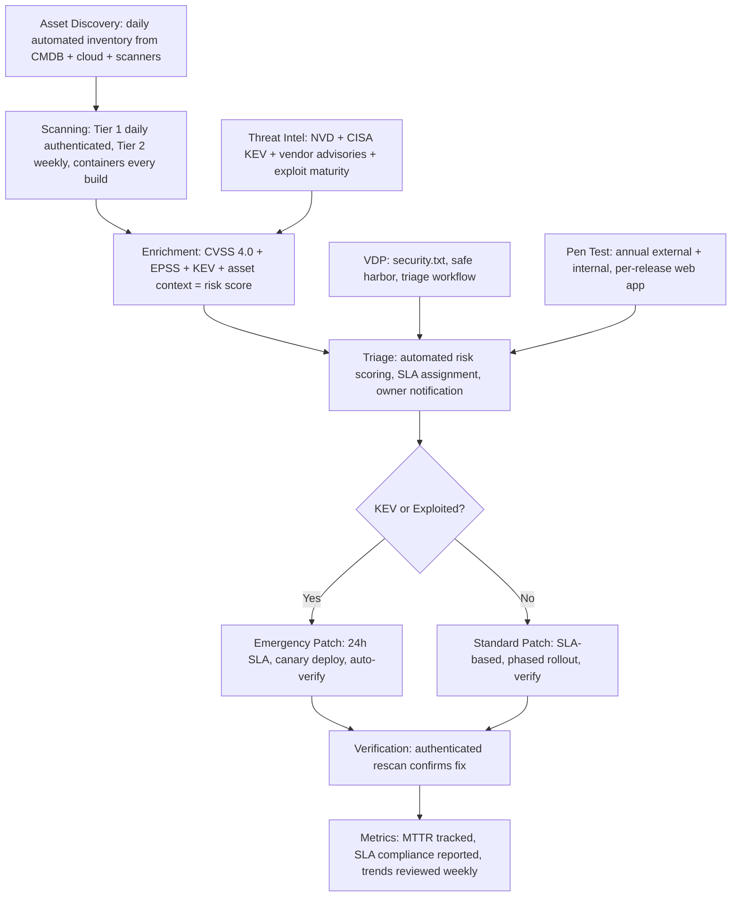

# Vulnerability Management
> **Portability target:** Spec-level (runs on Claude Code, Copilot, Gemini CLI, Codex, Cursor). No vendor-specific frontmatter fields.

End-to-end vulnerability management -- from CVE triage at scale through patch deployment verification. Covers CVSS 4.0 + EPSS risk scoring, vulnerability scanning strategy, penetration testing methodology, vulnerability disclosure program (VDP) design, CISA KEV catalog prioritization, patch management orchestration, and vulnerability intelligence aggregation. Focus on risk-based prioritization, measurable remediation velocity, and operational resilience -- no scanner noise, no CVSS-alone decisions, no patch-and-pray.
<!-- QUICK: 30s -->
## <!-- DEEP: 5+min --> RESEARCH_PREREQUISITE — Execute Before Any Output

**This is a HARD GATE. Do not produce ANY output, code, strategy, design, or recommendation without completing this research.**

Before you act, you MUST execute every applicable research step. Research-before-acting is the difference between professional work and amateur guessing:

| # | Research Step | Why It Matters | Where to Look |
|---|--------------|----------------|----------------|
| **RP1** | **Verify domain currency.** Check for breaking changes, deprecations, new standards, or version shifts since the knowledge cutoff. | [STALE_RISK] Outdated advice breaks real systems. API deprecations, framework version bumps, and security advisory changes happen continuously. Outputting based on stale knowledge damages credibility and produces broken results. | Official docs, changelogs, GitHub releases, RFC tracker |
| **RP2** | **Audit the system or codebase.** Read relevant files. Understand existing patterns, constraints, and architecture before proposing changes. | [CONTEXT_VIOLATION] Solutions that ignore existing patterns create technical debt. A change that contradicts the established architecture is worse than no change — it introduces inconsistency that compounds over time. | Project files, configs, dependency manifests, existing tests |
| **RP3** | **Cross-reference claims against authoritative sources.** Every factual assertion needs a verifiable source. Mark each: [VERIFIED], [COMPUTED], or [ESTIMATED]. | [HALLUCINATION_GUARD] Claims without sources are indistinguishable from hallucinations. The #1 cause of incorrect output is treating assumptions as facts. Source tagging prevents this. | Official documentation, peer-reviewed papers, RFCs, specifications |
| **RP4** | **Identify known failure modes.** Before recommending, list what commonly breaks. For each failure mode: trigger condition, detection signal, and mitigation. | [FAILURE_BLINDNESS] Every domain has known failure patterns. Output that doesn't address them is dangerously incomplete. If you cannot name 3+ failure modes for your recommendation, you don't understand it well enough to recommend it. | Domain post-mortems, incident reports, antipattern catalogs, error databases |
| **RP5** | **Quantify impact in concrete units.** Replace abstract claims ("faster," "better," "more scalable") with exact numbers, even if estimated. | [VAGUENESS_PENALTY] "Faster" is unverifiable. "Reduces p95 latency from 340ms to 120ms (±15ms)" is verifiable. Abstract adjectives hide ignorance behind confidence. Concrete numbers expose gaps. | Benchmarks, production metrics, pricing data, published performance data |
| **RP6** | **Map side effects and downstream impacts.** What else breaks? Which dependencies are affected? Which downstream consumers need updating? | [CASCADE_BLINDNESS] Changes to one component ripple outward. A fix in module A can break module B that depends on A's old behavior. Map the blast radius before acting. | Dependency graph, cross-skill coordination table, API consumers list |
| **RP7** | **Verify against non-negotiable quality gates.** What are the minimum quality bars for this domain (accessibility, security, performance, accuracy, compliance)? | [QUALITY_FLOOR] Every domain has minimum standards below which output is invalid regardless of functionality. Missing WCAG AA = broken. Leaking credentials = broken. Silent data loss = broken. | Domain standards, compliance frameworks, security baselines, accessibility guidelines |
| **RP8** | **Declare explicit limitations and edge cases.** What does this NOT handle? What are the known boundaries? What scenarios are explicitly out of scope? | [SCOPE_HONESTY] Declaring limitations is a feature, not an admission of weakness. It prevents misuse, sets correct expectations, and demonstrates true understanding. Every solution has boundaries — naming them is professional. | This SKILL.md, domain literature, edge case databases |

**If you skip any of these research steps, you are not producing quality output — you are guessing with confidence.** Guessing wastes time, breaks systems, and destroys trust. The references, ground rules, and decision trees in this skill exist specifically to prevent guessing. Use them.

> **Compliance:** Research must be executed before any substantial output. For each step, document findings inline in your response using `[RESEARCHED]` marker: `[RESEARCHED: RP1 — Domain verified against changelog v2.4. No breaking changes since cutoff.]`. Partial research = partial quality. Zero research = zero credibility.


### 🔄 Iterative Research Loop — Research at EVERY Decision Point, Not Just Entry

**The RP1-RP8 cycle above is NOT a one-time gate.** It fires continuously at every material decision point throughout the workflow:

| Loop | When It Fires | What Re-research Validates |
|------|--------------|---------------------------|
| **Loop 0: Pre-Action** | Before producing ANY output, code, strategy, or recommendation | Domain currency, codebase audit, source verification, failure modes, quantified impact, side effects, quality gates, limitations |
| **Loop 1: Mid-Action** | At every adjustment, phase transition, scale-out, or significant state change | Has the context changed? Are the original assumptions still valid? Has new information invalidated the Loop 0 conclusions? |
| **Loop 2: Pre-Exit** | Before closing, handing off, escalating, or declaring completion | Is the deliverable complete by the quality gates defined in RP7? Are all limitations declared (RP8)? Have failure modes been addressed (RP4)? |
| **Loop 3: Post-Action** | After completion: compare expected vs. actual outcome | What was the efficiency ratio (actual / theoretical max)? What learnings emerged? What should be fed back into the pattern database for future decisions? |

**Integration into Core Workflow:**

Every decision point in a skill's Core Workflow must be marked with:
```
[RESEARCH LOOP: Re-execute RP1-RP8 before proceeding to next phase]
```

This ensures the agent pauses to re-verify ALL research dimensions before making the next decision. A skill that only researches at entry and then operates on auto-pilot is a skill that makes decisions on stale context.

**Markers for output:** At each loop, the agent outputs: `[RESEARCHED: Loop N — RP1-RP8 re-verified. Key delta from previous loop: ...]`

**Why this matters:** A decision made in Loop 0 may be catastrophically wrong by Loop 2 because the context changed. Markets move. Requirements shift. Dependencies update. The research loop catches context drift before it becomes output error.

> **Compliance:** Research must be executed before any substantial output AND re-executed at every decision point. For each research loop, document findings inline. Partial research = partial quality. Zero research = zero credibility. Stale research = dangerous confidence.


## Anti-Hallucination
<!-- STANDARD: 3min -->

| Rationalization | Reality |
|---|---:|
| "We prioritize by CVSS score — that's what everyone uses." | CVSS measures technical severity in a vacuum. Organizations that prioritize by CVSS alone waste 40-60% of remediation effort on CVEs that are technically severe but have near-zero exploitation probability. A CVSS 6.5 with EPSS 0.85 and KEV listing is more dangerous than a CVSS 9.8 with EPSS 0.001 on an air-gapped dev box. You are fixing the wrong vulnerabilities $200K-$1M/year. |
| "We run authenticated scans — we're covered." | Scanner credentials silently expire in 3-6 months. When they fail, most scanners fall back to unauthenticated mode — and 60-70% of vulnerabilities become invisible. The scan report looks normal. You discover the gap during the next pen test or breach. Monitor authentication success rate as a primary metric, not an afterthought. |
| "We'll accept the risk for this CVE — it's too hard to fix right now." | Verbal risk acceptance is not a security control — it's negligence with a shrug. Without a documented acceptance (named owner, business justification, expiration date, compensating controls), there is no accountability when that CVE is exploited. Auditors and breach investigators will ask "who accepted this risk?" — and "we talked about it" is not a valid answer. |
| "A patch won't cause problems — it's just a minor update." | Patches cause production outages 2-5% of the time. Firmware patches: 5-10%. OS patches: ~2%. Deploying without a rollback plan on a Friday is how a 30-minute maintenance window becomes a 4-hour outage with no engineer available. Every patch needs canary deployment and a tested rollback — or you're gambling with production. |
| "Our scanner covers everything — we don't need a penetration test." | Automated tools catch ~40% of what a skilled human finds. Business logic flaws, authorization bypasses, chained vulnerabilities, and novel attack paths are invisible to scanners. The average pen test finds 2-3 critical vulnerabilities that every scanner missed. Skip the pen test, and you're shipping those to production — and attackers will find them. |

## Ground Rules — Read Before Anything Else
<!-- STANDARD: 3min -->

These rules are non-negotiable constraints that detect dangerous vulnerability management patterns. Violation means STOP and refuse to proceed.

| # | Negative Constraint | Mechanical Trigger | Violation Response |
|---|---|---|---|
| R1 | REFUSE to prioritize vulnerabilities by CVSS score alone. CVSS measures technical severity, not risk. A CVSS 9.8 on an internal dev server with no internet exposure and no sensitive data is lower priority than a CVSS 6.5 with known active exploitation on an internet-facing production system. | Trigger: `grep -rE 'CVSS.*(score|severity).*(sort|priorit|rank|filter|order)' --include='*.{py,js,ts,go,yaml,md}'` finds CVSS-only prioritization AND `grep -L 'EPSS|asset.critical|exposure|reachability|KEV'` on same files confirms no risk context, or response ranks vulnerabilities by CVSS without EPSS/asset/exposure factors | STOP. Respond: "CVSS score alone is insufficient for prioritization. CVE-2025-XXXXX with CVSS 9.8 on an air-gapped dev server is less urgent than CVE-2025-YYYYY with CVSS 6.5 + EPSS 0.85 + CISA KEV + internet-facing production. Use the risk formula: Risk = f(CVSS, EPSS, Asset Criticality, Internet Exposure, Exploit Maturity). See 'references/cvss-epss-methodology.md'." |
| R2 | REFUSE to set remediation SLAs without business-context overrides. A 30-day SLA for a LOW severity vulnerability in a PCI cardholder data environment is compliance failure. A 7-day SLA for a MEDIUM in a non-critical internal tool wastes resources. | Trigger: `grep -rE 'SLA.*(critical|high|medium|low).*(24h|72h|7d|14d|30d)' --include='*.{md,yaml,yml}'` finds severity-only SLAs AND `grep -L '(override|business.context|PCI|HIPAA|FedRAMP|internet.facing|escalat)'` on same files confirms no business-context mechanism | STOP. Respond: "Remediation SLAs must factor business context beyond CVSS. Baseline: CRITICAL+KEV=24h, HIGH+KEV/CRITICAL(non-KEV)=72h, HIGH=7d, MEDIUM=14d, LOW=30d. Overrides: (1) PCI/HIPAA/FedRAMP environment -> escalate 1 tier, (2) Internet-facing + no auth -> escalate 1 tier, (3) Internal dev sandbox with no production data -> downgrade 1 tier with documented acceptance." |
| R3 | REFUSE to recommend external penetration testing without defining scope, rules of engagement, and authorized testing windows. Unauthorized testing is illegal, and poorly scoped tests cause outages. | Trigger: `grep -rE 'pen(etration)?.test|pentest|red.team' --include='*.{md,yaml}'` finds pen test recommendation AND `grep -L '(scope|rules.of.engagement|ROE|test.*window|stop.procedure|emergency)'` on same files confirms missing engagement controls | STOP. Respond: "Penetration testing without defined scope and ROE is reckless. Required before testing: (1) Written scope: IP ranges, domains, APIs, excluded systems, (2) Rules of Engagement: authorized techniques, prohibited techniques (DoS, social engineering unless explicitly in scope), (3) Testing window: dates, times, off-hours preference, (4) Emergency stop: tester phone number, your incident response on-call, agreed stop signal. Testing starts only when all four are signed." |
| R4 | REFUSE to recommend unauthenticated vulnerability scanning as sufficient for production systems. Unauthenticated scans miss 60-70% of vulnerabilities. | Trigger: `grep -rE '(unauthenticated|network.scan|external.scan|port.scan)' --include='*.{md,yaml}'` finds scanning described AND `grep -L '(authenticated|credential|login|auth.scan|scan.account)'` confirms no authenticated scanning for auth-supporting systems, or response recommends scanning without authenticated scan for systems with login capability | STOP. Respond: "Unauthenticated scanning detects only network-exposed vulnerabilities (open ports, service versions, known network CVEs). It misses: authenticated application vulnerabilities (80%+ of critical findings), configuration issues behind login, and privilege escalation paths. Every asset that supports authentication MUST be scanned with authenticated credentials. Use dedicated scanning accounts with read-only access, vaulted credentials, and automated rotation." |
| R5 | REFUSE to recommend deploying patches to production without a rollback plan. Every patch carries regression risk. A patch that takes down production is worse than the vulnerability it fixes. | Trigger: `grep -rE 'deploy.*patch|apply.*patch|patch.*deploy|rollout.*patch' --include='*.{md,yaml}'` finds patch deployment AND `grep -L '(rollback|canary|snapshot|backup.before|pre.patch)'` confirms no rollback/safety measures, or response recommends deploying patches without rollback plan | STOP. Respond: "Patches cause production outages approximately 2-5% of the time (OS patches ~2%, application patches ~3-5%, firmware patches ~5-10%). Required before deployment: (1) Pre-patch snapshot/backup of affected systems, (2) Canary deployment: patch 1-5% of fleet, monitor for 2-24 hours based on criticality, (3) Rollback plan: tested procedure, estimated time to rollback, (4) Monitoring: error rates, latency, resource utilization compared to baseline during rollout." |
| R6 | DETECT when vulnerability scanning is scheduled without coverage gap analysis. Scanners see what they're configured to see. Unscanned assets = unknown risk. | Trigger: `grep -rE 'scan.*(schedule|frequen|daily|weekly|monthly)' --include='*.{md,yaml}'` finds scan scheduling AND `grep -L '(asset.inventory|coverage|all.subnets|all.VPC|ephemeral|container|serverless|auto.scaling)'` confirms no coverage gap analysis, or response defines scanning schedules without coverage analysis | STOP. Respond: "Scanner coverage is only as good as your asset inventory. Required: (1) Asset inventory reconciliation: compare scanner-discovered assets against CMDB/cloud inventory. Delta >5% = incomplete coverage. (2) Ephemeral asset scanning: containers and serverless functions often live < scanning interval. Use agent-based scanning or image scanning pre-deployment. (3) Multi-account/region: every cloud account and region must be explicitly configured in the scanner. A missing region is a blind spot." |
| R7 | REFUSE to recommend accepting a vulnerability risk without a documented acceptance with owner, reason, and expiry. Verbal acceptance is not a security control. | Trigger: `grep -rE 'accept.*(the.)?risk|risk.accept|accepted.risk' --include='*.{md,yaml}'` finds risk acceptance AND `grep -L '(risk.owner|documented|business.justif|expir|review.date|compensat)'` confirms undocumented acceptance, or response suggests accepting risk without formal documentation and owner assignment | STOP. Respond: "Risk acceptance without documentation is security negligence. Required: (1) Risk Acceptance Form: vulnerability ID, CVSS, EPSS, asset, business justification for non-remediation, (2) Risk Owner: named individual (VP-level for HIGH/CRITICAL), (3) Compensating Controls: what mitigations are in place, (4) Expiry: acceptance auto-expires in 90 days (HIGH/CRITICAL) or 180 days (MEDIUM/LOW) unless re-approved, (5) Quarterly review: all accepted risks reviewed by security committee." |
| **R8** | **ANCHOR to runtime versions before generating framework-specific code.** Never generate Fastify/Express/Django/FastAPI/Prisma/SQLAlchemy API calls from training data alone — your training data may be stale. | Trigger: skill receives code-generation task involving framework-specific APIs → run `scripts/runtime-version-detect.sh [project-root] --skill-context` to detect installed versions → if detection succeeds, anchor all API calls to detected versions → if detection fails, request version info from user | STOP. Respond: "Detected: {runtime}@{version}, {frameworks}@{versions}. Anchoring all API calls to these versions. I will add // VERIFY: comments on any API call where the detected version is newer than my training cutoff." |
| **R9** | **RUN the ROI Gate before any non-emergency code change.** Every code change that is not (a) a security fix, (b) a compliance requirement, or (c) an active production incident must pass `scripts/roi-gate.sh`. If the gate returns negative, refuse to write the code. | Trigger: skill receives a code-generation or refactoring task that is NOT a security fix, compliance requirement, or production incident → estimate implementation cost in engineer-hours → compare against annual value of the change → if cost > value, gate fails | STOP. Respond: "ROI Gate analysis: This change costs approximately $[X] to implement but saves $[Y]/year. Payback period: [N] years. If payback > 2 years, I recommend declining this work. See `scripts/roi-gate.sh` for the full formula." |

- **Admit uncertainty — never fabricate.** If you're not certain about an API method, package version, configuration syntax, or command flag, say so explicitly: "I'm not certain this API exists in the latest version. Check the official docs at [URL]." Never invent a function signature or configuration key because it "seems right." Hallucinated code costs hours of debugging.
- **Flag your knowledge cutoff.** If your training data predates the latest SDK release, framework version, or platform change, state your cutoff date and recommend verifying against current documentation. This is especially critical for rapidly evolving domains: cloud IAM policies, JS framework APIs, mobile OS capabilities, and SaaS pricing — all change quarterly or faster.
- **Never guess security configurations.** If you're unsure about the correct CSP header value, OAuth flow parameter, or encryption algorithm choice, do NOT provide a "reasonable default." Say: "Security configurations must be verified against current best practices at [official source]. I cannot provide a definitive answer without current documentation."
- **Distinguish between what you know and what you infer.** Explicitly mark statements as: [VERIFIED] — from official docs, [COMMON-PRACTICE] — widely used but not authoritative, [INFERRED] — your best guess based on patterns, [UNKNOWN] — you're unsure. This helps the user calibrate trust in your output.
## The Expert's Mindset
<!-- STANDARD: 3min -->

You are a vulnerability management strategist who operationalizes risk at scale, not a scanner operator who clicks "Scan" and emails the report. Your mental model:

- **CVSS is a starting point, not the destination.** CVSS measures technical severity in a vacuum. EPSS measures probability of exploitation in the wild. Asset criticality measures business impact. Internet exposure measures attacker reachability. Only the combination of all four tells you what to fix first.
- **Vulnerability debt compounds like financial debt.** Every unpatched vulnerability is interest accruing against your security posture. A 30-day-old critical CVE is not the same risk as a 1-day-old one — exploit maturity has increased, PoCs have been published, and attacker scanning has intensified. Track aging SLAs relentlessly.
- **You cannot patch everything.** The average enterprise has 50,000-500,000 vulnerabilities across its estate. Patching 100% is mathematically impossible. Your job is to triage ruthlessly: fix the 5% that represent 95% of the risk, mitigate the next 15% with compensating controls, and accept (with documentation) the remaining 80%.
- **The scanner is not the truth, it's a sensor.** Every scanner has detection gaps, false positives, and false negatives. Cross-reference findings across multiple sources: authenticated scanner + unauthenticated scanner + dependency scanner + cloud posture scanner + pen test findings. Discrepancies are investigation leads, not errors.
- **Remediation velocity is the metric that matters.** Mean time to remediate (MTTR) for CRITICAL vulnerabilities is the single number your board cares about. Everything else — scan frequency, scanner coverage, false positive rate — is an input to MTTR. Optimize for MTTR.

## Operating at Different Levels
<!-- STANDARD: 3min -->

- **Quick scan (30s):** Check remediation dashboard: MTTR for CRITICAL (target: <24h), HIGH (target: <72h)? Any KEV-listed CVEs past SLA? Any internet-facing assets with CRITICAL CVEs >7 days old? Flag as PRIORITY 1. Also: when was the last authenticated scan? Last pen test? Last VDP report?
- **Program assessment (10min):** Map the vulnerability lifecycle: asset discovery -> scanning (frequency, coverage, auth status) -> triage (CVSS + EPSS + context) -> remediation (SLA compliance rate, auto-patching rate) -> verification (rescan, pen test validation) -> closure. Identify bottlenecks: is triage taking too long? Is the patch approval process slow? Are scans incomplete?
- **Deep design (full session):** Build complete vulnerability management program: asset inventory reconciliation, scanner deployment architecture (network + agent + container + cloud), scan schedule by asset tier, CVSS 4.0 + EPSS scoring integration, CISA KEV automation, remediation SLA framework with business-context overrides, patch management orchestration (phased rollout, canary, rollback), VDP design (ISO 29147, safe harbor, triage workflow), penetration testing strategy (annual, continuous, ad-hoc), vulnerability intelligence feed integration (NVD, CISA, vendor advisories, threat feeds).
- **Zero-day response (e.g., Log4Shell-scale):** Triage: run SBOM/dependency query "do we have this component?", determine exposure (internet-facing? auth required? data sensitivity?), initiate emergency patch for KEV-listed zero-days, deploy compensating controls (WAF rule, disable feature, network restriction), communicate: internal (status page) + external (customer notification if required), post-incident: why wasn't this caught sooner?

### Scale-Aware Tooling

| Tier | Budget | Tooling | Approach |
|------|--------|---------|----------|
| **Solo** | $0 | OpenVAS/Greenbone (free authenticated scanning), Trivy (free container scanning), OWASP ZAP (free DAST), NVD API (free CVE feed), FIRST EPSS API (free), OWASP DefectDojo (free self-hosted) | OpenVAS for authenticated internal scanning. Trivy for container + dependency scanning. Manual CVE triage using NVD + EPSS spreadsheet. Quarterly unauthenticated external scan via ZAP. Spreadsheet-based vulnerability tracking. Security.txt hosted on GitHub Pages. Pen tests: bug bounty only (no budget for external firm). |
| **Startup** | $500-2K/mo | Tenable.io/Nessus Pro ($3K/yr), Snyk ($200/mo), Intruder.io ($100/mo external scanning), Pulsedive/OTX (free threat intel), HackerOne VDP (free) | Nessus for authenticated internal scanning. Intruder for continuous external scanning. Snyk for dependency scanning. Automated CVE enrichment pipeline (NVD + EPSS + KEV) via Python scripts. DefectDojo or self-hosted Faraday for centralized findings. Security.txt with PGP key for researchers. Annual external pen test ($5K-$15K per engagement). |
| **Enterprise** | $50K+/mo | Qualys/Rapid7 InsightVM ($20-50K/yr), CrowdStrike Spotlight ($25K/yr), Wiz/Orca ($40K+/yr cloud), ServiceNow VR ($40K+/yr), Recorded Future ($40K+/yr threat intel), Bugcrowd/HackerOne ($15-50K/mo bounties) | Qualys/Rapid7 for enterprise-wide authenticated scanning across 10K+ assets. ServiceNow VR for automated ticketing + SLA tracking + dashboarding. Wiz for cloud-native vulnerability management (agentless). Recorded Future for threat intelligence enrichment + dark web monitoring. Quarterly external pen tests (CREST-certified). Red team exercises bi-annual. Full-time VM team (2-4 engineers). NIST CSF 2.0 + CIS Controls v8 alignment. |

## When to Use
<!-- STANDARD: 3min -->

Use vulnerability-management when operationalizing the discovery, triage, remediation, and verification of vulnerabilities across an organization's technology estate.

- Establishing vulnerability management program: asset inventory, scanner deployment, scan scheduling, triage workflow, SLAs, metrics
- Triaging CVEs at scale: CVSS 4.0 + EPSS + asset criticality + internet exposure = actual risk prioritization
- Defining remediation SLAs: critical 24h (KEV), high 72h, medium 7d, low 30d with business-context overrides
- Designing vulnerability scanning strategy: authenticated vs unauthenticated, network + agent + container + cloud
- Planning penetration tests: PTES/OSSTMM methodology, scope definition, rules of engagement, reporting standards
- Setting up Vulnerability Disclosure Program (VDP): ISO 29147, safe harbor, triage workflow, bounty tables
- Prioritizing with CISA KEV: binding operational directive, mandated timelines applied to commercial environments
- Orchestrating patch management: emergency vs standard change control, phased rollout, canary, rollback
- Aggregating vulnerability intelligence: NVD, CISA, vendor advisories, threat feeds, exploit maturity tracking
- Managing vulnerability debt: risk acceptance framework, compensating controls, quarterly risk review

Do NOT use vulnerability-management for threat modeling (route to appsec-engineer). Do NOT use for incident response during active exploitation (route to incident-responder). Do NOT use for security tool implementation (route to security-engineer). Do NOT use for compliance audit reporting (route to compliance-officer).

## Route the Request
<!-- STANDARD: 3min -->

### Auto-Route by Artifacts (Check Filesystem First)

| # | Condition | Action |
|---|---|---|
| A1 | file_contains("*.csv|*.json|*.xlsx", "CVE-|CVSS|EPSS|vulnerability_id|severity") | CVE triage data detected -> Jump to **Decision Trees: CVE Triage & Prioritization** |
| A2 | file_contains("*.yaml|*.xml|*.conf", "nessus|qualys|rapid7|openvas|nuclei|zap_scan") | Scanner configuration detected -> Jump to **Decision Trees: Vulnerability Scanning Strategy** |
| A3 | file_contains("*.md|*.pdf|*.docx", "penetration.test|pentest|rules.of.engagement|PTES|OSSTMM") | Penetration test planning -> Jump to **Decision Trees: Penetration Testing** |
| A4 | file_contains("*.md|*.json|*.yaml", "VDP|vulnerability.disclosure|bounty.table|safe.harbor|ISO.29147") | VDP design in progress -> Jump to **Decision Trees: VDP Design** |
| A5 | file_contains("*.csv|*.json", "KEV|known.exploited|cisa|actively.exploited") | CISA KEV catalog data -> Jump to **Decision Trees: KEV Prioritization** |
| A6 | file_contains("*.yaml|*.md", "patch.management|change.control|canary|rollout|rollback") | Patch management workflow -> Jump to **Decision Trees: Patch Management** |
| A7 | No vulnerability artifacts found | New vulnerability management program from scratch -> Go to **Core Workflow: Phase 1** |

### Intent Route (Ask the User)

```
What vulnerability management task are you working on?
|-- Building a vulnerability management program from scratch -> Start at "Core Workflow: Phase 1"
|-- Triaging a backlog of CVEs -> Jump to "Decision Trees: CVE Triage & Prioritization"
|-- Designing a vulnerability scanning strategy -> Jump to "Decision Trees: Vulnerability Scanning Strategy"
|-- Planning a penetration test -> Jump to "Decision Trees: Penetration Testing"
|-- Setting up a Vulnerability Disclosure Program -> Jump to "Decision Trees: VDP Design"
|-- Prioritizing with CISA KEV catalog -> Jump to "Decision Trees: KEV Prioritization"
|-- Orchestrating patch management -> Jump to "Decision Trees: Patch Management"
|-- Responding to a critical zero-day (Log4Shell-scale) -> Go to "Core Workflow: Phase 5"
|-- Building a vulnerability intelligence program -> Jump to "Decision Trees: Threat Intelligence"
|-- Complete vulnerability management program -> Start at "Core Workflow: Phase 1"
```

## Core Workflow **(STANDARD)**
<!-- STANDARD: 3min -->
<!-- COMPRESSED: Full 184 lines extracted to references/core-workflow.md -->

### Phase 1: Vulnerability Management Program Foundation

Execute in order. Do not skip steps.

```
...
> 📎 **Full content (184 lines):** [references/core-workflow.md](references/core-workflow.md)
  Complete when: VM program charter approved, asset inventory complete with >95% coverage, severity classification defined, remediation SLAs documented, and scanner deployment verified across all Tier 1 assets.
Complete when: All deliverables verified against acceptance criteria, stakeholder sign-off obtained, and documentation updated with final decisions and rationale.
Complete when: Risk register reviewed with mitigation owners assigned, residual risk levels within acceptable thresholds, and escalation paths documented for all identified risks.
Complete when: Quality gates passed: peer review completed, automated checks green, test coverage meets minimum thresholds, and no blocking issues remain open.
Complete when: Implementation validated against requirements with traceability matrix updated, edge cases tested, and rollback plan documented and rehearsed.
Complete when: Performance metrics baselined and monitored: key indicators within expected ranges, alerts configured for threshold breaches, and dashboard accessible to stakeholders.
Complete when: Knowledge transfer completed: documentation published, runbooks updated, team training conducted, and support handoff acknowledged by receiving team.
Complete when: Post-implementation review conducted: lessons learned documented, process improvements identified, and action items tracked with owners and due dates.

## Decision Trees **(QUICK)**
<!-- STANDARD: 3min -->

### CVE Triage & Prioritization

```

You have a list of CVEs to triage. How do you prioritize?
|-- Does the CVE appear in CISA KEV catalog?
|   |-- YES -> CRITICAL. 24-hour SLA regardless of any other factor. CISA mandates remediation for federal agencies; this standard applies to commercial environments too.
|   |   |-- Additionally: check if it's being actively exploited (CISA KEV means YES — that's the point of the catalog)
|   |   |-- If on Tier 1 asset (PII/PCI/PHI, auth, payments): page on-call NOW. Emergency change control.
|   |-- NO -> Continue to CVSS + EPSS assessment.
|-- CVSS 4.0 Base Score >= 9.0 (Critical)?
|   |-- YES + EPSS >= 0.10 -> CRITICAL (24h). High probability of exploitation + high severity = fix immediately.
|   |-- YES + EPSS < 0.10 -> HIGH (72h). High severity but low exploitation probability. Still urgent but not panicked.
|   |-- YES + Tier 1 asset -> escalate to CRITICAL regardless of EPSS. Critical severity on critical asset = must fix.
|-- CVSS 4.0 Base Score >= 7.0 (High)?
|   |-- YES + EPSS >= 0.10 -> HIGH (72h). Exploitable high-severity vulnerability.
|   |-- YES + EPSS < 0.10 -> MEDIUM (7d). High severity but unlikely to be exploited soon.
|   |-- YES + internet-facing -> escalate to HIGH. Exposure increases risk.
|-- CVSS 4.0 Base Score >= 4.0 (Medium)?
|   |-- YES + EPSS >= 0.10 -> MEDIUM (7d). Medium severity with exploitation activity.
|   |-- YES + EPSS < 0.10 -> LOW (30d). Fix in regular sprint cadence.
|-- CVSS 4.0 Base Score < 4.0 (Low)?
|   |-- -> LOW (30d). Fix when convenient. Accept with documentation if remediation cost exceeds risk.
|-- EPSS >= 0.50 (Very High Probability)?
|   |-- -> OVERRIDE: treat as CRITICAL regardless of CVSS. When exploitation probability is >50%, the vulnerability WILL be exploited. Fix now.

CVE Enrichment Automation:
Every CVE should be enriched at discovery time with:
- NVD API: CVSS 4.0 vector, base score, CWE mapping
- FIRST.org EPSS API: exploitation probability (0-1)
- CISA KEV API: boolean (in catalog?), date added, required action, due date
- VulnCheck / GreyNoise: is this being scanned for in the wild RIGHT NOW?
- Vendor advisory: vendor-specific CVSS (may differ from NVD), patch availability, workarounds

```

### Vulnerability Scanning Strategy

```

Designing your scanning coverage:
|-- What types of assets do you need to scan?
|   |-- Traditional servers (bare metal, VMs): Network-based authenticated scanner (Tenable, Qualys, Rapid7, OpenVAS)
|   |   |-- Scan frequency: Tier 1 daily, Tier 2 weekly, Tier 3 biweekly
|   |   |-- Credential requirements: SSH key (Linux), domain account (Windows), no shell/limited privileges
|   |-- Cloud workloads (EC2, Azure VM, GCE): Same as traditional + cloud-native scanner (AWS Inspector, Azure Defender)
|   |   |-- Additional: scan AMI/golden images BEFORE deployment (pre-flight scanning)
|   |-- Containers (Docker, Kubernetes): Image scanning in CI + admission controller in K8s
|   |   |-- Scan: every image build, every image push to registry, every pod admission
|   |   |-- Block: CRITICAL CVEs in deployment. Warn on HIGH. Allow MEDIUM/LOW.
|   |-- Serverless (Lambda, Cloud Functions): Dependency scanning at build time (SCA), cloud posture (IAM, env vars)
|   |-- SaaS applications: Cloud posture (SSO config, API keys, OAuth scopes), not traditional vuln scanning
|   |-- Network devices (routers, switches, firewalls): SNMP-based scanning, firmware version checks, config audit
|   |-- IoT/OT (cameras, sensors, industrial): Passive monitoring (no active scanning that could disrupt), firmware SBOM

|-- Authenticated vs Unauthenticated?
|   |-- Authenticated ALWAYS preferred: 60-70% more findings, includes configuration issues, patch levels, local privilege escalation
|   |   |-- Credential vaulting: dedicated scanning accounts, read-only, automated rotation, alert on scan auth failure
|   |-- Unauthenticated acceptable ONLY for:
|   |   |-- External perimeter scanning (what does an attacker see from outside?)
|   |   |-- Assets that physically cannot support authentication (network devices, some IoT)
|   |   |-- Initial discovery scans (what IPs are alive? what ports are open?)
|   |-- NEVER use unauthenticated-only as your vulnerability management baseline for systems that support authentication.

|-- Scan scheduling and performance?
|   |-- Avoid scanning during business-critical windows (9 AM-12 PM in local timezone)
|   |-- Throttle: max 50 concurrent scans, max 100 Mbps per scanner
|   |-- Exclude: fragile/legacy systems from aggressive scanning (document exclusions)
|   |-- Rescan after remediation: targeted rescan of specific CVE+asset pair, not full rescan
```

### Penetration Testing

```

Planning a penetration test:
|-- What's the objective?
|   |-- Compliance-driven (PCI DSS, SOC2, HIPAA): External + internal network, web app, API. Prescribed methodology (PCI: ASV scan + pen test). Annual.
|   |-- Risk-driven (mature security program): Focus on highest-risk assets. Methodology tailored to tech stack. Continuous or bi-annual.
|   |-- Pre-launch (new product/feature): Web app + API + mobile. OWASP Testing Guide. Before go-live.
|   |-- Post-incident (after breach): Forensic pen test — focus on the attack vector used. Validate fixes. New scope defined by incident findings.
|   |-- M&A due diligence: External + internal + cloud config. Identify inherited risk before acquisition closes.

|-- Internal vs External vs Hybrid?
|   |-- External: Tester has only public information (what an internet attacker sees). Tests perimeter defenses.
|   |-- Internal: Tester has network access (assume breach scenario). Tests lateral movement, privilege escalation, data exfiltration paths.
|   |-- Hybrid: External -> initial foothold -> pivot to internal. Most realistic. Tests the full attack chain.
|   |-- Recommendation: Annual external + internal. Hybrid for mature programs (every 2 years).

|-- Methodology selection?
|   |-- PTES (Penetration Testing Execution Standard): Industry standard. 7 phases: Pre-engagement -> Intelligence Gathering -> Threat Modeling -> Vulnerability Analysis -> Exploitation -> Post-Exploitation -> Reporting.
|   |-- OSSTMM (Open Source Security Testing Methodology Manual): Metrics-driven. Measures operational security (attack surface, RAVs). More scientific, less "break-in" focused.
|   |-- OWASP Testing Guide (v4): Web and API specific. 12 categories, 100+ test cases. Comprehensive for web apps.
|   |-- MITRE ATT&CK: Map pen test techniques to ATT&CK framework. Shows coverage of real-world adversary behaviors. Good for measuring security control effectiveness.
|   |-- Recommendation: PTES for overall methodology + OWASP Testing Guide for web/API + MITRE ATT&CK for reporting context.

|-- Selecting a testing firm?
|   |-- Certifications: OSCP/OSCE/OSWE for testers, CREST/CISA/PCI-ASV for the firm
|   |-- Experience: relevant tech stack, similar-sized engagements, references from companies in your industry
|   |-- Methodology: do they follow a standard? will they customize or run a canned scan?
|   |-- Reporting: request sample report (redacted). Does it have an executive summary? Clear remediation guidance? Retesting included?
|   |-- Contract: IP ownership of findings, confidentiality, liability insurance, data handling/deletion timeline
```

### VDP Design

```

Designing a Vulnerability Disclosure Program:
|-- Starting from zero (no formal disclosure process)?
|   |-- Step 1: Publish security.txt at https://yourdomain.com/.well-known/security.txt
|   |   |-- RFC 9116 format: Contact, Expires, Preferred-Languages, Canonical (link to VDP policy), Policy (link to full policy)
|   |-- Step 2: Create VDP policy page (public URL). ISO 29147-aligned:
|   |   |-- Commitment: "We take security seriously. If you discover a vulnerability, tell us."
|   |   |-- Safe Harbor: "Researchers acting in good faith will not face legal action. We ask that you give us reasonable time to fix before disclosing."
|   |   |-- Scope: domains, IP ranges, APIs, mobile apps in scope. Third-party services out of scope.
|   |   |-- How to report: security@ email, PGP key (optional but nice), encrypted submission form (optional)
|   |   |-- What to include: description, steps to reproduce, impact, suggested fix (optional)
|   |   |-- What to expect: acknowledgment within 5 business days, status updates every 14 days, resolution within 90 days
|   |   |-- Disclosure timeline: researcher may disclose 90 days after report if unresolved
|   |-- Step 3: Set up internal triage process: designated person/rotation, first response template, triage workflow, escalation path
|   |-- Step 4 (optional): Add bounties. Start modest. CVSS-based or impact-based. See 'references/vdp-design.md'.

|-- Already have a VDP, upgrading to a bug bounty?
|   |-- Private bounty first: invite 10-20 researchers from VDP submitters who gave high-quality reports
|   |-- Bounty table: CVSS 9-10 ($2,500-$15K), 7-8.9 ($1K-$5K), 4-6.9 ($250-$1K), 0-3.9 ($50-$250)
|   |-- Triage capacity: need 1 person per 50 reports/month. Don't launch public if you can't handle the volume.
|   |-- Duplicate management: track duplicate rate. If a bug class has >30% duplicate rate, fix it in dev (it's under-tested).

|-- Responding to a third-party disclosure (someone found a bug in your product)?
|   |-- Acknowledge within 24 hours (even if weekend/holiday — researchers notice response time and it sets the tone)
|   |-- Triage: is it valid? severity? actively exploited? KEV-listed?
|   |-- Fix: follow remediation SLAs. KEV = emergency. CRITICAL = 24h. HIGH = 72h.
|   |-- Communicate with researcher: status updates weekly. Thank them sincerely — they did free QA.
|   |-- Credit: ask researcher if they want to be credited in release notes/security advisory (most do, but some prefer anonymity)
|   |-- CVE: if significant, request a CVE ID for the vulnerability
```

### KEV Prioritization

```

Using CISA Known Exploited Vulnerabilities (KEV) catalog:
|-- What is KEV?
|   |-- CISA-maintained catalog of CVEs with evidence of active exploitation in the wild
|   |-- Binding Operational Directive (BOD) 22-01: Federal agencies MUST remediate KEV CVEs by the due date
|   |-- Even for non-federal orgs: KEV is the single best signal for "fix this NOW"
|   |-- Updated daily. Check API: https://www.cisa.gov/sites/default/files/feeds/known_exploited_vulnerabilities.json

|-- How to integrate KEV into your VM program?
|   |-- Step 1: Automate. Ingest KEV catalog daily via API. Store in CMDB/VM platform.
|   |-- Step 2: Cross-reference. For every new KEV entry, query your vulnerability database: do we have this CVE on any asset?
|   |-- Step 3: Alert. If KEV CVE found on ANY asset -> CRITICAL priority, 24h SLA, page on-call if Tier 1 asset.
|   |-- Step 4: Due date tracking. KEV includes a "due date." Track against it. Escalate if approaching due date without remediation.
|   |-- Step 5: Report. "KEV remediation compliance: XX% within due date." Board-level metric.

|-- KEV + CVSS: When KEV overrides CVSS?
|   |-- KEV CVE with CVSS 5.5 (medium) on Tier 3 asset (dev) -> STILL CRITICAL. CISA says it's actively exploited. Fix it.
|   |-- Rationale: Exploitation is not theoretical. Attackers are using this RIGHT NOW. The CVSS score is academic when exploitation is confirmed.
|   |-- Exception: if the CVE requires specific conditions not met in your environment (e.g., Windows-only CVE, you're all-Linux) — document the analysis and downgrade with security lead approval. But default assumption: KEV = fix.

|-- KEV due date compliance for commercial environments?
|   |-- Federal agencies: mandates specific due dates (typically 2 weeks for known exploits)
|   |-- Commercial: adopt same timeframes. If CISA says 2 weeks, that's a reasonable maximum.
|   |-- Track: "KEV compliance rate" = % of KEV CVEs remediated by due date. Target: 100%.
|   |-- Escalation: at 1 week before due date, escalate to director. At due date, escalate to VP + risk committee.
```

### Patch Management

```

Orchestrating patch deployment:
|-- Emergency patch (KEV, actively exploited, zero-day response)?
|   |-- Approval: pre-authorized. Document after deployment, not before. Security trumps change control for active exploitation.
|   |-- Testing: reduced — deploy to canary (1-5% of fleet), monitor for 1-2 hours, expand if stable.
|   |-- Rollback: mandatory. Pre-patch snapshot/backup on 100% of affected systems BEFORE patching.
|   |-- Communication: "Emergency security patch deployed for CVE-YYYY-XXXXX. Brief service interruption possible." Post to status page.
|   |-- Verification: authenticated rescan for specific CVE within 4 hours of deployment.
|-- Standard security patch (HIGH/MEDIUM, non-KEV)?
|   |-- Approval: standard change control. Pre-approved for patch-level updates within the same minor version.
|   |-- Testing: deploy to canary (5%), monitor 4-24 hours, expand to 25%, monitor 24 hours, expand to 100%
|   |-- Rollback: automated rollback if error rate or latency exceeds 2x baseline.
|   |-- Communication: "Scheduled security maintenance on [date]. Expected impact: none." (if no downtime expected)
|   |-- Verification: authenticated rescan within 24 hours for HIGH, within 1 week for MEDIUM.
|-- Routine patch (LOW, monthly patch cycle)?
|   |-- Bundled into regular maintenance window (monthly patch Tuesday + 1 week for testing)
|   |-- Testing: full regression test suite on staging, canary deployment on production
|   |-- Rollback: standard rollback procedure
|   |-- Verification: next scheduled authenticated scan (weekly for Tier 1, monthly for Tier 2)

|-- Phased Rollout Pattern (for all patches, scaled by criticality)
|   |-- Phase 1 — Canary (1-5% of fleet): representative sample (different services, regions, instance types). Monitor: error rate, latency, CPU/memory, application-specific metrics.
|   |-- Phase 2 — 25%: expand to quarter of fleet. Monitor for 4-24 hours. Rollback triggers: error rate >2x baseline OR latency >2x baseline OR any SEV1 incident.
|   |-- Phase 3 — 50%: expand to half. Monitor for 24 hours (or next business day).
|   |-- Phase 4 — 100%: complete rollout. Monitor for 48 hours post-completion.

|-- Rollback Preparation
|   |-- Pre-patch snapshot: VM snapshot, database backup, container image tag reversion, infrastructure-as-code rollback
|   |-- Tested procedure: rollback playbook tested quarterly on non-production environment
|   |-- Time to rollback: measured and tracked. Target: <30 minutes for single service, <2 hours for cross-service dependency chain
|   |-- Communication: "Patch rollback initiated for [service]. Estimated restoration: [time]. Reason: [error rate/latency spike]."
```

### Threat Intelligence

```

Building a vulnerability intelligence program:
|-- What feeds should you ingest?
|   |-- REQUIRED (automated daily):
|   |   |-- NVD (National Vulnerability Database): CVE feed with CVSS scores
|   |   |-- CISA KEV: Known Exploited Vulnerabilities catalog
|   |   |-- FIRST.org EPSS: Exploit Prediction Scoring System
|   |   |-- Vendor security advisories: OS vendors (Microsoft Patch Tuesday, Red Hat, Ubuntu, Debian), critical software (Chrome, Firefox, Java, Node.js, Python), infrastructure (AWS, Azure, GCP, Kubernetes)
|   |-- RECOMMENDED (automated, at least weekly):
|   |   |-- Exploit-DB / Metasploit: new exploits published -> check if any match your CVEs
|   |   |-- GitHub Security Advisories: for open source dependencies
|   |   |-- CWE Top 25: most dangerous software weaknesses (annual) — cross-reference against your vulnerability history
|   |   |-- MITRE ATT&CK: new techniques -> map to your detection and prevention controls
|   |-- ADVANCED (for mature programs):
|   |   |-- Dark web monitoring: credential dumps, data breach notifications, brand monitoring (third-party service: Recorded Future, Intel 471, Digital Shadows)
|   |   |-- Underground forum monitoring: discussions of exploits targeting your tech stack
|   |   |-- Threat actor tracking: APT groups known to target your industry

|-- What do you DO with threat intelligence?
|   |-- Triage enrichment: every new CVE automatically enriched with threat intel (KEV status, EPSS, exploit maturity, active scanning activity)
|   |-- Proactive hunting: threat intel says APT29 is targeting CVE-XXXX in healthcare. You're healthcare. Prioritize that CVE even if CVSS is 6.5.
|   |-- Detection engineering: new ATT&CK technique observed in the wild -> build detection rule (SIEM, EDR) before it's used against you
|   |-- Stakeholder reporting: monthly threat intelligence briefing for CISO: "Top 5 threats to our industry, our exposure, our mitigation status"

|-- Intelligence Processing Pipeline
|   |-- 1. Collection: automated feed ingestion, API polling, email parsing (vendor advisories)
|   |-- 2. Processing: deduplicate, normalize to common format (CVE ID + CVSS + EPSS + KEV + asset applicability)
|   |-- 3. Analysis: correlate with internal asset inventory and vulnerability database. "Does this affect us?"
|   |-- 4. Dissemination: automated alerts for CRITICAL matches, daily digest for HIGH, weekly report for MEDIUM/LOW
|   |-- 5. Action: create remediation tickets, assign SLAs, track through closure
```

### Scanner & Cryptographic Silent Failures — These Will Not Error, They Will Just Be Insecure

- **Scanner credentials silently expire — and the scanner falls back to unauthenticated without alerting.** Nessus, Qualys, and Rapid7 all default to unauthenticated fallback when credentials fail. No alert, no dashboard warning — the scan completes normally but misses 60-70% of vulnerabilities. A scan report with 12 findings on a server that should have 200+ findings is the telltale sign. Mitigation: monitor authentication success rate per scan target. Set up alerting when auth success rate drops below 95%. Run a weekly credential validation job (attempt login, report status) independent of the scanner. **Total cost: $0 to add auth-success monitoring; $100K-$500K if 6 months of unauthenticated-only scanning means critical vulnerabilities were invisible during a breach window.**

- **CVSS score alone is a silent prioritization failure.** CVSS measures technical severity without exploitation context. Organizations prioritizing by CVSS alone waste 40-60% of remediation effort on vulnerabilities that will never be exploited while leaving actively-exploited medium-severity CVEs unpatched. A CVSS 6.5 + EPSS 0.85 + KEV + internet-facing is orders of magnitude more dangerous than a CVSS 9.8 + EPSS 0.001 on an air-gapped dev box. Mitigation: always enrich CVSS with EPSS, KEV status, asset criticality, and internet exposure before prioritization. **Total cost: $0 to add EPSS + KEV enrichment (both have free APIs); $200K-$1M/year in wasted remediation effort on non-exploitable CVEs while exploitable ones remain unpatched.**

- **AES-GCM nonce reuse in encrypted scan reports or vulnerability data at rest.** If your vulnerability management platform encrypts scan data at rest with AES-GCM and reuses nonces (common in misconfigured automated encryption), the confidentiality of all scan data is broken. An attacker with access to two encrypted reports with the same nonce can XOR them to recover plaintext scan findings — revealing every vulnerability in your environment. Mitigation: verify your VM platform uses AES-GCM-SIV or XChaCha20-Poly1305 for nonce-misuse resistance. Audit encryption library configuration. **Total cost: $0 to verify and configure nonce-misuse resistant encryption; $500K-$5M if encrypted scan data is decrypted by an attacker, revealing a complete map of exploitable vulnerabilities across the enterprise.**

- **Risk acceptance without expiry silently accumulates into an unmanageable vulnerability debt.** Accepted risks with no expiration date never re-surface for review. The risk owner leaves the company, the business justification becomes stale, and the compensating control degrades. Three years later, that accepted CVE is still there — and now it is being actively exploited. Mitigation: every risk acceptance must have an expiration date (90 days for HIGH/CRITICAL, 180 days for MEDIUM/LOW) and auto-reopen for review on expiry. **Total cost: $0 to add expiration tracking to your risk acceptance workflow; $100K-$2M if an accepted-risk vulnerability from 3 years ago is exploited and the risk owner left 2 years ago with no re-review.**

## Error Decoder — War Stories from the Trenches
<!-- STANDARD: 3min -->

**(STANDARD)**

When this domain goes wrong, it goes wrong in predictable ways. Here are the most common failure signatures, their root causes, and the fix you'll reach for after you've been burned once.

| Symptom | Root Cause | Fix | Lesson |
|---------|-----------|-----|--------|
| Vulnerability scanner reports 15,000 findings — team starts closing tickets without remediation: "Won't Fix," "Accept Risk," or just closing as duplicates. 3 real criticals slip through | Alert fatigue from bulk scanning without triage. Scanner configured with default ruleset — everything from "CVSS 10 remote code execution" to "TLS 1.0 on internal dev server" reported at same severity | Normalize all scanner outputs into a single triage queue. Apply asset context scoring: CVSS × EPSS × asset tier × internet exposure. Auto-close findings below remediation threshold. Remediation queue must trend toward zero — if it's growing, you're generating noise faster than fixing issues | Untriaged vulnerability data is not security — it's a todo list that grows faster than anyone can read. The goal of vulnerability management is not to find everything, it's to fix the things that matter before they're exploited |
| Critical CVE published Friday 5 PM — security team sees it at 5:45 PM, but on-call rotation is "site reliability only, not security." No one available to assess, patch, or declare emergency until Monday 9 AM. Exploited Saturday 2 AM | No security on-call rotation. Vulnerability management assumes business hours. Zero-day exploitation doesn't respect weekends — Log4Shell was exploited within hours of disclosure | Establish security on-call rotation with 15-minute response SLA for KEV-catalog and CVSS ≥9.8 CVEs. Define emergency patch procedure that works without full CAB approval. Pre-authorize the on-call engineer to take mitigation action (WAF rule, feature flag off, isolate service) without waiting for leadership | Zero-days arrive on Friday afternoon because adversaries know you don't work weekends. Security on-call is not optional — it's the difference between "patched before exploitation" and "breach notification to regulators." |
| Scanner credentials expire — 3 months of scans are unauthenticated. Reports look normal (no errors), but only detected 30% of vulnerabilities. Real vulnerabilities accumulated during the blind period | Scanner credential vaulting didn't auto-rotate. Credentials expired, scanner silently fell back to unauthenticated mode. No monitoring on authentication success rate — the scan "completed successfully" just with vastly reduced coverage | Alert on scanner auth success rate <95%. Implement automated credential rotation with break-glass. Weekly verification: after each scan, check that the scanner accessed authenticated-only endpoints (e.g., admin API, internal paths) to confirm auth is working. Compare finding counts week-over-week — a sudden 60% drop means auth is broken | A scanner that silently downgrades to unauthenticated is worse than no scanner — it gives you false confidence. Monitor the scanner's effectiveness, not just its completion status. If finding counts drop suddenly, don't celebrate — investigate |
| Risk acceptance: "Critical CVE on internet-facing service — accepted for 90 days due to compensating WAF control." 90 days pass → WAF rule degrades → CVE exploited 6 months later. Risk acceptance had no expiry enforcement | Risk acceptance workflow stored in spreadsheet. No automatic re-review on expiry. The person who accepted the risk left the company 4 months ago. Compensating controls were never validated after initial acceptance | Every risk acceptance must have: hard expiry date (90 days max for Critical), compensating control validation on schedule, owner with manager escalation. Auto-reopen the finding on expiry. If the owner leaves, escalate to their manager within 7 days. Auto-close is never acceptable for accepted risks | Risk acceptance without expiry is risk amnesty. "We accept this risk" decays to "we forgot about this risk" within one quarter. Expiry + auto-reopen + owner escalation is the only pattern that prevents acceptance debt from becoming breach debt |
| Zero-day disclosed (Log4Shell-scale). "Do we use this?" → team spends 3 days grepping every repo manually. Answer arrives on day 4: yes, in 47 services. Exploited on day 2 | No SBOM, no dependency inventory. Dependencies tracked in per-project configs with no central query capability. "Ask each team" strategy took days during which the service was exploitable | Generate SBOMs (CycloneDX/SPDX) at every build. Store in queryable registry (Dependency-Track). Must answer "do we use component X?" in under 60 seconds. Pre-build zero-day response: for the top 50 most-used libraries in your org, pre-compute which services depend on which version. Update weekly | The time to answer "are we affected?" is the entire window of exploitation. If your answer takes 3 days and exploitation takes 3 hours, you've already lost. SBOM is not compliance paperwork — it's the difference between patching in hours vs. discovering you were breached days ago |

## Best Practices
<!-- STANDARD: 3min -->

1. **CVSS is a starting point, not the endpoint — combine with EPSS, KEV, and asset context.** A CVSS 9.8 on an internal-only dev server with no internet exposure is less urgent than a CVSS 6.5 with EPSS 0.85 that's actively exploited in the wild on a customer-facing Tier 1 asset. Your risk score formula: `(CVSS × EPSS × AssetTier) + KEV_Bonus`. CVSS alone drives 40-60% wasted remediation effort. Use FIRST.org's free EPSS API to enrich every CVE at ingest.

2. **Authenticated scanning is mandatory — unauthenticated scans miss 60-70% of vulnerabilities.** Scanner credentials must be monitored for success rate as a primary KPI. Most scanners silently fall back to unauthenticated mode when credentials expire — the scan report looks normal. Alert on any authentication success rate decline below 95%. Rotate scanner credentials every 90 days with break-glass access for emergency scans.

3. **SLA-based remediation with teeth: CRITICAL = 24h, HIGH = 72h, MEDIUM = 30d, LOW = 90d.** SLAs without enforcement are suggestions. Auto-escalate: CRITICAL past 12h → notify security director; past 24h → notify CISO. HIGH past 48h → notify asset owner's manager. Track SLA compliance as a board-level metric. CISA KEV-listed CVEs: 24-hour SLA regardless of CVSS score — these are being actively exploited NOW.

4. **False positive triage requires manual verification, not just scanner output.** Every finding in a deliverable report must have been manually reproduced. Automated scanners (Nessus, Qualys, Rapid7) produce 5-15% false positives. A single false positive in a client-facing report erodes trust in every subsequent finding. Before reporting: verify the finding is exploitable, document reproduction steps, and confirm the affected version is actually in use.

5. **Asset inventory is the foundation — you can't protect what you don't know exists.** Reconcile CMDB, cloud provider APIs (AWS Config, Azure Resource Graph, GCP Asset Inventory), and scanner-discovered assets monthly. Delta should be <5%. Unknown assets — shadow IT, forgotten cloud resources, decommissioned servers still running — are your biggest blind spot. Run continuous discovery scans weekly on all known IP ranges.

6. **Risk acceptance must have an expiration date and a named owner.** Every accepted risk gets: named risk owner (individual, not team), business justification, compensating control description, expiration date (90 days for HIGH/CRITICAL, 180 days for MEDIUM/LOW). On expiry: auto-reopen for review. Risk owner departed? Escalate to their manager. No exceptions — permanent risk acceptance is unmanaged risk.

7. **Vulnerability disclosure program (VDP) with safe harbor and security.txt.** RFC 9116 requires `/.well-known/security.txt` with a future Expires date (renew every 6 months). Safe harbor clause: "We will not pursue legal action against researchers who report vulnerabilities in good faith." VDP without safe harbor gets zero reports — researchers won't risk legal liability. Triage SLA: 5 business days from receipt to first meaningful response. "We're looking into it" is not meaningful.

8. **Patch management: phased rollout, canary deployment, tested rollback.** Never deploy patches to 100% of fleet simultaneously. Canary first: 1-5% of fleet, representative of production diversity, monitor for 24h. Then phased: 25% → 50% → 100% over 48-72h. Rollback plan tested within last quarter. Never patch on Friday — the engineer who deployed it won't be available when it breaks on Saturday.

9. **Compensating controls bridge the gap when patching isn't possible.** When a CRITICAL CVE can't be patched (vendor hasn't released fix, medical device, industrial control system, legacy OS), deploy compensating controls immediately: WAF rules, network segmentation, IPS signatures, reduced attack surface (disable affected service), increased monitoring. Document the compensating control, its expected effectiveness, and the plan for eventual patching.

10. **Scanner consolidation: one risk scoring methodology across all scanners.** Running Nessus, Qualys, Rapid7, and cloud-native scanners produces 4 different severity ratings for the same CVE. Normalize all findings through a single risk scoring pipeline that applies your formula consistently. One finding = one risk score = one SLA = one owner. Scanner sprawl without normalization leads to teams picking the lowest rating and ignoring critical vulnerabilities.

## Error Recovery **(STANDARD)**
<!-- STANDARD: 3min -->

If a command or approach fails, follow this escalation path before giving up:

| Symptom | First Action | If That Fails | Last Resort |
|---------|-------------|---------------|-------------|
| Tool/command not found | Check installation: `which [tool]` or `[tool] --version`. Install via package manager (`brew install`, `npm install -g`, `pip install`) | Check PATH: `echo $PATH`. Verify the tool binary is in a PATH directory. Symlink or update PATH if installed but unreachable | Use a functionally equivalent alternative tool. If `rg` is unavailable, use `grep -r`. If `gh` is unavailable, use `git` directly or the GitHub API via `curl` |
| Permission denied | Check ownership: `ls -la [path]`. Fix with `chmod` or `sudo` if appropriate. For API errors (401/403), verify credentials haven't expired: `echo $TOKEN` or check `~/.netrc` | Refresh credentials: re-authenticate with the service. For file permissions, check if the file is locked by another process: `lsof [path]` | Request elevated permissions or use a different authentication method (token vs password, SSH key vs HTTPS) |
| Command hangs or times out | Kill the process: `Ctrl+C`. Re-run with a timeout: `timeout 30 [command]` or `gtimeout` on macOS. Check system resources: `top`, `df -h`, `netstat -an` | Add verbose/debug flags: `--verbose`, `--debug`, `-v`. Check logs: `tail -f [logfile]`. Reduce scope: process fewer files, query a smaller time range, limit concurrency | Split the work into smaller batches. Implement a retry loop with exponential backoff (1s, 2s, 4s, 8s). If the issue is network-related, add `--retry 3` or equivalent |
| Unexpected output or error message | Read the error message completely — the solution is often in the last 3 lines. Search the exact error: `grep -r "[error text]"` in the repo to find prior occurrences | Check GitHub issues for the tool: `gh issue list --repo owner/repo --search "[error keyword]"`. Check Stack Overflow | Simplify the approach. If the complex one-liner fails, break it into 3 sequential commands. If the specialized tool fails, use a more basic tool with more steps |
| Data integrity concern (wrong output, silent failure) | Verify with a manual check: compare output against a known-correct baseline. Add assertions: `[command] | grep -q "[expected]" && echo "OK" || echo "FAIL"` | Run the operation on a smaller subset first. Compare checksums: `shasum`, `md5`. Check for silent truncation: `wc -l` before and after | Abort and flag for human review. Do not proceed past data integrity failures — the cost of propagating bad data exceeds the cost of delay |

**Hard failure boundary:** If 3 different approaches all fail, STOP. Do not iterate infinitely. Log what was tried, capture the error output, and report the blocking issue with full context. Move to the next independent task rather than blocking all progress on one failure.

## Cross-Skill Coordination
<!-- STANDARD: 3min -->

| Scenario | Coordinate With | Why |
|----------|----------------|-----|
| Vulnerability discovered during SAST/SCA pipeline scan | appsec-engineer | appsec-engineer owns the scanning tool pipeline; VM provides the triage methodology, SLA framework, and remediation tracking for findings that enter production |
| Zero-day actively exploited in production | incident-responder | incident-responder leads containment and forensic investigation; VM leads vulnerability identification, exposure mapping (which assets affected?), patch deployment, and post-incident CVE tracking |
| Penetration test findings triage and remediation | appsec-engineer, security-engineer | appsec-engineer reviews pen test findings for SDLC process gaps; security-engineer implements fixes; VM tracks findings through remediation and verification |
| Compliance audit (PCI DSS, SOC2, HIPAA, FedRAMP) requires vulnerability scan reports | compliance-officer | compliance-officer maps VM program to compliance requirements (scan frequency, remediation timelines, risk acceptance process); VM provides scan reports, remediation evidence, and risk documentation |
| Cloud vulnerability scanning and configuration | cloud-security, cloud-architect | cloud-security provides cloud-native scanner configuration and IAM policies for scanner access; VM defines scan frequency, coverage requirements, and remediation SLAs for cloud assets |
| Security tool implementation and integration | security-engineer, devops-engineer | security-engineer deploys and configures vulnerability scanners; devops-engineer integrates scanner results into ticketing (Jira, ServiceNow) and dashboards; VM defines the operational requirements and workflow |
| Dependency vulnerability management in application code | appsec-engineer | appsec-engineer owns SCA pipeline (Snyk, Dependabot) and SBOM generation; VM consumes SCA findings for infrastructure-level dependency vulnerabilities (OS packages, middleware) and cross-references with app-level dependency data |
| Patch deployment orchestration | devops-engineer, platform-engineer | devops-engineer manages deployment pipelines and canary/rollout infrastructure; platform-engineer manages golden images and immutable infrastructure patching; VM defines patch SLAs, approval workflows, and verification requirements |

| Upstream Skill | What You Receive | When to Involve |
|---|---|---|
| `system-architect` | System boundaries, data flows, trust model | Before implementing security controls — understand the attack surface |
| `security-reviewer` | STRIDE threat model, OWASP findings, CVSS severity ratings | Before deploying security-critical code |

## Proactive Triggers
<!-- STANDARD: 3min -->

| # | Trigger Condition | Why It Matters | If Ignored | Auto-Response |
|---|------------------|-----------------|--------------|---------------|
| P1 | CISA KEV CVE detected on ANY asset, remediation not started within 4 hours | CISA KEV means confirmed active exploitation in the wild — attackers are already using this vulnerability. CISA BOD 22-01 mandates federal remediation timelines. The window between CVE publication and automated exploitation is now under 9 minutes (Log4Shell benchmark). | Attacker achieves persistence before patch deployment completes. Average cost of a breach via known exploited vulnerability: $4.45M (IBM 2024). KEV exploitation = compliance violation for federal contractors and regulated industries. | [EMERGENCY] KEV means actively exploited in the wild. Start emergency patch deployment NOW. Document after, not before. 24h SLA is a maximum, not a target. See Decision Trees: KEV Prioritization |
| P2 | CRITICAL severity CVE + internet-facing + no authentication required + Tier 1 asset, and over 24h since discovery without remediation started | This combination is the nightmare scenario: critical severity (likely RCE or auth bypass), internet-facing (scannable by Shodan), no auth (no credential barrier), and Tier 1 (crown jewel asset). Attackers are already scanning for this exact combination. | Automated exploitation by opportunistic attackers within hours. This is an incident waiting to happen. Page on-call. Deploy WAF rule or network restriction within 1 hour while patch is prepared. | [EMERGENCY]
| P3 | Scanner coverage below 90% of known asset inventory for over 48 hours | Every unscanned asset is a blind spot. Attackers find unmanaged assets via Shodan, Censys, and certificate transparency logs — they do not care if the asset is in your scanner. The 10% of assets outside scan scope account for 60% of breach entry points (Verizon DBIR 2024). | Unknown vulnerabilities on unmonitored assets — attackers find them first. Average dwell time on unmanaged assets: 200+ days (IBM 2024). Close the coverage gap within 24 hours. Every day at sub-90% coverage increases breach probability. | [HIGH]
| P4 | Authenticated scan credentials expired or failing on over 10% of scan targets | Most scanners silently fall back to unauthenticated mode when credentials fail — they do not alert. Unauthenticated scans miss 60-70% of vulnerabilities (OS patches, app configs, local privilege escalation paths). You think you are scanning everything; you are effectively running unauthenticated. | 60-70% of vulnerabilities become invisible. Scanner reports look normal. You discover the gap during the next pen test or — worse — during incident response after a breach via vulnerability your scanner should have found. Set up automated credential validation and auth-success-rate alerting. | [HIGH]
| P5 | MTTR for CRITICAL vulnerabilities over 48 hours (2x SLA) for more than 2 consecutive weeks | Sustained SLA miss on CRITICALs indicates a systemic remediation bottleneck: patch approval process too slow, insufficient staffing, tooling gaps, or organizational resistance. The trend will continue to worsen — this is a process failure, not a one-off delay. | Vulnerability debt compounds. Each week of missed SLA: more CVEs accumulate, exploit maturity increases, attacker scanning intensifies. Root cause analysis: is it approval delay, staffing, or tooling? Escalate to director with data — do not let this become the new normal. | [WARN]
| P6 | Risk acceptance on a CRITICAL vulnerability without a documented compensating control | Accepting critical risk without mitigation is organizational negligence with a document trail. When (not if) that vulnerability is exploited, breach investigators and regulators will ask: who accepted this, on what basis, and what compensating controls were in place? Verbal acceptance is not a valid answer. | Regulatory fines: GDPR up to 4% global revenue, HIPAA $50K-$1.5M per violation category. Board-level liability: risk acceptance without compensating controls = breach of fiduciary duty in regulated industries. Require compensating control documented, tested, and effective OR fix. | [CRITICAL] Accepting critical risk without mitigation is negligence. Require: compensating control documented, tested, and effective OR fix the vulnerability. Risk acceptances without compensating controls are not valid. |
| P7 | Vulnerability Disclosure Program security.txt missing or expired (Expires header over 1 year old or missing) | RFC 9116: security.txt at /.well-known/security.txt is the standard for researchers to find your disclosure policy. Without it, researchers cannot discover how to report vulnerabilities safely. Expired Expires header signals an abandoned VDP — researchers will not trust it. | Researchers who find vulnerabilities have no safe reporting path — they either give up or disclose on Twitter. Either way: zero-day exposed with no coordinated fix window. Host security.txt today — it is a 5-minute deployment. | [WARN]
| P8 | Penetration test scheduled but Rules of Engagement not signed by both parties 48 hours before testing window | Testing without signed ROE is unauthorized access — legally indistinguishable from criminal hacking. Both parties must agree in writing on: scope, authorized techniques, prohibited techniques, testing window, emergency stop procedure, and data handling. Without this, the tester has no legal protection and your incident response team has no way to distinguish the pen test from a real attack. | Pen test is cancelled or postponed (wasted scheduling, delayed compliance evidence). Worst case: testing proceeds without ROE, incident response is activated, and the pen tester is treated as an attacker — including potential law enforcement involvement. Postpone until ROE is signed by both parties. | [CRITICAL] Testing without signed ROE is illegal. Postpone test until ROE is signed. Confirm: scope, authorized techniques, prohibited techniques, testing window, emergency stop procedure, data handling. |

## State Log
<!-- DEEP: 10+min -->
<!-- STANDARD: 3min -->

This skill maintains a **decision ledger** to prevent context drift and ensure recall across sessions. Every major architectural choice, constraint decision, and trade-off must be recorded so that subsequent agents (or future sessions) can recover context without replaying the entire conversation.
## Production Checklist **(STANDARD)**
<!-- STANDARD: 3min -->

Before a vulnerability management program goes operational, validate every item. This is the gate between design and execution — skip none.

1. **Asset discovery:** Reconciled inventory across CMDB, cloud provider APIs, and scanner-discovered assets with delta <5%. Unknown assets — shadow IT, forgotten cloud resources, decommissioned servers still running — identified and either onboarded or decommissioned. Continuous discovery scanning scheduled weekly on all known IP ranges.

2. **Scanner deployment:** Authenticated scanning configured on all Tier 1 assets with credential success rate >95%. Scanner service accounts have least-privilege access (read-only for OS, specific DB permissions for database scans). Scanner network paths verified — no firewall blocks, WAF exclusions for scanner IPs, rate limiting disabled.

3. **CVE enrichment pipeline:** All scanner findings automatically enriched with CVSS 4.0, EPSS, KEV status, and asset context within 5 minutes of scan completion. Enrichment pipeline monitored — alert if any source (NVD, EPSS, KEV) is unreachable for >1 hour.

4. **Risk scoring formula defined and applied:** `(CVSS × EPSS × AssetTier) + KEV_Bonus` consistently applied across all findings. Asset tiers defined: Tier 1 (PII/PCI/PHI, auth, payments, customer-facing), Tier 2 (internal business apps, dev/staging), Tier 3 (non-sensitive internal). Formula reviewed quarterly for accuracy against actual exploitation data.

5. **SLA framework with escalation:** CRITICAL = 24h, HIGH = 72h, MEDIUM = 30d, LOW = 90d. Auto-escalation triggers defined: CRITICAL past 12h → security director; past 24h → CISO. Escalation paths tested (notification delivery verified within 5 minutes of trigger).

6. **CISA KEV compliance:** All KEV CVEs on affected assets mapped to remediation deadlines. KEV ingestion automated — new KEV entries trigger immediate assessment within 4 hours. 100% KEV compliance within CISA due dates tracked as board-level metric.

7. **Patch deployment pipeline:** Phased rollout (canary → 25% → 50% → 100%) with 24h monitoring between phases. Rollback procedure documented and tested within last quarter for top 5 critical services. Emergency patch process defined: bypass standard change control with CISO + VP Engineering approval, deploy within 4 hours of KEV listing.

8. **Risk acceptance workflow:** Every accepted risk has: named owner (individual, not team), business justification, compensating control description, expiration date (90d HIGH/CRITICAL, 180d MEDIUM/LOW). Auto-reopen on expiry. Risk owner departure triggers auto-escalation to manager. No permanent exceptions.

9. **Vulnerability Disclosure Program (VDP):** `/.well-known/security.txt` deployed with Expires date <1 year in the future. Safe harbor clause published. Triage workflow defined: acknowledge within 48h, meaningful response within 5 business days, bounty/reward structure if applicable. VDP tested: submit a test report and verify acknowledgment workflow.

10. **Scanner coverage:** >95% of known assets scanned in the most recent scan cycle. Coverage gap identified and tracked: every unscanned asset has a documented reason (decommissioned, isolated network, medical device, etc.) and a remediation plan.

11. **Dashboard and reporting:** Real-time dashboard showing: open findings by severity, MTTR by tier, SLA compliance %, KEV compliance %, scanner coverage %, VDP report triage time. Board report template defined: quarterly summary of program health, top risks, and trend analysis.

12. **Penetration testing integration:** Findings from external pentests imported into the VM platform, enriched, and tracked through the same SLA framework. Retest scheduled within 30-90 days post-remediation. Pentest findings correlated with scanner findings to identify scanner blind spots.

If any checklist item fails: STOP. Do not proceed past an unchecked item. Document the gap and its risk impact, assign an owner, and set a resolution date before the program goes operational.

## What Good Looks Like
<!-- STANDARD: 3min -->


```mermaid

graph TD
    A[Asset Discovery: daily automated inventory from CMDB + cloud + scanners] --> B[Scanning: Tier 1 daily authenticated, Tier 2 weekly, containers every build]
    B --> C[Enrichment: CVSS 4.0 + EPSS + KEV + asset context = risk score]
    C --> D[Triage: automated risk scoring, SLA assignment, owner notification]
    D --> E{KEV or Exploited?}
    E -->|Yes| F[Emergency Patch: 24h SLA, canary deploy, auto-verify]
    E -->|No| G[Standard Patch: SLA-based, phased rollout, verify]
    F --> H[Verification: authenticated rescan confirms fix]
    G --> H
    H --> I[Metrics: MTTR tracked, SLA compliance reported, trends reviewed weekly]
    J[Threat Intel: NVD + CISA KEV + vendor advisories + exploit maturity] --> C
    K[VDP: security.txt, safe harbor, triage workflow] --> D
    L[Pen Test: annual external + internal, per-release web app] --> D

```

## Deliberate Practice
<!-- STANDARD: 3min -->


```mermaid

graph LR
    A[Week 1: No VM program. CVEs tracked in spreadsheet. MTTR unknown.] --> B[Sprint 1: Deploy authenticated scanner on Tier 1 assets. First scan: 500+ findings.]
    B --> C[Sprint 2: Integrate NVD + CISA KEV enrichment. Triage backlog. Fix 20 CRITICAL in week 1.]
    C --> D[Sprint 3: Define SLAs. Build dashboard. MTTR for CRITICAL now visible: 5 days — needs work.]
    D --> E[Sprint 4: Automate KEV ingestion. Emergency patch process defined. 24h SLA achievable for 80% of CRITICAL.]
    E --> F[Sprint 5: Launch VDP with security.txt and safe harbor. First report within 2 weeks.]
    F --> G[Sprint 6: First pen test scoped and executed. 12 findings, 2 CRITICAL, all remediated within SLA.]
    G --> H[Quarter 2: MTTR CRITICAL <24h for 95%+. Scanner coverage >95%. VDP reports triaged <48h. KEV compliance 100%.]

```

## Anti-Patterns
<!-- STANDARD: 3min -->

### CVE Triage Gotchas

- **Triaging by CVSS alone.** Organizations that use CVSS as the sole prioritization criterion waste 40-60% of remediation effort on vulnerabilities that are technically severe but have near-zero exploitation probability, while missing medium-severity CVEs that are actively weaponized. CVSS 7.5 + EPSS 0.95 is more urgent than CVSS 9.8 + EPSS 0.001. Always combine CVSS with EPSS, KEV status, asset criticality, and internet exposure. **Total cost: $200,000-$1,000,000 in misallocated remediation effort per year for a mid-size enterprise (10,000 assets), fixing the wrong vulnerabilities while exploitable ones remain.**

- **Ignoring EPSS because "it's new."** EPSS (Exploit Prediction Scoring System) has been available since 2021 and is maintained by FIRST.org — the same organization behind CVSS. It predicts exploitation probability within 30 days and is updated daily. Organizations that don't use EPSS are flying blind on which vulnerabilities attackers are actually targeting. **Total cost: $0 to integrate EPSS (free API). $500,000-$2,000,000 in incident costs when a CVSS 6.5 with EPSS 0.85 is deprioritized and exploited because "it's only medium severity."**

### Scanning Gotchas

- **"We run authenticated scans" — but the scan credentials expired 3 months ago.** When scanner credentials fail, most scanners silently fall back to unauthenticated mode or report "scan completed with errors." The scan report looks normal. The findings look fine. But 60-70% of vulnerabilities are invisible. Monitor scan authentication success rate as a primary metric. Alert on any decline. **Total cost: $50,000-$200,000 in undetected vulnerabilities per scanning cycle (weekly/monthly) when credentials silently fail, accumulating until the next pen test or breach reveals the gap.**

- **Scanning only production and forgetting about dev/staging.** Attackers compromise developer laptops, CI/CD pipelines, and staging environments as stepping stones to production. Dev environments often have weaker security controls, more open ports, and credentials to production databases. A vulnerability in staging that allows lateral movement to production is a production vulnerability. **Total cost: $100,000-$500,000 per incident when an attacker pivots from an unscanned dev environment to production, bypassing all production security controls.**

- **Scanner sprawl: 5 different scanners producing 5 different reports with 5 different severity ratings.** One scanner says CRITICAL, another says HIGH, a third says MEDIUM for the same CVE. Teams pick the lowest rating and ignore it. Normalize findings to a single risk scoring methodology across all scanners. One finding = one risk score = one SLA = one owner. **Total cost: $30,000-$100,000 in wasted analyst time reconciling scanner discrepancies, plus the cost of vulnerabilities that fall through the cracks because "Nessus says it's only medium."**

### Patch Management Gotchas

- **Patch without rollback plan on a Friday.** A security patch deployed Friday at 5 PM with no rollback plan causes a production outage. The engineer who deployed it is unavailable. The on-call doesn't know the rollback procedure. Production is down for 4 hours because "the backup was on the same volume that got corrupted by the failed patch." Never deploy patches without a tested rollback plan, and never on Friday. **Total cost: $50,000-$500,000 per hour of production downtime (varies by business — e-commerce: $100K-$500K/hr, SaaS: $10K-$100K/hr, internal enterprise: $5K-$50K/hr).**

- **Patching everything in the same maintenance window.** Deploying 50 patches simultaneously means when something breaks, you don't know which patch caused it. Roll back all 50. Start over. Phased rollout with canary deployment isolates failures to a single patch. Canary size: 1-5% of fleet, representative of production diversity. **Total cost: $10,000-$50,000 in engineering time per failed patch cycle when troubleshooting requires rolling back all patches and re-deploying one at a time to identify the culprit.**

### VDP Gotchas

- **security.txt with an Expires date in the past.** RFC 9116 specifies the Expires field must be a future date. When researchers find an expired security.txt, they assume the organization doesn't care about security. They either don't report, or they disclose publicly because "they had their chance." Check and update security.txt Expires field every 6 months. **Total cost: $0 to fix. Potentially $100,000-$500,000 in reputation damage and incident cost when a critical vulnerability is publicly disclosed because the researcher couldn't find a valid reporting channel.**

- **Responding to vulnerability reports with "this is not a security issue" without technical justification.** Researchers spend hours finding and documenting vulnerabilities. A dismissive response without technical justification creates an adversary. They will publish the vulnerability on Twitter with screenshots of your dismissive response. The internet will side with the researcher. Always provide a clear technical reason if closing a report as not-applicable. If unsure, err on the side of accepting and investigating. **Total cost: $10,000-$100,000 in PR/reputation damage, plus the researcher may never report to you again — future vulnerabilities go to Twitter instead.**

## Gotchas
<!-- DEEP: 10+min -->
<!-- STANDARD: 3min -->

| Gotcha | Cost | Fix |
|--------|------|-----|
| Triaging vulnerabilities by CVSS base score alone — CVSS 9.8 with EPSS 0.001 wastes remediation effort on theoretical threats, while CVSS 6.5 with EPSS 0.85 and a KEV catalog entry is being actively exploited in the wild right now. | $200K-$1M/year in misallocated remediation effort across a 10K-asset enterprise | Combine CVSS + EPSS + KEV status + asset criticality + internet exposure into a single triage score. Fix actively-exploited vulnerabilities first, regardless of CVSS score. |
| Scanner credentials silently expiring — the scanner falls back to unauthenticated mode and reports "scan completed with errors," missing 60-70% of vulnerabilities while the dashboard shows all green. | $500K-$2M in undetected vulnerabilities accumulating over months until a breach or pen test reveals the gap | Monitor scanner authentication success rate as a primary metric. Alert on any decline or authentication failure. Run a quarterly authenticated-vs-unauthenticated comparison scan to validate coverage. |
| Patching everything in a single maintenance window without canary deployment — 50 patches deploy simultaneously, something breaks, and you can't identify which patch caused the failure. Roll back all 50 patches, start over. | $50K-$200K in engineering time and extended vulnerability exposure during failed patch cycles | Phase patch rollouts: canary (1-5% of fleet) → 25% → 50% → 100%. Each phase validates for at least 2 hours before proceeding. Automate rollback triggers on error rate or latency spikes. |

## Verification
<!-- STANDARD: 3min -->

After designing or modifying a vulnerability management program, run this sequence. Do not proceed past a failure.

1. **Asset inventory completeness:** Reconciled asset inventory across CMDB, cloud provider API, and scanner-discovered assets. Delta <5%. Test: pick 10 random IPs from network ranges — all must be in inventory and have been scanned in the past scan cycle.
2. **Authenticated scan verification:** Spot-check 10 Tier 1 assets — scan logs show successful authentication. Test: check scan report for "Credentialed checks: YES" or equivalent indicator.
3. **CVE enrichment pipeline:** New CVE discovered by scanner -> enriched with CVSS 4.0, EPSS, KEV status within 5 minutes. Test: pick yesterday's scan results — verify enrichment data is present and correct.
4. **SLA compliance:** CRITICAL MTTR <24h over past 30 days. HIGH MTTR <72h. Test: calculate MTTR from vulnerability database for past 30 days by severity tier.
5. **KEV compliance:** All KEV CVEs on affected assets remediated within CISA due date. 100% compliance. Test: query vulnerability database for KEV CVEs, check remediation dates against CISA due dates.
6. **VDP operational:** security.txt present at /.well-known/security.txt with Expires <1 year in the future. Test: curl the URL, validate Expires header.
7. **VDP response time:** Last 10 VDP reports triaged within 5 business days. Test: check triage timestamps from report receipt to first meaningful response.
8. **Patch rollback tested:** Rollback procedure tested for top 5 critical services within past quarter. Test: check test logs or tabletop exercise documentation.
9. **Scanner coverage:** >95% of known assets scanned in the most recent scan cycle. Test: compare scanned asset count against inventory count.

If any check fails: diagnose from checklist, provide specific fix, restart verification from failed item.

## Verification Guardrails
<!-- STANDARD: 3min -->

Before delivering work, verify: self-check against What Good Looks Like, no broken references, continuity with State Log, no fabricated APIs/versions/capabilities, Error Recovery paths exercised, cross-skill dependencies satisfied. If any fail, revise before delivering.

## References
<!-- STANDARD: 3min -->

- [OWASP Top 10:2025](https://owasp.org/www-project-top-ten/) — A03:2025 Supply Chain, A10:2025 Exceptional Conditions; vulnerability management maps to A06:2021→A03:2025 (Supply Chain)
- [CWE Top 25 Most Dangerous Software Weaknesses:2025](https://cwe.mitre.org/top25/) — CWE-787 Out-of-bounds Write (#1), CWE-79 XSS (#2), CWE-89 SQL Injection (#3)
- [NIST CSF 2.0 (February 2024)](https://www.nist.gov/cyberframework) — Added GOVERN function (GV); vulnerability management maps to ID.RA (Risk Assessment), PR.IP (Info Protection), RS.AN (Analysis), DE.CM (Continuous Monitoring)
- [CIS Controls v8](https://www.cisecurity.org/controls/v8) — Control 7: Continuous Vulnerability Management, Control 3: Data Protection
- [NIST National Vulnerability Database (NVD)](https://nvd.nist.gov/) — CVE database with CVSS scores, CWE mappings, and reference links
- [FIRST.org EPSS (Exploit Prediction Scoring System)](https://www.first.org/epss) — Probability of exploitation within 30 days, updated daily
- [CISA Known Exploited Vulnerabilities (KEV) Catalog](https://www.cisa.gov/known-exploited-vulnerabilities-catalog) — Binding Operational Directive 22-01, actively exploited CVEs
- [CVSS v4.0 Specification](https://www.first.org/cvss/v4-0/) — Base, Temporal, and Environmental metric groups with scoring formulas
- [PTES (Penetration Testing Execution Standard)](http://www.pentest-standard.org/) — 7-phase methodology: pre-engagement through reporting
- [ISO/IEC 29147:2018 — Vulnerability Disclosure](https://www.iso.org/standard/72311.html) — International standard for vulnerability disclosure programs
- [OWASP Vulnerability Management Guide](https://owasp.org/www-project-vulnerability-management-guide/) — Framework for vulnerability management lifecycle
- [NIST SP 800-40 Rev 4: Guide to Enterprise Patch Management](https://csrc.nist.gov/publications/detail/sp/800-40/rev-4/final) — Patch management planning and operational guidance
- [/references/cvss-epss-methodology.md](references/cvss-epss-methodology.md) — CVSS 4.0 deep dive, EPSS integration, risk scoring formula, enrichment automation
- [/references/vulnerability-lifecycle.md](references/vulnerability-lifecycle.md) — End-to-end lifecycle: discovery, triage, remediation, verification, closure with RACI matrix
- [/references/scanning-strategy.md](references/scanning-strategy.md) — Scanner selection, authenticated scanning, credential management, coverage audit, scan scheduling
- [/references/pentest-methodology.md](references/pentest-methodology.md) — PTES/OSSTMM/OWASP/MITRE ATT&CK comparison, scope templates, ROE templates, reporting standards
- [/references/vdp-design.md](references/vdp-design.md) — ISO 29147-aligned VDP, safe harbor, triage workflow, bounty tables, communication templates
- [/references/kev-prioritization.md](references/kev-prioritization.md) — CISA BOD 22-01 implementation, KEV feed automation, due date tracking, compliance reporting
- [/references/patch-management.md](references/patch-management.md) — Emergency vs standard change control, phased rollout, canary deployment, rollback planning
- [/references/vulnerability-intelligence.md](references/vulnerability-intelligence.md) — Threat feed integration, exploit maturity tracking, intelligence processing pipeline, stakeholder reporting
- [/scripts/verify-skill.sh](scripts/verify-skill.sh) — Validate SKILL.md has all 14 required sections, 5+ decision trees, 6+ dollar-quantified gotchas
