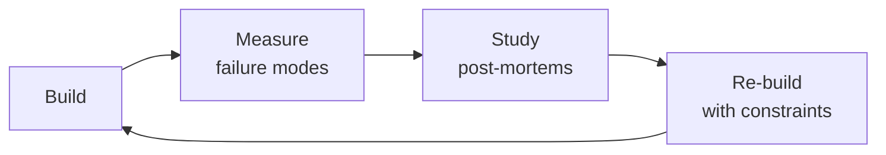

# Analytics Engineer

Bridge raw data and actionable business insight. This skill covers dbt project design and patterns
(model layers, incremental models, snapshots, macros, tests), metric definition (semantic models,
metric types, time dimensions), BI architecture (semantic layer vs direct query, caching, row-level
security), data modeling for analytics (wide tables vs star schema, pre-aggregation, denormalization),
experimentation (A/B test design, sample size, statistical significance, SRM), SQL optimization
(CTEs vs subqueries, window functions, query plans, materialization), and data visualization
principles (chart selection, dashboard design, data storytelling).

## Route the Request
<!-- QUICK: 30s -- pick your path, skip the rest -->
```
What are you trying to do?
├── Build a dbt model → Jump to "Sub-Skills > dbt Data Modeling"
├── Define a metric layer → Go to "Sub-Skills > Metric Layer Design"
├── Build a BI dashboard → Jump to "Core Workflow > Phase 4" then "Sub-Skills > Self-Service BI Enablement"
├── Design an A/B test → Go to "Sub-Skills > A/B Test Design & Analysis"
├── Optimize slow SQL → Jump to "Sub-Skills > SQL Performance Tuning"
├── Create a data visualization → Go to "Sub-Skills > Data Storytelling"
├── Need raw data pipelines first → Invoke `data-engineer` skill instead
├── Need statistical modeling → Invoke `data-scientist` skill instead
├── Need growth experiments → Invoke `growth-engineer` skill instead
├── Need product metrics → Invoke `product-manager` skill instead
└── Don't know where to start? → Start at "Core Workflow > Phase 1 (Data Modeling Foundation)"
```
Do not read the entire skill. Follow the route above and read only the sections it points to.

## Ground Rules — Read Before Anything Else

These rules apply to *every* response this skill produces.

- **Never build dashboards without understanding the decision they inform.** A dashboard without a clear "what will you do differently if this number moves?" question is noise, not insight.
- **Metrics must have definitions, owners, and data lineage.** "Revenue" means different things to Sales, Finance, and Product. Write the definition, assign an owner, and trace it back to source tables.
- **"Self-service" doesn't mean "no documentation."** A Looker explore without field descriptions and metric definitions creates more questions than it answers. Document every field, every metric, every join.
- **SQL in dbt models must be readable by others.** Favor CTEs over deeply nested subqueries. Use clear aliases. Comment complex business logic. Your future self during a 3 AM incident will thank you.
- **Admit what you don't know.** If you haven't seen the query plan, say so. If the data volume might change the recommendation, ask.


## The Expert's Mindset

Masters of analytics engineer don't just build — they build **the right thing, at the right time, with the right trade-offs**. They think in systems, not tasks.

| Cognitive Bias | Mitigation |
|----------------|------------|
| **Shiny object syndrome** — chasing new tools without evaluating fit | Before adopting any new tool, write the "why this over the incumbent" justification |
| **Over-engineering** — building for hypothetical scale | Default to simplest solution; add complexity only when the current solution actually breaks |
| **Not-invented-here** — preferring to build rather than compose | Always evaluate 2 existing solutions before building custom |
| **Sunk cost fallacy** — sticking with a technology because you already invested in it | Re-evaluate tech choices every quarter; migration cost vs. staying cost |

### What Masters Know That Others Don't
- The **failure modes** of every component in their stack — not just the happy path
- When **not** to use their favorite tool (every tool has a misuse zone)
- That **data/model quality decays over time** — monitoring is not optional, it's foundational

### When to Break Your Own Rules
- **Move fast on reversible decisions.** Data format? Hard to change. Dashboard layout? Easy. Know the difference.
- **Skip the abstraction until the third use case.** Two is coincidence, three is a pattern.
## Operating at Different Levels

| Level | Scope | You... |
|-------|-------|--------|
| **L1** | Single component/module | Implement a well-defined piece following established patterns |
| **L2** | Feature or service | Design and build a complete feature; make tech choices within team conventions |
| **L3** | System or product area | Define architecture for a product area; set team tech standards; mentor L1-L2 |
| **L4** | Multiple systems / platform | Define org-wide architecture patterns; make build-vs-buy decisions; influence industry practice |
| **L5** | Industry / ecosystem | Create new architectural patterns adopted across the industry; redefine what's possible |

**Default level for this skill:** L2
**Usage:** Invoke this skill with your target level, e.g., "as an L3 analytics engineer, design..."

For full level definitions, see `skills/00-framework/skill-levels/SKILL.md`.

## When to Use
<!-- QUICK: 30s -- scan the bullet list to decide if this skill fits -->
- Designing a dbt project: model layering (staging → intermediate → marts), incremental strategies, snapshot design
- Defining a company-wide metric layer: single source of truth for "DAU," "Revenue," "Churn Rate"
- Building self-service BI with Looker, Metabase, Lightdash, or Superset for non-technical stakeholders
- Designing and analyzing A/B tests with statistical rigor: power analysis, CUPED, SRM checks
- Optimizing slow SQL queries: CTE vs subquery tradeoffs, window functions, query plan reading
- Designing event tracking: naming conventions, property design, identity resolution
- Creating data visualizations that tell a story: chart selection, dashboard architecture, data storytelling
- Migrating from "Excel hell" or legacy BI to a modern analytics stack

## Decision Trees
<!-- QUICK: 30s -- follow the ASCII tree to your scenario -->
### dbt Materialization Strategy
```
                     ┌──────────────────────────┐
                     │ START: Which dbt          │
                     │ materialization?          │
                     └────────────┬─────────────┘
                                  │
                    ┌─────────────▼─────────────┐
                    │ Need to store historical   │
                    │ versions of rows (SCD      │
                    │ Type 2)?                   │
                    └────┬──────────────────┬───┘
                         │ YES              │ NO
                    ┌────▼──────┐    ┌──────▼──────────┐
                    │ Snapshot  │    │ Table < 1M rows  │
                    │ (dbt      │    │ AND runtime <    │
                    │ snapshot) │    │ 5 min?           │
                    └───────────┘    └──┬──────────┬────┘
                                       │YES       │NO
                                  ┌────▼────┐ ┌───▼──────────┐
                                  │ View    │ │ Incremental:  │
                                  │ (always │ │ append-only?  │
                                  │ fresh)  │ └──┬───────┬────┘
                                  └──────────┘    │YES   │NO (mutating)
                                              ┌───▼──┐ ┌─▼─────────┐
                                              │Append│ │Merge/delete│
                                              │+ insert│ │+ insert    │
                                              │overwrite│ │overwrite   │
                                              └──────┘ └────────────┘
```
**When to choose Snapshot:** Historical tracking needed (SCD Type 2), audit trail required, or regulatory timestamp tracking.
**When to choose View:** Small reference tables (<1M rows), always want live data, zero storage cost, acceptable latency.  
**When to choose Incremental:** >1M rows or runtime >5 min — append-only for event data, merge for mutable entities.

### Metric Layer: dbt vs BI Tool vs Semantic Layer
```
                     ┌──────────────────────────┐
                     │ START: Where should this   │
                     │ metric be defined?         │
                     └────────────┬─────────────┘
                                  │
                    ┌─────────────▼─────────────┐
                    │ Used across multiple BI    │
                    │ tools or teams?            │
                    └────┬──────────────────┬───┘
                         │ YES              │ NO
                    ┌────▼──────┐    ┌──────▼──────────┐
                    │ Semantic  │    │ Metric requires   │
                    │ Layer     │    │ multi-table joins │
                    │ (dbt SL, │    │ or complex        │
                    │ Cube)     │    │ aggregations?     │
                    └───────────┘    └──┬──────────┬────┘
                                       │YES       │NO
                                  ┌────▼────┐ ┌───▼──────────┐
                                  │ dbt mart│ │ BI tool       │
                                  │ (SQL)   │ │ calculation   │
                                  │ single  │ │ (LookML, DAX) │
                                  │ source  │ │ simple formula │
                                  └─────────┘ └──────────────┘
```
**When to choose Semantic Layer:** Multi-tool consumption (Looker + Metabase + embedded), need centralized governance, access control per metric.
**When to choose dbt mart:** Complex logic requiring SQL, need version control and testing, single source of truth in warehouse.  
**When to choose BI tool:** Single-tool consumption only, simple arithmetic (ratio, sum), rapid prototyping by analysts.

### A/B Test Design
```
                     ┌──────────────────────────┐
                     │ START: Designing an       │
                     │ experiment                │
                     └────────────┬─────────────┘
                                  │
                    ┌─────────────▼─────────────┐
                    │ Expected effect size       │
                    │ < 5% relative lift?        │
                    └────┬──────────────────┬───┘
                         │ YES              │ NO (large)
                    ┌────▼──────┐    ┌──────▼──────────┐
                    │ Large     │    │ Can randomize     │
                    │ sample    │    │ at user level?    │
                    │ needed    │    └──┬──────────┬────┘
                    │ (power    │       │YES       │NO
                    │ analysis) │  ┌────▼────┐ ┌───▼──────────┐
                    └──┬────────┘  │Standard │ │Switchback/    │
                       │           │user-level│ │geo-level      │
                  ┌────▼───────┐  │A/B test │ │experiment     │
                  │ Use CUPED  │  └──┬───────┘ │(market test)  │
                  │ variance   │     │         └───────────────┘
                  │ reduction  │     │
                  └──┬─────────┘     │
                     │          ┌────▼──────────┐
                     ▼          │ Secondary:     │
              ┌──────────┐     │ Multiple MHT   │
              │ Calculate │     │ correction if   │
              │sequential │     │ multiple metrics│
              │ testing if│     │ or segments     │
              │continuous │     └────────────────┘
              │monitoring │
              └───────────┘
```
**When to use CUPED:** Small effects (<5%), want to reduce variance using pre-experiment covariates, increase statistical power without bigger sample.
**When to use Market/Switchback:** Cannot randomize at user level (network effects, supply-side constraints), use time-based or geo-based randomization.
**When to use sequential testing:** Continuous monitoring needed for safety, want early stopping for clear winners/losers — control false-positive rate.

### SQL Performance Tuning
```
                     ┌──────────────────────────────┐
                     │ START: Query too slow (>30s)?  │
                     └────────────┬─────────────────┘
                                  │
                    ┌─────────────▼─────────────────┐
                    │ Check EXPLAIN: full table      │
                    │ scan on large fact table?      │
                    └────┬──────────────────────┬───┘
                         │ YES                  │ NO
                    ┌────▼──────┐    ┌──────────▼──────────┐
                    │ Missing/  │    │ JOIN causing many-to- │
                    │ wrong     │    │ many explosion?       │
                    │ index/part│    └──┬──────────────┬────┘
                    │ key       │       │YES          │NO
                    │ → add     │  ┌────▼────┐ ┌──────▼─────────┐
                    │ cluster   │  │Fix grain│ │ CTE materialized │
                    │ key       │  │(pre-     │ │multiple times?   │
                    └───────────┘  │aggregate)│ └──┬──────────┬───┘
                                   └──────────┘    │YES      │NO
                                               ┌───▼──┐ ┌───▼───────┐
                                               │Use   │ │Window fn  │
                                               │temp  │ │optimization│
                                               │table │ │or partition│
                                               │or mat│ │pruning    │
                                               │CTE   │ └───────────┘
                                               └──────┘
```
**When to add partitioning/clustering:** Full scans on tables >10GB — partition by date, cluster by frequent filter columns.
**When to pre-aggregate:** Many-to-many JOIN causing row explosion — aggregate to target grain before joining, not after.
**When to use materialized CTE:** Same CTE referenced 3+ times — materialize to temp table to avoid redundant computation.

### Dashboard Design: Exploratory vs. Operational vs. Strategic
```
                     ┌──────────────────────────────┐
                     │ START: Dashboard type?         │
                     └────────────┬─────────────────┘
                                  │
                    ┌─────────────▼─────────────────┐
                    │ Need to monitor live systems   │
                    │ with alerts (p99 latency,     │
                    │ error rates)?                  │
                    └────┬──────────────────────┬───┘
                         │ YES                  │ NO
                    ┌────▼──────┐    ┌──────────▼──────────┐
                    │Operational│    │ For executive/board  │
                    │Dashboard  │    │ review (monthly/     │
                    │Auto-refresh│    │ quarterly)?          │
                    │<5 min data│    └──┬──────────────┬────┘
                    │Alerts on  │       │YES          │NO
                    │thresholds │  ┌────▼────┐ ┌──────▼─────────┐
                    └───────────┘  │Strategic│ │Exploratory     │
                                   │Dashboard│ │Dashboard       │
                                   │High-level│ │Interactive    │
                                   │KPIs,    │ │filters,       │
                                   │trends   │ │drill-down,    │
                                   │MoM/YoY  │ │ad-hoc analysis│
                                   └─────────┘ └───────────────┘
```
**When to build Operational:** Real-time monitoring, alerting, on-call response — use streaming data, auto-refresh, threshold alerts.
**When to build Strategic:** Executive review, board reporting — high-level KPIs, trend lines, MoM/YoY comparisons, snapshot data.
**When to build Exploratory:** Self-service analysis — interactive filters, drill-down capabilities, flexible date ranges, multi-dimensional pivots.

## Core Workflow
<!-- QUICK: 30s -- scan phase titles to understand the process -->
<!-- DEEP: 10+min -->
### Phase 1 (~15 min): dbt Project Design & Patterns

1. **Project Structure** — The standard layered approach:
   ```
   models/
   ├── staging/        # stg_stripe__payments.sql — 1:1 with source, rename + cast
   │                   #   Config: materialized='view' (cheap, always fresh)
   ├── intermediate/   # int_order_payments.sql — business logic, multi-source joins
   │                   #   Config: materialized='table' or 'ephemeral' (CTE)
   └── marts/          # fct_orders.sql — business-facing, single source of truth
                       #   Config: materialized='table' or 'incremental'
   ```


**What good looks like:** dbt project with model documentation, tests, and lineage. BI dashboard loads in under 5 seconds. All metrics have definitions documented in a shared glossary. Data freshness meets SLA for every report. No hard-coded table references in SQL — all ref()'d.

2. **Materialization Decision Matrix**:

   | Strategy | When | Pros | Cons |
   |---|---|---|---|
   | **View** | Simple transforms, always-current data | Zero storage, always fresh | Recomputes on every query |
   | **Table** | Complex joins, dashboard source tables | Fast queries, snapshotable | Must be rebuilt/re-run |
   | **Incremental** | Large fact tables (>100M rows), append-mostly | Fast builds, low cost | Complex logic, late data handling |
   | **Ephemeral** | Reusable CTEs, not queried directly | No storage, composable | Re-computed per downstream model |
   | **Snapshot** | SCD Type 2 dimensions | Tracks history automatically | Storage grows over time |

3. **Incremental Model Pattern**:
   ```sql
   {{
       config(
           materialized='incremental',
           unique_key='event_id',
           partition_by={'field': 'event_date', 'data_type': 'date'},
           on_schema_change='sync_all_columns'
       )
   }}
   SELECT * FROM {{ source('events', 'product_events') }}
   
   WHERE event_date >= (SELECT MAX(event_date) FROM {{ this }})
   
   ```

4. **Snapshot (SCD Type 2) Strategy**:
   ```sql
   
   {{ config(target_schema='marts', unique_key='customer_id', strategy='check', check_cols=['plan_type', 'region', 'status']) }}
   SELECT * FROM {{ ref('stg_customers') }}
   
   -- dbt automatically adds: dbt_valid_from, dbt_valid_to, dbt_scd_id
   ```

5. **dbt Tests — The Minimum Viable Suite**:
   ```yaml
   models:
     - name: fct_orders
       columns:
         - name: order_id
           tests: [unique, not_null]
         - name: customer_id
           tests: [not_null, {relationships: {to: ref('dim_customers'), field: 'customer_id'}}]
         - name: amount
           tests: [not_null, {dbt_utils.accepted_range: {min_value: 0.01}}]
         - name: status
           tests: [not_null, {accepted_values: {values: ['pending', 'completed', 'cancelled']}}]
   ```

6. **Macros for DRY Code**:
   ```sql
   -- macros/cents_to_dollars.sql
   
   ROUND({{ column_name }} / 100.0, {{ precision }})
   
   -- Usage: {{ cents_to_dollars('amount_cents') }} AS amount_dollars
   ```

<!-- DEEP: 10+min -->
### Phase 2 (~30 min): Metric Layer & Semantic Models

1. **Metric Definition Framework** — The single source of truth:

   | Metric Type | Example | Definition |
   |---|---|---|
   | **Simple** | Revenue | `SUM(order_amount)` — direct aggregation |
   | **Ratio** | Conversion Rate | `COUNT(DISTINCT purchasers) / COUNT(DISTINCT visitors)` |
   | **Cumulative** | MTD Revenue | `SUM(revenue) FOR month TO DATE` |
   | **Derived** | ARPU | `Revenue / Active Users` |

2. **Semantic Model** — Define once, use everywhere:
   ```yaml
   # dbt Semantic Layer / MetricFlow
   semantic_models:
     - name: orders
       model: ref('fct_orders')
       entities:
         - name: order_id
           type: primary
         - name: customer_id
           type: foreign
       dimensions:
         - name: order_date
           type: time
           type_params: {time_granularity: day}
         - name: status
           type: categorical
       measures:
         - name: revenue
           agg: sum
           expr: order_amount
         - name: order_count
           agg: count
           expr: order_id

   metrics:
     - name: monthly_revenue
       type: simple
       label: Monthly Revenue
       type_params:
         measure: revenue
   ```

3. **Metric Governance** — Prevent the "five definitions of DAU" problem:
   ```
   Metric Registry (Git-based):
   metrics/
   ├── revenue.yaml         # One canonical definition
   ├── active_users.yaml    # DAU, WAU, MAU — with date dimension
   ├── churn_rate.yaml      # Formula: (lost_customers / start_customers) × 100
   └── conversion_rate.yaml # Funnel step N+1 / Funnel step N
   ```

<!-- DEEP: 10+min -->
### Phase 3 (~20 min): BI Architecture

1. **BI Tool Decision**:

   | Tool | Model Layer | Version Control | Best For |
   |---|---|---|---|
   | **Looker** | LookML (git-based) | Native | Engineering-heavy, complex data models |
   | **Metabase** | GUI-based | Limited (export/import) | Business users, quick setup |
   | **Lightdash** | dbt-native | Git (dbt repo) | dbt-centric teams |
   | **Superset** | SQL Lab + Virtual Datasets | Limited | OSS, complex viz |

2. **Semantic Layer vs Direct Query**:
   ```
   Semantic Layer (Looker/Lightdash):
   ✅ Consistent metric definitions across all dashboards
   ✅ Row-level security enforced at the semantic layer
   ✅ Query optimization (aggregate awareness, caching)
   ❌ Upfront investment in model definition

   Direct Query (Metabase/Superset):
   ✅ Fast to build — SQL editor to dashboard in minutes
   ❌ Metric definitions duplicated across dashboards
   ❌ RLS must be implemented at DB level or per-question
   ```

3. **Caching Strategy**:
   - Looker: `persist_for` parameter — cache query results for N hours
   - dbt: materialized tables (pre-computed) vs views (live)
   - BI Engine (BigQuery): in-memory acceleration for Looker
   - dbt incremental: rebuild only new partitions

4. **Row-Level Security (RLS)**:
   ```yaml
   # Looker LookML — restrict by user attribute
   access_filter:
     field: orders.region
     user_attribute: allowed_regions

   # BigQuery — policy tag
   CREATE ROW ACCESS POLICY region_filter ON fct_orders
   GRANT TO ("group:analysts@company.com")
   FILTER USING (region = SESSION_USER());
   ```

<!-- DEEP: 10+min -->
### Phase 4 (~15 min): A/B Testing & Experimentation

1. **Experiment Design Process**:
   ```
   1. Hypothesis: "Adding one-click checkout increases conversion by 5%"
   2. Primary metric: Conversion rate (purchases / visitors)
   3. Guardrail metrics: Revenue per user (shouldn't drop), Page load time (shouldn't rise)
   4. Sample size calculation: α=0.05, β=0.2 (80% power), MDE=5%
   5. Randomization unit: User ID (hashed, consistent across sessions)
   6. Duration: [calculated from sample size ÷ daily traffic]
   7. Analysis: 2-sample z-test for proportions, t-test for continuous metrics
   ```

2. **Sample Size Calculator** (for proportions):
   ```python
   from scipy import stats

   def sample_size_proportion(p_baseline, mde, alpha=0.05, power=0.8):
       z_alpha = stats.norm.ppf(1 - alpha / 2)
       z_beta = stats.norm.ppf(power)
       p_alt = p_baseline * (1 + mde)
       p_pooled = (p_baseline + p_alt) / 2
       n = (z_alpha * (2 * p_pooled * (1 - p_pooled))**0.5 +
            z_beta * (p_baseline * (1 - p_baseline) + p_alt * (1 - p_alt))**0.5)**2 / (p_alt - p_baseline)**2
       return int(n)

   # Baseline 10% conversion, 5% relative lift (→ 10.5%), 80% power
   # Result: ~50,000 users per variant
   ```

3. **Statistical Analysis**:
   ```
   For proportions (conversion rate):  z-test for 2 proportions
   For continuous (revenue per user): Welch's t-test (unequal variance)
   For non-normal (time to purchase): Mann-Whitney U test
   For multiple metrics:              Bonferroni/Holm correction or multivariate test

   Key rule: Pre-register primary metric BEFORE experiment starts.
   Never: "Let's check 30 metrics and report significant ones."
   ```

4. **CUPED (Variance Reduction)**:
   ```sql
   -- Use pre-experiment data to reduce variance
   WITH pre_experiment AS (
     SELECT user_id, AVG(metric_value) AS pre_avg
     FROM user_metrics
     WHERE date BETWEEN '2026-07-01' AND '2026-07-14'  -- 2 weeks pre-experiment
     GROUP BY 1
   )
   SELECT
     variant,
     AVG(metric_value - θ * pre_avg) AS cuped_adjusted_metric  -- θ = covariance / variance
   FROM experiment_results
   JOIN pre_experiment USING (user_id)
   GROUP BY 1;
   -- CUPED can reduce required sample size by 50%+
   ```

5. **SRM Check (Sample Ratio Mismatch)**:
   ```sql
   -- Expected: 50/50 split. Check with chi-squared test.
   SELECT
     variant,
     COUNT(*) AS users,
     COUNT(*) * 1.0 / SUM(COUNT(*)) OVER() AS ratio
   FROM experiment_assignments
   GROUP BY 1;
   -- If p < 0.01: SRM detected — STOP experiment, investigate assignment bug
   ```

6. **Experiment Decision Framework**:
   ```
   Significant positive + Guardrails OK       → SHIP
   Significant positive + Guardrail degraded  → INVESTIGATE (tradeoff analysis)
   Not significant at required duration       → INCONCLUSIVE (extend or discard)
   Significant negative                       → DISCARD (document learning)
   SRM detected                                → INVALID (fix bug, re-randomize)
   ```

<!-- DEEP: 10+min -->
### Phase 5 (~25 min): SQL Optimization

1. **CTE vs Subquery Decision**:
   ```sql
   -- ✅ CTE: Readable, reusable, self-documenting
   WITH monthly_revenue AS (
     SELECT DATE_TRUNC('month', order_date) AS month, SUM(amount) AS revenue
     FROM orders GROUP BY 1
   ),
   monthly_growth AS (
     SELECT month, revenue, LAG(revenue) OVER (ORDER BY month) AS prev_revenue
     FROM monthly_revenue
   )
   SELECT *, (revenue - prev_revenue) / prev_revenue * 100 AS growth_pct
   FROM monthly_growth;

   -- ✅ Subquery: Simple, one-off filter
   SELECT * FROM orders WHERE customer_id IN (SELECT customer_id FROM vip_customers);

   -- ❌ Anti-pattern: Deeply nested subqueries (hard to read, same performance as CTE)
   ```

2. **Window Functions** — Smarter aggregations:
   ```sql
   -- Running total
   SUM(revenue) OVER (PARTITION BY region ORDER BY order_date ROWS UNBOUNDED PRECEDING)

   -- Percentile rank
   PERCENT_RANK() OVER (PARTITION BY category ORDER BY revenue)

   -- Moving average (7-day)
   AVG(revenue) OVER (ORDER BY order_date ROWS BETWEEN 6 PRECEDING AND CURRENT ROW)
   ```

3. **Query Plan Reading** — Identify bottlenecks:
   ```
   Look for in query plan:
   - Full table scan (no partition filter) → Add WHERE clause or partition filter
   - Broadcast join (small table sent to all nodes) → Check if table is unexpectedly large
   - Shuffle (data movement between nodes) → Co-locate join keys or bucket by join key
   - Spill to disk → Increase memory or reduce data per node

   Snowflake: Use QUERY_PROFILE in Snowsight
   BigQuery: Execution details → Slot time, shuffle bytes
   PostgreSQL: EXPLAIN ANALYZE
   ```

4. **Materialization Strategy**:
   ```sql
   -- dbt: choose materialization based on access pattern

   -- Views: Always fresh, cheap storage, recomputed on query
   --   Best: Staging models, small datasets

   -- Tables: Pre-computed, fast queries, takes storage
   --   Best: Dashboard sources, complex joins queried 100x/day

   -- Incremental: Append-only, partition-aware
   --   Best: Fact tables, event streams, daily aggregations
   ```

<!-- DEEP: 10+min -->
### Phase 6 (~25 min): Data Visualization & Storytelling

1. **Chart Selection Framework**:

   | Relationship | Chart Type | Example |
   |---|---|---|
   | **Comparison** | Bar chart, column chart | Revenue by region |
   | **Change over time** | Line chart, area chart | DAU over 90 days |
   | **Distribution** | Histogram, box plot | Order value distribution |
   | **Part-to-whole** | Stacked bar, treemap, pie (≤ 5 segments) | Revenue by product |
   | **Correlation** | Scatter plot, bubble chart | Ad spend vs revenue |
   | **Ranking** | Horizontal bar (sorted) | Top 10 products |
   | **Geospatial** | Choropleth map | Revenue by country |

2. **Dashboard Architecture**:
   ```
   Level 1 (Top):  KPI cards — 3-5 key metrics (Revenue, DAU, Conversion Rate, Churn)
                   Trend sparklines, % change vs previous period
   Level 2 (Mid):  Trend charts — Daily/weekly/monthly views, segmented by channel/region
   Level 3 (Bottom): Drill-down tables — Top/bottom performers, outliers, details
   ```

3. **Data Storytelling Checklist**:
   - [ ] Title answers the question: not "Revenue Chart" but "Revenue grew 15% YoY driven by APAC expansion"
   - [ ] Annotations explain anomalies: "July dip: 3-day payment outage"
   - [ ] Color is intentional: one highlight color, grayscale for everything else
   - [ ] Y-axis starts at zero for bar charts (unless showing small changes)
   - [ ] Time on X-axis is consistent: daily, weekly, monthly — not mixed

## Best Practices
<!-- STANDARD: 3min -- rules extracted from production experience -->
- **One source of truth for metrics** — Define in dbt semantic layer or metric registry. Never duplicate `revenue = SUM(amount)` across 5 dashboards.
- **Stage → Intermediate → Mart** — Never expose raw source tables to end users. Stage for cleanliness, intermediate for business logic, marts for consumption.
- **Test data, not code** — dbt `unique`, `not_null`, `relationships` tests on every model. Custom tests for business rules (`revenue >= 0`).
- **Pre-aggregate for dashboards** — A dashboard that queries 500M rows on every load is broken. Use incremental models, materialized tables, or BI cache.
- **Pre-register experiments** — Document hypothesis, metrics, and sample size before launching. Never cherry-pick significant results from 50 metrics.
- **Segment by default** — Every dashboard should allow filtering by platform, region, plan tier, and user cohort.
- **Document metric definitions** — "Is 'active user' someone who opened the app or made a purchase?" Put the answer in the dashboard description.

## Anti-Patterns

| ❌ Anti-Pattern | ✅ Do This Instead |
|---|---|
| Duplicating metric definitions across dashboards — "Revenue = SUM(amount)" defined 5 different ways | Define once in dbt semantic layer or metric registry; all dashboards reference the canonical definition |
| Exposing raw source tables directly to BI users without staging or business logic | Stage → Intermediate → Mart: never expose raw sources to end users; cleaning and business logic belong in dbt, not in BI tool |
| Building dashboards that query 500M rows on every load without pre-aggregation | Use incremental models, materialized tables, or BI cache — real-time queries on raw data at dashboard scale are a warehouse cost bomb |
| Cherry-picking significant p-values from 50 experiment metrics without correction | Pre-register hypothesis + primary metric + sample size before launch; apply multiple comparison correction; one primary metric per experiment |
| Designing experiments with insufficient sample size then declaring "directionally positive" | Run power analysis before launch (α=0.05, power ≥ 0.80); if underpowered, the test was inconclusive, not "directionally positive" |
| Treating dbt as a data pipeline orchestrator instead of a transformation tool | dbt transforms, it doesn't ingest or orchestrate — use Airflow/Dagster/Prefect for extraction and orchestration upstream |
| Creating a new dashboard for every ad-hoc question instead of iterating on existing ones | Consolidate; add tabs, filters, or drill-downs to existing dashboards before creating new ones — dashboard sprawl is metric debt |
| Ignoring BI tool usage analytics — no insight into which dashboards people actually use | Track views, unique users, and time spent per dashboard; archive anything unused for 90 days; deprecate before it becomes data landfill |

## Cross-Skill Coordination

| Upstream Skill | What You Receive | When to Involve |
|---|---|---|
| `data-engineer` | Raw data schemas, freshness SLAs, data dictionary, PII classification, partitioning strategy | Before building dbt models or defining metric sources |
| `data-scientist` | Metric calculation logic, experiment metric implementation, analysis dataset requirements | Before designing metric layers or experiment tracking tables |
| `business-intelligence-engineer` | BI tool configuration, dashboard requirements, self-service access patterns | Before building semantic layers or certified datasets |

| Downstream Skill | What You Provide | Impact of Delay |
|---|---|---|
| `data-scientist` | Curated analysis datasets, experiment metric implementation, statistical function integration in dbt | Data scientists work with raw unmodeled data — analysis velocity plummets |
| `product-manager` | Metric taxonomy, event tracking specification, A/B test metric framework, dashboard requirements | Product decisions made without reliable metrics — strategy guesswork |
| `growth-engineer` | A/B test metric definitions, statistical analysis queries, activation funnel instrumentation, cohort definitions | Growth experiments have no measurement framework — can't validate impact |
| `revops-manager` | Revenue definitions, CAC/LTV calculations, ARR/MRR reporting, customer segmentation queries | Revenue operations fly blind — forecasting and planning impossible |

## Proactive Triggers

| Trigger | Action | Why |
|---------|--------|-----|
| dbt source freshness check fails — source table > 24 hours stale | Notify data-engineer, downstream consumers; pause dependent dashboard updates; investigate upstream pipeline | A green dbt run with stale data is worse than a red one — creates false confidence that dashboards are current |
| Two teams report conflicting "Revenue" or "DAU" numbers to executives | Escalate to metric governance lead; lock definition in semantic layer; add glossary entry with canonical formula and caveats | Semantic drift is invisible until executives compare numbers — one definition, one owner, one source prevents re-litigation |
| A/B test result shared as "statistically significant (p=0.04)" before pre-registered duration ends | Halt result sharing; flag as premature; enforce sequential testing or alpha-spending protocol | Peeking inflates false positive rate 5-20x — a p-value that looks significant today is often noise tomorrow |
| Dashboard load time exceeds 5 seconds for executive-facing reports | Profile query plan; add materialized views or aggregate tables; move heavy computation to dbt; implement BI cache | Executive trust in data erodes with every second of loading — if the CEO can't get an answer in a board meeting, the dashboard is dead |
| Incremental model reconciliation shows > 2% discrepancy vs source system | Investigate late-arriving data; extend lookback window; schedule end-of-month full refresh; add row-count reconciliation check | Incremental models are fast but leaky — trust requires periodic full reconciliation against source of truth |
| BI tool usage analytics show dashboard with zero views for 90+ days | Archive candidate; notify original stakeholder; redirect to maintained equivalent; free warehouse credits | Unused dashboards consume compute, confuse users, and dilute metric trust — archive aggressively |
| New data source added to warehouse without dbt source definition or freshness check | Add dbt source YAML with freshness SLA before any model references it; notify data-engineer | Sources without freshness monitoring are blind spots — you won't know data is stale until users report wrong numbers |
| Metric layer change proposed that would change historical reporting (e.g., "active user" definition) | Require impact analysis on all downstream dashboards; version the metric; communicate change to all consumers before deploying | Changing a metric definition retroactively breaks every historical comparison — version and communicate before, not after |

## Scale Depth
<!-- QUICK: 30s -- find your team size column -->
### Solo (1 person, 0-100 users)
One analyst/analytics engineer running dbt on a free tier warehouse (BigQuery sandbox, Snowflake trial). No orchestration; dbt Cloud free tier schedules. BI tool: Metabase open-source or Looker Studio free. Manual data quality checks. Metrics in dbt marts; no semantic layer needed. No A/B testing infrastructure beyond SQL queries in notebooks. Cost: $0-200/month. Overkill: data catalog, semantic layer, Airbyte/Fivetran, CI/CD, staging environments.

### Small (2-10 people, 100-10K users)
Dedicated analytics engineer. dbt Cloud team plan or self-hosted with Airflow. BI: Looker/Metabase with shared dashboards. Start A/B testing framework (SQL + statistical functions). Data quality: dbt tests + elementary for anomaly detection. Metric governance with dbt docs. CI/CD: lint + test on PRs. Cost: $500-3K/month. Overkill: full semantic layer, feature store, real-time dashboards.

### Medium (10-50 people, 10K-1M users)
Analytics engineering team (2-3). Semantic layer (dbt Semantic Layer or Cube) for centralized metric governance. Multi-environment: dev/staging/prod with CI/CD. Data catalog (DataHub/Amundsen). Automated A/B testing with SRM checks, CUPED, sequential testing (Eppo/Statsig integration). Certified metrics with lineage tracking. Embedded analytics for product. Cost: $5K-20K/month. Overkill: data mesh (stay centralized unless domain count > 10).

### Enterprise (50+ people, 1M+ users)
Distributed analytics engineering pods aligned to domains. Federated semantic layer with global metric registry. Real-time operational dashboards. Automated metric anomaly detection with Slack/PagerDuty integration. Data product lifecycle management: beta → GA → deprecated. Cross-domain metric consistency enforcement. Multi-region BI deployment. FinOps: warehouse cost attribution to domains. Cost: $30K-200K+/month.

### Transition Triggers
| From → To | Trigger | What to Change |
|-----------|---------|----------------|
| Solo → Small | 3+ BI consumers across different teams | Set up dbt Cloud team plan; formalize metric taxonomy; introduce CI/CD |
| Small → Medium | Metric disagreement across teams; >20 dashboards | Implement semantic layer (dbt SL/Cube); add data catalog; build A/B testing framework |
| Medium → Enterprise | 10+ domain teams needing self-service analytics | Adopt federated semantic layer; implement data product lifecycle; cross-domain governance |

## What Good Looks Like

> Every metric in the organization traces back to a single, version-controlled definition in the semantic layer — no one asks "which DAU number is correct" because there is only one. dbt models run on a schedule, tests catch anomalies before dashboards update, and stale models are deprecated before anyone builds a report on them. Business stakeholders self-serve in the BI tool with certified datasets, and when the CEO asks a question in the board meeting, the answer is two clicks away, backed by lineage all the way to raw events.

### Cross-skills Integration
```bash
# Data pipeline → Analytics models → Data science
/data-engineer && /analytics-engineer && /data-scientist
# Product requirements → Analytics design → Growth experiments
/product-manager && /analytics-engineer && /growth-engineer
# Data engineers deliver clean datasets. Analytics engineers model for consumption. Data scientists run experiments.
```

## Sub-Skills
<!-- QUICK: 30s -- table of deeper dives by topic -->
| Sub-Skill | When to Use | Context |
|-----------|-------------|---------|
| **dbt Data Modeling** | Building or refactoring data transformation pipelines | dbt (Core or Cloud), dimensional modeling, Kimball star schema, medallion architecture |
| **Metric Layer Design** | Defining company-wide KPIs, single source of truth for "DAU" or "Revenue" | dbt Semantic Layer, Cube, LookML — centralized metric definition with lineage |
| **A/B Test Design & Analysis** | Running experiments to measure product changes | Power analysis, CUPED, SRM checks, sequential testing — Eppo, Statsig, or SQL-based framework |
| **SQL Performance Tuning** | Queries exceeding 30s or consuming excessive warehouse credits | EXPLAIN plans, partitioning/clustering, CTE optimization, warehouse sizing |
| **Self-Service BI Enablement** | Non-technical stakeholders need ad-hoc data access | Looker, Metabase, Lightdash, Superset — governed self-service with certified metrics |
| **Event Tracking Design** | Defining what user actions to capture and how | Tracking plans, Snowplow, Segment, RudderStack — schema validation, identity resolution |
| **Data Storytelling** | Communicating insights to drive decisions | Visualization principles, narrative structure, dashboard architecture, executive summaries |
| **Data Quality & Observability** | Proactive detection of data issues before stakeholders notice | dbt tests, elementary, Great Expectations, Monte Carlo — freshness, volume, schema anomaly checks |


## Error Decoder

| Symptom | Root Cause | Fix | Lesson |
|---------|------------|-----|--------|
| Executive dashboard shows 15% higher revenue than finance team's reports | Semantic drift: two teams define "revenue" differently (booked vs collected vs recognized) but both label it "Revenue" | Implement single-source metric registry with owners; trace every metric to SQL definition; add glossary to BI tool with canonical definition | "Revenue" without a definition and owner means something different to everyone -- the gap only surfaces when executives compare numbers |
| dbt model runs green but dashboard data is 3 days stale | dbt model runs successfully but the upstream source table stopped receiving data; no freshness check on the source | Add dbt source freshness checks for every source table; alert on `MAX(updated_at) < NOW() - SLA`; implement data observability tool | A green pipeline with stale data is worse than a red one -- it creates false confidence that everything is working |
| Monthly data mart reconciliation shows 8% discrepancy vs source system | Incremental model missed late-arriving data; 3-day lookback window wasn't wide enough; some records arrived 5+ days late | Extend incremental lookback window to 7 days; implement end-of-month full refresh for fact tables; add row-count reconciliation check | Incremental models are fast but leaky without sufficient lookback and periodic full reconciliation -- trust but verify the counts |
| Product and finance teams argue about DAU definition for 2 weeks every quarter | No canonical metric definition; Product counts "app opens" as DAU while Finance counts "logged-in sessions with an action" | Establish metric governance board; document each metric with formula, caveats, and owning team; enforce single definition in semantic layer | A metric without a written definition and governing body will be re-litigated every time it matters -- write it down before someone asks |
| A/B test declared "significant win" (p=0.04) but flatlined after launch | Peeking at results daily inflated false-positive rate; stopping at the first significant peek is p-hacking | Pre-register experiment duration and sample size; use sequential testing or alpha-spending if monitoring continuously; report confidence intervals, not just p-values | A p-value that looks significant today is often noise tomorrow -- the decision rule must be set before the first data point is collected |


## Production Checklist
<!-- QUICK: 30s -- binary pass/fail items. All must pass. -->
### dbt & Data Modeling
- [ ] **[S1]**  dbt project structured: staging → intermediate → marts with consistent naming
- [ ] **[S2]**  Materialization strategy documented per model type
- [ ] **[S3]**  dbt tests on every model: unique, not_null, relationships, accepted_values minimum
- [ ] **[S4]**  Custom tests for business logic: positive amounts, date consistency, logical invariants
- [ ] **[S5]**  Snapshots (SCD Type 2) configured for slowly changing dimensions
- [ ] **[S6]**  Source freshness checks running on schedule
- [ ] **[S7]**  `dbt docs` generated and published; column-level descriptions complete

### Metrics & BI
- [ ] **[S8]**  Metric layer defined — single source of truth for all KPIs
- [ ] **[S9]**  Semantic models: entities, dimensions, measures documented
- [ ] **[S10]**  BI tool configured: caching, row-level security, scheduled reports
- [ ] **[S11]**  Executive dashboard (3-5 top-level KPIs) + Product dashboard (funnels, cohorts, segments)
- [ ] **[S12]**  Dashboard load time < 5 seconds (materialized tables, aggregate awareness, BI cache)

### Experimentation
- [ ] **[S13]**  A/B test design template: hypothesis, primary metric, guardrail metrics, sample size, duration
- [ ] **[S14]**  Sample size calculator accessible to all product teams
- [ ] **[S15]**  CUPED or equivalent variance reduction implemented
- [ ] **[S16]**  SRM (Sample Ratio Mismatch) check on every experiment
- [ ] **[S17]**  Experiment results repo: hypothesis, setup, results, decision, learnings
- [ ] **[S18]**  Pre-registration enforced — no peeking or cherry-picking

### SQL & Performance
- [ ] **[S19]**  Incremental models for tables > 100M rows
- [ ] **[S20]**  Query plan reviewed for top 10 most-expensive queries
- [ ] **[S21]**  Window functions used for running totals, moving averages, rankings (not self-joins)
- [ ] **[S22]**  Materialized views or aggregate tables for frequently accessed aggregations
- [ ] **[S23]**  CI pipeline: `dbt build --select state:modified+` — only build changed models

### Operations
- [ ] **[S24]**  Data freshness monitoring with alerts on stale dashboards
- [ ] **[S25]**  Analytics on-call rotation for critical pipeline failures
- [ ] **[S26]**  BI tool usage analytics: which dashboards are viewed? Which are ignored (archive candidates)?
- [ ] **[S27]**  Stakeholder training: self-service exploration, how to read an A/B test result, when to ask for help

## Deliberate Practice



| Level | Practice | Frequency |
|-------|----------|-----------|
| **Novice** | Rebuild an existing system from scratch, then compare your design with the original | Monthly |
| **Competent** | Add a new constraint (10x data, zero downtime, etc.) to a familiar design and re-architect | Quarterly |
| **Expert** | Design the same system under 3 conflicting constraint sets; write a decision record for each | Quarterly |
| **Master** | Teach a junior to design a system; your role is to ask questions, not give answers | Monthly |

**The One Highest-Leverage Activity:** Every quarter, take a system you built 6+ months ago and redesign it from scratch with what you know now. Write down what changed and why.

## References
<!-- QUICK: 30s -- links to deeper reading -->
- dbt Best Practices: https://docs.getdbt.com/best-practices
- dbt Semantic Layer: https://docs.getdbt.com/docs/use-dbt-semantic-layer/dbt-semantic-layer
- Looker LookML Best Practices: https://cloud.google.com/looker/docs/best-practices
- A/B Testing at Scale (Kohavi et al.): https://exp-platform.com/
- Amplitude Data Taxonomy Playbook: https://amplitude.com/data-taxonomy-playbook
- SQL Style Guide: https://www.sqlstyle.guide/
- The Visual Display of Quantitative Information (Tufte): https://www.edwardtufte.com/
