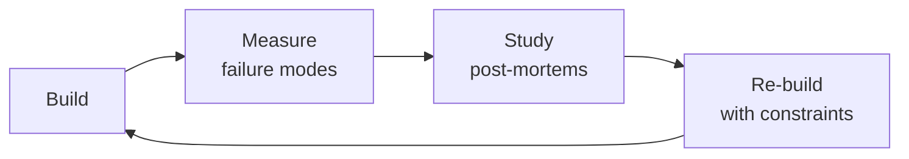

# Analytics Engineer
> **Portability target:** Spec-level (runs on Claude Code, Copilot, Gemini CLI, Codex, Cursor). No vendor-specific frontmatter fields.

Bridge raw data and actionable business insight. This skill covers dbt project design and patterns
(model layers, incremental models, snapshots, macros, tests), metric definition (semantic models,
metric types, time dimensions), BI architecture (semantic layer vs direct query, caching, row-level
security), data modeling for analytics (wide tables vs star schema, pre-aggregation, denormalization),
experimentation (A/B test design, sample size, statistical significance, SRM), SQL optimization
(CTEs vs subqueries, window functions, query plans, materialization), and data visualization
principles (chart selection, dashboard design, data storytelling).

## Route the Request

### Auto-Route (No User Input Required)
Evaluate these file-system conditions in order. First match wins — jump immediately.

| # | Condition | Action |
|---|-----------|--------|
| A1 | `file_exists("dbt_project.yml")` OR `file_contains("**/*.sql", "{{\\s*ref\\(")` | Domain: **dbt Data Modeling**. Jump to "Sub-Skills > dbt Data Modeling" and "Core Workflow > Phase 1." |
| A2 | `file_exists("**/semantic_models/**/*.yml")` OR `file_contains("**/*.yml", "metric:|semantic_model:")` | Domain: **Metric Layer Design**. Jump to "Sub-Skills > Metric Layer Design." |
| A3 | `file_contains("**/*.{py,sql,md,R}", "experiment|A/B.test|power.analysis|SRM|CUPED")` OR `file_exists("**/experiments/**")` | Domain: **A/B Test Design & Analysis**. Jump to "Sub-Skills > A/B Test Design & Analysis." |
| A4 | `file_contains("**/*.sql", "EXPLAIN|query.plan|partition.by|cluster.by|materialized")` OR `file_exists("**/performance/**")` | Domain: **SQL Performance Tuning**. Jump to "Sub-Skills > SQL Performance Tuning." |
| A5 | `file_contains("**/*.lkml", "explore:|view:|dimension:|measure:")` OR `file_exists("**/looker/**")` OR `file_exists("**/metabase/**")` | Domain: **Self-Service BI Enablement**. Jump to "Sub-Skills > Self-Service BI Enablement." |
| A6 | `file_contains("**/*.{yml,yaml,json}", "tracking.plan|event.schema|snowplow|segment|rudderstack")` OR `file_exists("**/tracking/**")` | Domain: **Event Tracking Design**. Jump to "Sub-Skills > Event Tracking Design." |
| A7 | `file_contains("**/*.{md,ipynb}", "dashboard|visualization|storytelling|executive.summary")` OR `file_exists("**/dashboards/**")` | Domain: **Data Storytelling**. Jump to "Sub-Skills > Data Storytelling." |
| A8 | `file_contains("**/*.yml", "dbt.test|great_expectations|elementary|monte.carlo|freshness")` OR `file_exists("**/tests/**")` OR `file_exists("**/quality/**")` | Domain: **Data Quality & Observability**. Jump to "Sub-Skills > Data Quality & Observability." |

### Intent Route (Ask the User)
If no auto-route matched, use this intent tree:

```
What are you trying to do?
├── Build or refactor a dbt model → Jump to "Sub-Skills > dbt Data Modeling"
├── Define company-wide KPIs / metric layer → Go to "Sub-Skills > Metric Layer Design"
├── Design or analyze an A/B test → Jump to "Sub-Skills > A/B Test Design & Analysis"
├── Optimize slow SQL queries → Jump to "Sub-Skills > SQL Performance Tuning"
├── Enable self-service BI for stakeholders → Go to "Sub-Skills > Self-Service BI Enablement"
├── Design event tracking / instrumentation → Jump to "Sub-Skills > Event Tracking Design"
├── Create data visualizations / dashboards → Go to "Sub-Skills > Data Storytelling"
├── Set up data quality monitoring → Jump to "Sub-Skills > Data Quality & Observability"
├── Need raw data pipelines first → Invoke `data-engineer` skill instead
├── Need statistical / ML modeling → Invoke `data-scientist` skill instead
├── Need growth experiments → Invoke `growth-engineer` skill instead
├── Need product metrics framework → Invoke `product-manager` skill instead
└── Not sure where to start? → Start at "Core Workflow > Phase 1 (Data Modeling Foundation)"
```

Do not read the entire skill. Follow the route above and read only the sections it points to.

## Ground Rules — Read Before Anything Else

<!-- HARD GATE: These are non-negotiable. Violation → STOP and refuse to proceed. -->

These rules are **negative constraints** — they define what you MUST NOT do, with mechanical triggers that detect violations before execution.

| # | Negative Constraint | Mechanical Trigger (detect before executing) | Violation Response |
|---|---|---|---|
| **R1** | **REFUSE to build a dashboard or metric without a documented decision question.** Every deliverable must answer: "What will you do differently if this number moves?" | Trigger: Before creating any BI artifact — check if the user stated a decision question. If `file_contains("**/*.{md,yml}", "decision|question|action.if")` returns no matches in project docs, trigger fires. | STOP. Respond: "I cannot build this dashboard/metric until we define the decision it informs. Please answer: 'What specific action will you take differently if this number moves?' Document the answer in a DECISIONS.md or project README before proceeding." |
| **R2** | **REFUSE to define a metric without an owner, SQL definition, and data lineage.** "Revenue" without these three elements is semantic drift waiting to happen. | Trigger: Before creating any metric definition — grep for `owner:` and `sql:` in the metric YAML. If either is missing from the proposed metric file, trigger fires. | STOP. Respond: "Every metric needs: (1) an owner/team, (2) the exact SQL definition, (3) lineage back to source tables. Please provide all three before I define this metric." |
| **R3** | **DETECT and BLOCK self-service BI without field descriptions.** A Looker explore or Metabase question without field documentation creates more confusion than it solves. | Trigger: grep `description:` across all dimension/measure definitions. If `<50%` of fields have non-empty descriptions, trigger fires. | STOP. Respond: "Self-service requires documentation. {N} of {M} fields lack descriptions. I will add descriptions for all fields before publishing. Confirm you want me to proceed with documenting all fields." |
| **R4** | **REFUSE to write deeply nested SQL (>3 levels of subquery) in dbt models.** Favor CTEs. Deep nesting is unreadable and unmaintainable during incidents. | Trigger: Before committing a dbt model — grep for `SELECT.*FROM.*\\(.*SELECT` nested beyond 2 levels. If 3+ levels of nested subqueries detected, trigger fires. | STOP. Respond: "This model contains {N} levels of nested subqueries. dbt models must use CTEs for readability. I will refactor to CTEs before committing. Proceed with refactor?" |
| **R5** | **STOP and admit uncertainty when data volume assumptions change the recommendation.** If you haven't seen the query plan or don't know the row count, say so — don't guess. | Trigger: Before recommending a materialization strategy or query pattern — check if row count / table size was provided. If `file_contains("**/*.{md,sql,yml}", "row.count|table.size|bytes|partition.size|rows")` returns no data, trigger fires. | STOP. Respond: "My recommendation depends on data volume. Without row counts or table sizes, I'm guessing. Please provide: approximate row count, daily growth rate, and query latency requirements. Until then, I'll flag all assumptions explicitly." |

## The Expert's Mindset

Masters of analytics engineer don't just build — they build **the right thing, at the right time, with the right trade-offs**. They think in systems, not tasks.

| Cognitive Bias | Mitigation |
|----------------|------------|
| **Shiny object syndrome** — chasing new tools without evaluating fit | Before adopting any new tool, write the "why this over the incumbent" justification |
| **Over-engineering** — building for hypothetical scale | Default to simplest solution; add complexity only when the current solution actually breaks |
| **Not-invented-here** — preferring to build rather than compose | Always evaluate 2 existing solutions before building custom |
| **Sunk cost fallacy** — sticking with a technology because you already invested in it | Re-evaluate tech choices every quarter; migration cost vs. staying cost |

### What Masters Know That Others Don't
- The **failure modes** of every component in their stack — not just the happy path
- When **not** to use their favorite tool (every tool has a misuse zone)
- That **data/model quality decays over time** — monitoring is not optional, it's foundational

### When to Break Your Own Rules
- **Move fast on reversible decisions.** Data format? Hard to change. Dashboard layout? Easy. Know the difference.
- **Skip the abstraction until the third use case.** Two is coincidence, three is a pattern.

## Operating at Different Levels

| Level | Scope | You... |
|-------|-------|--------|
| **L1** | Single component/module | Implement a well-defined piece following established patterns |
| **L2** | Feature or service | Design and build a complete feature; make tech choices within team conventions |
| **L3** | System or product area | Define architecture for a product area; set team tech standards; mentor L1-L2 |
| **L4** | Multiple systems / platform | Define org-wide architecture patterns; make build-vs-buy decisions; influence industry practice |
| **L5** | Industry / ecosystem | Create new architectural patterns adopted across the industry; redefine what's possible |

**Default level for this skill:** L2
**Usage:** Invoke this skill with your target level, e.g., "as an L3 analytics engineer, design..."

For full level definitions, see `skills/00-framework/skill-levels/SKILL.md`.

## When to Use

<!-- QUICK: 30s -- scan the bullet list to decide if this skill fits -->
- Designing a dbt project: model layering (staging → intermediate → marts), incremental strategies, snapshot design
- Defining a company-wide metric layer: single source of truth for "DAU," "Revenue," "Churn Rate"
- Building self-service BI with Looker, Metabase, Lightdash, or Superset for non-technical stakeholders
- Designing and analyzing A/B tests with statistical rigor: power analysis, CUPED, SRM checks
- Optimizing slow SQL queries: CTE vs subquery tradeoffs, window functions, query plan reading
- Designing event tracking: naming conventions, property design, identity resolution
- Creating data visualizations that tell a story: chart selection, dashboard architecture, data storytelling
- Migrating from "Excel hell" or legacy BI to a modern analytics stack

## Decision Trees

<!-- QUICK: 30s -- follow the ASCII tree to your scenario -->
### dbt Materialization Strategy

```
                     ┌──────────────────────────┐
                     │ START: Which dbt          │
                     │ materialization?          │
                     └────────────┬─────────────┘
                                  │
                    ┌─────────────▼─────────────┐
                    │ Need to store historical   │
                    │ versions of rows (SCD      │
                    │ Type 2)?                   │
                    └────┬──────────────────┬───┘
                         │ YES              │ NO
                    ┌────▼──────┐    ┌──────▼──────────┐
                    │ Snapshot  │    │ Table < 1M rows  │
                    │ (dbt      │    │ AND runtime <    │
                    │ snapshot) │    │ 5 min?           │
                    └───────────┘    └──┬──────────┬────┘
                                       │YES       │NO
                                  ┌────▼────┐ ┌───▼──────────┐
                                  │ View    │ │ Incremental:  │
                                  │ (always │ │ append-only?  │
                                  │ fresh)  │ └──┬───────┬────┘
                                  └──────────┘    │YES   │NO (mutating)
                                              ┌───▼──┐ ┌─▼─────────┐
                                              │Append│ │Merge/delete│
                                              │+ insert│ │+ insert    │
                                              │overwrite│ │overwrite   │
                                              └──────┘ └────────────┘
```
**When to choose Snapshot:** Historical tracking needed (SCD Type 2), audit trail required, or regulatory timestamp tracking.
**When to choose View:** Small reference tables (<1M rows), always want live data, zero storage cost, acceptable latency.  
**When to choose Incremental:** >1M rows or runtime >5 min — append-only for event data, merge for mutable entities.

### Metric Layer: dbt vs BI Tool vs Semantic Layer

```
                     ┌──────────────────────────┐
                     │ START: Where should this   │
                     │ metric be defined?         │
                     └────────────┬─────────────┘
                                  │
                    ┌─────────────▼─────────────┐
                    │ Used across multiple BI    │
                    │ tools or teams?            │
                    └────┬──────────────────┬───┘
                         │ YES              │ NO
                    ┌────▼──────┐    ┌──────▼──────────┐
                    │ Semantic  │    │ Metric requires   │
                    │ Layer     │    │ multi-table joins │
                    │ (dbt SL, │    │ or complex        │
                    │ Cube)     │    │ aggregations?     │
                    └───────────┘    └──┬──────────┬────┘
                                       │YES       │NO
                                  ┌────▼────┐ ┌───▼──────────┐
                                  │ dbt mart│ │ BI tool       │
                                  │ (SQL)   │ │ calculation   │
                                  │ single  │ │ (LookML, DAX) │
                                  │ source  │ │ simple formula │
                                  └─────────┘ └──────────────┘
```
**When to choose Semantic Layer:** Multi-tool consumption (Looker + Metabase + embedded), need centralized governance, access control per metric.
**When to choose dbt mart:** Complex logic requiring SQL, need version control and testing, single source of truth in warehouse.  
**When to choose BI tool:** Single-tool consumption only, simple arithmetic (ratio, sum), rapid prototyping by analysts.

### A/B Test Design

```
                     ┌──────────────────────────┐
                     │ START: Designing an       │
                     │ experiment                │
                     └────────────┬─────────────┘
                                  │
                    ┌─────────────▼─────────────┐
                    │ Expected effect size       │
                    │ < 5% relative lift?        │
                    └────┬──────────────────┬───┘
                         │ YES              │ NO (large)
                    ┌────▼──────┐    ┌──────▼──────────┐
                    │ Large     │    │ Can randomize     │
                    │ sample    │    │ at user level?    │
                    │ needed    │    └──┬──────────┬────┘
                    │ (power    │       │YES       │NO
                    │ analysis) │  ┌────▼────┐ ┌───▼──────────┐
                    └──┬────────┘  │Standard │ │Switchback/    │
                       │           │user-level│ │geo-level      │
                  ┌────▼───────┐  │A/B test │ │experiment     │
                  │ Use CUPED  │  └──┬───────┘ │(market test)  │
                  │ variance   │     │         └───────────────┘
                  │ reduction  │     │
                  └──┬─────────┘     │
                     │          ┌────▼──────────┐
                     ▼          │ Secondary:     │
              ┌──────────┐     │ Multiple MHT   │
              │ Calculate │     │ correction if   │
              │sequential │     │ multiple metrics│
              │ testing if│     │ or segments     │
              │continuous │     └────────────────┘
              │monitoring │
              └───────────┘
```
**When to use CUPED:** Small effects (<5%), want to reduce variance using pre-experiment covariates, increase statistical power without bigger sample.
**When to use Market/Switchback:** Cannot randomize at user level (network effects, supply-side constraints), use time-based or geo-based randomization.
**When to use sequential testing:** Continuous monitoring needed for safety, want early stopping for clear winners/losers — control false-positive rate.

### SQL Performance Tuning

```
                     ┌──────────────────────────────┐
                     │ START: Query too slow (>30s)?  │
                     └────────────┬─────────────────┘
                                  │
                    ┌─────────────▼─────────────────┐
                    │ Check EXPLAIN: full table      │
                    │ scan on large fact table?      │
                    └────┬──────────────────────┬───┘
                         │ YES                  │ NO
                    ┌────▼──────┐    ┌──────────▼──────────┐
                    │ Missing/  │    │ JOIN causing many-to- │
                    │ wrong     │    │ many explosion?       │
                    │ index/part│    └──┬──────────────┬────┘
                    │ key       │       │YES          │NO
                    │ → add     │  ┌────▼────┐ ┌──────▼─────────┐
                    │ cluster   │  │Fix grain│ │ CTE materialized │
                    │ key       │  │(pre-     │ │multiple times?   │
                    └───────────┘  │aggregate)│ └──┬──────────┬───┘
                                   └──────────┘    │YES      │NO
                                               ┌───▼──┐ ┌───▼───────┐
                                               │Use   │ │Window fn  │
                                               │temp  │ │optimization│
                                               │table │ │or partition│
                                               │or mat│ │pruning    │
                                               │CTE   │ └───────────┘
                                               └──────┘
```
**When to add partitioning/clustering:** Full scans on tables >10GB — partition by date, cluster by frequent filter columns.
**When to pre-aggregate:** Many-to-many JOIN causing row explosion — aggregate to target grain before joining, not after.
**When to use materialized CTE:** Same CTE referenced 3+ times — materialize to temp table to avoid redundant computation.

### Dashboard Design: Exploratory vs. Operational vs. Strategic

```
                     ┌──────────────────────────────┐
                     │ START: Dashboard type?         │
                     └────────────┬─────────────────┘
                                  │
                    ┌─────────────▼─────────────────┐
                    │ Need to monitor live systems   │
                    │ with alerts (p99 latency,     │
                    │ error rates)?                  │
                    └────┬──────────────────────┬───┘
                         │ YES                  │ NO
                    ┌────▼──────┐    ┌──────────▼──────────┐
                    │Operational│    │ For executive/board  │
                    │Dashboard  │    │ review (monthly/     │
                    │Auto-refresh│    │ quarterly)?          │
                    │<5 min data│    └──┬──────────────┬────┘
                    │Alerts on  │       │YES          │NO
                    │thresholds │  ┌────▼────┐ ┌──────▼─────────┐
                    └───────────┘  │Strategic│ │Exploratory     │
                                   │Dashboard│ │Dashboard       │
                                   │High-level│ │Interactive    │
                                   │KPIs,    │ │filters,       │
                                   │trends   │ │drill-down,    │
                                   │MoM/YoY  │ │ad-hoc analysis│
                                   └─────────┘ └───────────────┘
```
**When to build Operational:** Real-time monitoring, alerting, on-call response — use streaming data, auto-refresh, threshold alerts.
**When to build Strategic:** Executive review, board reporting — high-level KPIs, trend lines, MoM/YoY comparisons, snapshot data.
**When to build Exploratory:** Self-service analysis — interactive filters, drill-down capabilities, flexible date ranges, multi-dimensional pivots.

## Core Workflow

<!-- QUICK: 30s -- scan phase titles to understand the process -->
<!-- DEEP: 10+min -->
### Phase 1 (~15 min): dbt Project Design & Patterns

1. **Project Structure** — The standard layered approach:
   ```
   models/
   ├── staging/        # stg_stripe__payments.sql — 1:1 with source, rename + cast
   │                   #   Config: materialized='view' (cheap, always fresh)
   ├── intermediate/   # int_order_payments.sql — business logic, multi-source joins
   │                   #   Config: materialized='table' or 'ephemeral' (CTE)
   └── marts/          # fct_orders.sql — business-facing, single source of truth
                       #   Config: materialized='table' or 'incremental'
   ```

**What good looks like:** dbt project with model documentation, tests, and lineage. BI dashboard loads in under 5 seconds. All metrics have definitions documented in a shared glossary. Data freshness meets SLA for every report. No hard-coded table references in SQL — all ref()'d.

2. **Materialization Decision Matrix**:

   | Strategy | When | Pros | Cons |
   |---|---|---|---|
   | **View** | Simple transforms, always-current data | Zero storage, always fresh | Recomputes on every query |
   | **Table** | Complex joins, dashboard source tables | Fast queries, snapshotable | Must be rebuilt/re-run |
   | **Incremental** | Large fact tables (>100M rows), append-mostly | Fast builds, low cost | Complex logic, late data handling |
   | **Ephemeral** | Reusable CTEs, not queried directly | No storage, composable | Re-computed per downstream model |
   | **Snapshot** | SCD Type 2 dimensions | Tracks history automatically | Storage grows over time |

3. **Incremental Model Pattern**:
   ```sql
   {{
       config(
           materialized='incremental',
           unique_key='event_id',
           partition_by={'field': 'event_date', 'data_type': 'date'},
           on_schema_change='sync_all_columns'
       )
   }}
   SELECT * FROM {{ source('events', 'product_events') }}
   
   WHERE event_date >= (SELECT MAX(event_date) FROM {{ this }})
   
   ```

4. **Snapshot (SCD Type 2) Strategy**:
   ```sql
   
   {{ config(target_schema='marts', unique_key='customer_id', strategy='check', check_cols=['plan_type', 'region', 'status']) }}
   SELECT * FROM {{ ref('stg_customers') }}
   
   -- dbt automatically adds: dbt_valid_from, dbt_valid_to, dbt_scd_id
   ```

5. **dbt Tests — The Minimum Viable Suite**:
   ```yaml
   models:
     - name: fct_orders
       columns:
         - name: order_id
           tests: [unique, not_null]
         - name: customer_id
           tests: [not_null, {relationships: {to: ref('dim_customers'), field: 'customer_id'}}]
         - name: amount
           tests: [not_null, {dbt_utils.accepted_range: {min_value: 0.01}}]
         - name: status
           tests: [not_null, {accepted_values: {values: ['pending', 'completed', 'cancelled']}}]
   ```

> See [references/core-workflow.md](references/core-workflow.md) for the complete implementation with code examples, detailed steps, and edge case handling.

## Cross-Skill Coordination

| Upstream Skill | What You Receive | When to Involve |
|---|---|---|
| `data-engineer` | Raw data schemas, freshness SLAs, data dictionary, PII classification, partitioning strategy | Before building dbt models or defining metric sources |
| `data-scientist` | Metric calculation logic, experiment metric implementation, analysis dataset requirements | Before designing metric layers or experiment tracking tables |
| `business-intelligence-engineer` | BI tool configuration, dashboard requirements, self-service access patterns | Before building semantic layers or certified datasets |

| Downstream Skill | What You Provide | Impact of Delay |
|---|---|---|
| `data-scientist` | Curated analysis datasets, experiment metric implementation, statistical function integration in dbt | Data scientists work with raw unmodeled data — analysis velocity plummets |
| `product-manager` | Metric taxonomy, event tracking specification, A/B test metric framework, dashboard requirements | Product decisions made without reliable metrics — strategy guesswork |
| `growth-engineer` | A/B test metric definitions, statistical analysis queries, activation funnel instrumentation, cohort definitions | Growth experiments have no measurement framework — can't validate impact |
| `revops-manager` | Revenue definitions, CAC/LTV calculations, ARR/MRR reporting, customer segmentation queries | Revenue operations fly blind — forecasting and planning impossible |

## Proactive Triggers

| Trigger | Action | Why |
|---------|--------|-----|
| dbt source freshness check fails — source table > 24 hours stale | Notify data-engineer, downstream consumers; pause dependent dashboard updates; investigate upstream pipeline | A green dbt run with stale data is worse than a red one — creates false confidence that dashboards are current |
| Two teams report conflicting "Revenue" or "DAU" numbers to executives | Escalate to metric governance lead; lock definition in semantic layer; add glossary entry with canonical formula and caveats | Semantic drift is invisible until executives compare numbers — one definition, one owner, one source prevents re-litigation |
| A/B test result shared as "statistically significant (p=0.04)" before pre-registered duration ends | Halt result sharing; flag as premature; enforce sequential testing or alpha-spending protocol | Peeking inflates false positive rate 5-20x — a p-value that looks significant today is often noise tomorrow |
| Dashboard load time exceeds 5 seconds for executive-facing reports | Profile query plan; add materialized views or aggregate tables; move heavy computation to dbt; implement BI cache | Executive trust in data erodes with every second of loading — if the CEO can't get an answer in a board meeting, the dashboard is dead |
| Incremental model reconciliation shows > 2% discrepancy vs source system | Investigate late-arriving data; extend lookback window; schedule end-of-month full refresh; add row-count reconciliation check | Incremental models are fast but leaky — trust requires periodic full reconciliation against source of truth |
| BI tool usage analytics show dashboard with zero views for 90+ days | Archive candidate; notify original stakeholder; redirect to maintained equivalent; free warehouse credits | Unused dashboards consume compute, confuse users, and dilute metric trust — archive aggressively |
| New data source added to warehouse without dbt source definition or freshness check | Add dbt source YAML with freshness SLA before any model references it; notify data-engineer | Sources without freshness monitoring are blind spots — you won't know data is stale until users report wrong numbers |
| Metric layer change proposed that would change historical reporting (e.g., "active user" definition) | Require impact analysis on all downstream dashboards; version the metric; communicate change to all consumers before deploying | Changing a metric definition retroactively breaks every historical comparison — version and communicate before, not after |

## What Good Looks Like

> dbt models run on a schedule, tests catch anomalies before dashboards update, and stale models are deprecated before anyone builds a report on them.

> See [references/what-good-looks-like.md](references/what-good-looks-like.md) for the full quality standard.

### Cross-skills Integration

```bash
# Data pipeline → Analytics models → Data science
/data-engineer && /analytics-engineer && /data-scientist
# Product requirements → Analytics design → Growth experiments
/product-manager && /analytics-engineer && /growth-engineer
# Data engineers deliver clean datasets. Analytics engineers model for consumption. Data scientists run experiments.
```

## Deliberate Practice



| Level | Practice | Frequency |
|-------|----------|-----------|
| **Novice** | Rebuild an existing system from scratch, then compare your design with the original | Monthly |
| **Competent** | Add a new constraint (10x data, zero downtime, etc.) to a familiar design and re-architect | Quarterly |
| **Expert** | Design the same system under 3 conflicting constraint sets; write a decision record for each | Quarterly |
| **Master** | Teach a junior to design a system; your role is to ask questions, not give answers | Monthly |

**The One Highest-Leverage Activity:** Every quarter, take a system you built 6+ months ago and redesign it from scratch with what you know now. Write down what changed and why.

## Gotchas

- **dbt `ref()` vs `source()`**: `ref()` builds a DAG dependency — dbt knows model B depends on model A and runs them in order. `source()` references raw data with NO dependency tracking. If you `source('raw', 'events')` but someone upstream changes the schema, dbt can't warn you.
- **dbt incremental models** with `unique_key` but without `merge_update_columns` — only NEW rows are inserted. Updates to existing rows are silently ignored. You get duplicate key errors OR stale data depending on the `on_schema_change` config.
- **`dbt test` runs schema tests (unique, not_null) AND data tests (custom SQL assertions) but they run AFTER the data is already in the warehouse. A uniqueness test failure means you've already loaded bad data. Use `dbt test --store-failures` to preserve failure data.
- **CTE (Common Table Expression) chains with 15+ CTEs** in a single model: dbt compiles these into a single massive query. Redshift/Postgres materialize every CTE as an in-memory temp table. On large datasets, you hit disk spillage at CTE #5. Use ephemeral materialization (`+materialized: ephemeral`) or split into multiple models.
- **`dbt run` with `--select`** only runs the selected models. Downstream models that depend on the updated model are NOT auto-selected. If you `dbt run --select stg_orders` but `fct_orders` depends on it, `fct_orders` still has old data and you won't know until someone queries it.

## Verification

- [ ] Run `dbt deps` — all dependencies resolve, no missing packages
- [ ] Run `dbt run --select state:modified+` — only changed models and downstream dependencies are rebuilt
- [ ] Run `dbt test` — uniqueness, not-null, referential integrity, and custom data tests all pass
- [ ] Run `dbt docs generate && dbt docs serve` — documentation renders, lineage graph shows complete DAG
- [ ] Verify incremental models: `dbt run --full-refresh --select ${incremental_model}` in staging — output matches non-incremental equivalent row-for-row
- [ ] Check model performance: no model exceeds SLA (e.g., `< 5 minutes` for daily runs)

## References

Detailed reference material loaded on demand:

- **Core Workflow — Full Implementation**: See [core-workflow.md](references/core-workflow.md)
- **Anti-Patterns**: See [anti-patterns.md](references/anti-patterns.md)
- **Best Practices**: See [best-practices.md](references/best-practices.md)
- **Calibration — How to Know Your Level**: See [calibration.md](references/calibration.md)
- **Production Checklist**: See [checklist.md](references/checklist.md)
- **Error Decoder**: See [error-decoder.md](references/error-decoder.md)
- **Footguns**: See [footguns.md](references/footguns.md)
- **Scale Depth**: See [scale-depth.md](references/scale-depth.md)
- **Sub-Skills**: See [sub-skills.md](references/sub-skills.md)

